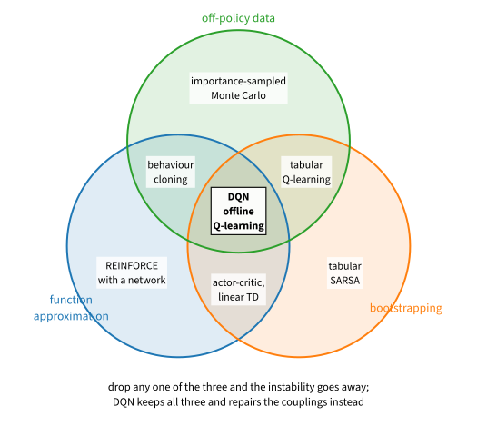
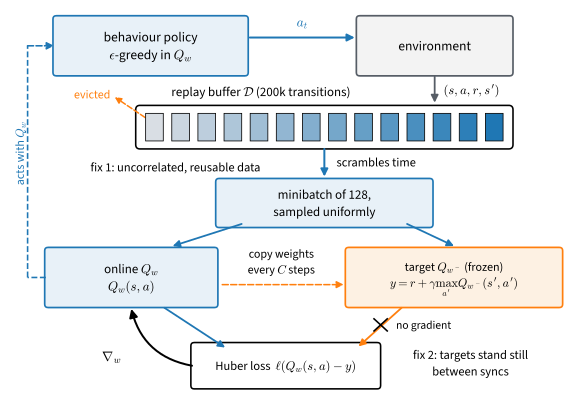
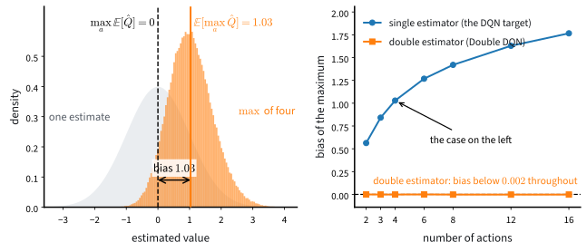

# Deep Q-Networks
:label:`sec_dqn`

:numref:`sec_deeprl` moved the policy-gradient family onto neural networks and closed with a precise account of why nothing broke: neither update chased its own output. The policy update was genuine stochastic gradient descent on a stationary objective, and the critic was supervised regression on targets computed from data. This section performs the same swap on Q-learning, whose target contains the very function being trained, and things break immediately: the plain recipe does not merely learn slowly, it drives its own value estimates past $10^8$ on every seed we run. Making the combination work takes two specific inventions, a *replay buffer* and a *target network*, and the algorithm that assembles them is the Deep Q-Network, DQN, whose Atari results started the modern deep reinforcement learning era :cite:`mnih2013playing,mnih2015human`. We build it at CartPole scale, break it on purpose, measure the upward bias its $\max$ plants in the values, and repair that too. You would rarely deploy vanilla DQN today; its failure modes are the clearest lessons deep reinforcement learning has to teach, and that is why it is here.

```{.python .input #dqn-deep-q-networks-1}
%%tab pytorch
%matplotlib inline
from d2l import torch as d2l
import gymnasium as gym
import numpy as np
import torch
from torch import nn
torch.set_num_threads(1)
```

```{.python .input #dqn-deep-q-networks-1}
%%tab jax
%matplotlib inline
from d2l import jax as d2l
from flax import nnx
import gymnasium as gym
import jax
from jax import numpy as jnp
import numpy as np
import optax
```

The laboratory is CartPole, discount $0.99$, as in :numref:`sec_actorcritic`, but the budget is stated in a different unit, and the unit is a position. Episodes are what the agent is graded on; environment steps are what it is billed for, and a budget in episodes grows without bound in exactly the quantity the agent is maximizing. Each run below gets $50{,}000$ environment steps, takes one gradient step per two environment steps, and stops, however many episodes that turns out to be. The Q-network maps a state to one value per action, so acting is one forward pass and an argmax.

```{.python .input #dqn-deep-q-networks-2}
%%tab pytorch, jax
gamma, num_env_steps, num_seeds = 0.99, 50_000, 3
buffer_size, batch_size, lr = 200_000, 128, 1e-3
train_freq, sync_every, warmup, grad_clip = 2, 250, 1_000, 10.0
epsilon = d2l.linear_schedule(1.0, 0.05, 10_000)
if tab.selected('pytorch'):
    def make_qnet():
        return nn.Sequential(nn.Linear(4, 128), nn.ReLU(),
                             nn.Linear(128, 128), nn.ReLU(),
                             nn.Linear(128, 2))
if tab.selected('jax'):
    def make_qnet(rngs):
        return nnx.Sequential(nnx.Linear(4, 128, rngs=rngs), jax.nn.relu,
                              nnx.Linear(128, 128, rngs=rngs), jax.nn.relu,
                              nnx.Linear(128, 2, rngs=rngs))
```

## Why This One Breaks

### A semi-gradient is not the gradient of anything

Replace the table of :numref:`sec_qlearning` by a network $Q_w$ and the update stays what it was, a semi-gradient step toward the bootstrapped target. Sample transitions $(s, a, r, s')$, form

$$y = r + \gamma\, \big(1 - \mathbf{1}(s' \textrm{ terminal})\big) \max_{a'} Q_w(s', a'),$$

hold $y$ fixed, and take one optimizer step on the regression loss between $Q_w(s, a)$ and $y$. Unlike the policy-gradient loss of :numref:`sec_deeprl`, this loss is ordinary supervised regression, and a falling value does mean the network is fitting its targets. It does not mean the targets are right, and that gap is where the section lives. The tabular update earned its trust as a stochastic approximation of the Bellman contraction of :numref:`sec_valueiter`, moving the table on average the way value iteration would (:numref:`sec_qlearning`). With function approximation that argument dies: each step now projects the backup onto whatever the network can represent, the projection is taken under the visitation distribution of the data, and the composition of backup and projection is no longer a contraction. With linear features, bootstrapping, and a data distribution that is not the target policy's own, the iteration can diverge outright :cite:`Tsitsiklis.VanRoy.1997`.

### Correlated data

The first new coupling is in the data. Consecutive transitions of an episode are near-duplicates, the cart a centimeter over, the pole a degree further, and stochastic gradient descent wants something like independent draws. Fed the raw stream, the network overfits whatever corner of the state space this minute of experience lives in, and, because an update moves every state at once (:numref:`fig_rl_table_vs_network`), it overwrites what it knew about the rest. A table could not do this: its updates touched one entry, so a correlated stream merely revisited entries. Generalization is what turned data correlation from an inefficiency into a failure mode.

### Moving targets

The second coupling is in the targets. The target $y$ contains $Q_w$, so every optimizer step moves the network and the regression surface at once. This too was survivable before: the actor-critic's critic chased a doubly moving target and lived, because every batch was fresh, drawn from the current policy at exactly the states where the critic's errors mattered, so wherever the critic drifted, the next batch audited it. That protection is what this section spends. The whole point of the buffer we are about to introduce is to train on old data, and old data audits nothing: an error can compound through the bootstrap for thousands of updates before the behavior policy ever revisits the states that would expose it.

### The deadly triad

Name the three ingredients: *function approximation*, *bootstrapping*, and *off-policy data*. Every corner of the resulting map is an algorithm this book has already taught, which is the content of :numref:`fig_rl_deadly_triad`. Drop function approximation and you have tabular Q-learning, convergent under the conditions of :numref:`sec_qlearning`. Drop bootstrapping and you have REINFORCE with a network, Monte Carlo targets and true gradients, the safe side of :numref:`sec_deeprl`'s line. Drop off-policy data and you have SARSA or the actor-critic, bootstrapped and approximate but audited by fresh data every batch, though audited is not guaranteed: nonlinear on-policy bootstrapping can still diverge, and each corner's convergence argument carries its own step-size, coverage and representation conditions. Keep all three and you have what Sutton and Barto named the *deadly triad* :cite:`Sutton.Barto.2018,vanHasselt.Doron.Strub.ea.2018`: no convergence guarantee survives, and the failure is not noise, not a bad learning rate, and not deep networks being temperamental. The classic demonstration is Baird's counterexample :cite:`Baird.1995`, a seven-state problem that sits in the center of the figure alongside DQN itself, and it is small enough to run in full. Every reward is zero, so the true value of every state is zero, and the linear features below can represent that answer exactly, with $w = 0$. The updates are *expected* temporal-difference updates, no sampling noise anywhere, applied with equal weight to all seven states, the off-policy part, while the policy being evaluated always jumps to the seventh state:

```{.python .input #dqn-the-deadly-triad}
%%tab pytorch, jax
w = np.ones(8)                             # eight weights for seven states
w[6] = 10.0                                # the classic starting point
Phi = np.zeros((7, 8))                     # linear values v = Phi w
Phi[:6, :6], Phi[:6, 7] = 2 * np.eye(6), 1.0   # v(i) = 2 w_i + w_8
Phi[6, 6], Phi[6, 7] = 1.0, 2.0                # v(7) = w_7 + 2 w_8
sup = []
for _ in range(1000):
    v = Phi @ w                            # every reward is 0
    delta = gamma * v[6] - v               # the next state is always state 7
    w += 0.01 * (delta[:, None] * Phi).mean(0)   # uniform state weighting
    sup.append(np.abs(w).max())
print(f'sup norm of w after 0, 500, 1000 sweeps: 10, {sup[499]:.0f}, '
      f'{sup[-1]:.0f}; the value the weights claim for state 7: '
      f'{(Phi @ w)[6]:.0f}, true value 0')
d2l.plot(np.arange(1, 1001), sup, 'sweeps over all seven states',
         'sup norm of w', yscale='log')
```

The weights grow without bound, the straight line on the logarithmic axis saying the growth is exponential: after a thousand sweeps the sup norm has gone from $10$ to $335$ and the claimed value of state 7 is $677$, in a problem whose every true value is $0$ and whose correct weights are representable. Nothing is estimated, nothing is sampled, and no learning rate fixes it; shrinking the step only slows the doubling. The divergence is a property of the composed operator, projection under the wrong distribution plus bootstrapped backup, exactly the combination :cite:`Tsitsiklis.VanRoy.1997` indicts; reweight the same updates by the evaluated policy's own visitation and they converge (exercise 7 investigates which repairs help). This is the cliff DQN walks beside. The two inventions that follow remove no corner of the triad; they weaken the couplings enough that, on most problems, the walk succeeds.


:label:`fig_rl_deadly_triad`

## The Two Repairs

:numref:`fig_rl_dqn_dataflow` draws the whole machine; the two subsections that follow walk its two ideas.

![Deep Q-learning as a data flow. The behavior policy acts with the online network; transitions enter the replay buffer, and uniformly sampled minibatches scramble time, which makes the data nearly independent and reusable. The regression target is computed by a frozen copy of the network, refreshed every $C$ steps, so the targets stand still between syncs. The gradient flows along exactly one path, into the online network; the marked edge from the frozen copy carries no gradient. The drawn buffer is full and evicting its oldest entries, the steady state of a long run; in this section's runs the 50,000-step budget never fills the 200,000-slot ring, so nothing is evicted.](../img/mdl-rl-dqn-dataflow.svg)
:label:`fig_rl_dqn_dataflow`

### Replay, and the off-policy license

The repair for correlation is the *replay buffer* :cite:`Lin.1992`: store the stream in a large ring, train on minibatches drawn from it uniformly at random. Sampling scrambles time, so a minibatch mixes this minute's transitions with transitions from long-dead versions of the policy, and every transition is reused many times instead of once. The license to do this was planted in :numref:`sec_qlearning` and is the organizing question of :numref:`sec_offline`: the Q-learning target for $(s, a, r, s')$ never mentions the policy that chose $a$, so a transition collected by any policy is a valid sample of the same backup. The buffer is that license, exercised at scale.

```{.python .input #dqn-replay-and-the-off-policy-licence}
%%tab pytorch, jax
class ReplayBuffer:  #@save
    """A ring of transitions in preallocated numpy; sample() returns a Batch."""
    def __init__(self, capacity, obs_dim):
        self.obs = np.zeros((capacity, obs_dim), np.float32)
        self.act = np.zeros(capacity, np.int64)
        self.rew = np.zeros(capacity, np.float32)
        self.next_obs = np.zeros((capacity, obs_dim), np.float32)
        self.term = np.zeros(capacity, np.float32)
        self.capacity, self.size, self.ptr = capacity, 0, 0

    def add(self, obs, act, rew, next_obs, term):
        i = self.ptr
        self.obs[i], self.act[i], self.rew[i] = obs, act, rew
        self.next_obs[i], self.term[i] = next_obs, term
        self.ptr, self.size = (i + 1) % self.capacity, min(self.size + 1,
                                                           self.capacity)

    def __len__(self):
        return self.size

    def sample(self, batch_size, rng):
        i = rng.integers(self.size, size=batch_size)
        return d2l.Batch(self.obs[i], self.act[i], self.rew[i],
                         self.next_obs[i], self.term[i],
                         np.array([batch_size]))
```

Two notes on the container. First, capacity: $200{,}000$ transitions against a $50{,}000$-step budget, so in our runs nothing is ever evicted and the network never forgets what failure looks like; shrink the capacity far enough and it does, which is exercise 4. Second, what `sample` returns is a `Batch` whose episode structure is gone, one pseudo-boundary standing where `ep_ends` carried real ones. That is the point, and it prices what replay gives up: of the estimators the `Batch` carries, `reward_to_go` and `gae` need intact episodes and are meaningless here, while `td_target` needs only the transition itself. One-step bootstrapping is precisely the estimator that survives the scramble, which is why the value family and the replay buffer belong together, and the target below is literally `batch.td_target`, the same call the actor-critic's critic makes. "Replay is legitimate because the target does not mention the collector" stops being a slogan and becomes a line of code.

### The target network

The repair for moving targets is the *target network* :cite:`mnih2015human`: a frozen copy $Q_{w^-}$ of the online network computes every bootstrap,

$$y = r + \gamma\, \big(1 - \mathbf{1}(s' \textrm{ terminal})\big) \max_{a'} Q_{w^-}(s', a'),$$
:eqlabel:`eq_dqn_target`

and the copy is synchronized to the online weights, $w^- \leftarrow w$, every $C$ steps, here every $250$. Between syncs the regression surface stands still and the network is doing supervised learning against fixed targets; the feedback loop still exists, but it turns once per sync instead of once per gradient step. Note which choice this reverses. The critic of :numref:`sec_actorcritic` recomputed its bootstrap from the newest weights at every pass, maximal tracking, affordable because fresh on-policy data audited the result; that section closed by predicting that once replay takes the freshness away, the choice would flip. Here is the flip: having given up the audit, DQN gives up tracking too, and buys stability with staleness.

The update itself is a regression step with two guards, whose division of labor deserves to be stated precisely. The Huber loss behaves like the squared error near zero and the absolute error far from it, so it caps the *residual multiplier*, the derivative of the loss with respect to the prediction; a transition's gradient with respect to the parameters also carries the factor $\nabla_w Q_w(s, a)$, which Huber cannot bound. The global norm clip is the second stage, bounding the parameter update that any batch can take at once; the moment after a sync, when every target in the batch jumps together, is exactly when that matters.

```{.python .input #dqn-the-target-network-1}
%%tab pytorch
def q_values(qnet, obs):
    """The acting forward: numpy in, numpy out, no gradient recorded."""
    with torch.inference_mode():
        return qnet(torch.as_tensor(obs)).numpy()

def fit_q(qnet, opt, batch, y):
    """One clipped Huber regression step of Q_w(s, a) toward the fixed y."""
    pred = qnet(torch.as_tensor(batch.obs)).gather(
        -1, torch.as_tensor(batch.act)[:, None]).squeeze(-1)
    loss = nn.functional.huber_loss(pred, torch.as_tensor(y))
    opt.zero_grad()
    loss.backward()
    nn.utils.clip_grad_norm_(qnet.parameters(), grad_clip)
    opt.step()

def q_step(qnet, target, opt, batch):
    """The DQN update: the critic's own td_target, bootstrapped by the copy."""
    fit_q(qnet, opt, batch, batch.td_target(
        lambda s: q_values(target, s).max(-1), gamma))
```

```{.python .input #dqn-the-target-network-1}
%%tab jax
def fit_q(qnet, opt, obs, act, y):
    """One Huber regression step of Q_w(s, a) toward the fixed y; traced
    inside the jitted steps, with the norm clip in the optimizer chain."""
    _, grads = nnx.value_and_grad(lambda q: optax.huber_loss(
        jnp.take_along_axis(q(obs), act[:, None], -1).squeeze(-1),
        y).mean())(qnet)
    opt.update(qnet, grads)

@nnx.jit
def q_step(qnet, target, opt, obs, act, rew, next_obs, term):
    """The DQN update. The target line is Batch.td_target's expression,
    computed inside the compiled step (:numref:`sec_compilation`)."""
    fit_q(qnet, opt, obs, act,
          rew + gamma * (1 - term) * target(next_obs).max(-1))

_q_forward, _cached = nnx.jit(lambda net, obs: net(obs)), {}

def q_values(qnet, obs):
    """The acting forward: compiled once, module traversal cached, because
    the loop below calls it once per environment step."""
    if id(qnet) not in _cached:
        _cached[id(qnet)] = nnx.cached_partial(_q_forward, qnet)
    return np.asarray(_cached[id(qnet)](jnp.asarray(obs)))
```

The two tabs split one hairline. The pytorch update literally calls `batch.td_target`, the structural thesis in a single line; the jax update runs a couple of hundred thousand times and is compiled, and a compiled function cannot call back into a numpy method, so it computes the same expression inline (:numref:`sec_compilation`). The next cell certifies that "the same expression" is not a figure of speech, on a buffer filled by a random policy through the `rollout` helper both chapters share:

```{.python .input #dqn-the-target-network-2}
%%tab pytorch
rng, env = np.random.default_rng(0), gym.make('CartPole-v1')
env.reset(seed=0)
data = d2l.rollout(env, lambda s, r: int(r.integers(2)), 20, rng)
buffer = ReplayBuffer(buffer_size, 4)
for i in range(len(data)):
    buffer.add(data.obs[i], data.act[i], data.rew[i],
               data.next_obs[i], data.term[i])
b = buffer.sample(batch_size, rng)
torch.manual_seed(0)
tnet = make_qnet()
with torch.inference_mode():
    y = (torch.as_tensor(b.rew) + gamma * (1 - torch.as_tensor(b.term))
         * tnet(torch.as_tensor(b.next_obs)).max(-1).values).numpy()
print(np.allclose(y, b.td_target(lambda s: q_values(tnet, s).max(-1), gamma)))
```

```{.python .input #dqn-the-target-network-2}
%%tab jax
rng, env = np.random.default_rng(0), gym.make('CartPole-v1')
env.reset(seed=0)
data = d2l.rollout(env, lambda s, r: int(r.integers(2)), 20, rng)
buffer = ReplayBuffer(buffer_size, 4)
for i in range(len(data)):
    buffer.add(data.obs[i], data.act[i], data.rew[i],
               data.next_obs[i], data.term[i])
b = buffer.sample(batch_size, rng)
tnet = make_qnet(nnx.Rngs(0))
y = np.asarray(jnp.asarray(b.rew) + gamma * (1 - jnp.asarray(b.term))
               * tnet(jnp.asarray(b.next_obs)).max(-1))
print(np.allclose(y, b.td_target(lambda s: q_values(tnet, s).max(-1), gamma)))
```

Now the training loop, and it is short because everything it needs already exists: `epsilon_greedy` and `linear_schedule` from :numref:`sec_qlearning`, the buffer and step above. One switch controls the experiment of this section. With `use_target=True` the copy refreshes every `sync_every` steps; with `use_target=False` it refreshes every step, which makes the copy the online network in all but name, the naive recipe with no target network at all. The generator yields, at every episode's end, the step count, the episode's return, and one diagnostic we will need later: the network's value estimate $\max_a Q_w(s_0, a)$ at the centered start state $s_0 = \mathbf{0}$.

```{.python .input #dqn-the-target-network-3}
%%tab pytorch
def train_dqn(seed, qnet, use_target=True, step=None):
    """DQN on CartPole; yields (env step, episode return, max_a Q(s0, a))."""
    step = q_step if step is None else step
    rng, env = np.random.default_rng(seed), gym.make('CartPole-v1')
    target = make_qnet()
    target.load_state_dict(qnet.state_dict())
    opt = torch.optim.Adam(qnet.parameters(), lr=lr)
    buffer, s0 = ReplayBuffer(buffer_size, 4), np.zeros(4, np.float32)
    obs, ep_return = env.reset(seed=seed)[0], 0.0
    sync = sync_every if use_target else 1
    for t in range(1, num_env_steps + 1):
        a = d2l.epsilon_greedy(q_values(qnet, obs), epsilon(t), rng)
        next_obs, rew, terminated, truncated, _ = env.step(a)
        buffer.add(obs, a, rew, next_obs, float(terminated))
        obs, ep_return = next_obs, ep_return + rew
        if terminated or truncated:
            yield t, ep_return, q_values(qnet, s0).max()
            obs, ep_return = env.reset()[0], 0.0
        if len(buffer) >= warmup and t % train_freq == 0:
            step(qnet, target, opt, buffer.sample(batch_size, rng))
        if t % sync == 0:
            target.load_state_dict(qnet.state_dict())
```

```{.python .input #dqn-the-target-network-3}
%%tab jax
def train_dqn(seed, qnet, use_target=True, step=None):
    """DQN on CartPole; yields (env step, episode return, max_a Q(s0, a)).
    The jitted step's module traversal is cached once per run."""
    step = q_step if step is None else step
    rng, env = np.random.default_rng(seed), gym.make('CartPole-v1')
    target = nnx.clone(qnet)
    opt = nnx.Optimizer(qnet, optax.chain(
        optax.clip_by_global_norm(grad_clip), optax.adam(lr)), wrt=nnx.Param)
    step_fn = nnx.cached_partial(step, qnet, target, opt)
    buffer, s0 = ReplayBuffer(buffer_size, 4), np.zeros(4, np.float32)
    obs, ep_return = env.reset(seed=seed)[0], 0.0
    sync = sync_every if use_target else 1
    for t in range(1, num_env_steps + 1):
        a = d2l.epsilon_greedy(q_values(qnet, obs), epsilon(t), rng)
        next_obs, rew, terminated, truncated, _ = env.step(a)
        buffer.add(obs, a, rew, next_obs, float(terminated))
        obs, ep_return = next_obs, ep_return + rew
        if terminated or truncated:
            yield t, ep_return, q_values(qnet, s0).max()
            obs, ep_return = env.reset()[0], 0.0
        if len(buffer) >= warmup and t % train_freq == 0:
            b = buffer.sample(batch_size, rng)
            step_fn(jnp.asarray(b.obs), jnp.asarray(b.act),
                    jnp.asarray(b.rew), jnp.asarray(b.next_obs),
                    jnp.asarray(b.term))
        if t % sync == 0:
            nnx.update(target, nnx.state(qnet, nnx.Param))
```

Note what the buffer stores: `terminated`, never `truncated`. A CartPole episode cut off at 500 steps ends in a state with a future, and :numref:`sec_qlearning` established that masking the bootstrap there teaches the network that surviving is worthless; exercise 2 traces exactly what would go wrong.

### The ablation

Three seeds per arm, everything identical except the switch. The networks are caller-owned, as in :numref:`sec_actorcritic`, so later cells can audit the trained agents:

```{.python .input #dqn-the-ablation-1}
%%tab pytorch, jax
if tab.selected('pytorch'):
    def new_qnet(seed):
        torch.manual_seed(seed)
        return make_qnet()
if tab.selected('jax'):
    def new_qnet(seed):
        return make_qnet(nnx.Rngs(seed))

arms = ('DQN', 'no target network')
qnets = {arm: [new_qnet(seed) for seed in range(num_seeds)] for arm in arms}
runs = {arm: [list(train_dqn(seed, qnets[arm][seed],
                             use_target=arm == 'DQN'))
              for seed in range(num_seeds)] for arm in arms}
```

Each run yields one tuple per episode, and seeds finish different numbers of episodes, so the right x axis is the one the budget is written in. We resample every curve onto a common grid of environment steps and plot the seed bands:

```{.python .input #dqn-the-ablation-2}
%%tab pytorch, jax
grid = np.arange(1, num_env_steps // 1000 + 1) * 1000

def on_grid(arm, col):
    """Resample each seed's per-episode series onto the env-step grid."""
    return np.stack([np.interp(grid, np.asarray(r)[:, 0], np.asarray(r)[:, col])
                     for r in runs[arm]])

d2l.plot_curves({arm: on_grid(arm, 1) for arm in runs},
                xlabel='thousand environment steps',
                ylabel='return of the behavior policy', smooth=5,
                reference=500)
```

The two arms differ in one boolean and end in different worlds. With the target network, every seed climbs from the random policy's return of about 20 into the hundreds, and the strongest stretches approach the 500 ceiling; none settles there, and the curve says so more plainly than any summary number can. The average climbs, falls back, grinds sideways, and recovers, with the band across seeds wide the whole way. Note also that the *behavior* curve could not sit at 500 even if the policy were perfect, since it keeps paying the $\epsilon$ floor of $0.05$, a forced random action every twenty steps; separating the policy from its exploration tax is what the greedy evaluation below is for. Without the target network, returns rise briefly while $\epsilon$ is large and random exploration props up the buffer, then collapse to a pole that falls over immediately and never recover: the network chases its own targets into a self-confirming collapse, and because the greedy policy is derived from the same broken network, the new data it collects confirms the collapse rather than correcting it. This ablation, unlike the numbers above it, comes out the same way on every seed we run, in both framework tabs.

Because the return keeps falling off its peaks and climbing back, the summary statistic you choose matters more than it should, and the next cell computes the candidates rather than asserting them. For each seed we take every trailing 20-episode average the run contains, and report the best one, the final one, and the one the run would have reported had we stopped it fifty episodes earlier:

```{.python .input #dqn-the-ablation-3}
%%tab pytorch, jax
def windows(returns, k=20):
    """All trailing k-episode averages of a run, in order."""
    return np.convolve(returns, np.ones(k) / k, 'valid')

for arm in runs:
    w = [windows(np.asarray(r)[:, 1]) for r in runs[arm]]
    best = np.array([x.max() for x in w])
    final = np.array([x[-1] for x in w])
    early = np.array([x[-51] for x in w])
    print(f'{arm:>18}: best 20-episode window per seed {np.round(best)}\n'
          f'{"":>18}  final window {np.round(final)} '
          f'(spread {np.ptp(final):.0f}); '
          f'fifty episodes earlier {np.round(early)}')
```

Read the DQN line against the curve. The final window measures where a run happened to be in its climb-and-fall cycle when we stopped it: it moves by well over a hundred points from seed to seed, and the third statistic shows it would have moved again had we stopped fifty episodes earlier. The best window is no report either: picking the best stretch after watching the whole run is optimistic selection, a bias that grows with run length and noise, and printing its per-seed spread does not remove it. Both windows are descriptive statistics of the training curve, good for describing the churn and for nothing else. The statistic to *report* is predeclared before the run: a fixed budget, here $50{,}000$ steps, and a separate evaluation of the policy that budget bought, which is exactly what the next cell computes. This is not a CartPole quirk; deep reinforcement learning results are notoriously sensitive to when you stop measuring, and a predeclared budget with a separate evaluation is the defense.

The behavior return also mixes two things, the policy's quality and the exploration tax. The fixed-budget greedy evaluation below removes both problems at once: at the end of the predeclared budget it runs the greedy policy with no exploration at all, and it is the number this section reports as each run's result:

```{.python .input #dqn-the-ablation-4}
%%tab pytorch, jax
env = gym.make('CartPole-v1')
for arm in arms:
    for seed in range(num_seeds):
        env.reset(seed=100 + seed)
        qnet = qnets[arm][seed]
        score = d2l.evaluate(env, lambda s, r: int(q_values(qnet, s).argmax()),
                             num_episodes=100)
        print(f'{arm:>18}, seed {seed}: greedy return over 100 episodes '
              f'{score:.0f}')
```

Stripped of the tax, some seeds evaluate at the full 500, a number the taxed behavior curve cannot reach: those policies were better than their training returns made them look. Others land far below their own recent training returns, and the exceptions teach the sharper lesson: a greedy policy read off the final weights is itself a snapshot of the cycle, and a seed caught mid-stumble evaluates at a fraction of its neighbors, in a run whose value estimates look no different. Across our tabs and seeds the greedy evaluations span roughly 90 to 500. The ablated arm evaluates at a pole that falls immediately, on every seed.

That last contrast, similar values and dissimilar policies, deserves to be shown rather than asserted. The training loop logged $\max_a Q_w(s_0, a)$ at the centered start state all along. Which number should the trace approach? Read the objective off the update itself. The buffer masks the bootstrap on `terminated` only, so the targets bootstrap straight through the 500-step time limit, and the state vector carries no clock; the function being fitted is therefore the value of balancing *forever*, the continuing formulation, in which the time limit is a data-collection boundary and not part of the task, one of the two standard readings of time limits in deep reinforcement learning and the one this code defines. Under it, a policy that never drops the pole is worth $1/(1 - \gamma) = 100$ from the start, drawn dashed:

```{.python .input #dqn-the-ablation-5}
%%tab pytorch, jax
ceiling = 1 / (1 - gamma)
d2l.plot_curves({'DQN': on_grid('DQN', 2)},
                xlabel='thousand environment steps',
                ylabel='value estimate at the start state',
                reference=ceiling)
print(f'continuing-task ceiling: {ceiling:.0f}; the no-target arm ends at ' +
      ', '.join(f'{np.asarray(r)[-1, 2]:.0e}' for r in
                runs['no target network']))
```

The trace rises smoothly into the neighborhood of the ceiling and stays on that scale, within tens of points across tabs and seeds, while the same runs' return curves churn: the values are converging, and converging to the ceiling's scale, so nothing here is diverging. One scope note travels with that sentence: the trace probes a single state, $s_0$; it is a sentinel, not a certificate that every Q-value is stable or accurate. What churns is the greedy policy read off those values, which can flip between balancing the pole and dropping it on a change too small to see in the value estimates at all. Hold the two magnitudes side by side: a healthy arm ending near $10^2$, the scale the objective dictates, and an ablated arm ending past $10^8$ in the same code. And look closely at which side of the dashed line the healthy seeds land on. A trace below the ceiling is consistent with an imperfect greedy policy, whose true value is below a perfect one's; but under the continuing objective the update defines, no policy of any quality is worth more than $1/(1 - \gamma) = 100$ from the start, so a seed that settles *above* the line is claiming what cannot be earned, and across our tabs and seeds, some do. That lean is overestimation, and it is the last phenomenon this section measures.

## Overestimation

### The max bias, measured

The target :eqref:`eq_dqn_target` takes a maximum over *estimated* values, and a maximum over noisy estimates is biased upward: $E[\max_{a'} \hat{Q}(s', a')] \geq \max_{a'} E[\hat{Q}(s', a')]$, with strict inequality whenever the noise can change which action wins. :numref:`sec_qlearning` sighted this bias on a table, four of five converged estimates of one entry leaning above the truth and none below, and :numref:`sec_regularized` located the operator on a dial: the hard $\max$ is the $\beta \to 0$ corner of the soft backup, and everything the soft version smooths, the corner inherits, including this. The effect was first analyzed for exactly our setting, function approximation feeding its own noise through a $\max$ :cite:`Thrun.Schwartz.1993`, and it takes six lines to measure. Give four actions the same true value of zero, estimate each with unit noise, and take the max; then let one set of estimates *select* the action and an independent set *evaluate* it, the double estimator of :cite:`vanHasselt.2010`:

```{.python .input #dqn-the-max-bias-measured}
%%tab pytorch, jax
rng = np.random.default_rng(0)
est = rng.standard_normal((100_000, 4))     # four values, all truly zero
second = rng.standard_normal((100_000, 4))  # an independent second estimate
sel = est.argmax(1)
print(f'single estimator, E[max of the estimates]: {est.max(1).mean():.3f}')
print(f'select with one, evaluate with the other: '
      f'{second[np.arange(100_000), sel].mean():+.3f}')
```

One unit of bias from nothing but noise and a $\max$; the double estimator removes essentially all of it, because the evaluator's noise is independent of the selector's and averages to zero whatever the selector picks. :numref:`fig_rl_max_bias` extends the measurement: the bias grows with the number of actions, and the double estimator stays flat. In tabular Q-learning the lean fades as the noise does, and online interaction keeps auditing it. In DQN it is a design problem: generalization broadcasts every inflated estimate into the targets of every state, and replay lets the inflation compound before any audit arrives. :numref:`sec_offline` will meet the same bias with the audit removed entirely, where it becomes the central obstacle.


:label:`fig_rl_max_bias`

### Double DQN in three lines

The double estimator wants two networks, and DQN already maintains two. Double DQN :cite:`Hasselt.Guez.Silver.2016` splits the two jobs the $\max$ performs across them: the online network selects the action, the frozen copy evaluates it,

$$y = r + \gamma\, \big(1 - \mathbf{1}(s' \textrm{ terminal})\big)\ Q_{w^-}\big(s',\ \underset{a'}{\mathrm{argmax}}\ Q_w(s', a')\big).$$
:eqlabel:`eq_double_dqn`

An action the online network has overrated is no longer scored by the same overrated number. The copy is not independent of the online network, so this is the double estimator's idea rather than its letter, but it costs nothing, the two forwards were already being computed, and the swap against `q_step` is three lines:

```{.python .input #dqn-double-dqn-in-three-lines-1}
%%tab pytorch
def q_step_double(qnet, target, opt, batch):
    """q_step with selection split from evaluation, eq_double_dqn."""
    sel = q_values(qnet, batch.next_obs).argmax(-1)
    fit_q(qnet, opt, batch, batch.td_target(
        lambda s: q_values(target, s)[np.arange(len(s)), sel], gamma))
```

```{.python .input #dqn-double-dqn-in-three-lines-1}
%%tab jax
@nnx.jit
def q_step_double(qnet, target, opt, obs, act, rew, next_obs, term):
    """q_step with selection split from evaluation, eq_double_dqn."""
    sel = qnet(next_obs).argmax(-1)
    fit_q(qnet, opt, obs, act, rew + gamma * (1 - term) * jnp.take_along_axis(
        target(next_obs), sel[:, None], -1).squeeze(-1))
```

The training loop takes the swapped step as an argument and changes nothing else, and the diagnostic that shows the effect is the one we have been logging all along:

```{.python .input #dqn-double-dqn-in-three-lines-2}
%%tab pytorch, jax
qnets['Double DQN'] = [new_qnet(seed) for seed in range(num_seeds)]
runs['Double DQN'] = [list(train_dqn(seed, qnets['Double DQN'][seed],
                                     step=q_step_double))
                      for seed in range(num_seeds)]
```

```{.python .input #dqn-double-dqn-in-three-lines-3}
%%tab pytorch, jax
d2l.plot_curves({arm: on_grid(arm, 2) for arm in ('DQN', 'Double DQN')},
                xlabel='thousand environment steps',
                ylabel='value estimate at the start state',
                reference=ceiling)
for arm in ('DQN', 'Double DQN'):
    print(f'{arm:>10}: final value estimate at s0, per seed: '
          f'{np.round([np.asarray(r)[-1, 2] for r in runs[arm]], 1)}')
```

Across our tab-seeds the double target's trace ends mostly below the plain target's, typically by a few points, with the largest pullbacks on the seeds that had drifted furthest above the ceiling; the seed bands overlap for most of training. That modesty is itself the prediction. CartPole has two actions, and the right panel of :numref:`fig_rl_max_bias` says the bias grows with the size of the action set: two actions is where the $\max$ has the least room to flatter itself. On Atari's eighteen actions the same three lines change scores decisively :cite:`Hasselt.Guez.Silver.2016`, and they matter most of all where audits are scarce, which is why the idea returns in :numref:`sec_offline`'s setting. The effect on CartPole *returns* is inside seed noise at this budget, and is not claimed.

## What Survived

### What came after

DQN turned out to be less a finished algorithm than a chassis, and its parts list has been iterated for a decade. The $n$-step target, reality for a few steps before the bootstrap, is free machinery now, since :numref:`sec_actorcritic` built the whole dial. Prioritized replay samples transitions in proportion to their TD error rather than uniformly :cite:`Schaul.Quan.Antonoglou.ea.2016`, a benefit that shrinks as buffers grow large and diverse. The dueling head decomposes $Q$ into a state value plus advantages :cite:`Wang.Schaul.Hessel.ea.2016`. Distributional heads regress the whole return distribution instead of its mean :cite:`Bellemare.Dabney.Munos.2017`; in the tabular and linear cases the induced expected update provably coincides with the ordinary one, so its benefit is an interaction with deep function approximation, and the distributional head has outlived DQN itself as a component of current agents. Rainbow bolted six of these onto the chassis and, valuably, published the ablation that measures each part's contribution :cite:`Hessel.Modayil.vanHasselt.ea.2018`. Most recently, PQN removed the chassis: with LayerNorm inside the network and batches gathered from parallel environments, plain deep Q-learning trains stably with *no replay buffer and no target network* :cite:`Gallici.Fellows.Ellis.ea.2025`. That result reframes this section. The two inventions were never commandments; they were one particular solution to a stability problem, and normalization plus decorrelated-by-parallelism data is another.

### The status of DQN today

For a discrete-action problem today you would reach first for PPO (:numref:`sec_ppo`), or for a modern value-based agent from the lineage above; vanilla DQN is rarely the tool. It is taught, here and everywhere, because it is the cleanest laboratory for the two failure modes that define deep value learning, targets that chase themselves and maxima that flatter themselves, and because its central license, learning from data the current policy did not collect, is load-bearing for everything that follows. The family also remains confined to discrete actions, since its policy is an argmax over the action set: :numref:`sec_deeprl` wrote that gravestone, and the deterministic-actor family described there is how this section's ideas reach continuous control. :numref:`sec_offline` now takes the license to its limit, a fixed dataset with no interaction at all, where every phenomenon measured here returns with the safety net removed.

## Summary

Q-learning with a network in place of the table keeps its semi-gradient update, and loses the stochastic-approximation argument that made the tabular version trustworthy: with function approximation, bootstrapping, and off-policy data, the deadly triad, the iteration can diverge, and Baird's seven-state counterexample diverges exponentially under exact expected updates with the true values representable. DQN weakens the couplings without removing a corner. The replay buffer scrambles time and reuses experience, legitimate because the target never mentions the collector; the sampled batch loses its episode structure, which prices the trade, since only the one-step bootstrap survives the scramble. The target network freezes the bootstrap between periodic syncs, reversing the actor-critic's fresh-target choice exactly where freshness was given up. On CartPole the ablation is binary: with the target network every seed learns, without it every seed's values diverge past $10^8$ while its policy collapses. The return curve churns even in the healthy arm, so the final window is a stopping-time lottery and the retrospective best window is optimistic selection; both are descriptive statistics of the curve, and the reported result is the fixed-budget greedy evaluation, taken separately from the exploration tax, which can tie the untaxed ceiling the behavior curve cannot reach and can also land far below it, on value changes too small to see. Because the update bootstraps through the time limit, the value it fits is the continuing one, capped at $1/(1 - \gamma) = 100$ from the start; the $\max$ in the target leans high, one unit of bias from four actions of unit noise, and traces settling above that bound claim value no policy can earn; Double DQN's three-line swap, select with the online network, evaluate with the frozen one, removes the bias exactly in the synthetic measurement and shifts the CartPole traces by the few points that a two-action $\max$ leaves at stake. What survived of DQN is its parts and its license: replay, the target trick, the bias repair, and off-policy value learning itself, which the next section pushes to a fixed dataset.

**What the experiments show, and what they do not.** Every run is seeded and budgeted in environment steps, $50{,}000$ per run, one gradient step per two steps; the Baird and max-bias cells are shared numpy and print identical digits in both framework tabs, and their numbers are exact properties of the constructions, quotable to the digit. The training runs are three seeds per arm per tab, and the two tabs initialize their networks from different distributions, so their curves and statistics differ seed by seed while supporting the same claims: the ablation's direction is tab-independent and seed-independent, the ablated values end past $10^8$ everywhere, and the healthy traces end within tens of points of the continuing ceiling of $100$, some above it. The best-window, final-window, and stopped-earlier statistics are printed per seed precisely because their spread is the finding; none of them is stable enough to quote as a single number, none is the reported result, and the prose treats them as descriptions of the curve. The greedy evaluations are 100 episodes each; reseeding them moves individual entries by tens of points without changing the span's shape. Double DQN's synthetic bias removal is exact and tab-identical; on the training traces it lowers the final value on most tab-seeds, typically by a few points and by more where a plain-target seed had overshot, and neither that nor its return effect clears churn noise at two actions, so the prose claims the direction and the scale, nothing finer. Single runs per configuration throughout: the compute belongs to readers.

## Exercises

1. [conceptual] *What survives the scramble.* A batch sampled from
   `ReplayBuffer` carries a fake episode boundary. For each of
   `td_target`, `reward_to_go`, and `gae`, state whether its value on such a
   batch is meaningful, and connect the pattern to the on-policy/off-policy
   split: why is the estimator that survives the scramble exactly the one
   whose target ignores the collector?
1. [conceptual] *Terminated, not done.* The buffer stores `float(terminated)`
   and never `truncated`. Recalling :numref:`sec_qlearning`'s masking
   discussion, describe precisely what the targets would teach the network
   about long CartPole episodes if `done` were stored instead, and why the
   damage would grow as the policy improves.
1. [short-code] *The sync period.* Rerun the target arm with
   `sync_every` in $\{50, 250, 2500\}$, one seed each. Distinguish two
   failure directions: does the bad end merely slow learning, or does it cap
   what the run reaches within the budget? Report fixed-budget greedy
   evaluations, with the best and final windows beside them as descriptions
   of the curve, and say why the distinction matters here of all places.
1. [short-code] *Shrink the buffer.* Set the capacity to 500 transitions and
   retrain one seed. Which of the two couplings does this reintroduce, what
   do the return curve and the $\max_a Q_w(s_0, a)$ trace look like, and why
   does the failure wait until the policy is good before it arrives?
1. [short-code] *Best against final, at scale.* Using only curves already
   logged by this section's cells and exercise 3's runs, no new training,
   collect the best-window and final-window statistics across every seed and
   arm. Which spread is a property of the algorithm and which is mostly a
   property of when you stopped looking, and why does a predeclared
   fixed-budget evaluation belong in a paper where neither window does?
1. [short-code] *Port it.* Move the section's code to `LunarLander-v3`.
   List every line that changes and every line that does not, then explain
   why the step budget is the one number you should expect to raise
   substantially. (Running the port to a strong policy takes roughly ten
   times this section's budget; the listing question is answerable without
   running at all.)
1. [extended] *Baird, with a target network.* Add a target network to the
   Baird cell: compute every $\delta$ from a frozen copy of $w$, synced every
   $k$ sweeps, for $k \in \{10, 100\}$. Does the iteration now converge,
   diverge more slowly, or diverge the same? Which corner of the triad did
   the target network actually remove, and what does the answer say about
   what DQN's second repair can and cannot buy?

[Discussions](https://d2l.discourse.group/)

<!-- slides -->

::: {.slide}
::: {.cover}
[Dive into Deep Learning · §15.4]{.kicker}

Deep Q-Networks<br>
**the triad, with a live counterexample · replay and the frozen copy · one boolean, two worlds · the max leans high, measured and repaired**
:::
:::

::: {.slide title="Why This One Breaks"}
The policy family survived the network swap; Q-learning's target
contains the function being trained:

$$y = r + \gamma\, \big(1 - \mathbf{1}(s' \textrm{ terminal})\big)
\max_{a'} Q_w(s', a')$$

- the tabular trust argument (stochastic approximation of a
  contraction) dies under projection onto a function class
  :cite:`Tsitsiklis.VanRoy.1997`
- the data arrive as a stream of near-duplicates, and one update
  now moves **every** state
- the critic of :numref:`sec_actorcritic` survived its moving
  target because fresh data audited it; replay spends exactly
  that protection
:::

::: {.slide title="The Deadly Triad"}
Function approximation + bootstrapping + off-policy data
:cite:`Sutton.Barto.2018,vanHasselt.Doron.Strub.ea.2018`.
Every region is an algorithm already taught:

{width=72%}
:::

::: {.slide title="Baird's Counterexample, Live"}
Seven states, every true value $0$, and $w = 0$ can say so.
Expected updates, no noise, uniform (off-policy) weighting:

@!dqn-the-deadly-triad

. . .

Exponential divergence, and no learning rate fixes it: a property
of the composed operator :cite:`Baird.1995`, not of sampling.
:::

::: {.slide title="The Two Repairs"}
{width=88%}
:::

::: {.slide title="Replay, and the Off-Policy Licence"}
@dqn-replay-and-the-off-policy-licence

. . .

- the target never mentions who collected the transition: any
  policy's data is valid (:numref:`sec_qlearning`)
- the sampled `Batch` has **no episode structure left**:
  `reward_to_go` and `gae` die, `td_target` survives; one-step
  bootstrapping is the estimator built for the scramble
- capacity 200k against a 50k budget: nothing evicted here
:::

::: {.slide title="The Target Network"}
$$y = r + \gamma\, \big(1 - \mathbf{1}(s' \textrm{ terminal})\big)
\max_{a'} Q_{w^-}(s', a'), \qquad w^- \leftarrow w
\textrm{ every } C \textrm{ steps}$$

Between syncs the regression surface stands still.

. . .

:numref:`sec_actorcritic`'s critic refreshed its bootstrap every
pass, because fresh data audited it. Replay removes the audit, so
DQN reverses the choice: stability bought with staleness. The
`use_target=False` arm syncs every step, the naive recipe in all
but name.
:::

::: {.slide title="The Training Loop"}
@dqn-the-target-network-3

. . .

Budgeted in **environment steps** (50k, one gradient step per
two); `epsilon_greedy` and `linear_schedule` reused from
:numref:`sec_qlearning`; the buffer stores `terminated`, never
`truncated`.
:::

::: {.slide title="One Boolean, Two Worlds"}
@!dqn-the-ablation-2

. . .

With the copy: every seed climbs into the hundreds, the strongest
stretches near the ceiling, nothing settles. Without: collapse to
a pole that falls immediately, values past $10^8$, every seed,
both tabs. The greedy policy collects data that confirms its own
collapse.
:::

::: {.slide title="The Wrong Statistics"}
@!dqn-the-ablation-3

. . .

The final window measures where the climb-and-fall cycle happened
to be when we stopped: well over a hundred points of spread across
seeds, and fifty episodes earlier it read differently. The *best*
window is optimistic selection after the fact. Both describe the
curve; **the report is the fixed-budget greedy evaluation**.
:::

::: {.slide title="Converging Values, Churning Policy"}
@!dqn-the-ablation-5

. . .

The trace converges to roughly the right number; nothing
diverges (one probe state: a sentinel, not a certificate). What
churns is the **greedy policy read off those values**: greedy
evaluations span 90 to 500 across tab-seeds, some tying the
untaxed ceiling, some caught mid-stumble, on value changes too
small to see. The update bootstraps through the time limit, so
the objective it defines is the continuing one: no policy is
worth more than $1/(1-\gamma) = 100$ from the start. A seed
settling above the line claims what cannot be earned, and across
tabs and seeds, some do.
:::

::: {.slide title="The Max Leans High"}
@!dqn-the-max-bias-measured

. . .

One unit of bias from noise and a $\max$
:cite:`Thrun.Schwartz.1993`; the double estimator removes it
:cite:`vanHasselt.2010`. The hard $\max$ is the
$\beta \to 0$ corner of :numref:`sec_regularized`'s soft backup.

{width=90%}
:::

::: {.slide title="Double DQN in Three Lines"}
Select with the online network, evaluate with the frozen one
:cite:`Hasselt.Guez.Silver.2016`:

@dqn-double-dqn-in-three-lines-1

. . .

@!dqn-double-dqn-in-three-lines-3

Most tab-seeds end lower, typically by a few points: two actions
is where the $\max$ has least room to flatter itself, which is
panel (b)'s prediction. At Atari's eighteen actions the same
three lines change scores decisively.
:::

::: {.slide title="What Survived"}
- $n$-step targets: free, :numref:`sec_actorcritic` built the dial
- prioritized replay :cite:`Schaul.Quan.Antonoglou.ea.2016`,
  dueling :cite:`Wang.Schaul.Hessel.ea.2016`, distributional
  heads :cite:`Bellemare.Dabney.Munos.2017`; Rainbow's measured
  ablation :cite:`Hessel.Modayil.vanHasselt.ea.2018`
- PQN :cite:`Gallici.Fellows.Ellis.ea.2025`: LayerNorm + parallel
  environments, **no buffer, no target network**. The two fixes
  were one solution to a stability problem, not commandments.
- today: PPO or a modern value agent; DQN is the laboratory where
  the failure modes are clearest. Next: the license at its limit,
  :numref:`sec_offline`.
:::
