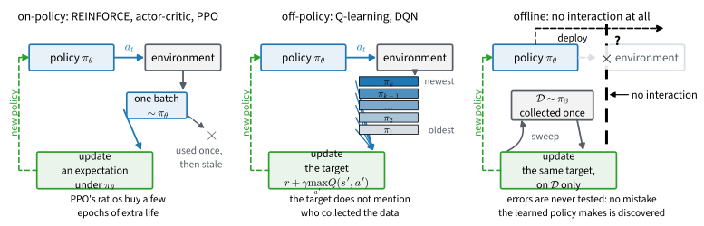
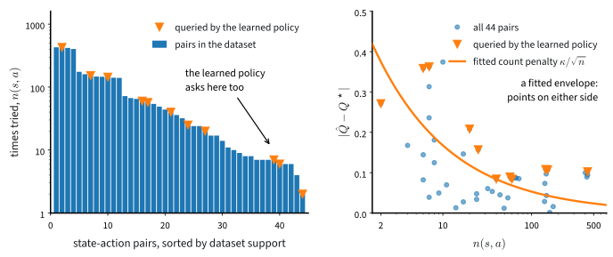

# Which Data May Drive Which Update
:label:`sec_offline`

Every algorithm in these two chapters answers one question differently: which data may drive which update? :numref:`sec_ppo` threw each batch away after a few reuse epochs, while the deep Q-network of :numref:`sec_dqn` trained happily on transitions collected by policies that no longer exist. That difference is not a matter of taste. This section states the rule behind it, lets SARSA flip the answer with a single symbol, and then pushes the question to its limit: no interaction at all, one fixed dataset, the *offline* setting. Learning then fails in a specific, measurable way, and on the one environment in either chapter whose true optimum we can compute, we will measure the failure against that optimum and repair it with the count-shrinking radius of :numref:`sec_qlearning`'s exploration bonus, sign flipped.

```{.python .input #offline-rl-which-data-may-drive-which-update}
%%tab pytorch
%matplotlib inline
from d2l import torch as d2l
import gymnasium as gym
import numpy as np
```

```{.python .input #offline-rl-which-data-may-drive-which-update}
%%tab jax
%matplotlib inline
from d2l import jax as d2l
import gymnasium as gym
import numpy as np
```

## The Rule

### A recap, not a third derivation

The update rules of the last two chapters fall into two families. Each rule was assigned to its family when it first appeared. This section only collects the results. The policy gradient of :numref:`sec_policygradient` is an expectation under the *current* policy's trajectory distribution, so a sample from any other policy estimates the wrong quantity: REINFORCE, the actor-critic of :numref:`sec_actorcritic` and, with a bounded allowance, PPO are *on-policy*. The Q-learning target $r + \gamma \max_{a'} \hat{Q}(s', a')$ is a sample of the Bellman optimality backup at $(s, a)$, and that backup depends on the environment alone: which $s'$ follows $(s, a)$, and what reward arrives. Nothing in it refers to the policy that happened to choose $a$; :numref:`sec_qlearning` planted this observation inside the $\max$, and the replay buffer of :numref:`sec_dqn` is the license exercised at scale. Any real transition is a valid sample of the same quantity, whether from yesterday's policy, another agent, or a fixed log: *off-policy*. :numref:`fig_rl_data_rules` draws the two regimes, and the third one this section adds.

![Three data regimes, one vocabulary: a policy acts, the data feeds an update, and the update hands back a new policy. On-policy methods estimate an expectation under the policy currently running, so a batch is used once and then stale, with PPO's ratios buying a few epochs of extra life. Off-policy methods estimate the Bellman optimality backup, whose target does not mention who collected the data, so the stack of every past policy's transitions remains valid. Offline learning cuts the arrow to the environment entirely: the dataset is collected once, the update can only sweep it, and no mistake the learned policy makes is ever discovered before deployment.](../img/mdl-rl-data-rules.svg)
:label:`fig_rl_data_rules`

### SARSA: one symbol, the opposite rule

The boundary between the families is one symbol wide. Take the Q-learning update of :eqref:`eq_td_error` and bootstrap not on the best action at $s'$ but on the action $a'$ that the behavior policy *actually took* there,

$$\delta_{\textrm{SARSA}} = r + \gamma\, Q(s', a') - Q(s, a),$$
:eqlabel:`eq_sarsa`

the quintuple $(s, a, r, s', a')$ giving the algorithm its name, SARSA :cite:`Rummery.Niranjan.1994`. In the backup diagrams of :numref:`fig_rl_backups` this is panel (d) with the arc removed: still a single sampled branch, but no maximum at the leaf, only the branch the behavior walked. The substitution changes the estimand. Averaging the target over $a' \sim \pi_e(\cdot \mid s')$ gives the Bellman *expectation* backup for the behavior policy $\pi_e$, so SARSA's fixed point is $Q^{\pi_e}$, the value of the behavior itself, exploration and all, strictly for a *stationary* behavior; ours keeps changing with its own table as it learns, so the claim below is read against the final frozen policy. Q-learning's fixed point is $Q^*$ no matter who behaves. SARSA is on-policy: feed it stale transitions and it estimates the value of a policy that no longer runs. Both algorithms fit in one loop that differs in the marked symbol, run online on the slippery lake at a fixed $\epsilon = 0.3$:

```{.python .input #offline-rl-sarsa-one-symbol-the-opposite-rule-1}
%%tab pytorch, jax
gamma, epsilon = 0.95, 0.3            # discount; the fixed exploration rate
num_episodes, num_datasets = 500, 15  # episodes per dataset; dataset draws
num_sweeps, alpha, kappa = 200, 0.2, 0.1  # offline sweeps; step; pessimism
env = gym.make('FrozenLake-v1', is_slippery=True)
mdp = d2l.TabularMDP.from_gym(env, gamma)
```

```{.python .input #offline-rl-sarsa-one-symbol-the-opposite-rule-2}
%%tab pytorch, jax
def td_control(seed, env, num_episodes, epsilon, on_policy):
    """Q-learning and SARSA in one loop: they differ in a single symbol."""
    rng = np.random.default_rng(seed)
    Q, visits = np.zeros((16, 4)), np.zeros((16, 4))
    env.reset(seed=seed)
    for _ in range(num_episodes):
        s, done = env.reset()[0], False
        a = d2l.epsilon_greedy(Q[s], epsilon, rng)
        while not done:
            s2, r, terminated, truncated, _ = env.step(a)
            a2 = d2l.epsilon_greedy(Q[s2], epsilon, rng)
            target = Q[s2, a2] if on_policy else Q[s2].max()  # the symbol
            visits[s, a] += 1
            Q[s, a] += (r + gamma * (1 - terminated) * target
                        - Q[s, a]) / (1 + 0.1 * visits[s, a])
            s, a, done = s2, a2, terminated or truncated
    return Q

Q_q = td_control(0, env, 8000, epsilon, on_policy=False)
Q_sarsa = td_control(0, env, 8000, epsilon, on_policy=True)
d2l.show_grid(env.unwrapped.desc, np.stack([Q_q.max(-1), Q_sarsa.max(-1)]),
              np.stack([Q_q.argmax(-1), Q_sarsa.argmax(-1)]),
              titles=['Q-learning, epsilon = 0.3', 'SARSA, epsilon = 0.3'])
```

At the arrow level the two panels are near twins: the greedy policies disagree only at state $6$, the exact tie of :numref:`sec_qlearning`, whose two candidate commands risk the holes at $5$ and $7$ symmetrically. The value shadings are different objects. Q-learning's table claims $0.182$ at the start, which is $V^*(s_0) = 0.180$ recovered; SARSA's is dimmer everywhere, its best entry at the start reading $0.062$, because every entry has the $\epsilon$ tax priced in: a third of the time this behavior lurches at random, which is expensive on ice beside a hole. One caution in reading it: SARSA's fixed point is $Q^{\pi_e}$, so the value its table owes the start state is not the maximum but the policy-weighted mixture $\sum_a \pi_e(a \mid s_0)\, Q(s_0, a)$, with $\pi_e$ the $\epsilon$-greedy behavior. Which table is right? Both, about different questions, and one measurement settles which question each answers:

```{.python .input #offline-rl-sarsa-one-symbol-the-opposite-rule-3}
%%tab pytorch, jax
env.reset(seed=1)
rng = np.random.default_rng(1)
for name, Q in [('Q-learning', Q_q), ('SARSA', Q_sarsa)]:
    greedy = d2l.evaluate(env, lambda s, r_: int(Q[s].argmax()), 1000)
    earned = d2l.evaluate(env, lambda s, r_: d2l.epsilon_greedy(
        Q[s], epsilon, r_), 1000, gamma, rng)
    claim = (1 - epsilon) * Q[0].max() + epsilon * Q[0].mean()
    print(f'{name:>10}: greedy policy succeeds {greedy:.1%}; the behavior '
          f'earns {earned:.3f}, and the policy-weighted table value '
          f'sum_a pi(a|s0) Q(s0, a) claims {claim:.3f}')
```

Each table matches the answer to its own question. Q-learning's entries value greedy continuation, a policy the agent never ran, so even read as the behavior's value its table claims $0.180$ while the $\epsilon = 0.3$ behavior earns $0.061$, a threefold overstatement. SARSA's policy-weighted claim of $0.061$ lands within a hundredth of the $0.070$ its behavior really earns. Both greedy policies succeed within a point or two of the optimum's $73.6$ percent from :numref:`sec_valueiter`, so the difference is not quality but *reference*: Q-learning learns about a policy it does not run, the freedom this section now stretches to its breaking point, while SARSA answers "what is this behavior worth", the right question whenever the exploration is part of the deployment.

### Where PPO's allowance comes from

On-policy is a spectrum, not a prison, and :numref:`sec_ppo` already priced the slack: importance ratios reweight data from a nearby policy, exactly in principle by :eqref:`eq_change_of_measure`, at a variance cost that explodes as the collecting policy drifts away, which is why PPO reuses a batch for a bounded number of epochs and no longer. At industrial scale the same allowance is an engineering budget: distributed actors inevitably run a few parameter updates behind the central learner, and IMPALA's V-trace truncates the importance corrections so that slightly stale data stays usable at bounded variance :cite:`Espeholt.Soyer.Munos.ea.2018`. The spectrum runs from fresh-only through bounded staleness to Q-learning's any-policy license; the rest of this section walks to the far end, one fixed log and not a step more.

## Offline Learning

### Distribution shift, measured

Now remove interaction entirely. A dataset of transitions is collected once, by some behavior policy we may not control, and the agent must produce the best policy it can from the dataset alone: no exploration, no second chances, no way to test a hypothesis by acting. This is *offline* reinforcement learning, batch reinforcement learning in the older literature :cite:`Levine.Kumar.Tucker.ea.2020`, and it is the realistic setting whenever data is plentiful but experimentation is costly or unsafe: hospital records, driving logs, the interaction history of a deployed system.

Our laboratory stays the slippery lake, and what looks like a modest choice is a deliberate one: this is the only environment in either chapter whose true optimum is computable, so it is the one place where an offline algorithm's *claims* can be graded against the truth rather than against another algorithm's claims; the deep-network version of the experiment below exists in the literature and is cited, not rerun. The behavior policy is the worst-informed one imaginable:

```{.python .input #offline-rl-distribution-shift-measured}
%%tab pytorch, jax
def behavior(obs, rng):
    """The data-collection policy: uniformly random, no competence at all."""
    return int(rng.integers(4))

env.reset(seed=0)
data = d2l.rollout(env, behavior, num_episodes, np.random.default_rng(0))
counts = np.zeros((16, 4))
np.add.at(counts, (data.obs, data.act), 1)
live = np.isin(env.unwrapped.desc.flatten(), [b'S', b'F'])
print(f'{len(data)} transitions; support over the {4 * live.sum()} live '
      f'pairs: min {int(counts[live].min())}, median '
      f'{int(np.median(counts[live]))}, max {int(counts[live].max())}')
print(f'the behavior earned {data.episode_returns(gamma).mean():.3f} '
      f'per episode, discounted')
```

Five hundred aimless episodes cover the lake broadly: every one of the $44$ live state-action pairs (four actions at each of eleven frozen cells) is tried at least $7$ times, a median pair $42$ times. And the behavior earns almost nothing, $0.012$ per episode against the optimum's $0.180$. Both facts matter: coverage is what :numref:`sec_qlearning` demanded for convergence, and the miserable return is why offline learning is worth wanting, since the dataset plainly knows more than its collector used.

Off-policy methods look like the obvious fit, since their updates accept data from any policy. Q-learning on a fixed buffer is a well-defined algorithm: sweep over the dataset, apply the usual update, repeat until the values settle. Before running it, notice what we are asking of it. Doing better than the behavior policy means answering counterfactual queries, questions about actions the dataset never shows, and the only material for answering them is generalization from the actions it does show :cite:`Levine.Kumar.Tucker.ea.2020`. Worse, the learned policy will prefer exactly the actions whose values its estimates have inflated, and those are disproportionately the actions the dataset supports least, so the value estimates get consulted precisely where they are least trained. This mismatch between the actions in the dataset and the actions the learned policy asks about is called distribution shift, and it is the standing condition of the offline setting. :numref:`fig_rl_distribution_shift` measures it on a dataset like ours: the learned policy's queries include pairs deep in the thin end of the support, where the fitted values are worst.

![Distribution shift, measured on its own dataset: 500 uniformly random episodes on the slippery lake, 3697 transitions. Left: the 44 state-action pairs the agent can actually choose from, sorted by how often the dataset tried them, from 428 times down to 2 with a median of 34; the marks show where the learned greedy policy asks for values, including pairs deep in the thin tail with errors near 0.3. Right: each fitted value's error against its support, spanning 0.001 to 0.374 with median 0.087, and the fitted count penalty $\kappa/\sqrt{n}$ at $\kappa = 0.53$ drawn through the cloud. Read the fitted curve as a descriptive envelope, not a law: many points lie on either side, the cloud decays more slowly than $1/\sqrt{n}$, and it floors near 0.10 at the best-supported pairs, a residue fed by the maximization bias of :numref:`sec_dqn`, the constant step size, and incomplete convergence, with nothing here to correct it.](../img/mdl-rl-distribution-shift.svg)
:label:`fig_rl_distribution_shift`

### Why the self-correction is gone

The catch, then, is not the validity of any single update. The catch is that :numref:`sec_qlearning`'s self-correction is gone. Online, an overestimated action soon gets chosen, tested, and corrected by fresh data. Offline, an overestimated action is chosen by the learned policy and nothing ever corrects it, because no new data arrives. And overestimation is guaranteed at some scale: a max over noisy estimates is biased upward, the maximization bias :numref:`sec_qlearning` first sighted and :numref:`sec_dqn` measures in :numref:`fig_rl_max_bias` and repairs, except that here nothing downstream repairs anything. The max is not even a neutral consumer of this noise. Maximization hunts for the entries that err upward, the way any optimizer probes a model for its soft spots, so the errors that end up in the policy are the worst ones available rather than typical ones. The bias flows through bootstrapping into other states, and the final policy is built by taking argmaxes over exactly the entries most likely to be inflated. :numref:`sec_regularized` watched the same mechanism from the reward side, a planner driving into the unpriced hazard lane of a fitted reward; here the estimate under attack is the value function itself, and the attacker sits inside the algorithm, in the $\max$ of every backup.

### The experiment, with a behavior-cloning bar

To catch this in the act we need the algorithm, two competitors, and a yardstick. The algorithm sweeps the Q-learning update over the frozen dataset, shuffling the transition order every sweep. It takes a pessimism strength `kappa`, explained in the next section; `kappa = 0` is the naive method. One design point deserves its own sentence: a pair the dataset never tried has $n = 0$, and the usual quiet hack, clamping the count to one, silently claims data that does not exist. With pessimism switched on we instead distrust such pairs entirely, and no pessimistic value falls below zero, the least any policy can earn on this lake:

```{.python .input #offline-rl-the-experiment-with-a-behavior-cloning-bar-1}
%%tab pytorch, jax
def offline_q(batch, num_sweeps, alpha, gamma, kappa=0.0,  #@save
              shape=(16, 4), seed=0):
    """Q-learning swept over a fixed dataset, with optional pessimism.

    kappa > 0 subtracts kappa/sqrt(n(s, a)) from every value consulted;
    an untried pair is distrusted entirely, and no pessimistic value
    drops below zero, the floor this environment guarantees.
    """
    Q, counts = np.zeros(shape), np.zeros(shape)
    np.add.at(counts, (batch.obs, batch.act), 1)
    penalty = np.where(counts > 0, kappa / np.sqrt(np.maximum(counts, 1)),
                       np.inf if kappa > 0 else 0.0)
    rng = np.random.default_rng(seed)
    for _ in range(num_sweeps):
        for i in rng.permutation(len(batch)):
            s, a, s2 = batch.obs[i], batch.act[i], batch.next_obs[i]
            v2 = np.maximum(Q[s2] - penalty[s2], 0.0).max()
            Q[s, a] += alpha * (batch.rew[i] + gamma
                                * (1 - batch.term[i]) * v2 - Q[s, a])
    return np.maximum(Q - penalty, 0.0)
```

The first competitor comes from :numref:`sec_imitation`: behavior cloning, the standing baseline of offline learning, the first thing any reviewer asks an offline result to beat. On a table the cross-entropy fit of that section converges to the dataset's empirical action distribution, so the clone is six lines of counting; it acts by sampling because the policy it clones is itself random, and it proposes to reproduce the behavior, so its promise is the dataset's own average return.

```{.python .input #offline-rl-the-experiment-with-a-behavior-cloning-bar-2}
%%tab pytorch, jax
def clone_policy(batch, num_actions=4):
    """Behavior cloning on a table: the dataset's empirical action
    distribution, uniform wherever the dataset is silent."""
    counts = np.zeros((16, num_actions))
    np.add.at(counts, (batch.obs, batch.act), 1)
    total = counts.sum(axis=1, keepdims=True)
    probs = np.where(total > 0, counts / np.maximum(total, 1), 1 / num_actions)
    return lambda s, rng: int(rng.choice(num_actions, p=probs[s]))
```

The yardstick is the one every experiment in these chapters has quietly leaned on: the model is known to us, though never to the algorithms, so the value iteration of :numref:`sec_valueiter` prints what the best possible policy is worth:

```{.python .input #offline-rl-the-experiment-with-a-behavior-cloning-bar-3}
%%tab pytorch, jax
V_star = d2l.value_iteration(mdp, num_iters=1000)[-1]
Q_star = mdp.backup(V_star)
print(f'the yardstick no offline deployment has: V*(s0) = {V_star[0]:.3f}')
```

Now the experiment, fifteen times over, because a single draw of five hundred random episodes moves these numbers by a factor of two, and a one-dataset offline result is an anecdote. Each seed collects its own dataset; on it we run naive offline Q-learning, its pessimistic variant, and the clone, recording what each *predicts* the start state is worth next to what its policy *actually earns*:

```{.python .input #offline-rl-the-experiment-with-a-behavior-cloning-bar-4}
%%tab pytorch, jax
datasets, fits = [], []
results = {name: ([], []) for name in ['naive', 'pessimistic', 'clone']}
for seed in range(num_datasets):
    env.reset(seed=seed)
    rng = np.random.default_rng(seed)
    batch = d2l.rollout(env, behavior, num_episodes, rng)
    datasets.append(batch)
    Q_n = offline_q(batch, num_sweeps, alpha, gamma)
    fits.append(Q_n)
    for name, Q in [('naive', Q_n), ('pessimistic', offline_q(
            batch, num_sweeps, alpha, gamma, kappa))]:
        results[name][0].append(Q[0].max())
        results[name][1].append(d2l.evaluate(
            env, lambda s, r_: int(Q[s].argmax()), 500, gamma, rng))
    results['clone'][0].append(batch.episode_returns(gamma).mean())
    results['clone'][1].append(d2l.evaluate(env, clone_policy(batch),
                                            500, gamma, rng))
```

```{.python .input #offline-rl-the-experiment-with-a-behavior-cloning-bar-5}
%%tab pytorch, jax
for name, (pred, actual) in results.items():
    print(f'{name:>11}: predicted median {np.median(pred):.3f}, spread '
          f'{min(pred):.3f} to {max(pred):.3f}; actual median '
          f'{np.median(actual):.3f}, spread {min(actual):.3f} '
          f'to {max(actual):.3f}')
over = [sum(p > V_star[0] for p in results[k][0])
        for k in ['naive', 'pessimistic']]
print(f'promises above V*(s0): naive on {over[0]} of {num_datasets} '
      f'datasets, pessimistic on {over[1]} of {num_datasets}')
wins = sum(p > q for p, q in zip(results['pessimistic'][1],
                                 results['naive'][1]))
print(f'pessimism delivered the better policy on {wins} of '
      f'{num_datasets} datasets')
```

```{.python .input #offline-rl-the-experiment-with-a-behavior-cloning-bar-6}
%%tab pytorch, jax
names = list(results)
x, w = np.arange(len(names)), 0.35
d2l.set_figsize((5.5, 3.5))
for i, side in enumerate(['predicted value at the start', 'actual return']):
    vals = np.array([results[k][i] for k in names])
    med = np.median(vals, axis=1)
    d2l.plt.bar(x + w * i, med, w, label=side,
                yerr=[med - vals.min(axis=1), vals.max(axis=1) - med],
                capsize=3)
d2l.plt.axhline(V_star[0], ls='--', color='gray')
d2l.plt.xticks(x + w / 2, names)
d2l.plt.ylabel('discounted value')
d2l.plt.legend();
```

Read the naive bars first, medians with the min-to-max whiskers of the printout. Across the fifteen datasets the naive method predicts a start-state value between $0.185$ and $0.388$, median $0.274$, against a true optimum of $0.180$ drawn as the dashed line: on every single dataset the prediction is above what *any* policy can achieve in this environment, which is overestimation caught red-handed, no baseline policy needed for the comparison. What its greedy policy actually earns is $0.097$ in the median. The algorithm promises close to three times what it delivers, and in a real offline deployment the promise is the only number you would see before acting on the policy. Comparing what a method predicts against what it earns is the standard diagnostic of the field, and our factor of two or three is the gentle, tabular edition: run the same comparison with deep networks on continuous control and the predicted values run orders of magnitude above reality :cite:`Levine.Kumar.Tucker.ea.2020,Fujimoto.Meger.Precup.2019`.

The clone bars answer the reviewer's question. Cloning promises a median of $0.007$ and delivers $0.008$: perfectly calibrated, and nearly worthless, because the behavior it faithfully reproduces is a random walk. Naive offline Q-learning, for all its lying, delivers a policy worth an order of magnitude more than the behavior that collected the data, stitched together from the good halves of many bad episodes: the case for offline reinforcement learning in one number. The field's standard of evidence is exactly this pair of comparisons, against the clone and against the promise, and the naive method wins the first and fails the second.

## Pessimism

### Kappa over root n

The repair follows from the diagnosis. The inflated entries are the poorly estimated ones, and poorly estimated means rarely observed, so distrust value in proportion to how little data supports it: subtract a penalty $\kappa / \sqrt{n(s, a)}$, with $n(s, a)$ the dataset's visit count, both inside the bootstrap max and from the final values, which is exactly what `offline_q` does for $\kappa > 0$. The $1/\sqrt{n}$ shape is the rate at which the noise of an $n$-sample average shrinks, and it is not new: it is the count-shrinking shape of :numref:`sec_qlearning`'s UCB confidence radius $\kappa \sqrt{\log t / n}$, there with the bandit's $\log t$ in the numerator, reused as a debit. The construction should be called what it is: a count-based pessimistic shrinkage heuristic motivated by that rate, not a confidence interval with coverage guarantees. Before trusting the shape, measure it. Each of our fifteen naive runs left behind a table of errors against $Q^*$ and a table of counts; pooled, they form a cloud, one point per pair per dataset:

```{.python .input #offline-rl-kappa-over-root-n}
%%tab pytorch, jax
support, error = [], []
for batch, Q in zip(datasets, fits):
    c = np.zeros((16, 4))
    np.add.at(c, (batch.obs, batch.act), 1)
    support.append(c[live].ravel())
    error.append(np.abs(Q - Q_star)[live].ravel())
support, error = np.concatenate(support), np.concatenate(error)
n, e = support[support > 0], error[support > 0]
kappa_fit = np.median(e * np.sqrt(n))
print(f'{len(n)} supported live pairs over {num_datasets} datasets: error '
      f'min {e.min():.3f}, median {np.median(e):.3f}, max {e.max():.3f}')
print(f'kappa centering kappa/sqrt(n) on the cloud: {kappa_fit:.2f}; '
      f'residual error at n > 100: median {np.median(e[n > 100]):.3f}')
grid = np.logspace(np.log10(n.min()), np.log10(n.max()), 50)
d2l.plot([n, grid], [e, kappa_fit / np.sqrt(grid)],
         xlabel='n(s, a) in the dataset', ylabel='error of the fitted value',
         legend=['one pair, one dataset', 'kappa/sqrt(n)'],
         xscale='log', fmts=('o', '-'), figsize=(5, 3.5))
```

The penalty is a usable envelope, not a law, and the fit is descriptive: the scale that centers $\kappa/\sqrt{n}$ on this pooled cloud is $0.57$, a number that summarizes these fifteen datasets and carries no guarantee. The cloud is no clean $1/\sqrt{n}$ line either: the errors run from $0.000$ to $0.458$ with median $0.094$, and past a hundred visits their median refuses to fall below $0.077$, a floor fed by the maximization bias, the constant step size $\alpha$, and the sweeps' incomplete convergence together; whatever part is bias, more of the same data does not average away. The first printed line also hides a tally: of the $660$ pair-dataset combinations, one was never tried at all, the $n = 0$ case handled explicitly above. Our working $\kappa = 0.1$ is deliberately a light touch, a fifth of what the cloud suggests; exercise 4 sweeps the dial into both failure directions.

Keep four distinct failures apart, because the toy compresses them: *support failure*, where an action or region is absent from the data outright, the $n = 0$ pairs; *statistical uncertainty*, where counts are finite, the part $1/\sqrt{n}$ models; *bootstrapped extrapolation*, where function approximation propagates inflated values into other states' targets, mostly invisible in a table and first-order at deep scale; and *model selection*, where choosing $\kappa$ itself needs interaction the setting forbids, the open problem this section ends on.

### The mirror: optimism online, pessimism offline

**The sign, completed.** :numref:`sec_qlearning` promised that its count-shrinking radius would return with the sign flipped, and here it is: UCB *adds* its confidence radius $\kappa \sqrt{\log t / n}$ to the value of an action it has too little data to judge, and offline pessimism *subtracts* $\kappa/\sqrt{n}$ for the same reason. The same count-shrinking shape, opposite sign; but the mirror is conceptual: optimism grants a radius of doubt, pessimism deducts one, and the two radii are cousins rather than one statistical quantity. The online bonus carries a $\log t$ that lets an idle arm creep back into consideration, machinery with no offline counterpart because nothing offline ever idles, and each side tunes its own scale. The asymmetry deserves one plain statement. Online, optimistic errors self-correct through action, so algorithms can afford optimism and even exploit it to explore. Offline, optimistic errors are never tested, so the safe direction of error is downward: what you cannot verify, you discount. One quantity, two signs, and the sign is set by whether the loop is open.

### Predicted against earned

With that reading, return to the statistics cell and put the pessimistic lines against the naive ones. The median prediction falls from $0.274$ to $0.121$, below the true optimum, and on all but two of the fifteen datasets the promise no longer exceeds what any policy could deliver; the spread, $0.035$ to $0.225$, is printed rather than hidden. The policy itself is *not* better: the pessimistic greedy policy out-earns the naive one on only four of the fifteen datasets, and its median return of $0.080$ sits a shade below the naive $0.097$. What improved is the ledger: the gap between promise and delivery shrank from close to threefold to about one and a half. Pessimism did not conjure a better policy out of the same data; what it bought is a prediction a deployment could roughly trust, and that is the currency of the offline setting. This under-promise principle runs through most of modern offline reinforcement learning, in far more sophisticated forms :cite:`Levine.Kumar.Tucker.ea.2020`.

## Beyond the Gridworld

### Constrain the policy, the values, or both

Counts do not survive the trip to continuous states and actions, but the two instincts they implement do, and practical offline methods sort by which instinct they enforce, and where. The first diagnosis at deep scale named the disease extrapolation error and answered on the policy side: batch-constrained Q-learning restricts the learned policy to actions the dataset supports, so that the values it consults are ones the data can back :cite:`Fujimoto.Meger.Precup.2019`. Its tabular form is a two-line diff of `offline_q`, a hard rule where the penalty was graded:

```{.python .input #offline-rl-constrain-the-policy-the-values-or-both}
%%tab pytorch, jax
def support_q(batch, num_sweeps, alpha, gamma, seed=0):
    """offline_q with the graded penalty replaced by a hard support rule."""
    Q, counts = np.zeros((16, 4)), np.zeros((16, 4))
    np.add.at(counts, (batch.obs, batch.act), 1)
    rng = np.random.default_rng(seed)
    for _ in range(num_sweeps):
        for i in rng.permutation(len(batch)):
            s, a, s2 = batch.obs[i], batch.act[i], batch.next_obs[i]
            v2 = np.where(counts[s2] > 0, Q[s2], 0.0).max()   # changed line 1
            Q[s, a] += alpha * (batch.rew[i] + gamma
                                * (1 - batch.term[i]) * v2 - Q[s, a])
    return np.where(counts > 0, Q, 0.0)                       # changed line 2

assert np.array_equal(support_q(data, num_sweeps, alpha, gamma), fits[0])
print('on this dataset the support rule reproduces the naive run, '
      'bit for bit')
```

The assert is the interesting part: here the support rule changes *nothing*, bit for bit, and the reason is worth a moment. Zero-initialized values on a lake that never pays negative reward already sit at the floor, so an untried action can never win a max against a tried one, and nothing here is fully untried anyway, the thinnest pair having seven visits. Our disease is thin support, which a binary rule cannot see; the graded $\kappa/\sqrt{n}$ can tell seven visits from four hundred. At deep scale the balance flips: with continuous actions almost every action is unseen, support becomes the first-order problem, and the constraint bites. The value-side sibling is conservative Q-learning, which trains the values under an extra penalty pushing down out-of-data actions so the learned values lower-bound the truth :cite:`Kumar.Zhou.Tucker.ea.2020`; implicit Q-learning declines to query unseen actions at all, backing up an upper expectile of the values the dataset itself exhibits :cite:`Kostrikov.Nair.Levine.2022`; and a minimalist baseline, TD3+BC, keeps embarrassing more elaborate methods by simply adding a behavior-cloning term to an off-policy actor :cite:`Fujimoto.Gu.2021`. Constraining the policy, the values, or both is how most practical offline methods operate.

### Drop the bootstrap

There is also a way out of the bootstrapping business altogether. The max in the target caused the inflation, so drop the max, drop the bootstrap, and treat the dataset as sequences to be modeled. The Decision Transformer :cite:`Chen.Lu.Rajeswaran.ea.2021` trains an autoregressive sequence model, the same family as the language models later in this book, on trajectories written as alternating returns-to-go, states, and actions; at test time it is conditioned on a high desired return and generates the actions that would earn it. Offline reinforcement learning becomes supervised sequence prediction, with no value function and no maximization anywhere, and on standard benchmarks this matches strong value-based offline methods; a sobering follow-up found that a small return-conditioned network trained by plain supervised learning recovers much of the same performance, so how much the sequence model itself contributes remains an active argument. It is one of the bridges from this chapter to reinforcement learning for language models, taken up in :numref:`sec_rl_sequences`.

### Offline model selection

One caveat remains. Every judgment this section passed, the actual-return bars above all, came from rolling policies out in the simulator, and a real offline deployment cannot do that: choosing $\kappa$, the number of sweeps, or between two trained policies is itself a counterfactual question, and the estimators available for it inherit exactly the variance explosion that :numref:`sec_ppo` met when policies drift apart, since they are importance-weighted values of the logged episodes and their descendants :cite:`Levine.Kumar.Tucker.ea.2020`. Offline model selection is an open problem; our clean bars are a luxury of the laboratory, and exercise 6 asks what survives without it.

## Summary

Which data may drive which update is a property of what the update estimates. On-policy updates estimate expectations under the current policy and spoil when the data comes from anyone else; importance ratios extend their reach exactly as far as their variance allows. Off-policy updates like Q-learning's estimate the Bellman optimality backup, which depends on the environment and not on the data collector, so replay across stale policies is legitimate; SARSA sits one symbol away :eqref:`eq_sarsa` and estimates the behavior's value instead, exploration tax included, as its dimmer table testified when read policy-weighted. Offline reinforcement learning is the off-policy license pushed to a fixed dataset, where the self-correction of online learning is severed: the max hunts the upward errors, nothing audits them, and on fifteen datasets the naive method promised more than the theoretical optimum on every one while delivering about a third of its promise. Behavior cloning's promise was calibrated and tiny. Subtracting a count-shrinking penalty $\kappa/\sqrt{n}$ restored roughly calibrated promises while leaving the policy no better; the penalty is :numref:`sec_qlearning`'s confidence-radius idea with its sign flipped and its $\log t$ dropped, a count-based shrinkage heuristic rather than a confidence bound. Beyond tables the same instincts become constraints on the policy, penalties on the values, or both, or drop the bootstrap for sequence modeling; and selecting among offline-trained models without a simulator remains the setting's open sore.

**What the experiments show, and what they do not.** Every cell is seeded numpy, shared verbatim between the two framework tabs, so both print identical digits and reruns reproduce them exactly. The SARSA comparison is one seed of each algorithm at one exploration rate on one map: the robust content is the value gap between the two tables, $0.062$ against $0.182$ at the start entries, while the single-state policy flip is a tie broken differently and would not survive reseeding. The offline results are medians over fifteen datasets with spreads printed beside them, and the spreads are wide, a factor of two between datasets being routine; the claims that survive reseeding are the ordered ones: every naive promise above the optimum, pessimistic promises calibrated on all but a couple of datasets, and the clone calibrated and far below both. The offline arms' policy evaluations are $500$ episodes each, so individual actual-return entries carry noise of a few thousandths. And the grading against $V^*$ and $Q^*$ is a laboratory privilege: nothing in the algorithms used the model, but every judgment of them did, which is the one commodity a real offline deployment lacks. The compute belongs to readers.

## Exercises

1. [short-code] *Does the clone win?* Add a behavior-cloning arm on each of
   the three dataset types of exercise 3 and report which arm wins on each;
   explain the pattern in terms of the behavior policy's quality.
1. [short-code] *More data, or better data.* Rerun the offline experiment with
   datasets of 100, 500 and 2000 episodes. How do the predicted and the actual
   values move? Does more random data close the gap by itself, and if not, what
   is it that more data does not buy?
1. [short-code] *Where the data comes from.* Build three datasets of 500
   episodes each: from a uniform random policy, from a near-optimal policy with
   $\epsilon = 0.1$, and from a fifty-fifty mixture. Run naive offline
   Q-learning on each and report predicted value and actual return. Which
   dataset yields the best policy, which the best-calibrated prediction, and
   why is the expert-only dataset not the winner?
1. [short-code] *How much pessimism.* Sweep $\kappa$ over
   $\{0.02, 0.1, 0.3, 1.0\}$. Describe both failure directions: what happens
   when pessimism is too weak, and what happens when it is too strong? Plot
   predicted value and actual return on the same axes and identify the
   crossing.
1. [conceptual] *Constrain the values, or constrain the policy.* The text's
   support rule reproduced the naive run exactly, and the argument for why
   leaned on zero initialization and nonnegative rewards. Construct a behavior
   policy, or an initialization, for which the support rule and the count
   penalty genuinely differ, and say which of the two you would trust with a
   dataset gathered by a safety-conscious human operator.
1. [conceptual] *What you cannot measure offline.* Our diagnostic compared the
   predicted value with the actual return of the greedy policy, which required
   rolling the policy out in the simulator. A real offline deployment cannot do
   that. Name what you would use instead, say what each of those estimators
   needs that our setting supplies for free, and explain why the whole family
   inherits a version of the variance problem of :numref:`sec_ppo`.

[Discussions](https://d2l.discourse.group/)

<!-- slides -->

::: {.slide}
::: {.cover}
[Dive into Deep Learning · §15.5]{.kicker}

Which data may drive which update<br>
**one symbol flips the rule · offline severs the loop · overestimation measured against the optimum · the bonus becomes a penalty**
:::
:::

::: {.slide title="The Rule"}
Every update estimates something; the estimand sets the data rule.

- **On-policy**: an expectation under the *current* policy. Fresh data
  only; importance ratios buy a bounded extension (PPO's epochs,
  V-trace's actor lag).
- **Off-policy**: the target $r + \gamma \max_{a'} Q(s', a')$ mentions
  no collector. Any real transition is valid; replay is this license
  at scale.

{width=98%}
:::

::: {.slide title="SARSA: One Symbol, the Opposite Rule"}
$$\delta_{\textrm{SARSA}} = r + \gamma\, Q(s', a') - Q(s, a)$$

Bootstrap on the action *actually taken*: the fixed point becomes
$Q^{\pi_e}$, the behavior's value, exploration and all. On-policy.

. . .

@offline-rl-sarsa-one-symbol-the-opposite-rule-2
:::

::: {.slide title="Two Tables, Two Questions"}
@!offline-rl-sarsa-one-symbol-the-opposite-rule-3

. . .

- Q-learning claims $0.182$ at the start: that is $V^* = 0.180$, the
  value of a policy it never ran. Its own behavior earns a third of it.
- SARSA's table, read policy-weighted as
  $\sum_a \pi_e(a \mid s_0)\, Q(s_0, a)$, claims $0.061$ against the
  $0.070$ its behavior earns. The $\epsilon$ tax is priced into every
  entry.
- Same arrows, within noise; different *reference*.
:::

::: {.slide title="Offline: No Second Chances"}
Fixed dataset, no interaction. Improving on the behavior means
answering **counterfactual queries**, and the learned policy prefers
exactly the actions whose values are inflated: consulted where least
trained (**distribution shift**).

. . .

Self-correction is severed: an inflated value is never tested. And the
max **hunts** the upward errors, the way any optimizer probes a model
for its soft spots.
:::

::: {.slide title="Distribution Shift, Measured"}
{width=98%}

. . .

The greedy policy asks deep in the thin tail. The fitted count
penalty $\kappa/\sqrt{n}$ is a descriptive envelope through the
error cloud, with a floor the counts cannot explain, not a law.
:::

::: {.slide title="Three Arms, Fifteen Datasets"}
Naive offline Q-learning, its pessimistic variant at
$\kappa = 0.1$, and the behavior clone of :numref:`sec_imitation`,
each judged on **promise** and **delivery**.

@!offline-rl-the-experiment-with-a-behavior-cloning-bar-5
:::

::: {.slide title="Caught Red-Handed, Then Repaired"}
- Naive: median promise $0.274$, above the optimum $0.180$ on **all
  fifteen** datasets; median delivery $0.097$. Close to a threefold lie.
- Pessimistic: median promise $0.121$; calibrated on all but two
  datasets. The policy is no better (ahead on only 4 of 15).
- Clone: promises $0.007$, delivers $0.008$. Calibrated, and worthless.

. . .

Pessimism buys a **roughly trustworthy promise**, not a better policy;
the naive method beats the clone tenfold: the dataset knew more than
its collector used.
:::

::: {.slide title="The Sign, Completed"}
Online, an optimistic error summons the data that convicts it.
Offline, it is never tested: the safe direction of error is down.

$$\textrm{UCB: } \hat{\mu} + \kappa\sqrt{\log t / n} \qquad
\textrm{offline: } \hat{Q} - \kappa/\sqrt{n}$$

**One count-shrinking radius, two signs; the sign is set by
whether the loop is open.** The $\log t$ stays online: it revives
idle arms, and offline nothing idles.
:::

::: {.slide title="Beyond the Gridworld"}
- **Constrain the policy**: BCQ, actions the data supports; the tabular
  form changed *nothing* here (zero init is already the floor; the
  disease is thin support, not absent support).
- **Constrain the values**: CQL pushes down out-of-data actions; IQL
  never queries them; TD3+BC just adds a cloning term.
- **Drop the bootstrap**: Decision Transformer conditions a sequence
  model on desired return. No max, no inflation; how much the
  transformer adds is an open argument.
- Model selection without a simulator: the setting's open sore.
:::

::: {.slide title="Recap"}
- The estimand sets the data rule; SARSA vs Q-learning is one symbol.
- Offline = off-policy at its limit, minus self-correction.
- Naive promise beat the computable optimum on 15 of 15 datasets;
  delivery was a third of promise.
- The clone is the mandatory baseline: calibrated and weak here.
- a count-shrinking radius: added online (UCB, with its $\log t$),
  subtracted offline as $\kappa/\sqrt{n}$; the sign is set by
  whether the loop is open.
- At scale: constrain policy or values, or model sequences instead.
:::
