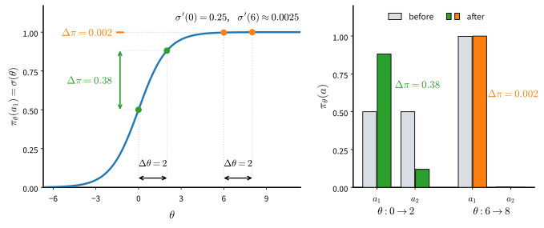
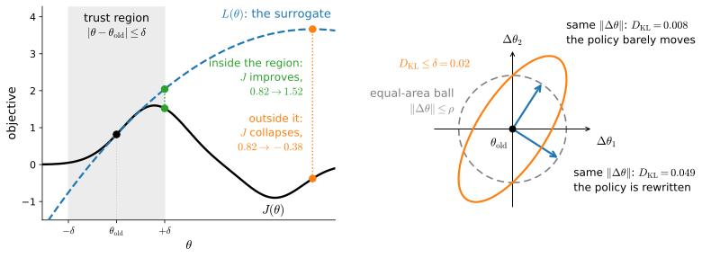
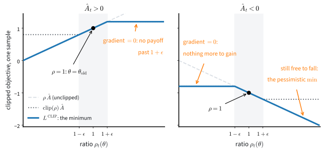

# Trust Regions and Proximal Policy Optimization
:label:`sec_ppo`

Policy-gradient methods update parameters $\theta$, but the same parameter displacement can produce very different changes in the distribution $\pi_\theta(\cdot\mid s)$. Large policy changes can invalidate the data used to estimate an update and can move an on-policy learner into a poor data-collection regime. We begin with a two-action example that makes this mismatch explicit.

Trust-region methods constrain change in policy space rather than parameter space :cite:`Schulman.Levine.Abbeel.ea.2015`. Proximal Policy Optimization (PPO) replaces the explicit constraint with a clipped surrogate objective and reuses each on-policy batch for several updates :cite:`Schulman.Wolski.Dhariwal.ea.2017`. This section derives importance-ratio correction, relates trust regions to the performance-difference lemma, and evaluates clipping through training curves and policy-drift diagnostics.

```{.python .input #ppo-trust-regions-and-proximal-policy-optimization-1}
%%tab pytorch
%matplotlib inline
from d2l import torch as d2l
import gymnasium as gym
import numpy as np
import torch
torch.set_num_threads(1)
```

```{.python .input #ppo-trust-regions-and-proximal-policy-optimization-1}
%%tab jax
%matplotlib inline
from d2l import jax as d2l
from flax import nnx
import gymnasium as gym
import jax
from jax import numpy as jnp
import numpy as np
```

## Parameter Space versus Policy Space

Since we now update the parameters of the policy directly, we should ask what a parameter update does to the policy itself. A family of policies with a single parameter $\theta$ and two actions answers it; we borrow the example from Joshua Achiam's lectures on policy optimization :cite:`Achiam.2017`. Let

$$\pi_\theta(a) = \begin{cases} \sigma(\theta) & a = 1 \\ 1 - \sigma(\theta) & a = 2, \end{cases} \qquad \textrm{where } \sigma(\theta) = \frac{1}{1 + e^{-\theta}}.$$

Take two parameter updates of exactly the same size, $\Delta\theta = 2$, from two different starting points:

$$\pi_{\theta=0}(a{=}1) = \sigma(0) = 0.50 \ \xrightarrow{\ \Delta\theta = 2\ }\ \sigma(2) = 0.88, \qquad \pi_{\theta=6}(a{=}1) = \sigma(6) = 0.9975 \ \xrightarrow{\ \Delta\theta = 2\ }\ \sigma(8) = 0.9997.$$

The first update takes the agent from indifferent between the two actions to strongly committed to one of them, a drastic change in behavior. The second changes nothing that an observer of the agent could detect. :numref:`fig_rl-policy-vs-parameter` plots the map from parameter to policy with both updates drawn on it, and, beside it, the two action distributions before and after each update.


:label:`fig_rl-policy-vs-parameter`

Both updates move $\theta$ by exactly two, yet on the left the distribution flips from even odds to strong commitment, while on the right the before and after bars are indistinguishable. Equal steps in parameter space, wildly unequal steps in policy space: the map from parameters to policies stretches distances in some regions and crushes them in others, so a small change in the parameters can unexpectedly produce a large change in the policy, and a large change can produce none.

The derivative $\sigma'(\theta) = \sigma(\theta)(1 - \sigma(\theta))$ puts numbers on this. At $\theta = 0$ it equals $0.25$; at $\theta = 6$ it is about $0.0025$, a hundred times smaller. No learning rate is right in both regions at once. Worse, the two regions feed each other: near indifference the policy is at its most sensitive, so one noisy oversized update can throw it deep into a saturated region. Once saturated, the score of the action the policy keeps taking is nearly zero; the rare opposite action still carries an order-one score, but it is almost never sampled, so the expected gradient all but vanishes, and in practice no ordinary sequence of updates brings the policy back: the data that would drive the recovery has stopped arriving. An on-policy method keeps collecting with the broken policy, so later batches confirm the stall rather than break it. The run is over, and the learning rate alone could not have prevented it, because capping the step in $\theta$ caps the wrong quantity.

So the quantity to control is the change in the policy, not the change in the parameters: what we want is an update rule that never changes the *policy* by more than we meant to, whatever that costs in parameter distance. Inside that guarantee we also want the freedom to take the largest step it allows and to reuse each batch several times.

## Reusing Data with Importance Sampling

### The Change of Measure

Every estimator since :numref:`sec_policygradient` has used trajectories sampled from the current policy. After one gradient step, that batch was treated as stale, which made policy-gradient learning expensive in environment interactions. Suppose instead that the batch was collected by an earlier policy $\pi_{\theta_{\textrm{old}}}$. How can it be used to evaluate an updated policy $\pi_\theta$?

Importance sampling gives the exact answer. For any function $f$ of trajectories,

$$E_{\tau \sim P(\cdot;\, \theta)} \big[ f(\tau) \big] = \sum_\tau P(\tau; \theta)\, f(\tau) = \sum_\tau P(\tau; \theta_{\textrm{old}})\ \frac{P(\tau; \theta)}{P(\tau; \theta_{\textrm{old}})}\, f(\tau) = E_{\tau \sim P(\cdot;\, \theta_{\textrm{old}})} \Big[ \frac{P(\tau; \theta)}{P(\tau; \theta_{\textrm{old}})}\, f(\tau) \Big],$$
:eqlabel:`eq_change_of_measure`

valid whenever every trajectory the new policy can produce has positive probability under the old one, a condition softmax policies satisfy automatically because they never assign zero probability to any action. Applied with $f = R$, the return, this rewrites the objective of :numref:`sec_policygradient` as an expectation under the *old* policy,

$$J(\theta) = E_{\tau \sim P(\cdot;\, \theta)} \big[ R(\tau) \big] = E_{\tau \sim P(\cdot;\, \theta_{\textrm{old}})} \Big[ \frac{P(\tau; \theta)}{P(\tau; \theta_{\textrm{old}})}\, R(\tau) \Big],$$
:eqlabel:`eq_offpolicy_objective`

so the performance of the new policy can be evaluated, without bias, on data the old policy collected. And the weight is computable: writing out $P(\tau; \theta)$ from :eqref:`eq_traj_prob`, the transition probabilities appear in both numerator and denominator and cancel, the same escape from the unknown MDP as in :numref:`sec_policygradient`. What remains is a pure product of policy ratios,

$$\frac{P(\tau; \theta)}{P(\tau; \theta_{\textrm{old}})} = \prod_{t=0}^{T-1} \frac{\pi_\theta(a_t \mid s_t)}{\pi_{\theta_{\textrm{old}}}(a_t \mid s_t)}.$$

### The Exploding Product of Ratios

Unbiased, however, does not mean usable. Each factor in the product is bounded below by zero and unbounded above, and the product compounds across the trajectory: a trajectory that was unlikely under the old policy but likely under the new one can carry a weight of many orders of magnitude and single-handedly dominate the estimate. The exact correction :eqref:`eq_offpolicy_objective` trades all of its bias for variance that grows with the horizon.

### The Per-Step Surrogate

The practical compromise keeps one ratio per step. Define

$$\rho_t(\theta) = \frac{\pi_\theta(a_t \mid s_t)}{\pi_{\theta_{\textrm{old}}}(a_t \mid s_t)}$$

and optimize the sampled surrogate objective

$$\hat{L}(\theta) = \frac{1}{n} \sum_{i=1}^n \sum_{t} \rho_t^i(\theta)\ \hat{A}_t^i,$$
:eqlabel:`eq_surrogate`

where $\hat{A}_t^i$ is an advantage estimate for step $t$ of trajectory $i$, such as the normalized reward-to-go of :numref:`sec_baselines`. Relative to :eqref:`eq_offpolicy_objective`, this approximation replaces the product of ratios by one ratio per step and retains the old policy's state distribution. These choices reduce variance. The approximation is locally exact in the sense needed for optimization: at $\theta = \theta_{\textrm{old}}$, every ratio equals one and $\nabla_\theta \rho_t = \nabla_\theta \log \pi_\theta(a_t \mid s_t)$. Thus :eqref:`eq_surrogate` has the correct policy gradient at the old parameters, but it may be inaccurate after a large policy change. This raises the next question: how should the size of that change be measured and controlled?

### The Length-Normalized Trajectory Ratio

A third choice sits between the two extremes, the full product that is exact but explosive and the single factor that is tame but local, and it earns its sentence because it is the one that scaled: raise the product of per-step ratios to the power $1/T$, the geometric mean, so that its logarithm is the *average* per-step log-ratio and its magnitude no longer compounds with the horizon. Clipping this length-normalized, sequence-level ratio rather than the per-step one is the idea marketed as GSPO in large language-model training, and :numref:`sec_rl_sequences` picks it up where trajectories become token sequences.

## Bounding the Step

### The Performance Difference Lemma

The question at the end of the surrogate deserves a theorem before it gets an algorithm. Abbreviate the old policy's advantage :eqref:`eq_advantage` as $A^{\textrm{old}}(s, a) = Q^{\pi_{\theta_{\textrm{old}}}}(s, a) - V^{\pi_{\theta_{\textrm{old}}}}(s)$. How much better than the old policy is an arbitrary candidate $\pi_\theta$? Exactly this much:

**Proposition** (performance difference lemma, :citet:`Kakade.Langford.2002`).

$$
J(\theta) - J(\theta_{\textrm{old}}) = E_{\tau \sim P(\cdot;\, \theta)} \Big[ \sum_{t=0}^{T-1} \gamma^t\, A^{\textrm{old}}(s_t, a_t) \Big].
$$
:eqlabel:`eq_perf_diff`

**Proof.** Write $V$ for $V^{\pi_{\theta_{\textrm{old}}}}$. Along any trajectory, the sum $\sum_t \gamma^t \big( r_t + \gamma V(s_{t+1}) - V(s_t) \big)$ telescopes: the interior $V$ terms cancel in pairs, and $V = 0$ at termination, leaving $R(\tau) - V(s_0)$. Now take expectations under $\tau \sim P(\cdot;\, \theta)$. On the left, conditioned on $(s_t, a_t)$, the expectation of $r_t + \gamma V(s_{t+1})$ over the next state is $Q^{\pi_{\theta_{\textrm{old}}}}(s_t, a_t)$, by :eqref:`eq_dynamic_programming_q` written with $V^\pi$, so each term becomes $\gamma^t\, E\big[ A^{\textrm{old}}(s_t, a_t) \big]$. On the right, $E[R(\tau)] = J(\theta)$, and $E[V(s_0)] = J(\theta_{\textrm{old}})$ because both policies draw $s_0$ from the same $\mu_0$. $\blacksquare$

The lemma says that improvement depends on the old policy's advantages evaluated along trajectories of the new policy. Those trajectories are unavailable until the candidate policy is deployed. Replacing their state distribution by the old policy's state distribution, and reweighting only the sampled actions by $\rho_t$, gives the surrogate in :eqref:`eq_surrogate` after omitting the conventional factor $\gamma^t$. The approximation is exact at $\theta_{\textrm{old}}$ and deteriorates as the two policies induce different state distributions. Its accuracy therefore depends on policy change, not directly on parameter distance.

### Trust Regions and the Monotonic-Improvement Bound

Trust Region Policy Optimization answers with a constraint measured where the two-action example said it must be: in policy space. Maximize the surrogate, but keep the new policy close to the old one,

$$\max_\theta\ \hat{L}(\theta) \quad \textrm{subject to} \quad \frac{1}{n}\sum_{i,t} D_{\textrm{KL}}\big( \pi_{\theta_{\textrm{old}}}(\cdot \mid s_t^i)\ \Vert\ \pi_\theta(\cdot \mid s_t^i) \big) \leq \delta_{\textrm{KL}},$$

where the Kullback-Leibler divergence (:numref:`sec_mdl-information_theory`) measures, at each visited state, how far the new action distribution has moved from the old one. What earns the constraint the name of a guarantee is a bound, and the bound is a statement about a *population* quantity that deserves its own symbol. Let $\rho_{\textrm{old}}(s) = \sum_{t \geq 0} \gamma^t\, P(s_t = s \mid \pi_{\theta_{\textrm{old}}})$ be the old policy's discounted state-visitation measure, total mass $1/(1-\gamma)$ in a continuing task, and define the population surrogate

$$\bar{L}(\theta) = \sum_s \rho_{\textrm{old}}(s) \sum_a \pi_\theta(a \mid s)\, A^{\textrm{old}}(s, a),$$

the sampled surrogate with every sample replaced by its expectation. Two facts distinguish the two quantities. First, $\bar{L}(\theta_{\textrm{old}})=0$ because the old policy's expected advantage vanishes at every state; the finite-sample $\hat{L}$ need not be zero there and also omits the $\gamma^t$ weights, as discussed after :eqref:`eq_rtg`. Second, the theoretical bound uses the largest divergence over all states, including states absent from a sampled batch. With $A_{\max} = \max_{s, a} \lvert A^{\textrm{old}}(s, a) \rvert$,

$$
J(\theta)\ \geq\ J(\theta_{\textrm{old}}) + \bar{L}(\theta)\ -\ \frac{4 \gamma A_{\max}}{(1-\gamma)^2}\ \max_s\, D_{\textrm{KL}}\big( \pi_{\theta_{\textrm{old}}}(\cdot \mid s)\ \Vert\ \pi_\theta(\cdot \mid s) \big),
$$
:eqlabel:`eq_trpo_bound`

:cite:`Kakade.Langford.2002,Schulman.Levine.Abbeel.ea.2015`. At $\theta=\theta_{\textrm{old}}$, the bound holds with equality. Increasing its right-hand side therefore guarantees an increase in the true objective. TRPO makes three practical approximations: it replaces $\bar{L}$ by the sampled surrogate, replaces the worst-state divergence by an empirical mean over visited states, and chooses the KL limit $\delta_{\textrm{KL}}$ rather than using the very conservative theoretical coefficient. It then solves the constrained problem with second-order optimization. The important point is that the step is measured in policy space rather than parameter space. Locally, the KL divergence induces the Fisher metric and the corresponding update is the natural gradient :cite:`Amari.1998,Kakade.2002`. The right panel of :numref:`fig_rl_trust_region` compares this geometry with a Euclidean constraint.

![Bounding a policy update. Left: the surrogate $L$ is tangent to the true objective $J$ at $\theta_{\textrm{old}}$ but becomes inaccurate after a large policy change. Here the unconstrained maximizer of $L$ lowers $J$ from $0.82$ to $-0.38$, whereas the best point inside the shaded trust region raises it to $1.52$. Right: for a three-action softmax policy, the exact local constraint $D_{\textrm{KL}}\leq0.02$ is an ellipse in parameter space. Two parameter steps of equal Euclidean length produce KL divergences $0.008$ and $0.049$, so parameter distance does not determine policy distance.](../img/mdl-rl-trust-region.svg)
:label:`fig_rl_trust_region`

### The Clipped Objective

PPO gets most of the benefit with none of the second-order machinery. Instead of constraining the ratios, clip their usefulness:

$$L^{\textrm{CLIP}}(\theta) = \frac{1}{n} \sum_{i,t} \min\Big( \rho_t^i(\theta)\, \hat{A}_t^i,\ \ \textrm{clip}\big(\rho_t^i(\theta),\ 1-\epsilon,\ 1+\epsilon\big)\, \hat{A}_t^i \Big),$$
:eqlabel:`eq_ppo_clip`

with a clipping parameter $\epsilon$, typically $0.2$. Consider one sample. If $\hat{A}_t > 0$, its contribution increases with $\rho_t$ only until $\rho_t = 1+\epsilon$; beyond this value, the clipped term is selected and its gradient is zero. If $\hat{A}_t < 0$, the corresponding threshold is $1-\epsilon$. The minimum is deliberately one-sided: a change that lowers the objective remains visible, whereas further movement in the favorable direction is no longer rewarded. The ratio itself is not clipped and can still cross the band because other samples share the same network parameters. Thus clipping is a soft incentive rather than a hard constraint. It nevertheless permits several epochs of optimization on a single batch without continually rewarding large changes in individual action probabilities.


:label:`fig_rl_ppo_clip`

Unlike the TRPO bound in :eqref:`eq_trpo_bound`, the clipped objective does not guarantee monotonic improvement. It is a first-order heuristic that discourages large changes in sampled action probabilities. The ablation below tests its effect empirically, and the subsequent diagnostics measure the policy changes that the theorem would otherwise constrain.

### Asymmetric Clipping Bands

The band is symmetric in ratio space and anything but symmetric in what it permits. For an action the old policy took rarely, say $\pi_{\theta_{\textrm{old}}}(a \mid s) = 0.01$, the ceiling $\rho_t \leq 1 + \epsilon$ stops rewarding growth beyond a probability of $0.012$: per reuse cycle, a rare action may at most creep upward by a fifth of its almost nothing, while an action holding $0.60$ may add twelve full points of probability mass inside the same band. Sample by sample the symmetric clip is therefore tightest exactly on the low-probability actions that exploration needs to grow, and mass drains toward the modes faster than the tails can recover it, one more ratchet turning entropy down. The repair is as blunt as the diagnosis: decouple the two edges into $1 - \epsilon_{\textrm{low}}$ and $1 + \epsilon_{\textrm{high}}$ with $\epsilon_{\textrm{high}} > \epsilon_{\textrm{low}}$, giving rare actions room to grow while keeping the pessimistic side tight. This clip-higher band appears in several of the mid-2020s language-model recipes near :numref:`sec_rl_sequences`'s material, one dated design choice in an actively churning space rather than a standing ingredient of PPO; exercise 7 works out its arithmetic.

### The Entropy Bonus

One practical companion deserves more than the sentence it usually gets. Implementations add a small *entropy bonus* to the objective, `entropy_coef` times the mean entropy of the action distributions, rewarding policies that are not too sharp. The two-action example showed what saturation costs: probabilities pinned near one, scores near zero, no way back. The entropy term is the standing pressure against drifting there, and in this section it moves from the margin notes into the code: `ppo_epochs` below adds the bonus to the objective and reports the entropy it measured, per epoch, as data, so that "the policy saturated" stops being a story and becomes a curve. :numref:`sec_regularized`'s theorem explains why a bonus of exactly this form is principled: the entropy bonus is a KL penalty measured against a uniform reference policy, one corner of a design whose optimum has a closed form.

## PPO in Practice

### The Choice of Advantage Estimate

Equation :eqref:`eq_ppo_clip` accepts any declared advantage estimator.
Reward-to-go minus a learned baseline gives the Monte Carlo endpoint;
the TD error $\delta_t$ gives the one-step bootstrapped endpoint; and GAE
mixes depths using the telescoping identity :eqref:`eq_gae_deltas`. This
$\delta_t$ is distinct from the trust-region radius
$\delta_{\textrm{KL}}$.

:numref:`sec_actorcritic` found the smallest one-draw error in its local
diagnostic near $\lambda=0.95$, also a common implementation default
:cite:`Schulman.Moritz.Levine.ea.2016`. We use that value explicitly; it
is a heuristic setting, not a consequence of PPO's clipped objective.
The loop below is a full-batch teaching implementation. It preserves the
estimator equations but uses an update schedule chosen for legibility;
the final table lists the additional production choices it omits.

### The Implementation

The laboratory is :numref:`sec_actorcritic`'s: CartPole, the `ActorCritic.mlp` container, batches of eight episodes, and `critic_steps` regression passes for the critic, so that every difference below is the algorithm. Three hyperparameters are new. `num_epochs = 20` passes over each batch is aggressive reuse, on purpose; `epsilon_clip = 0.2` is the standard band; `entropy_coef = 0.01` is the bonus just argued for.

```{.python .input #ppo-the-implementation-1}
%%tab pytorch, jax
gamma, lam, num_updates, batch_episodes = 0.99, 0.95, 60, 8
num_seeds, num_epochs, critic_steps = 8, 20, 20
epsilon_clip, entropy_coef = 0.2, 0.01
if tab.selected('pytorch'):
    def cartpole_agent(seed):
        torch.manual_seed(seed)
        return d2l.ActorCritic.mlp(4, 2)
if tab.selected('jax'):
    def cartpole_agent(seed):
        return d2l.ActorCritic.mlp(4, 2, rngs=nnx.Rngs(seed))
```

Two pieces of per-framework speed first, not algorithm, both following the compilation rule of :numref:`sec_compilation` exactly as :numref:`sec_actorcritic` did: compile what has a fixed shape and runs hot. The acting forward is compiled and cached in the jax tab and stays eager in the pytorch tab; both tabs gain a batched probability read `_probs` that the vectorized collection at the end of the section will want.

```{.python .input #ppo-the-implementation-2}
%%tab pytorch
def _probs(ac, obs):   # batched action probabilities, read as numpy
    with torch.no_grad():
        return torch.softmax(ac.policy(torch.as_tensor(obs)), -1).numpy()
```

```{.python .input #ppo-the-implementation-2}
%%tab jax
_act_probs = nnx.jit(lambda net, obs: jax.nn.softmax(net(obs), -1))

def _probs(ac, obs):   # the fixed-shape acting forward, compiled and
    if not hasattr(ac, '_fwd'):    # cached as in :numref:`sec_actorcritic`
        ac._fwd = nnx.cached_partial(_act_probs, ac.policy)
    return np.asarray(ac._fwd(jnp.asarray(obs)))

@d2l.add_to_class(d2l.ActorCritic)
def act(self, obs, rng):
    p = _probs(self, obs)
    return int(rng.choice(len(p), p=p))

@d2l.add_to_class(d2l.ActorCritic)
def act_greedy(self, obs, rng=None):
    return int(_probs(self, obs).argmax())
```

The critic's regression is the same hot loop it was in :numref:`sec_actorcritic`, and the jax tab repeats that section's padding trick, batches padded to a power-of-two length so the jitted pass compiles once per size bucket; sections are self-contained, so the cell is repeated rather than imported.

```{.python .input #ppo-the-implementation-3}
%%tab pytorch
# Eager per-pass cost is about a millisecond in this tab; the library
# helper needs no compilation story here, unlike its jax sibling.
fit_value = d2l.fit_value
```

```{.python .input #ppo-the-implementation-3}
%%tab jax
def _pad(x, size):  #@save
    return jnp.asarray(np.pad(x, ((0, size - len(x)),) + ((0, 0),)
                              * (x.ndim - 1)))

_value_fwd = nnx.jit(lambda net, obs: net(obs).squeeze(-1))

@d2l.add_to_class(d2l.ActorCritic)
def value_np(self, obs):   # batched reads only, padded to the bucket size
    size = 1 << max(6, (len(obs) - 1).bit_length())
    return np.asarray(_value_fwd(self.value, _pad(obs, size)))[:len(obs)]

@nnx.jit
def _critic_pass(value, opt, obs, target, mask):
    loss, grads = nnx.value_and_grad(lambda v: (mask * (
        v(obs).squeeze(-1) - target) ** 2).sum() / mask.sum())(value)
    opt.update(value, grads)
    return loss

def fit_value(ac, obs, target, num_steps=1):
    """d2l.fit_value, padded to a power-of-two length: the jitted pass
    compiles once per size bucket (:numref:`sec_compilation`)."""
    size = 1 << max(6, (len(target) - 1).bit_length())
    mask = jnp.asarray((np.arange(size) < len(target)).astype(np.float32))
    for _ in range(num_steps):
        loss = _critic_pass(ac.value, ac.opt_v, _pad(obs, size),
                            _pad(target, size), mask)
    return float(loss)
```

`ppo_epochs` receives a batch together with the quantities frozen before
reuse: the advantages and the collecting policy's log-probabilities. It
then performs `num_epochs` gradient passes on the clipped surrogate plus
the entropy bonus.

The function records one diagnostic row per epoch: the fraction of ratios
outside the band, the sample mean of
$\log\pi_{\theta_{\textrm{old}}}-\log\pi_\theta$, and mean policy entropy.
The expected log-ratio under the old policy is a KL divergence at the
visited states, but its finite-sample estimate may be negative. The
`use_clip` control retains importance ratios and removes only clipping.
The JAX tab compiles one padded step per size bucket.

```{.python .input #ppo-the-implementation-4}
%%tab pytorch
def ppo_epochs(ac, batch, adv, logp_old, epsilon, num_epochs,  #@save
               entropy_coef=0.01, use_clip=True):
    """num_epochs clipped-surrogate passes on one frozen batch; returns
    [num_epochs, 3] numpy diagnostics: fraction of ratios outside the
    band, approximate KL, mean policy entropy."""
    obs, act = torch.as_tensor(batch.obs), torch.as_tensor(batch.act)
    adv, logp_old = torch.as_tensor(adv), torch.as_tensor(logp_old)
    diag = []
    for _ in range(num_epochs):
        logp_all = torch.log_softmax(ac.policy(obs), dim=-1)
        logp = logp_all.gather(-1, act[:, None]).squeeze(-1)
        rho = torch.exp(logp - logp_old)
        surr = rho * adv
        if use_clip:
            surr = torch.min(surr,
                             rho.clamp(1 - epsilon, 1 + epsilon) * adv)
        entropy = -(logp_all.exp() * logp_all).sum(-1).mean()
        loss = -surr.mean() - entropy_coef * entropy
        ac.opt_pi.zero_grad()
        loss.backward()
        ac.opt_pi.step()
        diag.append((((rho - 1).abs() > epsilon).float().mean().item(),
                     (logp_old - logp).mean().item(), entropy.item()))
    return np.array(diag)
```

```{.python .input #ppo-the-implementation-4}
%%tab jax
@nnx.jit  #@save
def _ppo_step(policy, opt, obs, act, adv, logp_old, mask, epsilon,
              entropy_coef, use_clip):
    def loss_fn(policy):
        logp_all = jax.nn.log_softmax(policy(obs), axis=-1)
        logp = jnp.take_along_axis(logp_all, act[:, None], -1).squeeze(-1)
        rho = jnp.exp(logp - logp_old)
        surr = jnp.where(use_clip, jnp.minimum(
            rho * adv, jnp.clip(rho, 1 - epsilon, 1 + epsilon) * adv),
            rho * adv)
        entropy = -(jnp.exp(logp_all) * logp_all).sum(-1)
        loss = -(mask * (surr + entropy_coef * entropy)).sum() / mask.sum()
        return loss, (rho, logp, entropy)
    (_, (rho, logp, entropy)), grads = nnx.value_and_grad(
        loss_fn, has_aux=True)(policy)
    opt.update(policy, grads)
    n = mask.sum()
    return ((mask * (jnp.abs(rho - 1) > epsilon)).sum() / n,
            (mask * (logp_old - logp)).sum() / n, (mask * entropy).sum() / n)

def ppo_epochs(ac, batch, adv, logp_old, epsilon, num_epochs,  #@save
               entropy_coef=0.01, use_clip=True):
    """num_epochs clipped-surrogate passes on one frozen batch; returns
    [num_epochs, 3] numpy diagnostics: fraction of ratios outside the
    band, approximate KL, mean policy entropy."""
    size = 1 << max(6, (len(adv) - 1).bit_length())
    mask = jnp.asarray((np.arange(size) < len(adv)).astype(np.float32))
    obs, act, adv, logp_old = (_pad(np.asarray(x), size) for x in
                               (batch.obs, batch.act, adv, logp_old))
    step = nnx.cached_partial(_ppo_step, ac.policy, ac.opt_pi)
    return np.array([step(obs, act, adv, logp_old, mask, epsilon,
                          entropy_coef, use_clip)
                     for _ in range(num_epochs)])
```

The training loop differs from :numref:`sec_actorcritic`'s in one place. After the critic's passes, it computes the GAE advantages, records the log-probabilities under the collecting policy, and then, instead of one gradient step, hands everything to `ppo_epochs`. The freeze is the pedagogical point: everything the epochs consume is data computed before they start; the only thing that moves during reuse is $\pi_\theta$. The critic regresses on the $\lambda$-return target `gae + value`, with its `critic_steps` passes taken first so the freshest critic judges, following :numref:`sec_actorcritic`'s pattern. The generator yields the batch's return plus the per-epoch mean and last-epoch row of the diagnostics, and an optional `trace` list keeps the full per-epoch matrix, so the measurements below come free with the ablation.

```{.python .input #ppo-the-implementation-5}
%%tab pytorch, jax
def train_ppo(seed, ac, use_clip=True, trace=None):
    """Freeze the advantages and the collecting policy's log-probs, then
    spend num_epochs surrogate passes; GAE(0.95) is the default."""
    rng, env = np.random.default_rng(seed), gym.make('CartPole-v1')
    env.reset(seed=seed)
    for _ in range(num_updates):
        batch = d2l.rollout(env, ac.act, batch_episodes, rng)
        for _ in range(critic_steps):   # fresh lambda-return target, per pass
            fit_value(ac, batch.obs, batch.gae(ac.value_np, gamma, lam)
                      + ac.value_np(batch.obs))
        adv = d2l.normalize(batch.gae(ac.value_np, gamma, lam))
        logp_old = ac.log_prob_np(batch.obs, batch.act)
        d = ppo_epochs(ac, batch, adv, logp_old, epsilon_clip, num_epochs,
                       entropy_coef, use_clip)
        if trace is not None:
            trace.append(d)
        yield (float(batch.episode_returns().mean()), *d.mean(0), *d[-1])
```

### Ablating the Clip

Twenty epochs per batch is aggressive reuse: each batch of eight episodes now drives twenty gradient steps instead of one, and the ratios have twenty chances to drift from one. This is on purpose. The failure this section is about only shows itself when the combined step gets big, and we want it on screen. We run the clipped objective on eight seeds, keeping the trained agents for the audits below and the full diagnostics for the next subsection:

```{.python .input #ppo-the-ablation-1}
%%tab pytorch, jax
agents = {'clipped (PPO)': [cartpole_agent(s) for s in range(num_seeds)],
          'no clip': [cartpole_agent(s) for s in range(num_seeds)]}
trace = []
runs = {'clipped (PPO)': np.array(
    [list(train_ppo(s, agents['clipped (PPO)'][s], trace=trace))
     for s in range(num_seeds)])}
diag = np.array(trace).reshape(num_seeds, num_updates, num_epochs, 3)
```

Then the control, identical in every line except that the clip is off:

```{.python .input #ppo-the-ablation-2}
%%tab pytorch, jax
runs['no clip'] = np.array(
    [list(train_ppo(s, agents['no clip'][s], use_clip=False))
     for s in range(num_seeds)])
```

First the casualties, counted rather than asserted, with a run declared dead if its last ten updates average below a return of 100:

```{.python .input #ppo-the-ablation-3}
%%tab pytorch, jax
for name, r in runs.items():
    dead = r[:, -10:, 0].mean(axis=1) < 100
    print(f'{name:>13}: {int(dead.sum())} of {num_seeds} seeds end dead; '
          f'casualties {np.flatnonzero(dead).tolist()}')
```

```{.python .input #ppo-the-ablation-4}
%%tab pytorch, jax
d2l.plot_curves({name: r[:, :, 0] for name, r in runs.items()},
                xlabel='update', ylabel='mean return of the batch',
                reference=500)
```

With twenty optimization epochs per batch, at least half of the unclipped seeds finish with a return below 100. Repeated unconstrained updates move the policy into a saturated region in which gradients are small, and subsequent batches are then collected by the poor policy. Every clipped seed finishes near the maximum return under the same data and update schedule. The identities of the failed seeds can vary with numerical details, so the comparison concerns the failure rate rather than particular seeds. With fewer epochs or a smaller learning rate, the unclipped variant usually succeeds; clipping is most useful when batch reuse and step size would otherwise produce an excessive policy change.

The clipping rate must be defined carefully. Each update checks every sample once per epoch, and the first epoch begins with $\rho_t=1$ for every sample. We report both the fraction of all per-epoch checks outside the band and the corresponding fraction in the final epoch of each batch:

```{.python .input #ppo-the-ablation-5}
%%tab pytorch, jax
for name, r in runs.items():
    print(f'{name:>13}: ratio checks outside the band: '
          f'{r[:, :, 1].mean():.1%} across all epochs')
    print(f'{"":>13}  {r[:, :, 4].mean():.1%} at the last epoch '
          f'of each batch')
```

For the clipped runs, both counts are near one check in twenty. Clipping sets
the surrogate gradient to zero for samples whose ratios have crossed the
relevant boundary. In the unclipped control, ratios cross the band about three
times as often overall and continue to move across repeated epochs.

### Training Diagnostics

:numref:`sec_deeprl` closed with the warning that the loss carries no signal here and that what deserves watching are diagnostics of the *update*. This section is where that advice becomes concrete, because the run above already returned every number an engineer would watch. Within a batch:

```{.python .input #ppo-how-to-know-your-rl-is-broken-1}
%%tab pytorch, jax
d2l.plot_curves({'ratio checks outside the band': diag[:, :, :, 0].mean(1),
                 'approximate KL': diag[:, :, :, 1].mean(1),
                 'entropy': diag[:, :, :, 2].mean(1)},
                xlabel='epoch within the batch', ylabel='diagnostic')
print(f'entropy: {diag[:, :5, :, 2].mean():.2f} over the first five '
      f'updates, {diag[:, -5:, :, 2].mean():.2f} over the last five')
```

Within each batch, the approximate KL divergence and the fraction outside the clipping band begin at zero and increase during the first few epochs. They then level off because samples beyond the band no longer contribute gradients in the favorable direction. Most policy movement therefore occurs early in the batch. Across updates, policy entropy decreases from about $0.65$ to $0.25$ nats. The entropy bonus slows this concentration but does not prevent it; :numref:`sec_regularized` studies the corresponding regularized objective directly.

The distribution behind those summary fractions is worth one look. Take two fresh identical agents at the *start* of training, where drift is largest, give both the same batch, the same frozen advantages and log-probabilities, and spend twenty passes with the clip on in one and off in the other, reading every ratio after each pass:

```{.python .input #ppo-how-to-know-your-rl-is-broken-2}
%%tab pytorch, jax
probe = {True: cartpole_agent(2), False: cartpole_agent(2)}   # twins
env = gym.make('CartPole-v1')
env.reset(seed=2)
batch = d2l.rollout(env, probe[True].act, batch_episodes,
                    np.random.default_rng(2))
adv = d2l.normalize(batch.gae(probe[True].value_np, gamma, lam))
logp_old = probe[True].log_prob_np(batch.obs, batch.act)
rhos = {}
for clip in (True, False):
    R = []
    for _ in range(num_epochs):   # one pass at a time, ratios read after
        ppo_epochs(probe[clip], batch, adv, logp_old, epsilon_clip, 1,
                   entropy_coef, use_clip=clip)
        R.append(np.exp(probe[clip].log_prob_np(batch.obs, batch.act)
                        - logp_old))
    rhos[clip] = np.array(R)
```

```{.python .input #ppo-how-to-know-your-rl-is-broken-3}
%%tab pytorch, jax
d2l.set_figsize((6, 4))
for clip, name in ((True, 'clipped (PPO)'), (False, 'no clip')):
    d2l.plt.hist(rhos[clip][-1], bins=60, alpha=0.5, label=name)
for edge in (1 - epsilon_clip, 1 + epsilon_clip):
    d2l.plt.axvline(edge, linestyle='--', color='black')
d2l.plt.xlabel(r'ratio $\rho_t(\theta)$ after {} passes'.format(num_epochs))
d2l.plt.ylabel('ratio checks')
d2l.plt.legend()
d2l.plt.show()
```

After twenty passes, the clipped agent's ratios remain concentrated near one,
with a minority beyond the dashed boundaries. The unclipped ratios are much
more dispersed and many approach zero. The effective sample size
:eqref:`eq_mdl-bayes-is-ess`, $N_{\textrm{eff}} = 1 / \sum_s \bar{w}_s^2$ for
normalized weights $\bar{w}$, summarizes this concentration: it equals the
batch size for uniform weights and one when a single weight dominates.

```{.python .input #ppo-how-to-know-your-rl-is-broken-4}
%%tab pytorch, jax
ess = {}
for clip, name in ((True, 'clipped (PPO)'), (False, 'no clip')):
    w = rhos[clip] / rhos[clip].sum(axis=1, keepdims=True)
    ess[name] = 1 / (w ** 2).sum(axis=1) / rhos[clip].shape[1]
d2l.plot_curves(ess, xlabel='epoch within the batch',
                ylabel='effective sample size / n')
print(f'after {num_epochs} epochs the batch is worth '
      + ' vs '.join(f'{v[-1]:.0%} ({k})' for k, v in ess.items())
      + f' of its {len(batch)} steps')
```

With clipping, the weight distribution remains comparatively flat through the
twentieth epoch. Without clipping, it becomes concentrated enough that the
weight-based effective sample size falls below half the batch.

This is only a ratio-concentration diagnostic. It does not include advantage
signs or magnitudes, temporal dependence, repeated state visits, or states that
the updated policy would visit but the old batch did not. It should therefore
be read alongside approximate KL, clip fraction, entropy, and return rather
than as a count of independent gradient samples.

Finally the audit. Strip away the sampling noise and evaluate what the clipped run actually delivered, greedily:

```{.python .input #ppo-how-to-know-your-rl-is-broken-5}
%%tab pytorch, jax
ac, env = agents['clipped (PPO)'][0], gym.make('CartPole-v1')
env.reset(seed=2)
score = d2l.evaluate(env, ac.act_greedy, num_episodes=100)
print(f'greedy mean return over 100 episodes: {score:.0f}')
```

### Vectorized Collection and Minibatch Updates

The implementation above is deliberately small: it uses one environment, complete episodes, full-batch epochs, and a learning rate of $10^{-2}$. This rate is four to forty times larger than common tuned settings so that the unclipped failure is visible within sixty updates; it should not be treated as a recommended PPO default. Production implementations usually step $N$ environments in parallel for a fixed horizon $T$, producing an $N\times T$ array of transitions. Since this array often ends in the middle of an episode, the value function supplies the continuation value at the truncation boundary, as described in :numref:`sec_mdp`.

```{.python .input #ppo-from-a-teaching-loop-to-a-real-one-1}
%%tab pytorch, jax
envs = gym.vector.SyncVectorEnv([lambda: gym.make('CartPole-v1')] * 8)
obs, _ = envs.reset(seed=0)
rng, steps = np.random.default_rng(3), []
for _ in range(32):                       # the fixed 32 x 8 rectangle
    act = np.array([rng.choice(2, p=p) for p in _probs(ac, obs)])
    obs, rew, term, trunc, _ = envs.step(act)
    steps.append((rew, term | trunc))
rew, done = map(np.array, zip(*steps))
print(f'a fixed {rew.shape} rectangle of steps, '
      f'{int(done.sum())} episode boundaries inside it')
print(f'V at the cut, pricing the unrecorded future: '
      f'{ac.value_np(obs).round(0)}')
```

The trained agent does not terminate within 32 steps, so all eight trajectories end at the collection horizon. Their continuation values are close to $1/(1-\gamma)=100$, the discounted value of balancing indefinitely. Without this bootstrap, the truncated data would omit most of its return. Production implementations also shuffle the collected array into a few epochs of minibatches rather than using full-batch passes. The following comparison uses four epochs with minibatches of size 32:

```{.python .input #ppo-from-a-teaching-loop-to-a-real-one-2}
%%tab pytorch, jax
full, mini = cartpole_agent(1), cartpole_agent(1)   # identical twins
env = gym.make('CartPole-v1')
env.reset(seed=1)
batch = d2l.rollout(env, full.act, batch_episodes,
                    np.random.default_rng(1))
adv = d2l.normalize(batch.gae(full.value_np, gamma, lam))
logp_old = full.log_prob_np(batch.obs, batch.act)
ppo_epochs(full, batch, adv, logp_old, epsilon_clip, num_epochs,
           entropy_coef)
idx = np.random.default_rng(1).permutation(len(batch))
for _ in range(4):                  # four passes of minibatches of 32
    for i in range(0, len(idx), 32):
        sl = idx[i:i + 32]
        mb = d2l.Batch(batch.obs[sl], batch.act[sl], batch.rew[sl],
                       batch.next_obs[sl], batch.term[sl], [len(sl)])
        ppo_epochs(mini, mb, adv[sl], logp_old[sl], epsilon_clip, 1,
                   entropy_coef)
print(f'{len(batch)} steps spent as {num_epochs} full-batch passes '
      f'or as {4 * int(np.ceil(len(idx) / 32))} minibatch steps:')
for name, ag in (('full batch', full), ('minibatches', mini)):
    kl = (logp_old - ag.log_prob_np(batch.obs, batch.act)).mean()
    print(f'  {name:>11}: approximate KL from the collecting policy '
          f'{kl:.3f}')
```

The two procedures produce policy changes of similar order. Minibatching reduces memory requirements and improves hardware utilization while adding gradient noise. Each sample's ratio is checked four times rather than twenty, and advantage normalization is commonly recomputed within each minibatch. There is also an update-order difference: our loop completes all critic passes before computing advantages and updating the actor, whereas typical implementations compute advantages once with the pre-update critic and then interleave policy and value losses across minibatches.

### Omitted Implementation Details

The gap between this section's PPO and a production one is a list of small, named decisions, none of which needs new theory:

| What real implementations add | Purpose |
|---|---|
| Learning-rate annealing to zero | reduce late updates as the policy approaches convergence |
| Observation and reward normalization | running estimates hold network inputs and value targets near unit scale on tasks whose raw numbers vary by orders of magnitude |
| Value-loss clipping | the critic gets a band of its own; its measured benefit is disputed, yet nearly every implementation ships it |
| KL-based early stopping | stop the epochs when the measured approximate KL passes a threshold: our diagnostic panel turned into an actuator |
| Orthogonal initialization, small policy head | start the policy near uniform so the first updates cannot blow the ratios out |
| Advantage normalization per minibatch | :numref:`sec_baselines`'s per-batch step size, recomputed at the granularity the gradient uses |
| Joint policy-and-value minibatch updates | one shuffled pass interleaves both losses; our critic-first, actor-second phases are a teaching choice |

The list is not ours. A community audit collected 37 such implementation details and measured which ones matter :cite:`Huang.Dossa.Raffin.ea.2022`; a controlled study went further and showed that at matched code-level choices PPO and TRPO perform nearly identically, so these details, not the clipped objective, account for much of PPO's practical edge :cite:`Engstrom.Ilyas.Santurkar.ea.2020`; and a large-scale sweep across a quarter-million trained agents reached similarly sober conclusions about which knobs carry the performance :cite:`Andrychowicz.Raichuk.Stanczyk.ea.2021`. The practical instruction a textbook can give is therefore this: when you need a real PPO, read a maintained single-file implementation and diff it against this section; the roughly 300-line `cleanrl/ppo.py` is the standard study text. Every line you do not recognize will be on the list above, and now you know why each is there.

## Summary

Equal parameter steps need not produce equal changes in a policy. Importance sampling corrects expectations when data come from an older policy, but trajectory-level products of ratios can have high variance. The per-step surrogate is a local approximation that retains the old policy's state distribution. TRPO controls this approximation through a divergence constraint and a monotonic-improvement bound. PPO instead clips individual probability ratios; this is simpler but does not inherit the TRPO guarantee. Practical PPO also uses GAE, an entropy bonus, repeated optimization epochs, and diagnostics for KL divergence, clipping, entropy, and effective sample size.

**Experimental scope.** The clipping ablation uses eight seeds per method and framework. With twenty reuse epochs, every clipped run reaches high CartPole return, whereas at least half of the unclipped runs collapse. The exact failure rate and diagnostic values vary across seeds. The implementation uses full batches from a single environment and omits vectorized collection and minibatch updates, so it illustrates the clipped objective rather than reproducing a production PPO system.

## Exercises

1. [conceptual] *One epoch is not PPO.* Show that at $\theta = \theta_{\textrm{old}}$
   every ratio in :eqref:`eq_ppo_clip` equals one, and that the gradient of the
   clipped objective there is exactly the policy gradient estimate of
   :numref:`sec_baselines`. Predict what the clipped and unclipped variants will
   do at `num_epochs = 1`, before you run the next exercise.
1. [extended] *Reuse against clipping.* Vary `num_epochs` over $\{1, 5, 20\}$
   with and without clipping, three seeds each. Report the fraction of seeds
   that end below a return of 100, and the fraction of ratio checks outside the
   band. Where does the unclipped variant start losing seeds, and does the
   clipped one ever lose one? (About thirty minutes.)
1. [short-code] *How wide should the band be.* Sweep the clipping parameter
   $\epsilon$ over $\{0.02, 0.1, 0.2, 0.5\}$ and one very large value, say
   $10^6$. When does a small $\epsilon$ hurt, what does the large value
   reproduce, and how does the outside-the-band fraction move across the sweep?
1. [short-code] *Minibatch epochs.* Extend `train_ppo` to spend each batch as
   four passes of shuffled minibatches of 32, the deployed default, instead of
   twenty full-batch passes, reusing the slicing pattern of the comparison
   cell. Compare the two on three seeds: learning curves, final approximate KL
   per batch, and the outside-the-band fraction. Which differences are
   statistical and which are bookkeeping?
1. [short-code] *Saturation, and the cure.* Run the normalized REINFORCE of
   :numref:`sec_baselines` with a deliberately oversized learning rate,
   $\alpha = 50$, on eight seeds, and record how many seeds ever reach the
   goal. Diagnose the failing seeds with this section's instruments, the
   policy's entropy and the norm of the score, then add an entropy bonus
   $-c \sum_a \pi_\theta(a \mid s) \log \pi_\theta(a \mid s)$ to the
   per-sample objective. How large must $c$ be to change the outcome, and what
   does the same $c$ cost at $\alpha = 2$?
1. [conceptual] *The clip as a step size.* For a two-action softmax policy,
   translate the band $|\rho_t - 1| \leq \epsilon$ into a bound on the change
   in the difference of the two logits, and show that the bound tightens as
   the policy becomes more certain. Explain in one sentence why this is the
   fix that the sigmoid example asked for, and why capping the step in
   $\theta$ would not have been.
1. [conceptual] *Asymmetric bands.* With $\epsilon = 0.2$, compute the largest
   probability each of two actions with $\pi_{\theta_{\textrm{old}}}(a \mid s)
   = 0.01$ and $0.60$ can reach before the clip stops paying for further
   growth, and the smallest each can be driven to before the clip stops the
   penalty. Which side of the band binds exploration, and why does raising
   $\epsilon_{\textrm{high}}$ while keeping $\epsilon_{\textrm{low}}$ fixed
   change the entropy trace of the diagnostic panel rather than just the
   speed of learning?

[Discussions](https://d2l.discourse.group/)

<!-- slides -->

::: {.slide}
::: {.cover}
[Dive into Deep Learning · §15.2]{.kicker}

Trust regions and proximal policy optimization<br>
**parameter distance lies about policy distance · reuse a batch, exactly · the performance difference lemma · a clip instead of a constraint**
:::
:::

::: {.slide title="Parameter Space versus Policy Space"}
One parameter, two actions (example due to Joshua Achiam),
two updates of the **same size** $\Delta\theta = 2$:

{width=95%}

. . .

$\sigma'(0) = 0.25$ against $\sigma'(6) \approx 0.0025$: no learning
rate is right in both regions. One oversized step near indifference
throws the policy into saturation, scores vanish, and the on-policy
data is collected by the broken policy: **the run is over**. Capping
the step in $\theta$ caps the wrong quantity.
:::

::: {.slide title="Importance Sampling"}
What can a batch from $\pi_{\theta_{\text{old}}}$ say about
$\pi_\theta$? Change of measure:

$$J(\theta)
  = E_{\tau \sim \theta_{\text{old}}}\!\Big[
    \tfrac{P(\tau;\theta)}{P(\tau;\theta_{\text{old}})}\, R(\tau) \Big],
\qquad
\frac{P(\tau;\theta)}{P(\tau;\theta_{\text{old}})}
  = \prod_t \frac{\pi_\theta(a_t\mid s_t)}
    {\pi_{\theta_{\text{old}}}(a_t\mid s_t)}.$$

- transitions cancel in the ratio: model-free, again
- **exact and unbiased**, but the product compounds along the
  trajectory; all the bias traded for horizon-growing variance
:::

::: {.slide title="The Per-Step Surrogate"}
Keep one ratio per step:

$$\rho_t = \frac{\pi_\theta(a_t\mid s_t)}
  {\pi_{\theta_{\text{old}}}(a_t\mid s_t)},
\qquad
\hat L(\theta) = \frac1n \sum_{i,t} \rho^i_t(\theta)\, \hat A^i_t.$$

. . .

Two corners cut: product $\to$ per-step ratio; states still from the
old policy's visits. At $\theta_{\text{old}}$, $\nabla \hat L$ **is**
the policy gradient. $\hat L$ is a *local* model: trustworthy near
where it was built, but inaccurate after large policy changes.
:::

::: {.slide title="The Performance Difference Lemma"}
$$J(\theta) - J(\theta_{\text{old}})
  = E_{\tau \sim P(\cdot;\,\theta)} \Big[ \sum_t \gamma^t\,
    A^{\text{old}}(s_t, a_t) \Big]$$

Proof in four lines: the TD identity telescopes along any
trajectory; take expectations (:cite:`Kakade.Langford.2002`).

. . .

- improvement $=$ the *new* policy's expected *old*-policy advantage
- everything hard hides in $\tau \sim \theta$: where the new
  policy goes
- swap in the old states, reweight actions by $\rho_t$: the
  surrogate. The two cut corners are **one corner seen twice**
:::

::: {.slide title="TRPO: a Bound, then a Constraint"}
$$J(\theta) \geq J(\theta_{\text{old}}) + \bar L(\theta)
  - \frac{4\gamma A_{\max}}{(1-\gamma)^2}
    \max_s D_{\text{KL}}\big(\pi_{\theta_{\text{old}}} \Vert
    \pi_\theta\big)$$

$\bar L$: the *population* surrogate over the discounted
occupancy $\rho_{\text{old}}$; $\bar L(\theta_{\text{old}}) = 0$
exactly (the sampled $\hat L$ need not vanish). Ascend the lower
bound and $J$ ascends **monotonically**. In practice: sampled
$\hat L$, mean KL $\leq \delta_{\text{KL}}$ over visited states
(a proxy, no bound attached), second-order machinery to solve it.

. . .

{width=95%}

Measuring steps in KL is steepest ascent under the Fisher metric:
the natural gradient, :numref:`sec_muon`'s norm story again.
:::

::: {.slide title="The Clipped Objective"}
$$L^{\text{CLIP}} = \frac1n\sum_{i,t}
  \min\!\big(\rho\hat A,\ \text{clip}(\rho,1-\epsilon,1+\epsilon)
  \hat A\big)$$

{width=95%}

. . .

Once a ratio leaves the band in the paying direction, that sample's
gradient is zero; the pessimistic side stays open. PPO keeps the
**shape** of the guarantee and **none** of the guarantee.
:::

::: {.slide title="Reusing a Batch"}
Freeze the advantages and the collector's log-probabilities, then
spend the epochs; diagnostics returned as data:

@ppo-the-implementation-4
:::

::: {.slide title="train_ppo: GAE(0.95) by Default"}
The advantage menu is :numref:`sec_actorcritic`'s dial, measured
there; we ship the deployed setting, $\lambda = 0.95$:

@ppo-the-implementation-5
:::

::: {.slide title="The Ablation: Eight Seeds, Clip On and Off"}
@!ppo-the-ablation-4

. . .

Same batches, same twenty passes: half or more of the unclipped
seeds die near return 9 (saturation, for real); every clipped seed reaches the
ceiling. The insurance pays out on about one ratio check in twenty.
Which seeds die reshuffles; the **rate** is what is stable.
:::

::: {.slide title="Training Diagnostics"}
@!ppo-how-to-know-your-rl-is-broken-1

. . .

- in these runs, KL and band-exits are **front-loaded** within a
  batch; the clip stalls the drift
- across training: entropy decays from about $0.65$ to about $0.25$ nats; the bonus
  slows the slide, :numref:`sec_regularized` explains it
:::

::: {.slide title="Policy Drift within a Batch"}
Ratios are importance weights, so the appendix's effective sample
size applies, as a **ratio-concentration diagnostic**:

@!ppo-how-to-know-your-rl-is-broken-4

. . .

"Reuse for a few epochs, then stop" as a dial: with the clip the
weight spectrum stays nearly flat; without it, concentration to
half or less. Weights-only: blind to advantages, dependence, and
state-distribution staleness.
:::

::: {.slide title="Vectorized Collection and Minibatches"}
- $N \times T$ **rectangle** from vectorized environments; the cut
  edge is priced by $V$, like every truncation since
  :numref:`sec_mdp`
- minibatch epochs ($4 \times 32$): the same drift budget in
  smaller coins
- plus a list of named details: annealing, normalization, value
  clip, KL stop, orthogonal init
  :cite:`Huang.Dossa.Raffin.ea.2022`

. . .

At matched code-level details, TRPO $\approx$ PPO
:cite:`Engstrom.Ilyas.Santurkar.ea.2020`: the details, not the
objective, carry much of the edge. Read `cleanrl/ppo.py` and diff
it against this section.
:::

::: {.slide title="Recap"}
- parameter distance $\neq$ policy distance: control the policy
- change of measure buys reuse; the ratio product explodes; the
  surrogate is local
- performance difference lemma: improvement $=$ expected
  old-advantage under the **new** policy; one corner, seen twice
- TRPO: bound $+$ constraint $+$ guarantee; PPO: clip, no
  guarantee, works
- GAE($0.95$) by default; entropy bonus in the objective
- watch ratios, KL, entropy, ESS, never the loss
:::
