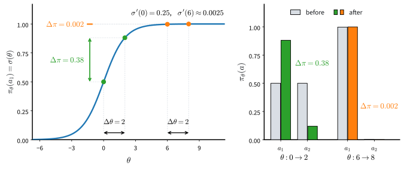
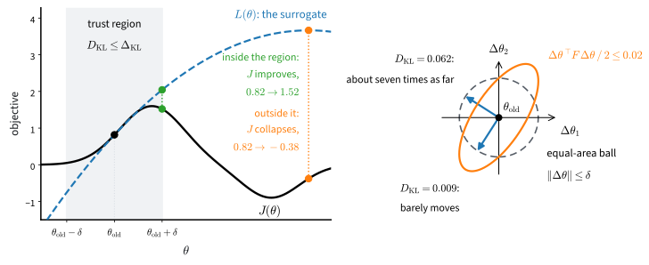
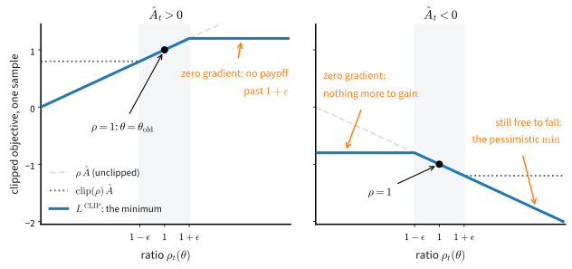

# Trust Regions and Proximal Policy Optimization
:label:`sec_ppo`

The agents of :numref:`sec_deeprl` and :numref:`sec_actorcritic` collect eight episodes, take one gradient step, and throw the batch away. Once the agent balances the pole well, those eight episodes are four thousand steps of experience, and all of it informs a single update. The step is also unguarded. Nothing stops a large update from moving the policy a long way, and the next batch is then collected by whatever policy that update produced. Can we take several steps on one batch, and how far may they go?

The answer starts with a fact about parameters. The same change of the parameters can leave a policy's behavior almost unchanged or change it completely, depending on where it starts, so a step size in parameter space does not control the quantity that matters, the change in behavior. In 2015 John Schulman and colleagues made that change the thing to control. Trust Region Policy Optimization (TRPO) bounds the divergence between the old and the new action distributions at the visited states, guided by a theorem on how much improvement such a step guarantees :cite:`Schulman.Levine.Abbeel.ea.2015`. Two years later Proximal Policy Optimization (PPO) replaced the constraint by a clipped objective that any gradient optimizer can run :cite:`Schulman.Wolski.Dhariwal.ea.2017`. PPO became the default policy-gradient method, from simulated robots to the fine-tuning of language models on human feedback :cite:`ouyang2022training`.

This section builds both. A two-action policy shows why parameter distance is the wrong quantity. A change of measure then lets a batch collected by the old policy evaluate a new one, exactly but with a variance that grows with the episode length, and keeping one ratio per step makes the reuse affordable. A short lemma says what that approximation leaves out; TRPO bounds the error and PPO clips it. On CartPole we then measure how many environment steps reuse saves, what goes wrong without the clip, and which numbers to watch while a policy trains.

```{.python .input #ppo-trust-regions-and-proximal-policy-optimization-1}
%%tab pytorch
%matplotlib inline
from d2l import torch as d2l
import gymnasium as gym
import numpy as np
import torch
torch.set_num_threads(1)
```

```{.python .input #ppo-trust-regions-and-proximal-policy-optimization-1}
%%tab jax
%matplotlib inline
from d2l import jax as d2l
from flax import nnx
import gymnasium as gym
import jax
from jax import numpy as jnp
import numpy as np
```

:begin_tab:`pytorch`
`torch.set_num_threads(1)` keeps PyTorch from spreading the small matrix products of these networks over many cores, which only slows them down.
:end_tab:

## Parameter Space versus Policy Space

Since we update the parameters of the policy, we should ask what a parameter update does to the policy itself. A family of policies with a single parameter $\theta$ and two actions answers it; the example comes from Joshua Achiam's lectures on policy optimization :cite:`Achiam.2017`. Let

$$\pi_\theta(a) = \begin{cases} \sigma(\theta) & a = 1 \\ 1 - \sigma(\theta) & a = 2, \end{cases} \qquad \textrm{where } \sigma(\theta) = \frac{1}{1 + e^{-\theta}}.$$

Take two parameter updates of the same size, $\Delta\theta = 2$, from two different starting points:

$$\pi_{\theta=0}(a{=}1) = \sigma(0) = 0.50 \ \xrightarrow{\ \Delta\theta = 2\ }\ \sigma(2) = 0.88, \qquad \pi_{\theta=6}(a{=}1) = \sigma(6) = 0.9975 \ \xrightarrow{\ \Delta\theta = 2\ }\ \sigma(8) = 0.9997.$$

The first update takes the agent from indifference between the two actions to a strong preference for one of them. The second changes nothing that an observer of the agent could detect. The slope of the map from parameter to policy says why: $\sigma'(\theta)=\sigma(\theta)(1-\sigma(\theta))$ is $0.25$ at $\theta=0$ and about $0.0025$ at $\theta=6$. :numref:`fig_rl-policy-vs-parameter` draws both updates.


:label:`fig_rl-policy-vs-parameter`

This difference makes on-policy training fragile. A large noisy update near $\theta=0$ can push the policy into saturation. There the frequently chosen action has an almost-zero score, $\nabla_\theta \log \pi_\theta(a{=}1) = 1 - \sigma(\theta) \approx 0.0025$ at $\theta = 6$, while the other action has a score near $-1$ but is sampled once in four hundred steps. Later on-policy batches then carry too little evidence to reverse the update. A limit on the Euclidean length of the parameter step does not prevent this, because the same length is harmless at $\theta = 6$ and drastic at $\theta = 0$.

An update should therefore limit a distance between policies rather than between parameters. Within such a limit the optimizer may take a long parameter step where it changes the policy little, and, as we will see, it may take several steps on the same batch.

## Importance Sampling

### The Change of Measure

Every estimator since :numref:`sec_policygradient` has used trajectories sampled from the current policy, so a batch became useless after one gradient step. Suppose instead that the batch was collected by an earlier policy $\pi_{\theta_{\textrm{old}}}$. Can it still tell us how well an updated policy $\pi_\theta$ does?

Importance sampling gives an exact answer. For any function $f$ of trajectories,

$$\mathbb{E}_{\tau \sim P(\cdot;\, \theta)} \big[ f(\tau) \big] = \sum_\tau P(\tau; \theta)\, f(\tau) = \sum_\tau P(\tau; \theta_{\textrm{old}})\ \frac{P(\tau; \theta)}{P(\tau; \theta_{\textrm{old}})}\, f(\tau) = \mathbb{E}_{\tau \sim P(\cdot;\, \theta_{\textrm{old}})} \Big[ \frac{P(\tau; \theta)}{P(\tau; \theta_{\textrm{old}})}\, f(\tau) \Big],$$
:eqlabel:`eq_change_of_measure`

valid whenever every trajectory the new policy can produce has positive probability under the old one. Softmax policies satisfy this condition, because they never assign zero probability to an action. Applied with $f = R$, the return, the identity rewrites the objective as an expectation under the *old* policy:

$$J(\theta) = \mathbb{E}_{\tau \sim P(\cdot;\, \theta)} \big[ R(\tau) \big] = \mathbb{E}_{\tau \sim P(\cdot;\, \theta_{\textrm{old}})} \Big[ \frac{P(\tau; \theta)}{P(\tau; \theta_{\textrm{old}})}\, R(\tau) \Big].$$
:eqlabel:`eq_offpolicy_objective`

Thus data from the old policy, each trajectory weighted by its likelihood ratio, estimate the new policy's return without bias. The probability of a trajectory is a product of the start-state probability, the policy's action probabilities and the environment's transition probabilities, as in :numref:`sec_policygradient`. In the ratio everything but the policy cancels, so the weight needs no model of the environment:

$$\frac{P(\tau; \theta)}{P(\tau; \theta_{\textrm{old}})} = \prod_{t=0}^{T-1} \frac{\pi_\theta(a_t \mid s_t)}{\pi_{\theta_{\textrm{old}}}(a_t \mid s_t)}.$$
:eqlabel:`eq_traj_ratio`

### The Exploding Product

The estimator is unbiased, but its variance grows with the length of the episode. Consider a policy that ignores the state, collects data with $\pi_{\theta_{\textrm{old}}} = (0.5, 0.5)$, and is evaluated at $\pi_\theta = (0.6, 0.4)$. Each factor of :eqref:`eq_traj_ratio` is $1.2$ or $0.8$ with equal probability, so its mean is $1$ and its mean square is $(1.44 + 0.64)/2 = 1.04$. The factors of different steps are independent, so the trajectory weight $W_T$ of an episode of $T$ steps has mean $1$ and variance

$$\textrm{Var}[W_T] = 1.04^T - 1,$$

which is about $0.5$ for $T = 10$, about $50$ for $T = 100$ and about $3 \times 10^8$ for CartPole's $500$ steps. A policy that differs from the data's policy by ten percentage points per decision thus cannot be evaluated from whole CartPole episodes: a handful of trajectories with large weights decide the estimate.

### The Per-Step Surrogate

The reward at step $t$ depends only on the actions taken up to step $t$, so the exact correction needs only the ratios $\rho_0 \cdots \rho_t$ for that reward, where

$$\rho_t(\theta) = \frac{\pi_\theta(a_t \mid s_t)}{\pi_{\theta_{\textrm{old}}}(a_t \mid s_t)}.$$

The product $\rho_0 \cdots \rho_{t-1}$ of the earlier ratios corrects for the states: it turns the old policy's distribution of $s_t$ into the new policy's. Dropping it, and keeping only $\rho_t$ for the action at $s_t$, gives a weight whose variance no longer grows with $t$. This one approximation evaluates the new policy's actions at the old policy's states. With an advantage estimate $\hat{A}_t^i$ for step $t$ of trajectory $i$, the resulting *surrogate objective* averages over all $N = \sum_i T_i$ steps of a batch of $n$ trajectories:

$$\hat{L}(\theta) = \frac{1}{N} \sum_{i=1}^n \sum_{t=0}^{T_i-1} \rho_t^i(\theta)\ \hat{A}_t^i.$$
:eqlabel:`eq_surrogate`

The average over steps rather than over trajectories is what the code computes, and it makes the divergence constraint below a mean over states. At $\theta = \theta_{\textrm{old}}$ every ratio equals one and $\nabla_\theta \rho_t = \nabla_\theta \log \pi_\theta(a_t \mid s_t)$, so the gradient of $\hat{L}$ there points in the same direction as the estimator of :numref:`sec_baselines`: each score weighted by its advantage, with the factor $\gamma^t$ dropped, as every implementation since then has done. With advantages standardized to mean zero, $\hat{L}(\theta_{\textrm{old}}) = 0$ exactly. Away from $\theta_{\textrm{old}}$ the surrogate becomes less accurate, and the next question is how far it can be trusted.

## Trust Regions

### The Performance Difference Lemma

The surrogate evaluates the new policy's actions at the old policy's states. To see what this substitution changes, we compare the two returns exactly. Write $A^{\textrm{old}}(s,a)=Q^{\pi_{\theta_{\textrm{old}}}}(s,a)-V^{\pi_{\theta_{\textrm{old}}}}(s)$ for the old policy's advantage: how much better action $a$ is than the old policy's average at $s$, when the old policy acts afterward. The following lemma holds for episodes that end at a terminal state, and for continuing tasks with $\gamma < 1$. Our CartPole runs bootstrap at the 500-step time limit, as in :numref:`sec_deeprl`, so the objective they optimize is the continuing one.

**Proposition** (performance difference lemma, :citet:`Kakade.Langford.2002`).

$$
J(\theta) - J(\theta_{\textrm{old}}) = \mathbb{E}_{\tau \sim P(\cdot;\, \theta)} \Big[ \sum_{t \geq 0} \gamma^t\, A^{\textrm{old}}(s_t, a_t) \Big].
$$
:eqlabel:`eq_perf_diff`

**Proof.** Write $V$ for $V^{\pi_{\theta_{\textrm{old}}}}$. Along any trajectory the sum $\sum_t \gamma^t \big( r_t + \gamma V(s_{t+1}) - V(s_t) \big)$ telescopes: the interior $V$ terms cancel in pairs, and the last one is zero at a terminal state or vanishes as $t \to \infty$ when $\gamma < 1$. What remains is $R(\tau) - V(s_0)$. Now take expectations under $\tau \sim P(\cdot;\, \theta)$. Given $(s_t, a_t)$, the expectation of $r_t + \gamma V(s_{t+1})$ over the next state is $Q^{\pi_{\theta_{\textrm{old}}}}(s_t, a_t)$, by the Bellman equation of the old policy, so the term at step $t$ becomes $\gamma^t\, \mathbb{E}\big[ A^{\textrm{old}}(s_t, a_t) \big]$. On the other side, $\mathbb{E}[R(\tau)] = J(\theta)$, and $\mathbb{E}[V(s_0)] = J(\theta_{\textrm{old}})$ because both policies draw $s_0$ from the same start distribution. $\blacksquare$

The lemma says that the new policy improves by the old policy's advantages, summed along the new policy's own trajectories. Grouping its terms by state makes the comparison with the surrogate exact. Let $d^{\pi}_\gamma(s) = (1 - \gamma) \sum_{t \geq 0} \gamma^t \Pr(s_t = s)$ be the discounted state-occupancy distribution of :numref:`sec_policygradient`, the distribution of states a policy visits with step $t$ weighted by $\gamma^t$. Then

$$J(\theta) - J(\theta_{\textrm{old}}) = \frac{1}{1-\gamma} \sum_s d^{\pi_\theta}_\gamma(s) \sum_a \pi_\theta(a \mid s)\, A^{\textrm{old}}(s, a).$$

The surrogate computes this sum with the old policy's occupancy $d^{\pi_{\theta_{\textrm{old}}}}_\gamma$ in place of the new one's; that substitution is its only error. The error depends on how much the state distribution moves, and that depends on how much the policy changes, not on how far the parameters move.

### The Monotonic-Improvement Bound

Replacing the occupancy in the last display defines the population version of the surrogate,

$$\bar{L}(\theta) = \frac{1}{1-\gamma} \sum_s d^{\pi_{\theta_{\textrm{old}}}}_\gamma(s) \sum_a \pi_\theta(a \mid s)\, A^{\textrm{old}}(s, a),$$
:eqlabel:`eq_pop_surrogate`

of which $\hat{L}$ is the sampled estimate, without the factor $\gamma^t$. Since the old policy's advantage averages to zero at every state, $\bar{L}(\theta_{\textrm{old}}) = 0$. How far may $\theta$ move before $\bar{L}$ stops predicting the improvement? The answer is a bound in terms of the largest change of the action distribution at any state.

**Proposition** (:citet:`Kakade.Langford.2002,Schulman.Levine.Abbeel.ea.2015`). *For $\gamma < 1$ and $A_{\max} = \max_{s, a} \lvert A^{\textrm{old}}(s, a) \rvert$,*

$$
J(\theta)\ \geq\ J(\theta_{\textrm{old}}) + \bar{L}(\theta)\ -\ \frac{4 \gamma A_{\max}}{(1-\gamma)^2}\ \max_s\, D_{\textrm{KL}}\big( \pi_{\theta_{\textrm{old}}}(\cdot \mid s)\ \Vert\ \pi_\theta(\cdot \mid s) \big).
$$
:eqlabel:`eq_trpo_bound`

The surrogate is right up to a penalty proportional to the largest Kullback--Leibler divergence between the old and new action distributions at any state. Exercise :exref:`ex_ppo-monotonic-bound` derives it by running the two policies side by side with coupled actions. Both sides of the bound equal $J(\theta_{\textrm{old}})$ at $\theta = \theta_{\textrm{old}}$, so any step that raises the right-hand side raises the true return: maximizing the bound gives monotonic improvement. The constant is too large to use as it stands. At $\gamma = 0.99$ it is $4 \cdot 0.99 / 0.01^2 \approx 40{,}000$ times $A_{\max}$, so the steps it certifies are tiny.

TRPO keeps the shape of the bound and replaces its pieces by quantities a batch can estimate. It maximizes the sampled surrogate subject to a budget $\Delta_{\textrm{KL}}$ on the mean divergence over the batch's states,

$$\max_\theta\ \hat{L}(\theta) \quad \textrm{subject to} \quad \frac{1}{N}\sum_{i,t} D_{\textrm{KL}}\big( \pi_{\theta_{\textrm{old}}}(\cdot \mid s_t^i)\ \Vert\ \pi_\theta(\cdot \mid s_t^i) \big) \leq \Delta_{\textrm{KL}},$$
:eqlabel:`eq_trpo_constraint`

with a mean in place of the maximum over all states and a chosen budget, typically $\Delta_{\textrm{KL}} = 0.01$, in place of the conservative coefficient. It solves this problem with a second-order method, which exercise :exref:`ex_ppo-trpo` builds from the pieces of this section. :numref:`fig_rl_trust_region` shows why the constraint lives in policy space.

![Bounding a policy update. Left: the surrogate $L$ is tangent to the true objective $J$ at $\theta_{\textrm{old}}$ but becomes inaccurate after a large policy change. The unconstrained maximizer of $L$ lowers $J$ from $0.82$ to $-0.38$, whereas the best point inside the shaded trust region, $D_{\textrm{KL}} \leq \Delta_{\textrm{KL}}$ (for one parameter an interval $\theta_{\textrm{old}} \pm \delta$), raises it to $1.52$. Right: for a three-action softmax policy, the second-order approximation $\frac{1}{2}\Delta\theta^\top F \Delta\theta \leq 0.02$ of the divergence constraint, with $F$ the Hessian of the divergence at $\theta_{\textrm{old}}$, is an ellipse in parameter space. Two parameter steps of equal Euclidean length change the policy by divergences of $0.009$ and $0.062$: the same parameter distance moves the policy about seven times as far in one direction as in the other.](../img/mdl-rl-trust-region.svg)
:label:`fig_rl_trust_region`

### The Clipped Objective

PPO replaces the constrained second-order problem by a first-order objective with a built-in limit. It does not clip the ratios themselves; it stops rewarding a sample once its ratio has moved beyond a band of half-width $\epsilon_{\textrm{clip}}$ around one:

$$L^{\textrm{CLIP}}(\theta) = \frac{1}{N} \sum_{i,t} \min\Big( \rho_t^i(\theta)\, \hat{A}_t^i,\ \ \textrm{clip}\big(\rho_t^i(\theta),\ 1-\epsilon_{\textrm{clip}},\ 1+\epsilon_{\textrm{clip}}\big)\, \hat{A}_t^i \Big).$$
:eqlabel:`eq_ppo_clip`

Consider one sample. If $\hat{A}_t > 0$, its contribution grows with $\rho_t$ only until $\rho_t = 1+\epsilon_{\textrm{clip}}$; beyond that the clipped term is the smaller one and its gradient is zero. If $\hat{A}_t < 0$, the threshold is $1-\epsilon_{\textrm{clip}}$. With the usual $\epsilon_{\textrm{clip}} = 0.2$ and an action the old policy chose with probability $0.5$, a sample with positive advantage stops rewarding the update once the new policy gives that action probability $0.6$; with negative advantage, once the probability falls to $0.4$. The minimum makes the limit one-sided: a change that lowers the objective is always counted, while further movement in the favorable direction adds nothing. :numref:`fig_rl_ppo_clip` plots one sample's contribution for both signs of the advantage.


:label:`fig_rl_ppo_clip`

Because the ratio itself is not clipped, it can still leave the band, for two reasons. All samples share the network's parameters, so a step taken for one sample moves the ratios of the others; and Adam's momentum keeps moving the parameters for a few steps after a sample's gradient has become zero. :citet:`Engstrom.Ilyas.Santurkar.ea.2020` measured that PPO's ratios do leave the band and that its divergence per update is not held below any fixed budget. The clip is therefore an incentive rather than a constraint, and unlike :eqref:`eq_trpo_bound` it guarantees no improvement. What it does permit is several passes of optimization over one batch without rewarding ever larger changes of individual action probabilities.

### The Entropy Bonus

Implementations often add a small *entropy bonus*, a weight `entropy_coef` times the mean entropy of the action distributions at the batch's states. The bonus pushes probabilities away from zero and one, where, as in the two-action example, the frequently chosen action has a small score and recovery is slow. The entropy of a distribution over $K$ actions is $\log K$ minus its divergence from the uniform distribution, so the bonus is a penalty on the distance from the uniform policy.

## PPO in Practice

### The Advantage Estimate

Any advantage estimate can fill the place of $\hat{A}$ in :eqref:`eq_ppo_clip`. We use generalized advantage estimation (GAE) from :numref:`sec_actorcritic`: `Batch.gae` sums the TD errors $\delta_t = r_t + \gamma \hat{V}(s_{t+1}) - \hat{V}(s_t)$ of the critic backward through each episode with weights $(\gamma\lambda)^k$, and $\lambda$ sets how far ahead each advantage looks. That section found the error of this estimate smallest near $\lambda = 0.9$ to $0.95$; $0.95$ is also the setting of the PPO paper. The advantages are computed with the critic as it stands before it is fit to the batch, the order of the GAE paper :cite:`Schulman.Moritz.Levine.ea.2016`. `train_ac` of :numref:`sec_actorcritic` used the opposite order, because its actor's weight was the one-step TD error, which rests entirely on the critic. At $\lambda = 0.95$ the advantage is mostly the batch's own sampled rewards and leans little on the critic, so the order changes no result of this section, and we follow the paper.

### The Implementation

We keep the CartPole setup of :numref:`sec_actorcritic`. The agent is `ActorCritic.mlp(4, 2)` of :numref:`sec_deeprl`: a policy network and a value network, each with one hidden layer of 64 tanh units and its own Adam optimizer with learning rate $10^{-2}$. Each update collects a batch of eight episodes, and the critic takes `critic_steps = 20` regression passes on it. Three hyperparameters are new: `num_epochs = 20` passes of the actor over each batch, the half-width `epsilon_clip = 0.2` of the band, and the entropy weight `entropy_coef = 0.01`. Twenty passes is also the CartPole setting of the RL Baselines3 Zoo :cite:`Raffin.Hill.Gleave.ea.2021`, but the zoo's learning rate is $10^{-3}$, ten times smaller than ours. At our rate each pass moves the policy far, which makes training fast and is the setting in which the clip matters; the ablation below shows what happens without it.

```{.python .input #ppo-the-implementation-1}
%%tab pytorch, jax
gamma, lam, num_updates, batch_episodes = 0.99, 0.95, 60, 8
num_seeds, num_epochs, critic_steps = 8, 20, 20
epsilon_clip, entropy_coef = 0.2, 0.01
if tab.selected('pytorch'):
    def cartpole_agent(seed):
        torch.manual_seed(seed)
        return d2l.ActorCritic.mlp(4, 2)
if tab.selected('jax'):
    def cartpole_agent(seed):
        return d2l.ActorCritic.mlp(4, 2, rngs=nnx.Rngs(seed))
```

`ppo_epochs` receives a batch's states and actions together with the two quantities frozen before reuse: the advantages and the collecting policy's log-probabilities `logp_old`. It takes `num_epochs` steps of the actor's optimizer `opt_pi` on the negated clipped surrogate minus the entropy bonus. Before each pass it records one row of diagnostics: the fraction of ratios outside the band, the sample mean of $\log\pi_{\theta_{\textrm{old}}}-\log\pi_\theta$, and the mean entropy. The second number is called the *approximate KL*: its expectation under the old policy is the divergence $D_{\textrm{KL}}(\pi_{\theta_{\textrm{old}}} \Vert \pi_\theta)$ at the visited states, although on a finite batch it can come out negative. Since the row is recorded before the pass, the first row is always zero, zero and the old policy's entropy. Setting `use_clip=False` keeps the ratios and removes only the clip.

```{.python .input #ppo-the-implementation-4}
%%tab pytorch
def ppo_epochs(ac, obs, act, adv, logp_old, epsilon, num_epochs,  #@save
               entropy_coef=0.01, use_clip=True):
    """num_epochs clipped-surrogate passes on one frozen batch of states
    and actions; returns [num_epochs, 3] numpy diagnostics, recorded before
    each pass: fraction of ratios outside the band, approximate KL, mean
    policy entropy."""
    obs, act = torch.as_tensor(obs), torch.as_tensor(act)
    adv, logp_old = torch.as_tensor(adv), torch.as_tensor(logp_old)
    diag = []
    for _ in range(num_epochs):
        logp_all = torch.log_softmax(ac.policy(obs), dim=-1)
        logp = logp_all.gather(-1, act[:, None]).squeeze(-1)
        rho = torch.exp(logp - logp_old)
        surr = rho * adv
        if use_clip:
            surr = torch.min(surr,
                             rho.clamp(1 - epsilon, 1 + epsilon) * adv)
        entropy = -(logp_all.exp() * logp_all).sum(-1).mean()
        loss = -surr.mean() - entropy_coef * entropy
        ac.opt_pi.zero_grad()
        loss.backward()
        ac.opt_pi.step()
        diag.append((((rho - 1).abs() > epsilon).float().mean().item(),
                     (logp_old - logp).mean().item(), entropy.item()))
    return np.array(diag)
```

```{.python .input #ppo-the-implementation-4}
%%tab jax
@nnx.jit  #@save
def _ppo_step(policy, opt, obs, act, adv, logp_old, mask, epsilon,
              entropy_coef, use_clip):
    def loss_fn(policy):
        logp_all = jax.nn.log_softmax(policy(obs), axis=-1)
        logp = jnp.take_along_axis(logp_all, act[:, None], -1).squeeze(-1)
        rho = jnp.exp(logp - logp_old)
        surr = jnp.where(use_clip, jnp.minimum(
            rho * adv, jnp.clip(rho, 1 - epsilon, 1 + epsilon) * adv),
            rho * adv)
        entropy = -(jnp.exp(logp_all) * logp_all).sum(-1)
        loss = -(mask * (surr + entropy_coef * entropy)).sum() / mask.sum()
        return loss, (rho, logp, entropy)
    (_, (rho, logp, entropy)), grads = nnx.value_and_grad(
        loss_fn, has_aux=True)(policy)
    opt.update(policy, grads)
    n = mask.sum()
    return ((mask * (jnp.abs(rho - 1) > epsilon)).sum() / n,
            (mask * (logp_old - logp)).sum() / n, (mask * entropy).sum() / n)

def ppo_epochs(ac, obs, act, adv, logp_old, epsilon, num_epochs,  #@save
               entropy_coef=0.01, use_clip=True):
    """num_epochs clipped-surrogate passes on one frozen batch of states
    and actions; returns [num_epochs, 3] numpy diagnostics, recorded before
    each pass: fraction of ratios outside the band, approximate KL, mean
    policy entropy."""
    size = d2l._bucket(len(adv))
    mask = (np.arange(size) < len(adv)).astype(np.float32)
    obs, act, adv, logp_old = (d2l._pad(x, size) for x in
                               (obs, act, adv, logp_old))
    step = nnx.cached_partial(_ppo_step, ac.policy, ac.opt_pi)
    return np.array([step(obs, act, adv, logp_old, mask, epsilon,
                          entropy_coef, use_clip)
                     for _ in range(num_epochs)])
```

:begin_tab:`jax`
`ppo_epochs` pads the batch to a bucket length with `d2l._pad` and `d2l._bucket` (:numref:`sec_utils`) and masks the padded rows out of every mean, so the compiled `_ppo_step` is reused across batches of different lengths.
:end_tab:

The training loop is the actor-critic loop of :numref:`sec_actorcritic` with its single actor step replaced by `ppo_epochs` and the advantages computed before the critic's passes. `rollout` plays eight episodes into a `Batch`. The loop then computes the advantages with `Batch.gae` and the current critic, and standardizes them over the batch with `normalize`. It also reads `logp_old` with `log_prob_np`, which returns $\log \pi(a \mid s)$ for given states and actions as a NumPy array. Next the critic takes its regression passes toward the $\lambda$-return target `gae + value` with `fit_value` of :numref:`sec_deeprl`, and finally the actor takes its passes. Each update yields the batch's mean return, the three diagnostics averaged over the epochs, and the three diagnostics of the last epoch. An optional list `trace` keeps the full diagnostic matrix, and `epochs` overrides `num_epochs`.

```{.python .input #ppo-the-implementation-5}
%%tab pytorch, jax
def train_ppo(seed, ac, use_clip=True, trace=None, epochs=None):
    """Freeze the advantages and the collecting policy's log-probs, then
    take `epochs` (default num_epochs) surrogate passes on each batch."""
    rng, env = np.random.default_rng(seed), gym.make('CartPole-v1')
    env.reset(seed=seed)
    for _ in range(num_updates):
        batch = d2l.rollout(env, ac.act, batch_episodes, rng)
        adv = d2l.normalize(batch.gae(ac.value_np, gamma, lam))  # pre-fit critic
        logp_old = ac.log_prob_np(batch.obs, batch.act)
        for _ in range(critic_steps):   # fresh lambda-return target, per pass
            d2l.fit_value(ac, batch.obs, batch.gae(ac.value_np, gamma, lam)
                          + ac.value_np(batch.obs))
        d = ppo_epochs(ac, batch.obs, batch.act, adv, logp_old, epsilon_clip,
                       epochs or num_epochs, entropy_coef, use_clip)
        if trace is not None:
            trace.append(d)
        yield (float(batch.episode_returns().mean()), *d.mean(0), *d[-1])
```

### Reuse against Environment Steps
:label:`subsec_ppo_reuse`

How many environment steps does reuse save? We train clipped PPO with one, four and twenty passes per batch, on eight seeds each, stop each run once it has spent 50,000 environment steps, and plot the batch's mean return against the steps spent so far. With one pass every ratio equals one and the clip never acts, so that arm is close to `train_gae` of :numref:`sec_actorcritic`, with an entropy bonus, no cap on the gradient, and the advantages computed before the critic's passes. CartPole pays a reward of one per step, so a batch of eight episodes with mean return $R$ costs $8R$ steps, and `np.interp` places each run on a common grid of steps.

```{.python .input #ppo-reuse-against-environment-steps-1}
%%tab pytorch, jax
budget = 50_000
grid = np.arange(0, budget + 1, 1000)
reuse = {}
for e in (1, 4, 20):
    curves = []
    for s in range(num_seeds):
        rets = []
        for row in train_ppo(s, cartpole_agent(s), epochs=e):
            rets.append(row[0])
            if batch_episodes * sum(rets) >= budget:
                break
        steps = np.cumsum(batch_episodes * np.array(rets))  # 1 per step
        curves.append(np.interp(grid, steps, rets))
    reuse[f'{e} epochs' if e > 1 else '1 epoch'] = np.array(curves)
```

```{.python .input #ppo-reuse-against-environment-steps-2}
%%tab pytorch, jax
d2l.plot_curves(reuse, xlabel='environment steps',
                ylabel='mean return of the batch', x=grid, reference=500)
```

Reusing each batch for four epochs reaches the ceiling in about half the environment steps that one epoch needs, roughly 25,000 against 50,000 or more, and in about half the updates; within the 50,000-step budget the one-epoch median stays just short of the ceiling. Going on to twenty epochs changes little by comparison, and no clipped run collapses. The gain comes from the batch: a batch of a few thousand steps holds more information than one gradient step can extract, and the clip lets the optimizer take several steps without moving any action probability too far.

### The Clipping Ablation
:label:`subsec_ppo_ablation`

Four passes are enough to collect most of the gain; at our learning rate, twenty passes move the policy a long way within one batch. Does the clip matter there? We train twenty-epoch PPO on the same eight seeds with the clip on, keeping the trained agents for later checks and the full diagnostics for the next subsection:

```{.python .input #ppo-the-ablation-1}
%%tab pytorch, jax
agents = {'clipped (PPO)': [cartpole_agent(s) for s in range(num_seeds)],
          'no clip': [cartpole_agent(s) for s in range(num_seeds)]}
trace = []
runs = {'clipped (PPO)': np.array(
    [list(train_ppo(s, agents['clipped (PPO)'][s], trace=trace))
     for s in range(num_seeds)])}
diag = np.array(trace).reshape(num_seeds, num_updates, num_epochs, 3)
```

Then the control, identical in every line except that the clip is off:

```{.python .input #ppo-the-ablation-2}
%%tab pytorch, jax
runs['no clip'] = np.array(
    [list(train_ppo(s, agents['no clip'][s], use_clip=False))
     for s in range(num_seeds)])
```

Two criteria summarize each run. A run *holds* the task if its batch return, once it first reaches 475, never again falls below 250, half the maximum. A run ends *dead* if its last ten updates average below a return of 100:

```{.python .input #ppo-the-ablation-3}
%%tab pytorch, jax
def holds(ret):   # reaches 475, then never falls below 250 again
    hit = np.flatnonzero(ret >= 475)
    return len(hit) > 0 and ret[hit[0]:].min() >= 250

for name, r in runs.items():
    held = sum(holds(ret) for ret in r[:, :, 0])
    dead = r[:, -10:, 0].mean(axis=1) < 100
    print(f'{name:>13}: {held} of {num_seeds} seeds hold the task, '
          f'{int(dead.sum())} end dead')
```

```{.python .input #ppo-the-ablation-4}
%%tab pytorch, jax
d2l.plot_curves({name: r[:, :, 0] for name, r in runs.items()},
                xlabel='update', ylabel='mean return of the batch',
                reference=500)
```

At twenty epochs and a learning rate of $10^{-2}$, every clipped seed reaches the ceiling and holds it, while at most one unclipped seed in eight holds it and several collapse to a return of about 9, the length of an episode in which the cart is pushed the same way at every step. Repeated unclipped passes drive the policy into saturation, where, as in the two-action example, the gradient of the chosen action's log-probability is small; the next batches are then collected by the saturated policy, and they rarely contain the actions that would reverse it. The PPO paper's own ablation found the same: its variant with neither a clip nor a penalty was the worst of all those it tested :cite:`Schulman.Wolski.Dhariwal.ea.2017`. The large learning rate is what makes the clip necessary. At an actor learning rate of $10^{-3}$, ten times smaller, unclipped PPO no longer collapses on any of ten seeds and reaches the ceiling as fast as clipped PPO, and at $3 \times 10^{-4}$ the clip almost never acts. Both rates are slower than ours, however: they need about 35,000 to 40,000 and about 85,000 to 90,000 steps to the ceiling, against about 24,000 here. The large rate makes training fast, and the clip makes the large rate safe.

How often does the clip act? Each update checks every sample once per epoch, and the first epoch begins with $\rho_t=1$ for every sample. We report the fraction of all per-epoch checks outside the band and the same fraction at the last epoch of each batch:

```{.python .input #ppo-the-ablation-5}
%%tab pytorch, jax
for name, r in runs.items():
    print(f'{name:>13}: ratio checks outside the band: '
          f'{r[:, :, 1].mean():.1%} across all epochs')
    print(f'{"":>13}  {r[:, :, 4].mean():.1%} at the last epoch '
          f'of each batch')
```

For the clipped runs both counts are near one check in twenty. In the unclipped control ratios leave the band several times as often, and more often at the last epoch of a batch than on average, because nothing stops them from moving further at every pass.

### Training Diagnostics
:label:`subsec_ppo_diagnostics`

:numref:`sec_deeprl` showed that the value of a policy-gradient loss says nothing about progress: it stays near zero while the return climbs from 20 to 500. What deserves watching are measurements of the update itself, and `diag` already holds them for every clipped run, seed, update and epoch. We first average over the updates and look at one batch's twenty epochs:

```{.python .input #ppo-how-to-know-your-rl-is-broken-1}
%%tab pytorch, jax
d2l.plot_curves({'ratio checks outside the band': diag[:, :, :, 0].mean(1)},
                xlabel='epoch within the batch', ylabel='fraction',
                x=np.arange(1, num_epochs + 1))
kl = np.median(diag[:, :, :, 1].mean(1), axis=0)
print(f'approximate KL: peak {kl.max():.4f} at epoch {kl.argmax() + 1}, '
      f'{kl[-1]:.4f} at epoch {num_epochs}')
for name, r in runs.items():
    print(f'{name:>13}: approximate KL at the last epoch, median '
          f'{np.median(r[:, :, 5]):.3f}')
```

Within a batch the fraction outside the band is exactly zero at the first epoch, where every ratio equals one. It rises to a peak around the fifth or sixth epoch and then falls to about half the peak by the twentieth. The fall comes from the one-sided minimum. A sample whose ratio has left the band on the losing side keeps the gradient of its unclipped term, which pulls the ratio back, while a sample past the band on the winning side gets no gradient and stays where it is. The approximate KL has the same shape and is about ten times smaller; the cell prints its peak. Without the clip the divergence keeps growing at every pass, and at the last epoch of a batch it is typically tens of times the clipped run's.

Across updates, the entropy of the clipped policies tells how decisive they have become:

```{.python .input #ppo-training-diagnostics-1}
%%tab pytorch, jax
d2l.plot_curves({name: r[:, :, 3] for name, r in runs.items()},
                xlabel='update', ylabel='policy entropy (nats)')
print(f'clipped: entropy {diag[:, :5, :, 2].mean():.2f} over the first '
      f'five updates, {diag[:, -5:, :, 2].mean():.2f} over the last five')
```

The entropy of the clipped runs falls from about $0.65$ nats to about $0.25$: the policy becomes more decisive as it learns, and the entropy bonus slows this without stopping it. The unclipped runs lose their entropy much faster, which is the saturation that ended them.

The summary fractions hide how the ratios are distributed. We take two identical fresh agents at the start of training, where the drift within a batch is largest, give both the same batch with the same frozen advantages and log-probabilities, and take twenty passes with the clip on in one and off in the other, reading every ratio after each pass:

```{.python .input #ppo-how-to-know-your-rl-is-broken-2}
%%tab pytorch, jax
probe = {True: cartpole_agent(2), False: cartpole_agent(2)}   # twins
env = gym.make('CartPole-v1')
env.reset(seed=2)
batch = d2l.rollout(env, probe[True].act, batch_episodes,
                    np.random.default_rng(2))
adv = d2l.normalize(batch.gae(probe[True].value_np, gamma, lam))
logp_old = probe[True].log_prob_np(batch.obs, batch.act)
rhos = {}
for clip in (True, False):
    R = []
    for _ in range(num_epochs):   # one pass at a time, ratios read after
        ppo_epochs(probe[clip], batch.obs, batch.act, adv, logp_old,
                   epsilon_clip, 1, entropy_coef, use_clip=clip)
        R.append(np.exp(probe[clip].log_prob_np(batch.obs, batch.act)
                        - logp_old))
    rhos[clip] = np.array(R)
```

```{.python .input #ppo-how-to-know-your-rl-is-broken-3}
%%tab pytorch, jax
d2l.set_figsize((6, 4))
for clip, name in ((True, 'clipped (PPO)'), (False, 'no clip')):
    d2l.plt.hist(rhos[clip][-1], bins=60, alpha=0.5, label=name)
for edge in (1 - epsilon_clip, 1 + epsilon_clip):
    d2l.plt.axvline(edge, linestyle='--', color='black')
d2l.plt.xlabel(r'ratio $\rho_t(\theta)$ after {} passes'.format(num_epochs))
d2l.plt.ylabel('ratio checks')
d2l.plt.legend()
d2l.plt.show()
```

After twenty passes the clipped agent's ratios stay near one, with a minority beyond the dashed band edges. The unclipped ratios pile up near zero, and most of the others lie far above the band, up to about two or three. A ratio of two or three is $1/\pi_{\theta_{\textrm{old}}}(a)$ for an action that the fresh policy chose with probability a half or a third and the new policy chooses almost always; a ratio near zero belongs to the other action. How much is such a reweighted batch still worth? The *effective sample size* of $n$ importance weights answers this, $N_{\textrm{eff}} = 1 / \sum_j \bar{w}_j^2$, where $\bar{w}_j$ is the ratio of step $j$ divided by the sum of all the batch's ratios. It equals $n$ when all weights are equal and one when a single weight dominates.

```{.python .input #ppo-how-to-know-your-rl-is-broken-4}
%%tab pytorch, jax
ess = {}
for clip, name in ((True, 'clipped (PPO)'), (False, 'no clip')):
    w = rhos[clip] / rhos[clip].sum(axis=1, keepdims=True)
    ess[name] = 1 / (w ** 2).sum(axis=1) / rhos[clip].shape[1]
d2l.plot_curves(ess, xlabel='epoch within the batch',
                ylabel='effective sample size / n',
                x=np.arange(1, num_epochs + 1))
print(f'after {num_epochs} epochs the batch is worth '
      + ' vs '.join(f'{v[-1]:.0%} ({k})' for k, v in ess.items())
      + f' of its {len(batch)} steps')
```

With the clip the weights stay nearly equal through the twentieth epoch. Without it the effective sample size falls well below the clipped arm's, to about half the batch. Saturation explains the value. Suppose the new policy picks an action $a^*(s)$ with certainty. A sample at $s$ then has weight $1/\pi_{\theta_{\textrm{old}}}(a^* \mid s)$ if its action was $a^*$, which happens with probability $\pi_{\theta_{\textrm{old}}}(a^* \mid s)$, and weight zero otherwise. The mean weight is one and the mean squared weight is $1/\pi_{\theta_{\textrm{old}}}(a^* \mid s)$, so as the batch grows $N_{\textrm{eff}}/n$ approaches the harmonic mean of $\pi_{\theta_{\textrm{old}}}(a^* \mid s)$ over the visited states. For a fresh policy that is nearly uniform over two actions, that is about one half. To check this we need the probabilities of all actions, not only of the sampled one; `_probs` returns them as a NumPy array, and an untrained twin of the probe agents is the collecting policy.

```{.python .input #ppo-the-implementation-2}
%%tab pytorch
def _probs(ac, obs):   # batched action probabilities, read as numpy
    with torch.no_grad():
        return torch.softmax(ac.policy(torch.as_tensor(obs)), -1).numpy()
```

```{.python .input #ppo-the-implementation-2}
%%tab jax
def _probs(ac, obs):   # batched action probabilities, read as numpy
    return np.asarray(jax.nn.softmax(d2l.forward_np(ac.policy, obs), -1))
```

:begin_tab:`jax`
`_probs` runs the policy through `d2l.forward_np` (:numref:`sec_utils`), the compiled forward pass that `act` uses.
:end_tab:

```{.python .input #ppo-training-diagnostics-2}
%%tab pytorch, jax
p_old = _probs(cartpole_agent(2), batch.obs)   # the collecting policy
p_new = _probs(probe[False], batch.obs)
a_star = p_new.argmax(axis=1)                  # the unclipped choice
p_star = p_old[np.arange(len(batch)), a_star]
print(f'unclipped policy: median probability of its choice '
      f'{np.median(p_new.max(axis=1)):.3f}')
print(f'harmonic mean of the old probability of that choice: '
      f'{1 / (1 / p_star).mean():.2f}')
```

The unclipped policy is close to deterministic, and the harmonic mean lies within about a tenth of the unclipped arm's effective sample size, slightly below it because the policy is not quite deterministic. The effective sample size counts how evenly the weights are spread; it ignores the advantages and the states the new policy would visit, so it complements the divergence and the clip fraction rather than replacing them.

Finally, a trained clipped agent, acting greedily on the most probable action to remove the noise of sampling, should balance the pole to the time limit:

```{.python .input #ppo-how-to-know-your-rl-is-broken-5}
%%tab pytorch, jax
ac, env = agents['clipped (PPO)'][0], gym.make('CartPole-v1')
env.reset(seed=2)
score = d2l.evaluate(env, ac.act_greedy, num_episodes=100)
print(f'greedy mean return over 100 episodes: {score:.0f}')
```

### Vectorized Collection and Minibatches
:label:`subsec_ppo_vectorized`

Our loop plays whole episodes in one environment and takes full-batch passes. Production implementations such as `cleanrl/ppo.py` :cite:`Huang.Dossa.Ye.ea.2022` step $N$ copies of the environment in parallel for a fixed horizon $T$, producing an $N\times T$ rectangle of transitions, and cut every episode that is still running at the rectangle's edge. At the cut the critic supplies the value of the unrecorded future, the same bootstrap that :numref:`sec_deeprl` used at CartPole's time limit. We collect one such rectangle with the trained agent, eight environments for 32 steps:

```{.python .input #ppo-from-a-teaching-loop-to-a-real-one-1}
%%tab pytorch, jax
envs = gym.vector.SyncVectorEnv([lambda: gym.make('CartPole-v1')] * 8)
obs, _ = envs.reset(seed=0)
rng, steps = np.random.default_rng(3), []
for _ in range(32):                       # the fixed 32 x 8 rectangle
    act = np.array([rng.choice(2, p=p) for p in _probs(ac, obs)])
    obs, rew, term, trunc, _ = envs.step(act)
    steps.append((rew, term | trunc))
rew, done = map(np.array, zip(*steps))
print(f'a fixed {rew.shape} rectangle of steps, '
      f'{int(done.sum())} episode boundaries inside it')
print(f'V at the cut, the value of the unrecorded future: '
      f'{ac.value_np(obs).round(0)}')
```

The trained agent does not fall within 32 steps, so all eight trajectories end at the cut, and their values are close to $1/(1-\gamma)=100$, the discounted value of balancing forever. Without the bootstrap, GAE would treat each cut as a fall and give the last actions before it large negative advantages. Gymnasium's vector environments also restart a finished episode by themselves: the step after an episode ends returns the first observation of a new episode with reward zero and ignores the action, so implementations mask that step out of the advantages and the loss. Finally, production code shuffles the rectangle into minibatches and takes a few epochs over them, typically four, so each ratio is checked four times rather than twenty; the smaller steps need less memory and add gradient noise. Exercise :exref:`ex_ppo-standard-recipe` builds this loop.

PPO lets an agent take several steps on each batch, and on CartPole four epochs reach the ceiling in half the environment steps of one. Its clip limits how far each step moves the action probabilities, but it bounds the path, not the destination. The entropy of the clipped runs still falls from $0.65$ to $0.25$ nats, because the objective is still the return with a small entropy bonus, whose optimum is nearly deterministic. :numref:`sec_regularized` changes the objective instead: it keeps the policy near a fixed reference, which moves the optimum and not only the path.

## Summary

An on-policy batch of thousands of environment steps should inform more than one gradient step, but equal steps in parameter space can change a policy by very different amounts. Importance sampling evaluates a new policy on old data exactly, with a variance that grows exponentially with the episode length; keeping one ratio per step removes that growth and evaluates the new policy's actions at the old policy's states instead. The performance difference lemma shows that this substitution is the surrogate's only error, and TRPO bounds it by constraining the divergence between old and new action distributions. PPO instead clips each sample's contribution to the objective once its ratio leaves a band around one, which lets a few epochs reuse each batch: on CartPole four epochs reach the ceiling in about half the environment steps of one, and the clip keeps a large learning rate from collapsing the policy. The clip fraction, the approximate KL, the entropy and the effective sample size of the ratios show how far each update moved the policy.

## Exercises

1. **Step limits for one logit.** ● Take the two-action policy
   $\pi_\theta(a{=}1) = \sigma(\theta)$ of
   :numref:`fig_rl-policy-vs-parameter` and three ways of limiting an update
   $\theta \to \theta + \Delta$: a trust region on the divergence, PPO's clip,
   and a cap on $|\Delta|$.
    1. Expand $D_{\textrm{KL}}\big(\pi_\theta \Vert \pi_{\theta+\Delta}\big)$
       to second order in $\Delta$ and show that it equals
       $\frac{1}{2}\sigma'(\theta)\,\Delta^2$. Compute the exact divergence of
       the two updates with $\Delta = 2$ drawn in the figure, from
       $\theta = 0$ and from $\theta = 6$. Which of them stays inside a trust
       region with $\Delta_{\textrm{KL}} = 0.02$?
    1. Use the second-order form to find the largest $|\Delta|$ that this
       trust region permits at $\theta = 0$ and at $\theta = 6$. At
       $\theta = 6$, compute the exact divergence of the two steps of that
       size, one in each direction. Why is the second-order form much less
       accurate there than at $\theta = 0$?
    1. Now let the clip of :eqref:`eq_ppo_clip` with
       $\epsilon_{\textrm{clip}} = 0.2$ limit the step, for one sample with
       positive advantage. The update raises the probability of the sampled
       action, so $\Delta > 0$ when the sample is $a = 1$ and $\Delta < 0$
       when it is $a = 2$. Find the largest $|\Delta|$ over which the clipped
       objective still increases, for both actions at $\theta = 0$ and at
       $\theta = 6$.
    1. Which of the three limits permits large parameter steps where the
       policy is insensitive to $\theta$ and only small ones where it is
       sensitive? At $\theta = 6$, for which sampled action is the clip
       looser than the trust region, and for which is it tighter?
   :exlabel:`ex_ppo-step-limits`

1. **Exploding product of ratios.** A policy that ignores the state collects
   episodes with $\pi_{\theta_{\textrm{old}}}$ and the data are used to
   evaluate $\pi_\theta$. Write $W_T$ for the trajectory ratio
   :eqref:`eq_traj_ratio` of an episode of $T$ steps.
    1. Show that $\mathbb{E}[W_T] = 1$ and
       $\textrm{Var}[W_T] = (1 + \chi^2)^T - 1$ under the old policy, where
       $\chi^2 = \sum_a \big(\pi_\theta(a) - \pi_{\theta_{\textrm{old}}}(a)\big)^2 / \pi_{\theta_{\textrm{old}}}(a)$.
       Check the value $1.04^T - 1$ of the text for
       $\pi_{\theta_{\textrm{old}}} = (0.5, 0.5)$ and $\pi_\theta = (0.6, 0.4)$.
    1. As the number $n$ of episodes grows, the effective sample size
       of the weights $W_T$ approaches $n / \mathbb{E}[W_T^2]$. For the two
       policies of (a), for which $n$ does this limit equal one at
       $T = 200$? Simulate one batch of that many episodes (the number of
       steps with $a = 1$ in an episode is binomial) and compute its
       effective sample size. Why does the batch report a much larger
       effective sample size than the limit? Which of the two describes the
       variance of the importance-weighted estimate?
    1. The per-step surrogate :eqref:`eq_surrogate` weights each step by a
       single ratio $\rho_t$. What is the variance of that weight here, and
       which approximation in :eqref:`eq_surrogate` makes it independent of
       $T$?
   :exlabel:`ex_ppo-exploding-product`

1. [code] **Entropy of the dead seeds.** The ablation of
   :numref:`subsec_ppo_ablation` explains the unclipped collapses by
   saturation. The array `runs['no clip'][:, :, 3]` holds the mean policy
   entropy over the epochs of each batch. Without new training, split the
   unclipped seeds into dead and surviving ones by the criterion of the
   ablation, a mean return below 100 over the last ten updates, and plot the
   entropy of both groups against the update. Do the dead seeds end with a
   saturated policy?
   :exlabel:`ex_ppo-dead-seed-entropy`

1. **What the diagnostics estimate.** ● Fix a state $s$, draw
   $a \sim \pi_{\theta_{\textrm{old}}}(\cdot \mid s)$, and let
   $\rho = \pi_\theta(a \mid s) / \pi_{\theta_{\textrm{old}}}(a \mid s)$.
    1. The approximate KL of `ppo_epochs` averages $k_1 = -\log \rho$ over the
       batch. Show that
       $\mathbb{E}[k_1] = D_{\textrm{KL}}\big(\pi_{\theta_{\textrm{old}}}(\cdot \mid s) \Vert \pi_\theta(\cdot \mid s)\big)$.
       Then show that $k_3 = (\rho - 1) - \log \rho$ has the same expectation
       and is nonnegative for every sample. Expand both estimators to second
       order in $\rho - 1$. Why does $k_3$ have a much smaller variance than
       $k_1$ when the policy changes little? `cleanrl/ppo.py` logs both.
    1. Problem :exref:`ex_ppo-exploding-product`b uses the limit
       $n / \mathbb{E}[w^2]$ of the effective sample size of $n$ independent
       weights $w$ with $\mathbb{E}[w] = 1$. Derive this limit with the law of
       large numbers. Then show that $\mathbb{E}[\rho^2] = 1 + \chi^2$, so
       that the effective sample size of the weights $\rho$ divided by $n$
       approaches $1 / (1 + \chi^2)$, where

       $$\chi^2 = \sum_a \frac{\big(\pi_\theta(a \mid s) - \pi_{\theta_{\textrm{old}}}(a \mid s)\big)^2}{\pi_{\theta_{\textrm{old}}}(a \mid s)}.$$

       Show that $\chi^2 \approx 2 D_{\textrm{KL}}$ to second order in the
       policy change.
    1. With states drawn from a batch, $\chi^2$ becomes its average over the
       visited states. Which values of $\chi^2$ do the two fractions
       `ess[name][-1]` of :numref:`subsec_ppo_diagnostics` imply? Which
       approximate KL does the second-order relation of (b) predict for each?
       Compare each prediction with the $k_1$ estimate of the same ratios,
       `(-np.log(rhos[clip][-1])).mean()` for `clip` in `(True, False)`. For
       which agent does the second-order relation fail? Besides the size of
       the policy change, which assumption of (b) do ratios violate that are
       measured on the very batch the policy was trained on?

   *Adapted from John Schulman,
   [Approximating KL Divergence](http://joschu.net/blog/kl-approx.html),
   estimators $k_1$ and $k_3$.*
   :exlabel:`ex_ppo-diagnostics-estimate`

1. **Bootstrapping at the cut.** In :numref:`subsec_ppo_vectorized`, all
   eight trajectories of the $32 \times 8$ rectangle end at the collection
   horizon $T$, where $\hat{V}(s_T) \approx 100$. Suppose that GAE with
   $\gamma = 0.99$ and $\lambda = 0.95$ treated each cut as a termination and
   used $\hat{V}(s_T) = 0$ there.
    1. The GAE advantage of a step before the cut is
       $\hat{A}_t = \sum_{l=0}^{T-1-t} (\gamma\lambda)^l \delta_{t+l}$ with
       $\delta_t = r_t + \gamma \hat{V}(s_{t+1}) - \hat{V}(s_t)$. Show that
       $\hat{V}(s_T)$ enters only through $\delta_{T-1}$, and that the
       advantage $\hat{A}_{T-1-k}$ of the step $k$ steps before the cut
       therefore shifts by $-(\gamma\lambda)^k \gamma \hat{V}(s_T)$. Evaluate
       the shift for $k \in \{0, 10, 31\}$ with $\hat{V}(s_T) = 100$.
    1. For which $k$ does the shift exceed $1$, the reward of one step? Which
       fraction of the steps of a trajectory is shifted by more than that
       with the horizon $T = 32$ used there, and with $T = 128$,
       the default of `cleanrl/ppo.py`?
    1. The CartPole observation does not contain the time since the
       rectangle began. What does a policy update with the shifted advantages
       teach the policy about the actions it took shortly before each cut?

1. [code] **KL early stopping.** ● Instead of clipping, an implementation can
   stop reusing a batch once the policy has moved far enough. Spinning Up's
   PPO computes the approximate KL before every pass and ends the passes on a
   batch once it exceeds $1.5$ times `target_kl`, which defaults to $0.01$.
    1. Replace the `ppo_epochs` call in `train_ppo` by a loop of single
       passes, `ppo_epochs(..., 1, ...)`, as the loop that collects `rhos` in
       :numref:`subsec_ppo_diagnostics` does. Before each pass, compute the
       approximate KL from `log_prob_np` and apply the stopping rule. Record
       the number of passes spent on each batch.
    1. Run the unclipped variant with early stopping on the eight seeds of
       the ablation. Does the stopping rule alone prevent the collapse? How
       does the number of passes per batch change over training?
    1. Run the clipped variant with early stopping as well. Which of the two
       mechanisms limits the policy change of a batch in this run? What does
       the answer say about describing the clip as a trust region?

   *Adapted from Joshua Achiam,
   [Spinning Up in Deep RL](https://github.com/openai/spinningup/blob/master/spinup/algos/pytorch/ppo/ppo.py),
   PPO implementation, early stopping on `target_kl`.*

1. [code] **The width of the band.** The clip has one hyperparameter,
   $\epsilon_{\textrm{clip}}$, and the section never varied it. Rerun the
   clipped arm of :numref:`subsec_ppo_ablation`, twenty epochs at the same
   learning rate on the same eight seeds, with
   $\epsilon_{\textrm{clip}} \in \{0.05, 0.1, 0.2, 0.5, 10\}$.
    1. For each width, count the seeds that hold the task and those that end
       dead, and record the environment steps to the first batch at 475.
    1. Which width behaves like the unclipped run of the ablation? What does
       that say about the ratios the unclipped run reaches?
    1. Plot the within-batch fraction of ratios outside the band for each
       width, as in :numref:`subsec_ppo_diagnostics`. How do the narrowest
       bands trade speed against safety, and how does the fraction outside
       the band change with the width?

1. [code] **The standard recipe.** ●● Build the loop that
   :numref:`subsec_ppo_vectorized` describes: eight environments in a
   `gym.vector.SyncVectorEnv` stepped for 32 steps per update, GAE over the
   $32 \times 8$ rectangle with the critic's value at each cut and the
   autoreset step masked out, then four epochs over the rectangle in
   shuffled minibatches of 64, each minibatch taking one `ppo_epochs` pass
   with its own standardized advantages and one `fit_value` step toward the
   $\lambda$-return target computed before the epochs. Use a learning rate of
   $10^{-3}$ for both networks.
    1. Train three seeds and record the environment steps until the last
       eight completed episodes average at least 475. A correct
       implementation needs about 45,000 steps, between 35,000 and 55,000 on
       most seeds: more than the four-epoch arm of the reuse experiment in
       :numref:`subsec_ppo_reuse`, which needs about 25,000.
    1. Raise the critic's learning rate to $10^{-2}$, the rate of our loop,
       and keep the actor's at $10^{-3}$. A correct implementation now
       reaches 475 in about 15,000 to 20,000 steps, fewer than any arm of
       the reuse experiment.
       Which network limited the run of (a)? Our loop at the same two rates,
       without vectorization or minibatches, needs about 35,000 to 40,000
       steps. What do the short rectangles change about how often the
       policy is updated per environment step?
    1. Remove the mask on the autoreset step. Does the run still learn?
       Which transitions does the unmasked version add to the critic's
       targets, and why does CartPole barely notice them?
   :exlabel:`ex_ppo-standard-recipe`

1. **The monotonic-improvement bound.** ●● This problem derives
   :eqref:`eq_trpo_bound` by the coupling argument of
   :citet:`Schulman.Levine.Abbeel.ea.2015`. Take an infinite-horizon task
   with $\gamma < 1$ and write $\pi = \pi_{\theta_{\textrm{old}}}$,
   $\tilde{\pi} = \pi_\theta$, $A = A^{\textrm{old}}$, and
   $\bar{A}(s) = \sum_a \tilde{\pi}(a \mid s)\, A(s, a)$. Let
   $\Delta_{\textrm{TV}} = \max_s D_{\textrm{TV}}\big(\pi(\cdot \mid s), \tilde{\pi}(\cdot \mid s)\big)$
   with the total variation distance
   $D_{\textrm{TV}}(p, q) = \frac{1}{2} \sum_a |p(a) - q(a)|$.
    1. Show from :eqref:`eq_perf_diff` that
       $J(\theta) - J(\theta_{\textrm{old}}) = \sum_t \gamma^t \mathbb{E}_{s_t \sim \tilde{\pi}}\big[\bar{A}(s_t)\big]$,
       and that the population surrogate :eqref:`eq_pop_surrogate` is
       $\bar{L}(\theta) = \sum_t \gamma^t \mathbb{E}_{s_t \sim \pi}\big[\bar{A}(s_t)\big]$,
       where $s_t \sim \pi$ denotes the state distribution at time $t$ under
       $\pi$.
    1. Two distributions at total variation distance $\Delta_{\textrm{TV}}$
       can be coupled: there is a joint distribution of $(a, \tilde{a})$ with
       marginals $\pi(\cdot \mid s)$ and $\tilde{\pi}(\cdot \mid s)$ under
       which $P(a \neq \tilde{a}) \leq \Delta_{\textrm{TV}}$ at every state.
       Use $\mathbb{E}_{a \sim \pi}[A(s, a)] = 0$ to show that
       $|\bar{A}(s)| \leq 2\Delta_{\textrm{TV}} A_{\max}$.
    1. Run both policies from the same start state with coupled actions at
       every step, and let $m_t$ count the steps before $t$ at which the two
       actions differ. On the event $m_t = 0$, the two trajectories coincide
       up to time $t$. Show that
       $\big|\mathbb{E}_{s_t \sim \tilde{\pi}}[\bar{A}(s_t)] - \mathbb{E}_{s_t \sim \pi}[\bar{A}(s_t)]\big| \leq 4\Delta_{\textrm{TV}} \big(1 - (1 - \Delta_{\textrm{TV}})^t\big) A_{\max}$.
    1. Sum over $t$ to obtain

       $$\big|J(\theta) - J(\theta_{\textrm{old}}) - \bar{L}(\theta)\big| \leq \frac{4 \Delta_{\textrm{TV}}^2 \gamma A_{\max}}{(1-\gamma)^2},$$

       and finish the proof with $D_{\textrm{TV}}^2 \leq D_{\textrm{KL}}$.
    1. Evaluate the coefficient $4\gamma / (1-\gamma)^2$ at $\gamma = 0.99$.
       Use (b) to show that
       $\bar{L}(\theta) \leq 2\Delta_{\textrm{TV}} A_{\max} / (1-\gamma)$.
       With Pinsker's inequality $D_{\textrm{KL}} \geq 2 D_{\textrm{TV}}^2$,
       show that the bound certifies an improvement only if
       $\Delta_{\textrm{TV}} < (1-\gamma) / (4\gamma)$. How large can
       $\bar{L}(\theta)$ of a certified step then be, in units of $A_{\max}$?
       Compare this limit on $\Delta_{\textrm{TV}}$ with the total variation
       $\sqrt{\Delta_{\textrm{KL}} / 2}$ that Pinsker's inequality permits at
       a state whose divergence equals the budget
       $\Delta_{\textrm{KL}} = 0.01$ that
       :citet:`Schulman.Levine.Abbeel.ea.2015` use in all their experiments.
   :exlabel:`ex_ppo-monotonic-bound`

1. [extended] **TRPO from the pieces.** ●● Replace the `ppo_epochs` call in
   `train_ppo` by one TRPO update :cite:`Schulman.Levine.Abbeel.ea.2015` on
   the constrained problem :eqref:`eq_trpo_constraint` with
   $\Delta_{\textrm{KL}} = 0.01$, and leave the critic and the advantages
   unchanged. Treat the parameters of `ac.policy` as one flat vector, and
   freeze the collecting policy's action probabilities, `_probs(ac, batch.obs)`,
   together with `logp_old`.
    1. Compute the gradient $\mathbf{g}$ of the surrogate :eqref:`eq_surrogate`
       at $\theta_{\textrm{old}}$. Write a function that returns the
       Fisher-vector product $F\mathbf{v}$, the Hessian of the mean
       divergence over the batch's states at $\theta_{\textrm{old}}$ applied
       to $\mathbf{v}$, by differentiating the gradient of that divergence a
       second time. Check it against a finite difference of the gradient.
    1. Solve $F\mathbf{x} = \mathbf{g}$ approximately by ten iterations of
       conjugate gradient, and scale the step to $\xi\mathbf{x}$ with
       $\xi = \sqrt{2\Delta_{\textrm{KL}} / \mathbf{x}^\top F \mathbf{x}}$.
       Halve $\xi$ until the measured mean divergence is at most
       $\Delta_{\textrm{KL}}$ and the surrogate has increased.
    1. Train three seeds and compare them with the clipped runs of
       :numref:`subsec_ppo_ablation`: learning curves, the measured divergence
       of each update, and the number of halvings. How many gradient and
       Fisher-vector computations does each method spend per batch?
    1. :citet:`Engstrom.Ilyas.Santurkar.ea.2020` found that PPO and TRPO
       perform similarly when their code-level choices are matched. Here the
       two share every choice except the policy update. Does your comparison
       agree?
   :exlabel:`ex_ppo-trpo`

[Discussions](https://d2l.discourse.group/t/36802)

<!-- slides -->

::: {.slide}
::: {.cover}
[Dive into Deep Learning · §15.2]{.kicker}

Trust Regions and Proximal Policy Optimization<br>
**policy distance, not parameter distance · reusing a batch by importance ratios · the performance difference lemma · the clip · what reuse saves on CartPole**
:::
:::

::: {.slide title="Four Thousand Steps of Experience Feed One Gradient Step"}
[The problem]{.kicker}

The actor-critic agent on CartPole:

- plays eight episodes, up to 4,000 steps, takes **one** gradient step and
  discards the batch
- nothing limits how far that step moves the policy, and the next batch is
  collected by whatever policy it produced
- the same parameter step $\Delta\theta = 2$ moves a two-action policy by
  $0.38$ or by $0.002$, depending on where it starts

::: {.d2l-note .warn}
Can we take several steps on one batch, and how far may they go?
:::
:::

::: {.slide title="By the End of This Deck You Can"}
[Goals]{.kicker}

- evaluate a new policy on old data with importance ratios, and say why
  whole-trajectory weights fail;
- derive the performance difference lemma and read the bound behind TRPO;
- work out where PPO's clip stops rewarding one sample;
- measure how many environment steps reuse saves;
- read the clip fraction, approximate KL, entropy and effective sample size.

**Running example:** CartPole (4 numbers, 2 actions, ceiling 500), a
64-unit actor and critic, batches of eight episodes.
:::

::: {.slide title="Reuse Comes Second: First a Critic, Then Several Steps per Batch"}
[Where this fits]{.kicker}

::: {.cols .vc}
::: {.col}
| section | adds |
|---|---|
| Actor-Critic Methods | a critic in place of the return; GAE |
| **Trust Regions and PPO** | **several steps per batch, a bounded step** |
| KL-Regularized Policy Optimization | a penalty that moves the optimum |
| Deep Q-Networks | replay, target networks |
| Soft Actor-Critic | off-policy continuous control |
| Learned Models and Planning | a model to plan in |
| Offline Reinforcement Learning | a fixed log, no new actions |
| RL for Sequence Generation | rewards from a checker |
:::

::: {.col .narrow}
- **Uses:** the actor-critic loop, GAE with $\lambda = 0.95$, the
  time-limit bootstrap.
- **Skips:** penalties on the objective, replay, language models.
:::
:::
:::

::: {.slide title="Equal Parameter Steps Move a Policy by 0.38 or by 0.002"}
{width=90%}

$\pi_\theta(a{=}1) = \sigma(\theta)$: slope $0.25$ at $\theta = 0$, about
$0.0025$ at $\theta = 6$. In saturation the frequent action's score is
about $0.0025$, so later batches cannot undo an overshoot.

[Achiam 2017]{.small}
:::

::: {.slide title="Importance Weights Evaluate a New Policy on Old Data, Exactly"}
$$J(\theta)
  = \mathbb{E}_{\tau \sim \theta_{\text{old}}}\!\Big[
    \tfrac{P(\tau;\theta)}{P(\tau;\theta_{\text{old}})}\, R(\tau) \Big],
\qquad
\frac{P(\tau;\theta)}{P(\tau;\theta_{\text{old}})}
  = \prod_t \frac{\pi_\theta(a_t\mid s_t)}
    {\pi_{\theta_{\text{old}}}(a_t\mid s_t)}$$

- start and transition probabilities cancel: no model of the environment
- unbiased for any new policy whose actions the old one could also take
:::

::: {.slide title="The Trajectory Weight's Variance Grows as 1.04 to the Power T"}
Data from $\pi_{\text{old}} = (0.5, 0.5)$, evaluated at
$\pi_\theta = (0.6, 0.4)$, state ignored:

- each factor is $1.2$ or $0.8$: mean $1$, mean square $1.04$
- $\textrm{Var}[W_T] = 1.04^T - 1$

| $T$ | 10 | 100 | 500 (CartPole) |
|---|---|---|---|
| $\textrm{Var}[W_T]$ | 0.5 | 50 | $3 \times 10^8$ |

A few heavy trajectories decide the estimate.
:::

::: {.slide title="One Ratio per Step Evaluates New Actions at Old States"}
$$\rho_t = \frac{\pi_\theta(a_t\mid s_t)}
  {\pi_{\theta_{\text{old}}}(a_t\mid s_t)},
\qquad
\hat L(\theta) = \frac1N \sum_{i,t} \rho^i_t(\theta)\, \hat A^i_t,
\qquad N = \sum_i T_i$$

- the earlier ratios $\rho_0 \cdots \rho_{t-1}$ correct the state
  distribution; dropping them stops the growth in $t$
- the one approximation: the new policy's actions at the old policy's
  states
- at $\theta_{\text{old}}$: $\nabla \hat L$ is the policy-gradient step
:::

::: {.slide title="Check: The First Pass over a Fresh Batch"}
[Check]{.kicker}

The advantages $\hat A$ are standardized over the batch (mean 0, standard
deviation 1). On the first pass, before any step on this batch, what are
$\rho_t$, $\hat L$ and $\nabla \hat L$?

::: {.fragment .fade-up}
::: {.d2l-note}
**Answer.** Every $\rho_t = 1$, so $\hat L = \text{mean}(\hat A) = 0$, and
$\nabla \hat L = \frac1N \sum \hat A_t \nabla \log \pi_\theta(a_t \mid s_t)$:
exactly the single step of the actor-critic loop. Reuse begins at the
second pass.
:::
:::
:::

::: {.slide title="The Lemma: Improvement Is the Old Advantage Along New Trajectories"}
$$J(\theta) - J(\theta_{\text{old}})
  = \mathbb{E}_{\tau \sim P(\cdot;\,\theta)} \Big[ \sum_t \gamma^t\,
    A^{\text{old}}(s_t, a_t) \Big]$$

- I. $\sum_t \gamma^t \big(r_t + \gamma V(s_{t+1}) - V(s_t)\big) = R(\tau) - V(s_0)$
- II. given $(s_t, a_t)$: $\mathbb{E}[r_t + \gamma V(s_{t+1})] = Q^{\text{old}}(s_t, a_t)$
- III. $\mathbb{E}[R] = J(\theta)$, $\mathbb{E}[V(s_0)] = J(\theta_{\text{old}})$

The surrogate uses the old policy's states instead of the new policy's:
that is its only error.

[Kakade and Langford 2002]{.small}
:::

::: {.slide title="The Surrogate Is Right up to a Penalty on the Largest Policy Change"}
$$J(\theta) \geq J(\theta_{\text{old}}) + \bar L(\theta)
  - \frac{4\gamma A_{\max}}{(1-\gamma)^2}
    \max_s D_{\text{KL}}\big(\pi_{\theta_{\text{old}}}(\cdot\mid s) \Vert
    \pi_\theta(\cdot\mid s)\big)$$

- equality at $\theta_{\text{old}}$: raising the right side raises $J$
- at $\gamma = 0.99$ the coefficient is about $40{,}000\,A_{\max}$: the
  certified steps are tiny
- TRPO keeps the shape: maximize $\hat L$ with the **mean** KL over the
  batch's states at most $\Delta_{\text{KL}} = 0.01$

[Schulman et al. 2015]{.small}
:::

::: {.slide title="In Parameter Space the Trust Region Is an Ellipse, Not a Ball"}
{width=92%}

Right: two steps of equal Euclidean length change a three-action policy by
divergences of $0.009$ and $0.062$, about seven times apart.
:::

::: {.slide title="PPO Stops Rewarding a Sample Once Its Ratio Leaves the Band"}
$$\min\!\big(\rho_t\hat A_t,\ \text{clip}(\rho_t, 1-\epsilon_{\text{clip}},
  1+\epsilon_{\text{clip}})\hat A_t\big)$$

{width=70%}

$\epsilon_{\text{clip}} = 0.2$, $\pi_{\text{old}}(a) = 0.5$: no gain once
$\pi_\theta(a)$ passes $0.6$ ($\hat A > 0$) or falls below $0.4$
($\hat A < 0$).
:::

::: {.slide title="The Update Is a Few Lines on a Frozen Batch"}
```
adv = normalize(gae(batch, critic))      # frozen before reuse
logp_old = log_prob(policy, obs, act)    # frozen before reuse
for epoch in range(num_epochs):
    logp = log_prob(policy, obs, act)
    rho = exp(logp - logp_old)           # 1 on the first pass
    surr = minimum(rho * adv,
                   clip(rho, 1 - eps, 1 + eps) * adv)
    loss = -surr.mean() - entropy_coef * entropy(policy, obs)
    adam_step(policy, loss)
```

The critic takes its own regression passes on the same batch.
:::

::: {.slide title="Four Epochs Reach the Ceiling in Half the Steps of One"}
::: {.cols .vc}
::: {.col .fig .big}
@!ppo-reuse-against-environment-steps-2
:::

::: {.col}
- clipped PPO, eight seeds, 50,000 environment steps
- four epochs: about 25,000 steps to 475; one: 50,000 or more
- twenty: little more gain; no run collapses
:::
:::
:::

::: {.slide title="At Twenty Epochs, Every Clipped Seed Holds; Most Unclipped Seeds Do Not"}
::: {.cols .vc}
::: {.col .fig .big}
@!ppo-the-ablation-4
:::

::: {.col}
- learning rate $10^{-2}$: each pass moves far
- unclipped: several seeds collapse to a return of about 9
- at an actor rate of $10^{-3}$ no collapse, but about 35,000 to 40,000
  steps instead of 24,000
:::
:::

[Schulman et al. 2017, Table 1]{.small}
:::

::: {.slide title="Check: How Much Gain Does the Clip Reward for a Rare Action?"}
[Check]{.kicker}

A sample has positive advantage and $\epsilon_{\text{clip}} = 0.2$. Up to
which $\pi_\theta(a)$ does the clipped objective reward raising its
probability if $\pi_{\text{old}}(a) = 0.01$? If $\pi_{\text{old}}(a) = 0.6$?

::: {.fragment .fade-up}
::: {.d2l-note}
**Answer.** $1.2 \times 0.01 = 0.012$ and $1.2 \times 0.6 = 0.72$. The band
is relative: a rare action is rewarded for gaining at most $0.002$ of
probability from one batch, a common one $0.12$.
:::
:::
:::

::: {.slide title="The Clip Fraction Peaks near Epoch Five, Then Falls"}
@!ppo-how-to-know-your-rl-is-broken-1

Zero at epoch 1, half the peak by epoch 20; the KL: same shape, ten times smaller.
:::

::: {.slide title="Entropy Falls from 0.65 to 0.25 Nats; Without the Clip Much Faster"}
@!ppo-training-diagnostics-1

The clipped policy grows more decisive as it learns; the unclipped runs
saturate, which is what ended them.
:::

::: {.slide title="Saturation Halves the Effective Sample Size"}
::: {.cols .vc}
::: {.col .fig .big}
@!ppo-how-to-know-your-rl-is-broken-4
:::

::: {.col}
- $N_{\text{eff}} = 1/\sum_j \bar w_j^2$: $n$ for equal weights, 1 for one
- if the new policy picks $a^*$ surely: weight $1/\pi_{\text{old}}(a^*)$
  or 0
- so $N_{\text{eff}}/n \to$ harmonic mean of $\pi_{\text{old}}(a^*\mid s)$,
  about $1/2$
:::
:::
:::

::: {.slide title="Production PPO Collects a Rectangle of Steps and Bootstraps at the Cut"}
- $N$ environments stepped in parallel for $T$ steps (8 × 32 here)
- episodes still running at the edge are cut; the critic's
  $\hat V(s_T) \approx 1/(1-\gamma) = 100$ stands for the rest
- the step after an episode ends is an automatic reset: mask it
- shuffle into minibatches, about four epochs: each ratio is checked four
  times, not twenty

[Huang et al. 2022, cleanrl]{.small}
:::

::: {.slide title="Check: A Cut Mistaken for a Fall"}
[Check]{.kicker}

$\gamma = 0.99$, $\lambda = 0.95$, $\hat V(s_T) = 100$ at the cut. If GAE
treated the cut as a fall ($\hat V(s_T) = 0$), how much would the
advantage of the last step drop? Of the step ten steps earlier?

::: {.fragment .fade-up}
::: {.d2l-note}
**Answer.** By $\gamma \hat V(s_T) = 99$ and by
$(\gamma\lambda)^{10} \cdot 99 \approx 54$. The actions just before every
cut would look disastrous, although nothing went wrong.
:::
:::
:::

::: {.slide title="Wrap-up"}
[Wrap-up]{.kicker}

- $\Delta\theta = 2$ moves a policy by $0.38$ or $0.002$: limit policy change
- trajectory weights: variance $1.04^{500} - 1 \approx 3 \times 10^8$; one ratio per step
- the surrogate's only error is the state distribution; TRPO bounds it by KL
- PPO stops rewarding a sample at $\rho = 1 \pm 0.2$
- CartPole: four epochs reach 475 in about 25,000 steps, one in 50,000 or more
- twenty epochs at $10^{-2}$: every clipped seed holds, several unclipped die
- clip fraction about 1 in 20; entropy $0.65 \to 0.25$ nats

**Next:** the clip bounds the path, not the destination. KL-regularized
policy optimization changes the objective itself.
:::
