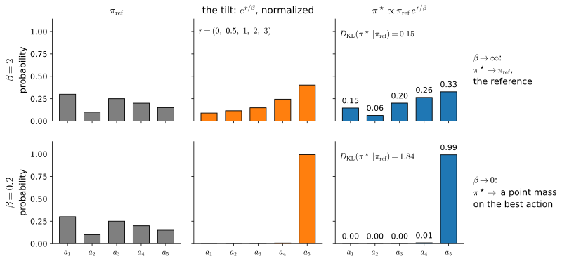

# Regularized Policy Optimization
:label:`sec_regularized`

PPO constrains each policy update relative to the preceding policy. A different objective keeps the policy near a fixed reference by subtracting a KL-divergence penalty from expected reward. This changes the optimum, not only the path taken by the optimizer, and it includes entropy regularization as the special case of a uniform reference.

We first examine why such a reference can be useful when rewards are learned from preferences. A reward model is accurate only where its comparison data provide information, and optimizing it can exploit errors elsewhere. A tabular gridworld makes this failure measurable against the true reward. We then derive the KL-regularized optimum, its soft Bellman backup, and its connections to language-model post-training and maximum-entropy reinforcement learning.

```{.python .input #regularized-regularized-policy-optimization}
%%tab pytorch
%matplotlib inline
from d2l import torch as d2l
import numpy as np
```

```{.python .input #regularized-regularized-policy-optimization}
%%tab jax
%matplotlib inline
from d2l import jax as d2l
import numpy as np
```

## Learning Rewards from Preferences

For many tasks, such as evaluating a helpful answer or a safe driving maneuver, an explicit numerical reward is difficult to specify. Pairwise comparisons are often easier to obtain. Preference-based reinforcement learning fits a reward model to these comparisons and then optimizes the learned reward :cite:`Christiano.Leike.Brown.ea.2017`. We represent the comparison model with logistic regression.

### Preferences and the Bradley-Terry Model

The Bradley-Terry model :cite:`Bradley.Terry.1952` assigns each candidate a scalar score, here the return of a trajectory, and models a comparison as a noisy observation of the score difference:

$$P(\tau \succ \tau') = \sigma\big( r(\tau) - r(\tau') \big), \qquad \sigma(u) = \frac{1}{1 + e^{-u}}.$$
:eqlabel:`eq_bradley_terry`

Fitting $r$ by maximum likelihood on labeled pairs is logistic regression on feature differences. We use a $4 \times 4$ gridworld with deterministic moves, an absorbing goal in the far corner worth $+1$, a living cost of $-0.04$ per step, and two central hazard cells that cost $-1.5$ to enter. The reference policy $\pi_{\textrm{ref}}$ is a softmax over the true action values at temperature $0.25$. It reaches the goal but remains stochastic, and it rarely enters the hazard lane.

```{.python .input #regularized-preferences-and-bradley-terry-1}
%%tab pytorch, jax
gamma = 0.95                                   # a 4 x 4 gridworld
P = np.zeros((16, 4, 16))
for s, a in np.ndindex(16, 4):
    x, y = s % 4, s // 4
    dx, dy = [(-1, 0), (0, 1), (1, 0), (0, -1)][a]   # left, down, right, up
    P[s, a, min(3, max(0, y + dy)) * 4 + min(3, max(0, x + dx))] = 1.0
P[15], P[15, :, 15] = 0.0, 1.0                 # the goal absorbs
bonus = np.full(16, -0.04)                     # every step costs a little
bonus[[5, 6]], bonus[15] = -1.5, 1.0           # a hazard lane; the goal pays
r_true = np.einsum('sat,t->sa', P, bonus)      # r*(s, a): the entered bonus
r_true[15] = 0.0
mdp = d2l.TabularMDP(P, r_true, gamma)
Q_true = mdp.backup(d2l.value_iteration(mdp, 200)[-1])
pi_ref = np.exp(Q_true / 0.25)                 # competent but hedging
pi_ref /= pi_ref.sum(1, keepdims=True)
```

We next withhold $r^*$ and estimate it from comparisons. We collect one
thousand trajectories from $\pi_{\textrm{ref}}$ and represent each by its
discounted visit counts $x(\tau)$, for which the true return is
$x(\tau)^\top r^*$. We sample six thousand pairs, label them according to
:eqref:`eq_bradley_terry`, and fit $\hat r$ by logistic regression on
feature differences. A stated weight-decay coefficient regularizes this
finite diagnostic:

```{.python .input #regularized-preferences-and-bradley-terry-2}
%%tab pytorch, jax
rng = np.random.default_rng(0)

def sample_traj(pi, T=40):
    s, x = 0, np.zeros((16, 4))
    for t in range(T):
        a = rng.choice(4, p=pi[s])
        x[s, a] += gamma ** t                  # discounted visits: R = x . r
        s = P[s, a].argmax()
        if s == 15:
            break
    return x.ravel()

X = np.stack([sample_traj(pi_ref) for _ in range(1000)])
R = X @ r_true.ravel()                         # true returns; the fit never sees them
i, j = rng.integers(0, 1000, (2, 6000))
y = (rng.random(6000) < 1 / (1 + np.exp(R[j] - R[i]))).astype(float)
D = X[i] - X[j]
w = np.zeros(64)
for _ in range(4000):                          # logistic regression on (D, y)
    w += 0.5 * (D.T @ (y - 1 / (1 + np.exp(-D @ w))) / len(y) - 0.02 * w)
r_hat = w.reshape(16, 4)
core = (X > 0).sum(0).reshape(16, 4) >= 50     # pairs seen in >= 50 episodes
print(f'never visited: {(X.sum(0) == 0).sum()} pairs; '
      f'in at least 50 episodes: {core.sum()} pairs')
print(f'rms fit error on those {core.sum()}: '
      f'{np.sqrt(((r_hat - r_true)[core] ** 2).mean()):.3f}')
print(f'entries into the hazard lane: true '
      f'{np.round(r_true[[1, 4, 2, 5], [1, 2, 1, 2]], 2)}, '
      f'fitted {np.round(r_hat[[1, 4, 2, 5], [1, 2, 1, 2]], 2)}')
```

The fit has an rms error of $0.19$ on the forty-six state-action pairs visited by the reference policy. Nine pairs are absent from the data, so their fitted rewards remain at the initialization value of zero. This matters for the hazard lane: entering it has true reward $-1.5$, but the fitted model assigns a value near zero because the reference policy rarely provides comparisons there. In this example, zero initialization and weight decay make unsupported predictions remain near zero. A neural reward model need not behave this way and may extrapolate unpredictably outside the data distribution.

### Identifiability and the Per-Prompt Baseline

A comparison includes two trajectories from the *same* start state, so :eqref:`eq_bradley_terry` depends only on score differences. In the prompt-response notation used at scale, shifting the reward by any function of the prompt, $r(x, y) \to r(x, y) + f(x)$, leaves every difference and therefore the likelihood unchanged; exercise 5 asks you to verify this result. A learned reward is thus identified only *relative to each prompt*, and its absolute level per prompt is a convention. Subtracting a per-prompt baseline does not change the comparison model. Independently, the zero-mean lemma of :numref:`sec_baselines` shows that subtracting any function of the state from the policy-gradient weight preserves unbiasedness. The group mean used by GRPO (:numref:`sec_baselines`) combines these two properties, subject to the self-inclusion qualification developed later.

### Dense versus Terminal Rewards

Our comparisons score complete trajectories, so $\hat r$ is trained on
end-to-end evidence. At scale, an outcome reward model (ORM) likewise
scores a completed response, whereas a process reward model (PRM) scores
intermediate steps. Intermediate rewards provide denser credit-assignment
signals but require additional labels and introduce more opportunities for
misspecification. Potential-based shaping is the standard densification
that preserves the optimal policy under its stated conditions
:cite:`Ng.Harada.Russell.1999`.

## Optimizing a Proxy Reward

We now optimize $\hat{r}$ directly with value iteration.

### Reward Hacking and Goodhart's Law

Goodhart's law describes the loss of validity that can occur when a measure becomes an optimization target. In reinforcement learning, *reward hacking* denotes policies that score highly under a specified or fitted reward while violating the intended objective; many examples are catalogued in :cite:`Krakovna.Uesato.Mikulik.ea.2020`. The shaped-bonus example in :numref:`sec_mdp` had the same mechanism: optimization uses errors in the estimated objective. There the error was specified manually; here it is statistical. We plan optimally under $\hat{r}$ with value iteration (:numref:`sec_valueiter`) and evaluate the resulting policy under $r^*$:

```{.python .input #regularized-reward-hacking-and-goodhart}
%%tab pytorch, jax
def plan(r):
    m = d2l.TabularMDP(P, r, gamma)
    return np.eye(4)[m.backup(d2l.value_iteration(m, 200)[-1]).argmax(1)]

def ret(pi, r):
    m = d2l.TabularMDP(P, r, gamma)
    return d2l.policy_evaluation(m, pi, 400)[-1][0]

for name, r in (('true reward  ', r_true), ('fitted reward', r_hat)):
    pi = plan(r)
    print(f'plan on {name}: fitted return {ret(pi, r_hat):+.2f}, '
          f'true return {ret(pi, r_true):+.2f}')
```

Under the fitted reward, the optimized policy scores $-0.03$, compared with $-0.24$ for the reference policy; only the difference is meaningful because the additive reward constant is unidentified. Under the true reward, however, the scores are $-2.11$ and $+0.59$. The optimized policy enters the hazard lane because its unsupported rewards were estimated near zero. Value iteration has optimized the supplied reward correctly; the failure lies in the reward model outside the reference policy's data distribution. :numref:`sec_offline` encounters the same problem for learned value functions.

### True Return against the KL Budget

The available evidence supports $\hat{r}$ primarily on trajectories sampled from $\pi_{\textrm{ref}}$. We therefore measure policy displacement from the reference with the KL divergence. For each coefficient $\beta$, we compute the policy that maximizes $\sum_t \gamma^t \big( \hat{r}_t - \beta\, D_{\textrm{KL}}( \pi(\cdot \mid s_t) \Vert \pi_{\textrm{ref}}(\cdot \mid s_t) ) \big)$, thereby tracing fitted and true return as functions of divergence. The next section derives this objective for a single decision and proves its optimum in closed form; in an MDP the optimum must also account for every *later* step's reward and penalty, and it does so through a $\beta$-dependent soft action value: replace value iteration's hard-max backup (:numref:`sec_valueiter`) with the reference-weighted soft one,

$$V_\beta(s) = \beta \log \sum_a \pi_{\textrm{ref}}(a \mid s)\, e^{Q_\beta(s, a)/\beta}, \qquad Q_\beta(s, a) = \hat{r}(s, a) + \gamma \sum_{s'} P(s' \mid s, a)\, V_\beta(s'),$$

whose fixed point gives the exactly optimal policy $\pi_\beta(a \mid s) \propto \pi_{\textrm{ref}}(a \mid s)\, e^{Q_\beta(s, a)/\beta}$. The next section derives this backup. Like the ordinary Bellman backup of :numref:`sec_valueiter`, it is a contraction, and the loop below solves its fixed point for each $\beta$. The printed residual measures numerical convergence. Large $\beta$ keeps the policy close to the reference, whereas small $\beta$ approaches the fitted-reward maximizer. For each $\pi_\beta$, we record true return, fitted return, and the discounted sum of per-state divergences from the reference along trajectories generated by $\pi_\beta$:

```{.python .input #regularized-the-measurement-true-return-against-the-kl-budget}
%%tab pytorch, jax
def soft_v(r, beta, num_iters=400):
    """Soft value iteration for the KL-penalized objective: iterate
    V(s) <- beta log sum_a pi_ref(a|s) exp((r + gamma P V)(s, a) / beta)."""
    V = np.zeros(16)
    for _ in range(num_iters):
        Q = r + gamma * np.einsum('sat,t->sa', P, V)
        m = Q.max(1)
        V = m + beta * np.log(
            (pi_ref * np.exp((Q - m[:, None]) / beta)).sum(1))
    return V

kls, true_ret, prox_ret, resid = [], [], [], 0.0
for beta in np.logspace(1, -2.5, 36):
    V_b = soft_v(r_hat, beta)
    Q_b = r_hat + gamma * np.einsum('sat,t->sa', P, V_b)
    m = Q_b.max(1, keepdims=True)
    pi = pi_ref * np.exp((Q_b - m) / beta)     # the exact optimum: pi_ref
    pi /= pi.sum(1, keepdims=True)             # tilted by the soft Q_beta
    back = m[:, 0] + beta * np.log(
        (pi_ref * np.exp((Q_b - m) / beta)).sum(1))
    resid = max(resid, np.abs(back - V_b).max())   # Bellman residual
    kl = (pi * np.log(np.where(pi > 0, pi / pi_ref, 1.0))).sum(1)
    kl[15] = 0.0                               # no decisions once absorbed
    rho = np.linalg.solve(np.eye(16) - gamma
                          * np.einsum('sa,sat->st', pi, P).T, np.eye(16)[0])
    kls.append(rho @ kl)
    true_ret.append(ret(pi, r_true))
    prox_ret.append(ret(pi, r_hat))
k = int(np.argmax(true_ret))
print(f'largest soft Bellman residual across the sweep: {resid:.1e}')
print(f'true return {true_ret[0]:+.2f} at KL 0, peak {true_ret[k]:+.2f} '
      f'at KL {kls[k]:.1f}, then {true_ret[-1]:+.2f} at KL {kls[-1]:.1f}')
d2l.plot(kls, [true_ret, prox_ret], 'KL from the reference (nats)', 'return',
         legend=['true return', 'fitted return'])
```

Every point in this figure is an optimum of the penalized objective; the Bellman residual is zero to double precision. The fitted return increases throughout the sweep. The true return instead rises from $-0.10$ to $+0.53$ at a divergence just below four nats, and then decreases sharply as the policy concentrates on the hazard lane. Moderate optimization of the imperfect reward model improves the true return, whereas further optimization exploits its unsupported predictions. A similar nonmonotonic relation has been observed when language models are optimized against a learned reward and evaluated by a separate reference measure :cite:`Gao.Schulman.Hilton.2023`. This motivates controlling the divergence from the reference policy directly.

## The Regularized Objective

Whereas :numref:`chap_reinforcement_learning` maximized expected reward, a fixed-reference penalty can restrict optimization of a learned reward to policies near the data-generating policy. For a single decision with reward $r(a)$ over a finite action set, reference $\pi_{\textrm{ref}}$, and coefficient $\beta > 0$, the regularized objective is

$$\max_{\pi}\ E_{a \sim \pi}\big[ r(a) \big] - \beta\, D_{\textrm{KL}}\big( \pi \Vert \pi_{\textrm{ref}} \big).$$
:eqlabel:`eq_kl_objective`

The penalty is part of the objective rather than a constraint on a single update. The coefficient $\beta$ sets its weight relative to reward, and the reference policy remains fixed.

### The Closed-Form Optimum

**Proposition.** For $\beta > 0$, the objective :eqref:`eq_kl_objective` is maximized by the unique policy

$$\pi^\star(a) = \frac{1}{Z}\, \pi_{\textrm{ref}}(a)\, e^{r(a)/\beta}, \qquad Z = \sum_{a} \pi_{\textrm{ref}}(a)\, e^{r(a)/\beta},$$
:eqlabel:`eq_kl_optimum`

and the maximal value is $\beta \log Z$.

**Proof.** By construction $r(a) = \beta \log\big( \pi^\star(a) Z / \pi_{\textrm{ref}}(a) \big)$. Substituting into the objective, for any policy $\pi$,

$$E_\pi[r] - \beta D_{\textrm{KL}}(\pi \Vert \pi_{\textrm{ref}}) = \sum_a \pi(a)\, \beta \log \frac{\pi^\star(a)\, Z}{\pi(a)} = \beta \log Z - \beta\, D_{\textrm{KL}}(\pi \Vert \pi^\star).$$

Gibbs' inequality, proved in :numref:`chap_mdl-information-theory`, says the remaining divergence is nonnegative and zero exactly when $\pi = \pi^\star$. $\blacksquare$

The optimum multiplies the reference by an exponential tilt and then renormalizes it, and the achieved value is a log-partition function. :numref:`fig_rl_kl_tilting` illustrates this relation. Two boundary cases complete the statement. The optimum inherits the reference's support: if $\pi_{\textrm{ref}}(a) = 0$, any policy placing mass on $a$ has infinite divergence, so :eqref:`eq_kl_optimum` correctly assigns $a$ zero probability, and no finite reward can assign positive probability to an action excluded by the reference. And as $\beta \to 0$ the limit is a point mass only when the best action is unique; with ties, it is the reference renormalized over the maximizing set. We verify the proposition numerically by solving :eqref:`eq_kl_objective` with exponentiated gradient ascent, using multiplicative updates renormalized onto the simplex; the $+1$ in the exact gradient $r - \beta(\log(\pi/\pi_{\textrm{ref}}) + 1)$ is constant across actions and cancels during normalization, so we drop it:

```{.python .input #regularized-the-proposition-1}
%%tab pytorch, jax
p_ref = np.array([0.30, 0.10, 0.25, 0.20, 0.15])
r = np.array([0.0, 0.5, 1.0, 2.0, 3.0])

def solve_kl(r, p, beta, steps=3000, eta=0.3):
    pi = np.full_like(p, 1 / len(p))
    for _ in range(steps):                     # exponentiated gradient ascent
        pi = pi * np.exp(eta * (r - beta * np.log(pi / p)))
        pi /= pi.sum()
    return pi

for beta in (5.0, 2.0, 0.5, 0.2):
    pi = solve_kl(r, p_ref, beta)
    print(f'beta = {beta:3}: pi_beta = {np.round(pi, 3)}, '
          f'reward {pi @ r:.2f}, KL {(pi * np.log(pi / p_ref)).sum():.2f}')
```

Then compare against :eqref:`eq_kl_optimum`, closed form against converged iterate, and the value against $\beta \log Z$:

```{.python .input #regularized-the-proposition-2}
%%tab pytorch, jax
def pi_star(r, p, beta):
    star = p * np.exp((r - r.max()) / beta)    # eq_kl_optimum, stabilized
    return star / star.sum()

gap = max(np.abs(solve_kl(r, p_ref, b) - pi_star(r, p_ref, b)).max()
          for b in (5.0, 2.0, 0.5, 0.2))
pi2 = solve_kl(r, p_ref, 2.0)
print(f'largest gap to the closed form over the ladder: {gap:.1e}')
print(f'objective at beta = 2: numerical '
      f'{pi2 @ r - 2.0 * (pi2 * np.log(pi2 / p_ref)).sum():.6f}, '
      f'beta log Z = {2.0 * np.log(p_ref @ np.exp(r / 2.0)):.6f}')
```

Across the tested values of $\beta$, the largest disagreement is at floating-point resolution, and the achieved objective matches $\beta \log Z$ to six decimal places. This confirms the exact finite-action result numerically.

![The optimum of the penalized objective shown as a product. Each row multiplies the reference $\pi_{\textrm{ref}} = (0.30,\ 0.10,\ 0.25,\ 0.20,\ 0.15)$ by the tilt $e^{r/\beta}$ for the reward $r = (0,\ 0.5,\ 1,\ 2,\ 3)$ and renormalizes, giving $\pi^\star$; the top row uses $\beta = 2$, the bottom $\beta = 0.2$. The reference is deliberately not monotone in the reward, and its dip at $a_2$ survives into $\pi^\star$ in both rows: $\pi^\star$ is a reweighting of the reference, not a ranking of the reward. The stronger tilt has greater divergence, $D_{\textrm{KL}}(\pi^\star \Vert \pi_{\textrm{ref}}) = 0.15$ in the top row and $1.84$ in the bottom, and the margins annotate the two limits: $\beta \to \infty$ returns the reference, $\beta \to 0$ a point mass on the best action.](../img/mdl-rl-kl-tilting.svg)
:label:`fig_rl_kl_tilting`

### Four Consequences of the Closed Form

**Without the penalty, the optimum is a point mass.** Send $\beta \to 0$ in :eqref:`eq_kl_optimum` and all mass flows to the highest-reward action, or, under ties, to the reference's distribution over the tied set; that is just the unregularized problem, whose solution was always the argmax. This result characterizes the *optimum*, not the dynamics of a particular training run. The entropy decrease measured in :numref:`sec_ppo` is consistent with movement toward the deterministic optimum of the unregularized objective. Regularization can instead make a stochastic policy optimal.

**The coefficient controls the interpolation.** The closed form gives the following limiting cases:

```{.python .input #regularized-four-consequences-1}
%%tab pytorch, jax
for beta in (100.0, 0.01):
    print(f'beta = {beta:6}: pi_star = {np.round(pi_star(r, p_ref, beta), 3)}')
```

$\beta \to \infty$ reproduces the reference; $\beta \to 0$ is greedy; every policy between is an exact optimum of some exchange rate between reward and divergence.

**A uniform reference is the entropy bonus.** Against a uniform reference, $D_{\textrm{KL}}(\pi \Vert \textrm{uniform}) = \log |\mathcal{A}| - H(\pi)$, so the penalty *is* an entropy bonus up to a constant, and :eqref:`eq_kl_objective` becomes the maximum-entropy objective. The closed form specializes to a softmax of the reward:

```{.python .input #regularized-four-consequences-2}
%%tab pytorch, jax
boltzmann = np.exp(r / 0.5) / np.exp(r / 0.5).sum()
print(np.allclose(pi_star(r, np.full(5, 0.2), 0.5), boltzmann))
```

This is the form of :numref:`sec_policygradient`'s softmax policies. The Boltzmann exploration distribution in :numref:`sec_qlearning` is also the optimizer of an entropy-regularized one-step objective, with temperature corresponding to $\beta$. The sequential version of this consequence is the soft backup, which closes the section.

**A posterior interpretation.** Equation :eqref:`eq_kl_optimum` has the
form of Bayes' rule: $\pi_{\textrm{ref}}$ is a prior, $e^{r/\beta}$ an
unnormalized likelihood, $\pi^\star$ a posterior, and $Z$ the normalizer.
Control-as-inference methods use this identity to interpret rewards as
log-likelihoods of optimality events and regularized policy optimization
as variational inference :cite:`Levine.2018,Korbak.Perez.Buckley.2022`.
The analogy permits selected inference tools, but it does not by itself
establish their approximation quality or empirical advantage for policies.

Sweeping $\beta$ traces the exact reward--divergence frontier for the finite-action example. The gridworld experiment evaluates an analogous frontier using the imperfect estimate $\hat{r}$:

```{.python .input #regularized-four-consequences-3}
%%tab pytorch, jax
front = np.stack([pi_star(r, p_ref, b) for b in np.logspace(1.5, -1.5, 61)])
kl_f = (front * np.log(front / p_ref)).sum(1)
print(f'KL 0 pays {p_ref @ r:.2f}; the frontier ends at KL '
      f'{np.log(1 / p_ref[r.argmax()]):.2f}, reward {r.max():.0f}')
d2l.plot(kl_f, front @ r, 'KL from the reference (nats)', 'expected reward')
```

With true reward on the vertical axis, the frontier is concave and increasing (exercise 2), so its marginal reward gain per nat decreases. The gridworld curve is nonmonotonic because optimization uses the fitted reward while evaluation uses true return. The two rows of :numref:`fig_rl_kl_tilting` are two points on this curve.

### Trust Region versus Penalty

Trust-region and fixed-reference methods both use KL divergence but in different roles.

> **Two uses of KL divergence.** A **trust region** (:numref:`sec_ppo`) measures divergence from the *previous iterate*. It restricts each update and protects a local approximation, while its reference changes after the update. A **fixed-reference penalty** (this section) is part of the objective and changes the optimum to :eqref:`eq_kl_optimum`. PPO-style language-model fine-tuning can use both: a clipped surrogate relative to the sampling policy for update stability, and a reward penalty relative to the frozen initial model to control the final policy :cite:`ouyang2022training`.

### The Direction of the KL Divergence

$D_{\textrm{KL}}(\pi \Vert \pi_{\textrm{ref}})$ is the *reverse* divergence in the taxonomy of :numref:`sec_mdl-fwd-vs-rev-kl`. Because it is an expectation under $\pi$, it can be estimated from policy samples. It penalizes assigning probability where the reference has little support but does not penalize assigning zero probability to reference modes, producing mode-seeking behavior. The forward direction $D_{\textrm{KL}}(\pi_{\textrm{ref}} \Vert \pi)$ instead penalizes failure to cover behavior sampled by the reference. The direction is therefore a modeling choice with different coverage effects.

## The Soft Backup and Its Consequences

### Maximum-Entropy Reinforcement Learning and the Soft Backup

The preceding derivation concerned one decision. In an MDP the penalty is applied at every step, $\sum_t \gamma^t \big( r_t - \beta\, D_{\textrm{KL}}( \pi(\cdot \mid s_t) \Vert \pi_{\textrm{ref}}(\cdot \mid s_t) ) \big)$, the objective our gridworld sweep optimized, and the proposition applies state by state with an action value in place of $r$, under one precaution the gridworld code already took: the value entering the tilt must itself account for every later step's reward *and* penalty, which makes it the $\beta$-dependent soft value $Q_\beta$ rather than the unregularized $Q^*$; tilting the reference by $Q^*$ is a different, merely heuristic family that is the exact optimum of no exchange rate. Writing the proposition's achieved value $\beta \log Z$ into the Bellman equation of :numref:`sec_valueiter` replaces the hard maximum with a soft one,

$$V(s) = \max_a Q(s, a) \quad \textrm{becomes} \quad V(s) = \beta \log \sum_a \pi_{\textrm{ref}}(a \mid s)\, e^{Q(s, a)/\beta},$$

the backup that `soft_v` iterated to a fixed point, with residual zero to double precision. It replaces the maximum by a log-sum-exp, recovering the ordinary $\max$ as $\beta \to 0$. With a uniform reference, this is *soft value iteration* and the objective is maximum-entropy reinforcement learning. The smooth backup provides an alternative to the hard maximum whose estimation bias was discussed in :numref:`sec_dqn`. Exercise 6 applies this backup to the slippery lake and varies $\beta$ from value iteration toward policy evaluation.

### DDPG, TD3 and SAC

The same components appear in three continuous-control methods. DDPG :cite:`Lillicrap.Hunt.Pritzel.ea.2016` trains a deterministic actor by the pathwise gradient of :numref:`sec_deeprl` through a learned critic, off-policy from a replay buffer, with target networks; it reuses samples efficiently but can be unstable. TD3 :cite:`Fujimoto.vanHoof.Meger.2018` diagnoses the brittleness largely as the maximization bias :numref:`sec_qlearning` demonstrated on a table: an actor optimized against a critic can exploit positive critic errors, so TD3 trains *twin* critics and takes their minimum, the bias argument applied twice, plus delayed actor updates and target smoothing. SAC :cite:`Haarnoja.Zhou.Abbeel.ea.2018` replaces the deterministic actor with a stochastic one and maximizes exactly this section's objective with a uniform reference: its "soft" critics implement the soft backup above, its entropy term is our penalty, its actor update is the pathwise gradient again, its twin critics are TD3's repair. The remaining mechanism is the change-of-variables correction SAC needs because its Gaussian actions are squashed through a $\tanh$ to fit bounded action spaces: squashing changes densities, so a log-determinant term joins the log-probabilities. The correction contributes one Jacobian term per action dimension. :numref:`sec_sac` derives it, combines these components into the full algorithm, and evaluates return and critic calibration.

### Connections to Later Sections

Three later sections use these results. :numref:`sec_dqn` studies the hard $\max$ under function approximation as the $\beta\to0$ limit. :numref:`sec_offline` studies a related distribution-shift problem with a fixed dataset and subtracts a pessimistic penalty where data are scarce rather than penalizing divergence from a reference policy. :numref:`sec_rl_sequences` applies :eqref:`eq_kl_objective` to language-model sequences, using a pretrained model as the reference and a reward learned from preferences. It also rearranges :eqref:`eq_kl_optimum` to express reward differences through policy log-ratios.

## Summary

Pairwise preferences identify reward differences but not an additive term depending only on the start state. A learned reward is reliable only on regions supported by its comparison data, and optimizing it can exploit errors elsewhere. A KL penalty relative to a fixed reference changes the objective and limits this displacement. Its exact optimum is the reference distribution exponentially tilted by reward, with value $\beta\log Z$. A uniform reference yields entropy regularization, and the corresponding Bellman update replaces a maximum by a log-sum-exp. Unlike a trust region relative to the previous iterate, a fixed-reference penalty changes the final optimum.

**Experimental scope.** The closed-form bandit calculations are exact. The gridworld experiment uses one map, one reference policy, and one seeded preference dataset. For that dataset, fitted return increases after true return begins to decrease, demonstrating overoptimization of the proxy. The location and size of this effect depend on the preference coverage and chosen hazard cost.

## Exercises

1. [conceptual] *Three limits.* Derive $\beta \to 0$, $\beta \to \infty$ and
   $\pi_{\textrm{ref}}$ uniform from the proposition, and say which one you have
   already met and where.
1. [short-code] *The frontier is concave.* Sweep $\beta$ and plot achieved
   reward against $D_{\textrm{KL}}(\pi_\beta \Vert \pi_{\textrm{ref}})$; verify
   concavity and explain what the slope at each point is.
1. [short-code] *Break the reward.* Perturb the fitted $\hat r$ at one
   rarely-visited state and rerun; how much KL budget does the optimizer need
   before it finds the error?
1. [conceptual] *Trust region or penalty.* For each of TRPO, PPO's clip, RLHF's
   KL term and on-policy distillation, say which of the two it is and what it
   is measured against.
1. [conceptual] *Identifiability.* Show $r(x,y) \to r(x,y) + f(x)$ leaves the
   Bradley-Terry likelihood unchanged, and deduce that a per-prompt baseline
   costs nothing.
1. [extended] *The soft backup, transplanted.* The measurement cell's
   `soft_v` solved the regularized Bellman equations on the hazard grid.
   Port it to the slippery lake with a uniform reference, plot
   $V_\beta^\star(s_0)$ against $\beta$, identify the two limits, and check
   the $\beta \to 0$ end against :numref:`sec_valueiter`'s value iteration.

[Discussions](https://d2l.discourse.group/)

<!-- slides -->

::: {.slide}
::: {.cover}
[Dive into Deep Learning · §15.3]{.kicker}

Regularized policy optimization<br>
**preference-based rewards · proxy-reward optimization · fixed-reference penalties · a closed-form optimum**
:::
:::

::: {.slide title="Learning a Reward Model"}
No formula scores a helpful answer; people can *compare*.

$$P(\tau \succ \tau') = \sigma\big( r(\tau) - r(\tau') \big)$$

Bradley-Terry: fitting $r$ is logistic regression on feature
differences.

. . .

Fit on 1000 trajectories from a competent reference:
rms error $0.19$ where the data lives, and the hazard lane,
truly $-1.5$ to enter, is priced at $\approx 0$: the reference
rarely entered it, so the data contain little evidence there. Its
near-zero estimate follows from initialization and regularization.
:::

::: {.slide title="Optimizing an Imperfect Reward"}
Plan *optimally* against the fitted reward; grade under the truth.

@!regularized-reward-hacking-and-goodhart

. . .

The fitted-reward optimum enters the hazard lane. It scores
higher under the fitted reward and substantially lower under
the true reward, exposing unsupported reward estimates.
:::

::: {.slide title="True Return Against KL Budget"}
Per $\beta$: solve the *regularized* Bellman equations (soft,
reference-weighted backup), residual printed; every point is an
exact optimum.

@!regularized-the-measurement-true-return-against-the-kl-budget

. . .

- fitted return rises throughout; true return reaches
  $+0.53$ at $\approx 4$ nats and then decreases sharply
- the same curve at language-model scale:
  :cite:`Gao.Schulman.Hilton.2023`
- this motivates direct control of divergence from the reference
:::

::: {.slide title="The Regularized Objective"}
$$\max_{\pi}\ E_{a \sim \pi}\big[ r(a) \big] - \beta\,
D_{\textrm{KL}}\big( \pi \Vert \pi_{\textrm{ref}} \big)$$

. . .

**Proposition.**
$\ \pi^\star(a) = \pi_{\textrm{ref}}(a)\, e^{r(a)/\beta} / Z$,
with value $\beta \log Z$.

**Proof.** The objective equals
$\beta \log Z - \beta\, D_{\textrm{KL}}(\pi \Vert \pi^\star)$;
apply Gibbs' inequality. $\blacksquare$

Verified numerically: largest gap over a ladder of $\beta$
is $\approx 10^{-16}$.
:::

::: {.slide title="The Closed-Form Optimum"}
{width=98%}

. . .

The optimum is a product rather than a reward ranking: the
reference's dip at $a_2$ remains in $\pi^\star$. The divergences
are $0.15$ at $\beta = 2$ and $1.84$ at $\beta = 0.2$.
:::

::: {.slide title="Four Consequences"}
- no penalty $\Rightarrow$ a point-mass *optimum* (ties: the
  reference over the tied set): PPO's entropy decay had a
  destination built into the objective
- $\beta$ interpolates: reference $\leftarrow \beta \to \infty$,
  greedy $\leftarrow \beta \to 0$
- uniform reference $=$ entropy bonus $=$ max-ent RL;
  $\pi^\star = \mathrm{softmax}(r/\beta)$, the optimizer of the
  entropy-regularized one-step objective
- Bayes' rule: prior $\pi_{\textrm{ref}}$, likelihood
  $e^{r/\beta}$, posterior $\pi^\star$
  :cite:`Levine.2018,Korbak.Perez.Buckley.2022`
:::

::: {.slide title="The Two KLs"}
**Trust region** (the clip): against the *previous iterate*;
constrains the path; gone at convergence.

**Penalty** (here): against a *frozen reference*; in the
objective; changes the optimum.

. . .

PPO-RLHF runs **both at once** :cite:`ouyang2022training`.

Direction matters: $D_{\textrm{KL}}(\pi \Vert \pi_{\textrm{ref}})$
is mode-seeking, so post-training *sharpens*
(:numref:`sec_mdl-fwd-vs-rev-kl`).
:::

::: {.slide title="Connections to SAC"}
$$V(s) = \beta \log \sum_a \pi_{\textrm{ref}}(a \mid s)\,
e^{Q(s, a)/\beta} \ \xrightarrow{\ \beta \to 0\ } \ \max_a Q(s, a)$$

- soft backup: DQN's $\max$ is the sharp corner of a family
- DDPG $\to$ TD3 $\to$ SAC combines pathwise gradients, twin
  critics, and this section's entropy-regularized objective
- Ahead: the same objective, with a language model as
  $\pi_{\textrm{ref}}$
:::
