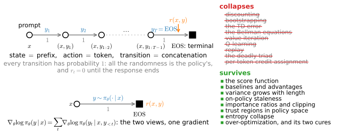

# Reinforcement Learning for Sequence Generation
:label:`sec_rl_sequences`

Autoregressive sequence generation can be written as a Markov decision process. The prompt is the start state, each token is an action, the prefix is the current state, and appending a token is a deterministic transition. A response is therefore a trajectory generated by the model's next-token policy.

This special structure simplifies several reinforcement-learning methods. We prove that response-level and token-level score-function gradients are equivalent, identify which components of the preceding chapters remain useful under terminal rewards and deterministic transitions, and study group baselines and KL regularization in a small language-model example. The resulting notation is used later in the Language Models part.

```{.python .input #rl-sequences-sequences-are-trajectories}
%%tab pytorch
from d2l import torch as d2l
import numpy as np
```

```{.python .input #rl-sequences-sequences-are-trajectories}
%%tab jax
from d2l import jax as d2l
import numpy as np
```

## Text Generation as a Markov Decision Process

### Prompt, Token, Prefix and Response

A language model with parameters $\theta$ maps a context to a distribution over the next token through the softmax head of :numref:`sec_gpt`. The generation loop samples a token, appends it to the context, and stops at EOS (:numref:`sec_decoding`). Interpreting the context as a state and the token as an action gives the correspondence in :numref:`tab_rl_sequence_dictionary`.

:Text generation read as a decision process. The left column is the Language Models part's vocabulary; the right column is what these two chapters built.
:label:`tab_rl_sequence_dictionary`

| language modeling | reinforcement learning |
|:--|:--|
| prompt $x$ | start state $s_0$, drawn from the prompt distribution $\mu_0$ of :numref:`sec_mdp` |
| token $y_t$ | action $a_t$ |
| prefix $(x, y_{<t})$ | state $s_t$ |
| response $y = (y_1, \ldots, y_T)$ | trajectory $\tau$ |
| EOS | terminal state |
| the next-token softmax of :numref:`sec_gpt` | the policy $\pi_\theta(a \mid s)$ of :numref:`sec_policygradient` |
| the `generate` loop of :numref:`sec_decoding` | the `rollout` of :numref:`sec_policygradient` |

The state is the complete prefix, not only the last token. Conditional on
that prefix, deterministic concatenation and the next-token policy specify
the distribution of the next prefix, so the representation is Markov.

The start-state distribution $\mu_0$ is the distribution over prompts. It
does not depend on $\theta$ and therefore contributes no score term to the
policy-gradient derivation. It nevertheless determines which prompts and
responses the objective weights, so empirical conclusions remain specific
to the chosen prompt distribution.

### Deterministic Transitions

The transition kernel is string concatenation: from prefix $s_t$ and token $a_t$, the next state is $(s_t, a_t)$ with probability one. A terminal reward $r(x,y)$ is assigned when the response ends. This is the deterministic case described in :numref:`sec_mdp`. In :numref:`sec_policygradient`, the trajectory probability :eqref:`eq_traj_prob` includes transition factors; here each factor is the constant one and contributes no score term. Under these assumptions, all rollout randomness comes from policy sampling. Unlike the model-free setting in :numref:`sec_qlearning`, the transition model is known exactly.

### The Factorization Proposition

The following identity connects a response distribution to its next-token factorization.

**Proposition.** For the token MDP of :numref:`tab_rl_sequence_dictionary`, the response-level and token-level views give the same gradient:

$$\nabla_\theta \log \pi_\theta(y \mid x) = \sum_{t=1}^{T} \nabla_\theta \log \pi_\theta(y_t \mid x, y_{<t}).$$
:eqlabel:`eq_seq_factorization`

*Moreover, with a terminal-only reward $r(x, y)$ and no discounting, every reward-to-go in the response is the same number, so a single response-level weight $r(x, y) - b(x)$ multiplies every token's score, without bias for any baseline $b$ that depends only on the prompt.*

**Proof.** The chain rule of probability factorizes the response's likelihood exactly, $\pi_\theta(y \mid x) = \prod_{t=1}^{T} \pi_\theta(y_t \mid x, y_{<t})$, with no transition factors because the transitions are deterministic; taking logarithms and gradients gives :eqref:`eq_seq_factorization`. With rewards zero until EOS and $\gamma = 1$, the reward-to-go of :numref:`sec_baselines` is $\hat{G}_t = r(x, y)$ at every $t$; subtracting a prompt-only baseline $b(x)$ is licensed bias-free by the zero-mean lemma of :numref:`sec_baselines`, leaving the weight $r(x, y) - b(x)$ on every score. $\blacksquare$

The left side of :eqref:`eq_seq_factorization` treats a complete response as
one structured action, while the right side factorizes it into $T$
next-token actions. Because the response log-probability is the sum of the
token log-probabilities, REINFORCE gives the same gradient in either view.

The quantity $r(x,y)-b(x)$ is a response-level Monte Carlo weight applied
to every token score. It is not the token advantage
$A(s_t,a_t)=Q(s_t,a_t)-V(s_t)$, whose terms condition on each prefix and
may differ across positions. A single terminal response score therefore
does not provide within-response credit assignment.

Under these single-turn assumptions, the response-level problem is a
contextual bandit: a prompt is sampled, one structured action is scored,
and no action changes a future context. Multi-turn dialogue, tool use, and
environment feedback restore controlled transitions and require the
sequential formulation.

## Simplifications for Sequence Generation

The correspondence in :numref:`tab_rl_sequence_dictionary` determines which general reinforcement-learning components simplify; :numref:`fig_rl_token_mdp` summarizes the result.

### Terms That Disappear

Several parts of the general MDP formulation simplify under these assumptions. A finite response receives one terminal reward, so we use $\gamma=1$. There is no intermediate target for TD learning, and neither Bellman backups nor value iteration are needed for the derivation below. The methods remain close to on-policy and therefore do not use Q-learning's replay mechanism. Every token receives the same response-level reward, so the formulation does not solve within-response credit assignment. These simplifications depend on deterministic concatenation and a terminal reward in a single turn. Process rewards reintroduce intermediate credit, while tool calls, environment feedback, and multi-turn interaction restore nontrivial transitions.

### The Remaining Optimization Problem

The policy-optimization components remain applicable: the score-function
identity and REINFORCE; action-independent baselines defined per prompt;
importance ratios and clipping for limited batch reuse; policy-space
trust regions; entropy or reference-policy regularization; and safeguards
against optimizing reward-model error. Sequence length still matters
because :eqref:`eq_seq_factorization` sums $T$ score terms, and an updated
policy no longer matches responses sampled before the update.

By contrast, this terminal-reward derivation does not use a learned
transition model, intermediate Bellman backups, or token-level TD targets.
Those components return when the task supplies process rewards or
nontrivial environment transitions.

![The token MDP and the components that simplify under its assumptions. Top: a response is a trajectory whose states are prefixes, whose actions are tokens, and whose transitions append the chosen token with probability one, so all randomness is the policy's; the reward arrives once, on the terminal edge into EOS. Below: the same object collapsed to one step, a single draw $y \sim \pi_\theta(\cdot \mid x)$ scored by $r(x, y)$, the two views sharing one gradient by :eqref:`eq_seq_factorization`. Right: components unnecessary under these assumptions are struck through; they become necessary again with process rewards, tool calls, or multi-turn feedback.](../img/mdl-rl-token-mdp.svg)
:label:`fig_rl_token_mdp`

### The Smallest Instance: Four Prompts and a Verifier

We study a finite one-step example that requires no environment simulator. It contains four prompts, nine candidate responses shared across prompts, an exact-match verifier, and a reference policy $\pi_{\textrm{ref}}$ representing a pretrained model. The reference assigns probability across the ordinary candidates and about $0.2$ percent to a response that lists every possible answer. For two prompts, no individual candidate matches the answer, so the maximum exact-match score is $0.5$. The policy is :eqref:`eq_softmax_policy`, one preference row per prompt; training starts from the reference, as post-training does.

```{.python .input #rl-sequences-the-smallest-instance}
%%tab pytorch, jax
prompts = ['2+2', '3*4', '8*8', '9*9']     # four prompts
answers = ['4', '12', '64', '81']          # their checked answers
resp = ['1', '3', '4', '7', '12', '19', '23', '35',
        'one of 4, 12, 64 or 81']          # nine candidate responses

def verify(x, y):                          # the verifier: exact match
    return float(resp[y] == answers[x])

def policy(theta):                         # pi(y | x), one row per prompt
    z = np.exp(theta - theta.max(1, keepdims=True))
    return z / z.sum(1, keepdims=True)

def success(pi, reward):                   # E r(x, y) over sampled y
    R = [[reward(x, y) for y in range(len(resp))] for x in range(4)]
    return (pi * np.array(R)).sum(1).mean()

theta_ref = np.zeros((4, 9))
theta_ref[:, 8] = -4.0                     # the reference rarely hedges
pi_ref = policy(theta_ref)
print(f'success of a response sampled from the reference: '
      f'{success(pi_ref, verify):.3f}')
```

### The Group Mean as the Baseline

For each prompt, we sample a group of $K$ responses, score them, standardize scores within the group, and take one ascent step on the log-probabilities. This applies :eqref:`eq_pg_normalized` with the group as the batch and the prompt as the start state. The group mean serves as a per-prompt baseline, so the example uses no value network. We also include the fixed-reference KL penalty from :numref:`sec_regularized` by replacing each sampled reward with $r - \beta \log \big( \pi_\theta(y \mid x) / \pi_{\textrm{ref}}(y \mid x) \big)$. The GRPO objective described below instead estimates KL as a separate loss term. Setting $\beta=0$ removes this penalty.

```{.python .input #rl-sequences-the-group-is-the-baseline-1}
%%tab pytorch, jax
def group_step(theta, K, reward, rng, beta=0.0, lr=2.0):
    pi, g = policy(theta), np.zeros_like(theta)
    for x in range(len(prompts)):              # one group of K per prompt
        ys = rng.choice(len(resp), K, p=pi[x])
        r = np.array([reward(x, y) for y in ys])
        r = r - beta * np.log(pi[x, ys] / pi_ref[x, ys])   # the KL penalty
        A = d2l.normalize(r)                   # the group mean as baseline
        g[x] = (np.eye(len(resp))[ys] - pi[x]).T @ A / K   # eq_softmax_score
    return theta + lr * g
```

The zero-mean lemma applies only when a baseline does not depend on the sampled action. A same-group mean includes the current sample's reward, so centering by it produces a biased estimator whose expectation is $(K-1)/K$ times the true gradient, as derived in :numref:`sec_baselines`. The leave-one-out correction is also described in :numref:`sec_baselines`. Division by the group standard deviation adds a random scale factor. Leave-one-out centering is unbiased because each sample is compared with the mean of the other $K-1$ samples. The following enumeration verifies the centering result for groups of two, without standardization:

```{.python .input #rl-sequences-the-group-is-the-baseline-3}
%%tab pytorch, jax
K, pi = 2, policy(theta_ref)
Rv = np.array([[verify(x, y) for y in range(len(resp))] for x in range(4)])
S = np.eye(len(resp))[None, :, :] - pi[:, None, :]   # eq_softmax_score
g = np.einsum('xy,xy,xyv->xv', pi, Rv, S)            # the exact gradient
u = np.zeros_like(g)
for y1, y2 in np.ndindex(len(resp), len(resp)):      # every group of K = 2
    w = (Rv[:, y1] - Rv[:, y2]) / 2                  # reward minus group mean
    u += (pi[:, y1] * pi[:, y2] * w)[:, None] * (S[:, y1] - S[:, y2]) / K
print(f'E of the group-centered update is (K-1)/K of the gradient: '
      f'{np.allclose(u, g * (K - 1) / K)}')
print(f'rescaled by K/(K-1), leave-one-out, it is exact: '
      f'{np.allclose(u * K / (K - 1), g)}')
```

At $K=1$, the factor $(K-1)/K$ is zero: the group mean equals the sample's reward, the standardized advantage is zero, and the reward-gradient update does not change the parameters. The underlying policy gradient is generally nonzero, and REINFORCE without this baseline would still learn. The $K=1$ row below therefore retains the reference score of $0.062$. The sweep fixes the sample budget at $6400$ scored responses per prompt, so smaller groups receive proportionally more updates:

```{.python .input #rl-sequences-the-group-is-the-baseline-2}
%%tab pytorch, jax
budget = 6400                    # scored responses per prompt, matched
for K in (1, 2, 4, 8, 32):
    rng, theta = np.random.default_rng(1), theta_ref.copy()
    for _ in range(budget // K):
        theta = group_step(theta, K, verify, rng)
    print(f'K = {K:2d}: success of a sampled response '
          f'{success(policy(theta), verify):.3f}')
```

The $K=1$ result matches the predicted reference score to three decimal places, while every tested $K\geq2$ reaches the verifier ceiling of $0.5$ at the same sample budget. For $K\geq2$, the factor $(K-1)/K$ rescales the centered gradient rather than eliminating it. The group samples provide the per-prompt comparison that a learned value baseline would otherwise supply, but the current sample's inclusion causes the stated bias. If every response in a group receives the same score, all standardized advantages are zero; this occurs on prompts that the current policy always fails or always solves. The zero-update result is specific to the reward-gradient term. Separate KL gradients, supervised objectives, or other loss terms can still update parameters at $K=1$.

## Where the Reward Comes From

The preceding analysis concerned the policy estimator. In large-scale applications, the reward $r(x,y)$ is typically learned from preferences or computed by a verifier.

### Learned Rewards from Preferences

When quality cannot be computed directly, people can compare pairs of responses to the same prompt, and a reward model $r_\phi(x,y)$ can be fitted with the Bradley-Terry model from :numref:`sec_regularized`, :eqref:`eq_bradley_terry`. Its evidence is strongest on the distribution represented by preference data, and its score is identifiable only up to an additive function of the prompt. A per-prompt baseline removes this unidentified term. A response-level reward is also terminal, matching the assumptions of the factorization proposition.

### Checked Rewards from Verifiers

For a growing family of tasks the reward needs no model at all, because the response can be *checked*: a unit-test harness runs the code, a proof assistant validates the derivation, an exact-match grader scores the final answer. Training against such checked rewards is called reinforcement learning from verifiable rewards, RLVR, the regime in which recent reasoning models are trained :cite:`DeepSeekAI.2025`. A verifier has a different error profile from a learned reward model: it is reliable for the property it checks but may omit relevant aspects of the intended objective.

### Reward Hacking as One Mechanism

Both learned reward models and programmatic verifiers are estimates of the intended objective, and optimization can exploit their errors. This is the same mechanism seen for a fitted $\hat{Q}$ in :numref:`sec_offline` and for a learned reward in :numref:`sec_regularized`. To demonstrate this mechanism, replace exact matching with a verifier that searches for the answer string. The response listing all answers then receives reward on every prompt, including the two without an individual correct candidate. Equation :eqref:`eq_kl_optimum` predicts the regularization required to suppress this response: its reference log-odds disadvantage is $4$, while its reward advantage is $1$, giving the threshold $\beta=1/4$.

```{.python .input #rl-sequences-reward-hacking-unified}
%%tab pytorch, jax
def sloppy(x, y):                  # accepts anything containing the answer
    return float(answers[x] in resp[y])

for beta in (0.0, 0.1, 0.2, 0.3, 0.5):
    rng, theta = np.random.default_rng(2), theta_ref.copy()
    for _ in range(400):
        theta = group_step(theta, 32, sloppy, rng, beta=beta)
    pi = policy(theta)
    print(f'beta = {beta:.1f}: sloppy {success(pi, sloppy):.2f}, '
          f'gold {success(pi, verify):.2f}, hedge {pi[:, 8].mean():.2f}')
```

The columns report the approximate grader score, the exact score, and the average probability of the hedged response. At $\beta=0$, the policy obtains a perfect grader score but only $0.50$ under exact evaluation. The multi-answer response remains favored at $\beta=0.1$, is nearly balanced at $0.2$, and is suppressed above the predicted threshold of $1/4$. Each row is close to the tilted optimum in :eqref:`eq_kl_optimum`, although group standardization introduces a random denominator and can shift the stationary point. Larger $\beta$ also limits useful changes to the policy: at $\beta=0.5$, the exact score falls to $0.24$. Thus regularization selects a point on the reward--divergence frontier rather than providing an absolute safeguard.

## GRPO and the Notation Contract

### Components of GRPO

Group Relative Policy Optimization (GRPO)
:cite:`Shao.Wang.Zhu.ea.2024` samples $K$ responses for each prompt and
uses the group-standardized response score

$$A_j=\frac{r_j-\mu}{\sigma+10^{-8}}$$

as the weight on every token of response $j$. The group mean replaces a
learned per-prompt value baseline, while division by $\sigma$ rescales the
update rather than providing an additional zero-mean control variate.
Reusing a group for several epochs introduces token-level ratios
$\rho_t$ and the clipped objective :eqref:`eq_ppo_clip`. A separate KL
penalty anchors the policy to a frozen reference, and the cited loss
normalizes each response by its length.

Two different reference policies appear. Clipping compares the current
policy with the policy that sampled the batch and limits each update. The
$\beta$ penalty compares with a frozen reference and changes the optimum.
They therefore play the two distinct roles described in
:numref:`sec_regularized`.

The finite experiment above is not a complete GRPO implementation. It takes
one update per group, folds the KL term into the reward, uses one-token
responses, and applies no response-length normalization. It does share
the same-group mean and hence the self-inclusion bias measured above;
RLOO replaces that mean with the unbiased leave-one-out baseline from
:numref:`sec_baselines`.

Direct Preference Optimization (DPO) uses a different objective. Solving
:eqref:`eq_kl_optimum` for the reward gives

$$r(x,y)=\beta\log\frac{\pi^\star(y\mid x)}
                              {\pi_{\textrm{ref}}(y\mid x)}+c(x),$$

where $c(x)$ is unidentified by same-prompt comparisons. Substituting this
relation into the preference likelihood fits the policy directly rather
than first fitting a scalar reward model :cite:`Rafailov.Sharma.Mitchell.ea.2023`.
The Language Models part develops that derivation and its assumptions.

### Notation Inherited by the Language Models Part

The Language Models part inherits these symbols verbatim; every object below was defined and exercised in these two chapters.

:The notation contract. Symbols the post-training chapters use without redefinition.
:label:`tab_rl_notation_contract`

| symbol | meaning | built in |
|:--|:--|:--|
| $x$, $y$ | prompt, response | this section |
| $\tau$ | trajectory | :numref:`sec_mdp` |
| $\mu_0$ | start-state, i.e. prompt, distribution | :numref:`sec_mdp` |
| $\pi_\theta$, $\pi_{\textrm{ref}}$ | policy; frozen reference | :numref:`sec_policygradient`, :numref:`sec_regularized` |
| $\hat{G}_t$ | reward-to-go | :numref:`sec_baselines` |
| $A$ | advantage | :numref:`sec_valueiter`, :numref:`sec_baselines` |
| $K$ | group size | :numref:`sec_baselines` |
| $\rho_t$ | importance ratio $\pi_\theta / \pi_{\theta_{\textrm{old}}}$ | :numref:`sec_ppo` |
| $\epsilon$ | clip half-width, exploration rate; never a numerical constant | :numref:`sec_ppo`, :numref:`sec_qlearning` |
| $\beta$ | KL coefficient | :numref:`sec_regularized` |
| $\delta_t$ | TD error | :numref:`sec_qlearning` |
| $w$, $w^-$ | critic parameters; target copy | :numref:`sec_actorcritic`, :numref:`sec_dqn` |
| $D_{\textrm{KL}}(P \Vert Q)$, $\mathbf{1}(\cdot)$ | KL divergence; indicator | :numref:`sec_regularized` |

## Where to Go Next

These chapters provide an introduction rather than comprehensive coverage. Three extensions are especially relevant.

**Model-based reinforcement learning and search.** :numref:`sec_valueiter` is the book's only model-based method. A direct extension is Dyna-Q: augment :numref:`sec_qlearning`'s tabular loop by storing observed transitions and applying the same Q-update to model-generated transitions between environment steps. Monte Carlo tree search can be viewed as a *policy-improvement operator*: search produces an improved action distribution, which is then distilled into the policy as a supervised target. That loop is AlphaZero :cite:`Silver.Schrittwieser.Simonyan.ea.2017,Silver.Hubert.Schrittwieser.ea.2018`; MuZero learns the model it searches in :cite:`Schrittwieser.Antonoglou.Hubert.ea.2020`; DreamerV3 and TD-MPC2 train control inside learned world models :cite:`Hafner.Pasukonis.Ba.ea.2025,Hansen.Su.Wang.2024`. The same search-and-distillation pattern appears in test-time reasoning methods for language models.

**Continuous control since 2024.** The objectives of :numref:`sec_deeprl` through :numref:`sec_regularized` stand; recent gains have come from normalization, scale and stability rather than new losses, and careful normalization even lets streaming, replay-free temporal-difference learning work after decades of not working :cite:`Elsayed.Vasan.Mahmood.2024,Gallici.Fellows.Ellis.ea.2025`. Reading a modern paper here, you should recognize nearly every symbol.

**What we deliberately left out.** Multi-agent reinforcement learning, where the opponent learns too, reached superhuman poker with search plus self-play :cite:`Brown.Sandholm.2017`. Distributional reinforcement learning models the return's whole distribution rather than its mean :cite:`Bellemare.Dabney.Munos.2017`. Meta-learning, hierarchy and partial observability each relax one of :numref:`sec_mdp`'s assumptions; Murphy's overview treats all three at textbook depth :cite:`Murphy.2025`. For a broader treatment of post-training practice, see the reinforcement-learning-from-human-feedback book :cite:`Lambert.2026`.

## Capstone Projects

These four projects play the role of a course programming assignment; each runs on a laptop CPU in minutes, and each carries a numeric sanity bar in place of an autograder.

**A. Build PPO from the pieces, and prove it is right.** Three self-checks: the ratio is exactly $1$ on the first epoch; GAE at $\lambda = 1$ equals reward-to-go minus $\hat{V}$ to floating-point tolerance; the clipped objective's gradient at $\theta = \theta_{\textrm{old}}$ equals the plain policy gradient. Bar: median return above $450$ on CartPole within $60$ updates, 3 seeds.

**B. Which implementation details actually matter.** Ablate five of the 37 catalogued PPO details, one at a time, three seeds each. Bar: at least one factor changes the median by more than the seed spread, and you can say which.

**C. Diagnose three faulty policies.** Examine one agent with a saturated policy, one with an untrained critic, and one with an undersized replay buffer. Identify each fault from the chapter's diagnostics before inspecting the code.

**D. GRPO from REINFORCE, in two lines.** Start from :numref:`sec_baselines`'s `train`, add the group-standardized weight and the clip, and reproduce this section's $K$-sweep. Bar: $K = 1$ shows no learning; $K \geq 4$ reaches the verifier's ceiling.

## Summary

In sequence generation, prompts are start states, tokens are actions, prefixes are states, and responses are trajectories with deterministic concatenation transitions. The response probability factorizes into next-token probabilities, so the response-level score equals the sum of token-level scores. With terminal reward, every token receives the same response-level weight unless an additional credit-assignment model is introduced. A same-group mean baseline shrinks the expected gradient by $(K-1)/K$; leave-one-out centering removes this bias. Learned rewards and programmatic verifiers can both be misspecified, and a KL penalty relative to a reference policy limits the resulting policy shift.

**Experimental scope.** The examples use four prompts and finite response sets. The $K=1$ same-group update is exactly zero, while all tested $K\geq2$ solve this small problem. The verifier example uses a deliberately constructed loophole and a reference distribution chosen to give a threshold near $\beta=1/4$. It illustrates the mechanism of reward exploitation, not the scale or complexity of language-model post-training.

## Exercises

1. [conceptual] *The factorization.* Prove
   $\nabla_\theta \log \pi_\theta(y \mid x) = \sum_t \nabla_\theta \log \pi_\theta(y_t \mid x, y_{<t})$
   and say why this makes the token-level and response-level views the same
   algorithm.
1. [conceptual] *Which terms disappear.* For each of discounting, bootstrapping, the
   TD error and replay, say in one sentence what property of the token MDP
   removes it, and name one setting (multi-turn dialogue, tool use) in which
   it comes back.
1. [short-code] *Why $K = 1$ learns nothing.* Predict it from the
   $(K-1)/K$ shrinkage of :numref:`sec_baselines`, run it, and say why
   leave-one-out has no defined value at $K = 1$.
1. [short-code] *Price the exploit.* Find the $\beta$ at which the KL penalty
   makes the verifier loophole unprofitable, and relate it to the reward gap
   between the exploit and the honest solution.
1. [conceptual] *Read a paper.* Take the GRPO objective as published and name,
   for each symbol, the section of these two chapters that built it, and the
   one component that is not in these chapters at all.

[Discussions](https://d2l.discourse.group/)

<!-- slides -->

::: {.slide}
::: {.cover}
[Dive into Deep Learning · §15.6]{.kicker}

Sequences are trajectories<br>
**text generation as an MDP · response factorization · terminal rewards · group baselines and KL penalties**
:::
:::

::: {.slide title="The Sequence-Generation MDP"}
| language modeling | reinforcement learning |
|:--|:--|
| prompt $x$ | start state $s_0 \sim \mu_0$ |
| token $y_t$ | action $a_t$ |
| prefix $(x, y_{<t})$ | state $s_t$ |
| response $y$ | trajectory $\tau$ |
| EOS | terminal state |
| next-token softmax | the policy $\pi_\theta$ |
| `generate` | `rollout` |

. . .

Transitions are *concatenation*: deterministic, known, probability one.
All randomness comes from policy sampling; the reward is terminal.
:::

::: {.slide title="Sequence and Token Gradients"}
$$\nabla_\theta \log \pi_\theta(y \mid x)
= \sum_{t=1}^{T} \nabla_\theta \log \pi_\theta(y_t \mid x, y_{<t})$$

. . .

- chain rule, no transition factors to drop: three-line proof
- terminal reward $\Rightarrow$ one response-level weight
  $r(x, y) - b(x)$ on every token's score (rather than the
  prefix-dependent $A(s_t, a_t)$)
- one structured action per episode: the contextual bandit of
  :numref:`sec_qlearning`; multi-turn interaction restores
  sequential dependence
:::

::: {.slide title="Simplifications for Sequence Generation"}
{width=98%}

. . .

Deterministic concatenation and terminal reward remove the need
for transition learning and intermediate Bellman targets; policy
optimization components remain applicable.
:::

::: {.slide title="The Group-Mean Baseline"}
Sample $K$ responses per prompt, standardize within the group,
one step on the log-probs. Same-group centering is *biased*:
its expectation is $(K-1)/K$ of the gradient (leave-one-out is
exact). **Prediction:** at $K = 1$ the shrinkage reaches zero
and the update vanishes identically.

@!rl-sequences-the-group-is-the-baseline-2

. . .

$0.062$ is the unchanged reference score. At $K=1$, including
the sample in its own baseline makes the reward-gradient update
identically zero.
:::

::: {.slide title="Reward-Model Exploitation"}
A grader that searches for the answer accepts a response listing
every candidate. :eqref:`eq_kl_optimum` predicts that this response
is favored when $\beta < $ reward gap / reference log-odds $= 1/4$.

@!rl-sequences-reward-hacking-unified

. . .

At $\beta=0$, the approximate score is perfect while the exact
score is $0.5$. Above the predicted threshold, the multi-answer
response is suppressed. The penalty limits rather than prevents exploitation.
:::

::: {.slide title="Components of GRPO"}
- group-standardized advantage: :numref:`sec_baselines`'s
  :eqref:`eq_pg_normalized`, group mean as baseline (biased by
  self-inclusion; LOO is the exact variant), **no value network**
- a few epochs per group: token-level clipped ratios
  :eqref:`eq_ppo_clip`
- $\beta\, D_{\textrm{KL}}$ to the frozen reference as a separate
  estimator: :eqref:`eq_kl_objective`
- both KLs at once: clip against the *previous iterate*, penalty
  against the *frozen reference*
- the example uses one step per group, no clipping, a KL term
  folded into the reward, and one-token responses

. . .

Read :eqref:`eq_kl_optimum` backwards and preferences fit the
policy directly: DPO :cite:`Rafailov.Sharma.Mitchell.ea.2023`.
:::

::: {.slide title="Notation for Later Chapters"}
Reward is **learned** (Bradley-Terry, :numref:`sec_regularized`)
or **checked** (a verifier: RLVR :cite:`DeepSeekAI.2025`).
Both can omit aspects of the intended objective, as do $\hat{Q}$
in :numref:`sec_offline`, $r_\phi$ in :numref:`sec_regularized`,
and the approximate grader here.

. . .

:numref:`tab_rl_notation_contract`: $x$, $y$, $\tau$, $\mu_0$,
$\pi_{\textrm{ref}}$, $\hat{G}_t$, $A$, $K$, $\rho_t$,
$\epsilon$, $\beta$, $\delta_t$, $w$: inherited verbatim by the
Language Models part.
:::

::: {.slide title="Where To Go Next"}
- **search**: MCTS is a policy-improvement operator, distilled
  back into the network; AlphaZero $\to$ MuZero $\to$ world
  models; the same pattern as test-time reasoning
- **continuous control**: same objectives, gains from
  normalization and scale
- omitted with pointers: multi-agent, distributional, meta,
  hierarchical, POMDPs
- next read: the RLHF book :cite:`Lambert.2026`
:::

::: {.slide title="Recap"}
- prompt = start state, token = action, prefix = state,
  response = trajectory; transitions are concatenation
- one gradient, two views; terminal reward puts one
  response-level weight $r - b(x)$ on every token
- at $K=1$, the reward-gradient update is zero because of
  self-inclusion; the verifier example matches the predicted
  threshold $\beta = $ reward gap / reference log-odds
- policy-gradient estimation, clipping, and KL regularization carry
  directly to the Language Models part
:::
