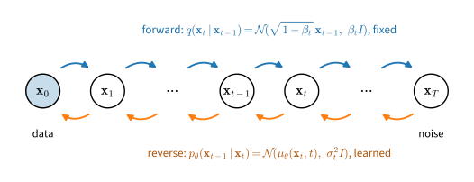

# Denoising Diffusion Probabilistic Models
:label:`sec_diffusion-ddpm`

The ladder of the previous section is a collection of separate perturbed
distributions, and the sampler that walks down it has a step size and a
number of steps per level that must be set by hand. A diffusion model
replaces the ladder by a single Markov process that turns data into noise in
$T$ small steps, and it learns the reversal of that process as a
latent-variable model, whose training objective derives from a variational
bound on the likelihood in the manner of :numref:`sec_mdl-latent-em-elbo`. The construction is due to
:citet:`sohl2015deep`; :citet:`ho2020denoising` showed that each term of the
bound becomes a weighted noise-prediction regression, the same regression
as denoising score matching, and that the resulting samples rival those of
adversarial models. This section derives the forward process, the bound, the
simplification, and the sampler, and checks the marginal, the noise
predictor, and the sampler on the running example. The presentation follows
lecture 13 of :citet:`Kuleshov.2023`; the monograph of :citet:`Lai.Song.Kim.ea.2025` develops the same derivation and
its alternatives at greater length.

```{.python .input #ddpm-denoising-diffusion-probabilistic-models}
%%tab pytorch
%matplotlib inline
from d2l import torch as d2l
import math
import torch
from torch import nn
```

```{.python .input #ddpm-denoising-diffusion-probabilistic-models}
%%tab jax
%matplotlib inline
from d2l import jax as d2l
import math
import jax
from jax import numpy as jnp
from flax import nnx
import optax
```

## The Forward Process

Fix a number of steps $T$ and a *variance schedule* $\beta_1, \ldots,
\beta_T \in (0, 1)$. The **forward process** starts from a data point
$\mathbf{x}_0 \sim q(\mathbf{x}_0)$, the data distribution ($q$ denotes
every distribution of the forward process), and applies $T$ Gaussian
transitions,

$$
q(\mathbf{x}_t \mid \mathbf{x}_{t-1}) = \mathcal{N}\big(\mathbf{x}_t;\ \sqrt{1 - \beta_t}\, \mathbf{x}_{t-1},\ \beta_t I\big),
\qquad
q(\mathbf{x}_{1:T} \mid \mathbf{x}_0) = \prod_{t=1}^{T} q(\mathbf{x}_t \mid \mathbf{x}_{t-1}),
$$
:eqlabel:`eq_diffusion-forward`

each of which shrinks the current state by $\sqrt{1 - \beta_t}$ and adds
noise of variance $\beta_t$. :citet:`ho2020denoising` use $T = 1000$ with
$\beta_t$ increasing linearly from $10^{-4}$ to $0.02$; the two-dimensional
experiments below use $T = 200$ with a correspondingly larger range. The
process is fixed in advance and has no parameters.
:numref:`fig_diffusion-forward-reverse` shows it as the upper row of arrows.


:label:`fig_diffusion-forward-reverse`

The shrinking factor distinguishes the process from the noise ladder of
:numref:`sec_diffusion-annealed`, which added noise without shrinking. If
$\mathbf{x}_{t-1}$ has identity covariance, then $\mathbf{x}_t$ has
covariance $(1 - \beta_t) I + \beta_t I = I$: the transition preserves unit
variance, so the chain moves data toward a *standard* Gaussian rather than
toward an ever wider one, and the end point does not depend on the scale of
the data once the remaining signal $\sqrt{\bar{\alpha}_T}\, \mathbf{x}_0$,
defined below, is negligible. Writing $\alpha_t = 1 - \beta_t$ (the symbol
$\alpha$ is reused here; the Langevin step size of the previous sections is
not needed again), a step is
$\mathbf{x}_t = \sqrt{\alpha_t}\, \mathbf{x}_{t-1} + \sqrt{\beta_t}\, \boldsymbol{\epsilon}_t$
with independent $\boldsymbol{\epsilon}_t \sim \mathcal{N}(\mathbf{0}, I)$.

### The Marginal in Closed Form

Composing two steps gives
$\mathbf{x}_t = \sqrt{\alpha_t \alpha_{t-1}}\, \mathbf{x}_{t-2} + \sqrt{\alpha_t \beta_{t-1}}\, \boldsymbol{\epsilon}_{t-1} + \sqrt{\beta_t}\, \boldsymbol{\epsilon}_t$.
The two noise terms are independent Gaussians, so their sum is a Gaussian
with variance $\alpha_t \beta_{t-1} + \beta_t = \alpha_t (1 - \alpha_{t-1}) + 1 - \alpha_t = 1 - \alpha_t \alpha_{t-1}$.
Repeating the argument down to $\mathbf{x}_0$, with
$\bar{\alpha}_t = \prod_{s=1}^{t} \alpha_s$, gives the marginal of any step
directly from the data:

$$
q(\mathbf{x}_t \mid \mathbf{x}_0) = \mathcal{N}\big(\mathbf{x}_t;\ \sqrt{\bar{\alpha}_t}\, \mathbf{x}_0,\ (1 - \bar{\alpha}_t) I\big),
\qquad\textrm{i.e.}\qquad
\mathbf{x}_t = \sqrt{\bar{\alpha}_t}\, \mathbf{x}_0 + \sqrt{1 - \bar{\alpha}_t}\, \boldsymbol{\epsilon},
\quad \boldsymbol{\epsilon} \sim \mathcal{N}(\mathbf{0}, I).
$$
:eqlabel:`eq_diffusion-marginal`

The formal induction is given in :numref:`sec_mdl-ddpm-discretized-sde`
(:eqref:`eq_mdl-ddpm-marginal`). The formula has two consequences. First,
training never needs to simulate the chain: any $\mathbf{x}_t$ is one
Gaussian draw away from $\mathbf{x}_0$. Second, the marginals are, up to
the rescaling by $\sqrt{\bar{\alpha}_t}$, the noise ladder of
:numref:`sec_diffusion-annealed`. Dividing by $\sqrt{\bar{\alpha}_t}$ gives
$\mathbf{x}_t / \sqrt{\bar{\alpha}_t} = \mathbf{x}_0 + \sqrt{(1 - \bar{\alpha}_t) / \bar{\alpha}_t}\; \boldsymbol{\epsilon}$,
a perturbed copy of the data at a noise level that grows with $t$. With the
schedule of
:citet:`ho2020denoising`, $\bar{\alpha}_T \approx 4 \times 10^{-5}$, so
$q(\mathbf{x}_T \mid \mathbf{x}_0)$ is a standard Gaussian to within a
scaled-down trace of $\mathbf{x}_0$, whatever $\mathbf{x}_0$ was.

The cell sets up the schedule for the running example and checks
:eqref:`eq_diffusion-marginal` by simulation: it runs the chain on the
training set and compares the mean and variance of the resulting
$\mathbf{x}_t$ with those of a one-shot draw from the closed form. In the
code, index `t` runs from $0$ to $T - 1$ and stands for step $t + 1$ of the
text.

```{.python .input #ddpm-the-marginal-in-closed-form}
%%tab pytorch
torch.manual_seed(0)
mix = d2l.GaussianMixture(means=[[-2.5, -1.5], [2.5, -1.5], [0.0, 2.5]],
                          weights=[0.5, 0.3, 0.2], std=0.5)
data, test = mix.sample(2000), mix.sample(2000)

T = 200
beta = torch.linspace(1e-4, 0.1, T)
alpha = 1 - beta
alpha_bar = torch.cumprod(alpha, 0)
print(f'alpha_bar_T = {alpha_bar[-1]:.1e}: after T steps the data are scaled '
      f'by {alpha_bar[-1].sqrt():.3f}')

torch.manual_seed(1)
x = data.clone()
for t in range(T):  # the chain, step by step
    x = alpha[t].sqrt() * x + beta[t].sqrt() * torch.randn_like(x)
    if t + 1 in (10, 50, 200):
        one_shot = (alpha_bar[t].sqrt() * data
                    + (1 - alpha_bar[t]).sqrt() * torch.randn_like(data))
        print(f'step {t + 1:3d}: chain: mean {[round(m, 3) for m in x.mean(0).tolist()]}, '
              f'var {x.var(0).mean():.3f} | one shot: mean '
              f'{[round(m, 3) for m in one_shot.mean(0).tolist()]}, '
              f'var {one_shot.var(0).mean():.3f}')
```

```{.python .input #ddpm-the-marginal-in-closed-form}
%%tab jax
key = jax.random.PRNGKey(0)
mix = d2l.GaussianMixture(means=[[-2.5, -1.5], [2.5, -1.5], [0.0, 2.5]],
                          weights=[0.5, 0.3, 0.2], std=0.5)
key, k1, k2 = jax.random.split(key, 3)
data, test = mix.sample(k1, 2000), mix.sample(k2, 2000)

T = 200
beta = jnp.linspace(1e-4, 0.1, T)
alpha = 1 - beta
alpha_bar = jnp.cumprod(alpha)
print(f'alpha_bar_T = {alpha_bar[-1]:.1e}: after T steps the data are scaled '
      f'by {jnp.sqrt(alpha_bar[-1]):.3f}')

x = data
for t in range(T):  # the chain, step by step
    key, subkey = jax.random.split(key)
    x = jnp.sqrt(alpha[t]) * x + jnp.sqrt(beta[t]) * jax.random.normal(subkey, x.shape)
    if t + 1 in (10, 50, 200):
        key, subkey = jax.random.split(key)
        one_shot = (jnp.sqrt(alpha_bar[t]) * data
                    + jnp.sqrt(1 - alpha_bar[t]) * jax.random.normal(subkey, data.shape))
        print(f'step {t + 1:3d}: chain: mean {[round(float(m), 3) for m in x.mean(0)]}, '
              f'var {x.var(0).mean():.3f} | one shot: mean '
              f'{[round(float(m), 3) for m in one_shot.mean(0)]}, '
              f'var {one_shot.var(0).mean():.3f}')
```

The chain and the one-shot draw agree closely at every checkpoint, and after
two hundred steps both have mean near zero and unit variance: the mixture
has been carried very nearly to a standard Gaussian.

## The Reverse Process

Generation runs the chain backward: draw $\mathbf{x}_T \sim \mathcal{N}(\mathbf{0}, I)$
and sample $\mathbf{x}_{t-1}$ from the reversal of each forward step until
$\mathbf{x}_0$ is reached. The exact reversal $q(\mathbf{x}_{t-1} \mid \mathbf{x}_t)$
is, by Bayes' rule, proportional to $q(\mathbf{x}_t \mid \mathbf{x}_{t-1})\, q(\mathbf{x}_{t-1})$,
and it involves the marginal $q(\mathbf{x}_{t-1})$, which depends on the
entire data distribution and is unavailable. Two facts make it learnable.
When the steps are small, the reversal of a Gaussian transition is itself
close to a Gaussian, a classical observation that :citet:`sohl2015deep`
turned into a model; in the continuous-time limit the time reversal of the
forward diffusion is exactly a diffusion whose drift involves the score of
the marginals (:numref:`sec_mdl-time-reversal`, :cite:`Anderson.1982`). The
**reverse process** is therefore modeled as a Markov chain of Gaussians
running from $T$ to $0$,

$$
p_{\boldsymbol{\theta}}(\mathbf{x}_{0:T}) = p(\mathbf{x}_T) \prod_{t=1}^{T} p_{\boldsymbol{\theta}}(\mathbf{x}_{t-1} \mid \mathbf{x}_t),
\qquad
p_{\boldsymbol{\theta}}(\mathbf{x}_{t-1} \mid \mathbf{x}_t) = \mathcal{N}\big(\mathbf{x}_{t-1};\ \boldsymbol{\mu}_{\boldsymbol{\theta}}(\mathbf{x}_t, t),\ \sigma_t^2 I\big),
$$
:eqlabel:`eq_diffusion-reverse`

with $p(\mathbf{x}_T) = \mathcal{N}(\mathbf{0}, I)$, a mean
$\boldsymbol{\mu}_{\boldsymbol{\theta}}$ computed by a network that receives
the current state and the step index, and variances $\sigma_t^2$ that we fix
in advance. Here $\sigma_t$ is the standard deviation of a reverse step, not
the perturbation level $\sigma_i$ of the previous sections; the noise level
of $\mathbf{x}_t$ is $\sqrt{1 - \bar{\alpha}_t}$.
:citet:`ho2020denoising` found that $\sigma_t^2 = \beta_t$ and the posterior
variance derived below give similar results, and
:citet:`Nichol.Dhariwal.2021` later learned the variances. The intermediate
states
$\mathbf{x}_1, \ldots, \mathbf{x}_T$ are latent variables, and the model
density of a data point is the marginal
$p_{\boldsymbol{\theta}}(\mathbf{x}_0) = \int p_{\boldsymbol{\theta}}(\mathbf{x}_{0:T})\, d\mathbf{x}_{1:T}$,
an integral over $T$ copies of the data space that is intractable.

## The Variational Bound

An intractable marginal likelihood with a tractable joint is the situation
of :numref:`sec_mdl-latent-em-elbo`, and the same device applies: bound the
log-likelihood from below with an auxiliary distribution over the latents.
Here the auxiliary distribution is the forward process itself,
$q(\mathbf{x}_{1:T} \mid \mathbf{x}_0)$, which is fixed rather than learned.
Multiplying and dividing by it inside the integral and applying Jensen's
inequality (:numref:`subsec_mdl-jensen`) to the concave logarithm,

$$
\log p_{\boldsymbol{\theta}}(\mathbf{x}_0)
= \log \mathbb{E}_{q(\mathbf{x}_{1:T} \mid \mathbf{x}_0)}\!\left[ \frac{p_{\boldsymbol{\theta}}(\mathbf{x}_{0:T})}{q(\mathbf{x}_{1:T} \mid \mathbf{x}_0)} \right]
\;\geq\;
\mathbb{E}_{q(\mathbf{x}_{1:T} \mid \mathbf{x}_0)}\!\left[ \log \frac{p_{\boldsymbol{\theta}}(\mathbf{x}_{0:T})}{q(\mathbf{x}_{1:T} \mid \mathbf{x}_0)} \right]
=: -L_{\textrm{VLB}}(\mathbf{x}_0).
$$
:eqlabel:`eq_diffusion-elbo`

The gap between the two sides is the Kullback--Leibler divergence
$\mathrm{KL}\big(q(\mathbf{x}_{1:T} \mid \mathbf{x}_0)\, \|\, p_{\boldsymbol{\theta}}(\mathbf{x}_{1:T} \mid \mathbf{x}_0)\big)$,
so minimizing $L_{\textrm{VLB}}$ pushes the model likelihood up and pulls
the learned reverse process toward the true reversal of the forward one.

### Decomposition into Per-Step Terms

Both processes are Markov chains, and substituting their factorizations
turns the bound into a sum of one term per step. Writing $\mathbb{E}_q$ for
the expectation over $q(\mathbf{x}_{1:T} \mid \mathbf{x}_0)$,

$$
\begin{aligned}
L_{\textrm{VLB}}
&= \mathbb{E}_q\!\left[ -\log p(\mathbf{x}_T) - \sum_{t=1}^{T} \log \frac{p_{\boldsymbol{\theta}}(\mathbf{x}_{t-1} \mid \mathbf{x}_t)}{q(\mathbf{x}_t \mid \mathbf{x}_{t-1})} \right] \\
&= \mathbb{E}_q\!\left[ -\log p(\mathbf{x}_T) - \sum_{t=2}^{T} \log \left( \frac{p_{\boldsymbol{\theta}}(\mathbf{x}_{t-1} \mid \mathbf{x}_t)}{q(\mathbf{x}_{t-1} \mid \mathbf{x}_t, \mathbf{x}_0)} \cdot \frac{q(\mathbf{x}_{t-1} \mid \mathbf{x}_0)}{q(\mathbf{x}_t \mid \mathbf{x}_0)} \right) - \log \frac{p_{\boldsymbol{\theta}}(\mathbf{x}_0 \mid \mathbf{x}_1)}{q(\mathbf{x}_1 \mid \mathbf{x}_0)} \right] \\
&= \mathbb{E}_q\!\left[ \log \frac{q(\mathbf{x}_T \mid \mathbf{x}_0)}{p(\mathbf{x}_T)} + \sum_{t=2}^{T} \log \frac{q(\mathbf{x}_{t-1} \mid \mathbf{x}_t, \mathbf{x}_0)}{p_{\boldsymbol{\theta}}(\mathbf{x}_{t-1} \mid \mathbf{x}_t)} - \log p_{\boldsymbol{\theta}}(\mathbf{x}_0 \mid \mathbf{x}_1) \right].
\end{aligned}
$$
:eqlabel:`eq_diffusion-elbo-steps`

The second line rewrites each forward transition with $t \geq 2$ through
Bayes' rule conditioned on $\mathbf{x}_0$,
$q(\mathbf{x}_t \mid \mathbf{x}_{t-1}) = q(\mathbf{x}_t \mid \mathbf{x}_{t-1}, \mathbf{x}_0) = q(\mathbf{x}_{t-1} \mid \mathbf{x}_t, \mathbf{x}_0)\, q(\mathbf{x}_t \mid \mathbf{x}_0) / q(\mathbf{x}_{t-1} \mid \mathbf{x}_0)$,
where the first equality is the Markov property. The third line collapses
the telescoping product of the ratios $q(\mathbf{x}_{t-1} \mid \mathbf{x}_0) / q(\mathbf{x}_t \mid \mathbf{x}_0)$
over $t = 2, \ldots, T$ into $q(\mathbf{x}_1 \mid \mathbf{x}_0) / q(\mathbf{x}_T \mid \mathbf{x}_0)$,
whose numerator cancels the factor $q(\mathbf{x}_1 \mid \mathbf{x}_0)$ in the
$t = 1$ term. Each logarithmic ratio in the
final line is, in expectation, a Kullback--Leibler divergence between two
distributions of the same variable, so

$$
L_{\textrm{VLB}}
= \underbrace{\mathrm{KL}\big(q(\mathbf{x}_T \mid \mathbf{x}_0)\, \|\, p(\mathbf{x}_T)\big)}_{L_T}
+ \sum_{t=2}^{T} \underbrace{\mathbb{E}_q\Big[\mathrm{KL}\big(q(\mathbf{x}_{t-1} \mid \mathbf{x}_t, \mathbf{x}_0)\, \|\, p_{\boldsymbol{\theta}}(\mathbf{x}_{t-1} \mid \mathbf{x}_t)\big)\Big]}_{L_{t-1}}
+ \underbrace{\mathbb{E}_q\big[-\log p_{\boldsymbol{\theta}}(\mathbf{x}_0 \mid \mathbf{x}_1)\big]}_{L_0}.
$$
:eqlabel:`eq_diffusion-elbo-terms`

The three kinds of terms have different roles :cite:`ho2020denoising`. The
*prior term* $L_T$ compares the end of the forward chain with the standard
Gaussian that the reverse chain starts from; it contains no parameters and
is close to zero for a schedule that reaches $\bar{\alpha}_T \approx 0$. The
*reconstruction term* $L_0$ scores the final denoising step. The
*denoising terms* $L_{t-1}$ carry the training signal: each asks the learned
transition $p_{\boldsymbol{\theta}}(\mathbf{x}_{t-1} \mid \mathbf{x}_t)$ to
match $q(\mathbf{x}_{t-1} \mid \mathbf{x}_t, \mathbf{x}_0)$, the reversal
of step $t$ *given the clean point*. Conditioning on $\mathbf{x}_0$ is what
makes the target tractable: unlike $q(\mathbf{x}_{t-1} \mid \mathbf{x}_t)$,
which requires the data marginal, this posterior involves only the two
Gaussian kernels of the forward process.

### The Forward Posterior

By Bayes' rule, $q(\mathbf{x}_{t-1} \mid \mathbf{x}_t, \mathbf{x}_0) \propto q(\mathbf{x}_t \mid \mathbf{x}_{t-1})\, q(\mathbf{x}_{t-1} \mid \mathbf{x}_0)$,
a product of two Gaussians in $\mathbf{x}_{t-1}$: the first has mean
$\mathbf{x}_t / \sqrt{\alpha_t}$ and variance $\beta_t / \alpha_t$ as a
function of $\mathbf{x}_{t-1}$, and the second has mean
$\sqrt{\bar{\alpha}_{t-1}}\, \mathbf{x}_0$ and variance $1 - \bar{\alpha}_{t-1}$.
Precisions of Gaussian factors add and means combine in proportion to
precision, so the posterior is Gaussian,
$q(\mathbf{x}_{t-1} \mid \mathbf{x}_t, \mathbf{x}_0) = \mathcal{N}(\tilde{\boldsymbol{\mu}}_t(\mathbf{x}_t, \mathbf{x}_0), \tilde{\beta}_t I)$,
with

$$
\frac{1}{\tilde{\beta}_t} = \frac{\alpha_t}{\beta_t} + \frac{1}{1 - \bar{\alpha}_{t-1}} = \frac{1 - \bar{\alpha}_t}{\beta_t (1 - \bar{\alpha}_{t-1})},
\qquad
\tilde{\boldsymbol{\mu}}_t = \frac{\sqrt{\bar{\alpha}_{t-1}}\, \beta_t}{1 - \bar{\alpha}_t}\, \mathbf{x}_0 + \frac{\sqrt{\alpha_t}\, (1 - \bar{\alpha}_{t-1})}{1 - \bar{\alpha}_t}\, \mathbf{x}_t,
$$
:eqlabel:`eq_diffusion-posterior`

where the simplification of the precision uses $\alpha_t (1 - \bar{\alpha}_{t-1}) + \beta_t = 1 - \bar{\alpha}_t$
(Exercise 2 fills in the algebra). The posterior mean is a linear
combination of the clean point and the current noisy point, and its variance
$\tilde{\beta}_t = \beta_t (1 - \bar{\alpha}_{t-1}) / (1 - \bar{\alpha}_t)$
is smaller than $\beta_t$: much smaller at the first steps, where
$\tilde{\beta}_1 = 0$, and nearly equal once $\bar{\alpha}_{t-1}$ is well
below one.

## From the Bound to Noise Prediction

With the reverse variances fixed at $\sigma_t^2$, each denoising term is a
Kullback--Leibler divergence between two isotropic Gaussians whose
covariances do not depend on $\boldsymbol{\theta}$, which by
:eqref:`eq_gan_mvn_kl` is a scaled squared distance between their means
plus a constant (the constant vanishes when $\sigma_t^2 = \tilde{\beta}_t$):

$$
L_{t-1} = \mathbb{E}_q\!\left[ \frac{1}{2 \sigma_t^2} \big\| \tilde{\boldsymbol{\mu}}_t(\mathbf{x}_t, \mathbf{x}_0) - \boldsymbol{\mu}_{\boldsymbol{\theta}}(\mathbf{x}_t, t) \big\|^2 \right] + \textrm{const}.
$$
:eqlabel:`eq_diffusion-mean-matching`

The network could predict $\tilde{\boldsymbol{\mu}}_t$ directly.
:citet:`ho2020denoising` found that a change of variables gives a target
that works about as well with the bound and much better with the simplified
loss below. Expressing the clean point through the noise that produced
$\mathbf{x}_t$ in :eqref:`eq_diffusion-marginal`,
$\mathbf{x}_0 = (\mathbf{x}_t - \sqrt{1 - \bar{\alpha}_t}\, \boldsymbol{\epsilon}) / \sqrt{\bar{\alpha}_t}$,
and substituting into :eqref:`eq_diffusion-posterior`, the coefficients of
$\mathbf{x}_t$ combine into $1 / \sqrt{\alpha_t}$ and the posterior mean
becomes

$$
\tilde{\boldsymbol{\mu}}_t = \frac{1}{\sqrt{\alpha_t}} \left( \mathbf{x}_t - \frac{\beta_t}{\sqrt{1 - \bar{\alpha}_t}}\, \boldsymbol{\epsilon} \right).
$$
:eqlabel:`eq_diffusion-posterior-mean-eps`

Given $\mathbf{x}_t$ and $t$, which the network receives as inputs,
everything in this expression is known except $\boldsymbol{\epsilon}$, so
the natural parameterization lets the network predict the noise,

$$
\boldsymbol{\mu}_{\boldsymbol{\theta}}(\mathbf{x}_t, t) = \frac{1}{\sqrt{\alpha_t}} \left( \mathbf{x}_t - \frac{\beta_t}{\sqrt{1 - \bar{\alpha}_t}}\, \boldsymbol{\epsilon}_{\boldsymbol{\theta}}(\mathbf{x}_t, t) \right),
$$
:eqlabel:`eq_diffusion-mu-theta`

and :eqref:`eq_diffusion-mean-matching` becomes a regression of
$\boldsymbol{\epsilon}_{\boldsymbol{\theta}}$ onto $\boldsymbol{\epsilon}$
with a step-dependent weight:

$$
L_{t-1} = \mathbb{E}_{\mathbf{x}_0, \boldsymbol{\epsilon}}\!\left[ \frac{\beta_t^2}{2 \sigma_t^2 \alpha_t (1 - \bar{\alpha}_t)} \big\| \boldsymbol{\epsilon} - \boldsymbol{\epsilon}_{\boldsymbol{\theta}}\big(\sqrt{\bar{\alpha}_t}\, \mathbf{x}_0 + \sqrt{1 - \bar{\alpha}_t}\, \boldsymbol{\epsilon},\ t\big) \big\|^2 \right] + \textrm{const}.
$$
:eqlabel:`eq_diffusion-lt-eps`

For $\sigma_t^2 = \beta_t$ and the schedule used in the code below, the
weight in front is about one half at the start of the chain, falls roughly
like $1 / t$ to a tenth of that by $t = 20$, and stays between about $0.025$
and $0.06$ over the rest of the chain; $\sigma_t^2 = \tilde{\beta}_t$ makes
the early weights larger still (Exercise 3 traces both).
:citet:`ho2020denoising` drop the weight and also drop the separate
treatment of $L_0$, training instead on the **simple loss**

$$
L_{\textrm{simple}}(\boldsymbol{\theta}) = \mathbb{E}_{t \sim \mathcal{U}\{1, \ldots, T\},\ \mathbf{x}_0,\ \boldsymbol{\epsilon}}\!\left[ \big\| \boldsymbol{\epsilon} - \boldsymbol{\epsilon}_{\boldsymbol{\theta}}\big(\sqrt{\bar{\alpha}_t}\, \mathbf{x}_0 + \sqrt{1 - \bar{\alpha}_t}\, \boldsymbol{\epsilon},\ t\big) \big\|^2 \right],
$$
:eqlabel:`eq_diffusion-simple-loss`

a reweighting of the bound that emphasizes the noisier steps, where
recovering $\mathbf{x}_0$ from $\mathbf{x}_t$ is hardest even though
predicting $\boldsymbol{\epsilon}$ is easiest. :citet:`ho2020denoising`
found that it gives better samples than the bound itself. The resulting
procedures are short.

**Training.** Repeat until converged: draw a data point $\mathbf{x}_0$, a
step $t$ uniformly from $\{1, \ldots, T\}$, and $\boldsymbol{\epsilon} \sim \mathcal{N}(\mathbf{0}, I)$;
form $\mathbf{x}_t = \sqrt{\bar{\alpha}_t}\, \mathbf{x}_0 + \sqrt{1 - \bar{\alpha}_t}\, \boldsymbol{\epsilon}$;
take a gradient step on $\|\boldsymbol{\epsilon} - \boldsymbol{\epsilon}_{\boldsymbol{\theta}}(\mathbf{x}_t, t)\|^2$.

**Sampling.** Draw $\mathbf{x}_T \sim \mathcal{N}(\mathbf{0}, I)$. For
$t = T, \ldots, 1$: compute $\boldsymbol{\mu}_{\boldsymbol{\theta}}(\mathbf{x}_t, t)$
from :eqref:`eq_diffusion-mu-theta`, and set
$\mathbf{x}_{t-1} = \boldsymbol{\mu}_{\boldsymbol{\theta}}(\mathbf{x}_t, t) + \sigma_t \mathbf{z}$
with $\mathbf{z} \sim \mathcal{N}(\mathbf{0}, I)$ for $t > 1$ and $\mathbf{z} = \mathbf{0}$
for $t = 1$. Return $\mathbf{x}_0$. The code below uses $\sigma_t^2 = \beta_t$.
This procedure, which draws the root of the chain from the prior and then
each variable from the learned conditional given its parent, is called
*ancestral sampling*.

### The Connection to Score Matching

The regression :eqref:`eq_diffusion-simple-loss` is denoising score
matching. The conditional score of the marginal
:eqref:`eq_diffusion-marginal` is
$\nabla_{\mathbf{x}_t} \log q(\mathbf{x}_t \mid \mathbf{x}_0) = -\boldsymbol{\epsilon} / \sqrt{1 - \bar{\alpha}_t}$,
so a noise predictor and a score model at step $t$ differ by a constant
factor,

$$
\mathbf{s}_{\boldsymbol{\theta}}(\mathbf{x}_t, t) = -\frac{\boldsymbol{\epsilon}_{\boldsymbol{\theta}}(\mathbf{x}_t, t)}{\sqrt{1 - \bar{\alpha}_t}},
$$
:eqlabel:`eq_diffusion-score-eps`

and the simple loss equals twice the noise-conditional denoising objective
:eqref:`eq_diffusion-ncsn-loss` with weights $\lambda_t = 1 - \bar{\alpha}_t$,
applied to the scaled data $\sqrt{\bar{\alpha}_t}\, \mathbf{x}_0$ at the
noise levels $\sqrt{1 - \bar{\alpha}_t}$, which play the role of the
$\sigma_i$ of that objective (:numref:`sec_mdl-ddpm-discretized-sde` gives
the two-line computation; the appendix writes the objective without the
factor $\tfrac12$, so it states equality). By
Vincent's theorem the minimizer of :eqref:`eq_diffusion-simple-loss` over an
unrestricted function class is the conditional expectation
$\boldsymbol{\epsilon}^\star(\mathbf{x}_t, t) = \mathbb{E}[\boldsymbol{\epsilon} \mid \mathbf{x}_t]
= -\sqrt{1 - \bar{\alpha}_t}\, \nabla_{\mathbf{x}_t} \log q(\mathbf{x}_t)$,
where $q(\mathbf{x}_t)$ is the marginal of the forward process at step $t$.
The sampler is a score-based sampler as well. Substituting
:eqref:`eq_diffusion-score-eps` into :eqref:`eq_diffusion-mu-theta`, one
reverse step reads

$$
\mathbf{x}_{t-1} = \frac{1}{\sqrt{\alpha_t}} \Big( \mathbf{x}_t + \beta_t\, \mathbf{s}_{\boldsymbol{\theta}}(\mathbf{x}_t, t) \Big) + \sigma_t \mathbf{z},
$$
:eqlabel:`eq_diffusion-ancestral-score`

a step of length $\beta_t$ along the score, twice the drift that Langevin
dynamics would use with noise variance $\beta_t$, followed by Gaussian
noise, with a rescaling by $1 / \sqrt{\alpha_t}$ that undoes the forward
shrinkage. It resembles the annealed Langevin update of
:numref:`sec_diffusion-annealed`, with a step size and a noise level per
step that the forward process dictates rather than the user. To first order
in $\beta_t$, half of the score step together with the noise is a Langevin
step that leaves $q(\mathbf{x}_t)$ unchanged, and the other half together
with the rescaling is a step of the probability-flow equation below, which
carries $q(\mathbf{x}_t)$ to $q(\mathbf{x}_{t-1})$. :citet:`song2021score`
identify the whole step as a discretization of the time-reversed diffusion,
with Langevin steps as an optional corrector. The two lines of work that
this chapter has followed, the variational one from :citet:`sohl2015deep`
and the score-based one from :citet:`song2019generative`, arrive at the same
kind of model and differ in the forward process: the ladder adds noise
without shrinking the data, and the chain shrinks the data as it adds noise
:cite:`song2021score,Luo.2022`.

The continuous-time view makes the identification exact, and it supplies
the vocabulary of the literature. Let the number of steps grow with
$\beta_t = \beta(t/T)/T$ for a rate function $\beta(\cdot)$ on $[0, 1]$, and
write $t$ from now on for the continuous time $t/T \in [0, 1]$. The forward
chain :eqref:`eq_diffusion-forward` then becomes the *variance-preserving*
stochastic differential equation

$$
d\mathbf{x} = -\tfrac{1}{2} \beta(t)\, \mathbf{x}\, dt + \sqrt{\beta(t)}\, d\mathbf{w},
$$

with $\mathbf{w}$ a Brownian motion, whereas the noise ladder of
:numref:`sec_diffusion-annealed`, which adds noise without shrinking, is the
*variance-exploding* equation $d\mathbf{x} = \sqrt{d\sigma^2(t)/dt}\, d\mathbf{w}$,
with $\sigma(t)$ the ladder's noise level as a function of time.
Reversing time turns a diffusion into another diffusion whose drift
contains the score of the marginal :cite:`Anderson.1982`,

$$
d\mathbf{x} = \big[ -\tfrac{1}{2} \beta(t)\, \mathbf{x} - \beta(t)\, \nabla_{\mathbf{x}} \log q_t(\mathbf{x}) \big]\, dt + \sqrt{\beta(t)}\, d\bar{\mathbf{w}},
$$

run from $t = 1$ down to $0$ with $\bar{\mathbf{w}}$ a Brownian motion in
reversed time; the ancestral step :eqref:`eq_diffusion-ancestral-score` is a
discretization of it. The same marginals are also produced by an ordinary
differential equation, the *probability-flow* equation

$$
d\mathbf{x} = \big[ -\tfrac{1}{2} \beta(t)\, \mathbf{x} - \tfrac{1}{2} \beta(t)\, \nabla_{\mathbf{x}} \log q_t(\mathbf{x}) \big]\, dt,
$$

which carries half the score term and no noise. :numref:`sec_diffusion-ddim`
meets a discretization of this equation.
:numref:`sec_mdl-ddpm-discretized-sde` identifies the chain with the
variance-preserving equation, and :numref:`sec_mdl-time-reversal` and
:numref:`sec_mdl-probability-flow-ode` derive the reverse-time and the
probability-flow equations :cite:`song2021score`.

## Experiments on the Running Example

The network below predicts the noise from the current point and the step.
It is the score network of the earlier sections with a learned embedding of
the step index added to its first hidden layer; for $T = 200$ discrete steps
an embedding table is the simplest choice, and the sinusoidal features of
:numref:`sec_diffusion-annealed` serve the same purpose for the image model
of the next section. Training implements the procedure above with the
simple loss.

```{.python .input #ddpm-experiments-on-the-running-example}
%%tab pytorch
class NoisePredictor(nn.Module):
    def __init__(self, hidden=128):
        super().__init__()
        self.embed = nn.Embedding(T, hidden)  # one learned vector per step
        self.inp = nn.Linear(2, hidden)
        self.net = nn.Sequential(nn.SiLU(), nn.Linear(hidden, hidden),
                                 nn.SiLU(), nn.Linear(hidden, 2))

    def forward(self, x, t):
        return self.net(self.inp(x) + self.embed(t))

def train_ddpm(data, steps=4000, lr=1e-3, seed=2):
    torch.manual_seed(seed)
    net = NoisePredictor()
    optimizer = torch.optim.Adam(net.parameters(), lr=lr)
    for step in range(steps):
        x0 = data[torch.randint(0, len(data), (256,))]
        t = torch.randint(0, T, (256,))
        eps = torch.randn_like(x0)
        x_t = (alpha_bar[t].sqrt()[:, None] * x0
               + (1 - alpha_bar[t]).sqrt()[:, None] * eps)
        loss = ((net(x_t, t) - eps) ** 2).sum(1).mean()  # the simple loss
        optimizer.zero_grad(), loss.backward(), optimizer.step()
    return net

net = train_ddpm(data)
```

```{.python .input #ddpm-experiments-on-the-running-example}
%%tab jax
class NoisePredictor(nnx.Module):
    def __init__(self, hidden=128, rngs=None):
        self.embed = nnx.Embed(T, hidden,  # one vector per step, with
                               embedding_init=nnx.initializers.normal(1.0),
                               rngs=rngs)  # PyTorch's unit-variance init
        self.inp = nnx.Linear(2, hidden, rngs=rngs)
        self.h = nnx.Linear(hidden, hidden, rngs=rngs)
        self.out = nnx.Linear(hidden, 2, rngs=rngs)

    def __call__(self, x, t):
        h = nnx.silu(self.inp(x) + self.embed(t))
        return self.out(nnx.silu(self.h(h)))

@nnx.jit
def ddpm_step(net, optimizer, x0, t, eps):
    def loss_fn(model):  # the simple loss
        x_t = (jnp.sqrt(alpha_bar[t])[:, None] * x0
               + jnp.sqrt(1 - alpha_bar[t])[:, None] * eps)
        return ((model(x_t, t) - eps) ** 2).sum(1).mean()
    loss, grads = nnx.value_and_grad(loss_fn)(net)
    optimizer.update(net, grads)
    return loss

def train_ddpm(data, key, steps=4000, lr=1e-3, seed=2):
    net = NoisePredictor(rngs=nnx.Rngs(seed))
    optimizer = nnx.Optimizer(net, optax.adam(lr), wrt=nnx.Param)
    for step in range(steps):
        key, k1, k2, k3 = jax.random.split(key, 4)
        x0 = data[jax.random.randint(k1, (256,), 0, len(data))]
        ddpm_step(net, optimizer, x0, jax.random.randint(k2, (256,), 0, T),
                  jax.random.normal(k3, x0.shape))
    return net

key, subkey = jax.random.split(key)
net = train_ddpm(data, subkey)
```

### The Learned Predictor against the Optimal One

For the running example the optimal noise predictor is available in closed
form: the marginal $q(\mathbf{x}_t)$ is the mixture with its means scaled by
$\sqrt{\bar{\alpha}_t}$, its component variances scaled by $\bar{\alpha}_t$,
and $1 - \bar{\alpha}_t$ added to each variance, which is what
`GaussianMixture.score` computes with the `scale` and
`sigma` arguments, and $\boldsymbol{\epsilon}^\star = -\sqrt{1 - \bar{\alpha}_t}$
times that score. The cell compares the network with
$\boldsymbol{\epsilon}^\star$ at four steps on noisy test points. It also
reports the irreducible part of the loss at each step,
$\mathbb{E}\|\boldsymbol{\epsilon} - \boldsymbol{\epsilon}^\star\|^2$, the
variance of the noise that cannot be inferred from $\mathbf{x}_t$, next to
the loss the network attains.

```{.python .input #ddpm-the-learned-predictor-against-the-optimal-one}
%%tab pytorch
def eps_star(x_t, t):  # the optimal noise predictor at step index t
    a = alpha_bar[t]
    return -(1 - a).sqrt() * mix.score(x_t, scale=a.sqrt().item(),
                                       sigma=(1 - a).sqrt().item())

torch.manual_seed(3)
print(f'{"step":>4} {"E||eps_theta - eps*||^2":>24} {"E||eps - eps*||^2":>18} '
      f'{"E||eps - eps_theta||^2":>23}')
with torch.no_grad():
    for t in (9, 49, 99, 199):
        eps = torch.randn_like(test)
        x_t = alpha_bar[t].sqrt() * test + (1 - alpha_bar[t]).sqrt() * eps
        pred, best = net(x_t, torch.full((len(test),), t)), eps_star(x_t, t)
        print(f'{t + 1:>4} {((pred - best) ** 2).sum(1).mean():>24.3f} '
              f'{((eps - best) ** 2).sum(1).mean():>18.3f} '
              f'{((eps - pred) ** 2).sum(1).mean():>23.3f}')
```

```{.python .input #ddpm-the-learned-predictor-against-the-optimal-one}
%%tab jax
def eps_star(x_t, t):  # the optimal noise predictor at step index t
    a = alpha_bar[t]
    return -jnp.sqrt(1 - a) * mix.score(x_t, scale=jnp.sqrt(a),
                                        sigma=jnp.sqrt(1 - a))

print(f'{"step":>4} {"E||eps_theta - eps*||^2":>24} {"E||eps - eps*||^2":>18} '
      f'{"E||eps - eps_theta||^2":>23}')
for t in (9, 49, 99, 199):
    key, subkey = jax.random.split(key)
    eps = jax.random.normal(subkey, test.shape)
    x_t = jnp.sqrt(alpha_bar[t]) * test + jnp.sqrt(1 - alpha_bar[t]) * eps
    pred, best = net(x_t, jnp.full((len(test),), t)), eps_star(x_t, t)
    print(f'{t + 1:>4} {((pred - best) ** 2).sum(1).mean():>24.3f} '
          f'{((eps - best) ** 2).sum(1).mean():>18.3f} '
          f'{((eps - pred) ** 2).sum(1).mean():>23.3f}')
```

The mean squared difference between the learned and the optimal predictor
is at most a few hundredths at each step checked, on a target with unit
variance per coordinate. The second and third columns nearly coincide: the loss the network attains exceeds the
irreducible part by less than a tenth, and that part is largest at early
steps, where the noise is a
small part of $\mathbf{x}_t$ and hard to separate from the data, and falls
nearly to zero at the last step, where $\mathbf{x}_t$ is almost pure noise and the
noise is read off directly. Relative to the bound, the simple loss puts
more weight on these late steps, where predicting the noise is easiest.

### Ancestral Sampling

The sampler implements the procedure above. We run it with the learned
predictor and, for reference, with $\boldsymbol{\epsilon}^\star$, and
summarize the samples as in the previous sections.

```{.python .input #ddpm-ancestral-sampling-1}
%%tab pytorch
def ancestral_sample(eps_model, n, snapshot_steps=()):
    """The reverse chain from x_T ~ N(0, I) down to x_0."""
    x, snapshots = torch.randn(n, 2), {}
    with torch.no_grad():
        for t in reversed(range(T)):
            if t + 1 in snapshot_steps:
                snapshots[t + 1] = x.clone()
            eps = eps_model(x, torch.full((n,), t))
            mean = (x - beta[t] / (1 - alpha_bar[t]).sqrt() * eps) / alpha[t].sqrt()
            x = mean + (beta[t].sqrt() * torch.randn_like(x) if t > 0 else 0)
    snapshots[0] = x
    return x, snapshots

def summarize(x):
    d2 = ((x[:, None, :] - mix.means[None]) ** 2).sum(-1)
    weights = [round(w, 3) for w in
               (torch.bincount(d2.argmin(1), minlength=3) / len(x)).tolist()]
    nearest = d2.min(1).values
    inside = nearest < (3 * mix.std) ** 2
    return (f'mode weights {weights}, spread {nearest[inside].mean():.2f}, '
            f'stray {1 - inside.float().mean():.3f}')

torch.manual_seed(4)
print(f'target (2000 samples of the mixture): {summarize(data)}')
samples, snapshots = ancestral_sample(net, 2000, snapshot_steps=(200, 100, 50))
print(f'learned predictor: {summarize(samples)}')
exact, _ = ancestral_sample(lambda x, t: eps_star(x, t[0]), 2000)
print(f'optimal predictor: {summarize(exact)}')
```

```{.python .input #ddpm-ancestral-sampling-1}
%%tab jax
@nnx.jit
def reverse_step(eps_model, x, t, key):
    eps = eps_model(x, jnp.full((len(x),), t))
    mean = (x - beta[t] / jnp.sqrt(1 - alpha_bar[t]) * eps) / jnp.sqrt(alpha[t])
    return mean + jnp.where(t > 0, jnp.sqrt(beta[t]), 0.0) * jax.random.normal(
        key, x.shape)

def ancestral_sample(eps_model, n, key, snapshot_steps=()):
    """The reverse chain from x_T ~ N(0, I) down to x_0."""
    key, subkey = jax.random.split(key)
    x, snapshots = jax.random.normal(subkey, (n, 2)), {}
    for t in reversed(range(T)):
        if t + 1 in snapshot_steps:
            snapshots[t + 1] = x
        key, subkey = jax.random.split(key)
        x = reverse_step(eps_model, x, t, subkey)
    snapshots[0] = x
    return x, snapshots

def summarize(x):
    d2 = ((x[:, None, :] - mix.means[None]) ** 2).sum(-1)
    weights = [round(float(w), 3) for w in
               jnp.bincount(d2.argmin(1), length=3) / len(x)]
    nearest = d2.min(1)
    inside = nearest < (3 * mix.std) ** 2
    return (f'mode weights {weights}, spread {nearest[inside].mean():.2f}, '
            f'stray {1 - inside.mean():.3f}')

class OptimalPredictor(nnx.Module):  # eps* as a jittable module
    def __call__(self, x, t):
        return eps_star(x, t[0])

key, k1, k2 = jax.random.split(key, 3)
print(f'target (2000 samples of the mixture): {summarize(data)}')
samples, snapshots = ancestral_sample(net, 2000, k1, snapshot_steps=(200, 100, 50))
print(f'learned predictor: {summarize(samples)}')
exact, _ = ancestral_sample(OptimalPredictor(), 2000, k2)
print(f'optimal predictor: {summarize(exact)}')
```

Two hundred steps from pure noise reproduce the three modes: with the
optimal predictor the weights come within about two hundredths of the true
ones and the within-mode spread and the stray fraction match those of exact
samples to within sampling error, and with the learned predictor the weights
come within about five hundredths. The sampler has no parameters of its
own: its step sizes and noise levels are those of the forward schedule. The
panels below show the state of the chain at four points on the way down,
for the mixture and for a second data set, a noisy spiral, whose structure
is not a set of blobs. In both cases the chain starts as a Gaussian cloud
and stays one through the first half of the schedule, because the signal in
$\mathbf{x}_t$ is still small there. The mixture's three blobs have formed
by $t = 50$, whereas the spiral is still diffuse there and takes shape only
in the last fifty steps, which also sharpen both.

```{.python .input #ddpm-ancestral-sampling-2}
%%tab pytorch
torch.manual_seed(5)
u = torch.sqrt(torch.rand(2000)) * 3 * math.pi + 0.5
spiral = torch.stack([u * torch.cos(u), u * torch.sin(u)], 1) / 3
spiral = spiral + 0.1 * torch.randn(2000, 2)
net_spiral = train_ddpm(spiral, steps=6000)
_, snapshots_spiral = ancestral_sample(net_spiral, 2000,
                                       snapshot_steps=(200, 100, 50))
fig, axes = d2l.plt.subplots(2, 4, figsize=(12, 6))
for row, snaps in zip(axes, (snapshots, snapshots_spiral)):
    for ax, step in zip(row, (200, 100, 50, 0)):
        ax.scatter(snaps[step][:, 0], snaps[step][:, 1], s=2)
        ax.set_xlim(-5, 5), ax.set_ylim(-5, 5), ax.set_aspect('equal')
        ax.set_title(f't = {step}')
fig.tight_layout()
```

```{.python .input #ddpm-ancestral-sampling-2}
%%tab jax
key, k1, k2, k3, k4 = jax.random.split(key, 5)
u = jnp.sqrt(jax.random.uniform(k1, (2000,))) * 3 * math.pi + 0.5
spiral = jnp.stack([u * jnp.cos(u), u * jnp.sin(u)], 1) / 3
spiral = spiral + 0.1 * jax.random.normal(k2, (2000, 2))
net_spiral = train_ddpm(spiral, k3, steps=6000)
_, snapshots_spiral = ancestral_sample(net_spiral, 2000, k4,
                                       snapshot_steps=(200, 100, 50))
fig, axes = d2l.plt.subplots(2, 4, figsize=(12, 6))
for row, snaps in zip(axes, (snapshots, snapshots_spiral)):
    for ax, step in zip(row, (200, 100, 50, 0)):
        ax.scatter(snaps[step][:, 0], snaps[step][:, 1], s=2)
        ax.set_xlim(-5, 5), ax.set_ylim(-5, 5), ax.set_aspect('equal')
        ax.set_title(f't = {step}')
fig.tight_layout()
```

The model of this section trains by a regression with a closed-form target
instead of a game, and it rests on a likelihood bound; these answer two of
the difficulties that :numref:`sec_diffusion-limits` listed for adversarial
training. What it costs is the length of the reverse chain: two
hundred network evaluations here, a thousand in the original image models,
each a full forward pass. Reducing this cost without retraining is the
subject of :numref:`sec_diffusion-ddim`. The next section scales the model
to images.

## Summary

A denoising diffusion probabilistic model fixes a forward Markov chain
:eqref:`eq_diffusion-forward` that shrinks the data and adds Gaussian noise
in $T$ steps, with the closed-form marginal :eqref:`eq_diffusion-marginal`
that lets any step be sampled directly and that ends close to a standard
Gaussian.
The reverse chain is a latent-variable model with Gaussian transitions
whose means a network predicts. The variational bound on the likelihood
decomposes into a prior term, a reconstruction term, and one
Kullback--Leibler term per step :eqref:`eq_diffusion-elbo-terms`, each
comparing the learned transition with the Gaussian posterior
$q(\mathbf{x}_{t-1} \mid \mathbf{x}_t, \mathbf{x}_0)$ of
:eqref:`eq_diffusion-posterior`.

Parameterizing the transition mean through a noise prediction turns every
step's term into a weighted regression of the predicted onto the actual
noise, and the simple loss :eqref:`eq_diffusion-simple-loss` drops the
weights. This loss is denoising score matching across the noise levels of
the forward process, the optimal predictor is a scaled score of the
marginal, and one reverse step resembles a Langevin update with a schedule
set by the forward chain and a doubled drift: half of the score step and the
noise form a Langevin step at the current level, and the other half with the
rescaling carries the chain, to first order, to the next marginal. On the running example,
the learned predictor matched the closed-form optimum to within a mean
squared error of a few hundredths, its loss exceeded the irreducible noise
variance by less than a tenth, and ancestral sampling recovered the mixture
with no sampler parameters beyond the forward schedule and the choice
$\sigma_t^2 = \beta_t$.

## Exercises

1. **The marginal by induction.** Prove :eqref:`eq_diffusion-marginal` by
   induction on $t$, using that a sum of independent Gaussians is Gaussian
   with summed variances, and verify the variance-preserving property: if
   $\mathbf{x}_0$ has identity covariance, so does every $\mathbf{x}_t$. Then
   compute $\bar{\alpha}_T$ for the schedule of :citet:`ho2020denoising`
   ($T = 1000$, $\beta_t$ linear from $10^{-4}$ to $0.02$), approximating the
   product by $\exp(-\sum_t \beta_t)$, and compare with the value of
   $\bar{\alpha}_T$ in the code.
1. **The forward posterior.** Multiply the two Gaussian factors of
   $q(\mathbf{x}_{t-1} \mid \mathbf{x}_t, \mathbf{x}_0)$, complete the square
   in $\mathbf{x}_{t-1}$, and derive :eqref:`eq_diffusion-posterior`. Then
   substitute $\mathbf{x}_0 = (\mathbf{x}_t - \sqrt{1 - \bar{\alpha}_t}\, \boldsymbol{\epsilon}) / \sqrt{\bar{\alpha}_t}$
   and show that the coefficient of $\mathbf{x}_t$ in the posterior mean
   collapses to $1 / \sqrt{\alpha_t}$, which gives
   :eqref:`eq_diffusion-posterior-mean-eps`.
1. [code] **The weights of the bound.** Compute the weight
   $\beta_t^2 / (2 \sigma_t^2 \alpha_t (1 - \bar{\alpha}_t))$ in
   :eqref:`eq_diffusion-lt-eps` for $\sigma_t^2 = \beta_t$ and for
   $\sigma_t^2 = \tilde{\beta}_t$, as a function of $t = 2, \ldots, T$ for
   the schedule in the code, and plot both. Which steps does the bound emphasize relative to
   the simple loss, and how does this relate to the irreducible loss measured
   in the experiment?
1. **Two derivations, one model.** Starting from :eqref:`eq_diffusion-score-eps`,
   show that the simple loss equals twice the noise-conditional denoising
   objective :eqref:`eq_diffusion-ncsn-loss` evaluated on the scaled data
   $\sqrt{\bar{\alpha}_t}\, \mathbf{x}_0$ at the noise levels of the forward
   process, with weights $\lambda_t = 1 - \bar{\alpha}_t$. Then
   substitute :eqref:`eq_diffusion-score-eps` into :eqref:`eq_diffusion-mu-theta`
   to obtain :eqref:`eq_diffusion-ancestral-score`, and identify the step
   size and the noise scale of the corresponding Langevin update.
1. [code] **The prior term.** Estimate $L_T$ for the running example by
   computing the Kullback--Leibler divergence between
   $q(\mathbf{x}_T \mid \mathbf{x}_0)$ and $\mathcal{N}(\mathbf{0}, I)$ with
   :eqref:`eq_gan_mvn_kl`, averaged over training points. Repeat with
   $T = 50$ and the same $\beta$ range. How large does the prior term become,
   and what does a large value imply for samples that start from a standard
   Gaussian?
1. [code] **Sampling with fewer steps.** Run the reverse chain using only
   every fourth step of the schedule, treating the skipped steps as merged
   into one transition with the product of their $\alpha$ values, and
   compare the summary statistics with the full chain. Then try every tenth
   step. Where does the approximation break down first: in the mode weights,
   in the spread, or in the stray fraction?
1. [code] **Predicting the mean instead of the noise.** Train a network to
   output $\boldsymbol{\mu}_{\boldsymbol{\theta}}$ directly on the objective
   :eqref:`eq_diffusion-mean-matching` with $\sigma_t^2 = \beta_t$, using the
   same architecture and number of updates, and compare the sampling
   statistics with the noise-prediction model. Explain the difference in the
   scale of the two regression targets across $t$.

<!-- slides -->

::: {.slide}
::: {.cover}
[Dive into Deep Learning · §17.7]{.kicker}

Denoising diffusion probabilistic models<br>
**a fixed forward chain · a learned reverse chain · a variational bound that becomes noise prediction**
:::
:::

::: {.slide title="The Forward Process Turns Data into Noise in T Steps"}
{width=95%}

$$q(\mathbf{x}_t \mid \mathbf{x}_{t-1}) = \mathcal{N}\big(\sqrt{1 - \beta_t}\, \mathbf{x}_{t-1},\ \beta_t I\big),
\qquad
q(\mathbf{x}_t \mid \mathbf{x}_0) = \mathcal{N}\big(\sqrt{\bar{\alpha}_t}\, \mathbf{x}_0,\ (1 - \bar{\alpha}_t) I\big)$$

Variance preserving: the chain ends close to a standard Gaussian, whatever the
data scale, once $\sqrt{\bar{\alpha}_T}\, \mathbf{x}_0$ is negligible.
:::

::: {.slide title="The Closed-Form Marginal, Checked by Simulation"}
@ddpm-the-marginal-in-closed-form

Any step is one Gaussian draw from the data; training never simulates the
chain.
:::

::: {.slide title="The Reverse Process Is a Latent-Variable Model"}
$$p_{\boldsymbol{\theta}}(\mathbf{x}_{0:T}) = p(\mathbf{x}_T) \prod_{t=1}^{T} p_{\boldsymbol{\theta}}(\mathbf{x}_{t-1} \mid \mathbf{x}_t),
\qquad
p_{\boldsymbol{\theta}}(\mathbf{x}_{t-1} \mid \mathbf{x}_t) = \mathcal{N}\big(\boldsymbol{\mu}_{\boldsymbol{\theta}}(\mathbf{x}_t, t),\ \sigma_t^2 I\big)$$

- small steps: the reversal of a Gaussian step is nearly Gaussian;
- $\mathbf{x}_{1:T}$ are latents; the likelihood of $\mathbf{x}_0$ is an
  intractable integral;
- so bound it, with the forward process as the auxiliary distribution.
:::

::: {.slide title="The Bound Splits into One Term per Step"}
$$L_{\textrm{VLB}} = \underbrace{\mathrm{KL}\big(q(\mathbf{x}_T \mid \mathbf{x}_0)\, \|\, p(\mathbf{x}_T)\big)}_{L_T}
+ \sum_{t=2}^{T} \underbrace{\mathbb{E}_q\,\mathrm{KL}\big(q(\mathbf{x}_{t-1} \mid \mathbf{x}_t, \mathbf{x}_0)\, \|\, p_{\boldsymbol{\theta}}(\mathbf{x}_{t-1} \mid \mathbf{x}_t)\big)}_{L_{t-1}}
+ \underbrace{\mathbb{E}_q[-\log p_{\boldsymbol{\theta}}(\mathbf{x}_0 \mid \mathbf{x}_1)]}_{L_0}$$

- $L_T$: no parameters, near zero by construction;
- $L_{t-1}$: match the reversal of step $t$ **given the clean point**, a
  Gaussian with known mean and variance;
- $L_0$: the last denoising step.
:::

::: {.slide title="Noise Prediction"}
$$\tilde{\boldsymbol{\mu}}_t = \frac{1}{\sqrt{\alpha_t}} \Big( \mathbf{x}_t - \frac{\beta_t}{\sqrt{1 - \bar{\alpha}_t}}\, \boldsymbol{\epsilon} \Big)
\quad\Rightarrow\quad
\boldsymbol{\mu}_{\boldsymbol{\theta}} = \frac{1}{\sqrt{\alpha_t}} \Big( \mathbf{x}_t - \frac{\beta_t}{\sqrt{1 - \bar{\alpha}_t}}\, \boldsymbol{\epsilon}_{\boldsymbol{\theta}}(\mathbf{x}_t, t) \Big)$$

. . .

$$L_{\textrm{simple}} = \mathbb{E}_{t, \mathbf{x}_0, \boldsymbol{\epsilon}}
\big\| \boldsymbol{\epsilon} - \boldsymbol{\epsilon}_{\boldsymbol{\theta}}\big(\sqrt{\bar{\alpha}_t}\, \mathbf{x}_0 + \sqrt{1 - \bar{\alpha}_t}\, \boldsymbol{\epsilon},\ t\big) \big\|^2$$

Draw $\mathbf{x}_0$, $t$, $\boldsymbol{\epsilon}$; noise the point in one shot;
regress. The bound's per-step weights are dropped.
:::

::: {.slide title="It Is Denoising Score Matching, and the Sampler Is Langevin-Like"}
$$\mathbf{s}_{\boldsymbol{\theta}}(\mathbf{x}_t, t) = -\frac{\boldsymbol{\epsilon}_{\boldsymbol{\theta}}(\mathbf{x}_t, t)}{\sqrt{1 - \bar{\alpha}_t}},
\qquad
\mathbf{x}_{t-1} = \frac{1}{\sqrt{\alpha_t}} \big( \mathbf{x}_t + \beta_t\, \mathbf{s}_{\boldsymbol{\theta}}(\mathbf{x}_t, t) \big) + \sigma_t \mathbf{z}$$

A score step of size $\beta_t$, noise $\sigma_t$, and a rescaling: a
Langevin-like step whose drift is doubled and whose schedule the forward
process fixes.
:::

::: {.slide title="The Learned Predictor against the Optimum"}
@ddpm-the-learned-predictor-against-the-optimal-one

A mean squared gap to $\boldsymbol{\epsilon}^\star$ of at most a few
hundredths at each step checked; the loss exceeds the irreducible noise variance by
less than a tenth.
:::

::: {.slide title="Ancestral Sampling Recovers the Data"}
@!ddpm-ancestral-sampling-2

Two hundred steps from a Gaussian cloud: no structure at half the schedule,
the mixture's layout by $t = 50$, detail at the end. The sampler adds no
parameters beyond the forward schedule and $\sigma_t^2 = \beta_t$.
:::

::: {.slide title="Recap"}
- Forward: a fixed variance-preserving chain with closed-form marginals.
- Reverse: Gaussian transitions with learned means; the bound splits into
  per-step Kullback--Leibler terms, and training uses its unweighted
  simplification.
- Noise prediction turns every term into a regression; the simple loss is
  reweighted denoising score matching.
- Sampling is Langevin-like with a fixed schedule. Next: the same model on
  images, with a U-Net and class conditioning.
:::
