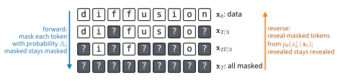

# Discrete Diffusion
:label:`sec_diffusion-discrete`

Every diffusion model in this chapter has corrupted continuous data with
Gaussian noise. The choice is natural for images and meaningless for text: a token is one
element of a finite vocabulary, and adding a real number to its index
produces nothing. The same holds for code, for molecules written as
strings, and for images once their pixel values are read as categories.
This section carries the diffusion construction to such data. What a
diffusion model offers for tokens parallels what it offers for continuous
data: a likelihood bound to train and evaluate, generation that fills in many
positions in parallel and conditions on context on both sides of a gap,
and a controllable trade-off between the number of steps and the quality
of the samples. The forward process becomes a Markov chain on a finite
state space, with transitions given by matrices instead of Gaussian
kernels. The variational bound of :numref:`sec_diffusion-ddpm` goes
through unchanged, because its derivation never used the form of the
noise. For the corruption that has proved most useful, replacing tokens by
a mask symbol, the bound collapses to a cross-entropy on the masked
positions with a step-dependent weight. The result is the *masked
diffusion* model behind the diffusion language models of recent years. As
before, the running example, quantized to a grid, provides a test with a
known answer, and Fashion-MNIST, binarized, provides images.

```{.python .input #discrete-diffusion}
%%tab pytorch
%matplotlib inline
from d2l import torch as d2l
import math
import torch
from torch import nn
```

```{.python .input #discrete-diffusion}
%%tab jax
%matplotlib inline
from d2l import jax as d2l
import math
import jax
from jax import numpy as jnp
from jax.scipy.special import xlogy
from jax.scipy.stats import norm
from flax import nnx
import optax
```

## Corrupting Tokens

### Transition Matrices

Let a token take one of $K$ values, written as a one-hot row vector
$\mathbf{x} \in \{0, 1\}^K$. A Markov chain on this space is specified by
*transition matrices* $Q_t \in [0, 1]^{K \times K}$ whose rows sum to one:
$[Q_t]_{ij}$ is the probability of moving from value $i$ to value $j$ at
step $t$, so that

$$
q(\mathbf{x}_t \mid \mathbf{x}_{t-1}) = \mathrm{Cat}(\mathbf{x}_t;\ \mathbf{x}_{t-1} Q_t),
$$
:eqlabel:`eq_diffusion-discrete-forward`

where $\mathrm{Cat}(\mathbf{x}; \mathbf{p})$ denotes the categorical
distribution with probability vector $\mathbf{p}$, and the row vector
$\mathbf{x}_{t-1} Q_t$ is the row of $Q_t$ selected by the current value.
This is the framework of :citet:`Austin.Johnson.Ho.ea.2021`; the binary
case appears already in :citet:`sohl2015deep` and the uniform kernel below
in :citet:`Hoogeboom.Nielsen.Jaini.ea.2021`. A sequence of $L$ tokens is
corrupted by applying the chain to every position independently. The two
properties of the Gaussian chain that :numref:`sec_diffusion-ddpm` relied
on both hold here. The marginal after $t$ steps is given by a product of
matrices,

$$
q(\mathbf{x}_t \mid \mathbf{x}_0) = \mathrm{Cat}(\mathbf{x}_t;\ \mathbf{x}_0 \bar{Q}_t),
\qquad \bar{Q}_t = Q_1 Q_2 \cdots Q_t,
$$
:eqlabel:`eq_diffusion-discrete-marginal`

by induction on $t$, since composing two Markov transitions multiplies their
matrices. The posterior of one step given both endpoints follows from
Bayes' rule and the Markov property,

$$
q(\mathbf{x}_{t-1} \mid \mathbf{x}_t, \mathbf{x}_0)
= \frac{q(\mathbf{x}_t \mid \mathbf{x}_{t-1})\, q(\mathbf{x}_{t-1} \mid \mathbf{x}_0)}{q(\mathbf{x}_t \mid \mathbf{x}_0)}
= \mathrm{Cat}\!\left(\mathbf{x}_{t-1};\ \frac{\mathbf{x}_t Q_t^\top \odot \mathbf{x}_0 \bar{Q}_{t-1}}{\mathbf{x}_0 \bar{Q}_t \mathbf{x}_t^\top}\right),
$$
:eqlabel:`eq_diffusion-discrete-posterior`

where $\odot$ is the elementwise product. The vector $\mathbf{x}_t Q_t^\top$
lists, for every possible predecessor, the probability of reaching the
observed $\mathbf{x}_t$ from it; $\mathbf{x}_0 \bar{Q}_{t-1}$ lists the
probability of each predecessor given the start; and the denominator
normalizes. Both formulas hold for any sequence of matrices, and the second
is what the variational bound requires.

### Two Kernels

The matrices are chosen so that the products in
:eqref:`eq_diffusion-discrete-marginal` have a closed form and the chain
forgets its start. The **uniform kernel** resamples a token uniformly from
the vocabulary with probability $\beta_t$ and keeps it otherwise,

$$
Q_t = (1 - \beta_t)\, I + \beta_t\, \tfrac{1}{K} \mathbf{1}\mathbf{1}^\top,
$$

where $\mathbf{1}$ is the all-ones vector; its stationary distribution is
uniform over the vocabulary, the counterpart of the standard Gaussian. The
**absorbing kernel** enlarges the vocabulary by one value, the *mask*
$[\textrm{M}]$, and moves each token there with probability $\beta_t$; a
masked token stays masked:

$$
Q_t = (1 - \beta_t)\, I + \beta_t\, \mathbf{1} \mathbf{e}_{\textrm{M}}^\top,
$$
:eqlabel:`eq_diffusion-absorbing-kernel`

with $\mathbf{e}_{\textrm{M}}$ the one-hot vector of the mask. For both
kernels the products collapse. Write $\bar{\alpha}_t = \prod_{s \leq t} (1 - \beta_s)$
as in :numref:`sec_diffusion-ddpm`, and let $P$ stand for
$\tfrac{1}{K}\mathbf{1}\mathbf{1}^\top$ or for $\mathbf{1}\mathbf{e}_{\textrm{M}}^\top$;
in both cases $P^2 = P$, so
$(aI + bP)(cI + dP) = ac\, I + (ad + bc + bd)\, P$, and when $a + b = c + d = 1$
the second coefficient equals $1 - ac$. The coefficient of $I$ therefore
multiplies along the chain and

$$
\bar{Q}_t = \bar{\alpha}_t\, I + (1 - \bar{\alpha}_t)\, \tfrac{1}{K}\mathbf{1}\mathbf{1}^\top
\quad\textrm{(uniform)},
\qquad
\bar{Q}_t = \bar{\alpha}_t\, I + (1 - \bar{\alpha}_t)\, \mathbf{1}\mathbf{e}_{\textrm{M}}^\top
\quad\textrm{(absorbing)}.
$$
:eqlabel:`eq_diffusion-discrete-qbar`

In words, after $t$ steps of the absorbing chain a token still carries its
original value with probability $\bar{\alpha}_t$ and has been replaced by
the mask with probability $1 - \bar{\alpha}_t$, independently across
positions. The chain never confuses one token with another; it only erases.
A schedule with $\bar{\alpha}_T = 0$ ends at the fully masked sequence, a
state that carries no information about the data, as the Gaussian chain
ended at pure noise. :numref:`fig_diffusion-masking` shows the two
directions.


:label:`fig_diffusion-masking`

The rest of the section uses the absorbing kernel. It is the choice behind
the diffusion language models cited below; :citet:`Austin.Johnson.Ho.ea.2021`
already found that it gave the best likelihoods on text among the kernels
they compared, and its posterior is the simplest, as the next subsection
shows.

## The Variational Bound for Masked Tokens

### The Same Bound, a Different Target

The reverse model is again a Markov chain
$p_{\boldsymbol{\theta}}(\mathbf{x}_{t-1} \mid \mathbf{x}_t)$, started from
the all-mask sequence, and the derivation of :eqref:`eq_diffusion-elbo-terms`
applies verbatim, because it used only the Markov property and Bayes'
rule:

$$
L_{\textrm{VLB}}
= \mathrm{KL}\big(q(\mathbf{x}_T \mid \mathbf{x}_0)\, \|\, p(\mathbf{x}_T)\big)
+ \sum_{t=2}^{T} \mathbb{E}_q\Big[\mathrm{KL}\big(q(\mathbf{x}_{t-1} \mid \mathbf{x}_t, \mathbf{x}_0)\, \|\, p_{\boldsymbol{\theta}}(\mathbf{x}_{t-1} \mid \mathbf{x}_t)\big)\Big]
+ \mathbb{E}_q\big[-\log p_{\boldsymbol{\theta}}(\mathbf{x}_0 \mid \mathbf{x}_1)\big].
$$

Every divergence is now between categorical distributions and is a finite
sum. What changes is the parameterization. In the Gaussian case the network
predicted the noise; here the natural target is the clean token itself.
Following :citet:`Austin.Johnson.Ho.ea.2021`, the network outputs, for
each position $i$, a distribution $p_{\boldsymbol{\theta}}(\mathbf{x}_0^i \mid \mathbf{x}_t)$
over the $K$ clean values given the whole corrupted sequence, and the
reverse transition averages the true posterior over this prediction,

$$
p_{\boldsymbol{\theta}}(\mathbf{x}_{t-1} \mid \mathbf{x}_t)
= \sum_{\hat{\mathbf{x}}_0} q(\mathbf{x}_{t-1} \mid \mathbf{x}_t, \hat{\mathbf{x}}_0)\, p_{\boldsymbol{\theta}}(\hat{\mathbf{x}}_0 \mid \mathbf{x}_t),
$$
:eqlabel:`eq_diffusion-x0-parameterization`

position by position, with the prediction at an unmasked position taken to
be the observed token. This is the discrete counterpart of predicting the
clean point and inserting it into the Gaussian posterior
:eqref:`eq_diffusion-posterior`. :citet:`Austin.Johnson.Ho.ea.2021` write
the average over the joint $q(\mathbf{x}_{t-1}, \mathbf{x}_t \mid \hat{\mathbf{x}}_0)$
and renormalize, which reweights the candidates by
$q(\mathbf{x}_t \mid \hat{\mathbf{x}}_0)$; for the absorbing kernel that
weight is the same for every candidate at a masked position, so the two
forms agree, whereas for the uniform kernel they differ (Exercise 1).

### The Posterior of the Absorbing Chain

**Proposition (posterior of the absorbing chain).** *Under the absorbing
kernel with $\beta_1 > 0$, so that $\bar{\alpha}_t < 1$ for every
$t \geq 1$, consider one position with clean value $\mathbf{x}_0 \neq [\textrm{M}]$.
If $\mathbf{x}_t = \mathbf{x}_0$, then $\mathbf{x}_{t-1} = \mathbf{x}_0$
with probability one. If $\mathbf{x}_t = [\textrm{M}]$, then*

$$
q(\mathbf{x}_{t-1} = \mathbf{x}_0 \mid \mathbf{x}_t = [\textrm{M}], \mathbf{x}_0) = \frac{\bar{\alpha}_{t-1} - \bar{\alpha}_t}{1 - \bar{\alpha}_t},
\qquad
q(\mathbf{x}_{t-1} = [\textrm{M}] \mid \mathbf{x}_t = [\textrm{M}], \mathbf{x}_0) = \frac{1 - \bar{\alpha}_{t-1}}{1 - \bar{\alpha}_t},
$$
:eqlabel:`eq_diffusion-masked-posterior`

*and no other value has positive probability.*

**Proof.** Evaluate :eqref:`eq_diffusion-discrete-posterior` with
:eqref:`eq_diffusion-absorbing-kernel` and
:eqref:`eq_diffusion-discrete-qbar`. The vector $\mathbf{x}_0 \bar{Q}_{t-1}$
puts mass $\bar{\alpha}_{t-1}$ on $\mathbf{x}_0$ and $1 - \bar{\alpha}_{t-1}$
on the mask, so only these two predecessors are possible. If
$\mathbf{x}_t = \mathbf{x}_0$, the vector $\mathbf{x}_t Q_t^\top$ has the
entry $1 - \beta_t$ at $\mathbf{x}_0$ and the entry $0$ at the mask, because
a mask never returns to a token, and the posterior is a point mass. If
$\mathbf{x}_t = [\textrm{M}]$, the entries are $\beta_t$ at $\mathbf{x}_0$
and $1$ at the mask, so the unnormalized posterior is $\bar{\alpha}_{t-1}\beta_t$
on $\mathbf{x}_0$ and $1 - \bar{\alpha}_{t-1}$ on the mask. Their sum,
$1 - \bar{\alpha}_{t-1}(1 - \beta_t) = 1 - \bar{\alpha}_t$, is the
denominator $q(\mathbf{x}_t = [\textrm{M}] \mid \mathbf{x}_0)$, and
$\bar{\alpha}_{t-1}\beta_t = \bar{\alpha}_{t-1} - \bar{\alpha}_t$.
$\blacksquare$

One step back, a masked token either stays masked or reverts to its clean
value, and an unmasked token is left alone. The reverse model
:eqref:`eq_diffusion-x0-parameterization` therefore takes a concrete form.
It keeps every unmasked position, and at each masked position it
independently either keeps the mask, with probability
$(1 - \bar{\alpha}_{t-1}) / (1 - \bar{\alpha}_t)$, or replaces it by a draw
from $p_{\boldsymbol{\theta}}(\mathbf{x}_0^i \mid \mathbf{x}_t)$.

### A Weighted Cross-Entropy

**Proposition (masked diffusion bound).** *For the absorbing kernel with
$\bar{\alpha}_0 = 1$, $\bar{\alpha}_t < 1$ for $t \geq 1$, and
$\bar{\alpha}_T = 0$, and the reverse model just described,*

$$
L_{\textrm{VLB}}
= \sum_{t=1}^{T} \frac{\bar{\alpha}_{t-1} - \bar{\alpha}_t}{1 - \bar{\alpha}_t}\;
\mathbb{E}_{q(\mathbf{x}_t \mid \mathbf{x}_0)}\Big[ \sum_{i \,:\, \mathbf{x}_t^i = [\textrm{M}]} -\log p_{\boldsymbol{\theta}}(\mathbf{x}_0^i \mid \mathbf{x}_t) \Big].
$$
:eqlabel:`eq_diffusion-masked-loss`

**Proof.** The prior term vanishes: $\bar{\alpha}_T = 0$ makes
$q(\mathbf{x}_T \mid \mathbf{x}_0)$ the point mass on the all-mask sequence,
which is also $p(\mathbf{x}_T)$. Both $q(\mathbf{x}_{t-1} \mid \mathbf{x}_t, \mathbf{x}_0)$
and $p_{\boldsymbol{\theta}}(\mathbf{x}_{t-1} \mid \mathbf{x}_t)$ factorize
over positions, so each divergence is a sum of per-position divergences. At
an unmasked position both distributions are the same point mass and the
divergence is zero. At a masked position write
$w_t = (\bar{\alpha}_{t-1} - \bar{\alpha}_t) / (1 - \bar{\alpha}_t)$. The
true posterior puts $1 - w_t$ on the mask and $w_t$ on $\mathbf{x}_0^i$;
the model puts $1 - w_t$ on the mask and $w_t\, p_{\boldsymbol{\theta}}(\cdot \mid \mathbf{x}_t)$
on the tokens; hence

$$
\mathrm{KL}
= (1 - w_t) \log \frac{1 - w_t}{1 - w_t}
+ w_t \log \frac{w_t}{w_t\, p_{\boldsymbol{\theta}}(\mathbf{x}_0^i \mid \mathbf{x}_t)}
= -w_t \log p_{\boldsymbol{\theta}}(\mathbf{x}_0^i \mid \mathbf{x}_t).
$$

This accounts for $t = 2, \ldots, T$. The reconstruction term is
$\mathbb{E}[-\log p_{\boldsymbol{\theta}}(\mathbf{x}_0 \mid \mathbf{x}_1)]$;
since $w_1 = (1 - \bar{\alpha}_1)/(1 - \bar{\alpha}_1) = 1$, the model
replaces every position masked at step $1$ by a draw from
$p_{\boldsymbol{\theta}}(\cdot \mid \mathbf{x}_1)$ and copies the rest, so
this term equals the sum of $-\log p_{\boldsymbol{\theta}}(\mathbf{x}_0^i \mid \mathbf{x}_1)$
over the masked positions, which is the $t = 1$ term of the sum.
$\blacksquare$

The bound :eqref:`eq_diffusion-masked-loss` is a cross-entropy on the
masked positions of a partially masked sequence, weighted by a factor that
depends on the step, and it is an upper bound on the negative
log-likelihood $-\log p_{\boldsymbol{\theta}}(\mathbf{x}_0)$: unlike the
adversarial models of :numref:`chap_gans`, the model assigns every sequence
a probability that can be bounded and compared.
:citet:`Austin.Johnson.Ho.ea.2021` already noted that the bound of the
absorbing chain reduces to a reweighted masked-language-model loss, but
trained the general bound with an added cross-entropy term; the masked
diffusion language models of :citet:`Sahoo.Arriola.Schiff.ea.2024` and
:citet:`Shi.Han.Wang.ea.2024` take :eqref:`eq_diffusion-masked-loss`
itself, and its continuous-time limit, as the objective. Under the
*linear schedule* $\bar{\alpha}_t = 1 - t/T$, a fraction $t/T$ of the
tokens is masked at step $t$ and the weight is $w_t = (1/T)/(t/T) = 1/t$: an
error at a heavily masked sequence is charged less than the same error at a
lightly masked one. Since the number of masked positions grows in
proportion to $t$, every step carries the same expected weighted count of
masked positions, $L/T$ for a sequence of $L$ tokens; the steps differ only
in how hard their masked tokens are to predict. The sum is also a Riemann
sum. Letting $T \to \infty$ with $\bar{\alpha}_t = \bar{\alpha}(t/T)$ for a
decreasing function $\bar{\alpha}$ on $[0, 1]$, the bound tends to
$\int_0^1 \frac{-\bar{\alpha}'(\tau)}{1 - \bar{\alpha}(\tau)}\, \mathbb{E}\big[\sum_{\textrm{masked}} -\log p_{\boldsymbol{\theta}}\big]\, d\tau$,
and the substitution $u = 1 - \bar{\alpha}(\tau)$, the masking probability,
turns this into $\int_0^1 \frac{1}{u}\, \mathbb{E}_u[\cdots]\, du$, where
$\mathbb{E}_u$ masks each token with probability $u$. If the network is
told the masking probability rather than the raw step, the limiting bound
does not depend on the schedule at all, only on how well the network
predicts masked tokens at every masking level. This is the discrete
analogue of the schedule invariance that :citet:`Kingma.Salimans.Poole.ea.2021`
established for Gaussian diffusion, and both papers above note it.

## Sampling by Unmasking

Generation runs the reverse model from the all-mask sequence. At step $t$,
one forward pass yields $p_{\boldsymbol{\theta}}(\cdot \mid \mathbf{x}_t)$
at every masked position; each masked position draws a candidate token and
accepts it with probability $w_t$, and accepted tokens are never revised.
Under the linear schedule $w_t = 1/t$, so about a fraction $1/t$ of the
tokens still masked at step $t$ is revealed; since about $t/T$ of the $L$
tokens are still masked, roughly $L/T$ tokens are revealed per step, a
constant rate. Fewer steps are available as they were for DDIM in
:numref:`sec_diffusion-ddim`: choose levels $T = t_0 > t_1 > \cdots > t_S = 0$.
The coarser chain has the same marginals :eqref:`eq_diffusion-discrete-qbar`,
the computation of the proposition applies to it unchanged, and a jump from
$t_k$ to $t_{k+1}$ reveals each masked token with probability
$(\bar{\alpha}_{t_{k+1}} - \bar{\alpha}_{t_k}) / (1 - \bar{\alpha}_{t_k})$.
With $S = 1$ everything is revealed at once from the prediction at the
all-mask input.

Fewer steps have a specific cost. The tokens revealed in the same step are
drawn independently from their own predicted distributions, because the
network's prediction is a product over positions; tokens revealed in
different steps are drawn one after another, each conditioned on the ones
already revealed. A pair of tokens revealed together therefore follows the
product of two marginals rather than their joint distribution. The running
example, quantized to a pair of tokens as the experiments below describe,
makes this exact. It has two tokens, and under the linear schedule
the pattern of masks at level $t_k$ has each token masked independently
with probability $t_k / T$, while the jump to $t_{k+1}$ reveals a masked
token with probability $(t_k - t_{k+1}) / t_k$; both tokens are revealed in
that jump with probability $(t_k / T)^2 \cdot ((t_k - t_{k+1}) / t_k)^2 = 1/S^2$
for equally spaced levels, and summing over the $S$ jumps gives $1/S$.
With an *exact* network, one whose prediction at each masked position is
the true conditional distribution of that token given the unmasked ones,
the sampler thus produces the mixture
$(1 - 1/S)\, p + (1/S)\, p^1 \otimes p^2$ of the true joint and the product
of its marginals, whose total variation distance from $p$ is
$\mathrm{TV}(p^1 \otimes p^2, p) / S$. The experiments below measure this.

The sampler also places masked diffusion among older models. Trained at a
single masking level, :eqref:`eq_diffusion-masked-loss` is the masked
language modeling objective of BERT :cite:`Devlin.Chang.Lee.ea.2018`, up
to BERT's replacement of some masks by random or unchanged tokens, so a
masked language model is a one-step discrete diffusion model, as
:citet:`Austin.Johnson.Ho.ea.2021` point out. Reveal exactly one token per
step in a random order and the sampler is an order-agnostic autoregressive
model :cite:`Uria.Murray.Larochelle.2014`; fix the order to left-to-right
and it is an ordinary autoregressive language model, whose conditionals
are the network's predictions
$p_{\boldsymbol{\theta}}(\mathbf{x}_0^i \mid \mathbf{x}_t)$ at inputs in
which a prefix is unmasked and the remainder is masked, a correspondence
that :citet:`Austin.Johnson.Ho.ea.2021` also draw. Between these
extremes, the number of steps trades sequential computation for the
independence error above. The framework has a continuous-time formulation
:cite:`Campbell.Benton.DeBortoli.ea.2022` and a score-based one:
:citet:`Lou.Meng.Ermon.2024` learn ratios $p_t(\mathbf{y}) / p_t(\mathbf{x})$
between neighboring sequences, the discrete counterpart of the score, and
train them with a loss that plays the role of score matching.
:citet:`Nie.Zhu.You.ea.2025` have since trained a masked diffusion language
model with eight billion parameters and report that it is competitive with
an autoregressive model of the same size, LLaMA 3 8B, in in-context
learning.

## Experiments on the Running Example

Quantizing the mixture onto a $32 \times 32$ grid over $[-5, 5]^2$, with
points outside the square assigned to the edge cell nearest to them, turns
each sample into a pair of tokens, its row and column indices: a sequence of
length two over a vocabulary of $K = 32$ values. The probability of each
cell is the integral of the mixture density over it, the edge cells
extending to infinity, and the integral factorizes per component into a
product of two one-dimensional Gaussian integrals, so the true table is
available exactly, and so is its entropy, the negative log-likelihood that a
perfect model attains. Little mass lies outside the square in any case: the
nearest mode is five standard deviations from its edge. The cell also prints the bound that an *exact* network would
attain, the entropy plus $I(X^1; X^2) / T$ with $I$ the mutual information
of the two coordinates, because pairs masked together are predicted
independently; Exercise 3 derives it, and the training experiment below
uses it as the reference. Two reference quantities accompany the table:
the total variation distance between a histogram of $20{,}000$ true samples
and the table, the floor that finite samples impose on every comparison
below, and
the distance between the product of the two marginals and the table, the
error of a model that draws the coordinates independently.

```{.python .input #discrete-diffusion-experiments-on-the-running-example-1}
%%tab pytorch
torch.manual_seed(0)
mix = d2l.GaussianMixture(means=[[-2.5, -1.5], [2.5, -1.5], [0.0, 2.5]],
                          weights=[0.5, 0.3, 0.2], std=0.5)
K, T, MASK = 32, 32, 32  # vocabulary size, number of steps, index of the mask
edges = torch.linspace(-5, 5, K + 1)

def quantize(x):  # continuous points to pairs of tokens in {0, ..., K - 1}
    return ((x + 5) / 10 * K).floor().long().clamp(0, K - 1)

data, test = quantize(mix.sample(20000)), quantize(mix.sample(20000))
cdf = torch.distributions.Normal(0.0, 1.0).cdf(
    (edges[None, None, :] - mix.means[:, :, None]) / mix.std)  # (3, 2, K + 1)
cdf[:, :, 0], cdf[:, :, -1] = 0.0, 1.0  # edge cells extend to infinity, as in quantize
per_axis = cdf[:, :, 1:] - cdf[:, :, :-1]  # cell masses of each component, per axis
table = (mix.weights[:, None, None] * per_axis[:, 0, :, None]
         * per_axis[:, 1, None, :]).sum(0)
entropy = -torch.special.xlogy(table, table).sum()

def histogram(z):
    counts = torch.bincount(z[:, 0] * K + z[:, 1], minlength=K * K)
    return counts.reshape(K, K).float() / len(z)

def tv(p, q):  # total variation distance between two tables
    return 0.5 * (p - q).abs().sum()

product = table.sum(1)[:, None] * table.sum(0)[None, :]
marginals = table.sum(1), table.sum(0)
mutual = -sum(torch.special.xlogy(m, m).sum() for m in marginals) - entropy
print(f'entropy of the table: {entropy:.3f} nats; '
      f'bound of an exact network with T = {T}: {entropy + mutual / T:.3f} nats')
print(f'TV(histogram of 20000 true samples, table): {tv(histogram(test), table):.3f}')
print(f'TV(product of the marginals, table): {tv(product, table):.3f}')
```

```{.python .input #discrete-diffusion-experiments-on-the-running-example-1}
%%tab jax
key = jax.random.PRNGKey(0)
mix = d2l.GaussianMixture(means=[[-2.5, -1.5], [2.5, -1.5], [0.0, 2.5]],
                          weights=[0.5, 0.3, 0.2], std=0.5)
K, T, MASK = 32, 32, 32  # vocabulary size, number of steps, index of the mask
edges = jnp.linspace(-5, 5, K + 1)

def quantize(x):  # continuous points to pairs of tokens in {0, ..., K - 1}
    return jnp.clip(jnp.floor((x + 5) / 10 * K), 0, K - 1).astype(jnp.int32)

key, k1, k2 = jax.random.split(key, 3)
data, test = quantize(mix.sample(k1, 20000)), quantize(mix.sample(k2, 20000))
cdf = norm.cdf((edges[None, None, :] - mix.means[:, :, None]) / mix.std)  # (3, 2, K + 1)
cdf = cdf.at[:, :, 0].set(0.0).at[:, :, -1].set(1.0)  # edge cells extend to infinity
per_axis = cdf[:, :, 1:] - cdf[:, :, :-1]  # cell masses of each component, per axis
table = (mix.weights[:, None, None] * per_axis[:, 0, :, None]
         * per_axis[:, 1, None, :]).sum(0)
entropy = -xlogy(table, table).sum()

def histogram(z):
    counts = jnp.bincount(z[:, 0] * K + z[:, 1], length=K * K)
    return counts.reshape(K, K) / len(z)

def tv(p, q):  # total variation distance between two tables
    return 0.5 * jnp.abs(p - q).sum()

product = table.sum(1)[:, None] * table.sum(0)[None, :]
marginals = table.sum(1), table.sum(0)
mutual = -sum(xlogy(m, m).sum() for m in marginals) - entropy
print(f'entropy of the table: {entropy:.3f} nats; '
      f'bound of an exact network with T = {T}: {entropy + mutual / T:.3f} nats')
print(f'TV(histogram of 20000 true samples, table): {tv(histogram(test), table):.3f}')
print(f'TV(product of the marginals, table): {tv(product, table):.3f}')
```

The network takes the one-hot encoding of both tokens, with the mask as a
thirty-third value, together with the step, and outputs logits over the
thirty-two clean values at each position. The training loop draws one step
per sequence; the loss function masks each token with probability
$1 - \bar{\alpha}_t$ and evaluates the summand of
:eqref:`eq_diffusion-masked-loss` at the masked positions, and multiplying
by $T$ makes the single draw of the step an unbiased estimate of the whole
sum.

```{.python .input #discrete-diffusion-experiments-on-the-running-example-2}
%%tab pytorch
class MaskedMLP(nn.Module):
    """Logits of the clean tokens given a partially masked pair and the step."""
    def __init__(self, hidden=256):
        super().__init__()
        self.net = nn.Sequential(nn.Linear(2 * (K + 1) + 1, hidden), nn.SiLU(),
                                 nn.Linear(hidden, hidden), nn.SiLU(),
                                 nn.Linear(hidden, 2 * K))

    def forward(self, z, t):
        h = torch.cat([nn.functional.one_hot(z, K + 1).float().flatten(1),
                       (t / T)[:, None]], 1)
        return self.net(h).reshape(-1, 2, K)

alpha_bar = 1 - torch.arange(T + 1) / T  # linear schedule; alpha_bar[T] = 0

def masked_loss(model, x0, t):  # one-sample estimate of the bound per sequence, nats
    masked = torch.rand(x0.shape) < (1 - alpha_bar[t])[:, None]
    z = torch.where(masked, MASK, x0)
    logp = torch.log_softmax(model(z, t), -1).gather(-1, x0[..., None])[..., 0]
    weight = (alpha_bar[t - 1] - alpha_bar[t]) / (1 - alpha_bar[t])  # 1 / t
    return (T * weight[:, None] * -logp * masked).sum(1)
```

```{.python .input #discrete-diffusion-experiments-on-the-running-example-2}
%%tab jax
class MaskedMLP(nnx.Module):
    """Logits of the clean tokens given a partially masked pair and the step."""
    def __init__(self, hidden=256, rngs=None):
        self.h1 = nnx.Linear(2 * (K + 1) + 1, hidden, rngs=rngs)
        self.h2 = nnx.Linear(hidden, hidden, rngs=rngs)
        self.out = nnx.Linear(hidden, 2 * K, rngs=rngs)

    def __call__(self, z, t):
        h = jnp.concatenate([jax.nn.one_hot(z, K + 1).reshape(len(z), -1),
                             (t / T)[:, None]], 1)
        return self.out(nnx.silu(self.h2(nnx.silu(self.h1(h))))).reshape(-1, 2, K)

alpha_bar = 1 - jnp.arange(T + 1) / T  # linear schedule; alpha_bar[T] = 0

def masked_loss(model, x0, t, key):  # one-sample estimate of the bound per sequence, nats
    masked = jax.random.uniform(key, x0.shape) < (1 - alpha_bar[t])[:, None]
    z = jnp.where(masked, MASK, x0)
    logp = jnp.take_along_axis(jax.nn.log_softmax(model(z, t), -1),
                               x0[..., None], -1)[..., 0]
    weight = (alpha_bar[t - 1] - alpha_bar[t]) / (1 - alpha_bar[t])  # 1 / t
    return (T * weight[:, None] * -logp * masked).sum(1)
```

Because the sequence has two positions, the expectation in
:eqref:`eq_diffusion-masked-loss` can also be computed exactly: at each
step there are three mask patterns with at least one mask, with known
probabilities, and the $1024$ possible pairs are weighted by the true table.
The resulting number is the bound averaged over the true distribution,
which cannot fall below the entropy of the table. Part of the excess
remains even for an exact network: its bound equals the entropy plus
$I(X^1; X^2) / T$, the mutual information of the two coordinates divided by
the number of steps (Exercise 3), the cost of predicting the two tokens
independently whenever both are masked. No network that predicts the
positions independently can go below this floor, whose value the first cell
printed. We track the model's bound during training.

```{.python .input #discrete-diffusion-experiments-on-the-running-example-3}
%%tab pytorch
pairs = torch.cartesian_prod(torch.arange(K), torch.arange(K))  # all 1024 pairs
patterns = torch.tensor([[True, False], [False, True], [True, True]])

@torch.no_grad()
def exact_bound(model):  # the bound averaged over the true table, all steps and patterns
    total = 0.0
    for t in range(1, T + 1):
        weight = (alpha_bar[t - 1] - alpha_bar[t]) / (1 - alpha_bar[t])
        for masked in patterns:
            masked = masked.expand(len(pairs), 2)
            z = torch.where(masked, MASK, pairs)
            logp = torch.log_softmax(model(z, torch.full((len(pairs),), t)), -1)
            logp = logp.gather(-1, pairs[..., None])[..., 0]
            n_masked = masked[0].sum()
            prob = (1 - alpha_bar[t]) ** n_masked * alpha_bar[t] ** (2 - n_masked)
            total += prob * weight * (table.flatten() * (-logp * masked).sum(1)).sum()
    return total

torch.manual_seed(1)
model = MaskedMLP()
optimizer = torch.optim.Adam(model.parameters(), lr=1e-3)
for step in range(6000):
    if step == 4000:
        optimizer.param_groups[0]['lr'] = 2e-4
    x0 = data[torch.randint(0, len(data), (512,))]
    t = torch.randint(1, T + 1, (512,))
    loss = masked_loss(model, x0, t).mean()
    optimizer.zero_grad(), loss.backward(), optimizer.step()
    if step % 2000 == 0:
        print(f'step {step:>4}: exact bound {exact_bound(model):.3f} nats')
print(f'final exact bound {exact_bound(model):.3f} nats; entropy {entropy:.3f} nats')
```

```{.python .input #discrete-diffusion-experiments-on-the-running-example-3}
%%tab jax
pairs = jnp.stack(jnp.meshgrid(jnp.arange(K), jnp.arange(K), indexing='ij'),
                  -1).reshape(-1, 2)  # all 1024 pairs
patterns = jnp.array([[True, False], [False, True], [True, True]])

def exact_bound(model):  # the bound averaged over the true table, all steps and patterns
    total = 0.0
    for t in range(1, T + 1):
        weight = (alpha_bar[t - 1] - alpha_bar[t]) / (1 - alpha_bar[t])
        for masked in patterns:
            masked = jnp.broadcast_to(masked, pairs.shape)
            z = jnp.where(masked, MASK, pairs)
            logp = jax.nn.log_softmax(model(z, jnp.full((len(pairs),), t)), -1)
            logp = jnp.take_along_axis(logp, pairs[..., None], -1)[..., 0]
            n_masked = masked[0].sum()
            prob = (1 - alpha_bar[t]) ** n_masked * alpha_bar[t] ** (2 - n_masked)
            total += prob * weight * (table.flatten() * (-logp * masked).sum(1)).sum()
    return total

@nnx.jit
def masked_step(model, optimizer, x0, t, key):
    loss, grads = nnx.value_and_grad(
        lambda m: masked_loss(m, x0, t, key).mean())(model)
    optimizer.update(model, grads)
    return loss

model = MaskedMLP(rngs=nnx.Rngs(1))
schedule = optax.piecewise_constant_schedule(1e-3, {4000: 0.2})
optimizer = nnx.Optimizer(model, optax.adam(schedule), wrt=nnx.Param)
for step in range(6000):
    key, k1, k2, k3 = jax.random.split(key, 4)
    x0 = data[jax.random.randint(k1, (512,), 0, len(data))]
    t = jax.random.randint(k2, (512,), 1, T + 1)
    loss = masked_step(model, optimizer, x0, t, k3)
    if step % 2000 == 0:
        print(f'step {step:>4}: exact bound {exact_bound(model):.3f} nats')
print(f'final exact bound {exact_bound(model):.3f} nats; entropy {entropy:.3f} nats')
```

The bound comes within a few hundredths of a nat of the entropy: the model
has learned the marginal of each coordinate and its conditional given the
other. Most of the remaining gap is the floor printed by the first cell,
which an exact network pays as well; the trained network's own excess over
that floor is of the order of a hundredth of a nat. The floor is not all
looseness of the bound: the thirty-two-step chain of an exact network
reveals both tokens in the same step with probability $1/32$, so it models
$(1 - 1/32)\, p + (1/32)\, p^1 \otimes p^2$ rather than $p$, as the next
experiment shows. The sampler below implements the unmasking described
above for any number of steps $S$, using the
levels $T, T(S-1)/S, \ldots, 0$, and we compare the histogram of $20{,}000$
samples with the table and with the product of the marginals, next to the
prediction $\mathrm{TV}(p^1 \otimes p^2, p) / S$ for an exact network.

```{.python .input #discrete-diffusion-experiments-on-the-running-example-4}
%%tab pytorch
@torch.no_grad()
def unmask(model, n, steps):
    z = torch.full((n, 2), MASK)
    levels = torch.linspace(T, 0, steps + 1).round().long().tolist()
    for t, s in zip(levels[:-1], levels[1:]):
        draw = torch.distributions.Categorical(
            logits=model(z, torch.full((n,), t))).sample()
        reveal = (z == MASK) & (torch.rand(z.shape)
                                < (alpha_bar[s] - alpha_bar[t]) / (1 - alpha_bar[t]))
        z = torch.where(reveal, draw, z)
    return z

torch.manual_seed(2)
samples = {}
print(f'{"steps":>5} {"TV to table":>12} {"predicted":>10} {"TV to product":>14}')
for steps in (32, 8, 2, 1):
    samples[steps] = unmask(model, 20000, steps)
    h = histogram(samples[steps])
    print(f'{steps:>5} {tv(h, table):>12.3f} {tv(product, table) / steps:>10.3f} '
          f'{tv(h, product):>14.3f}')
```

```{.python .input #discrete-diffusion-experiments-on-the-running-example-4}
%%tab jax
def unmask(model, key, n, steps):
    z = jnp.full((n, 2), MASK)
    levels = [round(l) for l in jnp.linspace(T, 0, steps + 1).tolist()]
    for t, s in zip(levels[:-1], levels[1:]):
        key, k1, k2 = jax.random.split(key, 3)
        draw = jax.random.categorical(k1, model(z, jnp.full((n,), t)), axis=-1)
        reveal = (z == MASK) & (jax.random.uniform(k2, z.shape)
                                < (alpha_bar[s] - alpha_bar[t]) / (1 - alpha_bar[t]))
        z = jnp.where(reveal, draw, z)
    return z

samples = {}
print(f'{"steps":>5} {"TV to table":>12} {"predicted":>10} {"TV to product":>14}')
for steps in (32, 8, 2, 1):
    key, subkey = jax.random.split(key)
    samples[steps] = unmask(model, subkey, 20000, steps)
    h = histogram(samples[steps])
    print(f'{steps:>5} {tv(h, table):>12.3f} {tv(product, table) / steps:>10.3f} '
          f'{tv(h, product):>14.3f}')
```

With all thirty-two steps the samples are within a few hundredths of the
sampling floor. As the number of steps falls, the distance to the table
grows as predicted and tracks $\mathrm{TV}(p^1 \otimes p^2, p) / S$. At
thirty-two and eight steps it exceeds the prediction by the model error and
the sampling floor; at two and one step it lies within a few hundredths of
it, because the systematic error dominates the histogram noise. The
distance to the product shrinks correspondingly, and with a single step the
samples follow the product of the marginals, as they must, since both
coordinates are drawn from the prediction at the all-mask input. The panels
show the table and the two extreme histograms; the one-step panel has mass
where a row and a column of the mixture cross, at positions where the data
has none.

```{.python .input #discrete-diffusion-experiments-on-the-running-example-5}
%%tab pytorch
fig, axes = d2l.plt.subplots(1, 3, figsize=(10, 3.4))
for ax, (title, h) in zip(axes, [('true table', table),
                                 ('32 steps', histogram(samples[32])),
                                 ('1 step', histogram(samples[1]))]):
    ax.imshow(h.T, origin='lower', extent=(-5, 5, -5, 5), cmap='Blues')
    ax.set_title(title)
fig.tight_layout()
```

```{.python .input #discrete-diffusion-experiments-on-the-running-example-5}
%%tab jax
fig, axes = d2l.plt.subplots(1, 3, figsize=(10, 3.4))
for ax, (title, h) in zip(axes, [('true table', table),
                                 ('32 steps', histogram(samples[32])),
                                 ('1 step', histogram(samples[1]))]):
    ax.imshow(h.T, origin='lower', extent=(-5, 5, -5, 5), cmap='Blues')
    ax.set_title(title)
fig.tight_layout()
```

## Images as Binary Tokens

Thresholding Fashion-MNIST at half intensity makes every pixel a token
with two values, and a masked image has three. The U-Net of
:numref:`sec_diffusion-annealed` takes the one-hot encoding as three input
channels and returns two output channels, the logits of the clean pixel;
the loss and the sampler are those of the running example with the
positions arranged on a grid, and the schedule has $T = 100$ steps. Eight
hundred updates with a moving average of the weights, as in
:numref:`sec_diffusion-images`, take a few minutes. After training we
estimate the bound on held-out images in bits per pixel, visiting every
masking level with one random mask per image and level, and compare it
with the cross-entropy of the same images under a model that treats pixels
as independent, with the per-pixel frequencies of the training set.

```{.python .input #discrete-diffusion-images-as-binary-tokens-1}
%%tab pytorch
fmnist = d2l.FashionMNIST(batch_size=128)
X = (fmnist.train.data > 127).long()  # (60000, 28, 28) tokens in {0, 1}
X_test = (fmnist.val.data > 127).long()[:200]
T, MASK = 100, 2  # the schedule for images; the mask is a third value
alpha_bar = 1 - torch.arange(T + 1) / T

class MaskedUNet(nn.Module):
    """The chapter's U-Net on one-hot tokens; outputs logits of the clean pixel."""
    def __init__(self):
        super().__init__()
        self.unet = d2l.UNet(in_channels=3, out_channels=2)

    def forward(self, z, t):
        x = nn.functional.one_hot(z, 3).float().permute(0, 3, 1, 2)
        return self.unet(x, t).permute(0, 2, 3, 1)  # (n, 28, 28, 2)

def masked_image_loss(model, x0, t):  # one-sample estimate of the bound per image, nats
    masked = torch.rand(x0.shape) < (1 - alpha_bar[t])[:, None, None]
    z = torch.where(masked, MASK, x0)
    logp = torch.log_softmax(model(z, t), -1).gather(-1, x0[..., None])[..., 0]
    weight = (alpha_bar[t - 1] - alpha_bar[t]) / (1 - alpha_bar[t])
    return (T * weight[:, None, None] * -logp * masked).sum((1, 2))

torch.manual_seed(3)
net, ema = MaskedUNet(), MaskedUNet()
ema.load_state_dict(net.state_dict())
optimizer = torch.optim.Adam(net.parameters(), lr=1e-3)
for step in range(800):
    x0 = X[torch.randint(0, len(X), (128,))]
    t = torch.randint(1, T + 1, (128,))
    loss = masked_image_loss(net, x0, t).mean() / 784
    optimizer.zero_grad(), loss.backward(), optimizer.step()
    decay = min(0.999, (1 + step) / (10 + step))
    with torch.no_grad():
        for p_ema, p in zip(ema.parameters(), net.parameters()):
            p_ema.mul_(decay).add_(p, alpha=1 - decay)
    if step % 200 == 0:
        print(f'step {step:>3}: loss {loss.item():.3f} nats per pixel')

with torch.no_grad():
    bound = sum(masked_image_loss(ema, X_test, torch.full((len(X_test),), t)).mean()
                for t in range(1, T + 1)) / T
pixel = X.float().mean(0).clamp(1e-6, 1 - 1e-6)  # frequency of white per position
independent = -(torch.special.xlogy(X_test.float(), pixel)
                + torch.special.xlogy(1 - X_test.float(), 1 - pixel)).sum((1, 2)).mean()
print(f'held-out bound: {bound / 784 / math.log(2):.3f} bits per pixel; '
      f'independent pixels: {independent / 784 / math.log(2):.3f} bits per pixel')
```

```{.python .input #discrete-diffusion-images-as-binary-tokens-1}
%%tab jax
fmnist = d2l.FashionMNIST(batch_size=128)
X = (jnp.asarray(fmnist.train[0]) > 127).astype(jnp.int32)  # (60000, 28, 28)
X_test = (jnp.asarray(fmnist.val[0]) > 127).astype(jnp.int32)[:200]
T, MASK = 100, 2  # the schedule for images; the mask is a third value
alpha_bar = 1 - jnp.arange(T + 1) / T

class MaskedUNet(nnx.Module):
    """The chapter's U-Net on one-hot tokens; outputs logits of the clean pixel."""
    def __init__(self, rngs):
        self.unet = d2l.UNet(in_channels=3, out_channels=2, rngs=rngs)

    def __call__(self, z, t):
        return self.unet(jax.nn.one_hot(z, 3), t)  # (n, 28, 28, 2)

def masked_image_loss(model, x0, t, key):  # one-sample estimate of the bound per image, nats
    masked = jax.random.uniform(key, x0.shape) < (1 - alpha_bar[t])[:, None, None]
    z = jnp.where(masked, MASK, x0)
    logp = jnp.take_along_axis(jax.nn.log_softmax(model(z, t), -1),
                               x0[..., None], -1)[..., 0]
    weight = (alpha_bar[t - 1] - alpha_bar[t]) / (1 - alpha_bar[t])
    return (T * weight[:, None, None] * -logp * masked).sum((1, 2))

net = MaskedUNet(nnx.Rngs(3))
graphdef, ema_state = nnx.split(net)
optimizer = nnx.Optimizer(net, optax.adam(1e-3), wrt=nnx.Param)

@nnx.jit
def image_step(net, optimizer, x0, t, key):
    loss, grads = nnx.value_and_grad(
        lambda m: masked_image_loss(m, x0, t, key).mean() / 784)(net)
    optimizer.update(net, grads)
    return loss

@jax.jit
def ema_update(ema_state, state, decay):
    return jax.tree_util.tree_map(lambda e, p: decay * e + (1 - decay) * p,
                                  ema_state, state)

for step in range(800):
    key, k1, k2, k3 = jax.random.split(key, 4)
    x0 = X[jax.random.randint(k1, (128,), 0, len(X))]
    t = jax.random.randint(k2, (128,), 1, T + 1)
    loss = image_step(net, optimizer, x0, t, k3)
    ema_state = ema_update(ema_state, nnx.state(net),
                           min(0.999, (1 + step) / (10 + step)))
    if step % 200 == 0:
        print(f'step {step:>3}: loss {loss:.3f} nats per pixel')
ema = nnx.merge(graphdef, ema_state)

@nnx.jit
def bound_term(model, x0, t, key):
    return masked_image_loss(model, x0, t, key).mean()

bound = 0.0
for t in range(1, T + 1):
    key, subkey = jax.random.split(key)
    bound += bound_term(ema, X_test, jnp.full((len(X_test),), t), subkey) / T
pixel = jnp.clip(X.astype(jnp.float32).mean(0), 1e-6, 1 - 1e-6)  # frequency of white
x_test = X_test.astype(jnp.float32)
independent = -(xlogy(x_test, pixel) + xlogy(1 - x_test, 1 - pixel)).sum((1, 2)).mean()
print(f'held-out bound: {bound / 784 / math.log(2):.3f} bits per pixel; '
      f'independent pixels: {independent / 784 / math.log(2):.3f} bits per pixel')
```

The bound is far below the independent-pixel cross-entropy: the model has
captured much of the dependence between pixels that the independent model
ignores. Sampling reveals the
pixels over a hundred steps; the first grid shows forty-eight finished
samples, the second shows eight of them at intermediate steps with masked
pixels in grey, and the third uses only four steps. To quantify what the
four-step sampler loses, we count *speckles*, pixels that differ from all
four of their neighbors, in the training images and in both kinds of
samples.

```{.python .input #discrete-diffusion-images-as-binary-tokens-2}
%%tab pytorch
@torch.no_grad()
def unmask_images(model, n, steps, keep=()):
    z = torch.full((n, 28, 28), MASK)
    levels = torch.linspace(T, 0, steps + 1).round().long().tolist()
    snapshots = []
    for t, s in zip(levels[:-1], levels[1:]):
        if t in keep:
            snapshots.append(z.clone())
        draw = torch.distributions.Categorical(
            logits=model(z, torch.full((n,), t))).sample()
        reveal = (z == MASK) & (torch.rand(z.shape)
                                < (alpha_bar[s] - alpha_bar[t]) / (1 - alpha_bar[t]))
        z = torch.where(reveal, draw, z)
    return z, snapshots + [z]

def show_tokens(z, rows, cols):  # masked pixels in grey
    img = z.float().masked_fill(z == MASK, 0.5)
    d2l.show_images(img[..., None].repeat(1, 1, 1, 3), rows, cols, scale=0.8)

def speckles(z):  # fraction of interior pixels that differ from all four neighbors
    c = z[:, 1:-1, 1:-1]
    isolated = ((c != z[:, :-2, 1:-1]) & (c != z[:, 2:, 1:-1])
                & (c != z[:, 1:-1, :-2]) & (c != z[:, 1:-1, 2:]))
    return isolated.float().mean()

torch.manual_seed(4)
finished, snapshots = unmask_images(ema, 48, 100, keep=(80, 60, 40, 20))
few_steps, _ = unmask_images(ema, 48, 4)
print(f'speckles: training images {speckles(X[:1000]):.4f}, '
      f'100-step samples {speckles(finished):.4f}, '
      f'4-step samples {speckles(few_steps):.4f}')
show_tokens(finished, 6, 8)
show_tokens(torch.cat([s[:8] for s in snapshots]), 5, 8)
show_tokens(few_steps, 6, 8)
```

```{.python .input #discrete-diffusion-images-as-binary-tokens-2}
%%tab jax
@nnx.jit
def unmask_step(model, z, t, s, key):
    k1, k2 = jax.random.split(key)
    draw = jax.random.categorical(k1, model(z, jnp.full((len(z),), t)), axis=-1)
    reveal = (z == MASK) & (jax.random.uniform(k2, z.shape)
                            < (alpha_bar[s] - alpha_bar[t]) / (1 - alpha_bar[t]))
    return jnp.where(reveal, draw, z)

def unmask_images(model, key, n, steps, keep=()):
    z = jnp.full((n, 28, 28), MASK)
    levels = [round(l) for l in jnp.linspace(T, 0, steps + 1).tolist()]
    snapshots = []
    for t, s in zip(levels[:-1], levels[1:]):
        if t in keep:
            snapshots.append(z)
        key, subkey = jax.random.split(key)
        z = unmask_step(model, z, t, s, subkey)
    return z, snapshots + [z]

def show_tokens(z, rows, cols):  # masked pixels in grey
    img = jnp.where(z == MASK, 0.5, z.astype(jnp.float32))
    d2l.show_images(jnp.repeat(img[..., None], 3, -1), rows, cols, scale=0.8)

def speckles(z):  # fraction of interior pixels that differ from all four neighbors
    c = z[:, 1:-1, 1:-1]
    isolated = ((c != z[:, :-2, 1:-1]) & (c != z[:, 2:, 1:-1])
                & (c != z[:, 1:-1, :-2]) & (c != z[:, 1:-1, 2:]))
    return isolated.mean()

key, k1, k2 = jax.random.split(key, 3)
finished, snapshots = unmask_images(ema, k1, 48, 100, keep=(80, 60, 40, 20))
few_steps, _ = unmask_images(ema, k2, 48, 4)
print(f'speckles: training images {speckles(X[:1000]):.4f}, '
      f'100-step samples {speckles(finished):.4f}, '
      f'4-step samples {speckles(few_steps):.4f}')
show_tokens(finished, 6, 8)
show_tokens(jnp.concatenate([s[:8] for s in snapshots]), 5, 8)
show_tokens(few_steps, 6, 8)
```

Most of the hundred-step samples are recognizable binary garments, rougher
than the grey-level samples of the earlier sections, with a speckle rate
about twice that of the data. The intermediate rows show the mechanism: the
outline of the garment is visible once about two-fifths of the pixels are
revealed, and the remaining ones fill it in consistently, because every
later prediction is conditioned on everything revealed so far. The four-step
samples reveal a quarter of the pixels at a time from predictions that are
independent across positions, and their speckle rate is several times
higher, the image counterpart of the crossed rows and columns in the
one-step panel of the running example.

## Summary

The diffusion construction does not depend on Gaussian noise. A forward
Markov chain on a finite
vocabulary, specified by transition matrices, has closed-form marginals and
posteriors for the uniform and the absorbing kernels, and the variational
bound of :numref:`sec_diffusion-ddpm` applies as it stands. For the
absorbing kernel the posterior is a two-point distribution, a masked token
either stays masked or reverts to its clean value, and the bound reduces
to :eqref:`eq_diffusion-masked-loss`, a cross-entropy on masked positions
with the weight $(\bar{\alpha}_{t-1} - \bar{\alpha}_t) / (1 - \bar{\alpha}_t)$,
which equals $1/t$ under the linear schedule. The network predicts clean
tokens from a partially masked sequence, the task of a masked
language model, and the bound makes the model a likelihood model.

Sampling reveals masked tokens step by step, never revising a revealed one.
Tokens revealed in the same step are drawn independently, so fewer steps
trade sequential computation for an independence error that the running
example quantifies exactly: with $S$ equally spaced steps and an exact
network, a two-token model mixes in the product of the marginals with
weight $1/S$. Between one step, which draws every token independently from
the prediction given the fully masked input, and one token per step, an
order-agnostic autoregressive model, lies the range in which diffusion
language models operate. The bound came within
a few hundredths of a nat of the entropy of the quantized mixture, and the
image model, the same U-Net with three input and two output channels,
reached a likelihood bound far below that of independent pixels and
produced binary garments by unmasking.

Several questions stay open. Which corruption suits which data is
empirical: masking gave the best text likelihoods in the comparisons of
:citet:`Austin.Johnson.Ho.ea.2021`, but the uniform kernel is still trained
alongside it :cite:`Lou.Meng.Ermon.2024`, and
:citet:`Austin.Johnson.Ho.ea.2021` also describe mixtures of the two. The
bound describes a sampler that reveals tokens in uniformly random order,
whereas practical samplers depart from it: :citet:`Nie.Zhu.You.ea.2025`
keep the most confident predictions at each step and mask the rest again,
a heuristic that the bound does not cover. Whether masked diffusion models
can match autoregressive language models at equal compute, with the
parallel generation that motivates them, is the subject of current work,
including comparisons with autoregressive baselines trained on the same
data :cite:`Nie.Zhu.You.ea.2025`.

## Exercises

1. **The uniform kernel.** Derive the posterior
   $q(\mathbf{x}_{t-1} \mid \mathbf{x}_t, \mathbf{x}_0)$ for the uniform
   kernel from :eqref:`eq_diffusion-discrete-posterior` and
   :eqref:`eq_diffusion-discrete-qbar`. Show that it depends on whether
   $\mathbf{x}_t = \mathbf{x}_0$, and that for $t \geq 2$, unlike the
   absorbing case, every value keeps positive probability. Why does this
   make the bound's divergence terms more expensive to evaluate than
   :eqref:`eq_diffusion-masked-loss`? Then show that for this kernel the two
   ways of averaging the posterior over the network's prediction, the
   average :eqref:`eq_diffusion-x0-parameterization` and the renormalized
   average of the joint $q(\mathbf{x}_{t-1}, \mathbf{x}_t \mid \hat{\mathbf{x}}_0)$
   used by :citet:`Austin.Johnson.Ho.ea.2021`, differ.
1. **Weights of other schedules.** Compute the weight
   $w_t = (\bar{\alpha}_{t-1} - \bar{\alpha}_t)/(1 - \bar{\alpha}_t)$ for
   the schedule $\bar{\alpha}_t = 1 - (t/T)^2$ and compare it with $1/t$.
   Which steps receive more weight, and how does the expected number of
   tokens revealed per step change? Then verify the substitution
   $u = 1 - \bar{\alpha}(\tau)$ in the continuous-time limit and explain
   why the limiting bound does not depend on the schedule.
1. **Revealed together.** Generalize the calculation of the independence
   error to $L$ tokens: for the linear schedule with $S$ equally spaced
   steps, compute the expected number of *pairs* of tokens revealed in the
   same step, and show that it is $\binom{L}{2}/S$. What does this suggest
   about the number of steps needed for sequences of length $L$? Then
   evaluate :eqref:`eq_diffusion-masked-loss` for two tokens and an exact
   network under the linear schedule, using the three mask patterns and
   their probabilities, and show that it equals $H(X^1, X^2) + I(X^1; X^2) / T$.
1. [code] **One token at a time.** Modify `unmask` so that every step
   reveals exactly one masked position, chosen uniformly at random, and
   sample $20{,}000$ pairs. Compare the total variation distance to the
   table with the thirty-two-step sampler and explain why the product term
   disappears.
1. [code] **Schedules at finite $T$.** Train the pair model with the
   schedule $\bar{\alpha}_t = 1 - (t/T)^2$ and compare its exact bound with
   that of the linear schedule. Show that an exact network attains
   $H(X^1, X^2) + I(X^1; X^2) \sum_{t=1}^{T} (\bar{\alpha}_{t-1} - \bar{\alpha}_t)^2$,
   evaluate the sum for both schedules, and explain why the difference
   vanishes as $T \to \infty$. Why does the exact prediction not depend on
   the time input at all?
1. [code] **Steps against speckles.** Sample the image model with
   $S \in \{100, 25, 10, 4, 1\}$ steps and plot the speckle rate against
   $S$. At which point does it approach the rate of the training images,
   and what does that say about the number of network evaluations that
   masked diffusion needs for images of this size?

<!-- slides -->

::: {.slide}
::: {.cover}
[Dive into Deep Learning · §17.11]{.kicker}

Discrete diffusion<br>
**transition matrices · the absorbing kernel · a weighted cross-entropy · unmasking**
:::
:::

::: {.slide title="Noise for Tokens: Transition Matrices"}
$$q(\mathbf{x}_t \mid \mathbf{x}_{t-1}) = \mathrm{Cat}(\mathbf{x}_t;\ \mathbf{x}_{t-1} Q_t),\qquad
q(\mathbf{x}_t \mid \mathbf{x}_0) = \mathrm{Cat}(\mathbf{x}_t;\ \mathbf{x}_0 Q_1 \cdots Q_t)$$

- uniform kernel: resample with probability $\beta_t$, stationary law uniform;
- absorbing kernel: move to $[\textrm{M}]$ with probability $\beta_t$, masks stay;
- both collapse: $\bar{Q}_t = \bar{\alpha}_t I + (1 - \bar{\alpha}_t) P$ with $P^2 = P$.
:::

::: {.slide title="Forward Masks, Reverse Reveals"}
{width=95%}
:::

::: {.slide title="The Posterior Has Two Points"}
$$q(\mathbf{x}_{t-1} = \mathbf{x}_0 \mid \mathbf{x}_t = [\textrm{M}], \mathbf{x}_0) = \frac{\bar{\alpha}_{t-1} - \bar{\alpha}_t}{1 - \bar{\alpha}_t},\qquad
q(\mathbf{x}_{t-1} = [\textrm{M}] \mid \cdots) = \frac{1 - \bar{\alpha}_{t-1}}{1 - \bar{\alpha}_t}$$

- an unmasked token stays; a masked one reverts or stays masked;
- the model: same two-point law, with $p_{\boldsymbol{\theta}}(\mathbf{x}_0^i \mid \mathbf{x}_t)$ in place of $\mathbf{x}_0$.
:::

::: {.slide title="The Bound Is a Weighted Cross-Entropy"}
$$L_{\textrm{VLB}} = \sum_{t=1}^{T} \frac{\bar{\alpha}_{t-1} - \bar{\alpha}_t}{1 - \bar{\alpha}_t}\;
\mathbb{E}\Big[ \sum_{i \,:\, \mathbf{x}_t^i = [\textrm{M}]} -\log p_{\boldsymbol{\theta}}(\mathbf{x}_0^i \mid \mathbf{x}_t) \Big]$$

- the KL at a masked position is $-w_t \log p_{\boldsymbol{\theta}}(\mathbf{x}_0^i \mid \mathbf{x}_t)$;
- linear schedule: $w_t = 1/t$, and every step carries the same expected weighted count of masks;
- in continuous time, with the masking level as the network's input, the bound is invariant to the schedule.
:::

::: {.slide title="The Quantized Mixture Has a Known Entropy"}
@discrete-diffusion-experiments-on-the-running-example-3

The bound averaged over the true table cannot fall below its entropy; the
gap is model error plus looseness.
:::

::: {.slide title="Fewer Steps, More Independence"}
@discrete-diffusion-experiments-on-the-running-example-4

Two tokens revealed in the same step are drawn independently: with $S$ steps
the sampler mixes in the product of the marginals with weight $1/S$.
:::

::: {.slide title="One Step Draws the Product"}
@!discrete-diffusion-experiments-on-the-running-example-5
:::

::: {.slide title="Binary Images by Unmasking"}
@!discrete-diffusion-images-as-binary-tokens-2

The same U-Net, three input channels and two output channels; a hundred
reveal steps, then four.
:::

::: {.slide title="Recap"}
- Transition matrices replace Gaussian kernels; the bound is unchanged.
- Absorbing kernel: two-point posterior, weighted cross-entropy on masks.
- Unmasking trades steps for an independence error, measured exactly here.
- One step draws all tokens independently; one token per step is any-order autoregression.
:::
