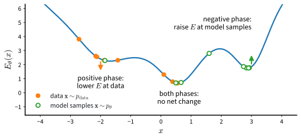

# Training Energy-Based Models
:label:`sec_diffusion-ebm-training`

The partition function of :eqref:`eq_diffusion-ebm` cannot be computed in
high dimension, yet energy-based models are trained by maximum likelihood.
This section explains how. The gradient of the log-likelihood does not
contain $Z(\boldsymbol{\theta})$ itself but an expectation under the model,
and an expectation can be estimated from samples. Producing those samples is
the work of Markov chain Monte Carlo, and running a Markov chain inside
every parameter update is the cost that the later sections of this chapter
remove. The presentation follows lecture 11 of :citet:`Kuleshov.2023`.

```{.python .input #energy-training-training-energy-based-models}
%%tab pytorch
%matplotlib inline
from d2l import torch as d2l
import math
import torch
from torch import nn
```

```{.python .input #energy-training-training-energy-based-models}
%%tab jax
%matplotlib inline
from d2l import jax as d2l
import math
import jax
import jax.flatten_util
from jax import numpy as jnp
from flax import nnx
import optax
```

## The Running Example

The two-dimensional experiments of this chapter share one target
distribution: a mixture of three isotropic Gaussians in the plane with
unequal weights. Two properties make it useful. Its density and its score
are known in closed form, so every learned quantity can be compared with the
truth: a model that provides a likelihood by the log-likelihood it assigns to
held-out samples, and a score model by its distance from the true score. Its
structure is multimodal with separated modes, which is the situation in
which sampling methods have trouble and mode weights become measurable. The
class below stores the parameters and evaluates the log-density and its
gradient with respect to the input in closed form; both formulas also cover
the distribution of a mixture sample after it is scaled and perturbed by
Gaussian noise, a case that the score-based sections need. It is saved to
the `d2l` library because the two-dimensional experiments of the later
sections use it.

```{.python .input #energy-training-the-running-example-1}
%%tab pytorch
class GaussianMixture:  #@save
    """A mixture of isotropic Gaussians with closed-form density and score."""
    def __init__(self, means, weights, std):
        self.means = torch.as_tensor(means, dtype=torch.float32)
        self.weights = torch.as_tensor(weights, dtype=torch.float32)
        self.std = std

    def sample(self, n):
        k = torch.multinomial(self.weights, n, replacement=True)
        return self.means[k] + self.std * torch.randn(n, self.means.shape[1])

    def log_prob(self, x, scale=1.0, sigma=0.0):
        """Log density of scale * x0 + sigma * eps, where x0 is a mixture draw."""
        var = (scale * self.std) ** 2 + sigma ** 2
        d2 = ((x[:, None, :] - scale * self.means[None]) ** 2).sum(-1)
        logs = (torch.log(self.weights)[None] - d2 / (2 * var)
                - 0.5 * x.shape[-1] * math.log(2 * math.pi * var))
        return torch.logsumexp(logs, 1)

    def score(self, x, scale=1.0, sigma=0.0):
        """The gradient of log_prob with respect to x, in closed form."""
        var = (scale * self.std) ** 2 + sigma ** 2
        d2 = ((x[:, None, :] - scale * self.means[None]) ** 2).sum(-1)
        r = torch.softmax(torch.log(self.weights)[None] - d2 / (2 * var), 1)
        return (r[:, :, None]
                * (scale * self.means[None] - x[:, None, :])).sum(1) / var
```

```{.python .input #energy-training-the-running-example-1}
%%tab jax
class GaussianMixture:  #@save
    """A mixture of isotropic Gaussians with closed-form density and score."""
    def __init__(self, means, weights, std):
        self.means = jnp.asarray(means, dtype=jnp.float32)
        self.weights = jnp.asarray(weights, dtype=jnp.float32)
        self.std = std

    def sample(self, key, n):
        k1, k2 = jax.random.split(key)
        k = jax.random.choice(k1, len(self.weights), (n,), p=self.weights)
        return self.means[k] + self.std * jax.random.normal(
            k2, (n, self.means.shape[1]))

    def log_prob(self, x, scale=1.0, sigma=0.0):
        """Log density of scale * x0 + sigma * eps, where x0 is a mixture draw."""
        var = (scale * self.std) ** 2 + sigma ** 2
        d2 = ((x[:, None, :] - scale * self.means[None]) ** 2).sum(-1)
        logs = (jnp.log(self.weights)[None] - d2 / (2 * var)
                - 0.5 * x.shape[-1] * math.log(2 * math.pi * var))
        return jax.nn.logsumexp(logs, 1)

    def score(self, x, scale=1.0, sigma=0.0):
        """The gradient of log_prob with respect to x, in closed form."""
        var = (scale * self.std) ** 2 + sigma ** 2
        d2 = ((x[:, None, :] - scale * self.means[None]) ** 2).sum(-1)
        r = jax.nn.softmax(jnp.log(self.weights)[None] - d2 / (2 * var), 1)
        return (r[:, :, None]
                * (scale * self.means[None] - x[:, None, :])).sum(1) / var
```

The components sit at the corners of a triangle with a common standard
deviation of $0.5$ and weights $0.5$, $0.3$, and $0.2$, so the modes are
about five units, ten standard deviations, apart. We draw two thousand
training points
and two thousand test points. The negative log-likelihood of the test set
under the true density, about $2.5$ nats per point, is the value a perfect
model would attain up to sampling error, and every model below is measured
against it.

```{.python .input #energy-training-the-running-example-2}
%%tab pytorch
torch.manual_seed(0)
mix = GaussianMixture(means=[[-2.5, -1.5], [2.5, -1.5], [0.0, 2.5]],
                      weights=[0.5, 0.3, 0.2], std=0.5)
data, test = mix.sample(2000), mix.sample(2000)
print(f'test NLL under the true density: {-mix.log_prob(test).mean():.3f} nats')
d2l.set_figsize((3.5, 3.5))
d2l.plt.scatter(data[:, 0], data[:, 1], s=4)
d2l.plt.xlabel('$x_1$'), d2l.plt.ylabel('$x_2$');
```

```{.python .input #energy-training-the-running-example-2}
%%tab jax
key = jax.random.PRNGKey(0)
mix = GaussianMixture(means=[[-2.5, -1.5], [2.5, -1.5], [0.0, 2.5]],
                      weights=[0.5, 0.3, 0.2], std=0.5)
key, k1, k2 = jax.random.split(key, 3)
data, test = mix.sample(k1, 2000), mix.sample(k2, 2000)
print(f'test NLL under the true density: {-mix.log_prob(test).mean():.3f} nats')
d2l.set_figsize((3.5, 3.5))
d2l.plt.scatter(data[:, 0], data[:, 1], s=4)
d2l.plt.xlabel('$x_1$'), d2l.plt.ylabel('$x_2$');
```

## The Maximum-Likelihood Gradient

Consider an energy-based model $p_{\boldsymbol{\theta}}(\mathbf{x}) =
\exp(-E_{\boldsymbol{\theta}}(\mathbf{x})) / Z(\boldsymbol{\theta})$ and a
training set $\mathbf{x}_1, \ldots, \mathbf{x}_n$. The average
log-likelihood separates into a term that depends on the data and a term
that does not:

$$
\frac{1}{n} \sum_{i=1}^{n} \log p_{\boldsymbol{\theta}}(\mathbf{x}_i)
= -\frac{1}{n} \sum_{i=1}^{n} E_{\boldsymbol{\theta}}(\mathbf{x}_i) - \log Z(\boldsymbol{\theta}).
$$
:eqlabel:`eq_diffusion-ebm-loglik`

The first term is an average of network outputs and is differentiated by
backpropagation. The second term is the logarithm of an intractable integral.
Its gradient, however, has a usable form. Differentiating under the integral
sign,

$$
\nabla_{\boldsymbol{\theta}} \log Z(\boldsymbol{\theta})
= \frac{1}{Z(\boldsymbol{\theta})} \int \nabla_{\boldsymbol{\theta}} \exp(-E_{\boldsymbol{\theta}}(\mathbf{x}))\, d\mathbf{x}
= \int \frac{\exp(-E_{\boldsymbol{\theta}}(\mathbf{x}))}{Z(\boldsymbol{\theta})}
\big(-\nabla_{\boldsymbol{\theta}} E_{\boldsymbol{\theta}}(\mathbf{x})\big)\, d\mathbf{x}
= -\mathbb{E}_{\mathbf{x} \sim p_{\boldsymbol{\theta}}}\big[\nabla_{\boldsymbol{\theta}} E_{\boldsymbol{\theta}}(\mathbf{x})\big].
$$
:eqlabel:`eq_diffusion-grad-logz`

The gradient of the log-partition function is minus the expectation, under
the model, of the gradient of the energy. Substituting into
:eqref:`eq_diffusion-ebm-loglik` gives the gradient of the average
log-likelihood,

$$
\nabla_{\boldsymbol{\theta}} \frac{1}{n} \sum_{i=1}^{n} \log p_{\boldsymbol{\theta}}(\mathbf{x}_i)
= -\,\mathbb{E}_{\mathbf{x} \sim p_{\textrm{data}}}\big[\nabla_{\boldsymbol{\theta}} E_{\boldsymbol{\theta}}(\mathbf{x})\big]
+ \mathbb{E}_{\mathbf{x} \sim p_{\boldsymbol{\theta}}}\big[\nabla_{\boldsymbol{\theta}} E_{\boldsymbol{\theta}}(\mathbf{x})\big],
$$
:eqlabel:`eq_diffusion-ebm-gradient`

where the first expectation is over the empirical distribution of the
training set. A gradient ascent step therefore moves the parameters to lower
the energy at the data and to raise it at samples from the current model.
The two contributions are called the *positive phase* and the *negative
phase*. Training stops moving when the two expectations agree, so the
learned model matches the data in the statistics
$\nabla_{\boldsymbol{\theta}} E_{\boldsymbol{\theta}}$. For an exponential
family, $E_{\boldsymbol{\theta}}(\mathbf{x}) = -\boldsymbol{\theta}^\top
\mathbf{f}(\mathbf{x})$ with sufficient statistics $\mathbf{f}$, the gradient
reduces to $\mathbb{E}_{\textrm{data}}[\mathbf{f}(\mathbf{x})] -
\mathbb{E}_{\boldsymbol{\theta}}[\mathbf{f}(\mathbf{x})]$, the log-likelihood
is concave, and the maximum-likelihood solution matches the moments of the
data :cite:`Kuleshov.2023`. :numref:`fig_diffusion-contrastive` shows the two
phases acting on a one-dimensional energy.


:label:`fig_diffusion-contrastive`

Equation :eqref:`eq_diffusion-ebm-gradient` changes the question. The update
does not need the value of $Z(\boldsymbol{\theta})$; it needs samples from
$p_{\boldsymbol{\theta}}$ to estimate the negative phase. In two dimensions
we can check the identity numerically before relying on it, because there
the integral can be computed on a grid.

### A Quadrature Reference in Two Dimensions

The energy below is a small multilayer perceptron with a quadratic term that
keeps $\exp(-E_{\boldsymbol{\theta}})$ integrable. A grid of $100 \times 100$
points on $[-6, 6]^2$ has spacing $0.12$, a quarter of the component
standard deviation, and quadrature on this grid evaluates
$\log Z(\boldsymbol{\theta})$ accurately enough for every purpose in this
section (Exercise 6 of :numref:`sec_diffusion-limits` quantifies the error).
Here and below the model is normalized over this square, and the data
distribution is taken to be the mixture restricted to it, which changes its
density inside the square by about one part in $10^{12}$. With $\log Z$ available, the negative log-likelihood
:eqref:`eq_diffusion-ebm-loglik` can be minimized directly, for as many updates as the
sampling-based training later in the section and with a linearly decaying
learning rate. The result is a reference: the fit reached when
$\log Z(\boldsymbol{\theta})$ and its gradient are computed by quadrature.
Every sampling-based method below estimates that gradient from model samples
instead, and approximates this fit.

```{.python .input #energy-training-an-exact-reference-in-two-dimensions}
%%tab pytorch
class EnergyNet(nn.Module):
    def __init__(self, hidden=64):
        super().__init__()
        self.net = nn.Sequential(nn.Linear(2, hidden), nn.SiLU(),
                                 nn.Linear(hidden, hidden), nn.SiLU(),
                                 nn.Linear(hidden, 1))

    def forward(self, x):  # the quadratic term keeps exp(-E) integrable
        return self.net(x).squeeze(-1) + (x ** 2).sum(-1) / 32

axis = torch.linspace(-6, 6, 100)
grid = torch.stack(torch.meshgrid(axis, axis, indexing='ij'), -1).reshape(-1, 2)
log_cell = 2 * math.log(axis[1] - axis[0])

def log_Z(energy):  # quadrature: possible only because d = 2
    return torch.logsumexp(-energy(grid), 0) + log_cell

def nll(energy, x):
    with torch.no_grad():
        return (energy(x).mean() + log_Z(energy)).item()

torch.manual_seed(1)
energy_mle = EnergyNet()
optimizer = torch.optim.Adam(energy_mle.parameters(), lr=3e-3)
for step in range(3000):
    optimizer.param_groups[0]['lr'] = 3e-3 * (1 - step / 3000)  # linear decay
    x = data[torch.randint(0, len(data), (500,))]
    loss = energy_mle(x).mean() + log_Z(energy_mle)  # negative log-likelihood
    optimizer.zero_grad(), loss.backward(), optimizer.step()
print(f'test NLL with the grid normalizer: {nll(energy_mle, test):.3f} nats')
```

```{.python .input #energy-training-an-exact-reference-in-two-dimensions}
%%tab jax
class EnergyNet(nnx.Module):
    def __init__(self, hidden=64, rngs=None):
        self.h1 = nnx.Linear(2, hidden, rngs=rngs)
        self.h2 = nnx.Linear(hidden, hidden, rngs=rngs)
        self.out = nnx.Linear(hidden, 1, rngs=rngs)

    def __call__(self, x):  # the quadratic term keeps exp(-E) integrable
        h = nnx.silu(self.h2(nnx.silu(self.h1(x))))
        return self.out(h)[..., 0] + (x ** 2).sum(-1) / 32

axis = jnp.linspace(-6, 6, 100)
grid = jnp.stack(jnp.meshgrid(axis, axis, indexing='ij'), -1).reshape(-1, 2)
log_cell = 2 * math.log(axis[1] - axis[0])

def log_Z(energy):  # quadrature: possible only because d = 2
    return jax.nn.logsumexp(-energy(grid), 0) + log_cell

@nnx.jit
def nll(energy, x):
    return energy(x).mean() + log_Z(energy)

@nnx.jit
def mle_step(energy, optimizer, x):
    def loss_fn(model):  # negative log-likelihood
        return model(x).mean() + log_Z(model)
    loss, grads = nnx.value_and_grad(loss_fn)(energy)
    optimizer.update(energy, grads)
    return loss

energy_mle = EnergyNet(rngs=nnx.Rngs(1))
schedule = optax.linear_schedule(3e-3, 0.0, 3000)  # linear decay
optimizer = nnx.Optimizer(energy_mle, optax.adam(schedule), wrt=nnx.Param)
for step in range(3000):
    key, subkey = jax.random.split(key)
    x = data[jax.random.randint(subkey, (500,), 0, len(data))]
    mle_step(energy_mle, optimizer, x)
print(f'test NLL with the grid normalizer: {nll(energy_mle, test):.3f} nats')
```

The test negative log-likelihood lands within a few hundredths of a nat of
the true density's value. The gap is an estimate of the Kullback--Leibler
divergence from the restricted data distribution to the model
(:numref:`subsec_mdl-nll-crossentropy`), so this energy network can
represent the mixture almost exactly when the normalizer is available.

### Checking the Gradient Identity

Identity :eqref:`eq_diffusion-grad-logz` equates two computations that look
nothing alike: the gradient of the quadrature estimate of $\log Z$, obtained
by backpropagating through the sum over the grid, and the negative average
gradient of the energy at samples from the model. On the grid, the model is
a categorical distribution with probabilities proportional to
$\exp(-E_{\boldsymbol{\theta}})$, and this grid model can be sampled exactly. The cell
compares the two gradients as the number of samples grows.

```{.python .input #energy-training-checking-the-gradient-identity}
%%tab pytorch
def flat_grad(scalar, params):
    return torch.cat([g.reshape(-1) for g in torch.autograd.grad(scalar, params)])

params = list(energy_mle.parameters())
grad_log_Z = flat_grad(log_Z(energy_mle), params)
with torch.no_grad():
    probs = torch.softmax(-energy_mle(grid), 0)  # p_theta on the grid
torch.manual_seed(2)
for n in (100, 1000, 10000):
    x = grid[torch.multinomial(probs, n, replacement=True)]  # x ~ p_theta
    grad_mc = flat_grad(-energy_mle(x).mean(), params)  # -E_p[grad E]
    print(f'{n:>6d} model samples: relative error '
          f'{(grad_mc - grad_log_Z).norm() / grad_log_Z.norm():.3f}')
```

```{.python .input #energy-training-checking-the-gradient-identity}
%%tab jax
def flat_grad(fn, energy):
    return jax.flatten_util.ravel_pytree(nnx.grad(fn)(energy))[0]

grad_log_Z = flat_grad(log_Z, energy_mle)
probs = jax.nn.softmax(-energy_mle(grid), 0)  # p_theta on the grid
for n in (100, 1000, 10000):
    key, subkey = jax.random.split(key)
    x = grid[jax.random.choice(subkey, len(grid), (n,), p=probs)]  # x ~ p_theta
    grad_mc = flat_grad(lambda m: -m(x).mean(), energy_mle)  # -E_p[grad E]
    print(f'{n:>6d} model samples: relative error '
          f'{jnp.linalg.norm(grad_mc - grad_log_Z) / jnp.linalg.norm(grad_log_Z):.3f}')
```

The relative error falls roughly as $1 / \sqrt{n}$, as a Monte Carlo
estimate should, and is down to a few percent or less with ten thousand
samples. The identity holds; what remains is to produce samples from
$p_{\boldsymbol{\theta}}$ when no grid is available.

## Sampling by Markov Chain Monte Carlo

Sampling from a density known only up to a constant is the problem that
Markov chain Monte Carlo (MCMC) solves. :numref:`sec_mdl-bayes-mcmc`
introduced the method for Bayesian posteriors, which have the same form:
a tractable unnormalized density and an intractable normalizer. We recall
the definitions needed here and then specialize to energies.

### Markov Chains and Stationary Distributions

A Markov chain is a sequence of random states $\mathbf{x}^{(0)},
\mathbf{x}^{(1)}, \ldots$ in which each state is drawn from a *transition
kernel* $T(\mathbf{x}' \mid \mathbf{x})$ that depends only on the current
state. If the state at step $t$ has distribution $\pi_t$, the state at step
$t + 1$ has distribution $\pi_{t+1}(\mathbf{x}') = \int T(\mathbf{x}' \mid
\mathbf{x})\, \pi_t(\mathbf{x})\, d\mathbf{x}$. A distribution $\pi$ is
*stationary* if this map leaves it unchanged. A sufficient condition for
stationarity is *detailed balance*,

$$
\pi(\mathbf{x})\, T(\mathbf{x}' \mid \mathbf{x}) = \pi(\mathbf{x}')\, T(\mathbf{x} \mid \mathbf{x}')
\quad \textrm{for all } \mathbf{x}, \mathbf{x}',
$$
:eqlabel:`eq_diffusion-detailed-balance`

which states that under $\pi$ the flow of probability from $\mathbf{x}$ to
$\mathbf{x}'$ equals the flow back. Integrating both sides over $\mathbf{x}$,
and using that $T(\cdot \mid \mathbf{x}')$ integrates to one, gives
$\int \pi(\mathbf{x}) T(\mathbf{x}' \mid \mathbf{x})\, d\mathbf{x} =
\pi(\mathbf{x}')$, which is stationarity. The plan of MCMC is to construct a
kernel whose stationary distribution is the model $p_{\boldsymbol{\theta}}$,
run the chain long enough that its state distribution has approached the
stationary one, and treat subsequent states as model samples. Convergence to
the stationary distribution from essentially any starting state holds under
two further conditions, that every region can be reached from every other
(irreducibility) and that the chain does not cycle with a fixed period
(aperiodicity), which the constructions below satisfy for smooth positive
densities; :citet:`mackay2003information` gives a careful
account. The number of steps needed to approach stationarity, the *mixing
time*, is the quantity that decides whether the method is practical.

### Metropolis--Hastings

The Metropolis--Hastings algorithm
:cite:`Metropolis.Rosenbluth.Rosenbluth.ea.1953,Hastings.1970` builds such a
kernel from any proposal distribution $Q(\mathbf{x}' \mid \mathbf{x})$ that
can be sampled and evaluated. From the current state $\mathbf{x}$, draw a proposal
$\mathbf{x}' \sim Q(\cdot \mid \mathbf{x})$ and accept it with probability

$$
A(\mathbf{x}' \mid \mathbf{x})
= \min\left\{1,\ \frac{p_{\boldsymbol{\theta}}(\mathbf{x}')\, Q(\mathbf{x} \mid \mathbf{x}')}{p_{\boldsymbol{\theta}}(\mathbf{x})\, Q(\mathbf{x}' \mid \mathbf{x})}\right\};
$$
:eqlabel:`eq_diffusion-mh-accept`

otherwise the chain stays at $\mathbf{x}$. The density enters only through
the ratio $p_{\boldsymbol{\theta}}(\mathbf{x}') / p_{\boldsymbol{\theta}}(\mathbf{x})
= \exp(E_{\boldsymbol{\theta}}(\mathbf{x}) - E_{\boldsymbol{\theta}}(\mathbf{x}'))$,
so the normalizer cancels. For a symmetric proposal such as a Gaussian random
walk $\mathbf{x}' = \mathbf{x} + \tau \boldsymbol{\xi}$ with
$\boldsymbol{\xi} \sim \mathcal{N}(\mathbf{0}, I)$, the proposal ratio is one
and the rule becomes: always accept a move to lower energy, and accept a move
to higher energy with probability $\exp(-\Delta E)$, where
$\Delta E = E_{\boldsymbol{\theta}}(\mathbf{x}') - E_{\boldsymbol{\theta}}(\mathbf{x})$
is the increase in energy.

The kernel satisfies detailed balance with respect to
$p_{\boldsymbol{\theta}}$. For $\mathbf{x}' \neq \mathbf{x}$ the kernel is
$T(\mathbf{x}' \mid \mathbf{x}) = Q(\mathbf{x}' \mid \mathbf{x}) A(\mathbf{x}' \mid \mathbf{x})$.
If the ratio in :eqref:`eq_diffusion-mh-accept` is at most one, then
$A(\mathbf{x}' \mid \mathbf{x})$ equals that ratio and $A(\mathbf{x} \mid \mathbf{x}') = 1$, so

$$
p_{\boldsymbol{\theta}}(\mathbf{x})\, Q(\mathbf{x}' \mid \mathbf{x})\, A(\mathbf{x}' \mid \mathbf{x})
= p_{\boldsymbol{\theta}}(\mathbf{x}')\, Q(\mathbf{x} \mid \mathbf{x}')
= p_{\boldsymbol{\theta}}(\mathbf{x}')\, Q(\mathbf{x} \mid \mathbf{x}')\, A(\mathbf{x} \mid \mathbf{x}'),
$$

which is :eqref:`eq_diffusion-detailed-balance`; if the ratio exceeds one,
the same computation applies with the roles of $\mathbf{x}$ and
$\mathbf{x}'$ exchanged, and rejected moves contribute equally to both sides
because they leave the state unchanged. Gibbs sampling
:cite:`Geman.Geman.1984` is the special case in which the proposal resamples
one coordinate from its exact conditional distribution given the others;
its acceptance probability is always one, and it is the standard sampler for
the discrete models of :numref:`sec_diffusion-limits`, whose conditionals
are tractable.

The sampler is a few lines. It runs many chains in parallel, one per row of
its input, and returns the final states together with the acceptance rate.
An optional argument, `box`, confines the chains to a square by rejecting
every proposal that leaves it. This is the acceptance rule above applied to
the model restricted to the square, whose density is zero outside it; the
training experiment below uses it.

```{.python .input #energy-training-metropolis-hastings}
%%tab pytorch
def metropolis_hastings(energy, x, steps, step_size, box=math.inf):
    """Random-walk Metropolis-Hastings on exp(-energy), one chain per row.
    Proposals outside the square [-box, box]^2 are rejected."""
    accepted = 0.0
    with torch.no_grad():
        e = energy(x)
        for _ in range(steps):
            proposal = x + step_size * torch.randn_like(x)
            e_prop = energy(proposal)
            log_u = torch.log(torch.rand(len(x), device=x.device))
            accept = ((log_u < e - e_prop)  # probability min(1, p'/p)
                      & (proposal.abs() <= box).all(-1))
            x = torch.where(accept[:, None], proposal, x)
            e = torch.where(accept, e_prop, e)
            accepted += accept.float().mean().item()
    return x, accepted / steps
```

```{.python .input #energy-training-metropolis-hastings}
%%tab jax
@nnx.jit
def mh_step(energy, x, e, key, step_size, box):
    k1, k2 = jax.random.split(key)
    proposal = x + step_size * jax.random.normal(k1, x.shape)
    e_prop = energy(proposal)
    log_u = jnp.log(jax.random.uniform(k2, (len(x),)))
    accept = ((log_u < e - e_prop)  # probability min(1, p'/p)
              & (jnp.abs(proposal) <= box).all(-1))
    x = jnp.where(accept[:, None], proposal, x)
    e = jnp.where(accept, e_prop, e)
    return x, e, accept.mean()

def metropolis_hastings(energy, x, key, steps, step_size, box=math.inf):
    """Random-walk Metropolis-Hastings on exp(-energy), one chain per row.
    Proposals outside the square [-box, box]^2 are rejected."""
    e, accepted = energy(x), 0.0
    for _ in range(steps):
        key, subkey = jax.random.split(key)
        x, e, rate = mh_step(energy, x, e, subkey, step_size, box)
        accepted += float(rate)
    return x, accepted / steps
```

### The Step Size Trades Acceptance against Mixing

Before using the sampler inside training, we run it on a target whose
samples we can check: the energy $-\log p$ of the mixture itself. Two
thousand chains start from a broad Gaussian and run for two thousand steps
at three proposal scales. We record the acceptance rate, the fraction of
chains that end nearest to each component mean, which should match the
weights $0.5$, $0.3$, $0.2$, and the mean squared distance from a chain to
its nearest mean, which for a two-dimensional Gaussian with standard
deviation $0.5$ should be $2 \times 0.25 = 0.5$.

```{.python .input #energy-training-the-step-size-trades-acceptance-against-mixing}
%%tab pytorch
def mode_weights(x):
    """The fraction of points closest to each component mean."""
    d2 = ((x[:, None, :] - mix.means[None]) ** 2).sum(-1)
    return [round(w, 3) for w in
            (torch.bincount(d2.argmin(1), minlength=3) / len(x)).tolist()]

true_energy = lambda x: -mix.log_prob(x)
torch.manual_seed(3)
x_init = 3 * torch.randn(2000, 2)
print(f'true mode weights: {[round(w, 3) for w in mix.weights.tolist()]}')
for step_size in (0.25, 1.0, 4.0):
    x, rate = metropolis_hastings(true_energy, x_init, 2000, step_size)
    d2 = ((x[:, None, :] - mix.means[None]) ** 2).sum(-1).min(1).values
    print(f'step size {step_size}: acceptance {rate:.2f}, mode weights '
          f'{mode_weights(x)}, within-mode spread {d2.mean():.2f}')
```

```{.python .input #energy-training-the-step-size-trades-acceptance-against-mixing}
%%tab jax
def mode_weights(x):
    """The fraction of points closest to each component mean."""
    d2 = ((x[:, None, :] - mix.means[None]) ** 2).sum(-1)
    return [round(float(w), 3) for w in
            jnp.bincount(d2.argmin(1), length=3) / len(x)]

class TrueEnergy(nnx.Module):  # a parameter-free module, so it can be jitted
    def __call__(self, x):
        return -mix.log_prob(x)

true_energy = TrueEnergy()
key, subkey = jax.random.split(key)
x_init = 3 * jax.random.normal(subkey, (2000, 2))
print(f'true mode weights: {[round(w, 3) for w in mix.weights.tolist()]}')
for step_size in (0.25, 1.0, 4.0):
    key, subkey = jax.random.split(key)
    x, rate = metropolis_hastings(true_energy, x_init, subkey, 2000, step_size)
    d2 = ((x[:, None, :] - mix.means[None]) ** 2).sum(-1).min(1)
    print(f'step size {step_size}: acceptance {rate:.2f}, mode weights '
          f'{mode_weights(x)}, within-mode spread {d2.mean():.2f}')
```

The within-mode spread matches the Gaussian value of $0.5$ at every step
size, as expected if each chain has equilibrated within its mode. The mode
weights are another matter. With small proposals most
moves are accepted, but a chain almost never crosses the low-density region
between modes, so after two thousand steps the three modes still hold the
roughly equal fractions of chains that the initialization placed there.
Large proposals are rarely accepted, about six in a hundred, but an accepted
large proposal can land in another mode, so the chains move between modes
and the weights approach the truth. The intermediate scale accepts about
three proposals in ten and also ends close to the true weights, but its
chains cross between modes far less often (Exercise 7 counts the
crossings). When the modes are far apart relative to their width, only a
long jump crosses a gap, so on this target the largest scale moves chains
between modes most often despite rejecting most of its proposals. Every
scale gives an exact sampler only in the limit of many steps, and for small
proposals that limit is far away. In high dimensions the trade-off is
worse: a random-walk proposal must shrink with the dimension to keep its
acceptance rate from collapsing, and the number of steps needed to traverse
the distribution grows accordingly :cite:`Roberts.Gelman.Gilks.1997`.
:numref:`sec_diffusion-langevin` will replace the blind proposal with one
that follows the gradient of the log-density, which is the same score that
the next section learns.

## Contrastive Divergence

Training now alternates sampling from the current model with a gradient
step on its parameters. At parameters
$\boldsymbol{\theta}_t$, run Markov chains to obtain approximate samples from
$p_{\boldsymbol{\theta}_t}$, form the gradient estimate
:eqref:`eq_diffusion-ebm-gradient` from a minibatch of data and these
samples, and take a gradient step. The expense is the sampling. A chain that
starts from noise needs many steps to reach the model distribution, and
running such a chain to convergence inside every update is prohibitive.

Two approximations make training practical. *Contrastive divergence*
:cite:`Hinton.2002` initializes the chains at the training points and runs
only $k$ steps, often $k = 1$. Because the chains start at data, the
resulting negative-phase samples are near the data, and the update pushes
energy up only in the immediate neighborhood of the training set. The
estimate is biased, but each update is cheap. *Persistent contrastive
divergence* :cite:`Tieleman.2008` keeps a set of chains alive across
updates: the chains that provided the negative phase at step $t$ continue
from where they stopped at step $t + 1$. Because
$\boldsymbol{\theta}_{t+1}$ is close to $\boldsymbol{\theta}_t$, samples
from the previous model are good starting points for the current one, and a
few steps per update keep the chains near the moving target. Deep
energy-based models for images work in the same spirit with short-run
Langevin chains, started from uniform noise :cite:`Nijkamp.Hill.Zhu.ea.2019`
or from a replay buffer of earlier samples that is occasionally reseeded
with noise :cite:`Du.Mordatch.2019`, with on the order of a hundred
gradient-informed steps per update.

The loss below has the property that its gradient with respect to
$\boldsymbol{\theta}$ is the negative of :eqref:`eq_diffusion-ebm-gradient`
with the model expectation replaced by an average over the persistent chains,
so minimizing it by gradient descent performs the maximum-likelihood ascent.
The chain samples enter the loss as constants: the identity
:eqref:`eq_diffusion-ebm-gradient` is an expectation over samples of the
current model with those samples held fixed, so no gradient flows through
the sampler that produced them.
The loss value itself is not a likelihood and need not decrease; the test
negative log-likelihood, available here through the grid, is the quantity to
watch, and the function records it every five hundred steps. We use $1024$
persistent chains, twenty Metropolis--Hastings steps per update
with the intermediate proposal scale, and a learning rate that decays
linearly to zero. The chains start from a broad Gaussian clipped to the
square $[-6, 6]^2$, and proposals that leave the square are rejected, so the
chains sample the model on the square, the distribution whose normalizer
the grid computes and whose likelihood is reported.

```{.python .input #energy-training-contrastive-divergence-1}
%%tab pytorch
def train_pcd(energy, steps, mcmc_steps=20, chains=1024, step_size=1.0,
              lr=2e-3):
    optimizer = torch.optim.Adam(energy.parameters(), lr=lr)
    x_neg = (3 * torch.randn(chains, 2)).clamp(-6, 6)  # noise in the square
    trace = []
    for step in range(steps):
        x_pos = data[torch.randint(0, len(data), (256,))]
        x_neg, rate = metropolis_hastings(energy, x_neg, mcmc_steps, step_size,
                                          box=6)  # the model lives on the square
        # Its gradient is minus the log-likelihood gradient estimate
        loss = energy(x_pos).mean() - energy(x_neg).mean()
        optimizer.zero_grad(), loss.backward(), optimizer.step()
        for group in optimizer.param_groups:  # linear learning-rate decay
            group['lr'] = lr * (1 - (step + 1) / steps)
        if (step + 1) % 500 == 0:
            trace.append(round(nll(energy, test), 3))
    return x_neg, rate, trace

torch.manual_seed(4)
energy_pcd = EnergyNet()
x_neg, rate, trace = train_pcd(energy_pcd, steps=3000)
print(f'test NLL every 500 steps: {trace}')
print(f'final acceptance rate {rate:.2f}; mode weights of the chains '
      f'{mode_weights(x_neg)}')
```

```{.python .input #energy-training-contrastive-divergence-1}
%%tab jax
@nnx.jit
def cd_step(energy, optimizer, x_pos, x_neg):
    def loss_fn(model):  # its gradient is minus the log-likelihood gradient
        return model(x_pos).mean() - model(x_neg).mean()
    loss, grads = nnx.value_and_grad(loss_fn)(energy)
    optimizer.update(energy, grads)
    return loss

def train_pcd(energy, key, steps, mcmc_steps=20, chains=1024, step_size=1.0,
              lr=2e-3):
    schedule = optax.linear_schedule(lr, 0.0, steps)  # linear decay
    optimizer = nnx.Optimizer(energy, optax.adam(schedule), wrt=nnx.Param)
    key, subkey = jax.random.split(key)
    x_neg = jnp.clip(3 * jax.random.normal(subkey, (chains, 2)), -6, 6)  # noise
    trace = []
    for step in range(steps):
        key, k1, k2 = jax.random.split(key, 3)
        x_pos = data[jax.random.randint(k1, (256,), 0, len(data))]
        x_neg, rate = metropolis_hastings(energy, x_neg, k2, mcmc_steps,
                                          step_size, box=6)  # on the square
        cd_step(energy, optimizer, x_pos, x_neg)
        if (step + 1) % 500 == 0:
            trace.append(round(float(nll(energy, test)), 3))
    return x_neg, rate, trace

energy_pcd = EnergyNet(rngs=nnx.Rngs(4))
key, subkey = jax.random.split(key)
x_neg, rate, trace = train_pcd(energy_pcd, subkey, steps=3000)
print(f'test NLL every 500 steps: {trace}')
print(f'final acceptance rate {rate:.2f}; mode weights of the chains '
      f'{mode_weights(x_neg)}')
```

The three panels compare the true density with the two learned models on
the grid, with test points overlaid.

```{.python .input #energy-training-contrastive-divergence-2}
%%tab pytorch
def density_on_grid(energy):
    with torch.no_grad():
        return torch.exp(-energy(grid) - log_Z(energy)).reshape(100, 100)

panels = [('true density', torch.exp(mix.log_prob(grid)).reshape(100, 100)),
          ('quadrature reference', density_on_grid(energy_mle)),
          ('persistent contrastive divergence', density_on_grid(energy_pcd))]
fig, axes = d2l.plt.subplots(1, 3, figsize=(10.5, 3.4))
for ax, (title, dens) in zip(axes, panels):
    ax.contourf(axis, axis, dens.T, levels=12, cmap='Blues')
    ax.scatter(test[:300, 0], test[:300, 1], s=3, c='k', alpha=0.4)
    ax.set_title(title), ax.set_aspect('equal')
fig.tight_layout()
```

```{.python .input #energy-training-contrastive-divergence-2}
%%tab jax
def density_on_grid(energy):
    return jnp.exp(-energy(grid) - log_Z(energy)).reshape(100, 100)

panels = [('true density', jnp.exp(mix.log_prob(grid)).reshape(100, 100)),
          ('quadrature reference', density_on_grid(energy_mle)),
          ('persistent contrastive divergence', density_on_grid(energy_pcd))]
fig, axes = d2l.plt.subplots(1, 3, figsize=(10.5, 3.4))
for ax, (title, dens) in zip(axes, panels):
    ax.contourf(axis, axis, dens.T, levels=12, cmap='Blues')
    ax.scatter(test[:300, 0], test[:300, 1], s=3, c='k', alpha=0.4)
    ax.set_title(title), ax.set_aspect('equal')
fig.tight_layout()
```

Persistent contrastive divergence recovers the three modes in the right
places with approximately the right weights, and by the end of the run its
test negative log-likelihood is within a few hundredths of a nat of the
quadrature reference. The trace shows how it got there: the value falls over
the first checkpoints, then fluctuates between checkpoints and settles only
as the learning rate decays. A plausible
source of the fluctuation is the
negative phase. It is estimated from chains that mix slowly between modes,
so the model's expectation is represented by whatever fraction of chains
happens to occupy each mode, and the gradient is biased whenever that
fraction differs from the model's own weights; the bias changes as the
energy landscape changes, and a fixed learning rate would keep the
parameters moving in response. Exercise 5 tests this explanation. The
result took sixty thousand Metropolis--Hastings steps for each of the $1024$
chains, about sixty million proposals in two dimensions.
For images, where each step of a gradient-based sampler costs a forward and
a backward pass of a deep network, the same strategy is possible but
expensive, and the learned model is sensitive to the settings of the
sampler, such as its step size :cite:`Du.Mordatch.2019`.

Maximum likelihood requires the model's own samples because its gradient
contains the model's expectation. An objective
whose gradient involves only data would remove the inner sampling loop
entirely. The score of the next section provides such an objective.

## Summary

The gradient of the log-partition function is minus the model's expected
energy gradient, so the maximum-likelihood gradient of an energy-based model
is the model expectation minus the data expectation of
$\nabla_{\boldsymbol{\theta}} E_{\boldsymbol{\theta}}$. The update lowers the
energy at data and raises it at model samples, and it needs samples rather
than the normalizer. In two dimensions the identity was verified against
quadrature, with Monte Carlo error falling as $1 / \sqrt{n}$.

Markov chain Monte Carlo supplies the samples. A kernel that satisfies
detailed balance with respect to $p_{\boldsymbol{\theta}}$ leaves it
stationary, and Metropolis--Hastings builds such a kernel from any proposal
using only energy differences. Its step size trades acceptance against
mixing: on the running example, small proposals get the within-mode spread
right but not the weights between modes, while proposals large enough to cross the gaps
are rarely accepted but, when accepted, move chains between modes.
Contrastive divergence shortens the chains by starting
them at data, and persistent contrastive divergence reuses chains across
updates. The persistent variant fitted the mixture to within a few
hundredths of a nat of the quadrature reference once the learning rate
had decayed, at the cost of a sampling loop inside every update and a bias
that depends on how well that loop mixes.

## Exercises

1. **The gradient of the normalizer.** Repeat the derivation of
   :eqref:`eq_diffusion-grad-logz` for a discrete model
   $p_{\boldsymbol{\theta}}(x) = \exp(-E_{\boldsymbol{\theta}}(x)) / Z(\boldsymbol{\theta})$
   over a finite set, replacing the integral by a sum. Then specialize to a
   Gaussian written as an exponential family with sufficient statistics
   $(x, x^2)$, and verify that setting :eqref:`eq_diffusion-ebm-gradient` to
   zero matches the first two moments of the data.
1. **Detailed balance for rejected moves.** The proof in the text treated
   proposals $\mathbf{x}' \neq \mathbf{x}$. Write the full transition kernel of
   Metropolis--Hastings, including the probability of remaining at
   $\mathbf{x}$, and show that :eqref:`eq_diffusion-detailed-balance` holds for
   $\mathbf{x}' = \mathbf{x}$ trivially. Then show that Gibbs sampling, viewed
   as a proposal that draws one coordinate from its conditional, has
   acceptance probability exactly one under :eqref:`eq_diffusion-mh-accept`.
1. [code] **Acceptance and dimension.** Run the random-walk sampler on a
   standard Gaussian target in $d = 2, 8, 32, 128$ dimensions with a fixed
   step size, and record the acceptance rate. Then find, for each $d$, the
   step size that gives an acceptance rate near $0.25$, and plot it against
   $d$ on logarithmic axes. What power law do you observe, and what does it
   imply for the number of steps needed to move a distance of order one?
1. [code] **Contrastive divergence with short chains.** Train the energy
   network with chains initialized at the minibatch and run for $k = 1$
   Metropolis--Hastings steps, the original contrastive divergence. Compare
   the test negative log-likelihood and the learned density with the
   persistent run. Where does the $k = 1$ model place spurious probability
   mass, and why does starting the chains at data make this failure likely?
1. [code] **The learning-rate schedule.** Repeat the persistent run with a
   constant learning rate of $2 \times 10^{-3}$ and record the test negative
   log-likelihood every $250$ steps. Relate the fluctuations to the mode
   weights of the persistent chains at the same checkpoints. Does averaging
   the parameters over the last thousand steps recover the quality of the
   decayed run?
1. [code] **An energy-based classifier.** Train the energy network as a
   conditional model $E_{\boldsymbol{\theta}}(\mathbf{x}, y)$ with $y$ the
   index of the component that generated each training point, which the
   sampler in `GaussianMixture.sample` can be modified to return. Because $y$
   takes three values, the normalizer over $y$ for fixed $\mathbf{x}$ is a sum
   of three terms and needs no sampling. Train by maximum likelihood of
   $p(y \mid \mathbf{x})$, report the test accuracy, and explain which
   quantity this model cannot provide that the unconditional model can.
1. [code] **Mode switches.** Rerun the step-size experiment and, for each of
   the three proposal scales, count how often a chain's nearest component
   mean changes during the run, and record the mode weights after $200$,
   $1000$, and $2000$ steps. Which scale reaches the true weights first, and
   how does the answer square with its acceptance rate?

<!-- slides -->

::: {.slide}
::: {.cover}
[Dive into Deep Learning · §17.2]{.kicker}

Training energy-based models<br>
**the gradient needs samples, not Z · Metropolis--Hastings · contrastive divergence and its cost**
:::
:::

::: {.slide title="The Running Example: a Mixture with Known Density"}
Three Gaussians in the plane, weights $0.5, 0.3, 0.2$, standard deviation
$0.5$: closed-form density, closed-form score, and a reference test
negative log-likelihood of about $2.5$ nats.

@energy-training-the-running-example-2
:::

::: {.slide title="The Log-Partition Gradient Is a Model Expectation"}
$$\nabla_{\boldsymbol{\theta}} \log Z(\boldsymbol{\theta})
= -\,\mathbb{E}_{\mathbf{x} \sim p_{\boldsymbol{\theta}}}\big[\nabla_{\boldsymbol{\theta}} E_{\boldsymbol{\theta}}(\mathbf{x})\big]$$

. . .

$$\nabla_{\boldsymbol{\theta}} \tfrac{1}{n}\textstyle\sum_i \log p_{\boldsymbol{\theta}}(\mathbf{x}_i)
= -\,\mathbb{E}_{\textrm{data}}\big[\nabla_{\boldsymbol{\theta}} E_{\boldsymbol{\theta}}\big]
+ \mathbb{E}_{p_{\boldsymbol{\theta}}}\big[\nabla_{\boldsymbol{\theta}} E_{\boldsymbol{\theta}}\big]$$

- positive phase: lower the energy at data;
- negative phase: raise it at model samples;
- the update needs **samples**, not $Z$.
:::

::: {.slide title="Two Phases on a One-Dimensional Energy"}
{width=70%}

Where model samples coincide with data, the two pushes cancel and the energy
stops changing.
:::

::: {.slide title="The Identity, Checked Against Quadrature"}
In two dimensions the grid version of the model can be sampled exactly, so the two
sides of the identity can be compared:

@energy-training-checking-the-gradient-identity

Monte Carlo error falls like $1/\sqrt{n}$.
:::

::: {.slide title="Metropolis--Hastings Uses Only Energy Differences"}
Propose $\mathbf{x}' \sim Q(\cdot \mid \mathbf{x})$, accept with

$$A = \min\left\{1,\ \frac{p_{\boldsymbol{\theta}}(\mathbf{x}')\, Q(\mathbf{x} \mid \mathbf{x}')}{p_{\boldsymbol{\theta}}(\mathbf{x})\, Q(\mathbf{x}' \mid \mathbf{x})}\right\}
= \min\{1, e^{-\Delta E}\} \ \text{for a symmetric } Q.$$

- $Z$ cancels in the ratio;
- detailed balance holds, so $p_{\boldsymbol{\theta}}$ is stationary;
- correctness is asymptotic; the mixing time decides the cost.
:::

::: {.slide title="Step Size: Acceptance versus Mixing"}
@energy-training-the-step-size-trades-acceptance-against-mixing

Small steps: the within-mode spread is right, the weights are wrong. Large steps: the
weights approach the truth, and most proposals are rejected.
:::

::: {.slide title="Persistent Contrastive Divergence"}
Chains live across updates; twenty Metropolis--Hastings steps per gradient
step keep them near the moving model.

@!energy-training-contrastive-divergence-2

Within a few hundredths of a nat of the quadrature reference once the
learning rate has decayed, at the cost of a sampling loop inside every
update.
:::

::: {.slide title="Recap"}
- $\nabla_{\boldsymbol{\theta}} \log Z = -\mathbb{E}_{p_{\boldsymbol{\theta}}}[\nabla_{\boldsymbol{\theta}} E]$:
  maximum likelihood lowers the energy at data (positive phase) and raises
  it at model samples (negative phase).
- Metropolis--Hastings samples from $\exp(-E)$ with energy differences alone;
  its step size trades acceptance against mixing.
- Contrastive divergence shortens the chains; the persistent variant reuses
  them. Both are biased by incomplete mixing.
- The inner sampling loop is the cost. Next: an objective whose gradient
  needs no model samples.
:::
