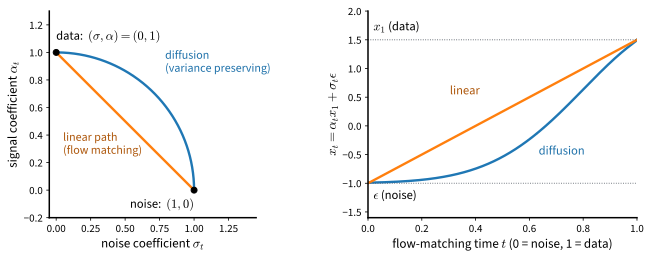

# Flow Matching and Its Relation to Diffusion
:label:`sec_diffusion-flow-matching`

The chapter has built its generative models from noise: perturb the data,
learn the score of the perturbed distribution, and undo the perturbation
one level at a time. :numref:`sec_diffusion-ddim` ended with the
observation that the deterministic version of this procedure integrates an
ordinary differential equation. *Flow matching*
:cite:`Lipman.Chen.BenHamu.ea.2022,Liu.Gong.Liu.2022,Albergo.Boffi.VandenEijnden.2023`
starts from that equation. It prescribes a path of distributions from noise
to data, learns the velocity field that carries samples along the path, and
generates by integrating the field. The construction needs no Markov
chain and no variational bound, its training loss has the same form as
noise prediction, and it contains diffusion as a special case. For the
Gaussian paths used in practice the velocity and the score determine each
other by an explicit formula, so a trained noise predictor already defines
a velocity field. This formula, a dictionary between the two views, is
checked on the running example, where both fields are known in closed form,
and the image U-Net is then trained with a velocity target.
:numref:`sec_mdl-score-matching-diffusion-flow` proves the two theorems
that the section states.

One convention changes. Flow matching runs time in the generative direction:
$t = 0$ is noise and $t = 1$ is data, the reverse of the diffusion clock, and
the paths below are written on this clock.

```{.python .input #flow-matching-flow-matching-and-its-relation-to-diffusion}
%%tab pytorch
%matplotlib inline
from d2l import torch as d2l
import math
import torch
from torch import nn
```

```{.python .input #flow-matching-flow-matching-and-its-relation-to-diffusion}
%%tab jax
%matplotlib inline
from d2l import jax as d2l
import jax
from jax import numpy as jnp
from flax import nnx
import optax
```

## Probability Paths and Velocity Fields

A **probability path** is a family of densities $(p_t)_{t \in [0, 1]}$ with
$p_0 = \mathcal{N}(\mathbf{0}, I)$ and $p_1 = p_{\textrm{data}}$. A
time-dependent **velocity field** $\mathbf{u}_t : \mathbb{R}^d \to \mathbb{R}^d$
*generates* the path if the solution of the ordinary differential equation

$$
\frac{d}{dt} \mathbf{x}_t = \mathbf{u}_t(\mathbf{x}_t),
\qquad \mathbf{x}_0 \sim p_0,
$$
:eqlabel:`eq_diffusion-flow-ode`

has distribution $p_t$ at every time $t$. The condition for this is the
continuity equation $\partial_t p_t = -\nabla \cdot (p_t \mathbf{u}_t)$,
which states that probability mass moves with the field and is neither
created nor destroyed (:numref:`sec_mdl-continuity-equation`). Given a
generating field, sampling is a numerical integration of
:eqref:`eq_diffusion-flow-ode` from a Gaussian draw to $t = 1$, with any of
the solvers of :numref:`sec_mdl-odes-solvers`. The model is a network
$\mathbf{v}_{\boldsymbol{\theta}}(\mathbf{x}, t)$ meant to approximate
$\mathbf{u}_t$, and the natural objective is the *flow matching* loss
$\mathbb{E}_{t \sim \mathcal{U}[0, 1],\ \mathbf{x} \sim p_t} \|\mathbf{v}_{\boldsymbol{\theta}}(\mathbf{x}, t) - \mathbf{u}_t(\mathbf{x})\|^2$.
It has the same defect as explicit score matching: neither $p_t$ nor
$\mathbf{u}_t$ is available, because both depend on the data distribution,
which is known only through samples.

## Conditional Flow Matching

The remedy is the one that denoising score matching used. Instead of a path
for the whole distribution, prescribe a path for each data point and let
the marginal path be their mixture. The simplest choice draws a noise point
and a data point independently (the rule for pairing them is called the
*coupling*, and independence is the simplest coupling) and connects them by
a straight line traversed at constant speed,

$$
\mathbf{x}_t = (1 - t)\, \mathbf{x}_0 + t\, \mathbf{x}_1,
\qquad \mathbf{x}_0 \sim \mathcal{N}(\mathbf{0}, I),\ \mathbf{x}_1 \sim p_{\textrm{data}},
\qquad
\frac{d}{dt} \mathbf{x}_t = \mathbf{x}_1 - \mathbf{x}_0 ,
$$
:eqlabel:`eq_diffusion-linear-path`

the *linear* path, which :citet:`Liu.Gong.Liu.2022` use to define *rectified
flow*. Conditional on the pair, the velocity is the constant
$\mathbf{x}_1 - \mathbf{x}_0$. The
marginal $p_t$ is the distribution of $\mathbf{x}_t$ when the pair is
random: a data point scaled by $t$ plus Gaussian noise of scale $1 - t$,
which for the running example is again a mixture, with the means scaled by
$t$ and the variance $t^2 \cdot 0.25 + (1 - t)^2$ per coordinate. Its
generating field is the average of the conditional velocities of all the
segments passing through a point,

$$
\mathbf{u}_t(\mathbf{x}) = \mathbb{E}\big[ \mathbf{x}_1 - \mathbf{x}_0 \,\big|\, \mathbf{x}_t = \mathbf{x} \big],
$$
:eqlabel:`eq_diffusion-marginal-velocity`

a posterior mean of a per-sample quantity, just as the score of the
perturbed distribution was the posterior mean of the conditional score in
:eqref:`eq_diffusion-posterior-mean-score`. Two facts make this usable
:cite:`Lipman.Chen.BenHamu.ea.2022`. First, the averaged field generates the
averaged path: :eqref:`eq_diffusion-marginal-velocity` satisfies the
continuity equation for $p_t$ (the proof differentiates the mixture under
the integral sign; see :eqref:`eq_mdl-marginal-velocity` in the appendix).
Second, because a least-squares regression recovers a conditional mean, the
**conditional flow matching** loss

$$
\mathcal{L}_{\textrm{CFM}}(\boldsymbol{\theta})
= \mathbb{E}_{t \sim \mathcal{U}[0, 1],\ \mathbf{x}_0 \sim \mathcal{N}(\mathbf{0}, I),\ \mathbf{x}_1 \sim p_{\textrm{data}}}
\left[\, \big\| \mathbf{v}_{\boldsymbol{\theta}}\big( (1 - t)\, \mathbf{x}_0 + t\, \mathbf{x}_1,\ t \big) - (\mathbf{x}_1 - \mathbf{x}_0) \big\|^2 \right]
$$
:eqlabel:`eq_diffusion-cfm-loss`

has the same gradients and the same minimizer as the flow matching loss;
the two differ by the expected conditional variance of the target, a
constant. The
argument is the regression lemma :eqref:`eq_mdl-regression-lemma` once more,
and :numref:`sec_mdl-flow-matching` gives it in full. Training is therefore
as simple as it looks: draw noise, draw data, interpolate, and regress the
network's output onto the difference. The loss floor is again positive,
because segments through the same point carry different directions.

The conditional paths are straight, but the trajectories of the marginal
field :eqref:`eq_diffusion-marginal-velocity` generally are not: where two
segments pass through the same point at the same time, the field averages
their directions, and the trajectories of the resulting ODE, which for a
smooth field cannot meet at the same point at the same time, bend around one
another
(:numref:`fig_mdl-dyn-fm-paths`). The learned flow's trajectories decide how
few integration steps suffice: the local error of an Euler step is set by
the trajectory's acceleration, which vanishes on straight paths traversed at
constant speed; *reflow*
:cite:`Liu.Gong.Liu.2022` retrains on pairs $(\mathbf{x}_0, \mathbf{x}_1)$
that the current model's own ODE connects, which reduces crossings and
straightens the marginal flow, and repeating it straightens the flow
further. The experiments below measure how much the trajectories bend, as
the excess of their length over the straight-line distance between their
ends.

## The Relation to Diffusion

Both the linear path and the diffusion process belong to one family. A
**Gaussian path** interpolates between noise and data with time-dependent
coefficients,

$$
\mathbf{x}_t = \alpha_t\, \mathbf{x}_1 + \sigma_t\, \boldsymbol{\epsilon},
\qquad \boldsymbol{\epsilon} \sim \mathcal{N}(\mathbf{0}, I),
\qquad (\alpha_0, \sigma_0) = (0, 1),\quad (\alpha_1, \sigma_1) = (1, 0),
$$
:eqlabel:`eq_diffusion-gaussian-path`

so that $p_t(\mathbf{x} \mid \mathbf{x}_1) = \mathcal{N}(\alpha_t \mathbf{x}_1, \sigma_t^2 I)$
and the conditional velocity is $\dot{\alpha}_t \mathbf{x}_1 + \dot{\sigma}_t \boldsymbol{\epsilon}$.
Here $\alpha_t$ and $\sigma_t$ are the path's signal and noise
coefficients, not the per-step $\alpha_t = 1 - \beta_t$ or the reverse-step
$\sigma_t$ of the diffusion sections. The linear path is
$(\alpha_t, \sigma_t) = (t, 1 - t)$. The diffusion
process of :numref:`sec_diffusion-ddpm`, read on the generative clock, is
$(\alpha_t, \sigma_t) = (\sqrt{\bar{\alpha}_s}, \sqrt{1 - \bar{\alpha}_s})$
with $s$ the diffusion step that decreases as $t$ increases: a
variance-preserving path, on which $\alpha_t^2 + \sigma_t^2 = 1$, and
which reaches the noise end only approximately, since $\bar{\alpha}_T$ is
small but not zero.
:numref:`fig_diffusion-paths` draws both paths as curves of coefficients and
as interpolations of one data value with one noise draw. The two differ in
geometry only. The straight path moves at constant speed; the diffusion path
keeps $\alpha_t^2 + \sigma_t^2 = 1$, which preserves the variance of
unit-variance data, lingers near the noise end, and accelerates toward the
data.


:label:`fig_diffusion-paths`

For any Gaussian path the score and the velocity of the marginal are two
expressions of the same object.

**Proposition (score--velocity dictionary).** *For the Gaussian path
:eqref:`eq_diffusion-gaussian-path`, at every $t$ with $\alpha_t, \sigma_t > 0$
and every $\mathbf{x}$ with $p_t(\mathbf{x}) > 0$,*

$$
\mathbf{u}_t(\mathbf{x})
= \frac{\dot{\alpha}_t}{\alpha_t}\, \mathbf{x}
- \left( \sigma_t \dot{\sigma}_t - \sigma_t^2\, \frac{\dot{\alpha}_t}{\alpha_t} \right) \nabla_{\mathbf{x}} \log p_t(\mathbf{x}).
$$
:eqlabel:`eq_diffusion-score-velocity`

*Sketch.* Both sides are affine functions of the same posterior mean
$\hat{\mathbf{x}}_1 = \mathbb{E}[\mathbf{x}_1 \mid \mathbf{x}_t = \mathbf{x}]$.
The velocity is the posterior mean of $\dot{\alpha}_t \mathbf{x}_1 + \dot{\sigma}_t \boldsymbol{\epsilon}$
with $\boldsymbol{\epsilon} = (\mathbf{x} - \alpha_t \mathbf{x}_1) / \sigma_t$,
so $\mathbf{u}_t(\mathbf{x}) = \dot{\alpha}_t \hat{\mathbf{x}}_1 + \dot{\sigma}_t (\mathbf{x} - \alpha_t \hat{\mathbf{x}}_1) / \sigma_t$.
The score is the posterior mean of the conditional score
$(\alpha_t \mathbf{x}_1 - \mathbf{x}) / \sigma_t^2$ by Vincent's theorem, so
$\nabla \log p_t(\mathbf{x}) = (\alpha_t \hat{\mathbf{x}}_1 - \mathbf{x}) / \sigma_t^2$,
which is Tweedie's formula :eqref:`eq_diffusion-tweedie` for this kernel.
Solving the second relation for $\hat{\mathbf{x}}_1$ and substituting into
the first gives :eqref:`eq_diffusion-score-velocity`; the full statement is
proved in :numref:`sec_mdl-score-velocity-dictionary`. $\blacksquare$

Three consequences follow. First, a trained diffusion model *is* a velocity
model: the optimal noise prediction is
$\hat{\boldsymbol{\epsilon}} = \mathbb{E}[\boldsymbol{\epsilon} \mid \mathbf{x}_t] = -\sigma_t \nabla \log p_t$
by the same Tweedie computation, so substituting into
:eqref:`eq_diffusion-score-velocity` gives
$\mathbf{u}_t = (\dot{\alpha}_t / \alpha_t)\, \mathbf{x} + (\dot{\sigma}_t - \sigma_t \dot{\alpha}_t / \alpha_t)\, \hat{\boldsymbol{\epsilon}}$,
a velocity computed from the noise predictor of
:numref:`sec_diffusion-ddpm` with no retraining; integrating it is the
small-step limit of DDIM, the probability-flow ODE. Second, for the linear
path the dictionary reads

$$
\mathbf{u}_t(\mathbf{x}) = \frac{\mathbf{x}}{t} + \frac{1 - t}{t}\, \nabla_{\mathbf{x}} \log p_t(\mathbf{x}),
$$
:eqlabel:`eq_diffusion-linear-dictionary`

which for the running example can be evaluated exactly and compared with the
learned field. Third, on a given path an ideal network learns the same
object whichever of these targets it regresses on, and what distinguishes
the two approaches are the choices around it: the path (a straight line
against a quarter circle, whose fields differ but, as shown below, are
related by a change of time and scale), the regression target (velocity against noise, which
differ by a time-dependent affine map and are therefore conditioned
differently), and the sampler (an ODE solver against a stochastic chain, a
choice that the diffusion side also offers). :citet:`Kingma.Gao.2023` show
that the training objectives of both views are weighted integrals, over
noise levels, of the variational bounds of noise-perturbed data; when the
weighting is monotonic, as it is for the linear path, the objective equals
the variational bound of data augmented with Gaussian noise, so the
likelihood interpretation of :numref:`sec_diffusion-ddpm` carries over in
that sense. The learned field also defines a continuous normalizing flow
(:numref:`sec_mdl-continuous-normalizing-flows`), whose log-density at a
sample follows by integrating the field's divergence along its trajectory
(:eqref:`eq_mdl-ode-cnf-likelihood`), at the cost of a trace estimate at
every solver step; :citet:`Lipman.Chen.BenHamu.ea.2022` present flow
matching as a way to train such flows and report likelihoods computed in
this way. The linear path with a velocity target is the formulation that
:citet:`Esser.Kulal.Blattmann.ea.2024` scale to large text-to-image models.

The velocity is also a familiar regression target under another name. On
a Gaussian path, the noise $\boldsymbol{\epsilon}$, the clean point
$\mathbf{x}_1$, and the conditional velocity
$\dot{\alpha}_t \mathbf{x}_1 + \dot{\sigma}_t \boldsymbol{\epsilon}$ are affine
functions of one another given $\mathbf{x}_t$, so a network can be trained
to predict any of the three and the others follow; the dictionary of this
section is the conversion between them. Predicting $\mathbf{x}_1$ is
*$\mathbf{x}_0$-prediction* in the terminology of diffusion models, and on
the variance-preserving path
$(\alpha_t, \sigma_t) = (\sin \tfrac{\pi t}{2}, \cos \tfrac{\pi t}{2})$
the conditional velocity equals
$\tfrac{\pi}{2} (\sigma_t \mathbf{x}_1 - \alpha_t \boldsymbol{\epsilon})$,
which is, up to the constant factor, the negative of the *v-prediction*
target $\mathbf{v} = \alpha_t \boldsymbol{\epsilon} - \sigma_t \mathbf{x}_1$
that :citet:`Salimans.Ho.2022` introduced for stable distillation. The
three targets differ in how they weight the noise levels, which
:citet:`Kingma.Gao.2023` make precise.

## Experiments on the Running Example

The velocity network is the score network of the earlier sections with the
time appended to its input. Training follows :eqref:`eq_diffusion-cfm-loss`
literally.

```{.python .input #flow-matching-experiments-on-the-running-example}
%%tab pytorch
torch.manual_seed(0)
mix = d2l.GaussianMixture(means=[[-2.5, -1.5], [2.5, -1.5], [0.0, 2.5]],
                          weights=[0.5, 0.3, 0.2], std=0.5)
data, test = mix.sample(2000), mix.sample(2000)

class VelocityNet(nn.Module):
    def __init__(self, hidden=128):
        super().__init__()
        self.net = nn.Sequential(nn.Linear(3, hidden), nn.SiLU(),
                                 nn.Linear(hidden, hidden), nn.SiLU(),
                                 nn.Linear(hidden, 2))

    def forward(self, x, t):
        return self.net(torch.cat([x, t[:, None]], 1))

torch.manual_seed(2)
velocity = VelocityNet()
optimizer = torch.optim.Adam(velocity.parameters(), lr=1e-3)
for step in range(4000):
    x1 = data[torch.randint(0, len(data), (256,))]
    x0, t = torch.randn_like(x1), torch.rand(256)
    x_t = (1 - t)[:, None] * x0 + t[:, None] * x1
    loss = ((velocity(x_t, t) - (x1 - x0)) ** 2).sum(1).mean()
    optimizer.zero_grad(), loss.backward(), optimizer.step()
print(f'final training loss: {loss.item():.3f}')  # dominated by the loss floor
```

```{.python .input #flow-matching-experiments-on-the-running-example}
%%tab jax
key = jax.random.PRNGKey(0)
mix = d2l.GaussianMixture(means=[[-2.5, -1.5], [2.5, -1.5], [0.0, 2.5]],
                          weights=[0.5, 0.3, 0.2], std=0.5)
key, k1, k2 = jax.random.split(key, 3)
data, test = mix.sample(k1, 2000), mix.sample(k2, 2000)

class VelocityNet(nnx.Module):
    def __init__(self, hidden=128, rngs=None):
        self.h1 = nnx.Linear(3, hidden, rngs=rngs)
        self.h2 = nnx.Linear(hidden, hidden, rngs=rngs)
        self.out = nnx.Linear(hidden, 2, rngs=rngs)

    def __call__(self, x, t):
        h = jnp.concatenate([x, t[:, None]], 1)
        return self.out(nnx.silu(self.h2(nnx.silu(self.h1(h)))))

@nnx.jit
def cfm_step(velocity, optimizer, x0, x1, t):
    def loss_fn(model):
        x_t = (1 - t)[:, None] * x0 + t[:, None] * x1
        return ((model(x_t, t) - (x1 - x0)) ** 2).sum(1).mean()
    loss, grads = nnx.value_and_grad(loss_fn)(velocity)
    optimizer.update(velocity, grads)
    return loss

velocity = VelocityNet(rngs=nnx.Rngs(2))
optimizer = nnx.Optimizer(velocity, optax.adam(1e-3), wrt=nnx.Param)
for step in range(4000):
    key, k1, k2, k3 = jax.random.split(key, 4)
    x1 = data[jax.random.randint(k1, (256,), 0, len(data))]
    loss = cfm_step(velocity, optimizer, jax.random.normal(k2, x1.shape), x1,
                    jax.random.uniform(k3, (256,)))
print(f'final training loss: {loss:.3f}')
```

The final loss is a few units, far above the values of the earlier
sections, because the floor of :eqref:`eq_diffusion-cfm-loss` is the
conditional variance of $\mathbf{x}_1 - \mathbf{x}_0$ given the
interpolated point, which is large near the noise end where the point says
little about the data (Exercise 3); the number measures the target's
spread, not the fit.

### Checking the Dictionary on the Mixture

Equation :eqref:`eq_diffusion-linear-dictionary` expresses the true velocity
of the linear path through the score of $p_t$, which
`GaussianMixture.score` provides with `scale = t` and `sigma = 1 - t`. The
cell evaluates the learned field and this analytic one on samples from
$p_t$ at four times and reports the mean squared difference next to the
mean squared norm of the field.

```{.python .input #flow-matching-the-dictionary-checked}
%%tab pytorch
def true_velocity(x, t):  # the linear-path velocity, from the closed-form score
    return x / t + (1 - t) / t * mix.score(x, scale=t, sigma=1 - t)

print(f'{"t":>4} {"E||v - u||^2":>13} {"E||u||^2":>9}')
with torch.no_grad():
    for t in (0.2, 0.5, 0.8, 0.95):
        x_t = (1 - t) * torch.randn_like(test) + t * test
        u = true_velocity(x_t, t)
        v = velocity(x_t, torch.full((len(test),), t))
        print(f'{t:>4} {((v - u) ** 2).sum(1).mean():>13.3f} {(u ** 2).sum(1).mean():>9.3f}')
```

```{.python .input #flow-matching-the-dictionary-checked}
%%tab jax
def true_velocity(x, t):  # the linear-path velocity, from the closed-form score
    return x / t + (1 - t) / t * mix.score(x, scale=t, sigma=1 - t)

print(f'{"t":>4} {"E||v - u||^2":>13} {"E||u||^2":>9}')
for t in (0.2, 0.5, 0.8, 0.95):
    key, subkey = jax.random.split(key)
    x_t = (1 - t) * jax.random.normal(subkey, test.shape) + t * test
    u = true_velocity(x_t, t)
    v = velocity(x_t, jnp.full((len(test),), t))
    print(f'{t:>4} {((v - u) ** 2).sum(1).mean():>13.3f} {(u ** 2).sum(1).mean():>9.3f}')
```

The mean squared difference between the learned velocity and the field
computed from the score is a few percent of the field's mean squared norm
for $t \geq 0.5$, a relative error of roughly ten percent in magnitude, and
about a tenth of it at $t = 0.2$, near the noise end, where the field is
small and where a regression on the linear path receives its noisiest
targets. No score was learned, and no velocity appears in the closed form:
the agreement follows from the dictionary.

### Sampling by Integration

Sampling integrates :eqref:`eq_diffusion-flow-ode` with Euler steps. We
measure the summary statistics of the previous sections for decreasing
numbers of steps, with the learned field and with the exact one, and record
the curvature of the trajectories as the excess of the path length over
the straight-line distance between start and end, as a fraction of that
distance.

```{.python .input #flow-matching-sampling-by-integration-1}
%%tab pytorch
@torch.no_grad()
def euler_sample(field, x, steps, record=False):
    trajectory = [x]
    for k in range(steps):
        x = x + field(x, torch.full((len(x),), k / steps)) / steps
        trajectory.append(x)
    return (x, torch.stack(trajectory)) if record else x

def summarize(x):
    d2 = ((x[:, None, :] - mix.means[None]) ** 2).sum(-1)
    weights = [round(w, 3) for w in
               (torch.bincount(d2.argmin(1), minlength=3) / len(x)).tolist()]
    nearest = d2.min(1).values
    inside = nearest < (3 * mix.std) ** 2
    return (f'mode weights {weights}, spread {nearest[inside].mean():.2f}, '
            f'stray {1 - inside.float().mean():.3f}')

def curvature(trajectory):  # path length over chord length, minus one
    length = (trajectory[1:] - trajectory[:-1]).norm(dim=2).sum(0)
    chord = (trajectory[-1] - trajectory[0]).norm(dim=1)
    return (length / chord - 1).mean()

torch.manual_seed(3)
x0 = torch.randn(2000, 2)
print(f'target (2000 samples of the mixture): {summarize(data)}')
for steps in (100, 10, 4, 2):
    print(f'learned field, {steps:>3d} Euler steps: {summarize(euler_sample(velocity, x0, steps))}')
exact = lambda x, t: true_velocity(x, max(t[0].item(), 1e-3))  # avoid t = 0
print(f'exact field,   100 Euler steps: {summarize(euler_sample(exact, x0, 100))}')
_, path = euler_sample(velocity, x0, 100, record=True)
print(f'curvature of the learned flow: {curvature(path):.3f}')
```

```{.python .input #flow-matching-sampling-by-integration-1}
%%tab jax
def euler_sample(field, x, steps, record=False):
    trajectory = [x]
    for k in range(steps):
        x = x + field(x, jnp.full((len(x),), k / steps)) / steps
        trajectory.append(x)
    return (x, jnp.stack(trajectory)) if record else x

def summarize(x):
    d2 = ((x[:, None, :] - mix.means[None]) ** 2).sum(-1)
    weights = [round(float(w), 3) for w in
               jnp.bincount(d2.argmin(1), length=3) / len(x)]
    nearest = d2.min(1)
    inside = nearest < (3 * mix.std) ** 2
    return (f'mode weights {weights}, spread {nearest[inside].mean():.2f}, '
            f'stray {1 - inside.mean():.3f}')

def curvature(trajectory):  # path length over chord length, minus one
    length = jnp.linalg.norm(trajectory[1:] - trajectory[:-1], axis=2).sum(0)
    chord = jnp.linalg.norm(trajectory[-1] - trajectory[0], axis=1)
    return (length / chord - 1).mean()

key, subkey = jax.random.split(key)
x0 = jax.random.normal(subkey, (2000, 2))
print(f'target (2000 samples of the mixture): {summarize(data)}')
for steps in (100, 10, 4, 2):
    print(f'learned field, {steps:>3d} Euler steps: {summarize(euler_sample(velocity, x0, steps))}')
exact = lambda x, t: true_velocity(x, jnp.maximum(t[0], 1e-3))  # avoid t = 0
print(f'exact field,   100 Euler steps: {summarize(euler_sample(exact, x0, 100))}')
_, path = euler_sample(velocity, x0, 100, record=True)
print(f'curvature of the learned flow: {curvature(path):.3f}')
```

A hundred Euler steps come within a few hundredths of the mixture's
weights, with a few percent of stray points; ten remain close; four and two
degrade, with the stray fraction rising first. The curvature explains the
trend: the learned flow's trajectories are longer than their chords by
about a fifth, so a handful of straight Euler steps cannot follow them.
This curvature belongs to the marginal field, not to the network. The exact
field, integrated with a hundred steps, reproduces the target statistics,
with about one percent strays as in the data, so the learned field's extra
strays are learning error. (The code evaluates the exact field at
$t = 10^{-3}$ in place of $t = 0$, because the dictionary divides by $t$,
although the field itself has a finite limit there.) The next cell shows
that the exact trajectories,
from the same two thousand starting points, are curved to the same degree
as the learned ones. To see
the geometry without the learning error, the panels integrate eight
starting
points along the exact field of the linear path and along the exact
velocity of a variance-preserving path, the cosine schedule
$(\alpha_t, \sigma_t) = (\sin \tfrac{\pi t}{2}, \cos \tfrac{\pi t}{2})$
(a smooth stand-in for the DDPM schedule, which is also variance
preserving), obtained from the dictionary
:eqref:`eq_diffusion-score-velocity` with the closed-form score. Both
fields carry the same Gaussian to the same mixture; they differ in the
scale and the pace of the route.

```{.python .input #flow-matching-sampling-by-integration-2}
%%tab pytorch
def vp_velocity(x, t):  # the dictionary on the cosine variance-preserving path
    t = max(t[0].item(), 1e-3)  # the dictionary divides by alpha_t, zero at t = 0
    alpha, sigma = math.sin(math.pi * t / 2), math.cos(math.pi * t / 2)
    dalpha, dsigma = math.pi / 2 * sigma, -math.pi / 2 * alpha  # time derivatives
    score = mix.score(x, scale=alpha, sigma=sigma)
    return dalpha / alpha * x - (sigma * dsigma - sigma ** 2 * dalpha / alpha) * score

torch.manual_seed(4)
starts, paths = torch.randn(8, 2), {}
for title, field in (('linear path', exact), ('variance-preserving path', vp_velocity)):
    _, path = euler_sample(field, x0, 100, record=True)  # the 2000 starts of above
    print(f'curvature of the exact flow, {title}: {curvature(path):.3f}')
    _, paths[title] = euler_sample(field, starts, 100, record=True)  # for drawing
axis = torch.linspace(-6, 6, 121)
grid = torch.stack(torch.meshgrid(axis, axis, indexing='ij'), -1).reshape(-1, 2)
density = torch.exp(mix.log_prob(grid)).reshape(121, 121).T
fig, axes = d2l.plt.subplots(1, 2, figsize=(8.5, 4.2))
for ax, (title, path) in zip(axes, paths.items()):
    ax.contourf(axis, axis, density, levels=12, cmap='Blues')
    for i in range(8):
        ax.plot(path[:, i, 0], path[:, i, 1], lw=0.9)
        ax.plot(path[0, i, 0], path[0, i, 1], 'ko', ms=3)
    ax.set_title(title), ax.set_aspect('equal')
fig.tight_layout()
```

```{.python .input #flow-matching-sampling-by-integration-2}
%%tab jax
def vp_velocity(x, t):  # the dictionary on the cosine variance-preserving path
    t = jnp.maximum(t[0], 1e-3)  # the dictionary divides by alpha_t, zero at t = 0
    alpha, sigma = jnp.sin(jnp.pi * t / 2), jnp.cos(jnp.pi * t / 2)
    dalpha, dsigma = jnp.pi / 2 * sigma, -jnp.pi / 2 * alpha  # time derivatives
    score = mix.score(x, scale=alpha, sigma=sigma)
    return dalpha / alpha * x - (sigma * dsigma - sigma ** 2 * dalpha / alpha) * score

key, subkey = jax.random.split(key)
starts, paths = jax.random.normal(subkey, (8, 2)), {}
for title, field in (('linear path', exact), ('variance-preserving path', vp_velocity)):
    _, path = euler_sample(field, x0, 100, record=True)  # the 2000 starts of above
    print(f'curvature of the exact flow, {title}: {curvature(path):.3f}')
    _, paths[title] = euler_sample(field, starts, 100, record=True)  # for drawing
axis = jnp.linspace(-6, 6, 121)
grid = jnp.stack(jnp.meshgrid(axis, axis, indexing='ij'), -1).reshape(-1, 2)
density = jnp.exp(mix.log_prob(grid)).reshape(121, 121).T
fig, axes = d2l.plt.subplots(1, 2, figsize=(8.5, 4.2))
for ax, (title, path) in zip(axes, paths.items()):
    ax.contourf(axis, axis, density, levels=12, cmap='Blues')
    for i in range(8):
        ax.plot(path[:, i, 0], path[:, i, 1], lw=0.9)
        ax.plot(path[0, i, 0], path[0, i, 1], 'ko', ms=3)
    ax.set_title(title), ax.set_aspect('equal')
fig.tight_layout()
```

Neither route is straight, and the dictionary relates the two exactly.
After reparameterizing time so
that the two paths have the same ratio $\alpha_t / \sigma_t$, and hence the
same signal-to-noise ratio $\alpha_t^2 / \sigma_t^2$, at every instant, their marginals differ only by a scale factor, and
substituting into :eqref:`eq_diffusion-score-velocity` shows that their
velocity fields then map onto each other under that scaling (Exercise 4).
The trajectories of two Gaussian paths therefore differ only by a
time-dependent rescaling and by the pace at which they are traversed
:cite:`Karras.Aittala.Aila.ea.2022`. The rescaling changes the
curvature, and on this example it makes the variance-preserving route about
half as curved as the linear one. The straightness of the conditional
segments does not transfer to the marginal flow, so a straight conditional
path does not by itself give few-step sampling. What does is a straight
*marginal* flow traversed at constant speed, which reflow approaches by
changing the coupling between noise and data rather than the path; the distillation methods mentioned in
:numref:`sec_diffusion-images` sidestep the curvature instead by learning
the multi-step map directly.

## Images with a Velocity Target

The image model changes in two lines: the input is the linear
interpolation rather than the diffusion marginal, and the target is
$\mathbf{x}_1 - \mathbf{x}_0$ rather than $\boldsymbol{\epsilon}$. The U-Net
of :numref:`sec_diffusion-annealed` expects an integer-like step index for
its embedding, so we pass $1000 t$. Training runs for a thousand updates,
as for the unconditional model of :numref:`sec_diffusion-ddim`, with the
moving average of :numref:`sec_diffusion-images`, and sampling integrates
the field with fifty Euler steps.

```{.python .input #flow-matching-images-with-a-velocity-target}
%%tab pytorch
fmnist = d2l.FashionMNIST(batch_size=128)
X = fmnist.train.data.float()[:, None] / 255 * 2 - 1

torch.manual_seed(5)
unet = d2l.UNet()
ema = d2l.UNet()
ema.load_state_dict(unet.state_dict())
optimizer = torch.optim.Adam(unet.parameters(), lr=1e-3)
for step in range(1000):
    x1 = X[torch.randint(0, len(X), (128,))]
    x0, t = torch.randn_like(x1), torch.rand(128)
    x_t = (1 - t)[:, None, None, None] * x0 + t[:, None, None, None] * x1
    loss = ((unet(x_t, 1000 * t) - (x1 - x0)) ** 2).mean()
    optimizer.zero_grad(), loss.backward(), optimizer.step()
    decay = min(0.999, (1 + step) / (10 + step))
    with torch.no_grad():
        for p_ema, p in zip(ema.parameters(), unet.parameters()):
            p_ema.mul_(decay).add_(p, alpha=1 - decay)
print(f'final training loss: {loss.item():.3f}')

torch.manual_seed(6)
x = torch.randn(48, 1, 28, 28)
with torch.no_grad():
    for k in range(50):
        x = x + ema(x, torch.full((48,), 1000 * k / 50)) / 50
imgs = x.clamp(-1, 1) / 2 + 0.5
d2l.show_images(imgs.permute(0, 2, 3, 1).repeat(1, 1, 1, 3), 6, 8, scale=0.8);
```

```{.python .input #flow-matching-images-with-a-velocity-target}
%%tab jax
fmnist = d2l.FashionMNIST(batch_size=128)
X = jnp.asarray(fmnist.train[0], jnp.float32)[..., None] / 255 * 2 - 1

unet = d2l.UNet(rngs=nnx.Rngs(5))
graphdef, ema_state = nnx.split(unet)
optimizer = nnx.Optimizer(unet, optax.adam(1e-3), wrt=nnx.Param)

@nnx.jit
def unet_step(unet, optimizer, x0, x1, t):
    def loss_fn(model):
        x_t = (1 - t)[:, None, None, None] * x0 + t[:, None, None, None] * x1
        return ((model(x_t, 1000 * t) - (x1 - x0)) ** 2).mean()
    loss, grads = nnx.value_and_grad(loss_fn)(unet)
    optimizer.update(unet, grads)
    return loss

@jax.jit
def ema_update(ema_state, state, decay):
    return jax.tree_util.tree_map(lambda e, p: decay * e + (1 - decay) * p,
                                  ema_state, state)

for step in range(1000):
    key, k1, k2, k3 = jax.random.split(key, 4)
    x1 = X[jax.random.randint(k1, (128,), 0, len(X))]
    loss = unet_step(unet, optimizer, jax.random.normal(k2, x1.shape), x1,
                     jax.random.uniform(k3, (128,)))
    ema_state = ema_update(ema_state, nnx.state(unet),
                           min(0.999, (1 + step) / (10 + step)))
ema = nnx.merge(graphdef, ema_state)
print(f'final training loss: {loss:.3f}')

@nnx.jit
def euler_image_step(model, x, t, dt):
    return x + model(x, jnp.full((len(x),), 1000 * t)) * dt

key, subkey = jax.random.split(key)
x = jax.random.normal(subkey, (48, 28, 28, 1))
for k in range(50):
    x = euler_image_step(ema, x, k / 50, 1 / 50)
imgs = x.clip(-1, 1) / 2 + 0.5
d2l.show_images(jnp.repeat(imgs, 3, -1), 6, 8, scale=0.8);
```

Fifty Euler steps along the learned velocity produce Fashion-MNIST samples
of the same character as the DDIM samples of :numref:`sec_diffusion-ddim`,
from the same architecture, the same data, and the same number of updates. The
change of path and target left the architecture untouched and replaced the
thousand-step chain by a fifty-step integration from the start.

## Summary

Flow matching prescribes a path of distributions from a Gaussian to the
data and learns the velocity field that generates it; sampling integrates
the field. Conditional flow matching makes the objective tractable in the
same way as denoising score matching: the marginal velocity is the posterior mean
of a conditional velocity, and regressing onto the conditional velocity of
a straight noise-to-data segment, :eqref:`eq_diffusion-cfm-loss`, trains the
marginal field. On the running example the learned field agreed with the
analytic velocity derived from the closed-form score, and a hundred Euler
steps came within a few hundredths of the mixture's weights.

Diffusion is the same construction on a different Gaussian path. The
dictionary :eqref:`eq_diffusion-score-velocity` converts the score, or the
noise prediction, of any Gaussian path into its velocity, so a diffusion
model is a flow model whose path is the variance-preserving quarter circle
and whose deterministic sampler, DDIM, is an integrator of the resulting
ODE. The two views differ in the geometry of the path, in the conditioning
and the weighting of the regression target, and in the sampler. On a given
path an ideal network learns the same object whichever target it regresses
on, and the fields of different Gaussian paths are related by a change of
time and scale. The
marginal flow is curved under both paths, which is why accurate sampling
needs many Euler steps, a higher-order solver, a straightened coupling, or
distillation. Every path of this section, like every diffusion model of the
chapter so far, adds Gaussian noise to continuous data; the next section
drops that assumption.

## Exercises

1. **The marginal of the linear path.** For the running example, derive the
   density $p_t$ of $\mathbf{x}_t = (1 - t)\, \mathbf{x}_0 + t\, \mathbf{x}_1$
   and confirm that it is the mixture with means $t \boldsymbol{\mu}_k$ and
   per-coordinate variance $t^2 \cdot 0.25 + (1 - t)^2$. Then derive
   :eqref:`eq_diffusion-linear-dictionary` from
   :eqref:`eq_diffusion-score-velocity` with $(\alpha_t, \sigma_t) = (t, 1 - t)$.
1. **Noise prediction as a velocity.** Substitute
   $\nabla \log p_t = -\hat{\boldsymbol{\epsilon}} / \sigma_t$ into
   :eqref:`eq_diffusion-score-velocity` and obtain the velocity in terms of
   the noise prediction. Specialize to the variance-preserving path
   $\alpha_t^2 + \sigma_t^2 = 1$ and show that the coefficient of
   $\hat{\boldsymbol{\epsilon}}$ becomes $\dot{\sigma}_t (\alpha_t^2 + \sigma_t^2) / \alpha_t^2 = \dot{\sigma}_t / \alpha_t^2$
   after using $\alpha_t \dot{\alpha}_t = -\sigma_t \dot{\sigma}_t$.
1. **The loss floor.** Show that the conditional flow matching loss at its
   minimum equals $\mathbb{E}_{t, \mathbf{x}_t}\, \mathrm{Var}[\mathbf{x}_1 - \mathbf{x}_0 \mid \mathbf{x}_t]$,
   with the variance summed over coordinates. For one-dimensional Gaussian
   data with variance $s^2$, show that the floor at time $t$ is
   $s^2 / (s^2 t^2 + (1 - t)^2)$, which equals $s^2$ at the noise end and
   $1$ at the data end. At which $t$ is it largest? Why is the floor large
   near the noise end for the running example, whose coordinates have
   variances of about $5$ and $2.8$?
1. **Same ratio, same flow.** Let two Gaussian paths have coefficients
   related by $\alpha^B_t = c_t\, \alpha^A_t$ and $\sigma^B_t = c_t\, \sigma^A_t$
   for a positive function $c_t$, so that they share the signal-to-noise
   ratio at every time. Show that their marginals satisfy
   $p^B_t(\mathbf{y}) = c_t^{-d}\, p^A_t(\mathbf{y} / c_t)$, and use
   :eqref:`eq_diffusion-score-velocity` to show that
   $\mathbf{u}^B_t(\mathbf{y}) = (\dot{c}_t / c_t)\, \mathbf{y} + c_t\, \mathbf{u}^A_t(\mathbf{y} / c_t)$.
   Conclude that the ODE trajectories are related by
   $\mathbf{y}_t = c_t\, \mathbf{x}_t$. Which function of the path therefore
   determines the shape of the route, up to this rescaling?
1. [code] **Higher-order integration.** Replace the Euler step by the
   midpoint rule (two field evaluations per step) and compare the summary
   statistics at equal numbers of *field evaluations*: Euler with $10$ steps
   against midpoint with $5$. Repeat with the exact field to separate the
   integration error from the learning error.
1. [code] **Reflow.** Generate $2000$ pairs $(\mathbf{x}_0, \hat{\mathbf{x}}_1)$
   by integrating the learned flow from Gaussian draws with a hundred steps,
   retrain the velocity network on these pairs instead of independent
   noise-data pairs, and measure the curvature of the new flow and the
   two-step sampling statistics. Explain why the coupling matters.
1. [code] **A diffusion model as a flow.** Train the noise predictor of
   :numref:`sec_diffusion-ddpm` on the mixture, convert it to a velocity
   with the formula of Exercise 2 on the variance-preserving path of the
   DDPM schedule, and integrate with Euler on the flow clock. Compare the
   samples with DDIM at the same number of steps and explain the relation
   between the two procedures.

<!-- slides -->

::: {.slide}
::: {.cover}
[Dive into Deep Learning · §17.10]{.kicker}

Flow matching and its relation to diffusion<br>
**paths and velocity fields · conditional flow matching · one dictionary for scores and velocities**
:::
:::

::: {.slide title="Prescribe the Path, Learn the Velocity"}
$$\frac{d}{dt} \mathbf{x}_t = \mathbf{u}_t(\mathbf{x}_t),\qquad \mathbf{x}_0 \sim \mathcal{N}(\mathbf{0}, I),\qquad \mathbf{x}_1 \sim p_{\textrm{data}}$$

- a velocity field generates the path when mass moves with it (continuity equation);
- sampling is numerical integration, noise to data;
- the marginal field is unknown, like the data score.
:::

::: {.slide title="Conditional Flow Matching on Straight Segments"}
$$\mathbf{x}_t = (1 - t)\, \mathbf{x}_0 + t\, \mathbf{x}_1,\qquad
\mathcal{L}_{\textrm{CFM}} = \mathbb{E}\, \big\| \mathbf{v}_{\boldsymbol{\theta}}(\mathbf{x}_t, t) - (\mathbf{x}_1 - \mathbf{x}_0) \big\|^2$$

- the marginal velocity is the posterior mean of the segment direction;
- regressing onto it has the same minimizer (the regression lemma again);
- draw noise, draw data, interpolate, regress.
:::

::: {.slide title="Two Gaussian Paths from Noise to Data"}
{width=92%}

Same endpoints, different geometry: diffusion moves along the circle
$\alpha^2 + \sigma^2 = 1$, flow matching along the line $\alpha + \sigma = 1$.
:::

::: {.slide title="The Score--Velocity Dictionary"}
$$\mathbf{u}_t(\mathbf{x})
= \frac{\dot{\alpha}_t}{\alpha_t}\, \mathbf{x}
- \Big( \sigma_t \dot{\sigma}_t - \sigma_t^2\, \frac{\dot{\alpha}_t}{\alpha_t} \Big) \nabla_{\mathbf{x}} \log p_t(\mathbf{x})$$

- both sides are affine in the posterior mean $\hat{\mathbf{x}}_1$ (Tweedie);
- a trained noise predictor is therefore a velocity field: DDIM integrates it;
- linear path: $\mathbf{u}_t = \mathbf{x}/t + \tfrac{1-t}{t}\, \nabla \log p_t$.
:::

::: {.slide title="The Dictionary, Checked on the Mixture"}
@flow-matching-the-dictionary-checked

Learned velocity against the velocity computed from the closed-form score:
a few percent apart in mean square for $t \geq 0.5$, with no score learned
and no velocity in the formula.
:::

::: {.slide title="Euler Steps and Curvature"}
@flow-matching-sampling-by-integration-1

A hundred steps reproduce the mixture; two do not. The marginal flow is
curved even though every conditional segment is straight.
:::

::: {.slide title="Two Routes to the Same Distribution"}
@!flow-matching-sampling-by-integration-2

The exact flows of the linear and the variance-preserving path: both
curved, the circle less so here. A straight conditional path does not make
the marginal flow straight; reflow straightens it by changing the coupling.
:::

::: {.slide title="The Same U-Net, a Velocity Target"}
@!flow-matching-images-with-a-velocity-target

Interpolate instead of noising, regress onto $\mathbf{x}_1 - \mathbf{x}_0$,
integrate with fifty steps.
:::

::: {.slide title="Recap"}
- Flow matching learns the velocity of a prescribed noise-to-data path;
  conditional flow matching makes it a regression on straight segments.
- For Gaussian paths, score and velocity are affine in the same posterior
  mean: diffusion is flow matching on the variance-preserving path.
- What differs: the path's geometry, the target's conditioning and weighting, the sampler.
- Next: the same ideas for discrete data.
:::
