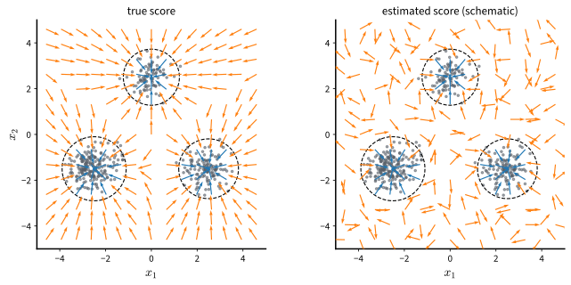

# Sampling with Langevin Dynamics
:label:`sec_diffusion-langevin`

A learned score is a vector field that points toward the data. To turn it
into samples, follow it. Gradient ascent on $\log p$ would climb to a mode
and stop there; adding the right amount of noise at each step turns the
climb into a Markov chain whose stationary distribution approaches $p$ as
the step size shrinks. This
sampler, Langevin dynamics, needs nothing but the score, so it applies to
the models of the last two sections directly. This section defines it, tests
it on the running example with the true score and with learned scores, and
identifies two ways in which it fails: the chain does not move between
separated modes, and the learned score is unreliable where the data are
absent. Gaussian smoothing addresses both at a price, which motivates the
multi-scale approach of the next section. The presentation follows lecture 12
of :citet:`Kuleshov.2023`.

```{.python .input #langevin-sampling-with-langevin-dynamics}
%%tab pytorch
%matplotlib inline
from d2l import torch as d2l
import torch
```

```{.python .input #langevin-sampling-with-langevin-dynamics}
%%tab jax
%matplotlib inline
from d2l import jax as d2l
import jax
from jax import numpy as jnp
from flax import nnx
import optax
```

## The Langevin Update

Langevin dynamics is the Markov chain

$$
\mathbf{x}_{k+1} = \mathbf{x}_k + \frac{\alpha}{2}\, \nabla_{\mathbf{x}} \log p(\mathbf{x}_k) + \sqrt{\alpha}\, \boldsymbol{\xi}_k,
\qquad \boldsymbol{\xi}_k \sim \mathcal{N}(\mathbf{0}, I),
$$
:eqlabel:`eq_diffusion-langevin`

started from an arbitrary initial state $\mathbf{x}_0$ (here the subscript
counts Langevin steps) and run with a step size $\alpha > 0$. Each step is a
gradient ascent step on $\log p$ with step size $\alpha / 2$ followed by a
Gaussian perturbation of variance $\alpha$. The gradient step concentrates
the chain where the density is high; the noise keeps it from collapsing to a
mode, and the balance between the two spreads the chains in proportion to
the density. The ratio between the two makes $p$ the target: the update
is the Euler--Maruyama discretization (:numref:`sec_mdl-euler-maruyama`) of
the stochastic differential equation
$d\mathbf{X} = \tfrac12 \nabla \log p(\mathbf{X})\, dt + d\mathbf{W}$, and
:numref:`sec_mdl-score-matching-diffusion-flow` proves from the
Fokker--Planck equation that $p$ is a stationary density of this equation
(:eqref:`eq_mdl-langevin`). Under mild conditions the continuous-time process
converges to $p$ from any starting point :cite:`Roberts.Tweedie.1996`. The
discrete chain with a fixed $\alpha$ converges instead to a distribution
that differs from $p$ by a discretization error, which vanishes as
$\alpha \to 0$ with the number of steps growing correspondingly
:cite:`Durmus.Moulines.2017`, and for targets whose tails are lighter than
Gaussian it need not converge at all even though the diffusion does
:cite:`Roberts.Tweedie.1996`. The latter paper also analyzes the
*Metropolis-adjusted* variant, which treats the Langevin move as the
proposal of a Metropolis--Hastings step and accepts or rejects it, which
removes the discretization bias at the cost of an acceptance test.
Score-based models use the unadjusted chain :eqref:`eq_diffusion-langevin`,
because it needs the score and nothing else.

The chain is a gradient-informed relative of the random walk of
:numref:`sec_diffusion-ebm-training`. Where Metropolis--Hastings proposed a
blind step and corrected it by an acceptance test, Langevin dynamics takes a
step that already points toward higher density. For an energy-based model
the score is $-\nabla E_{\boldsymbol{\theta}}$, so the chain runs on the
energy alone. For a score model, substitute
$\mathbf{s}_{\boldsymbol{\theta}}$ for the score in
:eqref:`eq_diffusion-langevin`; the chain then samples approximately from
$p$, to the extent that $\mathbf{s}_{\boldsymbol{\theta}}$ approximates its
score.
This is the basic generative procedure of :citet:`song2019generative`,
who then anneal it over noise levels as :numref:`sec_diffusion-annealed`
describes: estimate the score by score matching, then sample by Langevin
dynamics.

The implementation runs many chains in parallel, one per row, and returns
their final states. The helper reports the statistics that the running
example lets us check: the fraction of chains that end nearest to each
component mean, which should match the weights $0.5$, $0.3$, $0.2$; the mean
squared distance to that mean over chains that lie within three standard
deviations of it; and the fraction of *stray* chains that end more than
three standard deviations from every mean. Exact samples of the mixture do
not give a spread of $2 \times 0.25 = 0.5$ and a stray fraction of zero under
this statistic: the truncation lowers the spread to $0.47$, and the tail of a
two-dimensional Gaussian beyond three standard deviations holds a fraction
$e^{-9/2} \approx 0.011$ of its mass. The cells therefore print the
statistic of the training sample as the target.

```{.python .input #langevin-the-langevin-update}
%%tab pytorch
torch.manual_seed(0)
mix = d2l.GaussianMixture(means=[[-2.5, -1.5], [2.5, -1.5], [0.0, 2.5]],
                          weights=[0.5, 0.3, 0.2], std=0.5)
data = mix.sample(2000)

def langevin(score, x, steps, step_size):
    """Unadjusted Langevin dynamics, one chain per row of x."""
    with torch.no_grad():
        for _ in range(steps):
            x = (x + 0.5 * step_size * score(x)
                 + step_size ** 0.5 * torch.randn_like(x))
    return x

def summarize(x):
    """Mode weights, within-mode spread, and the fraction of stray chains."""
    d2 = ((x[:, None, :] - mix.means[None]) ** 2).sum(-1)
    weights = [round(w, 3) for w in
               (torch.bincount(d2.argmin(1), minlength=3) / len(x)).tolist()]
    nearest = d2.min(1).values
    inside = nearest < (3 * mix.std) ** 2
    return (f'mode weights {weights}, spread {nearest[inside].mean():.2f}, '
            f'stray {1 - inside.float().mean():.3f}')
```

```{.python .input #langevin-the-langevin-update}
%%tab jax
key = jax.random.PRNGKey(0)
mix = d2l.GaussianMixture(means=[[-2.5, -1.5], [2.5, -1.5], [0.0, 2.5]],
                          weights=[0.5, 0.3, 0.2], std=0.5)
key, subkey = jax.random.split(key)
data = mix.sample(subkey, 2000)

@nnx.jit
def langevin_step(score, x, key, step_size):
    return (x + 0.5 * step_size * score(x)
            + step_size ** 0.5 * jax.random.normal(key, x.shape))

def langevin(score, x, key, steps, step_size):
    """Unadjusted Langevin dynamics, one chain per row of x."""
    for _ in range(steps):
        key, subkey = jax.random.split(key)
        x = langevin_step(score, x, subkey, step_size)
    return x

def summarize(x):
    """Mode weights, within-mode spread, and the fraction of stray chains."""
    d2 = ((x[:, None, :] - mix.means[None]) ** 2).sum(-1)
    weights = [round(float(w), 3) for w in
               jnp.bincount(d2.argmin(1), length=3) / len(x)]
    nearest = d2.min(1)
    inside = nearest < (3 * mix.std) ** 2
    return (f'mode weights {weights}, spread {nearest[inside].mean():.2f}, '
            f'stray {1 - inside.mean():.3f}')

class TrueScore(nnx.Module):  # the closed-form score as a jittable module
    def __init__(self, sigma=0.0):
        self.sigma = sigma

    def __call__(self, x):
        return mix.score(x, sigma=self.sigma)
```

## Two Failures on the Running Example

### Sampling with the True Score

The first experiment removes all estimation error: the chain uses the exact
score of the mixture. Two thousand chains start from a broad Gaussian
centered at the origin and run with step size $0.05$ for two hundred and
then two thousand steps. A third run starts every chain inside the first
mode.

```{.python .input #langevin-sampling-with-the-true-score-1}
%%tab pytorch
torch.manual_seed(1)
x_init = 3 * torch.randn(2000, 2)
print(f'target (2000 samples of the mixture): {summarize(data)}')
for steps in (200, 2000):
    print(f'true score, {steps:>4d} steps:   '
          f'{summarize(langevin(mix.score, x_init, steps, 0.05))}')
x_one = mix.means[0] + mix.std * torch.randn(2000, 2)
print(f'true score, start in mode 1: '
      f'{summarize(langevin(mix.score, x_one, 2000, 0.05))}')
```

```{.python .input #langevin-sampling-with-the-true-score-1}
%%tab jax
key, k1, k2 = jax.random.split(key, 3)
x_init = 3 * jax.random.normal(k1, (2000, 2))
true_score = TrueScore()
print(f'target (2000 samples of the mixture): {summarize(data)}')
for steps in (200, 2000):
    key, subkey = jax.random.split(key)
    print(f'true score, {steps:>4d} steps:   '
          f'{summarize(langevin(true_score, x_init, subkey, steps, 0.05))}')
x_one = mix.means[0] + mix.std * jax.random.normal(k2, (2000, 2))
key, subkey = jax.random.split(key)
print(f'true score, start in mode 1: '
      f'{summarize(langevin(true_score, x_one, subkey, 2000, 0.05))}')
```

Within each mode the chain is correct: the spread matches the target's to
within the discretization bias, and the stray fraction is close to that of
exact samples, one to two percent. Between modes it is stuck. After two
hundred steps the three modes hold roughly equal fractions of the chains,
which is where the broad initialization sent them, and after ten times as
many steps the fractions are unchanged. Chains started inside one mode
remain there. Nothing is wrong with the score: given enough steps, the chain
would reach the right weights up to its discretization bias. The two lower
modes are ten standard deviations apart and the upper one about nine and a
half from each, and to cross from one to another a chain must climb against
the gradient to the floor of the valley between them, about five standard
deviations from either mode, where the density is smaller than at the modes
by a factor between about $e^{-10}$ and $e^{-12}$. The noise term
occasionally pushes a chain outward, but the gradient term pulls it back
long before it reaches the valley. The expected waiting time for a crossing
exceeds the run by orders of magnitude (Exercise 2 estimates it), so the
weights the chain reports are the weights of its initialization. This *slow
mixing* is the same defect that the random-walk sampler showed, and the
gradient does not cure it :cite:`song2019generative`. The trajectories below
show the mechanism: chains started far out
fall quickly into whichever basin they begin in and then wander inside it.

```{.python .input #langevin-sampling-with-the-true-score-2}
%%tab pytorch
torch.manual_seed(2)
x, path = 3 * torch.randn(8, 2), []
with torch.no_grad():
    for _ in range(300):
        path.append(x)
        x = x + 0.5 * 0.05 * mix.score(x) + 0.05 ** 0.5 * torch.randn_like(x)
path = torch.stack(path)  # (steps, chains, 2)
axis = torch.linspace(-6, 6, 121)
grid = torch.stack(torch.meshgrid(axis, axis, indexing='ij'), -1).reshape(-1, 2)
d2l.set_figsize((4.5, 4.5))
d2l.plt.contourf(axis, axis, torch.exp(mix.log_prob(grid)).reshape(121, 121).T,
                 levels=12, cmap='Blues')
for i in range(8):
    d2l.plt.plot(path[:, i, 0], path[:, i, 1], lw=0.8)
    d2l.plt.plot(path[0, i, 0], path[0, i, 1], 'ko', ms=3)
d2l.plt.xlabel('$x_1$'), d2l.plt.ylabel('$x_2$');
```

```{.python .input #langevin-sampling-with-the-true-score-2}
%%tab jax
key, subkey = jax.random.split(key)
x, path = 3 * jax.random.normal(subkey, (8, 2)), []
for _ in range(300):
    path.append(x)
    key, subkey = jax.random.split(key)
    x = langevin_step(true_score, x, subkey, 0.05)
path = jnp.stack(path)  # (steps, chains, 2)
axis = jnp.linspace(-6, 6, 121)
grid = jnp.stack(jnp.meshgrid(axis, axis, indexing='ij'), -1).reshape(-1, 2)
d2l.set_figsize((4.5, 4.5))
d2l.plt.contourf(axis, axis, jnp.exp(mix.log_prob(grid)).reshape(121, 121).T,
                 levels=12, cmap='Blues')
for i in range(8):
    d2l.plt.plot(path[:, i, 0], path[:, i, 1], lw=0.8)
    d2l.plt.plot(path[0, i, 0], path[0, i, 1], 'ko', ms=3)
d2l.plt.xlabel('$x_1$'), d2l.plt.ylabel('$x_2$');
```

### Sampling with a Learned Score

A learned score adds a second problem. :numref:`sec_diffusion-score-matching`
measured the relative error of a score matching estimate and found it under
ten percent where the data are and ten to twenty percent far below the
modes in density. A chain started from noise spends its first steps in
those low-density regions.
:numref:`fig_diffusion-low-density` sketches the situation: inside the region
that holds the data, the estimated field agrees with the truth; outside it,
the arrows have no reason to be right, and a chain that begins outside is
steered by them until it happens to reach the region where the estimate is
trustworthy.


:label:`fig_diffusion-low-density`

For images the problem is more severe than the sketch suggests. Under the
manifold hypothesis the data concentrate near a low-dimensional set, so
almost all of pixel space is a low-density region, the score there is
undefined or ill-conditioned, and a chain initialized from noise has to
traverse this region before any learned estimate becomes reliable
:cite:`song2019generative`. In two dimensions the effect is milder, and the
experiment measures how much of it survives. We train the score network by
sliced score matching, as in :numref:`sec_diffusion-score-matching`, and run
the same chains as before.

```{.python .input #langevin-sampling-with-a-learned-score}
%%tab pytorch
def sliced_score_matching_loss(score, x):
    x = x.clone().requires_grad_(True)
    v = torch.randn_like(x)
    s = score(x)
    jv = torch.autograd.grad((s * v).sum(), x, create_graph=True)[0]
    return ((v * jv).sum(1) + 0.5 * (s * v).sum(1) ** 2).mean()

def train(loss_fn, steps=2000, lr=1e-3, seed=1):
    torch.manual_seed(seed)
    score = d2l.ScoreNet()
    optimizer = torch.optim.Adam(score.parameters(), lr=lr)
    for step in range(steps):
        x = data[torch.randint(0, len(data), (256,))]
        loss = loss_fn(score, x)
        optimizer.zero_grad(), loss.backward(), optimizer.step()
    return score

score_data = train(sliced_score_matching_loss)
print(f'learned score of the data: '
      f'{summarize(langevin(score_data, x_init, 2000, 0.05))}')
```

```{.python .input #langevin-sampling-with-a-learned-score}
%%tab jax
def sliced_score_matching_loss(score, x, v):
    f = lambda q: score(q[None])[0]
    s, jv = jax.vmap(lambda q, u: jax.jvp(f, (q,), (u,)))(x, v)
    return ((v * jv).sum(1) + 0.5 * (s * v).sum(1) ** 2).mean()

@nnx.jit
def sliced_step(score, optimizer, x, v):
    loss, grads = nnx.value_and_grad(sliced_score_matching_loss)(score, x, v)
    optimizer.update(score, grads)
    return loss

def train(step_fn, key, steps=2000, lr=1e-3, seed=1):
    score = d2l.ScoreNet(rngs=nnx.Rngs(seed))
    optimizer = nnx.Optimizer(score, optax.adam(lr), wrt=nnx.Param)
    for step in range(steps):
        key, k1, k2 = jax.random.split(key, 3)
        x = data[jax.random.randint(k1, (256,), 0, len(data))]
        step_fn(score, optimizer, x, jax.random.normal(k2, x.shape))
    return score

key, k1, k2 = jax.random.split(key, 3)
score_data = train(sliced_step, k1)
print(f'learned score of the data: '
      f'{summarize(langevin(score_data, x_init, k2, 2000, 0.05))}')
```

The learned score reproduces the within-mode spread, and its mode weights
are still wrong: they are set by where the field steers the chains from
their initialization, not by the data, and they differ from the true
field's because the two fields steer differently far from the modes. The
stray fraction, a few percent, is comparable to the exact field's: almost
every chain still reaches a basin, so along the paths the chains take the
learned field points roughly inward. This experiment cannot separate
estimation error from the one percent of strays that exact samples have. The image case, in which the region where
the estimate is unreliable is almost all of pixel space, is the one that
the next section addresses.

## Gaussian Smoothing and Its Price

Both failures share a cause: the empty regions between and around the
modes. Perturbing the data with Gaussian noise fills them.
:numref:`sec_diffusion-denoising` showed that the score of the perturbed
distribution $p_\sigma$ can be learned everywhere the noisy samples reach,
and that at a large $\sigma$ the learned field is organized across the whole
plotted region. Between the modes of $p_\sigma$ the density is no longer negligible,
so a chain can cross. The experiment trains scores of $p_\sigma$ by denoising
score matching at two noise levels and runs the chains on each, together
with the true score of $p_\sigma$ for comparison. The reference statistics
now describe the perturbed distribution, whose components have variance
$0.25 + \sigma^2$ per coordinate; the cells print the statistic of exact
samples of $p_\sigma$ as the target. Because the statistic keeps only chains
within three *data* standard deviations of a mean, it truncates the wider
distribution, and at $\sigma = 1$ a large fraction of exact samples counts
as stray.

```{.python .input #langevin-gaussian-smoothing-and-its-price-1}
%%tab pytorch
def denoising_loss(score, x, sigma):
    eps = torch.randn_like(x)
    return 0.5 * ((score(x + sigma * eps) + eps / sigma) ** 2).sum(1).mean()

samples = {}
for sigma in (0.3, 1.0):
    print(f'sigma = {sigma}: target (p_sigma samples): '
          f'{summarize(data + sigma * torch.randn_like(data))}')
    score_sigma = train(lambda s, x: denoising_loss(s, x, sigma))
    samples[sigma] = langevin(score_sigma, x_init, 2000, 0.05)
    print(f'sigma = {sigma}: learned score of p_sigma: {summarize(samples[sigma])}')
    smoothed = lambda x: mix.score(x, sigma=sigma)
    print(f'sigma = {sigma}: true score of p_sigma:    '
          f'{summarize(langevin(smoothed, x_init, 2000, 0.05))}')
```

```{.python .input #langevin-gaussian-smoothing-and-its-price-1}
%%tab jax
def denoising_loss(score, x, eps, sigma):
    return 0.5 * ((score(x + sigma * eps) + eps / sigma) ** 2).sum(1).mean()

@nnx.jit
def denoising_step(score, optimizer, x, eps, sigma):
    loss, grads = nnx.value_and_grad(denoising_loss)(score, x, eps, sigma)
    optimizer.update(score, grads)
    return loss

samples = {}
for sigma in (0.3, 1.0):
    key, k1, k2, k3, k4 = jax.random.split(key, 5)
    print(f'sigma = {sigma}: target (p_sigma samples): '
          f'{summarize(data + sigma * jax.random.normal(k4, data.shape))}')
    step_fn = lambda s, o, x, e: denoising_step(s, o, x, e, sigma)
    score_sigma = train(step_fn, k1)
    samples[sigma] = langevin(score_sigma, x_init, k2, 2000, 0.05)
    print(f'sigma = {sigma}: learned score of p_sigma: {summarize(samples[sigma])}')
    print(f'sigma = {sigma}: true score of p_sigma:    '
          f'{summarize(langevin(TrueScore(sigma), x_init, k3, 2000, 0.05))}')
```

At $\sigma = 1$ the chains mix: the mode weights come out near
$0.5$, $0.3$, $0.2$ with the learned score and with the true one, because
the perturbed density has no deep valleys left for the chain to be trapped
by. The samples, however, are samples of $p_\sigma$, whose components have
five times the variance of the data's: even the truncated spread doubles,
and about forty percent of the chains end beyond three data standard
deviations from every mean, as the target line for $p_\sigma$ shows. At
$\sigma = 0.3$ the spread matches that of $p_\sigma$, about a quarter above
the data's, but the valleys are still deep enough that the weights remain
wrong.
The panels compare the two sets of samples with the data.

```{.python .input #langevin-gaussian-smoothing-and-its-price-2}
%%tab pytorch
fig, axes = d2l.plt.subplots(1, 3, figsize=(10.5, 3.6))
panels = [('data', data), ('samples, sigma = 0.3', samples[0.3]),
          ('samples, sigma = 1.0', samples[1.0])]
for ax, (title, pts) in zip(axes, panels):
    ax.scatter(pts[:1000, 0], pts[:1000, 1], s=3)
    ax.set_xlim(-6, 6), ax.set_ylim(-6, 6), ax.set_aspect('equal')
    ax.set_title(title)
fig.tight_layout()
```

```{.python .input #langevin-gaussian-smoothing-and-its-price-2}
%%tab jax
fig, axes = d2l.plt.subplots(1, 3, figsize=(10.5, 3.6))
panels = [('data', data), ('samples, sigma = 0.3', samples[0.3]),
          ('samples, sigma = 1.0', samples[1.0])]
for ax, (title, pts) in zip(axes, panels):
    ax.scatter(pts[:1000, 0], pts[:1000, 1], s=3)
    ax.set_xlim(-6, 6), ax.set_ylim(-6, 6), ax.set_aspect('equal')
    ax.set_title(title)
fig.tight_layout()
```

The trade-off is now explicit. A large noise level gives a chain that
mixes and a score that is reliable wherever the noisy data reach, at the
cost of sampling a
blurred version of the data. A small noise level preserves the data but
restores both failures, so no single $\sigma$ serves. The resolution is to
use several: run the chain at a large noise level until it has found the
right proportions, then decrease the noise and continue, so that each level
hands the next a starting point that is likely to lie where the finer score
is well estimated. Making this idea precise requires a score model
conditioned on the noise level, which is the subject of the next section.

## Summary

Langevin dynamics :eqref:`eq_diffusion-langevin` samples from a density
using only its score: a gradient step with step size $\alpha / 2$ followed
by Gaussian noise of variance $\alpha$ leaves $p$ stationary in the
continuous-time limit, and the discretized chain approaches $p$ up to a
discretization bias that vanishes with the step size. Substituting a
learned score gives a generative model
without a normalizer, a Markov chain inside training, or a second network.

On the running example the chain reproduced each mode's spread to within
the discretization bias but almost never moved between them, so the mode
weights
reflected the initialization after two thousand steps as after two hundred.
With a learned score the same happened, with mode weights that were wrong
in a different way and a stray fraction comparable to that of exact
samples. Smoothing the data with noise of scale $\sigma = 1$
restored approximately correct mode weights with both the learned and the
true score,
because the perturbed density has no deep valleys, but the samples were
those of the blurred distribution. Sharp samples and correct proportions
require different noise levels, and the next section uses a ladder of them.

## Exercises

1. **Stationarity in one dimension.** For $p(x) \propto e^{-x^2 / 2}$, the
   Langevin update :eqref:`eq_diffusion-langevin` is linear:
   $x_{k+1} = (1 - \alpha / 2) x_k + \sqrt{\alpha}\, \xi_k$. For
   $0 < \alpha < 4$, compute the variance of the stationary distribution of
   this chain as a function of $\alpha$, show that it exceeds $1$, and expand
   the excess to first order in $\alpha$. This is the discretization bias of the unadjusted chain in the
   simplest case.
1. **Escaping a mode.** Model the valley between two modes of the running
   example by a one-dimensional density $p(x) \propto e^{-U(x)}$ with a
   barrier of height $\Delta U$ between two wells. Using the fact that the
   stationary density at the barrier top is smaller than at the well bottom
   by a factor of $e^{\Delta U}$, argue that, in the limit of small $\alpha$,
   the expected number of steps before a crossing grows like $e^{\Delta U}$,
   up to a factor that depends on $\alpha$ and on the curvature of $U$ at the
   well bottom and at the barrier top. Estimate $\Delta U$ for two
   Gaussian modes of standard deviation $0.5$ whose means are $5$ apart, and
   compare the resulting waiting time with the two thousand steps of the
   experiment.
1. [code] **Step size.** Repeat the true-score experiment with step sizes
   $0.005$, $0.05$, and $0.5$ for two thousand steps each, and report the
   within-mode spread and the stray fraction. Explain the two failure
   directions: what happens to the spread when $\alpha$ is large, and what
   happens to the distance traveled from the initialization when $\alpha$ is
   small?
1. [code] **Metropolis adjustment.** Add an acceptance test to the Langevin
   move, treating :eqref:`eq_diffusion-langevin` as the proposal
   $Q(\mathbf{x}' \mid \mathbf{x}) = \mathcal{N}(\mathbf{x} + \tfrac{\alpha}{2} \nabla \log p(\mathbf{x}),\, \alpha I)$
   in :eqref:`eq_diffusion-mh-accept`; note that this proposal is not
   symmetric. Verify that with the true score the within-mode spread becomes
   exact even at a large step size, and measure the acceptance rate as a
   function of $\alpha$.
1. [code] **Fewer data.** Train the sliced score matching model on $200$
   training points instead of $2000$ and repeat the learned-score sampling
   run. How do the stray fraction and the within-mode spread change, and
   which of the two failures discussed in the section does the change
   reflect?
1. [code] **A denoising step at the end.** For the run at $\sigma = 1$,
   apply Tweedie's formula :eqref:`eq_diffusion-tweedie` once to the final
   samples, moving each by $\sigma^2$ times the learned score. Report the
   spread and the mode weights of the result and compare them with the data.
   Which aspect of the blur does one denoising step remove, and which does it
   not?

<!-- slides -->

::: {.slide}
::: {.cover}
[Dive into Deep Learning · §17.5]{.kicker}

Sampling with Langevin dynamics<br>
**gradient ascent plus noise · exact in the limit, stuck in practice · the smoothing trade-off**
:::
:::

::: {.slide title="Langevin Dynamics: Follow the Score, Add Noise"}
$$\mathbf{x}_{k+1} = \mathbf{x}_k + \frac{\alpha}{2}\, \nabla_{\mathbf{x}} \log p(\mathbf{x}_k) + \sqrt{\alpha}\, \boldsymbol{\xi}_k,
\qquad \boldsymbol{\xi}_k \sim \mathcal{N}(\mathbf{0}, I)$$

- the Euler--Maruyama step of $d\mathbf{X} = \tfrac12 \nabla \log p\, dt + d\mathbf{W}$, for which $p$ is stationary;
- a discretization bias for the discrete chain that vanishes with $\alpha$; a
  Metropolis test removes it;
- needs only the score: plug in $\mathbf{s}_{\boldsymbol{\theta}}$.
:::

::: {.slide title="With the Exact Score: Right Modes, Wrong Weights"}
@langevin-sampling-with-the-true-score-1

Each mode is reproduced to within the step-size bias; the weights are those
of the initialization, after two hundred steps and after two thousand.
Crossing a valley whose floor is five standard deviations from either mode
takes far longer than any run.
:::

::: {.slide title="Chains Fall into a Basin and Stay"}
@!langevin-sampling-with-the-true-score-2

Eight chains started from noise: a quick descent, then a wander inside one
basin. The gradient does not cure slow mixing.
:::

::: {.slide title="A Learned Score Is Consulted Where It Is Worst"}
{width=78%}

A chain from noise starts outside the dashed line, where the estimate had no
data to fit. For images, almost all of pixel space is such a region.
:::

::: {.slide title="Smoothing Fixes Mixing and Blurs the Samples"}
@!langevin-gaussian-smoothing-and-its-price-2

At $\sigma = 1$ the weights are right and the samples are blurred; at
$\sigma = 0.3$ the samples are sharp and the weights are wrong.
:::

::: {.slide title="Recap"}
- Langevin dynamics turns a score into a sampler; correctness is asymptotic.
- Failure one: separated modes are not crossed, so weights reflect the start.
- Failure two: a learned score is unreliable in the empty regions the chain
  must traverse.
- At large $\sigma$, Gaussian smoothing largely removes both but samples the
  blurred distribution. Next: a ladder of noise levels.
:::
