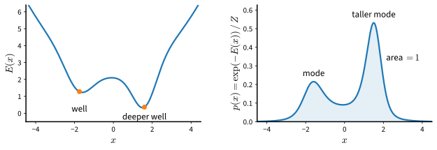

# The Limits of GANs and Energy-Based Models
:label:`sec_diffusion-limits`

Two families of generative models leave the network that defines them
nearly free. Generative adversarial networks (:numref:`chap_gans`) place no
architectural restriction on the generator because they never evaluate its
density: a second network compares samples with data and supplies the
training signal. Energy-based models place no architectural restriction on
the network either, but for the opposite reason: they *do* define a density,
through an unnormalized function whose integral is left implicit and only has
to be finite. This section records what each family pays
for its freedom. The adversarial game pays in optimization: its dynamics need
not converge, its gradients can vanish, and it can settle on a fraction of
the data. The energy-based model pays in computation: its normalizing
constant is an integral over the whole input space, and the rest of the
chapter is organized around avoiding it. The presentation follows lectures 10
and 11 of :citet:`Kuleshov.2023`.

```{.python .input #limits-the-limits-of-gans-and-energy-based-models}
%%tab pytorch
%matplotlib inline
from d2l import torch as d2l
import math
import torch
from torch import nn
```

```{.python .input #limits-the-limits-of-gans-and-energy-based-models}
%%tab jax
%matplotlib inline
from d2l import jax as d2l
import math
import jax
from jax import numpy as jnp
from flax import nnx
```

## What Adversarial Training Leaves Unsolved

A generative adversarial network trains a generator $G$ and a discriminator
$D$ on the value function of :eqref:`eq_gan_V`, the generator minimizing and
the discriminator maximizing. :numref:`sec_basic_gan` showed that at the
discriminator's best response the generator minimizes the Jensen--Shannon
divergence between its distribution and the data. The fixed point is the
right one. Four difficulties remain, and none of them concerns the fixed
point itself :cite:`Goodfellow.2016,Kuleshov.2023`.

The first difficulty is that the objective is a game rather than a loss.
Simultaneous gradient steps on a minimax objective can circle the
equilibrium or spiral away from it instead of approaching it, even in the
two-parameter Dirac-GAN of :numref:`sec_gan_convergence`
:cite:`Mescheder.Geiger.Nowozin.2018`. In that example, a zero-centered
gradient penalty, which the original formulation lacks, makes the
equilibrium locally attracting.

The second difficulty is the generator's gradient. When the discriminator
separates real and generated samples confidently, the saturating generator
loss assigns each generated sample a weight, the factor in
:eqref:`eq_gan_weights` that multiplies its contribution to the update,
that is near zero, and the gradient vanishes as the discriminator
approaches the optimum. The non-saturating loss keeps the weight from
vanishing but changes the objective. When both distributions have densities
and the discriminator is optimal, the expected gradient of the
non-saturating loss is the gradient of
$\mathrm{KL}(p_g \,\|\, p_{\textrm{data}}) - 2\, \mathrm{JS}(p_g, p_{\textrm{data}})$,
with $p_g$ the generated distribution :cite:`Arjovsky.Bottou.2017`. This
difference equals $2\, \mathrm{KL}(m \,\|\, p_{\textrm{data}})$, where
$m = (p_g + p_{\textrm{data}}) / 2$. That divergence is zero only at
$p_g = p_{\textrm{data}}$, so the fixed point is unchanged; like the reverse
divergence $\mathrm{KL}(p_g \,\|\, p_{\textrm{data}})$
(:numref:`sec_mdl-fwd-vs-rev-kl`), however, it penalizes generated samples
where the data have little mass far more heavily than missing modes. Worse, if the error of an imperfect discriminator is modeled
as independent Gaussian noise at every point, each coordinate of the
non-saturating update follows a Cauchy distribution, which has neither a
finite mean nor a finite variance :cite:`Arjovsky.Bottou.2017`. Both the vanishing of the
saturating gradient and this instability are derived for the case in which a
perfect discriminator exists. That case is typical when the two
distributions lie on low-dimensional sets: a generator's samples lie in a
set whose dimension is at most that of its latent space, and real images
are believed to concentrate near such a set :cite:`Arjovsky.Bottou.2017`.

The third difficulty is mode collapse. The generator can obtain a high
discriminator score by concentrating on a few regions of the data
distribution, and the finite-sample game contains minima at which whole
modes are missing (:numref:`sec_gan_relativistic`; the mode-coverage
experiment of :numref:`sec_gan_convergence`). The remedies are largely
empirical: feature matching, minibatch discrimination, one-sided label
smoothing, and changes to normalization and architecture
:cite:`Salimans.Goodfellow.Zaremba.ea.2016,Kuleshov.2023`.

The fourth difficulty is that the model provides no density. Held-out
likelihood cannot be reported, two trained generators cannot be compared by
the probability they assign to a test set, and anomalies cannot be scored by
their probability.
Evaluation relies on feature-space statistics of samples, whose limitations
:numref:`sec_dcgan` examined. A separate restriction, not a difficulty of
the game itself, is that the generator is trained through the gradient of
the discriminator with respect to the generated sample, so the basic
formulation requires continuous data.

Some of these difficulties have partial answers within the adversarial
framework, and :numref:`chap_gans` developed them. This chapter takes a
different route. It returns to models with a density, removes the
architectural constraints that made likelihood tractable, and then asks how
such a model can be trained at all.

## Energy-Based Models

### The Normalization Constraint

A probability density must satisfy two conditions: $p(\mathbf{x}) \geq 0$
for every $\mathbf{x}$, and $\int p(\mathbf{x})\, d\mathbf{x} = 1$.
Nonnegativity is easy to enforce. For any network $f_{\boldsymbol{\theta}}$,
the functions $f_{\boldsymbol{\theta}}(\mathbf{x})^2$ and
$\exp(f_{\boldsymbol{\theta}}(\mathbf{x}))$ are nonnegative. Neither need
integrate to one, and the second condition is the one that gives learning
its meaning. Because the total mass is fixed, raising the density on the
training points necessarily lowers it elsewhere. A model that could raise its
value everywhere would fit the data without learning anything about where
the data are not :cite:`Kuleshov.2023`.

Likelihood-based models satisfy the second condition by construction. An
autoregressive model multiplies conditionals, each normalized over its own
variable given the preceding ones, and integrating out the variables one at
a time, last first, shows that the product integrates to one. A mixture or
latent-variable model averages normalized components with weights that sum
to one. A normalizing flow pushes a simple density through a bijection and
tracks the change of volume through the Jacobian determinant
(:numref:`sec_mdl-continuous-normalizing-flows`). Each construction has a
price. Conditionals must be ordered and masked. A latent-variable model is
normalized for free, but its likelihood is itself a sum or an integral over
the latent variable, so the sum or integral must be tractable, or the model
must be trained through a lower bound on the log-likelihood. Flows must be invertible
with a computable determinant.

### Definition

An **energy-based model** drops these restrictions. It specifies the density
through a scalar function $E_{\boldsymbol{\theta}}: \mathbb{R}^d
\to \mathbb{R}$, the *energy*, which may be any network that satisfies the
integrability condition below, and normalizes explicitly:

$$
p_{\boldsymbol{\theta}}(\mathbf{x}) = \frac{\exp(-E_{\boldsymbol{\theta}}(\mathbf{x}))}{Z(\boldsymbol{\theta})},
\qquad
Z(\boldsymbol{\theta}) = \int \exp(-E_{\boldsymbol{\theta}}(\mathbf{x}))\, d\mathbf{x}.
$$
:eqlabel:`eq_diffusion-ebm`

The denominator $Z(\boldsymbol{\theta})$ is the **partition function**. Low
energy means high density (:numref:`fig_diffusion-energy-density`), and the
density is defined whenever the integral is finite, which holds when
$E_{\boldsymbol{\theta}}$ grows fast enough at infinity. A network with bounded activations does not satisfy this
requirement on its own, so implementations add a term such as
$\|\mathbf{x}\|^2 / 2$ or restrict the domain. The lecture notation writes
$f_{\boldsymbol{\theta}} = -E_{\boldsymbol{\theta}}$; the sign is a
convention and nothing else changes.


:label:`fig_diffusion-energy-density`

Three reasons make the exponential the natural link between an unconstrained
function and a density :cite:`Kuleshov.2023`.
Probabilities of natural data vary over many orders of magnitude, and the
logarithm is the scale on which a smooth network can represent such
variation. The exponential families of :numref:`sec_mdl-distributions`,
which include the Gaussian, Bernoulli, and categorical distributions, already
have the form :eqref:`eq_diffusion-ebm` with an energy linear in the
parameters. In statistical physics, a system in thermal equilibrium occupies
a state of energy $E$ with probability proportional to $\exp(-E)$ in
suitable units, the Boltzmann distribution, and the name *energy* comes from
this correspondence :cite:`LeCun.Chopra.Hadsell.ea.2006`.

The advantage of the definition is its flexibility. Any architecture that
produces a scalar can serve as an energy, energies can be added, and adding
energies multiplies densities, so a product of experts combines several
models into one without renormalizing each factor :cite:`Hinton.2002`. Most
of the disadvantages follow from $Z(\boldsymbol{\theta})$. Evaluating the
likelihood requires it. Its gradient with respect to $\boldsymbol{\theta}$
appears in every maximum-likelihood update, as :numref:`sec_diffusion-ebm-training`
shows. Sampling has no direct algorithm: the model specifies a density
rather than a procedure that produces draws, and the Markov chain methods
of :numref:`sec_diffusion-ebm-training`, which do not need the constant,
are slow. A separate limitation is that the model as stated has no latent
variables, so it provides no inferred representation of an input, although
latent variables can be added.

### What Can Be Computed Without the Normalizer

Several quantities cancel $Z(\boldsymbol{\theta})$ and are therefore
available from the energy alone. The ratio of two densities is

$$
\frac{p_{\boldsymbol{\theta}}(\mathbf{x})}{p_{\boldsymbol{\theta}}(\mathbf{x}')}
= \exp\big(E_{\boldsymbol{\theta}}(\mathbf{x}') - E_{\boldsymbol{\theta}}(\mathbf{x})\big),
$$

so comparing two inputs, ranking a set of inputs, or deciding whether a new
input is far less probable than typical data all require only differences of
energies. Denoising and imputation can be posed as optimization: given a
corrupted input, find the nearby $\mathbf{x}$ of lowest energy, or fill in
missing coordinates by minimizing the energy over them. A conditional energy
$E_{\boldsymbol{\theta}}(\mathbf{x}, y)$ over inputs and outputs yields a
prediction by minimizing over $y$, and much of supervised learning can be
written in this form :cite:`LeCun.Chopra.Hadsell.ea.2006`. The gradient of
the log-density with respect to the input,
$\nabla_{\mathbf{x}} \log p_{\boldsymbol{\theta}}(\mathbf{x}) = -\nabla_{\mathbf{x}} E_{\boldsymbol{\theta}}(\mathbf{x})$,
is also free of the constant; it is the quantity on which the rest of this
chapter is built. What none of these
operations provides is a sample from $p_{\boldsymbol{\theta}}$ or the value
of the likelihood.

### Classical Energy-Based Models

Energy-based models predate deep learning. The Ising model of
ferromagnetism :cite:`Ising.1925` assigns an energy to a configuration of
binary variables that rewards agreement between neighbors. Used as a prior
over images, and combined with a term that ties each pixel to a noisy
observation, it becomes a Markov random field whose most probable
configuration is a denoised image :cite:`Geman.Geman.1984,Kuleshov.2023`.
Boltzmann machines add hidden units with pairwise energies
:cite:`Ackley.Hinton.Sejnowski.1985`; restricting the connections to run
between visible and hidden units gives the restricted Boltzmann machine
:cite:`Smolensky.1986,Hinton.2002`, and stacking such layers gives the deep
Boltzmann machine :cite:`Salakhutdinov.Hinton.2009`, an early deep
generative model. These models have discrete variables and energies that
are quadratic in the variables. The energy-based models of this chapter have
continuous inputs and energies given by deep networks, and the difficulty
they inherit is the same one: the constant in :eqref:`eq_diffusion-ebm`.

## The Cost of the Normalizing Constant

The partition function is a $d$-dimensional integral, and the two simplest
ways to approximate it, quadrature on a grid and importance sampling from a
fixed proposal, both degrade as $d$ grows. The following experiments measure
how quickly.

### Quadrature

We begin where the integral can be computed. The energy below is a small
network with a quadratic term that keeps $\exp(-E)$ integrable. In one
dimension, a grid with spacing $\Delta$ gives
$Z \approx \Delta \sum_i \exp(-E(x_i))$. Dividing by this sum makes the
density sum to one on the grid by construction, which the first printed
line checks, and the grid spacing controls how accurately the sum
approximates the integral. The ratio of two densities, by contrast, needs no
grid at all.

```{.python .input #limits-quadrature-1}
%%tab pytorch
def make_energy(d, seed=0):
    torch.manual_seed(seed)
    net = nn.Sequential(nn.Linear(d, 32), nn.Tanh(), nn.Linear(32, 1))
    nn.init.normal_(net[0].weight, 0, 1.5), nn.init.normal_(net[0].bias, 0, 1.5)
    nn.init.normal_(net[2].weight, 0, 0.4), nn.init.zeros_(net[2].bias)
    # The quadratic term confines the density so that Z is finite
    return lambda x: net(x).squeeze(-1) + 0.5 * (x ** 2).sum(-1)

energy = make_energy(1)
grid = torch.linspace(-6, 6, 1201)[:, None]
dx = float(grid[1, 0] - grid[0, 0])
with torch.no_grad():
    E = energy(grid)
    Z = torch.exp(-E).sum() * dx
    density = torch.exp(-E) / Z
    x0, x1 = torch.tensor([[-1.0]]), torch.tensor([[1.0]])
    ratio = torch.exp(energy(x1) - energy(x0)).item()
print(f'Z = {Z:.4f}; the normalized density integrates to '
      f'{density.sum() * dx:.4f}')
print(f'p(-1)/p(1) from energies alone: {ratio:.4f}; '
      f'from the normalized density: {density[500] / density[700]:.4f}')
fig, axes = d2l.plt.subplots(1, 2, figsize=(8, 3))
axes[0].plot(grid[:, 0], E), axes[0].set_xlabel('x'), axes[0].set_ylabel('E(x)')
axes[1].plot(grid[:, 0], density), axes[1].set_xlabel('x')
axes[1].set_ylabel('p(x) = exp(-E(x)) / Z')
fig.tight_layout()
```

```{.python .input #limits-quadrature-1}
%%tab jax
class EnergyNet(nnx.Module):
    def __init__(self, d, rngs):
        self.h = nnx.Linear(d, 32, kernel_init=nnx.initializers.normal(1.5),
                            bias_init=nnx.initializers.normal(1.5), rngs=rngs)
        self.out = nnx.Linear(32, 1, kernel_init=nnx.initializers.normal(0.4),
                              rngs=rngs)

    def __call__(self, x):
        # The quadratic term confines the density so that Z is finite
        return self.out(nnx.tanh(self.h(x)))[..., 0] + 0.5 * (x ** 2).sum(-1)

def make_energy(d, seed=0):
    return EnergyNet(d, nnx.Rngs(seed))

energy = make_energy(1)
grid = jnp.linspace(-6, 6, 1201)[:, None]
dx = float(grid[1, 0] - grid[0, 0])
E = energy(grid)
Z = jnp.exp(-E).sum() * dx
density = jnp.exp(-E) / Z
x0, x1 = jnp.array([[-1.0]]), jnp.array([[1.0]])
ratio = float(jnp.exp(energy(x1) - energy(x0))[0])
print(f'Z = {Z:.4f}; the normalized density integrates to '
      f'{density.sum() * dx:.4f}')
print(f'p(-1)/p(1) from energies alone: {ratio:.4f}; '
      f'from the normalized density: {density[500] / density[700]:.4f}')
fig, axes = d2l.plt.subplots(1, 2, figsize=(8, 3))
axes[0].plot(grid[:, 0], E), axes[0].set_xlabel('x'), axes[0].set_ylabel('E(x)')
axes[1].plot(grid[:, 0], density), axes[1].set_xlabel('x')
axes[1].set_ylabel('p(x) = exp(-E(x)) / Z')
fig.tight_layout()
```

The two ratios agree, as they must, and the quadrature in one dimension
costs about a thousand energy evaluations. A grid with $K$ points per axis
in $d$ dimensions has $K^d$ points. The next cell repeats the computation for
$d = 1, 2, 3$ with $K = 64$, using a random energy of the same form for each
$d$, and
reports the number of energy evaluations that the normalizer costs. It then
prints the count for two larger values of $d$: ten, and the $784$ pixels of a
Fashion-MNIST image.

```{.python .input #limits-quadrature-2}
%%tab pytorch
K = 64
axis = torch.linspace(-6, 6, K)
for d in (1, 2, 3):
    energy_d = make_energy(d)
    pts = torch.stack(torch.meshgrid(*([axis] * d), indexing='ij'),
                      -1).reshape(-1, d)
    with torch.no_grad():
        log_Z = (torch.logsumexp(-energy_d(pts), 0)
                 + d * math.log(axis[1] - axis[0]))
    print(f'd = {d}: {len(pts):>7d} energy evaluations, log Z = {log_Z:7.3f}')
for d in (10, 784):
    print(f'd = {d}: {K}^{d} = 10^{d * math.log10(K):.0f} energy evaluations')
```

```{.python .input #limits-quadrature-2}
%%tab jax
K = 64
axis = jnp.linspace(-6, 6, K)
for d in (1, 2, 3):
    energy_d = make_energy(d)
    pts = jnp.stack(jnp.meshgrid(*([axis] * d), indexing='ij'),
                    -1).reshape(-1, d)
    log_Z = (jax.nn.logsumexp(-energy_d(pts), 0)
             + d * math.log(axis[1] - axis[0]))
    print(f'd = {d}: {len(pts):>7d} energy evaluations, log Z = {log_Z:7.3f}')
for d in (10, 784):
    print(f'd = {d}: {K}^{d} = 10^{d * math.log10(K):.0f} energy evaluations')
```

Three dimensions already require a quarter of a million evaluations. At
$d = 10$ the grid has about $10^{18}$ points, a billion billion, and at
$d = 784$ the exponent exceeds a thousand. Quadrature is a
tool for one, two, or three dimensions, which is why this chapter's running
example is two-dimensional: there, and only there, the normalizer of a
learned energy can be computed by quadrature as a reference.

### Monte Carlo Estimates

The alternative to a grid is a random sample. Importance sampling
(:numref:`sec_mdl-bayes-importance`) draws $\mathbf{x}_1, \ldots,
\mathbf{x}_n$ from a proposal density $q$ that can be sampled and evaluated,
and uses the identity

$$
Z(\boldsymbol{\theta})
= \int \frac{\exp(-E_{\boldsymbol{\theta}}(\mathbf{x}))}{q(\mathbf{x})}\, q(\mathbf{x})\, d\mathbf{x}
= \mathbb{E}_{\mathbf{x} \sim q}\big[w(\mathbf{x})\big],
\qquad
w(\mathbf{x}) = \frac{\exp(-E_{\boldsymbol{\theta}}(\mathbf{x}))}{q(\mathbf{x})},
$$

to estimate $Z$ by the sample mean of the weights $w(\mathbf{x}_i)$. The
estimator is unbiased for every $n$, provided that $q$ is positive wherever
$\exp(-E_{\boldsymbol{\theta}})$ is. Its variance is the problem. The
variance of a single weight is
$\mathbb{E}_q[w^2] - Z^2 = Z^2 \big( \int p_{\boldsymbol{\theta}}^2 / q - 1 \big)$,
and $\int p_{\boldsymbol{\theta}}^2 / q \geq 1$, with equality only when
$q = p_{\boldsymbol{\theta}}$. When the target and the proposal factorize
over coordinates and differ in the same way in every coordinate, this
integral is the $d$-th power of a one-dimensional factor greater than one,
so the relative variance of the weights grows exponentially in $d$.

A Gaussian example makes the growth exact. Take the target
$E(\mathbf{x}) = \|\mathbf{x} - \mathbf{m}\|^2 / 2$ with $\mathbf{m}$ the
all-ones vector, whose partition function is $Z = (2\pi)^{d/2}$, and the
proposal $q = \mathcal{N}(\mathbf{0}, I)$. Then $w / Z = \exp(\mathbf{m}^\top
\mathbf{x} - \|\mathbf{m}\|^2 / 2)$, and because $\mathbf{m}^\top
\mathbf{x} \sim \mathcal{N}(0, d)$ under $q$, the normalized weight is
log-normal with $\mathbb{E}_q[w / Z] = 1$ and
$\mathbb{E}_q[(w / Z)^2] = e^{d}$ (Exercise 4). The relative standard error of
the estimate from $n$ samples is therefore $\sqrt{(e^{d} - 1) / n}$, exact
for every $d$ and $n$. The proposal is only one standard deviation from the
target in each coordinate. The cell compares this prediction with the
estimate itself and with the effective sample size
$(\sum_i w_i)^2 / \sum_i w_i^2$, which counts how many of the $n$ draws carry
appreciable weight.

```{.python .input #limits-monte-carlo-estimates}
%%tab pytorch
torch.manual_seed(1)
n = 100_000
print(f'{"d":>3} {"estimate / Z":>13} {"predicted rel. std. error":>26} '
      f'{"effective samples":>18}')
for d in (1, 2, 4, 8, 16, 32):
    x = torch.randn(n, d)                      # proposal q = N(0, I)
    log_w = x.sum(1) - d / 2                   # log (w / Z)
    log_sum = torch.logsumexp(log_w, 0)
    estimate = torch.exp(log_sum - math.log(n))
    ess = torch.exp(2 * log_sum - torch.logsumexp(2 * log_w, 0))
    print(f'{d:>3} {estimate:>13.3f} {math.sqrt((math.exp(d) - 1) / n):>26.3g} '
          f'{ess:>18.1f}')
```

```{.python .input #limits-monte-carlo-estimates}
%%tab jax
key = jax.random.PRNGKey(1)
n = 100_000
print(f'{"d":>3} {"estimate / Z":>13} {"predicted rel. std. error":>26} '
      f'{"effective samples":>18}')
for d in (1, 2, 4, 8, 16, 32):
    key, subkey = jax.random.split(key)
    x = jax.random.normal(subkey, (n, d))      # proposal q = N(0, I)
    log_w = x.sum(1) - d / 2                   # log (w / Z)
    log_sum = jax.nn.logsumexp(log_w, 0)
    estimate = jnp.exp(log_sum - math.log(n))
    ess = jnp.exp(2 * log_sum - jax.nn.logsumexp(2 * log_w, 0))
    print(f'{d:>3} {estimate:>13.3f} {math.sqrt((math.exp(d) - 1) / n):>26.3g} '
          f'{ess:>18.1f}')
```

Up to $d = 8$ the estimate is close to one and the predicted error stays
below twenty percent.
At $d = 16$ the predicted relative error is several times the quantity being
estimated and the effective sample size has dropped to under a hundred
draws, so whether a particular run lands near one is a matter of luck rather
than evidence. At $d = 32$ the estimate is typically far below the truth: the
weights that would bring the average up to $Z$ are attached to draws too rare
to appear among a hundred thousand samples. The average of the weights is
unbiased only because it is occasionally enormous. A hundred thousand
proposals from a distribution that is merely one standard deviation off in
each coordinate cannot normalize a Gaussian in thirty-two dimensions, and
images have hundreds of thousands.

The conclusion is not that $Z$ is unknowable but that it is expensive in a
way that grows with dimension, whether the integral is attacked by grids or
by proposals. Every use of an energy-based model that requires the
normalizer inherits this cost. The next section makes the requirement
precise for maximum likelihood, and identifies the one operation that an
update actually needs: samples from the model.

## Summary

Adversarial training and energy-based modeling both permit an almost
unrestricted network. The adversarial game has the correct fixed point but may not reach
it: simultaneous gradient updates can circle the equilibrium or spiral away
from it, the saturating generator loss loses its gradient once a perfect
discriminator exists and the non-saturating one becomes noisy, the
finite-sample game contains mode-dropping minima, and the trained model
provides no density to evaluate. An energy-based model defines
a density $\exp(-E_{\boldsymbol{\theta}}) / Z(\boldsymbol{\theta})$ with any
energy for which $\exp(-E_{\boldsymbol{\theta}})$ is integrable, and inherits,
in exchange, the partition function.
Density ratios, rankings, and energy minimization need no normalizer.
Likelihoods do; samples do not, but they require a Markov chain.

Two experiments measured the cost. Quadrature needs $K^d$ energy
evaluations, which passes a quarter of a million at $d = 3$ and has an
exponent above a thousand for a small image. Importance sampling is unbiased
but its relative error is $\sqrt{(e^d - 1) / n}$ in a Gaussian example whose
proposal differs from the target by one standard deviation per coordinate,
so a hundred thousand draws stop being informative before $d = 16$. The
chapter therefore proceeds without $Z(\boldsymbol{\theta})$: first by
estimating its gradient with samples, then by objectives that do not involve
it at all.

## Exercises

1. **Which operations need the normalizer.** For an energy-based model
   :eqref:`eq_diffusion-ebm`, classify each of the following as computable
   from $E_{\boldsymbol{\theta}}$ alone or as requiring $Z(\boldsymbol{\theta})$:
   the log-likelihood of a test set; the ratio $p(\mathbf{x}) / p(\mathbf{x}')$;
   the most probable completion of an image with a missing patch; the
   probability that a sample falls in a given region; the Kullback--Leibler
   divergence between two energy-based models with the same energy but
   different temperatures $E / \tau$. Justify each answer in one sentence.
1. **Integrability.** Let $E_{\boldsymbol{\theta}}$ be a multilayer perceptron
   with ReLU activations and a linear output layer, so that
   $E_{\boldsymbol{\theta}}$ is piecewise linear.
    1. Show that $\exp(-E_{\boldsymbol{\theta}})$ can fail to be integrable
       over $\mathbb{R}^d$, and give a one-dimensional example.
    1. Show that adding $\|\mathbf{x}\|^2 / 2$ to any such energy makes the
       integral finite.
    1. Does adding $\|\mathbf{x}\|$ instead always suffice? Give a proof or a
       counterexample.
1. **Products of experts.** Let $p_1 \propto \exp(-E_1)$ and
   $p_2 \propto \exp(-E_2)$ be two energy-based models on the same space.
   Show that the model with energy $E_1 + E_2$ has density proportional to
   $p_1 p_2$, and explain why the same construction is not available for two
   implicit generators in the sense of :numref:`sec_basic_gan`. Under which
   condition on $p_1$ and $p_2$ is the product concentrated where neither
   factor alone is?
1. **The log-normal weight.** In the Gaussian example of the text, with
   target $\mathcal{N}(\mathbf{m}, I)$ and proposal $\mathcal{N}(\mathbf{0}, I)$,
   derive $w / Z = \exp(\mathbf{m}^\top \mathbf{x} - \|\mathbf{m}\|^2 / 2)$
   and show that $\mathbb{E}_q[w / Z] = 1$ and
   $\mathbb{E}_q[(w / Z)^2] = \exp(\|\mathbf{m}\|^2)$, using the moment
   generating function of a Gaussian. Conclude that the relative standard
   error of the $n$-sample estimate is $\sqrt{(e^{\|\mathbf{m}\|^2} - 1) / n}$.
   How many samples are needed for a relative error of $0.1$ when
   $\|\mathbf{m}\|^2 = 20$?
1. [code] **A better proposal.** Repeat the importance-sampling experiment
   with the proposal $\mathcal{N}(\mathbf{m}, I)$, which matches the target
   exactly, and then with $\mathcal{N}(\mathbf{m}, 2 I)$, which matches the
   mean but not the covariance. Derive the relative variance of the weights
   in the second case as a function of $d$ and compare it with the measured
   effective sample size. What does the comparison say about proposals that
   are broader than the target?
1. [code] **Quadrature on the running example.** :numref:`sec_diffusion-ebm-training`
   uses a $100 \times 100$ grid on $[-6, 6]^2$ to normalize a two-dimensional
   energy. Compute $\log Z$ for the mixture density defined there, which is
   normalized by construction, on grids with $9$, $13$, $17$, $25$, and
   $100$ points per axis, in double precision, and report the error of each.
   At what grid spacing, relative to the component standard deviation, does
   the quadrature error fall below $10^{-3}$, and why does the error fall so
   quickly once the spacing is below the standard deviation?

<!-- slides -->

::: {.slide}
::: {.cover}
[Dive into Deep Learning · §17.1]{.kicker}

The limits of GANs and energy-based models<br>
**what the adversarial game leaves unsolved · densities from nearly any network · the price of the partition function**
:::
:::

::: {.slide title="Adversarial Training Has the Right Fixed Point but Four Problems"}
Against the optimal discriminator, the generator's objective is minimized at $p_g = p_{\textrm{data}}$, yet

- simultaneous gradient steps can circle or spiral away from the equilibrium (the Dirac-GAN);
- with a perfect discriminator, the saturating loss has no gradient and the non-saturating one is noisy;
- mode-dropping minima exist, and the fixes are empirical;
- there is no density to evaluate: no held-out likelihood, no likelihood-based anomaly score.

. . .

This chapter keeps the flexible network and restores the density.
:::

::: {.slide title="Normalization Is the Constraint That Makes Learning Meaningful"}
Nonnegativity is free: $\exp(f_{\boldsymbol{\theta}}(\mathbf{x}))$ works for any network.

Sum-to-one is not: raising the density on training points must lower it elsewhere.

. . .

Earlier families pay for normalization:

- products of conditionals (autoregressive),
- mixtures of normalized components, with a tractable sum or a lower bound (latent variables),
- bijections with tractable Jacobians (flows).
:::

::: {.slide title="An Energy-Based Model Normalizes Explicitly"}
{width=80%}

$$p_{\boldsymbol{\theta}}(\mathbf{x}) = \frac{\exp(-E_{\boldsymbol{\theta}}(\mathbf{x}))}{Z(\boldsymbol{\theta})},
\qquad Z(\boldsymbol{\theta}) = \int \exp(-E_{\boldsymbol{\theta}}(\mathbf{x}))\, d\mathbf{x}$$

Any scalar network with integrable $\exp(-E_{\boldsymbol{\theta}})$ is an energy; the whole difficulty sits in the one number $Z$.
:::

::: {.slide title="Without the Normalizer: Ratios, Rankings, Minimization"}
$$\frac{p_{\boldsymbol{\theta}}(\mathbf{x})}{p_{\boldsymbol{\theta}}(\mathbf{x}')}
= \exp\big(E_{\boldsymbol{\theta}}(\mathbf{x}') - E_{\boldsymbol{\theta}}(\mathbf{x})\big)$$

- compare or rank inputs; flag an input far less probable than typical data;
- denoise by minimizing the energy near the corrupted input; impute by minimizing it over the missing coordinates;
- predict with a conditional energy $E(\mathbf{x}, y)$ by minimizing over $y$.

. . .

Not available: the likelihood, and a sample.
:::

::: {.slide title="Quadrature Costs $K^d$ Evaluations"}
@limits-quadrature-2

Three dimensions: a quarter of a million points. Ten: a billion billion. An
image: an exponent above a thousand.
:::

::: {.slide title="Importance Sampling Is Unbiased but Degrades with Dimension"}
Target $\mathcal{N}(\mathbf{1}, I)$, proposal $\mathcal{N}(\mathbf{0}, I)$: one
standard deviation apart per coordinate, and the relative standard error of
$\hat Z$ is exactly $\sqrt{(e^d - 1)/n}$.

@limits-monte-carlo-estimates

By $d = 16$ a hundred thousand draws carry under a hundred effective
samples.
:::

::: {.slide title="Recap"}
- GANs: unrestricted generator, no density to evaluate; a game that may cycle, saturate,
  or drop modes.
- Energy-based models: $p_{\boldsymbol{\theta}} = \exp(-E_{\boldsymbol{\theta}}) / Z(\boldsymbol{\theta})$
  with any network whose $\exp(-E_{\boldsymbol{\theta}})$ is integrable; ratios and minimization are free, likelihood and samples
  are not.
- $Z$ by grid: $K^d$ evaluations. $Z$ by importance sampling from a proposal
  one standard deviation off per coordinate: relative error grows like $e^{d/2}$.
- Next: the maximum-likelihood gradient needs samples from the model, not $Z$
  itself.
:::
