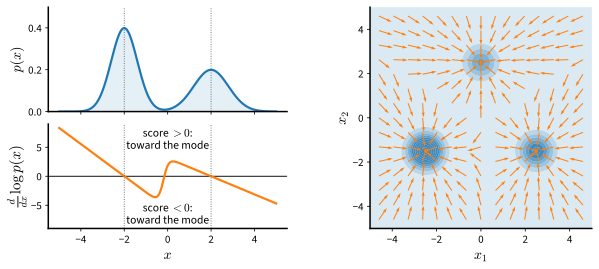

# Score Matching
:label:`sec_diffusion-score-matching`

Maximum likelihood requires samples from the model at every update because
the gradient of the log-partition function is a model expectation. This
section replaces the likelihood with an objective whose gradient involves
only data. The objective compares not densities but the gradients of their
logarithms with respect to the input, and it can be rewritten, by an integration by parts,
into a form that contains no unknown quantity. The resulting method, score
matching, was introduced by :citet:`Hyvarinen.2005` for the purpose of
fitting unnormalized models; its role in generative modeling was
established by :citet:`song2019generative`. The presentation follows lecture
12 of :citet:`Kuleshov.2023`.

```{.python .input #score-matching}
%%tab pytorch
%matplotlib inline
from d2l import torch as d2l
import torch
from torch import nn
```

```{.python .input #score-matching}
%%tab jax
%matplotlib inline
from d2l import jax as d2l
import jax
from jax import numpy as jnp
from flax import nnx
import optax
```

## The Score Function

For a differentiable density $p$ on $\mathbb{R}^d$, the **score** is the
gradient of the log-density with respect to the input,

$$
\nabla_{\mathbf{x}} \log p(\mathbf{x}) : \mathbb{R}^d \to \mathbb{R}^d .
$$

The score is a vector field. At each point it gives the direction in which
the density increases fastest and the rate of that increase on the
logarithmic scale. This gradient is taken with respect to the *input*
$\mathbf{x}$, not the parameters, and it should be distinguished from the
parameter gradient $\nabla_{\boldsymbol{\theta}} \log p_{\boldsymbol{\theta}}(\mathbf{x})$
that maximum likelihood uses; both are historically called scores, and the
input gradient is sometimes called the Stein score to keep them apart.
:numref:`fig_diffusion-score-field` shows the score of a bimodal density in
one dimension, where it is a signed slope, and of the chapter's running
example, the Gaussian mixture of :numref:`sec_diffusion-ebm-training`, in
two, where it is a field of arrows pointing toward the modes
(:numref:`sec_mdl-score-function` develops the same object for
continuous-time dynamics).


:label:`fig_diffusion-score-field`

For an energy-based model the score is available without the normalizer.
Taking the gradient of $\log p_{\boldsymbol{\theta}}(\mathbf{x}) =
-E_{\boldsymbol{\theta}}(\mathbf{x}) - \log Z(\boldsymbol{\theta})$ removes
the second term, which does not depend on $\mathbf{x}$:

$$
\nabla_{\mathbf{x}} \log p_{\boldsymbol{\theta}}(\mathbf{x}) = -\nabla_{\mathbf{x}} E_{\boldsymbol{\theta}}(\mathbf{x}).
$$
:eqlabel:`eq_diffusion-ebm-score`

This observation suggests changing what is learned. Instead of fitting the
density and struggling with $Z(\boldsymbol{\theta})$, fit the score of the
data distribution with a model $\mathbf{s}_{\boldsymbol{\theta}}:
\mathbb{R}^d \to \mathbb{R}^d$. The model can be the negative gradient of
an energy network, $-\nabla_{\mathbf{x}} E_{\boldsymbol{\theta}}$, in which
case it is automatically the score of an energy-based model, or an arbitrary
network with $d$ outputs, which is simpler to train and is the choice made
below. A general vector field need not be the gradient of any function, so
the second choice gives up the guarantee that a density exists whose score
is $\mathbf{s}_{\boldsymbol{\theta}}$. The samplers of the following
sections use only the field, so what matters for them is how close the
field is to the true score, not whether it is exactly the gradient of some
function. The training set is a sample
$\mathbf{x}_1, \ldots, \mathbf{x}_n$ from $p$, and the goal is
$\mathbf{s}_{\boldsymbol{\theta}}(\mathbf{x}) \approx \nabla_{\mathbf{x}} \log p(\mathbf{x})$.

## The Fisher Divergence

A model score should agree with the data score wherever the data are. The
natural measure of disagreement between two vector fields is the average
squared distance between them under the data distribution,

$$
J_{\textrm{ESM}}(\boldsymbol{\theta})
= \frac{1}{2}\, \mathbb{E}_{\mathbf{x} \sim p}
\left[\, \big\| \mathbf{s}_{\boldsymbol{\theta}}(\mathbf{x}) - \nabla_{\mathbf{x}} \log p(\mathbf{x}) \big\|^2 \right],
$$
:eqlabel:`eq_diffusion-esm`

the **Fisher divergence** between the data and the model
(:numref:`sec_mdl-fisher-divergence`), also called the explicit score
matching objective. It is zero exactly when the two fields agree at almost
every point that the data can occupy. If
$\mathbf{s}_{\boldsymbol{\theta}}$ is itself the score of a density
$q_{\boldsymbol{\theta}}$ and both densities are positive on all of
$\mathbb{R}^d$, equal scores mean that $\log q_{\boldsymbol{\theta}}$
and $\log p$ differ by a constant, and because both densities integrate to
one, the constant is zero: minimizing the Fisher divergence to zero recovers
the data distribution. The objective never mentions
$Z(\boldsymbol{\theta})$. It does mention $\nabla_{\mathbf{x}} \log p$, the
score of the *data* distribution, which is the quantity we do not have.

## Hyvärinen's Identity

The unknown score can be removed. Expanding the square in
:eqref:`eq_diffusion-esm` gives three terms: $\tfrac12 \mathbb{E}\|\nabla \log p\|^2$,
which does not depend on $\boldsymbol{\theta}$ and can be ignored during
optimization; $\tfrac12 \mathbb{E}\|\mathbf{s}_{\boldsymbol{\theta}}\|^2$,
which is computable from samples; and the cross term
$-\mathbb{E}[\mathbf{s}_{\boldsymbol{\theta}}^\top \nabla \log p]$, which
contains the unknown. In one dimension the cross term becomes computable
after an integration by parts:

$$
-\int s_{\boldsymbol{\theta}}(x)\, \frac{p'(x)}{p(x)}\, p(x)\, dx
= -\int s_{\boldsymbol{\theta}}(x)\, p'(x)\, dx
= -\big[ s_{\boldsymbol{\theta}}(x)\, p(x) \big]_{-\infty}^{\infty} + \int s_{\boldsymbol{\theta}}'(x)\, p(x)\, dx
= \mathbb{E}_{x \sim p}\big[ s_{\boldsymbol{\theta}}'(x) \big].
$$

The first equality cancels $p$ against the denominator of the score, and the
boundary term vanishes because $p(x)\, s_{\boldsymbol{\theta}}(x) \to 0$ as
$|x| \to \infty$, an assumption that holds for any density with sufficiently
light tails and any model that does not grow faster than they decay. The
derivative has moved from the unknown density onto the model. In $d$
dimensions the same step applies to each coordinate and the derivatives add
up to the divergence of the field. The result is Hyvärinen's identity:

$$
J_{\textrm{ESM}}(\boldsymbol{\theta})
= \mathbb{E}_{\mathbf{x} \sim p}
\left[\, \frac{1}{2} \big\| \mathbf{s}_{\boldsymbol{\theta}}(\mathbf{x}) \big\|^2
+ \operatorname{tr}\big( \nabla_{\mathbf{x}} \mathbf{s}_{\boldsymbol{\theta}}(\mathbf{x}) \big) \right]
+ \frac{1}{2}\, \mathbb{E}_{\mathbf{x} \sim p} \big\| \nabla_{\mathbf{x}} \log p(\mathbf{x}) \big\|^2,
$$
:eqlabel:`eq_diffusion-hyvarinen`

where $\nabla_{\mathbf{x}} \mathbf{s}_{\boldsymbol{\theta}}$ is the
$d \times d$ Jacobian of the model and its trace is
$\sum_i \partial s_{\boldsymbol{\theta}, i} / \partial x_i$. The proof with
its regularity conditions is given in :numref:`sec_mdl-score-matching`
(:eqref:`eq_mdl-hyvarinen`). The last term is a constant, so the
**score matching objective** is the expectation in the middle, and it is an
average over data of quantities computed from the model alone. Its two terms
have opposite tendencies. The squared norm keeps the field small. The trace
rewards negative divergence at the data, the property of a field that
converges on them from all sides. Together they favor a field that points
toward higher density and vanishes at the modes, which is what a score looks
like near a mode.

### Verifying the Identity

The identity can be checked on the running example because its score is
known. The cell evaluates the score matching objective at the true score, by
automatic differentiation of the closed-form field, on two hundred thousand
samples; adding the constant should give the Fisher divergence of the true
score with itself, which is zero. The model class is a small multilayer
perceptron with two outputs, and the helper computes the Fisher divergence
of any score model against the truth on a given set of points.

```{.python .input #score-matching-verifying-the-identity}
%%tab pytorch
torch.manual_seed(0)
mix = d2l.GaussianMixture(means=[[-2.5, -1.5], [2.5, -1.5], [0.0, 2.5]],
                          weights=[0.5, 0.3, 0.2], std=0.5)
data, test = mix.sample(2000), mix.sample(2000)

class ScoreNet(nn.Module):  #@save
    """A two-dimensional score model: a multilayer perceptron with two outputs."""
    def __init__(self, hidden=128):
        super().__init__()
        self.net = nn.Sequential(nn.Linear(2, hidden), nn.SiLU(),
                                 nn.Linear(hidden, hidden), nn.SiLU(),
                                 nn.Linear(hidden, 2))

    def forward(self, x):
        return self.net(x)

def fisher_divergence(score, x):
    """0.5 E||s(x) - grad log p(x)||^2 on the given points."""
    with torch.no_grad():
        return 0.5 * ((score(x) - mix.score(x)) ** 2).sum(1).mean().item()

def score_matching_loss(score, x):
    """Hyvarinen's objective E[0.5 ||s||^2 + tr(ds/dx)], trace by autograd."""
    x = x.clone().requires_grad_(True)
    s = score(x)
    # trace = sum_i ds_i/dx_i: the gradient of the batch sum of s_i with respect
    # to x has row b equal to ds_i(x_b)/dx_b, of which entry i is the diagonal term
    trace = sum(torch.autograd.grad(s[:, i].sum(), x, create_graph=True)[0][:, i]
                for i in range(x.shape[1]))
    return (0.5 * (s ** 2).sum(1) + trace).mean()

def objective_on(score, x, chunk=20_000):  # average over a large sample
    return sum(score_matching_loss(score, c).item() * len(c)
               for c in x.split(chunk)) / len(x)

torch.manual_seed(1)
big = mix.sample(200_000)
const = 0.5 * (mix.score(big) ** 2).sum(1).mean().item()
objective = objective_on(mix.score, big)
print(f'objective at the true score: {objective:.3f}, '
      f'constant: {const:.3f}, sum: {objective + const:.3f}')
```

```{.python .input #score-matching-verifying-the-identity}
%%tab jax
key = jax.random.PRNGKey(0)
mix = d2l.GaussianMixture(means=[[-2.5, -1.5], [2.5, -1.5], [0.0, 2.5]],
                          weights=[0.5, 0.3, 0.2], std=0.5)
key, k1, k2 = jax.random.split(key, 3)
data, test = mix.sample(k1, 2000), mix.sample(k2, 2000)

class ScoreNet(nnx.Module):  #@save
    """A two-dimensional score model: a multilayer perceptron with two outputs."""
    def __init__(self, hidden=128, rngs=None):
        self.h1 = nnx.Linear(2, hidden, rngs=rngs)
        self.h2 = nnx.Linear(hidden, hidden, rngs=rngs)
        self.out = nnx.Linear(hidden, 2, rngs=rngs)

    def __call__(self, x):
        return self.out(nnx.silu(self.h2(nnx.silu(self.h1(x)))))

def fisher_divergence(score, x):
    """0.5 E||s(x) - grad log p(x)||^2 on the given points."""
    return float(0.5 * ((score(x) - mix.score(x)) ** 2).sum(1).mean())

def score_matching_loss(score, x):
    """Hyvarinen's objective E[0.5 ||s||^2 + tr(ds/dx)], trace by autodiff."""
    s = score(x)
    f = lambda q: score(q[None])[0]  # the field at a single point, for its Jacobian
    trace = jax.vmap(lambda q: jnp.trace(jax.jacfwd(f)(q)))(x)
    return (0.5 * (s ** 2).sum(1) + trace).mean()

def objective_on(score, x, chunks=10):  # average over a large sample
    return float(sum(score_matching_loss(score, c)
                     for c in jnp.array_split(x, chunks)) / chunks)

key, subkey = jax.random.split(key)
big = mix.sample(subkey, 200_000)
const = float(0.5 * (mix.score(big) ** 2).sum(1).mean())
objective = objective_on(mix.score, big)
print(f'objective at the true score: {objective:.3f}, '
      f'constant: {const:.3f}, sum: {objective + const:.3f}')
```

The objective at the true score is about $-4$, the constant is about $+4$,
and the sum vanishes to within the Monte Carlo error of the average. The two
terms of the objective are large individually, of opposite sign, and cancel
at the optimum. This cancellation is also why estimates of the Fisher
divergence from a few thousand points are noisy: the per-point value of
$\tfrac12 \|\mathbf{s}\|^2 + \operatorname{tr}(\nabla_{\mathbf{x}} \mathbf{s}) + \tfrac12 \|\nabla_{\mathbf{x}} \log p\|^2$,
whose average the cell reports as the sum, has a standard deviation of
about eight, so its average over two thousand points is uncertain by about
$0.2$, and over two hundred thousand by about $0.02$.

### Training by Exact Score Matching

The objective with the trace is called *implicit* score matching, because
the data score enters only implicitly, through the integration by parts; the
subscript ESM of :eqref:`eq_diffusion-esm` stands for *explicit* score
matching, the objective written with the data score. We call its
minimization with the trace computed exactly *exact* score matching, to
distinguish it from the sliced estimate below. In two dimensions the trace
costs one extra derivative pass per input coordinate, so the loop below
runs in seconds. After training, the Fisher divergence on the test points reports
the fit against the true score, and the large sample checks the identity
again, this time for the learned field: the objective plus the constant
should agree with the directly computed Fisher divergence.

```{.python .input #score-matching-training-by-exact-score-matching}
%%tab pytorch
def train(loss_fn, steps=2000, lr=1e-3, seed=1):
    torch.manual_seed(seed)
    score = ScoreNet()
    optimizer = torch.optim.Adam(score.parameters(), lr=lr)
    for step in range(steps):
        x = data[torch.randint(0, len(data), (256,))]
        loss = loss_fn(score, x)
        optimizer.zero_grad(), loss.backward(), optimizer.step()
    return score

score_exact = train(score_matching_loss)
print(f'exact score matching: Fisher divergence on the test points '
      f'{fisher_divergence(score_exact, test):.3f}')
print(f'on 200,000 samples: objective + constant '
      f'{objective_on(score_exact, big) + const:.3f}, '
      f'direct Fisher divergence {fisher_divergence(score_exact, big):.3f}')
```

```{.python .input #score-matching-training-by-exact-score-matching}
%%tab jax
def train(step_fn, key, steps=2000, lr=1e-3, seed=1):
    score = ScoreNet(rngs=nnx.Rngs(seed))
    optimizer = nnx.Optimizer(score, optax.adam(lr), wrt=nnx.Param)
    for step in range(steps):
        key, k1, k2 = jax.random.split(key, 3)
        x = data[jax.random.randint(k1, (256,), 0, len(data))]
        step_fn(score, optimizer, x, k2)
    return score

@nnx.jit
def exact_step(score, optimizer, x, key):
    loss, grads = nnx.value_and_grad(score_matching_loss)(score, x)
    optimizer.update(score, grads)
    return loss

key, subkey = jax.random.split(key)
score_exact = train(exact_step, subkey)
print(f'exact score matching: Fisher divergence on the test points '
      f'{fisher_divergence(score_exact, test):.3f}')
print(f'on 200,000 samples: objective + constant '
      f'{objective_on(score_exact, big) + const:.3f}, '
      f'direct Fisher divergence {fisher_divergence(score_exact, big):.3f}')
```

The learned field is within about a tenth of the true score in Fisher
divergence, on a target whose score has a mean squared norm of about eight,
and the two ways of computing the divergence agree to within their Monte
Carlo error. Nothing in the training loop used the density, its normalizer,
or a sample from the model. The model class is saved to the `d2l` library
as `ScoreNet`, since the next two sections train it again.

The trace prevents this loop from scaling. For an input of dimension
$d$, the trace of the Jacobian needs $d$ derivative passes through the
network per training example, or a Jacobian-vector product per coordinate
(:numref:`sec_mdl-matrix-calculus-autodiff`), because automatic
differentiation delivers one row or one column of the Jacobian at a time.
Two coordinates cost two passes; an image with a hundred thousand pixels
would cost a hundred thousand. Two remedies follow. Sliced score matching,
next, estimates the trace with random projections. Denoising score matching,
the subject of :numref:`sec_diffusion-denoising`, changes the target so that
no Jacobian appears at all.

## Sliced Score Matching

The expensive quantity is a trace, and a trace can be estimated by random
projection: for any matrix $A$ and a random vector $\mathbf{v}$ with
$\mathbb{E}[\mathbf{v} \mathbf{v}^\top] = I$, one has
$\mathbb{E}[\mathbf{v}^\top A \mathbf{v}] = \operatorname{tr}(A)$.
:citet:`Song.Garg.Shi.ea.2019` build the estimator into the objective from
the start. Instead of matching the full vector fields, match their
projections onto random directions. The **sliced Fisher divergence** is

$$
\frac{1}{2}\, \mathbb{E}_{\mathbf{v} \sim p_{\mathbf{v}}}\, \mathbb{E}_{\mathbf{x} \sim p}
\left[ \big( \mathbf{v}^\top \mathbf{s}_{\boldsymbol{\theta}}(\mathbf{x}) - \mathbf{v}^\top \nabla_{\mathbf{x}} \log p(\mathbf{x}) \big)^2 \right],
$$
:eqlabel:`eq_diffusion-sliced-fisher`

where $p_{\mathbf{v}}$ is a distribution over projection vectors with
$\mathbb{E}[\mathbf{v} \mathbf{v}^\top] = I$, typically standard Gaussian
or uniform on the sign vectors $\{-1, +1\}^d$. It vanishes exactly when the
fields agree, because averaging the squared projection of a vector
$\mathbf{a}$ over such directions gives
$\mathbf{a}^\top \mathbb{E}[\mathbf{v} \mathbf{v}^\top]\, \mathbf{a} = \|\mathbf{a}\|^2$. The integration by parts of the
previous section, applied to the scalar field
$\mathbf{v}^\top \mathbf{s}_{\boldsymbol{\theta}}$ along the direction
$\mathbf{v}$, replaces the cross term
$\mathbb{E}[(\mathbf{v}^\top \mathbf{s}_{\boldsymbol{\theta}})(\mathbf{v}^\top \nabla_{\mathbf{x}} \log p)]$
by $-\mathbb{E}[\mathbf{v}^\top (\nabla_{\mathbf{x}} \mathbf{s}_{\boldsymbol{\theta}}) \mathbf{v}]$,
the derivative of $\mathbf{v}^\top \mathbf{s}_{\boldsymbol{\theta}}$ along
$\mathbf{v}$; this removes the data score and gives the **sliced score matching
objective**

$$
J_{\textrm{SSM}}(\boldsymbol{\theta})
= \mathbb{E}_{\mathbf{v} \sim p_{\mathbf{v}}}\, \mathbb{E}_{\mathbf{x} \sim p}
\left[ \mathbf{v}^\top \nabla_{\mathbf{x}} \mathbf{s}_{\boldsymbol{\theta}}(\mathbf{x})\, \mathbf{v}
+ \frac{1}{2} \big( \mathbf{v}^\top \mathbf{s}_{\boldsymbol{\theta}}(\mathbf{x}) \big)^2 \right],
$$
:eqlabel:`eq_diffusion-ssm`

up to a constant. The first term is a directional derivative of a scalar,
the derivative of $\mathbf{v}^\top \mathbf{s}_{\boldsymbol{\theta}}$ along
$\mathbf{v}$, and costs one derivative pass regardless of $d$. With one
random direction per training point, the cost of a sliced update is a small
constant multiple of the cost of a forward pass. When
$\mathbb{E}[\mathbf{v} \mathbf{v}^\top] = I$, averaging over $\mathbf{v}$
recovers both the trace and $\tfrac12 \|\mathbf{s}_{\boldsymbol{\theta}}\|^2$,
so the sliced objective equals :eqref:`eq_diffusion-hyvarinen` up to the
constant. Replacing $\tfrac12 (\mathbf{v}^\top \mathbf{s}_{\boldsymbol{\theta}})^2$
by its exact average $\tfrac12 \|\mathbf{s}_{\boldsymbol{\theta}}\|^2$
removes one random term; the original paper calls this variant SSM-VR and
found that it performed better in its experiments, although the replacement
is not guaranteed to lower the variance (Exercise 5).
:citet:`Song.Garg.Shi.ea.2019` prove that, for a well-specified parametric
model of the density, the estimator is consistent and asymptotically normal
under standard regularity conditions. The cost is variance: each update
sees the Jacobian through one random direction. The cell below computes
$\mathbf{v}^\top (\nabla_{\mathbf{x}} \mathbf{s}_{\boldsymbol{\theta}}) \mathbf{v}$
as the derivative of the scalar
$\mathbf{v}^\top \mathbf{s}_{\boldsymbol{\theta}}$ along $\mathbf{v}$, one
derivative pass per point (a Jacobian-vector product in JAX, the equivalent
vector-Jacobian product in PyTorch), and adds
$\tfrac12 (\mathbf{v}^\top \mathbf{s}_{\boldsymbol{\theta}})^2$.

```{.python .input #score-matching-sliced-score-matching-1}
%%tab pytorch
def sliced_score_matching_loss(score, x):
    """E_v[v^T (ds/dx) v + 0.5 (v^T s)^2], one Gaussian direction per point."""
    x = x.clone().requires_grad_(True)
    v = torch.randn_like(x)
    s = score(x)
    jv = torch.autograd.grad((s * v).sum(), x, create_graph=True)[0]  # J^T v
    return ((v * jv).sum(1) + 0.5 * (s * v).sum(1) ** 2).mean()

score_sliced = train(sliced_score_matching_loss)
print(f'sliced score matching: Fisher divergence on the test points '
      f'{fisher_divergence(score_sliced, test):.3f}')
```

```{.python .input #score-matching-sliced-score-matching-1}
%%tab jax
def sliced_score_matching_loss(score, x, v):
    """E_v[v^T (ds/dx) v + 0.5 (v^T s)^2], one Gaussian direction per point."""
    f = lambda q: score(q[None])[0]
    s, jv = jax.vmap(lambda q, u: jax.jvp(f, (q,), (u,)))(x, v)  # s and J v
    return ((v * jv).sum(1) + 0.5 * (s * v).sum(1) ** 2).mean()

@nnx.jit
def sliced_step(score, optimizer, x, key):
    v = jax.random.normal(key, x.shape)
    loss, grads = nnx.value_and_grad(sliced_score_matching_loss)(score, x, v)
    optimizer.update(score, grads)
    return loss

key, subkey = jax.random.split(key)
score_sliced = train(sliced_step, subkey)
print(f'sliced score matching: Fisher divergence on the test points '
      f'{fisher_divergence(score_sliced, test):.3f}')
```

The sliced estimator reaches a Fisher divergence comparable to the exact
one after the same number of updates, each of which was cheaper. The three
panels below compare the true field with the two learned fields over the
plane, with training points in grey. Arrows longer than a fixed length are
clipped so that the directions remain visible far from the data, where the
true score is large.

```{.python .input #score-matching-sliced-score-matching-2}
%%tab pytorch
g = torch.linspace(-4.5, 4.5, 16)
pts = torch.stack(torch.meshgrid(g, g, indexing='ij'), -1).reshape(-1, 2)
with torch.no_grad():
    fields = [('true score', mix.score(pts)),
              ('exact score matching', score_exact(pts)),
              ('sliced score matching', score_sliced(pts))]
fig, axes = d2l.plt.subplots(1, 3, figsize=(10.5, 3.6))
for ax, (title, f) in zip(axes, fields):
    f = f * torch.clamp(2 / f.norm(dim=1, keepdim=True), max=1)  # clip length
    ax.scatter(data[:500, 0], data[:500, 1], s=3, c='lightgray')
    ax.quiver(pts[:, 0], pts[:, 1], f[:, 0], f[:, 1], angles='xy',
              scale_units='xy', scale=2.5, width=0.005)
    ax.set_title(title), ax.set_aspect('equal')
fig.tight_layout()
```

```{.python .input #score-matching-sliced-score-matching-2}
%%tab jax
g = jnp.linspace(-4.5, 4.5, 16)
pts = jnp.stack(jnp.meshgrid(g, g, indexing='ij'), -1).reshape(-1, 2)
fields = [('true score', mix.score(pts)),
          ('exact score matching', score_exact(pts)),
          ('sliced score matching', score_sliced(pts))]
fig, axes = d2l.plt.subplots(1, 3, figsize=(10.5, 3.6))
for ax, (title, f) in zip(axes, fields):
    norm = jnp.linalg.norm(f, axis=1, keepdims=True)
    f = f * jnp.minimum(2 / norm, 1)  # clip the arrow length
    ax.scatter(data[:500, 0], data[:500, 1], s=3, c='lightgray')
    ax.quiver(pts[:, 0], pts[:, 1], f[:, 0], f[:, 1], angles='xy',
              scale_units='xy', scale=2.5, width=0.005)
    ax.set_title(title), ax.set_aspect('equal')
fig.tight_layout()
```

Near the three modes, all three fields agree: arrows converge on each
component mean. Away from the data the learned fields differ from the truth
in places. In the region between the modes, and toward the edges of the
plot, the true field points toward the modes while some learned
arrows point in directions that the training data never constrained; in two
dimensions most of them still point roughly inward, and the table below
quantifies how much accuracy is lost.

## Where the Estimate Is Accurate

The objective is an expectation under the data distribution, so it
constrains the field only where the data have appreciable density. The cell
groups the points of a grid by the true log-density and reports, for each
group, the mean squared error of the exact-score-matching field divided by
the mean squared norm of the true score, a relative error that accounts for
the score growing large in the tails.

```{.python .input #score-matching-where-the-estimate-is-accurate}
%%tab pytorch
axis = torch.linspace(-5, 5, 41)
grid = torch.stack(torch.meshgrid(axis, axis, indexing='ij'), -1).reshape(-1, 2)
with torch.no_grad():
    true_s, log_p = mix.score(grid), mix.log_prob(grid)
    err = ((score_exact(grid) - true_s) ** 2).sum(1)
print(f'{"log density":>13} {"grid points":>12} {"relative score error":>21}')
for lo, hi in ((-2, 0), (-4, -2), (-8, -4), (-16, -8), (-40, -16)):
    m = (log_p >= lo) & (log_p < hi)
    rel = err[m].mean() / (true_s[m] ** 2).sum(1).mean()
    print(f'[{lo:>4}, {hi:>4}) {m.sum().item():>12d} {rel:>21.3f}')
```

```{.python .input #score-matching-where-the-estimate-is-accurate}
%%tab jax
axis = jnp.linspace(-5, 5, 41)
grid = jnp.stack(jnp.meshgrid(axis, axis, indexing='ij'), -1).reshape(-1, 2)
true_s, log_p = mix.score(grid), mix.log_prob(grid)
err = ((score_exact(grid) - true_s) ** 2).sum(1)
print(f'{"log density":>13} {"grid points":>12} {"relative score error":>21}')
for lo, hi in ((-2, 0), (-4, -2), (-8, -4), (-16, -8), (-40, -16)):
    m = (log_p >= lo) & (log_p < hi)
    rel = err[m].mean() / (true_s[m] ** 2).sum(1).mean()
    print(f'[{lo:>4}, {hi:>4}) {int(m.sum()):>12d} {rel:>21.3f}')
```

In the two highest-density bands, roughly the region that contains most of
the training data, the relative error is under ten percent. It rises to
roughly ten to twenty percent in the two lowest bands, where the density is
about three or more orders of magnitude below its peak. The estimate is
accurate where the data are and unreliable elsewhere, which is what an
objective weighted by the data density produces. This limitation is
invisible while the model is only evaluated on data. It matters once a
sampler starts from random noise, far from every mode, and must follow the
field back to the data. :numref:`sec_diffusion-langevin` measures the effect
in two dimensions, where it is mild, and explains why
:citet:`song2019generative` expect it to be severe for images. The next
section introduces the
device that addresses both the cost of the trace and the emptiness of the
low-density regions: perturbing the data with noise.

## Summary

The score, the input gradient of the log-density, is free of the normalizer:
for an energy-based model it is minus the gradient of the energy. Fitting a
score model by the Fisher divergence :eqref:`eq_diffusion-esm` would require
the data score, but Hyvärinen's identity :eqref:`eq_diffusion-hyvarinen`
rewrites the divergence, up to a constant, as the data expectation of
$\tfrac12 \|\mathbf{s}_{\boldsymbol{\theta}}\|^2 + \operatorname{tr}(\nabla_{\mathbf{x}} \mathbf{s}_{\boldsymbol{\theta}})$,
which involves only the model. Training needs no samples from the model and
no partition function. On the running example the identity was verified
numerically and the learned field matched the true score to within about a
tenth in Fisher divergence.

The trace of the Jacobian costs one derivative pass per input dimension.
Sliced score matching :eqref:`eq_diffusion-ssm` replaces it with the
derivative of $\mathbf{v}^\top \mathbf{s}_{\boldsymbol{\theta}}$ along a
random direction $\mathbf{v}$, an unbiased estimate at constant cost per
update, and reached a comparable fit in the experiment. The estimate is
accurate only where the data density is appreciable: the relative error of
the learned score rises to ten to twenty percent where the density is about
three or more orders of magnitude below its peak.

## Exercises

1. **Scores of standard densities.** Compute the score of the Gaussian
   $\mathcal{N}(\boldsymbol{\mu}, \Sigma)$, of the Laplace density
   $\tfrac12 e^{-|x|}$, and of the mixture $\sum_k \pi_k \mathcal{N}(\mathbf{x}; \boldsymbol{\mu}_k, \sigma^2 I)$.
   For the mixture, show that the score is the responsibility-weighted average
   of the component scores, which is what `GaussianMixture.score` implements.
   Where is the Laplace score undefined, and what does this imply for
   score matching on data with sharp features?
1. **The identity in $d$ dimensions.** Carry out the integration by parts of
   the cross term coordinate by coordinate and derive
   :eqref:`eq_diffusion-hyvarinen`, stating explicitly the boundary condition
   used in each coordinate. Then show that for the model
   $\mathbf{s}_{\boldsymbol{\theta}} = -\nabla_{\mathbf{x}} E_{\boldsymbol{\theta}}$
   the trace term becomes minus the Laplacian of the energy, and interpret the
   sign: which energies does the objective favor at the data?
1. **Score matching for a Gaussian.** Let the model be
   $\mathbf{s}_{\boldsymbol{\theta}}(\mathbf{x}) = -A(\mathbf{x} - \mathbf{b})$
   with $A$ symmetric positive definite, the score of a Gaussian with
   precision $A$. Write the score matching objective in closed form in terms
   of the sample mean and covariance of the data, minimize it, and show that
   the solution coincides with the maximum-likelihood estimate.
1. **The projection identity.** Show that $\mathbb{E}[\mathbf{v}^\top A \mathbf{v}] = \operatorname{tr}(A)$
   whenever $\mathbb{E}[\mathbf{v} \mathbf{v}^\top] = I$, and compute the
   variance of $\mathbf{v}^\top A \mathbf{v}$ for a standard Gaussian
   $\mathbf{v}$ and for a Rademacher (random sign) $\mathbf{v}$ when $A$ is
   symmetric. Which distribution gives the lower variance, and by how much
   when $A$ is diagonal?
1. [code] **Variance reduction.** Replace $\tfrac12 (\mathbf{v}^\top \mathbf{s}_{\boldsymbol{\theta}})^2$
   in :eqref:`eq_diffusion-ssm` by $\tfrac12 \|\mathbf{s}_{\boldsymbol{\theta}}\|^2$
   and retrain. Compare the Fisher divergence on the test points across five
   seeds for the two variants, and also try Rademacher projections. Report
   the mean and spread, and relate the differences to the variances computed
   in the previous exercise.
1. [code] **A conservative score model.** Parameterize the score as the
   gradient of a scalar energy network, $\mathbf{s}_{\boldsymbol{\theta}} = -\nabla_{\mathbf{x}} E_{\boldsymbol{\theta}}$,
   using automatic differentiation inside the forward pass, and train it by
   exact score matching. Compare its Fisher divergence with the unconstrained
   field, then use the learned energy to compute the log-density on the grid
   of :numref:`sec_diffusion-ebm-training` (normalizing by quadrature) and
   report the test negative log-likelihood. Which quantity does this model
   provide that the unconstrained field cannot?

<!-- slides -->

::: {.slide}
::: {.cover}
[Dive into Deep Learning · §17.3]{.kicker}

Score matching<br>
**the score needs no normalizer · the Fisher divergence · Hyvärinen's identity · sliced estimation**
:::
:::

::: {.slide title="The Score Is the Input Gradient of the Log-Density"}
{width=78%}

$$\nabla_{\mathbf{x}} \log p(\mathbf{x}) : \mathbb{R}^d \to \mathbb{R}^d,
\qquad
\nabla_{\mathbf{x}} \log p_{\boldsymbol{\theta}}(\mathbf{x}) = -\nabla_{\mathbf{x}} E_{\boldsymbol{\theta}}(\mathbf{x})$$

A vector field pointing toward the modes, and for an energy-based model,
free of $Z(\boldsymbol{\theta})$.
:::

::: {.slide title="Match Score Fields, Not Densities"}
$$J_{\textrm{ESM}}(\boldsymbol{\theta})
= \tfrac{1}{2}\, \mathbb{E}_{\mathbf{x} \sim p}
\big\| \mathbf{s}_{\boldsymbol{\theta}}(\mathbf{x}) - \nabla_{\mathbf{x}} \log p(\mathbf{x}) \big\|^2$$

- zero exactly when the fields agree on the data;
- no partition function anywhere;
- but $\nabla_{\mathbf{x}} \log p$ is the data score, which we do not have.
:::

::: {.slide title="Hyvärinen's Identity Moves the Derivative onto the Model"}
Integration by parts on the cross term, in one dimension:

$$-\int s_{\boldsymbol{\theta}}\, p'\, dx
= -\big[ s_{\boldsymbol{\theta}}\, p \big]_{-\infty}^{\infty} + \int s_{\boldsymbol{\theta}}'\, p\, dx
= \mathbb{E}_p[s_{\boldsymbol{\theta}}']$$

. . .

$$J_{\textrm{ESM}}(\boldsymbol{\theta})
= \mathbb{E}_{\mathbf{x} \sim p}
\Big[ \tfrac{1}{2} \| \mathbf{s}_{\boldsymbol{\theta}} \|^2
+ \operatorname{tr}\big( \nabla_{\mathbf{x}} \mathbf{s}_{\boldsymbol{\theta}} \big) \Big] + \textrm{const}$$

Only the model appears under the expectation: training needs data alone.
:::

::: {.slide title="The Identity, Checked Numerically"}
At the true score the Fisher divergence is zero, so the objective must equal
minus the constant:

@score-matching-verifying-the-identity

Two large terms of opposite sign cancel; that cancellation is also why the
objective is noisy on small samples.
:::

::: {.slide title="Sliced Score Matching Estimates the Trace by Projection"}
$$J_{\textrm{SSM}}(\boldsymbol{\theta})
= \mathbb{E}_{\mathbf{v}}\, \mathbb{E}_{\mathbf{x} \sim p}
\Big[ \mathbf{v}^\top \nabla_{\mathbf{x}} \mathbf{s}_{\boldsymbol{\theta}}(\mathbf{x})\, \mathbf{v}
+ \tfrac{1}{2} \big( \mathbf{v}^\top \mathbf{s}_{\boldsymbol{\theta}}(\mathbf{x}) \big)^2 \Big]$$

- the trace costs $d$ derivative passes; a directional derivative costs one;
- unbiased when $\mathbb{E}[\mathbf{v}\mathbf{v}^\top] = I$, at the cost of variance;
- comparable fit after the same number of updates on the running example.
:::

::: {.slide title="Both Estimators Fit the Field Where the Data Are"}
@!score-matching-sliced-score-matching-2

Near the modes the learned fields agree with the truth; in the corners and
between the modes, nothing constrained them.
:::

::: {.slide title="Accuracy Follows the Data Density"}
@score-matching-where-the-estimate-is-accurate

Under ten percent where the data are; ten to twenty percent about three
orders of magnitude down in density. Samplers that start from noise begin
where the estimate is least accurate.
:::

::: {.slide title="Recap"}
- Score $= \nabla_{\mathbf{x}} \log p$: for an energy-based model, $-\nabla_{\mathbf{x}} E_{\boldsymbol{\theta}}$, no $Z$.
- Fisher divergence measures field mismatch; Hyvärinen's identity makes it
  computable from data alone via $\tfrac12 \|\mathbf{s}\|^2 + \operatorname{tr}(\nabla \mathbf{s})$.
- The trace scales with $d$; sliced score matching replaces it by a random
  projection.
- The fit is accurate only where the data are. Next: perturb the data with
  noise, which removes the Jacobian and fills the empty regions.
:::
