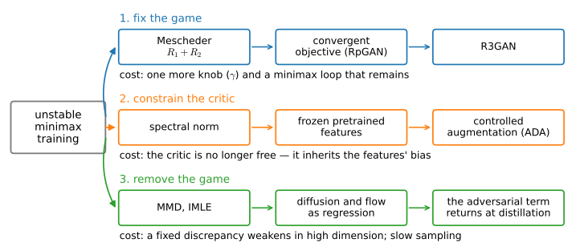

# Adversarial Losses Beyond GANs
:label:`sec_gan_beyond`

This chapter has treated the adversarial game as a way to train a stand-alone sampler: :numref:`sec_basic_gan` analyzed the objective, :numref:`sec_gan_objectives` mapped its alternatives, :numref:`sec_gan_relativistic` and :numref:`sec_gan_convergence` repaired its landscape and its dynamics, and :numref:`sec_dcgan` trained the repaired game on images. Stand-alone training is no longer where the objective earns its keep. The generative models that carry image, audio, and video synthesis today are trained by regression against closed-form targets, the subject of :numref:`chap_diffusion`; yet a discriminator keeps appearing in the training recipes of the systems built from them. One-step image generators are finished with an adversarial phase, the tokenizers underneath latent-space models were trained against patch critics, and neural vocoders have used adversarial losses continuously for years. This section asks where the adversarial objective survives and why exactly there, and it closes by rereading the chapter's first identity in a way that separates the objective from the two-player optimization that has given it so much trouble.

One mechanism organizes most of the answers: the interaction of a pointwise regression loss with a model that lacks the capacity, or the information, to produce every valid answer. We establish that mechanism first, on a problem small enough that both training runs take seconds and the failure is visible in a single plot. The applications then read as instances, each one paragraph: distillation, tokenizers, audio, video. The last two parts step back from the applications: one sorts the field's responses to adversarial instability into three exits, and the other follows the chapter's first identity to its current endpoint, where the discriminator reappears inside likelihood models.

```{.python .input #adversarial-losses-adversarial-losses-beyond-gans}
%%tab pytorch
%matplotlib inline
from d2l import torch as d2l
import torch
from torch import nn
```

```{.python .input #adversarial-losses-adversarial-losses-beyond-gans}
%%tab jax
%matplotlib inline
from d2l import jax as d2l
import jax
from jax import numpy as jnp
from flax import nnx
import numpy as np
import optax
```

## The Capacity Argument

Many generation problems are conditional predictions. A super-resolution network receives a low-resolution image and must produce a high-resolution one; a vocoder receives a spectrogram and must produce a waveform; a one-step distillation student receives a noise vector and must produce, in a single forward pass, the image its teacher builds over hundreds of evaluations. The default loss for a prediction is the pointwise squared error, and its minimizer is a classical identity. For any predictor $f$ and the conditional mean $\mu(x) = E[y \mid x]$, adding and subtracting $\mu$ inside the square and noting that the cross term vanishes conditionally on $x$ gives

$$
E\big[(y - f(x))^2\big]
\;=\;
E\big[(y - \mu(x))^2\big] \;+\; E\big[(\mu(x) - f(x))^2\big].
$$
:eqlabel:`eq_beyond_condmean`

The first term does not involve $f$; the second grades every predictor by its squared distance from the conditional mean. Minimizing the squared error over all functions therefore returns $\mu$, and a capacity-limited model trained on the squared error approximates $\mu$ as well as it can. When the conditional law $p(y \mid x)$ concentrates around a single answer, this is exactly what one wants. When it has several distinct answers, $\mu$ averages them, and the average of valid answers need not be a valid answer: many sharp images downscale to the same blurry thumbnail, and their pixelwise mean is sharp in none of them. The squared error demands that mean anyway.

An adversarial loss grades the same prediction by a different question. The optimal critic of :numref:`sec_basic_gan` scores a sample by the log density ratio :eqref:`eq_gan_dstar`, so a trained critic penalizes predictions that lie where the data has no mass, wherever that is, rather than measuring the distance to every valid answer at once. The two objectives agree when $p(y \mid x)$ concentrates on a single answer the model can represent. They part when it does not: the squared error then insists on the average, while the critic insists on membership.

The smallest problem exhibiting the split has one input, one output, and two answers. Draw $x$ uniformly from $[-1, 1]$ and set

$$
y \;=\; x + m + 0.05\,\epsilon,
\qquad
m \in \{-1, +1\} \textrm{ with probability } \tfrac12 \textrm{ each},
\quad \epsilon \sim \mathcal{N}(0, 1),
$$

with the mode $m$ drawn independently of $x$. The data form two parallel bands, $y = x \pm 1$, forty noise widths apart. The conditional mean is $\mu(x) = x$, a line through the empty corridor between them. Both students are the same deterministic network, a small two-hidden-layer perceptron mapping $x$ to a single $\hat y$, so neither can represent two answers for one input; the capacity limit is built in. The first student trains on the squared error. The second trains as the generator of the log-loss game against a critic that scores $(x, y)$ pairs, using the non-saturating weight of :eqref:`eq_gan_weights`; its prediction enters the game carrying the same observation noise as the data, so the two distributions the critic compares differ in structure rather than in smoothness.

```{.python .input #adversarial-losses-the-capacity-argument-1}
%%tab pytorch
torch.manual_seed(0)
n = 1024
x = torch.rand(n, 1) * 2 - 1
m = torch.randint(0, 2, (n, 1)) * 2.0 - 1.0
y = x + m + 0.05 * torch.randn(n, 1)

def make_student():
    torch.manual_seed(1)
    return nn.Sequential(nn.Linear(1, 32), nn.Tanh(),
                         nn.Linear(32, 32), nn.Tanh(), nn.Linear(32, 1))

f_mse = make_student()
opt = torch.optim.Adam(f_mse.parameters(), lr=0.01)
for _ in range(2000):
    idx = torch.randint(0, n, (128,))
    opt.zero_grad()
    ((f_mse(x[idx]) - y[idx]) ** 2).mean().backward()
    opt.step()

softplus = nn.functional.softplus
f_adv = make_student()
critic = nn.Sequential(nn.Linear(2, 32), nn.LeakyReLU(0.2),
                       nn.Linear(32, 32), nn.LeakyReLU(0.2),
                       nn.Linear(32, 1))
opt_G = torch.optim.Adam(f_adv.parameters(), lr=1e-3)
opt_D = torch.optim.Adam(critic.parameters(), lr=2e-3)
for _ in range(8000):
    idx = torch.randint(0, n, (128,))
    xb, yb = x[idx], y[idx]
    pair = lambda pred: torch.cat(
        [xb, pred + 0.05 * torch.randn_like(pred)], 1)
    opt_D.zero_grad()
    (softplus(-critic(torch.cat([xb, yb], 1)))
     + softplus(critic(pair(f_adv(xb)).detach()))).mean().backward()
    opt_D.step()
    opt_G.zero_grad()
    softplus(-critic(pair(f_adv(xb)))).mean().backward()
    opt_G.step()
```

```{.python .input #adversarial-losses-the-capacity-argument-1}
%%tab jax
class Student(nnx.Module):
    def __init__(self, rngs):
        self.h1 = nnx.Linear(1, 32, rngs=rngs)
        self.h2 = nnx.Linear(32, 32, rngs=rngs)
        self.out = nnx.Linear(32, 1, rngs=rngs)

    def __call__(self, x):
        return self.out(nnx.tanh(self.h2(nnx.tanh(self.h1(x)))))

class Critic(nnx.Module):
    def __init__(self, rngs):
        self.h1 = nnx.Linear(2, 32, rngs=rngs)
        self.h2 = nnx.Linear(32, 32, rngs=rngs)
        self.out = nnx.Linear(32, 1, rngs=rngs)

    def __call__(self, xy):
        h = nnx.leaky_relu(self.h1(xy), 0.2)
        return self.out(nnx.leaky_relu(self.h2(h), 0.2))

rng = np.random.default_rng(0)
n = 1024
x = jnp.asarray(rng.uniform(-1, 1, (n, 1)))
m = jnp.asarray(rng.integers(0, 2, (n, 1)) * 2.0 - 1.0)
y = x + m + 0.05 * jnp.asarray(rng.standard_normal((n, 1)))

f_mse = Student(nnx.Rngs(1))
opt = nnx.Optimizer(f_mse, optax.adam(0.01), wrt=nnx.Param)

@nnx.jit
def step_mse(f, opt, xb, yb):
    loss, grads = nnx.value_and_grad(
        lambda f_: ((f_(xb) - yb) ** 2).mean())(f)
    opt.update(f, grads)
    return loss

for _ in range(2000):
    idx = jnp.asarray(rng.integers(0, n, 128))
    step_mse(f_mse, opt, x[idx], y[idx])

softplus = jax.nn.softplus
f_adv = Student(nnx.Rngs(1))
critic = Critic(nnx.Rngs(2))
opt_G = nnx.Optimizer(f_adv, optax.adam(1e-3), wrt=nnx.Param)
opt_D = nnx.Optimizer(critic, optax.adam(2e-3), wrt=nnx.Param)

@nnx.jit
def step_D(f, D, opt_D, xb, yb, eps):
    fake = jnp.concatenate([xb, f(xb) + 0.05 * eps], 1)
    real = jnp.concatenate([xb, yb], 1)
    def loss_fn(D_):
        return (softplus(-D_(real)) + softplus(D_(fake))).mean()
    loss, grads = nnx.value_and_grad(loss_fn)(D)
    opt_D.update(D, grads)
    return loss

@nnx.jit
def step_G(f, D, opt_G, xb, eps):
    def loss_fn(f_):
        fake = jnp.concatenate([xb, f_(xb) + 0.05 * eps], 1)
        return softplus(-D(fake)).mean()
    loss, grads = nnx.value_and_grad(loss_fn)(f)
    opt_G.update(f, grads)
    return loss

for _ in range(8000):
    idx = jnp.asarray(rng.integers(0, n, 128))
    eps1 = jnp.asarray(rng.standard_normal((128, 1)))
    eps2 = jnp.asarray(rng.standard_normal((128, 1)))
    step_D(f_adv, critic, opt_D, x[idx], y[idx], eps1)
    step_G(f_adv, critic, opt_G, x[idx], eps2)
```

Two numbers summarize each student: the mean distance from its curve to the nearest of the two mode lines, and the mean distance to the conditional mean line $y = x$.

```{.python .input #adversarial-losses-the-capacity-argument-2}
%%tab pytorch
xs = torch.linspace(-1, 1, 201).reshape(-1, 1)
with torch.no_grad():
    curves = {'MSE student': f_mse(xs), 'adversarial student': f_adv(xs)}
for name, f in curves.items():
    to_mode = torch.minimum((f - xs - 1).abs(), (f - xs + 1).abs()).mean()
    to_mean = (f - xs).abs().mean()
    print(f'{name}: mean distance {to_mode:.2f} to the nearest mode, '
          f'{to_mean:.2f} to the conditional mean')
x_np, y_np, xs_np = x.numpy(), y.numpy(), xs.numpy()
curves_np = {k: v.numpy() for k, v in curves.items()}
```

```{.python .input #adversarial-losses-the-capacity-argument-2}
%%tab jax
xs = jnp.linspace(-1, 1, 201).reshape(-1, 1)
curves = {'MSE student': f_mse(xs), 'adversarial student': f_adv(xs)}
for name, f in curves.items():
    to_mode = jnp.minimum(jnp.abs(f - xs - 1), jnp.abs(f - xs + 1)).mean()
    to_mean = jnp.abs(f - xs).mean()
    print(f'{name}: mean distance {to_mode:.2f} to the nearest mode, '
          f'{to_mean:.2f} to the conditional mean')
x_np, y_np, xs_np = np.asarray(x), np.asarray(y), np.asarray(xs)
curves_np = {k: np.asarray(v) for k, v in curves.items()}
```

```{.python .input #adversarial-losses-the-capacity-argument-3}
%%tab pytorch, jax
d2l.set_figsize((5.5, 3.2))
d2l.plt.scatter(x_np[:400], y_np[:400], s=5, c='lightgray', label='data')
for name, f in curves_np.items():
    d2l.plt.plot(xs_np, f, lw=2, label=name)
d2l.plt.xlabel('$x$'), d2l.plt.ylabel('$y$')
d2l.plt.legend();
```

The two students separate the same way on every run of this experiment, in both frameworks and on every seed we tried. The squared-error student's curve runs along the corridor between the bands, close to the line $y = x$ that :eqref:`eq_beyond_condmean` predicts: its mean distance to the nearest mode is nearly the full unit offset, and it rarely passes near a data point. The adversarial student's curve lies on a band almost everywhere; on the run above its mean distance to the nearest mode is a few hundredths, and across reruns the residual distance comes almost entirely from narrow crossings, never approaching the squared-error student's. What does vary between runs is which band: sometimes the curve follows a single band across the whole input range, sometimes it follows different bands on different stretches, connected by a narrow crossing through the corridor, as in the run above. A continuous map that switches answers must cross the empty region somewhere; the critic's contribution is to confine that crossing to a small interval rather than spreading it, as the squared error does, over the entire domain.

The demonstration also shows what the adversarial loss does not buy. The student is a deterministic map, so it produces one answer per input; committing to a band is the best its hypothesis class contains, and the other band simply goes unserved. The critic decides where the student's graph lies, not how much of the conditional law it covers. Systems that need conditional diversity therefore give the student a latent input, or keep several sampling steps, and the mode-coverage question returns in the forms :numref:`sec_gan_relativistic` analyzed.

The pattern recurs at scale, with the two bands replaced by the many sharp textures compatible with one prompt or one low-resolution input. The SDXL-Lightning report locates the effect precisely: across recent few-step text-to-image distillations, whole-image FID barely separates the methods, while FID computed on image patches, which is sensitive to local texture rather than to layout, separates them clearly :cite:`Lin.Wang.Yang.2024`. Conditioning pins down the global arrangement of an image; the residual ambiguity, and with it the averaging penalty of :eqref:`eq_beyond_condmean`, concentrates in high-frequency local detail. That is where the adversarial term pays.

## Distillation

Diffusion and flow models, previewed here and developed in :numref:`chap_diffusion`, generate by iterating a learned denoiser, spending dozens to hundreds of network evaluations per sample :cite:`ho2020denoising,Lipman.Chen.BenHamu.ea.2022`. Distillation trains a student to produce the endpoint in one to four evaluations. This is the capacity situation of the previous section at its most extreme: a single forward pass must reproduce the output distribution of a long iterative computation. The regression targets available to the student, teacher outputs or teacher scores, are exactly the pointwise kind that average.

Adversarial diffusion distillation made the resulting trade explicit :cite:`Sauer.Lorenz.Blattmann.ea.2023`. ADD trains a one-step student with two losses, a score-distillation regression toward its frozen teacher and an adversarial loss against real images, the critic built from frozen DINOv2 features with small trainable heads. Its loss ablation isolates what each term contributes: in their one-step ablation setting, with everything else held fixed, the distillation loss alone reaches FID 315.6, the adversarial loss alone 20.8, and the two together 20.6. At one step, the regression toward the teacher produces averages that the metric treats as failure; the adversarial term carries essentially all of the sample fidelity, and the teacher's role reduces to guidance.

The systems that followed adopted the term for different reasons. DMD2 adds an adversarial loss not to sharpen the student but to train it on real data, escaping the ceiling set by the teacher's own imperfect scores; its ImageNet-64 student reaches FID 1.28, below its teacher :cite:`Yin.Gharbi.Park.ea.2024`. LADD reuses the teacher diffusion model itself as the discriminator backbone, and finds training on synthetic teacher samples effective enough that the distillation loss is dropped entirely, leaving an adversarial objective alone :cite:`Sauer.Boesel.Dockhorn.ea.2024`. The recipe ships: FLUX.1-schnell, a twelve-billion-parameter rectified-flow transformer, states in its model card that it was trained by latent adversarial diffusion distillation to generate in one to four steps :cite:`BlackForestLabs.2024`.

The adversarial term is not necessary for few-step generation, and the strongest current evidence deserves equal weight. MeanFlow trains a one-evaluation generator from scratch, with no teacher, no distillation, and no discriminator, to FID 3.43 on ImageNet-256 :cite:`Geng.Deng.Bai.ea.2025`; continuous-time consistency models reach FID 1.88 on ImageNet-512 in two evaluations, likewise without an adversarial term :cite:`Lu.Song.2025`. Both replace the missing critic with a more carefully constructed regression target rather than a learned comparison. As of 2026 the two lines coexist: the adversarial term is one working answer to the capacity problem of few-step generation, and the field has at least one answer that does without it.

## Tokenizers, Audio, Video

Latent-space generative models rest on an autoencoder, and the standard recipe for training one is adversarial. VQGAN combined a reconstruction loss, a perceptual loss, and a patch-based discriminator :cite:`Esser.Rombach.Ommer.2021`, and the Stable Diffusion autoencoder kept the combination, on the stated grounds that the patch critic confines reconstructions to the image manifold and avoids the blurriness of pixelwise losses :cite:`Rombach.Blattmann.Lorenz.ea.2022`. This is the capacity argument at patch scale: the exact texture at a location is not recoverable from a compressed code, and the squared error fills the gap with an average. The gain is measurable, and uneven: the ViTok study found that an adversarial fine-tuning stage for the decoder improved reconstruction FID roughly threefold in its reference configuration, while the downstream generation FID moved much less :cite:`Hansen-Estruch.Yan.Chung.ea.2025`. Little more than a year later the same group reversed course. Scaling their autoencoder to five billion parameters, they removed the adversarial loss because, in their words, reliance on it prevents stable scaling; a fixed perceptual loss on self-supervised DINOv3 features replaced both the adversarial term and the LPIPS perceptual loss :cite:`Hansen-Estruch.Chen.Ramanujan.ea.2026`. The instability this chapter spent :numref:`sec_gan_convergence` analyzing is still the operative constraint at scale, and where a strong fixed feature space exists, it can take over the critic's job.

In audio no such substitute has taken over, and adversarial training has remained standard practice throughout. The discriminator stacks introduced with HiFi-GAN persist across every subsequent mainstream vocoder architecture we know of, including BigVGAN :cite:`Kong.Kim.Bae.2020,Lee.Ping.Ginsburg.ea.2023`, and the machinery is still advancing: RAF ports the relativistic pairing loss of :numref:`sec_gan_relativistic` to waveforms, where a pairing-trained BigVGAN-base outperforms an LSGAN-trained BigVGAN while using only twelve percent of the parameters :cite:`Lee.Choi.2026`. A plausible reading, consistent with the capacity argument, is that perceived audio quality is carried by phase and fine spectral structure, exactly the residual a conditional mean averages away, and that audio lacks a pretrained perceptual feature space strong enough to substitute for a learned critic, as DINO-family features did for images.

Real-time video generation currently relies on the same mechanism. Adversarial post-training fine-tunes a video generator against real data, with a zero-centered gradient penalty in the family of :numref:`sec_gan_convergence`, and produces two seconds of $1280 \times 720$ video at 24 frames per second in a single forward evaluation :cite:`Lin.Xia.Ren.ea.2025`.

## Three Exits from Instability

Every adoption above inherits the failure modes this chapter analyzed, and ViTok-v2 shows what happens when they bind. The responses the field developed group into three, distinguished by what they treat as the source of the instability: the dynamics of the game, the freedom of the critic, or the game itself. :numref:`fig_gan_exits` lays the three out with their representative methods and their costs.

![Three exits from unstable adversarial training, each keyed to a different diagnosis of the cause: repair the dynamics of the game, constrain the critic, or remove the game in favor of a fixed discrepancy or a regression objective. Each lane lists its price: a remaining minimax loop with a penalty weight to tune, a critic tied to the biases of its fixed features, or discrepancies that weaken in high dimension and slow multi-step sampling. The third lane does not close the subject, because the adversarial term returns when the resulting models are distilled to few steps.](../img/mdl-gan-exits.svg)
:label:`fig_gan_exits`

The first exit is the one this chapter took: treat the instability as a property of the gradient vector field and repair it. The diagnosis that support separation stalls the generator's gradient :cite:`Arjovsky.Bottou.2017` led to the zero-centered penalties whose local convergence :numref:`sec_gan_convergence` derives :cite:`Mescheder.Geiger.Nowozin.2018`, the landscape analysis behind the pairing objective of :numref:`sec_gan_relativistic` :cite:`Sun.Fang.Schwing.2020`, and their assembly into R3GAN :cite:`Huang.Gokaslan.Kuleshov.ea.2024`. The cost is visible in the figure: the two-player loop remains, together with a penalty weight that must be tuned per dataset.

The second exit treats the critic as the problem: an unconstrained adversary that co-adapts with the generator. Spectral normalization bounds the critic's Lipschitz constant by construction, removing a coefficient to tune :cite:`Miyato.Kataoka.Koyama.ea.2018`. Freezing the critic's features removes co-adaptation altogether. Projected GAN discriminates in the feature pyramid of a frozen pretrained classifier and reported reaching the previous best FIDs up to forty times faster :cite:`Sauer.Chitta.Muller.ea.2021`. StyleGAN-T kept the mechanism but switched to self-supervised features, avoiding entanglement with the evaluation network :cite:`Sauer.Karras.Laine.ea.2023`, and ADD's DINOv2 critic is the same construction inside distillation.

The remaining co-adaptation channel is a critic that memorizes a small training set. It is closed by augmenting real and generated batches identically and differentiably :cite:`Zhao.Liu.Lin.ea.2020`, with the augmentation strength feedback-controlled in StyleGAN2-ADA :cite:`Karras.Aittala.Hellsten.ea.2020`. The cost of this exit is that the critic sees the world through its fixed features and inherits their blind spots; quality must then not be scored with related features, the evaluation trap of :numref:`sec_dcgan`.

The third exit removes the game. Generative moment matching networks train the generator directly on the MMD with a fixed kernel, the closed-form objective of :numref:`sec_gan_objectives`, with no critic and no inner loop :cite:`Li.Swersky.Zemel.2015`. IMLE inverts the usual direction of comparison: for every data point it pulls the nearest generated sample toward it, so that no data mode can be left unserved by construction :cite:`Li.Malik.2018`. Sliced Wasserstein generators exploit the closed form of one-dimensional transport along random projections :cite:`Deshpande.Zhang.Schwing.2018`, and Sinkhorn divergences interpolate between OT and MMD with a differentiable fixed-point solver in place of a critic :cite:`Genevay.Peyre.Cuturi.2018`. The field-level version of this exit is the one that reshaped generative modeling: diffusion and flow training regress a network against a closed-form target with a unique minimizer, so the loss curve is readable and no equilibrium is involved :cite:`ho2020denoising,Lipman.Chen.BenHamu.ea.2022`.

Each of these removals was tried against natural images, found too weak, and readmitted a learned component. The fixed-kernel objective was not competitive with contemporary GANs on natural images and returned as MMD-GAN, with an adversarially learned kernel :cite:`Li.Chang.Cheng.ea.2017`. The sliced-Wasserstein generator's own authors added a log-loss discriminator to select informative projection directions, because random directions carry little signal in high dimension :cite:`Deshpande.Zhang.Schwing.2018`. Diffusion removed the game from training, and the discriminator returned at distillation, as the preceding sections described. The Sinkhorn generator contains the same lesson within a single method: in its authors' CIFAR-10 comparison, the two regularization settings closest to unregularized optimal transport both score about a full Inception point below the setting at the MMD end, the theoretically stronger discrepancy losing to the better-estimated one :cite:`Genevay.Peyre.Cuturi.2018`, which is the estimation ordering :numref:`sec_gan_objectives` derived. The pattern across all three cases: when a fixed discrepancy is too weak in high dimension, the fix has repeatedly been to learn the critic.

## The Discriminator Inside Likelihood Models

The chapter opened by solving the log-loss game: the optimal critic between $p$ and $q$ is the log density ratio :eqref:`eq_gan_dstar`. Read in the usual direction, the identity says that adversarial training estimates a ratio it cannot evaluate. Read in reverse, it says that any pair of densities defines a critic, and likelihood models can evaluate their densities. Direct discriminative optimization uses the reverse reading :cite:`Zheng.Chen.Chen.ea.2025`: to sharpen a pretrained likelihood model $q_\theta$, play the game of :numref:`sec_basic_gan` between real data and samples from a frozen copy $q_{\textrm{ref}}$ of the model, with the critic parameterized not as a network but as the model's own log ratio $D(x) = \log\big(q_\theta(x)/q_{\textrm{ref}}(x)\big)$. Training the critic then trains the generative model directly; there is no discriminator network and no simultaneous two-player optimization, and if $q_\theta$ reaches the data law, the implied critic is exactly the Bayes-optimal one (Exercise 2). Applied as a fine-tuning stage to pretrained EDM diffusion models, this lowers FID from 1.79 to 1.30 on CIFAR-10 and from 1.58 to 0.97 on ImageNet-64 :cite:`Zheng.Chen.Chen.ea.2025`, gains of the kind adversarial fine-tuning provides, obtained without a game.

The result separates the two things the word *adversarial* has bundled since :numref:`sec_basic_gan`. One is an objective: score samples by a learned estimate of $\log(p/q)$ and follow its gradient. That objective is the recurring answer whenever a fixed discrepancy or a pointwise regression proves too weak for the ambiguity the model faces. The other is an optimization scheme: estimate the ratio with a second network trained simultaneously, which is where the convergence failures of :numref:`sec_gan_convergence` live. The record of this section is that the objective keeps returning, while the two-player optimization is optional rather than universal. Vocoders and video post-training still run the game, carrying the repairs this chapter derived; LADD froze the critic's features; ViTok-v2 substituted fixed perceptual features; DDO removed the second network entirely, reading the likelihood model as its own discriminator. :numref:`chap_diffusion` develops the models that carry generation today, trained by regression against closed-form targets, with their mathematical foundations laid in :numref:`sec_mdl-score-matching-diffusion-flow`. Their distillation back to few steps is where the loss developed in this chapter reappears.

## Summary

A pointwise squared error grades a predictor by its distance to the conditional mean, by the decomposition :eqref:`eq_beyond_condmean`, so a model that cannot represent every valid answer is pushed toward their average, which need not be a valid answer at all. A learned critic grades the same prediction by the log density ratio of :numref:`sec_basic_gan`, penalizing predictions off the data manifold instead. The two-band experiment realized the split exactly as predicted, on every seed: the squared-error student's curve runs between the bands, while the adversarial student's curve lies on a band almost everywhere, committing to one answer per input, with narrow crossings when it switches bands.

This mechanism accounts for where the adversarial term survives: diffusion distillation, where ADD's ablation shows it carrying essentially all the one-step fidelity; tokenizers, through the patch critic's local-realism role; vocoders, where the perceptually dominant fine structure is what a mean averages away; and real-time video. It also accounts for the boundaries: MeanFlow and continuous-time consistency models reach few-step quality with regression targets alone, and ViTok-v2 removed the adversarial loss at scale because its instability returned. The field's exits from that instability sort into three: repair the dynamics, constrain the critic, or remove the game, each paying elsewhere. The removals share a pattern: the learned critic returns whenever a fixed discrepancy proves too weak in high dimension. DDO rereads the chapter's first identity in reverse: a likelihood model is an implicit discriminator, so the adversarial objective survives even where the two-player optimization does not.

## Exercises

1. Use the capacity argument to rank three tasks by how much an adversarial term should help a capacity-limited student trained with a pointwise loss: (a) super-resolution of photographs, (b) class-conditional generation of $32 \times 32$ images, and (c) rendering a specified string of text into an image. For each task, ask how many distinct valid outputs are compatible with one input, and where in the output the ambiguity lies. Check your ranking against the evidence in this section, in particular the patch-level observation of :citet:`Lin.Wang.Yang.2024`.
2. DDO plays the log-loss game between real data ($y = 1$) and samples from a frozen model $q_{\textrm{ref}}$ ($y = 0$), with the critic parameterized as $D(x) = \log\big(q_\theta(x)/q_{\textrm{ref}}(x)\big)$. Show in three lines from :numref:`sec_basic_gan` that if training reaches $q_\theta = p$, this critic equals the game's optimal critic, so the parameterization can represent the exact solution of the game it plays.
3. Modify the two-band experiment so that the mode offset takes the three values $\{-1, 0, +1\}$ with equal probability. What does the squared-error student now predict, and does its qualitative failure persist? Then make the three probabilities unequal, for example $(\tfrac14, \tfrac14, \tfrac12)$, and explain what changes and why.
4. For each of the three exits of :numref:`fig_gan_exits`, state its cost in one sentence: what does repairing the dynamics still require, what does a critic built on frozen features inherit, and what do fixed discrepancies and regression objectives each give up?

[Discussions](https://d2l.discourse.group/)

<!-- slides -->

::: {.slide}
::: {.cover}
[Dive into Deep Learning · §16.6]{.kicker}

Adversarial losses beyond GANs<br>
**the capacity argument · distillation · tokenizers and vocoders · three exits · the discriminator inside likelihood models**
:::
:::

::: {.slide title="A Pointwise Loss Predicts the Conditional Mean"}
For any predictor $f$, with $\mu(x) = E[y \mid x]$:

$$E\big[(y - f(x))^2\big]
= E\big[(y - \mu(x))^2\big] + E\big[(\mu(x) - f(x))^2\big]$$

. . .

- Squared error grades every $f$ by its distance to the conditional mean.
- If $p(y \mid x)$ has several valid answers, $\mu$ averages them — and the
  average of sharp answers is blurry.
- A critic asks a different question: does the prediction lie where data
  lies? Its optimum is the log ratio $\log(p/q)$.
:::

::: {.slide title="Where Capacity Binds, the Two Losses Part"}
Two bands $y = x \pm 1$; one deterministic student per loss:

@!adversarial-losses-the-capacity-argument-3

The MSE student runs through the empty corridor at the conditional mean;
the adversarial student commits to a band, crossing only where it switches.
:::

::: {.slide title="One Ablation Separates the Two Terms"}
ADD trains a **one-step** distillation student with two losses; ablating
them (everything else fixed):

| loss configuration | FID |
|:---|:---|
| distillation only | 315.6 |
| adversarial only | 20.8 |
| both | 20.6 |

. . .

At one step, regression toward the teacher averages; the adversarial term
carries essentially all of the sample fidelity.
:::

::: {.slide title="Distillation Adopted the Term for Different Reasons"}
- **ADD**: stay on the image manifold at one step (frozen DINOv2 critic).
- **DMD2**: train on *real* data — escape the teacher's ceiling
  (ImageNet-64 FID 1.28, below its teacher).
- **LADD**: the teacher *is* the discriminator; the distillation loss is
  dropped entirely.
- **Production**: FLUX.1-schnell, 12B parameters, trained by latent
  adversarial diffusion distillation, 1–4 steps.
:::

::: {.slide title="One-Step Generation Without a Discriminator"}
- **MeanFlow**: one evaluation, ImageNet-256 FID 3.43, from scratch — no
  teacher, no discriminator.
- **sCM**: two evaluations, ImageNet-512 FID 1.88 — no adversarial term.

. . .

Both replace the critic with a better-constructed regression target.
The adversarial term is one working answer to few-step capacity —
useful, not necessary.
:::

::: {.slide title="Tokenizers, Audio, Video"}
- **Tokenizers**: VQGAN's patch critic buys local realism; ViTok measured
  a ~3× reconstruction-FID gain — then ViTok-v2 removed the loss at 5B
  parameters: it "prevents stable scaling".
- **Audio**: adversarial training is standard from HiFi-GAN to BigVGAN;
  RAF ports the pairing loss of §16.3 to waveforms.
- **Video**: adversarial post-training gives real-time 720p generation in
  a single forward evaluation.
:::

::: {.slide title="Three Exits from Instability"}
{width=90%}

The game was removed three times; the learned critic returned three times —
as a learned kernel, as chosen projections, at distillation.
:::

::: {.slide title="A Likelihood Model Is an Implicit Discriminator"}
The chapter's first identity, read in reverse: any two densities define a
critic,

$$D(x) = \log\frac{q_\theta(x)}{q_{\textrm{ref}}(x)}$$

- DDO fine-tunes $q_\theta$ by playing the log-loss game with this
  *implicit* critic — no discriminator network, no two-player loop.
- EDM FID: CIFAR-10 1.79 → 1.30; ImageNet-64 1.58 → 0.97.
- The objective survives; the simultaneous optimization was the optional
  part.
:::

::: {.slide title="Recap"}
- Squared error → conditional mean; under capacity limits, the mean is
  off-manifold. A critic scores membership instead.
- The term survives where ambiguity is local and capacity binds:
  distillation, tokenizers, vocoders, real-time video.
- It is not necessary: MeanFlow and sCM reach few-step quality with
  regression targets alone; ViTok-v2 dropped it at scale.
- Three exits: fix the game, constrain the critic, remove the game — each
  pays elsewhere; fixed discrepancies keep re-learning their critic.
- DDO: likelihood models are implicit discriminators. :numref:`chap_diffusion`
  builds the models whose distillation brings this loss back.
:::
