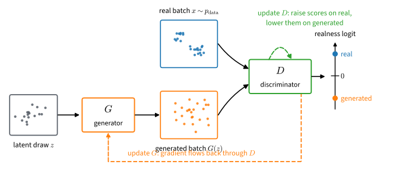

# Generative Adversarial Networks
:label:`sec_basic_gan`

The generative models introduced so far were trained through their likelihoods: evaluate the probability of the observed data and adjust the parameters to increase it. That recipe restricts the choice of model to those that can report a probability at all. The most direct way to generate data — a neural network that simply transforms random noise into samples — is excluded from the start: it produces an image in a single forward pass, but it assigns no probability to the result, so there is no likelihood to maximize.

Generative adversarial networks :cite:`Goodfellow.Pouget-Abadie.Mirza.ea.2014` train such samplers anyway, by changing what is measured. If the goal is samples that cannot be told from data, let that distinction itself be the loss: train a second network, the *discriminator*, to separate generated samples from real ones, and train the generator to defeat it. The two networks improve together. Every weakness the discriminator finds becomes, through its gradient, a signal telling the generator what to fix, and every improvement of the generator forces the discriminator to look more closely. The original paper likened the contest to a counterfeiter refining forgeries against an increasingly skilled police force; it ends when the fakes are indistinguishable from the real thing — here, when the best available discriminator can no longer beat a coin flip. This one idea produced the first photorealistic neural image generators, and it survives today inside the fast samplers, tokenizers, and vocoders examined at the end of this chapter.

A contest, however, is harder to reason about than a loss: what, if anything, does this game optimize? This section answers the question exactly for the original objective. A perfectly trained discriminator turns out to compute a specific and useful quantity — how the data density and the generator's density compare at each point — and the game as a whole then measures a well-defined divergence between the two distributions, one that reaches zero exactly when the generator matches the data. The same analysis exposes the game's structural weakness, a generator that learns slowest on precisely the samples the discriminator rejects most confidently, and yields the standard rewriting of the generator's loss that turns those rejections back into signal.

```{.python .input #gan-generative-adversarial-networks}
%%tab pytorch
%matplotlib inline
from d2l import torch as d2l
import torch
from torch import nn
```

```{.python .input #gan-generative-adversarial-networks}
%%tab jax
%matplotlib inline
from d2l import jax as d2l
import jax
from jax import numpy as jnp
from flax import nnx
import numpy as np
import optax
```

## From Likelihood to Comparison

Maximum likelihood is distribution matching. Fitting a density $p_\theta$ to samples maximizes $\sum_i \log p_\theta(x_i)$, and :numref:`subsec_mdl-nll-crossentropy` showed that this is the same as minimizing the Kullback--Leibler divergence from the empirical distribution to the model. When the likelihood is intractable rather than absent, as in latent-variable models, the ELBO of :numref:`sec_mdl-latent-em-elbo` substitutes a bound. Either way, training needs $\log p_\theta(x)$ or a surrogate for it.

The models of this chapter offer neither. An *implicit generator* draws a latent variable $z \sim \mathcal{N}(0, I_k)$ and outputs $x' = G(z)$, where $G$ is a neural network. Sampling is a single forward pass. The distribution of $x'$ is the pushforward of the Gaussian through $G$, but its density is generally unavailable. When $k$ is smaller than the data dimension, the samples concentrate on a lower-dimensional surface and have no density with respect to volume in the ambient space. Even when the dimensions match, evaluating the density would require an invertible $G$ with a tractable Jacobian. An unrestricted neural sampler therefore does not provide the quantity required by maximum likelihood.

One might respond by restricting $G$ until the likelihood becomes tractable. Before accepting that constraint, it is worth asking how much the likelihood was measuring in the first place. Consider a model that mixes the data density with noise,

$$
\tilde p \;=\; 0.01\, p_{\textrm{data}} + 0.99\, p_{\textrm{noise}}.
$$

For every $x$ we have $\tilde p(x) \geq 0.01\, p_{\textrm{data}}(x)$, so $\log \tilde p(x) \geq \log p_{\textrm{data}}(x) - \log 100$: the expected log-likelihood of $\tilde p$ is within $\log 100 \approx 4.6$ nats of the best achievable by any model. For images or audio, log-likelihoods run to thousands of nats, so this penalty is negligible. Yet 99 percent of the mixture's samples are noise. A model can therefore be nearly optimal by the likelihood yardstick while being useless as a sampler :cite:`Theis.Oord.Bethge.2016`. If samples are the product, samples are what should be judged.

Statistics provides a direct way to compare samples. Given real and generated examples, a *two-sample test* asks whether the two sets came from the same distribution. A generative adversarial network turns this test into a training signal: fit a classifier, called the *discriminator*, to distinguish generated data from real data, and train the generator to make that classification difficult. Relative to the chosen discriminator class, the generator has matched the data when no discriminator can reliably separate their samples. :numref:`fig_gan` shows the resulting computation.


:label:`fig_gan`

The diagram specifies the training mechanism but not the quantity it optimizes. We next compute the value obtained by the discriminator's best response and then determine whether that value supplies a useful generator gradient. Both calculations use the original logistic-loss game.

## The Log-Loss Game

The discriminator solves an ordinary classification problem. Draw a label $y \sim \textrm{Bernoulli}(\tfrac12)$; if $y = 1$ draw $x$ from the data density $p$, and if $y = 0$ draw $x$ from the generator density $q$. The marginal density of $x$ is then the balanced mixture $m = (p + q)/2$, the distribution of a sample whose origin is unknown. Throughout this chapter $p$ is the data distribution, $q$ the generator's, and two derived quantities recur: the density ratio $\rho = p/q$ and its logarithm $\lambda = \log \rho$. The discriminator is a function $D: \mathcal{X} \to \mathbb{R}$ producing a *realness logit*: $\sigma(D(x))$, with $\sigma(t) = 1/(1 + e^{-t})$, is the model's estimate of $P(y = 1 \mid x)$, and larger $D(x)$ means the sample looks more real. We use the identities $\sigma(-t) = 1 - \sigma(t)$ and $\tfrac{d}{dt} \log \sigma(t) = \sigma(-t)$ repeatedly.

The natural loss for a probabilistic classifier is the log loss, and on the balanced problem the discriminator's expected negative log-likelihood is $-\tfrac12 E_{x \sim p}[\log \sigma(D(x))] - \tfrac12 E_{x' \sim q}[\log \sigma(-D(x'))]$. Dropping the factor $\tfrac12$ and flipping the sign gives the objective the discriminator maximizes,

$$
V(D) \;=\; E_{x \sim p}\big[\log \sigma(D(x))\big] + E_{x' \sim q}\big[\log \sigma(-D(x'))\big],
$$
:eqlabel:`eq_gan_V`

the value function of :citet:`Goodfellow.Pouget-Abadie.Mirza.ea.2014`. The first term rewards confidence on real samples, the second rewards rejection of generated ones, and $V(D) \leq 0$ because both terms are expectations of log-probabilities. The generator plays against this: it minimizes $V$, which it influences through the second term only, so training solves the *minimax* problem $\min_G \max_D V$. Because maximizing $V$ and minimizing the classifier's negative log-likelihood are the same operation, the best achievable $V$ measures how distinguishable $p$ and $q$ are, and it is this connection that gives the value of the game its information-theoretic meaning below.

### The Optimal Critic

The maximization over $D$ looks like a problem in function space, but it separates into independent scalar problems. The integrand of :eqref:`eq_gan_V` at a point $x$ is $p(x) \log \sigma(D(x)) + q(x) \log \sigma(-D(x))$, which depends on $D$ only through the single number $D(x)$. Writing $s = \sigma(D(x)) \in (0, 1)$, the problem at each point is to maximize $p \log s + q \log(1 - s)$, a strictly concave function of $s$ whose stationarity condition $p/s = q/(1-s)$ has the unique solution

$$
\sigma(D^\star(x)) = \frac{p(x)}{p(x) + q(x)} = P(y = 1 \mid x),
\qquad
D^\star(x) = \log \frac{p(x)}{q(x)} = \lambda(x).
$$
:eqlabel:`eq_gan_dstar`

The optimal discriminator is the Bayes posterior of the labeling problem, and its logit is the log density ratio. The pointwise argument assumes both densities are positive at the point in question; where one vanishes, the optimal logit is infinite and attained only in the limit, and the divergences that arise this way are read as extended-real quantities throughout the chapter. The generator was introduced precisely because $q$ has no computable density; :eqref:`eq_gan_dstar` says that training a classifier recovers the one function of that density the game needs. An unconstrained critic trained with the log loss is a density-ratio estimator, and the same ratio returns throughout this chapter under other losses and other critics. Note also what the equation does *not* leave free: the game determines $D^\star$ exactly, additive constant included, since shifting the optimal critic by any constant $b \neq 0$ strictly decreases $V$ (Exercise 1). A later section on pairwise critics will need this fact as a point of contrast.

### The Value of the Game

Substituting the best response back into the objective tells us what the generator is actually up against. With $\sigma(D^\star) = p/(p+q) = p/(2m)$ and $\sigma(-D^\star) = q/(2m)$,

$$
V(D^\star) = \int p \log \frac{p}{2m} + \int q \log \frac{q}{2m}
= \mathrm{KL}(p \,\|\, m) + \mathrm{KL}(q \,\|\, m) - 2 \log 2 .
$$

The two divergences are exactly the ones that define the Jensen--Shannon divergence of :eqref:`eq_mdl-js-def`, $\mathrm{JS}(p, q) = \tfrac12 \mathrm{KL}(p \| m) + \tfrac12 \mathrm{KL}(q \| m)$, so

$$
\max_D V(D) = 2\,\mathrm{JS}(p, q) - 2 \log 2 .
$$
:eqlabel:`eq_gan_js_value`

Read as a statement about the generator: against a fully trained discriminator, minimizing $V$ minimizes the Jensen--Shannon divergence between the generator and the data, which vanishes exactly at $q = p$. The minimax game has the right fixed point. Equivalently, the discriminator's minimal negative log-likelihood is $\log 2 - \mathrm{JS}(p, q)$: chance-level loss minus the divergence. This form is directly observable, and the experiment below will read the value of the game off a training curve.

Two rewritings of $\mathrm{JS}$ explain what kind of quantity the game has produced. Expanding each Kullback--Leibler term as $\mathrm{KL}(p \| m) = -H[p] - \int p \log m$ and collecting the mixture terms into $\int m \log m = -H[m]$ gives

$$
\mathrm{JS}(p, q) \;=\; H[m] - \frac{H[p] + H[q]}{2},
$$
:eqlabel:`eq_gan_entropy_gap`

where $H$ denotes differential entropy. The first term is the uncertainty in a sample whose origin is unknown; the second is the average uncertainty once the origin is revealed. Their difference is the uncertainty that the origin itself accounts for. Because entropy is strictly concave, this Jensen gap is nonnegative and vanishes only when $p = q$: mixing genuinely different distributions produces more uncertainty than either contributes alone.

The second rewriting uses the labeled-mixture setup directly. With $y$ the Bernoulli label and $x \sim m$ the sample, the mutual information between them is $I(x; y) = H[x] - H[x \mid y]$, and these are precisely the two terms of :eqref:`eq_gan_entropy_gap`. Hence the divergence satisfies $\mathrm{JS}(p, q) = I(x; y)$: it is the number of nats one sample carries about which distribution produced it, and the optimal classifier's loss $\log 2 - I(x; y)$ improves on coin-flipping by exactly that information. (Keep the two roles distinct: the *divergence* is $\mathrm{JS}$; the *value of the game* is $2\,\mathrm{JS} - 2\log 2$.)

The information reading also bounds the game. Mutual information is symmetric, $I(x; y) = H(y) - H(y \mid x)$, so a one-bit label can be worth at most one bit: $I(x; y) \leq H(y) = \log 2$, with equality exactly when $x$ determines $y$, that is, when the supports of $p$ and $q$ are disjoint and every sample identifies its origin. Together with nonnegativity,

$$
0 \;\leq\; \mathrm{JS}(p, q) \;\leq\; \log 2 .
$$

The same bounds, including the disjoint-support case, were derived from the Kullback--Leibler form in :numref:`sec_mdl-divergences-distances`; the information reading recovers them as properties of a one-bit label. Once the two distributions separate, the objective therefore sits at $\log 2$ no matter how far apart they are. We return to the consequences of this ceiling at the end of the section, after the experiment makes them concrete.

## The Generator's Gradient

The generator influences only the second term of :eqref:`eq_gan_V`, so playing the minimax game literally means minimizing $E_z[\log \sigma(-D(G(z)))]$ over the generator's parameters $\theta$, with the discriminator held fixed. Differentiating through $x' = G(z)$ with the identity $\tfrac{d}{du} \log \sigma(-u) = -\sigma(u)$ gives

$$
\nabla_\theta \, E_z\big[\log \sigma(-D(G(z)))\big]
= -\,E_z\big[\sigma(D(x'))\, \nabla_\theta D(G(z))\big] ,
$$

where $\nabla_\theta D(G(z))$ is the gradient of the composite map. A gradient-descent step on this loss therefore moves each generated sample up the critic's score surface, with a per-sample step weight $\sigma(D(x'))$: the critic's estimate that the sample is real. Early in training, and for poorly modeled samples at any stage, the critic may reject confidently, $D(x') \ll 0$. The weight $\sigma(D(x'))$ is then exponentially small. The loss has *saturated*: exactly the samples that most need improving contribute least to the update.

:citet:`Goodfellow.Pouget-Abadie.Mirza.ea.2014` therefore substitute a different generator loss in practice: rather than minimizing the probability of being called fake, the generator maximizes the probability of being called real, minimizing $-E_z[\log \sigma(D(G(z)))]$. The same differentiation, now with $\tfrac{d}{du} \log \sigma(u) = \sigma(-u)$, gives

$$
\nabla_\theta \Big({-E_z\big[\log \sigma(D(G(z)))\big]}\Big)
= -\,E_z\big[\sigma(-D(x'))\, \nabla_\theta D(G(z))\big] .
$$

The two losses generate the *same* update direction $\nabla_\theta D$ per sample and differ only in the weight attached to it:

$$
w_{\textrm{sat}}(x') = \sigma(D(x')),
\qquad
w_{\textrm{ns}}(x') = \sigma(-D(x')) = 1 - \sigma(D(x')).
$$
:eqlabel:`eq_gan_weights`

The *non-saturating* weight $w_{\textrm{ns}}$ is largest precisely where the saturating weight vanishes: a confidently rejected sample gets weight near one instead of near zero.

Swapping the weighting does not change what the game converges to. Substituting the optimal critic $D^\star = \lambda$ into the non-saturating loss and using $\sigma(\lambda) = p/(2m)$,

$$
-E_{x' \sim q}\big[\log \sigma(\lambda(x'))\big]
= \log 2 + \mathrm{KL}(q \,\|\, p) - \mathrm{KL}(q \,\|\, m)
\;\geq\; \log 2 + \tfrac12\, \mathrm{KL}(q \,\|\, p),
$$
:eqlabel:`eq_gan_ns_value`

where the inequality holds because $\mathrm{KL}(q \,\|\, \cdot)$ is convex and $m$ is the midpoint of $p$ and $q$, so $\mathrm{KL}(q \| m) \leq \tfrac12 \mathrm{KL}(q \| p) + \tfrac12 \mathrm{KL}(q \| q)$, and the last term is zero. The bound exceeds $\log 2$ unless $\mathrm{KL}(q \| p) = 0$, and at $q = p$ the loss attains exactly $\log 2$; the non-saturating loss at the optimal critic is therefore minimized uniquely at $q = p$. The non-saturating loss thus reweights the gradient field without changing its desired solution. At the optimal critic it minimizes a quantity different from $\mathrm{JS}$, but both quantities have the unique minimizer $q=p$. The following experiment measures when this reweighting helps and where its benefit ends.

## Fitting a Gaussian

The section has made three specific predictions. At the fixed point of the game, the discriminator's per-sample loss equals $\log 2 \approx 0.693$. Away from the fixed point, a trained critic's output approximates the log density ratio $\lambda = \log(p/q)$. And the two generator losses share a fixed point but weight samples oppositely, so a generator whose samples the critic confidently rejects should train under the non-saturating loss and stall under the saturating one. A two-dimensional Gaussian is the smallest problem on which all three predictions can be checked against closed forms, because if the data are Gaussian and the generator is linear, then $p$, $q$, and $\lambda$ are all available exactly.

### Data and Models

The data are a standard Gaussian pushed through a fixed linear map: $x = z A + b$ with $z \sim \mathcal{N}(0, I_2)$, giving $p = \mathcal{N}(b, A^\top A)$. The chosen $A$ makes the cloud a thin tilted ellipse rather than a round blob, so matching it requires learning an orientation and two very different scales. Training works from a fixed sample of one thousand draws, while the analytic comparisons below use the population densities.

```{.python .input #gan-data-and-models-1}
%%tab pytorch
torch.manual_seed(0)
Z = torch.normal(0.0, 1.0, (1000, 2))
A = torch.tensor([[1.0, 2.0], [-0.1, 0.5]])
b = torch.tensor([1.0, 2.0])
data = Z @ A + b
d2l.set_figsize()
d2l.plt.scatter(data[:100, 0], data[:100, 1], s=8);
print(f'covariance of the data distribution:\n{A.T @ A}')
```

```{.python .input #gan-data-and-models-1}
%%tab jax
Z = jax.random.normal(jax.random.PRNGKey(0), (1000, 2))
A = jnp.array([[1.0, 2.0], [-0.1, 0.5]])
b = jnp.array([1.0, 2.0])
data = Z @ A + b
d2l.set_figsize()
d2l.plt.scatter(data[:100, 0], data[:100, 1], s=8);
print(f'covariance of the data distribution:\n{A.T @ A}')
```

The generator is a single linear layer, so its output distribution is itself a Gaussian whose mean and covariance we can read off the weights; that choice is what makes the verification below exact. The discriminator is a small multilayer perceptron with two tanh hidden layers, deliberately modest: it must be flexible enough to score points in the plane but it enjoys none of the closed-form knowledge we hold. A factory function builds both networks from a fixed seed, so later cells can restart from an identical initialization.

```{.python .input #gan-data-and-models-2}
%%tab pytorch
def make_nets():
    torch.manual_seed(7)
    net_G = nn.Sequential(nn.Linear(2, 2))
    net_D = nn.Sequential(nn.Linear(2, 5), nn.Tanh(),
                          nn.Linear(5, 3), nn.Tanh(),
                          nn.Linear(3, 1))
    for net in (net_G, net_D):
        for w in net.parameters():
            nn.init.normal_(w, 0, 0.02)
    return net_G, net_D
```

```{.python .input #gan-data-and-models-2}
%%tab jax
class Generator(nnx.Module):
    def __init__(self, rngs):
        normal = nnx.initializers.normal(0.02)
        self.out = nnx.Linear(2, 2, kernel_init=normal, bias_init=normal,
                              rngs=rngs)

    def __call__(self, x):
        return self.out(x)

class Discriminator(nnx.Module):
    def __init__(self, rngs):
        normal = nnx.initializers.normal(0.02)
        self.h1 = nnx.Linear(2, 5, kernel_init=normal, bias_init=normal,
                             rngs=rngs)
        self.h2 = nnx.Linear(5, 3, kernel_init=normal, bias_init=normal,
                             rngs=rngs)
        self.out = nnx.Linear(3, 1, kernel_init=normal, bias_init=normal,
                              rngs=rngs)

    def __call__(self, x):
        return self.out(nnx.tanh(self.h2(nnx.tanh(self.h1(x)))))

def make_nets():
    return Generator(nnx.Rngs(7)), Discriminator(nnx.Rngs(8))
```

### The Update Rules

One training iteration is two half-steps, one per player. The discriminator update ascends :eqref:`eq_gan_V` on a minibatch, implemented as logistic regression with label one for data and zero for generated samples; the generator's parameters are held fixed during this half-step. Both update functions are saved to the `d2l` library, since :numref:`sec_dcgan` trains image networks with the identical rules.

```{.python .input #gan-the-update-rules-1}
%%tab pytorch
#@save
def update_D(X, Z, net_D, net_G, loss, trainer_D):
    """Update the discriminator."""
    batch_size = X.shape[0]
    ones = torch.ones((batch_size,), device=X.device)
    zeros = torch.zeros((batch_size,), device=X.device)
    trainer_D.zero_grad()
    real_Y = net_D(X)
    # The generator is the fixed player here: detach its output
    fake_X = net_G(Z)
    fake_Y = net_D(fake_X.detach())
    loss_D = (loss(real_Y, ones.reshape(real_Y.shape)) +
              loss(fake_Y, zeros.reshape(fake_Y.shape))) / 2
    loss_D.backward()
    trainer_D.step()
    return loss_D
```

```{.python .input #gan-the-update-rules-1}
%%tab jax
#@save
@nnx.jit
def update_D(X, Z, net_D, net_G, optimizer_D):
    """Update the discriminator."""
    batch_size = X.shape[0]
    fake_X = net_G(Z)  # computed outside the loss: no gradient to net_G
    def loss_D_fn(model_D):
        real_Y = model_D(X).squeeze()
        fake_Y = model_D(fake_X).squeeze()
        return (jnp.sum(optax.sigmoid_binary_cross_entropy(
                    real_Y, jnp.ones(batch_size))) +
                jnp.sum(optax.sigmoid_binary_cross_entropy(
                    fake_Y, jnp.zeros(batch_size)))) / 2
    loss_D, grads_D = nnx.value_and_grad(loss_D_fn)(net_D)
    optimizer_D.update(net_D, grads_D)
    return loss_D
```

The generator update implements the non-saturating loss of :eqref:`eq_gan_weights`: generated samples are fed to the discriminator under the label *one*, so that the resulting cross-entropy is $-E[\log \sigma(D(G(z)))]$. The discriminator has changed since its half-step, so its scores are recomputed rather than reused. In the JAX version, the loss closure takes both models as explicit arguments and differentiates only with respect to the first; this keeps the update rule reusable for networks whose forward pass mutates state, which the convolutional models of :numref:`sec_dcgan` require.

```{.python .input #gan-the-update-rules-2}
%%tab pytorch
#@save
def update_G(Z, net_D, net_G, loss, trainer_G):
    """Update the generator on the non-saturating loss."""
    batch_size = Z.shape[0]
    ones = torch.ones((batch_size,), device=Z.device)
    trainer_G.zero_grad()
    # net_D changed in its half-step, so recompute the scores
    fake_Y = net_D(net_G(Z))
    loss_G = loss(fake_Y, ones.reshape(fake_Y.shape))
    loss_G.backward()
    trainer_G.step()
    return loss_G
```

```{.python .input #gan-the-update-rules-2}
%%tab jax
#@save
@nnx.jit
def update_G(Z, net_D, net_G, optimizer_G):
    """Update the generator on the non-saturating loss."""
    def loss_G_fn(model_G, model_D):
        fake_Y = model_D(model_G(Z)).squeeze()
        return jnp.sum(optax.sigmoid_binary_cross_entropy(
            fake_Y, jnp.ones(Z.shape[0])))
    loss_G, grads_G = nnx.value_and_grad(loss_G_fn, argnums=0)(net_G, net_D)
    optimizer_G.update(net_G, grads_G)
    return loss_G
```

### Training

The loop alternates the two half-steps over minibatches, records each player's per-sample loss, and stores generated samples at selected epochs. These snapshots are used by the comparison experiment below. Adam serves as the optimizer for both players, with the discriminator given the larger learning rate so that its scores stay close to their best response to the current generator.

```{.python .input #gan-training-1}
%%tab pytorch
def train(net_D, net_G, data_iter, num_epochs, lr_D=0.05, lr_G=0.005,
          step_G=None, snapshot_epochs=()):
    step_G = step_G if step_G is not None else update_G
    loss = nn.BCEWithLogitsLoss(reduction='sum')
    trainer_D = torch.optim.Adam(net_D.parameters(), lr=lr_D)
    trainer_G = torch.optim.Adam(net_G.parameters(), lr=lr_G)
    history, snapshots = [], {}
    for epoch in range(1, num_epochs + 1):
        metric = d2l.Accumulator(3)
        for (X,) in data_iter:
            Zb = torch.normal(0, 1, (X.shape[0], 2))
            metric.add(
                update_D(X, Zb, net_D, net_G, loss, trainer_D).detach(),
                step_G(Zb, net_D, net_G, loss, trainer_G).detach(),
                X.shape[0])
        history.append((metric[0] / metric[2], metric[1] / metric[2]))
        if epoch in snapshot_epochs:
            with torch.no_grad():
                snapshots[epoch] = net_G(torch.normal(0, 1, (200, 2)))
    return torch.tensor(history), snapshots
```

```{.python .input #gan-training-1}
%%tab jax
def train(net_D, net_G, data_iter, num_epochs, lr_D=0.05, lr_G=0.005,
          step_G=None, snapshot_epochs=(), seed=1):
    step_G = step_G if step_G is not None else update_G
    key = jax.random.PRNGKey(seed)
    optimizer_D = nnx.Optimizer(net_D, optax.adam(lr_D), wrt=nnx.Param)
    optimizer_G = nnx.Optimizer(net_G, optax.adam(lr_G), wrt=nnx.Param)
    history, snapshots = [], {}
    for epoch in range(1, num_epochs + 1):
        loss_D_sum, loss_G_sum, n = 0.0, 0.0, 0
        for (X,) in data_iter:
            key, subkey = jax.random.split(key)
            Zb = jax.random.normal(subkey, (X.shape[0], 2))
            loss_D_sum += update_D(X, Zb, net_D, net_G, optimizer_D)
            loss_G_sum += step_G(Zb, net_D, net_G, optimizer_G)
            n += X.shape[0]
        history.append((loss_D_sum / n, loss_G_sum / n))
        if epoch in snapshot_epochs:
            key, subkey = jax.random.split(key)
            snapshots[epoch] = net_G(jax.random.normal(subkey, (200, 2)))
    return np.array(history), snapshots
```

Twenty epochs suffice for the default run. The left panel below tracks both losses; the right panel overlays generated samples on the data.

```{.python .input #gan-training-2}
%%tab pytorch
data_iter = d2l.load_array((data,), batch_size=8)
net_G, net_D = make_nets()
history, _ = train(net_D, net_G, data_iter, num_epochs=20)
with torch.no_grad():
    fake = net_G(torch.normal(0, 1, (200, 2)))
fig, axes = d2l.plt.subplots(1, 2, figsize=(9, 3.2))
axes[0].plot(range(1, 21), history[:, 0], label='discriminator')
axes[0].plot(range(1, 21), history[:, 1], label='generator')
axes[0].axhline(0.693, ls='--', c='gray', lw=1)
axes[0].set_xlabel('epoch'), axes[0].set_ylabel('per-sample loss')
axes[0].legend()
axes[1].scatter(data[:100, 0], data[:100, 1], s=8, label='real')
axes[1].scatter(fake[:100, 0], fake[:100, 1], s=8, label='generated')
axes[1].legend()
fig.tight_layout()
```

```{.python .input #gan-training-2}
%%tab jax
np.random.seed(0)
data_iter = d2l.load_array((np.asarray(data),), batch_size=8)
net_G, net_D = make_nets()
history, _ = train(net_D, net_G, data_iter, num_epochs=20)
key = jax.random.PRNGKey(4)
fake = net_G(jax.random.normal(key, (200, 2)))
fig, axes = d2l.plt.subplots(1, 2, figsize=(9, 3.2))
axes[0].plot(range(1, 21), history[:, 0], label='discriminator')
axes[0].plot(range(1, 21), history[:, 1], label='generator')
axes[0].axhline(0.693, ls='--', c='gray', lw=1)
axes[0].set_xlabel('epoch'), axes[0].set_ylabel('per-sample loss')
axes[0].legend()
axes[1].scatter(data[:100, 0], data[:100, 1], s=8, label='real')
axes[1].scatter(fake[:100, 0], fake[:100, 1], s=8, label='generated')
axes[1].legend()
fig.tight_layout()
```

The loss curves provide an observable check of the value calculation. The discriminator starts below $\log 2$ while the generated and real samples remain distinguishable, and its loss climbs toward the dashed line at $\log 2 \approx 0.693$ as the generator improves. Its per-sample loss is the negative log-likelihood whose optimum :eqref:`eq_gan_js_value` places at $\log 2 - \mathrm{JS}(p, q)$. Training has driven $\mathrm{JS}$ toward zero, leaving chance-level classification with no information in a sample about its origin. The generator's loss descends to the same level from above for a different reason: by :eqref:`eq_gan_ns_value`, the non-saturating loss against a near-optimal critic approaches its minimum $\log 2$ as $q$ approaches $p$. The overlay confirms what the curves report, with generated samples spread along the same tilted ellipse as the data. A loss curve flattening at $\log 2$ says only that *this* discriminator is beaten, however; equilibrium of the pair is not proof that $q = p$, which is why the next two cells measure the fit independently.

### Verifying the Optimal Critic

Equation :eqref:`eq_gan_dstar` asserts that an optimally trained critic computes $\lambda = \log(p/q)$. On this toy problem the assertion is checkable, because both densities are Gaussians with known parameters: $p = \mathcal{N}(b, A^\top A)$ by construction, and $q$ is the Gaussian determined by the trained linear generator's weights. Two provisos shape the check. The theorem concerns the best response to a *fixed* generator, whereas training alternates; so we freeze the generator and give the critic additional steps to converge. And a converged fit only shows structure if there is structure to show: at the end of the main run $q$ is so close to $p$ that $\lambda$ is nearly zero everywhere. We therefore freeze a *partially* trained generator, taken at epoch ten, where the mismatch is still visible.

```{.python .input #gan-verifying-the-optimal-critic-1}
%%tab pytorch
def gaussian_logpdf(x, mu, Sigma):
    diff = x - mu
    sol = torch.linalg.solve(Sigma, diff.T).T
    return -0.5 * ((diff * sol).sum(1)
                   + torch.logdet(2 * torch.pi * Sigma))

def generator_gaussian(net_G):
    W, c = net_G[0].weight.detach(), net_G[0].bias.detach()
    return c, W @ W.T

net_G_mid, net_D_mid = make_nets()
train(net_D_mid, net_G_mid, data_iter, num_epochs=10)
loss = nn.BCEWithLogitsLoss(reduction='sum')
trainer_D = torch.optim.Adam(net_D_mid.parameters(), lr=0.01)
torch.manual_seed(2)
for _ in range(2000):  # critic-only steps against the frozen generator
    X = data[torch.randint(0, 1000, (256,))]
    Zb = torch.normal(0, 1, (256, 2))
    update_D(X, Zb, net_D_mid, net_G_mid, loss, trainer_D)
```

```{.python .input #gan-verifying-the-optimal-critic-1}
%%tab jax
def gaussian_logpdf(x, mu, Sigma):
    diff = x - mu
    sol = jnp.linalg.solve(Sigma, diff.T).T
    return -0.5 * ((diff * sol).sum(1)
                   + jnp.linalg.slogdet(2 * jnp.pi * Sigma)[1])

def generator_gaussian(net_G):
    K, c = net_G.out.kernel[...], net_G.out.bias[...]
    return c, K.T @ K

np.random.seed(2)
data_iter_v = d2l.load_array((np.asarray(data),), batch_size=8)
net_G_mid, net_D_mid = make_nets()
train(net_D_mid, net_G_mid, data_iter_v, num_epochs=10)
optimizer_D = nnx.Optimizer(net_D_mid, optax.adam(0.01), wrt=nnx.Param)
key = jax.random.PRNGKey(2)
for _ in range(2000):  # critic-only steps against the frozen generator
    key, k1, k2 = jax.random.split(key, 3)
    X = data[jax.random.randint(k1, (256,), 0, 1000)]
    Zb = jax.random.normal(k2, (256, 2))
    update_D(X, Zb, net_D_mid, net_G_mid, optimizer_D)
```

The comparison evaluates both functions where the game evaluates them: at samples from the mixture, two hundred real and two hundred generated. The analytic $\lambda$ comes from the two Gaussian densities; the critic's answer is a forward pass.

```{.python .input #gan-verifying-the-optimal-critic-2}
%%tab pytorch
mu_q, Sigma_q = generator_gaussian(net_G_mid)
with torch.no_grad():
    xs = torch.cat([data[:200], net_G_mid(torch.normal(0, 1, (200, 2)))])
    lam = (gaussian_logpdf(xs, b, A.T @ A)
           - gaussian_logpdf(xs, mu_q, Sigma_q))
    D_out = net_D_mid(xs).squeeze()
print(f'correlation(D, lambda) = '
      f'{torch.corrcoef(torch.stack([lam, D_out]))[0, 1]:.3f}')
print(f'mean |D - lambda| = {(D_out - lam).abs().mean():.3f} nats')
d2l.set_figsize((4.2, 3.4))
d2l.plt.scatter(lam, D_out, s=8)
lims = [float(lam.min()), float(lam.max())]
d2l.plt.plot(lims, lims, 'k--', lw=1)
d2l.plt.xlabel(r'analytic $\log(p/q)$')
d2l.plt.ylabel('critic output')
```

```{.python .input #gan-verifying-the-optimal-critic-2}
%%tab jax
mu_q, Sigma_q = generator_gaussian(net_G_mid)
key, subkey = jax.random.split(key)
xs = jnp.concatenate([data[:200],
                      net_G_mid(jax.random.normal(subkey, (200, 2)))])
lam = (gaussian_logpdf(xs, b, A.T @ A)
       - gaussian_logpdf(xs, mu_q, Sigma_q))
D_out = net_D_mid(xs).squeeze()
print(f'correlation(D, lambda) = '
      f'{jnp.corrcoef(jnp.stack([lam, D_out]))[0, 1]:.3f}')
print(f'mean |D - lambda| = {jnp.abs(D_out - lam).mean():.3f} nats')
d2l.set_figsize((4.2, 3.4))
d2l.plt.scatter(lam, D_out, s=8)
lims = [float(lam.min()), float(lam.max())]
d2l.plt.plot(lims, lims, 'k--', lw=1)
d2l.plt.xlabel(r'analytic $\log(p/q)$')
d2l.plt.ylabel('critic output')
```

The scatter hugs the dashed identity line: a three-layer network trained only to classify has, as :eqref:`eq_gan_dstar` predicts, learned the log density ratio, with mean error well under a nat and compression at extreme values. The deviations are as informative as the fit. They grow at the extremes of $\lambda$, where one of the two densities is nearly zero and the mixture supplies almost no samples: the objective constrains the critic only where $m$ places mass, and off that region the network extrapolates freely (Exercise 5 maps this error over the plane). Ratio estimation degrades exactly where the ratio is most extreme, an observation that returns as a structural theme in the next section.

### Quantifying the Fit

The sample overlay lets the fit be judged by eye; the linear generator lets it be measured in nats. For Gaussians in $d$ dimensions the Kullback--Leibler divergence has the closed form :cite:`Kullback.1959`

$$
\mathrm{KL}\big(\mathcal{N}(\mu_0, \Sigma_0) \,\|\, \mathcal{N}(\mu_1, \Sigma_1)\big)
= \tfrac12 \Big[ \operatorname{tr}(\Sigma_1^{-1} \Sigma_0)
+ (\mu_1 - \mu_0)^\top \Sigma_1^{-1} (\mu_1 - \mu_0)
- d + \log \tfrac{\det \Sigma_1}{\det \Sigma_0} \Big],
$$
:eqlabel:`eq_gan_mvn_kl`

the multivariate form of the univariate formula derived in :eqref:`eq_mdl-gaussian_kl`. We report $\mathrm{KL}(q \,\|\, p)$, the direction that charges the generator for placing mass where the data has little, evaluated at initialization and after training.

```{.python .input #gan-quantifying-the-fit}
%%tab pytorch
def kl_gaussians(mu0, S0, mu1, S1):
    diff = mu1 - mu0
    return 0.5 * (torch.trace(torch.linalg.solve(S1, S0))
                  + diff @ torch.linalg.solve(S1, diff) - len(mu0)
                  + torch.logdet(S1) - torch.logdet(S0))

mu_p, Sigma_p = b, A.T @ A
for name, net in [('at initialization', make_nets()[0]),
                  ('after training   ', net_G)]:
    mu_q, Sigma_q = generator_gaussian(net)
    print(f'KL(q || p) {name}: '
          f'{kl_gaussians(mu_q, Sigma_q, mu_p, Sigma_p):.3f} nats')
```

```{.python .input #gan-quantifying-the-fit}
%%tab jax
def kl_gaussians(mu0, S0, mu1, S1):
    diff = mu1 - mu0
    return 0.5 * (jnp.trace(jnp.linalg.solve(S1, S0))
                  + diff @ jnp.linalg.solve(S1, diff) - len(mu0)
                  + jnp.linalg.slogdet(S1)[1] - jnp.linalg.slogdet(S0)[1])

mu_p, Sigma_p = b, A.T @ A
for name, net in [('at initialization', make_nets()[0]),
                  ('after training   ', net_G)]:
    mu_q, Sigma_q = generator_gaussian(net)
    print(f'KL(q || p) {name}: '
          f'{kl_gaussians(mu_q, Sigma_q, mu_p, Sigma_p):.3f} nats')
```

The divergence falls from roughly eight nats at initialization to a small fraction of a nat. Although the training loop never evaluates the generator density, the classifier supplies enough information to fit its parameters. The resulting generator distribution closely approximates the data distribution.

### Saturating versus Non-Saturating Training

The remaining prediction concerns the two weights of :eqref:`eq_gan_weights`, and testing it requires putting the generator where the weights differ. In the run above they barely do: the initial generator emits samples near the origin, which sits about one standard deviation from the data mean, so the critic never rejects with the confidence that drives $w_{\textrm{sat}}$ toward zero, and retraining that run with the saturating loss succeeds just as well. The regime the analysis warns about is a generator whose samples the critic can reject confidently. We create it directly, by starting the generator's bias far from the data, and train two runs from this identical initialization that differ in one line: the sign delivering the saturating rather than the non-saturating weight.

```{.python .input #gan-saturating-versus-non-saturating-training-1}
%%tab pytorch
def update_G_saturating(Z, net_D, net_G, loss, trainer_G):
    batch_size = Z.shape[0]
    zeros = torch.zeros((batch_size,), device=Z.device)
    trainer_G.zero_grad()
    fake_Y = net_D(net_G(Z))
    # minimize E[log sigma(-D)]: the minimax game taken literally
    loss_G = -loss(fake_Y, zeros.reshape(fake_Y.shape))
    loss_G.backward()
    trainer_G.step()
    return loss_G

runs = {}
for name, step in [('non-saturating', update_G),
                   ('saturating', update_G_saturating)]:
    net_G_ab, net_D_ab = make_nets()
    with torch.no_grad():
        net_G_ab[0].bias += torch.tensor([-6.0, 6.0])
    torch.manual_seed(1)
    hist, snaps = train(net_D_ab, net_G_ab, data_iter, num_epochs=30,
                        lr_G=0.01, step_G=step, snapshot_epochs=(10, 30))
    runs[name] = (hist, snaps)
    mu_q, Sigma_q = generator_gaussian(net_G_ab)
    print(f'{name}: final KL(q || p) = '
          f'{kl_gaussians(mu_q, Sigma_q, mu_p, Sigma_p):.2f} nats')
```

```{.python .input #gan-saturating-versus-non-saturating-training-1}
%%tab jax
@nnx.jit
def update_G_saturating(Z, net_D, net_G, optimizer_G):
    def loss_G_fn(model_G, model_D):
        fake_Y = model_D(model_G(Z)).squeeze()
        # minimize E[log sigma(-D)]: the minimax game taken literally
        return -jnp.sum(optax.sigmoid_binary_cross_entropy(
            fake_Y, jnp.zeros(Z.shape[0])))
    loss_G, grads_G = nnx.value_and_grad(loss_G_fn, argnums=0)(net_G, net_D)
    optimizer_G.update(net_G, grads_G)
    return loss_G

runs = {}
for name, step in [('non-saturating', update_G),
                   ('saturating', update_G_saturating)]:
    net_G_ab, net_D_ab = make_nets()
    net_G_ab.out.bias[...] += jnp.array([-6.0, 6.0])
    np.random.seed(9)  # reseed per arm: identical minibatch streams
    data_iter_ab = d2l.load_array((np.asarray(data),), batch_size=8)
    hist, snaps = train(net_D_ab, net_G_ab, data_iter_ab, num_epochs=30,
                        lr_G=0.01, step_G=step, snapshot_epochs=(10, 30),
                        seed=9)
    runs[name] = (hist, snaps)
    mu_q, Sigma_q = generator_gaussian(net_G_ab)
    print(f'{name}: final KL(q || p) = '
          f'{kl_gaussians(mu_q, Sigma_q, mu_p, Sigma_p):.2f} nats')
```

The panels below show each run's samples partway through and at the end of the budget, over the data in grey, together with both discriminator loss traces.

```{.python .input #gan-saturating-versus-non-saturating-training-2}
%%tab pytorch
fig, axes = d2l.plt.subplots(1, 3, figsize=(10.5, 3.2))
for ax, (name, (hist, snaps)) in zip(axes[:2], runs.items()):
    ax.scatter(data[:150, 0], data[:150, 1], s=6, c='lightgray',
               label='real')
    ax.scatter(snaps[10][:, 0], snaps[10][:, 1], s=6, label='epoch 10')
    ax.scatter(snaps[30][:, 0], snaps[30][:, 1], s=6, label='epoch 30')
    ax.set_xlim(-8, 6), ax.set_ylim(-6, 8)
    ax.set_title(name), ax.legend()
for name, (hist, snaps) in runs.items():
    axes[2].plot(range(1, 31), hist[:, 0], label=name)
axes[2].axhline(0.693, ls='--', c='gray', lw=1)
axes[2].set_xlabel('epoch'), axes[2].set_ylabel('discriminator loss')
axes[2].legend()
fig.tight_layout()
```

```{.python .input #gan-saturating-versus-non-saturating-training-2}
%%tab jax
fig, axes = d2l.plt.subplots(1, 3, figsize=(10.5, 3.2))
for ax, (name, (hist, snaps)) in zip(axes[:2], runs.items()):
    ax.scatter(data[:150, 0], data[:150, 1], s=6, c='lightgray',
               label='real')
    ax.scatter(snaps[10][:, 0], snaps[10][:, 1], s=6, label='epoch 10')
    ax.scatter(snaps[30][:, 0], snaps[30][:, 1], s=6, label='epoch 30')
    ax.set_xlim(-8, 6), ax.set_ylim(-6, 8)
    ax.set_title(name), ax.legend()
for name, (hist, snaps) in runs.items():
    axes[2].plot(range(1, 31), hist[:, 0], label=name)
axes[2].axhline(0.693, ls='--', c='gray', lw=1)
axes[2].set_xlabel('epoch'), axes[2].set_ylabel('discriminator loss')
axes[2].legend()
fig.tight_layout()
```

The two runs separate as predicted, and the printed final KL values quantify the contrast. The saturating generator never leaves its initialization, in either framework: its samples sit at the starting blob in both snapshots, and its final divergence remains above three hundred nats. Its mechanism is visible in the loss trace: the discriminator reaches near-zero loss within the first epochs and stays there, so $\sigma(D(x')) \approx 0$ on every generated sample, and by :eqref:`eq_gan_weights` each update arrives with a weight of nearly zero. Confident rejection freezes the generator, and the frozen generator keeps rejection confident. The non-saturating generator improves on the same figure by orders of magnitude, but how far it gets within this budget depends on the draw. The stored PyTorch run crosses the plane and settles onto the data region, ending near one nat with the discriminator's loss returning to $\log 2$ as its advantage evaporates; the stored JAX run stalls partway, at several dozen nats with the ellipse only partially matched, held on a plateau by this small critic's imperfect score surface. What the reweighting guarantees is a usable gradient out of the trap, not a complete fit at this budget.

Reweighting rescued this experiment, but only because the critic's score surface retained a useful slope. Both weights in :eqref:`eq_gan_weights` multiply the same factor $\nabla_\theta D$. The non-saturating loss can amplify that factor; it cannot create it. Here the small tanh critic was far from its best response, and the generator could climb its smooth, imperfect score surface. No such slope remains for an optimal critic on separated supports.

Consider the smallest example: two point masses $p = \delta_0$ and $q_\theta = \delta_\theta$ on the line. For every $\theta \neq 0$, their supports are disjoint, $\mathrm{JS}(p,q_\theta) = \log 2$, and the value of the game is independent of $\theta$. A constant objective supplies no gradient with respect to $\theta$, regardless of how its samples are reweighted, even when the generator lies arbitrarily close to the solution.

The same issue arises in high dimensions. A generator maps a lower-dimensional latent variable into the sample space, so generated samples often concentrate near a low-dimensional set whose support is nearly disjoint from that of the data :cite:`Arjovsky.Bottou.2017`. The next section therefore changes the objective itself and asks which adversarial discrepancies preserve a gradient when supports separate.

## Summary

An implicit generator supplies samples without a tractable density, so maximum likelihood cannot be applied directly. The mixture example also shows that a high likelihood need not imply useful samples. Adversarial training instead learns a comparison between real and generated data.

For the logistic loss, pointwise optimization gives $\sigma(D^\star) = p/(p+q)$ and $D^\star = \lambda = \log(p/q)$. Substituting this critic into the value function yields $2\,\mathrm{JS}(p,q) - 2\log 2$. The Jensen--Shannon divergence is both the Jensen gap of entropy at the equal mixture and the mutual information $I(x;y)$ between a sample and its origin. This information interpretation gives the upper bound $\log 2$, attained when the supports are disjoint.

The saturating and non-saturating generator losses have the same fixed point but weight samples by $\sigma(D)$ and $\sigma(-D)$, respectively. The Gaussian experiment confirmed the predicted loss value, the critic's recovery of the log density ratio, and the reduction in the analytic KL divergence. A distant initialization also showed the practical difference between the two weights: the non-saturating generator moved toward the data while the saturating one stalled. Neither weighting resolves support separation, because the optimal value is constant once the supports are disjoint. The next section therefore changes the discrepancy itself.

## Exercises

1. The log-loss game identifies its optimal critic exactly. Let $D^\star = \log(p/q)$ and consider the shifted critic $D^\star + b$ for a constant $b \neq 0$. Show that $V(D^\star + b) < V(D^\star)$, by examining the pointwise objective $p \log \sigma(t) + q \log \sigma(-t)$ at $t = \lambda(x) + b$ and using the uniqueness of its maximizer. (Later in this chapter, an objective built from *pairs* of samples will be invariant to such shifts; this exercise is the contrast.)
1. Suppose the labeling problem uses unequal priors: $P(y = 1) = \alpha$ with $0 < \alpha < 1$, so a sample is real with probability $\alpha$ and generated otherwise. Derive the optimal critic $\sigma(D^\star) = \alpha p / (\alpha p + (1-\alpha) q)$ and show that the value of the game is, up to constants, the skewed divergence $\alpha\, \mathrm{KL}(p \,\|\, m_\alpha) + (1-\alpha)\, \mathrm{KL}(q \,\|\, m_\alpha)$ with $m_\alpha = \alpha p + (1-\alpha) q$. What does a discriminator trained on imbalanced batches therefore optimize?
1. Generalize the mixture argument: for $\tilde p = \epsilon\, p_{\textrm{data}} + (1 - \epsilon)\, p_{\textrm{noise}}$ with $0 < \epsilon < 1$, show that the expected log-likelihood of $\tilde p$ under the data distribution is within $-\log \epsilon$ nats of that of $p_{\textrm{data}}$ itself. As $\epsilon$ decreases from $1$ toward $0$ the penalty $-\log \epsilon$ grows; determine the largest $\epsilon$ at which it reaches one nat, and the fraction of the model's samples that are noise at that point.
1. Derive the two generator weights of :eqref:`eq_gan_weights` in two lines each: differentiate the saturating loss $E_z[\log \sigma(-D(G(z)))]$ using $\tfrac{d}{du} \log \sigma(-u) = -\sigma(u)$, and the non-saturating loss $-E_z[\log \sigma(D(G(z)))]$ using $\tfrac{d}{du} \log \sigma(u) = \sigma(-u)$. Then evaluate both weights at $D(x') = 3$ and $D(x') = -3$ and confirm that their ratio $w_{\textrm{ns}}/w_{\textrm{sat}} = e^{-D(x')}$ is about $1/20$ and $20$ respectively: a confidently rejected sample receives roughly twenty times the step size under the non-saturating weight.
1. The verification above compared the critic with $\lambda$ at samples from the mixture. Repeat it on a regular grid covering the data region (for example $[-2, 4] \times [-4, 8]$), and report the sup-norm error of $\sigma(D(x))$ against the analytic $p/(p+q)$ over the grid. Where in the plane is the error largest, and why does the training objective permit large errors exactly there?

[Discussions](https://d2l.discourse.group/)

<!-- slides -->

::: {.slide}
::: {.cover}
[Dive into Deep Learning · §16.1]{.kicker}

Generative adversarial networks<br>
**a sampler without a density · the log-loss game · the value is Jensen--Shannon · two generator weights**
:::
:::

::: {.slide title="A High Likelihood Does Not Certify Good Samples"}
An implicit generator $x' = G(z)$, $z \sim \mathcal{N}(0, I)$: sampling is a forward
pass, but the density of $x'$ is unavailable, so maximum likelihood cannot apply.

. . .

And likelihood would be the wrong yardstick anyway:

$$\tilde p = 0.01\, p_{\textrm{data}} + 0.99\, p_{\textrm{noise}}
\;\;\Rightarrow\;\;
\log \tilde p(x) \geq \log p_{\textrm{data}}(x) - \log 100$$

- Within $4.6$ nats of optimal, against log-likelihoods in the thousands.
- Yet 99% of its samples are noise. Judge a sampler by its samples.
:::

::: {.slide title="Two Networks, One Classification Problem"}
{width=75%}

The discriminator maximizes, the generator minimizes:

$$V(D) = E_{x \sim p}[\log \sigma(D(x))] + E_{x' \sim q}[\log \sigma(-D(x'))]$$

Maximizing $V$ = fitting the Bayes classifier of real vs. generated.
:::

::: {.slide title="The Optimal Critic Is the Log Density Ratio"}
The supremum decouples across points: at each $x$, maximize
$p \log s + q \log(1-s)$ over $s = \sigma(D(x))$.

. . .

$$\sigma(D^\star) = \frac{p}{p+q},
\qquad
D^\star = \log\frac{p}{q} = \lambda$$

. . .

- The trained critic is a **density-ratio estimator**: it recovers the one
  function of $q$ the game needs, though $q$ itself has no formula.
- The constant is pinned too: shifting $D^\star$ strictly lowers $V$.
:::

::: {.slide title="The Value of the Game Is Jensen--Shannon"}
$$\max_D V(D) = 2\,\mathrm{JS}(p, q) - 2\log 2,
\qquad
\mathrm{JS}(p,q) = H[m] - \tfrac{1}{2}(H[p] + H[q])$$

. . .

- Entropy reading: the uncertainty the unknown origin adds to a sample.
- Information reading: $\mathrm{JS}(p,q) = I(x; y)$, the nats one sample
  carries about which distribution produced it.
- Hence $0 \leq \mathrm{JS} \leq \log 2$: the ceiling is reached on
  **disjoint supports**, where every sample betrays its origin.
:::

::: {.slide title="Two Generator Losses, Two Sample Weights"}
Both generator losses push samples up the critic's score surface; they differ
in the per-sample weight:

$$w_{\textrm{sat}}(x') = \sigma(D(x')),
\qquad
w_{\textrm{ns}}(x') = \sigma(-D(x'))$$

- Saturating: weight $\approx 0$ exactly where the critic confidently
  rejects, so the worst samples learn least.
- Non-saturating: those samples get weight $\approx 1$.
- Same fixed point $q = p$ at the optimal critic: a reweighting, not a
  different game.
:::

::: {.slide title="A Gaussian Test with Analytic Reference Values"}
Data $= z A + b$: a Gaussian with known mean and covariance. A **linear**
generator keeps $q$ Gaussian too, so $\log(p/q)$ and $\mathrm{KL}(q\|p)$
have closed forms to check against.

@gan-data-and-models-1
:::

::: {.slide title="The Value Appears in the Loss Curves"}
@!gan-training-2

At the end of training both per-sample losses sit at $\log 2 \approx 0.693$,
the level the value formula predicts at $\mathrm{JS} \approx 0$, and the
generated cloud overlaps the data.
:::

::: {.slide title="The Trained Critic Tracks the Analytic Log Ratio"}
Freeze a partially trained generator; train the critic to its best response;
compare with the closed-form $\lambda = \log(p/q)$:

@!gan-verifying-the-optimal-critic-2

Points hug the identity line; errors grow only where the mixture has almost
no samples, because ratio estimation is unconstrained off-support.
:::

::: {.slide title="Saturation under an Identical Initialization"}
Start the generator far from the data, where the critic rejects confidently;
train the same initialization under each weighting:

@!gan-saturating-versus-non-saturating-training-2

The non-saturating run crosses toward the data; the saturating run never
moves: weight $\sigma(D(x')) \approx 0$ on every sample, forever.
:::

::: {.slide title="Recap"}
- No density $\Rightarrow$ no likelihood; and likelihood misranks samplers
  anyway. Train against a learned comparison instead.
- Optimal critic: $\sigma(D^\star) = p/(p+q)$, logit $= \log(p/q)$: a
  density-ratio estimator.
- Value of the game: $2\,\mathrm{JS}(p,q) - 2\log 2$; $\mathrm{JS} = I(x;y)
  \leq \log 2$.
- Generator weights: $\sigma(D)$ saturates on rejected samples;
  $\sigma(-D)$ revives them, at the same fixed point.
- Verified on the Gaussian toy: losses at $\log 2$, critic $\approx \lambda$,
  KL from roughly eight nats to a fraction of a nat.
- Unfixed: disjoint supports pin the objective at $\log 2$ with zero
  gradient, the next section's problem.
:::
