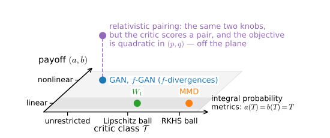

# Adversarial Objectives and Divergences
:label:`sec_gan_objectives`

:numref:`sec_basic_gan` analyzed one adversarial game to the end. The quantity it evaluates is the Jensen--Shannon divergence, its optimal critic is the log density ratio $\lambda = \log(p/q)$, and its failure is exact: once the supports of $p$ and $q$ separate, the divergence sits at its ceiling $\log 2$ and the generator's gradient is zero, however far apart the two distributions lie. Before repairing the game it is worth asking what the alternatives are. The log loss was one choice among many, and an unconstrained critic was another; changing either choice changes the quantity the game evaluates. This section maps the resulting space. It answers two questions: which quantities can an adversarial game evaluate at the optimal critic, and which of those quantities keep a usable gradient when the supports come apart.

The classical objectives can be organized by a single template with two independent choices: the payoff and the critic class. Varying the payoff over classification losses produces divergences that average a convex function of the density ratio. Constraining the critic instead produces integral probability metrics, including the maximum mean discrepancy and the Wasserstein distance. The two families behave differently when supports separate. We compare them in a deterministic separation experiment, train one generator under four losses, and verify the density-ratio function recovered by each critic. The analysis is at the population level, with exact expectations and unrestricted critics unless a constraint is stated. We use the notation of :numref:`sec_basic_gan`: data $p$, generator $q$, mixture $m = (p+q)/2$, ratio $\rho = p/q$, and log ratio $\lambda = \log \rho$.

```{.python .input #objectives-adversarial-objectives-and-divergences}
%%tab pytorch
%matplotlib inline
from d2l import torch as d2l
import numpy as np
import torch
from torch import nn
```

```{.python .input #objectives-adversarial-objectives-and-divergences}
%%tab jax
%matplotlib inline
from d2l import jax as d2l
import jax
from jax import numpy as jnp
from flax import nnx
import numpy as np
import optax
```

## A Common Template and Two Choices

The value function of :numref:`sec_basic_gan` rewards the critic on real samples through $\log \sigma(D)$ and on generated samples through $\log \sigma(-D)$. Abstracting the two rewards into a pair of scalar functions gives the template

$$
d(p, q) \;=\; \sup_{T \in \mathcal{T}} \Big\{ E_{x \sim p}\big[a(T(x))\big] - E_{x' \sim q}\big[b(T(x'))\big] \Big\},
$$
:eqlabel:`eq_gan_template`

where $T$ ranges over a class $\mathcal{T}$ of critics and $a$ and $b$ are fixed payoff functions. The log-loss game is the instance $a(t) = \log \sigma(t)$, $b(t) = -\log \sigma(-t)$, with $\mathcal{T}$ unrestricted. The template has two settings that can be varied independently, and they generate the two families this section studies.

The first setting keeps the critic unconstrained and varies the payoff. Because no constraint couples the critic's values at different points, the supremum decouples: it can be solved separately at each $x$, exactly as the pointwise maximization of :numref:`sec_basic_gan` was, and the resulting closed form depends on $p$ and $q$ only through the ratio $\rho(x)$. This family is the f-divergences, and the original GAN belongs to it.

The second setting makes the payoff linear, $a = b = \mathrm{id}$, and restricts $\mathcal{T}$ to a ball. The supremum no longer decouples; it becomes a constrained linear problem over the whole function class, and a closed form exists only for particular balls. This family is the integral probability metrics: a kernel ball gives the maximum mean discrepancy, a Lipschitz ball gives the Wasserstein-1 distance. :numref:`fig_gan_template` lays the two settings out as a plane.

![The design space of adversarial objectives. One axis varies the payoff functions applied to the critic's scores; the other varies the class the critic is drawn from. Unconstrained critics with nonlinear payoffs give the f-divergence family, which contains the original GAN and the f-GAN construction; linear payoffs with a constrained critic class give the integral probability metrics, with MMD from a kernel ball and the Wasserstein-1 distance from a Lipschitz ball. The relativistic pairing objective treated later in this chapter scores pairs of samples, is quadratic rather than affine in the pair of distributions, and therefore lies outside this plane.](../img/mdl-gan-template.svg)
:label:`fig_gan_template`

One structural property comes with the template for free. For each fixed critic the bracketed functional is affine in the pair $(p, q)$, and a supremum of affine functionals is jointly convex; every objective of the form :eqref:`eq_gan_template` is therefore convex in the generator's distribution. Convexity rules out one class of pathology, spurious local minima in distribution space, but it does not by itself make the outer minimization over $q$ well posed: existence and attainment of a minimizer need conditions, lower semicontinuity and tightness among them, that this chapter does not develop, and convexity in $q$ says nothing about the network parameters through which $q$ is actually moved. Not every adversarial objective fits the template. An objective that scores a real sample and a generated sample jointly, as the pairing objective later in this chapter does, depends on the product $p \otimes q$ and is quadratic in the pair; none of the conclusions below transfer to it automatically.

## Proper Losses and Their Divergences

### The Bayes-Risk Gap

Nothing in the pointwise maximization of :numref:`sec_basic_gan` used the particular shape of the logistic payoff, so we replace it. Let $\ell$ be a payoff function scoring the critic's output, and let the critic collect $\ell(D(x))$ on real samples and $\ell(-D(x'))$ on generated ones:

$$
V_\ell(D) \;=\; E_{x \sim p}\big[\ell(D(x))\big] + E_{x' \sim q}\big[\ell(-D(x'))\big].
$$
:eqlabel:`eq_gan_margin`

The choice $\ell = \log \sigma$ recovers the log-loss game; practical systems substitute other payoffs freely, and the question is what each substitution computes. The classification reading of :numref:`sec_basic_gan` carries over verbatim: draw a balanced label, then a sample from $p$ or $q$ accordingly, and interpret $-\ell$ as the loss the critic pays for its score under that label. Maximizing $V_\ell$ is minimizing the classifier's expected loss.

The maximization again decouples across points. At each $x$ the integrand is $p\,\ell(t) + q\,\ell(-t)$ with $t = D(x)$, and factoring out $p + q = 2m$ turns it into $2m(x)$ times an average under the posterior $\eta(x) = p(x)/(p(x)+q(x))$. The best score the critic can achieve at posterior $\eta$ defines the *conditional Bayes risk* of the loss,

$$
L(\eta) \;=\; \inf_{t} \Big\{ \eta \, \big({-\ell(t)}\big) + (1 - \eta)\, \big({-\ell(-t)}\big) \Big\},
$$

the smallest expected loss available to a critic that knows the posterior exactly. As an infimum of affine functions of $\eta$, the Bayes risk is concave, whatever the payoff. Substituting the pointwise optimum back into :eqref:`eq_gan_margin` gives $\sup_D V_\ell(D) = -2\,E_{x \sim m}[L(\eta(x))]$.

The supremum still carries a loss-dependent offset: a critic that ignores its input already achieves the risk $L(\tfrac12)$, the Bayes risk at the prior, whatever the distributions. Subtracting this baseline leaves the part that observation contributes. The *Bayes-risk gap*

$$
\Delta_\ell(p, q) \;=\; L(\tfrac12) - E_{x \sim m}\big[L(\eta(x))\big]
$$
:eqlabel:`eq_gan_bayes_gap`

measures how much observing the sample reduces the best achievable loss, and it is the calibrated value of the game: $\sup_D V_\ell = 2\Delta_\ell - 2 L(\tfrac12)$, an affine function of the gap. The gap is nonnegative by Jensen's inequality, since $L$ is concave and $E_m[\eta] = \tfrac12$, so observing can only help. For the log loss, $L$ is the binary entropy, $L(\tfrac12) = \log 2$, and :eqref:`eq_gan_bayes_gap` is the mutual information between a sample and its origin, which :numref:`sec_basic_gan` identified with $\mathrm{JS}(p, q)$. Every other payoff produces its own gap, and the next result says what kind of quantity every such gap is.

### Every Gap Is an f-Divergence

Recall from :eqref:`eq_mdl-f-div-def` that an f-divergence averages a convex function of the density ratio, $D_f(p \,\|\, q) = E_{x \sim q}[f(\rho(x))]$, where the *generator* $f$ is convex with $f(1) = 0$; :numref:`sec_mdl-f-divergences` proves nonnegativity, collects the standard examples, and records the boundary conventions that apply where one density vanishes. Throughout this chapter the symbol $f$ is reserved for these generators.

**Proposition.** *For any loss with concave Bayes risk $L$,*

$$
\Delta_\ell(p, q) \;=\; D_f(p \,\|\, q)
\qquad \textrm{with} \qquad
f(u) \;=\; L(\tfrac12) - \frac{u+1}{2}\, L\!\left(\frac{u}{u+1}\right),
$$

*and this $f$ is convex with $f(1) = 0$.*

**Proof.** Substitute $u = \rho = p/q$, so that $m = q\,(u+1)/2$ and $\eta = u/(u+1)$. Then

$$
E_{x \sim m}\big[L(\eta(x))\big] = \int q \, \frac{u+1}{2}\, L\!\left(\frac{u}{u+1}\right),
$$

and since $\int q = 1$ the constant $L(\tfrac12)$ can be moved inside the integral, giving $\Delta_\ell = \int q\, f(u) = E_q[f(\rho)]$. For convexity, write the concave $L$ as the lower envelope of its tangent lines, $L(v) = \inf_s \{\alpha_s v + \beta_s\}$. Then

$$
(u+1)\, L\!\left(\frac{u}{u+1}\right) = \inf_s \big\{ \alpha_s u + \beta_s (u+1) \big\}
$$

is an infimum of affine functions of $u$, hence concave, so $f$ is convex; and $f(1) = L(\tfrac12) - L(\tfrac12) = 0$. $\blacksquare$

The envelope step is the same device that :numref:`sec_mdl-f-gan-dual` uses to draw a convex generator as the upper envelope of its tangents, run here in the concave direction. The proposition turns the choice of discriminator loss into a choice of divergence: the game :eqref:`eq_gan_margin` evaluates, at its optimal critic, the f-divergence whose generator is built from the loss's Bayes risk. What the choice does *not* move is the critic itself. The pointwise optimum at every $x$ is a fixed transform of the posterior $\eta(x)$, hence of the log ratio $\lambda(x)$; different losses read the same ratio through different *links*. The logistic loss reports $\lambda$ itself, as :numref:`sec_basic_gan` derived; the least-squares loss reports the posterior $\sigma(\lambda)$; the hinge loss reports only the sign of $\lambda$. The experiment at the end of this section puts three trained critics next to these three predictions.

### The Loss Selects the Divergence

The following table evaluates :eqref:`eq_gan_bayes_gap` for the losses in common use. Notation: $H_b(\eta) = -\eta \log \eta - (1-\eta)\log(1-\eta)$ is the binary entropy, $\mathrm{TV}(p, q) = \tfrac12 \int |p - q|$ the total variation distance, and $H^2(p, q) = 1 - \int \sqrt{pq}$ the squared Hellinger distance. The square row scores probabilities against zero--one targets, which is the coding LSGAN uses; the $\pm 1$-coded margin form of the same loss scales both the Bayes risk and the gap by four, so either coding gives triangular discrimination up to scale. The hinge and zero--one rows have set-valued optima at $\eta = \tfrac12$, and the link column lists the optimum elsewhere.

| loss | Bayes risk $L(\eta)$ | $L(\tfrac12)$ | value $\Delta_\ell(p,q)$ | optimal critic |
|:---|:---|:---|:---|:---|
| logistic | $H_b(\eta)$ | $\log 2$ | $\mathrm{JS}(p,q)$ | $\lambda$ |
| square (Brier) | $\eta(1-\eta)$ | $1/4$ | $\tfrac{1}{8}\int \frac{(p-q)^2}{p+q}$ | $\sigma(\lambda)$ |
| exponential | $2\sqrt{\eta(1-\eta)}$ | $1$ | $H^2(p,q)$ | $\lambda / 2$ |
| hinge | $2\min(\eta, 1-\eta)$ | $1$ | $\mathrm{TV}(p,q)$ | $\operatorname{sign} \lambda$ |
| zero--one | $\min(\eta, 1-\eta)$ | $1/2$ | $\tfrac12\,\mathrm{TV}(p,q)$ | $\operatorname{sign} \lambda$ |

Two rows are commonly misread. The square row is the objective of LSGAN :cite:`Mao.Li.Xie.ea.2017`, whose analysis describes the generator as minimizing a Pearson $\chi^2$ divergence. The description invites a misreading, because the $\chi^2$ in question is measured against the mixture: $\chi^2(p \,\|\, m) = \tfrac12 \int (p-q)^2/(p+q)$, which is symmetric in $p$ and $q$, bounded by one, and equal up to scale to the *triangular discrimination* in the table's square row --- a different object from the unbounded, asymmetric $\chi^2(p \,\|\, q)$ in the gallery of :numref:`sec_mdl-f-divergences`. Exercise 3 checks the correspondence numerically, scale factor included. The hinge row states that the value of the hinge game is exactly total variation, as the table's calculation shows. The hinge loss entered adversarial training through the Geometric GAN of :citet:`Lim.Ye.2017`, who motivated it by the maximum-margin geometry of support vector machines; the total-variation reading is the same loss seen through its Bayes-risk gap.

## f-Divergences from Duality

The proposition maps losses to divergences in one direction only. It does not characterize which f-divergences arise from a loss, and at least one important divergence does not. Every gap is bounded, $\Delta_\ell \leq L(\tfrac12)$, because Bayes risks of nonnegative losses are nonnegative. The unbounded forward KL minimized by maximum likelihood therefore cannot be the value of a game in the family above. The proposition also does not show how to construct a trainable objective from a divergence chosen in advance. Fenchel duality supplies that construction.

The construction is proved in :numref:`sec_mdl-f-gan-dual` and we restate it. For a convex generator $f$ with conjugate $f^*(t) = \sup_u \{ut - f(u)\}$ (the convex conjugate of :numref:`subsec_mdl-convex-conjugate`), every critic $T$ gives a lower bound

$$
D_f(p \,\|\, q) \;\geq\; E_{x \sim p}\big[T(x)\big] - E_{x' \sim q}\big[f^*(T(x'))\big],
$$
:eqlabel:`eq_gan_fgan_bound`

with the supremum over $T$ attaining equality. The right-hand side is the template :eqref:`eq_gan_template` with $a = \mathrm{id}$ and $b = f^*$, it asks only for expectations that minibatches can estimate, and training a network $T$ against it is the f-GAN construction :cite:`Nowozin.Cseke.Tomioka.2016`.

:numref:`sec_mdl-f-gan-dual` also identifies the critic that attains the bound. Multiplying the Fenchel--Young inequality $f(u) \geq ut - f^*(t)$ by $q(x)$ at $u = \rho(x)$ and $t = T(x)$, then integrating, proves the result. Equality holds precisely when $t$ is a slope of $f$ at $u$. For differentiable $f$ the bound is therefore attained at

$$
T^\star(x) \;=\; f'\big(\rho(x)\big),
$$
:eqlabel:`eq_gan_tstar`

and at nothing else where $f$ is strictly convex. Since $f$ is convex, $f'$ is nondecreasing, so $T^\star$ is a monotone reparameterization of the density ratio. Equation :eqref:`eq_gan_tstar` states in one formula what the table's link column showed row by row: an unconstrained adversarial critic is a density-ratio estimator, whatever the objective, and the choice of $f$ decides only which transform of the ratio the critic reports and hence how estimation errors are weighted across the sample space. As a concrete instance, the forward KL generator $f(u) = u \log u$ has conjugate $f^*(t) = e^{t-1}$, obtained by maximizing $ut - u\log u$ at $u = e^{t-1}$, so its game is $\sup_T \{ E_p[T] - E_q[e^{T-1}] \}$ with optimal critic $T^\star = 1 + \log \rho = 1 + \lambda$. The experiment below trains exactly this critic and checks it against the formula.

One implementation detail is forced by the conjugate. The bound :eqref:`eq_gan_fgan_bound` is $-\infty$ whenever $T$ leaves the domain of $f^*$, so a network implementing $T$ must map into that domain, and the standard recipe reads the required output activation off the conjugate's domain :cite:`Nowozin.Cseke.Tomioka.2016`. The forward KL conjugate is finite on all of $\mathbb{R}$ and needs no activation; the reverse KL conjugate is finite only for $t < 0$, enforced by $-\mathrm{softplus}$; the GAN generator below is finite for $t < \log 2$, enforced by $\log 2 - \mathrm{softplus}$.

The family contains the game this chapter started from. Take $f(u) = u \log u - (u+1)\log\frac{u+1}{2}$, twice the Jensen--Shannon generator of :numref:`sec_mdl-f-divergences`, so that $D_f = 2\,\mathrm{JS}$; its conjugate is $f^*(t) = -\log(2 - e^t)$ on $t < \log 2$ (Exercise 5 derives it). Reparameterize the critic through the realness logit, $T = \log(2\sigma(D))$, which satisfies the domain constraint automatically. Then

$$
f^*(T) = -\log\big(2 - 2\sigma(D)\big) = -\log 2 - \log \sigma(-D),
\qquad
T = \log 2 + \log \sigma(D),
$$

and substituting both into :eqref:`eq_gan_fgan_bound` gives $E_p[T] - E_q[f^*(T)] = 2\log 2 + V(D)$, the value function of :numref:`sec_basic_gan` shifted by a constant. Taking suprema recovers the value $2\,\mathrm{JS} - 2\log 2$ exactly. The original GAN is the Jensen--Shannon row of the f-GAN family, written in a different parameterization of the same critic.

## Integral Probability Metrics

The second setting of the template moves the modeling burden from the payoff to the critic class. With linear payoffs the objective becomes

$$
d_{\mathcal{F}}(p, q) \;=\; \sup_{h \in \mathcal{F}} \Big\{ E_{x \sim p}\big[h(x)\big] - E_{x' \sim q}\big[h(x')\big] \Big\},
$$
:eqlabel:`eq_gan_ipm`

the integral probability metric of :eqref:`eq_mdl-ipm-def`: the largest gap in expectation that any test function in $\mathcal{F}$ can certify. If the class is symmetric, so that $h \in \mathcal{F}$ implies $-h \in \mathcal{F}$, then $d_{\mathcal{F}}$ is symmetric and satisfies the triangle inequality, since a supremum of sums is at most the sum of suprema. The family therefore consists of (pseudo)metrics rather than divergences. Because the payoff is linear, the supremum no longer decouples across points and cannot be reduced to the density ratio $\rho(x)$. Its value is determined by the functions included in $\mathcal{F}$. Two choices of ball are especially important in practice.

### Maximum Mean Discrepancy

Taking $\mathcal{F}$ to be the unit ball of a reproducing kernel Hilbert space with kernel $k$ gives the maximum mean discrepancy of :numref:`sec_mdl-ipm-mmd`. The supremum over the ball is attained in closed form, and its square expands into three kernel expectations, :eqref:`eq_mdl-mmd2`: similarity within $p$, plus similarity within $q$, minus twice the similarity across :cite:`Gretton.Borgwardt.Rasch.ea.2012`. For a *fixed* kernel, an MMD generator therefore needs neither a critic network nor an inner optimization loop. This simplification depends entirely on choosing the kernel in advance. Replacing raw inputs by learned features makes the feature representation part of the model again; :numref:`sec_dcgan` encounters this dependence when it uses KID for evaluation. The unbiased estimator of :eqref:`eq_mdl-mmd2` also requires all within-minibatch pairs, or $O(n^2)$ kernel evaluations for batch size $n$.

### Wasserstein-1

Taking $\mathcal{F}$ to be the ball of 1-Lipschitz functions gives the Wasserstein-1 distance by the Kantorovich--Rubinstein duality proved as :eqref:`eq_mdl-kr-dual` in :numref:`sec_mdl-optimal-transport`. The supremum of $E_p[h] - E_q[h]$ over functions with slope at most one equals the minimum cost of transporting the mass of $p$ onto $q$.

Unlike the kernel ball, the Lipschitz ball admits no closed-form supremum in general. A WGAN therefore trains a critic network to approximate the dual and must enforce the constraint approximately :cite:`Arjovsky.Chintala.Bottou.2017`. The original proposal used weight clipping. Later methods introduced a gradient penalty that encourages $\|\nabla h\| \approx 1$ :cite:`Gulrajani.Ahmed.Arjovsky.ea.2017` or spectral normalization of the layers :cite:`Miyato.Kataoka.Koyama.ea.2018`. These mechanisms provide different guarantees. Clipping and spectral normalization bound the product of layerwise Lipschitz constants, often loosely. A gradient penalty regularizes norms only at sampled points and provides no global bound. :numref:`sec_mdl-optimal-transport` discusses these distinctions in detail.

Two closed forms remain useful. In one dimension, the distance is the area between the two CDFs, :eqref:`eq_mdl-w1-cdf`. A pure translation by $d$ therefore costs exactly $|d|$: the shift map supplies a coupling with that cost, and the 1-Lipschitz functions $h(x) = \pm x$ show that no cheaper coupling exists. The experiment below uses this formula. The second closed form, the Wasserstein-2 distance between Gaussians, appears in :numref:`sec_dcgan` as the basis of FID.

## Which Objectives Give Gradients

The two families disagree about the failure that closed :numref:`sec_basic_gan`. An f-divergence integrates a function of the pointwise ratio $\rho(x)$. When the supports of $p$ and $q$ are disjoint, this ratio is $0$ or $\infty$ at every point, so no pointwise quantity records the distance between the supports. The divergence is constant in their separation and the generator's gradient vanishes. For two point masses, every f-divergence has the same value at distance $d = 10^{-6}$ as at $d = 10^{6}$, as :numref:`sec_mdl-optimal-transport` computes. For an unbounded generator $f$, this constant may be infinite. The no-gradient statement is therefore exact for bounded, saturating members of the family and applies to the others through appropriate limits.

An integral probability metric instead evaluates test functions on both distributions. If every function in the class varies smoothly in space, the value changes continuously as the supports move. This smoothness is not automatic. Total variation is the one nontrivial member of both families :cite:`Sriperumbudur.Fukumizu.Gretton.ea.2009`: it is the IPM of the sup-norm ball, yet it saturates on disjoint supports because that ball contains arbitrarily sharp indicator-like functions. An IPM provides a useful gradient only when its test class reflects the geometry of the sample space, as a Lipschitz ball or a kernel with a length scale does.

### Divergence Against Separation

We can compare the two behaviors directly. Give the two point masses a finite width by taking $p = \mathcal{N}(0, 1)$ and $q = \mathcal{N}(d, 1)$ on the line, and vary the separation $d$ from complete overlap to well-separated densities. All three quantities can then be evaluated without sampling error. The Jensen--Shannon divergence has no closed form, but fixed-grid quadrature evaluates it deterministically to high accuracy. The Wasserstein-1 distance of a translation is $|d|$, from the CDF formula. For the RBF kernel with length scale $\ell$, the kernel expectations between Gaussians are Gaussian integrals, giving

$$
\mathrm{MMD}^2(p, q) \;=\; \frac{2\ell}{\sqrt{\ell^2 + 2}} \left( 1 - \exp\!\left( -\frac{d^2}{2(\ell^2 + 2)} \right) \right).
$$
:eqlabel:`eq_gan_mmd_gauss`

Both JS and MMD are bounded, so we plot each as a fraction of its own ceiling, $\log 2$ and $2\ell/\sqrt{\ell^2 + 2}$ respectively, and scale $W_1$, which has no ceiling, by its value at the right edge of the sweep. The kernel length scale is set to $\ell = 4$, comparable to the range of separations probed; this choice matters and we return to it.

```{.python .input #objectives-divergence-against-separation}
%%tab pytorch, jax
xs = np.linspace(-10.0, 18.0, 5601)           # fixed quadrature grid

def normal_pdf(x, mu, sigma=1.0):
    return np.exp(-(x - mu) ** 2 / (2 * sigma ** 2)) / np.sqrt(
        2 * np.pi * sigma ** 2)

def js_1d(p, q):
    m = (p + q) / 2
    return 0.5 * np.trapezoid(p * np.log(p / m) + q * np.log(q / m), xs)

ell = 4.0                                      # RBF kernel length scale
seps = np.linspace(0.0, 8.0, 81)
js = np.array([js_1d(normal_pdf(xs, 0.0), normal_pdf(xs, d)) for d in seps])
w1 = seps                                      # translation: W1 = |d| exactly
ceiling = 2 * ell / np.sqrt(ell ** 2 + 2)
mmd2 = ceiling * (1 - np.exp(-seps ** 2 / (2 * (ell ** 2 + 2))))
print(f'JS at d = 8: {js[-1]:.6f} nats (ceiling log 2 = {np.log(2):.6f})')
d2l.plot(seps, [js / np.log(2), mmd2 / ceiling, w1 / 8],
         xlabel='separation d', ylabel='fraction of ceiling',
         legend=['JS / log 2', 'MMD$^2$ / ceiling', '$W_1$ / 8'],
         figsize=(5, 3))
```

The three curves behave as the definitions predict. The Jensen--Shannon curve rises while the densities overlap and then approaches its ceiling. At a separation of about seven standard deviations it is within a tenth of a percent of $\log 2$, and its slope is numerically negligible. A generator driven only by this value therefore receives almost no information about $d$ once the overlap disappears. The unscaled $W_1$ equals $d$, so its slope remains one at every separation; the plot divides it by its value at the right edge. The MMD curve also retains a visible slope across this sweep, but its ceiling is approached on the scale of the kernel length $\ell$. A fixed bounded kernel therefore becomes insensitive at sufficiently large distances. If $\ell$ were much smaller, the MMD curve would flatten inside the plotted range. The length scale determines the range of separations over which MMD supplies a useful gradient.

### One Testbed, Four Losses

The table of losses made a two-part claim: every row's divergence vanishes exactly at $q = p$, so the losses agree about the destination, while the divergences and links differ, so they need not agree about the route. To test both parts we train one generator on one target under four objectives --- the non-saturating logistic loss of :numref:`sec_basic_gan`, least squares :cite:`Mao.Li.Xie.ea.2017`, hinge :cite:`Lim.Ye.2017`, and MMD with the fixed kernel, which needs no critic --- with the supports overlapping throughout, so that the saturation pathology stays out of the way and the fixed-point claim is the one on trial. The comparison holds architecture, learning rates, and update counts fixed across the four losses rather than tuning each, so the route differences below partly reflect the losses' scales and links, and that is the reading the section gives them.

The target is a two-dimensional mixture of three Gaussians. For the generator we borrow the device that made :numref:`sec_basic_gan` verifiable: there a linear generator kept $q$ Gaussian with parameters readable off the weights; here the generator draws one of three components uniformly and applies a learned affine map, $x' = \mu_c + z A_c$, so that $q$ is itself a three-component Gaussian mixture whose density we can evaluate in closed form at every training step. The analytic $q$ buys two measurements no sample cloud can provide: the exact $\mathrm{JS}(p, q_t)$ along every trajectory, by quadrature on a fixed grid, and the exact log ratio $\lambda$ for the critic diagnostic that follows.

```{.python .input #objectives-one-testbed-four-losses-1}
%%tab pytorch, jax
mu_p = np.array([[0.0, 2.4], [-2.1, -1.2], [2.1, -1.2]])
A_p = np.stack([0.7 * np.eye(2)] * 3)

def mixture_logpdf(x, mus, As):
    """Log density of the uniform mixture of Gaussians N(mu_k, A_k^T A_k)."""
    comps = []
    for mu, A in zip(mus, As):
        Sigma, diff = A.T @ A, x - mu
        sol = np.linalg.solve(Sigma, diff.T).T
        comps.append(-0.5 * ((diff * sol).sum(1)
                             + np.log(np.linalg.det(2 * np.pi * Sigma))))
    comps = np.stack(comps) - np.log(len(mus))
    cmax = comps.max(axis=0)
    return cmax + np.log(np.exp(comps - cmax).sum(axis=0))

def sample_mixture(n, mus, As, rng):
    c = rng.integers(0, len(mus), n)
    z = rng.standard_normal((n, 2))
    return np.einsum('ni,nij->nj', z, As[c]) + mus[c]

grid_1d = np.linspace(-7.0, 7.0, 281)
gx, gy = np.meshgrid(grid_1d, grid_1d)
grid_2d = np.stack([gx.ravel(), gy.ravel()], axis=1)
cell_area = (grid_1d[1] - grid_1d[0]) ** 2

def js_mixtures(mus_q, As_q):
    """JS(p, q) between two known mixtures, by quadrature on a fixed grid."""
    logp = mixture_logpdf(grid_2d, mu_p, A_p)
    logq = mixture_logpdf(grid_2d, mus_q, As_q)
    p, q = np.exp(logp), np.exp(logq)
    logm = np.log(np.maximum((p + q) / 2, 1e-300))
    return 0.5 * (p * (logp - logm) + q * (logq - logm)).sum() * cell_area

def farthest_point_init(X, K):
    idx = [0]
    for _ in range(K - 1):
        dist = np.min(np.linalg.norm(X[:, None] - X[idx][None], axis=2),
                      axis=1)
        idx.append(int(np.argmax(dist)))
    return X[idx]
```

The generator's component means are initialized at three data points chosen by a farthest-point traversal of one batch, a common seeding for mixture fitting; the component maps start well below the data's spread, so shapes, scales, and positions all remain to be learned, and the initial mismatch is over half a nat of JS. The critic is a small leaky-ReLU network, built by a factory so that every run starts identically.

```{.python .input #objectives-one-testbed-four-losses-2}
%%tab pytorch
class MixtureGenerator(nn.Module):
    """x = mu_c + z A_c for a uniformly drawn component c."""
    def __init__(self, init_mu):
        super().__init__()
        K = len(init_mu)
        g = torch.Generator().manual_seed(0)
        self.mu = nn.Parameter(torch.tensor(init_mu, dtype=torch.float32))
        self.A = nn.Parameter(0.4 * torch.eye(2).repeat(K, 1, 1)
                              + 0.05 * torch.randn(K, 2, 2, generator=g))

    def forward(self, z, c):
        return torch.einsum('ni,nij->nj', z, self.A[c]) + self.mu[c]

    def params_np(self):
        return (self.mu.detach().numpy().copy(),
                self.A.detach().numpy().copy())

def make_critic():
    torch.manual_seed(1)
    return nn.Sequential(nn.Linear(2, 64), nn.LeakyReLU(0.2),
                         nn.Linear(64, 64), nn.LeakyReLU(0.2),
                         nn.Linear(64, 1))

rng = np.random.default_rng(42)
init_mu = farthest_point_init(sample_mixture(256, mu_p, A_p, rng), 3)
print(f'JS(p, q) at initialization: '
      f'{js_mixtures(*MixtureGenerator(init_mu).params_np()):.3f} nats')
```

```{.python .input #objectives-one-testbed-four-losses-2}
%%tab jax
class MixtureGenerator(nnx.Module):
    """x = mu_c + z A_c for a uniformly drawn component c."""
    def __init__(self, init_mu):
        K = len(init_mu)
        key = jax.random.PRNGKey(0)
        self.mu = nnx.Param(jnp.asarray(init_mu, jnp.float32))
        self.A = nnx.Param(0.4 * jnp.tile(jnp.eye(2), (K, 1, 1))
                           + 0.05 * jax.random.normal(key, (K, 2, 2)))

    def __call__(self, z, c):
        return jnp.einsum('ni,nij->nj', z, self.A[c]) + self.mu[c]

    def params_np(self):
        return np.asarray(self.mu[...]), np.asarray(self.A[...])

class Critic(nnx.Module):
    def __init__(self, rngs):
        self.h1 = nnx.Linear(2, 64, rngs=rngs)
        self.h2 = nnx.Linear(64, 64, rngs=rngs)
        self.out = nnx.Linear(64, 1, rngs=rngs)

    def __call__(self, x):
        h = nnx.leaky_relu(self.h1(x), 0.2)
        return self.out(nnx.leaky_relu(self.h2(h), 0.2))

rng = np.random.default_rng(42)
init_mu = farthest_point_init(sample_mixture(256, mu_p, A_p, rng), 3)
print(f'JS(p, q) at initialization: '
      f'{js_mixtures(*MixtureGenerator(init_mu).params_np()):.3f} nats')
```

The three adversarial objectives are written as paired critic and generator losses, the generator side in its non-saturating form throughout, as in :numref:`sec_basic_gan`: the least-squares generator drives its scores toward the real-label target, and the hinge generator ascends the raw score. The MMD objective is a single differentiable expression with no critic; summing the kernel over three length scales buys sensitivity at several resolutions at once, and remains one fixed kernel.

```{.python .input #objectives-one-testbed-four-losses-3}
%%tab pytorch
softplus = nn.functional.softplus
critic_losses = {
    'logistic': lambda real, fake: (softplus(-real) + softplus(fake)).mean(),
    'least squares': lambda real, fake: (((real - 1) ** 2).mean()
                                         + (fake ** 2).mean()) / 2,
    'hinge': lambda real, fake: (torch.relu(1 - real)
                                 + torch.relu(1 + fake)).mean(),
}
generator_losses = {
    'logistic': lambda fake: softplus(-fake).mean(),
    'least squares': lambda fake: ((fake - 1) ** 2).mean() / 2,
    'hinge': lambda fake: (-fake).mean(),
}

def mmd2_loss(x, y, ells=(0.5, 1.0, 2.0)):
    """Unbiased MMD^2, summed over three RBF length scales."""
    n, m = len(x), len(y)
    dxx, dyy, dxy = (torch.cdist(x, x) ** 2, torch.cdist(y, y) ** 2,
                     torch.cdist(x, y) ** 2)
    val = 0.0
    for ell in ells:
        kxx, kyy, kxy = [torch.exp(-dist / (2 * ell ** 2))
                         for dist in (dxx, dyy, dxy)]
        val = val + ((kxx.sum() - kxx.diag().sum()) / (n * (n - 1))
                     + (kyy.sum() - kyy.diag().sum()) / (m * (m - 1))
                     - 2 * kxy.mean())
    return val
```

```{.python .input #objectives-one-testbed-four-losses-3}
%%tab jax
softplus = jax.nn.softplus
critic_losses = {
    'logistic': lambda real, fake: (softplus(-real) + softplus(fake)).mean(),
    'least squares': lambda real, fake: (((real - 1) ** 2).mean()
                                         + (fake ** 2).mean()) / 2,
    'hinge': lambda real, fake: (jax.nn.relu(1 - real)
                                 + jax.nn.relu(1 + fake)).mean(),
}
generator_losses = {
    'logistic': lambda fake: softplus(-fake).mean(),
    'least squares': lambda fake: ((fake - 1) ** 2).mean() / 2,
    'hinge': lambda fake: (-fake).mean(),
}

def mmd2_loss(x, y, ells=(0.5, 1.0, 2.0)):
    """Unbiased MMD^2, summed over three RBF length scales."""
    n, m = len(x), len(y)
    dxx = ((x[:, None] - x[None]) ** 2).sum(-1)
    dyy = ((y[:, None] - y[None]) ** 2).sum(-1)
    dxy = ((x[:, None] - y[None]) ** 2).sum(-1)
    val = 0.0
    for ell in ells:
        kxx, kyy, kxy = [jnp.exp(-dist / (2 * ell ** 2))
                         for dist in (dxx, dyy, dxy)]
        val = val + ((kxx.sum() - jnp.trace(kxx)) / (n * (n - 1))
                     + (kyy.sum() - jnp.trace(kyy)) / (m * (m - 1))
                     - 2 * kxy.mean())
    return val

@nnx.jit(static_argnums=0)
def step_D(loss_name, G, D, opt_D, X, z, c):
    fake = G(z, c)                     # the generator is fixed in this step
    def loss_fn(D_):
        return critic_losses[loss_name](D_(X).squeeze(), D_(fake).squeeze())
    loss, grads = nnx.value_and_grad(loss_fn)(D)
    opt_D.update(D, grads)
    return loss

@nnx.jit(static_argnums=0)
def step_G(loss_name, G, D, opt_G, z, c):
    def loss_fn(G_):
        return generator_losses[loss_name](D(G_(z, c)).squeeze())
    loss, grads = nnx.value_and_grad(loss_fn)(G)
    opt_G.update(G, grads)
    return loss

@nnx.jit
def step_mmd(G, opt_G, X, z, c):
    def loss_fn(G_):
        return mmd2_loss(X, G_(z, c))
    loss, grads = nnx.value_and_grad(loss_fn)(G)
    opt_G.update(G, grads)
    return loss
```

The training loop alternates the two half-steps for the adversarial losses and takes plain gradient steps for MMD. Every two hundred steps it logs the exact $\mathrm{JS}(p, q_t)$, and it also stores one *snapshot* of the generator at a fixed step partway down the descent, where the fit is still an order of magnitude short of its final residual. The snapshot is the frozen, fully known imperfect generator that the critic diagnostic needs.

```{.python .input #objectives-one-testbed-four-losses-4}
%%tab pytorch
def train_toy(loss_name, steps=6000, batch=256, lr=1e-3, snap_step=1600):
    rng = np.random.default_rng(0)
    torch.manual_seed(0)
    G = MixtureGenerator(init_mu)
    opt_G = torch.optim.Adam(G.parameters(), lr)
    D = make_critic() if loss_name != 'MMD' else None
    opt_D = torch.optim.Adam(D.parameters(), 2 * lr) if D is not None else None
    trace, snapshot = [], None
    for t in range(steps):
        X = torch.tensor(sample_mixture(batch, mu_p, A_p, rng),
                         dtype=torch.float32)
        z = torch.randn(batch, 2)
        c = torch.randint(0, 3, (batch,))
        if loss_name == 'MMD':
            opt_G.zero_grad()
            mmd2_loss(X, G(z, c)).backward()
            opt_G.step()
        else:
            opt_D.zero_grad()
            critic_losses[loss_name](
                D(X).squeeze(), D(G(z, c).detach()).squeeze()).backward()
            opt_D.step()
            opt_G.zero_grad()
            generator_losses[loss_name](D(G(z, c)).squeeze()).backward()
            opt_G.step()
        if t % 200 == 0:
            trace.append(js_mixtures(*G.params_np()))
        if t == snap_step:
            snapshot = G.params_np()       # mismatch still visible here
    return G, np.array(trace), snapshot

runs = {}
for name in ['logistic', 'least squares', 'hinge', 'MMD']:
    runs[name] = train_toy(name)
    print(f'{name:14s} final JS(p, q) = '
          f'{js_mixtures(*runs[name][0].params_np()):.4f} nats')
```

```{.python .input #objectives-one-testbed-four-losses-4}
%%tab jax
def train_toy(loss_name, steps=6000, batch=256, lr=1e-3, snap_step=1600):
    rng = np.random.default_rng(0)
    G = MixtureGenerator(init_mu)
    opt_G = nnx.Optimizer(G, optax.adam(lr), wrt=nnx.Param)
    D = Critic(nnx.Rngs(1)) if loss_name != 'MMD' else None
    opt_D = nnx.Optimizer(D, optax.adam(2 * lr),
                          wrt=nnx.Param) if D is not None else None
    trace, snapshot = [], None
    for t in range(steps):
        X = jnp.asarray(sample_mixture(batch, mu_p, A_p, rng))
        z = jnp.asarray(rng.standard_normal((batch, 2)))
        c = jnp.asarray(rng.integers(0, 3, batch))
        if loss_name == 'MMD':
            step_mmd(G, opt_G, X, z, c)
        else:
            step_D(loss_name, G, D, opt_D, X, z, c)
            step_G(loss_name, G, D, opt_G, z, c)
        if t % 200 == 0:
            trace.append(js_mixtures(*G.params_np()))
        if t == snap_step:
            snapshot = G.params_np()       # mismatch still visible here
    return G, np.array(trace), snapshot

runs = {}
for name in ['logistic', 'least squares', 'hinge', 'MMD']:
    runs[name] = train_toy(name)
    print(f'{name:14s} final JS(p, q) = '
          f'{js_mixtures(*runs[name][0].params_np()):.4f} nats')
```

The printed values settle the fixed-point half of the claim: every objective ends within a few hundredths of a nat of the target, from over half a nat at initialization, although not equally close --- the hinge run's residual is consistently several times larger than the smooth losses' in both frameworks, a gap the trace plot below takes up. The panels overlay samples from each trained generator on the data, and all four place mass on all three modes with the right shapes; across reruns the residuals wobble by an order of magnitude, but the qualitative picture --- four different games, one destination, hinge trailing --- is stable.

```{.python .input #objectives-one-testbed-four-losses-5}
%%tab pytorch
fig, axes = d2l.plt.subplots(1, 4, figsize=(11, 2.9))
rng = np.random.default_rng(5)
X_real = sample_mixture(300, mu_p, A_p, rng)
for ax, name in zip(axes, runs):
    fake = sample_mixture(300, *runs[name][0].params_np(), rng)
    ax.scatter(X_real[:, 0], X_real[:, 1], s=6, c='lightgray')
    ax.scatter(fake[:, 0], fake[:, 1], s=6)
    ax.set_title(name)
    ax.set_xlim(-5, 5), ax.set_ylim(-4, 5)
fig.tight_layout()
```

```{.python .input #objectives-one-testbed-four-losses-5}
%%tab jax
fig, axes = d2l.plt.subplots(1, 4, figsize=(11, 2.9))
rng = np.random.default_rng(5)
X_real = sample_mixture(300, mu_p, A_p, rng)
for ax, name in zip(axes, runs):
    fake = sample_mixture(300, *runs[name][0].params_np(), rng)
    ax.scatter(X_real[:, 0], X_real[:, 1], s=6, c='lightgray')
    ax.scatter(fake[:, 0], fake[:, 1], s=6)
    ax.set_title(name)
    ax.set_xlim(-5, 5), ax.set_ylim(-4, 5)
fig.tight_layout()
```

The routes differ where the destinations did not. The trace of the exact $\mathrm{JS}(p, q_t)$ along each run separates the dynamics:

```{.python .input #objectives-one-testbed-four-losses-6}
%%tab pytorch
steps_axis = np.arange(len(runs['logistic'][1])) * 200
d2l.plot(steps_axis, [runs[name][1] for name in runs],
         xlabel='step', ylabel='JS(p, q_t)', yscale='log',
         legend=list(runs), figsize=(5, 3))
```

```{.python .input #objectives-one-testbed-four-losses-6}
%%tab jax
steps_axis = np.arange(len(runs['logistic'][1])) * 200
d2l.plot(steps_axis, [runs[name][1] for name in runs],
         xlabel='step', ylabel='JS(p, q_t)', yscale='log',
         legend=list(runs), figsize=(5, 3))
```

Two differences between the trajectories persist across reruns and frameworks. The MMD run, whose objective is exact from the first step, descends smoothly to the lowest residual of the four. The logistic and least-squares runs reach comparable fits only after an initial period of little progress. The hinge run moves early but settles at a residual several times larger than those of the smooth losses and remains noisier. The link column offers one explanation: the hinge critic's best response carries only the sign of $\lambda$. Near the solution, it supplies the direction of the remaining mismatch but not its magnitude, whereas the logistic and least-squares critics continue to resolve the size of the residual. This interpretation is consistent with the runs but is not a theorem about their dynamics. The exact trajectories vary because the population quantity is evaluated along stochastic optimization paths; the persistent result is that objectives with the same minimizer can produce substantially different training dynamics.

### What Each Critic Estimates

The table's link column made a sharper prediction than convergence: at its pointwise optimum, the logistic critic reports $\lambda$, the least-squares critic reports the posterior $\sigma(\lambda)$, and the hinge critic reports only $\operatorname{sign} \lambda$. The snapshot generator makes the prediction testable, because its $q$ is a known mixture and $\lambda = \log p - \log q$ is available in closed form at every point. The theorem concerns the best response to a *fixed* generator, so, as in :numref:`sec_basic_gan`, we freeze the snapshot and train a fresh critic under each loss to convergence, then compare critic outputs with the predicted transform of the analytic $\lambda$ at samples from the mixture.

```{.python .input #objectives-what-each-critic-estimates}
%%tab pytorch
mus_s, As_s = runs['logistic'][2]              # the frozen snapshot
print(f'snapshot JS(p, q) = {js_mixtures(mus_s, As_s):.3f} nats')

def best_response(loss_name, steps=3000, batch=512, lr=1e-3):
    rng = np.random.default_rng(11)
    torch.manual_seed(11)
    D = make_critic()
    opt = torch.optim.Adam(D.parameters(), lr)
    for _ in range(steps):
        X = torch.tensor(sample_mixture(batch, mu_p, A_p, rng),
                         dtype=torch.float32)
        Y = torch.tensor(sample_mixture(batch, mus_s, As_s, rng),
                         dtype=torch.float32)
        opt.zero_grad()
        critic_losses[loss_name](D(X).squeeze(), D(Y).squeeze()).backward()
        opt.step()
    return D

rng = np.random.default_rng(7)
pts = np.concatenate([sample_mixture(300, mu_p, A_p, rng),
                      sample_mixture(300, mus_s, As_s, rng)])
lam = mixture_logpdf(pts, mu_p, A_p) - mixture_logpdf(pts, mus_s, As_s)
order = np.argsort(lam)
links = {'logistic': lambda l: l,
         'least squares': lambda l: 1 / (1 + np.exp(-l)),
         'hinge': lambda l: np.sign(l)}
fig, axes = d2l.plt.subplots(1, 3, figsize=(10.5, 3.2))
for ax, name in zip(axes, links):
    D = best_response(name)
    with torch.no_grad():
        out = D(torch.tensor(pts, dtype=torch.float32)).squeeze().numpy()
    ax.scatter(lam, out, s=6)
    ax.plot(lam[order], links[name](lam[order]), 'k--', lw=1)
    ax.set_title(name), ax.set_xlabel(r'analytic $\lambda$')
axes[0].set_ylabel('critic output')
fig.tight_layout()
```

```{.python .input #objectives-what-each-critic-estimates}
%%tab jax
mus_s, As_s = runs['logistic'][2]              # the frozen snapshot
print(f'snapshot JS(p, q) = {js_mixtures(mus_s, As_s):.3f} nats')

def best_response(loss_name, steps=3000, batch=512, lr=1e-3):
    rng = np.random.default_rng(11)
    D = Critic(nnx.Rngs(11))
    opt = nnx.Optimizer(D, optax.adam(lr), wrt=nnx.Param)
    @nnx.jit
    def step(D, opt, X, Y):
        def loss_fn(D_):
            return critic_losses[loss_name](D_(X).squeeze(), D_(Y).squeeze())
        loss, grads = nnx.value_and_grad(loss_fn)(D)
        opt.update(D, grads)
        return loss
    for _ in range(steps):
        X = jnp.asarray(sample_mixture(batch, mu_p, A_p, rng))
        Y = jnp.asarray(sample_mixture(batch, mus_s, As_s, rng))
        step(D, opt, X, Y)
    return D

rng = np.random.default_rng(7)
pts = np.concatenate([sample_mixture(300, mu_p, A_p, rng),
                      sample_mixture(300, mus_s, As_s, rng)])
lam = mixture_logpdf(pts, mu_p, A_p) - mixture_logpdf(pts, mus_s, As_s)
order = np.argsort(lam)
links = {'logistic': lambda l: l,
         'least squares': lambda l: 1 / (1 + np.exp(-l)),
         'hinge': lambda l: np.sign(l)}
fig, axes = d2l.plt.subplots(1, 3, figsize=(10.5, 3.2))
for ax, name in zip(axes, links):
    D = best_response(name)
    out = np.asarray(D(jnp.asarray(pts)).squeeze())
    ax.scatter(lam, out, s=6)
    ax.plot(lam[order], links[name](lam[order]), 'k--', lw=1)
    ax.set_title(name), ax.set_xlabel(r'analytic $\lambda$')
axes[0].set_ylabel('critic output')
fig.tight_layout()
```

Three critics, trained on the same samples with three losses, recover three different transforms of the same underlying function. The logistic critic tracks the identity line; the least-squares critic traces the sigmoid; the hinge critic approximates the step at $\lambda = 0$. All three critics wander where $|\lambda|$ is large, because the mixture supplies few samples there and the objective does not constrain them off its support --- the same failure geography as in :numref:`sec_basic_gan`, and a preview of the estimation discussion below. The hinge panel adds a failure of its own: wherever one class dominates, the hinge risk is flat beyond the margin, so outputs past $\pm 1$ cost nothing there, and the scatter spilling beyond the step on both sides shows the critic exploiting that freedom. A critic trained with the hinge loss estimates the *set* where $p$ exceeds $q$, not the ratio on it; whether that coarser signal suffices depends on what the generator needs from it.

### Recovering the Ratio by Duality

The link diagnostic verified the proper-loss route to the ratio. The duality route makes its own prediction through :eqref:`eq_gan_tstar`, and for a row that no bounded loss produces: the forward KL critic should converge to $T^\star = 1 + \lambda$, and the attained objective should equal $\mathrm{KL}(p \,\|\, q)$ itself. Both sides of the check are available in closed form for a pair of known Gaussians, $p = \mathcal{N}(0, 1)$ and $q = \mathcal{N}(2, 1.5^2)$: the log ratio is a quadratic, and the divergence follows from the Gaussian KL formula that :numref:`sec_basic_gan` used. We train a small network on the objective $E_p[T] - E_q[e^{T-1}]$, which needs no output activation since the KL conjugate is finite everywhere.

```{.python .input #objectives-recovering-the-ratio-by-duality-1}
%%tab pytorch
mu0, s0, mu1, s1 = 0.0, 1.0, 2.0, 1.5
torch.manual_seed(3)
rng = np.random.default_rng(3)
net_T = nn.Sequential(nn.Linear(1, 64), nn.Tanh(),
                      nn.Linear(64, 64), nn.Tanh(), nn.Linear(64, 1))
opt = torch.optim.Adam(net_T.parameters(), lr=1e-3)
for t in range(4000):
    xp = torch.tensor(rng.normal(mu0, s0, (512, 1)), dtype=torch.float32)
    xq = torch.tensor(rng.normal(mu1, s1, (512, 1)), dtype=torch.float32)
    opt.zero_grad()
    loss = -(net_T(xp).mean() - torch.exp(net_T(xq) - 1).mean())
    loss.backward()
    opt.step()

kl_exact = np.log(s1 / s0) + (s0 ** 2 + (mu0 - mu1) ** 2) / (2 * s1 ** 2) - 0.5
xp = torch.tensor(rng.normal(mu0, s0, (100000, 1)), dtype=torch.float32)
xq = torch.tensor(rng.normal(mu1, s1, (100000, 1)), dtype=torch.float32)
with torch.no_grad():
    bound = (net_T(xp).mean() - torch.exp(net_T(xq) - 1).mean()).item()
print(f'exact KL(p || q) = {kl_exact:.4f}, attained bound = {bound:.4f}')
```

```{.python .input #objectives-recovering-the-ratio-by-duality-1}
%%tab jax
mu0, s0, mu1, s1 = 0.0, 1.0, 2.0, 1.5

class CriticT(nnx.Module):
    def __init__(self, rngs):
        self.h1 = nnx.Linear(1, 64, rngs=rngs)
        self.h2 = nnx.Linear(64, 64, rngs=rngs)
        self.out = nnx.Linear(64, 1, rngs=rngs)

    def __call__(self, x):
        return self.out(nnx.tanh(self.h2(nnx.tanh(self.h1(x)))))

rng = np.random.default_rng(3)
net_T = CriticT(nnx.Rngs(3))
opt = nnx.Optimizer(net_T, optax.adam(1e-3), wrt=nnx.Param)

@nnx.jit
def step_T(net_T, opt, xp, xq):
    def loss_fn(T_):
        return -(T_(xp).mean() - jnp.exp(T_(xq) - 1).mean())
    loss, grads = nnx.value_and_grad(loss_fn)(net_T)
    opt.update(net_T, grads)
    return loss

for t in range(4000):
    xp = jnp.asarray(rng.normal(mu0, s0, (512, 1)))
    xq = jnp.asarray(rng.normal(mu1, s1, (512, 1)))
    step_T(net_T, opt, xp, xq)

kl_exact = np.log(s1 / s0) + (s0 ** 2 + (mu0 - mu1) ** 2) / (2 * s1 ** 2) - 0.5
xp = jnp.asarray(rng.normal(mu0, s0, (100000, 1)))
xq = jnp.asarray(rng.normal(mu1, s1, (100000, 1)))
bound = float(net_T(xp).mean() - jnp.exp(net_T(xq) - 1).mean())
print(f'exact KL(p || q) = {kl_exact:.4f}, attained bound = {bound:.4f}')
```

The attained bound lands within about a percent of the exact divergence, and, as the bound property demands, from below: an imperfect critic can only underestimate an f-divergence, so an adversarially estimated divergence is systematically biased low, a caveat :numref:`sec_mdl-f-gan-dual` states in general. Plotting the trained critic against the analytic optimum shows where the remaining percent lives:

```{.python .input #objectives-recovering-the-ratio-by-duality-2}
%%tab pytorch
def normal_logpdf(x, mu, s):
    return -0.5 * ((x - mu) / s) ** 2 - np.log(s * np.sqrt(2 * np.pi))

xs_f = np.linspace(-4.0, 7.0, 401)
lam_f = normal_logpdf(xs_f, mu0, s0) - normal_logpdf(xs_f, mu1, s1)
with torch.no_grad():
    T_vals = net_T(torch.tensor(xs_f[:, None],
                                dtype=torch.float32)).squeeze().numpy()
mix = 0.5 * np.exp(normal_logpdf(xs_f, mu0, s0)) \
    + 0.5 * np.exp(normal_logpdf(xs_f, mu1, s1))
d2l.plot(xs_f, [1 + lam_f, T_vals, 8 * mix - 6], xlabel='x',
         legend=[r'$1 + \lambda$', 'trained critic T',
                 'mixture density (scaled)'],
         ylim=(-7, 3), figsize=(5, 3))
```

```{.python .input #objectives-recovering-the-ratio-by-duality-2}
%%tab jax
def normal_logpdf(x, mu, s):
    return -0.5 * ((x - mu) / s) ** 2 - np.log(s * np.sqrt(2 * np.pi))

xs_f = np.linspace(-4.0, 7.0, 401)
lam_f = normal_logpdf(xs_f, mu0, s0) - normal_logpdf(xs_f, mu1, s1)
T_vals = np.asarray(net_T(jnp.asarray(xs_f[:, None])).squeeze())
mix = 0.5 * np.exp(normal_logpdf(xs_f, mu0, s0)) \
    + 0.5 * np.exp(normal_logpdf(xs_f, mu1, s1))
d2l.plot(xs_f, [1 + lam_f, T_vals, 8 * mix - 6], xlabel='x',
         legend=[r'$1 + \lambda$', 'trained critic T',
                 'mixture density (scaled)'],
         ylim=(-7, 3), figsize=(5, 3))
```

Where the mixture density is appreciable the trained critic lies on the analytic parabola $1 + \lambda$; in the tails, where samples are rare, it flattens off and the parabola runs away without it. The critic is a density-ratio estimator exactly as far as the data can hold it to the job.

### Estimation from Samples

The gradient comparison would settle the choice of objective if every objective were equally easy to estimate. They are not, and the statistical ordering runs against the geometric one. The unbiased MMD estimator converges at the parametric rate $O(n^{-1/2})$ regardless of dimension :cite:`Gretton.Borgwardt.Rasch.ea.2012`; :citet:`Sriperumbudur.Fukumizu.Gretton.ea.2012` analyze IPM estimators more broadly. Estimating $W_1$ from samples suffers the curse of dimensionality. In dimension $d > 2$, the empirical measure converges in Wasserstein distance at rate $n^{-1/d}$ :cite:`Weed.Bach.2019`, so halving the error can require $2^d$ times as many samples.

Density-ratio estimation, required by the f-divergence family, is hardest where the ratio is extreme. The plug-in KL objective above involves second moments of $e^T$ under $q$. At the optimum these are moments of the density ratio, and they can be infinite even when the divergence is finite. Thus the ratio estimate is least reliable in precisely the regions where $p$ and $q$ differ most, as the flattened tails of the previous figure showed.

No choice dominates on every criterion. MMD has the cheapest estimator but supplies a discrepancy whose behavior depends on its kernel. Wasserstein distance preserves geometry across separated supports but is expensive to estimate in high dimensions. Density-ratio objectives can define strong discrepancies but become statistically difficult when the distributions differ sharply.

## Summary

This section organized adversarial objectives into one template with two settings. The template :eqref:`eq_gan_template` takes a supremum, over a critic class, of a payoff gap between the two distributions; it is convex in $(p, q)$ because a supremum of affine functionals is convex. Varying the payoff with an unrestricted critic produces the f-divergences: every classification loss induces, through its concave Bayes risk, the gap :eqref:`eq_gan_bayes_gap` between blind and informed play, and the proposition identified every such gap as $D_f$ with a generator built from the Bayes risk --- logistic to Jensen--Shannon, least squares to triangular discrimination, hinge to total variation. Fenchel duality then freed the family from the loss table: any $f$ yields the trainable bound :eqref:`eq_gan_fgan_bound`, attained at the critic $T^\star = f'(\rho)$, so every unconstrained critic estimates the density ratio and the objective chooses only the parameterization; the Jensen--Shannon row reproduces the value function of :numref:`sec_basic_gan` exactly. Restricting the critic instead of the payoff produces the integral probability metrics :eqref:`eq_gan_ipm`: a kernel ball gives MMD, whose supremum is analytic for a fixed kernel and needs no critic at all, and the Lipschitz ball gives $W_1$ by Kantorovich--Rubinstein duality, with the constraint enforced on a critic network in practice.

The two families divide on the question the section opened with. Objectives that see only the pointwise density ratio go blind when the supports separate, as the separation experiment computed: Jensen--Shannon flattens onto its $\log 2$ ceiling while $W_1$ keeps unit slope and a kernel MMD keeps slope out to its length scale. Objectives that evaluate geometry-respecting test functions keep a gradient --- but they are weaker discrepancies or costlier to estimate, and the estimation ordering runs opposite to the geometric one. On overlapping supports the choice mattered less than the table might suggest: four losses drove one generator to the same fixed point along different paths, and the critics differed only in which transform of $\lambda$ they reported. The map from training objectives to the divergences they idealize is collected in :numref:`sec_mdl-divergence-objective-map`, which this section has now populated with games. What no entry in the map fixes is the failure that motivated it: choosing an objective with surviving gradients means paying for it in estimation, and the alternative --- keeping the informative log-loss game but changing what the critic scores --- is where this chapter goes next.

## Exercises

1. Derive the Bayes-risk gap of the Brier loss. The Brier score predicts a probability $s \in (0, 1)$ and pays $(y - s)^2$ against the label $y \in \{0, 1\}$. Show that its conditional Bayes risk is $L(\eta) = \eta(1 - \eta)$, then evaluate :eqref:`eq_gan_bayes_gap` and confirm the table's square row, $\Delta_\ell = \tfrac18 \int (p - q)^2/(p + q)$.
1. The zero--one loss pays $1$ for a wrong sign and $0$ for a right one, so $L(\eta) = \min(\eta, 1 - \eta)$. Show from :eqref:`eq_gan_bayes_gap` that $\Delta_{0\textrm{--}1} = \tfrac12 \mathrm{TV}(p, q)$ with $\mathrm{TV} = \tfrac12 \int |p - q|$, using $\min(a, b) = \tfrac12(a + b - |a - b|)$. The hinge row's value is exactly twice this. Explain the factor of two from the Bayes risks alone, and why the two rows share the same optimal critic.
1. Verify numerically that LSGAN's divergence is the triangular discrimination. On random pairs of discrete distributions (for example, normalized draws from a Dirichlet on five outcomes), compute the square row's gap $\Delta = \tfrac14 - \sum_x m(x)\, \eta(x)(1 - \eta(x))$ with $\eta = p/(p+q)$ and $m = (p+q)/2$, and the triangular discrimination $\triangle(p, q) = \sum_x (p(x) - q(x))^2 / (p(x) + q(x))$. Confirm that $\triangle = 8\,\Delta$ to machine precision on every draw.
1. In the separation experiment, replace the RBF kernel with the linear kernel $k(x, y) = xy$, for which $\mathrm{MMD}^2(p, q) = (E_p[x] - E_q[x])^2$. For the translated pair the curve becomes $d^2$ and looks healthy. Now change the experiment so that the two distributions differ in scale instead of location, $p = \mathcal{N}(0, 1)$ and $q = \mathcal{N}(0, (1 + d)^2)$: which of the three objectives still detects the difference, and what does the linear-kernel MMD report? Relate the failure to the notion of a characteristic kernel, for which the mean embedding determines the distribution.
1. From the variational bound :eqref:`eq_mdl-f-gan-bound` with the generator $f(u) = u \log u - (u + 1) \log \frac{u+1}{2}$, derive the conjugate $f^*(t) = -\log(2 - e^t)$ and its domain $t < \log 2$, determine the output activation that a network implementing $T$ needs, and show that the reparameterization $T = \log(2\sigma(D))$ turns the bound's objective into $2 \log 2$ plus the value function of the original GAN, recovering the analysis of :numref:`sec_basic_gan`.

[Discussions](https://d2l.discourse.group/)

<!-- slides -->

::: {.slide}
::: {.cover}
[Dive into Deep Learning · §16.2]{.kicker}

Adversarial objectives and divergences<br>
**one template, two choices · every loss is a divergence · critics estimate the ratio · which objectives keep a gradient**
:::
:::

::: {.slide title="One Template Generates the Classical Objectives"}
$$d(p, q) = \sup_{T \in \mathcal{T}} \big\{ E_{x \sim p}[a(T(x))] - E_{x' \sim q}[b(T(x'))] \big\}$$

Two independent settings:

- **Payoff knob:** critic unconstrained, payoffs nonlinear → supremum decouples
  pointwise → value depends only on the ratio $p/q$ → **f-divergences**.
- **Class knob:** payoffs linear, critic restricted to a ball → constrained
  linear problem → **integral probability metrics**.

. . .

{width=70%}

Supremum of affine functionals ⇒ convex in $(p, q)$: no spurious optima in
distribution space. The pairing objective of the next section is quadratic —
outside the plane.
:::

::: {.slide title="Every Proper Loss Yields an f-Divergence"}
Replace $\log \sigma$ by any payoff $\ell$:
$V_\ell(D) = E_p[\ell(D)] + E_q[\ell(-D)]$.

. . .

The value of the game is a **Bayes-risk gap** — blind play minus informed play:

$$\Delta_\ell(p, q) = L(\tfrac12) - E_{x \sim m}\big[L(\eta(x))\big],
\qquad \eta = \frac{p}{p + q}$$

. . .

**Proposition.** $\Delta_\ell = D_f(p \,\|\, q)$ with
$f(u) = L(\tfrac12) - \tfrac{u+1}{2} L\big(\tfrac{u}{u+1}\big)$ — convex,
$f(1) = 0$. Proof: substitute $u = p/q$; concavity survives the perspective.
:::

::: {.slide title="The Loss Selects the Divergence — and the Link"}
| loss | value $\Delta_\ell$ | optimal critic |
|:---|:---|:---|
| logistic | $\mathrm{JS}(p,q)$ | $\lambda$ |
| square (LSGAN) | $\tfrac18 \int (p-q)^2/(p+q)$ | $\sigma(\lambda)$ |
| hinge | $\mathrm{TV}(p,q)$ | $\operatorname{sign} \lambda$ |

. . .

- LSGAN's "Pearson $\chi^2$" is measured against the **mixture**: symmetric,
  bounded — triangular discrimination, not the unbounded $\chi^2(p\|q)$.
- Hinge → TV from the Bayes-risk calculation; the hinge loss entered GANs via
  the max-margin view of Geometric GAN.
- Same posterior, different **links**: each loss reports its own transform of
  $\lambda$.
:::

::: {.slide title="Duality: the Optimal Critic Is f′(p/q)"}
Any $f$-divergence becomes a game (f-GAN):

$$D_f(p \,\|\, q) \;\geq\; E_p[T] - E_q[f^*(T)]$$

. . .

Fenchel–Young holds with equality at the slope:

$$T^\star = f'\!\left(\frac{p}{q}\right)$$

- Every unconstrained critic is a **density-ratio estimator**; the loss picks
  only the parameterization.
- $\operatorname{dom} f^*$ fixes the output activation; KL row: $T^\star = 1 + \lambda$, no
  activation needed.
- The JS row, reparameterized by $T = \log(2\sigma(D))$, is exactly the
  original GAN's value function.
:::

::: {.slide title="Constrain the Critic Instead: Integral Probability Metrics"}
$$d_{\mathcal{F}}(p, q) = \sup_{h \in \mathcal{F}} \big\{ E_p[h] - E_q[h] \big\}$$

- Symmetric class ⇒ a metric, not a divergence; nothing reduces to $p/q$.
- **Kernel ball → MMD:** supremum analytic for a *fixed* kernel — no critic,
  no inner loop; cost $O(n^2)$ per batch; learned features reopen the kernel
  choice (KID, :numref:`sec_dcgan`).
- **Lipschitz ball → $W_1$:** Kantorovich–Rubinstein duality; the constraint
  is enforced by clipping, gradient penalty, or spectral norm.
:::

::: {.slide title="JS Saturates; Transport and Kernels Keep Slope"}
Two unit Gaussians at separation $d$ — all three objectives evaluated without sampling error:

@!objectives-divergence-against-separation

JS flattens onto $\log 2$ once the overlap dies; $W_1 = d$ keeps slope one
forever; MMD keeps slope out to its kernel length scale — then *it* goes
blind too.
:::

::: {.slide title="Four Losses, One Fixed Point"}
Same generator, same target, four objectives — logistic, least squares,
hinge, MMD (no critic):

@!objectives-one-testbed-four-losses-5

All four land the three modes; the exact $\mathrm{JS}(p, q_t)$ traces show
the routes differ — the divergence fixes *where*, the game fixes *how*.
:::

::: {.slide title="What Each Critic Estimates"}
Freeze one imperfect generator with known density; train a fresh critic per
loss; compare with the predicted link of the analytic $\lambda$:

@!objectives-what-each-critic-estimates

Identity, sigmoid, step — three losses, three transforms of one ratio.
Critics wander where $|\lambda|$ is large and samples are scarce.
:::

::: {.slide title="The KL Critic Recovers 1 + log(p/q)"}
Train $T$ on $E_p[T] - E_q[e^{T-1}]$ between two known Gaussians:

@!objectives-recovering-the-ratio-by-duality-2

The critic sits on the analytic parabola where the data lives, and the
attained bound reaches the exact KL from below — undertrained critics
*underestimate* divergences.
:::

::: {.slide title="Estimation Runs Against Gradient Quality"}
- MMD: parametric rate $O(n^{-1/2})$, any dimension — cheapest estimator,
  weakest discrepancy.
- $W_1$: rate $n^{-1/d}$ — survives separation, pays the curse of
  dimensionality.
- Density ratio: sharpest signal, hardest where the ratio is extreme —
  moments of the ratio can be infinite at finite divergence.

. . .

No corner of the template dominates. The objective→divergence map is
collected in :numref:`sec_mdl-divergence-objective-map`.
:::

::: {.slide title="Recap"}
- One template: payoff knob and critic-class knob.
- Every proper loss → Bayes-risk gap → an f-divergence; the critic reports a
  fixed link of $\lambda$ in every row.
- Duality: $T^\star = f'(p/q)$ — adversarial critics do density-ratio
  estimation.
- IPMs constrain the critic: MMD analytic with a fixed kernel, $W_1$ from
  Lipschitz duality.
- Dichotomy, computed: ratio-based objectives saturate under separation;
  geometry-based ones keep a gradient — and cost more to estimate.
- Next: keep the log loss, change what the critic scores — pairs.
:::
