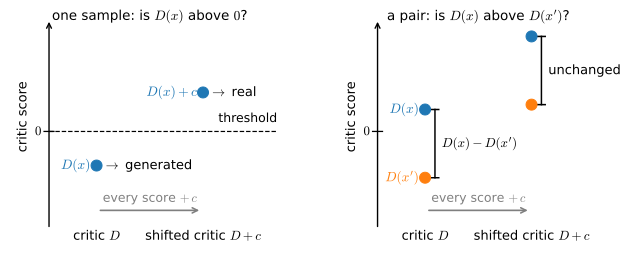

# Relativistic Objectives
:label:`sec_gan_relativistic`

:numref:`sec_gan_objectives` proposed keeping the log loss while changing what the critic scores. A relativistic critic still assigns a scalar score to each sample, but its loss compares one real and one generated sample and rewards the correct ranking. This section derives the value of that pairing game at the optimal critic. It is the Jensen--Shannon divergence between the two possible orderings of a real--generated pair, obtained by reducing the paired problem to the log-loss game of :numref:`sec_basic_gan`. We then show how pairing replaces the generator's threshold-based update weight with a rank statistic. This property motivates the objective used in R3GAN :cite:`Huang.Gokaslan.Kuleshov.ea.2024`, whose full training recipe is developed in :numref:`sec_gan_convergence` and tested on images in :numref:`sec_dcgan`. Pairing changes the landscape, but it does not prevent saturation when the supports are disjoint.

```{.python .input #relativistic-relativistic-objectives}
%%tab pytorch
%matplotlib inline
from d2l import torch as d2l
import numpy as np
```

```{.python .input #relativistic-relativistic-objectives}
%%tab jax
%matplotlib inline
from d2l import jax as d2l
import numpy as np
```

## Scoring Pairs

The construction is due to :citet:`Jolicoeur-Martineau.2019`, who called the resulting critic *relativistic*: it scores a sample relative to a sample from the opposing distribution rather than against an absolute standard. The paired form used here is abbreviated RpGAN, for relativistic *paired*, and the divergence derived below inherits the subscript. We keep the notation of :numref:`sec_basic_gan`: data density $p$, generator density $q$, ratio $\rho = p/q$, log ratio $\lambda = \log \rho$, and a critic $D$ whose value is a realness logit. Draw a real sample $x \sim p$ and a generated sample $x' \sim q$ independently, and score the pair by the difference of the two critic values:

$$
\Phi(D) \;=\; E_{x \sim p,\; x' \sim q}\big[\log \sigma\big(D(x) - D(x')\big)\big].
$$
:eqlabel:`eq_gan_rp`

The critic maximizes $\Phi$ and the generator minimizes it. Reading the objective term by term: $\sigma(D(x) - D(x'))$ is the probability the critic assigns to the correct ordering of the pair, so the critic is paid, in log-probability, for ranking the real member above the generated one, and the generator is paid for making that comparison hard.

The probability model inside :eqref:`eq_gan_rp` has appeared in this book before. $\sigma(D(x) - D(x'))$ is the Bradley--Terry probability :cite:`Bradley.Terry.1952` that $x$ is preferred to $x'$ under the score function $D$, the comparison model :eqref:`eq_bradley_terry` that :numref:`sec_regularized` fits to human preference pairs when it trains a reward model. The pairing game therefore trains the critic as a reward model for realness: $\Phi$ is the pairwise logistic log-likelihood of ranking real above fake, and maximizing it is learning to rank rather than learning to classify. The same model is how generative models are themselves ranked in public evaluations: an Elo-style leaderboard fitted to pairwise human votes is a Bradley--Terry fit with models in place of samples.

The move from classifying to ranking shows up first as a symmetry. :numref:`fig_gan_pairing` compares the two decisions the critic can be asked to make about its scores.


:label:`fig_gan_pairing`

Formally, replacing $D$ by $D + b$ for any constant $b$ leaves every difference, hence $\Phi$ itself, unchanged. The pairing game consequently identifies its critic only up to an additive constant, and this is a genuine loss of information relative to :numref:`sec_basic_gan`, whose game pins the optimal critic exactly, additive constant included. Shifting that optimum strictly lowers the classical value, as the section's first exercise shows. The invariance is visible in how :citet:`Huang.Gokaslan.Kuleshov.ea.2024` state their equilibrium condition: the critic need only be constant on the support of the data, with the constant arbitrary. (One convention note: in the R3GAN paper, $D$ is a fakeness logit, so the paper's equations become the ones in this section under the substitution $D \mapsto -D$. The released implementation already scores realness and needs no translation. We keep the realness convention throughout.)

The second structural change concerns how the objective depends on the distributions. The expectation in :eqref:`eq_gan_rp` runs over the product measure $p \otimes q$, so $\Phi$ is quadratic in the pair $(p, q)$ rather than affine. Every objective in :numref:`sec_gan_objectives` was a supremum of functionals affine in $(p, q)$. Pointwise decoupling, joint convexity, and the classification of values as f-divergences all relied on that structure and do not transfer automatically. We must therefore compute the value of the pairing game directly.

## The Value of the Pairing Game

### The Optimal Critic

The inner maximization no longer decouples across points, because each critic value $D(t)$ interacts with every other through the differences. Concavity substitutes for decoupling.

**Proposition.** *$\Phi$ is concave in $D$, and if $p$ and $q$ share a common support it is maximized at $D^\star = \lambda$, uniquely up to an additive constant.*

**Proof.** The map $D \mapsto D(x) - D(x')$ is linear and $\log \sigma$ is concave, so the integrand of :eqref:`eq_gan_rp` is concave in $D$ for every pair, and the expectation preserves concavity; a stationary point is therefore a global maximum. Perturbing $D$ at a single point $t$, that point enters $\Phi$ once as the real member of a pair and once, with opposite sign, as the generated member, and $\tfrac{d}{du} \log \sigma(u) = \sigma(-u)$ gives the functional derivative

$$
\frac{\delta \Phi}{\delta D(t)}
\;=\; p(t)\, E_{x' \sim q}\big[\sigma(D(x') - D(t))\big]
\;-\; q(t)\, E_{x \sim p}\big[\sigma(D(t) - D(x))\big].
$$
:eqlabel:`eq_gan_rp_stationarity`

At $D = \lambda$ we have $\sigma(\lambda(x') - \lambda(t)) = \rho(x')/(\rho(x') + \rho(t))$, and the identity $q\rho = p$ converts both terms into the same integral: the first becomes $p(t) \int p(x')/(\rho(x') + \rho(t))\, dx'$ and the second becomes $q(t)\, \rho(t) \int p(x)/(\rho(t) + \rho(x))\, dx$, which is the identical expression. The derivative vanishes everywhere, so $\lambda$ is a maximizer, and strict concavity of $\log \sigma$ in the score differences makes the maximizer unique up to the additive shifts that $\Phi$ cannot see. $\blacksquare$

The ranker estimates the same object as the classifier. Equation :eqref:`eq_gan_dstar` returned $D^\star = \lambda$ for the log-loss game, and the pairing game returns it again, minus only the additive constant that its shift invariance leaves undetermined. Changing the critic's task from classification to ranking changes neither what the critic computes at its optimum nor, as the theorem below confirms, the location $q = p$ of the game's fixed point. What changes is the value of the game and the shape of the objective away from the optimum, and both changes can be computed exactly.

### The Lifted Game

$\Phi$ is the expectation of a fixed function of the pair $(x, x')$ under $p \otimes q$, which suggests treating the pair itself as the observation. Let $P = p \otimes q$ and $Q = q \otimes p$ denote the two orderings of an independent real--fake pair, viewed as distributions on $\mathcal{X} \times \mathcal{X}$: under $P$ the real sample sits first, under $Q$ it sits second. These two distributions can play the log-loss game of :numref:`sec_basic_gan` on the pair space, with a pair critic $\mathcal{D}: \mathcal{X} \times \mathcal{X} \to \mathbb{R}$ in place of $D$ and the value function $V_{P,Q}(\mathcal{D})$ given by :eqref:`eq_gan_V` with $(P, Q)$ substituted for $(p, q)$. The following lemma connects that game to $\Phi$.

**Lemma (lifting).** *Let $P = p \otimes q$ and $Q = q \otimes p$. Then: (i) the log ratio of the two orderings separates, $\log \frac{dP}{dQ}(a_1, a_2) = \lambda(a_1) - \lambda(a_2)$, an antisymmetric difference of single-sample scores; (ii) every difference critic $\mathcal{D}(a_1, a_2) = D(a_1) - D(a_2)$ satisfies $V_{P,Q}(\mathcal{D}) = 2\,\Phi(D)$; (iii) restricting the pair critic to differences does not lower the supremum, $\sup_{\mathcal{D}} V_{P,Q}(\mathcal{D}) = \sup_{D} V_{P,Q}\big(D(a_1) - D(a_2)\big)$.*

**Proof.** *The product ratio separates.* The two product densities share their factors, so $\frac{dP}{dQ}(a_1, a_2) = \frac{p(a_1)\, q(a_2)}{q(a_1)\, p(a_2)} = \frac{\rho(a_1)}{\rho(a_2)}$, and taking logarithms gives (i). *The swap symmetry doubles the objective.* The first term of $V_{P,Q}(\mathcal{D})$ is $E_{(a_1, a_2) \sim P}[\log \sigma(\mathcal{D}(a_1, a_2))] = \Phi(D)$, directly from the definitions of $P$ and $\mathcal{D}$. In the second term the pair is drawn from $Q$, so $a_1 \sim q$ and $a_2 \sim p$, and antisymmetry gives $-\mathcal{D}(a_1, a_2) = D(a_2) - D(a_1)$; relabeling $(x, x') = (a_2, a_1)$, which is distributed as $p \otimes q$, turns this term into $E[\log \sigma(D(x) - D(x'))] = \Phi(D)$ as well, proving (ii). *Differences suffice.* The pointwise maximization behind :eqref:`eq_gan_dstar`, run on $\mathcal{X} \times \mathcal{X}$, identifies the optimizing pair critic with $\log \frac{dP}{dQ}$ wherever both densities are positive, and by (i) that critic is the difference critic with $D = \lambda$, so restricting the supremum to differences does not lower it. $\blacksquare$

Part (iii) depends on the logistic payoff: the pointwise optimum on the pair space is separable because the log ratio of two product measures is a sum of per-coordinate terms. Under other payoffs the Bayes-optimal pair critic is a nonlinear function of that log ratio, no longer a difference of single-sample scores, and the corresponding relativistic objective only bounds its lifted divergence from below. Exercise 6 works this out. With the lemma in hand, the value of the pairing game follows from results already proved.

**Theorem.** *Define the pairing divergence $d_{\mathrm{Rp}}(p, q) := \sup_D \Phi(D) + \log 2$. Then*

$$
d_{\mathrm{Rp}}(p, q)
\;=\; \mathrm{JS}\big(p \otimes q,\; q \otimes p\big)
\;=\; H\Big[\tfrac{1}{2}\big(p \otimes q + q \otimes p\big)\Big] - H[p] - H[q].
$$
:eqlabel:`eq_gan_rp_value`

**Proof.** *Apply the value formula on the pair space.* By parts (ii) and (iii) of the lemma, $2 \sup_D \Phi(D) = \sup_{\mathcal{D}} V_{P,Q}(\mathcal{D})$, and :eqref:`eq_gan_js_value`, applied to the pair $(P, Q)$, evaluates the right-hand side as $2\, \mathrm{JS}(P, Q) - 2 \log 2$; halving and adding $\log 2$ gives the first equality. *Collapse the pair entropies.* The entropy form :eqref:`eq_gan_entropy_gap` of the Jensen--Shannon divergence, applied on $\mathcal{X} \times \mathcal{X}$, subtracts $\tfrac12(H[P] + H[Q])$ from the mixture entropy; entropy is additive across independent components, so $H[P] = H[Q] = H[p] + H[q]$, and the subtracted average is $H[p] + H[q]$; this rearrangement assumes the entropies involved are finite, a condition the measure-level identity of the first equality does not need. $\blacksquare$

The constant in the definition of $d_{\mathrm{Rp}}$ is the value of blind play: a constant critic, which is always feasible and is the best response when $p = q$, makes every comparison a coin flip and earns $\Phi = \log \sigma(0) = -\log 2$. The divergence therefore measures the improvement that looking at the pair buys over guessing. That this improvement is nonnegative, and zero exactly at $q = p$, is what makes $d_{\mathrm{Rp}}$ a usable training objective, and it was proved by :citet:`Jolicoeur-Martineau.2020` for every concave payoff $\ell$ with $\ell(0) = 0$, $\ell'(0) \neq 0$, and positive supremum attained at a positive argument. Her theorem establishes that the value is a divergence without computing it. The theorem above computes the value for the logistic payoff, the one standard payoff for which the lifting argument is exact.

Substituting the optimal critic $D^\star = \lambda$ into :eqref:`eq_gan_rp` directly, using $\sigma(\lambda(x) - \lambda(x')) = \rho(x)/(\rho(x) + \rho(x'))$, gives the same value in a form that is convenient for expansions:

$$
d_{\mathrm{Rp}}(p, q)
\;=\; \log 2 \;-\; E_{x \sim p,\; x' \sim q}\Big[\log\Big(1 + \frac{q(x)\, p(x')}{p(x)\, q(x')}\Big)\Big].
$$
:eqlabel:`eq_gan_rp_explicit`

The mutual-information reading of :numref:`sec_basic_gan` lifts along with the value. Draw $x \sim p$ and $x' \sim q$, present the two samples in a uniformly random order, and let the bit $y$ record which position holds the real one, just as $y$ labeled the origin of a single sample in :numref:`sec_basic_gan`. The ordered pair $(a_1, a_2)$ is then a sample from the balanced mixture of $P$ and $Q$ with label $y$, and the identification of the divergence with a mutual information, applied on the pair space, gives

$$
d_{\mathrm{Rp}}(p, q) \;=\; I\big((a_1, a_2);\, y\big) \;=\; \log 2 - H\big(y \mid a_1, a_2\big).
$$
:eqlabel:`eq_gan_rp_mi`

The pairing divergence is the number of nats a randomly ordered pair carries about which member is real, just as $\mathrm{JS}(p, q)$ measures the information a single sample carries about its origin. It follows that $0 \leq d_{\mathrm{Rp}} \leq \log 2$: the ordering label contains at most one bit.

**Remark (normalization).** :citet:`Jolicoeur-Martineau.2020` defines the relativistic divergence with a leading factor of two and shifts the payoff so that $\ell(0) = 0$, taking $\log \sigma(z) + \log 2$ in the logistic case. Her divergence equals $2\, d_{\mathrm{Rp}}$, and her upper bound is $2 \log 2$ where ours is $\log 2$. Numerical comparisons across the two conventions must account for the factor.

**Remark (provenance).** We have not found the identity :eqref:`eq_gan_rp_value` in the literature. :citet:`Jolicoeur-Martineau.2020` establishes the divergence property for general concave payoffs without computing the value, and :citet:`Huang.Gokaslan.Kuleshov.ea.2024` do not compute it either. The lifting argument is short, so the identity may nonetheless be known, and the quantity $\mathrm{JS}(p \otimes q, q \otimes p)$ is natural enough that it could appear under another name, for instance in the literature on paired two-sample tests. The nearest construction we are aware of is the pairwise discriminator of :citet:`Tong.Garipov.Jaakkola.2020`, whose analysis contains the same mixture $\tfrac12(p \otimes q + q \otimes p)$. Their critic, however, answers a different question about the pair, asking whether its two members come from the same distribution (a homogeneity test rather than an ordering test), and the divergences they compute are not :eqref:`eq_gan_rp_value`.

### Bounds, Local Behavior, and Saturation

The closed form permits an exact comparison between the pairing game and the corresponding single-sample game.

**Proposition.** *For all $p$ and $q$:*

*(a) $\mathrm{JS}(p, q) \;\leq\; d_{\mathrm{Rp}}(p, q) \;\leq\; \log 2$;*

*(b) if $q = p\,(1 + \epsilon h)$ with $E_p[h] = 0$ and $h$ bounded, then $d_{\mathrm{Rp}}(p, q) = \tfrac{\epsilon^2}{4} E_p[h^2] + O(\epsilon^3) = 2\, \mathrm{JS}(p, q) + O(\epsilon^3)$;*

*(c) if $p$ and $q$ have disjoint supports, then $d_{\mathrm{Rp}}(p, q) = \log 2$, independently of how far apart the supports lie.*

**Proof.** (a) Discarding the second member of the pair, $(a_1, a_2) \mapsto a_1$, pushes $P$ forward to $p$ and $Q$ to $q$; since $\mathrm{JS}$ is an f-divergence, the data-processing inequality of :numref:`sec_mdl-tv-pinsker` gives $\mathrm{JS}(p, q) \leq \mathrm{JS}(P, Q) = d_{\mathrm{Rp}}$. The upper bound is the information ceiling of :eqref:`eq_gan_rp_mi`: $I\big((a_1, a_2); b\big) \leq H(b) = \log 2$. (b) Write $u = \lambda(x') - \lambda(x)$ in :eqref:`eq_gan_rp_explicit` and expand $\log(1 + e^u) = \log 2 + \tfrac{u}{2} + \tfrac{u^2}{8} + O(u^4)$; the moments are $E[u] = -\epsilon^2 E_p[h^2] + O(\epsilon^3)$ and $E[u^2] = 2 \epsilon^2 E_p[h^2] + O(\epsilon^3)$, so $d_{\mathrm{Rp}} = \tfrac{\epsilon^2}{2} E_p[h^2] - \tfrac{\epsilon^2}{4} E_p[h^2] + O(\epsilon^3)$, while the same expansion applied to :eqref:`eq_gan_entropy_gap` gives $\mathrm{JS} = \tfrac{\epsilon^2}{8} E_p[h^2] + O(\epsilon^3)$; Exercise 4 fills in the moment computations. (c) A real-first pair occupies $\operatorname{supp} p \times \operatorname{supp} q$ and a fake-first pair occupies $\operatorname{supp} q \times \operatorname{supp} p$; when the two supports are disjoint these product sets are disjoint, so $P$ and $Q$ are mutually singular, every pair identifies its ordering with certainty, and $\mathrm{JS}(P, Q) = \log 2$. $\blacksquare$

Part (a) says, through :eqref:`eq_gan_rp_mi`, that a pair constrained to contain exactly one real member cannot carry less information about the labeling than a single sample carries about its origin. It is the quantitative version of an ordering that :citet:`Jolicoeur-Martineau.2020` proved for general concave payoffs (driving the relativistic objective to zero forces the pointwise objective to zero), and the closed form recovers her ordering in the logistic case with a rate attached. Part (b) locates the two divergences at the other extreme: near the fixed point the two members of the pair contribute independent evidence, so the pair carries exactly twice the information of a single sample. The ratio $d_{\mathrm{Rp}}/\mathrm{JS}$ always lies in $[1, 2]$. The lower end restates part (a), and the upper end also follows from :eqref:`eq_gan_rp_mi`: the two members of the pair are independent given the label, so the pair's information is the sum of what each member carries alone, $2\, \mathrm{JS}(p, q)$, minus the members' unconditional dependence, which is nonnegative. The experiment below observes a ratio of about 1.6.

Part (c) is the negative result: pairing does not repair the failure that closed :numref:`sec_basic_gan`. On the two-point-mass example from that section's ending, $p = \delta_0$ and $q_\theta = \delta_\theta$, the pairing value sits at its ceiling $\log 2$ for every $\theta \neq 0$ and supplies no gradient in $\theta$. The parametric version is sharper still: with a linear critic on that example, the relativistic and classical objectives differ by an additive constant, so their gradient fields coincide exactly, an observation recorded by :citet:`Huang.Gokaslan.Kuleshov.ea.2024` in their appendix. The same authors prove that gradient training of the unregularized pairing game does not always converge. What the pairing objective does change is the shape of the loss landscape over generator configurations, developed next. What restores convergence of the training dynamics is regularization of the critic, and that is the subject of :numref:`sec_gan_convergence`.

## Ranking and Mode Coverage

The loss of :numref:`sec_gan_objectives`'s template structure is not total. For fixed $p$ the map $q \mapsto d_{\mathrm{Rp}}(p, q)$ is convex, because $q \mapsto p \otimes q$ is linear and grouping :eqref:`eq_gan_rp` by the generated member,

$$
d_{\mathrm{Rp}}(p, q) \;=\; \log 2 + \sup_D\, E_{x' \sim q}\big[g_D(x')\big],
\qquad
g_D(x') := E_{x \sim p}\big[\log \sigma\big(D(x) - D(x')\big)\big],
$$

exhibits the objective as a supremum of functionals linear in $q$, the structural property that made the metrics of :numref:`sec_gan_objectives` convex in the generator's distribution. What does not survive is the fixed test class: each $g_D$ is built from the data distribution itself, and it scores $x'$ by a smoothed comparison against the entire real population. The outer minimization over $q$ is therefore as well posed as it was for the template objectives, and the rank structure of the test functions is what changes the generator's incentives.

To see the change, differentiate $\Phi$ through $x' = G(z)$ as :numref:`sec_basic_gan` did for the classical game. Playing the zero-sum game literally, with the generator minimizing $\Phi$, moves each generated sample up the critic's score surface with a per-sample weight, and comparing that weight with the classical saturating weight of :eqref:`eq_gan_weights` isolates what pairing changed:

$$
w_{\mathrm{Rp}}(x') = E_{x \sim p}\big[\sigma\big(D(x') - D(x)\big)\big],
\qquad
w_{\mathrm{GAN}}(x') = \sigma\big(D(x')\big).
$$
:eqlabel:`eq_gan_rp_weights`

The classical weight measures a sample against a threshold: the critic's zero, a level fixed by the classical game but arbitrary in the pairing game. The relativistic weight is instead a rank statistic: the probability that $x'$ outranks a random real sample. Like the objective, it is invariant to an additive constant in the critic.

This distinction matters for mode collapse. A threshold can be satisfied wholesale: a generator may place all of its mass beyond one decision boundary, making every per-sample factor appear real without matching how the data distribute their mass. Collapse onto a few well-scored points has exactly this form. A rank statistic offers no corresponding shortcut because improving it requires improving the generated distribution's ranks against the entire real population.

:citet:`Sun.Fang.Schwing.2020` turn this observation into a result about the empirical loss landscape. For $n$ data points and $n$ generated points, the classical objective has at least $n^n - n!$ suboptimal strict local minima, one for every mode-dropping assignment with at least one collision. Under the relativistic objective, every configuration has a descending path to a global minimum. We use this result without reproducing its proof. It applies to a finite-sample, best-response setting and neither contradicts nor follows from part (c) of the proposition above. Pairing changes where optimization can become trapped; it does not change the objective's value on separated supports.

The rank weight saturates like its classical counterpart. If $D(x')$ sits far below every real score, then $w_{\mathrm{Rp}}(x') \approx 0$ and the worst samples again learn least. The remedy is also the classical one. Differentiating the swapped objective, in which the generator maximizes $E[\log \sigma(D(x') - D(x))]$ rather than minimizing $\Phi$, produces the same update direction with the complementary weight. The two-line computation that produced :eqref:`eq_gan_weights` repeats verbatim with the score difference in place of the score:

| generator objective | weight on the update of $x'$ | on a badly ranked sample |
|:---|:---|:---|
| zero-sum: minimize $\Phi$ | $E_{x \sim p}[\sigma(D(x') - D(x))]$ | weight $\to 0$: the update vanishes |
| non-saturating: maximize $E[\log \sigma(D(x') - D(x))]$ | $E_{x \sim p}[\sigma(D(x) - D(x'))]$ | weight $\to 1$: the update is largest |

The non-saturating swap is part of the original relativistic construction: :citet:`Jolicoeur-Martineau.2019` trains the generator this way from the start. Paper and code nevertheless differ in the modern reference. The R3GAN paper presents a zero-sum minimax game over $\Phi$, which places the generator on the saturating row of the table. Its official implementation instead maximizes $E[\log \sigma(D(x') - D(x))]$ for the generator while maximizing $\Phi$ for the critic. The implemented game is therefore not zero-sum.

The two variants share their fixed point. :numref:`sec_basic_gan` established this for the classical pair by evaluating the non-saturating loss at the optimal critic. The same calculation works here. At $D^\star = \lambda$, Jensen's inequality bounds the swapped generator loss below by $\log(1 + e^J)$, where $J = \mathrm{KL}(p \,\|\, q) + \mathrm{KL}(q \,\|\, p) \geq 0$. The loss exceeds $\log 2$ whenever $q \neq p$ and attains $\log 2$ at $q = p$.

The variants differ most at the start of training, when generated samples rank badly. Implementing the paper's displayed minimax equation literally gives the weaker, saturating update. This distinction is invisible in the equilibrium analysis but consequential during the first epochs.

The expectation over $p \otimes q$ can be estimated in two natural ways. Given $n$ real and $n$ generated samples, one may pair the $i$-th real sample with the $i$-th generated sample, giving $n$ terms, or average over all $n^2$ cross pairs. By the two-sample U-statistic theorem, the all-pairs average is the minimum-variance unbiased estimator :cite:`Jolicoeur-Martineau.2020`, but it costs $O(n^2)$ rather than $O(n)$. This is the same computational trade-off encountered for MMD in :numref:`sec_gan_objectives`. In the experiments of :citet:`Jolicoeur-Martineau.2020`, the lower-variance estimator did not improve the generator and was sometimes worse. The diagonal estimator is therefore the standard choice. The finite verification below uses neither estimator because it can evaluate $\Phi$ exactly.

## Verifying the Closed Form

The theorem is an identity, so it can be checked to many digits rather than to within noise. On a sample space of five atoms, $p$ and $q$ are two fixed probability vectors and the critic is five numbers $D \in \mathbb{R}^5$. The objective $\Phi$ becomes an exact double sum over the 25 pairs (no sampling, no estimator), and every quantity in :eqref:`eq_gan_rp_value` is computable directly, since $\mathrm{JS}(p \otimes q, q \otimes p)$ is an entropy calculation on 25 atoms. We maximize $\Phi$ by gradient ascent on the five critic values, and the ascent direction is nothing new: the gradient of $\Phi$ with respect to $D(t)$ is the functional derivative :eqref:`eq_gan_rp_stationarity` that the optimal-critic proof set to zero. Three numbers must then agree: the maximized $\Phi$ plus $\log 2$, the product-space Jensen--Shannon divergence, and the entropy form. The recovered critic must in addition equal $\lambda$ up to an additive constant.

```{.python .input #relativistic-verifying-the-closed-form-1}
%%tab pytorch, jax
p = np.array([0.35, 0.25, 0.20, 0.12, 0.08])   # data distribution
q = np.array([0.02, 0.05, 0.13, 0.30, 0.50])   # generator distribution
lam = np.log(p / q)

def entropy(v):
    return -(v * np.log(v)).sum()

def js(a, b):
    return entropy((a + b) / 2) - (entropy(a) + entropy(b)) / 2

def sigma(t):
    return 1 / (1 + np.exp(-t))

D = np.zeros(5)
for _ in range(400):   # ascend Phi along its functional derivative
    R = sigma(D[None, :] - D[:, None])         # R[i, j] = sigma(D_j - D_i)
    D += 20.0 * (p * (R @ q) - q * (p @ R))
U = D[:, None] - D[None, :]                    # U[i, j] = D_i - D_j
phi = (np.outer(p, q) * (-np.logaddexp(0.0, -U))).sum()
P, Q = np.outer(p, q).ravel(), np.outer(q, p).ravel()
print(f'sup Phi + log 2, by gradient ascent:    {phi + np.log(2):.9f}')
print(f'JS(p (x) q, q (x) p), computed directly: {js(P, Q):.9f}')
print(f'entropy form H[(P+Q)/2] - H[p] - H[q]:  '
      f'{entropy((P + Q) / 2) - entropy(p) - entropy(q):.9f}')
print(f'JS(p, q) = {js(p, q):.6f},  log 2 = {np.log(2):.6f}')
D_c, lam_c = D - D.mean(), lam - lam.mean()
print(f'max |D - lambda|, both centered:        '
      f'{np.abs(D_c - lam_c).max():.1e}')
```

The three computations of $d_{\mathrm{Rp}}$ agree to nine decimal places, and the recovered critic matches $\lambda$ up to its undetermined additive constant at the level of double-precision round-off: the identity holds as exactly as floating-point arithmetic can attest. The printed comparison also locates the pairing divergence where part (a) of the proposition requires, with $\mathrm{JS}(p, q) \approx 0.23$ below it and the ceiling $\log 2 \approx 0.69$ above it. At $d_{\mathrm{Rp}} \approx 0.38$ the pair carries about 1.6 times the information of a single sample, inside the $[1, 2]$ range established above: less than the local factor of two, which holds only near $q = p$, and more than the ratio of one that the ceiling would force.

The same atoms make the ranking discussion concrete without training anything. With the recovered critic, both weights of :eqref:`eq_gan_rp_weights` are explicit functions of a generated sample's score $t$: the threshold weight $\sigma(t)$, and the rank weight $\sum_x p(x)\, \sigma(t - D^\star(x))$, a mixture of sigmoids anchored at the real atoms' scores. The plot draws both, marking those scores.

```{.python .input #relativistic-verifying-the-closed-form-2}
%%tab pytorch, jax
ts = np.linspace(-7.0, 7.0, 401)
w_thresh = sigma(ts)
w_rank = (p[:, None] * sigma(ts[None, :] - D_c[:, None])).sum(axis=0)
d2l.set_figsize((5.5, 3.2))
d2l.plt.plot(ts, w_thresh, label=r'threshold weight $\sigma(t)$')
d2l.plt.plot(ts, w_rank,
             label=r'rank weight $E_{x \sim p}[\sigma(t - D^\star(x))]$')
for i, v in enumerate(D_c):
    d2l.plt.axvline(v, ls=':', c='gray', lw=1,
                    label='real-atom scores' if i == 0 else None)
d2l.plt.xlabel('critic score $t$ of a generated sample')
d2l.plt.ylabel('weight')
d2l.plt.legend();
```

The two curves separate as the ranking argument predicts. The threshold weight is one sigmoid centered at zero, a level the pairing game does not even determine, and its rise is tied to that level alone, indifferent to where the real population's scores lie: at the highest real score it already exceeds 0.9. The rank weight's transition is instead anchored to the dotted lines. It rises where the real scores actually lie, weighting each stratum by its mass $p(x)$, and at the highest real score it has reached only about 0.75, still separating samples that the threshold weight rates as nearly equivalent. A generated sample stops mattering to the rank weight only once it outranks essentially all of the real population. The anchoring is also what the shift symmetry promised: adding a constant to the critic changes a sample's threshold weight, but it moves the sample's score and the real atoms together, so the sample's rank weight is unchanged.

## Summary

This section changed what the critic scores and computed what the change does. Scoring a real--fake pair by the difference of two realness scores gives the pairing objective :eqref:`eq_gan_rp`, the Bradley--Terry log-likelihood of ranking real above fake, with two structural symmetries: the critic is identified only up to an additive constant, where the classical game pinned it exactly, and the objective depends on the distributions through the product $p \otimes q$, placing it outside the affine template of :numref:`sec_gan_objectives`. The optimal critic is nevertheless the same log density ratio $\lambda$, and the value of the game has a closed form: lifting the pair to a single observation shows that the pairing game is the log-loss game of :numref:`sec_basic_gan` played between the two orderings $p \otimes q$ and $q \otimes p$, so its calibrated value is $d_{\mathrm{Rp}} = \mathrm{JS}(p \otimes q, q \otimes p)$, the nats a randomly ordered pair carries about which member is real. The identity gives exact comparisons: $d_{\mathrm{Rp}}$ sits between $\mathrm{JS}(p, q)$ and $\log 2$, equals twice $\mathrm{JS}$ near the fixed point, and saturates on disjoint supports exactly as the classical value does, so pairing does not repair the separation failure.

What pairing changes is the generator's incentive structure. The per-sample update weight becomes a rank statistic against the real population instead of a threshold statistic, mode-dropping configurations lose their status as local minima of the empirical landscape :cite:`Sun.Fang.Schwing.2020`, and the saturating/non-saturating distinction of :numref:`sec_basic_gan` reappears for pairs. The practical lesson is that the R3GAN paper states the zero-sum form while its reference implementation trains the non-saturating one, so the equation and the code differ exactly where training starts. The finite verification confirmed the closed form to nine decimal places and displayed the two weights side by side. Left unresolved is convergence: the value analysis says nothing about whether alternating gradient descent finds the optimum, the unregularized pairing game provably need not converge, and :numref:`sec_gan_convergence` supplies the analysis and the regularization that fixes it.

## Exercises

1. Prove the shift invariance $\Phi(D + b) = \Phi(D)$ for every constant $b$, and conclude that the pairing game identifies its critic only up to an additive constant. Then explain why the same cancellation fails for the value function :eqref:`eq_gan_V` of :numref:`sec_basic_gan`: which of its two terms moves in which direction under the shift, and why does the trade-off strictly lower the value at the optimum?
1. Check the shift invariance numerically. On the five-atom example of the verification cell, add $b = 5$ to every entry of the recovered critic $D$ and recompute $\Phi$; confirm that the printed value is unchanged at machine precision. Then explain in one sentence why the same shift changes the value function :eqref:`eq_gan_V` of :numref:`sec_basic_gan`.
1. Unequal ordering priors. Present the pair real-first with probability $\alpha \in (0, 1)$: with probability $\alpha$ the critic receives $(x, x')$ and otherwise $(x', x)$, with $x \sim p$ and $x' \sim q$, and a pair critic is scored by the log loss for predicting which presentation occurred. Derive the optimal pair critic, the Bayes log-odds $\lambda(a_1) - \lambda(a_2) + \log \frac{\alpha}{1 - \alpha}$, and show, by adapting the lifting lemma, that the value of the game is, up to constants, the skewed divergence $\alpha\, \mathrm{KL}(P \,\|\, m_\alpha) + (1 - \alpha)\, \mathrm{KL}(Q \,\|\, m_\alpha)$ with $P = p \otimes q$, $Q = q \otimes p$, and $m_\alpha = \alpha P + (1 - \alpha) Q$. Can a pure difference critic $D(a_1) - D(a_2)$ still attain the optimum, or does the prior force a bias term?
1. Local expansion. Let $q = p\,(1 + \epsilon h)$ with $E_p[h] = 0$ and $h$ bounded. Starting from :eqref:`eq_gan_rp_explicit`, write $u = \lambda(x') - \lambda(x)$ and expand $\log(1 + e^u) = \log 2 + \tfrac{u}{2} + \tfrac{u^2}{8} + O(u^4)$. Compute $E[u] = E_q[\lambda] - E_p[\lambda]$ and $E[u^2]$ to second order in $\epsilon$, and conclude $d_{\mathrm{Rp}} = \tfrac{\epsilon^2}{4} E_p[h^2] + O(\epsilon^3)$. Then apply the corresponding expansion to the entropy form :eqref:`eq_gan_entropy_gap` to show $\mathrm{JS}(p, q) = \tfrac{\epsilon^2}{8} E_p[h^2] + O(\epsilon^3)$, so that locally $d_{\mathrm{Rp}} = 2\, \mathrm{JS} + O(\epsilon^3)$.
1. More negatives. Draw $K$ real samples $x_1, \ldots, x_K \sim p$ and one generated sample $x' \sim q$, place all $K + 1$ samples in a uniformly random order, and ask the critic which position holds the generated one. Show that the Bayes posterior for position $j$ is the softmax $e^{-\lambda(a_j)} / \sum_k e^{-\lambda(a_k)}$, and, repeating the lifting argument with $K + 1$ hypotheses in place of two, that the value of the game is the generalized Jensen--Shannon divergence of the $K + 1$ product measures $P_j = p^{\otimes (j-1)} \otimes q \otimes p^{\otimes (K - j + 1)}$, namely $H\big[\tfrac{1}{K+1} \sum_j P_j\big] - K H[p] - H[q]$, with range $[0, \log(K + 1)]$. Use $H[P_j] = K H[p] + H[q]$. The softmax over negated log ratios and the $\log(K{+}1)$ ceiling are those of the InfoNCE bound of :numref:`sec_mdl-infonce`, with the generated sample as the odd one out that the softmax must identify.
1. Separability and the choice of loss. Replace the logistic payoff in :eqref:`eq_gan_rp` by a general concave payoff $\ell$, giving $\Phi_\ell(D) = E_{x \sim p,\, x' \sim q}[\ell(D(x) - D(x'))]$, and consider the corresponding two-sided game on the pair space, in which an unrestricted pair critic $\mathcal{D}$ collects $\ell(\mathcal{D})$ on pairs from $P = p \otimes q$ and $\ell(-\mathcal{D})$ on pairs from $Q = q \otimes p$. (a) Show that for every antisymmetric $\mathcal{D}$ the pair-space objective equals $2\, E_{P}[\ell(\mathcal{D})]$, which specializes to $2\, \Phi_\ell(D)$ when $\mathcal{D}$ is the difference critic built from $D$, and conclude that restricting to differences can only lower the supremum. (b) For the logistic payoff, verify that the unrestricted optimum $\log \frac{dP}{dQ} = \lambda(a_1) - \lambda(a_2)$ is a difference critic, so the restriction costs nothing. Identify the exact property of product measures the verification uses. (c) For the least-squares payoff, whose pointwise optimum reports the posterior $2\eta - 1$ with $\eta = \frac{P}{P + Q} = \sigma(\lambda(a_1) - \lambda(a_2))$, show that the optimal pair score $2\sigma(\lambda(a_1) - \lambda(a_2)) - 1 = \tanh\big(\tfrac{\lambda(a_1) - \lambda(a_2)}{2}\big)$ is not additively separable, and conclude that a relativistic least-squares game over difference critics optimizes a strict lower bound on its lifted divergence in general.

[Discussions](https://d2l.discourse.group/)

<!-- slides -->

::: {.slide}
::: {.cover}
[Dive into Deep Learning · §16.3]{.kicker}

Relativistic objectives<br>
**the critic ranks pairs · the value is JS of the two orderings · rank weight replaces threshold weight · paper versus code**
:::
:::

::: {.slide title="The Critic Scores a Real–Fake Pair"}
$$\Phi(D) = E_{x \sim p,\; x' \sim q}\big[\log \sigma\big(D(x) - D(x')\big)\big]$$

- $\sigma(D(x) - D(x'))$: the Bradley–Terry probability that $x$ is preferred
  to $x'$ — the reward-model likelihood of :numref:`sec_regularized`.
- The same scalar realness score as before, entering only through differences.
- The critic solves a **ranking** problem, not a classification problem.
:::

::: {.slide title="Two Symmetries With Consequences"}
{width=75%}

- Additive shift: $\Phi(D + b) = \Phi(D)$ — the critic is identified only
  **up to a constant**, where the log-loss game pinned it exactly.
- $\Phi$ depends on $(p, q)$ only through $p \otimes q$: quadratic in the
  pair — outside the template of :numref:`sec_gan_objectives`, so nothing
  from that section transfers automatically.
:::

::: {.slide title="The Optimal Critic Is Still the Log Ratio"}
Concave in $D$, so stationarity decides. The functional derivative:

$$\frac{\delta \Phi}{\delta D(t)}
= p(t)\, E_{x' \sim q}[\sigma(D(x') - D(t))]
- q(t)\, E_{x \sim p}[\sigma(D(t) - D(x))]$$

. . .

$$D^\star = \lambda = \log \frac{p}{q}
\quad \text{up to an additive constant}$$

Ranking estimates the same density ratio as classification. What changes is
the value of the game.
:::

::: {.slide title="Lifting: Play the Log-Loss Game on Pairs"}
$P = p \otimes q$, $Q = q \otimes p$: the two orderings of an independent
real–fake pair.

. . .

- *The product ratio separates:*
  $\log \frac{dP}{dQ}(a_1, a_2) = \lambda(a_1) - \lambda(a_2)$.
- *The swap symmetry doubles the objective:*
  $V_{P,Q}\big(D(a_1) - D(a_2)\big) = 2\,\Phi(D)$.
- *Differences lose nothing:* restricting the pair critic to differences
  does not lower the supremum.
:::

::: {.slide title="The Value Is JS Between the Two Orderings"}
$$d_{\mathrm{Rp}}(p, q) := \sup_D \Phi + \log 2
= \mathrm{JS}(p \otimes q,\, q \otimes p)
= H\big[\tfrac12(p \otimes q + q \otimes p)\big] - H[p] - H[q]$$

- Information reading: the nats a randomly ordered pair carries about which
  member is real.
- The divergence property is :citet:`Jolicoeur-Martineau.2020` (general
  concave payoffs, value not computed). We have not found the closed form in
  the literature — nearest construction: PairGAN's homogeneity test
  :cite:`Tong.Garipov.Jaakkola.2020`.
:::

::: {.slide title="Effects and Limits of Pairing"}
| property | statement |
|:---|:---|
| sandwich | $\mathrm{JS}(p, q) \leq d_{\mathrm{Rp}} \leq \log 2$ |
| near $q = p$ | $d_{\mathrm{Rp}} = 2\,\mathrm{JS} + O(\epsilon^3)$: a pair carries twice the information |
| disjoint supports | $d_{\mathrm{Rp}} = \log 2$: saturates exactly as JS does |

Pairing does **not** fix the separation failure, and unregularized RpGAN
training provably need not converge: the analysis is
:numref:`sec_gan_convergence`.
:::

::: {.slide title="Rank Weight Replaces Threshold Weight"}
$$w_{\mathrm{Rp}}(x') = E_{x \sim p}[\sigma(D(x') - D(x))]
\qquad
w_{\mathrm{GAN}}(x') = \sigma(D(x'))$$

- Threshold: one boundary satisfies every sample — mode collapse is such a
  configuration.
- Rank: anchored to the real population's scores, invariant to the critic's
  constant.
- :citet:`Sun.Fang.Schwing.2020`: $n^n - n!$ mode-dropping local minima for
  the classical loss; none for the relativistic one.
:::

::: {.slide title="The Closed Form, Checked Exactly"}
@!relativistic-verifying-the-closed-form-1

Gradient ascent on $\Phi$ — the stationarity condition as update rule —
meets the direct product-space JS computation to nine decimal places, and
the recovered critic is $\lambda$ up to a constant.
:::

::: {.slide title="The Two Weights on the Same Atoms"}
@!relativistic-verifying-the-closed-form-2

The threshold weight completes one transition at the arbitrary zero, while
the rank weight rises across the real population's scores and is still
climbing where the threshold weight has little left to distinguish.
:::

::: {.slide title="Saturating Paper, Non-Saturating Code"}
| generator plays | weight | badly ranked sample |
|:---|:---|:---|
| minimize $\Phi$ (paper's zero-sum Eq. 2) | $E_{x \sim p}[\sigma(D(x') - D(x))]$ | $\to 0$: stalls |
| maximize $E[\log \sigma(D(x') - D(x))]$ (the code) | $E_{x \sim p}[\sigma(D(x) - D(x'))]$ | $\to 1$: largest |

Same fixed point, different start. Implementing the paper's equation
literally gives the weaker variant.
:::

::: {.slide title="Recap"}
- Pairing objective $\Phi$: Bradley–Terry ranking of real above fake, shift
  invariant, a function of $p \otimes q$ only.
- Optimal critic: the same $\lambda$, now up to a constant.
- Value: $d_{\mathrm{Rp}} = \mathrm{JS}(p \otimes q, q \otimes p)$ — the
  log-loss game lifted to the two orderings of a pair.
- $\mathrm{JS} \leq d_{\mathrm{Rp}} \leq \log 2$, locally $2\,\mathrm{JS}$,
  still saturating on disjoint supports.
- Generator weight: rank statistic, not threshold — the mode-dropping basins
  disappear.
- Verified to nine decimals on five atoms; convergence is
  :numref:`sec_gan_convergence`'s problem.
:::
