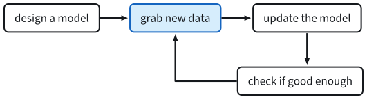
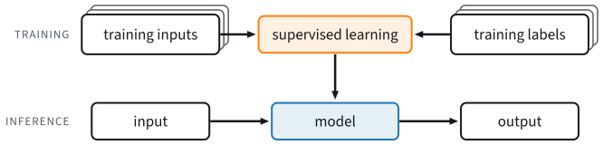
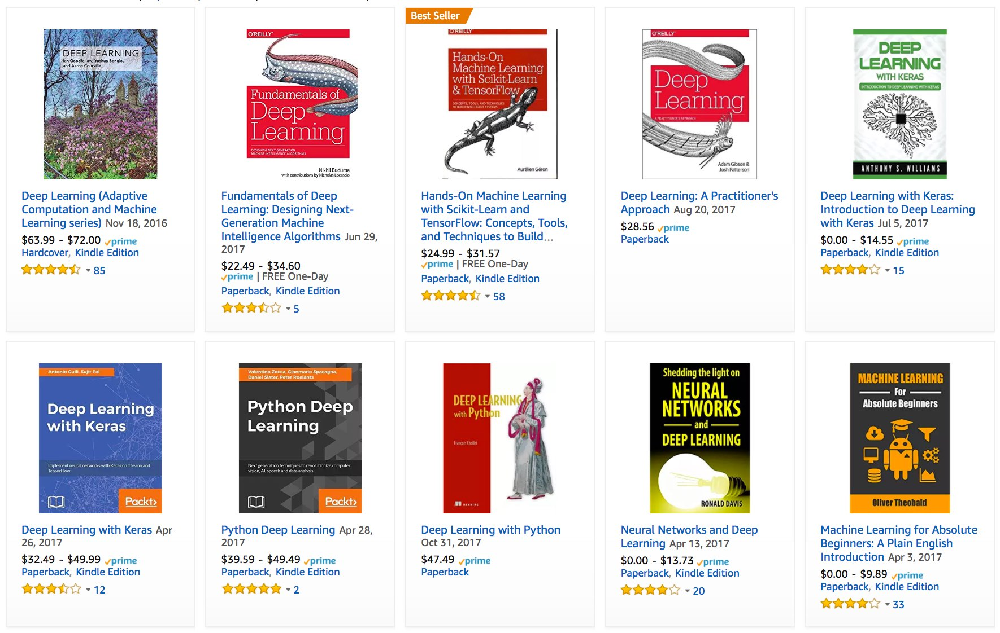
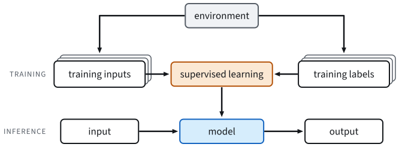
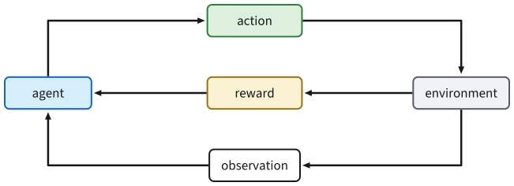

# Introduction
:label:`chap_introduction`

Most conventional computer programs implement rules written by developers.
Consider an application for managing an e-commerce platform. Users interact
with a web or mobile interface; the application stores accounts and
transactions in a database; and its *business logic* maps specified events to
actions.

Developers can enumerate common events and define the required response. When
a customer adds an item to a shopping cart, for example, the program records
the user and product identifiers. Tests expose corner cases, such as a request
to purchase an empty cart, and the rules can be amended before deployment.
When explicit rules can cover the relevant cases and work $100\%$ of the time,
machine learning is usually unnecessary.

Many tasks resist this rule-based approach. Consider the following problems:

* Write a program that predicts tomorrow's weather given geographic information, satellite images, and a trailing window of past weather.
* Write a program that takes in a factoid question, expressed in free-form text, and  answers it correctly.
* Write a program that, given an image, identifies every person depicted in it and draws outlines around each.
* Write a program that presents users with products that they are likely to enjoy but unlikely, in the natural course of browsing, to encounter.

Writing explicit rules for these tasks is difficult. The relevant patterns may
change over time, so a useful system must adapt. In other cases, the relation
between inputs and outputs---between pixels and semantic categories, for
example---is too intricate to specify as a sequence of hand-written rules.
Humans recognize familiar objects without being able to articulate every step
of the computation.


*Machine learning* studies algorithms whose behavior is determined from
experience, usually observational data or interactions with an environment.
Unlike fixed business logic, a trained model can change when it is supplied
with new data and retrained. This book develops the fundamentals of machine
learning with an emphasis on *deep learning*, which is widely used in computer
vision, natural language processing, healthcare, genomics, and other fields.

## A Motivating Example

Suppose that a driver says "Hey Siri" and then asks for directions to a coffee
shop. The phone must detect the wake phrase, transcribe the request, identify
its intent, find suitable routes, and estimate their travel times. This brief
interaction can invoke several machine learning models.


Consider the task of responding to a *wake word* such as "Alexa", "OK Google",
or "Hey Siri" (:numref:`fig_wake_word`). A microphone collects roughly 44,000
amplitude measurements each second. It is difficult to write explicit rules
that map a segment of these raw samples reliably to
$\{\textrm{yes}, \textrm{no}\}$ according to whether it contains the wake word.
Machine learning offers a different way to construct this mapping.


:label:`fig_wake_word`


Although we cannot state the recognition rules, we can label examples by
listening to them. We therefore collect a *dataset* of audio segments together
with labels that indicate which segments contain the wake word. Rather than
encode the recognition procedure explicitly, we define a flexible program whose
behavior depends on numerical *parameters*. The data determine parameter values
that perform well according to a chosen measure.

Parameters control the program's behavior. Once their values are fixed, the
program is a *model*. The set of input--output mappings obtainable by varying
the parameters is a *family* of models. A *learning algorithm* uses the dataset
to select parameter values from that family.

Before applying the learning algorithm, we must specify the inputs, outputs,
and model family. Here, the model receives an audio segment as *input* and
selects an *output* from $\{\textrm{yes}, \textrm{no}\}$.

An appropriate model family should contain a parameter setting that recognizes
"Alexa" reliably.
Because the exact choice of the wake word is arbitrary,
we will probably need a model family sufficiently rich that,
via another setting of the knobs, it could fire "yes"
only upon hearing the word "Apricot".
We expect that the same model family should be suitable
for "Alexa" recognition and "Apricot" recognition
because they seem, intuitively, to be similar tasks.
However, we might need a different family of models entirely
if we want to deal with fundamentally different inputs or outputs,
say if we wanted to map from images to captions,
or from English sentences to Chinese sentences.

Random parameter values are unlikely to make the model recognize "Alexa",
"Apricot", or any other English word.
*Learning* is the process of selecting parameter values that produce the desired
behavior; we *train* the model with data. A typical training process
(:numref:`fig_ml_loop`) proceeds as follows:

1. Initialize the model parameters.
1. Select some data (e.g., audio segments and corresponding $\{\textrm{yes}, \textrm{no}\}$ labels).
1. Adjust the parameters to improve the model's performance on those examples.
1. Repeat Steps 2 and 3 until a stopping criterion is met.


:label:`fig_ml_loop`

Rather than specifying a wake-word recognizer as rules, we specify a program
that can learn from a large labeled dataset. This process is sometimes called
*programming with data*. For example, we can train a cat detector by providing
many examples of cats and dogs. The detector may learn to emit
a very large positive number if it is a cat,
a very large negative number if it is a dog,
and something closer to zero if it is not sure.
Deep learning, developed in detail throughout this book, is one family of
methods for solving machine learning problems.


## Key Components

The wake-word example used audio segments and binary labels to train a model
that maps each segment to a classification.
This sort of problem,
where we try to predict a designated unknown label
based on known inputs
given a dataset consisting of examples
for which the labels are known,
is called *supervised learning*.
This is one of several kinds of machine learning problem. Across these kinds,
four components recur:

1. The *data* that we can learn from.
1. A *model* of how to transform the data.
1. An *objective function* that quantifies how well (or badly) the model is doing.
1. An *algorithm* to adjust the model's parameters to optimize the objective function.

### Data

Machine learning datasets usually contain collections of examples. To process
them, we need suitable numerical representations.
Each *example* (or *data point*, *data instance*, *sample*)
typically consists of a set of attributes
called *features* (sometimes called *covariates* or *inputs*),
based on which the model must make its predictions.
In supervised learning problems,
our goal is to predict the value of a special attribute,
called the *label* (or *target*),
that is not part of the model's input.

If we were working with image data,
each example might consist of an
individual photograph (the features)
and a number indicating the category
to which the photograph belongs (the label).
The photograph would be represented numerically
as three grids of numerical values representing
the brightness of red, green, and blue light
at each pixel location.
For example, a $200\times 200$ pixel color photograph
would consist of $200\times200\times3=120000$ numerical values.

Alternatively, we might work with electronic health record data
and tackle the task of predicting the likelihood
that a given patient  will survive the next 30 days.
Here, our features might consist of a collection
of readily available attributes
and frequently recorded measurements,
including age, vital signs, comorbidities,
current medications, and recent procedures.
The label available for training would be a binary value
indicating whether each patient in the historical data
survived within the 30-day window.

In such cases, when every example is characterized
by the same number of numerical features,
we say that the inputs are fixed-length vectors
and we call the (constant) length of the vectors
the *dimensionality* of the data.
Fixed-length inputs simplify batching and model design, but not all data can
readily
be represented as *fixed-length* vectors.
While we might expect microscope images
to come from standard equipment,
we cannot expect images mined from the Internet
all to have the same resolution or shape.
For images, we might consider
cropping them to a standard size,
but that strategy only gets us so far.
We risk losing information in the cropped-out portions.
Moreover, text data resists fixed-length
representations even more stubbornly.
Consider the customer reviews left
on e-commerce sites such as Amazon, IMDb, and TripAdvisor.
Some are short: "it stinks!".
Others ramble for pages.
Many modern deep learning models can process *varying-length* data directly.

Additional representative data can support larger models and reduce reliance
on strong prior assumptions. The transition from comparatively small datasets
to large ones contributed substantially to the success of modern deep learning.
Some deep models require large datasets to outperform traditional approaches;
the relationship depends on the task, model, and quality of the data.

Quantity alone is insufficient; the data must also be relevant and reliable.
If the data is full of mistakes,
or if the chosen features are not predictive
of the target quantity of interest,
learning is going to fail.
Poor predictive performance is not the only possible consequence.
In sensitive applications of machine learning,
like predictive policing, resume screening,
and risk models used for lending,
we must examine both data coverage and embedded bias. One common failure mode
occurs when demographic groups are absent or poorly represented in the training
data. A skin-cancer recognition system trained without examples from people
with darker skin tones may fail for those patients. Data can also encode
historical prejudice.
For example, if past hiring decisions
are used to train a predictive model
that will be used to screen resumes
then a model can reproduce and automate historical injustice without its
developers intending or recognizing the effect.


### Models

Most machine learning systems transform one representation into another. A
system might process photographs and estimate whether each depicts a smile, or
process sensor readings and assign an anomaly score. A *model* is the
computational mechanism that maps input data to predictions.
In particular, we are interested in *statistical models*
that can be estimated from data.
While simple models are perfectly capable of addressing
appropriately simple problems,
the problems
that we focus on in this book stretch the limits of classical methods.
Deep learning focuses on models that compose many successive transformations,
hence the term *deep*.
On our way to discussing deep models,
we will also discuss some more traditional methods.

### Objective Functions

Learning requires a quantitative definition of improvement. An *objective
function* supplies this measure. We usually formulate objectives so that lower
values are preferable; negating a score for which higher values are preferable
produces an equivalent minimization objective. Objectives expressed in this
form are often called *loss functions*.

When trying to predict numerical values,
the most common loss function is *squared error*,
i.e., the square of the difference between
the prediction and the ground truth target.
For classification, the most common objective
is to minimize error rate,
i.e., the fraction of examples on which
our predictions disagree with the ground truth.
Some objectives (e.g., squared error) can be optimized directly,
whereas others (e.g., error rate) are difficult to optimize,
owing to non-differentiability or other complications.
In these cases, it is common instead to optimize a *surrogate objective*.

During optimization, we think of the loss
as a function of the model's parameters,
and treat the training dataset as a constant.
We learn
the best values of our model's parameters
by minimizing the loss incurred on a set
consisting of some number of examples collected for training.
However, doing well on the training data
does not guarantee that we will do well on unseen data.
So we will typically want to split the available data into two partitions:
the *training dataset* (or *training set*), for learning model parameters;
and the *test dataset* (or *test set*), which is held out for evaluation.
We typically report performance on both partitions.
You could think of training performance
as analogous to the scores that a student achieves
on the practice exams used to prepare for some real final exam.
Even if the results are encouraging,
that does not guarantee success on the final exam.
Over the course of studying, the student
might begin to memorize the practice questions,
appearing to master the topic but faltering
when faced with previously unseen questions
on the actual final exam.
When a model performs well on the training set
but fails to generalize to unseen data,
we say that it is *overfitting* to the training data.


### Optimization Algorithms

Given data, a model, and an objective function, we need an algorithm that
searches for parameters that minimize the loss.
Popular optimization algorithms for deep learning
are based on an approach called *gradient descent*.
At each step, gradient descent estimates how the training loss changes under a
small change to each parameter, then updates the parameters in a direction that
reduces the loss.


## Kinds of Machine Learning Problems

Machine learning encompasses several problem formulations. The following
overview establishes terminology used throughout the book.

### Supervised Learning

Supervised learning describes tasks
where we are given a dataset
containing both features and labels
and 
asked to produce a model that predicts the labels when
given input features.
Each feature--label pair is called an example.
Sometimes, when the context is clear,
we may use the term *examples*
to refer to a collection of inputs,
even when the corresponding labels are unknown.
The supervision comes into play
because, for choosing the parameters,
we (the supervisors) provide the model
with a dataset consisting of labeled examples.
In probabilistic terms, we typically are interested in estimating
the conditional probability of a label given input features.
Among the several learning paradigms, supervised learning accounts for many
successful
applications of machine learning in industry.
Partly that is because many important tasks
can be described crisply as estimating the probability
of something unknown given a particular set of available data:

* Predict cancer vs. not cancer, given a computer tomography image.
* Predict the correct translation in French, given a sentence in English.
* Predict the price of a stock next month based on this month's financial reporting data.

While all supervised learning problems
are captured by the simple description
"predicting the labels given input features",
supervised learning can take diverse forms
and require many modeling decisions,
depending on (among other considerations)
the type, size, and quantity of the inputs and outputs.
For example, we use different models
for processing sequences of arbitrary lengths
and fixed-length vector representations.
We will visit many of these problems
in depth throughout this book.

Informally, the learning process looks something like the following.
First, grab a big collection of examples for which the features are known
and select from them a random subset,
acquiring the ground truth labels for each.
Sometimes these labels might be available data that have already been collected
(e.g., did a patient die within the following year?)
and other times we might need to employ human annotators to label the data,
(e.g., assigning images to categories).
Together, these inputs and corresponding labels comprise the training set.
We feed the training dataset into a supervised learning algorithm,
a function that takes as input a dataset
and outputs another function: the learned model.
Finally, we can feed previously unseen inputs to the learned model,
using its outputs as predictions of the corresponding label.
The full process is drawn in :numref:`fig_supervised_learning`.


:label:`fig_supervised_learning`

#### Regression

One common supervised learning task is *regression*.
Consider, for example, a set of data harvested
from a database of home sales.
We might construct a table,
in which each row corresponds to a different house,
and each column corresponds to some relevant attribute,
such as the square footage of a house,
the number of bedrooms, the number of bathrooms,
and the number of minutes (walking) to the center of town.
In this dataset, each example would be a specific house,
and the corresponding feature vector would be one row in the table.
For a compact urban apartment, the (square footage, number of bedrooms, number
of bathrooms, walking distance) feature vector might be $[600, 1, 1, 60]$; for
a larger suburban house, it might be $[3000, 4, 3, 10]$. Many classical machine
learning algorithms require fixed-length feature vectors of this kind.

What makes a problem a regression is actually
the form of the target.
Say that you are in the market for a new home.
You might want to estimate the fair market value of a house,
given some features such as above.
The data here might consist of historical home listings
and the labels might be the observed sales prices.
When labels take on arbitrary numerical values
(even within some interval),
we call this a *regression* problem.
The goal is to produce a model whose predictions
closely approximate the actual label values.


Many practical problems can be formulated as regression.
Predicting the rating that a user will assign to a movie
can be thought of as a regression problem
and if you designed a great algorithm
to accomplish this feat in 2009,
you might have won the [1-million-dollar Netflix prize](https://en.wikipedia.org/wiki/Netflix_Prize).
Predicting the length of stay for patients in the hospital
is also a regression problem.
A good rule of thumb is that any *how much?* or *how many?* problem
is likely to be regression. For example:

* How many hours will this surgery take?
* How much rainfall will this town have in the next six hours?


Regression also arises in ordinary estimation. Suppose a contractor spent 3 hours
removing gunk from your sewage pipes.
Then they sent you a bill of 350 dollars.
Suppose a second job took 2 hours
and received a bill of 250 dollars.
If someone then asked you how much to expect
on their upcoming gunk-removal invoice
you might make some reasonable assumptions,
such as more hours worked costs more dollars.
You might also assume that there is some base charge
and that the contractor then charges per hour.
If these assumptions held true, then given these two data examples,
you could already identify the contractor's pricing structure:
100 dollars per hour plus 50 dollars to show up at your house.
This inference captures the central idea of *linear* regression.

In this case, we could produce the parameters
that exactly matched the contractor's prices.
Sometimes this is not possible,
e.g., if some of the variation
arises from factors beyond your two features.
In these cases, we will try to learn models
that minimize the distance between our predictions and the observed values.
In most of our chapters, we will focus on
minimizing the squared error loss function.
As shown later, this loss corresponds to the assumption
that our data were corrupted by Gaussian noise.

#### Classification

While regression models are great
for addressing *how many?* questions,
lots of problems do not fit comfortably in this template.
Consider, for example, a bank that wants
to develop a check scanning feature for its mobile app.
Ideally, the customer would photograph a check
and the app would automatically recognize the text from the image.
Assuming that we had some ability
to segment out image patches
corresponding to each handwritten character,
then the primary remaining task would be
to determine which character among some known set
is depicted in each image patch.
These kinds of *which one?* problems are called *classification*
and require a different set of tools
from those used for regression,
although many techniques will carry over.

In *classification*, we want our model to look at features,
e.g., the pixel values in an image,
and then predict to which *category*
(sometimes called a *class*)
among some discrete set of options,
an example belongs.
For handwritten digits, we might have ten classes,
corresponding to the digits 0 through 9.
The simplest form of classification is when there are only two classes,
a problem which we call *binary classification*.
For example, our dataset could consist of images of animals
and our labels  might be the classes $\textrm{\{cat, dog\}}$.
Whereas in regression we sought a regressor to output a numerical value,
in classification we seek a classifier,
whose output is the predicted class assignment.

For reasons that we will get into as the book gets more technical,
it can be difficult to optimize a model that can only output
a *firm* categorical assignment,
e.g., either "cat" or "dog".
In these cases, it is usually much easier to express
our model in the language of probabilities.
Given features of an example,
our model assigns a probability
to each possible class.
Returning to our animal classification example
where the classes are $\textrm{\{cat, dog\}}$,
a classifier might see an image and output the probability
that the image is a cat as 0.9.
We can interpret this number by saying that the classifier
is 90\% sure that the image depicts a cat.
The magnitude of the probability for the predicted class
conveys a notion of uncertainty.
It is not the only one available
and we will discuss others in chapters dealing with more advanced topics.

When we have more than two possible classes,
we call the problem *multiclass classification*.
Common examples include handwritten character recognition
$\textrm{\{0, 1, 2, ... 9, a, b, c, ...\}}$.
While we attacked regression problems by trying
to minimize the squared error loss function,
the common loss function for classification problems is called *cross-entropy*,
whose name will be demystified
when we introduce information theory in later chapters.

The most likely class need not determine the action.
Assume that you find a beautiful mushroom in your backyard
as shown in :numref:`fig_death_cap`.


:width:`200px`
:label:`fig_death_cap`

Now, assume that you built a classifier and trained it
to predict whether a mushroom is poisonous based on a photograph.
Say our poison-detection classifier outputs
that the probability that
:numref:`fig_death_cap` shows a death cap is 0.2.
In other words, the classifier is 80\% sure
that our mushroom is not a death cap.
Eating it would still be unwise: the possible benefit of a meal does not
justify a 20\% risk of death.
In other words, the effect of the uncertain risk
outweighs the benefit by far.
Thus, in order to make a decision about whether to eat the mushroom,
we need to compute the expected detriment
associated with each action
which depends both on the likely outcomes
and the benefits or harms associated with each.
In this case, the detriment incurred
by eating the mushroom
might be $0.2 \times \infty + 0.8 \times 0 = \infty$,
whereas the loss of discarding it
is $0.2 \times 0 + 0.8 \times 1 = 0.8$.
Our caution was justified:
as any mycologist would tell us,
the mushroom in :numref:`fig_death_cap`
is actually a death cap.

Classification also includes formulations beyond ordinary binary and
multiclass classification.
For instance, there are some variants of classification
addressing hierarchically structured classes.
In such cases not all errors are equal---if
we must err, we might prefer to misclassify
to a related class rather than a distant class.
Usually, this is referred to as *hierarchical classification*.
For inspiration, you might think of [Linnaeus](https://en.wikipedia.org/wiki/Carl_Linnaeus),
who organized fauna in a hierarchy.

In the case of animal classification,
it might not be so bad to mistake
a poodle for a schnauzer,
but our model would pay a huge penalty
if it confused a poodle with a dinosaur.
Which hierarchy is relevant might depend
on how you plan to use the model.
For example, rattlesnakes and garter snakes
might be close on the phylogenetic tree,
but mistaking a rattler for a garter could have fatal consequences.

#### Tagging

Some classification problems fit neatly
into the binary or multiclass classification setups.
For example, we could train a normal binary classifier
to distinguish cats from dogs.
Current computer vision libraries provide off-the-shelf tools for this task.
Nonetheless, no matter how accurate our model gets,
we might find ourselves in trouble when the classifier
encounters an image of the *Town Musicians of Bremen*,
a popular German fairy tale featuring four animals
(:numref:`fig_stackedanimals`).


:width:`300px`
:label:`fig_stackedanimals`

The image contains a cat,
a rooster, a dog, and a donkey,
with some trees in the background.
If we anticipate encountering such images,
multiclass classification might not be
the right problem formulation.
Instead, we might want to give the model the option of
saying the image depicts a cat, a dog, a donkey,
*and* a rooster.

The problem of learning to predict classes that are
not mutually exclusive is called *multi-label classification*.
Auto-tagging problems are typically best described
in terms of multi-label classification.
Think of the tags people might apply
to posts on a technical blog,
e.g., "machine learning", "technology", "gadgets",
"programming languages", "Linux", "cloud computing", "AWS".
A typical article might have 5--10 tags applied.
Typically, tags will exhibit some correlation structure.
Posts about "cloud computing" are likely to mention "AWS"
and posts about "machine learning" are likely to mention "GPUs".

Sometimes such tagging problems
draw on enormous label sets.
The National Library of Medicine
employs many professional annotators
who associate each article to be indexed in PubMed
with a set of tags drawn from the
Medical Subject Headings (MeSH) ontology,
a collection of roughly 28,000 tags.
Correctly tagging articles is important
because it allows researchers to conduct
exhaustive reviews of the literature.
This is a time-consuming process and typically there is a one-year lag between archiving and tagging.
Machine learning can provide provisional tags
until each article has a proper manual review.
Indeed, for several years, the BioASQ organization
has [hosted competitions](http://bioasq.org/)
for this task.

#### Search

In the field of information retrieval,
we often impose ranks on sets of items.
Web search, for example, must determine not only *whether* a page is relevant
to a query, but also which results
should be shown most prominently
to a particular user.
One way of doing this might be
to first assign a score
to every element in the set
and then to retrieve the top-rated elements.
[PageRank](https://en.wikipedia.org/wiki/PageRank), used by the early Google
search engine, was an influential scoring system. Its score did not depend on
the query itself.
Instead, they relied on a simple relevance filter
to identify the set of relevant candidates
and then used PageRank to prioritize
the more authoritative pages.
Nowadays, search engines use machine learning and behavioral models
to obtain query-dependent relevance scores.
There are entire academic conferences devoted to this subject.

#### Recommender Systems
:label:`subsec_recommender_systems`

Recommender systems are another problem setting
that is related to search and ranking.
The problems are similar insofar as the goal
is to display a set of items relevant to the user.
The main difference is the emphasis on *personalization*
to specific users in the context of recommender systems.
For instance, for movie recommendations,
the results page for a science fiction fan
and the results page
for a connoisseur of Peter Sellers comedies
might differ significantly.
Similar problems pop up in other recommendation settings,
e.g., for retail products, music, and news recommendation.

In some cases, customers provide explicit feedback,
communicating how much they liked a particular product
(e.g., the product ratings and reviews
on Amazon, IMDb, or Goodreads).
In other cases, they provide implicit feedback,
e.g., by skipping titles on a playlist,
which might indicate dissatisfaction or that the song was inappropriate in
that context.
In the simplest formulations,
these systems are trained
to estimate some score,
such as an expected star rating
or the probability that a given user
will purchase a particular item.

Given such a model, for any given user,
we could retrieve the set of objects with the largest scores,
which could then be recommended to the user.
Production systems are considerably more advanced
and take detailed user activity and item characteristics
into account when computing such scores.
:numref:`fig_deeplearning_amazon` displays the deep learning books
recommended by Amazon based on personalization algorithms
tuned to capture Aston's preferences.


:label:`fig_deeplearning_amazon`

Despite their economic value, recommender systems built directly from
predictive models face several conceptual problems. First, they observe only
*censored feedback*:
users preferentially rate movies
that they feel strongly about.
For example, on a five-point scale,
items may receive
many one- and five-star ratings
but that there are conspicuously few three-star ratings.
Moreover, current purchase habits are often a result
of the recommendation algorithm currently in place,
but learning algorithms do not always take this detail into account.
Thus it is possible for feedback loops to form
where a recommender system preferentially pushes an item
that is then taken to be better (due to greater purchases)
and in turn is recommended even more frequently.
Many of these problems---about
how to deal with censoring,
incentives, and feedback loops---are important open research questions.

#### Sequence Learning

So far, we have looked at problems where we have
some fixed number of inputs and produce a fixed number of outputs.
For example, we considered predicting house prices
given a fixed set of features:
square footage, number of bedrooms,
number of bathrooms, and the transit time to downtown.
We also discussed mapping from an image (of fixed dimension)
to the predicted probabilities that it belongs
to each among a fixed number of classes
and predicting star ratings associated with purchases
based on the user ID and product ID alone.
In these cases, once our model is trained,
after each test example is fed into our model,
it is immediately forgotten.
We assumed that successive observations were independent
and thus there was no need to hold on to this context.

But how should we deal with video snippets?
In this case, each snippet might consist of a different number of frames.
And our guess of what is going on in each frame might be much stronger
if we take into account the previous or succeeding frames.
The same goes for language.
For example, one popular deep learning problem is machine translation:
the task of ingesting sentences in some source language
and predicting their translations in another language.

Such problems also occur in medicine.
We might want a model to monitor patients in the intensive care unit
and to fire off alerts whenever their risk of dying in the next 24 hours
exceeds some threshold.
Here, we would not throw away everything
that we know about the patient history every hour,
because we might not want to make predictions based only
on the most recent measurements.

These are instances of *sequence learning*.
They require a model either to ingest sequences of inputs
or to emit sequences of outputs (or both).
Specifically, *sequence-to-sequence learning* considers problems
where both inputs and outputs consist of variable-length sequences.
Examples include machine translation
and speech-to-text transcription.
While it is impossible to consider
all types of sequence transformations,
the following special cases are worth mentioning.

**Tagging and Parsing**.
This involves annotating a text sequence with attributes.
Here, the inputs and outputs are *aligned*,
i.e., they are of the same number
and occur in a corresponding order.
For instance, in *part-of-speech (PoS) tagging*,
we annotate every word in a sentence
with the corresponding part of speech,
i.e., "noun" or "direct object".
Alternatively, we might want to know
which groups of contiguous words refer to named entities,
like *people*, *places*, or *organizations*.
In the simplified example below, we indicate whether each word is part of a
named entity (tagged as "Ent").

```text
Tom has dinner in Washington with Sally
Ent  -    -    -     Ent      -    Ent
```


**Automatic Speech Recognition**.
With speech recognition, the input sequence
is an audio recording of a speaker (:numref:`fig_speech`),
and the output is a transcript of what the speaker said.
The challenge is that there are many more audio frames
(sound is typically sampled at 8kHz or 16kHz)
than text, i.e., there is no 1:1 correspondence between audio and text,
since thousands of samples may
correspond to a single spoken word.
These are sequence-to-sequence learning problems,
where the output is much shorter than the input.
Humans can recognize speech
even from low-quality audio,
getting computers to perform the same feat
is a formidable challenge.


:width:`700px`
:label:`fig_speech`

**Text to Speech**.
This is the inverse of automatic speech recognition.
Here, the input is text and the output is an audio file.
In this case, the output is much longer than the input.

**Machine Translation**.
Unlike the case of speech recognition,
where corresponding inputs and outputs
occur in the same order,
in machine translation,
unaligned data poses a new challenge.
Here the input and output sequences
can have different lengths,
and the corresponding regions
of the respective sequences
may appear in a different order.
Consider the following illustrative example
of the peculiar tendency of Germans
to place the verbs at the end of sentences:

```text
German:           Haben Sie sich schon dieses grossartige Lehrwerk angeschaut?
English:          Have you already looked at this excellent textbook?
Wrong alignment:  Have you yourself already this excellent textbook looked at?
```


Many related problems pop up in other learning tasks.
For instance, determining the order in which a user
reads a webpage is a two-dimensional layout analysis problem.
Dialogue problems exhibit all kinds of additional complications,
where determining what to say next requires taking into account
real-world knowledge and the prior state of the conversation
across long temporal distances.
Such topics are active areas of research.

### Unsupervised and Self-Supervised Learning

The previous examples focused on supervised learning, where each training
example includes features and a target label. Many datasets contain no such
labels. *Unsupervised learning* seeks useful structure in these data without a
predetermined prediction target, so the questions depend on the application.
We will address unsupervised learning techniques
in later chapters.
The following questions illustrate the range of possibilities.

* Can we find a small number of prototypes
that accurately summarize the data?
Given a set of photos, can we group them into landscape photos,
pictures of dogs, babies, cats, and mountain peaks?
Likewise, given a collection of users' browsing activities,
can we group them into users with similar behavior?
This problem is typically known as *clustering*.
* Can we find a small number of parameters
that accurately capture the relevant properties of the data?
The trajectories of a ball are well described
by velocity, diameter, and mass of the ball.
Tailors have developed a small number of parameters
that describe human body shape fairly accurately
for the purpose of fitting clothes.
These problems are referred to as *subspace estimation*.
If the dependence is linear, it is called *principal component analysis*.
* Is there a representation of (arbitrarily structured) objects
in Euclidean space
such that symbolic properties can be well matched?
This can be used to describe entities and their relations,
such as "Rome" $-$ "Italy" $+$ "France" $=$ "Paris".
* Is there a description of the root causes
of much of the data that we observe?
For instance, if we have demographic data
about house prices, pollution, crime, location,
education, and salaries, can we discover
how they are related based on empirical data?
The fields concerned with *causality* and
*probabilistic graphical models* tackle such questions.
* Another development in unsupervised learning is the advent of *deep
generative models*.
These models estimate the density of the data,
either explicitly or *implicitly*.
Once trained, we can use a generative model
either to score examples according to how likely they are,
or to sample synthetic examples from the learned distribution.
Early deep learning breakthroughs in generative modeling
came with the invention of *variational autoencoders* :cite:`Kingma.Welling.2014,rezende2014stochastic`
and continued with the development of *generative adversarial networks* :cite:`Goodfellow.Pouget-Abadie.Mirza.ea.2014`.
More recent advances include normalizing flows :cite:`dinh2014nice,dinh2017density` and
diffusion models :cite:`sohl2015deep,song2019generative,ho2020denoising,song2021score`.


A further development in unsupervised learning
has been the rise of *self-supervised learning*,
techniques that leverage some aspect of the unlabeled data
to provide supervision.
For text, we can train models
to "fill in the blanks"
by predicting randomly masked words
using their surrounding words (contexts)
in large corpora without manual labels :cite:`Devlin.Chang.Lee.ea.2018`.
For images, we may train models
to tell the relative position
between two cropped regions
of the same image :cite:`Doersch.Gupta.Efros.2015`,
to predict an occluded part of an image
based on the remaining portions of the image,
or to predict whether two examples
are perturbed versions of the same underlying image.
Self-supervised models often learn representations
that are subsequently leveraged
by fine-tuning the resulting models
on some downstream task of interest.


### Interacting with an Environment

So far, we have treated data as fixed and have not considered how a model's
outputs affect future observations. Standard supervised and unsupervised
learning typically collect data first and train without further interaction
with the environment.
Because all the learning takes place
after the algorithm is disconnected from the environment,
this is sometimes called *offline learning*.
For example, supervised learning assumes
the simple interaction pattern
depicted in :numref:`fig_data_collection`.


:label:`fig_data_collection`

Offline learning allows us to study pattern recognition in isolation,
with no concern about complications arising
from interactions with a dynamic environment.
But this problem formulation is limiting.
If you grew up reading Asimov's Robot novels,
then you probably picture artificially intelligent agents
capable not only of making predictions,
but also of taking actions in the world.
An intelligent *agent* chooses actions as well as making predictions, and those
actions affect the environment.
If we want to train an intelligent agent,
we must account for the way its actions might
impact the future observations of the agent, and so offline learning is inappropriate.

Considering the interaction with an environment
opens a whole set of new modeling questions.
Examples include the following.

* Does the environment remember what we did previously?
* Does the environment want to help us, e.g., a user reading text into a speech recognizer?
* Does the environment want to beat us, e.g., spammers adapting their emails to evade spam filters?
* Does the environment have shifting dynamics? For example, would future data always resemble the past or would the patterns change over time, either naturally or in response to our automated tools?

These questions raise the problem of *distribution shift*,
where training and test data are different.
An example of this, that many of us may have met, is when taking exams written by a lecturer,
while the homework was composed by their teaching assistants.
Next, we briefly describe reinforcement learning,
a rich framework for posing learning problems in which
an agent interacts with an environment.


### Reinforcement Learning

If you are interested in using machine learning
to develop an agent that interacts with an environment
and takes actions, then you are probably going to wind up
focusing on *reinforcement learning*.
This might include applications to robotics,
to dialogue systems,
and even to developing artificial intelligence (AI)
for video games.
*Deep reinforcement learning*, which applies
deep learning to reinforcement learning problems,
has surged in popularity.
The breakthrough deep Q-network, that beat humans
at Atari games using only the visual input :cite:`mnih2015human`,
and the AlphaGo program, which dethroned the world champion
at the board game Go :cite:`Silver.Huang.Maddison.ea.2016`,
are two prominent examples.

Reinforcement learning gives a very general statement of a problem
in which an agent interacts with an environment over a series of time steps.
At each time step, the agent receives some *observation*
from the environment and must choose an *action*
that is subsequently transmitted back to the environment
via some mechanism (sometimes called an *actuator*), when, after each loop, 
the agent receives a reward from the environment.
This process is illustrated in :numref:`fig_rl-environment`.
The agent then receives a subsequent observation,
and chooses a subsequent action, and so on.
The behavior of a reinforcement learning agent is governed by a *policy*.
In brief, a *policy* is a function that maps
from observations of the environment to actions.
The goal of reinforcement learning is to produce good policies.


:label:`fig_rl-environment`

The reinforcement learning framework is general enough that supervised learning
can be recast as reinforcement learning.
Say we had a classification problem.
We could create a reinforcement learning agent
with one action corresponding to each class.
We could then create an environment which gave a reward
that was exactly equal to the loss function
from the original supervised learning problem.

Further, reinforcement learning
can also address many problems
that supervised learning cannot.
For example, in supervised learning,
we always expect that the training input
comes associated with the correct label.
But in reinforcement learning,
we do not assume that, for each observation
the environment tells us the optimal action.
In general, we receive a reward.
Moreover, the environment may not even tell us
which actions led to the reward.

Consider the game of chess.
The only real reward signal comes at the end of the game
when we either win, earning a reward of, say, $1$,
or when we lose, receiving a reward of, say, $-1$.
So reinforcement learners must deal
with the *credit assignment* problem:
determining which actions to credit or blame for an outcome.
The same goes for an employee
who gets a promotion on October 11.
That promotion likely reflects a number
of well-chosen actions over the previous year.
Getting promoted in the future requires figuring out
which actions along the way led to the earlier promotions.

Reinforcement learners may also have to deal
with the problem of partial observability.
That is, the current observation might not
tell you everything about your current state.
Say your cleaning robot found itself trapped
in one of many identical closets in your house.
Rescuing the robot involves inferring
its precise location which might require considering earlier observations prior to it entering the closet.

Finally, at any given point, reinforcement learners
might know of one good policy,
but there might be many other better policies
that the agent has never tried.
The reinforcement learner must constantly choose
whether to *exploit* the best (currently) known strategy as a policy,
or to *explore* the space of strategies,
potentially giving up some short-term reward
in exchange for knowledge.

The general reinforcement learning setting includes all these complications.
Actions affect subsequent observations.
Rewards are only observed when they correspond to the chosen actions.
The environment may be either fully or partially observed.
Accounting for all this complexity at once may be asking too much.
Moreover, not every practical problem exhibits all this complexity.
As a result, researchers have studied a number of
special cases of reinforcement learning problems.

When the environment is fully observed,
we call the reinforcement learning problem a *Markov decision process*.
When the state does not depend on the previous actions,
we call it a *contextual bandit problem*.
When there is no state, just a set of available actions
with initially unknown rewards, we have the classic *multi-armed bandit problem*.

## Roots

The preceding examples cover only a subset of the problems that machine
learning can address. Deep learning provides tools for many of them.
Although many deep learning methods are recent inventions,
the core ideas behind learning from data
have been studied for centuries.
The effort to analyze observations and predict outcomes has shaped natural
science and mathematics for centuries.
Two examples are the Bernoulli distribution, named after
[Jacob Bernoulli (1655--1705)](https://en.wikipedia.org/wiki/Jacob_Bernoulli),
and the Gaussian distribution discovered
by [Carl Friedrich Gauss (1777--1855)](https://en.wikipedia.org/wiki/Carl_Friedrich_Gauss).
Gauss invented, for instance, the least mean squares algorithm,
which is still used today for a multitude of problems
from insurance calculations to medical diagnostics.
Such tools enhanced the experimental approach
in the natural sciences---for instance, Ohm's law
relating current and voltage in a resistor
is perfectly described by a linear model.

Even in the middle ages, mathematicians
had a keen intuition of estimates.
For instance, the geometry book of [Jacob Köbel (1460--1533)](https://www.maa.org/press/periodicals/convergence/mathematical-treasures-jacob-kobels-geometry)
illustrates averaging the length of 16 adult men's feet
to estimate the typical foot length in the population (:numref:`fig_koebel`).


:width:`500px`
:label:`fig_koebel`


As a group of individuals exited a church,
16 adult men were asked to line up in a row
and have their feet measured.
The sum of these measurements was then divided by 16
to obtain an estimate for what now is called one foot.
This "algorithm" was later improved
to deal with misshapen feet;
The two men with the shortest and longest feet were sent away,
averaging only over the remainder.
This is among the earliest examples
of a trimmed mean estimate.

Statistics developed rapidly as larger collections of data became available.
One of its pioneers, [Ronald Fisher (1890--1962)](https://en.wikipedia.org/wiki/Ronald_Fisher),
contributed significantly to its theory
and also its applications in genetics.
Many of his algorithms (such as linear discriminant analysis)
and concepts (such as the Fisher information matrix)
still hold a prominent place
in the foundations of modern statistics.
Even his data resources had a lasting impact.
The Iris dataset that Fisher released in 1936
is still sometimes used to demonstrate
machine learning algorithms.
Fisher was also a proponent of eugenics,
which should remind us that the morally dubious use of data science
has as long and enduring a history as its productive use
in industry and the natural sciences.


Other influences for machine learning
came from the information theory of
[Claude Shannon (1916--2001)](https://en.wikipedia.org/wiki/Claude_Shannon)
and the theory of computation proposed by
[Alan Turing (1912--1954)](https://en.wikipedia.org/wiki/Alan_Turing).
Turing posed the question "can machines think?”
in his famous paper *Computing Machinery and Intelligence* :cite:`Turing.1950`.
Describing what is now known as the Turing test, he proposed that a machine
can be considered *intelligent* if it is difficult
for a human evaluator to distinguish between the replies
from a machine and those of a human, based purely on textual interactions.

Neuroscience and psychology provided further influences. Many scholars asked
whether one could explain
and possibly reverse engineer this capacity.
One of the first biologically inspired algorithms
was formulated by [Donald Hebb (1904--1985)](https://en.wikipedia.org/wiki/Donald_O._Hebb).
In his groundbreaking book *The Organization of Behavior* :cite:`Hebb.1949`,
he posited that neurons learn by positive reinforcement.
This became known as the Hebbian learning rule.
These ideas inspired later work, such as
Rosenblatt's perceptron learning algorithm,
and laid the foundations of many stochastic gradient descent algorithms
that underpin deep learning today:
reinforce desirable behavior and diminish undesirable behavior
to obtain good settings of the parameters in a neural network.

Biological inspiration is what gave *neural networks* their name.
For over a century (dating back to the models of Alexander Bain, 1873,
and James Sherrington, 1890), researchers have tried to assemble
computational circuits that resemble networks of interacting neurons.
Over time, the interpretation of biology has become less literal,
but the name persisted. Most modern networks share a few principles:
that can be found in most networks today:

* The alternation of linear and nonlinear processing units, often referred to as *layers*.
* The use of the chain rule (also known as *backpropagation*) for adjusting parameters in the entire network at once.

After initial rapid progress, research in neural networks
languished from around 1995 until 2005.
This was mainly due to two reasons.
First, training a network is computationally very expensive.
While random-access memory was plentiful at the end of the past century,
computational power was scarce.
Second, datasets were relatively small.
In fact, Fisher's Iris dataset from 1936
was still a popular tool for testing the efficacy of algorithms.
The MNIST dataset with its 60,000 handwritten digits was considered huge.

Given the scarcity of data and computation,
strong statistical tools such as kernel methods,
decision trees, and graphical models
proved empirically superior in many applications.
Moreover, unlike neural networks,
they did not require weeks to train
and provided predictable results
with strong theoretical guarantees.


## The Road to Deep Learning

Much of this changed with the availability
of massive amounts of data,
thanks to the World Wide Web,
the advent of companies serving
hundreds of millions of users online,
a dissemination of low-cost, high-quality sensors,
inexpensive data storage (Kryder's law),
and cheap computation (Moore's law).
In particular, the landscape of computation in deep learning
was revolutionized by advances in GPUs that were originally engineered for computer gaming.
Suddenly algorithms and models
that seemed computationally infeasible
were within reach.
The trend is summarized in :numref:`tab_intro_decade`.

:Dataset vs. computer memory and computational power
:label:`tab_intro_decade`

|Decade|Dataset|Memory|Floating point calculations per second|
|:--|:-|:-|:-|
|1970|100 (Iris)|1 KB|100 KF (Intel 8080)|
|1980|1 K (house prices in Boston)|100 KB|1 MF (Intel 80186)|
|1990|10 K (optical character recognition)|10 MB|10 MF (Intel 80486)|
|2000|10 M (web pages)|100 MB|1 GF (Intel Core)|
|2010|10 G (advertising)|1 GB|1 TF (NVIDIA C2050)|
|2020|1 T (social network)|100 GB|1 PF (NVIDIA DGX-2)|


Random-access memory has not kept pace with the growth in data.
At the same time, increases in computational power
have outpaced the growth in datasets.
This means that statistical models
need to become more memory efficient,
and so they are free to spend more computer cycles
optimizing parameters, thanks to
the increased compute budget.
Consequently, the sweet spot in machine learning and statistics
moved from (generalized) linear models and kernel methods
to deep neural networks.
This is also one of the reasons why many of the mainstays
of deep learning, such as multilayer perceptrons
:cite:`McCulloch.Pitts.1943`, convolutional neural networks
:cite:`LeCun.Bottou.Bengio.ea.1998`, long short-term memory
:cite:`Hochreiter.Schmidhuber.1997`,
and Q-Learning :cite:`Watkins.Dayan.1992`,
were essentially "rediscovered" in the past decade,
after lying comparatively dormant for considerable time.

The recent progress in statistical models, applications, and algorithms
has sometimes been likened to the Cambrian explosion:
a moment of rapid progress in the evolution of species.
The progress did not result from applying additional resources to old
algorithms alone. The following list gives several important developments.


* Novel methods for capacity control, such as *dropout*
  :cite:`Srivastava.Hinton.Krizhevsky.ea.2014`,
  have helped to mitigate overfitting.
  Here, noise is injected :cite:`Bishop.1995`
  throughout the neural network during training.
* *Attention mechanisms* solved a second problem
  that had plagued statistics for over a century:
  how to increase the memory and complexity of a system without
  increasing the number of learnable parameters.
  A *learnable pointer structure* provided an effective solution
  :cite:`Bahdanau.Cho.Bengio.2014`.
  Rather than having to remember an entire text sequence, e.g.,
  for machine translation in a fixed-dimensional representation,
  all that needed to be stored was a pointer to the intermediate state
  of the translation process. This allowed for significantly
  increased accuracy for long sequences, since the model
  no longer needed to remember the entire sequence before
  commencing the generation of a new one.
* Built solely on attention mechanisms,
  the *Transformer* architecture :cite:`Vaswani.Shazeer.Parmar.ea.2017` has demonstrated superior *scaling* behavior: it performs better with an increase in dataset size, model size, and amount of training compute :cite:`kaplan2020scaling`. This architecture has demonstrated compelling success in a wide range of areas,
  such as natural language processing :cite:`Devlin.Chang.Lee.ea.2018,brown2020language`, computer vision :cite:`Dosovitskiy.Beyer.Kolesnikov.ea.2021,liu2021swin`, speech recognition :cite:`gulati2020conformer`, reinforcement learning :cite:`chen2021decision`, and graph neural networks :cite:`dwivedi2020generalization`. For example, a single Transformer pretrained on modalities
  as diverse as text, images, joint torques, and button presses
  can play Atari, caption images, chat,
  and control a robot :cite:`reed2022generalist`.
* Modeling probabilities of text sequences, *language models* can predict text given other text. Scaling up the data, model, and compute has unlocked a growing number of capabilities of language models to perform desired tasks via human-like text generation based on input text :cite:`brown2020language,rae2021scaling,hoffmann2022training,chowdhery2022palm,openai2023gpt4,anil2023palm,touvron2023llama,touvron2023llama2`. For instance, aligning language models with human intent :cite:`ouyang2022training`, OpenAI's [ChatGPT](https://chat.openai.com/) allows users to interact with it in a conversational way to solve problems, such as code debugging and creative writing.
* Multi-stage designs, e.g., via the memory networks
  :cite:`Sukhbaatar.Weston.Fergus.ea.2015`
  and the neural programmer-interpreter :cite:`Reed.De-Freitas.2015`
  permitted statistical modelers to describe iterative approaches to reasoning.
  These tools allow for an internal state of the deep neural network
  to be modified repeatedly,
  thus carrying out subsequent steps
  in a chain of reasoning, just as a processor
  can modify memory for a computation.
* A key development in *deep generative modeling* was the invention
  of *generative adversarial networks*
  :cite:`Goodfellow.Pouget-Abadie.Mirza.ea.2014`.
  Traditionally, statistical methods for density estimation
  and generative models focused on finding proper probability distributions
  and (often approximate) algorithms for sampling from them.
  As a result, these algorithms were largely limited by the lack of
  flexibility inherent in the statistical models.
  The central innovation in generative adversarial networks was to replace the sampler
  by an arbitrary algorithm with differentiable parameters.
  These are then adjusted in such a way that the discriminator
  (effectively a two-sample test) cannot distinguish fake from real data.
  Through the ability to use arbitrary algorithms to generate data,
  density estimation was opened up to a wide variety of techniques.
  Examples of galloping zebras :cite:`Zhu.Park.Isola.ea.2017`
  and of fake celebrity faces :cite:`Karras.Aila.Laine.ea.2017`
  are each testimony to this progress.
  Even amateur doodlers can produce
  photorealistic images from sketches describing the layout of a scene :cite:`Park.Liu.Wang.ea.2019`.
* Furthermore, while the diffusion process gradually adds random noise to data samples, *diffusion models* :cite:`sohl2015deep,ho2020denoising` learn the denoising process to gradually construct data samples from random noise, reversing the diffusion process. They have started to replace generative adversarial networks in more recent deep generative models, such as in DALL-E 2 :cite:`ramesh2022hierarchical` and Imagen :cite:`saharia2022photorealistic` for creative art and image generation based on text descriptions.
* In many cases, a single GPU is insufficient for processing the large amounts of data available for training.
  Over the past decade the ability to build parallel and
  distributed training algorithms has improved significantly.
  One of the key challenges in designing scalable algorithms
  is that a standard method for deep learning optimization,
  stochastic gradient descent, relies on relatively
  small minibatches of data to be processed.
  At the same time, small batches limit the efficiency of GPUs.
  Hence, training on 1,024 GPUs with a minibatch size of,
  say, 32 images per batch amounts to an aggregate minibatch
  of about 32,000 images. Work, first by :citet:`Li.2017`
  and subsequently by :citet:`You.Gitman.Ginsburg.2017`
  and :citet:`Jia.Song.He.ea.2018` pushed the size up to 64,000 observations,
  reducing training time for the ResNet-50 model
  on the ImageNet dataset to less than 7 minutes.
  By comparison, training times were initially of the order of days.
* The ability to parallelize computation
  has also contributed to progress in *reinforcement learning*.
  This has led to significant progress in computers achieving
  superhuman performance on tasks like Go, Atari games,
  Starcraft, and in physics simulations (e.g., using MuJoCo)
  where environment simulators are available.
  See, e.g., :citet:`Silver.Huang.Maddison.ea.2016` for a description
  of such achievements in AlphaGo. In a nutshell,
  reinforcement learning works best
  if plenty of (state, action, reward) tuples are available.
  Simulation provides such an avenue.
* Deep learning frameworks have played an important role
  in disseminating ideas.
  The first generation of open-source frameworks
  for neural network modeling consisted of
  [Caffe](https://github.com/BVLC/caffe),
  [Torch](https://github.com/torch), and
  [Theano](https://github.com/Theano/Theano).
  Many seminal papers were written using these tools.
  These have now been superseded by
  [TensorFlow](https://github.com/tensorflow/tensorflow) (often used via its high-level API [Keras](https://github.com/keras-team/keras)), [CNTK](https://github.com/Microsoft/CNTK), [Caffe 2](https://github.com/caffe2/caffe2), and [Apache MXNet](https://github.com/apache/incubator-mxnet).
  The third generation of frameworks consists
  of so-called *imperative* tools for deep learning,
  a trend that was arguably ignited by [Chainer](https://github.com/chainer/chainer),
  which used a syntax similar to Python NumPy to describe models.
  This idea was adopted by both [PyTorch](https://github.com/pytorch/pytorch),
  the [Gluon API](https://github.com/apache/incubator-mxnet) of MXNet,
  and [JAX](https://github.com/google/jax).


The division of labor between systems researchers building tools and
statistical modelers building neural networks has simplified implementation.
For instance,
training a linear logistic regression model
used to be a nontrivial homework problem,
worthy to give to new machine learning
Ph.D. students at Carnegie Mellon University in 2014.
By now, this task can be accomplished
with under 10 lines of code,
putting it firmly within the reach of any programmer.


## Success Stories

Artificial intelligence has a long history of delivering results
that would be difficult to accomplish otherwise.
For instance, mail sorting systems
using optical character recognition
have been deployed since the 1990s.
This is, after all, the source
of the famous MNIST dataset
of handwritten digits.
The same applies to reading checks for bank deposits and scoring
creditworthiness of applicants.
Financial transactions are checked for fraud automatically.
This forms the backbone of many e-commerce payment systems,
such as PayPal, Stripe, AliPay, WeChat, Apple, Visa, and MasterCard.
Computer programs for chess have been competitive for decades.
Machine learning feeds search, recommendation, personalization,
and ranking on the Internet.
Machine learning is therefore pervasive, although often invisible to users.

AI received broader public attention as systems addressed previously
intractable, consumer-facing problems. Deep learning contributed to many of
these advances.

* Intelligent assistants, such as Apple's Siri,
  Amazon's Alexa, and Google's assistant,
  are able to respond to spoken requests
  with a reasonable degree of accuracy.
  This includes routine tasks, such as turning on lights,
  and more complex tasks, such as arranging barber's appointments
  and offering phone support dialog.
  This is likely the most noticeable sign
  that AI is affecting our lives.
* A key ingredient in digital assistants
  is their ability to recognize speech accurately.
  The accuracy of such systems has gradually
  increased to the point
  of achieving parity with humans
  for certain applications :cite:`Xiong.Wu.Alleva.ea.2018`.
* Object recognition has likewise come a long way.
  Identifying the object in a picture
  was a fairly challenging task in 2010.
  On the ImageNet benchmark researchers from NEC Labs
  and University of Illinois at Urbana-Champaign
  achieved a top-five error rate of 28% :cite:`Lin.Lv.Zhu.ea.2010`.
  By 2017, this error rate was reduced to 2.25% :cite:`Hu.Shen.Sun.2018`.
  Similarly, stunning results have been achieved
  for identifying birdsong and for diagnosing skin cancer.
* Prowess in games used to provide
  a measuring stick for human ability.
  Starting from TD-Gammon, a program for playing backgammon
  using temporal difference reinforcement learning,
  algorithmic and computational progress
  has led to algorithms for a wide range of applications.
  Compared with backgammon, chess has
  a much more complex state space and set of actions.
  DeepBlue beat Garry Kasparov using massive parallelism,
  special-purpose hardware and efficient search
  through the game tree :cite:`Campbell.Hoane-Jr.Hsu.2002`.
  Go is more difficult still, due to its huge state space.
  AlphaGo reached human parity in 2015,
  using deep learning combined with Monte Carlo tree sampling :cite:`Silver.Huang.Maddison.ea.2016`.
  The challenge in Poker was that the state space is large
  and only partially observed
  (we do not know the opponents' cards).
  Libratus exceeded human performance in Poker
  using efficiently structured strategies :cite:`Brown.Sandholm.2017`.
* Another indication of progress in AI
  is the advent of self-driving vehicles.
  While full autonomy is not yet within reach,
  excellent progress has been made in this direction,
  with companies such as Tesla, NVIDIA,
  and Waymo shipping products
  that enable partial autonomy.
  What makes full autonomy so challenging
  is that proper driving requires
  the ability to perceive, to reason
  and to incorporate rules into a system.
  At present, deep learning is used primarily
  in the visual aspect of these problems.
  The rest is heavily tuned by engineers.


Other applications include robotics, logistics, computational biology,
particle physics, and astronomy. Machine learning has become a standard tool
for engineers and scientists in these fields.

Popular discussions often focus on a hypothetical AI *singularity*. More
immediate concerns arise because automated systems already affect people's
lives:
creditworthiness is assessed automatically,
autopilots mostly navigate vehicles, decisions about
whether to grant bail use statistical data as input.
More frivolously, we can ask Alexa to switch on the coffee machine.

Current AI systems are engineered, trained, and deployed for specified
objectives. Their behavior arises from rules, heuristics, statistical models,
and training data. These systems do not constitute *artificial general
intelligence* capable of autonomously redesigning themselves to solve arbitrary
tasks.

A much more pressing concern is how AI is being used in our daily lives.
It is likely that many routine tasks, currently fulfilled by humans, can and will be automated.
Farm robots will likely reduce the costs for organic farmers
but they will also automate harvesting operations.
This phase of automation may have profound consequences for large parts of
society because routine work provides substantial employment
in many countries.
Furthermore, statistical models, when applied without care,
can lead to racial, gender, or age bias and raise
reasonable concerns about procedural fairness
if automated to drive consequential decisions.
It is important to ensure that these algorithms are used with care.
These present-day effects warrant direct attention.


## The Essence of Deep Learning

Thus far, we have talked in broad terms about machine learning.
Deep learning is the subset of machine learning
concerned with models based on many-layered neural networks.
It is *deep* in precisely the sense that its models
learn many *layers* of transformations.
This definition encompasses a broad range of models, techniques, problem
formulations, and applications.
Many intuitions have been developed
to explain the benefits of depth.
Arguably, all machine learning
has many layers of computation,
the first consisting of feature processing steps.
What differentiates deep learning is that
the operations learned at each of the many layers
of representations are learned jointly from data.

The problems that we have discussed so far,
such as learning from the raw audio signal,
the raw pixel values of images,
or mapping between sentences of arbitrary lengths and
their counterparts in foreign languages,
are those where deep learning excels
and traditional methods falter.
It turns out that these many-layered models
are capable of addressing low-level perceptual data
in a way that previous tools could not.
Arguably the most significant commonality
in deep learning methods is *end-to-end training*.
That is, rather than assembling a system
based on components that are individually tuned,
one builds the system and then tunes their performance jointly.
For instance, in computer vision scientists
used to separate the process of *feature engineering*
from the process of building machine learning models.
The Canny edge detector :cite:`Canny.1987`
and Lowe's SIFT feature extractor :cite:`Lowe.2004`
reigned supreme for over a decade as algorithms
for mapping images into feature vectors.
In traditional pipelines, applying machine learning to these problems required
manually engineered methods
of transforming the data into some form amenable to shallow models.
Automated optimization can evaluate far more alternatives than manual feature
design.
When deep learning took over,
these feature extractors were replaced
by automatically tuned filters that yielded superior accuracy.

Thus, one key advantage of deep learning is that it replaces
not only the shallow models at the end of traditional learning pipelines,
but also the labor-intensive process of feature engineering.
Moreover, by replacing much of the domain-specific preprocessing,
deep learning has eliminated many of the boundaries
that previously separated computer vision, speech recognition,
natural language processing, medical informatics, and other application areas,
thereby offering a unified set of tools for tackling diverse problems.

Beyond end-to-end training, we are experiencing a transition
from parametric statistical descriptions to fully nonparametric models.
When data is scarce, one needs to rely on simplifying assumptions about reality
in order to obtain useful models.
When data is abundant, these can be replaced
by nonparametric models that better fit the data.
To some extent, this mirrors the progress
that physics experienced in the middle of the previous century
with the availability of computers.
Rather than solving by hand parametric approximations of how electrons behave,
one can now resort to numerical simulations of the associated partial differential equations.
This has led to much more accurate models,
albeit often at the expense of interpretation.

Another difference from previous work is the acceptance of suboptimal solutions,
dealing with nonconvex nonlinear optimization problems,
and the willingness to try things before proving them.
This new-found empiricism in dealing with statistical problems,
combined with a rapid influx of talent has led
to rapid progress in the development of practical algorithms,
albeit in many cases at the expense of modifying
and re-inventing tools that existed for decades.

The deep learning community routinely shares libraries, statistical models,
and trained networks across academic and corporate boundaries. In the same
spirit, the notebooks in this book are freely available for distribution and
use.


## Summary

Machine learning studies how computer systems
can leverage experience (often data)
to improve performance at specific tasks.
It combines ideas from statistics, data mining, and optimization.
Often, it is used as a means of implementing AI solutions.
As a class of machine learning, representational learning
focuses on how to automatically find
the appropriate way to represent data.
Considered as multi-level representation learning
through learning many layers of transformations,
deep learning replaces not only the shallow models
at the end of traditional machine learning pipelines,
but also the labor-intensive process of feature engineering.
Much of the recent progress in deep learning
has been triggered by an abundance of data
arising from cheap sensors and Internet-scale applications,
and by significant progress in computation, mostly through GPUs.
Furthermore, the availability of efficient deep learning frameworks
has made design and implementation of whole system optimization significantly easier,
and this is a key component in obtaining high performance.

## Exercises

1. Which parts of code that you currently write could be "learned", i.e.,
   improved by determining design choices automatically from data?
   Does your code include heuristic design choices?
   What data might you need to learn the desired behavior?
1. Which problems that you encounter have many examples of successful
   solutions but no explicit procedure for automating them? Which might be
   suitable for deep learning?
1. Describe the relationships between algorithms, data, and computation. How do characteristics of the data and the current available computational resources influence the appropriateness of various algorithms?
1. Name some settings where end-to-end training is not currently the default approach but where it might be useful.

[Discussions](https://d2l.discourse.group/t/22)
