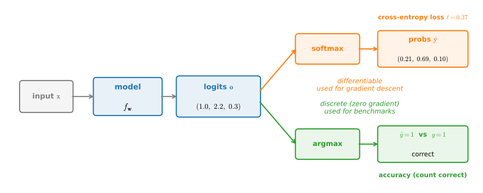

```{.python .input}
%load_ext d2lbook.tab
tab.interact_select('mxnet', 'pytorch', 'tensorflow', 'jax')
```

# The Base Classification Model
:label:`sec_classification`

Every classification model in this book, from the linear softmax regressor we build next to the deep convolutional networks of later chapters, shares two common needs: a *validation step* that reports both loss and accuracy, and a default optimizer. Rather than re-implementing these in every subclass, we collect them once in a `Classifier` base class that extends the `d2l.Module` scaffold introduced in :numref:`sec_oo-design`. The payoff is the same one that motivated `Module` itself: a new classifier supplies only what is genuinely model-specific (its `forward` pass, and a `loss` if it is not plain cross-entropy), and inherits the training and evaluation machinery for free.

```{.python .input #classification-the-base-classification-model}
%%tab mxnet
from d2l import mxnet as d2l
from mxnet import autograd, np, npx, gluon
npx.set_np()
```

```{.python .input #classification-the-base-classification-model}
%%tab pytorch
from d2l import torch as d2l
import torch
```

```{.python .input #classification-the-base-classification-model}
%%tab tensorflow
from d2l import tensorflow as d2l
import tensorflow as tf
```

```{.python .input #classification-the-base-classification-model}
%%tab jax
from d2l import jax as d2l
from jax import numpy as jnp
import optax
```

## The `Classifier` Class

:begin_tab:`pytorch, mxnet, tensorflow`
We define the `Classifier` class below. In the `validation_step` we report both the loss value and the classification accuracy on a validation batch. The plotting machinery records one point per batch, and since all validation batches (except possibly the last) contain the same number of examples, the average of the plotted per-batch values equals the loss and accuracy over the whole validation set. That average is off only when the final batch is smaller, a minor discrepancy we ignore to keep the code simple.
:end_tab:

:begin_tab:`tensorflow`
The `_report_val` method mirrors `validation_step`
but accepts a precomputed `y_hat`,
so the compiled validation graph
(see :numref:`sec_linear_scratch`)
only needs to run the forward pass once.
:end_tab:

:begin_tab:`jax`
We define the `Classifier` class below. In the `validation_step` we report both the loss value and the classification accuracy on a validation batch. The plotting machinery records one point per batch, and since all validation batches (except possibly the last) contain the same number of examples, the average of the plotted per-batch values equals the loss and accuracy over the whole validation set. That average is off only when the final batch is smaller, a minor discrepancy we ignore to keep the code simple.

NNX modules own their parameters and other state. The compiled trainer can
therefore call the model directly, while NNX tracks updates such as BatchNorm
running statistics automatically. The validation step returns its two metrics
to the trainer, which records them outside the compiled computation.
:end_tab:

```{.python .input #classification-the-classifier-class-1}
%%tab pytorch, mxnet, tensorflow
class Classifier(d2l.Module):  #@save
    """The base class of classification models."""
    def validation_step(self, batch):
        Y_hat = self(*batch[:-1])
        self.plot('loss', self.loss(Y_hat, batch[-1]), train=False)
        self.plot('acc', self.accuracy(Y_hat, batch[-1]), train=False)

    def _report_val(self, y_hat, batch):
        self.plot('loss', self.loss(y_hat, batch[-1]), train=False)
        self.plot('acc', self.accuracy(y_hat, batch[-1]), train=False)
```

```{.python .input #classification-the-classifier-class-1}
%%tab jax
class Classifier(d2l.Module):  #@save
    """The base class of classification models."""
    def validation_step(self, batch):
        Y_hat = self(*batch[:-1])
        return self.loss(Y_hat, batch[-1]), self.accuracy(Y_hat, batch[-1])
```

By default we use a stochastic gradient descent optimizer operating on minibatches, just as we did in the context of linear regression. `configure_optimizers` is a hook: `Trainer` calls it once at the start of training (see :numref:`sec_oo-design`), and it returns the optimizer object that `Trainer` then uses to update the parameters after each backward pass. We install it on `d2l.Module` rather than `Classifier` because regression models use the same default; a subclass can still override it (later chapters do exactly that) to switch optimizers.

```{.python .input #classification-the-classifier-class-2}
%%tab mxnet
@d2l.add_to_class(d2l.Module)  #@save
def configure_optimizers(self):
    params = self.parameters()
    if isinstance(params, list):
        return d2l.SGD(params, self.lr)
    return gluon.Trainer(params, 'sgd', {'learning_rate': self.lr})
```

```{.python .input #classification-the-classifier-class-2}
%%tab pytorch
@d2l.add_to_class(d2l.Module)  #@save
def configure_optimizers(self):
    return torch.optim.SGD(self.parameters(), lr=self.lr)
```

```{.python .input #classification-the-classifier-class-2}
%%tab tensorflow
@d2l.add_to_class(d2l.Module)  #@save
def configure_optimizers(self):
    return tf.keras.optimizers.SGD(float(self.lr))
```

```{.python .input #classification-the-classifier-class-2}
%%tab jax
@d2l.add_to_class(d2l.Module)  #@save
def configure_optimizers(self):
    return optax.sgd(self.lr)
```

## Accuracy

Before we implement the accuracy metric, consider why a classifier needs *two* numbers at all. A single forward pass produces a vector of scores $\mathbf{o}\in\mathbb{R}^q$, one per class, and from there the picture forks into two branches that read the *same* scores for very different purposes (:numref:`fig_mdl-clf-loss-accuracy`). On the training branch we turn the scores into probabilities with the softmax and read off the cross-entropy loss. This loss is a smooth function of the parameters, so gradient descent can minimize it; and it keeps rewarding the model for putting more probability on the correct class even after the decision is already right, nudging a confidence of $0.51$ toward $0.99$. On the evaluation branch we take the $\arg\max$ of the scores to a single hard decision $\hat{y}$, compare it with the label, and count the hit. This is the accuracy: the fraction of correct decisions. It is a common benchmark metric but a *discrete* quantity whose gradient is zero almost everywhere, since a tiny change to the scores almost never flips which entry is largest. Whether accuracy is the right deployment metric depends on the costs of different errors and on how the scores will be used.

So we report both, and for complementary reasons. Two models can reach identical accuracy while one is confidently right and the other barely so, and only the loss can tell them apart, which is why it, not accuracy, is what we optimize. Accuracy in turn measures the hard-decision quality that the loss only stands in for. When the two disagree (accuracy flat while the loss still drops, say) that is diagnostic information about optimization and calibration (how well the predicted probabilities match empirical frequencies), not a bug.

![From model scores to a training loss and an evaluation accuracy. One forward pass produces the logits $\mathbf{o}$; the top branch softmaxes them into probabilities $\hat{\mathbf{y}}$ and reads off the differentiable cross-entropy loss that drives gradient descent, while the bottom branch takes the $\arg\max$ to a hard decision $\hat{y}$, compares it with the label $y$, and counts it for accuracy. The numbers shown are the exact softmax and cross-entropy of the logits $(1.0, 2.2, 0.3)$ for true class $y=1$.](../img/mdl-clf-loss-accuracy.svg)
:label:`fig_mdl-clf-loss-accuracy`

Taking the hard decision is what many applications require. Given the predicted probability distribution `y_hat`, we choose the class with the highest predicted probability whenever we must commit to one. Gmail, for instance, must file an email under "Primary", "Social", "Updates", "Forums", or "Spam": it might estimate probabilities internally, but at the end of the day it has to pick a single folder. A prediction that matches the label class `y` is correct, and accuracy is simply the fraction of predictions that are.

Accuracy is computed as follows.
First, if `y_hat` is a matrix,
we assume that the second dimension stores prediction scores for each class.
We use `argmax` to obtain the predicted class by the index for the largest entry in each row.
Then we compare the predicted class with the ground truth `y` elementwise.
Since the equality operator `==` is sensitive to data types,
we cast the predicted classes (`preds`) to `y`'s dtype.
The result is a tensor containing entries of 0 (false) and 1 (true).
Averaging the 0/1 entries yields the fraction correct (or, with `averaged=False`, the raw 0/1 vector).

```{.python .input #classification-accuracy-1  n=9}
%%tab pytorch, mxnet, tensorflow
@d2l.add_to_class(Classifier)  #@save
def accuracy(self, Y_hat, Y, averaged=True):
    """Compute the fraction of correct predictions."""
    Y_hat = d2l.reshape(Y_hat, (-1, Y_hat.shape[-1]))
    preds = d2l.astype(d2l.argmax(Y_hat, axis=1), Y.dtype)
    compare = d2l.astype(preds == d2l.reshape(Y, (-1,)), d2l.float32)
    return d2l.reduce_mean(compare) if averaged else compare
```

:begin_tab:`jax`
The NNX version receives the precomputed scores just like the other
frameworks. The surrounding validation step is compiled, so this small metric
does not need its own `jit` decorator.
:end_tab:

```{.python .input #classification-accuracy-1  n=9}
%%tab jax
@d2l.add_to_class(Classifier)  #@save
def accuracy(self, Y_hat, Y, averaged=True):
    """Compute the fraction of correct predictions."""
    Y_hat = d2l.reshape(Y_hat, (-1, Y_hat.shape[-1]))
    preds = d2l.astype(d2l.argmax(Y_hat, axis=1), Y.dtype)
    compare = d2l.astype(preds == d2l.reshape(Y, (-1,)), d2l.float32)
    return d2l.reduce_mean(compare) if averaged else compare
```

:begin_tab:`mxnet`
MXNet's `gluon.Block.collect_params` only finds parameters declared
through Gluon's `Parameter` machinery, so it misses the bare `np.ndarray`
attributes that the from-scratch implementations in this book use.
We extend `d2l.Module` with a fallback `get_scratch_params` that
walks attributes recursively, and a `parameters` method that returns
Gluon's params when present and the scratch params otherwise. This
fallback is specific to Gluon's parameter API.
:end_tab:

```{.python .input #classification-accuracy-2  n=10}
%%tab mxnet

@d2l.add_to_class(d2l.Module)  #@save
def get_scratch_params(self):
    # collect_params() only finds Parameters declared via Gluon's Parameter
    # API. For from-scratch models that store weights as bare np.ndarrays, we
    # walk the object's attributes recursively and gather those instead.
    params = []
    for attr in dir(self):
        a = getattr(self, attr)
        if isinstance(a, np.ndarray):
            params.append(a)
        if isinstance(a, d2l.Module):
            params.extend(a.get_scratch_params())
    return params

@d2l.add_to_class(d2l.Module)  #@save
def parameters(self):
    # Return the Gluon ParameterDict when the model uses Gluon layers; fall
    # back to the bare-array scan for from-scratch implementations.
    params = self.collect_params()
    return params if isinstance(params, dict) and len(
        params.keys()) else self.get_scratch_params()
```

## Beyond Accuracy

Accuracy treats every example, and every kind of mistake, as equally important. Once classes are *imbalanced*, that assumption fails in a way that can make accuracy actively misleading. Consider screening for a disease that affects 1% of the population. A "classifier" that ignores its input and always predicts *healthy* is right 99% of the time, so its accuracy is 0.99, and it is also perfectly useless: it finds not a single sick patient. The counts make this concrete:

```{.python .input #classification-beyond-accuracy}
n, sick = 100_000, 1_000            # 1% of the population carries the disease
tp, fp, fn = 0, 0, sick             # "always predict healthy" never fires
accuracy = 1 - (fp + fn) / n
recall = tp / sick                  # fraction of sick patients found
accuracy, recall
```

The numbers that expose the failure come from breaking the counts down by what was predicted and what was true. For a binary problem there are four cases, which we arrange in a $2\times2$ table: *true positives* (TP, predicted positive, was positive), *false positives* (FP, predicted positive, was negative), *false negatives* (FN, predicted negative, was positive), and *true negatives* (TN). Two ratios summarize the two failure modes:

$$\textrm{precision} = \frac{\textrm{TP}}{\textrm{TP} + \textrm{FP}}, \qquad \textrm{recall} = \frac{\textrm{TP}}{\textrm{TP} + \textrm{FN}}.$$

Precision asks: of the examples we *flagged*, how many were real? Recall asks: of the real positives, how many did we *find*? The always-healthy classifier above has recall $0$ (and its precision is undefined, since it never flags anyone), which tells the true story that the 99% accuracy conceals. When a single summary number is needed, the *F1 score*, the harmonic mean $2\,\textrm{PR}/(\textrm{P}+\textrm{R})$ of precision and recall, is the conventional compromise, high only when both are.

For $q$ classes the same bookkeeping becomes a $q \times q$ *confusion matrix*: entry $(i, j)$ counts the examples of true class $j$ that the model predicted as class $i$, so the diagonal holds the correct decisions and every off-diagonal cell isolates one specific kind of error. The confusion matrix is the classification diagnostic; a single accuracy number is just the normalized trace (the fraction on the diagonal). We will meet it twice more in this chapter: in :numref:`sec_softmax_scratch` we compute one for our trained Fashion-MNIST classifier to see *which* classes it confuses, and in :numref:`sec_environment-and-distribution-shift` the very same matrix becomes the key computational object for correcting label shift.

## Summary

The `Classifier` class adds two things to `d2l.Module`: an overridden `validation_step` that logs *both* the loss and the accuracy, and a default `configure_optimizers` that returns a minibatch SGD optimizer. Because of this, every classification model in the rest of the book can subclass `Classifier` and supply only its `forward` pass (and a custom `loss`, where the default cross-entropy will not do), inheriting the whole training and evaluation loop. Accuracy itself is the fraction of examples whose predicted class, the $\arg\max$ of the score vector, matches the true label. It is a discrete metric and so cannot serve as a training objective, but it is commonly reported in benchmarks and should be watched alongside the loss when all mistakes have comparable costs. On imbalanced or cost-sensitive problems, accuracy alone can badly mislead; precision, recall, and the confusion matrix break the errors down by kind, and the confusion matrix in particular will return twice more in this chapter.


## Exercises

1. Denote by $L_\textrm{v}$ the validation loss, and let $L_\textrm{v}^\textrm{q}$ be its quick and dirty estimate computed by the loss function averaging in this section. Lastly, denote by $l_\textrm{v}^\textrm{b}$ the loss on the last minibatch. Express $L_\textrm{v}$ in terms of $L_\textrm{v}^\textrm{q}$, $l_\textrm{v}^\textrm{b}$, and the sample and minibatch sizes.
1. Show that the quick and dirty estimate $L_\textrm{v}^\textrm{q}$ is unbiased. That is, show that $E[L_\textrm{v}] = E[L_\textrm{v}^\textrm{q}]$. Why would you still want to use $L_\textrm{v}$ instead?
1. Given a multiclass classification loss, denoting by $l(y,y')$ the penalty of estimating $y'$ when we see $y$ and given a probability $p(y \mid x)$, formulate the rule for an optimal selection of $y'$. Hint: express the expected loss, using $l$ and $p(y \mid x)$.
1. Suppose two classifiers $A$ and $B$ both achieve 90% accuracy on a ten-class test set, but on the examples they get right, $A$ assigns probability $0.91$ on average to the correct class while $B$ assigns only $0.51$. (i) Compute the average cross-entropy loss each incurs on those examples. (ii) Explain why these averages are insufficient to decide which classifier is safer: what must we know about their probabilities on incorrect predictions, calibration by subgroup, and the costs of their errors? (iii) Construct a simple monotone rescaling of the scores (a temperature) that sharpens $B$'s probabilities without changing any of its $\arg\max$ decisions, and argue why its accuracy is therefore unchanged.
1. Generalize `accuracy` to *top-$k$ accuracy*, which counts a prediction as correct when the true class is among the $k$ highest-scoring classes. (i) Modify the four-line implementation to take a `k` argument (hint: replace the single `argmax` with the indices of the $k$ largest scores). (ii) On a $q$-class problem, what is top-$q$ accuracy always equal to, and why? (iii) Why is top-5 accuracy a standard companion to top-1 on benchmarks with many fine-grained classes?
1. In the disease-screening example, suppose we care much more about missing a sick patient than about a false alarm. (i) Modify the cross-entropy loss so that each class $j$ carries a weight $w_j$, multiplying the loss of every example of true class $j$; this is a one-line change to `loss`. (ii) Show that this weighted loss is exactly the weighted empirical risk minimization objective :eqref:`eq_weighted-empirical-risk-min` of :numref:`sec_environment-and-distribution-shift` with weights $\beta_i = w_{y_i}$, and explain why upweighting the rare class shifts the learned decision boundary toward higher recall. (iii) Give a second, data-side intervention with the same effect (hint: sampling).
1. A binary classifier's score can be thresholded at any $\tau \in (0, 1)$, not just $\frac{1}{2}$: predict positive whenever $\hat{y}_1 > \tau$. Sweep $\tau$ from $1$ down to $0$ for a classifier of your choice (for instance a two-class subset of Fashion-MNIST, such as sneaker versus sandal, once you have trained the model of :numref:`sec_softmax_scratch`). (i) Compute the true-positive rate (recall) and the false-positive rate at each $\tau$ and plot one against the other; this curve is called the *receiver operating characteristic* (ROC). (ii) What do the endpoints $\tau=1$ and $\tau=0$ correspond to? (iii) Argue that a classifier whose scores are a random permutation of the data traces the diagonal in expectation, and that the area under the curve is therefore a threshold-free summary of ranking quality.

:begin_tab:`mxnet`
[Discussions](https://d2l.discourse.group/t/6808)
:end_tab:

:begin_tab:`pytorch`
[Discussions](https://d2l.discourse.group/t/6809)
:end_tab:

:begin_tab:`tensorflow`
[Discussions](https://d2l.discourse.group/t/6810)
:end_tab:

:begin_tab:`jax`
[Discussions](https://d2l.discourse.group/t/17981)
:end_tab:

<!-- slides -->

::: {.slide}
::: {.cover}
[Dive into Deep Learning · §4.3]{.kicker}

The base **classification** model<br>One forward pass, read two ways: a *loss* to train on, an *accuracy* to report, and what to do when accuracy lies.
:::
:::

::: {.slide title="One forward pass, two readings"}
[Motivation]{.kicker}

::: {.cols .vc}
::: {.col}
A classifier scores the classes, then the picture **forks**:

- **train** on a smooth **loss** that gradient descent can minimize;
- **report** a hard **accuracy**, the number benchmarks care about.

::: {.d2l-note}
We collect both, once, in a `Classifier` base class so every model
in the book inherits them for free.
:::
:::

::: {.col .fig .big}

:::
:::
:::

::: {.slide}
::: {.divider}
[01]{.dnum}

[The `Classifier` base class]{.dtitle}

[what every model inherits, what each supplies]{.dsub}
:::
:::

::: {.slide title="Inherit the loop, supply the model"}
[The base class]{.kicker}

::: {.cols .vc}
::: {.col}
`Classifier` extends the `d2l.Module` scaffold from the regression
chapter, adding classification defaults.

- **Inherited:** a validation step (loss + accuracy) and a default
  optimizer.
- **Supplied by a subclass:** its `forward` pass, and a `loss` only
  if plain cross-entropy will not do.
:::

::: {.col .narrow}
::: {.d2l-note .rule}
Same payoff as `Module` itself: write the model-specific part once,
get the training and evaluation machinery for free.
:::
:::
:::
:::

::: {.slide title="Validation reports loss *and* accuracy" except="jax"}
[The base class]{.kicker}

The override logs two curves per validation batch, where regression
logged one:

@classification-the-classifier-class-1

::: {.d2l-note}
Averaging over `num_val_batches` is slightly off on a short last
batch; we ignore that to keep the code simple.
:::
:::

::: {.slide title="Validation under JAX: stateful NNX modules" only="jax"}
NNX modules own parameters and mutable state; the compiled step returns both
metrics for the trainer to record:

@classification-the-classifier-class-1
:::

::: {.slide title="A default optimizer, installed once"}
[The base class]{.kicker}

`configure_optimizers` is a hook the `Trainer` calls at startup. We
put plain minibatch **SGD** on `Module` itself, so no subclass repeats
it (later chapters override to switch optimizers):

@classification-the-classifier-class-2
:::

::: {.slide}
::: {.divider}
[02]{.dnum}

[Accuracy]{.dtitle}

[the hard-decision metric, in four lines]{.dsub}
:::
:::

::: {.slide title="Why a classifier needs *two* numbers"}
[Scores, loss, decision]{.kicker}

::: {.cols .vc}
::: {.col}
The same logits $\mathbf{o}$ feed two branches with different jobs.

. . .

**Loss** (top) softmaxes to probabilities and is *differentiable*, so
it trains the model, and keeps rewarding confidence past the point the
decision is right.

. . .

**Accuracy** (bottom) is $\arg\max$ then compare: a *discrete* count
whose gradient is zero almost everywhere, so it cannot be optimized
directly.
:::

::: {.col .fig}

:::
:::
:::

::: {.slide title="Accuracy in four lines" except="jax"}
[Scores, loss, decision]{.kicker}

`argmax` along the class axis, compare with the label element-wise,
average the 0/1 hits:

@classification-accuracy-1

::: {.d2l-note}
The `astype` matches dtypes before `==`, since the comparison is
type-sensitive.
:::
:::

::: {.slide title="Accuracy in four lines" only="jax"}
[Scores, loss, decision]{.kicker}

`argmax` along the class axis, compare with the label element-wise,
average the 0/1 hits:

@classification-accuracy-1

::: {.d2l-note}
The `astype` matches dtypes before `==`, since the comparison is
type-sensitive. JAX adds `@jax.jit` and runs the forward pass from
`params`.
:::
:::

::: {.slide title="Finding the weights to score" only="mxnet"}
Gluon's `collect_params` misses bare-array weights, so MXNet adds a recursive fallback:

@classification-accuracy-2
:::

::: {.slide title="Report both, for complementary reasons"}
[Scores, loss, decision]{.kicker}

Two classifiers can hit the **same accuracy** while one is confidently
right and the other barely so.

. . .

Only the **loss** separates a correct-class probability of $0.51$ from
$0.99$, which is why it, not accuracy, is what we optimize.

. . .

::: {.d2l-note .rule}
When the two disagree (accuracy flat while loss still drops) that is a
diagnostic about optimization and calibration (how well predicted
probabilities match empirical frequencies), **not a bug**.
:::
:::

::: {.slide}
::: {.divider}
[03]{.dnum}

[Beyond Accuracy]{.dtitle}

[when the headline number lies]{.dsub}
:::
:::

::: {.slide title="99% accurate, perfectly useless" only="pytorch"}
[Beyond Accuracy]{.kicker}

Screen for a disease carried by **1%** of the population. A "classifier"
that ignores its input and always says *healthy* is right 99% of the time,
and finds **not one** sick patient:

@classification-beyond-accuracy

::: {.d2l-note .warn}
Accuracy **0.99**, recall **0.0**. Accuracy weights every example equally,
so under class imbalance it can award a near-perfect score to a model that
never does its job.
:::
:::

::: {.slide title="99% accurate, perfectly useless" except="pytorch"}
[Beyond Accuracy]{.kicker}

Screen for a disease carried by **1%** of the population. A "classifier"
that ignores its input and always says *healthy* scores

$$\textrm{accuracy} = 1 - \frac{\textrm{FP} + \textrm{FN}}{n}
 = 1 - \frac{0 + 1{,}000}{100{,}000} = \mathbf{0.99},
\qquad
\textrm{recall} = \frac{\textrm{TP}}{\textrm{sick}} = \frac{0}{1{,}000} = \mathbf{0.0}.$$

::: {.d2l-note .warn}
Accuracy **0.99**, recall **0.0**: it finds not one sick patient. Accuracy
weights every example equally, so under class imbalance it can award a
near-perfect score to a model that never does its job.
:::
:::

::: {.slide title="Precision and recall name the two failure modes"}
[Beyond Accuracy]{.kicker}

Break the counts down by *predicted* $\times$ *true*: TP, FP, FN, TN. Two
ratios summarize the two ways to fail:

$$\textrm{precision} = \frac{\textrm{TP}}{\textrm{TP} + \textrm{FP}}
\qquad\qquad
\textrm{recall} = \frac{\textrm{TP}}{\textrm{TP} + \textrm{FN}}$$

. . .

**Precision:** of those we *flagged*, how many were real?
**Recall:** of the real positives, how many did we *find*?
The always-healthy screener has recall $0$ (precision undefined: it never flags).

::: {.d2l-note}
One number when you must: the **F1 score** $2PR/(P{+}R)$, high only when
*both* are.
:::
:::

::: {.slide title="The confusion matrix: every error, itemized"}
[Beyond Accuracy]{.kicker}

For $q$ classes the same bookkeeping becomes a $q \times q$ **confusion
matrix**: entry $(i, j)$ counts true class $j$ predicted as class $i$.

. . .

- The **diagonal** holds the correct decisions; accuracy is just its
  normalized trace (the fraction on the diagonal), one number where the
  matrix keeps $q^2$.
- Every **off-diagonal cell** isolates one specific kind of error.

::: {.d2l-note .rule}
This object returns twice: in §4.4 we compute one for our Fashion-MNIST
model and read *which* classes it confuses; in §4.7 the very same matrix is
**inverted** to correct label shift.
:::
:::

::: {.slide title="Recap"}
[Wrap-up]{.kicker}

::: {.cols}
::: {.col}
- `Classifier(d2l.Module)` adds a **loss + accuracy** validation step
  and a default **SGD** optimizer.
- A new model supplies only `forward` (and a custom `loss`), inheriting
  the whole loop.
- **Accuracy** = fraction whose $\arg\max$ matches the label:
  `argmax → == y → mean`. Discrete, so we **train on the loss**.
:::

::: {.col}
- Under **imbalance** accuracy can lie: always-healthy scores **0.99**
  with recall **0.0**.
- **Precision / recall** split the failure modes; **F1** compresses them.
- The **confusion matrix** itemizes all $q^2$ outcomes, computed in
  §4.4, inverted in §4.7.
:::
:::
:::
