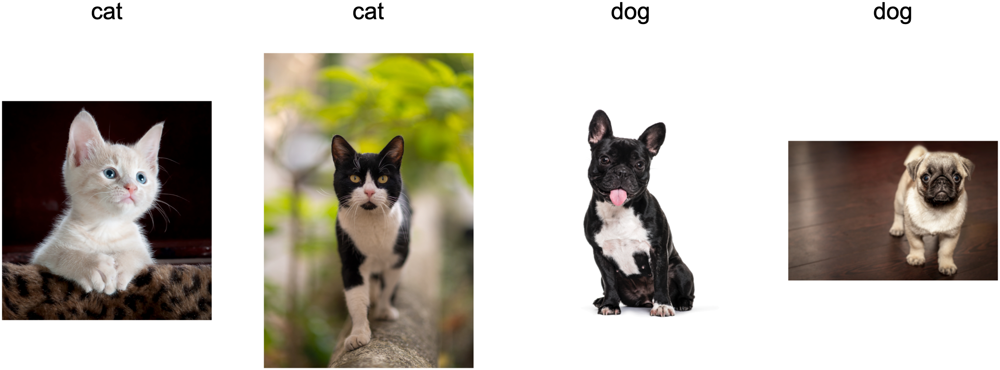
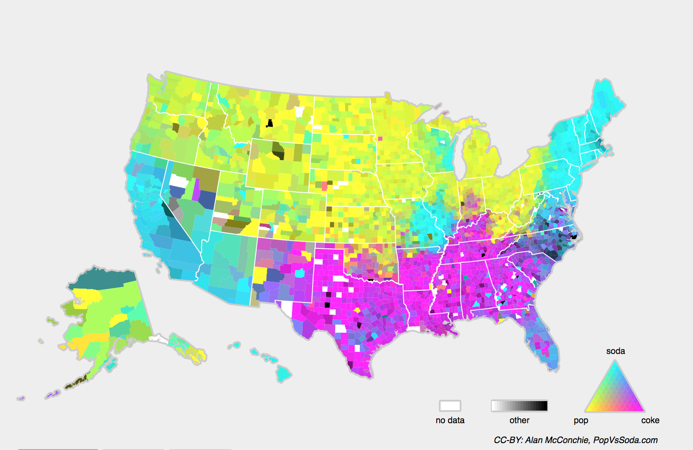

```{.python .input}
%load_ext d2lbook.tab
tab.interact_select('mxnet', 'pytorch', 'tensorflow', 'jax')
```

# Environment and Distribution Shift
:label:`sec_environment-and-distribution-shift`

The preceding analysis assumes that training and deployment data follow the
same distribution. In practice, data collection, time, policy, and user
behavior can change that distribution. A model with high test accuracy may
then perform poorly after deployment.
Deployment itself can also change the data distribution.
Say, for example, that we trained a model
to predict who will repay rather than default on a loan,
finding that an applicant's choice of footwear
was associated with the risk of default
(Oxfords indicate repayment, sneakers indicate default).
We might be inclined 
thereafter to grant a loan
to any applicant wearing Oxfords
and to deny all applicants wearing sneakers.

This policy confuses a predictive association with a decision rule and ignores
how applicants may respond.
For starters, as soon as we began
making decisions based on footwear,
customers would catch on and change their behavior.
Before long, all applicants would be wearing Oxfords,
without any coincident improvement in credit-worthiness.
Similar feedback occurs in many applications: model-based decisions can alter
the environment that supplies later inputs. This is an instance of
*Goodhart's law*:
when a measure becomes a target, it ceases to be a good measure.

This section identifies common forms of distribution shift, their assumptions,
and several correction strategies.
Some of the solutions are simple
(ask for the "right" data),
some are technically difficult
(implement a reinforcement learning system),
and others require policy and ethical analysis beyond statistical prediction.

## Types of Distribution Shift

To begin, we stick with the passive prediction setting
considering the various ways that data distributions might shift
and what might be done to salvage model performance.
In one classic setup, we assume that our training data
was sampled from some distribution $p_S(\mathbf{x},y)$
but that our test data will consist
of unlabeled examples drawn from
some different distribution $p_T(\mathbf{x},y)$.
Absent any assumptions on how $p_S$
and $p_T$ relate to each other,
learning a classifier that works at test time is impossible.

Consider a binary classification problem,
where we wish to distinguish between dogs and cats.
If the distribution can shift in arbitrary ways,
then our setup permits the pathological case
in which the distribution over inputs remains
constant: $p_S(\mathbf{x}) = p_T(\mathbf{x})$,
but the labels are all flipped:
$p_S(y \mid \mathbf{x}) = 1 - p_T(y \mid \mathbf{x})$.
If the meanings of "cat" and "dog" swap without any change in the input
distribution $p(\mathbf{x})$, unlabeled target inputs cannot distinguish this
case from one with no shift.

Under explicit restrictions on how the distribution changes, algorithms can
sometimes detect the shift or adapt the classifier.

### Covariate Shift

Among categories of distribution shift,
covariate shift may be the most widely studied.
Here, we assume that while the distribution of inputs
may change over time, the labeling function,
i.e., the conditional distribution
$P(y \mid \mathbf{x})$ does not change.
Statisticians call this *covariate shift*
because the problem arises due to a
shift in the distribution of the covariates (features).
While we can sometimes reason about distribution shift
without invoking causality, we note that covariate shift
is the natural assumption to invoke in settings
where we believe that $\mathbf{x}$ causes $y$.

Consider the challenge of distinguishing cats and dogs.
Our training data might consist of images of the kind in :numref:`fig_cat-dog-train`.


:label:`fig_cat-dog-train`


At test time we are asked to classify the images in :numref:`fig_cat-dog-test`.


:label:`fig_cat-dog-test`

The training set consists of photos,
while the test set contains only cartoons.
Training on a dataset with substantially different
characteristics from the test set
can spell trouble absent a coherent plan
for how to adapt to the new domain.

### Label Shift

*Label shift* describes the converse problem.
Here, we assume that the label marginal $P(y)$
can change
but the class-conditional distribution
$P(\mathbf{x} \mid y)$ remains fixed across domains.
Label shift is a reasonable assumption to make
when we believe that $y$ causes $\mathbf{x}$.
For example, we may want to predict diagnoses
given their symptoms (or other manifestations),
even as the relative prevalence of diagnoses
is changing over time.
Label shift is the appropriate assumption here
because diseases cause symptoms.
In some degenerate cases the label shift
and covariate shift assumptions can hold simultaneously.
For example, when the label is deterministic,
the covariate shift assumption will be satisfied,
even when $y$ causes $\mathbf{x}$.
Interestingly, in these cases,
it is often advantageous to work with methods
that flow from the label shift assumption.
That is because these methods tend
to involve manipulating objects that look like labels (often low-dimensional),
as opposed to objects that look like inputs,
which tend to be high-dimensional in deep learning.

### Concept Shift

We may also encounter the related problem of *concept shift*,
which arises when the very definitions of labels can change.
This sounds weird (a *cat* is a *cat*, no?).
However, other categories are subject to changes in usage over time.
Diagnostic criteria for mental illness,
what passes for fashionable, and job titles,
are all subject to considerable
amounts of concept shift.
It turns out that if we navigate around the United States,
shifting the source of our data by geography,
we will find considerable concept shift regarding
the distribution of names for *soft drinks*
as shown in :numref:`fig_popvssoda`.


:width:`400px`
:label:`fig_popvssoda`

If we were to build a machine translation system,
the distribution $P(y \mid \mathbf{x})$ might be different
depending on our location.
This problem can be tricky to spot.
We might hope to exploit knowledge
that shift only takes place gradually
either in a temporal or geographic sense.

## Examples of Distribution Shift

Before turning to formalism and algorithms,
we can discuss some concrete situations
where covariate or concept shift might not be obvious.


### Medical Diagnostics

Imagine that you want to design an algorithm to detect cancer.
You collect data from healthy and sick people
and you train your algorithm.
It works fine, giving you high accuracy
and you conclude that you are ready
for a successful career in medical diagnostics.
*Not so fast.*

The distributions that gave rise to the training data
and those you will encounter in the wild might differ considerably.
This happened to an unfortunate startup
that some of us authors worked with years ago.
They were developing a blood test for a disease
that predominantly affects older men
and hoped to study it using blood samples
that they had collected from patients.
However, it is considerably more difficult
to obtain blood samples from healthy men
than from sick patients already in the system.
To compensate, the startup solicited
blood donations from students on a university campus
to serve as healthy controls in developing their test.
Then they asked whether we could help them
to build a classifier for detecting the disease.

As we explained to them,
it would indeed be easy to distinguish
between the healthy and sick cohorts
with near-perfect accuracy.
However, that is because the test subjects
differed in age, hormone levels,
physical activity, diet, alcohol consumption,
and many more factors unrelated to the disease.
This was unlikely to be the case with real patients.
Due to their sampling procedure,
we could expect to encounter extreme covariate shift.
Moreover, this case was unlikely to be
correctable via conventional methods.
In short, they wasted a significant sum of money.


### Self-Driving Cars

Say a company wanted to use machine learning
for developing self-driving cars.
One key component here is a roadside detector.
Since real annotated data is expensive to get,
they used synthetic data from a game-rendering engine as additional training
data. Performance was high on held-out rendered data but poor on real images.
As it turned out, the roadside had been rendered
with a very simplistic texture.
More importantly, *all* the roadside had been rendered
with the *same* texture and the roadside detector
learned about this "feature" very quickly.

A frequently repeated but poorly documented anecdote describes an attempt to
train a neural network
to detect tanks hidden among trees.
They photographed a forest with no tanks,
then drove tanks in and photographed it again,
and the classifier reportedly performed well on held-out images but failed in
the field.
It had supposedly learned not to find tanks
but to tell the tank-free photos from the rest:
the two image sets differed in lighting and shadow
(one set was taken in the early morning, the other at noon), not in their tanks.
The anecdote is not reliable evidence, but it illustrates a genuine failure
mode. A model can rely on a spurious feature when the training data do not vary
that feature independently of the label; it need only correlate with the label
in your sample and be absent in deployment.

### Nonstationary Distributions

A nonstationary distribution arises
when the distribution changes slowly
(also known as *nonstationary distribution*)
and the model is not updated adequately.
Below are some typical cases.

* We train a computational advertising model and then fail to update it frequently (e.g., we forget to incorporate that an obscure new device called an iPad was just launched).
* We build a spam filter. It works well at detecting all spam that we have seen so far. Spammers then adapt and craft new messages that look unlike anything we have seen before.
* We build a product recommendation system. It works throughout the winter but then continues to recommend Santa hats long after Christmas.

### Further Failure Modes

* We build a face detector. It works well on all benchmarks. It fails on test data when the offending examples are close-ups where the face fills the entire image (no such data was in the training set).
* We build a web search engine for the US market and want to deploy it in the UK.
* We train an image classifier by compiling a large dataset where each among a large set of classes is equally represented in the dataset, say 1000 categories, represented by 1000 images each. Then we deploy the system in the real world, where the actual label distribution of photographs is decidedly non-uniform.


## Correction of Distribution Shift

As we have discussed, there are many cases
where training and test distributions
$P(\mathbf{x}, y)$ are different.
Some models continue to work
despite covariate, label, or concept shift.
In other cases, we can do better by employing
principled strategies to cope with the shift.
The remainder of this section develops two correction methods. It may be read
independently of the later chapters, but its assumptions delimit exactly when
unlabeled target data can support reweighting.

Recall from :numref:`subsec_empirical-risk-and-risk` the distinction
between the *empirical risk* :eqref:`eq_empirical-risk-min` (the average
loss on the training data) and the *risk*
:eqref:`eq_true-risk` (the expected loss under the true data
distribution $p(\mathbf{x}, y)$). In practice we cannot evaluate the risk
directly and so we turn to *empirical risk minimization*, hoping that
minimizing the empirical risk on the training set will approximately
minimize the risk.


### Covariate Shift Correction
:label:`subsec_covariate-shift-correction`

Assume that we want to estimate
some dependency $P(y \mid \mathbf{x})$
for which we have labeled data $(\mathbf{x}_i, y_i)$.
The observations $\mathbf{x}_i$ are drawn
from some *source distribution* $q(\mathbf{x})$
rather than the *target distribution* $p(\mathbf{x})$.
The covariate-shift assumption means
that the conditional distribution does not change: $p(y \mid \mathbf{x}) = q(y \mid \mathbf{x})$.
Although labeled observations come from $q(\mathbf{x})$, we can express target
risk as a reweighted source risk through the identity :cite:`Shimodaira.2000`:

$$
\begin{aligned}
\int\int l(f(\mathbf{x}), y) p(y \mid \mathbf{x})p(\mathbf{x}) \;d\mathbf{x}dy =
\int\int l(f(\mathbf{x}), y) q(y \mid \mathbf{x})q(\mathbf{x})\frac{p(\mathbf{x})}{q(\mathbf{x})} \;d\mathbf{x}dy.
\end{aligned}
$$
:eqlabel:`eq_covariate-shift-identity`

In other words, we need to reweigh each data example
by the ratio of the
probability
that it would have been drawn from the target distribution to that from the source distribution:

$$\beta_i \stackrel{\textrm{def}}{=} \frac{p(\mathbf{x}_i)}{q(\mathbf{x}_i)}.$$

Plugging in the weight $\beta_i$ for
each data example $(\mathbf{x}_i, y_i)$
we can train our model using
*weighted empirical risk minimization*:

$$\mathop{\mathrm{minimize}}_f \frac{1}{n} \sum_{i=1}^n \beta_i l(f(\mathbf{x}_i), y_i).$$
:eqlabel:`eq_weighted-empirical-risk-min`


Alas, we do not know that ratio,
so before we can do anything useful we need to estimate it.
Many methods estimate this ratio directly, matching moments of the reweighted
source to the target without ever estimating $p$ and $q$ separately
:cite:`Gretton.Borgwardt.Rasch.ea.2012`.
Note that for any such approach, we need samples
drawn from both distributions: the "true" $p$, e.g.,
by access to test data, and the one used
for generating the training set $q$ (the latter is trivially available).
Note however, that we only need features $\mathbf{x} \sim p(\mathbf{x})$;
we do not need to access labels $y \sim p(y)$.

In this case, there exists a very effective approach
that will give almost as good results as the original: namely, logistic regression,
which is a special case of softmax regression (see :numref:`sec_softmax`)
for binary classification.
This is all that is needed to compute estimated probability ratios.
We learn a classifier to distinguish
between data drawn from $p(\mathbf{x})$
and data drawn from $q(\mathbf{x})$.
If it is impossible to distinguish
between the two distributions
then it means that the associated instances
are equally likely to come from
either one of those two distributions.
On the other hand, any instances
that can be well discriminated
should be significantly overweighted
or underweighted accordingly.

For simplicity's sake assume that we have
an equal number of instances from both distributions
$p(\mathbf{x})$
and $q(\mathbf{x})$, respectively.
Now denote by $z$ labels that are $1$
for data drawn from $p$ and $-1$ for data drawn from $q$.
Then the probability in a mixed dataset is given by

$$P(z=1 \mid \mathbf{x}) = \frac{p(\mathbf{x})}{p(\mathbf{x})+q(\mathbf{x})} \textrm{ and hence } \frac{P(z=1 \mid \mathbf{x})}{P(z=-1 \mid \mathbf{x})} = \frac{p(\mathbf{x})}{q(\mathbf{x})}.$$

Thus, if we use a logistic regression approach,
where $P(z=1 \mid \mathbf{x})=\frac{1}{1+\exp(-h(\mathbf{x}))}$ ($h$ is a parametrized function),
it follows that

$$
\beta_i = \frac{1/(1 + \exp(-h(\mathbf{x}_i)))}{\exp(-h(\mathbf{x}_i))/(1 + \exp(-h(\mathbf{x}_i)))} = \exp(h(\mathbf{x}_i)).
$$

(With unequal sample sizes $\exp(h)$ estimates $p/q$ only up to the constant
$m/n$, which does not affect the weighted minimizer.)

As a result, we need to solve two problems:
first distinguish source from target data,
and then a weighted empirical risk minimization problem
in :eqref:`eq_weighted-empirical-risk-min`
where we weigh terms by $\beta_i$.

Now we are ready to describe a correction algorithm.
Suppose that we have a training set $\{(\mathbf{x}_1, y_1), \ldots, (\mathbf{x}_n, y_n)\}$ and an unlabeled test set $\{\mathbf{u}_1, \ldots, \mathbf{u}_m\}$.
For covariate shift,
we assume that $\mathbf{x}_i$ for all $1 \leq i \leq n$ are drawn from some source distribution
and $\mathbf{u}_i$ for all $1 \leq i \leq m$
are drawn from the target distribution.
Here is a prototypical algorithm
for correcting covariate shift:

1. Create a binary-classification training set from source and target features. Balance the two domain classes by subsampling or class weighting; otherwise include the known domain-prior correction in the odds.
1. Train a binary classifier using logistic regression to get the function $h$.
1. Weigh training data using $\beta_i = \exp(h(\mathbf{x}_i))$ or better $\beta_i = \min(\exp(h(\mathbf{x}_i)), c)$ for some constant $c$.
1. Use weights $\beta_i$ for training on $\{(\mathbf{x}_1, y_1), \ldots, (\mathbf{x}_n, y_n)\}$ in :eqref:`eq_weighted-empirical-risk-min`.

Clipping the weights at a ceiling $c$ trades a little bias for much lower variance:
when source and target barely overlap, a handful of examples acquire enormous weights
$\beta_i$ that would otherwise dominate and destabilize the weighted objective.
:numref:`fig_mdl-clf-density-ratio` shows the geometry of the whole construction:
where the target density $p$ exceeds the source density $q$,
the ratio $\beta = p/q$ grows, and it grows *exponentially* fast
out in the tail where the source has almost no mass,
which is exactly where the clip takes over.


:label:`fig_mdl-clf-density-ratio`

Note that the above algorithm relies on one assumption.
For this scheme to work, we need that each data example
in the target (e.g., test time) distribution
had nonzero probability of occurring at training time.
If we find a point where $p(\mathbf{x}) > 0$ but $q(\mathbf{x}) = 0$,
then the corresponding importance weight should be infinity.

#### Covariate Shift Correction in Code

The following two-dimensional example implements the discriminator and
reweighted training pipeline. We make the shift two-dimensional so that
the shift is visible: source inputs are Gaussian around the origin,
target inputs are the same Gaussian shifted to be centered at $(2, 0)$, and both share
one labeling rule (covariate shift by construction). The label depends on
$\mathbf{x}$ through a *curved* boundary, so a linear classifier is
misspecified and it matters *where* it spends its capacity. The only trainer
we need is logistic regression by gradient descent, with an optional
per-example weight:

```{.python .input #environment-and-distribution-shift-covariate-shift-correction-1}
import numpy as np

rng = np.random.default_rng(0)
n = 1000
X_src = rng.normal(0.0, 1.0, (n, 2))            # source q: centered at (0, 0)
X_tgt = rng.normal(0.0, 1.0, (n, 2)) + [2, 0]   # target p: centered at (2, 0)
label = lambda X: (X[:, 1] > 0.5 * X[:, 0]**2 - 1).astype(float)
y_src, y_tgt = label(X_src), label(X_tgt)

def fit_logreg(X, y, weights=None, lr=0.1, steps=2000):
    w, b = np.zeros(X.shape[1]), 0.0
    v = np.ones(len(y)) if weights is None else weights / weights.mean()
    for _ in range(steps):
        g = v * (1 / (1 + np.exp(-(X @ w + b))) - y)   # weighted residual
        w -= lr * X.T @ g / len(y)
        b -= lr * g.mean()
    return w, b
```

Step one of the algorithm: pool the source inputs (labeled $z=0$) with the
*unlabeled* target inputs ($z=1$) and train the domain discriminator $h$. For
two unit Gaussians the true log-density-ratio is exactly linear,
$\log (p(\mathbf{x})/q(\mathbf{x})) = 2x_1 - 2$, so we can check the learned $h$
against the truth, and the weights are $\beta_i = \exp(h(\mathbf{x}_i))$:

```{.python .input #environment-and-distribution-shift-covariate-shift-correction-2}
w_h, b_h = fit_logreg(np.concatenate([X_src, X_tgt]),
                      np.concatenate([np.zeros(n), np.ones(n)]))
beta = np.exp(X_src @ w_h + b_h)
print(f'learned h(x) = {w_h[0]:.2f} x1 {w_h[1]:+.2f} x2 {b_h:+.2f} '
      f'(true log-ratio: 2 x1 - 2)')
print(f'beta on source data: mean {beta.mean():.2f}, max {beta.max():.1f}')
```

Step two: train the actual classifier three ways, on the same source data
with the same labels, and evaluate each on the *target* domain, which is the
one we care about:

```{.python .input #environment-and-distribution-shift-covariate-shift-correction-3}
acc = lambda wb, X, y: ((X @ wb[0] + wb[1] > 0) == (y > 0.5)).mean()
for name, wts in [('unweighted', None), ('weighted', beta),
                  ('clipped, c=5', np.minimum(beta, 5))]:
    wb = fit_logreg(X_src, y_src, wts)
    print(f'{name:12s}  target accuracy: {acc(wb, X_tgt, y_tgt):.3f}'
          f'   (source accuracy: {acc(wb, X_src, y_src):.3f})')
```

In this seeded construction, the unweighted model fits the source region and
performs near chance on the target domain. Reweighting raises target accuracy
above 90% at the cost of a worse source fit, as
:eqref:`eq_covariate-shift-identity` predicts. The largest raw weight exceeds 50,
so clipping at $c=5$ reduces the influence of a few source points and happens to
improve this run slightly. Repeated seeds or confidence intervals are needed
before treating that last comparison as systematic.
Exercise 3 lets you probe when this pipeline fails, most instructively
when the supports stop overlapping.


### Label Shift Correction

Assume that we are dealing with a
classification task with $k$ categories.
Using the same notation in :numref:`subsec_covariate-shift-correction`,
$q$ and $p$ are the source distribution (e.g., training time) and target distribution (e.g., test time), respectively.
Assume that the distribution of labels shifts over time:
$q(y) \neq p(y)$, but the class-conditional distribution
stays the same: $q(\mathbf{x} \mid y)=p(\mathbf{x} \mid y)$.
If the source distribution $q(y)$ is "wrong",
we can correct for that
according to
the following identity in the risk
as defined in
:eqref:`eq_true-risk`:

$$
\begin{aligned}
\int\int l(f(\mathbf{x}), y) p(\mathbf{x} \mid y)p(y) \;d\mathbf{x}dy =
\int\int l(f(\mathbf{x}), y) q(\mathbf{x} \mid y)q(y)\frac{p(y)}{q(y)} \;d\mathbf{x}dy.
\end{aligned}
$$


Here, our importance weights will correspond to the
label likelihood ratios:

$$\beta_i \stackrel{\textrm{def}}{=} \frac{p(y_i)}{q(y_i)}.$$

One nice thing about label shift is that
if we have a reasonably good model
on the source distribution,
then we can get consistent estimates of these weights
without ever having to deal with the ambient dimension.
In deep learning, the inputs tend
to be high-dimensional objects like images,
while the labels are often simpler objects like categories.

To estimate the target label distribution,
we first take our reasonably good off-the-shelf classifier
(typically trained on the training data)
and compute its confusion matrix $\mathbf{C}$ on the validation set
(also from the training distribution).
Recall the $k \times k$ confusion matrix of :numref:`sec_classification`,
column-normalized exactly as we computed it in :numref:`sec_softmax_scratch`:
entry $c_{ij}$ is the fraction of validation examples of true class $j$
that the model predicted as class $i$, so each column sums to $1$
and estimates $P(\hat{y}=i \mid y=j)$.

Now, we cannot calculate the confusion matrix
on the target data directly
because we do not get to see the labels for the examples
that we see in the wild,
unless we invest in a complex real-time annotation pipeline.
What we can do, however, is average all of our model's predictions
at test time together, yielding the mean model outputs $\mu(\hat{\mathbf{y}}) \in \mathbb{R}^k$,
where the $i^\textrm{th}$ element $\mu(\hat{y}_i)$
is the fraction of the total predictions on the test set
where our model predicted $i$.

It turns out that under some mild conditions, namely that
our classifier was reasonably accurate in the first place,
that the target data contains only categories
that we have seen before,
and that the label shift assumption holds in the first place
(the strongest assumption here), we can estimate the test set label distribution
by solving a simple linear system

$$\mathbf{C} p(\mathbf{y}) = \mu(\hat{\mathbf{y}}),$$

because as an estimate $\sum_{j=1}^k c_{ij} p(y_j) = \mu(\hat{y}_i)$ holds for all $1 \leq i \leq k$,
where $p(y_j)$ is the $j^\textrm{th}$ element of the $k$-dimensional label distribution vector $p(\mathbf{y})$.
If our classifier is accurate enough that $\mathbf{C}$
is diagonally dominant (each class is predicted correctly
more often than it is mistaken for any collection of others),
then $\mathbf{C}$ will be invertible,
and we get a solution $p(\mathbf{y}) = \mathbf{C}^{-1} \mu(\hat{\mathbf{y}})$.
This confusion-matrix estimator goes back to :citet:`Saerens.Latinne.Decaestecker.2002`;
:citet:`Lipton.Wang.Smola.2018` showed that, treating the trained classifier as a
black box, it yields *consistent* estimates of the target label distribution under
the label-shift assumption (an approach they call black-box shift estimation).

Because we observe the labels on the source data,
it is easy to estimate the distribution $q(y)$.
Then, for any training example $i$ with label $y_i$,
we can take the ratio of our estimated $p(y_i)/q(y_i)$
to calculate the weight $\beta_i$,
and plug this into weighted empirical risk minimization
in :eqref:`eq_weighted-empirical-risk-min`.


### Concept Shift Correction

Concept shift requires information about the changed labeling relation.
For instance, in a situation where suddenly the problem changes
from distinguishing cats from dogs to one of
distinguishing white from black animals,
new labeled data may be necessary, potentially followed by retraining.
Some concept shifts are gradual rather than abrupt.
To make things more concrete, here are some examples:

* In computational advertising, new products are launched,
old products become less popular. This means that the distribution over ads and their popularity changes gradually and any click-through rate predictor needs to change gradually with it.
* Traffic camera lenses degrade gradually due to environmental wear, affecting image quality progressively.
* News content changes gradually (i.e., most of the news remains unchanged but new stories appear).

For gradual shift, one possible response is to retain the current weights and
perform update steps on fresh labeled data. Its suitability depends on the rate
and form of the shift.


## Beyond Static Supervised Learning

This chapter studies supervised prediction under distribution shift. Other
problem formulations change the information available to the learner: online
learning reveals observations sequentially, bandits reveal rewards only for
chosen actions, and reinforcement learning allows actions to alter later states.
Those settings require their own notation and algorithms and are developed in
the corresponding later chapters. Here the relevant boundary is simpler: once
deployment decisions change future data, the evaluation distribution is partly
produced by the model itself.


## Deployment Decisions and Feedback

Deploying a model often turns predictions into decisions that affect both people
and the data observed later. A medical classifier, for example, must be evaluated
across relevant populations and against the costs of different errors, not only
by aggregate accuracy. Thresholds
should therefore be chosen from an explicit loss model and evaluated separately
for affected groups. Threshold adjustment alone does not establish fairness:
different fairness criteria can conflict, and the labels, data-collection
process, and decision policy may themselves create harm. This section identifies
the connection to distribution shift; a dedicated treatment is needed for
competing fairness definitions and their limitations.

Decisions can also create feedback loops. Consider predictive policing systems,
which allocate patrol officers
to areas with high forecasted crime.
It is easy to see how a worrying pattern can emerge:

 1. Neighborhoods with more crime get more patrols.
 1. Consequently, more crimes are discovered in these neighborhoods, entering the training data available for future iterations.
 1. Exposed to more positives, the model predicts yet more crime in these neighborhoods.
 1. In the next iteration, the updated model targets the same neighborhood even more heavily leading to yet more crimes discovered, etc.

The model's decisions change where labels are collected, which changes the next
training distribution and reinforces the original allocation. Monitoring this
coupling is part of distribution-shift analysis, but it does not replace a
normative assessment of whether the decision system serves an appropriate goal.


## Summary

In many cases training and test sets do not come from the same distribution. This is called distribution shift.
The risk is the expectation of the loss over the entire population of data drawn from their true distribution. However, this entire population is usually unavailable. Empirical risk is an average loss over the training data to approximate the risk. In practice, we perform empirical risk minimization.

Under covariate- or label-shift assumptions, unlabeled target data can support
specific reweighting corrections. A change in the input marginal may be
detectable without labels, but the claim that $P(y\mid\mathbf{x})$ or
$P(\mathbf{x}\mid y)$ stayed fixed is not generally identifiable from those
data alone. Corrections therefore depend on an assumption that must be defended
from domain knowledge and checked when target labels become available.
Automated actions can affect later observations. Deployment monitoring should
therefore track both predictive performance and feedback between the model and
its environment.

These ideas predate the current era of large pretrained models, but
distribution shift remains central because a foundation model is
routinely deployed on domains, users, and time periods unlike its training
corpus. Curated benchmarks such as WILDS :cite:`Koh.Sagawa.Marklund.ea.2021`
show that models with strong in-distribution accuracy can still degrade sharply
out of distribution, and that a correction which helps on one shift often fails
on another, so evaluation should represent the deployment shifts of interest.

## Exercises

1. **Feedback loops.** If you change the behavior of a search engine, how
   might users respond? How might advertisers respond? Explain why this is
   an instance of the feedback loop described for the loan/footwear example
   at the start of the section.
1. **Covariate-shift identity.** The covariate-shift assumption is
   $p(y \mid \mathbf{x}) = q(y \mid \mathbf{x})$.
    1. Starting from the risk under the target distribution
       $p(\mathbf{x}, y)$, derive :eqref:`eq_covariate-shift-identity`,
       whose sample version is the weighted objective
       :eqref:`eq_weighted-empirical-risk-min`, and mark the step that
       uses the assumption.
    1. State the condition on the supports of $p(\mathbf{x})$ and
       $q(\mathbf{x})$ under which the weights
       $\beta_i = p(\mathbf{x}_i)/q(\mathbf{x}_i)$ are finite.
    1. Suppose $p(\mathbf{x}) > 0$ on a region where $q(\mathbf{x}) = 0$.
       Which part of the target risk does the reweighted source risk omit,
       and why can no choice of weights on source examples recover it?
1. [code] **When reweighting fails.** The pipeline of
   :numref:`subsec_covariate-shift-correction` (`fit_logreg`, `X_src`,
   `X_tgt`, `label`) places the target mean at $(2, 0)$. Sweep the target
   mean over $(s, 0)$ for $s \in \{0, 0.5, 1, 2, 3, 4, 6\}$, keeping
   $n = 1000$ and the labeling rule fixed.
    1. For each $s$, report the accuracy of the domain classifier $h$ on
       held-out pooled data. At which $s$ does it stop beating chance, and
       at which does it approach $1$? Interpret both ends in terms of how
       detectable the shift is.
    1. For each $s$, record the mean and maximum of
       $\beta_i = \exp(h(\mathbf{x}_i))$ over the source data and the
       target accuracy of the unweighted, weighted, and clipped ($c = 5$)
       models. Where does reweighting stop helping, and how do the weight
       statistics signal this?
    1. Relate the failure at large $s$ to the support condition of
       problem 2. Which few source examples carry the weighted objective
       there, and does clipping repair the problem?
1. **Label-shift linear system.** A $k$-class classifier has the
   column-normalized validation confusion matrix $\mathbf{C}$ with entries
   $c_{ij} = q(\hat{y} = i \mid y = j)$, and its predictions on unlabeled
   target data have mean $\mu(\hat{\mathbf{y}})$.
    1. Derive $\mathbf{C}\, p(\mathbf{y}) = \mu(\hat{\mathbf{y}})$ from the
       law of total probability, and identify the step that uses the
       label-shift assumption $q(\mathbf{x} \mid y) = p(\mathbf{x} \mid y)$.
    1. Give an example of a classifier for which $\mathbf{C}$ is singular,
       and describe what $\mu(\hat{\mathbf{y}})$ can still reveal about
       $p(\mathbf{y})$ in that case.
    1. Both $\mathbf{C}$ and $\mu(\hat{\mathbf{y}})$ are estimated from
       finite samples. Explain how errors in $\mu(\hat{\mathbf{y}})$
       propagate to $\mathbf{C}^{-1}\mu(\hat{\mathbf{y}})$ when
       $\mathbf{C}$ is nearly singular.
1. **Beyond distribution shift.** Besides distribution shift, what else
   could make the empirical risk a poor approximation of the risk?
1. **Features missing at serving time.** A model forecasts a store's daily
   revenue at the start of each day. It uses "number of customers so far
   today" as a feature and performs well in offline evaluation on
   historical records. Identify why this feature is unavailable when the
   forecast is made, name the general failure mode, and propose a rule for
   selecting training features that avoids it.

    *Adapted from Google's Machine Learning Crash Course,
    ["Monitoring pipelines"](https://developers.google.com/machine-learning/crash-course/production-ml-systems/monitoring).*
1. [extended] **Real-world shifts.** The WILDS benchmark
   :cite:`Koh.Sagawa.Marklund.ea.2021` catalogs distribution shifts
   collected in the wild. Pick two of its tasks, for example a
   hospital-to-hospital or a camera-trap-to-camera-trap shift, and classify
   each as closer to covariate shift, label shift, or neither, justifying
   your classification from how the data were collected. If you can
   download one of the smaller WILDS datasets, train a linear baseline and
   report its in-distribution versus out-of-distribution accuracy gap.


[Discussions](https://d2l.discourse.group/t/105)

<!-- slides -->

::: {.slide}
::: {.cover}
[Dive into Deep Learning · §4.7]{.kicker}

When deployment data differ from training data<br>**Distribution shift**: assumptions, consequences, and correction methods.
:::
:::

::: {.slide title="From prediction to deployment"}
[Why this matters]{.kicker}

We fit models to data and measure test accuracy. Deployment analysis must also ask **where the data came from** and **how the
prediction will be used**.

. . .

::: {.d2l-note .warn}
A loan model finds that **Oxfords repay, sneakers default**. Approve everyone in Oxfords, and soon *everyone* wears Oxfords, with no change in who actually repays. The decision changed the relationship between footwear and repayment risk.
:::

. . .

This is **Goodhart's law**: *when a measure becomes a target, it ceases to be a good measure.* Deploying a model can perturb the very distribution it was trained on.
:::

::: {.slide title="Train here, deploy there"}
[The setup]{.kicker}

Training data is drawn from a **source** distribution $p_S(\mathbf{x}, y)$; at test time we meet a **target** $p_T(\mathbf{x}, y)$ that may differ.

. . .

::: {.d2l-note}
**With no link between $p_S$ and $p_T$, learning cannot transfer.** Suppose the inputs are unchanged, $p_S(\mathbf{x})=p_T(\mathbf{x})$, but every label flips, $p_S(y\mid\mathbf{x})=1-p_T(y\mid\mathbf{x})$: "cats" become "dogs" overnight. No algorithm can tell this apart from no shift at all.
:::

The way out is **structure**: assume *how* the world may change, and that assumption can enable detection or a specific correction.
:::

::: {.slide}
::: {.divider}
[01]{.dnum}

[Three Kinds of Shift]{.dtitle}

[what stays fixed tells you what to do]{.dsub}
:::
:::

::: {.slide title="Covariate shift: the inputs move"}
[Three kinds of shift]{.kicker}

::: {.cols .vc}
::: {.col}
The input distribution $P(\mathbf{x})$ changes, but the **labeling rule** $P(y\mid\mathbf{x})$ holds.

The natural assumption when **$\mathbf{x}$ causes $y$**: a cat is a cat whether photographed or drawn.

::: {.d2l-note}
Train on **photos**, test on **cartoons** of the same animals. Same labels, very different pixels, so a model trained only on photographs may lose accuracy.
:::
:::

::: {.col .fig}
{width=100%}
:::
:::
:::

::: {.slide title="Label shift: the mix moves"}
[Three kinds of shift]{.kicker}

The label frequencies $P(y)$ change, but each class still **looks the same**: $P(\mathbf{x}\mid y)$ is fixed.

. . .

The natural assumption when **$y$ causes $\mathbf{x}$**: diseases cause symptoms, so as an outbreak shifts how common a diagnosis is, the symptom pattern per disease is unchanged.

. . .

::: {.d2l-note .rule}
**Why prefer it when both could apply?** Its corrections operate in **label space**, whose categories are typically far lower-dimensional than the input space.
:::
:::

::: {.slide title="Concept shift: the labels themselves move"}
[Three kinds of shift]{.kicker}

::: {.cols .vc}
::: {.col}
Now the **definition** of a label drifts: $P(y\mid\mathbf{x})$ changes because what counts as the answer changed.

What people call a *soft drink* depends on **where you ask** ("soda", "pop", "coke").

::: {.d2l-note}
Diagnostic criteria, fashion, and job titles can drift this way across time or
geography. Gradual drift can sometimes be tracked with fresh labeled data;
abrupt changes require faster detection and may require a new model.
:::
:::

::: {.col .fig}
{width=100%}
:::
:::
:::

::: {.slide}
::: {.divider}
[02]{.dnum}

[Consequences]{.dtitle}

[spurious features and slow drift]{.dsub}
:::
:::

::: {.slide title="The model learned the wrong thing"}
[Spurious correlation]{.kicker}

A blood-test startup drew **healthy controls from students**, sick patients from the clinic. The classifier hit near-perfect accuracy, on age, hormones, and diet, **not the disease**.

. . .

::: {.d2l-note .warn}
**A tank-classification example.** A network performs well on held-out images
but fails in the field because tank photos were taken at noon and empty scenes
at dawn. The model learned **lighting**, not the presence of a tank.
:::

A model may rely on a feature correlated with the label in the sample but absent
or changed at deployment.
:::

::: {.slide title="Slow drift, stale model"}
[Temporal drift]{.kicker}

The subtler failure: the distribution moves **gradually** (a *nonstationary* world) and the model is never refreshed.

. . .

::: {.cols}
::: {.col}
::: {.d2l-note}
A **spam filter** stops working once spammers craft messages unlike any seen before.
:::
:::

::: {.col}
::: {.d2l-note}
A **recommender** keeps pushing Santa hats long after Christmas.
:::
:::
:::

Performance can deteriorate gradually when the distribution changes and the
model is not updated.
:::

::: {.slide}
::: {.divider}
[03]{.dnum}

[Correcting Shift]{.dtitle}

[reweighting the risk we cannot see]{.dsub}
:::
:::

::: {.slide title="Risk vs. empirical risk"}
[The frame]{.kicker}

What we *want* to minimize is the **risk**: expected loss under the true distribution $p(\mathbf{x}, y)$.

$$R(f) = \mathbb{E}_{(\mathbf{x}, y)\sim p}\,[\,l(f(\mathbf{x}), y)\,].$$

. . .

We cannot evaluate it, so we minimize the **empirical risk**, the average loss on the training sample, and use it as an estimator under sampling assumptions.

$$\hat{R}(f) = \frac{1}{n}\sum_{i=1}^{n} l(f(\mathbf{x}_i), y_i).$$

. . .

Under shift, the training sample comes from the source distribution, so its empirical risk
need not estimate target risk without a correction.
:::

::: {.slide title="Reweight to the right distribution"}
[Covariate shift correction]{.kicker}

Labeled data comes from source $q(\mathbf{x})$, but we care about target $p(\mathbf{x})$. Under $p(y\mid\mathbf{x})=q(y\mid\mathbf{x})$, importance weighting rewrites target risk:

$$\mathbb{E}_{p}[\,l\,] = \mathbb{E}_{q}\!\left[\,\frac{p(\mathbf{x})}{q(\mathbf{x})}\, l\,\right].$$

. . .

So **reweight each example** by how much more likely it is under the target than the source, and minimize a *weighted* empirical risk:

$$\beta_i = \frac{p(\mathbf{x}_i)}{q(\mathbf{x}_i)}, \qquad \min_f\ \frac{1}{n}\sum_{i=1}^{n}\beta_i\, l(f(\mathbf{x}_i), y_i).$$
:::

::: {.slide title="A classifier estimates the weights"}
[Covariate shift correction]{.kicker}

We do not know $p/q$. With equally weighted source and target domain samples, a classifier that
distinguishes them ($z=+1$ for target, $-1$ for source) estimates odds equal
to the density ratio:

$$\frac{P(z{=}1\mid\mathbf{x})}{P(z{=}{-}1\mid\mathbf{x})} = \frac{p(\mathbf{x})}{q(\mathbf{x})}.$$

. . .

With a logistic model $P(z{=}1\mid\mathbf{x})=\sigma(h(\mathbf{x}))$ this collapses to $\beta_i = \exp(h(\mathbf{x}_i))$. We need only **unlabeled** target features $\mathbf{x}\sim p$.
:::

::: {.slide title="Where the weights explode, and why we clip"}
[Covariate shift correction · geometry]{.kicker}

{width=88%}

::: {.d2l-note .rule}
**Clip** $\beta_i \leftarrow \min(\exp(h(\mathbf{x}_i)), c)$: where the
domains barely overlap, a few examples receive enormous weights and dominate
the objective, so a little bias buys much less variance. If $p > 0$ where
$q = 0$, the true weight is *infinite*: reweighting cannot recover support absent from the source sample.
:::
:::

::: {.slide title="The discriminator estimates the known ratio" only="pytorch"}
[Covariate shift correction · watch it work]{.kicker}

A two-dimensional example uses source Gaussian at the origin, target the same Gaussian shifted
to $(2, 0)$, one shared *curved* labeling rule (covariate shift by
construction), with a known answer: the true log-ratio is $2x_1 - 2$. Pool
the inputs, train the domain classifier $h$:

@!environment-and-distribution-shift-covariate-shift-correction-2

::: {.d2l-note}
Learned: $2.06\,x_1 + 0.09\,x_2 - 2.03$. The discriminator estimates the log density ratio, and note the $\beta$ tail: one source point already carries weight
$56$.
:::
:::

::: {.slide title="Reweighting improves target accuracy in this example" only="pytorch"}
[Covariate shift correction · result]{.kicker}

Train the actual classifier three ways on the *same* labeled source data;
evaluate on the **target**, the domain we care about:

@!environment-and-distribution-shift-covariate-shift-correction-3

::: {.d2l-note .rule}
Unweighted fits where the *source* lives: **0.502** on the target, near chance for this balanced binary task. Reweighting: **0.933**, bought by a worse fit on the discounted
source region, exactly the trade the identity prescribes. Clipping at
$c=5$ limits the $\beta > 50$ outliers and even helps: **0.945**.
:::
:::

::: {.slide title="Target accuracy with three weighting choices" except="pytorch"}
[Covariate shift correction · result]{.kicker}

A two-dimensional example uses source Gaussian at the origin, target shifted to $(2, 0)$, one
shared curved labeling rule, so the true log-ratio is known: $2x_1 - 2$.

. . .

- The logistic discriminator recovers $2.06\,x_1 + 0.09\,x_2 - 2.03$: the
  density ratio, learned from unlabeled inputs alone.
- Target accuracy, three ways: **unweighted 0.502** (a coin flip, since the
  model fit where the *source* lives), **weighted 0.933**, **clipped at
  $c{=}5$: 0.945**.

::: {.d2l-note .rule}
Reweighting pays on the target by discounting the source region, exactly
the trade the identity prescribes; the clip limits raw weights that reach
$\beta > 50$ and even helps.
:::
:::

::: {.slide title="Label shift: invert a confusion matrix"}
[Label shift correction]{.kicker}

Here $P(y)$ shifts while $P(\mathbf{x}\mid y)$ is fixed, so the weights are label ratios $\beta_i=p(y_i)/q(y_i)$, and we never touch the high-dimensional inputs.

. . .

Take an off-the-shelf classifier, measure its $k\times k$ **confusion matrix** $\mathbf{C}$ on a source validation set (the very matrix we computed for Fashion-MNIST in the softmax-from-scratch section, column-normalized), and the **average prediction** $\mu(\hat{\mathbf{y}})$ on the (unlabeled) target. They are linked by total probability:

$$\mathbf{C}\, p(\mathbf{y}) = \mu(\hat{\mathbf{y}}) \quad\Longrightarrow\quad p(\mathbf{y}) = \mathbf{C}^{-1}\mu(\hat{\mathbf{y}}).$$

. . .

The system requires a **nonsingular** $\mathbf{C}$. Strict diagonal dominance
(each diagonal entry exceeds the sum of the other entries in its row) is one
sufficient condition; then form $\beta_i$ and reweight.
:::

::: {.slide title="Concept shift requires updating the model"}
[Concept shift correction]{.kicker}

Covariate reweighting cannot repair a changed $P(y\mid\mathbf{x})$; adaptation
requires information about the new labeling relation.

. . .

When concept shift is gradual, as in changing ads or news, fresh labeled data
can reveal the moving target. One practical response is:

::: {.d2l-note}
Keep the current weights and **take a few update steps on fresh data**, rather than retraining from scratch. This allows the model to track gradual changes when the new sample is
representative.
:::
:::

::: {.slide}
::: {.divider}
[04]{.dnum}

[Beyond Passive Prediction]{.dtitle}

[when the environment reacts to you]{.dsub}
:::
:::

::: {.slide title="A taxonomy of learning problems"}
[Learning settings]{.kicker}

The preceding cases assumed *passive prediction*. The environment can also **react**:

. . .

- **Batch:** train once, deploy, never update (the smart catdoor).
- **Online:** data arrives one point at a time; predict, then learn from the outcome.
- **Bandits:** online, but a finite set of actions, so stronger guarantees.
- **Control & RL:** the environment **remembers** and responds, possibly adversarially (a thermostat, a chess opponent, other cars).

. . .

A strategy that is safe in a stationary world can fail once the world adapts to it, for example, an arbitrage opportunity may disappear after widespread use.
:::

::: {.slide title="Predictions become decisions"}
[Fairness & feedback]{.kicker}

Deploying a model can automate decisions about people. Aggregate accuracy may
be insufficient (the costs of different errors differ).

. . .

::: {.d2l-note .warn}
**Predictive-policing feedback loop.** More patrols → more crime *recorded* in that area → the model predicts even more crime there → still more patrols. The data feeds back into the model, reinforcing the allocation.
:::

Watch for feedback loops, cost-sensitive errors, and whether you are solving the right problem at all.
:::

::: {.slide title="Shift in the foundation-model era"}
[Current benchmarks]{.kicker}

Benchmarks like **WILDS** collect *real* shifts (hospitals, cameras,
countries, time) along an axis **orthogonal** to our mechanism taxonomy:

::: {.cols}
::: {.col}
::: {.d2l-note}
**Domain generalization:** test domains never seen in training. *Camelyon17*:
a tumor classifier trained on a few hospitals' slides must survive a **new
hospital's** staining quirks.
:::
:::

::: {.col}
::: {.d2l-note}
**Subpopulation shift:** same domains, new proportions, so what matters is
**worst-group** accuracy. *CivilComments*: average toxicity accuracy conceals
much larger errors on some demographic groups.
:::
:::
:::

. . .

::: {.d2l-note .warn}
**OOD detection ≠ shift correction.** Detection *rejects* inputs the model
cannot handle; correction *reweights* for a target that is here to stay. A
deployed system needs both, and a method that helps under one shift may fail under another, so evaluation must
represent the deployment shift.
:::
:::

::: {.slide title="Summary"}
[Wrap-up]{.kicker}

::: {.cols}
::: {.col}
- **Shift** = train and test distributions differ; unrecognized shift can cause deployment failures.
- **Three kinds:** *covariate* ($P(\mathbf{x})$ moves, $\mathbf{x}\!\to\!y$), *label* ($P(y)$ moves, $y\!\to\!\mathbf{x}$), *concept* (the labels themselves move).
:::

::: {.col}
- **Correct** covariate shift by reweighting with $\beta_i=p(\mathbf{x}_i)/q(\mathbf{x}_i)$, estimated by a source-vs-target classifier (demo: target accuracy $0.502 \to 0.933$, clipped $0.945$); label shift by inverting the confusion matrix.
- **Beware the environment:** it may remember your actions and feed them back. Measure on the shift you actually face (WILDS), and keep monitoring live systems.
:::
:::
:::
