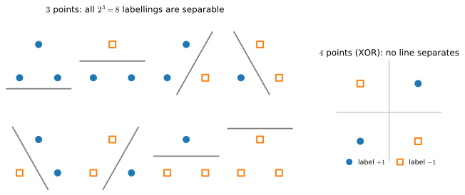

```{.python .input}
%load_ext d2lbook.tab
tab.interact_select('mxnet', 'pytorch', 'tensorflow', 'jax')
```

# Generalization in Classification

:label:`chap_classification_generalization`


So far, we have focused on how to tackle multiclass classification problems
by training (linear) neural networks with multiple outputs and softmax functions.
Interpreting our model's outputs as probabilistic predictions,
we motivated and derived the cross-entropy loss function,
which calculates the negative log likelihood
that our model (for a fixed set of parameters)
assigns to the actual labels.
And finally, we put these tools into practice
by fitting our model to the training set.
However, as always, our goal is to learn *general patterns*,
as assessed empirically on previously unseen data (the test set).
High accuracy on the training set means nothing.
Whenever each of our inputs is unique
(and indeed this is true for most high-dimensional datasets),
we can attain perfect accuracy on the training set
by just memorizing the dataset on the first training epoch,
and subsequently looking up the label whenever we see a new image.
And yet, memorizing the exact labels
associated with the exact training examples
does not tell us how to classify new examples.
Absent further guidance, we might have to fall back
on random guessing whenever we encounter new examples.

A number of burning questions demand immediate attention:

1. How many test examples do we need to give a good estimate of the accuracy of our classifiers on the underlying population?
1. What happens if we keep evaluating models on the same test repeatedly?
1. Why should we expect that fitting our linear models to the training set
   should fare any better than our naive memorization scheme?


Whereas :numref:`sec_generalization_basics` introduced
the basics of overfitting and generalization
in the context of linear regression,
this chapter will go a little deeper,
introducing some of the foundational ideas
of statistical learning theory.
It turns out that we often can guarantee generalization *a priori*:
for many models,
and for any desired upper bound
on the generalization gap $\epsilon$,
we can often determine some required number of samples $n$
such that if our training set contains at least $n$
samples, our empirical error will lie
within $\epsilon$ of the true error,
*for any data generating distribution*.
Unfortunately, it also turns out
that while these sorts of guarantees provide
a profound set of intellectual building blocks,
they are of limited practical utility
to the deep learning practitioner.
In short, these guarantees suggest
that ensuring generalization
of deep neural networks *a priori*
requires an absurd number of examples
(perhaps trillions or more),
even when we find that, on the tasks we care about,
deep neural networks typically generalize
remarkably well with far fewer examples (thousands).
Thus deep learning practitioners often forgo
*a priori* guarantees altogether,
instead employing methods
that have generalized well
on similar problems in the past,
and certifying generalization *post hoc*
through empirical evaluations.
When we get to :numref:`sec_generalization_deep`,
we will revisit generalization
and provide a light introduction
to the vast scientific literature
that has sprung in attempts
to explain why deep neural networks generalize in practice.

## The Test Set

Since we have already begun to rely on test sets
as the gold standard method
for assessing generalization error,
let's get started by discussing
the properties of such error estimates.
Let's focus on a fixed classifier $f$,
without worrying about how it was obtained.
Moreover suppose that we possess
a *fresh* dataset of examples $\mathcal{D} = {(\mathbf{x}^{(i)},y^{(i)})}_{i=1}^n$
that were not used to train the classifier $f$.
The *empirical error* of our classifier $f$ on $\mathcal{D}$
is simply the fraction of instances
for which the prediction $f(\mathbf{x}^{(i)})$
disagrees with the true label $y^{(i)}$,
and is given by the following expression:

$$\epsilon_\mathcal{D}(f) = \frac{1}{n}\sum_{i=1}^n \mathbf{1}(f(\mathbf{x}^{(i)}) \neq y^{(i)}).$$

By contrast, the *population error*
is the *expected* fraction
of examples in the underlying population
(some distribution $P(X,Y)$  characterized
by probability density function $p(\mathbf{x},y)$)
for which our classifier disagrees
with the true label:

$$\epsilon(f) =  E_{(\mathbf{x}, y) \sim P} \mathbf{1}(f(\mathbf{x}) \neq y) =
\int\int \mathbf{1}(f(\mathbf{x}) \neq y) p(\mathbf{x}, y) \;d\mathbf{x} dy.$$

While $\epsilon(f)$ is the quantity that we actually care about,
we cannot observe it directly,
just as we cannot directly
observe the average height in a large population
without measuring every single person.
We can only estimate this quantity based on samples.
Because our test set $\mathcal{D}$
is statistically representative
of the underlying population,
we can view $\epsilon_\mathcal{D}(f)$ as a statistical
estimator of the population error $\epsilon(f)$.
Moreover, because our quantity of interest $\epsilon(f)$
is an expectation (of the random variable $\mathbf{1}(f(X) \neq Y)$)
and the corresponding estimator $\epsilon_\mathcal{D}(f)$
is the sample average,
estimating the population error
is simply the classic problem of mean estimation,
which you may recall from :numref:`sec_prob`.

An important classical result from probability theory
called the *central limit theorem* guarantees
that whenever we possess $n$ random samples $a_1, ..., a_n$
drawn from any distribution with mean $\mu$ and standard deviation $\sigma$,
then, as the number of samples $n$ approaches infinity,
the sample average $\hat{\mu}$ approximately
tends towards a normal distribution centered
at the true mean and with standard deviation $\sigma/\sqrt{n}$.
Already, this tells us something important:
as the number of examples grows large,
our test error $\epsilon_\mathcal{D}(f)$
should approach the true error $\epsilon(f)$
at a rate of $\mathcal{O}(1/\sqrt{n})$.
Thus, to estimate our test error twice as precisely,
we must collect four times as large a test set.
To shrink the uncertainty in our estimate a hundredfold,
we must collect ten thousand times as large a test set.
(Note that more test data never reduces the error itself,
only our uncertainty about its value.)
In general, such a rate of $\mathcal{O}(1/\sqrt{n})$
is often the best we can hope for in statistics.

Now that we know something about the asymptotic rate
at which our test error $\epsilon_\mathcal{D}(f)$ converges to the true error $\epsilon(f)$,
we can zoom in on some important details.
Recall that the random variable of interest
$\mathbf{1}(f(X) \neq Y)$
can only take values $0$ and $1$
and thus is a Bernoulli random variable,
characterized by a parameter
indicating the probability that it takes value $1$.
Here, $1$ means that our classifier made an error,
so the parameter of our random variable
is actually the true error rate $\epsilon(f)$.
The variance $\sigma^2$ of a Bernoulli
depends on its parameter (here, $\epsilon(f)$)
according to the expression $\epsilon(f)(1-\epsilon(f))$.
While $\epsilon(f)$ is initially unknown,
we know that it cannot be greater than $1$.
A little investigation of this function
reveals that our variance is highest
when the true error rate is close to $0.5$
and can be far lower when it is
close to $0$ or close to $1$.
This tells us that the asymptotic standard deviation
of our estimate $\epsilon_\mathcal{D}(f)$ of the error $\epsilon(f)$
(over the choice of the $n$ test samples)
cannot be any greater than $\sqrt{0.25/n}$.

If we ignore the fact that this rate characterizes
behavior as the test set size approaches infinity
rather than when we possess finite samples,
this tells us that if we want our test error $\epsilon_\mathcal{D}(f)$
to approximate the population error $\epsilon(f)$
such that one standard deviation corresponds
to an interval of $\pm 0.01$,
then we should collect roughly 2500 samples.
If we want to fit two standard deviations
in that range and thus be 95% confident
that $\epsilon_\mathcal{D}(f) \in \epsilon(f) \pm 0.01$,
then we will need 10,000 samples!

This turns out to be the size of the test sets
for many popular benchmarks in machine learning.
You might be surprised to find out that thousands
of applied deep learning papers get published every year
making a big deal out of error rate improvements of $0.01$ or less.
Of course, when the error rates are much closer to $0$,
then an improvement of $0.01$ can indeed be a big deal.


One pesky feature of our analysis thus far
is that it really only tells us about asymptotics,
i.e., how the relationship between $\epsilon_\mathcal{D}$ and $\epsilon$
evolves as our sample size goes to infinity.
Fortunately, because our random variable is bounded,
we can obtain valid finite sample bounds
by applying an inequality due to Hoeffding (1963),
proved in :numref:`sec_mdl-concentration-generalization`:

$$P\left(|\epsilon_\mathcal{D}(f) - \epsilon(f)| \geq t\right) < 2\exp\left( - 2n t^2 \right).$$

Solving for the smallest dataset size
that would allow us to conclude
with 95% confidence that the distance $t$
between our estimate $\epsilon_\mathcal{D}(f)$
and the true error rate $\epsilon(f)$
does not exceed $0.01$,
you will find that roughly 18,500 examples are required,
as compared with the 10,000 examples suggested
by the asymptotic analysis above.
If you go deeper into statistics
you will find that this trend holds generally.
Guarantees that hold even in finite samples
are typically slightly more conservative.
Note that in the scheme of things,
these numbers are not so far apart,
reflecting the general usefulness
of asymptotic analysis for giving
us ballpark figures even if they are not
guarantees we can take to court.

All of the above is pencil-and-paper reasoning,
but it is also one short simulation away from being visible.
Fix a classifier whose true error is $\epsilon(f) = 0.1$
and draw many hypothetical test sets:
each per-example indicator is a Bernoulli$(0.1)$ coin,
so a size-$n$ test set produces an estimate
$\epsilon_\mathcal{D}(f) \sim \mathrm{Binomial}(n, 0.1)/n$.

```{.python .input #generalization-classification-the-test-set-1}
%%tab pytorch
%matplotlib inline
import numpy as np
from d2l import torch as d2l
```

```{.python .input #generalization-classification-the-test-set-1}
%%tab tensorflow
%matplotlib inline
import numpy as np
from d2l import tensorflow as d2l
```

```{.python .input #generalization-classification-the-test-set-1}
%%tab jax
%matplotlib inline
import numpy as np
from d2l import jax as d2l
```

```{.python .input #generalization-classification-the-test-set-1}
%%tab mxnet
%matplotlib inline
import numpy as np
from d2l import mxnet as d2l
```

We simulate 1000 such test sets at each size $n$, record the empirical spread
(standard deviation) of the resulting error estimates, and compare it with the
two envelopes derived above: the CLT prediction
$\sqrt{\epsilon(1-\epsilon)/n}$ and the 95% Hoeffding radius
$\sqrt{\log(2/0.05)/(2n)}$.

```{.python .input #generalization-classification-the-test-set-2}
rng = np.random.default_rng(0)
eps, trials = 0.1, 1000
ns = np.array([100, 300, 1000, 3000, 10000])
spread = np.array([(rng.binomial(n, eps, trials) / n).std() for n in ns])
clt = np.sqrt(eps * (1 - eps) / ns)           # CLT standard deviation
hoeff = np.sqrt(np.log(2 / 0.05) / (2 * ns))  # 95% Hoeffding radius
d2l.plot(ns, [spread, clt, hoeff], 'test set size n', 'spread of the estimate',
         legend=['simulated sd', 'CLT sd', 'Hoeffding 95% radius'],
         xscale='log', yscale='log')
```

On log--log axes all three curves are parallel lines of slope $-\frac{1}{2}$:
the $\sqrt{n}$ law in the flesh. The simulated spread sits right on top of the
CLT prediction, while the Hoeffding envelope runs above both by a constant
factor, which is the price of a guarantee that holds at every finite $n$
rather than only asymptotically.

## Test Set Reuse

In some sense, you are now set up to succeed
at conducting empirical machine learning research.
Nearly all practical models are developed
and validated based on test set performance
and you are now a master of the test set.
For any fixed classifier $f$,
you know how to evaluate its test error $\epsilon_\mathcal{D}(f)$,
and know precisely what can (and cannot)
be said about its population error $\epsilon(f)$.

So let's say that you take this knowledge
and prepare to train your first model $f_1$.
Knowing just how confident you need to be
in the performance of your classifier's error rate
you apply our analysis above to determine
an appropriate number of examples
to set aside for the test set.
Moreover, let's assume that you took the lessons from
:numref:`sec_generalization_basics` to heart
and made sure to preserve the sanctity of the test set
by conducting all of your preliminary analysis,
hyperparameter tuning, and even selection
among multiple competing model architectures
on a validation set.
Finally you evaluate your model $f_1$
on the test set and report an unbiased
estimate of the population error
with an associated confidence interval.

So far everything seems to be going well.
However, that night you wake up at 3am
with a brilliant idea for a new modeling approach.
The next day, you code up your new model,
tune its hyperparameters on the validation set
and not only are you getting your new model $f_2$ to work
but its error rate appears to be much lower than $f_1$'s.
However, the thrill of discovery suddenly fades
as you prepare for the final evaluation.
You do not have a test set!

Even though the original test set $\mathcal{D}$
is still sitting on your server,
you now face two formidable problems.
First, when you collected your test set,
you determined the required level of precision
under the assumption that you were evaluating
a single classifier $f$.
However, if you get into the business
of evaluating multiple classifiers $f_1, ..., f_k$
on the same test set,
you must consider the problem of false discovery.
Before, you might have been 95% sure
that $\epsilon_\mathcal{D}(f) \in \epsilon(f) \pm 0.01$
for a single classifier $f$
and thus the probability of a misleading result
was a mere 5%.
With $k$ classifiers in the mix,
it can be hard to guarantee
that there is not even one among them
whose test set performance is misleading.
With 20 classifiers under consideration,
you might have no power at all
to rule out the possibility
that at least one among them
received a misleading score.
This problem relates to multiple hypothesis testing,
which despite a vast literature in statistics,
remains a persistent problem plaguing scientific research.


If that is not enough to worry you,
there is a special reason to distrust
the results that you get on subsequent evaluations.
Recall that our analysis of test set performance
rested on the assumption that the classifier
was chosen absent any contact with the test set
and thus we could view the test set
as drawn randomly from the underlying population.
Here, not only are you testing multiple functions,
the subsequent function $f_2$ was chosen
after you observed the test set performance of $f_1$.
Once information from the test set has leaked to the modeler,
it can never be a true test set again in the strictest sense.
This problem is called *adaptive overfitting* and has recently emerged
as a topic of intense interest to learning theorists and statisticians
:cite:`dwork2015preserving`.
Fortunately, while it is possible
to leak all information out of a holdout set,
and the theoretical worst case scenarios are bleak,
these analyses may be too conservative.
In practice, take care to create real test sets,
to consult them as infrequently as possible,
to account for multiple hypothesis testing
when reporting confidence intervals,
and to dial up your vigilance more aggressively
when the stakes are high and your dataset size is small.
When running a series of benchmark challenges,
it is often good practice to maintain
several test sets so that after each round,
the old test set can be demoted to a validation set.

How bad can it get? A simulation makes the false-discovery half of the problem
concrete in its purest form. Take one binary test set of $n = 1000$ examples
and evaluate $k$ "classifiers" that ignore the inputs entirely and guess
labels uniformly at random, so that every one of them has true accuracy
exactly $0.5$. We track the best test accuracy seen so far as $k$ grows:

```{.python .input #generalization-classification-test-set-reuse-1}
n, k = 1000, 10000
labels = rng.integers(0, 2, n)                 # one fixed test set
guesses = rng.integers(0, 2, (k, n))           # k random-guess classifiers
best = np.maximum.accumulate((guesses == labels).mean(axis=1))
d2l.plot(np.arange(1, k + 1), best, 'number of models evaluated',
         'best test accuracy so far', xscale='log')
```

The best apparent accuracy climbs steadily, exceeding $0.56$ after ten
thousand tries, even though *nothing was learned*: the models are coin flips,
and the climb (which grows like $\sqrt{\log(k)/(2n)}$, by the same Hoeffding
bound applied to $k$ events at once) is pure selection. Whenever you pick the
best of many models by their score on one shared test set, some of the
apparent improvement is exactly this effect; and an adaptive modeler, who
steers each new model *toward* what scored well before, can climb faster
still.


## Statistical Learning Theory

Put simply, *test sets are all that we really have*,
and yet this fact seems strangely unsatisfying.
First, we seldom possess a *true test set*---unless
we are the ones creating the dataset,
someone else has probably already evaluated
their own classifier on our ostensible "test set".
And even when we have first dibs,
we soon find ourselves frustrated, wishing we could
evaluate our subsequent modeling attempts
without the gnawing feeling
that we cannot trust our numbers.
Moreover, even a true test set can only tell us *post hoc*
whether a classifier has in fact generalized to the population,
not whether we have any reason to expect *a priori*
that it should generalize.

With these misgivings in mind,
you might now be sufficiently primed
to see the appeal of *statistical learning theory*,
the mathematical subfield of machine learning
whose practitioners aim to elucidate the
fundamental principles that explain
why/when models trained on empirical data
can/will generalize to unseen data.
One of the primary aims
of statistical learning researchers
has been to bound the generalization gap,
relating the properties of the model class
to the number of samples in the dataset.

Learning theorists aim to bound the difference
between the *empirical error* $\epsilon_\mathcal{S}(f_\mathcal{S})$
of a learned classifier $f_\mathcal{S}$,
both trained and evaluated
on the training set $\mathcal{S}$,
and the true error $\epsilon(f_\mathcal{S})$
of that same classifier on the underlying population.
This might look similar to the evaluation problem
that we just addressed but there is a major difference.
Earlier, the classifier $f$ was fixed
and we only needed a dataset
for evaluative purposes.
And indeed, any fixed classifier does generalize:
its error on a (previously unseen) dataset
is an unbiased estimate of the population error.
But what can we say when a classifier
is trained and evaluated on the same dataset?
Can we ever be confident that the training error
will be close to the testing error?


Suppose that our learned classifier $f_\mathcal{S}$ must be chosen
from some pre-specified set of functions $\mathcal{F}$.
Recall from our discussion of test sets
that while it is easy to estimate
the error of a single classifier,
things get hairy when we begin
to consider collections of classifiers.
Even if the empirical error
of any one (fixed) classifier
will be close to its true error
with high probability,
once we consider a collection of classifiers,
we need to worry about the possibility
that *just one* of them
will receive a badly estimated error.
The worry is that we might pick such a classifier
and thereby grossly underestimate
the population error.
Moreover, even for linear models,
because their parameters are continuously valued,
we are typically choosing from
an infinite class of functions ($|\mathcal{F}| = \infty$).

One ambitious solution to the problem
is to develop analytic tools
for proving uniform convergence, i.e.,
that with high probability,
the empirical error rate for every classifier in the class $f\in\mathcal{F}$
will *simultaneously* converge to its true error rate.
In other words, we seek a theoretical principle
that would allow us to state that
with probability at least $1-\delta$
(for some small $\delta$)
no classifier's error rate $\epsilon(f)$
(among all classifiers in the class $\mathcal{F}$)
will be misestimated by more
than some  small amount $\alpha$.
Clearly, we cannot make such statements
for all model classes $\mathcal{F}$.
Recall the class of memorization machines
that always achieve empirical error $0$
but never outperform random guessing
on the underlying population.

In a sense the class of memorizers is too flexible.
No such uniform convergence result could possibly hold.
On the other hand, a fixed classifier is useless---it
generalizes perfectly, but fits neither
the training data nor the test data.
The central question of learning
has thus historically been framed as a trade-off
between more flexible (higher variance) model classes
that better fit the training data but risk overfitting,
versus more rigid (higher bias) model classes
that generalize well but risk underfitting.
A central question in learning theory
has been to develop the appropriate
mathematical analysis to quantify
where a model sits along this spectrum,
and to provide the associated guarantees.

In a series of seminal papers,
Vapnik and Chervonenkis extended
the theory on the convergence
of relative frequencies
to more general classes of functions
:cite:`VapChe64,VapChe68,VapChe71,VapChe74b,VapChe81,VapChe91`.
One of the key contributions of this line of work
is the Vapnik--Chervonenkis (VC) dimension,
which measures (one notion of)
the complexity (flexibility) of a model class.
Moreover, one of their key results bounds
the difference between the empirical error
and the population error as a function
of the VC dimension and the number of samples:

$$P\left(\epsilon(f_\mathcal{S}) - \epsilon_\mathcal{S}(f_\mathcal{S}) < \alpha\right) \geq 1-\delta
\ \textrm{ for }\ \alpha \geq c \sqrt{(\textrm{VC} - \log \delta)/n}.$$

Here $\delta > 0$ is the probability that the bound is violated,
$\alpha$ is the upper bound on the generalization gap,
and $n$ is the dataset size.
Lastly, $c > 0$ is a constant that depends
only on the scale of the loss that can be incurred.
One use of the bound might be to plug in desired
values of $\delta$ and $\alpha$
to determine how many samples to collect.
The VC dimension quantifies the largest
number of data points for which we can assign
any arbitrary (binary) labeling
and for each find some model $f$ in the class
that agrees with that labeling.
For example, linear models on $d$-dimensional inputs
have VC dimension $d+1$.
As :numref:`fig_mdl-clf-shattering` illustrates,
a line in the plane can realize *every* labeling
of three points in general position,
but no line can realize the XOR labeling of four points,
so the VC dimension of two-dimensional linear classifiers
is exactly $3$ (matching $d+1$ with $d=2$).
The general statement holds in both directions, and neither is deep.
For the lower bound, the $d+1$ points
$\{\mathbf{0}, \mathbf{e}_1, \ldots, \mathbf{e}_d\}$
can be shattered by weights that are simply *read off* the desired labels;
exercise 5 walks you through it.
For the upper bound, *no* set of $d+2$ points can be shattered:
by Radon's theorem :cite:`Radon.1921`, any $d+2$ points in $\mathbb{R}^d$
can be partitioned into two subsets whose convex hulls intersect,
and no halfspace can put two intersecting hulls on opposite sides.


:label:`fig_mdl-clf-shattering`

Unfortunately, the theory tends to be
overly pessimistic for more complex models
and obtaining this guarantee typically requires
far more examples than are actually needed
to achieve the desired error rate.
Note also that fixing the model class and $\delta$,
our error rate again decays
with the usual $\mathcal{O}(1/\sqrt{n})$ rate.
It seems unlikely that we could do better in terms of $n$.
However, as we vary the model class,
VC dimension can present
a pessimistic picture
of the generalization gap.


## Summary

The most straightforward way to evaluate a model
is to consult a test set comprised of previously unseen data.
Test set evaluations provide an unbiased estimate of the true error
and converge at the desired $\mathcal{O}(1/\sqrt{n})$ rate as the test set grows.
We can provide approximate confidence intervals
based on exact asymptotic distributions
or valid finite sample confidence intervals
based on (more conservative) finite sample guarantees.
Indeed test set evaluation is the bedrock
of modern machine learning research.
However, test sets are seldom true test sets
(used by multiple researchers again and again).
Once the same test set is used
to evaluate multiple models,
controlling for false discovery can be difficult.
This can cause huge problems in theory.
In practice, the significance of the problem
depends on the size of the holdout sets in question
and whether they are merely being used to choose hyperparameters
or if they are leaking information more directly.
Nevertheless, it is good practice to curate real test sets (or multiple)
and to be as conservative as possible about how often they are used.


Hoping to provide a more satisfying solution,
statistical learning theorists have developed methods
for guaranteeing uniform convergence over a model class.
If indeed every model's empirical error simultaneously
converges to its true error,
then we are free to choose the model that performs
best, minimizing the training error,
knowing that it too will perform similarly well
on the holdout data.
Crucially, any one of such results must depend
on some property of the model class.
Vladimir Vapnik and Alexey Chervonenkis
introduced the VC dimension,
presenting uniform convergence results
that hold for all models in a VC class.
The training errors for all models in the class
are (simultaneously) guaranteed
to be close to their true errors,
and guaranteed to grow even closer
at $\mathcal{O}(1/\sqrt{n})$ rates.
Following the revolutionary discovery of VC dimension,
numerous alternative complexity measures have been proposed,
each facilitating an analogous generalization guarantee.
One such measure, *Rademacher complexity*, is developed in full
in :numref:`sec_mdl-concentration-generalization`,
which also reproduces from scratch (as *double descent*)
the surprisingly benign behavior of overparametrized models
that we are about to describe.
See :citet:`boucheron2005theory` for a detailed discussion
of several advanced ways of measuring function complexity.
Unfortunately, while these complexity measures
have become broadly useful tools in statistical theory,
they turn out to be powerless
(as straightforwardly applied)
for explaining why deep neural networks generalize :cite:`zhang2021understanding`.
Deep neural networks often have millions of parameters (or more),
and can easily assign random labels to large collections of points.
Nevertheless, they generalize well on practical problems
and, surprisingly, they often generalize better,
when they are larger and deeper,
despite incurring higher VC dimensions.
We revisit generalization in the context of deep learning
in :numref:`sec_generalization_deep`.

## Exercises

1. If we wish to estimate the error of a fixed model $f$
   to within $0.0001$ with probability greater than 99.9%,
   how many samples do we need?
1. Suppose that somebody else possesses a labeled test set
   $\mathcal{D}$ and only makes available the unlabeled inputs (features).
   Now suppose that you can only access the test set labels
   by running a model $f$ (with no restrictions placed on the model class)
   on each of the unlabeled inputs
   and receiving the corresponding error $\epsilon_\mathcal{D}(f)$.
   How many models would you need to evaluate
   before you leak the entire test set
   and thus could appear to have error $0$,
   regardless of your true error?
1. What is the VC dimension of the class of fifth-order polynomials?
1. What is the VC dimension of axis-aligned rectangles on two-dimensional data?
1. Prove the lower bound VC $\geq d+1$ for linear classifiers
   $f(\mathbf{x}) = \operatorname{sign}(\mathbf{w}^\top \mathbf{x} + b)$ on $\mathbb{R}^d$
   by shattering the $d+1$ points $\{\mathbf{0}, \mathbf{e}_1, \ldots, \mathbf{e}_d\}$
   (the origin and the standard unit vectors). Given any desired labels
   $\sigma_0, \sigma_1, \ldots, \sigma_d \in \{\pm 1\}$, set $b = \sigma_0 / 2$
   and read the weights off the labels as $w_i = \sigma_i - b$. Verify that
   $f(\mathbf{0}) = \sigma_0$ and $f(\mathbf{e}_i) = \sigma_i$ for every $i$.
   Combined with the Radon argument in the text for the upper bound, this
   proves VC $= d+1$ exactly.
1. In :numref:`fig_mdl-clf-shattering` the three shattered points are in
   *general position* (not collinear). Show that three collinear points can
   *not* be shattered by halfplanes: which labeling is unrealizable? Explain
   why this does not contradict the VC dimension of lines in the plane being
   $3$. (Hint: the VC dimension asks whether *some* set of a given size can be
   shattered, not whether *every* set can.)

[Discussions](https://d2l.discourse.group/t/6829)

<!-- slides -->

::: {.slide}
::: {.cover}
[Dive into Deep Learning · Linear Classification]{.kicker}

**Generalization** in Classification<br>How much should you trust a test score, and can we ever guarantee generalization *before* we see the data?
:::
:::

::: {.slide title="Memorizing is not learning"}
[Why this matters]{.kicker}

::: {.cols .vc}
::: {.col}
Train accuracy is **free**: on distinct inputs a model can memorize every
label on epoch one, then look them up.

The score we care about is the **population error**, on data we never
trained on. Three questions stand between us and trusting it:
:::

::: {.col .narrow}
::: {.d2l-note}
1. How many test points pin down the error?
2. What if we reuse the same test set?
3. Why expect a *trained* model to beat memorizing at all?
:::
:::
:::
:::

::: {.slide}
::: {.divider}
[01]{.dnum}

[The Test Set]{.dtitle}

[what a held-out score can, and cannot, tell you]{.dsub}
:::
:::

::: {.slide title="Two errors: one we measure, one we want"}
[The Test Set]{.kicker}

On a *fresh* set $\mathcal{D}$ of $n$ points, the **empirical error** is the
miss rate we can compute; the **population error** is the one we actually
care about, over the whole distribution, which we never see:

$$\epsilon_\mathcal{D}(f) = \frac{1}{n}\sum_{i=1}^n \mathbf{1}\!\left(f(\mathbf{x}^{(i)}) \neq y^{(i)}\right)
\qquad\text{vs.}\qquad
\epsilon(f) = E_{(\mathbf{x},y)\sim P}\,\mathbf{1}\!\left(f(\mathbf{x}) \neq y\right).$$

::: {.d2l-note}
For a **fixed** $f$, the test miss rate is just a **sample mean** of a
$\{0,1\}$ random variable: an *unbiased* estimate of $\epsilon(f)$.
:::
:::

::: {.slide title="The square-root law of test error"}
[The Test Set · convergence]{.kicker}

The indicator $\mathbf{1}(f(X)\neq Y)$ is **Bernoulli**. By the central limit
theorem the test error concentrates on the true error, with standard
deviation shrinking as $\sigma/\sqrt{n}$:

$$\epsilon_\mathcal{D}(f) \approx \epsilon(f) \pm \mathcal{O}(1/\sqrt{n}).$$

. . .

::: {.d2l-note .rule}
The $\sqrt{n}$ tax: **2× the precision costs 4× the data**; 10× the
precision costs 100×. This rate is usually the best statistics can offer.
:::
:::

::: {.slide title="So how big a test set?"}
[The Test Set · sample size]{.kicker}

::: {.cols .vc}
::: {.col}
A Bernoulli variance is largest at error $0.5$, so it is capped:
$\sigma^2=\epsilon(1-\epsilon)\le 0.25$.

Want **95% confidence** that $\epsilon_\mathcal{D}(f)$ lands within
$\pm 0.01$ of $\epsilon(f)$? Fit two standard deviations in that window:

$$2\sqrt{0.25/n}\le 0.01 \;\Longrightarrow\; n\approx 10{,}000.$$
:::

::: {.col .narrow}
::: {.d2l-note}
This is *exactly* the test-set size of many famous benchmarks, and why a
$0.01$ improvement can be a real result.
:::
:::
:::
:::

::: {.slide title="Asymptotics vs. an honest finite-sample bound"}
[The Test Set · finite samples]{.kicker}

The $\sqrt{n}$ law is asymptotic. Because the loss is bounded, **Hoeffding's
inequality** gives a guarantee that holds at *any* $n$:

$$P\!\left(|\epsilon_\mathcal{D}(f) - \epsilon(f)| \geq t\right) < 2\exp\!\left(-2nt^2\right).$$

. . .

::: {.d2l-note}
Same target ($\pm 0.01$ at 95%), honest finite-sample answer:
$n\approx 18{,}500$ vs. the asymptotic $10{,}000$. Guarantees that hold for
*every* $n$ are a bit more conservative, but in the same ballpark.
:::
:::

::: {.slide}
::: {.divider}
[02]{.dnum}

[Reusing the Test Set]{.dtitle}

[why a held-out set decays the moment you peek twice]{.dsub}
:::
:::

::: {.slide title="The 3am idea"}
[Test-Set Reuse]{.kicker}

::: {.cols .vc}
::: {.col}
You evaluate model $f_1$ once, by the book, and report a clean confidence
interval. That night you dream up $f_2$, tune it, and it *looks* better.

Now you reach for the final evaluation, and realize: you **no longer have a
test set**. The data is still on disk, but it is no longer pristine.
:::

::: {.col .narrow}
::: {.d2l-note .warn}
Every score you read off a held-out set leaks a little of it. Read it
enough times and nothing is held out.
:::
:::
:::
:::

::: {.slide title="Two ways reuse betrays you"}
[Test-Set Reuse]{.kicker}

::: {.cols}
::: {.col}
**False discovery.** One classifier has a 5% chance of a misleading score.
Test 20 of them and you have little power to rule out that *one* looks good
by chance. This is multiple hypothesis testing.
:::

::: {.col}
**Adaptive overfitting.** $f_2$ was chosen *after* you saw $f_1$'s test
score, so the choice depends on the test set. Once that information leaks to
the modeler, it is no longer a true test set.
:::
:::
:::

::: {.slide title="Treat a test set as a scarce resource"}
[Test-Set Reuse · in practice]{.kicker}

The worst-case theory is bleak, but real life is usually kinder. Hygiene
that keeps you honest:

::: {.d2l-note .rule}
- Curate a **real** test set; consult it as **rarely** as possible.
- **Correct** confidence intervals for multiple comparisons.
- Be most careful when **stakes are high** and the set is **small**.
- Run rounds: **demote** each spent test set to a validation set.
:::
:::

::: {.slide}
::: {.divider}
[03]{.dnum}

[Statistical Learning Theory]{.dtitle}

[guaranteeing generalization *a priori*, from the model class alone]{.dsub}
:::
:::

::: {.slide title="The a-priori dream: uniform convergence"}
[Learning Theory]{.kicker}

::: {.cols .vc}
::: {.col}
A test set is *post hoc*: it tells you a model generalized, never that it
*should*. Learning theory wants a guarantee from the **model class**
$\mathcal{F}$ alone.

The dream is **uniform convergence**: with probability $\ge 1-\delta$,
*every* $f\in\mathcal{F}$ has its empirical error close to its true error at
once. Then minimizing training error is safe.
:::

::: {.col .narrow}
::: {.d2l-note}
A single fixed $f$ always generalizes. The danger is **picking** one out of
many that got a lucky score.
:::
:::
:::
:::

::: {.slide title="The complexity trade-off"}
[Learning Theory]{.kicker}

Whether uniform convergence can hold depends entirely on how flexible
$\mathcal{F}$ is:

. . .

::: {.cols}
::: {.col}
::: {.d2l-note .warn}
**Memorizers** are *too flexible*: zero training error, no generalization.
No uniform-convergence result can save them.
:::
:::

::: {.col}
::: {.d2l-note}
A **single fixed** $f$ generalizes perfectly but fits nothing. Useful models
live in between: flexible enough to fit, rigid enough to generalize.
:::
:::
:::
:::

::: {.slide title="Shattering: when can a line realize any labeling?" layout="figure"}
[Learning Theory · VC dimension]{.kicker}

A class **shatters** a set of points if it can realize *every* $\pm$ labeling
of them. A line in the plane shatters any **3** points, but no line realizes
the **XOR** labeling of **4**.

{width=82%}
:::

::: {.slide title="VC dimension and the VC bound"}
[Learning Theory · the bound]{.kicker}

::: {.cols .vc}
::: {.col}
The **VC dimension** is the largest set a class can shatter. Lines in the
plane: $3$. Linear models in $d$ dimensions: $d+1$.

Vapnik and Chervonenkis bound the gap by VC dimension and sample size:

$$\epsilon(f_\mathcal{S}) - \epsilon_\mathcal{S}(f_\mathcal{S}) < c\sqrt{(\mathrm{VC}-\log\delta)/n}$$

with probability $\ge 1-\delta$.
:::

::: {.col .narrow}
::: {.d2l-note}
Fix the class and $\delta$: the gap shrinks at the familiar
$\mathcal{O}(1/\sqrt{n})$ rate, now *uniformly* over the whole class.
:::
:::
:::
:::

::: {.slide title="Why this breaks for deep networks"}
[Learning Theory · the paradox]{.kicker}

VC bounds are gorgeous theory, but for deep nets they are essentially
**vacuous**: they demand absurd sample counts (perhaps trillions).

::: {.d2l-note .warn}
A deep net can fit **random labels**, so its VC dimension is enormous, yet it
generalizes well on real data, and often *better* as it gets larger and
deeper. Classical complexity measures do not explain this.
:::

The mystery of deep-network generalization returns in
:numref:`sec_generalization_deep`.
:::

::: {.slide title="Recap"}
[Wrap-up]{.kicker}

::: {.cols}
::: {.col}
- **Test set** = an unbiased estimate of the true error; it converges at
  $\mathcal{O}(1/\sqrt{n})$. About **10k** points give $\pm 0.01$ at 95%.
- **Asymptotic vs finite:** Hoeffding is honest at any $n$, and a little more
  conservative (~18.5k).
- **Reuse decays it:** false discovery + adaptive overfitting. Treat a test
  set as scarce.
:::

::: {.col}
- **Learning theory** seeks *a-priori* guarantees via **uniform convergence**
  over a class $\mathcal{F}$.
- **VC dimension** = largest shatterable set ($d+1$ for linear); it bounds the
  gap, again at $\mathcal{O}(1/\sqrt{n})$.
- **Deep nets** defy these bounds, generalizing despite huge capacity, a
  puzzle we revisit later.
:::
:::
:::
