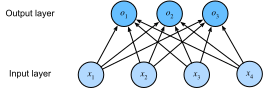

# Softmax Regression
:label:`sec_softmax`

In :numref:`sec_linear_regression`, we introduced linear regression,
working through implementations from scratch in :numref:`sec_linear_scratch`
and again using high-level APIs of a deep learning framework
in :numref:`sec_linear_concise` to do the heavy lifting.

Regression is the hammer we reach for when
we want to answer *how much?* or *how many?* questions.
If you want to predict the number of dollars (price)
at which a house will be sold,
or the number of wins a baseball team might have,
or the number of days that a patient
will remain hospitalized before being discharged,
then you are probably looking for a regression model.
However, even within regression models,
there are important distinctions.
For instance, the price of a house is never negative,
and changes are often *relative* to its baseline,
so it can pay to regress on the logarithm of the price.
Likewise, the number of days a patient spends in hospital
is a *discrete nonnegative* random variable,
for which least mean squares is not ideal either;
such time-to-event analysis is the province
of a specialized subfield called *survival modeling*.

The point here is not to overwhelm you but just
to let you know that there is a lot more to estimation
than simply minimizing squared errors.
And more broadly, there is a lot more to supervised learning than regression.
In this section, we focus on *classification* problems
where we put aside *how much?* questions
and instead focus on *which category?* questions.

* Does this email belong in the spam folder or the inbox?
* Is this customer more likely to sign up
  or not to sign up for a subscription service?
* Does this image depict a donkey, a dog, a cat, or a rooster?
* Which movie is Aston most likely to watch next?
* Which section of the book are you going to read next?

Colloquially, machine learning practitioners
overload the word *classification*
to describe two subtly different problems:
(i) those where we are interested only in
hard assignments of examples to categories (classes);
and (ii) those where we wish to make soft assignments,
i.e., to assess the probability that each category applies.
The distinction tends to get blurred, in part,
because often, even when we only care about hard assignments,
we still use models that make soft assignments.

Even more, there are cases where more than one label might be true.
For instance, a news article might simultaneously cover
the topics of entertainment, business, and space flight,
but not the topics of medicine or sports.
Thus, categorizing it into one of the above categories
on their own would not be very useful.
This problem is commonly known as [multi-label classification](https://en.wikipedia.org/wiki/Multi-label_classification).
See :citet:`Tsoumakas.Katakis.2007` for an overview
and :citet:`Huang.Xu.Yu.2015`
for an effective algorithm when tagging images.

## Classification
:label:`subsec_classification-problem`

To get our feet wet, let's start with
a simple image classification problem.
Here, each input consists of a $2\times2$ grayscale image.
We can represent each pixel value with a single scalar,
giving us four features $x_1, x_2, x_3, x_4$.
Further, let's assume that each image belongs to one
among the categories "cat", "chicken", and "dog".

Next, we have to choose how to represent the labels.
We have two obvious choices.
Perhaps the most natural impulse would be
to choose $y \in \{1, 2, 3\}$,
where the integers represent
$\{\textrm{dog}, \textrm{cat}, \textrm{chicken}\}$ respectively.
This is a great way of *storing* such information on a computer.
If the categories had some natural ordering among them,
say if we were trying to predict
$\{\textrm{baby}, \textrm{toddler}, \textrm{adolescent}, \textrm{young adult}, \textrm{adult}, \textrm{geriatric}\}$,
then it might even make sense to cast this as
an [ordinal regression](https://en.wikipedia.org/wiki/Ordinal_regression) problem
and keep the labels in this format.
See :citet:`Moon.Smola.Chang.ea.2010` for an overview
of different types of ranking loss functions
and :citet:`Beutel.Murray.Faloutsos.ea.2014` for a Bayesian approach
that addresses responses with more than one mode.

In general, classification problems do not come
with natural orderings among the classes.
Fortunately, statisticians long ago invented a simple way
to represent categorical data: the *one-hot encoding*.
A one-hot encoding is a vector
with as many components as we have categories.
The component corresponding to a particular instance's category is set to 1
and all other components are set to 0.
In our case, a label $y$ would be a three-dimensional vector,
with $(1, 0, 0)$ corresponding to "cat", $(0, 1, 0)$ to "chicken",
and $(0, 0, 1)$ to "dog":

$$y \in \{(1, 0, 0), (0, 1, 0), (0, 0, 1)\}.$$

### Linear Model

In order to estimate the conditional probabilities
associated with all the possible classes,
we need a model with multiple outputs, one per class.
To address classification with linear models,
we will need as many affine functions as we have outputs.
Strictly speaking, we only need one fewer,
since the final category has to be the difference
between $1$ and the sum of the other categories
(indeed, as we will see shortly, only *differences*
of scores end up mattering),
but for reasons of symmetry
we use a slightly redundant parametrization.
Each output corresponds to its own affine function.
In our case, since we have 4 features and 3 possible output categories,
we need 12 scalars to represent the weights ($w$ with subscripts),
and 3 scalars to represent the biases ($b$ with subscripts). This yields:

$$
\begin{aligned}
o_1 &= x_1 w_{11} + x_2 w_{12} + x_3 w_{13} + x_4 w_{14} + b_1,\\
o_2 &= x_1 w_{21} + x_2 w_{22} + x_3 w_{23} + x_4 w_{24} + b_2,\\
o_3 &= x_1 w_{31} + x_2 w_{32} + x_3 w_{33} + x_4 w_{34} + b_3.
\end{aligned}
$$

The corresponding neural network diagram
is shown in :numref:`fig_softmaxreg`.
Just as in linear regression,
we use a single-layer neural network.
And since the calculation of each output, $o_1, o_2$, and $o_3$,
depends on every input, $x_1$, $x_2$, $x_3$, and $x_4$,
the output layer can also be described as a *fully connected layer*.

:label:`fig_softmaxreg`

For a more concise notation we use vectors and matrices:
$\mathbf{o} = \mathbf{W} \mathbf{x} + \mathbf{b}$ is
much better suited for mathematics and code.
Note that we have gathered all of our weights into a $3 \times 4$ matrix and all biases
$\mathbf{b} \in \mathbb{R}^3$ in a vector.

## The Softmax Model
:label:`subsec_softmax_operation`

Assuming a suitable loss function,
we could try, directly, to minimize the difference
between $\mathbf{o}$ and the labels $\mathbf{y}$.
While it turns out that treating classification
as a vector-valued regression problem works surprisingly well,
it is nonetheless unsatisfactory in the following ways:

* There is no guarantee that the outputs $o_i$ sum to $1$ in the way we expect probabilities to behave.
* There is no guarantee that the $o_i$ are nonnegative, nor that they lie in $[0, 1]$.

Both aspects render the estimation problem difficult to solve
and the solution very brittle to outliers.
For instance, if we assume that there
is a positive linear dependency
between the number of bedrooms and the likelihood
that someone will buy a house,
the probability might exceed $1$
when it comes to buying a mansion!
As such, we need a mechanism to "squish" the outputs.

There are many ways we might accomplish this goal.
For instance, we could posit that the observed label
arises from a *noisy argmax*:
perturb each score by independent noise $\epsilon_i$
and report the class with the largest perturbed score,
$y = \operatorname*{argmax}_i \, (o_i + \epsilon_i)$.
When the noise is Gaussian, $\epsilon_i \sim \mathcal{N}(0, \sigma^2)$,
this is the (multinomial) [probit model](https://en.wikipedia.org/wiki/Probit_model),
first introduced by :citet:`Fechner.1860`.
While appealing, it does not work quite as well
nor lead to a particularly nice optimization problem,
when compared to the softmax.
(Remarkably, drawing the noise from a Gumbel distribution instead
yields *exactly* the softmax probabilities that we are about to derive.)

Another way to accomplish this goal
(and to ensure nonnegativity) is to use
an exponential function $P(y = i) \propto \exp o_i$.
This does indeed satisfy the requirement
that the conditional class probability
increases monotonically with $o_i$,
and all probabilities are nonnegative.
We can then transform these values so that they add up to $1$
by dividing each by their sum.
This process is called *normalization*.
Putting these two pieces together
gives us the *softmax* function:

$$\hat{\mathbf{y}} = \mathrm{softmax}(\mathbf{o}) \quad \textrm{where}\quad \hat{y}_i = \frac{\exp(o_i)}{\sum_j \exp(o_j)}.$$
:eqlabel:`eq_softmax_y_and_o`

Note that the largest coordinate of $\mathbf{o}$
corresponds to the most likely class according to $\hat{\mathbf{y}}$.
Moreover, because the softmax operation
preserves the ordering among its arguments,
we do not need to compute the softmax
to determine which class has been assigned the highest probability. Thus,

$$
\operatorname*{argmax}_j \hat y_j = \operatorname*{argmax}_j o_j.
$$

For two classes the redundant parametrization noted above becomes explicit. Writing the single logit gap $o = o_1 - o_2$,

$$\hat{y}_1 = \frac{\exp(o_1)}{\exp(o_1) + \exp(o_2)} = \frac{1}{1 + \exp(-o)} = \sigma(o),$$
:eqlabel:`eq_softmax_to_sigmoid`

the *logistic sigmoid* $\sigma$. Binary logistic regression is thus softmax regression with the redundant logit removed. More generally, adding the same constant $c$ to every logit, $o_j \mapsto o_j + c$, multiplies both numerator and denominator of :eqref:`eq_softmax_y_and_o` by $\exp(c)$ and so leaves $\hat{\mathbf{y}}$ unchanged: only the *differences* of logits are identifiable. We may therefore pin one of them, say $o_q \equiv 0$, without changing any prediction, which is precisely the "one fewer" affine function we alluded to when motivating the linear model. This translation invariance returns in the exercises and underlies the numerically stable implementation.

It is worth pausing to see what this model *looks like* as a classifier
(:numref:`fig_mdl-clf-decision-regions`).
Since the predicted class is $\operatorname{argmax}_j o_j$
and each $o_j = \mathbf{w}_j^\top \mathbf{x} + b_j$ is affine,
the region assigned to class $j$ is the set where finitely many
linear inequalities $o_j \geq o_k$ hold: an intersection of halfspaces,
hence a convex polyhedron.
The plane is carved into $q$ convex regions
whose boundaries are the straight lines $o_j = o_k$,
all meeting where the top two scores tie.
In the binary case the picture is even simpler:
$\hat{y}_1 = \sigma(o)$ depends on $\mathbf{x}$
only through $o = (\mathbf{w}_1 - \mathbf{w}_2)^\top \mathbf{x} + (b_1 - b_2)$,
so the level sets of the predicted probability are parallel lines
perpendicular to $\mathbf{w}_1 - \mathbf{w}_2$,
with the decision boundary at $\hat{y}_1 = \frac{1}{2}$.
Whatever nonlinearity the softmax adds happens
in the *probabilities*, never in the *decision boundaries*:
those stay linear, a limitation we will meet head-on
when we train such a model on images.

:label:`fig_mdl-clf-decision-regions`

The idea of a softmax dates back to :citet:`Gibbs.1902`,
who adapted ideas from physics.
Dating even further back, Boltzmann,
the father of modern statistical physics,
used this trick to model a distribution
over energy states in gas molecules.
In particular, he discovered that the prevalence
of a state of energy in a thermodynamic ensemble,
such as the molecules in a gas,
is proportional to $\exp(-E/kT)$.
Here, $E$ is the energy of a state,
$T$ is the temperature, and $k$ is the Boltzmann constant.
When statisticians talk about increasing or decreasing
the "temperature" of a statistical system,
they refer to changing $T$
in order to favor lower or higher energy states.
Following Gibbs' idea, energy equates to error.
Energy-based models :cite:`Ranzato.Boureau.Chopra.ea.2007`
use this point of view when describing
problems in deep learning.
In our notation, temperature amounts to replacing
$\mathrm{softmax}(\mathbf{o})$ by $\mathrm{softmax}(\mathbf{o}/T)$.
:numref:`fig_mdl-clf-temperature` shows the effect on one
fixed score vector: cooling ($T < 1$) sharpens the distribution
toward a hard $\operatorname{argmax}$,
heating ($T > 1$) flattens it toward uniform,
and since $1/T$ scales every logit alike,
the *ranking* of the classes never changes.
We will put this dial to work at the end of the section
and in the exercises.

:label:`fig_mdl-clf-temperature`

### Vectorization
:label:`subsec_softmax_vectorization`

To improve computational efficiency,
we vectorize calculations in minibatches of data.
Assume that we are given a minibatch $\mathbf{X} \in \mathbb{R}^{n \times d}$
of $n$ examples with dimensionality (number of inputs) $d$.
Moreover, assume that we have $q$ categories in the output.
Then the weights satisfy $\mathbf{W} \in \mathbb{R}^{d \times q}$
and the bias satisfies $\mathbf{b} \in \mathbb{R}^{1\times q}$.
Note the layout: with examples stacked in the *rows* of $\mathbf{X}$, this $\mathbf{W}$ is the transpose of the per-example $\mathbf{W}$ in $\mathbf{o} = \mathbf{W}\mathbf{x} + \mathbf{b}$ above, so that the product $\mathbf{X}\mathbf{W}$ pairs each example with its logits row by row.

$$ \begin{aligned} \mathbf{O} &= \mathbf{X} \mathbf{W} + \mathbf{b}, \\ \hat{\mathbf{Y}} & = \mathrm{softmax}(\mathbf{O}). \end{aligned} $$
:eqlabel:`eq_minibatch_softmax_reg`

This accelerates the dominant operation into
a matrix--matrix product $\mathbf{X} \mathbf{W}$.
Moreover, since each row in $\mathbf{X}$ represents a data example,
the softmax operation itself can be computed *rowwise*:
for each row of $\mathbf{O}$, exponentiate all entries
and then normalize them by the sum.
Note, though, that care must be taken
to avoid exponentiating and taking logarithms of large numbers,
since this can cause numerical overflow or underflow:
$\exp(o_k)$ overflows once $o_k$ is a few hundred, and the small
probabilities it produces underflow to $0$ before we take their logarithm.
The standard fix subtracts $\max_k o_k$ before exponentiating and fuses the
softmax and the logarithm into a single *log-sum-exp* computation; we derive it,
and explain why frameworks fold it into the loss and consume raw logits, in
:numref:`subsec_softmax-implementation-revisited`.

## Loss Function
:label:`subsec_softmax-regression-loss-func`

Now that we have a mapping from features $\mathbf{x}$
to probabilities $\mathbf{\hat{y}}$,
we need a way to optimize the accuracy of this mapping.
We will rely on maximum likelihood estimation,
the very same method that we encountered
when providing a probabilistic justification
for the mean squared error loss in
:numref:`subsec_normal_distribution_and_squared_loss`.

### Log-Likelihood

The softmax function gives us a vector $\hat{\mathbf{y}}$,
which we can interpret as the (estimated) conditional probabilities
of each class, given any input $\mathbf{x}$,
such as $\hat{y}_1 = P(y=\textrm{cat} \mid \mathbf{x})$.
In the following we assume that for a dataset
with features $\mathbf{X}$ the labels $\mathbf{Y}$
are represented using a one-hot encoding label vector.
We can compare the estimates with reality
by checking how probable the actual classes are
according to our model, given the features:

$$
P(\mathbf{Y} \mid \mathbf{X}) = \prod_{i=1}^n P(\mathbf{y}^{(i)} \mid \mathbf{x}^{(i)}).
$$

We are allowed to use the factorization
since we assume that each label is drawn independently
from its respective distribution $P(\mathbf{y}\mid\mathbf{x}^{(i)})$.
Since maximizing the product of terms is awkward,
we take the negative logarithm to obtain the equivalent problem
of minimizing the negative log-likelihood:

$$
-\log P(\mathbf{Y} \mid \mathbf{X}) = \sum_{i=1}^n -\log P(\mathbf{y}^{(i)} \mid \mathbf{x}^{(i)})
= \sum_{i=1}^n l(\mathbf{y}^{(i)}, \hat{\mathbf{y}}^{(i)}),
$$

where for any pair of label $\mathbf{y}$
and model prediction $\hat{\mathbf{y}}$
over $q$ classes, the loss function $l$ is

$$ l(\mathbf{y}, \hat{\mathbf{y}}) = - \sum_{j=1}^q y_j \log \hat{y}_j. $$
:eqlabel:`eq_l_cross_entropy`

For reasons explained later on,
the loss function in :eqref:`eq_l_cross_entropy`
is commonly called the *cross-entropy loss*.
Since $\mathbf{y}$ is a one-hot vector of length $q$,
the sum over all its coordinates $j$ vanishes for all but one term.
Note that the loss $l(\mathbf{y}, \hat{\mathbf{y}})$
is bounded from below by $0$
whenever $\hat{\mathbf{y}}$ is a probability vector:
no single entry is larger than $1$,
hence their negative logarithm cannot be lower than $0$;
$l(\mathbf{y}, \hat{\mathbf{y}}) = 0$ only if we predict
the actual label with *certainty*.
This can never happen for any finite setting of the weights
because taking a softmax output towards $1$
requires taking the corresponding input $o_i$ to infinity
(or all other outputs $o_j$ for $j \neq i$ to negative infinity).
Even if our model could assign an output probability of $0$,
any error made when assigning such high confidence
would incur infinite loss ($-\log 0 = \infty$).

### Softmax and Cross-Entropy Loss
:label:`subsec_softmax_and_derivatives`

Since the softmax function
and the corresponding cross-entropy loss are so common,
it is worth understanding a bit better how they are computed.
Plugging :eqref:`eq_softmax_y_and_o` into the definition of the loss
in :eqref:`eq_l_cross_entropy`
and using the definition of the softmax we obtain

$$
\begin{aligned}
l(\mathbf{y}, \hat{\mathbf{y}}) &=  - \sum_{j=1}^q y_j \log \frac{\exp(o_j)}{\sum_{k=1}^q \exp(o_k)} \\
&= \sum_{j=1}^q y_j \log \sum_{k=1}^q \exp(o_k) - \sum_{j=1}^q y_j o_j \\
&= \log \sum_{k=1}^q \exp(o_k) - \sum_{j=1}^q y_j o_j
= g(\mathbf{o}) - \mathbf{y}^\top \mathbf{o},
\end{aligned}
$$

using $\sum_j y_j = 1$ in the last step and writing
$g(\mathbf{o}) = \log \sum_k \exp(o_k)$ for the *log-partition function*. This is the recurring shape of an exponential-family negative log-likelihood: a convex log-partition term minus a linear data term. The derivative is now immediate, because the softmax *is* the gradient of the log-partition function,

$$
\partial_{o_j} g(\mathbf{o}) = \frac{\exp(o_j)}{\sum_{k=1}^q \exp(o_k)} = \mathrm{softmax}(\mathbf{o})_j,
\quad \textrm{hence} \quad
\partial_{o_j} l(\mathbf{y}, \hat{\mathbf{y}}) = \mathrm{softmax}(\mathbf{o})_j - y_j.
$$

In other words, the derivative is the difference
between the probability assigned by our model,
as expressed by the softmax operation,
and what actually happened, as expressed
by elements in the one-hot label vector.
In this sense, it is very similar
to what we saw in regression,
where the gradient was the difference
between the observation $y$ and estimate $\hat{y}$.
This is not a coincidence: in any exponential-family model the
log-likelihood gradient is exactly this "prediction minus observation" residual,
which makes the gradient cheap and the loss convex in $\mathbf{o}$.
The second derivative tells the rest of the story; it is the covariance of
$\mathrm{softmax}(\mathbf{o})$, so the Hessian of $g$ is positive semidefinite.
We work this out in the exercises and revisit log-partition convexity in
:numref:`sec_mdl-convexity`, where the corresponding proposition is proved
in full.

Now consider the case where we observe not just a single outcome
but an entire distribution over outcomes.
We can use the same representation as before for the label $\mathbf{y}$.
The only difference is that rather
than a vector containing only binary entries,
say $(0, 0, 1)$, we now have a generic probability vector,
say $(0.1, 0.2, 0.7)$.
The math that we used previously to define the loss $l$
in :eqref:`eq_l_cross_entropy`
still works well,
just that the interpretation is slightly more general.
It is the expected value of the loss for a distribution over labels.
This loss is called the *cross-entropy loss* and it is
one of the most commonly used losses for classification problems.

#### Why "cross-entropy"?
:label:`subsec_info_theory_basics`

The name comes from information theory. The *entropy* $H[P] = \sum_j -P(j) \log P(j)$ is the expected *surprisal* $-\log P(j)$ of draws from $P$, which Shannon showed is the average number of nats you must spend to encode them when you know $P$ :cite:`Shannon.1948`. The *cross-entropy* $H(P, Q) = \sum_j -P(j) \log Q(j)$ is the cost when you instead encode the same draws under a wrong model $Q$, and it is minimized exactly when $Q = P$. Our loss :eqref:`eq_l_cross_entropy` is precisely $H(\mathbf{y}, \hat{\mathbf{y}})$, so minimizing it does two equivalent things: it maximizes the likelihood of the labels, and it minimizes the extra bits our predictions waste relative to the truth. This MLE-versus-code-length duality is worth keeping in mind whenever cross-entropy appears. We develop entropy, cross-entropy, and the Kullback--Leibler divergence, together with the coding argument behind the "bits" language, in :numref:`sec_mdl-information_theory`; the classic references are :citet:`Cover.Thomas.1999` and :citet:`mackay2003information`.

**Confidence is not calibrated probability.**
We have just seen that the loss keeps rewarding the model for pushing
probability onto the correct class even after the decision is already right,
so it is worth a word of caution about reading those probabilities at face
value: a model trained to minimize cross-entropy is generally *not*
calibrated, and a reported confidence of $0.9$ does not mean the prediction
is right $90\%$ of the time. Modern deep networks tend to be systematically
overconfident ([Guo, Pleiss, Sun and Weinberger, 2017](https://arxiv.org/abs/1706.04599)).
A simple and effective remedy, *temperature scaling*, divides the logits by a
single learned $T > 0$ before the softmax---exactly the temperature of the
Boltzmann distribution in :numref:`fig_mdl-clf-temperature`. Because it
scales every logit by the same factor $1/T$ it preserves their order, leaving
the predicted class (the $\operatorname{argmax}$) and hence the accuracy
untouched, while sharpening or softening the confidences. Exercise 8 develops
this dial in detail.

## Summary and Discussion

In this section, we encountered the first nontrivial loss function,
allowing us to optimize over *discrete* output spaces.
Key in its design was that we took a probabilistic approach,
treating discrete categories as instances of draws from a probability distribution.
As a side effect, we encountered the softmax,
a convenient activation function that transforms
outputs of an ordinary neural network layer
into valid discrete probability distributions.
We saw that the derivative of the cross-entropy loss
when combined with softmax
behaves very similarly
to the derivative of squared error;
namely by taking the difference between
the expected behavior and its prediction.
Along the way we encountered exciting connections
to statistical physics (the Boltzmann distribution behind the softmax) and to
information theory (cross-entropy as a code length), the latter taken up in
:numref:`sec_mdl-information_theory`.

While this is enough to get you on your way,
and hopefully enough to whet your appetite,
we have barely scratched the surface here.
Among other things, we skipped over computational considerations.
Specifically, for any fully connected layer with $d$ inputs and $q$ outputs,
the parametrization and computational cost is $\mathcal{O}(dq)$,
which can be prohibitively high in practice.
Fortunately, this cost of transforming $d$ inputs into $q$ outputs
can be reduced through approximation and compression.
For instance, Deep Fried Convnets :cite:`Yang.Moczulski.Denil.ea.2015`
uses a combination of permutations,
Fourier transforms, and scaling
to reduce the cost from quadratic to log-linear.
Similar techniques work for more advanced
structural matrix approximations :cite:`sindhwani2015structured`.
Lastly, we can use quaternion-like decompositions
to reduce the cost to $\mathcal{O}(\frac{dq}{n})$,
again if we are willing to trade off a small amount of accuracy
for computational and storage cost :cite:`Zhang.Tay.Zhang.ea.2021`
based on a compression factor $n$.
This is an active area of research.
What makes it challenging is that
we do not necessarily strive
for the most compact representation
or the smallest number of floating point operations
but rather for the solution
that can be executed most efficiently on modern GPUs.

## Exercises

1. We can explore the connection between exponential families and softmax in some more depth.
    1. Compute the second derivative of the cross-entropy loss $l(\mathbf{y},\hat{\mathbf{y}})$ for softmax.
    1. Compute the variance of the distribution given by $\mathrm{softmax}(\mathbf{o})$ and show that it matches the second derivative computed above.
1. The softmax has a familiar two-class special case.
    1. Verify :eqref:`eq_softmax_to_sigmoid`: for $q = 2$ the softmax reduces to the logistic sigmoid of the logit difference, $\hat{y}_1 = \sigma(o_1 - o_2)$, recovering binary logistic regression.
    1. Show that adding a constant to all logits leaves $\hat{\mathbf{y}}$ unchanged. Conclude that softmax regression carries one redundant degree of freedom per example, and that we may fix $o_q \equiv 0$ without loss.
1. The next two exercises concern coding; see :numref:`sec_mdl-information_theory` for the information-theoretic background. Assume that we have three classes which occur with equal probability, i.e., the probability vector is $(\frac{1}{3}, \frac{1}{3}, \frac{1}{3})$.
    1. What is the problem if we try to design a binary code for it?
    1. Can you design a better code? Hint: what happens if we try to encode two independent observations? What if we encode $n$ observations jointly?
1. When encoding signals transmitted over a physical wire, engineers do not always use binary codes. For instance, [PAM-3](https://en.wikipedia.org/wiki/Ternary_signal) uses three signal levels $\{-1, 0, 1\}$ as opposed to two levels $\{0, 1\}$. How many ternary units do you need to transmit an integer in the range $\{0, \ldots, 7\}$? Why might this be a better idea in terms of electronics?
1. The [Bradley--Terry model](https://en.wikipedia.org/wiki/Bradley%E2%80%93Terry_model) uses
a logistic model to capture preferences. For a user to choose between apples and oranges one
assumes scores $o_{\textrm{apple}}$ and $o_{\textrm{orange}}$. Our requirements are that larger scores should lead to a higher likelihood in choosing the associated item and that
the item with the largest score is the most likely one to be chosen :cite:`Bradley.Terry.1952`.
    1. Prove that softmax satisfies this requirement.
    1. What happens if you want to allow for a default option of choosing neither apples nor oranges? Hint: now the user has three choices.
1. Softmax gets its name from the following mapping: $\textrm{RealSoftMax}(a, b) = \log (\exp(a) + \exp(b))$.
    1. Prove that $\textrm{RealSoftMax}(a, b) > \mathrm{max}(a, b)$.
    1. How small can you make the difference between both functions? Hint: without loss of
    generality you can set $b = 0$ and $a \geq b$.
    1. Prove that this holds for $\lambda^{-1} \textrm{RealSoftMax}(\lambda a, \lambda b)$, provided that $\lambda > 0$.
    1. Show that for $\lambda \to \infty$ we have $\lambda^{-1} \textrm{RealSoftMax}(\lambda a, \lambda b) \to \mathrm{max}(a, b)$.
    1. Construct an analogous softmin function.
    1. Extend this to more than two numbers.
1. The function $g(\mathbf{x}) \stackrel{\textrm{def}}{=} \log \sum_i \exp x_i$ is sometimes also referred to as the [log-partition function](https://en.wikipedia.org/wiki/Partition_function_(mathematics)).
    1. Combine the two parts of exercise 1 (the second derivative of $g$ is the variance of the distribution $\mathrm{softmax}(\mathbf{x})$, hence nonnegative) to conclude that $g$ is convex.
    1. Show that $g$ is translation equivariant, i.e., $g(\mathbf{x} + b \mathbf{1}) = b + g(\mathbf{x})$.
    1. What happens if some of the coordinates $x_i$ are very large? What happens if they're all very small?
    1. Show that if we choose $b = \mathrm{max}_i x_i$ we end up with a numerically stable implementation.
1. Assume that we have some probability distribution $P$. Suppose we pick another distribution $Q$ with $Q(i) \propto P(i)^\alpha$ for $\alpha > 0$.
    1. Which choice of $\alpha$ corresponds to doubling the temperature? Which choice corresponds to halving it?
    1. What happens if we let the temperature approach $0$?
    1. What happens if we let the temperature approach $\infty$?
    1. Argue that scaling all logits by $1/T$ cannot change the $\operatorname{argmax}$, hence not the accuracy, yet it does change the cross-entropy. Why does this make temperature scaling a useful tool for post-hoc calibration?
1. The *noisy argmax* model of :numref:`subsec_softmax_operation` becomes exact for the right noise. Let $\gamma_1, \ldots, \gamma_q$ be i.i.d. draws from the standard [Gumbel distribution](https://en.wikipedia.org/wiki/Gumbel_distribution), whose CDF is $P(\gamma \leq z) = \exp(-\exp(-z))$.
    1. Show that $P(o_k + \gamma_k \leq z) = \exp(-\exp(o_k)\exp(-z))$.
    1. Show that $P\left(\operatorname{argmax}_i \, (o_i + \gamma_i) = k\right) = \mathrm{softmax}(\mathbf{o})_k$, i.e., the noisy argmax with Gumbel noise *is* the softmax (the *Gumbel-max trick*). Hint: condition on the value $z$ of $o_k + \gamma_k$, multiply the independent probabilities that every other $o_i + \gamma_i$ stays below $z$, and integrate; the substitution $u = \exp(-z)$ makes the integral elementary.
    1. Conclude that scaling the noise, $\gamma_i \mapsto T\gamma_i$, samples from $\mathrm{softmax}(\mathbf{o}/T)$, connecting this exercise to the previous one.

[Discussions](https://d2l.discourse.group/t/46)

<!-- slides -->

::: {.slide}
::: {.cover}
[Dive into Deep Learning · §4.1]{.kicker}

From scores to probabilities to a loss **one-hot labels · the softmax · cross-entropy**.
:::
:::

::: {.slide title="From *how much* to *which class*"}
[Motivation]{.kicker}

::: {.cols .vc}
::: {.col}
Regression answered *how much?* Classification asks *which category?*: spam or inbox, cat or dog or chicken.

- A linear layer still produces one **score** per class.
- The **softmax** turns those scores into a probability distribution.
- **Cross-entropy** measures how surprised that distribution is by the truth.

::: {.d2l-note}
The whole section is one pipeline: **scores $\to$ probabilities $\to$ loss**.
:::
:::

::: {.col .fig .big}

:::
:::
:::

::: {.slide}
::: {.divider}
[01]{.dnum}

[Labels & the Linear Model]{.dtitle}

[one-hot encoding and one score per class]{.dsub}
:::
:::

::: {.slide title="One-hot: a label is a vector"}
[Labels]{.kicker}

Classes have **no natural order**, so we do not encode "cat, chicken, dog" as $1, 2, 3$. Instead each label is a **one-hot vector**, a 1 in its class slot and 0 elsewhere:

$$y \in \{(1,0,0),\ (0,1,0),\ (0,0,1)\}.$$

. . .

This puts the label in the same space as a probability vector, so we can compare prediction and truth coordinate by coordinate.
:::

::: {.slide title="One affine function per class"}
[Linear Model]{.kicker}

::: {.cols .vc}
::: {.col}
With 4 features and 3 classes we need a $3\times4$ weight matrix and a bias per class, packed into a single **fully connected layer**:

$$\mathbf{o} = \mathbf{W}\mathbf{x} + \mathbf{b}.$$

Each output $o_i$ depends on **every** input. These raw scores are the **logits**; they are not yet probabilities.
:::

::: {.col .fig .big}

:::
:::
:::

::: {.slide title="Why not just regress onto the labels?"}
[Linear Model]{.kicker}

We could try to fit $\mathbf{o}$ directly to the one-hot $\mathbf{y}$. But raw logits make poor probabilities:

::: {.d2l-note .warn}
Nothing forces $o_i \ge 0$, and nothing forces $\sum_i o_i = 1$.
:::

. . .

A linear score can run past 1 or below 0, so a "probability" of buying a mansion could exceed 100%. We need a map that **squishes** any score vector onto valid probabilities.
:::

::: {.slide}
::: {.divider}
[02]{.dnum}

[The Softmax]{.dtitle}

[exponentiate, then normalize]{.dsub}
:::
:::

::: {.slide title="The softmax: squish scores to probabilities"}
[The Softmax]{.kicker}

Exponentiate each score (now nonnegative), then divide by the row sum (now sums to 1):

$$\hat{y}_i = \mathrm{softmax}(\mathbf{o})_i = \frac{\exp(o_i)}{\sum_j \exp(o_j)}.$$

. . .

The denominator $\sum_j \exp(o_j)$ is the **partition function**, the same normalizer Boltzmann used for energy states in a gas, with energy playing the role of (negative) score.
:::

::: {.slide title="Softmax keeps the ranking"}
[The Softmax]{.kicker}

The exponential is monotone, so the largest score stays the largest probability:

$$\operatorname*{argmax}_j \hat{y}_j = \operatorname*{argmax}_j o_j.$$

. . .

So to *predict* a class we never need to compute the softmax; we read off the biggest logit. The softmax matters for the **loss**, not the decision.
:::

::: {.slide title="Only differences of logits matter"}
[The Softmax · invariance]{.kicker}

Add the same constant $c$ to every logit. Numerator and denominator both pick up a factor $\exp(c)$, which cancels:

$$\mathrm{softmax}(\mathbf{o} + c\mathbf{1}) = \mathrm{softmax}(\mathbf{o}).$$

. . .

The scores carry **one redundant degree of freedom**: we may pin $o_q \equiv 0$ without changing any prediction. (This same shift, with $c = -\max_k o_k$, is the trick that makes the computation numerically stable.)
:::

::: {.slide title="Two classes: softmax *is* the sigmoid"}
[The Softmax · special case]{.kicker}

With $q = 2$, only the logit gap $o = o_1 - o_2$ survives:

$$\hat{y}_1 = \frac{\exp(o_1)}{\exp(o_1)+\exp(o_2)} = \frac{1}{1 + \exp(-o)} = \sigma(o).$$

. . .

Binary **logistic regression** is just softmax regression with the redundant logit removed: the same model, one class folded away.
:::

::: {.slide}
::: {.divider}
[03]{.dnum}

[Cross-Entropy Loss]{.dtitle}

[maximum likelihood over discrete labels]{.dsub}
:::
:::

::: {.slide title="Maximum likelihood becomes a sum of losses"}
[Loss]{.kicker}

The model reads $\hat{\mathbf{y}}$ as conditional class probabilities. Over an i.i.d. dataset the likelihood factorizes; taking $-\log$ turns the product into a sum:

$$-\log P(\mathbf{Y}\mid\mathbf{X}) = \sum_{i=1}^n l\bigl(\mathbf{y}^{(i)}, \hat{\mathbf{y}}^{(i)}\bigr).$$

. . .

Minimizing this negative log-likelihood is exactly the recipe we used for squared error, now over discrete categories.
:::

::: {.slide title="The cross-entropy loss"}
[Loss]{.kicker}

For a one-hot label $\mathbf{y}$ the per-example loss keeps only the true class's term:

$$l(\mathbf{y}, \hat{\mathbf{y}}) = -\sum_{j=1}^q y_j \log \hat{y}_j = -\log \hat{y}_{\text{true}}.$$

. . .

It is $\ge 0$, and $0$ only with certainty on the right class, which finite logits can never quite reach. Predict the truth with high confidence and the loss is small; predict it with near-zero probability and the loss blows up.
:::

::: {.slide title="A clean gradient: prediction minus truth"}
[Loss · the payoff]{.kicker}

Substitute the softmax into the loss and it collapses to a log-partition term minus a linear term, $l = g(\mathbf{o}) - \mathbf{y}^\top\mathbf{o}$ with $g(\mathbf{o}) = \log\sum_k \exp(o_k)$. Differentiate:

$$\partial_{o_j}\, l(\mathbf{y}, \hat{\mathbf{y}}) = \mathrm{softmax}(\mathbf{o})_j - y_j = \hat{y}_j - y_j.$$

. . .

The gradient is the **residual**, predicted probability minus observed label, exactly as in linear regression. This "prediction minus truth" form is shared by *every* exponential-family model, and it makes the loss convex in $\mathbf{o}$.
:::

::: {.slide title="Why \"cross-entropy\"?"}
[Loss · information theory]{.kicker}

::: {.cols .vc}
::: {.col}
**Entropy** $H[P] = \sum_j -P(j)\log P(j)$ is the average bits needed to encode draws from $P$. **Cross-entropy** $H(P, Q) = \sum_j -P(j)\log Q(j)$ is the cost of coding $P$'s draws with a wrong model $Q$.
:::

::: {.col .narrow}
::: {.d2l-note .rule}
Our loss **is** $H(\mathbf{y}, \hat{\mathbf{y}})$.
:::
:::
:::

. . .

So minimizing it does two equivalent things: it **maximizes likelihood** and it **minimizes the wasted bits** between prediction and truth, a duality worth remembering whenever cross-entropy appears.
:::

::: {.slide title="Probabilities, but not *calibrated*"}
[Loss · a modern caveat]{.kicker}

The softmax outputs *look* like probabilities, but a network trained to minimize cross-entropy is generally **not calibrated**: a reported confidence of $0.9$ does not mean it is right $90\%$ of the time. Modern deep nets are systematically **overconfident** (Guo et al., 2017).

. . .

::: {.d2l-note .rule}
**Temperature scaling** divides the logits by a single learned $T > 0$ before the softmax, exactly the Boltzmann temperature from earlier.
:::

Because $1/T$ scales every logit by the same factor, it preserves their order: the predicted class (the $\arg\max$) is **untouched** while the confidences sharpen ($T<1$) or soften ($T>1$).
:::

::: {.slide}
::: {.divider}
[04]{.dnum}

[Two Faces of the Scores]{.dtitle}

[the same logits drive training and evaluation]{.dsub}
:::
:::

::: {.slide title="One score vector, two jobs"}
[Synthesis]{.kicker}

::: {.cols .vc}
::: {.col}
A single forward pass produces logits $\mathbf{o}$; the picture **forks**.

- **Train:** softmax $\to$ probabilities $\to$ cross-entropy. Smooth and differentiable, so gradient descent minimizes it.
- **Evaluate:** $\arg\max \to$ a hard class $\to$ accuracy. Discrete with zero gradient, the number we report.

Both branches read the **same** scores.
:::

::: {.col .fig .big}

:::
:::
:::

::: {.slide title="Summary"}
[Wrap-up]{.kicker}

::: {.cols}
::: {.col}
- **One-hot** labels live in probability space; a **linear layer** emits one logit per class.
- **Softmax** $\hat{y}_i \propto \exp(o_i)$ squishes logits to a distribution; it preserves the ranking and depends only on logit **differences**.
- Two classes recover the **logistic sigmoid**.
:::

::: {.col}
- **Cross-entropy** $= -\log \hat{y}_{\text{true}}$ is the negative log-likelihood, equivalently a code length.
- Its gradient is the **residual** $\hat{\mathbf{y}} - \mathbf{y}$: convex, cheap, shared by all exponential families.
- The **same logits** train the model (softmax + loss) and evaluate it (argmax + accuracy).
:::
:::
:::
