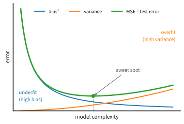
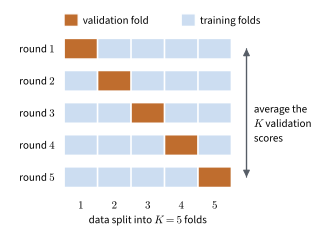

```{.python .input}
%load_ext d2lbook.tab
tab.interact_select('mxnet', 'pytorch', 'tensorflow', 'jax')
```

# Generalization
:label:`sec_generalization_basics`

A model is trained on a finite collection of examples, but it is usually
deployed on examples it has not seen. A small training error therefore does
not by itself establish that the model has learned a useful pattern: a model
may instead have fit details specific to its training set.

The central question is how well the fitted model predicts data drawn from the
same population but not used for fitting. This distinction matters whenever
predictions concern future observations, new patients, or other unseen cases.
This is the statistical problem of *generalization*: determining whether
patterns fitted on a sample apply to new observations from the same population.


In real life, we must fit our models
using a finite collection of data.
The typical scales of that data
vary wildly across domains.
For many important medical problems,
we can only access a few thousand data points.
When studying rare diseases,
we might be lucky to access hundreds.
By contrast, the largest public datasets
consisting of labeled photographs,
e.g., ImageNet :cite:`Deng.Dong.Socher.ea.2009`,
contain millions of images.
And some unlabeled image collections
such as the Flickr YFC100M dataset
can be even larger, containing
over 100 million images :cite:`thomee2016yfcc100m`.
However, even at this extreme scale,
the number of available data points
remains tiny relative to the space of all possible images
at a megapixel resolution.
Whenever we work with finite samples,
we must keep in mind the risk
that we might fit our training data,
only to find that the fitted pattern does not generalize.

The phenomenon of fitting closer to our training data
than to the underlying distribution is called *overfitting*,
and techniques for combatting overfitting
are often called *regularization* methods.
This section develops the intuition needed for the subsequent experiments.
:numref:`chap_classification_generalization` gives a first, rigorous taste;
see also :citet:`Vapnik98,boucheron2005theory`.
We will revisit generalization in many chapters
throughout the book,
exploring both what is known about
the principles underlying generalization
in various models,
and also heuristic techniques
that have been found (empirically)
to yield improved generalization
on tasks of practical interest.


## Training Error and Generalization Error
:label:`subsec_empirical-risk-and-risk`


In the standard supervised learning setting,
we assume that the training data and the test data
are drawn *independently* from *identical* distributions.
This is commonly called the *IID assumption*.
Without assumptions relating the training and test distributions, observations
from $P(X,Y)$ do not by themselves determine performance on $Q(X,Y)$.
Making such leaps turns out to require
strong assumptions about how $P$ and $Q$ are related.
Later on we will discuss some assumptions
that allow for shifts in distribution
but first we need to understand the IID case,
where $P(\cdot) = Q(\cdot)$.

To begin with, we need to differentiate between
the *training error* $R_\textrm{emp}$,
which is a *statistic*
calculated on the training dataset,
and the *generalization error* $R$,
which is an *expectation* taken
with respect to the underlying distribution.
You can think of the generalization error as
what you would see  if you applied your model
to an infinite stream of additional data examples
drawn from the same underlying data distribution.
Formally the training error is expressed as an *average* over the finite training sample (with the same notation as :numref:`sec_linear_regression`):

$$R_\textrm{emp}[\mathbf{X}, \mathbf{y}, f] = \frac{1}{n} \sum_{i=1}^n l(\mathbf{x}^{(i)}, y^{(i)}, f(\mathbf{x}^{(i)})),$$
:eqlabel:`eq_empirical-risk-min`


while the generalization error (also called the *risk*) is expressed as an integral:

$$R[P, f] = E_{(\mathbf{x}, y) \sim P} [l(\mathbf{x}, y, f(\mathbf{x}))] = \int \int l(\mathbf{x}, y, f(\mathbf{x})) p(\mathbf{x}, y) \;d\mathbf{x} dy.$$
:eqlabel:`eq_true-risk`

In typical applications, we cannot calculate the generalization error $R$
exactly because the density $p(\mathbf{x}, y)$ is unavailable.
Moreover, we cannot sample an infinite stream of data points.
Thus, in practice, we must *estimate* the generalization error
by applying our model to an independent test set
constituted of a random selection of examples
$\mathbf{X}'$ and labels $\mathbf{y}'$
that were withheld from our training set.
This consists of applying the same formula
that was used for calculating the empirical training error
but to a test set $\mathbf{X}', \mathbf{y}'$.


When we evaluate a model fixed independently of the test set,
we are working with a *fixed* model
(it does not depend on the sample of the test set),
so estimating its error is a mean-estimation problem.
However the same cannot be said
for the training set.
Note that the model we wind up with
depends explicitly on the selection of the training set
and thus the training error will in general
be a biased estimate of the true error
on the underlying population.
The central question of generalization
is then this: when should we expect our training error
to be close to the population error
(and thus the generalization error)?

### Model Complexity

In classical theory, when we have
simple models and abundant data,
the training and generalization errors tend to be close.
However, when we work with
more complex models and/or fewer examples,
we expect the training error to go down
but the *generalization gap* to grow.
That gap is the difference $R - R_\textrm{emp}$
between the generalization error and the training error.
Consider a model class so expressive that
for any dataset of $n$ examples,
we can find a set of parameters
that can perfectly fit arbitrary labels,
even if randomly assigned.
In this case, even if we fit our training data perfectly,
how can we conclude anything about the generalization error?
For all we know, our generalization error
might be no better than random guessing.

In general, absent any restriction on our model class,
we cannot conclude, based on fitting the training data alone,
that our model has discovered any generalizable pattern :cite:`vapnik1994measuring`.
On the other hand, if our model class
was not capable of fitting arbitrary labels,
then low training error is evidence that it has captured a real pattern,
provided the sample is large relative to the class's capacity
(:numref:`sec_mdl-concentration-generalization`).
Learning-theoretic ideas about model complexity
derived some inspiration from the ideas
of Karl Popper, an influential philosopher of science,
who formalized the criterion of falsifiability :cite:`popper2005logic`.
Popper argued that a scientific theory must exclude some possible observations.
The analogy here is that a hypothesis class able to fit every possible labeling
receives little support from training fit alone.

Now what precisely constitutes an appropriate
notion of model complexity is a complex matter.
For squared-error regression, with expectation taken over repeated training
sets drawn by the same process, the classical *bias-variance decomposition*
makes the trade-off precise: a model too simple to capture the signal makes a systematic error
(high *bias*, i.e., underfitting), while a model flexible enough to chase the
noise in a particular training set varies wildly from one dataset to the next
(high *variance*, i.e., overfitting). Their sum plus an irreducible noise floor
$\sigma^2$ is the expected test error, which traces the U-shaped curve of
:numref:`fig_capacity_vs_error`; we derive the decomposition formally in
:numref:`sec_mdl-statistics`.
Often, models with more parameters
are able to fit a greater number
of arbitrarily assigned labels.
However, this is not necessarily true.
For instance, kernel methods operate in spaces
with infinite numbers of parameters,
yet their complexity is controlled
by other means :cite:`Scholkopf.Smola.2002`.
One notion of complexity that often proves useful
is the range of values that the parameters can take.
Here, a model whose parameters are permitted
to take arbitrary values
would be more complex.
We will revisit this idea in the next section,
when we introduce *weight decay*,
your first practical regularization technique.
It can be difficult to compare
complexity among members of substantially different model classes
(say, decision trees vs. neural networks).


A qualification becomes important for deep neural networks.
When a model is capable of fitting arbitrary labels,
low training error does not necessarily
imply low generalization error.
However, it does not necessarily imply high generalization error either.
All we can say with confidence is that
low training error alone is not enough
to certify low generalization error.
Deep neural networks can fit arbitrary labels yet often generalize on structured
real data. Their training error alone therefore provides limited evidence about
generalization.
In these cases we must rely more heavily
on our holdout data to certify generalization
after the fact.
Error on the holdout data, i.e., validation set,
is called the *validation error*.

The classical picture says that more *capacity* (the richness of the model
class) means more overfitting. For the heavily overparametrized models used in modern deep learning, however, that picture is *incomplete*. Once a model is large enough to *interpolate* its training data (drive
training error to zero), pushing capacity even higher often makes test error
*fall again* rather than rise: the *double descent* phenomenon
:cite:`Belkin.Hsu.Ma.ea.2019,nakkiran2021deep`. We examine this phenomenon and the limits of the classical complexity picture in
:numref:`sec_generalization_deep`; for a quantitative treatment that
reproduces the double-descent curve from scratch, see
:numref:`sec_mdl-concentration-generalization`.

## Underfitting or Overfitting?

When we compare the training and validation errors,
two common situations are useful to distinguish. The first occurs
when our training error and validation error are both substantial
but there is only a small gap between them.
If the model is unable to reduce the training error,
that could mean that our model is too simple
(i.e., insufficiently expressive)
to capture the pattern that we are trying to model.
Moreover, since the generalization gap
between our training and generalization errors is small,
we have reason to believe that we could get away with a more complex model.
This phenomenon is known as *underfitting*.

On the other hand, as we discussed above,
we want to watch out for the cases
when our training error is significantly lower
than our validation error, indicating severe *overfitting*.
Note that overfitting is not always a bad thing.
In deep learning especially,
the best predictive models often perform
far better on training data than on holdout data.
Ultimately, we usually care about
driving the generalization error lower,
and only care about the gap insofar
as it becomes an obstacle to that end.
Note that if the training error is zero,
then the generalization gap is precisely equal to the generalization error
and we can make progress only by reducing the gap.

### Polynomial Curve Fitting
:label:`subsec_polynomial-curve-fitting`

To illustrate some classical intuition
about overfitting and model complexity,
consider the following:
given training data consisting of a single feature $x$
and a corresponding real-valued label $y$,
we try to find the polynomial of degree $d$

$$\hat{y}= \sum_{i=0}^d x^i w_i$$

for estimating the label $y$.
This is just a linear regression problem
where our features are given by the powers of $x$,
the model's weights are given by $w_i$,
and the bias is given by $w_0$ since $x^0 = 1$ for all $x$.
Since this is just a linear regression problem,
we can use the squared error as our loss function.


A higher-order polynomial function is more complex
than a lower-order polynomial function,
since the higher-order polynomial has more parameters
and the model function's selection range is wider.
Fixing the training dataset,
higher-order polynomial functions should always
achieve lower (at worst, equal) training error
relative to lower-degree polynomials.
In fact, whenever each data example
has a distinct value of $x$,
a polynomial function with degree
at most one less than the number of data examples can fit the training set
perfectly.
We compare the relationship between polynomial degree (model complexity)
and both underfitting and overfitting in :numref:`fig_capacity_vs_error`.


:label:`fig_capacity_vs_error`

To demonstrate this behavior, we generate data from a known cubic and fit
polynomials of growing degree to a small training set.

```{.python .input #generalization-polynomial-curve-fitting-1}
%%tab pytorch
%matplotlib inline
import math
import numpy as np
from d2l import torch as d2l
```

```{.python .input #generalization-polynomial-curve-fitting-1}
%%tab tensorflow
%matplotlib inline
import math
import numpy as np
from d2l import tensorflow as d2l
```

```{.python .input #generalization-polynomial-curve-fitting-1}
%%tab jax
%matplotlib inline
import math
import numpy as np
from d2l import jax as d2l
```

```{.python .input #generalization-polynomial-curve-fitting-1}
%%tab mxnet
%matplotlib inline
import math
import numpy as np
from d2l import mxnet as d2l
```

We draw inputs $x$ uniformly from $[-1, 1]$, build a design matrix whose $i$-th
column is $x^i$, and generate labels from a degree-3 target
$y = 5 + 1.2 x - 3.4 x^2 + 5.6 x^3$ plus a little Gaussian noise. We deliberately
keep the training set small so that high-degree models have room to overfit.

```{.python .input #generalization-polynomial-curve-fitting-2}
np.random.seed(0)
max_degree = 20                  # highest polynomial degree we will fit
n_train, n_test = 20, 100        # few training points, so high degrees overfit
true_w = np.zeros(max_degree)
true_w[:4] = np.array([5, 1.2, -3.4, 5.6])

x = np.random.uniform(-1, 1, size=n_train + n_test)
poly = np.power(x.reshape(-1, 1), np.arange(max_degree))   # column i holds x**i
labels = poly @ true_w + np.random.normal(scale=0.1, size=n_train + n_test)
```

Fitting the first $d+1$ columns by least squares gives the best degree-$d$
polynomial; we record its loss on both the training and the held-out test split.

```{.python .input #generalization-polynomial-curve-fitting-3}
def fit_degree(d):
    cols = slice(0, d + 1)
    w, *_ = np.linalg.lstsq(poly[:n_train, cols], labels[:n_train], rcond=None)
    err = poly[:, cols] @ w - labels
    return (err[:n_train] ** 2).mean(), (err[n_train:] ** 2).mean()
```

A degree-1 polynomial is too rigid to capture a cubic, so it errs on both splits
(*underfitting*); degree 3 matches the true model, with low error on both; and a
degree-19 polynomial has enough freedom to interpolate the 20 training points
almost exactly, driving training error toward zero while test error explodes
(*overfitting*).

```{.python .input #generalization-polynomial-curve-fitting-4}
for name, d in [('underfitting (degree 1) ', 1),
                ('just right   (degree 3) ', 3),
                ('overfitting   (degree 19)', 19)]:
    train_mse, test_mse = fit_degree(d)
    print(f'{name}: train {train_mse:8.4f}   test {test_mse:12.4f}')
```

For this seeded dataset, sweeping the degree from 1 to 19 produces the
U-shaped test-error pattern sketched in :numref:`fig_capacity_vs_error`: error first falls as the model
gains the capacity to represent the signal, then rises as the surplus capacity is
spent fitting noise. Training error, by contrast, only ever decreases.

```{.python .input #generalization-polynomial-curve-fitting-5}
degrees = list(range(1, max_degree))
mse = np.array([fit_degree(d) for d in degrees])
d2l.plot(degrees, [mse[:, 0], mse[:, 1]], xlabel='polynomial degree',
         ylabel='loss', legend=['train', 'test'], yscale='log')
```

Because the data generator is known, the experiment can estimate bias and
variance separately. Because we know the noiseless target
$f(x) = 5 + 1.2 x - 3.4 x^2 + 5.6 x^3$, we can redraw the training noise many
times, refit the degree-$d$ polynomial on each draw, and ask two questions on
the held-out inputs: how far is the *average* fit from the truth
(squared bias), and how much does the fit *fluctuate* across draws (variance)?

```{.python .input #generalization-bias-variance-decomposition}
f = poly @ true_w                        # noiseless target on all inputs
bias2, var = [], []
for d in range(1, 15):
    preds = []
    for _ in range(200):                 # 200 fresh draws of training noise
        y_tr = f[:n_train] + np.random.normal(scale=0.1, size=n_train)
        w, *_ = np.linalg.lstsq(poly[:n_train, :d+1], y_tr, rcond=None)
        preds.append(poly[n_train:, :d+1] @ w)
    preds = np.stack(preds)
    bias2.append(((preds.mean(0) - f[n_train:]) ** 2).mean())
    var.append(preds.var(0).mean())
d2l.plot(list(range(1, 15)), [bias2, var, np.array(bias2) + np.array(var)],
         xlabel='polynomial degree', ylabel='error', yscale='log',
         legend=['bias^2', 'variance', 'bias^2 + variance'])
```

The estimated curve now separates into its two components. For these inputs and
200 noise redraws, squared bias becomes small once the model class contains the
cubic target, while variance rises sharply at high degrees. Their sum is
smallest near degree 3. Up to the irreducible noise floor
$\sigma^2 = 0.01$, the population bias--variance decomposition identifies this
sum with expected test error; the plotted quantities are Monte Carlo estimates
of its terms. This is a numerical instance of the decomposition proved in
:numref:`sec_mdl-statistics`.

### Dataset Size

Beyond model complexity,
another big consideration
to bear in mind is dataset size.
Fixing our model, the fewer samples
we have in the training dataset,
the more likely (and more severely)
we are to encounter overfitting.
As we increase the amount of training data,
the generalization error typically decreases when the learning procedure and
data distribution are held fixed. This is a tendency, not a monotonic law:
unstable procedures and interpolation thresholds can produce temporary
increases, including the sample-wise double descent discussed later.
For a fixed task and data distribution,
model complexity should not increase
more rapidly than the amount of data.
Given more data, we might  attempt
to fit a more complex model.
Absent sufficient data, simpler models
may be more difficult to beat.
The data requirement depends strongly on the task, representation, and model.
The availability of large datasets has nevertheless been an important factor in
the success of deep learning.

## Model Selection
:label:`subsec_generalization-model-selection`

Typically, we select our final model
only after evaluating multiple models
that differ in various ways
(different architectures, training objectives,
selected features, data preprocessing,
learning rates, etc.).
Choosing among many models is aptly
called *model selection*.

In principle, we should not touch our test set
until after we have chosen all our hyperparameters.
Were we to use the test data in the model selection process,
there is a risk that we might overfit the test data.
Once model choices depend on test results, that test set no longer provides an
independent estimate of generalization.
See :citet:`ong2005learning` for an example of how
this can lead to severely biased results even for models where the complexity
can be tightly controlled.

Thus, we should never rely on the test data for model selection.
And yet we cannot rely solely on the training data
for model selection either because
we cannot estimate the generalization error
on the very data that we use to train the model.


In practice, test sets are often reused.
While ideally we would only touch the test data once,
to assess the very best model or to compare
a small number of models with each other,
real-world test data is seldom discarded after just one use.
We can seldom afford a new test set for each round of experiments.
In fact, recycling benchmark data for decades
can have a significant impact on the
development of algorithms, as documented when researchers rebuilt fresh test
sets for long-standing benchmarks and watched accuracy drop
:cite:`Recht.Roelofs.Schmidt.ea.2019`. This effect is visible, e.g., for
[image classification](https://paperswithcode.com/sota/image-classification-on-imagenet)
and [optical character recognition](https://paperswithcode.com/sota/image-classification-on-mnist).

The common practice for addressing the problem of *training on the test set*
is to split our data three ways,
incorporating a *validation set*
in addition to the training and test datasets.
Terminology then becomes ambiguous because some reported test sets function as
validation sets.
Unless explicitly stated otherwise, in the experiments in this book
we are really working with what should rightly be called
training data and validation data, with no true test sets.
Therefore, the accuracy reported in each experiment of the book is really
the validation accuracy and not a true test set accuracy.

### Cross-Validation

When training data is scarce,
we might not even be able to afford to hold out
enough data to constitute a proper validation set.
One popular solution to this problem is to employ
$K$*-fold cross-validation*.
Here, the original training data is split into $K$ non-overlapping subsets.
Then model training and validation are executed $K$ times,
each time training on $K-1$ subsets and validating
on a different subset (the one not used for training in that round).
Finally, the training and validation errors are estimated
by averaging over the results from the $K$ experiments.
The procedure is illustrated in :numref:`fig_kfold_cv`.


:label:`fig_kfold_cv`

How should we choose $K$? The choice trades off bias, variance, and compute.
Each fold's model is trained on only $(K-1)/K$ of the data. If the learning
curve improves monotonically with sample size, its error is higher than that
of the model finally trained on all the data, making the cross-validation
estimate pessimistic. This conclusion is not guaranteed for unstable or
non-monotone learning procedures.
Taking $K = n$ (*leave-one-out* cross-validation) all but eliminates this bias,
but at a steep price: it requires $n$ model fits, and the $n$ training sets
are nearly identical, so the fold errors are highly correlated and their
average tends to have higher variance; in fact no general unbiased estimator
of the cross-validation variance exists :cite:`Bengio.Grandvalet.2004`.
The standard compromise, $K = 5$ or $K = 10$, keeps the bias modest, averages
over reasonably distinct training sets, and costs only $5$--$10$ fits, which is
why these values dominate practice :cite:`Kohavi.1995`.
(Exercise 4 asks you to reason through the cost and the bias.)


## Summary

Generalization concerns the difference between performance on the training
sample and performance on new data from the same distribution. The following
principles guide model selection in the settings considered here:

1. Use validation sets (or $K$*-fold cross-validation*) for model selection;
1. More complex models often require more data;
1. Relevant notions of complexity include both the number of parameters and the range of values that they are allowed to take;
1. Keeping the learning procedure and data distribution fixed, more data usually improves generalization, but the curve need not be monotone;
1. These conclusions assume that training and test data are IID. Distribution shift requires additional assumptions.


## Exercises

1. **Exact polynomial regression.** Show that when the $n$ training inputs
   $x^{(1)}, \ldots, x^{(n)}$ are distinct, a polynomial of degree $n-1$
   fits the $n$ labels exactly, and explain where distinctness is used.
   What does least squares return when two inputs coincide but their
   labels differ?
1. **When IID fails.** Give at least five examples where dependent random
   variables make treating the problem as IID data inadvisable.
1. **Two kinds of zero error.** Under which circumstances can the training
   error be driven to zero? Under which circumstances can the
   generalization error be zero? Compare the two sets of conditions.
1. **$K$-fold cross-validation.**
    1. Suppose you compare $H$ hyperparameter settings. Count the model
       fits required by $K$-fold cross-validation and by a single
       train/validation split, and give the ratio for $K = 5$ and for
       $K = n$.
    1. Each fold's model trains on a fraction $(K-1)/K$ of the data.
       Assuming that validation error decreases monotonically with the
       training-set size, determine whether the cross-validation estimate
       over- or underestimates the error of the model trained on all $n$
       examples, and how the discrepancy depends on $K$.
    1. After selecting a hyperparameter by cross-validation, the final
       model is retrained on all $n$ examples. Explain why a hyperparameter
       whose best value depends on the training-set size complicates this
       step, and give an example.
1. **VC dimension.** The VC dimension of a class of functions is the
   largest number of points such that, for every assignment of labels in
   $\{\pm 1\}$ to those points, some function in the class classifies all
   of them correctly. Give two classes with the same VC dimension whose
   members differ greatly in the range of values $f(\mathbf{x})$ they
   take, and explain why this difference matters for the regression
   losses of this chapter but is invisible to the VC dimension.
1. [code] **Learning curve.** Your manager asks whether collecting more
   data would improve a model that performs poorly, before paying for any.
   Subsample the existing training set at several sizes, for example 20%,
   40%, 60%, 80%, and 100%, retrain at each size, and plot validation
   error against training-set size. Explain how the slope of this curve at
   100% supports or undermines a request for more data. Demonstrate the
   procedure on the polynomial data of
   :numref:`subsec_polynomial-curve-fitting` with `n_train = 100` at
   degree 3 and at degree 10.
1. [code] **Model selection.** Re-run the polynomial fit of
   :numref:`subsec_polynomial-curve-fitting` with `n_train` set to 10,
   40, and 100. Report the degree at which the test loss starts to climb
   in each case, and relate your finding to the rule of thumb that more
   complex models require more data.
1. [extended] **Double descent.** ● Extend the degree sweep of
   :numref:`subsec_polynomial-curve-fitting` well past the number of
   training points, for example to degree 60 on 20 training points,
   computing the minimum-norm interpolant with `numpy.linalg.pinv` as in
   :numref:`sec_mdl-concentration-generalization`.
    1. Run the sweep in the monomial basis $1, x, x^2, \ldots$ used in
       this section and plot the test error over the full range.
    1. Repeat with the Legendre polynomials $P_0(x), \ldots, P_d(x)$
       (`numpy.polynomial.legendre.legvander`), which are orthogonal on
       $[-1, 1]$.
    1. Explain the difference between the two curves in terms of the
       minimum-norm solution, and relate the second curve to this
       section's discussion of double descent.

    *Adapted from Simon Prince,
    [Understanding Deep Learning](https://udlbook.github.io/udlbook/),
    Problem 8.4.*

:begin_tab:`mxnet`
[Discussions](https://d2l.discourse.group/t/96)
:end_tab:

:begin_tab:`pytorch`
[Discussions](https://d2l.discourse.group/t/97)
:end_tab:

:begin_tab:`tensorflow`
[Discussions](https://d2l.discourse.group/t/234)
:end_tab:

:begin_tab:`jax`
[Discussions](https://d2l.discourse.group/t/17978)
:end_tab:

<!-- slides -->

::: {.slide}
::: {.cover}
[Dive into Deep Learning · §3.6]{.kicker}

Fitting the training data is not the goal<br>**telling memorization apart from learning · the U-curve · model selection**.
:::
:::

::: {.slide title="Two students, one exam"}
[The parable]{.kicker}

Two students prepare from the same stack of past exams.

- **Extraordinary Ellie** memorizes every answer: **100%** on any
  question she has seen, and frozen by one she has not.
- **Inductive Irene** can barely memorize, but picks up patterns: a
  steady **90%**, seen or unseen.

. . .

If the exam recycles old questions, Ellie wins. If it is fresh, Irene
does. **Every trained model is one of these two students**, and the
training error alone cannot tell you which.

::: {.d2l-note .rule}
This section builds the instruments that can: held-out data, the
generalization gap, and the bias-variance trade-off.
:::
:::

::: {.slide}
::: {.divider}
[01]{.dnum}

[Two Errors]{.dtitle}

[the statistic we see vs. the expectation we want]{.dsub}
:::
:::

::: {.slide title="Training error vs. generalization error"}
[Two Errors]{.kicker}

**Training error**, an average over the data we *have*:
$$R_\textrm{emp} = \tfrac1n \sum_{i=1}^n l\bigl(\mathbf{x}^{(i)}, y^{(i)}, f\bigr)$$

. . .

**Generalization error**, an expectation over data we will *never fully see*:
$$R = E_{(\mathbf{x},y)\sim P}\bigl[\,l(\mathbf{x}, y, f)\,\bigr]$$

::: {.d2l-note .rule}
We can never compute $R$. We **estimate** it on held-out data: a fixed model on fresh samples is just mean estimation.
:::
:::

::: {.slide title="The IID assumption"}
[Two Errors]{.kicker}

Train and test are drawn **independently** from the **same** distribution $P(X,Y)$.

. . .

The training error is a *biased* gauge of $R$: the model was chosen *using* that very data, so it is optimistically biased.

::: {.d2l-note .warn}
Drop IID, let the distribution shift from $P$ to $Q$, and without an assumption relating them, source performance does not determine
target performance.
:::
:::

::: {.slide}
::: {.divider}
[02]{.dnum}

[Model Complexity]{.dtitle}

[the bias-variance trade-off and the U-curve]{.dsub}
:::
:::

::: {.slide title="The bias-variance trade-off"}
[Model Complexity]{.kicker}

::: {.cols .vc}
::: {.col}
- Too **simple** → misses the signal: high **bias** (underfitting).
- Too **flexible** → fits sample-specific noise: high **variance** (overfitting).

Their sum, plus an irreducible noise floor, is the test error, which is minimized at an intermediate capacity in this classical picture.
:::

::: {.col .fig .big}
{width=100%}
:::
:::
:::

::: {.slide title="Reading the gap"}
[Model Complexity]{.kicker}

::: {.cols .vc}
::: {.col}
- Both errors high, **small gap** → too simple. *Underfitting*; consider a more expressive model.
- Train error far below test → severe *overfitting*.

The *generalization gap* is $R - R_\textrm{emp}$.
:::

::: {.col .narrow}
::: {.d2l-note}
Overfitting is not always bad: the best deep models often fit training data far better than holdout. The objective is low $R$; the gap is diagnostic rather than an objective by
itself.
:::
:::
:::
:::

::: {.slide title="What makes a model complex?"}
[Model Complexity]{.kicker}

A model class that can fit **any** labeling receives no support from training
fit alone (Popper's falsifiability).

. . .

Complexity is more than parameter *count*: it is also the **range of values** parameters may take. Kernel methods have infinitely many parameters yet stay controlled.

::: {.d2l-note .rule}
Low training error alone neither certifies nor rules out low generalization error.
:::
:::

::: {.slide}
::: {.divider}
[03]{.dnum}

[The Demo]{.dtitle}

[fit polynomials of growing degree to a noisy cubic]{.dsub}
:::
:::

::: {.slide title="Polynomial fitting is linear regression in disguise"}
[The Demo]{.kicker}

Predict $\hat y = \sum_{i=0}^d x^i w_i$: take the **powers of $x$** as
features and it is plain least squares, with the degree $d$ as a
capacity control. The experiment uses a degree-3 target and only **20**
training points, so high-degree fits can overfit:

@-generalization-polynomial-curve-fitting-2
:::

::: {.slide title="One fit per degree, scored on both splits"}
[The Demo]{.kicker}

Fit the first $d{+}1$ power columns by least squares; record the loss on train **and** on 100 held-out test points.

@-generalization-polynomial-curve-fitting-3

::: {.d2l-note}
The three cases illustrate degree 1 (too rigid), degree 3
(the generating degree), degree 19 (one parameter per data point).
:::
:::

::: {.slide title="Degree 19: train error zero, test error 5 × 10¹³" only="pytorch"}
[The Demo · result]{.kicker}

@generalization-polynomial-curve-fitting-4

. . .

::: {.d2l-note .warn}
Degree 19 fits the 20 points *essentially exactly*, and produces a
test error of $5\times10^{13}$, **fifteen orders of magnitude** worse
than degree 3. Zero training error did not imply low test error.
:::
:::

::: {.slide title="Sweep the degree: the U-curve, measured" only="pytorch"}
[The Demo · result]{.kicker}

::: {.cols .vc}
::: {.col}
Train loss falls monotonically. Test loss reaches its minimum near degree 3 and then rises sharply, matching
the classical U-shaped pattern.

@!generalization-polynomial-curve-fitting-5
:::

::: {.col .narrow}
::: {.d2l-note}
This is the bias-variance U-curve, now traced from real numbers rather than sketched.
:::
:::
:::
:::

::: {.slide title="The U-curve, decomposed" only="pytorch"}
[The Demo · decomposition]{.kicker}

::: {.cols .vc}
::: {.col .narrow}
We know the noiseless target, so we can *compute* bias and variance:
redraw the training noise 200 times, refit each degree, and measure

- **bias²**: how far the *average* fit is from the truth;
- **variance**: how much the fit *fluctuates* across draws.

::: {.d2l-note .rule}
In this experiment, bias becomes small once the class contains the cubic
target, while variance rises at high degrees. Their estimated sum is smallest
near degree 3.
:::
:::

::: {.col .fig .big}
@!generalization-bias-variance-decomposition
:::
:::
:::

::: {.slide title="What the sweep produces" except="pytorch"}
[The Demo · result]{.kicker}

::: {.cols .vc}
::: {.col}
Sweep the degree from 1 to 19: training loss falls monotonically, while
test loss reaches a minimum near the generating degree 3, then rises as
surplus capacity fits noise.

Redrawing the training noise 200 times and refitting decomposes that
test error into its two estimated parts: **bias²** becomes small once the model
class contains the cubic target, while **variance** rises at high degrees.
Their sum is smallest near degree 3 for this setup.
:::

::: {.col .fig}
{width=100%}
:::
:::
:::

::: {.slide title="Dataset size and model capacity"}
[The Demo]{.kicker}

Fix the model: **fewer** samples means more, and more severe, overfitting.

. . .

So complexity should grow with data, not ahead of it. Larger datasets can support more expressive models, although the required sample
size depends on the task and representation.
:::

::: {.slide}
::: {.divider}
[04]{.dnum}

[Model Selection]{.dtitle}

[keep the test set honest with a validation split]{.dsub}
:::
:::

::: {.slide title="Never select on the test set"}
[Model Selection]{.kicker}

Using test data to choose a model makes the reported test score adaptively
biased and removes its role as an independent final evaluation.

. . .

So split **three** ways: train, **validation** (for model selection), test (touched once). Most "test" accuracy in practice is really *validation* accuracy.
:::

::: {.slide title="K-fold cross-validation"}
[Model Selection]{.kicker}

::: {.cols .vc}
::: {.col}
When data is too scarce to spare a validation set: split into $K$ folds, train on $K{-}1$, validate on the held-out one, rotate, and **average** the $K$ scores.

::: {.d2l-note .rule}
Choosing $K$ trades bias, variance, and compute: each fold trains on
$(K{-}1)/K$ of the data. If performance improves monotonically with more
data, the estimate is **pessimistic** relative to the final full-data fit.
Larger $K$ narrows that gap but costs more fits and uses nearly identical,
correlated training sets. $K = 5$ or $10$ is a common compromise.
:::
:::

::: {.col .fig}
{width=100%}
:::
:::
:::

::: {.slide}
::: {.divider}
[05]{.dnum}

[Beyond the Classical U-Curve]{.dtitle}

[when more capacity helps again]{.dsub}
:::
:::

::: {.slide title="Double descent"}
[Beyond the Classical U-Curve]{.kicker}

::: {.cols .vc}
::: {.col}
The classical U-curve does not describe every overparameterized regime. Once capacity is large enough to **interpolate** the data, pushing it further often makes test error **fall again**.

::: {.d2l-note}
The generalization-in-deep-learning section takes up the modern story; the
concentration-and-generalization section reproduces this curve from
scratch and explains the peak.
:::
:::

::: {.col .fig .big}
{width=100%}
:::
:::
:::

::: {.slide title="Rules of thumb"}
[Wrap-up]{.kicker}

::: {.cols}
::: {.col}
- **Generalization**, not training fit, is the goal: mind the gap $R - R_\textrm{emp}$.
- Zero training error alone does not certify generalization: degree 19 fit 20 points exactly
  and tested at $5\times10^{13}$.
- **Bias-variance:** bias² falls, variance rises; their sum (plus a noise
  floor) is the test-error U-curve, and we *computed* both.
:::

::: {.col}
- Select models with a **validation set** or **K-fold CV** ($K=5$--$10$), never the test set.
- Additional representative data often helps; let complexity grow with it, not ahead of it.
- All of this rests on **IID**, and huge models can defy the classical U via **double descent**.
:::
:::
:::
