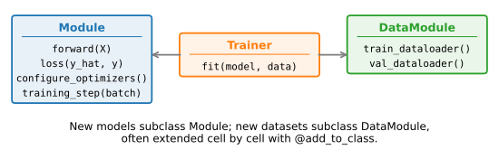

```{.python .input  n=1}
%load_ext d2lbook.tab
tab.interact_select('mxnet', 'pytorch', 'tensorflow', 'jax')
```

# Linear Regression Implementation from Scratch
:label:`sec_linear_scratch`

We are now ready to work through 
a fully functioning implementation 
of linear regression. 
In this section, 
we will implement the entire method from scratch,
including (i) the model; (ii) the loss function;
(iii) a minibatch stochastic gradient descent optimizer;
and (iv) the training function 
that stitches all of these pieces together.
Finally, we will run our synthetic data generator
from :numref:`sec_synthetic-regression-data`
and apply our model
on the resulting dataset. 
While modern deep learning frameworks 
can automate nearly all of this work,
implementing things from scratch is the only way
to make sure that you really know what you are doing.
Moreover, when it is time to customize models,
defining our own layers or loss functions,
understanding how things work under the hood will prove handy.
In this section, we will rely only 
on tensors and automatic differentiation.
Later, we will introduce a more concise implementation,
taking advantage of the bells and whistles of deep learning frameworks 
while retaining the structure of what follows below.

```{.python .input #linear-regression-scratch-linear-regression-implementation-from-scratch  n=2}
%%tab mxnet
%matplotlib inline
from d2l import mxnet as d2l
from mxnet import autograd, np, npx
npx.set_np()
```

```{.python .input #linear-regression-scratch-linear-regression-implementation-from-scratch  n=3}
%%tab pytorch
%matplotlib inline
from d2l import torch as d2l
import torch
```

```{.python .input #linear-regression-scratch-linear-regression-implementation-from-scratch  n=4}
%%tab tensorflow
%matplotlib inline
from d2l import tensorflow as d2l
import tensorflow as tf
```

```{.python .input #linear-regression-scratch-linear-regression-implementation-from-scratch  n=5}
%%tab jax
%matplotlib inline
from d2l import jax as d2l
from flax import linen as nn
import jax
from jax import numpy as jnp
import optax
```

## Defining the Model

Before we can begin optimizing our model's parameters by minibatch SGD,
we need to have some parameters in the first place.
In the following we initialize weights by drawing
random numbers from a normal distribution with mean 0
and a standard deviation of 0.01. 
The magic number 0.01 often works well in practice, 
but you can specify a different value 
through the argument `sigma`.
Moreover we set the bias to 0.
Note that for object-oriented design
we add the code to the `__init__` method of a subclass of `d2l.Module` (introduced in :numref:`subsec_oo-design-models`).

```{.python .input #linear-regression-scratch-defining-the-model-1  n=6}
%%tab pytorch
class LinearRegressionScratch(d2l.Module):  #@save
    """The linear regression model implemented from scratch."""
    def __init__(self, num_inputs, lr, sigma=0.01):
        super().__init__()
        self.save_hyperparameters()
        self.w = d2l.normal(0, sigma, (num_inputs, 1), requires_grad=True)
        self.b = d2l.zeros(1, requires_grad=True)
```

```{.python .input #linear-regression-scratch-defining-the-model-1  n=6}
%%tab mxnet
class LinearRegressionScratch(d2l.Module):  #@save
    """The linear regression model implemented from scratch."""
    def __init__(self, num_inputs, lr, sigma=0.01):
        super().__init__()
        self.save_hyperparameters()
        self.w = d2l.normal(0, sigma, (num_inputs, 1))
        self.b = d2l.zeros(1)
        self.w.attach_grad()
        self.b.attach_grad()
```

```{.python .input #linear-regression-scratch-defining-the-model-1  n=6}
%%tab tensorflow
class LinearRegressionScratch(d2l.Module):  #@save
    """The linear regression model implemented from scratch."""
    def __init__(self, num_inputs, lr, sigma=0.01):
        super().__init__()
        self.save_hyperparameters()
        w = tf.random.normal((num_inputs, 1), mean=0, stddev=0.01)
        b = tf.zeros(1)
        self.w = tf.Variable(w, trainable=True)
        self.b = tf.Variable(b, trainable=True)
```

```{.python .input #linear-regression-scratch-defining-the-model-1  n=7}
%%tab jax
class LinearRegressionScratch(d2l.Module):  #@save
    """The linear regression model implemented from scratch."""
    num_inputs: int
    lr: float
    sigma: float = 0.01

    def setup(self):
        self.w = self.param('w', nn.initializers.normal(self.sigma),
                            (self.num_inputs, 1))
        self.b = self.param('b', nn.initializers.zeros, (1))
```

Next we must define our model,
relating its input and parameters to its output.
Using the same notation as :eqref:`eq_linreg-y-vec`
for our linear model we simply take the matrix--vector product
of the input features $\mathbf{X}$ 
and the model weights $\mathbf{w}$,
and add the offset $b$ to each example.
The product $\mathbf{Xw}$ is a vector and $b$ is a scalar.
Because of the broadcasting mechanism 
(see :numref:`subsec_broadcasting`),
when we add a vector and a scalar,
the scalar is added to each component of the vector.
The resulting `forward` method 
is registered in the `LinearRegressionScratch` class
via `add_to_class` (introduced in :numref:`oo-design-utilities`).

```{.python .input #linear-regression-scratch-defining-the-model-2  n=8}
@d2l.add_to_class(LinearRegressionScratch)  #@save
def forward(self, X):
    return d2l.matmul(X, self.w) + self.b
```

## Defining the Loss Function

Since updating our model requires taking
the gradient of our loss function,
we ought to define the loss function first.
Here we use the squared loss function
in :eqref:`eq_mse`.
Our synthetic data loader already yields labels `y`
with the same shape as the predictions `y_hat`
(both are $(B, 1)$ column vectors for a batch of size $B$),
so we can subtract them elementwise directly;
the JAX tab reshapes `y` defensively,
and exercise 5 asks what would go wrong
if the two shapes did not match.
We return the averaged loss value
among all examples in the minibatch.

```{.python .input #linear-regression-scratch-defining-the-loss-function  n=9}
%%tab pytorch, mxnet, tensorflow
@d2l.add_to_class(LinearRegressionScratch)  #@save
def loss(self, y_hat, y):
    l = (y_hat - y) ** 2 / 2
    return d2l.reduce_mean(l)
```

:begin_tab:`jax`
JAX/Flax models are stateless — parameters are not stored on
the module. The loss takes the parameter pytree `params` plus
the model state explicitly and runs the forward pass via
`state.apply_fn`, returning the loss for `jax.grad` to
differentiate. The other frameworks can take the already-
computed `y_hat` directly because the model carries its
parameters internally.
:end_tab:

```{.python .input #linear-regression-scratch-defining-the-loss-function  n=10}
%%tab jax
@d2l.add_to_class(LinearRegressionScratch)  #@save
def loss(self, params, X, y, state):
    y_hat = state.apply_fn({'params': params}, *X)  # X unpacked from a tuple
    l = (y_hat - d2l.reshape(y, y_hat.shape)) ** 2 / 2
    return d2l.reduce_mean(l)
```

Before handing this loss to an optimizer, it is worth computing by hand the
gradient that the optimizer will consume. For a single example, the loss is
$\ell = \frac{1}{2}(\hat{y} - y)^2$ with $\hat{y} = \mathbf{w}^\top \mathbf{x} + b$,
and the chain rule gives

$$\frac{\partial \ell}{\partial \mathbf{w}} = (\hat{y} - y)\, \mathbf{x} \qquad \textrm{and} \qquad \frac{\partial \ell}{\partial b} = \hat{y} - y.$$

Differentiating the square produces the error $\hat{y} - y$, which is then
multiplied by the derivative of $\hat{y}$ with respect to each parameter---
$\mathbf{x}$ for the weights and $1$ for the bias. In words, *the gradient is
the error-weighted input*: each weight $w_j$ will be nudged in proportion to
how wrong the prediction was times how strongly $x_j$ contributed to it, and
the bias simply soaks up the average error. Averaging these per-example
gradients over a minibatch recovers exactly the closed-form update we wrote
down in :eqref:`eq_linreg_batch_update`. This averaged gradient is precisely
what the backward pass deposits in each parameter's gradient field, so when
the `SGD` class below reads `param.grad`, you now know what it contains.

## Defining the Optimization Algorithm

As discussed in :numref:`sec_linear_regression`,
linear regression has a closed-form solution.
However, our goal here is to illustrate 
how to train more general neural networks,
and that requires that we teach you 
how to use minibatch SGD.
Hence we will take this opportunity
to introduce your first working example of SGD.
At each step, using a minibatch 
randomly drawn from our dataset,
we estimate the gradient of the loss
with respect to the parameters.
Next, we update the parameters
in the direction that may reduce the loss.

The following code applies the update, 
given a set of parameters, and a learning rate `lr`.
Since our loss is computed as an average over the minibatch, 
we do not need to adjust the learning rate against the batch size. 
In later chapters we will investigate 
how learning rates should be adjusted
for very large minibatches as they arise 
in distributed large-scale learning.
For now, we can ignore this dependency.

:begin_tab:`mxnet`
We define our `SGD` class, 
a subclass of `d2l.HyperParameters` (introduced in :numref:`oo-design-utilities`),
to have a similar API
as the built-in SGD optimizer.
We update the parameters in the `step` method.
It accepts a `batch_size` argument that can be ignored.
:end_tab:

:begin_tab:`pytorch`
We define our `SGD` class,
a subclass of `d2l.HyperParameters` (introduced in :numref:`oo-design-utilities`),
to have a similar API 
as the built-in SGD optimizer.
We update the parameters in the `step` method.
The `zero_grad` method sets all gradients to 0,
which must be run before a backpropagation step.
:end_tab:

:begin_tab:`tensorflow`
We define our `SGD` class,
a subclass of `d2l.HyperParameters` (introduced in :numref:`oo-design-utilities`),
to have a similar API
as the built-in SGD optimizer.
We update the parameters in the `apply_gradients` method.
It accepts a list of parameter and gradient pairs.
:end_tab:

```{.python .input #linear-regression-scratch-defining-the-optimization-algorithm-1  n=11}
%%tab mxnet
class SGD(d2l.HyperParameters):  #@save
    """Minibatch stochastic gradient descent."""
    def __init__(self, params, lr):
        self.save_hyperparameters()

    def step(self, _):
        for param in self.params:
            param -= self.lr * param.grad
```

```{.python .input #linear-regression-scratch-defining-the-optimization-algorithm-1  n=11}
%%tab pytorch
class SGD(d2l.HyperParameters):  #@save
    """Minibatch stochastic gradient descent."""
    def __init__(self, params, lr):
        self.save_hyperparameters()

    def step(self):
        for param in self.params:
            param -= self.lr * param.grad

    def zero_grad(self):
        for param in self.params:
            if param.grad is not None:
                param.grad.zero_()
```

```{.python .input #linear-regression-scratch-defining-the-optimization-algorithm-1  n=12}
%%tab tensorflow
class SGD(d2l.HyperParameters):  #@save
    """Minibatch stochastic gradient descent."""
    def __init__(self, lr):
        self.save_hyperparameters()

    def apply_gradients(self, grads_and_vars):
        for grad, param in grads_and_vars:
            param.assign_sub(self.lr * grad)
```

```{.python .input #linear-regression-scratch-defining-the-optimization-algorithm-1  n=13}
%%tab jax
class SGD(d2l.HyperParameters):  #@save
    """Minibatch stochastic gradient descent."""
    # The key transformation of Optax is the GradientTransformation
    # defined by two methods, the init and the update.
    # The init initializes the state and the update transforms the gradients.
    # https://github.com/deepmind/optax/blob/master/optax/_src/transform.py
    def __init__(self, lr):
        self.save_hyperparameters()

    def init(self, params):
        # Delete unused params
        del params
        # Return an EmptyState *instance* (an empty NamedTuple, hence a valid
        # pytree) -- not the class -- so this hand-rolled optimizer is
        # JIT-traceable just like any optax GradientTransformation.
        return optax.EmptyState()

    def update(self, updates, state, params=None):
        del params
        # When state.apply_gradients method is called to update flax's
        # train_state object, it internally calls optax.apply_updates method
        # adding the params to the update equation defined below.
        updates = jax.tree_util.tree_map(lambda g: -self.lr * g, updates)
        return updates, state

    def __call__(self):
        return optax.GradientTransformation(self.init, self.update)
```

Each optimization step has four parts, and their order matters. **(1) Zero the
gradients:** autograd *accumulates* gradients by default (:numref:`sec_autograd`),
so the gradient left over from the previous minibatch must be cleared first.
**(2) Forward pass and loss**, computed with the gradient machinery recording.
**(3) Backward pass**, which fills each parameter's gradient with
$\partial L/\partial \theta$ averaged over the minibatch. **(4) Update:** subtract
$\eta$ times the gradient from each parameter, *in place*. This last step must run
*outside* the gradient graph---so that the update itself is not differentiated and
does not extend the graph---which is why it sits under a no-tracking guard
(PyTorch's `torch.no_grad()`; the other frameworks express the same idea through
their `GradientTape`, `autograd.record()`, or functional value-and-gradient, as
the notes above describe). Forget step (1) and stale gradients leak from one batch
into the next; forget the guard in step (4) and the update either errors or
silently grows the graph. Strip away the bookkeeping and training a neural network
is exactly this four-step loop, run on minibatch after minibatch---which is what
`fit_epoch` implements below.

We next define the `configure_optimizers` method, which returns an instance of the `SGD` class.

```{.python .input #linear-regression-scratch-defining-the-optimization-algorithm-2  n=14}
%%tab pytorch
@d2l.add_to_class(LinearRegressionScratch)  #@save
def configure_optimizers(self):
    return SGD([self.w, self.b], self.lr)
```

```{.python .input #linear-regression-scratch-defining-the-optimization-algorithm-2  n=14}
%%tab tensorflow
@d2l.add_to_class(LinearRegressionScratch)  #@save
def configure_optimizers(self):
    return SGD(self.lr)
```

```{.python .input #linear-regression-scratch-defining-the-optimization-algorithm-2  n=14}
%%tab jax
@d2l.add_to_class(LinearRegressionScratch)  #@save
def configure_optimizers(self):
    return SGD(self.lr)
```

```{.python .input #linear-regression-scratch-defining-the-optimization-algorithm-2  n=14}
%%tab mxnet
@d2l.add_to_class(LinearRegressionScratch)  #@save
def configure_optimizers(self):
    return SGD([self.w, self.b], self.lr)
```

## Training

Now that we have all of the parts in place
(parameters, loss function, model, and optimizer),
we are ready to implement the main training loop.
It is crucial that you understand this code fully
since you will employ similar training loops
for every other deep learning model
covered in this book.
In each *epoch*, we iterate through 
the entire training dataset, 
passing once through every example
(up to a final partial batch when the number of examples 
is not divisible by the batch size). 
In each *iteration*, we grab a minibatch of training examples,
and compute its loss through the model's `training_step` method. 
Then we compute the gradients with respect to each parameter. 
Finally, we will call the optimization algorithm
to update the model parameters. 
In summary, we will execute the following loop:

* Initialize parameters $(\mathbf{w}, b)$
* Repeat until done
    * Compute gradient $\mathbf{g} \leftarrow \partial_{(\mathbf{w},b)} \frac{1}{|\mathcal{B}|} \sum_{i \in \mathcal{B}} l(\mathbf{x}^{(i)}, y^{(i)}, \mathbf{w}, b)$
    * Update parameters $(\mathbf{w}, b) \leftarrow (\mathbf{w}, b) - \eta \mathbf{g}$
 
Recall that the synthetic regression data module 
that we generated in :numref:`sec_synthetic-regression-data` 
holds out 1000 validation examples 
alongside the training data. 
We will almost always want such a validation dataset 
to measure our model quality. 
Here we pass the validation dataloader 
once in each epoch to measure the model performance.
Following our object-oriented design,
the `prepare_batch` and `fit_epoch` methods
are registered in the `d2l.Trainer` class
(introduced in :numref:`oo-design-training`).

:begin_tab:`tensorflow`
In TensorFlow, executing each operation one at a time from Python
is much slower than having the framework
run an entire sequence of operations as one compiled graph.
We therefore use `tf.function` to
compile the forward pass, loss computation,
gradient calculation, and parameter update
into a single fused step.
This happens in `_compile_steps`, which is called once
at the beginning of training.
Since `tf.function` traces through Python code
to build a static graph,
side effects like plotting cannot live inside it.
We thus split each step into a compiled part
(`_train_step`, `_val_step`) that does the heavy computation,
and a reporting part
(`_report_train`, `_report_val`)
that records metrics in Python.
Before tracing,
we run one forward pass
to let Keras create the layer weights,
since `tf.function` needs all variables
to exist at trace time.
This graph-compilation step is specific to the TensorFlow tab
(PyTorch and MXNet run this from-scratch loop eagerly;
JAX gets the same effect from `jax.jit` in later chapters).
At the tiny scale of this example the wall-clock difference is modest —
the pattern earns its keep once models and batches grow.
:end_tab:

:begin_tab:`jax`
The JAX implementation looks longer than its PyTorch counterpart because
JAX is purely functional: there is no implicit `self`-attached state,
so each step must explicitly take in and return the optimizer state,
dropout RNG, and (optionally) batch-statistics. PyTorch's `optim.step()`
mutates parameters in place, but JAX's `state.apply_gradients(grads=…)`
returns a *new* state object, which we then thread back through the
loop. This explicit plumbing is what the extra lines below are doing.

JAX shares the same "compile, then dispatch" cost model as TensorFlow:
executing optax updates and `state.replace` calls one at a time in Python
is far slower than doing them as a single compiled kernel. We therefore
wrap the optimizer step and the bookkeeping
(`state.apply_gradients`, `state.replace(dropout_rng=…, batch_stats=…)`)
in two small `@jax.jit` functions, `_trainer_update` and
`_trainer_update_with_bn`, and call the appropriate one per batch.
The forward + gradient computation is already inside `self.model.loss`
(itself `@jax.jit`-decorated), so the entire per-batch work consists of
two JIT-ed calls with no Python-side optax dispatch. Because the hand-rolled
`SGD.init` below returns a proper `EmptyState()` pytree, even that optimizer
is JIT-traceable, so we always take the compiled path (no eager fallback).
:end_tab:

```{.python .input #linear-regression-scratch-training-1  n=15}
@d2l.add_to_class(d2l.Trainer)  #@save
def prepare_batch(self, batch):
    return batch
```

```{.python .input #linear-regression-scratch-training-2  n=16}
%%tab pytorch
@d2l.add_to_class(d2l.Trainer)  #@save
def fit_epoch(self):
    self.model.train()
    for batch in self.train_dataloader:
        loss = self.model.training_step(self.prepare_batch(batch))
        self.optim.zero_grad()
        loss.backward()
        if self.gradient_clip_val > 0:  # To be discussed later
            self.clip_gradients(self.gradient_clip_val, self.model)
        # The `no_grad` only needs to wrap the parameter update; the
        # scratch `SGD.step` does an in-place `param -= lr * grad`,
        # which would otherwise be flagged as a leaf-tensor mutation.
        with torch.no_grad():
            self.optim.step()
        self.train_batch_idx += 1
    if self.val_dataloader is None:
        return
    self.model.eval()
    for batch in self.val_dataloader:
        with torch.no_grad():
            self.model.validation_step(self.prepare_batch(batch))
        self.val_batch_idx += 1
```

```{.python .input #linear-regression-scratch-training-2  n=17}
%%tab mxnet
@d2l.add_to_class(d2l.Trainer)  #@save
def fit_epoch(self):
    for batch in self.train_dataloader:
        with autograd.record():
            loss = self.model.training_step(self.prepare_batch(batch))
        loss.backward()
        if self.gradient_clip_val > 0:
            self.clip_gradients(self.gradient_clip_val, self.model)
        self.optim.step(1)
        self.train_batch_idx += 1
    if self.val_dataloader is None:
        return
    for batch in self.val_dataloader:        
        self.model.validation_step(self.prepare_batch(batch))
        self.val_batch_idx += 1
```

```{.python .input #linear-regression-scratch-training-2  n=18}
%%tab tensorflow
@d2l.add_to_class(d2l.Trainer)  #@save
def _compile_steps(self):
    model, optim = self.model, self.optim
    grad_clip = self.gradient_clip_val
    for batch in self.train_dataloader:
        model(*self.prepare_batch(batch)[:-1], training=True)
        break

    def train_step(batch):
        with tf.GradientTape() as tape:
            loss = model.loss(model(*batch[:-1], training=True),
                              batch[-1])
        params = model.trainable_variables
        if not params:
            params = list(tape.watched_variables())
        grads = tape.gradient(loss, params)
        if grad_clip > 0:
            grads = self.clip_gradients(grad_clip, grads)
        optim.apply_gradients(zip(grads, params))
        return loss

    def val_step(batch):
        return model(*batch[:-1], training=False)

    train_step = tf.function(train_step, reduce_retracing=True)
    val_step = tf.function(val_step, reduce_retracing=True)

    self._train_step = train_step
    self._val_step = val_step

@d2l.add_to_class(d2l.Trainer)  #@save
def fit_epoch(self):
    self.model.training = True
    for batch in self.train_dataloader:
        loss = self._train_step(self.prepare_batch(batch))
        self.model._report_train(loss)
        self.train_batch_idx += 1
    if self.val_dataloader is None:
        return
    self.model.training = False
    for batch in self.val_dataloader:
        b = self.prepare_batch(batch)
        y_hat = self._val_step(b)
        self.model._report_val(y_hat, b)
        self.val_batch_idx += 1
```

```{.python .input #linear-regression-scratch-training-2  n=19}
%%tab jax
# Fuse the optimizer + state.replace updates into a single JIT'd call so
# JAX dispatches one compiled kernel per batch instead of many Python-level
# optax ops.
@jax.jit  #@save
def _trainer_update(state, grads):
    return state.apply_gradients(grads=grads).replace(
        dropout_rng=jax.random.split(state.dropout_rng)[0])


@jax.jit  #@save
def _trainer_update_with_bn(state, grads, batch_stats):
    return state.apply_gradients(grads=grads).replace(
        dropout_rng=jax.random.split(state.dropout_rng)[0],
        batch_stats=batch_stats)


@d2l.add_to_class(d2l.Trainer)  #@save
def fit_epoch(self):
    self.model.training = True
    if self.state.batch_stats:
        # Mutable states will be used later (e.g., for batch norm)
        for batch in self.train_dataloader:
            (_, mutated_vars), grads = self.model.training_step(
                self.state.params, self.prepare_batch(batch), self.state)
            if self.gradient_clip_val > 0:
                grads = self.clip_gradients(self.gradient_clip_val, grads)
            self.state = _trainer_update_with_bn(
                self.state, grads, mutated_vars['batch_stats'])
            self.train_batch_idx += 1
    else:
        for batch in self.train_dataloader:
            _, grads = self.model.training_step(
                self.state.params, self.prepare_batch(batch), self.state)
            if self.gradient_clip_val > 0:
                grads = self.clip_gradients(self.gradient_clip_val, grads)
            self.state = _trainer_update(self.state, grads)
            self.train_batch_idx += 1

    if self.val_dataloader is None:
        return
    self.model.training = False
    for batch in self.val_dataloader:
        self.model.validation_step(self.state.params,
                                   self.prepare_batch(batch),
                                   self.state)
        self.val_batch_idx += 1
```

We are almost ready to train the model,
but first we need some training data.
Here we use the `SyntheticRegressionData` class 
and pass in some ground truth parameters.
Then we train our model with 
the learning rate `lr=0.03`
and set `max_epochs=10`.
Note that in general, both the number of epochs 
and the learning rate are hyperparameters.
Setting hyperparameters is tricky
and we will usually want to use a three-way split,
one set for training, 
a second for hyperparameter selection,
and the third reserved for the final evaluation.
We elide these details for now and develop model selection, validation, and the
train/validation/test split in :numref:`sec_generalization_basics`.

So that repeated runs of this notebook produce identical numbers, we first fix
the seed of the framework's random number generator, which governs both the
parameter initialization and the shuffling of minibatches.

:begin_tab:`jax`
JAX needs no such call: its PRNG is *functional*, with no global state. The
model is initialized from a fixed `PRNGKey` and the synthetic dataset defaults
to `key=jax.random.PRNGKey(0)`---see exercise 4 of
:numref:`sec_synthetic-regression-data`.
:end_tab:

```{.python .input #linear-regression-scratch-training-seed}
%%tab pytorch
torch.manual_seed(1)
```

```{.python .input #linear-regression-scratch-training-seed}
%%tab mxnet
npx.random.seed(1)
```

```{.python .input #linear-regression-scratch-training-seed}
%%tab tensorflow
tf.random.set_seed(1)
```

```{.python .input #linear-regression-scratch-training-3  n=20}
model = LinearRegressionScratch(2, lr=0.03)
data = d2l.SyntheticRegressionData(w=d2l.tensor([2, -3.4]), b=4.2)
trainer = d2l.Trainer(max_epochs=10)
trainer.fit(model, data)
```

The `fit` call above produces a live plot of the training and validation loss
against the epoch. Both curves fall together and flatten near the irreducible
noise floor (with $\sigma = 0.01$ the per-example squared loss bottoms out around
$\sigma^2/2 \approx 5\times 10^{-5}$). Crucially, the validation curve tracks the
training curve with **no gap**: a two-dimensional linear model fit on 1000
examples has no capacity to overfit. We return to the train/validation gap, and
what to do when it opens, in :numref:`sec_generalization_basics`.

Because we synthesized the dataset ourselves,
we know precisely what the true parameters are.
Thus, we can evaluate our success in training
by comparing the true parameters
with those that we learned through our training loop.
Indeed they turn out to be very close to each other.

```{.python .input #linear-regression-scratch-training-4  n=21}
%%tab pytorch
with torch.no_grad():
    print(f'error in estimating w: {data.w - d2l.reshape(model.w, data.w.shape)}')
    print(f'error in estimating b: {data.b - model.b}')
```

```{.python .input #linear-regression-scratch-training-4  n=22}
%%tab mxnet, tensorflow
print(f'error in estimating w: {data.w - d2l.reshape(model.w, data.w.shape)}')
print(f'error in estimating b: {data.b - model.b}')
```

```{.python .input #linear-regression-scratch-training-4  n=23}
%%tab jax
params = trainer.state.params
print(f"error in estimating w: {data.w - d2l.reshape(params['w'], data.w.shape)}")
print(f"error in estimating b: {data.b - params['b']}")
```

We should not take the ability to exactly recover 
the ground truth parameters for granted.
In general, for deep models unique solutions
for the parameters do not exist,
and even for linear models,
exactly recovering the parameters
is only possible when no feature 
is linearly dependent on the others.
However, in machine learning, 
we are often less concerned
with recovering true underlying parameters,
but rather with parameters 
that lead to highly accurate prediction :cite:`Vapnik.1992`.
Fortunately, even on difficult optimization problems,
stochastic gradient descent can often find remarkably good solutions,
owing partly to the fact that, for deep networks,
there exist many configurations of the parameters
that lead to highly accurate prediction.
Why the solutions that SGD finds among these many candidates
also *generalize* so well is a deep question,
taken up in :numref:`sec_generalization_deep`.


## Summary

In this section, we took a significant step 
towards designing deep learning systems 
by implementing a fully functional 
neural network model and training loop.
In this process, we built a data loader, 
a model, a loss function, an optimization procedure,
and a visualization and monitoring tool. 
We did this by composing a Python object 
that contains all relevant components for training a model. 
While this is not yet a professional-grade implementation
it is perfectly functional and code like this 
could already help you to solve small problems quickly.
In the coming sections, we will see how to do this
both *more concisely* (avoiding boilerplate code)
and *more efficiently* (using our GPUs to their full potential).

The hand-rolled SGD above is the simplest member of a large family: momentum,
AdaGrad, RMSProp, and Adam all replace that single update line, and learning-rate
schedules anneal $\eta$ over the course of training; these are developed in
:numref:`chap_optimization`. The squared loss, likewise, is a modelling
choice---in :numref:`sec_weight_decay` we add a penalty on $\|\mathbf{w}\|$ to
curb overfitting, the first of many regularizers we will meet.


## Exercises

1. What would happen if we were to initialize the weights to zero. Would the algorithm still work? What if we
   initialized the parameters with variance $1000$ rather than $0.01$?
1. Assume that you are [Georg Simon Ohm](https://en.wikipedia.org/wiki/Georg_Ohm) trying to come up
   with a model for resistance that relates voltage and current. Can you use automatic
   differentiation to learn the parameters of your model?
1. Can you use [Planck's Law](https://en.wikipedia.org/wiki/Planck%27s_law) to determine the temperature of an object
   using spectral energy density? For reference, the spectral density $B$ of radiation emanating from a black body is
   $B(\lambda, T) = \frac{2 hc^2}{\lambda^5} \cdot \left(\exp \frac{h c}{\lambda k T} - 1\right)^{-1}$. Here
   $\lambda$ is the wavelength, $T$ is the temperature, $c$ is the speed of light, $h$ is Planck's constant, and $k$ is the
   Boltzmann constant. You measure the energy for different wavelengths $\lambda$ and you now need to fit the spectral
   density curve to Planck's law.
1. What are the problems you might encounter if you wanted to compute the second derivatives of the loss? How would
   you fix them?
1. Why is the `reshape` method needed in the `loss` function?
1. Experiment using different learning rates to find out how quickly the loss function value drops. Can you reduce the
   error by increasing the number of epochs of training?
1. Try implementing a different loss function, such as the absolute value loss `(y_hat - d2l.reshape(y, y_hat.shape)).abs().mean()`. (If you *sum* rather than average, the gradient scales with the batch size, so you must lower the learning rate to compensate.)
    1. Check what happens for regular data.
    1. Check whether there is a difference in behavior if you actively perturb some entries, such as $y_5 = 10000$, of $\mathbf{y}$.
    1. Can you think of a cheap solution for combining the best aspects of squared loss and absolute value loss?
       Hint: how can you avoid really large gradient values?
1. Why do we need to reshuffle the dataset? Can you design a case where a maliciously constructed dataset would break the optimization algorithm otherwise?

:begin_tab:`mxnet`
[Discussions](https://d2l.discourse.group/t/42)
:end_tab:

:begin_tab:`pytorch`
[Discussions](https://d2l.discourse.group/t/43)
:end_tab:

:begin_tab:`tensorflow`
[Discussions](https://d2l.discourse.group/t/201)
:end_tab:

:begin_tab:`jax`
[Discussions](https://d2l.discourse.group/t/17976)
:end_tab:

<!-- slides -->

::: {.slide}
::: {.cover}
[Dive into Deep Learning · §3.4]{.kicker}

Built by hand once, demystified for good<br>**model · loss · optimizer · training loop --- nothing but tensors and autograd**.
:::
:::

::: {.slide title="We know the answer before we start"}
[Motivation]{.kicker}

::: {.cols .vc}
::: {.col}
Four pieces, built by hand today: a **model** (`w`, `b`, `forward`), a
**loss**, an **optimizer**, and the **training loop** driving them ---
each slotted into the `Module` / `Trainer` / `DataModule` scaffold of
§3.2.

::: {.d2l-note .rule}
Because we manufactured the data (§3.3, noise $\sigma = 0.01$), a
*correct* implementation has nowhere to hide. It must deliver **two
numbers**: a loss landing on the noise floor
$\sigma^2/2 = 5\times10^{-5}$, and parameters returning to
$\mathbf{w}^* = [2, -3.4]$, $b^* = 4.2$. Keep score.
:::
:::

::: {.col .fig .big}

:::
:::
:::

::: {.slide}
::: {.divider}
[01]{.dnum}

[The Model]{.dtitle}

[parameters and the forward pass]{.dsub}
:::
:::

::: {.slide title="Parameters: small random w, zero b"}
[The Model]{.kicker}

We need parameters before we can optimize them. Draw `w` from a tiny Gaussian, set `b` to zero:

@linear-regression-scratch-defining-the-model-1

::: {.d2l-note}
`requires_grad=True` (or the framework's equivalent) is the crucial
flag: it tells autograd to track `w` and `b` so gradients can flow back
from the loss. For a single linear layer **any** small init works
(exercise 1); symmetry breaking only matters once we stack layers.
:::
:::

::: {.slide title="Forward pass: one matrix-vector product"}
[The Model]{.kicker}

::: {.cols .vc}
::: {.col}
The whole model is an affine map: multiply the feature matrix by the weights and add the bias.

$$\hat{\mathbf{y}} = \mathbf{X}\mathbf{w} + b$$

@linear-regression-scratch-defining-the-model-2

::: {.d2l-note}
$\mathbf{Xw}$ is a vector, $b$ a scalar; **broadcasting** adds $b$ to every entry.
:::
:::

::: {.col .narrow}
::: {.d2l-note .rule}
This single line is the only "architecture" in linear regression. Deep nets just stack many of them with nonlinearities between.
:::
:::
:::
:::

::: {.slide}
::: {.divider}
[02]{.dnum}

[Loss & Optimizer]{.dtitle}

[what to minimize, and how]{.dsub}
:::
:::

::: {.slide title="Loss: mean squared error"}
[Loss]{.kicker}

Squared error per example, averaged over the minibatch:

$$\ell(\hat{y}, y) = \tfrac{1}{2}\,(\hat{y} - y)^2$$

@linear-regression-scratch-defining-the-loss-function

::: {.d2l-note}
The $\tfrac12$ makes the gradient just $\hat{y}-y$; averaging (not summing) keeps the step size independent of batch size.
:::
:::

::: {.slide title="The gradient, by hand"}
[Loss]{.kicker}

What is it that `loss.backward()` will compute? For one example $\ell = \tfrac12(\hat{y}-y)^2$ with $\hat{y}=\mathbf{w}^\top\mathbf{x}+b$, the chain rule gives:

$$\frac{\partial \ell}{\partial \mathbf{w}} = (\hat{y}-y)\,\mathbf{x},
  \qquad
  \frac{\partial \ell}{\partial b} = (\hat{y}-y).$$

. . .

Averaged over a minibatch $\mathcal{B}$, that is the entire gradient the optimizer consumes:

$$\nabla_{\mathbf{w}} L = \frac{1}{|\mathcal{B}|}\sum_{i\in\mathcal{B}}(\hat{y}^{(i)}-y^{(i)})\,\mathbf{x}^{(i)},
  \qquad
  \nabla_{b} L = \frac{1}{|\mathcal{B}|}\sum_{i\in\mathcal{B}}(\hat{y}^{(i)}-y^{(i)}).$$

. . .

::: {.d2l-note .rule}
The gradient is the **error-weighted input**: a large residual $\hat{y}-y$ gives a large push, in the direction of $\mathbf{x}$. This is exactly what `loss.backward()` fills in and what the SGD step subtracts.
:::
:::

::: {.slide title="A stateless loss" only="jax"}
[Loss · JAX]{.kicker}

JAX/Flax modules **hold no parameters** of their own. The loss takes the parameter pytree explicitly and runs the forward pass through `state.apply_fn`, so `jax.grad` has something to differentiate:

@linear-regression-scratch-defining-the-loss-function@jax

::: {.d2l-note .rule}
"Parameters in, loss out" is what makes the function pure, and therefore `jit`- and `grad`-friendly.
:::
:::

::: {.slide title="The optimizer: minibatch SGD by hand" except="tensorflow,jax"}
[Optimizer]{.kicker}

The update rule $\;\theta \leftarrow \theta - \eta\,\nabla_\theta L\;$ is the entire algorithm: walk the parameters and subtract the gradient in place. `configure_optimizers` then hands the parameters to it.

@linear-regression-scratch-defining-the-optimization-algorithm-1
:::

::: {.slide title="Minibatch SGD: assign through Variables" only="tensorflow"}
[Optimizer · TensorFlow]{.kicker}

A `tf.Variable` is updated in place with `assign_sub`. The same rule $\theta \leftarrow \theta - \eta\,\nabla_\theta L$, applied to each (gradient, variable) pair:

@linear-regression-scratch-defining-the-optimization-algorithm-1

. . .

@linear-regression-scratch-defining-the-optimization-algorithm-2
:::

::: {.slide title="Minibatch SGD as an Optax transform" only="jax" layout="code"}
[Optimizer · JAX]{.kicker}

Optax expresses an optimizer as two pure functions, `init` (empty state) and `update` (gradients to the increment $-\eta\,\mathbf{g}$), wrapped in a `GradientTransformation`:

@-linear-regression-scratch-defining-the-optimization-algorithm-1
:::

::: {.slide}
::: {.divider}
[03]{.dnum}

[Training]{.dtitle}

[the loop that ties it together]{.dsub}
:::
:::

::: {.slide title="One minibatch: four steps, in order"}
[Training]{.kicker}

Strip away the bookkeeping and every step of training is the same four moves on a minibatch:

1. **Zero** the gradients (autograd *accumulates* them).
2. **Forward + loss**, with the gradient machinery recording.
3. **Backward** to fill each parameter's gradient.
4. **Update** the parameters, *outside* the gradient graph.

. . .

::: {.d2l-note .warn}
Skip step 1 and stale gradients leak between batches; drop the no-grad guard in step 4 and the update itself gets differentiated.
:::
:::

::: {.slide title="Reproducibility: fix the seed" only="pytorch"}
[Training · PyTorch]{.kicker}

So the run is repeatable, we seed the global RNG before building the model. The figures and recovered parameters on the next slides are exactly what this produces:

@-linear-regression-scratch-training-seed
:::

::: {.slide title="First promise kept: the loss lands on the noise floor"}
[Training · payoff]{.kicker}

::: {.cols .vc}
::: {.col}
Model, synthetic dataset, `Trainer`; ten epochs at learning rate `0.03`:

@-linear-regression-scratch-training-3

The `fit` call drives the four-step loop over every minibatch and plots both losses live.
:::

::: {.col .fig}
@!linear-regression-scratch-training-3

::: {.d2l-note .rule}
Both curves flatten at $\approx 5\times10^{-5}$ --- **exactly** the
$\sigma^2/2$ we promised, so the residual error is the noise we injected,
not a bug. And validation tracks training with **no gap**: 2 parameters
on 1000 points has no room to overfit (§3.6).
:::
:::
:::
:::

::: {.slide title="Second promise kept: the truth, recovered"}
[Training · payoff]{.kicker}

We synthesized the data, so we know the truth: $\mathbf{w}^*=[2,-3.4]$, $b^*=4.2$. The verdict:

@linear-regression-scratch-training-4

::: {.d2l-note}
Off by a few $10^{-4}$ at most. Exact recovery needs linearly
independent features and is *not* the everyday goal --- deep models have
many equally good parameter settings, and we care about accurate
**prediction** --- but on a problem with one right answer, our loop found it.
:::
:::

::: {.slide title="Recap"}
[Wrap-up]{.kicker}

::: {.cols}
::: {.col}
- A `Module` for linear regression is just `__init__`, `forward`, `loss`, `configure_optimizers`.
- The **gradient is the error-weighted input**, $(\hat{y}-y)\,\mathbf{x}$ --- what `backward` deposits and SGD consumes.
- The **optimizer** is a ten-line minibatch SGD.
:::

::: {.col}
- Training is one **four-step loop**: zero, forward, backward, update --- in that order.
- Both promises kept: loss on the $5\times10^{-5}$ noise floor, $\mathbf{w}, b$ recovered to $\sim10^{-4}$.
:::
:::

::: {.d2l-note}
Next: the same model in two lines of framework API, then richer losses, optimizers, and regularizers built on this skeleton.
:::
:::
