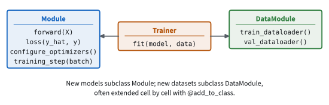

```{.python .input  n=1}
%load_ext d2lbook.tab
tab.interact_select('mxnet', 'pytorch', 'tensorflow', 'jax')
```

# Linear Regression Implementation from Scratch
:label:`sec_linear_scratch`

This section implements linear regression using only tensors and automatic
differentiation. The implementation has four components: the linear model, the
squared loss, minibatch stochastic gradient descent, and the training loop. We
apply them to the synthetic dataset from
:numref:`sec_synthetic-regression-data`, where the known parameters allow us to
check the result directly.

Writing these components explicitly makes their interfaces and interactions
visible. The next section expresses the same computation using the reusable
layers, losses, optimizers, and data loaders supplied by each framework.

```{.python .input #linear-regression-scratch-linear-regression-implementation-from-scratch  n=2}
%%tab mxnet
%matplotlib inline
from d2l import mxnet as d2l
from mxnet import autograd, np, npx
npx.set_np()
```

```{.python .input #linear-regression-scratch-linear-regression-implementation-from-scratch  n=3}
%%tab pytorch
%matplotlib inline
from d2l import torch as d2l
import torch
```

```{.python .input #linear-regression-scratch-linear-regression-implementation-from-scratch  n=4}
%%tab tensorflow
%matplotlib inline
from d2l import tensorflow as d2l
import tensorflow as tf
```

```{.python .input #linear-regression-scratch-linear-regression-implementation-from-scratch  n=5}
%%tab jax
%matplotlib inline
from d2l import jax as d2l
from flax import nnx
import jax
from jax import numpy as jnp
import optax
```

## Defining the Model

Before we can begin optimizing our model's parameters by minibatch SGD,
we need to have some parameters in the first place.
In the following we initialize weights by drawing
random numbers from a normal distribution with mean 0
and a standard deviation of 0.01. 
For this convex linear model, a small nonzero scale such as 0.01 is sufficient
to start optimization and is not a general initialization prescription. The
argument `sigma` exposes the choice; variance-preserving schemes for deep
networks are developed in :numref:`sec_numerical_stability`.
Moreover we set the bias to 0.
Note that for object-oriented design
we add the code to the `__init__` method of a subclass of `d2l.Module` (introduced in :numref:`subsec_oo-design-models`).

```{.python .input #linear-regression-scratch-defining-the-model-1  n=6}
%%tab pytorch
class LinearRegressionScratch(d2l.Module):  #@save
    """The linear regression model implemented from scratch."""
    def __init__(self, num_inputs, lr, sigma=0.01):
        super().__init__()
        self.save_hyperparameters()
        self.w = d2l.normal(0, sigma, (num_inputs, 1), requires_grad=True)
        self.b = d2l.zeros(1, requires_grad=True)
```

```{.python .input #linear-regression-scratch-defining-the-model-1  n=6}
%%tab mxnet
class LinearRegressionScratch(d2l.Module):  #@save
    """The linear regression model implemented from scratch."""
    def __init__(self, num_inputs, lr, sigma=0.01):
        super().__init__()
        self.save_hyperparameters()
        self.w = d2l.normal(0, sigma, (num_inputs, 1))
        self.b = d2l.zeros(1)
        self.w.attach_grad()
        self.b.attach_grad()
```

```{.python .input #linear-regression-scratch-defining-the-model-1  n=6}
%%tab tensorflow
class LinearRegressionScratch(d2l.Module):  #@save
    """The linear regression model implemented from scratch."""
    def __init__(self, num_inputs, lr, sigma=0.01):
        super().__init__()
        self.save_hyperparameters()
        w = tf.random.normal((num_inputs, 1), mean=0, stddev=0.01)
        b = tf.zeros(1)
        self.w = tf.Variable(w, trainable=True)
        self.b = tf.Variable(b, trainable=True)
```

```{.python .input #linear-regression-scratch-defining-the-model-1  n=7}
%%tab jax
class LinearRegressionScratch(d2l.Module):  #@save
    """The linear regression model implemented from scratch."""
    def __init__(self, num_inputs, lr, sigma=0.01, rngs=None):
        super().__init__()
        self.save_hyperparameters(ignore=['rngs'])
        rngs = nnx.Rngs(d2l.get_key()) if rngs is None else rngs
        self.w = nnx.Param(
            rngs.params.normal((num_inputs, 1)) * sigma)
        self.b = nnx.Param(jnp.zeros(1))
```

We next define how the model maps its inputs and parameters to its output.
Using the notation of :eqref:`eq_linreg-y-vec`, the linear model takes the matrix--vector product
of the input features $\mathbf{X}$ 
and the model weights $\mathbf{w}$,
and add the offset $b$ to each example.
The product $\mathbf{Xw}$ is a vector and $b$ is a scalar.
Because of the broadcasting mechanism 
(see :numref:`subsec_broadcasting`),
when we add a vector and a scalar,
the scalar is added to each component of the vector.
The resulting `forward` method 
is registered in the `LinearRegressionScratch` class
via `add_to_class` (introduced in :numref:`oo-design-utilities`).

```{.python .input #linear-regression-scratch-defining-the-model-2  n=8}
@d2l.add_to_class(LinearRegressionScratch)  #@save
def forward(self, X):
    return d2l.matmul(X, self.w) + self.b
```

## Defining the Loss Function

Since updating our model requires taking
the gradient of our loss function,
we ought to define the loss function first.
Here we use the squared loss function
in :eqref:`eq_mse`.
Our synthetic data loader already yields labels `y`
with the same shape as the predictions `y_hat`
(both are $(B, 1)$ column vectors for a batch of size $B$),
so we can subtract them elementwise directly;
exercise 5 asks what would go wrong
if the two shapes did not match.
We return the averaged loss value
among all examples in the minibatch.

```{.python .input #linear-regression-scratch-defining-the-loss-function  n=9}
%%tab pytorch, mxnet, tensorflow
@d2l.add_to_class(LinearRegressionScratch)  #@save
def loss(self, y_hat, y):
    l = (y_hat - y) ** 2 / 2
    return d2l.reduce_mean(l)
```

```{.python .input #linear-regression-scratch-defining-the-loss-function  n=10}
%%tab jax
@d2l.add_to_class(LinearRegressionScratch)  #@save
def loss(self, y_hat, y):
    l = (y_hat - d2l.reshape(y, y_hat.shape)) ** 2 / 2
    return d2l.reduce_mean(l)
```

Before handing this loss to an optimizer, compute by hand the
gradient that the optimizer will consume. For a single example, the loss is
$\ell = \frac{1}{2}(\hat{y} - y)^2$ with $\hat{y} = \mathbf{w}^\top \mathbf{x} + b$,
and the chain rule gives

$$\frac{\partial \ell}{\partial \mathbf{w}} = (\hat{y} - y)\, \mathbf{x} \qquad \textrm{and} \qquad \frac{\partial \ell}{\partial b} = \hat{y} - y.$$

Differentiating the square produces the error $\hat{y} - y$, which is then
multiplied by the derivative of $\hat{y}$ with respect to each parameter:
$\mathbf{x}$ for the weights and $1$ for the bias. In words, *the gradient is
the error-weighted input*: each weight $w_j$ receives a gradient proportional to the residual and to
$x_j$, while the bias gradient equals the residual. Averaging these per-example
gradients over a minibatch recovers exactly the closed-form update we wrote
down in :eqref:`eq_linreg_batch_update`. The backward pass stores this averaged gradient in each parameter's gradient
field, which the `SGD` class below reads through `param.grad`.

## Defining the Optimization Algorithm

As discussed in :numref:`sec_linear_regression`,
linear regression has a closed-form solution.
Our purpose here is to establish the minibatch SGD procedure used to train
models that lack a closed-form solution.
At each step, using a minibatch 
randomly drawn from our dataset,
we estimate the gradient of the loss
with respect to the parameters.
Next, we subtract a scaled gradient; for a suitable learning rate, this
direction locally reduces the loss.

The following code applies the update, 
given a set of parameters, and a learning rate `lr`.
Since our loss is computed as an average over the minibatch, 
we do not need to adjust the learning rate against the batch size. 
In later chapters we will investigate 
how learning rates should be adjusted
for very large minibatches as they arise 
in distributed large-scale learning.
For now, we can ignore this dependency.

:begin_tab:`mxnet`
We define our `SGD` class, 
a subclass of `d2l.HyperParameters` (introduced in :numref:`oo-design-utilities`),
to have a similar API
as the built-in SGD optimizer.
We update the parameters in the `step` method.
It accepts a `batch_size` argument that can be ignored.
:end_tab:

:begin_tab:`pytorch`
We define our `SGD` class,
a subclass of `d2l.HyperParameters` (introduced in :numref:`oo-design-utilities`),
to have a similar API 
as the built-in SGD optimizer.
We update the parameters in the `step` method.
The `zero_grad` method sets all gradients to 0,
which must be run before a backpropagation step.
:end_tab:

:begin_tab:`tensorflow`
We define our `SGD` class,
a subclass of `d2l.HyperParameters` (introduced in :numref:`oo-design-utilities`),
to have a similar API
as the built-in SGD optimizer.
We update the parameters in the `apply_gradients` method.
It accepts a list of parameter and gradient pairs.
:end_tab:

```{.python .input #linear-regression-scratch-defining-the-optimization-algorithm-1  n=11}
%%tab mxnet
class SGD(d2l.HyperParameters):  #@save
    """Minibatch stochastic gradient descent."""
    def __init__(self, params, lr):
        self.save_hyperparameters()

    def step(self, _):
        for param in self.params:
            param -= self.lr * param.grad
```

```{.python .input #linear-regression-scratch-defining-the-optimization-algorithm-1  n=11}
%%tab pytorch
class SGD(d2l.HyperParameters):  #@save
    """Minibatch stochastic gradient descent."""
    def __init__(self, params, lr):
        self.save_hyperparameters()

    def step(self):
        for param in self.params:
            param -= self.lr * param.grad

    def zero_grad(self):
        for param in self.params:
            if param.grad is not None:
                param.grad.zero_()
```

```{.python .input #linear-regression-scratch-defining-the-optimization-algorithm-1  n=12}
%%tab tensorflow
class SGD(d2l.HyperParameters):  #@save
    """Minibatch stochastic gradient descent."""
    def __init__(self, lr):
        self.save_hyperparameters()

    def apply_gradients(self, grads_and_vars):
        for grad, param in grads_and_vars:
            param.assign_sub(self.lr * grad)
```

```{.python .input #linear-regression-scratch-defining-the-optimization-algorithm-1  n=13}
%%tab jax
class SGD(d2l.HyperParameters):  #@save
    """Minibatch stochastic gradient descent."""
    # The key transformation of Optax is the GradientTransformation
    # defined by two methods, the init and the update.
    # The init initializes the state and the update transforms the gradients.
    # https://github.com/deepmind/optax/blob/master/optax/_src/transform.py
    def __init__(self, lr):
        self.save_hyperparameters()

    def init(self, params):
        # Delete unused params
        del params
        # Return an EmptyState *instance* (an empty NamedTuple, hence a valid
        # pytree) -- not the class -- so this hand-rolled optimizer is
        # JIT-traceable just like any optax GradientTransformation.
        return optax.EmptyState()

    def update(self, updates, state, params=None):
        del params
        # NNX's Optimizer applies these updates to its model's parameters.
        updates = jax.tree_util.tree_map(lambda g: -self.lr * g, updates)
        return updates, state

    def __call__(self):
        return optax.GradientTransformation(self.init, self.update)
```

Every optimization step has a forward pass and loss, a backward pass that
stores each parameter's minibatch-average gradient $\partial L/\partial
\theta$,
and an in-place update that subtracts $\eta$ times that gradient. Two ordering
constraints matter. First,
if the backward pass *accumulates* into whatever gradient is already stored
(:numref:`sec_autograd`), those buffers must be cleared before it runs, or a
leftover gradient from the previous minibatch contaminates this one. Second, the
update must run last and *outside* the gradient graph, so that the subtraction is
not itself differentiated and does not extend the graph; this is why it sits under
a no-tracking guard. Without clearing, the next backward pass includes gradients from earlier
minibatches. Without the guard, the update may raise an error or extend the
computation graph. The `fit_epoch` method applies this sequence to each minibatch.

We next define the `configure_optimizers` method, which returns an instance of the `SGD` class.

```{.python .input #linear-regression-scratch-defining-the-optimization-algorithm-2  n=14}
%%tab pytorch
@d2l.add_to_class(LinearRegressionScratch)  #@save
def configure_optimizers(self):
    return SGD([self.w, self.b], self.lr)
```

```{.python .input #linear-regression-scratch-defining-the-optimization-algorithm-2  n=14}
%%tab tensorflow
@d2l.add_to_class(LinearRegressionScratch)  #@save
def configure_optimizers(self):
    return SGD(self.lr)
```

```{.python .input #linear-regression-scratch-defining-the-optimization-algorithm-2  n=14}
%%tab jax
@d2l.add_to_class(LinearRegressionScratch)  #@save
def configure_optimizers(self):
    return SGD(self.lr)
```

```{.python .input #linear-regression-scratch-defining-the-optimization-algorithm-2  n=14}
%%tab mxnet
@d2l.add_to_class(LinearRegressionScratch)  #@save
def configure_optimizers(self):
    return SGD([self.w, self.b], self.lr)
```

## Training

The parameters, loss, model, and optimizer now define one minibatch update. The
training loop repeats that update over every batch and records its progress; the
same ordering constraints recur in later models.
In each *epoch*, we iterate through 
the entire training dataset, 
passing once through every example
(up to a final partial batch when the number of examples 
is not divisible by the batch size). 
In each *iteration*, we grab a minibatch of training examples,
and compute its loss through the model's `training_step` method. 
Then we compute the gradients with respect to each parameter. 
Finally, we will call the optimization algorithm
to update the model parameters. 
In summary, we will execute the following loop:

* Initialize parameters $(\mathbf{w}, b)$
* Repeat until done
    * Compute gradient $\mathbf{g} \leftarrow \partial_{(\mathbf{w},b)} \frac{1}{|\mathcal{B}|} \sum_{i \in \mathcal{B}} l(\mathbf{x}^{(i)}, y^{(i)}, \mathbf{w}, b)$
    * Update parameters $(\mathbf{w}, b) \leftarrow (\mathbf{w}, b) - \eta \mathbf{g}$
 
Recall that the synthetic regression data module 
that we generated in :numref:`sec_synthetic-regression-data` 
holds out 1000 validation examples 
alongside the training data. 
We will almost always want such a validation dataset 
to measure our model quality. 
Here we pass the validation dataloader 
once in each epoch to measure the model performance.
Following our object-oriented design,
the `prepare_batch` and `fit_epoch` methods
are registered in the `d2l.Trainer` class
(introduced in :numref:`oo-design-training`).

:begin_tab:`tensorflow`
In TensorFlow, executing each operation one at a time from Python
is much slower than having the framework
run an entire sequence of operations as one compiled graph.
We therefore use `tf.function` to
compile the forward pass, loss computation,
gradient calculation, and parameter update
into a single fused step.
This happens in `_compile_steps`, which is called once
at the beginning of training.
Since `tf.function` traces through Python code
to build a static graph,
side effects like plotting cannot live inside it.
We thus split each step into a compiled part
(`_train_step`, `_val_step`) that does the heavy computation,
and a reporting part
(`_report_train`, `_report_val`)
that records metrics in Python.
Before tracing,
we run one forward pass
to let Keras create the layer weights,
since `tf.function` needs all variables
to exist at trace time.
The graph-compilation cost is paid once per trace; its benefit over running the
same operations one at a time from Python grows with model and batch size.
:end_tab:

:begin_tab:`jax`
JAX traces pure functions, while NNX manages the associated object state:
the module owns its parameters, and `nnx.value_and_grad` differentiates the
loss *with respect to the module itself*. Running each operation one at a
time from Python would pay a dispatch cost on every call; compiling the
whole step removes it. We therefore wrap one training step — forward, loss,
gradients, and the in-place `optimizer.update(model, grads)` — in a single
`@nnx.jit` function, `_trainer_train_step`, with a companion
`_trainer_validation_step` for evaluation. `nnx.jit` splits the module into
static structure and mutable state at the compilation boundary and stitches
the updated state back afterwards, so the entire per-batch work is one
compiled call, and the mutation you see in the Python code is exactly what
happens.
:end_tab:

```{.python .input #linear-regression-scratch-training-1  n=15}
@d2l.add_to_class(d2l.Trainer)  #@save
def prepare_batch(self, batch):
    return batch
```

```{.python .input #linear-regression-scratch-training-2  n=16}
%%tab pytorch
@d2l.add_to_class(d2l.Trainer)  #@save
def fit_epoch(self):
    self.model.train()
    for batch in self.train_dataloader:
        loss = self.model.training_step(self.prepare_batch(batch))
        self.optim.zero_grad()
        loss.backward()
        if self.gradient_clip_val > 0:  # To be discussed later
            self.clip_gradients(self.gradient_clip_val, self.model)
        # The `no_grad` only needs to wrap the parameter update; the
        # scratch `SGD.step` does an in-place `param -= lr * grad`,
        # which would otherwise be flagged as a leaf-tensor mutation.
        with torch.no_grad():
            self.optim.step()
        self.train_batch_idx += 1
    if self.val_dataloader is None:
        return
    self.model.eval()
    for batch in self.val_dataloader:
        with torch.no_grad():
            self.model.validation_step(self.prepare_batch(batch))
        self.val_batch_idx += 1
```

```{.python .input #linear-regression-scratch-training-2  n=17}
%%tab mxnet
@d2l.add_to_class(d2l.Trainer)  #@save
def fit_epoch(self):
    for batch in self.train_dataloader:
        with autograd.record():
            loss = self.model.training_step(self.prepare_batch(batch))
        loss.backward()
        if self.gradient_clip_val > 0:
            self.clip_gradients(self.gradient_clip_val, self.model)
        self.optim.step(1)
        self.train_batch_idx += 1
    if self.val_dataloader is None:
        return
    for batch in self.val_dataloader:        
        self.model.validation_step(self.prepare_batch(batch))
        self.val_batch_idx += 1
```

```{.python .input #linear-regression-scratch-training-2  n=18}
%%tab tensorflow
@d2l.add_to_class(d2l.Trainer)  #@save
def _compile_steps(self):
    model, optim = self.model, self.optim
    grad_clip = self.gradient_clip_val
    for batch in self.train_dataloader:
        model(*self.prepare_batch(batch)[:-1], training=True)
        break

    def train_step(batch):
        with tf.GradientTape() as tape:
            loss = model.loss(model(*batch[:-1], training=True),
                              batch[-1])
        params = model.trainable_variables
        if not params:
            params = list(tape.watched_variables())
        grads = tape.gradient(loss, params)
        if grad_clip > 0:
            grads = self.clip_gradients(grad_clip, grads)
        optim.apply_gradients(zip(grads, params))
        return loss

    def val_step(batch):
        return model(*batch[:-1], training=False)

    train_step = tf.function(train_step, reduce_retracing=True)
    val_step = tf.function(val_step, reduce_retracing=True)

    self._train_step = train_step
    self._val_step = val_step

@d2l.add_to_class(d2l.Trainer)  #@save
def fit_epoch(self):
    self.model.training = True
    for batch in self.train_dataloader:
        loss = self._train_step(self.prepare_batch(batch))
        self.model._report_train(loss)
        self.train_batch_idx += 1
    if self.val_dataloader is None:
        return
    self.model.training = False
    for batch in self.val_dataloader:
        b = self.prepare_batch(batch)
        y_hat = self._val_step(b)
        self.model._report_val(y_hat, b)
        self.val_batch_idx += 1
```

```{.python .input #linear-regression-scratch-training-2  n=19}
%%tab jax
@nnx.jit  #@save
def _trainer_train_step(model, optimizer, batch):
    loss, grads = nnx.value_and_grad(
        lambda m: m.training_step(batch))(model)
    optimizer.update(model, grads)
    return loss


@nnx.jit  #@save
def _trainer_validation_step(model, batch):
    return model.validation_step(batch)


@d2l.add_to_class(d2l.Trainer)  #@save
def fit_epoch(self):
    for batch in self.train_dataloader:
        loss = _trainer_train_step(
            self.train_model, self.optim, self.prepare_batch(batch))
        self.model.plot('loss', loss, train=True)
        self.train_batch_idx += 1

    if self.val_dataloader is None:
        return
    for batch in self.val_dataloader:
        metrics = _trainer_validation_step(
            self.val_model, self.prepare_batch(batch))
        if isinstance(metrics, tuple):
            loss, accuracy = metrics
            self.model.plot('acc', accuracy, train=False)
        else:
            loss = metrics
        self.model.plot('loss', loss, train=False)
        self.val_batch_idx += 1
```

We are almost ready to train the model,
but first we need some training data.
Here we use the `SyntheticRegressionData` class 
and pass in some ground truth parameters.
Then we train our model with 
the learning rate `lr=0.03`
and set `max_epochs=10`.
Note that in general, both the number of epochs 
and the learning rate are hyperparameters.
Setting hyperparameters is tricky
and we will usually want to use a three-way split,
one set for training, 
a second for hyperparameter selection,
and the third reserved for the final evaluation.
We elide these details for now and develop model selection, validation, and the
train/validation/test split in :numref:`sec_generalization_basics`.

So that repeated runs of this notebook produce identical numbers, we first fix
the seed of the framework's random number generator, which governs both the
parameter initialization and the shuffling of minibatches.

:begin_tab:`jax`
JAX needs no such call: its PRNG is *functional*, with no implicit global
state. The model and dataset receive explicit typed keys; the synthetic dataset
defaults to `key=jax.random.key(0)`. Reusing a key repeats the same random draw,
so stochastic programs should split and thread keys explicitly; see exercise 4 of
:numref:`sec_synthetic-regression-data`.
:end_tab:

```{.python .input #linear-regression-scratch-training-seed}
%%tab pytorch
torch.manual_seed(1)
```

```{.python .input #linear-regression-scratch-training-seed}
%%tab mxnet
npx.random.seed(1)
```

```{.python .input #linear-regression-scratch-training-seed}
%%tab tensorflow
tf.random.set_seed(1)
```

```{.python .input #linear-regression-scratch-training-3  n=20}
model = LinearRegressionScratch(2, lr=0.03)
data = d2l.SyntheticRegressionData(w=d2l.tensor([2, -3.4]), b=4.2)
trainer = d2l.Trainer(max_epochs=10)
trainer.fit(model, data)
```

The `fit` call above produces a live plot of the training and validation loss
against the epoch. Both curves fall together and flatten near the irreducible
noise floor (with $\sigma = 0.01$ the per-example squared loss bottoms out around
$\sigma^2/2 \approx 5\times 10^{-5}$). In this run, the validation curve closely tracks the training curve. That small
gap is consistent with fitting a low-capacity model to 1000 examples. We return to the train/validation gap, and
what to do when it opens, in :numref:`sec_generalization_basics`.

Because we synthesized the dataset ourselves,
we know precisely what the true parameters are.
Thus, we can evaluate our success in training
by comparing the true parameters
with those that we learned through our training loop.
Indeed they turn out to be very close to each other.

```{.python .input #linear-regression-scratch-training-4  n=21}
%%tab pytorch
with torch.no_grad():
    print(f'error in estimating w: {data.w - d2l.reshape(model.w, data.w.shape)}')
    print(f'error in estimating b: {data.b - model.b}')
```

```{.python .input #linear-regression-scratch-training-4  n=22}
%%tab mxnet, tensorflow
print(f'error in estimating w: {data.w - d2l.reshape(model.w, data.w.shape)}')
print(f'error in estimating b: {data.b - model.b}')
```

```{.python .input #linear-regression-scratch-training-4  n=23}
%%tab jax
print(f"error in estimating w: "
      f"{data.w - d2l.reshape(model.w[...], data.w.shape)}")
print(f"error in estimating b: {data.b - model.b[...]}")
```

We should not take the ability to exactly recover 
the ground truth parameters for granted.
In general, for deep models unique solutions
for the parameters do not exist,
and even for linear models,
exactly recovering the parameters
is only possible when no feature 
is linearly dependent on the others.
However, in machine learning, 
we are often less concerned
with recovering true underlying parameters
than with finding parameters 
that lead to highly accurate prediction :cite:`Vapnik.1992`.
Even on difficult optimization problems, stochastic gradient descent can often
find parameters with low training loss,
owing partly to the fact that, for deep networks,
there exist many configurations of the parameters
that lead to highly accurate prediction.
Explaining why some solutions found by SGD also generalize well remains an
active research problem,
taken up in :numref:`sec_generalization_deep`.


## Summary

We implemented the data loader, linear model, squared loss, stochastic
gradient update, and training loop explicitly. Their separation makes the
training procedure easy to inspect and modify. Framework implementations can
replace these components with optimized abstractions while retaining the same
computational structure.

The hand-rolled SGD above is the simplest member of a large family: momentum,
AdaGrad, RMSProp, and Adam all replace that single update line, and learning-rate
schedules anneal $\eta$ over the course of training; these are developed in
:numref:`chap_optimization`. The squared loss, likewise, is a modelling
choice; in :numref:`sec_weight_decay` we add a penalty on $\|\mathbf{w}\|$ to
curb overfitting, the first of many regularizers we will meet.


## Exercises

1. **Initialization at the extremes.** Predict whether training still
   succeeds if the weights are initialized to exactly zero, and separately
   if they are initialized with variance $1000$ rather than $0.01$. Explain
   both answers, noting that this model is a single linear layer rather
   than a deep network.
1. [code] **Ohm's law.** Assume that you are
   [Georg Simon Ohm](https://en.wikipedia.org/wiki/Georg_Ohm) trying to
   come up with a model for resistance that relates voltage and current.
   Treat the resistance as a learnable parameter and fit it to
   voltage--current pairs using this section's autograd-based training
   loop.
1. [code] **Planck's law.** ● Use
   [Planck's Law](https://en.wikipedia.org/wiki/Planck%27s_law) to
   determine the temperature of an object from its spectral energy
   density. For reference, the spectral density $B$ of radiation emanating
   from a black body is

    $$B(\lambda, T) = \frac{2 hc^2}{\lambda^5} \cdot \left(\exp \frac{h c}{\lambda k T} - 1\right)^{-1},$$

    where $\lambda$ is the wavelength, $T$ is the temperature, $c$ is the
    speed of light, $h$ is Planck's constant, and $k$ is the Boltzmann
    constant. Given measured energies at several wavelengths, fit the
    temperature $T$ as a learnable parameter under this section's training
    loop.
1. **Second derivatives.** Identify the problems you would encounter if you
   wanted to compute the second derivatives of the loss with the tools
   introduced so far, and propose how to fix them.
1. **Reshape in the loss.** Explain what silently goes wrong in the loss
   computation if `y_hat` and `y` have mismatched shapes: the failure comes
   from broadcasting, not from an error message.
1. [code] **Learning-rate sweep.** Train the from-scratch model at each
   learning rate in $\{0.001, 0.01, 0.03, 0.1, 0.3, 1.0\}$ for a fixed 30
   epochs and plot the training-loss curves. For each rate, report the
   smallest number of epochs needed to come within 10% of the noise floor
   $\sigma^2/2$, marking rates that diverge or never reach that band.

    *Adapted from Andrew Ng's Coursera Machine Learning,
    [exercise 1](https://github.com/dibgerge/ml-coursera-python-assignments/blob/master/Exercise1/exercise1.ipynb).*
1. [code] **Robust losses.** Implement the absolute value loss
   `(y_hat - d2l.reshape(y, y_hat.shape)).abs().mean()`. If you *sum*
   rather than average, the gradient scales with the batch size, so you
   must lower the learning rate to compensate.
    1. Check what happens for regular data.
    1. Check whether there is a difference in behavior if you actively
       perturb some entries of $\mathbf{y}$, such as $y_5 = 10000$.
    1. Design a cheap loss that combines the best aspects of squared loss
       and absolute value loss, quadratic near zero and linear in the
       tails. Confirm that it recovers a fit close to the uncorrupted case
       even after the perturbation.
1. **Why reshuffle.** Explain why each epoch reshuffles the dataset. Then
   construct a small dataset ordering, for example sorted by label, that
   would break minibatch SGD if reshuffling were disabled, and state
   specifically how it breaks.

:begin_tab:`mxnet`
[Discussions](https://d2l.discourse.group/t/42)
:end_tab:

:begin_tab:`pytorch`
[Discussions](https://d2l.discourse.group/t/43)
:end_tab:

:begin_tab:`tensorflow`
[Discussions](https://d2l.discourse.group/t/201)
:end_tab:

:begin_tab:`jax`
[Discussions](https://d2l.discourse.group/t/17976)
:end_tab:

<!-- slides -->

::: {.slide}
::: {.cover}
[Dive into Deep Learning · §3.4]{.kicker}

Linear regression implemented from first principles<br>**model · loss · optimizer · training loop**.
:::
:::

::: {.slide title="We know the answer before we start"}
[Motivation]{.kicker}

::: {.cols .vc}
::: {.col}
The implementation has four explicit pieces: a **model** (`w`, `b`, `forward`), a
**loss**, an **optimizer**, and the **training loop** driving them,
each slotted into the `Module` / `Trainer` / `DataModule` scaffold of
the object-oriented-design section.

::: {.d2l-note .rule}
Because we manufactured the data (the synthetic-regression-data section,
noise $\sigma = 0.01$), we can check a
*correct* implementation against known targets. We compare **two
quantities**: a loss near the expected noise floor
$\sigma^2/2 = 5\times10^{-5}$, and parameters returning to
$\mathbf{w}^* = [2, -3.4]$, $b^* = 4.2$.
:::
:::

::: {.col .fig .big}

:::
:::
:::

::: {.slide}
::: {.divider}
[01]{.dnum}

[The Model]{.dtitle}

[parameters and the forward pass]{.dsub}
:::
:::

::: {.slide title="Parameters: small random w, zero b"}
[The Model]{.kicker}

We need parameters before we can optimize them. Draw `w` from a tiny Gaussian, set `b` to zero:

@linear-regression-scratch-defining-the-model-1

::: {.d2l-note}
PyTorch's `requires_grad=True` is the flag that matters: it tells autograd
to track `w` and `b` so gradients can flow back from the loss (JAX tracks
via its `grad` transformation, TensorFlow via `GradientTape`, MXNet via
`attach_grad`). For this single linear layer, a small initialization works
(exercise 1); symmetry breaking only matters once we stack layers.
:::
:::

::: {.slide title="Forward pass: one matrix-vector product"}
[The Model]{.kicker}

::: {.cols .vc}
::: {.col}
The model is an affine map: multiply the feature matrix by the weights and add the bias.

$$\hat{\mathbf{y}} = \mathbf{X}\mathbf{w} + b$$

@linear-regression-scratch-defining-the-model-2

::: {.d2l-note}
$\mathbf{Xw}$ is a vector, $b$ a scalar; **broadcasting** adds $b$ to every entry.
:::
:::

::: {.col .narrow}
::: {.d2l-note .rule}
This affine map is the complete linear-regression architecture. Later networks
compose affine maps with nonlinearities and other structured operations.
:::
:::
:::
:::

::: {.slide}
::: {.divider}
[02]{.dnum}

[Loss & Optimizer]{.dtitle}

[what to minimize, and how]{.dsub}
:::
:::

::: {.slide title="Loss: mean squared error"}
[Loss]{.kicker}

Squared error per example, averaged over the minibatch:

$$\ell(\hat{y}, y) = \tfrac{1}{2}\,(\hat{y} - y)^2$$

@linear-regression-scratch-defining-the-loss-function

::: {.d2l-note}
The $\tfrac12$ makes the gradient just $\hat{y}-y$; averaging (not summing) keeps the step size independent of batch size.
:::
:::

::: {.slide title="The gradient, by hand"}
[Loss]{.kicker}

What is it that the backward pass will compute? For one example $\ell = \tfrac12(\hat{y}-y)^2$ with $\hat{y}=\mathbf{w}^\top\mathbf{x}+b$, the chain rule gives:

$$\frac{\partial \ell}{\partial \mathbf{w}} = (\hat{y}-y)\,\mathbf{x},
  \qquad
  \frac{\partial \ell}{\partial b} = (\hat{y}-y).$$

. . .

Averaged over a minibatch $\mathcal{B}$, that is the entire gradient the optimizer consumes:

$$\nabla_{\mathbf{w}} L = \frac{1}{|\mathcal{B}|}\sum_{i\in\mathcal{B}}(\hat{y}^{(i)}-y^{(i)})\,\mathbf{x}^{(i)},
  \qquad
  \nabla_{b} L = \frac{1}{|\mathcal{B}|}\sum_{i\in\mathcal{B}}(\hat{y}^{(i)}-y^{(i)}).$$

. . .

::: {.d2l-note .rule}
The gradient is the **error-weighted input**: a large residual $\hat{y}-y$ gives a proportionally large weight gradient in the direction of $\mathbf{x}$. This is exactly what the backward pass fills in and what the SGD step subtracts.
:::
:::

::: {.slide title="A transformable loss" only="jax"}
[Loss · JAX]{.kicker}

NNX modules own their parameters, while `nnx.value_and_grad` exposes the
trainable part of that object graph to JAX. The loss can therefore call the
model directly without manually threading a parameter pytree:

@linear-regression-scratch-defining-the-loss-function@jax

::: {.d2l-note .rule}
NNX separates graph structure from array state at transformation boundaries,
preserving the pure computation required by `jit` and `grad`.
:::
:::

::: {.slide title="The optimizer: minibatch SGD by hand" except="tensorflow,jax"}
[Optimizer]{.kicker}

The update rule $\;\theta \leftarrow \theta - \eta\,\nabla_\theta L\;$ defines the update: subtract the scaled gradient from each parameter in place. `configure_optimizers` then hands the parameters to it.

@linear-regression-scratch-defining-the-optimization-algorithm-1
:::

::: {.slide title="Minibatch SGD: assign through Variables" only="tensorflow"}
[Optimizer · TensorFlow]{.kicker}

A `tf.Variable` is updated in place with `assign_sub`. The same rule $\theta \leftarrow \theta - \eta\,\nabla_\theta L$, applied to each (gradient, variable) pair:

@linear-regression-scratch-defining-the-optimization-algorithm-1

. . .

@linear-regression-scratch-defining-the-optimization-algorithm-2
:::

::: {.slide title="Minibatch SGD as an Optax transform" only="jax" layout="code"}
[Optimizer · JAX]{.kicker}

Optax expresses an optimizer as two pure functions, `init` (empty state) and `update` (gradients to the increment $-\eta\,\mathbf{g}$), wrapped in a `GradientTransformation`:

@-linear-regression-scratch-defining-the-optimization-algorithm-1
:::

::: {.slide}
::: {.divider}
[03]{.dnum}

[Training]{.dtitle}

[the loop that ties it together]{.dsub}
:::
:::

::: {.slide title="One minibatch: four steps, in order"}
[Training]{.kicker}

Each minibatch update consists of four steps:

1. **Forward + loss**, while recording the computation for differentiation.
2. **Clear** the old gradients before the backward pass writes new ones.
3. **Backward** to fill each parameter's gradient.
4. **Update** the parameters, *outside* the gradient graph.

. . .

::: {.d2l-note .warn}
Clear gradients before the backward pass so they do not accumulate across
minibatches. Keep the update outside the graph so it is not differentiated.
:::
:::

::: {.slide title="Reproducibility: fix the seed" only="pytorch"}
[Training · PyTorch]{.kicker}

For the PyTorch run shown here, seeding the global RNG before model construction
fixes initialization and minibatch order; the following figures and parameter
estimates correspond to that configuration:

@-linear-regression-scratch-training-seed
:::

::: {.slide title="Training loss approaches the noise level"}
[Training · results]{.kicker}

::: {.cols .vc}
::: {.col}
Model, synthetic dataset, `Trainer`; ten epochs at learning rate `0.03`:

@-linear-regression-scratch-training-3

The `fit` call drives the four-step loop over every minibatch and plots both losses live.
:::

::: {.col .fig}
@!linear-regression-scratch-training-3

::: {.d2l-note .rule}
Both curves flatten near $\approx 5\times10^{-5}$, consistent with the
$\sigma^2/2$ noise contribution. Validation closely tracks training in this
run, as expected for 2 parameters fitted to 1000 points (the generalization
section).
:::
:::
:::
:::

::: {.slide title="Compare fitted and generating parameters"}
[Training · results]{.kicker}

The synthetic generator specifies $\mathbf{w}^*=[2,-3.4]$, $b^*=4.2$. The result:

@linear-regression-scratch-training-4

::: {.d2l-note}
Off by a few $10^{-4}$ at most. Exact recovery needs linearly
independent features and is *not* the everyday goal (deep models have
many equally good parameter settings, and we care about accurate
**prediction**), and accurate prediction is normally the primary objective. Here the fitted
parameters are close to the generating values.
:::
:::

::: {.slide title="Recap"}
[Wrap-up]{.kicker}

::: {.cols}
::: {.col}
- A `Module` for linear regression is just `__init__`, `forward`, `loss`, `configure_optimizers`.
- The **gradient is the error-weighted input**, $(\hat{y}-y)\,\mathbf{x}$, what `backward` deposits and SGD consumes.
- The **optimizer** is a ten-line minibatch SGD.
:::

::: {.col}
- Training is one loop per minibatch: forward and loss, clear the old gradients before backward, then update outside the graph.
- Both targets met: loss on the $5\times10^{-5}$ noise floor, $\mathbf{w}, b$ recovered to $\sim10^{-4}$.
:::
:::

::: {.d2l-note}
Next, we express the same model with framework components and then introduce
additional losses, optimizers, and regularizers.
:::
:::
