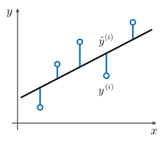
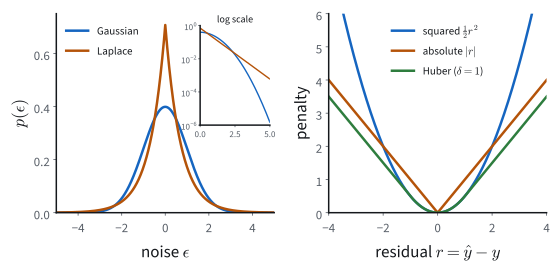
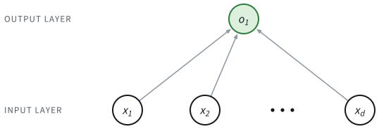
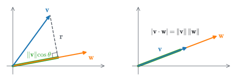

```{.python .input}
%load_ext d2lbook.tab
tab.interact_select('mxnet', 'pytorch', 'tensorflow', 'jax')
```

# Linear Regression
:label:`sec_linear_regression`

Suppose you are about to buy a house and want to know what a fair price is.
You collect recent sales in the neighborhood, and for each one you note its
area, its age, and the price it fetched. Plotting price against area, the points
scatter around a rising line: bigger houses cost more, not exactly but on
average. *Linear regression* is the tool that draws that line (and, with more
than one feature, the corresponding plane or hyperplane) and turns it into a
prediction for a house you have not seen.

Regression problems arise whenever we want to predict a numerical value: the
price of a home or a stock, a patient's length of stay in hospital, the demand
for a product next quarter. Not every prediction is of this kind (later we turn
to *classification*, where the target is a category rather than a number), but
regression is the natural place to begin, and the running example we return to
throughout this chapter is predicting house prices from area and age.
In the terminology of machine learning,
the dataset is called a *training dataset* or *training set*,
and each row (containing the data corresponding to one sale)
is called an *example* (or *data point*, *instance*, *sample*).
The thing we are trying to predict (price)
is called a *label* (or *target*).
The variables (age and area)
upon which the predictions are based
are called *features* (or *covariates*).

```{.python .input #linear-regression}
%%tab mxnet
%matplotlib inline
from d2l import mxnet as d2l
import math
from mxnet import np
import time
```

```{.python .input #linear-regression}
%%tab pytorch
%matplotlib inline
from d2l import torch as d2l
import math
import torch
import numpy as np
import time
```

```{.python .input #linear-regression}
%%tab tensorflow
%matplotlib inline
from d2l import tensorflow as d2l
import math
import tensorflow as tf
import numpy as np
import time
```

```{.python .input #linear-regression}
%%tab jax
%matplotlib inline
from d2l import jax as d2l
from jax import numpy as jnp
import math
import time
```

## Basics

*Linear regression* is a standard method for regression problems.
Developed at the beginning of the 19th century :cite:`Legendre.1805,Gauss.1809`,
it begins with a small set of assumptions.
First, we assume that the relationship
between features $\mathbf{x}$ and target $y$
is approximately linear,
i.e., that the conditional mean $E[Y \mid X=\mathbf{x}]$
can be expressed as a weighted sum
of the features $\mathbf{x}$.
This setup allows that the target value
may still deviate from its expected value
on account of observation noise.
Next, we can impose the assumption that any such noise
is well behaved, following a Gaussian distribution.
Typically, we will use $n$ to denote
the number of examples in our dataset.
We use superscripts to enumerate samples and targets,
and subscripts to index coordinates.
More concretely,
$\mathbf{x}^{(i)}$ denotes the $i^{\textrm{th}}$ sample
and $x_j^{(i)}$ denotes its $j^{\textrm{th}}$ coordinate.

### Model
:label:`subsec_linear_model`

A model specifies how the features determine
an estimate of the target.
The assumption of linearity means that
the expected value of the target (price) can be expressed
as a weighted sum of the features (area and age):

$$\textrm{price} = w_{\textrm{area}} \cdot \textrm{area} + w_{\textrm{age}} \cdot \textrm{age} + b.$$
:eqlabel:`eq_price-area`

Here $w_{\textrm{area}}$ and $w_{\textrm{age}}$
are called *weights*, and $b$ is called a *bias*
(or *offset* or *intercept*).
The weights determine the influence of each feature on our prediction.
The bias determines the value of the estimate when all features are zero.
Even though we will never see any newly-built homes with precisely zero area,
we still need the bias because it allows us
to express all linear functions of our features
(rather than restricting us to lines that pass through the origin).
Strictly speaking, :eqref:`eq_price-area` is an *affine transformation* of input features: a *linear transformation* via a weighted sum, combined with a *translation* via the added bias.
Given a dataset, our goal is to choose
the weights $\mathbf{w}$ and the bias $b$
that, on average, make our model's predictions
fit the true prices observed in the data as closely as possible.


In disciplines that focus
on datasets with just a few features,
it is common to write models out long-form,
as in :eqref:`eq_price-area`.
In machine learning, we usually work
with high-dimensional datasets,
where it is more convenient to employ
compact linear algebra notation.
When our inputs consist of $d$ features,
we can assign each an index (between $1$ and $d$)
and express our prediction $\hat{y}$
(in general the "hat" symbol denotes an estimate) as

$$\hat{y} = w_1  x_1 + \cdots + w_d  x_d + b.$$

Collecting all features into a vector $\mathbf{x} \in \mathbb{R}^d$
and all weights into a vector $\mathbf{w} \in \mathbb{R}^d$,
we can express our model compactly via the dot product
between $\mathbf{w}$ and $\mathbf{x}$:

$$\hat{y} = \mathbf{w}^\top \mathbf{x} + b.$$
:eqlabel:`eq_linreg-y`

In :eqref:`eq_linreg-y`, the vector $\mathbf{x}$
corresponds to the features of a single example.
We will often find it convenient
to refer to features of our entire dataset of $n$ examples
via the *design matrix* $\mathbf{X} \in \mathbb{R}^{n \times d}$.
Here, $\mathbf{X}$ contains one row for every example
and one column for every feature.
For a collection of features $\mathbf{X}$,
the predictions $\hat{\mathbf{y}} \in \mathbb{R}^n$
can be expressed via the matrix--vector product:

$${\hat{\mathbf{y}}} = \mathbf{X} \mathbf{w} + b,$$
:eqlabel:`eq_linreg-y-vec`

where broadcasting (:numref:`subsec_broadcasting`) is applied during the summation.
Given features of a training dataset $\mathbf{X}$
and corresponding (known) labels $\mathbf{y}$,
the goal of linear regression is to find
the weight vector $\mathbf{w}$ and the bias term $b$
such that, given features of a new data example
sampled from the same distribution as $\mathbf{X}$,
the new example's label will (in expectation)
be predicted with the smallest error.

Even if we believe that the best model for
predicting $y$ given $\mathbf{x}$ is linear,
we would not expect to find a real-world dataset of $n$ examples where
$y^{(i)}$ exactly equals $\mathbf{w}^\top \mathbf{x}^{(i)}+b$
for all $1 \leq i \leq n$.
For example, whatever instruments we use to observe
the features $\mathbf{X}$ and labels $\mathbf{y}$, there might be a small amount of measurement error.
Thus, even when we are confident
that the underlying relationship is linear,
we will incorporate a noise term to account for such errors.

Before we can go about searching for the best *parameters*
(or *model parameters*) $\mathbf{w}$ and $b$,
we will need two more things:
(i) a measure of the quality of some given model;
and (ii) a procedure for updating the model to improve its quality.

### Loss Function
:label:`subsec_linear-regression-loss-function`

Fitting the model requires a measure of prediction error.
*Loss functions* quantify the distance
between the *real* and *predicted* values of the target.
The loss will usually be a nonnegative number
where smaller values are better
and perfect predictions incur a loss of 0.
For regression problems, the most common loss function is the squared error.
When our prediction for an example $i$ is $\hat{y}^{(i)}$
and the corresponding true label is $y^{(i)}$,
the *squared error* is given by:

$$l^{(i)}(\mathbf{w}, b) = \frac{1}{2} \left(\hat{y}^{(i)} - y^{(i)}\right)^2.$$
:eqlabel:`eq_mse`

The constant $\frac{1}{2}$ makes no real difference
but proves to be notationally convenient,
since it cancels out when we take the derivative of the loss.
Note that the built-in MSE losses in most libraries omit this $\tfrac{1}{2}$,
so their gradient is twice as large; if you switch to one, halve the learning
rate to compensate.
Because the training dataset is given to us,
and thus is out of our control,
the empirical error is only a function of the model parameters.
In :numref:`fig_fit_linreg`, we visualize the fit of a linear regression model
in a problem with one-dimensional inputs.


:label:`fig_fit_linreg`

Large differences between estimates $\hat{y}^{(i)}$ and targets $y^{(i)}$
make disproportionately large contributions to the quadratic loss. This
property strongly discourages large errors but also makes the loss sensitive
to anomalous data. The following example demonstrates that sensitivity. Below we place twenty points
exactly on the line $y = 2x$, corrupt a single label, and fit a line through
the origin twice: minimizing squared error (closed form) and minimizing the
*mean absolute error* $\frac{1}{n}\sum_i |\hat{y}^{(i)} - y^{(i)}|$
(by subgradient descent, using the subgradient $\operatorname{sign}(\cdot)$ in
place of the derivative the absolute value lacks at zero).

```{.python .input #linear-regression-loss-function}
%%tab pytorch
x = np.arange(1.0, 21.0)
y = 2 * x
y[5] = 10000                                   # corrupt a single label
w_sq = (x * y).sum() / (x * x).sum()           # closed-form squared-loss fit
w_mae = 0.0                                    # subgradient descent on MAE
for _ in range(2000):
    w_mae -= 0.002 * (np.sign(w_mae * x - y) * x).mean()
print(f'true w: 2.00, squared loss: {float(w_sq):.2f}, MAE: {float(w_mae):.2f}')
```

```{.python .input #linear-regression-loss-function}
%%tab tensorflow
x = np.arange(1.0, 21.0)
y = 2 * x
y[5] = 10000                                   # corrupt a single label
w_sq = (x * y).sum() / (x * x).sum()           # closed-form squared-loss fit
w_mae = 0.0                                    # subgradient descent on MAE
for _ in range(2000):
    w_mae -= 0.002 * (np.sign(w_mae * x - y) * x).mean()
print(f'true w: 2.00, squared loss: {float(w_sq):.2f}, MAE: {float(w_mae):.2f}')
```

```{.python .input #linear-regression-loss-function}
%%tab mxnet
x = np.arange(1.0, 21.0)
y = 2 * x
y[5] = 10000                                   # corrupt a single label
w_sq = (x * y).sum() / (x * x).sum()           # closed-form squared-loss fit
w_mae = 0.0                                    # subgradient descent on MAE
for _ in range(2000):
    w_mae -= 0.002 * float((np.sign(w_mae * x - y) * x).mean())
print(f'true w: 2.00, squared loss: {float(w_sq):.2f}, MAE: {w_mae:.2f}')
```

```{.python .input #linear-regression-loss-function}
%%tab jax
x = jnp.arange(1.0, 21.0)
y = 2 * x
y = y.at[5].set(10000)                         # corrupt a single label
w_sq = (x * y).sum() / (x * x).sum()           # closed-form squared-loss fit
w_mae = 0.0                                    # subgradient descent on MAE
for _ in range(2000):
    w_mae -= 0.002 * (jnp.sign(w_mae * x - y) * x).mean()
print(f'true w: 2.00, squared loss: {float(w_sq):.2f}, MAE: {float(w_mae):.2f}')
```

The corrupted label moves the squared-loss estimate an order of magnitude away
from the generating value, while the absolute-error estimate changes little. We return to this
trade-off between losses at the end of the chapter's probabilistic treatment,
and the exercises explore it further.
To measure the quality of a model on the entire dataset of $n$ examples,
we average (or, up to a rescaling of the learning rate, sum)
the losses on the training set:

$$L(\mathbf{w}, b) =\frac{1}{n}\sum_{i=1}^n l^{(i)}(\mathbf{w}, b) =\frac{1}{n} \sum_{i=1}^n \frac{1}{2}\left(\mathbf{w}^\top \mathbf{x}^{(i)} + b - y^{(i)}\right)^2.$$

When training the model, we seek parameters ($\mathbf{w}^*, b^*$)
that minimize the total loss across all training examples:

$$\mathbf{w}^*, b^* = \operatorname*{argmin}_{\mathbf{w}, b}\  L(\mathbf{w}, b).$$

There is also a probabilistic reason for this choice. If the label equals the
linear prediction plus independent Gaussian noise of constant variance, then
minimizing squared error is exactly maximum-likelihood estimation. Other noise
models produce other losses. We derive this correspondence and compare several
choices in :numref:`subsec_normal_distribution_and_squared_loss`; for now, the
squared loss supplies the objective whose optimization we study.

### Analytic Solution

Unlike most of the models that we will cover,
linear regression has an analytic solution for the optimal training-set
parameters. We derive that solution next.
First, we can subsume the bias $b$ into the parameter $\mathbf{w}$
by appending a column to the design matrix consisting of all 1s.
Then our prediction problem is to minimize $\|\mathbf{y} - \mathbf{X}\mathbf{w}\|^2$.
The loss $\|\mathbf{y} - \mathbf{X}\mathbf{w}\|^2$ is a *convex*
function of $\mathbf{w}$, so every local minimum is the global one;
as long as the design matrix $\mathbf{X}$ has full rank
(no feature is linearly dependent on the others),
it is *strictly* convex, there is just one critical point on the loss surface,
and it corresponds to the minimum of the loss over the entire domain.
This is why finding a single critical point suffices.
Taking the derivative of the loss with respect to $\mathbf{w}$
and setting it equal to zero yields:

$$\begin{aligned}
    \partial_{\mathbf{w}} \|\mathbf{y} - \mathbf{X}\mathbf{w}\|^2 =
    2 \mathbf{X}^\top (\mathbf{X} \mathbf{w} - \mathbf{y}) = 0
    \textrm{ and hence }
    \mathbf{X}^\top \mathbf{y} = \mathbf{X}^\top \mathbf{X} \mathbf{w}.
\end{aligned}$$

If the columns of $\mathbf{X}$ are linearly independent, solving the normal
equations gives the unique minimizer

$$\mathbf{w}^* = (\mathbf X^\top \mathbf X)^{-1}\mathbf X^\top \mathbf{y}$$

because $\mathbf X^\top \mathbf X$ is then invertible
:cite:`Golub.Van-Loan.1996`. If $\mathbf{X}$ is rank deficient, minimizers still
exist but are not unique; the Moore--Penrose pseudoinverse selects the
minimum-norm solution $\mathbf{w}^*=\mathbf{X}^{\dagger}\mathbf{y}$.

The inverse formula is useful for analysis, not as a numerical recipe. Forming
$\mathbf{X}^\top\mathbf{X}$ squares the condition number, and explicitly
computing an inverse adds avoidable error and work. Numerical programs should
solve the least-squares problem directly with a library routine such as
`lstsq`, which can use a QR or singular value decomposition. The mathematics
appendix develops these factorizations and the pseudoinverse.

This solution has a geometric reading. As $\mathbf{w}$ varies, the vector
of predictions $\mathbf{X}\mathbf{w}$ ranges over the *column space* of
$\mathbf{X}$, all linear combinations of the feature columns. Minimizing
$\|\mathbf{y}-\mathbf{X}\mathbf{w}\|^2$ therefore asks for the point in that
subspace closest to the observed labels $\mathbf{y}$, which is exactly the
*orthogonal projection* of $\mathbf{y}$ onto the column space. The residual
$\mathbf{y}-\mathbf{X}\mathbf{w}^*$ is what is left over, and it must be
perpendicular to every feature column, precisely the statement
$\mathbf{X}^\top(\mathbf{X}\mathbf{w}^*-\mathbf{y})=\mathbf{0}$ we just derived.
The same orthogonal-projection idea, for projecting onto a single direction, is
developed with a picture in :numref:`sec_mdl-geometry-linear-algebraic-ops`.


Some models, including linear regression with squared loss, admit analytic
solutions that support direct mathematical analysis. Most deep learning models
do not, so they require iterative optimization.

### Minibatch Stochastic Gradient Descent

When an analytic solution is unavailable, iterative methods can still train
the model effectively. Gradient descent, used throughout this book, repeatedly
updates the parameters in a direction that reduces the loss locally.
This algorithm is called *gradient descent*.

The full-batch form of gradient descent
consists of taking the derivative of the loss function,
which is an average of the losses computed
on every single example in the dataset.
For large datasets, this can be slow:
we must pass over the entire dataset before making a single update,
even if the update steps might be very powerful :cite:`Liu.Nocedal.1989`.
Redundant training examples can further reduce the benefit of computing each
update from the full dataset.

The other extreme is to consider only a single example at a time and to take
update steps based on one observation at a time.
The resulting algorithm is *stochastic gradient descent* (SGD),
which can be an effective strategy :cite:`Bottou.2010`, even for large datasets.
Single-example SGD also has computational and statistical drawbacks.
One problem is that processors are a lot faster
at multiplying and adding numbers than
at moving data from main memory to processor cache.
It is up to an order of magnitude more efficient to
perform a matrix--vector multiplication
than a corresponding number of vector--vector operations.
This means that it can take a lot longer to process
one sample at a time compared to a full batch.
A second problem is that some of the layers,
such as batch normalization (to be described in :numref:`sec_batch_norm`),
only work well when we have access
to more than one observation at a time.

The solution to both problems is to pick an intermediate strategy:
rather than taking a full batch or only a single sample at a time,
we take a *minibatch* of observations :cite:`Li.Zhang.Chen.ea.2014`.
The specific choice of minibatch size depends on many factors,
such as the amount of memory, the number of accelerators,
the choice of layers, and the total dataset size.
On many current accelerators, powers of $2$ between 32 and 256 are reasonable
initial candidates, but the best value depends on the task and hardware.
This leads us to *minibatch stochastic gradient descent*.

In its most basic form, in each iteration $t$,
we first randomly sample a minibatch $\mathcal{B}_t$
consisting of a fixed number $|\mathcal{B}|$ of training examples.
We then compute the derivative (gradient) of the average loss
on the minibatch with respect to the model parameters.
Finally, we multiply the gradient
by a predetermined small positive value $\eta$,
called the *learning rate*,
and subtract the resulting term from the current parameter values.
We can express the update as follows:

$$(\mathbf{w},b) \leftarrow (\mathbf{w},b) - \frac{\eta}{|\mathcal{B}|} \sum_{i \in \mathcal{B}_t} \partial_{(\mathbf{w},b)} l^{(i)}(\mathbf{w},b).$$

In summary, minibatch SGD proceeds as follows:
(i) initialize the values of the model parameters, typically at random;
(ii) iteratively sample random minibatches from the data,
updating the parameters in the direction of the negative gradient.
For quadratic losses and affine transformations,
this has a closed-form expansion:

$$\begin{aligned} \mathbf{w} & \leftarrow \mathbf{w} - \frac{\eta}{|\mathcal{B}|} \sum_{i \in \mathcal{B}_t} \partial_{\mathbf{w}} l^{(i)}(\mathbf{w}, b) && = \mathbf{w} - \frac{\eta}{|\mathcal{B}|} \sum_{i \in \mathcal{B}_t} \mathbf{x}^{(i)} \left(\mathbf{w}^\top \mathbf{x}^{(i)} + b - y^{(i)}\right)\\ b &\leftarrow b -  \frac{\eta}{|\mathcal{B}|} \sum_{i \in \mathcal{B}_t} \partial_b l^{(i)}(\mathbf{w}, b) &&  = b - \frac{\eta}{|\mathcal{B}|} \sum_{i \in \mathcal{B}_t} \left(\mathbf{w}^\top \mathbf{x}^{(i)} + b - y^{(i)}\right). \end{aligned}$$
:eqlabel:`eq_linreg_batch_update`

Since we pick a minibatch $\mathcal{B}$
we need to normalize by its size $|\mathcal{B}|$.
Frequently minibatch size and learning rate are user-defined.
Such tunable parameters that are not updated
in the training loop are called *hyperparameters*.
They can be tuned automatically by a number of techniques, such as Bayesian optimization
:cite:`Frazier.2018`. In the end, the quality of the solution is
typically assessed on a separate *validation dataset* (or *validation set*).

After training for some predetermined number of iterations
(or until some other stopping criterion is met),
we record the estimated model parameters,
denoted $\hat{\mathbf{w}}, \hat{b}$.
Note that even if our function is truly linear and noiseless,
these parameters will not be the exact minimizers of the loss, nor even deterministic.
Although the algorithm converges slowly towards the minimizers,
it typically will not find them exactly in a finite number of steps.
With a constant learning rate, minibatch SGD instead approaches a stochastic
neighborhood of the minimizer whose squared radius scales like $\eta$ times
the gradient noise. Shrinking the learning rate shrinks the ball, which is why
learning-rate *schedules* matter.
Why gradient descent converges, at what rate, and how the learning rate and
its schedule interact with gradient noise are worked out in
:numref:`sec_mdl-gradient-based-optimization` and
:numref:`sec_mdl-adaptive-stochastic-methods`.
Moreover, we choose the minibatches $\mathcal{B}$
at random, which breaks determinism.

Linear least squares always has a global minimizer because its loss is a
convex quadratic bounded below. Full column rank, equivalently an invertible
$\mathbf{X}^\top\mathbf{X}$, makes that minimizer unique.
However, the loss surfaces for deep networks contain many saddle points and minima.
For prediction, we typically need parameters
that leads to accurate predictions (and thus low loss).
In practice, deep learning practitioners
seldom struggle to find parameters
that minimize the loss *on training sets*
:cite:`Izmailov.Podoprikhin.Garipov.ea.2018,Frankle.Carbin.2018`.
The more formidable task is to find parameters
that lead to accurate predictions on previously unseen data,
a challenge called *generalization*.
We return to these topics throughout the book.

### Predictions

Given the model $\hat{\mathbf{w}}^\top \mathbf{x} + \hat{b}$,
we can now make *predictions* for a new example,
e.g., predicting the sales price of a previously unseen house
given its area $x_1$ and age $x_2$.
Deep learning practitioners often call the prediction phase *inference*. This is
a mild misnomer: in statistics, *inference* more often means estimating
parameters than scoring new points, so the overloaded term can confuse when the
two communities talk. We will say *prediction* throughout.


## Vectorization for Speed

When training our models, we typically want to process
whole minibatches of examples simultaneously.
Doing this efficiently requires that we 
vectorize the calculations and use
fast linear algebra libraries
rather than writing costly for-loops in Python.

To measure the effect, we compare two methods for adding vectors.
To start, we instantiate two 1000-dimensional vectors
containing all 1s.
In the first method, we loop over the vectors with a Python for-loop.
In the second, we rely on a single call to `+`.

```{.python .input #linear-regression-vectorization-for-speed-1}
n = 1000
a = d2l.ones(n)
b = d2l.ones(n)
```

Now we can benchmark the workloads.
First, we add them, one coordinate at a time,
using a for-loop.

```{.python .input #linear-regression-vectorization-for-speed-2}
%%tab mxnet, pytorch
c = d2l.zeros(n)
t = time.time()
for i in range(n):
    c[i] = a[i] + b[i]
print(f'{time.time() - t:.5f} sec')
```

```{.python .input #linear-regression-vectorization-for-speed-2}
%%tab tensorflow
c = tf.Variable(d2l.zeros(n))
t = time.time()
for i in range(n):
    c[i].assign(a[i] + b[i])
print(f'{time.time() - t:.5f} sec')
```

```{.python .input #linear-regression-vectorization-for-speed-2}
%%tab jax
# JAX arrays are immutable, meaning that once created their contents
# cannot be changed. For updating individual elements, JAX provides
# an indexed update syntax that returns an updated copy
c = d2l.zeros(n)
t = time.time()
for i in range(n):
    c = c.at[i].set(a[i] + b[i])
print(f'{time.time() - t:.5f} sec')
```

Alternatively, we rely on the overloaded `+` operator to compute the elementwise sum.

```{.python .input #linear-regression-vectorization-for-speed-3}
t = time.time()
d = a + b
print(f'{time.time() - t:.5f} sec')
```

On this run, the second method is substantially faster than the first. The
reason is not that
addition itself got cheaper but that we replaced $n$ round-trips through the
Python interpreter (one per element, each dispatching a separate tensor
operation) with a single call into a compiled linear-algebra kernel. The speedup
therefore depends on vector length, hardware, synchronization, and framework
overhead. The qualitative lesson is the same: push inner
loops down into vectorized library calls rather than writing them out in Python.
Moreover, we push more of the mathematics to the library
so we do not have to write as many calculations ourselves,
reducing the potential for errors and increasing portability of the code.


## The Normal Distribution and Squared Loss
:label:`subsec_normal_distribution_and_squared_loss`

So far we have given a fairly functional motivation
of the squared loss objective:
the optimal parameters return the conditional expectation $E[Y\mid X]$
whenever the underlying pattern is truly linear,
and the loss assigns large penalties for outliers.
We can also provide a more formal motivation
for the squared loss objective
by making probabilistic assumptions
about the distribution of noise.

Linear regression and the normal distribution were both developed near the
beginning of the 19th century. More importantly here, a Gaussian noise model
leads directly to linear regression with squared loss.

To begin, recall that a normal distribution
with mean $\mu$ and variance $\sigma^2$ (standard deviation $\sigma$)
is given as

$$p(x) = \frac{1}{\sqrt{2 \pi \sigma^2}} \exp\left(-\frac{1}{2 \sigma^2} (x - \mu)^2\right).$$

Below we define a function to compute the normal distribution.
We only need to plot a density, so NumPy suffices.

```{.python .input #linear-regression-the-normal-distribution-and-squared-loss-1}
%%tab pytorch
def normal(x, mu, sigma):
    p = 1 / math.sqrt(2 * math.pi * sigma**2)
    return p * np.exp(-0.5 * (x - mu)**2 / sigma**2)
```

```{.python .input #linear-regression-the-normal-distribution-and-squared-loss-1}
%%tab tensorflow
def normal(x, mu, sigma):
    p = 1 / math.sqrt(2 * math.pi * sigma**2)
    return p * np.exp(-0.5 * (x - mu)**2 / sigma**2)
```

```{.python .input #linear-regression-the-normal-distribution-and-squared-loss-1}
%%tab jax
def normal(x, mu, sigma):
    p = 1 / math.sqrt(2 * math.pi * sigma**2)
    return p * jnp.exp(-0.5 * (x - mu)**2 / sigma**2)
```

```{.python .input #linear-regression-the-normal-distribution-and-squared-loss-1}
%%tab mxnet
def normal(x, mu, sigma):
    p = 1 / math.sqrt(2 * math.pi * sigma**2)
    return p * np.exp(-0.5 * (x - mu)**2 / sigma**2)
```

We can now visualize the normal distributions.

```{.python .input #linear-regression-the-normal-distribution-and-squared-loss-2}
%%tab mxnet
# Use NumPy again for visualization
x = np.arange(-7, 7, 0.01)

# Mean and standard deviation pairs
params = [(0, 1), (0, 2), (3, 1)]
d2l.plot(x.asnumpy(), [normal(x, mu, sigma).asnumpy() for mu, sigma in params], xlabel='x',
         ylabel='p(x)', figsize=(4.5, 2.5),
         legend=[f'mean {mu}, std {sigma}' for mu, sigma in params])
```

```{.python .input #linear-regression-the-normal-distribution-and-squared-loss-2}
%%tab pytorch
# Use NumPy again for visualization
x = np.arange(-7, 7, 0.01)

# Mean and standard deviation pairs
params = [(0, 1), (0, 2), (3, 1)]
d2l.plot(x, [normal(x, mu, sigma) for mu, sigma in params], xlabel='x',
         ylabel='p(x)', figsize=(4.5, 2.5),
         legend=[f'mean {mu}, std {sigma}' for mu, sigma in params])
```

```{.python .input #linear-regression-the-normal-distribution-and-squared-loss-2}
%%tab tensorflow
# Use NumPy again for visualization
x = np.arange(-7, 7, 0.01)

# Mean and standard deviation pairs
params = [(0, 1), (0, 2), (3, 1)]
d2l.plot(x, [normal(x, mu, sigma) for mu, sigma in params], xlabel='x',
         ylabel='p(x)', figsize=(4.5, 2.5),
         legend=[f'mean {mu}, std {sigma}' for mu, sigma in params])
```

```{.python .input #linear-regression-the-normal-distribution-and-squared-loss-2}
%%tab jax
# Use NumPy again for visualization
x = jnp.arange(-7, 7, 0.01)
# Mean and standard deviation pairs
params = [(0, 1), (0, 2), (3, 1)]
d2l.plot(x, [normal(x, mu, sigma) for mu, sigma in params], xlabel='x',
         ylabel='p(x)', figsize=(4.5, 2.5),
         legend=[f'mean {mu}, std {sigma}' for mu, sigma in params])
```

Note that changing the mean corresponds
to a shift along the $x$-axis,
and increasing the variance
spreads the distribution out,
lowering its peak.

One way to motivate linear regression with squared loss
is to assume that observations arise from noisy measurements,
where the noise $\epsilon$ follows the normal distribution 
$\mathcal{N}(0, \sigma^2)$:

$$y = \mathbf{w}^\top \mathbf{x} + b + \epsilon \textrm{ where } \epsilon \sim \mathcal{N}(0, \sigma^2).$$

Thus, we can now write out the *likelihood*
of seeing a particular $y$ for a given $\mathbf{x}$ via

$$P(y \mid \mathbf{x}) = \frac{1}{\sqrt{2 \pi \sigma^2}} \exp\left(-\frac{1}{2 \sigma^2} (y - \mathbf{w}^\top \mathbf{x} - b)^2\right).$$

According to *the principle of maximum likelihood*,
the best values of parameters $\mathbf{w}$ and $b$ are those
that maximize the *likelihood* of the entire dataset:

$$P(\mathbf y \mid \mathbf X) = \prod_{i=1}^{n} p(y^{(i)} \mid \mathbf{x}^{(i)}).$$

The equality follows since all pairs $(\mathbf{x}^{(i)}, y^{(i)})$
were drawn independently of each other.
Estimators chosen according to the principle of maximum likelihood
are called *maximum likelihood estimators*.
While maximizing the product of many exponential functions
might look difficult,
we can simplify things significantly, without changing the objective,
by maximizing the logarithm of the likelihood instead.
For historical reasons, optimizations are more often expressed
as minimization rather than maximization.
So, without changing anything,
we can *minimize* the *negative log-likelihood*,
which we can express as follows:

$$-\log P(\mathbf y \mid \mathbf X) = \sum_{i=1}^n \frac{1}{2} \log(2 \pi \sigma^2) + \frac{1}{2 \sigma^2} \left(y^{(i)} - \mathbf{w}^\top \mathbf{x}^{(i)} - b\right)^2.$$

If we assume that $\sigma$ is fixed,
we can ignore the first term,
because it does not depend on $\mathbf{w}$ or $b$.
The second term is identical
to the squared error loss introduced earlier,
except for the multiplicative constant $\frac{1}{\sigma^2}$.
The solution does not depend on $\sigma$ either.
It follows that minimizing the mean squared error
is equivalent to the maximum likelihood estimation
of a linear model under the assumption of additive Gaussian noise.

### Selecting a Loss from a Noise Model
:label:`subsec_linreg-loss-menu`

The same derivation applies beyond the Gaussian case. Choose a conditional
model $p(y \mid \mathbf{x})$ that represents the label noise, then minimize
its negative log-likelihood. Gaussian noise yields squared error; other
assumptions yield other losses:

| Output type | Noise model | Loss (negative log-likelihood) |
|:--|:--|:--|
| real-valued, well-behaved noise | Gaussian | squared error (this section) |
| real-valued, outliers or heavy tails | Laplace | absolute error (exercise 4) |
| positive, multiplicative fluctuations (prices) | Gaussian on $\log y$ | squared error on $\log y$ (exercise 6) |
| counts (sales, arrivals) | Poisson | $\lambda(\mathbf{x}) - k \log \lambda(\mathbf{x})$ (exercise 7) |

:numref:`fig_linreg-loss-menu` shows why the first two rows differ: the
Laplace density places far more mass in its tails than a Gaussian of equal
variance, so the Laplace model assigns a large residual more probability and
its loss penalizes that residual only linearly, exactly the robustness we observed in
the outlier demonstration above. The figure also marks the *Huber* loss, a
compromise that is quadratic near zero (like squared error) but linear in the
tails (like absolute error). Each of these losses is explored in the
exercises; the same principle extends to *heteroscedastic* regression, where the
noise level itself depends on the input and we predict $\sigma(\mathbf{x})$
alongside the mean. We apply this principle again when deriving the loss
for classification in the next chapter.


:label:`fig_linreg-loss-menu`


## Linear Regression as a Neural Network

While linear models are not sufficiently rich
to express the many complicated networks
that we will introduce in this book,
(artificial) neural networks are rich enough
to subsume linear models as networks
in which every feature is represented by an input neuron,
all of which are connected directly to the output.

:numref:`fig_single_neuron` depicts
linear regression as a neural network.
The diagram shows the connectivity pattern,
such as how each input is connected to the output,
but not the specific values taken by the weights or biases.


:label:`fig_single_neuron`

The inputs are $x_1, \ldots, x_d$.
We refer to $d$ as the *number of inputs*
or the *feature dimensionality* in the input layer.
The output of the network is $o_1$.
Because we are just trying to predict
a single numerical value,
we have only one output neuron.
Note that the input values are all *given*.
There is just a single *computed* neuron.
In summary, we can think of linear regression
as a single-layer fully connected neural network.
We will encounter networks
with far more layers
in later chapters.

### Historical Note

The terminology of inputs, weighted connections, and activations reflects the
early artificial-neuron models of :citet:`McCulloch.Pitts.1943`. The analogy is
limited: the affine computation above is a mathematical model, not a biological
description. Modern network design is developed primarily through mathematics,
statistics, computer science, and empirical study.

## Summary

In this section, we introduced
traditional linear regression,
where the parameters of a linear function
are chosen to minimize squared loss on the training set.
We also motivated this choice of objective
both via some practical considerations
and through an interpretation
of linear regression as maximum likelihood estimation
under an assumption of linearity and Gaussian noise.
After discussing both computational considerations
and connections to statistics,
we showed how such linear models could be expressed
as simple neural networks where the inputs
are directly wired to the output(s).
While we will soon move past linear models altogether,
they are sufficient to introduce most of the components
that all of our models require:
parametric forms, differentiable objectives,
optimization via minibatch stochastic gradient descent,
and ultimately, evaluation on previously unseen data.


## Exercises

1. **Fitting a constant.** Assume that we have some data
   $x_1, \ldots, x_n \in \mathbb{R}$. Our goal is to find a constant $b$
   such that $\sum_i (x_i - b)^2$ is minimized.
    1. Find an analytic solution for the optimal value of $b$.
    1. Show that the same $b$ is the maximum likelihood estimate of the mean
       of a normal distribution $\mathcal{N}(b, \sigma^2)$ fitted to
       $x_1, \ldots, x_n$, for every fixed $\sigma$.
    1. Change the loss to $\sum_i |x_i-b|$. Find the optimal solution for
       $b$ and describe what changes relative to the squared loss.
1. **Affine to linear.** Prove that the affine functions that can be
   expressed by $\mathbf{x}^\top \mathbf{w} + b$ are equivalent to linear
   functions on $(\mathbf{x}, 1)$.
1. **Singular design matrix.** Full column rank makes the least-squares
   minimizer unique. Suppose instead that $\mathbf{X}^\top \mathbf{X}$ is
   singular.
    1. Show that a minimizer of $\|\mathbf{y} - \mathbf{X}\mathbf{w}\|^2$
       still exists and characterize the set of all minimizers.
    1. Show that the Moore--Penrose pseudoinverse selects the minimizer of
       smallest norm within this set.
    1. Starting from $\mathbf{w} = \mathbf{0}$, which minimizer does
       gradient descent converge to? State whether the answer changes for
       minibatch stochastic gradient descent.
    1. Add independent Gaussian noise of variance $\gamma^2$ to every entry
       of $\mathbf{X}$. Compute the expected value of the perturbed
       $\mathbf{X}^\top \mathbf{X}$ and determine whether the perturbed
       matrix is invertible.
    1. The standard remedy for a (near-)singular
       $\mathbf{X}^\top \mathbf{X}$ is to add $\lambda \mathbf{I}$ before
       inverting. Show that
       $\mathbf{w}_\lambda = (\mathbf{X}^\top\mathbf{X} + \lambda\mathbf{I})^{-1}\mathbf{X}^\top\mathbf{y}$
       is well defined for every $\lambda>0$ and that it minimizes
       $\|\mathbf{y} - \mathbf{X}\mathbf{w}\|^2 + \lambda\|\mathbf{w}\|^2$,
       the $\ell_2$ penalty studied in :numref:`sec_weight_decay`. Compare
       its limit as $\lambda \to 0$ with the pseudoinverse solution of
       sub-problem 2.
1. **Laplace noise.** Assume that the noise model governing the additive
   noise $\epsilon$ is the Laplace distribution (see
   :numref:`sec_mdl-distributions`). That is,
   $p(\epsilon) = \frac{1}{2} \exp(-|\epsilon|)$.
    1. Write out the negative log-likelihood of the data under the model
       $-\log P(\mathbf y \mid \mathbf X)$.
    1. Determine whether a closed-form solution exists.
    1. Suggest a minibatch stochastic gradient descent algorithm to solve
       this problem. Identify what can go wrong near the stationary point
       as updates continue, and propose a fix.
1. **Composing two linear layers.** Suppose a network with two layers is
   built by feeding the output of one linear layer,
   $\mathbf{h} = \mathbf{W}_1 \mathbf{x} + \mathbf{b}_1$, into a second,
   $\hat{y} = \mathbf{w}_2^\top \mathbf{h} + b_2$. Determine the class of
   functions of $\mathbf{x}$ that this network can represent and compare it
   with the class represented by a single linear layer. What property must
   an operation inserted between the two layers have for the composition to
   represent a strictly larger class?
1. **Beyond Gaussian noise.** Suppose you use regression to estimate the
   price of houses or of stocks.
    1. Identify two properties of prices that the additive Gaussian noise
       model $y = \mathbf{w}^\top \mathbf{x} + b + \epsilon$ cannot
       represent.
    1. Explain what regressing on the logarithm of the price,
       $y = \log \textrm{price}$, changes about each of these properties.
       The same modeling choice underlies the Black--Scholes model of option
       pricing :cite:`Black.Scholes.1973`.
    1. Stock prices are quoted on a discrete grid, for example in whole
       cents. Explain how this affects the log-price model and for which
       price range the effect is largest.
1. **Counting apples.** Suppose we want to use regression to estimate the
   *number* of apples sold in a grocery store.
    1. Identify the problems with a Gaussian additive noise model for such
       a target.
    1. The [Poisson distribution](https://en.wikipedia.org/wiki/Poisson_distribution)
       models counts. It is given by
       $p(k \mid \lambda) = \lambda^k e^{-\lambda}/k!$, where $\lambda > 0$
       is the rate and $k \in \{0, 1, 2, \ldots\}$ is the observed count.
       Prove that $E[k] = \lambda$.
    1. Derive the negative log-likelihood of a count $k$ under a rate
       $\lambda(\mathbf{x})$ that depends on the features, dropping terms
       that do not depend on the parameters, and check it against the table
       in :numref:`subsec_linreg-loss-menu`.
    1. Compare the parameterizations
       $\lambda(\mathbf{x}) = \mathbf{w}^\top \mathbf{x} + b$ and
       $\log \lambda(\mathbf{x}) = \mathbf{w}^\top \mathbf{x} + b$. Which
       constraint on $\lambda$ does each satisfy automatically? Write the
       loss of sub-problem 3 in terms of $(\mathbf{w}, b)$ for the second.

:begin_tab:`mxnet`
[Discussions](https://d2l.discourse.group/t/40)
:end_tab:

:begin_tab:`pytorch`
[Discussions](https://d2l.discourse.group/t/258)
:end_tab:

:begin_tab:`tensorflow`
[Discussions](https://d2l.discourse.group/t/259)
:end_tab:

<!-- slides -->

::: {.slide}
::: {.cover}
[Dive into Deep Learning · §3.1]{.kicker}

Predicting numerical values<br>**models · losses · optimization · interpretation**.
:::
:::

::: {.slide title="Predicting a number"}
[Motivation]{.kicker}

::: {.cols .vc}
::: {.col}
- Collect house sales: each has an **area**, an **age**, a **price**.
- Bigger houses cost more, not exactly, but **on average**.
- *Regression* draws the line and turns it into a **prediction** for a
  house nobody has seen.

::: {.d2l-note}
Features $\mathbf{x}$, label $y$; we model $E[Y \mid \mathbf{x}]$. Two
things are missing: a measure of *how wrong* we are, and a way to
*improve*. This section supplies both.
:::
:::

::: {.col .fig .big}
{width=86%}
:::
:::
:::

::: {.slide}
::: {.divider}
[01]{.dnum}

[The Model]{.dtitle}

[a dot product, a loss, and two ways to minimize]{.dsub}
:::
:::

::: {.slide title="The whole model is one dot product"}
[The Model]{.kicker}

Stack $d$ features into $\mathbf{x}\in\mathbb{R}^d$ and weights into
$\mathbf{w}\in\mathbb{R}^d$:

$$\hat{y} = w_1 x_1 + \cdots + w_d x_d + b = \mathbf{w}^\top \mathbf{x} + b.$$

. . .

For the whole dataset at once, the design matrix
$\mathbf{X}\in\mathbb{R}^{n\times d}$ holds one example per row:

$$\hat{\mathbf{y}} = \mathbf{X}\mathbf{w} + b.$$

::: {.d2l-note}
The bias $b$ lets the line miss the origin, making the map **affine** rather
than linear. Learning = choosing $(\mathbf{w}, b)$.
:::
:::

::: {.slide title="Squared loss charges each miss by its square"}
[The Model]{.kicker}

::: {.cols .vc}
::: {.col}
Average the per-example penalties
$\tfrac12\bigl(\hat{y}^{(i)} - y^{(i)}\bigr)^2$:

$$L(\mathbf{w}, b)
  = \frac{1}{n} \sum_{i=1}^{n}
    \tfrac{1}{2}\bigl(\hat{y}^{(i)} - y^{(i)}\bigr)^2.$$

$L$ is **convex** in $(\mathbf{w}, b)$, so every local minimum is the
global one.
:::

::: {.col .fig}
{width=82%}

::: {.d2l-note .warn}
Large errors hurt *quadratically*: strong incentive to avoid big
misses, and outsized sensitivity to anomalous points.
:::
:::
:::
:::

::: {.slide title="One corrupted label puts the square on trial" only="pytorch"}
[The Model · one bad label]{.kicker}

Twenty points sit exactly on $y = 2x$; we corrupt a single label to
$10000$ and fit the slope twice, squared loss versus **mean absolute
error**:

@linear-regression-loss-function

. . .

::: {.d2l-note .warn}
One bad point in twenty drags the squared-loss slope to $22.88$ (an order
of magnitude from the truth), while the MAE fit barely moves ($2.02$). The
probabilistic view below explains *both* behaviors.
:::
:::

::: {.slide title="One corrupted label puts the square on trial" except="pytorch"}
[The Model · one bad label]{.kicker}

Twenty points sit exactly on $y = 2x$; we corrupt a single label to
$10000$ and fit the slope twice, squared loss versus **mean absolute
error**:

@-linear-regression-loss-function

. . .

::: {.d2l-note .warn}
One bad point in twenty drags the squared-loss slope an order of magnitude
from the true $2.0$, while the MAE fit barely moves. The probabilistic
view below explains *both* behaviors.
:::
:::

::: {.slide title="Two ways to reach the minimum"}
[The Model]{.kicker}

**Closed form**, by setting the gradient to zero:

$$\mathbf{w}^* = (\mathbf{X}^\top \mathbf{X})^{-1} \mathbf{X}^\top \mathbf{y}.$$

This expression applies when the normal-equation matrix is invertible. Numerical
implementations solve the least-squares system directly instead of forming the
inverse.

. . .

**Minibatch SGD**, the iterative method reused by the models in this
book:

$$(\mathbf{w}, b) \leftarrow (\mathbf{w}, b) -
  \frac{\eta}{|\mathcal{B}|}
    \sum_{i \in \mathcal{B}} \nabla_{(\mathbf{w}, b)}\,\ell^{(i)}(\mathbf{w}, b).$$
:::

::: {.slide title="The closed form is a projection"}
[The Model · geometry]{.kicker}

::: {.cols .vc}
::: {.col}
As $\mathbf{w}$ varies, $\mathbf{X}\mathbf{w}$ sweeps the **column
space** of $\mathbf{X}$. The best fit is the point of that subspace
**closest** to $\mathbf{y}$: the orthogonal **projection**.

The residual $\mathbf{y}-\mathbf{X}\mathbf{w}^*$ is what is left over,
and it must be **perpendicular** to every feature column, exactly the
normal equation $\mathbf{X}^\top(\mathbf{X}\mathbf{w}^*-\mathbf{y})=\mathbf{0}$.
:::

::: {.col .fig .big}
{width=100%}
:::
:::
:::

::: {.slide title="Minibatch SGD, step by step"}
[The Model]{.kicker}

- **Initialize** $\mathbf{w}, b$ at random.
- **Sample** a minibatch $\mathcal{B}$ (32--256 is a common initial range,
  subject to the data and hardware).
- **Average** the per-example gradients on $\mathcal{B}$.
- **Step** a small distance $\eta$ (the *learning rate*) downhill.

. . .

::: {.d2l-note .rule}
With a constant $\eta$, stochastic gradients generally keep the parameters in
a neighborhood of the minimizer whose squared radius scales with $\eta$. Shrinking $\eta$
shrinks the ball, the reason learning-rate *schedules* exist (the
stochastic-and-adaptive-methods section).
:::
:::

::: {.slide}
::: {.divider}
[02]{.dnum}

[Vectorization]{.dtitle}

[why vectorized kernels reduce interpreter overhead]{.dsub}
:::
:::

::: {.slide title="One vectorized kernel replaces repeated interpreter calls" layout="tight"}
[Vectorization]{.kicker}

::: {.cols}
::: {.col}
Add two 1000-element vectors **one coordinate at a time**, each `+`
a separate trip through the Python interpreter:

@linear-regression-vectorization-for-speed-2
:::

::: {.col}
Or hand the whole array to **one compiled kernel**:

@linear-regression-vectorization-for-speed-3
:::
:::

::: {.d2l-note .rule}
The operations are mathematically identical, but the vectorized form can be
much faster because it invokes one compiled kernel. Keep tensor inner loops in
vectorized library operations when possible.
:::
:::

::: {.slide}
::: {.divider}
[03]{.dnum}

[Where Losses Come From]{.dtitle}

[squared error is a probabilistic assumption in disguise]{.dsub}
:::
:::

::: {.slide title="Assume the errors are Gaussian"}
[Where losses come from]{.kicker}

::: {.cols .vc}
::: {.col}
Model each label as the linear prediction plus bell-curve noise:

$$y = \mathbf{w}^\top \mathbf{x} + b + \epsilon,
  \qquad \epsilon \sim \mathcal{N}(0, \sigma^2).$$

Shifting the **mean** slides the bell; growing the **variance** flattens
it. The Gaussian density assigns very low probability to errors many standard
deviations from the mean.
:::

::: {.col .fig}
@!linear-regression-the-normal-distribution-and-squared-loss-2
:::
:::
:::

::: {.slide title="Maximum likelihood turns the assumption into the loss"}
[Where losses come from]{.kicker}

The Gaussian assumption assigns a density to every $y$:
$P(y\mid\mathbf{x}) = \tfrac{1}{\sqrt{2\pi\sigma^2}}
    \exp\!\bigl(-\tfrac{(y-\hat{y})^2}{2\sigma^2}\bigr)$.
Maximize the likelihood of the dataset = minimize its negative log:

$$-\log P(\mathbf{y}\mid\mathbf{X})
  = \textrm{const} + \frac{1}{2\sigma^2}\sum_i \bigl(y^{(i)}-\hat{y}^{(i)}\bigr)^2.$$

. . .

The constant and $\sigma$ drop out: **maximum likelihood under Gaussian
noise *is* squared error.** The $(\cdot)^2$ term follows from the exponent in the Gaussian density.

::: {.d2l-note .rule}
This also explains the outlier demo: the Gaussian model assigns very little probability to observing $10000$ where
$12$ was expected, so the corresponding squared loss dominates the fit.
:::
:::

::: {.slide title="Match the loss to the noise model"}
[Where losses come from · comparison]{.kicker}

::: {.cols .vc}
::: {.col .narrow}
**Choose a noise model, minimize its negative log-likelihood.**

- Gaussian → squared error
- Laplace → **absolute error**
- Gaussian on $\log y$ → log-price regression
- Poisson → $\lambda - k\log\lambda$ (counts)

The Laplace model assigns more probability to large residuals and penalizes
them linearly, producing the robust MAE fit in the outlier example.
:::

::: {.col .fig}
{width=94%}

::: {.d2l-note .rule}
The weight-decay section adds a *prior* to this likelihood → weight decay;
the next chapter applies the same likelihood principle to categorical data → softmax.
:::
:::
:::
:::

::: {.slide}
::: {.divider}
[04]{.dnum}

[A Neural Network]{.dtitle}

[one neuron, and a name to be careful with]{.dsub}
:::
:::

::: {.slide title="Linear regression is a one-neuron network"}
[A Neural Network]{.kicker}

::: {.cols .vc}
::: {.col}
Connect every input $x_1,\ldots,x_d$ directly to a single output $o_1$.

The output is the same weighted sum $\sum_i w_i x_i + b$, so linear
regression is a **single-layer, fully connected** network: $d$ inputs,
one computed neuron, the atom that deep networks stack.
:::

::: {.col .fig .big}
{width=100%}
:::
:::
:::

::: {.slide title="Inspiration, not blueprint"}
[A Neural Network]{.kicker}

::: {.cols .vc}
::: {.col}
The cartoon that inspired the name: dendrites collect inputs $x_i$,
weighted by synaptic strengths $w_i$; the nucleus sums them; the axon
carries the result on.

::: {.d2l-note .warn}
The biological analogy motivated the terminology, but modern deep learning is
principally described with concepts from mathematics, statistics, and computer
science.
:::
:::

::: {.col .fig .big}
{width=100%}
:::
:::
:::

::: {.slide title="Recap"}
[Wrap-up]{.kicker}

::: {.cols}
::: {.col}
- **Model:** $\hat{y} = \mathbf{w}^\top \mathbf{x} + b$, one dot
  product per prediction.
- **Loss:** mean squared error; convex, one global optimum.
- **Closed form** = orthogonal projection; **minibatch SGD** approaches
  the optimum with fluctuations controlled partly by $\eta$.
:::

::: {.col}
- **Vectorize:** one kernel call, never a Python inner loop.
- **One bad label:** in twenty, the squared-loss slope is $22.88$ while
  the absolute-error slope is $2.02$.
- **Likelihood interpretation:** squared loss corresponds to Gaussian noise;
  changing the noise model changes the loss.
:::
:::
:::
