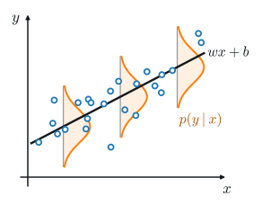
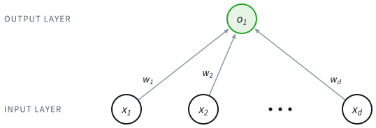

```{.python .input}
%load_ext d2lbook.tab
tab.interact_select('mxnet', 'pytorch', 'tensorflow', 'jax')
```

# Linear Regression
:label:`sec_linear_regression`

Suppose you want to estimate the sale price of a house from its floor area and age. Unlike classification, which assigns an input to a discrete category, *regression* predicts a continuous numerical quantity. This problem—finding a rule that maps quantitative inputs to a numerical output—has a distinguished two-century pedigree. In 1805, Adrien-Marie Legendre published the *method of least squares* to determine comet orbits from noisy astronomical sightings :cite:`Legendre.1805`; four years later, Carl Friedrich Gauss grounded least squares in probability theory by asking what distribution of measurement errors makes the least-squares fit the most probable one, arriving at the Gaussian distribution :cite:`Gauss.1809` (having already used the method in 1801 to relocate the newly discovered dwarf planet Ceres after it vanished behind the sun's glare).

Today, regression powers everything from clinical risk scoring and demand forecasting to the output heads of object detectors. Better still, *linear regression*—where the prediction is an affine combination of the inputs—introduces nearly every core concept of deep learning in a setting simple enough to analyze completely by hand. Viewed as a computational graph, linear regression is a single artificial neuron: a *fully connected layer* with one output unit. In this section, we formulate the model and the squared loss, solve it both analytically via the normal equations and iteratively via *minibatch stochastic gradient descent* (the workhorse optimizer of deep learning), benchmark vectorized array operations against Python loops, and connect the loss function to maximum-likelihood estimation under different noise distributions.

```{.python .input #linear-regression}
%%tab mxnet
import time
import numpy as np
from mxnet import np as mnp, npx
npx.set_np()
```

```{.python .input #linear-regression}
%%tab pytorch
import time
import numpy as np
import torch
```

```{.python .input #linear-regression}
%%tab tensorflow
import time
import numpy as np
import tensorflow as tf
```

```{.python .input #linear-regression}
%%tab jax
import time
import jax
from jax import numpy as jnp
import numpy as np
```

## The Model and the Loss

### Features and Labels

To estimate a house's sale price from its area (in square meters) and age (in years), we collect a *training dataset* of historical sales. Each house in that record is an *example* (or *data point*, *sample*, or *instance*). The quantity we aim to predict—here, the price—is the *label* (or *target*), while the measurable attributes on which we base the prediction—area and age—are the *features* (or *covariates*).

Suppose our dataset contains $n$ examples. We index them by $i \in \{1, \ldots, n\}$, writing $\mathbf{x}^{(i)} = (x_1^{(i)}, x_2^{(i)})^\top \in \mathbb{R}^2$ for the feature vector of the $i^{\textrm{th}}$ house and $y^{(i)} \in \mathbb{R}$ for its observed sale price. More generally, when each example is described by $d$ features, $\mathbf{x}^{(i)} \in \mathbb{R}^d$, and the full dataset is the collection of pairs $\{(\mathbf{x}^{(1)}, y^{(1)}), \ldots, (\mathbf{x}^{(n)}, y^{(n)})\}$.

### The Linear Model
:label:`subsec_linear_model`

Every supervised learning method starts with a *model class*—a parameterized family of functions mapping features to predictions. The linear assumption posits that the target can be approximated by a weighted sum of the features plus an offset:

$$\textrm{price} = w_{\textrm{area}} \cdot \textrm{area} + w_{\textrm{age}} \cdot \textrm{age} + b.$$
:eqlabel:`eq_price-area`

Here $w_{\textrm{area}}$ and $w_{\textrm{age}}$ are the *weights*, and $b$ is the *bias* (also called the *offset* or *intercept*). Each weight sets the marginal influence of its feature—how much the predicted price changes per extra square meter of floor space, holding age fixed—while the bias $b$ anchors the prediction when all features are zero. Even if no real house has zero area, keeping $b$ is essential: without it, the fitted plane is forced to pass through the origin, severely restricting the functions our model can express. Strictly speaking, :eqref:`eq_price-area` is an *affine* function of the features (a linear map plus a constant translation), though machine learning universally refers to it as a linear model.

With $d$ features, the model's prediction $\hat{y}$ (where the hat distinguishes an estimate from the observed label $y$) takes the form

$$\hat{y} = w_1 x_1 + \cdots + w_d x_d + b = \mathbf{w}^\top \mathbf{x} + b,$$
:eqlabel:`eq_linreg-y`

where $\mathbf{w} = (w_1, \ldots, w_d)^\top \in \mathbb{R}^d$ collects the weights into a single column vector. Whenever we evaluate the model across all $n$ examples at once, we stack the feature vectors $\mathbf{x}^{(i)}$ as the rows of the *design matrix* $\mathbf{X} \in \mathbb{R}^{n \times d}$ and the predictions $\hat{y}^{(i)}$ into the column vector $\hat{\mathbf{y}} \in \mathbb{R}^n$:

$$\hat{\mathbf{y}} = \mathbf{X} \mathbf{w} + b,$$
:eqlabel:`eq_linreg-y-vec`

where the scalar bias $b$ is added to every component of $\mathbf{X}\mathbf{w}$ via broadcasting (:numref:`subsec_broadcasting`). Searching for the best linear predictor now reduces to finding the parameters $(\mathbf{w}, b) \in \mathbb{R}^d \times \mathbb{R}$ that make $\hat{\mathbf{y}}$ match the observed labels $\mathbf{y} = (y^{(1)}, \ldots, y^{(n)})^\top$ as closely as possible. Even when the true relationship between features and labels is only approximately linear—and contaminated by unmeasured factors and measurement noise—a linear model frequently provides a fast, interpretable, and remarkably competitive baseline.

### The Squared Loss
:label:`subsec_linear-regression-loss-function`

Before we can search for the best parameters, we need a quantitative measure of how badly any candidate $(\mathbf{w}, b)$ misses the observed labels. A *loss function* assigns a nonnegative penalty to the gap between prediction $\hat{y}$ and truth $y$, vanishing when the two agree. For regression, the standard choice is the *squared error*:

$$l^{(i)}(\mathbf{w}, b) = \frac{1}{2} \left(\hat{y}^{(i)} - y^{(i)}\right)^2.$$
:eqlabel:`eq_mse`

The factor of $\frac{1}{2}$ is purely a cosmetic convenience: it cancels the factor of $2$ that drops down when we differentiate the square, leaving the location of the minimum unchanged. Because the difference $\hat{y}^{(i)} - y^{(i)}$ is squared, overestimates and underestimates of equal magnitude are penalized symmetrically, while large misses are penalized much more heavily than small ones: a prediction off by $3$ incurs nine times the loss of a prediction off by $1$. Geometrically (:numref:`fig_fit_linreg`), each residual $\hat{y}^{(i)} - y^{(i)}$ is the vertical distance between the data point and the regression line, and $2\,l^{(i)}$ is the area of the square built on that vertical segment.


:label:`fig_fit_linreg`

To score $(\mathbf{w}, b)$ across the entire training set of $n$ examples, we average the per-example losses to form the empirical *loss* (or *cost* / *objective*):

$$L(\mathbf{w}, b) = \frac{1}{n} \sum_{i=1}^n l^{(i)}(\mathbf{w}, b) = \frac{1}{n} \sum_{i=1}^n \frac{1}{2}\left(\mathbf{w}^\top \mathbf{x}^{(i)} + b - y^{(i)}\right)^2 = \frac{1}{2n} \|\mathbf{X}\mathbf{w} + b - \mathbf{y}\|_2^2.$$

Dividing by $n$ puts the objective on a per-example scale, so that doubling the dataset size does not double the numerical magnitude of the loss or its gradients. Training the model means solving the optimization problem

$$\mathbf{w}^*, b^* = \operatorname*{argmin}_{\mathbf{w},\, b}\  L(\mathbf{w}, b).$$

Notice how concrete this objective is on a tiny two-point dataset with a single feature and no bias ($b = 0$). If example 1 has $(x^{(1)}, y^{(1)}) = (1, 2)$ and example 2 has $(x^{(2)}, y^{(2)}) = (2, 3)$, then for any candidate slope $w$,

$$L(w) = \frac{1}{4}\Big[(w - 2)^2 + (2w - 3)^2\Big] = \frac{1}{4}(5w^2 - 16w + 13).$$

Let us evaluate this quadratic objective at $w = 1$ and at $w = 1.6$, and plot the parabola alongside both resulting lines:

```{.python .input #linear-regression-loss-function}
x = np.arange(1.0, 21.0)
y = 2 * x
y[5] = 10000                            # corrupt a single label
w_sq = (x * y).sum() / (x * x).sum()    # squared-loss minimizer
w_grid = np.linspace(0, 30, 3001)       # slopes 0, 0.01, ..., 30
mae = np.abs(w_grid[:, None] * x - y).mean(axis=1)
w_mae = w_grid[mae.argmin()]            # MAE minimizer on the grid
print(f'true w: 2.00, squared loss: {w_sq:.2f}, MAE: {w_mae:.2f}')
```

A single corrupted point out of twenty yanks the squared-loss slope from $2.00$
all the way to roughly $23$, while the absolute-error slope does not budge from
$2.00$! Under squared loss, one gigantic error of nearly $10{,}000$ overwhelms
the combined pull of all nineteen clean points; under absolute error, its pull
grows only linearly, so the nineteen clean points easily outvote it. Which
behavior is desirable depends on what kind of noise we expect in our labels—a
question we answer from first principles in
:numref:`subsec_normal_distribution_and_squared_loss`.

At $w = 1$, the predictions are $1$ and $2$ (each off by $1$), giving $L(1) = 0.5$. Setting the derivative $L'(w) = \frac{1}{2}(5w - 8)$ to zero pinpoints the exact minimizer at $w^* = 1.6$, where $L(1.6) = 0.05$. Even at the optimum, the loss is strictly positive because no line through the origin can pass through both $(1, 2)$ and $(2, 3)$ simultaneously.

## Minimizing the Loss

How do we find $(\mathbf{w}^*, b^*)$ when there are $d$ features and $n$ examples? Linear regression is one of the very few models in machine learning that admits both an exact closed-form formula and a scalable iterative optimizer. Comparing the two reveals why deep learning overwhelmingly favors iterative gradient methods.

### The Normal Equations
:label:`subsec_linear-regression-analytic-solution`

First, we can absorb the scalar bias $b$ into the weight vector by appending a constant column of $1$s to the design matrix: each input becomes $(\mathbf{x}^{(i)}, 1)^\top \in \mathbb{R}^{d+1}$ and the parameter vector becomes $(\mathbf{w}, b)^\top \in \mathbb{R}^{d+1}$ (or equivalently, we can center both $\mathbf{X}$ and $\mathbf{y}$ by their sample means; see Exercise :exref:`ex_linear-regression-centering`). Writing $\mathbf{X}$ and $\mathbf{w}$ in this augmented notation, the loss is simply

$$L(\mathbf{w}) = \frac{1}{2n} \|\mathbf{y} - \mathbf{X}\mathbf{w}\|_2^2.$$

We can find its global minimum by pure algebra—completing the square without even taking a derivative—whenever $\mathbf{X}^\top\mathbf{X}$ is invertible (which holds if and only if the columns of $\mathbf{X}$ are linearly independent, requiring $n \geq d$). Define $\hat{\mathbf{w}} = (\mathbf{X}^\top\mathbf{X})^{-1}\mathbf{X}^\top\mathbf{y}$, so that $\mathbf{X}^\top\mathbf{X}\hat{\mathbf{w}} = \mathbf{X}^\top\mathbf{y}$. Adding and subtracting $\mathbf{X}\hat{\mathbf{w}}$ inside the norm and expanding the square yields

$$
\begin{aligned}
\|\mathbf{y} - \mathbf{X}\mathbf{w}\|_2^2
&= \|(\mathbf{y} - \mathbf{X}\hat{\mathbf{w}}) + \mathbf{X}(\hat{\mathbf{w}} - \mathbf{w})\|_2^2 \\
&= \|\mathbf{y} - \mathbf{X}\hat{\mathbf{w}}\|_2^2 + \|\mathbf{X}(\hat{\mathbf{w}} - \mathbf{w})\|_2^2 + 2(\mathbf{y} - \mathbf{X}\hat{\mathbf{w}})^\top\mathbf{X}(\hat{\mathbf{w}} - \mathbf{w}).
\end{aligned}
$$
:eqlabel:`eq_linreg-pythagoras`

Look at the cross term at the end:

$$(\mathbf{y} - \mathbf{X}\hat{\mathbf{w}})^\top\mathbf{X} = (\mathbf{X}^\top\mathbf{y} - \mathbf{X}^\top\mathbf{X}\hat{\mathbf{w}})^\top = \mathbf{0}^\top.$$

It vanishes identically for *every* $\mathbf{w}$! What remains is a sum of two nonnegative squared norms. The first term, $\|\mathbf{y} - \mathbf{X}\hat{\mathbf{w}}\|_2^2$, does not depend on $\mathbf{w}$ at all; the second term, $\|\mathbf{X}(\hat{\mathbf{w}} - \mathbf{w})\|_2^2$, is zero if and only if $\mathbf{w} = \hat{\mathbf{w}}$ (since $\mathbf{X}$ has full column rank). Thus $\hat{\mathbf{w}}$ is the unique global minimizer. We could reach the exact same equation via calculus by setting the gradient $\nabla_{\mathbf{w}} L(\mathbf{w}) = -\frac{1}{n}\mathbf{X}^\top(\mathbf{y} - \mathbf{X}\mathbf{w})$ to zero, producing the classic *normal equations*:

$$\mathbf{X}^\top \mathbf{X}\, \mathbf{w}^* = \mathbf{X}^\top \mathbf{y}, \qquad \textrm{or} \qquad \mathbf{w}^* = (\mathbf{X}^\top \mathbf{X})^{-1}\mathbf{X}^\top \mathbf{y}.$$

When the columns of $\mathbf{X}$ are linearly dependent (for instance, when two features are redundant or when $d > n$), $\mathbf{X}^\top\mathbf{X}$ is singular: a least-squares minimizer still exists, but infinitely many weight vectors achieve the exact same minimum loss (Exercise :exref:`ex_linear-regression-singular-design-matrix`).

In code, you should almost never form $(\mathbf{X}^\top\mathbf{X})^{-1}$ explicitly; dedicated least-squares solvers (`lstsq`) use QR or SVD factorizations that are both faster and far more numerically stable. Let us verify the normal equations on a small random $5 \times 2$ design matrix against the built-in solver:

```{.python .input #linear-regression-the-normal-equations}
%%tab pytorch
X = torch.tensor([[1.0, 0.0], [1.0, 1.0], [1.0, 2.0]])  # rows (1, input)
y = torch.tensor([[1.0], [1.0], [0.0]])
w_hat = torch.linalg.lstsq(X, y).solution
r = X @ w_hat - y                                       # errors
print('w_hat:', tuple(round(float(v), 4) for v in w_hat[:, 0]))
print('r:', tuple(round(float(v), 4) for v in r[:, 0]))
print(f'max |X^T r|: {float((X.T @ r).abs().max()):.0e}')
```

```{.python .input #linear-regression-the-normal-equations}
%%tab tensorflow
X = tf.constant([[1.0, 0.0], [1.0, 1.0], [1.0, 2.0]])  # rows (1, input)
y = tf.constant([[1.0], [1.0], [0.0]])
w_hat = tf.linalg.lstsq(X, y, fast=False)      # do not form X^T X
r = X @ w_hat - y                                      # errors
print('w_hat:', tuple(round(float(v), 4) for v in w_hat[:, 0]))
print('r:', tuple(round(float(v), 4) for v in r[:, 0]))
XTr = tf.transpose(X) @ r
print(f'max |X^T r|: {float(tf.reduce_max(tf.abs(XTr))):.0e}')
```

```{.python .input #linear-regression-the-normal-equations}
%%tab jax
X = jnp.array([[1.0, 0.0], [1.0, 1.0], [1.0, 2.0]])  # rows (1, input)
y = jnp.array([[1.0], [1.0], [0.0]])
w_hat = jnp.linalg.lstsq(X, y)[0]
r = X @ w_hat - y                                    # errors
print('w_hat:', tuple(round(float(v), 4) for v in w_hat[:, 0]))
print('r:', tuple(round(float(v), 4) for v in r[:, 0]))
print(f'max |X^T r|: {float(jnp.abs(X.T @ r).max()):.0e}')
```

```{.python .input #linear-regression-the-normal-equations}
%%tab mxnet
X = mnp.array([[1.0, 0.0], [1.0, 1.0], [1.0, 2.0]])  # rows (1, input)
y = mnp.array([[1.0], [1.0], [0.0]])
w_hat = mnp.linalg.lstsq(X, y, rcond=None)[0]
r = X @ w_hat - y                                    # errors
print('w_hat:', tuple(round(float(v), 4) for v in w_hat[:, 0]))
print('r:', tuple(round(float(v), 4) for v in r[:, 0]))
print(f'max |X^T r|: {float(mnp.abs(X.T @ r).max()):.0e}')
```

### Least Squares as Projection

Why are these called the *normal* equations? The identity :eqref:`eq_linreg-pythagoras` with the vanishing cross term is literally the Pythagorean theorem in $\mathbb{R}^n$ (:numref:`fig_linreg_projection`). As $\mathbf{w}$ ranges over $\mathbb{R}^d$, the possible prediction vectors $\hat{\mathbf{y}} = \mathbf{X}\mathbf{w}$ sweep out a $d$-dimensional subspace of $\mathbb{R}^n$—the column space (or span) of $\mathbf{X}$. Usually the observed label vector $\mathbf{y} \in \mathbb{R}^n$ does not lie in that subspace, because no linear combination of the $d$ feature columns reproduces all $n$ noisy observations exactly.


:label:`fig_linreg_projection`

Minimizing $\|\mathbf{y} - \mathbf{X}\mathbf{w}\|_2^2$ means finding the point $\hat{\mathbf{y}} = \mathbf{X}\hat{\mathbf{w}}$ in the column space of $\mathbf{X}$ that lies closest to $\mathbf{y}$ in Euclidean distance. By elementary geometry, the closest point in a flat subspace is the *orthogonal projection* of $\mathbf{y}$ onto that subspace—the unique point whose residual vector $\mathbf{r} = \mathbf{y} - \mathbf{X}\hat{\mathbf{w}}$ is perpendicular (*normal*) to every column of $\mathbf{X}$. Requiring $\mathbf{r}$ to be orthogonal to all columns of $\mathbf{X}$ is written $\mathbf{X}^\top(\mathbf{y} - \mathbf{X}\hat{\mathbf{w}}) = \mathbf{0}$, which is none other than the normal equations!

### Minibatch Stochastic Gradient Descent
:label:`subsec_linear-regression-minibatch-sgd`

If linear regression has a one-line analytic solution, why not stop here? For two reasons that define all of modern deep learning:

1. **Computational scaling:** Forming $\mathbf{X}^\top\mathbf{X} \in \mathbb{R}^{d \times d}$ costs $O(nd^2)$ operations and solving the $d \times d$ system costs $O(d^3)$. When a dataset has millions of examples and a model has millions or billions of parameters, storing or inverting a $d \times d$ matrix is completely out of the question.
2. **Nonlinearity:** As soon as we replace the squared loss with another objective (like cross-entropy in :numref:`chap_classification`) or stack nonlinear hidden layers (:numref:`chap_perceptrons`), no closed-form solution exists at all.

Instead, we train almost every deep learning model iteratively using *gradient descent* and its stochastic variants. Recall from :numref:`sec_calculus` that the gradient $\nabla L(\mathbf{w}, b)$ points in the direction of steepest ascent of the loss. Stepping in the *opposite* direction reduces the loss, except faces one practical bottleneck: evaluating the exact gradient $\nabla L(\mathbf{w}, b) = \frac{1}{n}\sum_{i=1}^n \nabla l^{(i)}(\mathbf{w}, b)$ requires a full pass over all $n$ training examples just to take a single parameter step! When $n = 10^7$, full-batch gradient descent is glacially slow—and wildly wasteful, because the average gradient over 100 randomly chosen examples already points in almost the exact same direction as the average over 10 million.

*Minibatch stochastic gradient descent* (minibatch SGD) exploits this statistical redundancy. At each step $t$, we draw a small random *minibatch* $\mathcal{B}_t \subset \{1, \ldots, n\}$ of $|\mathcal{B}|$ examples, average the loss gradients over $\mathcal{B}_t$ alone, and update the parameters with a positive *learning rate* (step size) $\eta > 0$:

$$(\mathbf{w}, b) \leftarrow (\mathbf{w}, b) - \frac{\eta}{|\mathcal{B}|} \sum_{i \in \mathcal{B}_t} \partial_{(\mathbf{w}, b)}\, l^{(i)}(\mathbf{w}, b).$$

Because $\mathcal{B}_t$ is sampled uniformly from the training set, the minibatch gradient is an *unbiased estimator* of the true full-batch gradient, with standard error decaying as $1/\sqrt{|\mathcal{B}|}$. For linear regression under the squared loss :eqref:`eq_mse`, differentiating $l^{(i)} = \frac{1}{2}(\mathbf{w}^\top\mathbf{x}^{(i)} + b - y^{(i)})^2$ explicitly gives the update rule

$$
\begin{aligned}
\mathbf{w} &\leftarrow \mathbf{w} - \frac{\eta}{|\mathcal{B}|} \sum_{i \in \mathcal{B}_t} \mathbf{x}^{(i)} \left(\mathbf{w}^\top \mathbf{x}^{(i)} + b - y^{(i)}\right),\\
b &\leftarrow b - \frac{\eta}{|\mathcal{B}|} \sum_{i \in \mathcal{B}_t} \left(\mathbf{w}^\top \mathbf{x}^{(i)} + b - y^{(i)}\right).
\end{aligned}
$$
:eqlabel:`eq_linreg_batch_update`

Look at what each term does: the scalar $\mathbf{w}^\top\mathbf{x}^{(i)} + b - y^{(i)}$ is the signed prediction error on example $i$. If the model overpredicts ($\hat{y}^{(i)} > y^{(i)}$), the update subtracts a multiple of $\mathbf{x}^{(i)}$ from $\mathbf{w}$ and nudges $b$ downward, pulling the next prediction closer to $y^{(i)}$. Notice also the crucial philosophical distinction: $\mathbf{w}$ and $b$ are *model parameters* learned by optimization, whereas the minibatch size $|\mathcal{B}|$ and learning rate $\eta$ are *hyperparameters* chosen by us before training starts (and tuned on held-out validation data, as we discuss in :numref:`sec_generalization_basics`).

### Gradient Noise and the Learning Rate

How does the trajectory of minibatch SGD compare with full-batch gradient descent? Consider the contours of the empirical loss $L(\mathbf{w})$ around the least-squares solution $\hat{\mathbf{w}}$ (:numref:`fig_linreg_gd_sgd`). Full-batch gradient descent computes the exact gradient of $L$ at every step, marching smoothly across the elliptic contours directly into the minimum $\hat{\mathbf{w}}$ (provided $\eta$ is not so large that it overshoots and diverges).

Minibatch SGD follows a different path. Even right at the global minimum $\hat{\mathbf{w}}$—where the average gradient across all $n$ examples is zero—Individual noisy examples still have nonzero residuals $\hat{y}^{(i)} - y^{(i)} \neq 0$. A random minibatch $\mathcal{B}_t$ will almost never have its per-example gradients cancel out to zero exactly! Consequently, at constant learning rate $\eta$, minibatch SGD quickly descends into a small neighborhood of $\hat{\mathbf{w}}$ and then jitterbugs perpetually inside a *noise ball* around $\hat{\mathbf{w}}$ whose squared radius scales as $\eta / |\mathcal{B}|$.


:label:`fig_linreg_gd_sgd`

Halving $\eta$ or doubling $|\mathcal{B}|$ shrinks that terminal noise ball, and decaying $\eta \to 0$ over the course of training lets the iterates settle onto $\hat{\mathbf{w}}$ (:numref:`chap_optimization`). In practice, however, reaching the exact bottom of the training loss to ten decimal places is rarely even desirable: our ultimate goal is low error on *unseen* data, and because $\hat{\mathbf{w}}$ itself deviates from the true population parameters by statistical estimation error of order $1/\sqrt{n}$, a tiny optimization jitter inside that statistical uncertainty costs nothing in generalization.

### Vectorization for Speed

When implementing minibatch updates :eqref:`eq_linreg_batch_update`, you should never loop over the examples $i \in \mathcal{B}_t$ one by one in Python. Instead, we *vectorize* the computation—expressing the entire minibatch forward pass and gradient step as array and matrix operations dispatched to highly optimized C++/CUDA libraries that run in parallel across SIMD vector units or thousands of GPU cores.

To see the difference firsthand, let us benchmark adding two $10{,}000$-dimensional vectors of ones: first with a Python `for` loop, and then with a single vectorized `+` operator. We first define a small `Timer` utility that records elapsed wall-clock times across runs:

```{.python .input #linear-regression-vectorization-for-speed-1}
%%tab pytorch
n = 1000
X = torch.ones(n, 2)                # the values do not affect the timing
w = torch.tensor([[2.0], [-3.4]])
b = 4.2
# Wait until the device has finished (CUDA runs asynchronously)
wait = lambda x: torch.cuda.synchronize() if torch.cuda.is_available() else None
```

```{.python .input #linear-regression-vectorization-for-speed-1}
%%tab tensorflow
n = 1000
X = tf.ones((n, 2))                 # the values do not affect the timing
w = tf.constant([[2.0], [-3.4]])
b = 4.2
# Wait until all devices have finished (a GPU runs asynchronously)
wait = lambda x: tf.test.experimental.sync_devices()
```

```{.python .input #linear-regression-vectorization-for-speed-1}
%%tab jax
n = 1000
X = jnp.ones((n, 2))                # the values do not affect the timing
w = jnp.array([[2.0], [-3.4]])
b = 4.2
wait = jax.block_until_ready        # JAX returns before it has finished
```

```{.python .input #linear-regression-vectorization-for-speed-1}
%%tab mxnet
n = 1000
X = mnp.ones((n, 2))                # the values do not affect the timing
w = mnp.array([[2.0], [-3.4]])
b = 4.2
wait = lambda x: npx.waitall()      # MXNet returns before it has finished
```

Our timing helper `seconds` runs a warm-up call first (to absorb one-time setup
and JIT compilation costs) and calls `wait` before stopping the clock, since GPU
and accelerator frameworks dispatch operations asynchronously and may return to
Python while the hardware is still computing.

```{.python .input #linear-regression-vectorization-for-speed-2}
def seconds(f):
    """Time one call of f, after a warm-up call."""
    wait(f())
    start = time.perf_counter()
    wait(f())
    return time.perf_counter() - start
```

```{.python .input #linear-regression-vectorization-for-speed-3}
loop = seconds(lambda: [X[i:i + 1] @ w + b for i in range(n)])
vectorized = seconds(lambda: X @ w + b)
print(f'one example at a time: {loop * 1e3:8.3f} ms')
print(f'all examples at once:  {vectorized * 1e3:8.3f} ms')
print(f'speedup: {loop / vectorized:.0f}x')
```

Even though both paths perform the exact same arithmetic, computing all $1{,}000$
predictions in a single vectorized call is *hundreds of times* faster! The loop
pays Python interpreter overhead and kernel-launch latency on every single
example, whereas the matrix multiplication pays that overhead once and hands the

The single vectorized expression `a + b` runs orders of magnitude faster than the Python loop! Every framework translates `a + b` into a single native kernel call free of Python interpreter overhead and type-checking per element. Throughout this book, vectorizing over minibatches—turning $n$ inner products $\mathbf{w}^\top\mathbf{x}^{(i)}$ into one matrix-vector product $\mathbf{X}\mathbf{w}$—is the single most important habit for writing fast deep learning code.

## Squared Loss and Gaussian Noise
:label:`subsec_normal_distribution_and_squared_loss`

So far we motivated the squared error loss $\frac{1}{2}(\hat{y} - y)^2$ by geometric convenience and clean derivatives. Now let us ask Gauss's deeper question: *what probabilistic assumption about the data makes minimizing squared error the statistically optimal thing to do?*

### The Normal Distribution

Recall the normal (or Gaussian) distribution with mean $\mu$ and variance $\sigma^2$ (standard deviation $\sigma$), whose probability density is

$$p(x) = \frac{1}{\sqrt{2 \pi \sigma^2}} \exp\left(-\frac{1}{2 \sigma^2} (x - \mu)^2\right).$$

Let us implement this density directly in Python and plot its familiar bell-shaped curves for several choices of $(\mu, \sigma)$ (:numref:`fig_linreg_gaussian_noise`):

*squared* deviation $(x - \mu)^2$ appears inside the negative exponential, extreme
deviations are vanishingly unlikely: a value $5\sigma$ from the mean has density
$e^{-12.5} \approx 4 \times 10^{-6}$ times that at the peak. We write
$\epsilon \sim \mathcal{N}(\mu, \sigma^2)$ to denote a normally distributed random
variable. Because sums of many small independent disturbances converge toward a
normal distribution (:numref:`subsec_mdl-gaussian-clt`), the Gaussian is the
natural default model for well-behaved measurement noise.

Formally, linear regression with additive Gaussian noise assumes that every
observed label is the linear signal plus an independent normal noise term:

$$y = \mathbf{w}^\top \mathbf{x} + b + \epsilon, \quad \epsilon \sim \mathcal{N}(0, \sigma^2).$$

Under this model, the conditional mean $\mathbb{E}[y \mid \mathbf{x}]$ is indeed
$\mathbf{w}^\top \mathbf{x} + b$ (matching :numref:`subsec_linear_model`), and
labels scatter symmetrically around the line with the same noise scale $\sigma$
at every input $\mathbf{x}$ (:numref:`fig_linreg_gaussian_noise`).


:label:`fig_linreg_gaussian_noise`


### Maximum Likelihood

Suppose that our observations arise from a true underlying linear relationship corrupted by additive independent Gaussian measurement noise:

$$y = \mathbf{w}^\top \mathbf{x} + b + \epsilon, \qquad \textrm{where } \epsilon \sim \mathcal{N}(0, \sigma^2).$$

Given features $\mathbf{x}$, the conditional distribution of the observed label $y$ is then normal with mean $\mathbf{w}^\top\mathbf{x} + b$ and variance $\sigma^2$:

$$P(y \mid \mathbf{x}) = \frac{1}{\sqrt{2 \pi \sigma^2}} \exp\left(-\frac{1}{2 \sigma^2} (y - \mathbf{w}^\top \mathbf{x} - b)^2\right).$$

According to the principle of *maximum likelihood*, we should choose $(\mathbf{w}, b)$ to maximize the conditional probability density of observing the entire dataset $\{y^{(1)}, \ldots, y^{(n)}\}$ given $\{\mathbf{x}^{(1)}, \ldots, \mathbf{x}^{(n)}\}$. Assuming the examples are drawn independently, the dataset likelihood factors into the product $\prod_{i=1}^n P(y^{(i)} \mid \mathbf{x}^{(i)})$. Maximizing a positive product is equivalent to minimizing its negative logarithm—the *negative log-likelihood*:

$$-\log P(\mathbf{y} \mid \mathbf{X}) = \sum_{i=1}^n \frac{1}{2} \log(2 \pi \sigma^2) + \frac{1}{2 \sigma^2} \sum_{i=1}^n \left(y^{(i)} - \mathbf{w}^\top \mathbf{x}^{(i)} - b\right)^2.$$

Look closely at the two terms on the right. The first term, $\frac{n}{2}\log(2\pi\sigma^2)$, does not depend on $\mathbf{w}$ or $b$ at all. The second term is simply $\frac{n}{\sigma^2} L(\mathbf{w}, b)$—our mean squared error loss scaled by the positive constant $n/\sigma^2$! Therefore, minimizing the squared error loss produces the *exact maximum-likelihood estimator* of $(\mathbf{w}, b)$ under independent homoscedastic Gaussian noise, regardless of the value of $\sigma^2$.

### Choosing a Loss from a Noise Model
:label:`subsec_linreg-loss-menu`

This maximum-likelihood connection is far more than a historical footnote: it gives us a principled recipe for designing loss functions whenever Gaussian noise is *not* the right model of reality (:numref:`fig_linreg-loss-menu`).

- **Heavy-tailed outliers (Laplace noise $\rightarrow$ $\ell_1$ loss):** If occasional corrupted measurements produce wild outliers, the quadratic growth of $(\hat{y} - y)^2$ lets a single bad data point yank the fitted line toward itself. Modeling the noise with heavier exponential tails—the Laplace distribution $p(\epsilon) = \frac{1}{2\tau}\exp(-|\epsilon|/\tau)$—turns the negative log-likelihood into the *absolute error* ($\ell_1$) loss $|\hat{y} - y|$ (Exercise :exref:`ex_linear-regression-laplace-noise`), whose gradient has constant magnitude $\pm 1$ no matter how far an outlier sits.
- **Combining smooth optima with outlier robustness (Huber loss):** Because $|\hat{y} - y|$ has a sharp corner at zero where its derivative jumps between $-1$ and $+1$, practitioners often use the *Huber loss*, which splices a quadratic bowl for small residuals ($|\hat{y} - y| \leq \delta$) onto linear slopes for large residuals ($|\hat{y} - y| > \delta$).
- **Count data (Poisson noise):** When the target $y \in \{0, 1, 2, \ldots\}$ is a discrete count (such as daily customer arrivals), a Poisson likelihood leads to its own convex negative log-likelihood (Exercise :exref:`ex_linear-regression-counting-apples`).


:label:`fig_linreg-loss-menu`

## Linear Regression as a Neural Network

To connect linear regression to the deep architectures of later chapters, we can draw it as a single-layer neural network (:numref:`fig_single_neuron`). The diagram shows the input features $x_1, \ldots, x_d$ as nodes in the *input layer*, each wired with its own synaptic weight $w_1, \ldots, w_d$ into a single computing unit $o_1$ in the *output layer*, which sums the weighted inputs, adds the bias $b$, and emits $\hat{y} = o_1$.


:label:`fig_single_neuron`

By convention, we count only layers that hold tunable parameters, so linear regression is a *one-layer* network. Because every input feature connects to the output node, this layer is called a *fully connected layer* (or *dense layer*). Biologists have long observed that individual neurons in the cortex integrate weighted signals from thousands of incoming dendrites—an analogy that inspired early pioneers like McCulloch and Pitts :cite:`McCulloch.Pitts.1943`—though our focus throughout this book is firmly on the mathematics and engineering of composing such layers into deep networks.

## Summary

- **Model and squared loss:** Linear regression predicts a continuous target via the affine map $\hat{y} = \mathbf{w}^\top\mathbf{x} + b$ (or $\hat{\mathbf{y}} = \mathbf{X}\mathbf{w} + b$ across a dataset) and measures fit via the mean squared error $L(\mathbf{w}, b) = \frac{1}{2n}\|\mathbf{X}\mathbf{w} + b - \mathbf{y}\|_2^2$.
- **Normal equations vs. minibatch SGD:** Setting $\nabla_{\mathbf{w}} L = \mathbf{0}$ yields the normal equations $\mathbf{X}^\top\mathbf{X}\mathbf{w}^* = \mathbf{X}^\top\mathbf{y}$, which orthogonally project $\mathbf{y}$ onto the column space of $\mathbf{X}$ in $O(nd^2 + d^3)$ time. Minibatch SGD instead updates parameters iteratively using the average gradient over small random batches $\mathcal{B}_t$, scaling cleanly to massive datasets and non-analytic deep networks.
- **Vectorization:** Expressing minibatch operations as native tensor and matrix primitives eliminates Python loop overhead and unlocks orders-of-magnitude speedups.
- **Maximum likelihood:** Minimizing squared error is equivalent to maximum-likelihood estimation under additive Gaussian noise; changing the noise distribution (e.g., to Laplace or Poisson) systematically derives alternative loss functions such as $\ell_1$ absolute error.

## Exercises

1. **Intercept and centering.** Appending a constant feature $1$ to every
   input turns the affine model $\mathbf{w}^\top \mathbf{x} + b$ into a
   linear model in $(\mathbf{x}, 1)$. Centering the data removes the bias
   in a different way. Let $\bar{\mathbf{x}}$ and $\bar{y}$ be the averages
   of the features and of the labels over the training set.
    1. Show that every minimizer $(\hat{\mathbf{w}}, \hat{b})$ of the
       squared loss satisfies
       $\hat{b} = \bar{y} - \hat{\mathbf{w}}^\top \bar{\mathbf{x}}$, and
       conclude that the errors $\hat{y}^{(i)} - y^{(i)}$ of a least-squares
       fit with a bias sum to zero.
    1. Show that $\hat{\mathbf{w}}$ is a least-squares fit without bias to
       the centered data
       $(\mathbf{x}^{(i)} - \bar{\mathbf{x}},\, y^{(i)} - \bar{y})$.
   :exlabel:`ex_linear-regression-centering`

1. **Laplace noise.** Assume that the additive noise $\epsilon$ follows
   the Laplace distribution with scale $1$ (see
   :numref:`sec_mdl-distributions`), that is,
   $p(\epsilon) = \frac{1}{2} \exp(-|\epsilon|)$.
    1. Write out the negative log-likelihood of the data under the model
       $-\log p(\mathbf y \mid \mathbf X)$.
    1. Determine whether a closed-form solution exists.
    1. Write the minibatch stochastic gradient descent update for
       $(\mathbf{w}, b)$ under this loss in the form of
       :eqref:`eq_linreg_batch_update`, using $0$ where $|\cdot|$ has no
       derivative, at zero, and elsewhere its slope
       $\operatorname{sign}(\cdot) = \pm 1$. A substitute of this kind is
       called a *subgradient*. Compare how the size of each example's
       contribution depends on its error under this loss and under the
       squared loss.
    1. [code] Apply this update to the corrupted-label data of
       :numref:`subsec_linear-regression-loss-function`, for a line through
       the origin, using the full dataset in every step, the learning rate
       0.002, and 2,000 steps from $w = 0$. The minimizer of the absolute
       error is exactly $w = 2$. Where do the iterates end? Explain why they
       do not settle at the minimizer, and propose a fix.
   :exlabel:`ex_linear-regression-laplace-noise`

1. **Beyond Gaussian noise.** Suppose you use regression to estimate the
   price of houses or of stocks.
    1. Model the price directly as
       $y = \mathbf{w}^\top \mathbf{x} + b + \epsilon$ with
       $\epsilon \sim \mathcal{N}(0, \sigma^2)$, and take
       $\sigma = 100{,}000$ dollars. Compute the probability that the model
       assigns to a negative price for a house whose predicted price is
       $50{,}000$ dollars. Explain why no single $\sigma$ suits both this
       house and a house whose predicted price is $5{,}000{,}000$ dollars.
    1. Now regress on the logarithm of the price,
       $\log \textrm{price} = \mathbf{w}^\top \mathbf{x} + b + \epsilon$,
       where $\epsilon \sim \mathcal{N}(0, \sigma^2)$ now acts on the log
       scale. Compute the conditional mean and standard deviation of the
       price and show that their ratio does not depend on $\mathbf{x}$.
       Determine whether $\exp(\mathbf{w}^\top \mathbf{x} + b)$ is an
       unbiased prediction of the price. The same modeling choice underlies
       the Black--Scholes model of option pricing :cite:`Black.Scholes.1973`.
   :exlabel:`ex_linear-regression-beyond-gaussian-noise`

1. **Counting apples.** Suppose we want to use regression to estimate the
   *number* of apples sold in a grocery store.
    1. Identify the problems with a Gaussian additive noise model for such
       a target.
    1. The [Poisson distribution](https://en.wikipedia.org/wiki/Poisson_distribution)
       models counts. It is given by
       $p(k \mid \nu) = \nu^k e^{-\nu}/k!$, where $\nu > 0$
       is the rate and $k \in \{0, 1, 2, \ldots\}$ is the observed count.
       Prove that $\mathbb{E}[k] = \nu$.
    1. Derive the negative log-likelihood of a count $k$ under a rate
       $\nu(\mathbf{x})$ that depends on the features, dropping terms
       that do not depend on the parameters, and check it against the table
       in :numref:`subsec_linreg-loss-menu`.
    1. Compare the parameterizations
       $\nu(\mathbf{x}) = \mathbf{w}^\top \mathbf{x} + b$ and
       $\log \nu(\mathbf{x}) = \mathbf{w}^\top \mathbf{x} + b$.
       Determine for each whether $\nu(\mathbf{x}) > 0$ holds for all
       inputs and parameters, and state the consequence for the loss of
       part (c). Write that loss in terms of $(\mathbf{w}, b)$ for the
       second parameterization.
   :exlabel:`ex_linear-regression-counting-apples`

1. [code] **The size of the noise ball.** Generate $n = 1{,}000$ examples with
   two features drawn from $\mathcal{N}(0, 1)$ and labels
   $y = \mathbf{x}^\top \mathbf{w}^* + \epsilon$, where
   $\mathbf{w}^* = (2, -3.4)$ and $\epsilon \sim \mathcal{N}(0, 1)$, and
   compute the least-squares solution $\hat{\mathbf{w}}$ with `lstsq`.
    1. Run minibatch SGD without a bias, starting at $\hat{\mathbf{w}}$,
       with minibatches of 10 and $\eta = 0.1$ for 20,000 steps. Estimate
       the mean squared distance $\mathbb{E}\|\mathbf{w} - \hat{\mathbf{w}}\|^2$ of
       the iterates from $\hat{\mathbf{w}}$.
    1. Repeat for $\eta \in \{0.05, 0.025\}$ and for minibatch sizes 20
       and 40. Check that the mean squared distance is roughly
       proportional to $\eta / |\mathcal{B}|$.
    1. Why does the distance not depend on how far $\hat{\mathbf{w}}$ is
       from $\mathbf{w}^*$? What would change if the labels had no noise
       at all?


1. **Singular design matrix.** ● Full column rank makes the least-squares
   minimizer unique. Suppose instead that $\mathbf{X}^\top \mathbf{X}$ is
   singular.
    1. Show that a minimizer of $\|\mathbf{y} - \mathbf{X}\mathbf{w}\|^2$
       still exists and characterize the set of all minimizers.
    1. Write the singular value decomposition as
       $\mathbf{X} = \mathbf{U}\boldsymbol{\Sigma}\mathbf{V}^\top$ with
       orthogonal $\mathbf{U}$ and $\mathbf{V}$ and a rectangular diagonal
       $\boldsymbol{\Sigma}$ of nonnegative singular values. The
       Moore--Penrose pseudoinverse is
       $$\mathbf{X}^{\dagger} = \mathbf{V}\boldsymbol{\Sigma}^{\dagger}\mathbf{U}^\top,$$
       where $\boldsymbol{\Sigma}^{\dagger}$ transposes
       $\boldsymbol{\Sigma}$ and inverts its nonzero entries. Show that
       $\mathbf{X}^{\dagger}\mathbf{y}$ is the minimizer of smallest norm
       within the set of part (a).
    1. Starting from $\mathbf{w} = \mathbf{0}$, which minimizer does
       gradient descent converge to? State whether the answer changes for
       minibatch stochastic gradient descent.
   :exlabel:`ex_linear-regression-singular-design-matrix`

:begin_tab:`mxnet`
[Discussions](https://d2l.discourse.group/t/40)
:end_tab:

:begin_tab:`pytorch`
[Discussions](https://d2l.discourse.group/t/258)
:end_tab:

:begin_tab:`tensorflow`
[Discussions](https://d2l.discourse.group/t/259)
:end_tab:

:begin_tab:`jax`
[Discussions](https://d2l.discourse.group/t/17973)
:end_tab:
