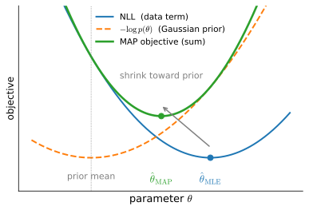

```{.python .input}
%load_ext d2lbook.tab
tab.interact_select('mxnet', 'pytorch', 'tensorflow', 'jax')
```

# Weight Decay
:label:`sec_weight_decay`

Now that we have characterized the problem of overfitting,
we can introduce our first *regularization* technique.
Recall that we can always mitigate overfitting
by collecting more training data.
However, that can be costly, time consuming,
or entirely out of our control,
making it impossible in the short run.
For now, we can assume that we already have
as much high-quality data as our resources permit
and focus the tools at our disposal
when the dataset is taken as a given.

Recall that in our polynomial regression example
(:numref:`subsec_polynomial-curve-fitting`)
we could limit our model's capacity
by tweaking the degree
of the fitted polynomial.
Indeed, limiting the number of features
is a popular technique for mitigating overfitting.
However, simply tossing aside features
can be too blunt an instrument.
Sticking with the polynomial regression
example, consider what might happen
with high-dimensional input.
The natural extensions of polynomials
to multivariate data are called *monomials*,
which are simply products of powers of variables.
The degree of a monomial is the sum of the powers.
For example, $x_1^2 x_2$, and $x_3 x_5^2$
are both monomials of degree 3.

Note that the number of terms with degree $d$
blows up rapidly as $d$ grows larger.
Given $k$ variables, the number of monomials
of degree $d$ is $\binom{k-1+d}{k-1}$.
Even small changes in degree, say from $2$ to $3$,
dramatically increase the complexity of our model.
Thus we often need a more fine-grained tool
for adjusting function complexity.

```{.python .input #weight-decay}
%%tab mxnet
%matplotlib inline
from d2l import mxnet as d2l
from mxnet import autograd, gluon, init, np, npx
from mxnet.gluon import nn
npx.set_np()
```

```{.python .input #weight-decay}
%%tab pytorch
%matplotlib inline
from d2l import torch as d2l
import torch
from torch import nn
```

```{.python .input #weight-decay}
%%tab tensorflow
%matplotlib inline
from d2l import tensorflow as d2l
import tensorflow as tf
```

```{.python .input #weight-decay}
%%tab jax
%matplotlib inline
from d2l import jax as d2l
import jax
from jax import numpy as jnp
import optax
```

## Norms and Weight Decay

Rather than directly manipulating the number of parameters,
*weight decay* :cite:`Hanson.Pratt.1988,Krogh.Hertz.1992` operates by
restricting the values 
that the parameters can take.
Outside of deep learning circles the technique is better known as
$\ell_2$ *regularization* (the two coincide when optimizing by minibatch
SGD, a point we return to below), and it might be the most widely used
technique for regularizing parametric machine learning models.
The technique is motivated by the basic intuition
that among all functions $f$,
the function $f = 0$
(assigning the value $0$ to all inputs)
is in some sense the *simplest*,
and that we can measure the complexity
of a function by the distance of its parameters from zero.
But how precisely should we measure
the distance between a function and zero?
There is no single right answer.
In fact, entire branches of mathematics,
including parts of functional analysis
and the theory of Banach spaces,
are devoted to addressing such issues.

One simple interpretation might be
to measure the complexity of a linear function
$f(\mathbf{x}) = \mathbf{w}^\top \mathbf{x}$
by some norm of its weight vector, e.g., $\| \mathbf{w} \|^2$.
Recall that we introduced the $\ell_2$ norm and $\ell_1$ norm,
which are special cases of the more general $\ell_p$ norm,
in :numref:`subsec_lin-algebra-norms`.
The most common method for ensuring a small weight vector
is to add its norm as a penalty term
to the problem of minimizing the loss.
Thus we replace our original objective,
*minimizing the prediction loss on the training labels*,
with new objective,
*minimizing the sum of the prediction loss and the penalty term*.
Now, if our weight vector grows too large,
our learning algorithm might focus
on minimizing the weight norm $\| \mathbf{w} \|^2$
rather than minimizing the training error.
That is exactly what we want.
To illustrate things in code,
we revive our previous example
from :numref:`sec_linear_regression` for linear regression.
There, our loss was given by

$$L(\mathbf{w}, b) = \frac{1}{n}\sum_{i=1}^n \frac{1}{2}\left(\mathbf{w}^\top \mathbf{x}^{(i)} + b - y^{(i)}\right)^2.$$

Recall that $\mathbf{x}^{(i)}$ are the features,
$y^{(i)}$ is the label for any data example $i$, and $(\mathbf{w}, b)$
are the weight and bias parameters, respectively.
To penalize the size of the weight vector,
we must somehow add $\| \mathbf{w} \|^2$ to the loss function,
but how should the model trade off the
standard loss for this new additive penalty?
In practice, we characterize this trade-off
via the *regularization constant* $\lambda$,
a nonnegative hyperparameter
that we fit using validation data:

$$L(\mathbf{w}, b) + \frac{\lambda}{2} \|\mathbf{w}\|^2.$$


For $\lambda = 0$, we recover our original loss function.
For $\lambda > 0$, we restrict the size of $\| \mathbf{w} \|$.
We divide by $2$ by convention:
when we take the derivative of a quadratic function,
the $2$ and $1/2$ cancel out, ensuring that the expression
for the update looks nice and simple.
The astute reader might wonder why we work with the squared
norm and not the standard norm (i.e., the Euclidean distance).
We do this for computational convenience.
By squaring the $\ell_2$ norm, we remove the square root,
leaving the sum of squares of
each component of the weight vector.
This makes the derivative of the penalty easy to compute: 
the sum of derivatives equals the derivative of the sum.


Moreover, you might ask why we work with the $\ell_2$ norm
in the first place and not, say, the $\ell_1$ norm.
In fact, other choices are valid and
popular throughout statistics.
While $\ell_2$-regularized linear models constitute
the classic *ridge regression* algorithm :cite:`Hoerl.Kennard.1970`,
$\ell_1$-regularized linear regression
is a similarly fundamental method in statistics, 
popularly known as *lasso regression* :cite:`Tibshirani.1996`.
One reason to work with the $\ell_2$ norm
is that it places an outsize penalty
on large components of the weight vector.
This biases our learning algorithm
towards models that distribute weight evenly
across a larger number of features.
In practice, this might make them more robust
to measurement error in a single variable.
By contrast, $\ell_1$ penalties lead to models
that concentrate weights on a small set of features
by clearing the other weights to zero.
This gives us an effective method for *feature selection*,
which may be desirable for other reasons.
For example, if our model only relies on a few features,
then we may not need to collect, store, or transmit data
for the other (dropped) features. 

These two penalties are easiest to compare geometrically. For a corresponding
budget $t$, minimizing $L(\mathbf{w}) + \frac{\lambda}{2}\|\mathbf{w}\|^2$ is
equivalent to minimizing $L(\mathbf{w})$ subject to $\|\mathbf{w}\| \le t$, and
the regularized solution is the first point at which a loss contour meets the
constraint region (:numref:`fig_ridge_geometry`). For the $\ell_2$ ball this
contact is generically *tangential*, so every coordinate shrinks but none
vanishes; for the $\ell_1$ diamond it typically lands on a *corner*, setting some
coordinates exactly to zero. This is the geometric reason lasso performs feature
selection while ridge does not.
We assert the penalty$\,\Leftrightarrow\,$constraint equivalence here;
:numref:`sec_mdl-constrained-optimization-duality` derives it via Lagrange
duality ($\lambda$ is exactly the multiplier attached to the constraint
$\|\mathbf{w}\| \le t$) and computes the $\lambda \leftrightarrow t$
correspondence numerically on ridge regression.


:label:`fig_ridge_geometry`

Using the same notation in :eqref:`eq_linreg_batch_update`,
minibatch stochastic gradient descent updates
for $\ell_2$-regularized regression as follows:

$$\begin{aligned}
\mathbf{w} & \leftarrow \left(1- \eta\lambda \right) \mathbf{w} - \frac{\eta}{|\mathcal{B}|} \sum_{i \in \mathcal{B}} \mathbf{x}^{(i)} \left(\mathbf{w}^\top \mathbf{x}^{(i)} + b - y^{(i)}\right).
\end{aligned}$$

As before, we update $\mathbf{w}$ based on the amount
by which our estimate differs from the observation.
However, we also shrink the size of $\mathbf{w}$ towards zero.
That is why the method is sometimes called "weight decay":
given the penalty term alone,
our optimization algorithm *decays*
the weight at each step of training.
In contrast to feature selection,
weight decay offers us a mechanism for continuously adjusting the complexity of a function.
Smaller values of $\lambda$ correspond
to less constrained $\mathbf{w}$,
whereas larger values of $\lambda$
constrain $\mathbf{w}$ more considerably.
Whether we include a corresponding bias penalty $b^2$ 
can vary across implementations, 
and may vary across layers of a neural network.
Often, we do not regularize the bias term.
For plain minibatch stochastic gradient descent, adding
$\frac{\lambda}{2}\|\mathbf{w}\|^2$ to the loss and applying the shrink-and-update
rule above are one and the same. This equivalence is special to SGD: for adaptive
optimizers such as Adam, a penalty placed inside the loss is rescaled by the
optimizer's per-coordinate second-moment estimates and no longer acts as uniform
weight shrinkage. *Decoupling* the decay from the loss gradient (shrinking every
weight by a fixed fraction at each step) restores the intended behavior; this is
the decoupled-weight-decay variant AdamW, introduced by
:citet:`Loshchilov.Hutter.2019` and now a default optimizer for large models.
The mechanism (including the per-coordinate shrinkage formula and a code
demonstration racing the coupled and decoupled variants) is worked out in
:numref:`subsec_mdl-decoupled-weight-decay`, and we take up optimizers in
detail in :numref:`sec_adam`.

Finally, weight decay also has a probabilistic reading. Recall from
:numref:`subsec_normal_distribution_and_squared_loss` that minimizing the squared
loss is maximum likelihood estimation under Gaussian observation noise. Now place
an isotropic Gaussian *prior* $\mathbf{w} \sim \mathcal{N}(\mathbf{0}, \tau^2\mathbf{I})$
on the weights and ask instead for the weights that maximize the *posterior*
$p(\mathbf{w} \mid \mathbf{X}, \mathbf{y}) \propto p(\mathbf{y} \mid \mathbf{X}, \mathbf{w})\, p(\mathbf{w})$, the
*maximum a posteriori* (MAP) estimate. Taking negative logarithms, the prior
contributes

$$-\log p(\mathbf{w}) = \frac{1}{2\tau^2} \|\mathbf{w}\|^2 + \textrm{const},$$

so the MAP objective is the Gaussian negative log-likelihood of
:numref:`subsec_normal_distribution_and_squared_loss` plus a quadratic penalty:

$$-\log p(\mathbf{w} \mid \mathbf{X}, \mathbf{y}) = \frac{1}{2\sigma^2} \sum_{i=1}^n \left(y^{(i)} - \mathbf{w}^\top \mathbf{x}^{(i)} - b\right)^2 + \frac{1}{2\tau^2} \|\mathbf{w}\|^2 + \textrm{const}.$$

In short, *MAP estimation is maximum likelihood plus a prior*, and the objective
above is exactly of our weight-decay form. The regularization constant $\lambda$
is thereby *proportional to* the prior precision $1/\tau^2$: a tighter prior
(smaller $\tau$) means stronger shrinkage. The exact constant of proportionality
involves the noise variance $\sigma^2$ and the sample size $n$, because the loss
$L$ above is an *average* while the log-posterior is a *sum*; exercise 6 asks you
to make the correspondence precise. :numref:`fig_wd-map-prior` illustrates this:
the prior's quadratic bowl pulls the maximum-likelihood estimate back
toward the origin. This recovers the classical *ridge regression* estimator.


:label:`fig_wd-map-prior`

## High-Dimensional Linear Regression

We can illustrate the benefits of weight decay 
through a simple synthetic example.

First, we generate some data as before:

$$y = 0.05 + \sum_{i = 1}^d 0.01 x_i + \epsilon \textrm{ where }
\epsilon \sim \mathcal{N}(0, 0.01^2).$$

In this synthetic dataset, our label is given 
by an underlying linear function of our inputs,
corrupted by Gaussian noise 
with zero mean and standard deviation 0.01.
For illustrative purposes, 
we can make the effects of overfitting pronounced,
by increasing the dimensionality of our problem to $d = 200$
and working with a small training set with only 20 examples.

```{.python .input #weight-decay-high-dimensional-linear-regression}
%%tab pytorch
class Data(d2l.DataModule):
    def __init__(self, num_train, num_val, num_inputs, batch_size):
        self.save_hyperparameters()                
        n = num_train + num_val 
        self.X = d2l.randn(n, num_inputs)
        noise = d2l.randn(n, 1) * 0.01
        w, b = d2l.ones((num_inputs, 1)) * 0.01, 0.05
        self.y = d2l.matmul(self.X, w) + b + noise

    def get_dataloader(self, train):
        i = slice(0, self.num_train) if train else slice(self.num_train, None)
        return self.get_tensorloader([self.X, self.y], train, i)
```

```{.python .input #weight-decay-high-dimensional-linear-regression}
%%tab tensorflow
class Data(d2l.DataModule):
    def __init__(self, num_train, num_val, num_inputs, batch_size):
        self.save_hyperparameters()                
        n = num_train + num_val 
        self.X = d2l.normal((n, num_inputs))
        noise = d2l.normal((n, 1)) * 0.01
        w, b = d2l.ones((num_inputs, 1)) * 0.01, 0.05
        self.y = d2l.matmul(self.X, w) + b + noise

    def get_dataloader(self, train):
        i = slice(0, self.num_train) if train else slice(self.num_train, None)
        return self.get_tensorloader([self.X, self.y], train, i)
```

```{.python .input #weight-decay-high-dimensional-linear-regression}
%%tab jax
class Data(d2l.DataModule):
    def __init__(self, num_train, num_val, num_inputs, batch_size):
        self.save_hyperparameters()                
        n = num_train + num_val 
        key_X, key_noise = jax.random.split(jax.random.PRNGKey(0))
        self.X = jax.random.normal(key_X, (n, num_inputs))
        noise = jax.random.normal(key_noise, (n, 1)) * 0.01
        w, b = d2l.ones((num_inputs, 1)) * 0.01, 0.05
        self.y = d2l.matmul(self.X, w) + b + noise

    def get_dataloader(self, train):
        i = slice(0, self.num_train) if train else slice(self.num_train, None)
        return self.get_tensorloader([self.X, self.y], train, i)
```

```{.python .input #weight-decay-high-dimensional-linear-regression}
%%tab mxnet
class Data(d2l.DataModule):
    def __init__(self, num_train, num_val, num_inputs, batch_size):
        self.save_hyperparameters()                
        n = num_train + num_val 
        self.X = d2l.randn(n, num_inputs)
        noise = d2l.randn(n, 1) * 0.01
        w, b = d2l.ones((num_inputs, 1)) * 0.01, 0.05
        self.y = d2l.matmul(self.X, w) + b + noise

    def get_dataloader(self, train):
        i = slice(0, self.num_train) if train else slice(self.num_train, None)
        return self.get_tensorloader([self.X, self.y], train, i)
```

## Implementation from Scratch

Now, let's try implementing weight decay from scratch.
Since minibatch stochastic gradient descent
is our optimizer,
we just need to add the squared $\ell_2$ penalty
to the original loss function.

### Defining $\ell_2$ Norm Penalty

Perhaps the most convenient way of implementing this penalty
is to square all terms in place and sum them.

```{.python .input #weight-decay-defining-ell-2-norm-penalty}
def l2_penalty(w):
    return d2l.reduce_sum(w**2) / 2
```

### Defining the Model

In the final model,
the linear regression and the squared loss have not changed since :numref:`sec_linear_scratch`,
so we will just define a subclass of `d2l.LinearRegressionScratch`. The only change here is that our loss now includes the penalty term.

```{.python .input #weight-decay-defining-the-model-1}
%%tab pytorch, mxnet, tensorflow
class WeightDecayScratch(d2l.LinearRegressionScratch):
    def __init__(self, num_inputs, lambd, lr, sigma=0.01):
        super().__init__(num_inputs, lr, sigma)
        self.save_hyperparameters()
        
    def loss(self, y_hat, y):
        return (super().loss(y_hat, y) +
                self.lambd * l2_penalty(self.w))
```

```{.python .input #weight-decay-defining-the-model-1}
%%tab jax
class WeightDecayScratch(d2l.LinearRegressionScratch):
    lambd: int = 0
        
    def loss(self, params, X, y, state):
        return (super().loss(params, X, y, state) +
                self.lambd * l2_penalty(params['w']))
```

The following code fits our model on the training set with 20 examples and evaluates it on the validation set with 100 examples.

```{.python .input #weight-decay-defining-the-model-2}
%%tab pytorch
data = Data(num_train=20, num_val=100, num_inputs=200, batch_size=5)
trainer = d2l.Trainer(max_epochs=30)

def train_scratch(lambd):    
    model = WeightDecayScratch(num_inputs=200, lambd=lambd, lr=0.01)
    model.board.yscale='log'
    trainer.fit(model, data)
    print('L2 norm of w:', float(l2_penalty(model.w)))
```

```{.python .input #weight-decay-defining-the-model-2}
%%tab tensorflow
data = Data(num_train=20, num_val=100, num_inputs=200, batch_size=5)
trainer = d2l.Trainer(max_epochs=30)

def train_scratch(lambd):    
    model = WeightDecayScratch(num_inputs=200, lambd=lambd, lr=0.01)
    model.board.yscale='log'
    trainer.fit(model, data)
    print('L2 norm of w:', float(l2_penalty(model.w)))
```

```{.python .input #weight-decay-defining-the-model-2}
%%tab jax
data = Data(num_train=20, num_val=100, num_inputs=200, batch_size=5)
trainer = d2l.Trainer(max_epochs=30)

def train_scratch(lambd):    
    model = WeightDecayScratch(num_inputs=200, lambd=lambd, lr=0.01)
    model.board.yscale='log'
    trainer.fit(model, data)
    print('L2 norm of w:',
          float(l2_penalty(trainer.state.params['w'])))
```

```{.python .input #weight-decay-defining-the-model-2}
%%tab mxnet
data = Data(num_train=20, num_val=100, num_inputs=200, batch_size=5)
trainer = d2l.Trainer(max_epochs=30)

def train_scratch(lambd):    
    model = WeightDecayScratch(num_inputs=200, lambd=lambd, lr=0.01)
    model.board.yscale='log'
    trainer.fit(model, data)
    print('L2 norm of w:', float(l2_penalty(model.w)))
```

### Training without Regularization

We now run this code with `lambd = 0`,
disabling weight decay.
Note that we overfit badly,
decreasing the training error but not the
validation error, a textbook case of overfitting.

```{.python .input #weight-decay-training-without-regularization}
train_scratch(0)
```

### Using Weight Decay

Below, we run with substantial weight decay.
Note that the training error increases
but the validation error decreases.
This is precisely the effect
we expect from regularization.

```{.python .input #weight-decay-using-weight-decay}
train_scratch(3)
```

### Why Shrinkage Helps: The Spectral View
:label:`subsec_wd-shrinkage`

The geometry of :numref:`fig_ridge_geometry` says that the penalty pulls
$\hat{\mathbf{w}}$ toward the origin, but not *which parts* of
$\hat{\mathbf{w}}$ are pulled hardest. For linear regression we can say
exactly. Adding the penalty keeps the problem quadratic, so it retains a
closed-form solution (dropping the unpenalized intercept, which centering
absorbs): minimizing
$\frac{1}{2}\|\mathbf{y} - \mathbf{X}\mathbf{w}\|^2 + \frac{\tilde{\lambda}}{2}\|\mathbf{w}\|^2$
gives

$$\mathbf{w}^*_{\tilde{\lambda}} = (\mathbf{X}^\top \mathbf{X} + \tilde{\lambda} \mathbf{I})^{-1} \mathbf{X}^\top \mathbf{y},$$

which is well defined for every $\tilde{\lambda} > 0$ even when
$\mathbf{X}^\top \mathbf{X}$ is singular; this is the estimator promised in
exercise 4.5 of :numref:`sec_linear_regression`. (Because the loss $L$ of this
section *averages* over the $n$ examples while the objective above sums, the two
conventions are related by $\tilde{\lambda} = n\lambda$.)

To see what this estimator does, substitute the singular value decomposition
$\mathbf{X} = \mathbf{U}\mathbf{D}\mathbf{V}^\top$
(:numref:`sec_mdl-svd-low-rank`). A short calculation shows that the ridge
prediction is

$$\mathbf{X}\mathbf{w}^*_{\tilde{\lambda}} = \sum_j \mathbf{u}_j\, \frac{d_j^2}{d_j^2 + \tilde{\lambda}}\, \mathbf{u}_j^\top \mathbf{y},$$

whereas ordinary least squares gives $\sum_j \mathbf{u}_j \mathbf{u}_j^\top \mathbf{y}$,
the orthogonal projection from :numref:`sec_linear_regression`. Ridge therefore
*shrinks* the response along the $j$-th principal direction of the data by the
factor $d_j^2 / (d_j^2 + \tilde{\lambda})$. Directions with large singular value
$d_j$ (strongly represented in the data) pass through almost untouched, while
directions with small $d_j$, where a little noise in $\mathbf{y}$ produces a wild
swing in $\mathbf{w}$, are suppressed hardest. This is the quantitative reason
shrinkage tames overfitting: it damps precisely the directions that the data
constrains least, the ones a noise-chasing fit exploits. Summing the
per-direction factors yields the *effective degrees of freedom*

$$\textrm{df}(\tilde{\lambda}) = \sum_j \frac{d_j^2}{d_j^2 + \tilde{\lambda}},$$

which slides continuously from $\textrm{rank}(\mathbf{X})$ at
$\tilde{\lambda} = 0$ toward $0$ as $\tilde{\lambda} \to \infty$, the
"continuous complexity dial" from the start of this section, made literal.
Let's compute these quantities on the very dataset we just trained on.

```{.python .input #weight-decay-why-shrinkage-helps-the-spectral-view}
%%tab pytorch
d = torch.linalg.svdvals(data.X[:data.num_train])
for lam in (0, 3, 30):
    shrink = d**2 / (d**2 + data.num_train * lam)
    print(f'lambda={lam:2d}  df={float(d2l.reduce_sum(shrink)):5.1f}  '
          f'strongest {float(shrink[0]):.2f}  weakest {float(shrink[-1]):.2f}')
```

```{.python .input #weight-decay-why-shrinkage-helps-the-spectral-view}
%%tab tensorflow
d = tf.linalg.svd(data.X[:data.num_train], compute_uv=False)
for lam in (0, 3, 30):
    shrink = d**2 / (d**2 + data.num_train * lam)
    print(f'lambda={lam:2d}  df={float(d2l.reduce_sum(shrink)):5.1f}  '
          f'strongest {float(shrink[0]):.2f}  weakest {float(shrink[-1]):.2f}')
```

```{.python .input #weight-decay-why-shrinkage-helps-the-spectral-view}
%%tab jax
d = jnp.linalg.svd(data.X[:data.num_train], compute_uv=False)
for lam in (0, 3, 30):
    shrink = d**2 / (d**2 + data.num_train * lam)
    print(f'lambda={lam:2d}  df={float(d2l.reduce_sum(shrink)):5.1f}  '
          f'strongest {float(shrink[0]):.2f}  weakest {float(shrink[-1]):.2f}')
```

```{.python .input #weight-decay-why-shrinkage-helps-the-spectral-view}
%%tab mxnet
_, d, _ = np.linalg.svd(data.X[:data.num_train])
for lam in (0, 3, 30):
    shrink = d**2 / (d**2 + data.num_train * lam)
    print(f'lambda={lam:2d}  df={float(d2l.reduce_sum(shrink)):5.1f}  '
          f'strongest {float(shrink[0]):.2f}  weakest {float(shrink[-1]):.2f}')
```

Two things stand out. First, even *without* regularization, 20 training
examples can pin down at most 20 directions of the 200-dimensional weight
space: $\textrm{rank}(\mathbf{X}) = 20$, so $\textrm{df}(0) = 20$ and the
remaining 180 directions are entirely unconstrained: no wonder the
unregularized fit overfits. Second, at the $\lambda = 3$ that lowered the
validation loss above, every shrinkage factor drops below one, the weakest
directions are damped most, and $\textrm{df}(\lambda)$ falls well below 20: the
regularized model behaves like one with far fewer parameters than its nominal
200, which is exactly the continuous capacity control weight decay provides
(:numref:`sec_generalization_basics`).

## Concise Implementation

Because weight decay is ubiquitous
in neural network optimization,
deep learning frameworks make it especially convenient,
integrating weight decay into the optimization algorithm itself
for easy use in combination with any loss function.
Moreover, this integration serves a computational benefit,
allowing implementation tricks to add weight decay to the algorithm,
without any additional computational overhead.
Since the weight decay portion of the update
depends only on the current value of each parameter,
the optimizer must touch each parameter once anyway.

:begin_tab:`mxnet`
Below, we specify
the weight decay hyperparameter directly
through `wd` when instantiating our `Trainer`.
By default, Gluon decays both
weights and biases simultaneously.
Note that the hyperparameter `wd`
will be multiplied by `wd_mult`
when updating model parameters.
Thus, if we set `wd_mult` to zero,
the bias parameter $b$ will not decay.
:end_tab:

:begin_tab:`pytorch`
Below, we specify
the weight decay hyperparameter directly
through `weight_decay` when instantiating our optimizer.
By default, PyTorch decays both
weights and biases simultaneously, but
we can configure the optimizer to handle different parameters
according to different policies.
Here, we only set `weight_decay` for
the weights (the `net.weight` parameters), hence the 
bias (the `net.bias` parameter) will not decay.
:end_tab:

:begin_tab:`tensorflow`
Below, we create an $\ell_2$ regularizer with
the weight decay hyperparameter `wd` and apply it to the layer's weights
through the `kernel_regularizer` argument.
:end_tab:

```{.python .input #weight-decay-concise-implementation-1}
%%tab mxnet
class WeightDecay(d2l.LinearRegression):
    def __init__(self, wd, lr):
        super().__init__(lr)
        self.save_hyperparameters()
        self.wd = wd
        
    def configure_optimizers(self):
        for p in self.collect_params('.*bias').values():
            p.wd_mult = 0
        return gluon.Trainer(self.collect_params(),
                             'sgd', 
                             {'learning_rate': self.lr, 'wd': self.wd})
```

```{.python .input #weight-decay-concise-implementation-1}
%%tab pytorch
class WeightDecay(d2l.LinearRegression):
    def __init__(self, wd, lr):
        super().__init__(lr)
        self.save_hyperparameters()
        self.wd = wd

    def configure_optimizers(self):
        return torch.optim.SGD([
            {'params': self.net.weight, 'weight_decay': self.wd},
            {'params': self.net.bias}], lr=self.lr)
```

```{.python .input #weight-decay-concise-implementation-1}
%%tab tensorflow
class WeightDecay(d2l.LinearRegression):
    def __init__(self, wd, lr):
        super().__init__(lr)
        self.save_hyperparameters()
        # Keras' l2(wd) penalty is wd*sum(w**2) (no 1/2 factor), so use
        # wd/2 to match the (wd/2)*||w||^2 convention used elsewhere.
        self.net = tf.keras.layers.Dense(
            1, kernel_regularizer=tf.keras.regularizers.l2(wd / 2),
            kernel_initializer=tf.keras.initializers.RandomNormal(0, 0.01)
        )
        
    def loss(self, y_hat, y):
        return super().loss(y_hat, y) + tf.add_n(self.net.losses)
```

```{.python .input #weight-decay-concise-implementation-1}
%%tab jax
class WeightDecay(d2l.LinearRegression):
    wd: float = 0

    def configure_optimizers(self):
        # Weight Decay is not available directly within optax.sgd, but
        # optax allows chaining several transformations together. We
        # mask the decay so it applies to the kernel only (not bias),
        # matching the per-parameter-group convention in PyTorch / MXNet.
        def kernel_mask(params):
            return jax.tree_util.tree_map_with_path(
                lambda path, _: path[-1].key != 'bias', params)
        return optax.chain(
            optax.masked(optax.add_decayed_weights(self.wd), kernel_mask),
            optax.sgd(self.lr))
```

This version runs faster and is easier to implement than the from-scratch code,
benefits that grow more pronounced on larger problems and as this work becomes
routine. One subtlety: a framework's `weight_decay` adds the
term $\lambda\mathbf{w}$ to the *gradient*, whereas our from-scratch penalty added
$\frac{\lambda}{2}\|\mathbf{w}\|^2$ to the *loss*. When the loss omits the
$\frac{1}{2}$ factor (as PyTorch's `nn.MSELoss` does), the two correspond to
slightly different effective values of $\lambda$, so the converged
$\|\mathbf{w}\|^2$ need not match the from-scratch value exactly, even though the
regularizing effect is the same.

```{.python .input #weight-decay-concise-implementation-2}
%%tab pytorch
model = WeightDecay(wd=3, lr=0.01)
model.board.yscale='log'
trainer.fit(model, data)

print('L2 norm of w:', float(l2_penalty(model.get_w_b()[0])))
```

```{.python .input #weight-decay-concise-implementation-2}
%%tab tensorflow
model = WeightDecay(wd=3, lr=0.01)
model.board.yscale='log'
trainer.fit(model, data)

print('L2 norm of w:', float(l2_penalty(model.get_w_b()[0])))
```

```{.python .input #weight-decay-concise-implementation-2}
%%tab jax
model = WeightDecay(wd=3, lr=0.01)
model.board.yscale='log'
trainer.fit(model, data)

print('L2 norm of w:', float(l2_penalty(model.get_w_b(trainer.state)[0])))
```

```{.python .input #weight-decay-concise-implementation-2}
%%tab mxnet
model = WeightDecay(wd=3, lr=0.01)
model.board.yscale='log'
trainer.fit(model, data)

print('L2 norm of w:', float(l2_penalty(model.get_w_b()[0])))
```

So far we have measured complexity through the norm of a *linear* function's
weights. The same principle extends to the nonlinear functions a deep network
computes: in practice we simply apply weight decay to the parameters of every
layer, a simple, effective heuristic we adopt throughout the book.

## Summary

Regularization is a common method for dealing with overfitting. Classical regularization techniques add a penalty term to the loss function (when training) to reduce the complexity of the learned model.
One particular choice for keeping the model simple is using an $\ell_2$ penalty. This leads to weight decay in the update steps of the minibatch stochastic gradient descent algorithm.
In practice, the weight decay functionality is provided in optimizers from deep learning frameworks.
Different sets of parameters can have different update behaviors within the same training loop.


## Exercises

1. Experiment with the value of $\lambda$ in the estimation problem in this section. Plot training and validation loss as a function of $\lambda$. What do you observe? Hint: expect a U-shaped validation curve, with $\lambda$ (equivalently, $\textrm{df}(\lambda)$) playing the role of the complexity dial (compare :numref:`fig_mdl-bias-variance-u-curve`).
1. Use a validation set to find the optimal value of $\lambda$. Is it really the optimal value? Does this matter?
1. What would the update equations look like if instead of $\|\mathbf{w}\|^2$ we used $\sum_i |w_i|$ as our penalty of choice ($\ell_1$ regularization)?
1. We know that $\|\mathbf{w}\|^2 = \mathbf{w}^\top \mathbf{w}$. Can you find a similar equation for matrices (see the Frobenius norm in :numref:`subsec_lin-algebra-norms`)?
1. Review the relationship between training error and generalization error. In addition to weight decay, increased training, and the use of a model of suitable complexity, what other ways might help us deal with overfitting?
1. Make the MAP correspondence of :numref:`fig_wd-map-prior` precise. Starting from the posterior $P(\mathbf{w} \mid \mathbf{X}, \mathbf{y}) \propto P(\mathbf{y} \mid \mathbf{X}, \mathbf{w}) P(\mathbf{w})$ with noise variance $\sigma^2$ and prior $\mathbf{w} \sim \mathcal{N}(\mathbf{0}, \tau^2 \mathbf{I})$, show that minimizing the negative log-posterior is equivalent to minimizing the *averaged* loss $L(\mathbf{w}, b) + \frac{\lambda}{2}\|\mathbf{w}\|^2$ of this section with $\lambda = \sigma^2 / (n \tau^2)$. Which prior standard deviation $\tau$ corresponds to the $\lambda = 3$ used in the experiments above?

:begin_tab:`mxnet`
[Discussions](https://d2l.discourse.group/t/98)
:end_tab:

:begin_tab:`pytorch`
[Discussions](https://d2l.discourse.group/t/99)
:end_tab:

:begin_tab:`tensorflow`
[Discussions](https://d2l.discourse.group/t/236)
:end_tab:

:begin_tab:`jax`
[Discussions](https://d2l.discourse.group/t/17979)
:end_tab:

<!-- slides -->

::: {.slide}
::: {.cover}
[Dive into Deep Learning · §3.7]{.kicker}

Taming overfitting by shrinking the weights<br>**the $\ell_2$ penalty · the geometry · the spectral why · the Bayesian reading**.
:::
:::

::: {.slide title="When more data is not an option"}
[Motivation]{.kicker}

::: {.cols .vc}
::: {.col}
- Overfitting fades with **more data**, but data is often costly or fixed.
- Dropping features is **too blunt**: with $k$ inputs there are $\binom{k-1+d}{k-1}$ degree-$d$ monomials.
- Instead, **restrict the values** the weights may take.

::: {.d2l-note}
Among all $f$, the constant $f=0$ is the *simplest*. Measure complexity by **how far the weights sit from zero**.
:::
:::

::: {.col .narrow}
$$\|\mathbf{w}\|_2^2 = \sum_i w_i^2$$

A single number that grows as the weights stretch away from the origin.
:::
:::
:::

::: {.slide title="Add the size of the weights to the loss"}
[The idea]{.kicker}

Penalize a large weight vector by adding its squared norm to the objective, scaled by a knob $\lambda \ge 0$:

$$L(\mathbf{w}, b) \;+\; \frac{\lambda}{2}\,\|\mathbf{w}\|_2^2.$$

. . .

- $\lambda = 0$ recovers the plain loss; larger $\lambda$ pulls $\mathbf{w}$ harder toward zero.
- The $\tfrac{1}{2}$ is cosmetic: it cancels the $2$ from differentiating the square.

::: {.d2l-note .rule}
$\ell_2$-regularized linear regression is the classic **ridge regression**; the $\ell_1$ version is **lasso**.
:::
:::

::: {.slide title="Ridge shrinks, lasso selects"}
[The geometry]{.kicker}

A budget $\|\mathbf{w}\| \le t$ turns the penalty into a *constraint*: the answer is where a loss contour first touches the constraint region.

{width=82%}

::: {.d2l-note}
A round ball touches **off-axis** (everything shrinks); a pointed diamond touches at a **corner** (sparsity). This is why lasso does feature selection and ridge does not.
:::
:::

::: {.slide title="Why it is called weight decay"}
[The update]{.kicker}

::: {.cols .vc}
::: {.col}
The penalty adds $\lambda\mathbf{w}$ to the gradient, so each SGD step gains a shrink factor:

$$\mathbf{w} \leftarrow (1 - \eta\lambda)\,\mathbf{w}
  \;-\; \frac{\eta}{|\mathcal{B}|}\!\sum_{i \in \mathcal{B}}
  \mathbf{x}^{(i)}\bigl(\mathbf{w}^\top\mathbf{x}^{(i)} + b - y^{(i)}\bigr).$$

Before fitting the data at all, every weight is **decayed** toward zero by the factor $1 - \eta\lambda$.
:::

::: {.col .narrow}
::: {.d2l-note}
$\lambda$ is a **continuous** complexity dial: unlike deleting features, it never forces a hard choice.
:::

::: {.d2l-note}
Usually the **bias is left undecayed**.
:::
:::
:::
:::

::: {.slide}
::: {.divider}
[01]{.dnum}

[From Scratch]{.dtitle}

[a problem built to overfit, then regularized]{.dsub}
:::
:::

::: {.slide title="A regression rigged to overfit" layout="tight"}
[From Scratch]{.kicker}

::: {.cols .vc}
::: {.col}
A tiny linear signal in **200 inputs** plus faint noise, $y = 0.05 + \sum_i 0.01\,x_i + \epsilon$:

@-weight-decay-high-dimensional-linear-regression
:::

::: {.col .narrow}
::: {.d2l-note .warn}
**20** examples for **200** parameters: 10× more knobs than data.
Overfitting is guaranteed by design, so its remedy is unmistakable.
:::
:::
:::
:::

::: {.slide title="The penalty, then the model"}
[From Scratch]{.kicker}

::: {.cols .vc}
::: {.col}
The penalty is a single line:

@weight-decay-defining-ell-2-norm-penalty

Subclass the scratch regressor and fold it into the loss:

@weight-decay-defining-the-model-1
:::

::: {.col .narrow}
::: {.d2l-note}
Nothing else changes: same linear model, same squared loss. The penalty rides along, scaled by `lambd`.
:::
:::
:::
:::

::: {.slide title="$\lambda = 0$: the overfit, on display" layout="tight"}
[From Scratch · the overfit]{.kicker}

@weight-decay-training-without-regularization

Training loss plunges; validation loss never follows, and the printed
$\|\mathbf{w}\|^2$ shows the price of that perfect memory. A textbook overfit.
:::

::: {.slide title="$\lambda = 3$: the rescue" layout="tight"}
[From Scratch · the rescue]{.kicker}

@weight-decay-using-weight-decay

Training loss is *higher* (we forbade memorization) but validation
loss finally falls, with $\|\mathbf{w}\|^2$ an order of magnitude smaller.
:::

::: {.slide title="Why shrinkage helps: damp the directions the data cannot see" only="pytorch" layout="tight"}
[From Scratch · the why]{.kicker}

Via the SVD $\mathbf{X} = \mathbf{U}\mathbf{D}\mathbf{V}^\top$, ridge damps the response along the $j$-th principal direction by

$$\frac{d_j^2}{d_j^2 + \tilde{\lambda}}
\qquad\Rightarrow\qquad
\textrm{df}(\tilde{\lambda}) = \sum_j \frac{d_j^2}{d_j^2 + \tilde{\lambda}}.$$

On our $20\times 200$ dataset:

@!weight-decay-why-shrinkage-helps-the-spectral-view

::: {.d2l-note .rule}
Twenty examples pin down at most **20** of 200 directions; $\lambda = 3$
prices the model at $\textrm{df} = 15.1$ effective parameters, hitting
the weakest directions hardest.
:::
:::

::: {.slide title="Why shrinkage helps: damp the directions the data cannot see" except="pytorch"}
[From Scratch · the why]{.kicker}

Ridge keeps a closed form, and the SVD $\mathbf{X} = \mathbf{U}\mathbf{D}\mathbf{V}^\top$ shows exactly *what* shrinks: the response along the $j$-th principal direction is damped by

$$\frac{d_j^2}{d_j^2 + \tilde{\lambda}}
\qquad\Rightarrow\qquad
\textrm{df}(\tilde{\lambda}) = \sum_j \frac{d_j^2}{d_j^2 + \tilde{\lambda}}.$$

Strong directions ($d_j$ large) pass through nearly untouched; the weakly
constrained ones are suppressed hardest.

::: {.d2l-note .rule}
Twenty examples pin down at most **20** of 200 directions
($\textrm{df}(0) = 20$); $\lambda = 3$ prices the model at
$\textrm{df} \approx 15$ effective parameters.
:::
:::

::: {.slide}
::: {.divider}
[02]{.dnum}

[The Built-In Way]{.dtitle}

[where the framework keeps the decay]{.dsub}
:::
:::

::: {.slide title="Decay lives in the optimizer" only="pytorch"}
[Concise · PyTorch]{.kicker}

Pass `weight_decay` per parameter group: here only the weight is decayed, the bias is left alone:

@weight-decay-concise-implementation-1

::: {.d2l-note}
No penalty term in the loss: the optimizer adds $\lambda\mathbf{w}$ to the gradient itself, for free.
:::
:::

::: {.slide title="Decay lives in the optimizer" only="mxnet"}
[Concise · MXNet]{.kicker}

Gluon's `Trainer` takes `wd` directly; set `wd_mult = 0` on the bias so only the weights decay:

@weight-decay-concise-implementation-1

::: {.d2l-note}
One `Trainer` argument replaces the hand-written penalty.
:::
:::

::: {.slide title="Decay as a layer regularizer" only="tensorflow"}
[Concise · TensorFlow]{.kicker}

Keras attaches the penalty to the layer via `kernel_regularizer`, then surfaces it through `net.losses`:

@weight-decay-concise-implementation-1

::: {.d2l-note .warn}
Keras' `l2(wd)` has **no** $\tfrac{1}{2}$ factor, so we pass `wd / 2` to match the convention used from scratch.
:::
:::

::: {.slide title="Decay as a gradient transform" only="jax"}
[Concise · JAX]{.kicker}

Optax has no `weight_decay` in `sgd`, so we **chain** transforms and `mask` the decay to the kernel. `add_decayed_weights` injects $\lambda\mathbf{w}$ into the gradient; the mask spares the bias.

@weight-decay-concise-implementation-1
:::

::: {.slide title="Same effect, less code"}
[Concise · result]{.kicker}

Fit with `wd = 3`: the validation curve matches the from-scratch run.

::: {.cols .vc}
::: {.col .fig}
@!weight-decay-concise-implementation-2
:::

::: {.col}
::: {.d2l-note}
A framework's `weight_decay` adds $\lambda\mathbf{w}$ to the *gradient*; the scratch penalty added $\tfrac{\lambda}{2}\|\mathbf{w}\|^2$ to the *loss*. Converged norms need not match exactly, only the effect.
:::
:::
:::
:::

::: {.slide title="The adaptive-optimizer reading: AdamW"}
[Beyond linear models]{.kicker}

Inside an Adam-style update each coordinate gets its own step size, so folding the penalty into the gradient rescales it per coordinate: it stops being uniform shrinkage.

. . .

::: {.d2l-note .rule}
*Decoupling* the decay from the adaptive step restores the intent of plain $1-\eta\lambda$ shrinkage. This is **AdamW**, a default for training large models.
:::

For deep networks we simply apply the same decay to every layer's weights: a simple, effective default.
:::

::: {.slide title="The Bayesian reading: a prior on the weights"}
[Beyond linear models]{.kicker}

::: {.cols .vc}
::: {.col}
Put a zero-mean Gaussian **prior** on $\mathbf{w}$:

$$\mathbf{w}\sim\mathcal{N}(\mathbf{0},\lambda^{-1}\mathbf{I})
  \;\Rightarrow\;
  -\log p(\mathbf{w}) = \tfrac{\lambda}{2}\|\mathbf{w}\|^2 + \textrm{const}.$$

Add it to the Gaussian-noise NLL from §3.1:

$$\underbrace{-\log p(\mathbf{y}\mid\mathbf{X},\mathbf{w})}_{\textrm{MLE: }\,\frac{1}{2\sigma^2}\sum(\hat{y}-y)^2}
  \;\; \underbrace{-\log p(\mathbf{w})}_{=\,\frac{\lambda}{2}\|\mathbf{w}\|^2}
  \;\Rightarrow\; \textrm{MAP} = \textrm{ridge}.$$

::: {.d2l-note .rule}
**MAP = MLE + a prior.** §3.1 got squared loss from Gaussian *noise*; weight decay adds a Gaussian *prior* on $\mathbf{w}$, with $\lambda$ the prior precision.
:::
:::

::: {.col .fig}
{width=92%}
:::
:::
:::

::: {.slide title="Summary"}
[Wrap-up]{.kicker}

::: {.cols}
::: {.col}
- **Weight decay** = original loss $+\ \tfrac{\lambda}{2}\|\mathbf{w}\|_2^2$; per step it **shrinks** the weights by $1 - \eta\lambda$ before the data update.
- **Geometry:** ridge shrinks (round ball), lasso selects (pointed diamond).
- **Spectral view:** each direction damped by $d_j^2/(d_j^2+\tilde\lambda)$; the 200-knob model ran at $\textrm{df} \approx 15$ effective parameters, a continuous dial tuned on a **validation set**.
:::

::: {.col}
- The $20{\times}200$ rig: $\lambda=0$ memorizes; $\lambda=3$ trades training error for a falling validation loss.
- Frameworks expose decay in the **optimizer** (or layer / gradient transform).
- Same idea scales up: **AdamW** for big models, a Gaussian **prior** in disguise.
:::
:::
:::
