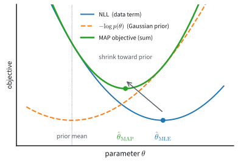

```{.python .input}
%load_ext d2lbook.tab
tab.interact_select('mxnet', 'pytorch', 'tensorflow', 'jax')
```

# Weight Decay
:label:`sec_weight_decay`

Now that we have characterized the problem of overfitting,
we can introduce our first *regularization* technique.
Additional representative training data often reduces overfitting.
However, that can be costly, time consuming,
or entirely out of our control,
making it impossible in the short run.
For now, we can assume that we already have
as much high-quality data as our resources permit
and focus on the tools at our disposal
when the dataset is taken as a given.

Recall that in our polynomial regression example
(:numref:`subsec_polynomial-curve-fitting`)
we could limit our model's capacity
by tweaking the degree
of the fitted polynomial.
Indeed, limiting the number of features
is a popular technique for mitigating overfitting.
However, discarding features can be too coarse a way to control capacity.
Sticking with the polynomial regression
example, consider what might happen
with high-dimensional input.
The natural extensions of polynomials
to multivariate data are called *monomials*,
which are products of powers of variables.
The degree of a monomial is the sum of the powers.
For example, $x_1^2 x_2$, and $x_3 x_5^2$
are both monomials of degree 3.

The number of terms with degree $d$ grows rapidly with $d$.
Given $k$ variables, the number of monomials
of degree $d$ is $\binom{k-1+d}{k-1}$.
Even small changes in degree, say from $2$ to $3$,
dramatically increase the complexity of our model.
Thus we often need a more fine-grained tool
for adjusting function complexity.

```{.python .input #weight-decay}
%%tab mxnet
%matplotlib inline
from d2l import mxnet as d2l
from mxnet import autograd, gluon, init, np, npx
from mxnet.gluon import nn
npx.set_np()
```

```{.python .input #weight-decay}
%%tab pytorch
%matplotlib inline
from d2l import torch as d2l
import torch
from torch import nn
```

```{.python .input #weight-decay}
%%tab tensorflow
%matplotlib inline
from d2l import tensorflow as d2l
import tensorflow as tf
```

```{.python .input #weight-decay}
%%tab jax
%matplotlib inline
from d2l import jax as d2l
import jax
from jax import numpy as jnp
import optax
```

## Norms and Weight Decay

Rather than directly manipulating the number of parameters,
*weight decay* :cite:`Hanson.Pratt.1988,Krogh.Hertz.1992` operates by
restricting the values 
that the parameters can take.
Outside of deep learning circles the technique is better known as
$\ell_2$ *regularization* (the two coincide when optimizing by minibatch
SGD, a point we return to below), and it is a widely used regularizer for parametric machine learning models.
The technique is motivated by the basic intuition
that, within a fixed parameterization, a function $f$ with smaller parameter
norm has lower penalty. This expresses a preference toward the zero function
$f = 0$, which assigns $0$ to every input. The choice of norm determines how
parameter size is measured.
There is no single right answer.
In fact, entire branches of mathematics,
including parts of functional analysis
and the theory of Banach spaces,
are devoted to addressing such issues.

One simple interpretation might be
to measure the complexity of a linear function
$f(\mathbf{x}) = \mathbf{w}^\top \mathbf{x}$
by some norm of its weight vector, e.g., $\| \mathbf{w} \|^2$.
Recall that we introduced the $\ell_2$ norm and $\ell_1$ norm,
which are special cases of the more general $\ell_p$ norm,
in :numref:`subsec_lin-algebra-norms`.
The most common method for ensuring a small weight vector
is to add its norm as a penalty term
to the problem of minimizing the loss.
Thus we replace our original objective,
*minimizing the prediction loss on the training labels*,
with a new objective,
*minimizing the sum of the prediction loss and the penalty term*.
Now, if our weight vector grows too large,
our learning algorithm might focus
on minimizing the weight norm $\| \mathbf{w} \|^2$
rather than minimizing the training error.
That is exactly what we want.
To illustrate things in code,
we revive our previous example
from :numref:`sec_linear_regression` for linear regression.
There, our loss was given by

$$L(\mathbf{w}, b) = \frac{1}{n}\sum_{i=1}^n \frac{1}{2}\left(\mathbf{w}^\top \mathbf{x}^{(i)} + b - y^{(i)}\right)^2.$$

Recall that $\mathbf{x}^{(i)}$ are the features,
$y^{(i)}$ is the label for any data example $i$, and $(\mathbf{w}, b)$
are the weight and bias parameters, respectively.
To penalize the size of the weight vector,
we must somehow add $\| \mathbf{w} \|^2$ to the loss function,
but how should the model trade off the
standard loss for this new additive penalty?
In practice, we characterize this trade-off
via the *regularization constant* $\lambda$,
a nonnegative hyperparameter
that we fit using validation data:

$$L(\mathbf{w}, b) + \frac{\lambda}{2} \|\mathbf{w}\|^2.$$


For $\lambda = 0$, we recover our original loss function.
For $\lambda > 0$, we restrict the size of $\| \mathbf{w} \|$.
We divide by $2$ by convention:
when we take the derivative of a quadratic function,
the $2$ and $1/2$ cancel out, ensuring that the expression
for the update looks nice and simple.
We use the squared norm rather than the norm itself for computational
convenience.
By squaring the $\ell_2$ norm, we remove the square root,
leaving the sum of squares of
each component of the weight vector.
This makes the derivative of the penalty easy to compute: 
the sum of derivatives equals the derivative of the sum.


Other penalties are also valid and
popular throughout statistics.
While $\ell_2$-regularized linear models constitute
the classic *ridge regression* algorithm :cite:`Hoerl.Kennard.1970`,
$\ell_1$-regularized linear regression
is a similarly fundamental method in statistics, 
popularly known as *lasso regression* :cite:`Tibshirani.1996`.
One reason to work with the $\ell_2$ norm
is that it places an outsize penalty
on large components of the weight vector.
This biases our learning algorithm
towards models that distribute weight evenly
across a larger number of features.
In practice, this might make them more robust
to measurement error in a single variable.
By contrast, $\ell_1$ penalties lead to models
that concentrate weights on a small set of features
by clearing the other weights to zero.
This gives us an effective method for *feature selection*,
which may be desirable for other reasons.
For example, if our model only relies on a few features,
then we may not need to collect, store, or transmit data
for the other (dropped) features. 

These two penalties are easiest to compare geometrically. For a corresponding
budget $t$, minimizing $L(\mathbf{w}) + \frac{\lambda}{2}\|\mathbf{w}\|^2$ is
equivalent to minimizing $L(\mathbf{w})$ subject to $\|\mathbf{w}\| \le t$, and
the regularized solution is the first point at which a loss contour meets the
constraint region (:numref:`fig_ridge_geometry`). A smooth $\ell_2$ boundary
usually shrinks coordinates without making them exactly zero. The corners and
faces of the $\ell_1$ ball make exact zeros much more common, although sparsity
is not guaranteed for every loss and dataset. This geometry explains why lasso
can perform feature selection while ridge usually does not.
We assert the penalty$\,\Leftrightarrow\,$constraint equivalence here;
:numref:`sec_mdl-constrained-optimization-duality` derives it via Lagrange
duality ($\lambda$ is exactly the multiplier attached to the constraint
$\|\mathbf{w}\| \le t$) and computes the $\lambda \leftrightarrow t$
correspondence numerically on ridge regression.


:label:`fig_ridge_geometry`

Using the same notation as in :eqref:`eq_linreg_batch_update`,
the minibatch stochastic gradient descent update
for $\ell_2$-regularized regression is as follows:

$$\begin{aligned}
\mathbf{w} & \leftarrow \left(1- \eta\lambda \right) \mathbf{w} - \frac{\eta}{|\mathcal{B}|} \sum_{i \in \mathcal{B}} \mathbf{x}^{(i)} \left(\mathbf{w}^\top \mathbf{x}^{(i)} + b - y^{(i)}\right).
\end{aligned}$$

As before, we update $\mathbf{w}$ based on the amount
by which our estimate differs from the observation.
However, we also shrink the size of $\mathbf{w}$ towards zero.
That is why the method is sometimes called "weight decay":
given the penalty term alone,
our optimization algorithm *decays*
the weight at each step of training.
In contrast to feature selection,
weight decay offers us a mechanism for continuously adjusting the complexity of a function.
Smaller values of $\lambda$ correspond
to less constrained $\mathbf{w}$,
whereas larger values of $\lambda$
constrain $\mathbf{w}$ more considerably.
Whether we include a corresponding bias penalty $b^2$ 
can vary across implementations, 
and may vary across layers of a neural network.
Often, we do not regularize the bias term.
For plain minibatch stochastic gradient descent, adding
$\frac{\lambda}{2}\|\mathbf{w}\|^2$ to the loss and applying the shrink-and-update
rule above are one and the same. This equivalence is special to SGD: for adaptive
optimizers such as Adam, a penalty placed inside the loss is rescaled by the
optimizer's per-coordinate second-moment estimates and no longer acts as uniform
weight shrinkage. *Decoupling* the decay from the loss gradient restores the
intended behavior, shrinking every weight by a fixed fraction at each step; this
is the decoupled-weight-decay variant AdamW, introduced by
:citet:`Loshchilov.Hutter.2019` and now a default optimizer for large models.
The mechanism (including the per-coordinate shrinkage formula and a code
demonstration racing the coupled and decoupled variants) is worked out in
:numref:`subsec_mdl-decoupled-weight-decay`, and we take up optimizers in
detail in :numref:`sec_adam`.

Finally, weight decay also has a probabilistic reading. Recall from
:numref:`subsec_normal_distribution_and_squared_loss` that minimizing the squared
loss is maximum likelihood estimation under Gaussian observation noise. Now place
an isotropic Gaussian *prior* $\mathbf{w} \sim \mathcal{N}(\mathbf{0}, \tau^2\mathbf{I})$
on the weights and ask instead for the weights that maximize the *posterior*
$p(\mathbf{w} \mid \mathbf{X}, \mathbf{y}) \propto p(\mathbf{y} \mid \mathbf{X}, \mathbf{w})\, p(\mathbf{w})$, the
*maximum a posteriori* (MAP) estimate. Taking negative logarithms, the prior
contributes

$$-\log p(\mathbf{w}) = \frac{1}{2\tau^2} \|\mathbf{w}\|^2 + \textrm{const},$$

so the MAP objective is the Gaussian negative log-likelihood of
:numref:`subsec_normal_distribution_and_squared_loss` plus a quadratic penalty:

$$-\log p(\mathbf{w} \mid \mathbf{X}, \mathbf{y}) = \frac{1}{2\sigma^2} \sum_{i=1}^n \left(y^{(i)} - \mathbf{w}^\top \mathbf{x}^{(i)} - b\right)^2 + \frac{1}{2\tau^2} \|\mathbf{w}\|^2 + \textrm{const}.$$

In short, *MAP estimation is maximum likelihood plus a prior*, and the objective
above is exactly of our weight-decay form. The regularization constant $\lambda$
is thereby *proportional to* the prior precision $1/\tau^2$: a tighter prior
(smaller $\tau$) means stronger shrinkage. Because $L$ is the *average*
half-squared error while the log-posterior contains a sum, multiplying the
negative log-posterior by $\sigma^2/n$ gives

$$L(\mathbf{w},b)+\frac{\lambda}{2}\|\mathbf{w}\|^2,
\qquad \lambda=\frac{\sigma^2}{n\tau^2}.$$

Thus regularization strength depends on prior precision, observation noise, and
sample size under this averaging convention. :numref:`fig_wd-map-prior` illustrates this:
the quadratic prior shifts the maximum-likelihood estimate toward the origin. This recovers the classical *ridge regression* estimator.


:label:`fig_wd-map-prior`

## High-Dimensional Linear Regression

A synthetic example illustrates the effect of weight decay.

First, we generate some data as before:

$$y = 0.05 + \sum_{i = 1}^d 0.01 x_i + \epsilon \textrm{ where }
\epsilon \sim \mathcal{N}(0, 0.01^2).$$

In this synthetic dataset, our label is given 
by an underlying linear function of our inputs,
corrupted by Gaussian noise 
with zero mean and standard deviation 0.01.
To make overfitting visible, we increase the dimensionality of our problem to $d = 200$
and working with a small training set with only 20 examples.

```{.python .input #weight-decay-high-dimensional-linear-regression}
%%tab pytorch
class Data(d2l.DataModule):
    def __init__(self, num_train, num_val, num_inputs, batch_size):
        self.save_hyperparameters()                
        n = num_train + num_val 
        self.X = d2l.randn(n, num_inputs)
        noise = d2l.randn(n, 1) * 0.01
        w, b = d2l.ones((num_inputs, 1)) * 0.01, 0.05
        self.y = d2l.matmul(self.X, w) + b + noise

    def get_dataloader(self, train):
        i = slice(0, self.num_train) if train else slice(self.num_train, None)
        return self.get_tensorloader([self.X, self.y], train, i)
```

```{.python .input #weight-decay-high-dimensional-linear-regression}
%%tab tensorflow
class Data(d2l.DataModule):
    def __init__(self, num_train, num_val, num_inputs, batch_size):
        self.save_hyperparameters()                
        n = num_train + num_val 
        self.X = d2l.normal((n, num_inputs))
        noise = d2l.normal((n, 1)) * 0.01
        w, b = d2l.ones((num_inputs, 1)) * 0.01, 0.05
        self.y = d2l.matmul(self.X, w) + b + noise

    def get_dataloader(self, train):
        i = slice(0, self.num_train) if train else slice(self.num_train, None)
        return self.get_tensorloader([self.X, self.y], train, i)
```

```{.python .input #weight-decay-high-dimensional-linear-regression}
%%tab jax
class Data(d2l.DataModule):
    def __init__(self, num_train, num_val, num_inputs, batch_size):
        self.save_hyperparameters()                
        n = num_train + num_val 
        key_X, key_noise = jax.random.split(jax.random.key(0))
        self.X = jax.random.normal(key_X, (n, num_inputs))
        noise = jax.random.normal(key_noise, (n, 1)) * 0.01
        w, b = d2l.ones((num_inputs, 1)) * 0.01, 0.05
        self.y = d2l.matmul(self.X, w) + b + noise

    def get_dataloader(self, train):
        i = slice(0, self.num_train) if train else slice(self.num_train, None)
        return self.get_tensorloader([self.X, self.y], train, i)
```

```{.python .input #weight-decay-high-dimensional-linear-regression}
%%tab mxnet
class Data(d2l.DataModule):
    def __init__(self, num_train, num_val, num_inputs, batch_size):
        self.save_hyperparameters()                
        n = num_train + num_val 
        self.X = d2l.randn(n, num_inputs)
        noise = d2l.randn(n, 1) * 0.01
        w, b = d2l.ones((num_inputs, 1)) * 0.01, 0.05
        self.y = d2l.matmul(self.X, w) + b + noise

    def get_dataloader(self, train):
        i = slice(0, self.num_train) if train else slice(self.num_train, None)
        return self.get_tensorloader([self.X, self.y], train, i)
```

## Implementation from Scratch

We first implement weight decay from scratch.
Since minibatch stochastic gradient descent
is our optimizer,
we just need to add the squared $\ell_2$ penalty
to the original loss function.

### Defining $\ell_2$ Norm Penalty

Perhaps the most convenient way of implementing this penalty
is to square all terms in place and sum them.

```{.python .input #weight-decay-defining-ell-2-norm-penalty}
def l2_penalty(w):
    return d2l.reduce_sum(w**2) / 2
```

### Defining the Model

In the final model,
the linear regression and the squared loss have not changed since :numref:`sec_linear_scratch`,
so we will just define a subclass of `d2l.LinearRegressionScratch`. The only change here is that our loss now includes the penalty term.

```{.python .input #weight-decay-defining-the-model-1}
%%tab pytorch, mxnet, tensorflow
class WeightDecayScratch(d2l.LinearRegressionScratch):
    def __init__(self, num_inputs, lambd, lr, sigma=0.01):
        super().__init__(num_inputs, lr, sigma)
        self.save_hyperparameters()
        
    def loss(self, y_hat, y):
        return (super().loss(y_hat, y) +
                self.lambd * l2_penalty(self.w))
```

```{.python .input #weight-decay-defining-the-model-1}
%%tab jax
class WeightDecayScratch(d2l.LinearRegressionScratch):
    def __init__(self, num_inputs, lambd, lr, sigma=0.01, rngs=None):
        super().__init__(num_inputs, lr, sigma, rngs=rngs)
        self.save_hyperparameters(ignore=['rngs'])

    def loss(self, y_hat, y):
        return (super().loss(y_hat, y) +
                self.lambd * l2_penalty(self.w))
```

The following code fits our model on the training set with 20 examples and evaluates it on the validation set with 100 examples.

```{.python .input #weight-decay-defining-the-model-2}
%%tab pytorch
data = Data(num_train=20, num_val=100, num_inputs=200, batch_size=5)
trainer = d2l.Trainer(max_epochs=30)

def train_scratch(lambd):    
    model = WeightDecayScratch(num_inputs=200, lambd=lambd, lr=0.01)
    model.board.yscale='log'
    trainer.fit(model, data)
    print('L2 norm of w:', float(l2_penalty(model.w).detach()))
```

```{.python .input #weight-decay-defining-the-model-2}
%%tab tensorflow
data = Data(num_train=20, num_val=100, num_inputs=200, batch_size=5)
trainer = d2l.Trainer(max_epochs=30)

def train_scratch(lambd):    
    model = WeightDecayScratch(num_inputs=200, lambd=lambd, lr=0.01)
    model.board.yscale='log'
    trainer.fit(model, data)
    print('L2 norm of w:', float(l2_penalty(model.w)))
```

```{.python .input #weight-decay-defining-the-model-2}
%%tab jax
data = Data(num_train=20, num_val=100, num_inputs=200, batch_size=5)
trainer = d2l.Trainer(max_epochs=30)

def train_scratch(lambd):    
    model = WeightDecayScratch(num_inputs=200, lambd=lambd, lr=0.01)
    model.board.yscale='log'
    trainer.fit(model, data)
    print('L2 norm of w:', float(l2_penalty(model.w)))
```

```{.python .input #weight-decay-defining-the-model-2}
%%tab mxnet
data = Data(num_train=20, num_val=100, num_inputs=200, batch_size=5)
trainer = d2l.Trainer(max_epochs=30)

def train_scratch(lambd):    
    model = WeightDecayScratch(num_inputs=200, lambd=lambd, lr=0.01)
    model.board.yscale='log'
    trainer.fit(model, data)
    print('L2 norm of w:', float(l2_penalty(model.w)))
```

### Training without Regularization

We now run this code with `lambd = 0`,
disabling weight decay.
Note that we overfit badly,
decreasing the training error but not the
validation error, a textbook case of overfitting.

```{.python .input #weight-decay-training-without-regularization}
train_scratch(0)
```

### Using Weight Decay

Below, we run with substantial weight decay.
Note that the training error increases
but the validation error decreases.
This is precisely the effect
we expect from regularization.

```{.python .input #weight-decay-using-weight-decay}
train_scratch(3)
```

### Why Shrinkage Helps: The Spectral View
:label:`subsec_wd-shrinkage`

The geometry of :numref:`fig_ridge_geometry` says that the penalty pulls
$\hat{\mathbf{w}}$ toward the origin, but not *which parts* of
$\hat{\mathbf{w}}$ are pulled hardest. For linear regression we can say
exactly. Adding the penalty keeps the problem quadratic, so it retains a
closed-form solution (dropping the unpenalized intercept, which centering
absorbs). Minimizing

$$\frac{1}{2}\|\mathbf{y} - \mathbf{X}\mathbf{w}\|^2 + \frac{\tilde{\lambda}}{2}\|\mathbf{w}\|^2$$

gives the ridge estimator

$$\mathbf{w}^*_{\tilde{\lambda}} = (\mathbf{X}^\top \mathbf{X} + \tilde{\lambda} \mathbf{I})^{-1} \mathbf{X}^\top \mathbf{y},$$

which is well defined for every $\tilde{\lambda} > 0$ even when
$\mathbf{X}^\top \mathbf{X}$ is singular; this is the estimator promised in
exercise 3.5 of :numref:`sec_linear_regression`. (Because the loss $L$ of this
section *averages* over the $n$ examples while the objective above sums, the two
conventions are related by $\tilde{\lambda} = n\lambda$.)

To see what this estimator does, substitute the singular value decomposition
$\mathbf{X} = \mathbf{U}\mathbf{D}\mathbf{V}^\top$
(:numref:`sec_mdl-svd-low-rank`). A short calculation shows that the ridge
prediction is

$$\mathbf{X}\mathbf{w}^*_{\tilde{\lambda}} = \sum_j \mathbf{u}_j\, \frac{d_j^2}{d_j^2 + \tilde{\lambda}}\, \mathbf{u}_j^\top \mathbf{y},$$

whereas ordinary least squares gives $\sum_j \mathbf{u}_j \mathbf{u}_j^\top \mathbf{y}$,
the orthogonal projection from :numref:`sec_linear_regression`. Ridge therefore
*shrinks* the response along the $j$-th principal direction of the data by the
factor $d_j^2 / (d_j^2 + \tilde{\lambda})$. Directions with large singular value
$d_j$ (strongly represented in the data) pass through almost untouched, while
directions with small $d_j$, where a little noise in $\mathbf{y}$ produces a wild
swing in $\mathbf{w}$, are suppressed hardest. This is the quantitative reason
shrinkage tames overfitting: it damps precisely the directions that the data
constrains least, the ones a noise-chasing fit exploits. Summing the
per-direction factors yields the *effective degrees of freedom*

$$\textrm{df}(\tilde{\lambda}) = \sum_j \frac{d_j^2}{d_j^2 + \tilde{\lambda}},$$

which slides continuously from $\textrm{rank}(\mathbf{X})$ at
$\tilde{\lambda} = 0$ toward $0$ as $\tilde{\lambda} \to \infty$, the
"continuous complexity dial" from the start of this section, made literal.
We compute these quantities on the dataset used above.

```{.python .input #weight-decay-why-shrinkage-helps-the-spectral-view}
%%tab pytorch
d = torch.linalg.svdvals(data.X[:data.num_train])
for lam in (0, 3, 30):
    shrink = d**2 / (d**2 + data.num_train * lam)
    print(f'lambda={lam:2d}  df={float(d2l.reduce_sum(shrink)):5.1f}  '
          f'strongest {float(shrink[0]):.2f}  weakest {float(shrink[-1]):.2f}')
```

```{.python .input #weight-decay-why-shrinkage-helps-the-spectral-view}
%%tab tensorflow
d = tf.linalg.svd(data.X[:data.num_train], compute_uv=False)
for lam in (0, 3, 30):
    shrink = d**2 / (d**2 + data.num_train * lam)
    print(f'lambda={lam:2d}  df={float(d2l.reduce_sum(shrink)):5.1f}  '
          f'strongest {float(shrink[0]):.2f}  weakest {float(shrink[-1]):.2f}')
```

```{.python .input #weight-decay-why-shrinkage-helps-the-spectral-view}
%%tab jax
d = jnp.linalg.svd(data.X[:data.num_train], compute_uv=False)
for lam in (0, 3, 30):
    shrink = d**2 / (d**2 + data.num_train * lam)
    print(f'lambda={lam:2d}  df={float(d2l.reduce_sum(shrink)):5.1f}  '
          f'strongest {float(shrink[0]):.2f}  weakest {float(shrink[-1]):.2f}')
```

```{.python .input #weight-decay-why-shrinkage-helps-the-spectral-view}
%%tab mxnet
_, d, _ = np.linalg.svd(data.X[:data.num_train])
for lam in (0, 3, 30):
    shrink = d**2 / (d**2 + data.num_train * lam)
    print(f'lambda={lam:2d}  df={float(d2l.reduce_sum(shrink)):5.1f}  '
          f'strongest {float(shrink[0]):.2f}  weakest {float(shrink[-1]):.2f}')
```

Two things stand out. First, 20 training examples constrain at most 20
directions of the 200-dimensional weight space:
$\textrm{rank}(\mathbf{X}) = 20$, so $\textrm{df}(0) = 20$. Gradient descent
from zero remains in the row space of $\mathbf{X}$ and does not invent
components in the 180-dimensional nullspace. Overfitting instead comes from
matching noise along the data-supported directions, especially those with
small singular values. Second, at the $\lambda = 3$ that lowered the
validation loss above, every shrinkage factor drops below one, the weakest
directions are damped most, and $\textrm{df}(\lambda)$ falls well below 20: the
regularized model behaves like one with far fewer parameters than its nominal
200, which is exactly the continuous capacity control weight decay provides
(:numref:`sec_generalization_basics`).

## Concise Implementation

Because weight decay is ubiquitous
in neural network optimization,
deep learning frameworks make it especially convenient,
integrating weight decay into the optimization algorithm itself
for easy use in combination with any loss function.
Moreover, this integration serves a computational benefit,
allowing implementation tricks to add weight decay to the algorithm,
without any additional computational overhead.
The weight decay portion of the update
depends only on the current value of each parameter,
and the optimizer must touch each parameter once anyway.

:begin_tab:`mxnet`
Below, we specify
the weight decay hyperparameter directly
through `wd` when instantiating our `Trainer`.
By default, Gluon decays both
weights and biases simultaneously.
Note that the hyperparameter `wd`
will be multiplied by `wd_mult`
when updating model parameters.
Thus, if we set `wd_mult` to zero,
the bias parameter $b$ will not decay.
:end_tab:

:begin_tab:`pytorch`
Below, we specify
the weight decay hyperparameter directly
through `weight_decay` when instantiating our optimizer.
By default, PyTorch decays both
weights and biases simultaneously, but
we can configure the optimizer to handle different parameters
according to different policies.
Here, we only set `weight_decay` for
the weights (the `net.weight` parameters), hence the 
bias (the `net.bias` parameter) will not decay.
:end_tab:

:begin_tab:`tensorflow`
Below, we create an $\ell_2$ regularizer with
the weight decay hyperparameter `wd` and apply it to the layer's weights
through the `kernel_regularizer` argument.
:end_tab:

```{.python .input #weight-decay-concise-implementation-1}
%%tab mxnet
class WeightDecay(d2l.LinearRegression):
    def __init__(self, wd, lr):
        super().__init__(lr)
        self.save_hyperparameters()
        self.wd = wd
        
    def configure_optimizers(self):
        for p in self.collect_params('.*bias').values():
            p.wd_mult = 0
        return gluon.Trainer(self.collect_params(),
                             'sgd', 
                             {'learning_rate': self.lr, 'wd': self.wd})
```

```{.python .input #weight-decay-concise-implementation-1}
%%tab pytorch
class WeightDecay(d2l.LinearRegression):
    def __init__(self, wd, lr):
        super().__init__(lr)
        self.save_hyperparameters()
        self.wd = wd

    def configure_optimizers(self):
        return torch.optim.SGD([
            {'params': self.net.weight, 'weight_decay': self.wd},
            {'params': self.net.bias}], lr=self.lr)
```

```{.python .input #weight-decay-concise-implementation-1}
%%tab tensorflow
class WeightDecay(d2l.LinearRegression):
    def __init__(self, wd, lr):
        super().__init__(lr)
        self.save_hyperparameters()
        # Keras' l2(wd) penalty is wd*sum(w**2) (no 1/2 factor), so use
        # wd/2 to match the (wd/2)*||w||^2 convention used elsewhere.
        self.net = tf.keras.layers.Dense(
            1, kernel_regularizer=tf.keras.regularizers.l2(wd / 2),
            kernel_initializer=tf.keras.initializers.RandomNormal(0, 0.01)
        )
        
    def loss(self, y_hat, y):
        return super().loss(y_hat, y) + tf.add_n(self.net.losses)
```

```{.python .input #weight-decay-concise-implementation-1}
%%tab jax
class WeightDecay(d2l.LinearRegression):
    def __init__(self, wd, lr, num_inputs=200, rngs=None):
        super().__init__(num_inputs, lr, rngs=rngs)
        self.save_hyperparameters(ignore=['rngs'])

    def configure_optimizers(self):
        # Weight Decay is not available directly within optax.sgd, but
        # optax allows chaining several transformations together. We
        # mask the decay so it applies to the kernel only (not bias),
        # matching the per-parameter-group convention in PyTorch / MXNet.
        def kernel_mask(params):
            return jax.tree_util.tree_map_with_path(
                lambda path, _: getattr(path[-1], 'name', None) == 'kernel',
                params)
        return optax.chain(
            optax.masked(optax.add_decayed_weights(self.wd), kernel_mask),
            optax.sgd(self.lr))
```

This version runs faster and is easier to implement than the from-scratch code,
benefits that grow more pronounced on larger problems and as this work becomes
routine. One subtlety: a framework's `weight_decay` adds the
term $\lambda\mathbf{w}$ to the *gradient*, whereas our from-scratch penalty added
$\frac{\lambda}{2}\|\mathbf{w}\|^2$ to the *loss*. When the loss omits the
$\frac{1}{2}$ factor (as PyTorch's `nn.MSELoss` does), the two correspond to
slightly different effective values of $\lambda$, so the converged
$\|\mathbf{w}\|^2$ need not match the from-scratch value exactly, even though the
regularizing effect is the same.

```{.python .input #weight-decay-concise-implementation-2}
%%tab pytorch
model = WeightDecay(wd=3, lr=0.01)
model.board.yscale='log'
trainer.fit(model, data)

print('L2 norm of w:', float(l2_penalty(model.get_w_b()[0]).detach()))
```

```{.python .input #weight-decay-concise-implementation-2}
%%tab tensorflow
model = WeightDecay(wd=3, lr=0.01)
model.board.yscale='log'
trainer.fit(model, data)

print('L2 norm of w:', float(l2_penalty(model.get_w_b()[0])))
```

```{.python .input #weight-decay-concise-implementation-2}
%%tab jax
model = WeightDecay(wd=3, lr=0.01)
model.board.yscale='log'
trainer.fit(model, data)

print('L2 norm of w:', float(l2_penalty(model.get_w_b()[0])))
```

```{.python .input #weight-decay-concise-implementation-2}
%%tab mxnet
model = WeightDecay(wd=3, lr=0.01)
model.board.yscale='log'
trainer.fit(model, data)

print('L2 norm of w:', float(l2_penalty(model.get_w_b()[0])))
```

So far we have measured complexity through the norm of a *linear* function's
weights. The same principle extends to the nonlinear functions a deep network
computes: in practice, weight decay is often applied to each layer's weights. We use this
convention throughout the book while treating choices such as bias decay
separately.

## Summary

Weight decay adds an $\ell_2$ penalty to the training objective. Geometrically,
the penalty expresses a preference for smaller weight norms; under SGD, it
appears as multiplicative shrinkage in each update. In linear regression, the
spectral view shows that ridge suppresses directions that the data constrain
weakly, continuously reducing the effective degrees of freedom.

With Gaussian observation noise and a zero-mean Gaussian prior on the weights,
the same objective is MAP estimation, with
$\lambda=\sigma^2/(n\tau^2)$ for the averaged-loss convention used here.
Framework optimizers implement weight decay directly and allow parameter groups
to follow different update rules. The value of $\lambda$ is selected on
validation data, not from training error alone.


## Exercises

1. [code] **The $\lambda$ sweep.** Train `WeightDecayScratch` on `Data`
   for $\lambda \in \{0, 0.1, 0.3, 1, 3, 10, 30\}$.
    1. Plot the final training and validation loss against $\lambda$ on a
       logarithmic $\lambda$ axis and report the $\lambda^*$ with the
       smallest validation loss.
    1. Compute $\textrm{df}(\lambda)$ for the same values with the code of
       :numref:`subsec_wd-shrinkage` and re-plot the validation loss
       against $\textrm{df}(\lambda)$. Compare the shape with
       :numref:`fig_capacity_vs_error`.
    1. Repeat the search of sub-problem 1 on two more random
       train/validation splits of the same data (permute the rows of
       `data.X` and `data.y` with the same permutation). Report whether
       $\lambda^*$ is stable across the three splits and by how much the
       validation loss differs between $\lambda^*$ and its runner-up.
1. **The $\ell_1$ update.** Derive the update equations for the case where
   instead of $\|\mathbf{w}\|^2$ we use $\sum_i |w_i|$ as our penalty of
   choice ($\ell_1$ regularization).
1. **Frobenius penalty.** We know that
   $\|\mathbf{w}\|^2 = \mathbf{w}^\top \mathbf{w}$. Find the analogous
   identity for matrices (see the Frobenius norm in
   :numref:`subsec_lin-algebra-norms`).
1. [code] **Early stopping.** Train `WeightDecayScratch` with
   $\lambda = 0$ as in `train_scratch(0)`, recording the validation loss
   after every epoch, and stop when it has not improved for three
   consecutive epochs. Report the epoch with the lowest validation loss and
   that loss, and compare with the 30-epoch runs `train_scratch(0)` and
   `train_scratch(3)`.
1. [code] **Ridge as augmented least squares.** Center the columns of
   `data.X` and the labels `data.y` of the training split so that the
   intercept drops out, and implement ridge regression two ways.
    1. Use the closed form
       $(\mathbf{X}^\top\mathbf{X}+\tilde{\lambda}\mathbf{I})^{-1}\mathbf{X}^\top\mathbf{y}$
       of :numref:`subsec_wd-shrinkage`.
    1. Run ordinary least squares on $\mathbf{X}$ stacked with
       $\sqrt{\tilde{\lambda}}\,\mathbf{I}$ and $\mathbf{y}$ stacked with
       $d$ zeros.

    Confirm that the two give matching $\hat{\mathbf{w}}$ up to numerical
    precision. With $\tilde{\lambda} = n\lambda = 60$, compare
    `l2_penalty` of your solution with the value printed by
    `train_scratch(3)`.

    *Adapted from Hastie, Tibshirani, and Friedman,
    [The Elements of Statistical Learning](https://hastie.su.domains/ElemStatLearn/),
    Exercise 3.12.*
1. **MAP estimation.** The derivation in this section gives
   $\lambda = \sigma^2/(n\tau^2)$ for the prior
   $\mathbf{w} \sim \mathcal{N}(\mathbf{0}, \tau^2\mathbf{I})$ and noise
   variance $\sigma^2$.
    1. For the experiment above ($n = 20$, $\sigma = 0.01$,
       $\lambda = 3$), compute $\tau$ and compare it with the true weights
       $w_i = 0.01$ of `Data`. Is the implied prior consistent with the
       data-generating process? Explain why weight decay lowers the
       validation loss regardless.
    1. Holding $\tau$ and $\sigma$ fixed, describe how $\lambda$ changes as
       $n$ grows and interpret the change in terms of the relative weight of
       prior and likelihood.
    1. The bias $b$ is not penalized. Which prior on $b$ does this
       correspond to?
1. **Shrinkage equals penalty.** Show that the weight-decay update
   $\mathbf{w} \leftarrow (1-\eta\lambda)\mathbf{w} - \eta\nabla L$ of this
   section is identical to a gradient step on the penalized loss
   $L + \frac{\lambda}{2}\|\mathbf{w}\|^2$. Now suppose that the gradient
   of $L$ is rescaled coordinate-wise by fixed constants $a_i > 0$ before
   the step, and compare the two updates

    $$w_i \leftarrow (1-\eta\lambda)\, w_i - \eta a_i \,\partial_{w_i} L
    \qquad \textrm{and} \qquad
    w_i \leftarrow w_i - \eta a_i \left(\partial_{w_i} L + \lambda w_i\right),$$

    the first of which shrinks and then steps while the second steps on
    the penalized gradient. Determine for which $a_i$ the two coincide and
    how the effective shrinkage of coordinate $i$ depends on $a_i$ in the
    second. Relate your finding to the decoupled weight decay of AdamW
    (:numref:`sec_adamw`).

    *Adapted from Simon Prince,
    [Understanding Deep Learning](https://udlbook.github.io/udlbook/),
    Problem 9.5.*

:begin_tab:`mxnet`
[Discussions](https://d2l.discourse.group/t/98)
:end_tab:

:begin_tab:`pytorch`
[Discussions](https://d2l.discourse.group/t/99)
:end_tab:

:begin_tab:`tensorflow`
[Discussions](https://d2l.discourse.group/t/236)
:end_tab:

:begin_tab:`jax`
[Discussions](https://d2l.discourse.group/t/17979)
:end_tab:

<!-- slides -->

::: {.slide}
::: {.cover}
[Dive into Deep Learning · §3.7]{.kicker}

Taming overfitting by shrinking the weights<br>**the $\ell_2$ penalty · the geometry · the spectral why · the Bayesian reading**.
:::
:::

::: {.slide title="When more data is not an option"}
[Motivation]{.kicker}

::: {.cols .vc}
::: {.col}
- Overfitting fades with **more data**, but data is often costly or fixed.
- Dropping features is **too blunt**: with $k$ inputs there are $\binom{k-1+d}{k-1}$ degree-$d$ monomials.
- Instead, **restrict the values** the weights may take.

::: {.d2l-note}
Among all $f$, the constant $f=0$ is the *simplest*. Measure complexity by **how far the weights sit from zero**.
:::
:::

::: {.col .narrow}
$$\|\mathbf{w}\|_2^2 = \sum_i w_i^2$$

A single number that grows as the weights stretch away from the origin.
:::
:::
:::

::: {.slide title="Add the size of the weights to the loss"}
[The idea]{.kicker}

Penalize a large weight vector by adding its squared norm to the objective, scaled by a knob $\lambda \ge 0$:

$$L(\mathbf{w}, b) \;+\; \frac{\lambda}{2}\,\|\mathbf{w}\|_2^2.$$

. . .

- $\lambda = 0$ recovers the plain loss; larger $\lambda$ pulls $\mathbf{w}$ harder toward zero.
- The $\tfrac{1}{2}$ is cosmetic: it cancels the $2$ from differentiating the square.

::: {.d2l-note .rule}
$\ell_2$-regularized linear regression is the classic **ridge regression**; the $\ell_1$ version is **lasso**.
:::
:::

::: {.slide title="Ridge shrinks, lasso selects"}
[The geometry]{.kicker}

A budget $\|\mathbf{w}\| \le t$ turns the penalty into a *constraint*: the answer is where a loss contour first touches the constraint region.

{width=82%}

::: {.d2l-note}
A round ball generally produces continuous shrinkage without exact zeros; a
pointed diamond can touch at a **corner**, producing sparsity. Thus lasso can
perform feature selection whereas ridge generally does not.
:::
:::

::: {.slide title="Why it is called weight decay"}
[The update]{.kicker}

::: {.cols .vc}
::: {.col}
The penalty adds $\lambda\mathbf{w}$ to the gradient, so each SGD step gains a shrink factor:

$$\mathbf{w} \leftarrow (1 - \eta\lambda)\,\mathbf{w}
  \;-\; \frac{\eta}{|\mathcal{B}|}\!\sum_{i \in \mathcal{B}}
  \mathbf{x}^{(i)}\bigl(\mathbf{w}^\top\mathbf{x}^{(i)} + b - y^{(i)}\bigr).$$

Before fitting the data at all, every weight is **decayed** toward zero by the factor $1 - \eta\lambda$.
:::

::: {.col .narrow}
::: {.d2l-note}
$\lambda$ controls shrinkage continuously, whereas deleting a feature imposes a discrete constraint.
:::

::: {.d2l-note}
Usually the **bias is left undecayed**.
:::
:::
:::
:::

::: {.slide}
::: {.divider}
[01]{.dnum}

[From Scratch]{.dtitle}

[an underdetermined example with and without regularization]{.dsub}
:::
:::

::: {.slide title="An underdetermined regression problem" layout="tight"}
[From Scratch]{.kicker}

::: {.cols .vc}
::: {.col}
A tiny linear signal in **200 inputs** plus faint noise, $y = 0.05 + \sum_i 0.01\,x_i + \epsilon$:

@-weight-decay-high-dimensional-linear-regression
:::

::: {.col .narrow}
::: {.d2l-note .warn}
**20** examples for **200** parameters leaves many parameter directions
weakly constrained and creates substantial potential for overfitting.
:::
:::
:::
:::

::: {.slide title="The penalty, then the model"}
[From Scratch]{.kicker}

::: {.cols .vc}
::: {.col}
The penalty is a single line:

@weight-decay-defining-ell-2-norm-penalty

Subclass the scratch regressor and fold it into the loss:

@weight-decay-defining-the-model-1
:::

::: {.col .narrow}
::: {.d2l-note}
Nothing else changes: same linear model, same squared loss. The loss includes the penalty scaled by `lambd`.
:::
:::
:::
:::

::: {.slide title="$\lambda = 0$: training and validation diverge" layout="tight"}
[From Scratch · the overfit]{.kicker}

@weight-decay-training-without-regularization

Training loss decreases sharply while validation loss remains high. The printed
$\|\mathbf{w}\|^2$ shows that the unregularized fit uses large weights.
:::

::: {.slide title="$\lambda = 3$: regularization reduces the gap" layout="tight"}
[From Scratch · the rescue]{.kicker}

@weight-decay-using-weight-decay

Training loss is higher, but validation loss decreases and
$\|\mathbf{w}\|^2$ is an order of magnitude smaller.
:::

::: {.slide title="Why shrinkage helps: damp directions weakly constrained by the data" only="pytorch" layout="tight"}
[From Scratch · the why]{.kicker}

Via the SVD $\mathbf{X} = \mathbf{U}\mathbf{D}\mathbf{V}^\top$, ridge damps the response along the $j$-th principal direction by

$$\frac{d_j^2}{d_j^2 + \tilde{\lambda}}
\qquad\Rightarrow\qquad
\textrm{df}(\tilde{\lambda}) = \sum_j \frac{d_j^2}{d_j^2 + \tilde{\lambda}}.$$

On our $20\times 200$ dataset:

@!weight-decay-why-shrinkage-helps-the-spectral-view

::: {.d2l-note .rule}
Twenty examples pin down at most **20** of 200 directions; $\lambda = 3$
gives the model $\textrm{df} = 15.1$ effective parameters and suppresses
the weakest directions most strongly.
:::
:::

::: {.slide title="Why shrinkage helps: damp directions weakly constrained by the data" except="pytorch"}
[From Scratch · the why]{.kicker}

Ridge keeps a closed form, and the SVD $\mathbf{X} = \mathbf{U}\mathbf{D}\mathbf{V}^\top$ shows exactly *what* shrinks: the response along the $j$-th principal direction is damped by

$$\frac{d_j^2}{d_j^2 + \tilde{\lambda}}
\qquad\Rightarrow\qquad
\textrm{df}(\tilde{\lambda}) = \sum_j \frac{d_j^2}{d_j^2 + \tilde{\lambda}}.$$

Strong directions ($d_j$ large) pass through nearly untouched; the weakly
constrained ones are suppressed hardest.

::: {.d2l-note .rule}
Twenty examples pin down at most **20** of 200 directions
($\textrm{df}(0) = 20$); $\lambda = 3$ prices the model at
$\textrm{df} \approx 15$ effective parameters.
:::
:::

::: {.slide}
::: {.divider}
[02]{.dnum}

[Framework Implementations]{.dtitle}

[where the framework keeps the decay]{.dsub}
:::
:::

::: {.slide title="Decay lives in the optimizer" only="pytorch"}
[Concise · PyTorch]{.kicker}

Pass `weight_decay` per parameter group: here only the weight is decayed, the bias is left alone:

@weight-decay-concise-implementation-1

::: {.d2l-note}
The loss contains no explicit penalty term; the optimizer adds
$\lambda\mathbf{w}$ to the gradient.
:::
:::

::: {.slide title="Decay lives in the optimizer" only="mxnet"}
[Concise · MXNet]{.kicker}

Gluon's `Trainer` takes `wd` directly; set `wd_mult = 0` on the bias so only the weights decay:

@weight-decay-concise-implementation-1

::: {.d2l-note}
One `Trainer` argument replaces the hand-written penalty.
:::
:::

::: {.slide title="Decay as a layer regularizer" only="tensorflow"}
[Concise · TensorFlow]{.kicker}

Keras attaches the penalty to the layer via `kernel_regularizer`, then surfaces it through `net.losses`:

@weight-decay-concise-implementation-1

::: {.d2l-note .warn}
Keras' `l2(wd)` has **no** $\tfrac{1}{2}$ factor, so we pass `wd / 2` to match the convention used from scratch.
:::
:::

::: {.slide title="Decay as a gradient transform" only="jax"}
[Concise · JAX]{.kicker}

Optax has no `weight_decay` in `sgd`, so we **chain** transforms and `mask` the decay to the kernel. `add_decayed_weights` injects $\lambda\mathbf{w}$ into the gradient; the mask spares the bias.

@weight-decay-concise-implementation-1
:::

::: {.slide title="Same effect, less code"}
[Concise · result]{.kicker}

Fit with `wd = 3`: the validation curve matches the from-scratch run.

::: {.cols .vc}
::: {.col .fig}
@!weight-decay-concise-implementation-2
:::

::: {.col}
::: {.d2l-note}
A framework's `weight_decay` adds $\lambda\mathbf{w}$ to the *gradient*; the scratch penalty added $\tfrac{\lambda}{2}\|\mathbf{w}\|^2$ to the *loss*. Converged norms need not match exactly, only the effect.
:::
:::
:::
:::

::: {.slide title="The adaptive-optimizer reading: AdamW"}
[Beyond linear models]{.kicker}

Inside an Adam-style update each coordinate gets its own step size, so folding the penalty into the gradient rescales it per coordinate: it stops being uniform shrinkage.

. . .

::: {.d2l-note .rule}
*Decoupling* the decay from the adaptive step restores the intent of plain $1-\eta\lambda$ shrinkage. This is **AdamW**, a default for training large models.
:::

For deep networks, weight decay is commonly applied to every layer's weights,
with exceptions such as biases configured separately.
:::

::: {.slide title="The Bayesian reading: a prior on the weights"}
[Beyond linear models]{.kicker}

::: {.cols .vc}
::: {.col}
Put a zero-mean Gaussian **prior** on $\mathbf{w}$:

$$\mathbf{w}\sim\mathcal{N}(\mathbf{0},\lambda^{-1}\mathbf{I})
  \;\Rightarrow\;
  -\log p(\mathbf{w}) = \tfrac{\lambda}{2}\|\mathbf{w}\|^2 + \textrm{const}.$$

Add it to the Gaussian-noise NLL from the linear-regression section:

$$\underbrace{-\log p(\mathbf{y}\mid\mathbf{X},\mathbf{w})}_{\textrm{MLE: }\,\frac{1}{2\sigma^2}\sum(\hat{y}-y)^2}
  \;\; \underbrace{-\log p(\mathbf{w})}_{=\,\frac{\lambda}{2}\|\mathbf{w}\|^2}
  \;\Rightarrow\; \textrm{MAP} = \textrm{ridge}.$$

::: {.d2l-note .rule}
**MAP = MLE + a prior.** The linear-regression section obtained squared loss
from Gaussian *noise*; a Gaussian prior on $\mathbf{w}$ adds weight decay, with
$\lambda=\sigma^2/(n\tau^2)$ under the averaged-loss convention.
:::
:::

::: {.col .fig}
{width=92%}
:::
:::
:::

::: {.slide title="Summary"}
[Wrap-up]{.kicker}

::: {.cols}
::: {.col}
- **Weight decay** = original loss $+\ \tfrac{\lambda}{2}\|\mathbf{w}\|_2^2$; per step it **shrinks** the weights by $1 - \eta\lambda$ before the data update.
- **Geometry:** ridge shrinks (round ball), lasso selects (pointed diamond).
- **Spectral view:** each direction damped by $d_j^2/(d_j^2+\tilde\lambda)$; the 200-knob model ran at $\textrm{df} \approx 15$ effective parameters, a continuous dial tuned on a **validation set**.
:::

::: {.col}
- The $20{\times}200$ rig: $\lambda=0$ memorizes; $\lambda=3$ trades training error for a falling validation loss.
- Frameworks expose decay in the **optimizer** (or layer / gradient transform).
- Same idea scales up: **AdamW** for big models, a Gaussian **prior** in disguise.
:::
:::
:::
