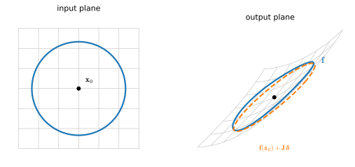
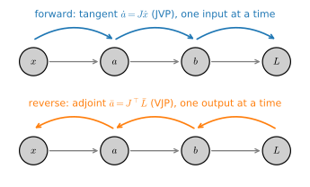
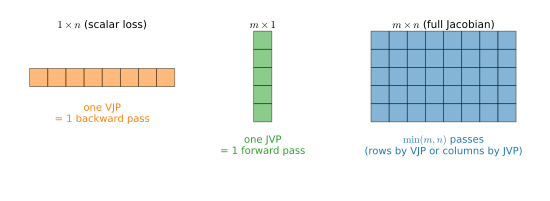
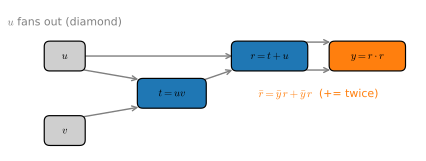
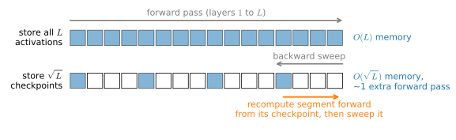

# Matrix Calculus and Automatic Differentiation
:label:`sec_mdl-matrix-calculus-autodiff`

The previous two sections built differentiation up from a single weight
(:numref:`sec_mdl-single_variable_calculus`) to the gradient of a scalar loss over
many weights (:numref:`sec_mdl-multivariable_calculus`). Real network layers,
however, map *vectors to vectors*, and their parameters are *matrices*, so the
natural object of study is the derivative of a vector-valued map, the *Jacobian*,
and the natural question is why `loss.backward()` is cheap. This section answers
both: **backpropagation is reverse-mode automatic differentiation, a sequence of
vector--Jacobian products**, and the choice between forward- and reverse-mode AD
is dictated by the *shape* of the Jacobian you are after. Along the way we
re-derive the handful of matrix identities that actually recur in deep learning,
and we build both flavours of automatic differentiation from scratch in a few
dozen lines of Python, so that the framework's autograd stops being magic.

We use the following imports throughout this section.

```{.python .input #matrix-calculus-autodiff-imports}
#@tab mxnet
from d2l import mxnet as d2l
from mxnet import autograd, npx
from mxnet import np as mnp
import numpy as np
npx.set_np()
```

```{.python .input #matrix-calculus-autodiff-imports}
#@tab pytorch
from d2l import torch as d2l
import numpy as np
import torch
```

```{.python .input #matrix-calculus-autodiff-imports}
#@tab tensorflow
from d2l import tensorflow as d2l
import numpy as np
import tensorflow as tf
```

```{.python .input #matrix-calculus-autodiff-imports}
#@tab jax
from d2l import jax as d2l
import numpy as np
import jax
from jax import numpy as jnp
```

## Derivatives of Vector- and Matrix-Valued Maps
:label:`subsec_mdl-jacobian`

A layer $\mathbf f:\mathbb R^n\to\mathbb R^m$ does not have "a derivative" but a
whole matrix of them. The single object that organizes them, and generalizes both
the slope of :numref:`sec_mdl-single_variable_calculus` and the gradient of
:numref:`sec_mdl-multivariable_calculus` in one stroke, is the *Jacobian*.

### The Jacobian as the Best Linear Approximation

In one variable, the derivative is the slope of the best straight-line fit:
$f(x+\delta)\approx f(x)+f'(x)\,\delta$. The vector-valued generalization keeps
this idea verbatim. We say $\mathbf f$ is *differentiable* at $\mathbf x$ if there
is a matrix $\mathbf J\in\mathbb R^{m\times n}$ such that

$$
\mathbf f(\mathbf x+\boldsymbol\delta)
   = \mathbf f(\mathbf x) + \mathbf J\,\boldsymbol\delta + o(\|\boldsymbol\delta\|),
$$
:eqlabel:`eq_mdl-jacobian-linearization`

i.e. the error of the linear model $\mathbf f(\mathbf x)+\mathbf J\boldsymbol\delta$
shrinks *faster* than $\boldsymbol\delta$ itself as $\boldsymbol\delta\to\mathbf 0$.
That matrix, if it exists, is unique, is called the *Jacobian*
$\mathbf J_{\mathbf f}(\mathbf x)$, and its entries are exactly the partial
derivatives:

$$
[\mathbf J_{\mathbf f}]_{ij} = \frac{\partial f_i}{\partial x_j}.
$$
:eqlabel:`eq_mdl-jacobian-entries`

To see why, feed :eqref:`eq_mdl-jacobian-linearization` the perturbation
$\boldsymbol\delta=t\,\mathbf e_j$ (a small step along axis $j$) and read off
component $i$: dividing by $t$ and letting $t\to0$ leaves precisely
$\partial f_i/\partial x_j$ in the $(i,j)$ slot. So row $i$ of $\mathbf J$ collects
the partials of the $i$-th output, and column $j$ records how *all* outputs respond
to nudging input $j$. The Jacobian *is* the best local linear approximation; the
partial-derivative formula is a consequence, not the definition.

:numref:`fig_mdl-cal-jacobian-ellipse` makes the definition visible. Up close, a
differentiable map *is* a linear map: a small circle of inputs around
$\mathbf x_0$ lands on (very nearly) an ellipse: the image of that circle under
$\mathbf J(\mathbf x_0)$, exactly the picture from
:numref:`sec_mdl-geometry-linear-algebraic-ops` of what a matrix does to the
plane. The leftover bend is the $o(\|\boldsymbol\delta\|)$ remainder, which
vanishes faster than the circle shrinks.


:label:`fig_mdl-cal-jacobian-ellipse`

Two special cases recover everything we have already met. When $m=1$ (a scalar
field $f:\mathbb R^n\to\mathbb R$) the Jacobian is a *single row*, the *row*
gradient $\partial f/\partial\mathbf x = [\partial f/\partial x_1,\ldots,\partial
f/\partial x_n]$, and :eqref:`eq_mdl-jacobian-linearization` is the first-order
expansion $f(\mathbf x+\boldsymbol\delta)\approx f(\mathbf x)+\mathbf J\boldsymbol\delta$
of :numref:`sec_mdl-multivariable_calculus`. And the Jacobian of the *gradient field*
$\nabla f:\mathbb R^n\to\mathbb R^n$ is the Hessian
$\mathbf H=\mathbf J_{\nabla f}$ of :eqref:`eq_mdl-hess_def`: differentiating once
more turns the row gradient into the matrix of second partials, where the entry
$[\mathbf J_{\nabla f}]_{ij}=\partial^2 f/\partial x_j\partial x_i$ matches the
$(i,j)$ Hessian entry because mixed partials commute (Clairaut's theorem, proved
in :numref:`sec_mdl-multivariable_calculus`). One construction, three familiar
objects.

Let us pin this down on a concrete $\mathbb R^2\to\mathbb R^2$ map and check the
linear approximation against a finite difference, the numerical signature of a
correct derivative.

```{.python .input #matrix-calculus-autodiff-jacobian-finite-diff}
def f(v):                                 # f: R^2 -> R^2
    x, y = v
    return np.array([x**2 * y, np.sin(x + y)])

def J(v):                                 # the exact Jacobian, entry by entry
    x, y = v
    return np.array([[2 * x * y, x**2],
                     [np.cos(x + y), np.cos(x + y)]])

x0 = np.array([1.0, 0.5])
delta = np.array([1e-3, -2e-3])
linear = f(x0) + J(x0) @ delta            # first-order prediction
exact = f(x0 + delta)                     # true value
print('linear approx:', linear.round(6))
print('exact        :', exact.round(6))
print('error / |delta|:', np.linalg.norm(exact - linear) / np.linalg.norm(delta))
```

The error is tiny *relative to* $\|\boldsymbol\delta\|$, and shrinking it by a
further factor of ten in $\boldsymbol\delta$ shrinks the error by a factor of a
hundred, the $o(\|\boldsymbol\delta\|)$ signature of :eqref:`eq_mdl-jacobian-linearization`.

### The Chain Rule Is Jacobian Composition

The multivariate chain rule of :numref:`sec_mdl-multivariable_calculus`, a sum
over paths, is in matrix form the *multiplication of Jacobians*.

**Proposition (chain rule).** *If $\mathbf f:\mathbb R^n\to\mathbb R^p$ is
differentiable at $\mathbf x$ and $\mathbf g:\mathbb R^p\to\mathbb R^m$ is
differentiable at $\mathbf f(\mathbf x)$, then $\mathbf g\circ\mathbf f$ is
differentiable at $\mathbf x$ and*

$$
\mathbf J_{\mathbf g\circ\mathbf f}(\mathbf x)
   = \mathbf J_{\mathbf g}\!\bigl(\mathbf f(\mathbf x)\bigr)\,\mathbf J_{\mathbf f}(\mathbf x).
$$
:eqlabel:`eq_mdl-jacobian-chain`

**Proof.** Write $\mathbf y=\mathbf f(\mathbf x)$ and let $\mathbf A=\mathbf
J_{\mathbf f}(\mathbf x)$, $\mathbf B=\mathbf J_{\mathbf g}(\mathbf y)$. Linearity
is the entire argument: substitute the linear model for $\mathbf f$ into the linear
model for $\mathbf g$. By :eqref:`eq_mdl-jacobian-linearization`,
$\mathbf f(\mathbf x+\boldsymbol\delta)=\mathbf y+\mathbf A\boldsymbol\delta
+o(\|\boldsymbol\delta\|)$. Calling that displacement
$\boldsymbol\eta=\mathbf A\boldsymbol\delta+o(\|\boldsymbol\delta\|)$ and feeding it
to $\mathbf g$,

$$
\mathbf g\bigl(\mathbf f(\mathbf x+\boldsymbol\delta)\bigr)
   = \mathbf g(\mathbf y) + \mathbf B\,\boldsymbol\eta + o(\|\boldsymbol\eta\|)
   = \mathbf g(\mathbf y) + \mathbf B\mathbf A\,\boldsymbol\delta + o(\|\boldsymbol\delta\|),
$$

because $\mathbf B$ applied to the $o(\|\boldsymbol\delta\|)$ remainder is again
$o(\|\boldsymbol\delta\|)$, and $\|\boldsymbol\eta\|=O(\|\boldsymbol\delta\|)$
(bounded by a constant multiple of $\|\boldsymbol\delta\|$) folds
$\mathbf g$'s own remainder into $o(\|\boldsymbol\delta\|)$ as well. The
coefficient of $\boldsymbol\delta$ is the best linear map, so by uniqueness it *is*
the Jacobian of the composite: $\mathbf J_{\mathbf g\circ\mathbf f}=\mathbf B\mathbf A$.
$\blacksquare$

The entry-wise chain rule falls out by reading off one entry of $\mathbf B\mathbf A$:
$[\mathbf B\mathbf A]_{ik}=\sum_j \partial g_i/\partial y_j\cdot\partial f_j/\partial x_k$
is exactly the "sum over intermediate variables" of
:numref:`sec_mdl-multivariable_calculus`. Matrix multiplication *is* the
bookkeeping of paths.

Iterating :eqref:`eq_mdl-jacobian-chain` is where deep learning enters. A network
of depth $L$ is a composition
$\mathbf f=\mathbf f_L\circ\cdots\circ\mathbf f_1$, so its end-to-end Jacobian is
one long matrix product,

$$
\mathbf J = \mathbf J_L\,\mathbf J_{L-1}\cdots\mathbf J_1,
$$
:eqlabel:`eq_mdl-jacobian-product`

each factor the local Jacobian of one layer. This is the same product-of-Jacobians
that governs backpropagation through time in recurrent networks
(:numref:`sec_mdl-eigendecompositions`).

Two shapes dominate those factors. A dense layer $\mathbf x\mapsto\mathbf W\mathbf x$ is its own best
linear approximation, so its Jacobian is just $\mathbf W$. An *elementwise*
activation $\boldsymbol\varphi(\mathbf x)=(\varphi(x_1),\ldots,\varphi(x_n))$
couples no pair of coordinates (output $i$ depends only on input $i$), so every
off-diagonal partial vanishes and its Jacobian is *diagonal*,
$\mathbf J_{\boldsymbol\varphi}(\mathbf x)
=\operatorname{diag}\bigl(\varphi'(x_1),\ldots,\varphi'(x_n)\bigr)$.
Multiplying by it is mere elementwise scaling; for ReLU, $\varphi'$ is a mask of
zeros and ones marking the active units. A standard deep network alternates the
two, so :eqref:`eq_mdl-jacobian-product` specializes to
$\mathbf J=\operatorname{diag}(\boldsymbol\varphi_L')\,\mathbf W_L\cdots
\operatorname{diag}(\boldsymbol\varphi_1')\,\mathbf W_1$: dense weight matrices
interleaved with cheap diagonal masks. That diagonal factor is the single most
common Jacobian in a real network, and it is why an activation's backward pass
costs only $O(n)$.

Matrix multiplication is
*associative*, so we may evaluate :eqref:`eq_mdl-jacobian-product` in any order.
Multiplying right-to-left propagates *inputs forward*; multiplying left-to-right
propagates *sensitivities backward*. Those two parenthesizations are precisely
forward-mode and reverse-mode automatic differentiation, and choosing between them
is just choosing the cheaper way to multiply a chain of matrices. (They are the
two *extreme* orderings; finding the cheapest ordering for a general computation
graph (*optimal Jacobian accumulation*) is NP-complete :cite:`Naumann.2008`,
so frameworks ship only the two ends; see :cite:`Baydin.Pearlmutter.Radul.ea.2018`
for a survey.)

### Layout Conventions: Numerator vs Denominator

One bookkeeping decision needs settling before we derive anything. For a scalar
field $f:\mathbb R^n\to\mathbb R$, do we write the derivative as a *row* (matching the Jacobian
:eqref:`eq_mdl-jacobian-entries`) or as a *column* (matching the input vector
$\mathbf x$)? Both are in use, and they are *transposes of each other*:

* **Numerator (Jacobian) layout.** The derivative has the shape of the
  *numerator*: $\partial\mathbf y/\partial\mathbf x$ is $m\times n$, so the scalar
  case is a row. This makes the chain rule :eqref:`eq_mdl-jacobian-chain` read
  left-to-right with no transposes, which is why it is the convention of choice for
  the Jacobian theory above and for MIT's *Matrix Calculus for Machine Learning
  and Beyond* course (18.S096, Edelman and Johnson).
* **Denominator (gradient) layout.** The derivative has the shape of the
  *denominator*: $\partial f/\partial\mathbf x$ is a *column* matching $\mathbf x$.
  This is the statistician's $\nabla_{\mathbf x} f$, the thing you subtract in
  gradient descent, and the convention of the derivations below.

Switching layouts simply transposes the result, so the gradient column and the
Jacobian row of a scalar field are related by

$$
\nabla_{\mathbf x} f = \Bigl(\frac{\partial f}{\partial\mathbf x}\Bigr)^{\!\top}.
$$
:eqlabel:`eq_mdl-grad-is-jacobian-transpose`

**This book's convention.** We use **numerator layout for Jacobians** of genuine
vector-valued maps (the chain rule then composes without transposes) and
**denominator layout for gradients**, writing $\nabla_{\mathbf x} f$ for the column you feed an optimizer.
Whenever the two could be confused we make the shape explicit. With that settled,
the identities in the next section are gradients, hence columns; if you ever land
on an expression whose shape does not match its denominator, you have a missing
transpose; use :eqref:`eq_mdl-grad-is-jacobian-transpose` to fix it. The Matrix
Cookbook :cite:`Petersen.Pedersen.ea.2008` tabulates hundreds of such identities;
the point of the next section is that you need to *memorize* almost none of them.

## A Few Key Identities, Derived Not Tabulated
:label:`subsec_mdl-matrix-identities`

A reference table of matrix-derivative identities is long and forgettable. In
practice only a handful recur in deep learning, and each one yields to the same
two-step recipe of Parr and Howard's primer :cite:`Parr.Howard.2018`:
*differentiate one component with the ordinary scalar rules, then reassemble the
components into a matrix expression.* A faster cross-check, due to the same source,
is the **scalar-collapse heuristic**: a correct matrix identity must reduce to the
familiar single-variable result when every matrix is $1\times1$ (where products are
scalar products, sums are sums, and transposes do nothing), so you can often *guess*
the matrix form from the scalar one and fix the shapes by inserting transposes.
We derive four identities this way; all are gradients, hence columns (denominator
layout, :eqref:`eq_mdl-grad-is-jacobian-transpose`).

**The linear form $\nabla_{\mathbf x}\,\mathbf a^\top\mathbf x = \mathbf a$.** With
$f(\mathbf x)=\mathbf a^\top\mathbf x=\sum_i a_i x_i$, the $k$-th partial keeps only
the $i=k$ term, so $\partial f/\partial x_k = a_k$; stacking these gives
$\nabla_{\mathbf x} f=\mathbf a$. The scalar shadow is $\frac{d}{dx}(ax)=a$, exactly
the matrix answer with the transpose doing nothing. The one thing to
keep straight is *which* variable we differentiate by: it is $x_k$, not $a_k$.

**The quadratic form $\nabla_{\mathbf x}\,\mathbf x^\top\mathbf A\mathbf x =
(\mathbf A+\mathbf A^\top)\mathbf x$.** Write the form in Einstein notation
(:numref:`sec_mdl-geometry-linear-algebraic-ops`) as
$\mathbf x^\top\mathbf A\mathbf x = x_i a_{ij} x_j$. The product rule on
$\partial/\partial x_k$ hits both $x$'s,

$$
\frac{\partial}{\partial x_k}\bigl(x_i a_{ij} x_j\bigr)
   = \delta_{ik}\,a_{ij}x_j + x_i a_{ij}\,\delta_{jk}
   = a_{kj}x_j + x_i a_{ik}
   = (a_{ki}+a_{ik})\,x_i,
$$

where the last step uses the fact that a summation (dummy) index can be renamed
freely: the first term is a sum over $j$, the second a sum over $i$, so renaming
$j\to i$ in the first term ($a_{kj}x_j = a_{ki}x_i$) puts both sums over the same
index $i$ and lets them combine. The bracket $a_{ki}+a_{ik}$ is the
$(k,i)$ entry of $\mathbf A+\mathbf A^\top$, so the $k$-th partial is the $k$-th
entry of $(\mathbf A+\mathbf A^\top)\mathbf x$, giving
$\nabla_{\mathbf x}\,\mathbf x^\top\mathbf A\mathbf x=(\mathbf A+\mathbf A^\top)\mathbf x$.
The scalar collapse is $\frac{d}{dx}(a x^2)=2ax=(a+a)x$; the matrix answer is the
same with $\mathbf A^\top$ standing in for the "other copy" of $a$. For *symmetric*
$\mathbf A$ this simplifies to the much-used $2\mathbf A\mathbf x$.

Derive, then verify: both identities should survive the same autograd audit we
will shortly apply to softmax, at a randomly drawn point.

```{.python .input #mdl-matrix-calculus-autodiff-a-few-key-identities-derived-not-tabulated-1}
#@tab pytorch
# Autograd audit of the two identities at a random point
torch.manual_seed(0)
a, A = torch.randn(3), torch.randn(3, 3)
x = torch.randn(3, requires_grad=True)
(a @ x).backward()
g = torch.autograd.grad(x @ A @ x, x)[0]
print('grad a^T x   equals a        :', torch.allclose(x.grad, a))
print('grad x^T A x equals (A+A^T)x :', torch.allclose(g, (A + A.T) @ x))
```

```{.python .input #mdl-matrix-calculus-autodiff-a-few-key-identities-derived-not-tabulated-1}
#@tab mxnet
# Autograd audit of the two identities at a random point
a, A = mnp.random.normal(size=3), mnp.random.normal(size=(3, 3))
x = mnp.random.normal(size=3)
x.attach_grad()
with autograd.record():
    lin = mnp.dot(a, x)
lin.backward()
ok1 = np.allclose(x.grad.asnumpy(), a.asnumpy())
with autograd.record():
    quad = mnp.dot(x, mnp.dot(A, x))
quad.backward()
ok2 = np.allclose(x.grad.asnumpy(), mnp.dot(A + A.T, x).asnumpy())
print('grad a^T x   equals a        :', ok1)
print('grad x^T A x equals (A+A^T)x :', ok2)
```

```{.python .input #mdl-matrix-calculus-autodiff-a-few-key-identities-derived-not-tabulated-1}
#@tab tensorflow
# Autograd audit of the two identities at a random point
tf.random.set_seed(0)
a, A = tf.random.normal([3]), tf.random.normal([3, 3])
x = tf.Variable(tf.random.normal([3]))
with tf.GradientTape(persistent=True) as tape:
    lin = tf.tensordot(a, x, 1)
    quad = tf.tensordot(x, tf.linalg.matvec(A, x), 1)
sym = tf.linalg.matvec(A + tf.transpose(A), x)
print('grad a^T x   equals a        :',
      bool(np.allclose(tape.gradient(lin, x), a)))
print('grad x^T A x equals (A+A^T)x :',
      bool(np.allclose(tape.gradient(quad, x), sym)))
del tape
```

```{.python .input #mdl-matrix-calculus-autodiff-a-few-key-identities-derived-not-tabulated-1}
#@tab jax
# Autograd audit of the two identities at a random point
k1, k2, k3 = jax.random.split(jax.random.PRNGKey(0), 3)
a, A = jax.random.normal(k1, (3,)), jax.random.normal(k2, (3, 3))
x = jax.random.normal(k3, (3,))
print('grad a^T x   equals a        :',
      bool(jnp.allclose(jax.grad(lambda x: a @ x)(x), a)))
print('grad x^T A x equals (A+A^T)x :',
      bool(jnp.allclose(jax.grad(lambda x: x @ A @ x)(x), (A + A.T) @ x)))
```

**The least-squares gradient $\nabla_{\mathbf W}\|\mathbf W\mathbf x-\mathbf y\|^2$.**
Let $\mathbf r=\mathbf W\mathbf x-\mathbf y$ be the residual, so the loss is
$\mathbf r^\top\mathbf r=\sum_i r_i^2$ with $r_i=\sum_j W_{ij}x_j-y_i$. Then

$$
\frac{\partial}{\partial W_{ab}}\sum_i r_i^2
   = 2\sum_i r_i\,\frac{\partial r_i}{\partial W_{ab}}
   = 2 r_a x_b = 2\,[\mathbf r\mathbf x^\top]_{ab},
$$

since $\partial r_i/\partial W_{ab}=\delta_{ia}x_b$. Assembling the $(a,b)$ entries
into a matrix the shape of $\mathbf W$,

$$
\nabla_{\mathbf W}\|\mathbf W\mathbf x-\mathbf y\|^2 = 2\,(\mathbf W\mathbf x-\mathbf y)\,\mathbf x^\top,
$$
:eqlabel:`eq_mdl-lstsq-grad`

a rank-one *outer product* of the residual with the input; this is the gradient a
single linear layer hands back during backpropagation. The companion gradient with
respect to the *input*, $\nabla_{\mathbf x}\|\mathbf W\mathbf x-\mathbf y\|^2
=2\mathbf W^\top(\mathbf W\mathbf x-\mathbf y)$, follows identically; note the
$\mathbf W^\top$. The same pattern, a residual hit by the transpose of whatever
multiplies the variable, persists when everything becomes a matrix. For the
factorization loss $\|\mathbf X-\mathbf U\mathbf V\|_F^2=\sum_{ij}R_{ij}^2$ with
residual $\mathbf R=\mathbf X-\mathbf U\mathbf V$, one entry of $\mathbf V$
appears in $R_{ij}$ through $\partial R_{ij}/\partial V_{ab}
=-U_{ia}\,\delta_{jb}$, so

$$
\frac{\partial}{\partial V_{ab}}\sum_{ij}R_{ij}^2
   = -2\sum_{i} U_{ia}R_{ib}
   = -2\,[\mathbf U^\top\mathbf R]_{ab},
\qquad\text{i.e.}\qquad
\nabla_{\mathbf V}\|\mathbf X-\mathbf U\mathbf V\|_F^2
   = -2\,\mathbf U^\top(\mathbf X-\mathbf U\mathbf V),
$$

exactly the $\mathbf W^\top$-shaped answer the scalar-collapse heuristic predicts
from $\frac{d}{dv}(x-uv)^2=-2u(x-uv)$.

**The softmax--cross-entropy Jacobian.** The derivative a classifier evaluates
most often also has the simplest form. Let $\mathbf p=\operatorname{softmax}(\mathbf z)$,
$p_i=e^{z_i}/\sum_k e^{z_k}$. Quotient rule on $\partial p_i/\partial z_j$ gives the
two cases $p_i(1-p_i)$ when $i=j$ and $-p_i p_j$ when $i\neq j$, which combine into

$$
\frac{\partial p_i}{\partial z_j} = p_i(\delta_{ij}-p_j),
\qquad
\mathbf J_{\operatorname{softmax}} = \operatorname{diag}(\mathbf p) - \mathbf p\mathbf p^\top.
$$
:eqlabel:`eq_mdl-softmax-jacobian`

Now compose with the cross-entropy loss $\ell=-\sum_i y_i\log p_i$ against a
one-hot target $\mathbf y$. The chain rule :eqref:`eq_mdl-jacobian-chain` multiplies
the loss's row gradient $\partial\ell/\partial\mathbf p$ by
:eqref:`eq_mdl-softmax-jacobian`, and the algebra collapses:

$$
\frac{\partial\ell}{\partial z_j}
   = -\sum_i \frac{y_i}{p_i}\,p_i(\delta_{ij}-p_j)
   = -y_j + p_j\sum_i y_i
   = p_j - y_j,
$$

using $\sum_i y_i=1$. The gradient of softmax--cross-entropy with respect to the
*logits* (the raw scores $\mathbf z$ that softmax turns into probabilities) is
just $\mathbf p-\mathbf y$: predicted probability minus truth. The softmax
Jacobian cancels against the cross-entropy gradient. Libraries also fuse the two
into a single primitive for a numerical reason: computing $\log p_i$ from an
already-evaluated softmax takes the logarithm of a value that may have underflowed
to zero, whereas the fused primitive computes
$\log p_i = z_i - \log\sum_k e^{z_k}$ directly through a stable log-sum-exp. Let
us confirm both :eqref:`eq_mdl-softmax-jacobian` and the cancellation against a
framework's autograd.

```{.python .input #matrix-calculus-autodiff-softmax-jacobian}
#@tab pytorch
z = torch.tensor([1.0, -0.5, 2.0], requires_grad=True)
p = torch.softmax(z, dim=0)
J = torch.diag(p) - torch.outer(p, p)          # our formula
J_ad = torch.autograd.functional.jacobian(lambda z: torch.softmax(z, 0), z)
y = torch.tensor([0.0, 1.0, 0.0])              # one-hot target (class 1)
loss = -(y * torch.log(torch.softmax(z, 0))).sum()
loss.backward()
print('softmax Jacobian matches autograd:', torch.allclose(J, J_ad, atol=1e-6))
print('d loss / d z :', z.grad.detach().numpy().round(6))
print('p - y        :', (p.detach() - y).numpy().round(6))
```

```{.python .input #matrix-calculus-autodiff-softmax-jacobian}
#@tab mxnet
z = mnp.array([1.0, -0.5, 2.0])
z.attach_grad()
y = mnp.array([0.0, 1.0, 0.0])                 # one-hot target (class 1)
rows = []
for i in range(3):                             # one VJP per output: row i of J
    with autograd.record():
        p = npx.softmax(z)
    p.backward(mnp.eye(3)[i])                  # seed e_i; z.grad is row i
    rows.append(z.grad.asnumpy().copy())
J_ad = np.stack(rows)                          # framework-autograd Jacobian
p = npx.softmax(z).asnumpy()
J = np.diag(p) - np.outer(p, p)                # our formula
with autograd.record():
    loss = -(y * mnp.log(npx.softmax(z))).sum()
loss.backward()
print('softmax Jacobian matches autograd:', np.allclose(J, J_ad, atol=1e-6))
print('d loss / d z :', z.grad.asnumpy().round(6))
print('p - y        :', (p - y.asnumpy()).round(6))
```

```{.python .input #matrix-calculus-autodiff-softmax-jacobian}
#@tab tensorflow
z = tf.Variable([1.0, -0.5, 2.0])
y = tf.constant([0.0, 1.0, 0.0])               # one-hot target (class 1)
with tf.GradientTape(persistent=True) as tape:
    p = tf.nn.softmax(z)
    loss = -tf.reduce_sum(y * tf.math.log(p))
J_ad = tape.jacobian(p, z)                     # framework-autograd Jacobian
grad = tape.gradient(loss, z)
del tape
J = tf.linalg.diag(p) - tf.tensordot(p, p, axes=0)   # our formula
print('softmax Jacobian matches autograd:', bool(np.allclose(J, J_ad, atol=1e-6)))
print('d loss / d z :', grad.numpy().round(6))
print('p - y        :', (p - y).numpy().round(6))
```

```{.python .input #matrix-calculus-autodiff-softmax-jacobian}
#@tab jax
z = jnp.array([1.0, -0.5, 2.0])
p = jax.nn.softmax(z)
J = jnp.diag(p) - jnp.outer(p, p)              # our formula
J_ad = jax.jacobian(jax.nn.softmax)(z)
y = jnp.array([0.0, 1.0, 0.0])                 # one-hot target (class 1)
loss = lambda z: -(y * jnp.log(jax.nn.softmax(z))).sum()
print('softmax Jacobian matches autograd:', bool(jnp.allclose(J, J_ad, atol=1e-6)))
print('d loss / d z :', np.asarray(jax.grad(loss)(z)).round(6))
print('p - y        :', np.asarray(p - y).round(6))
```

The logit gradient lands exactly on $\mathbf p-\mathbf y$, no matter how the
intermediate Jacobian looks. Four identities, one method: differentiate a single
component, then read the matrix back off the indices, sanity-checking against the
scalar collapse.

## Forward-Mode AD and Dual Numbers
:label:`subsec_mdl-forward-mode`

We now stop differentiating by hand. Automatic differentiation evaluates a function
*and* its derivative in one sweep, to full numerical precision, by carrying
derivative information alongside every value. It is neither symbolic differentiation
(which manipulates formulas and explodes in size, as the swamp of repeated terms in
:numref:`sec_mdl-multivariable_calculus` showed) nor numerical differentiation
(finite differences, which trade off truncation against round-off error). It is
the chain rule, applied mechanically to the *program* that computes the
function :cite:`Baydin.Pearlmutter.Radul.ea.2018`. *Forward mode* is the simplest
incarnation, and its algebra is that of *dual numbers*.

### Dual Numbers: an Algebra That Carries Derivatives

Define a *dual number* $a+b\,\varepsilon$ by analogy with the complex numbers, but
with a new symbol $\varepsilon$ satisfying

$$
\varepsilon^2 = 0, \qquad \varepsilon\neq0.
$$
:eqlabel:`eq_mdl-dual-rule`

Think of $a$ as a value and $b$ as "the derivative riding along". The rule
$\varepsilon^2=0$ is the *exact* algebraic encoding of "discard second-order terms",
the very move we used to derive every differentiation rule in
:numref:`sec_mdl-single_variable_calculus`. Addition is componentwise, and
multiplication, dropping the $\varepsilon^2$ term, is

$$
(a+b\varepsilon)(c+d\varepsilon) = ac + (ad+bc)\,\varepsilon.
$$
:eqlabel:`eq_mdl-dual-mul`

Stare at the $\varepsilon$ coefficient: $ad+bc$ is the *product rule*. This is no
coincidence.

**Proposition (dual numbers compute derivatives).** *For $f$ expressed as a
composition of the primitives below (constants, the identity, sums, products, and
elementary functions such as $\sin$ and $\exp$), each differentiable at the point
where it is evaluated, evaluating that composition on the dual number
$x+1\cdot\varepsilon$ yields*

$$
f(x + \varepsilon) = f(x) + f'(x)\,\varepsilon.
$$
:eqlabel:`eq_mdl-dual-eval`

**Proof.** One point of order first: for an elementary primitive such as
$\sin$ or $\exp$, differentiable at the point where it is evaluated, we *define*
its action on a dual argument by

$$
f(a + b\varepsilon) := f(a) + f'(a)\,b\,\varepsilon,
$$

which is exactly what the class methods below implement, so
:eqref:`eq_mdl-dual-eval` for a single primitive holds *by definition*, not by a
Taylor expansion evaluated on a nilpotent argument. (The definition is not
arbitrary: for polynomials the algebra alone forces it, since $\varepsilon^2=0$
kills every higher-order term, and the elementary functions adopt the same rule.) The
substance of the proposition is that the property survives *assembly*. It holds
for constants and the identity ($x+\varepsilon$ itself), and it is closed under
the operations a program is built from. For a sum, $\varepsilon$-coefficients
add, matching $(f+g)'=f'+g'$. For a product, :eqref:`eq_mdl-dual-mul` gives
coefficient $f'(x)g(x)+f(x)g'(x)$, the product rule. For a composition,
substitute $g(x)+g'(x)\varepsilon$ into a primitive $f$: the definition above,
read with $a = g(x)$ and $b = g'(x)$, returns
$f(g(x))+f'(g(x))g'(x)\,\varepsilon$: the chain rule, and consistent with the
sum and product cases. Since $f$ is assembled from these primitives,
induction on its expression gives :eqref:`eq_mdl-dual-eval`. $\blacksquare$

So differentiation is *free*: run the ordinary computation in the dual-number
algebra, set the input's $\varepsilon$-part to $1$ (the "seed"), and the output's
$\varepsilon$-part is the derivative. No formula for $f'$ is ever written down. The
implementation is a few lines of operator overloading.

```{.python .input #matrix-calculus-autodiff-dual-numbers}
class Dual:
    """A dual number a + b*eps with eps^2 = 0; b carries the derivative."""
    def __init__(self, a, b=0.0):
        self.a, self.b = a, b                       # value, derivative
    def __add__(self, o):
        o = o if isinstance(o, Dual) else Dual(o)
        return Dual(self.a + o.a, self.b + o.b)
    __radd__ = __add__
    def __mul__(self, o):
        o = o if isinstance(o, Dual) else Dual(o)
        return Dual(self.a * o.a, self.a * o.b + self.b * o.a)   # product rule
    __rmul__ = __mul__
    def sin(self):
        return Dual(np.sin(self.a), np.cos(self.a) * self.b)     # chain rule
    def exp(self):
        e = np.exp(self.a)
        return Dual(e, e * self.b)
    def __repr__(self):
        return f'{self.a:.6f} + {self.b:.6f} eps'
```

To differentiate $f(x)=\sin(x^2)+e^x$ at a point, we evaluate it on
$x+1\cdot\varepsilon$ and read the two parts of the result. The value should match
$f$ and the $\varepsilon$-part should match $f'(x)=2x\cos(x^2)+e^x$.

```{.python .input #matrix-calculus-autodiff-dual-eval}
def f(x):
    return (x * x).sin() + x.exp()                  # sin(x^2) + e^x, in dual algebra

x0 = 1.3
out = f(Dual(x0, 1.0))                              # seed the derivative with 1
exact = 2 * x0 * np.cos(x0**2) + np.exp(x0)         # f'(x) by hand
print('dual result :', out)
print('value f(x)  :', np.sin(x0**2) + np.exp(x0))
print("derivative  : dual %.6f  vs  exact %.6f" % (out.b, exact))
```

Value and derivative emerge from a single evaluation. The same machinery handles a
vector-valued $\mathbf f:\mathbb R^n\to\mathbb R^m$ once we let the dual part be a
*vector* tangent: seeding the inputs with a direction $\mathbf v$ and overloading the
arithmetic exactly as above propagates the **Jacobian--vector product**
$\mathbf J\mathbf v$ (a JVP) in the $\varepsilon$-slot, in a single forward pass and
*without ever forming $\mathbf J$*. Choosing the seed $\mathbf v=\mathbf e_j$ then
reads off the $j$-th *column* of the Jacobian, so $n$ such passes assemble the whole
matrix. Let us close the loop on the earlier $\mathbb R^2\to\mathbb R^2$ map
$\mathbf f(x,y)=(x^2y,\ \sin(x+y))$: we run it through the dual algebra with a
vector tangent, seed $\mathbf e_1$ then $\mathbf e_2$ to recover the two Jacobian
columns, and check against the analytic $\mathbf J(\mathbf x_0)$.

```{.python .input #matrix-calculus-autodiff-forward-jvp}
class VDual:
    """Dual number a + b*eps with a *vector* tangent b, so one pass gives J v."""
    def __init__(self, a, b=0.0):
        self.a, self.b = a, np.asarray(b, dtype=float)           # value, tangent
    def __add__(self, o):
        o = o if isinstance(o, VDual) else VDual(o)
        return VDual(self.a + o.a, self.b + o.b)
    __radd__ = __add__
    def __mul__(self, o):
        o = o if isinstance(o, VDual) else VDual(o)
        return VDual(self.a * o.a, self.a * o.b + self.b * o.a)   # product rule
    __rmul__ = __mul__
    def sin(self):
        return VDual(np.sin(self.a), np.cos(self.a) * self.b)     # chain rule

def f_dual(x, y):
    return [(x * x) * y, (x + y).sin()]            # [x^2 y, sin(x+y)] in dual algebra

x0 = np.array([1.0, 0.5])
cols = []
for seed in (np.array([1., 0.]), np.array([0., 1.])):            # e1, then e2
    x = VDual(x0[0], seed[0]); y = VDual(x0[1], seed[1])
    out = f_dual(x, y)                             # one forward pass per seed
    cols.append(np.array([out[0].b, out[1].b]))    # tangent = J @ seed = a column
J_fwd = np.column_stack(cols)                      # columns J e1, J e2 assemble J

x, y = x0                                          # analytic Jacobian, for the check
J_exact = np.array([[2 * x * y, x**2],
                    [np.cos(x + y), np.cos(x + y)]])
print('forward-mode J:\n', J_fwd.round(6))
print('JVP matches analytic Jacobian:', np.allclose(J_fwd, J_exact))
```

Each forward pass produced one column of $\mathbf J$ in its $\varepsilon$-slot, with
no Jacobian ever materialized; the reverse-mode tape below is verified the same way,
against a framework's autograd. So forward mode is cheap for *tall* Jacobians (many
outputs, few inputs, $m\gg n$) and expensive when $n$ is large, exactly the wrong
regime for a deep network, whose loss has a single scalar output and millions of
inputs. For that we need the other parenthesization.

## Reverse-Mode AD, the Tape, and Backprop
:label:`subsec_mdl-reverse-mode`

Recall the associativity observation from :eqref:`eq_mdl-jacobian-product`: the
chain of Jacobians may be multiplied in any order. Forward mode multiplies
*right-to-left*, building up $\mathbf J\mathbf v$ one input direction at a time.
*Reverse mode* multiplies *left-to-right*: it computes the **vector--Jacobian
product** $\mathbf u^\top\mathbf J$ (a VJP), one *output* direction at a time.

### Why Reverse Mode Is the Right Cost Model

The asymmetry is decisive for deep learning. Consider a scalar loss $L:\mathbb
R^n\to\mathbb R$ with $n$ parameters. Its Jacobian is a single row ($m=1$), so
seeding the reverse pass with $\mathbf u=1$ at the output computes the *entire*
gradient $\nabla L$ in **one** backward sweep. Forward mode, by contrast, would need
$n$ passes, one per parameter direction, to assemble the same row. The cost rule:

* **Reverse mode** costs one pass per *output*: cheap for *wide* Jacobians
  ($m\ll n$). A scalar loss is the extreme wide case, so its full gradient costs a
  small constant multiple of one forward evaluation (typically $2$--$4\times$ in
  practice; for arithmetic circuits, programs built from $+,-,\times,\div$, the
  Baur--Strassen theorem pins the multiple at no more than $5$
  :cite:`Baur.Strassen.1983`), *independent of the number of inputs $n$*.
* **Forward mode** costs one pass per *input*: cheap for *tall* Jacobians
  ($m\gg n$).

:numref:`fig_mdl-cal-jacobian-shapes` turns the rule into shapes: what a pass
buys is one *row* (reverse) or one *column* (forward), so the cheap mode is the
one whose unit matches your Jacobian's short side.


:label:`fig_mdl-cal-jacobian-shapes`

A network has millions of parameters and one loss, so reverse mode wins by a factor
of the parameter count: millions. We will count the passes with our own two
engines once both are built. The gradient of a scalar at a small constant multiple
of one function evaluation, regardless of parameter count, is the *cheap-gradient
principle* :cite:`Baur.Strassen.1983,Griewank.Walther.2008`; it is what makes
training deep networks computationally feasible. **This is backpropagation**
:cite:`Linnainmaa.1970,Speelpenning.1980,Rumelhart.Hinton.Williams.ea.1988`: the
algorithm of :numref:`sec_mdl-multivariable_calculus`, where we insisted on
"keeping $\partial f$ in the numerator", is reverse-mode AD, and the rule is now
rigorous.

### The Tape: Record Forward, Replay Backward

Reverse mode cannot be done by a value-carrying algebra like dual numbers, because
the multiplications run *opposite* to the program's execution: we need each
operation's local Jacobian *after* the forward pass has finished. So we *record*
the computation as it runs, and then walk the record backward. The record is
called the *Wengert list* or *tape*, after the forward-mode paper
:cite:`Wengert.1964` that introduced the list of elementary operations; running
it *backward* is the later, reverse-mode idea :cite:`Linnainmaa.1970`. The forward pass builds a directed acyclic graph of
elementary operations and stashes the values needed for each local derivative; the
backward pass seeds the output *adjoint* (the running $\partial L/\partial\cdot$) and
pushes it through each recorded operation's VJP, accumulating contributions where a
value feeds several consumers. :numref:`fig_mdl-cal-fwd-vs-rev` contrasts the two
sweeps.


:label:`fig_mdl-cal-fwd-vs-rev`

A tiny tape makes this concrete. We record each operation as a node holding its
value and a *backward* closure that, given the adjoint of the node's output,
increments the adjoints of its inputs by the appropriate VJP. Replaying the tape in
reverse and seeding the final adjoint with $1$ leaves $\partial L/\partial\cdot$ in
every input's adjoint slot.

```{.python .input #matrix-calculus-autodiff-tape}
class Var:
    """A scalar node on the autodiff tape; .grad accumulates the adjoint."""
    def __init__(self, value, parents=(), backward=lambda g: None):
        self.value = value
        self.grad = 0.0
        self._parents = parents                     # nodes this one depends on
        self._backward = backward                   # pushes adjoint to parents
    def __add__(self, o):
        o = o if isinstance(o, Var) else Var(o)
        out = Var(self.value + o.value, (self, o))
        def back(g):                                # d(a+b) = 1*g to each parent
            self.grad += g; o.grad += g
        out._backward = back
        return out
    __radd__ = __add__
    def __mul__(self, o):
        o = o if isinstance(o, Var) else Var(o)
        out = Var(self.value * o.value, (self, o))
        def back(g):                                # product rule, reversed
            self.grad += o.value * g; o.grad += self.value * g
        out._backward = back
        return out
    __rmul__ = __mul__

def backprop(node):
    """Topologically sort the tape and replay it backward from `node`."""
    order, seen = [], set()
    def visit(v):
        if v not in seen:
            seen.add(v)
            for p in v._parents:
                visit(p)
            order.append(v)
    visit(node)
    node.grad = 1.0                                 # seed the output adjoint
    for v in reversed(order):
        v._backward(v.grad)
```

We differentiate an expression with the same diamond-reuse structure that made
the backward sweep of :numref:`sec_mdl-multivariable_calculus` efficient, and
check the tape's gradients against the framework's autograd. Take $g(u,v)=r^2$ with the shared
intermediate $r=uv+u$ (in code, `r = u*v + u` followed by `y = r*r`). One forward
pass records the tape, one backward pass yields both partials. Its graph,
:numref:`fig_mdl-cal-tape-dag`, is not a chain but a *diamond*: $u$ feeds both the
product $uv$ and the sum $r$, and $r$ feeds *both* arguments of the final
multiplication. This reuse is exactly why the backward pass must visit nodes in
reverse topological order (each node before the nodes it depends on, so that its
adjoint is complete before it is pushed onward) and *accumulate* adjoints with
`+=` rather than
overwrite them: when the node $y=r\cdot r$ runs its backward step, it pushes the
contribution $\bar y\,r$ into `r.grad` *twice*, once per argument, so the adjoint
$\bar r = 2r\bar y$ arrives as a sum: a node's adjoint is the *sum* of the
contributions along every outgoing edge, the chain rule's "sum over paths" made
operational.


:label:`fig_mdl-cal-tape-dag`

```{.python .input #matrix-calculus-autodiff-tape-check}
#@tab pytorch
u, v = Var(2.0), Var(-3.0)
r = u * v + u                                       # shared intermediate
y = r * r                                           # r feeds both arguments
backprop(y)
ut = torch.tensor(2.0, requires_grad=True)
vt = torch.tensor(-3.0, requires_grad=True)
rt = ut * vt + ut
(rt * rt).backward()                                # framework autograd
print('our tape   : dy/du = %.4f  dy/dv = %.4f' % (u.grad, v.grad))
print('torch      : dy/du = %.4f  dy/dv = %.4f' % (ut.grad, vt.grad))
```

```{.python .input #matrix-calculus-autodiff-tape-check}
#@tab mxnet
u, v = Var(2.0), Var(-3.0)
r = u * v + u                                       # shared intermediate
y = r * r                                           # r feeds both arguments
backprop(y)
um, vm = mnp.array(2.0), mnp.array(-3.0)
um.attach_grad(); vm.attach_grad()
with autograd.record():                             # framework autograd
    rm = um * vm + um
    ym = rm * rm
ym.backward()
print('our tape   : dy/du = %.4f  dy/dv = %.4f' % (u.grad, v.grad))
print('mxnet      : dy/du = %.4f  dy/dv = %.4f' % (float(um.grad), float(vm.grad)))
```

```{.python .input #matrix-calculus-autodiff-tape-check}
#@tab tensorflow
u, v = Var(2.0), Var(-3.0)
r = u * v + u                                       # shared intermediate
y = r * r                                           # r feeds both arguments
backprop(y)
ut, vt = tf.Variable(2.0), tf.Variable(-3.0)
with tf.GradientTape() as tape:                     # framework autograd
    rt = ut * vt + ut
    yt = rt * rt
du, dv = tape.gradient(yt, [ut, vt])
print('our tape   : dy/du = %.4f  dy/dv = %.4f' % (u.grad, v.grad))
print('tensorflow : dy/du = %.4f  dy/dv = %.4f' % (float(du), float(dv)))
```

```{.python .input #matrix-calculus-autodiff-tape-check}
#@tab jax
u, v = Var(2.0), Var(-3.0)
r = u * v + u                                       # shared intermediate
y = r * r                                           # r feeds both arguments
backprop(y)
def g(u, v):
    r = u * v + u
    return r * r
du, dv = jax.grad(g, argnums=(0, 1))(2.0, -3.0)     # framework autograd
print('our tape   : dy/du = %.4f  dy/dv = %.4f' % (u.grad, v.grad))
print('jax        : dy/du = %.4f  dy/dv = %.4f' % (float(du), float(dv)))
```

Our thirty-line tape reproduces the framework's gradients exactly. The real systems
generalize it in three ways that do not change the principle: the nodes hold
*tensors* rather than scalars, so each `_backward` is a VJP (a matrix operation, e.g.
the $\mathbf x^\top$ in :eqref:`eq_mdl-lstsq-grad`) rather than a scalar multiply;
the primitive set is large (every differentiable op ships a VJP rule); and the graph
is built either eagerly (PyTorch's dynamic tape) or by tracing (JAX, TensorFlow).
But the skeleton (record forward, seed the output adjoint, replay backward
accumulating VJPs) is exactly what you wrote above and exactly what
`loss.backward()` does.

### The Cost Asymmetry, Counted

With both engines on the table, the cost claim that opened this half of the
section stops being an assertion. Take a scalar function of $n=200$ inputs,
built from nothing but the additions and multiplications both engines support.
Forward mode must run one pass per input direction to assemble the gradient (a
$1\times n$ Jacobian, column by column); the tape runs *one* backward sweep.

```{.python .input #mdl-matrix-calculus-autodiff-the-cost-asymmetry-measured}
n = 200
def f(xs):                       # f: R^n -> R, from + and * alone
    total = 0.0
    for x in xs:
        total = total + x * x
    return total * total         # (sum of squares)^2

xs0 = [0.01 * (j + 1) for j in range(n)]
passes, grad_fwd = 0, []
for j in range(n):               # forward mode: one pass per input direction
    duals = [Dual(x, 1.0 if k == j else 0.0) for k, x in enumerate(xs0)]
    grad_fwd.append(f(duals).b)
    passes += 1

xs = [Var(x) for x in xs0]       # reverse mode: one recorded forward pass...
backprop(f(xs))                  # ...and one backward sweep for all n partials
grad_rev = [x.grad for x in xs]

gap = max(abs(a - b) for a, b in zip(grad_fwd, grad_rev))
print(f'forward mode : {passes} passes (one per input)')
print(f'reverse mode : 1 backward sweep for all {n} partials')
print(f'max |forward - reverse| over the gradient: {gap:.1e}')
```

The two gradients agree to machine precision, but the pass counts differ by a
factor of $n$: $200$ forward passes against one backward sweep, which is the
loop structure itself. Each forward-mode pass costs about one evaluation of $f$,
and the tape's recorded forward pass plus backward sweep costs a small constant
multiple of one, so the *work* ratio is $\Theta(n)$, i.e. proportional to $n$ up
to a constant factor. Nothing about the ratio is special to $200$: replace it by
the $10^8$ parameters of a modern network and this factor is the "factor of
millions" claimed above, which is why no framework computes training gradients
in forward mode.

### Never Form the Jacobian

The two engines above expose exactly two products, the forward-mode JVP
$\mathbf J\mathbf v$ and the reverse-mode VJP $\mathbf u^\top\mathbf J$, and every
quantity a training loop needs is built by *composing* those, never by materializing
$\mathbf J$. This is deliberate. Writing down a dense $m\times n$ Jacobian costs
$\min(m,n)$ passes (one per column via JVP, or one per row via VJP) plus $\Theta(mn)$
storage, while the thing you actually want (a gradient $\mathbf u^\top\mathbf J$, a
directional derivative $\mathbf J\mathbf v$, a sequence of these through a deep
composition) costs a single pass and never holds more than a vector. Autograd
systems therefore expose the JVP and the VJP as their primitives and treat the
full Jacobian as a rare, opt-in convenience. Even that convenience is built from
the same parts: a Jacobian, when one is truly needed, is assembled by batching
VJPs over the $m$ output directions (rows) or JVPs over the $n$ input directions
(columns), and a Hessian by the forward-over-reverse composition of the next
subsection, when $n$ is small enough to afford one. If you find
yourself assembling a Jacobian, you have almost certainly written down a matrix you
could have multiplied through.

### Hessian-Vector Products: One Order Up

The same "don't materialize the matrix" discipline pays off a second time, one
derivative higher. Second-order optimizers and curvature diagnostics never need
the full Hessian $\mathbf H=\nabla^2 L$, an $n\times n$ object, hopeless to even
store for $n$ in the millions. Newton's method, the *conjugate-gradient* (CG)
method (an iterative linear-system solver that touches its matrix only through
matrix-vector products), and *Gauss--Newton* (which approximates the Hessian by
a product of first-derivative Jacobians) :cite:`Nocedal.Wright.2006`, see
:numref:`chap_mdl-optimization`, all need only
the **Hessian--vector product** $\mathbf H\mathbf v$: the action of curvature in a
single direction, e.g. one matrix-vector multiply inside a CG iteration. Pearlmutter's
trick :cite:`Pearlmutter.1994` obtains it *without forming $\mathbf H$* by composing
the two modes. Since $\mathbf H = \nabla^2 L$ is the Jacobian of the gradient map
$\nabla L$, the Hessian--vector product is a *directional derivative of the gradient*,

$$
\mathbf H\mathbf v
   = \mathbf J_{\nabla L}\,\mathbf v
   = \left.\frac{d}{ds}\right|_{s=0}\nabla L(\mathbf x + s\mathbf v),
$$
:eqlabel:`eq_mdl-hvp`

so we push the tangent $\mathbf v$ through the gradient computation in *forward over
reverse*: a forward-mode JVP applied to the reverse-mode gradient. The cost is a small
constant multiple of one gradient evaluation: curvature in a direction for roughly the
price of a single backward pass, *independent of $n$* :cite:`Baydin.Pearlmutter.Radul.ea.2018`.
In terms of our toy engines, layering a `Dual` seed over the reverse-mode `Var`
tape is exactly this forward-over-reverse construction. It is
what makes Newton and conjugate-gradient methods
and the curvature analysis of :numref:`chap_mdl-dynamics` tractable at scale.

The recipe is short enough to show whole. For the quadratic
$L(\mathbf x)=\tfrac12\mathbf x^\top\mathbf A\mathbf x$ with symmetric
$\mathbf A$, the gradient is $\mathbf A\mathbf x$ and the Hessian is $\mathbf A$
itself, so the correct answer is known in advance:
$\mathbf H\mathbf v = \mathbf A\mathbf v$. No $2\times2$ matrix of second
derivatives is ever assembled below; only the gradient map appears, differentiated
once in the direction $\mathbf v$.

```{.python .input #mdl-matrix-calculus-autodiff-hessian-vector-products-one-order-up}
#@tab pytorch
# Hv for L(x) = x^T A x / 2, where H = A exactly
A = torch.tensor([[3.0, 1.0], [1.0, 2.0]])
L = lambda x: 0.5 * x @ A @ x
x, v = torch.tensor([1.0, -2.0]), torch.tensor([1.0, 0.5])
_, Hv = torch.func.jvp(torch.func.grad(L), (x,), (v,))  # forward over reverse
print('forward-over-reverse Hv:', Hv)
print('A v                    :', A @ v)
```

```{.python .input #mdl-matrix-calculus-autodiff-hessian-vector-products-one-order-up}
#@tab mxnet
# Hv for L(x) = x^T A x / 2, where H = A exactly. MXNet cannot tape its own
# backward pass, so we use eq_mdl-hvp directly: Hv is the directional
# derivative of the gradient map, here by a central difference
A = mnp.array([[3.0, 1.0], [1.0, 2.0]])
def grad_L(x):
    x = x.copy()
    x.attach_grad()
    with autograd.record():
        L = 0.5 * mnp.dot(x, mnp.dot(A, x))
    L.backward()
    return x.grad
x, v = mnp.array([1.0, -2.0]), mnp.array([1.0, 0.5])
h = 1e-4
Hv = (grad_L(x + h * v) - grad_L(x - h * v)) / (2 * h)
print('directional-derivative Hv:', Hv)
print('A v                      :', mnp.dot(A, v))
```

```{.python .input #mdl-matrix-calculus-autodiff-hessian-vector-products-one-order-up}
#@tab tensorflow
# Hv for L(x) = x^T A x / 2, where H = A exactly (tape over tape:
# reverse-over-reverse, TensorFlow's standard HVP construction)
A = tf.constant([[3.0, 1.0], [1.0, 2.0]])
x = tf.Variable([1.0, -2.0])
v = tf.constant([1.0, 0.5])
with tf.GradientTape() as outer:
    with tf.GradientTape() as inner:
        L = 0.5 * tf.tensordot(x, tf.linalg.matvec(A, x), 1)
    g = inner.gradient(L, x)
    gv = tf.tensordot(g, v, 1)                # <grad L, v>, then one more grad
Hv = outer.gradient(gv, x)
print('reverse-over-reverse Hv:', Hv.numpy())
print('A v                    :', tf.linalg.matvec(A, v).numpy())
```

```{.python .input #mdl-matrix-calculus-autodiff-hessian-vector-products-one-order-up}
#@tab jax
# Hv for L(x) = x^T A x / 2, where H = A exactly
A = jnp.array([[3.0, 1.0], [1.0, 2.0]])
L = lambda x: 0.5 * x @ A @ x
x, v = jnp.array([1.0, -2.0]), jnp.array([1.0, 0.5])
_, Hv = jax.jvp(jax.grad(L), (x,), (v,))      # forward over reverse
print('forward-over-reverse Hv:', Hv)
print('A v                    :', A @ v)
```

The printed product equals $\mathbf A\mathbf v$ to the digit. Exercise 7 works
through the analytic claim and contrasts forward-over-reverse with the
*double-backward* (reverse-over-reverse) alternative.

### Differentiating Through Equations
:label:`subsec_mdl-implicit-diff`

Everything so far differentiated an *explicit* program: a chain of primitives we
can record on a tape. But some of the most useful outputs in machine learning
are defined *implicitly*, as the solution of an equation: the fixed point a
solver converges to, the equilibrium of a physical model, the argmin of an inner
optimization. Suppose $\mathbf x^\star(\boldsymbol\theta)$ is defined by the
condition

$$
\mathbf g\bigl(\mathbf x^\star(\boldsymbol\theta),\,\boldsymbol\theta\bigr) = \mathbf 0,
$$

and we want $\partial\mathbf x^\star/\partial\boldsymbol\theta$, say to train
$\boldsymbol\theta$ by gradient descent through the solver. Taping the solver's
dozens of iterations works but is wasteful and fragile. The *implicit function
theorem* :cite:`Rudin.1976`, which we use without proof, says we never have to:
if $\mathbf g$ is continuously differentiable
and the Jacobian $\partial\mathbf g/\partial\mathbf x$ is invertible at the
solution, then $\mathbf x^\star(\boldsymbol\theta)$ is locally a differentiable
function of $\boldsymbol\theta$, and differentiating the identity
$\mathbf g(\mathbf x^\star(\boldsymbol\theta),\boldsymbol\theta)\equiv\mathbf 0$
by the chain rule :eqref:`eq_mdl-jacobian-chain` gives
$\frac{\partial\mathbf g}{\partial\mathbf x}\frac{\partial\mathbf x^\star}{\partial\boldsymbol\theta}
+\frac{\partial\mathbf g}{\partial\boldsymbol\theta}=\mathbf 0$, hence

$$
\frac{\partial\mathbf x^\star}{\partial\boldsymbol\theta}
   = -\Bigl(\frac{\partial\mathbf g}{\partial\mathbf x}\Bigr)^{\!-1}
     \frac{\partial\mathbf g}{\partial\boldsymbol\theta}.
$$
:eqlabel:`eq_mdl-implicit-grad`

Both Jacobians on the right are evaluated *at the solution only*: the gradient
of an implicitly defined output costs one linear solve, no matter how many
iterations the solver ran. The "never form the Jacobian" discipline applies
verbatim: a VJP $\mathbf u^\top\partial\mathbf x^\star/\partial\boldsymbol\theta$
needs only one linear solve against
$(\partial\mathbf g/\partial\mathbf x)^\top$, which is exactly the *adjoint
method* that :numref:`sec_mdl-odes-solvers` uses to backpropagate through ODE
solvers. Deep equilibrium models :cite:`Bai.Kolter.Koltun.2019` make this the
whole network: a layer's output is the fixed point
$\mathbf x^\star=\mathbf f(\mathbf x^\star,\boldsymbol\theta)$, trained through
:eqref:`eq_mdl-implicit-grad` alone, and bilevel problems such as hyperparameter
optimization differentiate through an inner argmin the same way.
The next cell verifies :eqref:`eq_mdl-implicit-grad` on a $2\times2$ nonlinear
system, against a finite difference of the solver's output.

```{.python .input #mdl-matrix-calculus-autodiff-differentiating-through-equations}
# Implicit gradient dx*/dtheta = -(dg/dx)^{-1} dg/dtheta on a 2x2 system,
# checked against a finite difference of the solver output
def g(x, th):                        # g(x, theta) = 0 defines x*(theta)
    return np.array([x[0]**2 + th * x[1] - 2, x[0] * x[1] + th - 1])

def dg_dx(x, th):                    # Jacobian in x, evaluated at (x, th)
    return np.array([[2 * x[0], th], [x[1], x[0]]])

def solve(th):                       # Newton iteration, from a fixed start
    x = np.array([1.0, 1.0])
    for _ in range(20):
        x = x - np.linalg.solve(dg_dx(x, th), g(x, th))
    return x

th, h = 0.3, 1e-6
xs = solve(th)
dg_dth = np.array([xs[1], 1.0])      # dg/dtheta at the solution
implicit = -np.linalg.solve(dg_dx(xs, th), dg_dth)
fd = (solve(th + h) - solve(th - h)) / (2 * h)
print('implicit-function gradient:', implicit.round(8))
print('finite-difference check   :', fd.round(8))
```

The two vectors agree to the precision the finite difference allows. Note what
the implicit route never touched: the twenty Newton iterations inside `solve`.
Only the residual's two Jacobians at the converged point enter
:eqref:`eq_mdl-implicit-grad`: the equation, not the algorithm that solved it,
carries the derivative.

### The Memory Trade-off and Checkpointing

One cost is now visible. Reverse mode must *store the forward intermediates* (the
`value`s on the tape) until the backward pass consumes them, so its memory grows
*linearly* with the length $L$ of the computation, whereas forward mode keeps only
the current value and tangent. For a deep network this $O(L)$ activation memory is
often the binding constraint on batch size and depth. *Gradient checkpointing*
:cite:`Chen.Xu.Zhang.ea.2016` buys it back: store only $O(\sqrt L)$ of the
intermediates and *recompute* the rest on the fly during the backward pass, turning
$O(L)$ memory into $O(\sqrt L)$ at the cost of roughly one extra forward
pass; :numref:`fig_mdl-cal-checkpointing` draws the schedule. The
trade-off can be pushed much further: Griewank's *treeverse* algorithm
:cite:`Griewank.1992` checkpoints recursively to reach $O(\log L)$ memory, at the
price of $O(L\log L)$ recomputation, provably optimal among checkpointing
schedules with the given snapshot budget. Forward and reverse modes,
mixed modes, and checkpointing are treated in full in Griewank and Walther's
monograph *Evaluating Derivatives* :cite:`Griewank.Walther.2008` and in the survey
:cite:`Baydin.Pearlmutter.Radul.ea.2018`; the same reverse-mode tape returns as the
*adjoint method* for differentiating through ODE solvers in
:numref:`chap_mdl-dynamics`.


:label:`fig_mdl-cal-checkpointing`

## Summary

* The **Jacobian** $\mathbf J_{\mathbf f}\in\mathbb R^{m\times n}$ is the best local
  linear approximation of a vector-valued $\mathbf f$:
  $\mathbf f(\mathbf x+\boldsymbol\delta)\approx\mathbf f(\mathbf x)+\mathbf J\boldsymbol\delta$,
  with $[\mathbf J]_{ij}=\partial f_i/\partial x_j$. The row gradient ($m=1$) and the
  Hessian (Jacobian of $\nabla f$) are special cases.
* The chain rule in matrix form is **Jacobian composition**
  $\mathbf J_{\mathbf g\circ\mathbf f}=\mathbf J_{\mathbf g}\mathbf J_{\mathbf f}$, so
  a depth-$L$ network's derivative is one long matrix product
  $\mathbf J_L\cdots\mathbf J_1$. Its *associativity* is the whole story of AD.
* **Layout conventions** (numerator vs denominator) differ by a transpose; we use
  numerator layout for Jacobians and denominator (column) layout for gradients.
* The recurring DL identities all follow from differentiating one component and
  reassembling, not from a table: $\nabla\,\mathbf a^\top\mathbf x=\mathbf a$,
  $\nabla\,\mathbf x^\top\mathbf A\mathbf x=(\mathbf A+\mathbf A^\top)\mathbf x$,
  the rank-one $\nabla_{\mathbf W}\|\mathbf W\mathbf x-\mathbf y\|^2=2(\mathbf W\mathbf x-\mathbf y)\mathbf x^\top$,
  and the softmax--cross-entropy logit gradient $\mathbf p-\mathbf y$.
* **Forward-mode AD** carries a derivative via *dual numbers* ($\varepsilon^2=0$);
  one pass computes a Jacobian--vector product (a Jacobian *column*), cheap for tall
  Jacobians.
* **Reverse-mode AD** records a *tape* and replays it backward, computing a
  vector--Jacobian product (a Jacobian *row*) per pass. Because a loss is scalar,
  **backpropagation is reverse-mode AD**: one backward sweep yields the gradient
  w.r.t. every parameter at a small constant multiple of one forward evaluation,
  *independent of the number of inputs $n$*, at the price of storing
  the forward intermediates.
* **Never form the Jacobian.** Autograd exposes the JVP and the VJP and you
  *compose* them; a dense $m\times n$ Jacobian costs $\min(m,n)$ passes and is
  almost always avoidable. One order up, the **Hessian--vector product**
  $\mathbf H\mathbf v$ comes from *forward-over-reverse* (Pearlmutter's trick) at
  the cost of one extra gradient: curvature without forming $\mathbf H$, which is
  what makes Newton/CG methods scale. The $O(L)$ activation memory of the tape can be traded down to
  $O(\sqrt L)$ by *gradient checkpointing* at roughly one extra forward pass.
* **Implicitly defined outputs** need no tape through the solver: if
  $\mathbf g(\mathbf x^\star,\boldsymbol\theta)=\mathbf 0$, the implicit function
  theorem gives $\partial\mathbf x^\star/\partial\boldsymbol\theta
  =-(\partial\mathbf g/\partial\mathbf x)^{-1}\partial\mathbf g/\partial\boldsymbol\theta$
  from the Jacobians at the solution alone: one linear solve per gradient, the
  seed of the adjoint method, deep equilibrium models, and bilevel optimization.

## Exercises

1. Compute the Jacobian of $\mathbf f(x,y)=(x^2y,\ \sin(x+y))$ and verify the linear
   approximation $\mathbf f(\mathbf x+\boldsymbol\delta)\approx\mathbf f(\mathbf x)+\mathbf J\boldsymbol\delta$
   at $(1,0)$ against a finite difference. By how much does the error shrink when you
   halve $\boldsymbol\delta$?
2. Show $\nabla_{\mathbf x}\|\mathbf A\mathbf x-\mathbf b\|_2^2=2\mathbf A^\top(\mathbf A\mathbf x-\mathbf b)$
   two ways: by an index/Einstein-notation derivation, and by the scalar-collapse
   heuristic (guess from $\frac{d}{dx}(ax-b)^2$, then fix the shapes with transposes).
3. For a scalar loss with $n=10^6$ parameters, how many passes does forward mode need
   to assemble the full gradient, and how many does reverse mode need? Explain via JVPs
   versus VJPs.
4. Extend the `Dual` class with a `__pow__` (or a `log`) method and use it to
   differentiate $f(x)=\log(1+x^2)$ at $x=2$; check against the analytic derivative.
   Which rule from the proof of :eqref:`eq_mdl-dual-eval` does each new method encode?
5. Add a new primitive (e.g. $\exp$ or $\sin$) to the reverse-mode `Var`/`backprop`
   tape, give it the correct `_backward`, and verify a gradient against a framework's
   autograd.
6. Derive the softmax Jacobian :eqref:`eq_mdl-softmax-jacobian` from the quotient
   rule, then re-derive the logit gradient $\mathbf p-\mathbf y$ and explain why
   fusing softmax with cross-entropy is numerically preferable to composing them.
7. **Hessian--vector product.** For $L(\mathbf x)=\tfrac12\mathbf x^\top\mathbf A\mathbf x$
   with symmetric $\mathbf A$, show analytically that $\nabla L=\mathbf A\mathbf x$ and
   hence $\mathbf H\mathbf v=\mathbf A\mathbf v$. Then implement the forward-over-reverse
   recipe of :eqref:`eq_mdl-hvp` for a general scalar $L$ using a framework's
   autograd (a forward-mode JVP pushed through the reverse-mode gradient: in PyTorch,
   `torch.func.jvp(torch.func.grad(L), (x,), (v,))`; in JAX,
   `jax.jvp(jax.grad(L), (x,), (v,))`) and confirm it returns $\mathbf A\mathbf v$
   *without ever building the $n\times n$ matrix $\mathbf H$*. PyTorch's classic
   *double-backward* alternative (differentiate $\langle\nabla L,\mathbf v\rangle$
   once more, via `torch.autograd.grad(L, x, create_graph=True)`) computes the same
   product as *reverse-over-reverse*; it works, but it tapes the backward pass
   itself, so it costs somewhat more time and memory than forward-over-reverse.
8. **Gradient of the log-determinant.** For invertible $\mathbf A$, show that
   $\nabla_{\mathbf A}\log\det\mathbf A=\mathbf A^{-\top}$. *Hint:* perturb one entry
   at a time: with $\mathbf E=\mathbf e_a\mathbf e_b^\top$, expand
   $\det(\mathbf A+\varepsilon\mathbf E)
   =\det(\mathbf A)\det(\mathbf I+\varepsilon\mathbf A^{-1}\mathbf E)
   \approx\det(\mathbf A)\,\bigl(1+\varepsilon\operatorname{tr}(\mathbf A^{-1}\mathbf E)\bigr)$
   and read off the $(a,b)$ partial; equivalently, apply Jacobi's formula
   $\tfrac{d}{dt}\det\mathbf A(t)=\det\mathbf A(t)\,
   \operatorname{tr}\bigl(\mathbf A(t)^{-1}\tfrac{d\mathbf A}{dt}\bigr)$. This
   identity is what makes the $\log|\det\mathbf J|$ term of the change-of-variables
   formula for densities (:numref:`sec_mdl-random_variables`) trainable by
   gradient descent; normalizing flows, generative models built from invertible
   maps and trained on exactly this log-likelihood (:numref:`sec_mdl-flow-matching`),
   depend on it. Verify it numerically by
   differentiating `logdet` of a random $3\times3$ matrix with a framework's
   autograd and comparing against $\mathbf A^{-\top}$.
9. **Attention Jacobians.** In self-attention (:numref:`sec_attention-scoring-functions`),
   softmax is applied *row-wise* to the score matrix
   $\mathbf S=\mathbf Q\mathbf K^\top/\sqrt d$, giving attention weights
   $\mathbf P$ with rows $\mathbf p_i=\operatorname{softmax}(\mathbf s_i)$.
   Show that the Jacobian of the attention weights with respect to the scores is
   *block-diagonal*: row $i$ of $\mathbf P$ depends only on row $i$ of
   $\mathbf S$, and each block is exactly the per-row softmax Jacobian
   $\operatorname{diag}(\mathbf p_i)-\mathbf p_i\mathbf p_i^\top$ of
   :eqref:`eq_mdl-softmax-jacobian`. Then push one step further down the chain:
   differentiating the scores $\mathbf s_i=\mathbf K\mathbf q_i/\sqrt d$ with
   respect to the query $\mathbf q_i$ contributes the factor
   $\mathbf K^\top/\sqrt d$, so
   $\partial\mathbf p_i/\partial\mathbf q_i
   =\bigl(\operatorname{diag}(\mathbf p_i)-\mathbf p_i\mathbf p_i^\top\bigr)\mathbf K/\sqrt d$.
   Where does the temperature-like $1/\sqrt d$ end up in the gradient, and what
   does it do to gradient magnitudes as $d$ grows? Verify the block-diagonal
   structure numerically with a framework's `jacobian` on a $3\times3$ score
   matrix.

:begin_tab:`mxnet`
[Discussions](https://d2l.discourse.group/)
:end_tab:

:begin_tab:`pytorch`
[Discussions](https://d2l.discourse.group/)
:end_tab:

:begin_tab:`tensorflow`
[Discussions](https://d2l.discourse.group/)
:end_tab:

:begin_tab:`jax`
[Discussions](https://d2l.discourse.group/)
:end_tab:

<!-- slides -->

::: {.slide}
::: {.cover}
[Dive into Deep Learning · §23.3]{.kicker}

Why `loss.backward()` is cheap<br>**Jacobians · the chain rule · forward- and reverse-mode autodiff**.
:::
:::

::: {.slide title="From a slope to a whole matrix"}
[Motivation]{.kicker}

::: {.cols .vc}
::: {.col}
A network layer maps **vectors to vectors**, $\mathbf f:\mathbb R^n\to\mathbb R^m$, so its derivative is a *matrix*: the **Jacobian**.

- It is the best local **linear** map: up close, $\mathbf f$ *is* a matrix.
- The chain rule becomes **Jacobian multiplication**, one long product per network.
- That product is **associative**, and the cheap order to evaluate it *is* backpropagation.
- We then build both flavours of autodiff in a few dozen lines of Python.
:::

::: {.col .fig}
{width=100%}
:::
:::
:::

::: {.slide}
::: {.divider}
[01]{.dnum}

[The Jacobian]{.dtitle}

[the best local linear map]{.dsub}
:::
:::

::: {.slide title="Vectors in, vectors out"}
[The Jacobian]{.kicker}

::: {.cols .vc}
::: {.col}
$\mathbf f$ is differentiable at $\mathbf x$ if a matrix $\mathbf J$ tracks every first-order change:

$$\mathbf f(\mathbf x+\boldsymbol\delta)=\mathbf f(\mathbf x)+\mathbf J\boldsymbol\delta+o(\|\boldsymbol\delta\|),
\qquad [\mathbf J]_{ij}=\frac{\partial f_i}{\partial x_j}.$$

Row $i$ collects the partials of output $i$; column $j$ says how every output reacts to nudging input $j$.
:::

::: {.col .fig}
{width=100%}
:::
:::

A small circle of inputs lands on (nearly) an **ellipse**, its image under $\mathbf J$. The leftover bend is the $o(\|\boldsymbol\delta\|)$ remainder.
:::

::: {.slide title="One object, three familiar faces"}
[The Jacobian]{.kicker}

The Jacobian quietly contains everything we already know about derivatives:

::: {.d2l-note .rule}
**Scalar map** ($m=1$): $\mathbf J$ is one *row*, the gradient $\partial f/\partial\mathbf x$.

**Vector map:** the full $m\times n$ matrix of partials.

**Hessian:** the Jacobian of the gradient field, $\mathbf H=\mathbf J_{\nabla f}$.
:::

One construction recovers the slope, the gradient, and the matrix of second derivatives.
:::

::: {.slide title="The numerical signature of a derivative"}
[The Jacobian]{.kicker}

The linear model must beat its own error: halve $\boldsymbol\delta$ and the error should fall *fourfold*. Check $\mathbf f(x,y)=(x^2y,\ \sin(x+y))$ against a finite difference, prediction vs truth:

@!matrix-calculus-autodiff-jacobian-finite-diff

The error relative to $\|\boldsymbol\delta\|$ is tiny, and shrinking $\boldsymbol\delta$ tenfold shrinks it a hundredfold: the $o(\|\boldsymbol\delta\|)$ fingerprint.
:::

::: {.slide}
::: {.divider}
[02]{.dnum}

[The chain rule is Jacobian composition]{.dtitle}

[multiplication of matrices, in any order]{.dsub}
:::
:::

::: {.slide title="Composition multiplies Jacobians"}
[Chain rule]{.kicker}

The multivariate chain rule (a sum over paths) is, in matrix form, just a product of Jacobians:

::: {.d2l-note .rule}
$$\mathbf J_{\mathbf g\circ\mathbf f}=\mathbf J_{\mathbf g}\,\mathbf J_{\mathbf f},
\qquad
\mathbf J = \mathbf J_L\,\mathbf J_{L-1}\cdots\mathbf J_1.$$
:::

A depth-$L$ network is a composition $\mathbf f_L\circ\cdots\circ\mathbf f_1$, so its end-to-end derivative is **one long matrix product**, one local Jacobian per layer.
:::

::: {.slide title="Two shapes dominate the product"}
[Chain rule]{.kicker}

Real networks alternate just two kinds of factor:

::: {.cols}
::: {.col}
::: {.d2l-note .rule}
**Dense** $\mathbf x\mapsto\mathbf W\mathbf x$

Its own best linear map, so $\mathbf J=\mathbf W$.
:::
:::

::: {.col}
::: {.d2l-note .rule}
**Elementwise** $\boldsymbol\varphi$

Couples no coordinates, so $\mathbf J=\operatorname{diag}(\varphi')$.
:::
:::
:::

So $\mathbf J=\operatorname{diag}(\boldsymbol\varphi_L')\,\mathbf W_L\cdots\operatorname{diag}(\boldsymbol\varphi_1')\,\mathbf W_1$: weights interleaved with cheap diagonal masks. For ReLU that mask is just zeros and ones, which is why a backward pass through an activation costs $O(n)$.
:::

::: {.slide title="Associativity: two brackets, two modes"}
[Chain rule]{.kicker}

Matrix multiplication is **associative**, so the chain $\mathbf J_L\cdots\mathbf J_1$ may be bracketed in any order:

. . .

- Multiply **right-to-left** $\Rightarrow$ propagate *inputs forward*. **Forward mode.**
- Multiply **left-to-right** $\Rightarrow$ propagate *sensitivities backward*. **Reverse mode.**

::: {.d2l-note}
Choosing forward vs reverse mode is nothing but choosing the cheaper way to multiply a chain of matrices.
:::
:::

::: {.slide}
::: {.divider}
[03]{.dnum}

[Identities, derived not tabulated]{.dtitle}

[differentiate one component, reassemble]{.dsub}
:::
:::

::: {.slide title="Four identities, one method"}
[Identities]{.kicker}

Differentiate one component, reassemble, then sanity-check the $1\times1$ **scalar collapse**:

::: {.d2l-note .rule}
$\nabla_{\mathbf x}\,\mathbf a^\top\mathbf x = \mathbf a$

$\nabla_{\mathbf x}\,\mathbf x^\top\mathbf A\mathbf x = (\mathbf A+\mathbf A^\top)\mathbf x$

$\nabla_{\mathbf W}\|\mathbf W\mathbf x-\mathbf y\|^2 = 2(\mathbf W\mathbf x-\mathbf y)\mathbf x^\top$

softmax + cross-entropy, w.r.t. the logits $=\mathbf p-\mathbf y$
:::

No table needed: the least-squares gradient is the rank-one outer product a linear layer returns in backprop.

. . .

Derive, then verify: autograd audits the first two at a random point:

@!mdl-matrix-calculus-autodiff-a-few-key-identities-derived-not-tabulated-1
:::

::: {.slide title="The cancellation that fuses softmax with cross-entropy"}
[Identities]{.kicker}

The softmax Jacobian $\operatorname{diag}(\mathbf p)-\mathbf p\mathbf p^\top$, composed with cross-entropy, collapses to $\mathbf p-\mathbf y$ whatever the Jacobian; the fused softmax--cross-entropy primitive also avoids $\log$ of an underflowed probability via log-sum-exp. Verify against autograd:

@matrix-calculus-autodiff-softmax-jacobian@pytorch
:::

::: {.slide}
::: {.divider}
[04]{.dnum}

[Forward mode and dual numbers]{.dtitle}

[carry the derivative alongside the value]{.dsub}
:::
:::

::: {.slide title="An algebra that carries derivatives"}
[Forward mode]{.kicker}

Adjoin a symbol $\varepsilon\neq0$ with $\varepsilon^2=0$, the exact encoding of *discard second-order terms*:

$$(a+b\varepsilon)(c+d\varepsilon)=ac+(ad+bc)\varepsilon.$$

. . .

The $\varepsilon$-coefficient $ad+bc$ **is** the product rule. So running a program on $x+1\cdot\varepsilon$ yields

$$f(x+\varepsilon)=f(x)+f'(x)\,\varepsilon.$$

Differentiation is free: seed the input's $\varepsilon$-part with $1$, read the output's $\varepsilon$-part.
:::

::: {.slide title="A 15-line class differentiates for free"}
[Forward mode]{.kicker}

A handful of overloaded operators *is* forward-mode AD: the $\varepsilon$-part returns $f'(x)=2x\cos(x^2)+e^x$ in one pass, no formula for $f'$ written. Differentiate $f(x)=\sin(x^2)+e^x$ at $x=1.3$:

@matrix-calculus-autodiff-dual-eval
:::

::: {.slide title="One pass per input: cheap when tall"}
[Forward mode]{.kicker}

::: {.cols .vc}
::: {.col}
With a *vector* tangent, one forward pass carries a **Jacobian–vector product** $\mathbf J\mathbf v$, never forming $\mathbf J$. Seeding $\mathbf e_j$ reads off **column** $j$.

::: {.d2l-note}
Forward mode costs one pass per **input**. Cheap for *tall* Jacobians ($m\gg n$), and exactly wrong for a deep net, whose loss is one scalar over millions of inputs.
:::
:::

::: {.col .fig .big}
{width=100%}
:::
:::
:::

::: {.slide}
::: {.divider}
[05]{.dnum}

[Reverse mode, the tape, and backprop]{.dtitle}

[record forward, replay backward]{.dsub}
:::
:::

::: {.slide title="Why reverse mode is the right cost model"}
[Reverse mode]{.kicker}

::: {.cols .vc}
::: {.col}
Reverse mode multiplies *left-to-right*, carrying a **vector–Jacobian product** $\mathbf u^\top\mathbf J$, one pass per **output**.

A scalar loss is a single-row Jacobian ($m=1$), so **one** backward sweep yields the *entire* gradient.

::: {.d2l-note .rule}
Gradient of a scalar at a small constant multiple of one forward pass, *independent of $n$*: the cheap-gradient principle (Baur--Strassen).
:::
:::

::: {.col .fig .big}
{width=100%}
:::
:::
:::

::: {.slide title="One row or one column per pass"}
[Reverse mode]{.kicker}

The cost rule, drawn as shapes. A pass buys one **row** (reverse, a VJP) or one **column** (forward, a JVP); the cheap mode is the one whose unit matches your Jacobian's *short* side.

{width=88% fig-align="center"}

A scalar loss is one row: one VJP, one backward pass. The full $m\times n$ matrix costs $\min(m,n)$ passes either way, which is why it is never formed.
:::

::: {.slide title="The tape: a diamond, not a chain"}
[Reverse mode]{.kicker}

::: {.cols .vc}
::: {.col}
Record each op as a node with a *backward* closure; replay in reverse topological order, seeding the output adjoint with $1$.

For $r=uv+u$, $y=r^2$, the value $r$ feeds **both** arguments of $y$, so its adjoint arrives **twice**.

::: {.d2l-note}
A node's adjoint is the *sum* over its outgoing edges, the chain rule's "sum over paths", which is why the tape accumulates with `+=`, not `=`.
:::
:::

::: {.col .fig}
{width=100%}
:::
:::
:::

::: {.slide title="Thirty lines reproduce loss.backward()"}
[Reverse mode]{.kicker}

One forward pass records the tape; one backward pass yields both partials, matching the framework's own autograd. Real engines change only the details (tensor nodes, VJP backwards, a larger primitive set), but the skeleton is exactly this:

@matrix-calculus-autodiff-tape-check@pytorch
:::

::: {.slide title="The asymmetry, counted: 200 passes vs 1"}
[Reverse mode]{.kicker}

With both engines on the table, the cost claim stops being an assertion. Take a scalar function of $n = 200$ inputs: forward mode assembles the gradient one input direction per pass; the tape runs *one* backward sweep.

@!mdl-matrix-calculus-autodiff-the-cost-asymmetry-measured

. . .

Identical gradients, a factor-$n$ gap in pass counts; per-pass costs match to a small constant, so the work ratio is $\Theta(n)$. Replace $200$ by the $10^8$ parameters of a modern network: that factor is why no framework trains in forward mode.
:::

::: {.slide title="Never form the Jacobian"}
[Reverse mode]{.kicker}

A dense $m\times n$ Jacobian costs $\min(m,n)$ passes and $\Theta(mn)$ storage; what you *want* costs one pass and holds only a vector.

::: {.d2l-note .warn}
If you are assembling a Jacobian, you have probably written down a matrix you could have multiplied through. Autograd exposes the JVP and the VJP; you **compose** them.
:::

One order up, the **Hessian–vector product** $\mathbf H\mathbf v$ is the directional derivative of the gradient map: curvature in a direction without ever forming $\mathbf H$.
:::

::: {.slide title="Curvature for the price of a gradient"}
[Reverse mode]{.kicker}

Differentiate the gradient *once, in one direction*. For $L(\mathbf x) = \tfrac12\mathbf x^\top\mathbf A\mathbf x$ the Hessian is $\mathbf A$ itself, so the right answer is known in advance, and no $2\times2$ matrix of second derivatives is ever assembled:

@mdl-matrix-calculus-autodiff-hessian-vector-products-one-order-up

. . .

Cost: a small constant multiple of *one gradient*, independent of $n$. This is what makes Newton and conjugate-gradient methods, and curvature diagnostics, tractable at scale.
:::

::: {.slide title="Differentiating through an equation"}
[Reverse mode]{.kicker}

Some outputs are defined *implicitly*: $\mathbf x^\star(\boldsymbol\theta)$ solves $\mathbf g(\mathbf x^\star, \boldsymbol\theta) = \mathbf 0$ (a fixed point, an equilibrium, an inner argmin). No need to tape the solver.

::: {.d2l-note .rule}
**Implicit function theorem.** Differentiating the identity $\mathbf g(\mathbf x^\star(\boldsymbol\theta), \boldsymbol\theta) \equiv \mathbf 0$ gives
$\;\frac{\partial\mathbf x^\star}{\partial\boldsymbol\theta} = -\bigl(\frac{\partial\mathbf g}{\partial\mathbf x}\bigr)^{-1}\frac{\partial\mathbf g}{\partial\boldsymbol\theta}$, both Jacobians *at the solution only*.
:::

. . .

One linear solve per gradient, however many iterations the solver ran. Checked on a $2\times2$ Newton solve, against a finite difference of the solver's output:

@!mdl-matrix-calculus-autodiff-differentiating-through-equations

The *equation* carries the derivative, not the algorithm that solved it: the seed of the adjoint method, deep equilibrium models, and bilevel optimization.
:::

::: {.slide title="The price of the tape, and buying it back"}
[Reverse mode]{.kicker}

Reverse mode must keep every forward intermediate alive until the backward sweep consumes it: $O(L)$ activation memory, often the binding constraint on batch size and depth.

{width=92% fig-align="center"}

**Checkpointing** stores only every $\sqrt{L}$-th activation and recomputes each segment when the sweep reaches it: $O(\sqrt{L})$ memory for roughly one extra forward pass.
:::

::: {.slide title="Recap"}
[Wrap-up]{.kicker}

::: {.cols}
::: {.col}
- The **Jacobian** is the best local linear map; the gradient ($m=1$) and the Hessian are special cases.
- The chain rule is **Jacobian composition**; a deep net is one long matrix product.
- Its **associativity** is what yields the two autodiff modes.
:::

::: {.col}
- **Forward mode** (dual numbers, JVP): one *column* per pass, cheap when tall.
- **Reverse mode** (the tape, VJP): one *row* per pass, cheap when wide. A loss is maximally wide, so **backprop is reverse-mode AD**, paid for in stored activations (checkpointing buys them back).
- **Compose, never assemble:** $\mathbf H\mathbf v$ by differentiating the gradient; implicit outputs by one linear solve.
:::
:::

::: {.d2l-note}
Two products, JVP and VJP, compose into everything a training loop needs.
:::
:::
