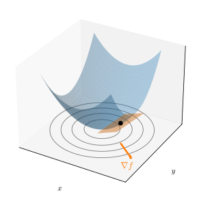
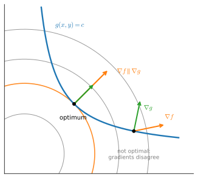
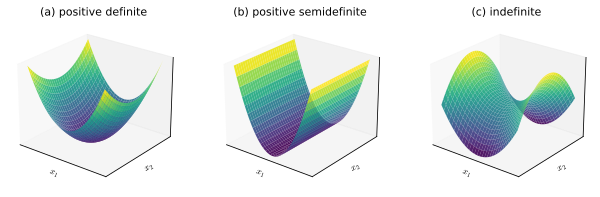

# Multivariable Calculus
:label:`sec_mdl-multivariable_calculus`

A deep network's loss is a function of millions to billions of weights, yet
training rests on a single question asked over and over: how does the loss
change when we nudge the parameters? :numref:`sec_mdl-single_variable_calculus`
answered this for one variable. This section lifts that local-linear picture to
many variables. The central object is the *gradient*, and we will see three
things about it that the rest of deep learning leans on: it is the multivariable
derivative (a first-order approximation), it points in the direction of steepest
change (which is why we descend along it), and organizing the chain rule around
it *is* the backpropagation algorithm. We close with the *Hessian*, the
second-order term that tells a minimum from a saddle.

## From Partial Derivatives to the Gradient

### Partial Derivatives

The one observation we already have is this: if we change a *single* weight
$w_1$ and freeze the rest, we are back to a function of one variable, and
:numref:`sec_mdl-single_variable_calculus` applies verbatim:

$$L(w_1+\epsilon_1, w_2, \ldots, w_N) \approx L(w_1, w_2, \ldots, w_N) + \epsilon_1 \frac{\partial}{\partial w_1} L(w_1, w_2, \ldots, w_N).$$
:eqlabel:`eq_mdl-part_der`

The derivative in one variable *while holding the others fixed* is the *partial
derivative*, written $\frac{\partial}{\partial w_1}$. The new idea is what
happens when we perturb several coordinates at once.

### The Gradient

Suppose we perturb every coordinate, replacing each $w_i$ by $w_i + \epsilon_i$.
Apply :eqref:`eq_mdl-part_der` one coordinate at a time. Changing $w_1$
contributes $\epsilon_1\frac{\partial L}{\partial w_1}$; changing $w_2$
contributes $\epsilon_2\frac{\partial L}{\partial w_2}$, and so on. The
corrections that involve *two* perturbations, like
$\epsilon_1\epsilon_2\frac{\partial^2 L}{\partial w_1 \partial w_2}$, are
products of small quantities (second order), and we discard them exactly as we
discarded $\epsilon^2$ in one variable. What survives is a single sum:

$$
L(w_1+\epsilon_1, \ldots, w_N+\epsilon_N) \approx L(w_1, \ldots, w_N) + \sum_{i=1}^N \epsilon_i \frac{\partial L}{\partial w_i}.
$$

That sum on the right is a dot product. Collecting the perturbations and the
partials into vectors,

$$
\boldsymbol{\epsilon} = [\epsilon_1, \ldots, \epsilon_N]^\top
\quad\textrm{and}\quad
\nabla_{\mathbf{w}} L = \left[\frac{\partial L}{\partial w_1}, \ldots, \frac{\partial L}{\partial w_N}\right]^\top,
$$

we obtain the multivariable analogue of the linear approximation,

$$L(\mathbf{w} + \boldsymbol{\epsilon}) \approx L(\mathbf{w}) + \boldsymbol{\epsilon}\cdot \nabla_{\mathbf{w}} L(\mathbf{w}).$$
:eqlabel:`eq_mdl-nabla_use`

The vector $\nabla_{\mathbf{w}} L$ is the *gradient* of $L$. Equation
:eqref:`eq_mdl-nabla_use` has exactly the shape of the one-dimensional
$f(x+\epsilon) \approx f(x) + \epsilon f'(x)$, with the scalar derivative
replaced by the gradient and ordinary multiplication replaced by a dot product.
The gradient *is* the derivative in many dimensions: it is the unique vector
whose dot product with a perturbation gives the first-order change in $L$. We
treat $\nabla_{\mathbf{w}} L$ as a column vector throughout; the layout
conventions that make this choice precise are settled in
:numref:`sec_mdl-matrix-calculus-autodiff`.

The coordinate-at-a-time argument tacitly assumed the partials behave well
*jointly*. The definition keeps the two ideas separate: $L$ is called
*differentiable* at $\mathbf{w}$ if the linear approximation
:eqref:`eq_mdl-nabla_use` holds with an error vanishing faster than
$\|\boldsymbol{\epsilon}\|$. A sufficient condition, and the one we rely on in
practice, is that the partials exist and are *continuous* near $\mathbf{w}$.
Existence of the $N$ partials alone is not enough: $f(x, y) = 2xy/(x^2+y^2)$ with
$f(0,0) = 0$ has both partials equal to zero at the origin, yet equals $1$
everywhere on the diagonal $x = y \neq 0$, so no linear approximation can hold
there. The losses in this book are built from pieces smooth enough that this
hypothesis costs nothing.

### Directional Derivatives

Reading :eqref:`eq_mdl-nabla_use` for a perturbation $\boldsymbol{\epsilon} =
h\,\mathbf{u}$ of size $h$ along a unit direction $\mathbf{u}$ shows what the
gradient says about *any* direction at once:

$$
\frac{L(\mathbf{w} + h\,\mathbf{u}) - L(\mathbf{w})}{h} \;\xrightarrow{\;h\to 0\;}\; \mathbf{u}\cdot\nabla_{\mathbf{w}} L(\mathbf{w}).
$$

The rate of change of $L$ as we move along $\mathbf{u}$, the *directional
derivative*, is the projection of the gradient onto $\mathbf{u}$. The single
vector $\nabla_{\mathbf{w}} L$ thus encodes the slope in every direction
simultaneously. The next section turns this one identity into the geometry of
gradient descent.

First, let us check that :eqref:`eq_mdl-nabla_use` really does approximate $L$.

```{.python .input #multivariable-calculus-imports}
#@tab mxnet
%matplotlib inline
from d2l import mxnet as d2l
from mxnet import autograd, np, npx
import math
npx.set_np()
```

```{.python .input #multivariable-calculus-imports}
#@tab pytorch
%matplotlib inline
from d2l import torch as d2l
import torch
import math
```

```{.python .input #multivariable-calculus-imports}
#@tab tensorflow
%matplotlib inline
from d2l import tensorflow as d2l
import tensorflow as tf
import math
```

```{.python .input #multivariable-calculus-imports}
#@tab jax
%matplotlib inline
from d2l import jax as d2l
import jax
from jax import numpy as jnp
import math
```

Take

$$
f(x, y) = \log(e^x + e^y), \qquad \nabla f (x, y) = \left[\frac{e^x}{e^x+e^y}, \frac{e^y}{e^x+e^y}\right]^\top.
$$

At the point $(0, \log 2)$ we have $f = \log 3$ and $\nabla f = [\tfrac13, \tfrac23]^\top$,
so :eqref:`eq_mdl-nabla_use` predicts
$f(\epsilon_1, \log 2 + \epsilon_2) \approx \log 3 + \tfrac13\epsilon_1 + \tfrac23\epsilon_2$.
We compare this against the true value for a small step. The check is plain
scalar arithmetic.

```{.python .input #multivariable-calculus-higher-dimensional-differentiation}
def f(x, y):
    return math.log(math.exp(x) + math.exp(y))

def grad_f(x, y):
    s = math.exp(x) + math.exp(y)
    return [math.exp(x) / s, math.exp(y) / s]

epsilon = [0.01, -0.03]
x0, y0 = 0, math.log(2)
approx = f(x0, y0) + sum(e * g for e, g in zip(epsilon, grad_f(x0, y0)))
true_value = f(x0 + epsilon[0], y0 + epsilon[1])
print(f'approximation: {approx:.6f}, true value: {true_value:.6f}')
```

The two agree to about three decimal places, with a gap of $1.8\times10^{-4}$.
The gap is not noise, and its size is itself a lesson: a first-order model
discards terms of order $\|\boldsymbol{\epsilon}\|^2$, and here
$\|\boldsymbol{\epsilon}\|^2 = 10^{-3}$: shrink the step tenfold and the gap
shrinks a hundredfold. The discarded term has a name and a formula (the Hessian
quadratic $\tfrac12\boldsymbol{\epsilon}^\top\mathbf{H}f\,\boldsymbol{\epsilon}$),
which we develop at the end of this section.

The same example models a workflow we will use constantly: whenever we derive a
gradient by hand, we check it against automatic differentiation. Here
autograd should reproduce $\nabla f(0, \log 2) = [\tfrac13, \tfrac23]^\top$.

```{.python .input #mdl-multivariable-calculus-directional-derivatives-1}
#@tab mxnet
# Check the hand-derived gradient at (0, log 2): [1/3, 2/3]
xy = np.array([0.0, math.log(2)])
xy.attach_grad()
with autograd.record():
    out = np.log(np.exp(xy).sum())
out.backward()
print(f'autograd gradient: {xy.grad}')
```

```{.python .input #mdl-multivariable-calculus-directional-derivatives-1}
#@tab pytorch
# Check the hand-derived gradient at (0, log 2): [1/3, 2/3]
xy = torch.tensor([0.0, math.log(2)], requires_grad=True)
torch.logsumexp(xy, 0).backward()
print(f'autograd gradient: {xy.grad}')
```

```{.python .input #mdl-multivariable-calculus-directional-derivatives-1}
#@tab tensorflow
# Check the hand-derived gradient at (0, log 2): [1/3, 2/3]
xy = tf.Variable([0.0, math.log(2.0)])
with tf.GradientTape() as t:
    out = tf.reduce_logsumexp(xy)
print(f'autograd gradient: {t.gradient(out, xy).numpy()}')
```

```{.python .input #mdl-multivariable-calculus-directional-derivatives-1}
#@tab jax
# Check the hand-derived gradient at (0, log 2): [1/3, 2/3]
grad = jax.grad(jax.scipy.special.logsumexp)(jnp.array([0.0, math.log(2.0)]))
print(f'autograd gradient: {grad}')
```

Up to display precision, the printout is our hand-computed
$[\tfrac13, \tfrac23]^\top$.

## The Geometry of Gradients

### Steepest Descent

Equation :eqref:`eq_mdl-nabla_use` tells us how $L$ changes in *any* direction,
so we can ask which direction makes it decrease fastest. This is the geometric
content of gradient descent, first introduced in :numref:`sec_linear_regression`:

1. Start from some initial parameters $\mathbf{w}$.
2. Find the unit direction $\mathbf{v}$ along which $L$ decreases most rapidly.
3. Take a small step that way: $\mathbf{w} \leftarrow \mathbf{w} + \eta\mathbf{v}$.
4. Repeat.

Everything hinges on step 2. Write the gradient's effect on a unit direction
$\mathbf{v}$ using the geometric form of the dot product from
:numref:`sec_mdl-geometry-linear-algebraic-ops`,

$$
L(\mathbf{w} + \mathbf{v}) - L(\mathbf{w}) \approx \mathbf{v}\cdot \nabla_{\mathbf{w}} L(\mathbf{w}) = \|\nabla_{\mathbf{w}} L(\mathbf{w})\|\cos(\theta),
$$

where $\theta$ is the angle between $\mathbf{v}$ and the gradient. The direction
enters only through $\cos\theta$.

**Proposition (steepest ascent and descent).** *At any point where
$\nabla L \neq \mathbf{0}$, among all unit vectors $\mathbf{v}$ the directional
derivative $\mathbf{v}\cdot\nabla L$ is largest when $\mathbf{v}$ points along
$+\nabla L$ and smallest when it points along $-\nabla L$. Thus $+\nabla L$ is
the direction of steepest ascent and $-\nabla L$ the direction of steepest
descent.*

**Proof.** By Cauchy–Schwarz (:eqref:`eq_mdl-cauchy-schwarz`) applied to the
unit vector $\mathbf{v}$,

$$
-\|\nabla L\| \;\le\; \mathbf{v}\cdot\nabla L \;\le\; \|\nabla L\|,
$$

and the Cauchy–Schwarz equality criterion (equality holds exactly for
collinear vectors) says each bound is attained exactly
when $\mathbf{v}$ is collinear with $\nabla L$. The upper bound $+\|\nabla L\|$
is reached by $\mathbf{v} = \nabla L/\|\nabla L\|$ and the lower bound
$-\|\nabla L\|$ by $\mathbf{v} = -\nabla L/\|\nabla L\|$. $\blacksquare$

In the $\cos\theta$ picture this is simply $\theta = 0$ versus $\theta = \pi$.
Steepest descent therefore steps along $-\nabla_{\mathbf{w}} L$, and
the informal recipe becomes the gradient-descent update

$$
\mathbf{w} \leftarrow \mathbf{w} - \eta\,\nabla_{\mathbf{w}} L(\mathbf{w}).
$$

Every optimizer in this book, from momentum through RMSProp to Adam
(:numref:`chap_optimization`), modifies *how* the step along the gradient is
computed, but they all inherit this core idea: read the gradient, move against
it.

### Gradients and Level Sets

The same expression $L(\mathbf{w} + \mathbf{v}) - L(\mathbf{w}) \approx
\|\nabla L\|\cos\theta$ also reveals what the gradient is *geometrically*, not
just which way to step. Consider moving along a *level set*, the set of points
where $L$ keeps a fixed value $c$. To first order, $L$ does not change along
such a direction, so the directional derivative vanishes.

**Proposition (gradients are normal to level sets).** *At any point, $\nabla L$
is orthogonal to every direction tangent to the level set
$\{\mathbf{x} : L(\mathbf{x}) = c\}$ through that point.*

**Proof.** A direction $\mathbf{v}$ is *tangent* to the level set at
$\mathbf{x}$ if $\mathbf{v} = \boldsymbol{\gamma}'(0)$ for some differentiable
curve $\boldsymbol{\gamma}(t)$ lying in the level set with
$\boldsymbol{\gamma}(0) = \mathbf{x}$. Along such a curve
$L(\boldsymbol{\gamma}(t)) = c$ for all $t$, so the derivative of
$t \mapsto L(\boldsymbol{\gamma}(t))$ at $t = 0$ vanishes. To first order
$\boldsymbol{\gamma}(t) = \mathbf{x} + t\mathbf{v} + o(t)$, so by
:eqref:`eq_mdl-nabla_use` that derivative is $\mathbf{v}\cdot\nabla L(\mathbf{x})$.
Hence $\mathbf{v}\cdot\nabla L = 0$; by the definition of orthogonality from
:numref:`sec_mdl-geometry-linear-algebraic-ops`, $\mathbf{v}\perp\nabla L$.
$\blacksquare$

So on a contour map the gradient is the arrow crossing the contours at right
angles, pointing toward higher ground, and it is longest where the contours
bunch together, exactly where $L$ changes fastest, as drawn in
:numref:`fig_mdl-cal-gradient-field`. Gradient descent slides *downhill across
the contours*, always perpendicular to them.


:label:`fig_mdl-cal-gradient-field`

### Tangent Planes and Linearization

The level-set picture lives in the *base plane*, where the gradient is the arrow
normal to the contours. There is a companion picture one dimension up, on the
*graph* $z = f(\mathbf{x})$ itself. Reading :eqref:`eq_mdl-nabla_use` as an
equation for the height $z$ rather than as an approximation gives the
*linearization* of $f$ at $\mathbf{x}_0$,

$$
z = f(\mathbf{x}_0) + \nabla f(\mathbf{x}_0)\cdot(\mathbf{x}-\mathbf{x}_0),
$$
:eqlabel:`eq_mdl-tangent_plane`

a linear function of $\mathbf{x}$ whose graph is a plane (a hyperplane in higher
dimensions). It passes through the point $(\mathbf{x}_0, f(\mathbf{x}_0))$ and
matches every first-order slope of $f$ there, so it is the *tangent plane* to the
surface: the two-dimensional analogue of the tangent line, and the surface's
best linear approximation near $\mathbf{x}_0$.

Rewrite
:eqref:`eq_mdl-tangent_plane` as $\nabla f(\mathbf{x}_0)\cdot(\mathbf{x}-\mathbf{x}_0) - (z - f(\mathbf{x}_0)) = 0$:
this says the augmented vector $[\nabla f(\mathbf{x}_0),\, -1]^\top$ is normal,
*in graph space*, to the tangent plane; the gradient is normal to the surface
once we account for the height direction. Drop the height coordinate, projecting
that normal straight down onto the base plane, and we recover $\nabla f$ crossing
the level curves at right angles. :numref:`fig_mdl-tangent-plane` shows both at
once: the tangent plane riding the surface, and the gradient's shadow meeting the
contours square on.


:label:`fig_mdl-tangent-plane`

### Critical Points and the First-Order Test

Throughout this book we minimize losses numerically, because the functions that
arise in deep learning are far too complex to minimize in closed form. But the
geometry above gives a cheap, exact *necessary* condition that every minimum
must satisfy.

Suppose someone hands us a point $\mathbf{x}_0$ and claims it minimizes $L$. Is
the claim even plausible? Read :eqref:`eq_mdl-nabla_use` at $\mathbf{x}_0$: if
$\nabla L(\mathbf{x}_0) \neq \mathbf{0}$, then stepping along
$-\nabla L(\mathbf{x}_0)$ strictly decreases $L$, so $\mathbf{x}_0$ cannot be a
minimum. Contrapositively, **a minimum forces $\nabla L(\mathbf{x}_0) =
\mathbf{0}$.** Points where the gradient vanishes are called *critical points*.

This is occasionally enough to optimize by hand. For example,

$$
f(x) = 3x^4 - 4x^3 - 12x^2, \qquad f'(x) = 12x(x-2)(x+1),
$$

has critical points $x = -1, 0, 2$ with values $-5, 0, -32$, so the minimum is
at $x = 2$, as the plot confirms.

```{.python .input #multivariable-calculus-a-note-on-mathematical-optimization}
#@tab mxnet
x = np.arange(-2, 3, 0.01)
f = (3 * x**4) - (4 * x**3) - (12 * x**2)

d2l.plot(x, f, 'x', 'f(x)')
```

```{.python .input #multivariable-calculus-a-note-on-mathematical-optimization}
#@tab pytorch
x = torch.arange(-2, 3, 0.01)
f = (3 * x**4) - (4 * x**3) - (12 * x**2)

d2l.plot(x, f, 'x', 'f(x)')
```

```{.python .input #multivariable-calculus-a-note-on-mathematical-optimization}
#@tab tensorflow
x = tf.range(-2, 3, 0.01)
f = (3 * x**4) - (4 * x**3) - (12 * x**2)

d2l.plot(x, f, 'x', 'f(x)')
```

```{.python .input #multivariable-calculus-a-note-on-mathematical-optimization}
#@tab jax
x = jnp.arange(-2, 3, 0.01)
f = (3 * x**4) - (4 * x**3) - (12 * x**2)

d2l.plot(x, f, 'x', 'f(x)')
```

But not every critical point is an extremum: $x = 0$ above is a local maximum,
and in higher dimensions a critical point can be a saddle. Telling these apart
needs *second*-order information, the Hessian we develop below.

### Optimizing on a Constraint

The first-order test answers "where can an unconstrained minimum be?" One more
turn of the same geometry answers the constrained question that pervades machine
learning: minimize a loss *subject to* keeping some quantity fixed, say
$g(\mathbf{x}) = c$. Now we are no longer free to step in any direction: the
admissible moves are exactly those tangent to the constraint surface
$\{g = c\}$. At a constrained optimum $\mathbf{x}^\star$, *no* admissible
direction can lower $f$ to first order: otherwise we would slide along the
constraint and improve. By :eqref:`eq_mdl-nabla_use` that means
$\nabla f(\mathbf{x}^\star)$ has zero component along every direction tangent to
$\{g = c\}$; it is orthogonal to that surface. But we proved above that
$\nabla g$ is *also* orthogonal to $\{g = c\}$. One hypothesis makes the
geometry rigorous: provided $\nabla g(\mathbf{x}^\star) \neq \mathbf{0}$, the
standard *constraint qualification*, the implicit function theorem (stated in
:numref:`subsec_mdl-implicit-diff`; see :cite:`Rudin.1976`) guarantees that
$\{g = c\}$ really is a smooth surface of codimension one near
$\mathbf{x}^\star$ (one equation removes one degree of freedom, leaving an
$(n{-}1)$-dimensional surface) with a single normal direction; it also supplies
the fact, used tacitly above, that every tangent direction is realized by a
curve lying in $\{g = c\}$, so "sliding along the constraint" is a legitimate
move. Two vectors normal to the same surface must be parallel, so at the
constrained optimum

$$
\nabla f(\mathbf{x}^\star) = \lambda\,\nabla g(\mathbf{x}^\star)
$$
:eqlabel:`eq_mdl-lagrange-condition`

for some scalar $\lambda$, the *Lagrange multiplier*. This single picture, the
contours of $f$ kissing the constraint surface where their gradients align
(:numref:`fig_mdl-lagrange-tangency`), is
the first-order condition for constrained optimization, the seed of the KKT
conditions and of duality. We meet it again in full force in
:numref:`sec_mdl-constrained-optimization-duality`.


:label:`fig_mdl-lagrange-tangency`

## The Multivariate Chain Rule

Neural networks are deep compositions of simple functions, so computing
gradients means differentiating compositions. Consider four inputs $w, x, y, z$
flowing through intermediate quantities to a scalar output:

$$\begin{aligned}f(u, v) & = (u+v)^{2} \\u(a, b) & = (a+b)^{2}, \qquad v(a, b) = (a-b)^{2}, \\a(w, x, y, z) & = (w+x+y+z)^{2}, \qquad b(w, x, y, z) = (w+x-y-z)^2.\end{aligned}$$
:eqlabel:`eq_mdl-multi_func_def`

The dependencies form a graph (:numref:`fig_mdl-chain-1`): each node is a value,
each edge a direct functional dependence.


:label:`fig_mdl-chain-1`

We *could* substitute everything and differentiate the resulting monster
directly, but $\frac{\partial f}{\partial w}$ alone expands into a page of
repeated subexpressions, and $\frac{\partial f}{\partial x}$ would repeat most
of them again. That waste is precisely what the chain rule organizes away.

### The Rule as a Sum Over Paths

Take the simplest composite step, $f(u(a,b), v(a,b))$, and perturb $a$ by a
small $\epsilon$. Each intermediate moves by its partial,
$u \to u + \epsilon\frac{\partial u}{\partial a}$ and
$v \to v + \epsilon\frac{\partial v}{\partial a}$, and feeding those into the
first-order expansion of $f$ gives

$$
f\!\left(u + \epsilon\tfrac{\partial u}{\partial a},\, v + \epsilon\tfrac{\partial v}{\partial a}\right)
\approx f(u, v) + \epsilon\left[\frac{\partial f}{\partial u}\frac{\partial u}{\partial a} + \frac{\partial f}{\partial v}\frac{\partial v}{\partial a}\right].
$$

Reading off the coefficient of $\epsilon$ gives the multivariate chain rule,

$$
\frac{\partial f}{\partial a} = \frac{\partial f}{\partial u}\frac{\partial u}{\partial a} + \frac{\partial f}{\partial v}\frac{\partial v}{\partial a}.
$$

In words, there are two *pathways* by which $a$
influences $f$: $a \to u \to f$ and $a \to v \to f$. Each path contributes the
*product* of the derivatives along its edges, and the total derivative is the
*sum* over paths. This is the whole rule.

In general, to differentiate the output with respect to an input we **sum, over
every directed path from that input to the output, the product of the edge
derivatives along the path.**

To see the rule at work on a graph that is not a tree, consider a
*different* composition (its own dependency graph, unrelated to
:eqref:`eq_mdl-multi_func_def`) in which one intermediate feeds the output both
directly and through a later node:

$$\begin{aligned}u(x, y) & = x + y, \qquad v(x, y) = x - y, \\a(u) & = u^2, \qquad b(v) = v^2, \\f(a, u, b) & = a + u + b.\end{aligned}$$
:eqlabel:`eq_mdl-multi_func_def_2`

These relations are exactly the edges drawn in :numref:`fig_mdl-chain-2`:
$u$ and $v$ each depend on the input $y$; $a$ depends on $u$ and $b$ on $v$; and
the output $f$ depends on $a$, on $b$, and *also directly on $u$*: the skip-like
edge that gives the middle path below. Tracing every directed route from $y$ to
$f$ (namely $y\to u\to a\to f$, the direct $y\to u\to f$, and
$y\to v\to b\to f$), the rule gives

$$
\frac{\partial f}{\partial y} = \frac{\partial f}{\partial a} \frac{\partial a}{\partial u} \frac{\partial u}{\partial y} + \frac{\partial f}{\partial u} \frac{\partial u}{\partial y} + \frac{\partial f}{\partial b} \frac{\partial b}{\partial v} \frac{\partial v}{\partial y}.
$$


:label:`fig_mdl-chain-2`

Here every edge derivative is elementary
($\partial f/\partial a = \partial f/\partial u = \partial f/\partial b = 1$,
$\partial a/\partial u = 2u$, $\partial u/\partial y = 1$, and so on), so the
sum-over-paths value is checkable by hand: it collapses to
$2u + 1 - 2v = 2(x+y) + 1 - 2(x-y) = 1 + 4y$. This "sum over paths" view is
exactly how gradients flow through a network, and
it explains why architectural choices that open or close paths, such as the
gates of an LSTM (:numref:`sec_lstm`) or the skip connections of a residual
block (:numref:`sec_resnet`), shape learning by controlling that gradient flow.

### The Backpropagation Algorithm

Return to :eqref:`eq_mdl-multi_func_def` and ask for $\frac{\partial f}{\partial
w}$. Applying the chain rule the obvious way pushes $w$ forward through the
graph,

$$
\frac{\partial f}{\partial w} = \frac{\partial f}{\partial u}\frac{\partial u}{\partial w} + \frac{\partial f}{\partial v}\frac{\partial v}{\partial w}, \qquad
\frac{\partial u}{\partial w} = \frac{\partial u}{\partial a}\frac{\partial a}{\partial w}+\frac{\partial u}{\partial b}\frac{\partial b}{\partial w}, \quad \ldots
$$

and the single-step partials are all elementary,

$$
\begin{aligned}
\frac{\partial f}{\partial u} = 2(u+v), & \quad\frac{\partial f}{\partial v} = 2(u+v), \\
\frac{\partial u}{\partial a} = 2(a+b), & \quad\frac{\partial u}{\partial b} = 2(a+b), \\
\frac{\partial v}{\partial a} = 2(a-b), & \quad\frac{\partial v}{\partial b} = -2(a-b), \\
\frac{\partial a}{\partial w} = 2(w+x+y+z), & \quad\frac{\partial b}{\partial w} = 2(w+x-y-z).
\end{aligned}
$$

In code this is a tidy forward sweep through the graph.

```{.python .input #multivariable-calculus-the-backpropagation-algorithm-1}
# Compute the value of the function from inputs to outputs
w, x, y, z = 1, 1, -2, 1
a, b = (w + x + y + z)**2, (w + x - y - z)**2
u, v = (a + b)**2, (a - b)**2
f = (u + v)**2
print(f'f at {w}, {x}, {y}, {z} is {f}')

# Compute the single step partials
df_du, df_dv = 2*(u + v), 2*(u + v)
du_da, du_db, dv_da, dv_db = 2*(a + b), 2*(a + b), 2*(a - b), -2*(a - b)
da_dw, db_dw = 2*(w + x + y + z), 2*(w + x - y - z)

# Compute the final result from inputs to outputs
du_dw, dv_dw = du_da*da_dw + du_db*db_dw, dv_da*da_dw + dv_db*db_dw
df_dw = df_du*du_dw + df_dv*dv_dw
print(f'df/dw at {w}, {x}, {y}, {z} is {df_dw}')
```

This computes one derivative, $\frac{\partial f}{\partial w}$. The trouble is
that it gives us *no head start* on $\frac{\partial f}{\partial x}$: by keeping
$\partial w$ in every denominator, we organized the work around "how $w$ affects
everything." But in deep learning we want the opposite: how *one* loss is
affected by *every* parameter. So we keep $\partial f$ in every *numerator*
instead, walking the graph from the output backward:

$$
\begin{aligned}
\frac{\partial f}{\partial a} & = \frac{\partial f}{\partial u}\frac{\partial u}{\partial a}+\frac{\partial f}{\partial v}\frac{\partial v}{\partial a}, \qquad
\frac{\partial f}{\partial b} = \frac{\partial f}{\partial u}\frac{\partial u}{\partial b}+\frac{\partial f}{\partial v}\frac{\partial v}{\partial b}, \\
\frac{\partial f}{\partial w} & = \frac{\partial f}{\partial a}\frac{\partial a}{\partial w} + \frac{\partial f}{\partial b}\frac{\partial b}{\partial w}, \qquad (\textrm{and likewise for } x, y, z).
\end{aligned}
$$

Computing $\frac{\partial f}{\partial u}, \frac{\partial f}{\partial v}$ once,
then $\frac{\partial f}{\partial a}, \frac{\partial f}{\partial b}$, then all
four input derivatives, *reuses* every intermediate. One backward sweep yields
the gradient with respect to all inputs at once.

```{.python .input #multivariable-calculus-the-backpropagation-algorithm-2}
# Compute the value of the function from inputs to outputs
w, x, y, z = 1, 1, -2, 1
a, b = (w + x + y + z)**2, (w + x - y - z)**2
u, v = (a + b)**2, (a - b)**2
f = (u + v)**2
print(f'f at {w}, {x}, {y}, {z} is {f}')

# Compute the derivative using the decomposition above
# First compute the single step partials
df_du, df_dv = 2*(u + v), 2*(u + v)
du_da, du_db, dv_da, dv_db = 2*(a + b), 2*(a + b), 2*(a - b), -2*(a - b)
da_dw, db_dw = 2*(w + x + y + z), 2*(w + x - y - z)
da_dx, db_dx = 2*(w + x + y + z), 2*(w + x - y - z)
da_dy, db_dy = 2*(w + x + y + z), -2*(w + x - y - z)
da_dz, db_dz = 2*(w + x + y + z), -2*(w + x - y - z)

# Now compute how f changes when we change any value from output to input
df_da, df_db = df_du*du_da + df_dv*dv_da, df_du*du_db + df_dv*dv_db
df_dw, df_dx = df_da*da_dw + df_db*db_dw, df_da*da_dx + df_db*db_dx
df_dy, df_dz = df_da*da_dy + df_db*db_dy, df_da*da_dz + df_db*db_dz

print(f'df/dw at {w}, {x}, {y}, {z} is {df_dw}')
print(f'df/dx at {w}, {x}, {y}, {z} is {df_dx}')
print(f'df/dy at {w}, {x}, {y}, {z} is {df_dy}')
print(f'df/dz at {w}, {x}, {y}, {z} is {df_dz}')
```

Two sanity checks are visible in the printout. The derivatives with respect to
$w$ and $x$ agree, as do those with respect to $y$ and $z$, as they must,
since $f$ reaches its inputs only through the sums $w+x$ and $y+z$. And the two
pairs differ in both magnitude and sign, so the sweep is genuinely telling the
four paths through the graph apart.

Computing derivatives *from $f$ back toward the inputs*, rather than forward from
the inputs, is what gives the algorithm its name: *backpropagation*
:cite:`Rumelhart.Hinton.Williams.ea.1988`. It is two
passes: a *forward pass* that evaluates the function and records the single-step
partials, and a *backward pass* that accumulates $\frac{\partial f}{\partial
\cdot}$ from output to input. This is exactly how the deep learning library
obtains the gradient of the loss with respect to *every* weight in a
single sweep, and it is what the one-line autograd call in the cell below runs
under the hood.

```{.python .input #multivariable-calculus-the-backpropagation-algorithm-3}
#@tab mxnet
# Initialize as ndarrays, then attach gradients
w, x, y, z = np.array(1), np.array(1), np.array(-2), np.array(1)

w.attach_grad()
x.attach_grad()
y.attach_grad()
z.attach_grad()

# Do the computation like usual, tracking gradients
with autograd.record():
    a, b = (w + x + y + z)**2, (w + x - y - z)**2
    u, v = (a + b)**2, (a - b)**2
    f = (u + v)**2

# Execute backward pass
f.backward()

print(f'df/dw at {w}, {x}, {y}, {z} is {w.grad}')
print(f'df/dx at {w}, {x}, {y}, {z} is {x.grad}')
print(f'df/dy at {w}, {x}, {y}, {z} is {y.grad}')
print(f'df/dz at {w}, {x}, {y}, {z} is {z.grad}')
```

```{.python .input #multivariable-calculus-the-backpropagation-algorithm-3}
#@tab pytorch
# Initialize as tensors that require gradients
w = torch.tensor([1.], requires_grad=True)
x = torch.tensor([1.], requires_grad=True)
y = torch.tensor([-2.], requires_grad=True)
z = torch.tensor([1.], requires_grad=True)
# Do the computation like usual, tracking gradients
a, b = (w + x + y + z)**2, (w + x - y - z)**2
u, v = (a + b)**2, (a - b)**2
f = (u + v)**2

# Execute backward pass
f.backward()

print(f'df/dw at {w.data.item()}, {x.data.item()}, {y.data.item()}, '
      f'{z.data.item()} is {w.grad.data.item()}')
print(f'df/dx at {w.data.item()}, {x.data.item()}, {y.data.item()}, '
      f'{z.data.item()} is {x.grad.data.item()}')
print(f'df/dy at {w.data.item()}, {x.data.item()}, {y.data.item()}, '
      f'{z.data.item()} is {y.grad.data.item()}')
print(f'df/dz at {w.data.item()}, {x.data.item()}, {y.data.item()}, '
      f'{z.data.item()} is {z.grad.data.item()}')
```

```{.python .input #multivariable-calculus-the-backpropagation-algorithm-3}
#@tab tensorflow
# Initialize as Variables, which the tape tracks automatically
w = tf.Variable(tf.constant([1.]))
x = tf.Variable(tf.constant([1.]))
y = tf.Variable(tf.constant([-2.]))
z = tf.Variable(tf.constant([1.]))
# Do the computation like usual, tracking gradients
with tf.GradientTape() as t:
    a, b = (w + x + y + z)**2, (w + x - y - z)**2
    u, v = (a + b)**2, (a - b)**2
    f = (u + v)**2

# One backward sweep yields the gradient for all four inputs at once
w_grad, x_grad, y_grad, z_grad = t.gradient(f, [w, x, y, z])

print(f'df/dw at {w.numpy()}, {x.numpy()}, {y.numpy()}, '
      f'{z.numpy()} is {w_grad.numpy()}')
print(f'df/dx at {w.numpy()}, {x.numpy()}, {y.numpy()}, '
      f'{z.numpy()} is {x_grad.numpy()}')
print(f'df/dy at {w.numpy()}, {x.numpy()}, {y.numpy()}, '
      f'{z.numpy()} is {y_grad.numpy()}')
print(f'df/dz at {w.numpy()}, {x.numpy()}, {y.numpy()}, '
      f'{z.numpy()} is {z_grad.numpy()}')
```

```{.python .input #multivariable-calculus-the-backpropagation-algorithm-3}
#@tab jax
# Define the function to differentiate
def f_comp(w, x, y, z):
    a, b = (w + x + y + z)**2, (w + x - y - z)**2
    u, v = (a + b)**2, (a - b)**2
    return ((u + v)**2).squeeze()

w, x, y, z = jnp.array([1.]), jnp.array([1.]), jnp.array([-2.]), jnp.array([1.])

# Compute gradients with respect to all four arguments
grad_f = jax.grad(f_comp, argnums=(0, 1, 2, 3))
w_grad, x_grad, y_grad, z_grad = grad_f(w, x, y, z)

print(f'df/dw at {w}, {x}, {y}, {z} is {w_grad}')
print(f'df/dx at {w}, {x}, {y}, {z} is {x_grad}')
print(f'df/dy at {w}, {x}, {y}, {z} is {y_grad}')
print(f'df/dz at {w}, {x}, {y}, {z} is {z_grad}')
```

The library's answer matches our hand-computed backward pass. Why backprop is
reverse-mode automatic differentiation, a chain of vector–Jacobian products,
and when to prefer it over forward mode is the
subject of :numref:`sec_mdl-matrix-calculus-autodiff`.

## Second-Order Structure: the Hessian

The gradient is a first-order, linear approximation; to know whether a critical
point is a minimum we need the *curvature*, which lives in the second
derivatives. A function of $n$ variables has $n^2$ second partials,

$$
\frac{\partial^2 f}{\partial x_i \partial x_j} = \frac{\partial}{\partial x_i}\left(\frac{\partial}{\partial x_j} f\right),
$$

collected into the *Hessian* matrix

$$\mathbf{H}_f = \begin{bmatrix} \frac{\partial^2 f}{\partial x_1 \partial x_1} & \cdots & \frac{\partial^2 f}{\partial x_1 \partial x_n} \\ \vdots & \ddots & \vdots \\ \frac{\partial^2 f}{\partial x_n \partial x_1} & \cdots & \frac{\partial^2 f}{\partial x_n \partial x_n} \\ \end{bmatrix}.$$
:eqlabel:`eq_mdl-hess_def`

These $n^2$ entries are not independent: the Hessian is symmetric, a result
known as the Clairaut–Schwarz theorem :cite:`Rudin.1976`.

**Proposition (symmetry of the Hessian; Clairaut–Schwarz).** *If the mixed partials of
$f$ exist and are continuous, then for all $i, j$,*

$$
\frac{\partial^2 f}{\partial x_i \partial x_j} = \frac{\partial^2 f}{\partial x_j \partial x_i},
\qquad\textrm{equivalently}\qquad \mathbf{H}_f = \mathbf{H}_f^\top.
$$

**Proof.** Both mixed partials are limits of the *same* quantity, the
symmetric second difference

$$
\Delta_h = \frac{f(\mathbf{x}+h\mathbf{e}_i+h\mathbf{e}_j) - f(\mathbf{x}+h\mathbf{e}_i) - f(\mathbf{x}+h\mathbf{e}_j) + f(\mathbf{x})}{h^2},
$$

which is symmetric in $i$ and $j$ by inspection. Indeed, write
$g(t) = f(\mathbf{x}+t\mathbf{e}_i+h\mathbf{e}_j) - f(\mathbf{x}+t\mathbf{e}_i)$,
so that $\Delta_h = \bigl(g(h)-g(0)\bigr)/h^2$; two applications of the mean
value theorem (first along $x_i$, then along $x_j$) give
$\Delta_h = \frac{\partial^2 f}{\partial x_j \partial x_i}(\boldsymbol{\xi}_h)$
at some point $\boldsymbol{\xi}_h$ within distance $2h$ of $\mathbf{x}$.
Swapping the roles of $i$ and $j$ leaves $\Delta_h$ unchanged and gives
$\Delta_h = \frac{\partial^2 f}{\partial x_i \partial x_j}(\boldsymbol{\xi}'_h)$
at another nearby point. Let $h \to 0$: by continuity the two expressions
converge to the two mixed partials at $\mathbf{x}$, and since they are equal
for every $h$, the limits agree. $\blacksquare$

Symmetry matters because it puts the Hessian in the world of symmetric matrices,
where the spectral theorem and positive-definiteness from
:numref:`sec_mdl-eigendecompositions` apply, which is exactly what the
second-derivative test will use.

### The Second-Order Taylor Approximation

Just as the gradient gives the best linear fit, the Hessian gives the best
*quadratic* fit. To see how the coefficients enter, read them off an exact
quadratic. Let $f(x_1, x_2) = a + b_1x_1 + b_2x_2 + c_{11}x_1^{2} + c_{12}x_1x_2 + c_{22}x_2^{2}$.
Evaluating the value, gradient, and Hessian :eqref:`eq_mdl-hess_def` at the
origin gives

$$
f(0,0) = a, \qquad
\nabla f (0,0) = \begin{bmatrix}b_1 \\ b_2\end{bmatrix}, \qquad
\mathbf{H} f (0,0) = \begin{bmatrix}2 c_{11} & c_{12} \\ c_{12} & 2c_{22}\end{bmatrix},
$$

and these recover the polynomial exactly:
$f(\mathbf{x}) = f(0) + \nabla f(0) \cdot \mathbf{x} + \tfrac12\mathbf{x}^\top \mathbf{H} f(0)\, \mathbf{x}$.

For a general $f$, twice differentiable near a base point $\mathbf{x}_0$, the
same assembly is no longer exact, but restricting $f$ to a line shows exactly
how close it comes. Fix a displacement $\boldsymbol{\delta} = \mathbf{x} -
\mathbf{x}_0$ and let $g(t) = f(\mathbf{x}_0 + t\boldsymbol{\delta})$, a
function of the single variable $t$. By the multivariate chain rule,
$g'(t) = \nabla f(\mathbf{x}_0 + t\boldsymbol{\delta})\cdot\boldsymbol{\delta}$
and $g''(t) = \boldsymbol{\delta}^\top \mathbf{H} f(\mathbf{x}_0 +
t\boldsymbol{\delta})\,\boldsymbol{\delta}$, so $g'(0)$ and $g''(0)$ are
exactly the gradient term and the Hessian quadratic form at $\mathbf{x}_0$.
Now apply the single-variable Lagrange remainder :eqref:`eq_mdl-lagrange`,
established in the previous section, to $g$ on $[0, 1]$ with $n = 1$: there is
a $\tau \in (0, 1)$ with

$$
f(\mathbf{x}) = g(1) = g(0) + g'(0) + \tfrac{1}{2}g''(\tau) = f(\mathbf{x}_0) + \nabla f(\mathbf{x}_0)\cdot\boldsymbol{\delta} + \tfrac{1}{2}\boldsymbol{\delta}^\top \mathbf{H} f(\mathbf{x}_0 + \tau\boldsymbol{\delta})\,\boldsymbol{\delta}.
$$

This identity is exact; its only blemish is that the Hessian is evaluated at
an intermediate point $\mathbf{x}_0 + \tau\boldsymbol{\delta}$ rather than at
$\mathbf{x}_0$. When the second partials are continuous, moving the evaluation
point back to $\mathbf{x}_0$ changes the quadratic term by
$o(\|\boldsymbol{\delta}\|^2)$, giving the *second-order Taylor approximation*

$$
f(\mathbf{x}) \approx f(\mathbf{x}_0) + \nabla f (\mathbf{x}_0) \cdot (\mathbf{x}-\mathbf{x}_0) + \frac{1}{2}(\mathbf{x}-\mathbf{x}_0)^\top \mathbf{H} f (\mathbf{x}_0) (\mathbf{x}-\mathbf{x}_0).
$$
:eqlabel:`eq_mdl-second_taylor`

This is the best-approximating quadratic to $f$ near $\mathbf{x}_0$ in a
precise sense: its error vanishes faster than $\|\mathbf{x}-\mathbf{x}_0\|^2$,
and it is the only quadratic with that property. For smoother $f$ (three
continuous derivatives) the error is *third order* in the step. To see it in
numbers, take $f(x, y) = xe^{-x^2-y^2}$. Assembling its value,
gradient, and Hessian at $\mathbf{x}_0 = [-1, 0]^\top$ via
:eqref:`eq_mdl-second_taylor` gives the approximating quadratic
$q(x, y) = e^{-1}\bigl(-1 - (x+1) + (x+1)^2 + y^2\bigr)$.
:numref:`fig_mdl-taylor-quadratic` plots the surface against this quadratic;
near $[-1, 0]^\top$ they hug each other and peel apart only as we move away.


:label:`fig_mdl-taylor-quadratic`

The figure asserts agreement; we can check it numerically, exactly as
we checked the gradient above. Evaluating $f$ and its quadratic $q$ at a few
points stepping away from the base point, the gap should stay tiny nearby and
grow with distance.

```{.python .input #multivariable-calculus-hessians}
def f(x, y):
    return x * math.exp(-x**2 - y**2)

def quad(x, y):  # 2nd-order Taylor of f at the base point (-1, 0)
    return math.exp(-1) * (-1 - (x + 1) + (x + 1)**2 + y**2)

for d in [0.0, 0.05, 0.1, 0.3]:  # step d in each coordinate from (-1, 0)
    x, y = -1 + d, d
    print(f'step {d:.2f}: f = {f(x, y):.6f}, '
          f'quadratic = {quad(x, y):.6f}, gap = {abs(f(x, y) - quad(x, y)):.6f}')
```

The gap vanishes at the base point and is third order in the step (doubling the
step roughly multiplies it by eight), the third-order behavior promised above.
Iterating this idea, repeatedly fitting the local quadratic and jumping to *its*
minimum, is Newton's method, which :numref:`subsec_mdl-newton` introduced in one
variable; :numref:`sec_gd` develops it as a practical optimizer.

### The Second-Derivative Test

We can now finish the story the first-order test left open: at a critical point,
the Hessian decides whether we sit at a minimum, a maximum, or a saddle. At a
critical point $\mathbf{x}_0$ the gradient term in :eqref:`eq_mdl-second_taylor`
vanishes, so the local picture is purely quadratic,

$$
f(\mathbf{x}) - f(\mathbf{x}_0) \approx \frac{1}{2}(\mathbf{x}-\mathbf{x}_0)^\top \mathbf{H} f (\mathbf{x}_0)(\mathbf{x}-\mathbf{x}_0).
$$

Stepping a unit direction $\mathbf{v}$ away from $\mathbf{x}_0$ makes the
right-hand side $\tfrac12\mathbf{v}^\top\mathbf{H}\mathbf{v}$: the scalar
$\mathbf{v}^\top\mathbf{H}\mathbf{v}$ is the *second directional derivative* of
$f$ along $\mathbf{v}$, the second-order analogue of $\mathbf{v}\cdot\nabla f$,
and at a critical point, where the slope term is gone, it is the curvature of
$f$ along $\mathbf{v}$. Whether $f$ goes up or down as we leave $\mathbf{x}_0$
is governed entirely by the sign of this quadratic form, that is, by the
*definiteness* of the symmetric matrix $\mathbf{H}$. The classification is read straight off the
eigenvalues of $\mathbf{H}$ via the PSD/PD criterion of
:numref:`subsec_mdl-psd`:

* $\mathbf{H} \succ 0$ (all eigenvalues positive): $f$ curves *upward* in every
  direction. Quantitatively, the quadratic term is at least
  $\tfrac12\lambda_{\min}\|\mathbf{v}\|^2$ for a step $\mathbf{v}$, where
  $\lambda_{\min} > 0$ is the smallest eigenvalue, and this dominates the
  approximation's $o(\|\mathbf{v}\|^2)$ error for all small $\mathbf{v}$, so
  $\mathbf{x}_0$ is a strict local **minimum**.
* $\mathbf{H} \prec 0$ (all eigenvalues negative): $f$ curves downward
  everywhere, so $\mathbf{x}_0$ is a local **maximum**.
* $\mathbf{H}$ *indefinite* (eigenvalues of both signs): $f$ rises along some
  directions and falls along others: a **saddle**.
* $\mathbf{H} \succeq 0$ with a zero eigenvalue (semidefinite): the quadratic is
  flat along that eigenvector and second order is *inconclusive*; the behavior
  is decided by higher-order terms.

These local shapes (the bowl, the saddle, and the flat-bottomed trough of the
semidefinite case) are exactly the quadratic-form surfaces drawn in
:numref:`fig_mdl-la-psd`.

This is the multivariable generalization of the single-variable test $f'' > 0$:
there, curvature is a single number; here it is a matrix, and "positive
curvature" becomes "positive definite." Identity :eqref:`eq_mdl-quadform` makes
the upward-curving picture precise, writing the quadratic form as a weighted sum
of squares over the eigenvector directions with the eigenvalues as weights.

The test is one we can run. The surface of :numref:`fig_mdl-taylor-quadratic`,
$f(x, y) = xe^{-x^2-y^2}$, has exactly two critical points: setting
$\frac{\partial f}{\partial x} = (1 - 2x^2)\,e^{-x^2-y^2}$ and
$\frac{\partial f}{\partial y} = -2xy\,e^{-x^2-y^2}$ to zero forces $y = 0$ and
$x = \pm 1/\sqrt{2}$. The next cell assembles each Hessian from symmetric second
differences (the same quantity $\Delta_h$ that proved the Clairaut–Schwarz
theorem), reads
off the eigenvalues of a $2 \times 2$ symmetric matrix in closed form, and
prints the classification.

```{.python .input #mdl-multivariable-calculus-the-second-derivative-test}
# Classify the critical points (+-1/sqrt(2), 0) of f(x, y) = x e^(-x^2-y^2)
def hessian(f, x, y, h=1e-4):  # symmetric second differences
    fxx = (f(x + h, y) - 2 * f(x, y) + f(x - h, y)) / h**2
    fyy = (f(x, y + h) - 2 * f(x, y) + f(x, y - h)) / h**2
    fxy = (f(x + h, y + h) - f(x + h, y - h)
           - f(x - h, y + h) + f(x - h, y - h)) / (4 * h**2)
    return fxx, fxy, fyy

for x0 in [-1 / math.sqrt(2), 1 / math.sqrt(2)]:
    fxx, fxy, fyy = hessian(f, x0, 0.0)
    mid, r = (fxx + fyy) / 2, math.sqrt(((fxx - fyy) / 2)**2 + fxy**2)
    lo, hi = mid - r, mid + r  # eigenvalues of [[fxx, fxy], [fxy, fyy]]
    kind = 'minimum' if lo > 0 else 'maximum' if hi < 0 else 'saddle'
    print(f'at ({x0:+.4f}, 0): eigenvalues {lo:+.3f}, {hi:+.3f} -> {kind}')
```

At $(-1/\sqrt{2}, 0)$ both eigenvalues are positive ($\mathbf{H} \succ 0$, a
strict local minimum) and at $(+1/\sqrt{2}, 0)$ both are negative, a local
maximum; a saddle would show one eigenvalue of each sign, as in
Exercise 5. This five-line loop is the second-derivative test as a program:
differentiate twice (here numerically; autograd Hessians appear in
:numref:`sec_mdl-matrix-calculus-autodiff`), extract eigenvalues, read the signs.

The eigenvalue picture also explains why, in high dimension, saddles are the
rule rather than the exception: a minimum requires *all* $n$ eigenvalues to be
positive at once, and if the signs at a random critical point behaved like
independent coin flips, that would happen with probability $2^{-n}$. The
coin-flip heuristic can be made precise: for random Gaussian landscapes the
statistics of critical points can be computed exactly and minima are
exponentially outnumbered by saddles :cite:`Bray.Dean.2007`, and the critical
points actually encountered while training deep networks are overwhelmingly
saddles too :cite:`Dauphin.Pascanu.Gulcehre.ea.2014`, one reason gradient
methods fare better in practice than the old fear of "getting stuck in a bad
local minimum" suggests.

With the Hessian in hand, the one-variable toolkit has been fully lifted:
gradient for slope, Hessian for curvature, and the chain rule organized
backward for the computation. What has *not* yet been lifted is the function
itself: everything above differentiated a *scalar* loss, while real layers map
vectors to vectors and carry matrix parameters, so the derivative becomes a
matrix of partials, the *Jacobian*, with the gradient and Hessian as special
cases. One caution for that road: the Mean Value Theorem of
:numref:`sec_mdl-mvt` does *not* survive the passage to vector-valued maps;
only an inequality remains, the mean value inequality :cite:`Rudin.1976`. The
Jacobian machinery, the layout conventions, and how it all yields
backpropagation as reverse-mode automatic differentiation are the subject of
:numref:`sec_mdl-matrix-calculus-autodiff`.

## Summary

* The *gradient* $\nabla_{\mathbf{w}} L$ is the derivative in many dimensions: it
  gives the first-order change $L(\mathbf{w}+\boldsymbol{\epsilon}) \approx
  L(\mathbf{w}) + \boldsymbol{\epsilon}\cdot\nabla_{\mathbf{w}} L$, and its dot
  product with a unit direction is the rate of change along that direction.
* By Cauchy–Schwarz, $+\nabla L$ is the direction of steepest ascent and
  $-\nabla L$ of steepest descent, and the gradient is everywhere orthogonal to
  the level sets of $L$: the geometry behind gradient descent.
* The multivariate *chain rule* sums, over every path from an input to the
  output, the product of edge derivatives. Organizing it from the output
  backward reuses every intermediate, giving *backpropagation*: a forward pass
  followed by a backward pass that yields the gradient with respect to all
  parameters at once.
* The symmetric *Hessian* supplies the second-order Taylor approximation; at a
  critical point its definiteness, read from its eigenvalues, distinguishes a
  minimum, a maximum, and a saddle.

## Exercises
1. Let $L(x, y) = \log(e^x + e^y)$. Compute the gradient, and verify that the
   sum of its components is always $1$. What does that say about the directions
   in which $L$ grows fastest?
2. For $f(x, y) = x^2 + 2y^2$, compute $\nabla f$ and verify at a sample point on
   the ellipse $f = c$ that the gradient is orthogonal to the level curve.
3. Prove directly from :eqref:`eq_mdl-nabla_use` that at a local minimum the
   gradient must vanish.
4. Let $f(x, y) = x^3 - 3x + y^2$. Show that the critical points are
   $(\pm 1, 0)$. By examining $f$ along the lines $y = 0$ and $x = \pm 1$,
   determine whether each is a minimum, a maximum, or a saddle, and confirm by
   computing the Hessian there.
5. Classify the critical point of $f(x, y) = x^2 - y^2$ by inspecting the
   eigenvalues of its (constant) Hessian. Why is this point a saddle?
6. Give a two-variable $f$ whose Hessian at a critical point is positive
   *semidefinite* (one zero eigenvalue) yet the point is not a local minimum.
   Why does the second-derivative test go silent here?
7. Suppose we minimize $f(\mathbf{x}) = g(\mathbf{x}) + h(\mathbf{x})$. Interpret
   the condition $\nabla f = \mathbf{0}$ geometrically in terms of $\nabla g$ and
   $\nabla h$.
8. Use the Lagrange condition :eqref:`eq_mdl-lagrange-condition` to maximize
   $f(x, y) = xy$ subject to $g(x, y) = x + y = 1$. First check that
   $\nabla g \neq \mathbf{0}$ everywhere, so the condition applies; then solve
   $\nabla f = \lambda \nabla g$ together with the constraint, and confirm your
   answer by eliminating $y = 1 - x$ and maximizing in one variable. Finally,
   replace the constraint by $x + y = 1 + \delta$ and show that the maximum
   value changes by $\lambda\delta$ to first order: the multiplier prices the
   constraint.


:begin_tab:`mxnet`
[Discussions](https://d2l.discourse.group/t/413)
:end_tab:

:begin_tab:`pytorch`
[Discussions](https://d2l.discourse.group/t/1090)
:end_tab:


:begin_tab:`tensorflow`
[Discussions](https://d2l.discourse.group/t/1091)
:end_tab:

:begin_tab:`jax`
[Discussions](https://d2l.discourse.group/t/1091)
:end_tab:

<!-- slides -->

::: {.slide}
::: {.cover}
[Dive into Deep Learning · §23.2]{.kicker}

Differentiation in many variables<br>**the gradient · its geometry · the chain rule · the Hessian**.
:::
:::

::: {.slide title="One question, asked billions of times"}
[Motivation]{.kicker}

::: {.cols .vc}
::: {.col}
A deep network's loss depends on millions to billions of weights, yet training
rests on a single question: **how does the loss change when we nudge the
parameters?**

- The **gradient** $\nabla_{\mathbf{w}} L$ is the answer, the derivative in many dimensions.
- It points the way **downhill**, the engine of every optimizer.
- The **chain rule**, organized by the gradient, *is* backpropagation.
- The **Hessian** tells a minimum from a saddle.
:::

::: {.col .fig}

:::
:::
:::

::: {.slide}
::: {.divider}
[01]{.dnum}

[From partials to the gradient]{.dtitle}

[one slope per coordinate, bundled into a vector]{.dsub}
:::
:::

::: {.slide title="The gradient is the derivative"}
[Gradients]{.kicker}

Perturb every coordinate at once and discard the second-order cross terms,
exactly as in one variable. What survives is a dot product:

$$L(\mathbf{w} + \boldsymbol{\epsilon}) \approx L(\mathbf{w}) + \boldsymbol{\epsilon}\cdot \nabla_{\mathbf{w}} L(\mathbf{w}), \qquad \nabla_{\mathbf{w}} L = \left[\tfrac{\partial L}{\partial w_1}, \ldots, \tfrac{\partial L}{\partial w_N}\right]^\top.$$

. . .

This is $f(x+\epsilon) \approx f(x) + \epsilon f'(x)$ with the scalar slope
replaced by a vector and the product by a dot product. The **gradient is
the unique vector whose dot product with a step gives the first-order
change** in $L$.
:::

::: {.slide title="Does the linear approximation hold?"}
[Gradients]{.kicker}

For $f(x,y) = \log(e^x+e^y)$ at $(0, \log 2)$, the gradient is
$[\tfrac13, \tfrac23]^\top$. We compare the first-order prediction against
the true value of a small step:

@multivariable-calculus-higher-dimensional-differentiation

. . .

They agree to about three decimals, and the gap of $1.8\times10^{-4}$ is itself the lesson: a first-order model discards terms of order $\|\boldsymbol{\epsilon}\|^2 = 10^{-3}$ (the Hessian quadratic, coming up). Shrink the step tenfold and the gap shrinks a hundredfold.

. . .

Autograd reproduces the hand gradient:

@!mdl-multivariable-calculus-directional-derivatives-1
:::

::: {.slide title="Every direction at once"}
[Gradients]{.kicker}

Read the approximation along a unit direction $\mathbf{u}$ and the rate of
change of $L$ there (the **directional derivative**) is the gradient's
projection onto $\mathbf{u}$:

$$\frac{L(\mathbf{w} + h\,\mathbf{u}) - L(\mathbf{w})}{h} \;\xrightarrow{\,h\to 0\,}\; \mathbf{u}\cdot\nabla_{\mathbf{w}} L.$$

::: {.d2l-note}
One vector $\nabla_{\mathbf{w}} L$ encodes the slope in **every** direction
simultaneously. The rest of the geometry falls out of this single identity.
:::
:::

::: {.slide}
::: {.divider}
[02]{.dnum}

[The geometry of gradients]{.dtitle}

[steepest descent, level sets, tangent planes]{.dsub}
:::
:::

::: {.slide title="Which way is steepest?"}
[Geometry]{.kicker}

::: {.cols .vc}
::: {.col}
Along a unit direction $\mathbf{v}$, the change in $L$ is
$\|\nabla L\|\cos\theta$, so the direction enters only through $\theta$.

::: {.d2l-note .rule}
By Cauchy–Schwarz, $-\|\nabla L\| \le \mathbf{v}\cdot\nabla L \le \|\nabla L\|$:
$+\nabla L$ is **steepest ascent**, $-\nabla L$ **steepest descent**.
:::

Hence the gradient-descent step
$\mathbf{w} \leftarrow \mathbf{w} - \eta\,\nabla_{\mathbf{w}} L$.
:::

::: {.col .fig}

:::
:::
:::

::: {.slide title="Two faces of one approximation"}
[Geometry]{.kicker}

::: {.cols .vc}
::: {.col}
On the **base plane**, $L$ does not change along a level set, so
$\nabla L$ is **normal to the contours**, longest where they bunch.

One dimension up, on the **graph**, the same equation is the
**tangent plane** $z = f(\mathbf{x}_0) + \nabla f \cdot (\mathbf{x}-\mathbf{x}_0)$.

Drop the height coordinate and the surface normal becomes the gradient
crossing the contours square on.
:::

::: {.col .fig .big}

:::
:::
:::

::: {.slide title="Where can a minimum be?"}
[Geometry]{.kicker}

::: {.cols .vc}
::: {.col}
If $\nabla L(\mathbf{x}_0) \neq \mathbf{0}$, stepping along $-\nabla L$
*lowers* $L$, so $\mathbf{x}_0$ is no minimum. Contrapositively:

::: {.d2l-note .rule}
A minimum forces $\nabla L(\mathbf{x}_0) = \mathbf{0}$. Such points are
**critical points**: necessary, not sufficient.
:::

For $f(x) = 3x^4-4x^3-12x^2$, the critical points $x=-1,0,2$ have values
$-5, 0, -32$; the plot confirms the minimum at $x=2$.
:::

::: {.col .fig}
@!multivariable-calculus-a-note-on-mathematical-optimization
:::
:::
:::

::: {.slide title="Optimizing under a constraint"}
[Geometry]{.kicker}

::: {.cols .vc}
::: {.col}
Minimize $f$ subject to $g(\mathbf{x}) = c$. At the optimum no move *along*
the constraint can lower $f$, so $\nabla f$ is normal to $\{g=c\}$, and so
is $\nabla g$. Two normals to one surface are parallel:

$$\nabla f(\mathbf{x}^\star) = \lambda\,\nabla g(\mathbf{x}^\star).$$

::: {.d2l-note}
The level set of $f$ is *tangent* to the constraint at the optimum: $\lambda$ is the
**Lagrange multiplier**, the seed of the KKT conditions and duality.
:::
:::

::: {.col .fig}

:::
:::
:::

::: {.slide}
::: {.divider}
[03]{.dnum}

[The chain rule and backprop]{.dtitle}

[gradients are a sum over paths]{.dsub}
:::
:::

::: {.slide title="Compositions are graphs"}
[Chain rule]{.kicker}

::: {.cols .vc}
::: {.col}
A network is a deep composition of simple functions. Drawn out, the
dependencies form a **graph**: each node a value, each edge a direct
functional dependence.

Substituting everything and differentiating the monster repeats the same
subexpressions over and over. The chain rule organizes that waste away.
:::

::: {.col .fig .big}

:::
:::
:::

::: {.slide title="The rule is a sum over paths"}
[Chain rule]{.kicker}

::: {.cols .vc}
::: {.col}
Perturbing an input moves each intermediate by its partial. Reading off
the first-order coefficient gives the whole rule:

> Sum, over **every directed path** from input to output, the **product**
> of the edge derivatives along it.

Here $y$ reaches $f$ by three paths, including a skip edge $y\to u\to f$,
the same mechanism by which LSTM gates and residual connections shape
gradient flow.
:::

::: {.col .fig .big}

:::
:::
:::

::: {.slide title="Forward sweep: one derivative"}
[Chain rule]{.kicker}

Push an input forward through the graph and the single-step partials multiply out. One forward sweep returns only $\partial f/\partial w$, with no head start on the other inputs:

@!multivariable-calculus-the-backpropagation-algorithm-1
:::

::: {.slide title="Backward sweep: the whole gradient"}
[Chain rule]{.kicker}

Walk the graph from the output **backward**, keeping $\partial f$ in every *numerator*: compute $\tfrac{\partial f}{\partial u}, \tfrac{\partial f}{\partial v}$ once, reuse them, and **all** four input derivatives fall out in a single sweep. This *is* backpropagation.

@!multivariable-calculus-the-backpropagation-algorithm-2

. . .

Two sanity checks sit in the printout: $\partial f/\partial w = \partial f/\partial x$ and $\partial f/\partial y = \partial f/\partial z$, as they must ($f$ reaches its inputs only through $w+x$ and $y+z$), yet the two pairs differ in size *and* sign, so the sweep genuinely tells the paths apart.
:::

::: {.slide title="What autograd runs"}
[Chain rule]{.kicker}

The one-line autograd call runs exactly this backward pass. The four gradients match our by-hand sweep to the digit:

@!multivariable-calculus-the-backpropagation-algorithm-3

. . .

*Why* it is reverse-mode autodiff, a chain of vector–Jacobian products, is the matrix-calculus section.
:::

::: {.slide}
::: {.divider}
[04]{.dnum}

[Second-order: the Hessian]{.dtitle}

[curvature tells a minimum from a saddle]{.dsub}
:::
:::

::: {.slide title="The Hessian: curvature"}
[Hessian]{.kicker}

The gradient is first-order; curvature lives in the $n^2$ second partials,
collected into the **Hessian** $\mathbf{H}_f$.

::: {.d2l-note .rule}
**Clairaut–Schwarz.** If the mixed partials are continuous, order doesn't matter:
$\partial^2 f/\partial x_i\partial x_j = \partial^2 f/\partial x_j\partial x_i$,
so $\mathbf{H}_f = \mathbf{H}_f^\top$.
:::

Symmetry puts $\mathbf{H}$ in the world of the spectral theorem, exactly
what the second-derivative test needs.
:::

::: {.slide title="The best-fitting quadratic"}
[Hessian]{.kicker}

::: {.cols .vc}
::: {.col}
Just as the gradient gives the best *linear* fit, the Hessian gives the
best *quadratic* fit, the **second-order Taylor approximation**:

$$f(\mathbf{x}) \approx f(\mathbf{x}_0) + \nabla f \cdot (\mathbf{x}-\mathbf{x}_0) + \tfrac12 (\mathbf{x}-\mathbf{x}_0)^\top \mathbf{H} f\, (\mathbf{x}-\mathbf{x}_0).$$

Near $\mathbf{x}_0$ the surface and the quadratic are nearly indistinguishable,
separating only farther out.
:::

::: {.col .fig .big}

:::
:::
:::

::: {.slide title="Checking the quadratic"}
[Hessian]{.kicker}

Stepping from the base point $(-1, 0)$, the gap between $f$ and its Taylor quadratic $q$ stays tiny nearby and grows with distance:

@!multivariable-calculus-hessians

The gap is **third order** (double the step, eight times the gap), which is what "best quadratic" means. Iterating *fit and jump to the minimum* is Newton's method, met in one variable in the previous section.
:::

::: {.slide title="The second-derivative test"}
[Hessian]{.kicker}

At a critical point the picture is purely quadratic; the curvature
$\mathbf{v}^\top\mathbf{H}\mathbf{v}$ along $\mathbf{v}$ decides everything,
through the **definiteness** of $\mathbf{H}$, read off its eigenvalues:



::: {.d2l-note .rule}
$\mathbf{H}\succ0$ → **minimum** (bowl). $\mathbf{H}\prec0$ → **maximum**.
Mixed signs → **saddle**. A zero eigenvalue → second order is silent.
:::
:::

::: {.slide title="The test, run as a program"}
[Hessian]{.kicker}

The surface $f(x,y) = x\,e^{-x^2-y^2}$ has exactly two critical points, $(\pm 1/\sqrt{2},\, 0)$. Assemble each Hessian from symmetric second differences, read off the $2\times2$ eigenvalues, and classify:

@!mdl-multivariable-calculus-the-second-derivative-test

. . .

Differentiate twice, extract eigenvalues, read the signs: all positive is a minimum, all negative a maximum, and a saddle shows one of each.
:::

::: {.slide title="Why saddles, not bad minima"}
[Hessian]{.kicker}

A minimum needs **all** $n$ eigenvalues positive at once. If their signs
behaved like coin flips, that is probability $2^{-n}$, vanishing in high
dimension.

. . .

So the critical points met while training deep nets are overwhelmingly
**saddles**, not the bad local minima once feared, one reason gradient
methods do so well in practice.
:::

::: {.slide title="Recap"}
[Wrap-up]{.kicker}

::: {.cols}
::: {.col}
- The **gradient** is the derivative in many dimensions: $\boldsymbol{\epsilon}\cdot\nabla L$ is the first-order change, and its projection gives the slope in any direction.
- $-\nabla L$ is **steepest descent**, and $\nabla L \perp$ the level sets: the geometry of gradient descent.
:::

::: {.col}
- The **chain rule** sums products of edge derivatives over paths; run **backward** it reuses everything: that is **backpropagation**.
- The symmetric **Hessian** gives the quadratic fit; its eigenvalues separate minimum, maximum, and saddle.
:::
:::

::: {.d2l-note}
Every optimizer in this book (GD, momentum, Adam, Newton) reads the local
Taylor expansion of the loss and moves against the gradient.
:::
:::
