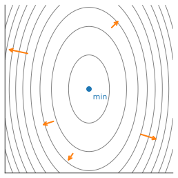

# Multivariable Calculus
:label:`sec_mdl-multivariable_calculus`

A deep network's loss is a function of potentially billions of weights, yet
training rests on a single question asked over and over: how does the loss
change when we nudge the parameters? :numref:`sec_mdl-single_variable_calculus`
answered this for one variable. This section lifts that local-linear picture to
many variables. The central object is the *gradient*, and we will see three
things about it that the rest of deep learning leans on: it is the multivariable
derivative (a first-order approximation), it points in the direction of steepest
change (which is why we descend along it), and organizing the chain rule around
it *is* the backpropagation algorithm. We close with the *Hessian*, the
second-order term that tells a minimum from a saddle.

## From Partial Derivatives to the Gradient

### Partial Derivatives

The one observation we already have is this: if we change a *single* weight
$w_1$ and freeze the rest, we are back to a function of one variable, and
:numref:`sec_mdl-single_variable_calculus` applies verbatim:

$$L(w_1+\epsilon_1, w_2, \ldots, w_N) \approx L(w_1, w_2, \ldots, w_N) + \epsilon_1 \frac{\partial}{\partial w_1} L(w_1, w_2, \ldots, w_N).$$
:eqlabel:`eq_mdl-part_der`

The derivative in one variable *while holding the others fixed* is the *partial
derivative*, written $\frac{\partial}{\partial w_1}$. The new idea is what
happens when we perturb several coordinates at once.

### The Gradient

Suppose we perturb every coordinate, replacing each $w_i$ by $w_i + \epsilon_i$.
Apply :eqref:`eq_mdl-part_der` one coordinate at a time. Changing $w_1$
contributes $\epsilon_1\frac{\partial L}{\partial w_1}$; changing $w_2$
contributes $\epsilon_2\frac{\partial L}{\partial w_2}$, and so on. The
corrections that involve *two* perturbations, like
$\epsilon_1\epsilon_2\frac{\partial^2 L}{\partial w_1 \partial w_2}$, are
products of small quantities — second order — and we discard them exactly as we
discarded $\epsilon^2$ in one variable. What survives is a single sum:

$$
L(w_1+\epsilon_1, \ldots, w_N+\epsilon_N) \approx L(w_1, \ldots, w_N) + \sum_{i=1}^N \epsilon_i \frac{\partial L}{\partial w_i}.
$$

That sum on the right is a dot product. Collecting the perturbations and the
partials into vectors,

$$
\boldsymbol{\epsilon} = [\epsilon_1, \ldots, \epsilon_N]^\top
\quad\textrm{and}\quad
\nabla_{\mathbf{w}} L = \left[\frac{\partial L}{\partial w_1}, \ldots, \frac{\partial L}{\partial w_N}\right]^\top,
$$

we obtain the multivariable analogue of the linear approximation,

$$L(\mathbf{w} + \boldsymbol{\epsilon}) \approx L(\mathbf{w}) + \boldsymbol{\epsilon}\cdot \nabla_{\mathbf{w}} L(\mathbf{w}).$$
:eqlabel:`eq_mdl-nabla_use`

The vector $\nabla_{\mathbf{w}} L$ is the *gradient* of $L$. Equation
:eqref:`eq_mdl-nabla_use` has exactly the shape of the one-dimensional
$f(x+\epsilon) \approx f(x) + \epsilon f'(x)$, with the scalar derivative
replaced by the gradient and ordinary multiplication replaced by a dot product.
The gradient *is* the derivative in many dimensions: it is the unique vector
whose dot product with a perturbation gives the first-order change in $L$. We
treat $\nabla_{\mathbf{w}} L$ as a column vector throughout; the layout
conventions that make this choice precise are settled in
:numref:`sec_mdl-matrix-calculus-autodiff`.

### Directional Derivatives

Reading :eqref:`eq_mdl-nabla_use` for a perturbation $\boldsymbol{\epsilon} =
h\,\mathbf{u}$ of size $h$ along a unit direction $\mathbf{u}$ shows what the
gradient says about *any* direction at once:

$$
\frac{L(\mathbf{w} + h\,\mathbf{u}) - L(\mathbf{w})}{h} \;\xrightarrow{\;h\to 0\;}\; \mathbf{u}\cdot\nabla_{\mathbf{w}} L(\mathbf{w}).
$$

The rate of change of $L$ as we move along $\mathbf{u}$ — the *directional
derivative* — is the projection of the gradient onto $\mathbf{u}$. The single
vector $\nabla_{\mathbf{w}} L$ thus encodes the slope in every direction
simultaneously. The next section turns this one identity into the geometry of
gradient descent.

First, let us check that :eqref:`eq_mdl-nabla_use` really does approximate $L$.
Take

$$
f(x, y) = \log(e^x + e^y), \qquad \nabla f (x, y) = \left[\frac{e^x}{e^x+e^y}, \frac{e^y}{e^x+e^y}\right].
$$

At the point $(0, \log 2)$ we have $f = \log 3$ and $\nabla f = [\tfrac13, \tfrac23]$,
so :eqref:`eq_mdl-nabla_use` predicts
$f(\epsilon_1, \log 2 + \epsilon_2) \approx \log 3 + \tfrac13\epsilon_1 + \tfrac23\epsilon_2$.
We compare this against the true value for a small step.

```{.python .input #multivariable-calculus-higher-dimensional-differentiation}
#@tab mxnet
%matplotlib inline
from d2l import mxnet as d2l
from mxnet import autograd, np, npx
npx.set_np()

def f(x, y):
    return np.log(np.exp(x) + np.exp(y))
def grad_f(x, y):
    return np.array([np.exp(x) / (np.exp(x) + np.exp(y)),
                     np.exp(y) / (np.exp(x) + np.exp(y))])

epsilon = np.array([0.01, -0.03])
grad_approx = f(0, np.log(2)) + epsilon.dot(grad_f(0, np.log(2)))
true_value = f(0 + epsilon[0], np.log(2) + epsilon[1])
f'approximation: {float(grad_approx):.6f}, true value: {float(true_value):.6f}'
```

```{.python .input #multivariable-calculus-higher-dimensional-differentiation}
#@tab pytorch
%matplotlib inline
from d2l import torch as d2l
import torch
import numpy as np

def f(x, y):
    return torch.log(torch.exp(x) + torch.exp(y))
def grad_f(x, y):
    return torch.tensor([torch.exp(x) / (torch.exp(x) + torch.exp(y)),
                     torch.exp(y) / (torch.exp(x) + torch.exp(y))])

epsilon = torch.tensor([0.01, -0.03])
grad_approx = f(torch.tensor([0.]), torch.log(
    torch.tensor([2.]))) + epsilon.dot(
    grad_f(torch.tensor([0.]), torch.log(torch.tensor(2.))))
true_value = f(torch.tensor([0.]) + epsilon[0], torch.log(
    torch.tensor([2.])) + epsilon[1])
f'approximation: {float(grad_approx):.6f}, true value: {float(true_value):.6f}'
```

```{.python .input #multivariable-calculus-higher-dimensional-differentiation}
#@tab tensorflow
%matplotlib inline
from d2l import tensorflow as d2l
import tensorflow as tf
import numpy as np

def f(x, y):
    return tf.math.log(tf.exp(x) + tf.exp(y))
def grad_f(x, y):
    return tf.constant([(tf.exp(x) / (tf.exp(x) + tf.exp(y))).numpy(),
                        (tf.exp(y) / (tf.exp(x) + tf.exp(y))).numpy()])

epsilon = tf.constant([0.01, -0.03])
grad_approx = f(tf.constant(0.), tf.math.log(tf.constant(2.))) + tf.tensordot(
    epsilon, grad_f(tf.constant(0.), tf.math.log(tf.constant(2.))), axes=1)
true_value = f(tf.constant(0.) + epsilon[0], tf.math.log(tf.constant(2.)) + epsilon[1])
f'approximation: {float(grad_approx):.6f}, true value: {float(true_value):.6f}'
```

```{.python .input #multivariable-calculus-higher-dimensional-differentiation}
#@tab jax
%matplotlib inline
from d2l import jax as d2l
import jax
from jax import numpy as jnp
import numpy as np

def f(x, y):
    return jnp.log(jnp.exp(x) + jnp.exp(y))
def grad_f(x, y):
    return jnp.array([jnp.exp(x) / (jnp.exp(x) + jnp.exp(y)),
                      jnp.exp(y) / (jnp.exp(x) + jnp.exp(y))])

epsilon = jnp.array([0.01, -0.03])
grad_approx = f(jnp.array(0.), jnp.log(jnp.array(2.))) + jnp.dot(
    epsilon, grad_f(jnp.array(0.), jnp.log(jnp.array(2.))))
true_value = f(jnp.array(0.) + epsilon[0], jnp.log(jnp.array(2.)) + epsilon[1])
f'approximation: {float(grad_approx):.6f}, true value: {float(true_value):.6f}'
```

The two agree to several digits, as a first-order approximation should for a
small step.

## The Geometry of Gradients

### Steepest Descent

Equation :eqref:`eq_mdl-nabla_use` tells us how $L$ changes in *any* direction,
so we can ask which direction makes it decrease fastest. This is the geometric
content of gradient descent, first introduced in :numref:`sec_autograd`:

1. Start from some initial parameters $\mathbf{w}$.
2. Find the unit direction $\mathbf{v}$ along which $L$ decreases most rapidly.
3. Take a small step that way: $\mathbf{w} \leftarrow \mathbf{w} + \eta\mathbf{v}$.
4. Repeat.

Everything hinges on step 2. Write the gradient's effect on a unit direction
$\mathbf{v}$ using the geometric form of the dot product from
:numref:`sec_mdl-geometry-linear-algebraic-ops`,

$$
L(\mathbf{w} + \mathbf{v}) - L(\mathbf{w}) \approx \mathbf{v}\cdot \nabla_{\mathbf{w}} L(\mathbf{w}) = \|\nabla_{\mathbf{w}} L(\mathbf{w})\|\cos(\theta),
$$

where $\theta$ is the angle between $\mathbf{v}$ and the gradient. The direction
enters only through $\cos\theta$. This is the place to state the result
precisely, because it is the single fact on which all of gradient-based learning
rests.

**Proposition (steepest ascent and descent).** *At any point where
$\nabla L \neq \mathbf{0}$, among all unit vectors $\mathbf{v}$ the directional
derivative $\mathbf{v}\cdot\nabla L$ is largest when $\mathbf{v}$ points along
$+\nabla L$ and smallest when it points along $-\nabla L$. Thus $+\nabla L$ is
the direction of steepest ascent and $-\nabla L$ the direction of steepest
descent.*

**Proof.** By Cauchy–Schwarz (:eqref:`eq_mdl-cauchy-schwarz`) applied to the
unit vector $\mathbf{v}$,

$$
-\|\nabla L\| \;\le\; \mathbf{v}\cdot\nabla L \;\le\; \|\nabla L\|,
$$

and the proposition's equality criterion says each bound is attained exactly
when $\mathbf{v}$ is collinear with $\nabla L$. The upper bound $+\|\nabla L\|$
is reached by $\mathbf{v} = \nabla L/\|\nabla L\|$ and the lower bound
$-\|\nabla L\|$ by $\mathbf{v} = -\nabla L/\|\nabla L\|$. $\blacksquare$

The same statement reads off the page from $\cos\theta$: the directional
derivative $\|\nabla L\|\cos\theta$ is maximized at $\theta = 0$ and minimized
at $\theta = \pi$, so $\mathbf{v}$ should be parallel or antiparallel to the
gradient. Steepest descent therefore steps along $-\nabla_{\mathbf{w}} L$, and
the informal recipe becomes the gradient-descent update

$$
\mathbf{w} \leftarrow \mathbf{w} - \eta\,\nabla_{\mathbf{w}} L(\mathbf{w}).
$$

Every optimizer in this book — momentum, RMSProp, Adam — modifies *how* the step
along the gradient is computed, but they all inherit this core idea: read the
gradient, move against it.

### Gradients and Level Sets

The same expression $L(\mathbf{w} + \mathbf{v}) - L(\mathbf{w}) \approx
\|\nabla L\|\cos\theta$ also reveals what the gradient is *geometrically*, not
just which way to step. Consider moving along a *level set*, the set of points
where $L$ keeps a fixed value $c$. To first order, $L$ does not change along
such a direction, so the directional derivative vanishes.

**Proposition (gradients are normal to level sets).** *At any point, $\nabla L$
is orthogonal to every direction tangent to the level set
$\{\mathbf{x} : L(\mathbf{x}) = c\}$ through that point.*

**Proof.** Let $\mathbf{v}$ be tangent to the level set. Moving along
$\mathbf{v}$ keeps $L$ constant to first order, so
$\mathbf{v}\cdot\nabla L = 0$; by the definition of orthogonality from
:numref:`sec_mdl-geometry-linear-algebraic-ops`, $\mathbf{v}\perp\nabla L$.
$\blacksquare$

So on a contour map the gradient is the arrow crossing the contours at right
angles, pointing toward higher ground, and it is longest where the contours
bunch together — exactly where $L$ changes fastest, as drawn in
:numref:`fig_mdl-cal-gradient-field`. Gradient descent slides *downhill across
the contours*, always perpendicular to them.


:label:`fig_mdl-cal-gradient-field`

### Tangent Planes and Linearization

The level-set picture lives in the *base plane*, where the gradient is the arrow
normal to the contours. There is a companion picture one dimension up, on the
*graph* $z = f(\mathbf{x})$ itself. Reading :eqref:`eq_mdl-nabla_use` as an
equation for the height $z$ rather than as an approximation gives the
*linearization* of $f$ at $\mathbf{x}_0$,

$$
z = f(\mathbf{x}_0) + \nabla f(\mathbf{x}_0)\cdot(\mathbf{x}-\mathbf{x}_0),
$$
:eqlabel:`eq_mdl-tangent_plane`

a linear function of $\mathbf{x}$ whose graph is a plane (a hyperplane in higher
dimensions). It passes through the point $(\mathbf{x}_0, f(\mathbf{x}_0))$ and
matches every first-order slope of $f$ there, so it is the *tangent plane* to the
surface — the two-dimensional analogue of the tangent line, and the surface's
best linear approximation near $\mathbf{x}_0$.

The two pictures are one fact seen from different rooms. Rewrite
:eqref:`eq_mdl-tangent_plane` as $\nabla f(\mathbf{x}_0)\cdot(\mathbf{x}-\mathbf{x}_0) - (z - f(\mathbf{x}_0)) = 0$:
this says the augmented vector $[\nabla f(\mathbf{x}_0),\, -1]^\top$ is normal,
*in graph space*, to the tangent plane — the gradient is normal to the surface
once we account for the height direction. Drop the height coordinate, projecting
that normal straight down onto the base plane, and we recover $\nabla f$ crossing
the level curves at right angles. :numref:`fig_mdl-tangent-plane` shows both at
once: the tangent plane riding the surface, and the gradient's shadow meeting the
contours square on.


:label:`fig_mdl-tangent-plane`

### Critical Points and the First-Order Test

Throughout this book we minimize losses numerically, because the functions that
arise in deep learning are far too complex to minimize in closed form. But the
geometry above gives a cheap, exact *necessary* condition that every minimum
must satisfy, and it is worth pausing on.

Suppose someone hands us a point $\mathbf{x}_0$ and claims it minimizes $L$. Is
the claim even plausible? Read :eqref:`eq_mdl-nabla_use` at $\mathbf{x}_0$: if
$\nabla L(\mathbf{x}_0) \neq \mathbf{0}$, then stepping along
$-\nabla L(\mathbf{x}_0)$ strictly decreases $L$, so $\mathbf{x}_0$ cannot be a
minimum. Contrapositively, **a minimum forces $\nabla L(\mathbf{x}_0) =
\mathbf{0}$.** Points where the gradient vanishes are called *critical points*.

This is occasionally enough to optimize by hand: find every critical point and
compare values. For example,

$$
f(x) = 3x^4 - 4x^3 - 12x^2, \qquad f'(x) = 12x(x-2)(x+1),
$$

has critical points $x = -1, 0, 2$ with values $-5, 0, -32$, so the minimum is
at $x = 2$. A plot confirms it.

```{.python .input #multivariable-calculus-a-note-on-mathematical-optimization}
#@tab mxnet
x = np.arange(-2, 3, 0.01)
f = (3 * x**4) - (4 * x**3) - (12 * x**2)

d2l.plot(x, f, 'x', 'f(x)')
```

```{.python .input #multivariable-calculus-a-note-on-mathematical-optimization}
#@tab pytorch
x = torch.arange(-2, 3, 0.01)
f = (3 * x**4) - (4 * x**3) - (12 * x**2)

d2l.plot(x, f, 'x', 'f(x)')
```

```{.python .input #multivariable-calculus-a-note-on-mathematical-optimization}
#@tab tensorflow
x = tf.range(-2, 3, 0.01)
f = (3 * x**4) - (4 * x**3) - (12 * x**2)

d2l.plot(x, f, 'x', 'f(x)')
```

```{.python .input #multivariable-calculus-a-note-on-mathematical-optimization}
#@tab jax
x = jnp.arange(-2, 3, 0.01)
f = (3 * x**4) - (4 * x**3) - (12 * x**2)

d2l.plot(x, f, 'x', 'f(x)')
```

The lesson cuts both ways: only critical points can be minima or maxima, but not
every critical point is one — $x = 0$ above is a local maximum, and in higher
dimensions a critical point can be a saddle. Telling these apart needs
*second*-order information, which is the Hessian we develop below.

### Optimizing on a Constraint

The first-order test answers "where can an unconstrained minimum be?" One more
turn of the same geometry answers the constrained question that pervades machine
learning — minimize a loss *subject to* keeping some quantity fixed, say
$g(\mathbf{x}) = c$. Now we are no longer free to step in any direction: the
admissible moves are exactly those tangent to the constraint surface
$\{g = c\}$. At a constrained optimum $\mathbf{x}^\star$, *no* admissible
direction can lower $f$ to first order — otherwise we would slide along the
constraint and improve. By :eqref:`eq_mdl-nabla_use` that means
$\nabla f(\mathbf{x}^\star)$ has zero component along every direction tangent to
$\{g = c\}$; it is orthogonal to that surface. But we proved above that
$\nabla g$ is *also* orthogonal to $\{g = c\}$. Two vectors normal to the same
surface must be parallel, so at the constrained optimum

$$
\nabla f(\mathbf{x}^\star) = \lambda\,\nabla g(\mathbf{x}^\star)
$$
:eqlabel:`eq_mdl-lagrange`

for some scalar $\lambda$, the *Lagrange multiplier*. This single picture — the
contours of $f$ kissing the constraint surface where their gradients align — is
the first-order condition for constrained optimization, the seed of the KKT
conditions and of duality. We meet it again in full force in
:numref:`sec_mdl-constrained-optimization-duality`.

## The Multivariate Chain Rule

Neural networks are deep compositions of simple functions, so computing
gradients means differentiating compositions. Consider four inputs $w, x, y, z$
flowing through intermediate quantities to a scalar output:

$$\begin{aligned}f(u, v) & = (u+v)^{2} \\u(a, b) & = (a+b)^{2}, \qquad v(a, b) = (a-b)^{2}, \\a(w, x, y, z) & = (w+x+y+z)^{2}, \qquad b(w, x, y, z) = (w+x-y-z)^2.\end{aligned}$$
:eqlabel:`eq_mdl-multi_func_def`

The dependencies form a graph (:numref:`fig_mdl-chain-1`): each node is a value,
each edge a direct functional dependence.


:label:`fig_mdl-chain-1`

We *could* substitute everything and differentiate the resulting monster
directly, but $\frac{\partial f}{\partial w}$ alone expands into a page of
repeated subexpressions, and $\frac{\partial f}{\partial x}$ would repeat most
of them again. That waste is precisely what the chain rule organizes away.

### The Rule as a Sum Over Paths

Take the simplest composite step, $f(u(a,b), v(a,b))$, and perturb $a$ by a
small $\epsilon$. Each intermediate moves by its partial,
$u \to u + \epsilon\frac{\partial u}{\partial a}$ and
$v \to v + \epsilon\frac{\partial v}{\partial a}$, and feeding those into the
first-order expansion of $f$ gives

$$
f\!\left(u + \epsilon\tfrac{\partial u}{\partial a},\, v + \epsilon\tfrac{\partial v}{\partial a}\right)
\approx f(u, v) + \epsilon\left[\frac{\partial f}{\partial u}\frac{\partial u}{\partial a} + \frac{\partial f}{\partial v}\frac{\partial v}{\partial a}\right].
$$

Reading off the coefficient of $\epsilon$ gives the multivariate chain rule,

$$
\frac{\partial f}{\partial a} = \frac{\partial f}{\partial u}\frac{\partial u}{\partial a} + \frac{\partial f}{\partial v}\frac{\partial v}{\partial a}.
$$

The structure is worth saying in words. There are two *pathways* by which $a$
influences $f$: $a \to u \to f$ and $a \to v \to f$. Each path contributes the
*product* of the derivatives along its edges, and the total derivative is the
*sum* over paths. This is the whole rule.

In general, to differentiate the output with respect to an input we **sum, over
every directed path from that input to the output, the product of the edge
derivatives along the path.**

To see the rule earn its keep on a graph that is not a clean tree, consider a
*different* composition — its own dependency graph, unrelated to
:eqref:`eq_mdl-multi_func_def` — in which one intermediate feeds the output both
directly and through a later node:

$$\begin{aligned}u(x, y) & = x + y, \qquad v(x, y) = x - y, \\a(u) & = u^2, \qquad b(v) = v^2, \\f(a, u, b) & = a + u + b.\end{aligned}$$
:eqlabel:`eq_mdl-multi_func_def_2`

These relations are exactly the edges drawn in :numref:`fig_mdl-chain-2`:
$u$ and $v$ each depend on the input $y$; $a$ depends on $u$ and $b$ on $v$; and
the output $f$ depends on $a$, on $b$, and *also directly on $u$* — the skip-like
edge that gives the middle path below. Tracing every directed route from $y$ to
$f$ — namely $y\to u\to a\to f$, the direct $y\to u\to f$, and
$y\to v\to b\to f$ — the rule gives

$$
\frac{\partial f}{\partial y} = \frac{\partial f}{\partial a} \frac{\partial a}{\partial u} \frac{\partial u}{\partial y} + \frac{\partial f}{\partial u} \frac{\partial u}{\partial y} + \frac{\partial f}{\partial b} \frac{\partial b}{\partial v} \frac{\partial v}{\partial y}.
$$


:label:`fig_mdl-chain-2`

Here every edge derivative is elementary
($\partial f/\partial a = \partial f/\partial u = \partial f/\partial b = 1$,
$\partial a/\partial u = 2u$, $\partial u/\partial y = 1$, and so on), so the
sum-over-paths value is checkable by hand: it collapses to
$2u + 1 - 2v = 2(x+y) + 1 - 2(x-y) = 1 + 4y$. This "sum over paths" view is
exactly how gradients flow through a network, and
it explains why architectural choices that open or close paths — the gates of an
LSTM (:numref:`sec_lstm`) or the skip connections of a residual block
(:numref:`sec_resnet`) — shape learning by controlling that gradient flow.

### The Backpropagation Algorithm

Return to :eqref:`eq_mdl-multi_func_def` and ask for $\frac{\partial f}{\partial
w}$. Applying the chain rule the obvious way pushes $w$ forward through the
graph,

$$
\frac{\partial f}{\partial w} = \frac{\partial f}{\partial u}\frac{\partial u}{\partial w} + \frac{\partial f}{\partial v}\frac{\partial v}{\partial w}, \qquad
\frac{\partial u}{\partial w} = \frac{\partial u}{\partial a}\frac{\partial a}{\partial w}+\frac{\partial u}{\partial b}\frac{\partial b}{\partial w}, \quad \ldots
$$

and the single-step partials are all elementary,

$$
\begin{aligned}
\frac{\partial f}{\partial u} = 2(u+v), & \quad\frac{\partial f}{\partial v} = 2(u+v), \\
\frac{\partial u}{\partial a} = 2(a+b), & \quad\frac{\partial u}{\partial b} = 2(a+b), \\
\frac{\partial v}{\partial a} = 2(a-b), & \quad\frac{\partial v}{\partial b} = -2(a-b), \\
\frac{\partial a}{\partial w} = 2(w+x+y+z), & \quad\frac{\partial b}{\partial w} = 2(w+x-y-z).
\end{aligned}
$$

In code this is a tidy forward sweep through the graph.

```{.python .input #multivariable-calculus-the-backpropagation-algorithm-1}
# Compute the value of the function from inputs to outputs
w, x, y, z = -1, 0, -2, 1
a, b = (w + x + y + z)**2, (w + x - y - z)**2
u, v = (a + b)**2, (a - b)**2
f = (u + v)**2
print(f'    f at {w}, {x}, {y}, {z} is {f}')

# Compute the single step partials
df_du, df_dv = 2*(u + v), 2*(u + v)
du_da, du_db, dv_da, dv_db = 2*(a + b), 2*(a + b), 2*(a - b), -2*(a - b)
da_dw, db_dw = 2*(w + x + y + z), 2*(w + x - y - z)

# Compute the final result from inputs to outputs
du_dw, dv_dw = du_da*da_dw + du_db*db_dw, dv_da*da_dw + dv_db*db_dw
df_dw = df_du*du_dw + df_dv*dv_dw
print(f'df/dw at {w}, {x}, {y}, {z} is {df_dw}')
```

This computes one derivative, $\frac{\partial f}{\partial w}$. The trouble is
that it gives us *no head start* on $\frac{\partial f}{\partial x}$: by keeping
$\partial w$ in every denominator, we organized the work around "how $w$ affects
everything." But in deep learning we want the opposite — how *one* loss is
affected by *every* parameter. So we keep $\partial f$ in every *numerator*
instead, walking the graph from the output backward:

$$
\begin{aligned}
\frac{\partial f}{\partial a} & = \frac{\partial f}{\partial u}\frac{\partial u}{\partial a}+\frac{\partial f}{\partial v}\frac{\partial v}{\partial a}, \qquad
\frac{\partial f}{\partial b} = \frac{\partial f}{\partial u}\frac{\partial u}{\partial b}+\frac{\partial f}{\partial v}\frac{\partial v}{\partial b}, \\
\frac{\partial f}{\partial w} & = \frac{\partial f}{\partial a}\frac{\partial a}{\partial w} + \frac{\partial f}{\partial b}\frac{\partial b}{\partial w}, \qquad (\textrm{and likewise for } x, y, z).
\end{aligned}
$$

Computing $\frac{\partial f}{\partial u}, \frac{\partial f}{\partial v}$ once,
then $\frac{\partial f}{\partial a}, \frac{\partial f}{\partial b}$, then all
four input derivatives, *reuses* every intermediate. One backward sweep yields
the gradient with respect to all inputs at once.

```{.python .input #multivariable-calculus-the-backpropagation-algorithm-2}
# Compute the value of the function from inputs to outputs
w, x, y, z = -1, 0, -2, 1
a, b = (w + x + y + z)**2, (w + x - y - z)**2
u, v = (a + b)**2, (a - b)**2
f = (u + v)**2
print(f'f at {w}, {x}, {y}, {z} is {f}')

# Compute the derivative using the decomposition above
# First compute the single step partials
df_du, df_dv = 2*(u + v), 2*(u + v)
du_da, du_db, dv_da, dv_db = 2*(a + b), 2*(a + b), 2*(a - b), -2*(a - b)
da_dw, db_dw = 2*(w + x + y + z), 2*(w + x - y - z)
da_dx, db_dx = 2*(w + x + y + z), 2*(w + x - y - z)
da_dy, db_dy = 2*(w + x + y + z), -2*(w + x - y - z)
da_dz, db_dz = 2*(w + x + y + z), -2*(w + x - y - z)

# Now compute how f changes when we change any value from output to input
df_da, df_db = df_du*du_da + df_dv*dv_da, df_du*du_db + df_dv*dv_db
df_dw, df_dx = df_da*da_dw + df_db*db_dw, df_da*da_dx + df_db*db_dx
df_dy, df_dz = df_da*da_dy + df_db*db_dy, df_da*da_dz + df_db*db_dz

print(f'df/dw at {w}, {x}, {y}, {z} is {df_dw}')
print(f'df/dx at {w}, {x}, {y}, {z} is {df_dx}')
print(f'df/dy at {w}, {x}, {y}, {z} is {df_dy}')
print(f'df/dz at {w}, {x}, {y}, {z} is {df_dz}')
```

Computing derivatives *from $f$ back toward the inputs*, rather than forward from
the inputs, is what gives the algorithm its name: *backpropagation*. It is two
passes — a *forward pass* that evaluates the function and records the single-step
partials, and a *backward pass* that accumulates $\frac{\partial f}{\partial
\cdot}$ from output to input. This is exactly what every deep learning framework
does to obtain the gradient of the loss with respect to *every* weight in a
single sweep, and it is what `f.backward()` runs under the hood.

```{.python .input #multivariable-calculus-the-backpropagation-algorithm-3}
#@tab mxnet
# Initialize as ndarrays, then attach gradients
w, x, y, z = np.array(-1), np.array(0), np.array(-2), np.array(1)

w.attach_grad()
x.attach_grad()
y.attach_grad()
z.attach_grad()

# Do the computation like usual, tracking gradients
with autograd.record():
    a, b = (w + x + y + z)**2, (w + x - y - z)**2
    u, v = (a + b)**2, (a - b)**2
    f = (u + v)**2

# Execute backward pass
f.backward()

print(f'df/dw at {w}, {x}, {y}, {z} is {w.grad}')
print(f'df/dx at {w}, {x}, {y}, {z} is {x.grad}')
print(f'df/dy at {w}, {x}, {y}, {z} is {y.grad}')
print(f'df/dz at {w}, {x}, {y}, {z} is {z.grad}')
```

```{.python .input #multivariable-calculus-the-backpropagation-algorithm-3}
#@tab pytorch
# Initialize as ndarrays, then attach gradients
w = torch.tensor([-1.], requires_grad=True)
x = torch.tensor([0.], requires_grad=True)
y = torch.tensor([-2.], requires_grad=True)
z = torch.tensor([1.], requires_grad=True)
# Do the computation like usual, tracking gradients
a, b = (w + x + y + z)**2, (w + x - y - z)**2
u, v = (a + b)**2, (a - b)**2
f = (u + v)**2

# Execute backward pass
f.backward()

print(f'df/dw at {w.data.item()}, {x.data.item()}, {y.data.item()}, '
      f'{z.data.item()} is {w.grad.data.item()}')
print(f'df/dx at {w.data.item()}, {x.data.item()}, {y.data.item()}, '
      f'{z.data.item()} is {x.grad.data.item()}')
print(f'df/dy at {w.data.item()}, {x.data.item()}, {y.data.item()}, '
      f'{z.data.item()} is {y.grad.data.item()}')
print(f'df/dz at {w.data.item()}, {x.data.item()}, {y.data.item()}, '
      f'{z.data.item()} is {z.grad.data.item()}')
```

```{.python .input #multivariable-calculus-the-backpropagation-algorithm-3}
#@tab tensorflow
# Initialize as ndarrays, then attach gradients
w = tf.Variable(tf.constant([-1.]))
x = tf.Variable(tf.constant([0.]))
y = tf.Variable(tf.constant([-2.]))
z = tf.Variable(tf.constant([1.]))
# Do the computation like usual, tracking gradients
with tf.GradientTape(persistent=True) as t:
    a, b = (w + x + y + z)**2, (w + x - y - z)**2
    u, v = (a + b)**2, (a - b)**2
    f = (u + v)**2

# Execute backward pass
w_grad = t.gradient(f, w).numpy()
x_grad = t.gradient(f, x).numpy()
y_grad = t.gradient(f, y).numpy()
z_grad = t.gradient(f, z).numpy()

print(f'df/dw at {w.numpy()}, {x.numpy()}, {y.numpy()}, '
      f'{z.numpy()} is {w_grad}')
print(f'df/dx at {w.numpy()}, {x.numpy()}, {y.numpy()}, '
      f'{z.numpy()} is {x_grad}')
print(f'df/dy at {w.numpy()}, {x.numpy()}, {y.numpy()}, '
      f'{z.numpy()} is {y_grad}')
print(f'df/dz at {w.numpy()}, {x.numpy()}, {y.numpy()}, '
      f'{z.numpy()} is {z_grad}')
```

```{.python .input #multivariable-calculus-the-backpropagation-algorithm-3}
#@tab jax
# Define the function to differentiate
def f_comp(w, x, y, z):
    a, b = (w + x + y + z)**2, (w + x - y - z)**2
    u, v = (a + b)**2, (a - b)**2
    return ((u + v)**2).squeeze()

w, x, y, z = jnp.array([-1.]), jnp.array([0.]), jnp.array([-2.]), jnp.array([1.])

# Compute gradients with respect to all four arguments
grad_f = jax.grad(f_comp, argnums=(0, 1, 2, 3))
w_grad, x_grad, y_grad, z_grad = grad_f(w, x, y, z)

print(f'df/dw at {w}, {x}, {y}, {z} is {w_grad}')
print(f'df/dx at {w}, {x}, {y}, {z} is {x_grad}')
print(f'df/dy at {w}, {x}, {y}, {z} is {y_grad}')
print(f'df/dz at {w}, {x}, {y}, {z} is {z_grad}')
```

The framework's automatic answer matches our hand-computed backward pass. The
*why* — that backprop is reverse-mode automatic differentiation, a chain of
vector–Jacobian products, and when to prefer it over forward mode — is the
subject of :numref:`sec_mdl-matrix-calculus-autodiff`.

## Second-Order Structure: the Hessian

The gradient is a first-order, linear approximation; to know whether a critical
point is a minimum we need the *curvature*, which lives in the second
derivatives. A function of $n$ variables has $n^2$ second partials,

$$
\frac{\partial^2 f}{\partial x_i \partial x_j} = \frac{\partial}{\partial x_i}\left(\frac{\partial}{\partial x_j} f\right),
$$

collected into the *Hessian* matrix

$$\mathbf{H}_f = \begin{bmatrix} \frac{\partial^2 f}{\partial x_1 \partial x_1} & \cdots & \frac{\partial^2 f}{\partial x_1 \partial x_n} \\ \vdots & \ddots & \vdots \\ \frac{\partial^2 f}{\partial x_n \partial x_1} & \cdots & \frac{\partial^2 f}{\partial x_n \partial x_n} \\ \end{bmatrix}.$$
:eqlabel:`eq_mdl-hess_def`

These $n^2$ entries are not independent: the Hessian is symmetric.

**Proposition (symmetry of the Hessian; Clairaut).** *If the mixed partials of
$f$ exist and are continuous, then for all $i, j$,*

$$
\frac{\partial^2 f}{\partial x_i \partial x_j} = \frac{\partial^2 f}{\partial x_j \partial x_i},
\qquad\textrm{equivalently}\qquad \mathbf{H}_f = \mathbf{H}_f^\top.
$$

**Proof sketch.** Both mixed partials measure the same thing: the leading
correction to $f$ when we perturb in $x_i$ *and* $x_j$. Perturbing first in
$x_j$ then in $x_i$, versus first in $x_i$ then in $x_j$, produces the same net
change in $f$; continuity of the second partials lets us pass to the limit and
conclude the two orders give the same value. $\blacksquare$

Symmetry matters because it puts the Hessian in the world of symmetric matrices,
where the spectral theorem and positive-definiteness from
:numref:`sec_mdl-eigendecompositions` apply — which is exactly what the
second-derivative test will use.

### The Second-Order Taylor Approximation

Just as the gradient gives the best linear fit, the Hessian gives the best
*quadratic* fit. The cleanest way to see the coefficients is to read them off a
quadratic. Let $f(x_1, x_2) = a + b_1x_1 + b_2x_2 + c_{11}x_1^{2} + c_{12}x_1x_2 + c_{22}x_2^{2}$.
Evaluating the value, gradient, and Hessian :eqref:`eq_mdl-hess_def` at the
origin gives

$$
f(0,0) = a, \qquad
\nabla f (0,0) = \begin{bmatrix}b_1 \\ b_2\end{bmatrix}, \qquad
\mathbf{H} f (0,0) = \begin{bmatrix}2 c_{11} & c_{12} \\ c_{12} & 2c_{22}\end{bmatrix},
$$

and these recover the polynomial exactly:
$f(\mathbf{x}) = f(0) + \nabla f(0) \cdot \mathbf{x} + \tfrac12\mathbf{x}^\top \mathbf{H} f(0)\, \mathbf{x}$.
The same assembly holds at any base point $\mathbf{x}_0$ and for any
twice-differentiable $f$, giving the *second-order Taylor approximation*

$$
f(\mathbf{x}) \approx f(\mathbf{x}_0) + \nabla f (\mathbf{x}_0) \cdot (\mathbf{x}-\mathbf{x}_0) + \frac{1}{2}(\mathbf{x}-\mathbf{x}_0)^\top \mathbf{H} f (\mathbf{x}_0) (\mathbf{x}-\mathbf{x}_0).
$$
:eqlabel:`eq_mdl-second_taylor`

This is the best-approximating quadratic to $f$ near $\mathbf{x}_0$, in any
dimension. To see it, take $f(x, y) = xe^{-x^2-y^2}$. Assembling its value,
gradient, and Hessian at $\mathbf{x}_0 = [-1, 0]^\top$ via
:eqref:`eq_mdl-second_taylor` gives the approximating quadratic
$q(x, y) = e^{-1}\bigl(-1 - (x+1) + (x+1)^2 + y^2\bigr)$.
:numref:`fig_mdl-taylor-quadratic` plots the surface against this quadratic;
near $[-1, 0]^\top$ they hug each other and peel apart only as we move away.


:label:`fig_mdl-taylor-quadratic`

The figure asserts agreement; we can hold it to account numerically, exactly as
we checked the gradient above. Evaluating $f$ and its quadratic $q$ at a few
points stepping away from the base point, the gap should stay tiny nearby and
grow with distance.

```{.python .input #multivariable-calculus-hessians}
import numpy as np

def f(x, y):
    return x * np.exp(-x**2 - y**2)
def quad(x, y):  # 2nd-order Taylor of f at the base point (-1, 0)
    return np.exp(-1) * (-1 - (x + 1) + (x + 1)**2 + y**2)

for d in [0.0, 0.05, 0.1, 0.3]:           # step d in each coordinate from (-1, 0)
    x, y = -1 + d, d
    print(f'step {d:.2f}: f = {f(x, y):.6f}, '
          f'quadratic = {quad(x, y):.6f}, gap = {abs(f(x, y) - quad(x, y)):.6f}')
```

The gap vanishes at the base point and is third order in the step — doubling the
step roughly multiplies it by eight — which is precisely what "best-fitting
quadratic" means. Iterating this idea — repeatedly fit the local quadratic and
jump to *its* minimum — is Newton's method, discussed in :numref:`sec_gd`.

### The Second-Derivative Test

We can now finish the story the first-order test left open: at a critical point,
the Hessian decides whether we sit at a minimum, a maximum, or a saddle. At a
critical point $\mathbf{x}_0$ the gradient term in :eqref:`eq_mdl-second_taylor`
vanishes, so the local picture is purely quadratic,

$$
f(\mathbf{x}) - f(\mathbf{x}_0) \approx \frac{1}{2}(\mathbf{x}-\mathbf{x}_0)^\top \mathbf{H} f (\mathbf{x}_0)(\mathbf{x}-\mathbf{x}_0).
$$

Stepping a unit direction $\mathbf{v}$ away from $\mathbf{x}_0$ makes the
right-hand side $\tfrac12\mathbf{v}^\top\mathbf{H}\mathbf{v}$: the scalar
$\mathbf{v}^\top\mathbf{H}\mathbf{v}$ is the *curvature* of $f$ along
$\mathbf{v}$, the second-order analogue of the directional derivative
$\mathbf{v}\cdot\nabla f$. Whether $f$ goes up or down as we leave $\mathbf{x}_0$
is governed entirely by the sign of this quadratic form — that is, by the
*definiteness* of the symmetric matrix $\mathbf{H}$. The classification is read straight off the
eigenvalues of $\mathbf{H}$ via the PSD/PD criterion of
:numref:`subsec_mdl-psd`:

* $\mathbf{H} \succ 0$ (all eigenvalues positive): $f$ curves *upward* in every
  direction, so $\mathbf{x}_0$ is a strict local **minimum**.
* $\mathbf{H} \prec 0$ (all eigenvalues negative): $f$ curves downward
  everywhere, so $\mathbf{x}_0$ is a local **maximum**.
* $\mathbf{H}$ *indefinite* (eigenvalues of both signs): $f$ rises along some
  directions and falls along others — a **saddle**.
* $\mathbf{H} \succeq 0$ with a zero eigenvalue (semidefinite): the quadratic is
  flat along that eigenvector and second order is *inconclusive*; the behavior
  is decided by higher-order terms.

This is the multivariable generalization of the single-variable test $f'' > 0$:
there, curvature is a single number; here it is a matrix, and "positive
curvature" becomes "positive definite." Identity :eqref:`eq_mdl-quadform` makes
the upward-curving picture precise, writing the quadratic form as a weighted sum
of squares over the eigenvector directions with the eigenvalues as weights.

## A Bridge to Matrix Calculus

Everything above differentiated a *scalar* loss with respect to a vector of
parameters, packaging the partials into the gradient $\nabla L$. Real layers,
however, map *vectors to vectors* and carry *matrix* parameters, so the natural
derivative becomes a matrix of partials — the *Jacobian* — and the gradient and
Hessian are special cases of it. The pleasant surprise is that derivatives of
matrix expressions are often as clean as their scalar analogues: for a fixed
vector $\boldsymbol{\beta}$ one finds
$\frac{\partial}{\partial \mathbf{x}}(\boldsymbol{\beta}^\top\mathbf{x}) =
\boldsymbol{\beta}$, the exact echo of $\frac{d}{dx}(bx) = b$.

We do not develop the Jacobian machinery, the numerator/denominator layout
conventions, the standard matrix-derivative identities, or how all of this
yields backpropagation as reverse-mode automatic differentiation here. That is
the dedicated subject of :numref:`sec_mdl-matrix-calculus-autodiff`, where these
ideas are treated in full.

## Summary

* The *gradient* $\nabla_{\mathbf{w}} L$ is the derivative in many dimensions: it
  gives the first-order change $L(\mathbf{w}+\boldsymbol{\epsilon}) \approx
  L(\mathbf{w}) + \boldsymbol{\epsilon}\cdot\nabla_{\mathbf{w}} L$, and its dot
  product with a unit direction is the rate of change along that direction.
* By Cauchy–Schwarz, $+\nabla L$ is the direction of steepest ascent and
  $-\nabla L$ of steepest descent, and the gradient is everywhere orthogonal to
  the level sets of $L$ — the geometry behind gradient descent.
* The multivariate *chain rule* sums, over every path from an input to the
  output, the product of edge derivatives. Organizing it from the output
  backward reuses every intermediate, giving *backpropagation*: a forward pass
  followed by a backward pass that yields the gradient with respect to all
  parameters at once.
* The symmetric *Hessian* supplies the second-order Taylor approximation; at a
  critical point its definiteness — read from its eigenvalues — distinguishes a
  minimum, a maximum, and a saddle.

## Exercises
1. Let $L(x, y) = \log(e^x + e^y)$. Compute the gradient, and verify that the
   sum of its components is always $1$. What does that say about the directions
   in which $L$ grows fastest?
2. For $f(x, y) = x^2 + 2y^2$, compute $\nabla f$ and verify at a sample point on
   the ellipse $f = c$ that the gradient is orthogonal to the level curve.
3. Prove directly from :eqref:`eq_mdl-nabla_use` that at a local minimum the
   gradient must vanish.
4. Let $f(x, y) = x^2y + xy^2$. Show that $(0,0)$ is the only critical point. By
   examining $f(x, x)$ and $f(x, -x)$, determine whether it is a minimum, a
   maximum, or a saddle, and confirm by computing the Hessian there.
5. Classify the critical point of $f(x, y) = x^2 - y^2$ by inspecting the
   eigenvalues of its (constant) Hessian. Why is this point a saddle?
6. Give a two-variable $f$ whose Hessian at a critical point is positive
   *semidefinite* (one zero eigenvalue) yet the point is not a local minimum.
   Why does the second-derivative test go silent here?
7. Suppose we minimize $f(\mathbf{x}) = g(\mathbf{x}) + h(\mathbf{x})$. Interpret
   the condition $\nabla f = \mathbf{0}$ geometrically in terms of $\nabla g$ and
   $\nabla h$.


:begin_tab:`mxnet`
[Discussions](https://d2l.discourse.group/t/413)
:end_tab:

:begin_tab:`pytorch`
[Discussions](https://d2l.discourse.group/t/1090)
:end_tab:


:begin_tab:`tensorflow`
[Discussions](https://d2l.discourse.group/t/1091)
:end_tab:

:begin_tab:`jax`
[Discussions](https://d2l.discourse.group/t/1091)
:end_tab:

<!-- slides -->

::: {.slide title="Calculus in Many Dimensions"}
Generalize differentiation to many inputs. The **gradient**

$$\nabla f(\mathbf{x}) = [\partial f/\partial x_1, \ldots, \partial f/\partial x_d]^\top$$

points in the direction of steepest ascent; $-\nabla f$
is the descent direction. Local quadratic structure is
captured by the **Hessian** $\nabla^2 f$, the matrix of
second partials.

The deck also covers the **chain rule** in vector form,
and connects it to **backpropagation** — backprop is just
reverse-mode application of the multivariate chain rule.
:::

::: {.slide title="Higher-dimensional differentiation"}
Partial derivatives measure one coordinate at a time; the gradient
bundles them into the vector pointing across level sets.

@multivariable-calculus-higher-dimensional-differentiation
:::

::: {.slide title="Geometry of the gradient"}
$L(\mathbf{w}+\mathbf{v}) - L(\mathbf{w}) \approx \|\nabla L\|\cos\theta$:
steepest ascent at $\theta=0$, steepest descent at $\theta=\pi$
(Cauchy–Schwarz), and $\nabla L \perp$ the level sets. A critical
point $\nabla L = \mathbf{0}$ is *necessary* for a minimum:

@multivariable-calculus-a-note-on-mathematical-optimization
:::

::: {.slide title="Chain rule and backprop"}
Reverse-mode auto-diff = walk the chain rule from outputs
to inputs, accumulating partial derivatives:

@multivariable-calculus-the-backpropagation-algorithm-1

. . .

@multivariable-calculus-the-backpropagation-algorithm-2

. . .

@multivariable-calculus-the-backpropagation-algorithm-3
:::

::: {.slide title="Hessians"}
Curvature in many dimensions. PSD Hessian = local minimum,
mixed signs = saddle, NSD = maximum:

@multivariable-calculus-hessians
:::

::: {.slide title="Recap"}
- Gradient: direction of steepest ascent.
- Hessian: local curvature matrix; eigenvalues classify
  stationary points.
- Backprop = reverse-mode chain rule, $\mathcal{O}(\text{model size})$
  per parameter.
- Same calculus everywhere: GD, Newton, conjugate gradient,
  Adam — they're all approximations to the local Taylor
  expansion of the loss.
:::
