# Single Variable Calculus
:label:`sec_mdl-single_variable_calculus`

In :numref:`sec_calculus`, we met the basic elements of differential calculus. This section goes deeper, building the one-variable theory we actually lean on in deep learning: the derivative as a *local linear model*, the rules that compute it mechanically, and three things that local model is *for* --- it hands us gradient descent, it explains curvature through the second derivative and Taylor series, and it tells us exactly what to do at the corners of a function like $\mathrm{ReLU}$ where the model breaks down.

## The Derivative

Differential calculus is, at heart, the study of how a function behaves under a *small change* of its input. To see why this is the question deep learning cares about, picture a neural network whose weights are stacked into one long vector $\mathbf{w} = (w_1, \ldots, w_n)$, and write $L(\mathbf{w})$ for its loss on a training set. This $L$ is hopelessly complicated --- it encodes the performance of *every* model of the given architecture --- so we cannot simply read off the minimizing $\mathbf{w}$. Instead we initialize $\mathbf{w}$ randomly and take small steps that make $L$ decrease as fast as possible. Everything in this section is in service of one question: *which way is downhill, and by how much?* We answer it first for a single weight: freeze every weight but one, call the free one $x \in \mathbb{R}$, and study the one-variable slice $f(x) = L(w_1, \ldots, x, \ldots, w_n)$.

### Zooming In: Every Smooth Curve Looks Like a Line

Take a point $x$ and nudge it to $x + \epsilon$ for a tiny $\epsilon$ --- if it helps, picture $\epsilon = 10^{-7}$. The decisive observation is geometric. Plot any familiar function, say $f(x) = \sin(x^x)$ on $[0,3]$, and it wiggles in a complicated way; but zoom in on a small window around a point and the wiggles flatten out, until on a small enough scale the graph is indistinguishable from a *straight line*. :numref:`fig_mdl-zoom-sequence` shows this for three successively smaller windows.

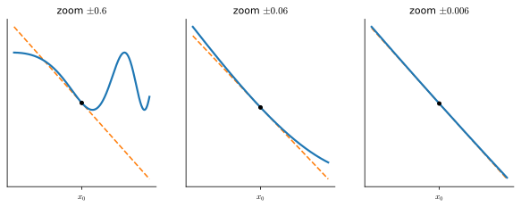
:label:`fig_mdl-zoom-sequence`

This is the founding idea of single-variable calculus: *locally, a smooth function is a line.* So as we shift $x$ by a little, $f(x)$ shifts by a little too, and the only thing left to pin down is the proportionality --- is the output change half the input change? Twice? That ratio is the slope of the line we zoomed in on.

### The Difference Quotient and the Derivative

To measure that slope we compare the change in output to the change in input,

$$
\frac{f(x+\epsilon) - f(x)}{(x+\epsilon) - x} = \frac{f(x+\epsilon) - f(x)}{\epsilon},
$$

the slope of the *secant* line through $(x, f(x))$ and $(x+\epsilon, f(x+\epsilon))$. As $\epsilon$ shrinks, the second point slides toward the first and the secant rotates into the tangent line we saw under the microscope; :numref:`fig_mdl-secant-to-tangent` shows this rotation. We can watch the slope settle down in code. We rely on a single set of imports throughout the section; the few code cells that follow use the framework's own tensor library and the d2l plotting helpers.

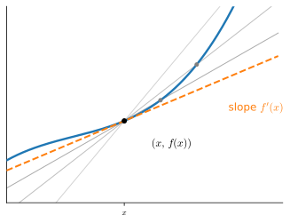
:label:`fig_mdl-secant-to-tangent`

```{.python .input #single-variable-calculus-imports}
#@tab mxnet
%matplotlib inline
import math
from d2l import mxnet as d2l
from mxnet import autograd, np, npx
npx.set_np()
```

```{.python .input #single-variable-calculus-imports}
#@tab pytorch
%matplotlib inline
import math
from d2l import torch as d2l
import torch
```

```{.python .input #single-variable-calculus-imports}
#@tab tensorflow
%matplotlib inline
import math
from d2l import tensorflow as d2l
import tensorflow as tf
tf.pi = tf.acos(tf.zeros(1)).numpy() * 2  # Define pi in TensorFlow
```

```{.python .input #single-variable-calculus-imports}
#@tab jax
%matplotlib inline
import math
from d2l import jax as d2l
import jax
from jax import numpy as jnp
```

Take $f(x) = x^2 + 1701(x-4)^3$ and evaluate the difference quotient at $x = 4$ for shrinking $\epsilon$.

```{.python .input #single-variable-calculus-differential-calculus-4}
# Define our function
def f(x):
    return x**2 + 1701*(x-4)**3

# Slope of the secant through x=4, for shrinking epsilon
for epsilon in [0.1, 0.001, 0.0001, 0.00001]:
    print(f'epsilon = {epsilon:.5f} -> {(f(4+epsilon) - f(4)) / epsilon:.5f}')
```

The numbers march toward $8$, and the smaller $\epsilon$ gets the closer they sit. The cubic is there to make the convergence *visible*: expanding $f(4+\epsilon) - f(4) = 8\epsilon + \epsilon^2 + 1701\,\epsilon^3$, the difference quotient is $8 + \epsilon + 1701\,\epsilon^2$, so the cubic contributes a $1701\,\epsilon^2$ error --- a hefty $17$ at $\epsilon = 0.1$, which is exactly why the top row sits so far off, but a negligible $1.7\times10^{-7}$ once $\epsilon$ reaches $10^{-5}$. So the slope we are after at $x = 4$ is $8$, written

$$
\lim_{\epsilon \rightarrow 0}\frac{f(4+\epsilon) - f(4)}{\epsilon} = 8.
$$

The table only ever creeps toward that limit; the framework's automatic differentiation (:numref:`sec_autograd`) computes it *exactly*. Asking each framework for the slope of the very same $f$ at $x = 4$ returns $8$ on the nose --- no $\epsilon$, no truncation error. This is the machinery the differentiation rules below formalize, and that we rebuild from scratch in :numref:`sec_mdl-matrix-calculus-autodiff`.

```{.python .input #single-variable-calculus-autograd-check}
#@tab mxnet
# Autograd computes the limit exactly: f'(4) = 8
x = np.array(4.0)
x.attach_grad()
with autograd.record():
    y = f(x)
y.backward()
print(f"autograd: f'(4) = {float(x.grad):.1f}")
```

```{.python .input #single-variable-calculus-autograd-check}
#@tab pytorch
# Autograd computes the limit exactly: f'(4) = 8
x = torch.tensor(4.0, requires_grad=True)
f(x).backward()
print(f"autograd: f'(4) = {x.grad.item():.1f}")
```

```{.python .input #single-variable-calculus-autograd-check}
#@tab tensorflow
# Autograd computes the limit exactly: f'(4) = 8
x = tf.Variable(4.0)
with tf.GradientTape() as t:
    y = f(x)
print(f"autograd: f'(4) = {t.gradient(y, x).numpy():.1f}")
```

```{.python .input #single-variable-calculus-autograd-check}
#@tab jax
# Autograd computes the limit exactly: f'(4) = 8
print(f"autograd: f'(4) = {jax.grad(f)(4.0):.1f}")
```

A historical aside. In the first decades of neural-network research this very computation --- the *method of finite differences* --- was how people measured the effect of a weight on the loss: perturb the weight, re-run the network, watch the loss move. It costs an extra evaluation of $L$ per weight --- or two, for the centered differences that halve the truncation error --- so with even a few thousand parameters it is thousands of forward passes for a single gradient. That bottleneck fell in 1986, when the *backpropagation algorithm* popularized by :citet:`Rumelhart.Hinton.Williams.ea.1988` showed how to get the effect of *all* weights at once, at a small constant multiple of the cost of one forward pass --- the *cheap-gradient principle* :cite:`Griewank.Walther.2008`. Backpropagation is the chain rule (below) run in reverse over the network.

The slope is itself a function of $x$, so we name it. The **derivative** of $f$ is

$$\frac{df}{dx}(x) = \lim_{\epsilon \rightarrow 0}\frac{f(x+\epsilon) - f(x)}{\epsilon},$$
:eqlabel:`eq_mdl-der_def`

when the limit exists. (When it fails to --- as at the corner of $\mathrm{ReLU}$ --- we will need the refinement of :numref:`sec_mdl-tangent-fails`.) Many notations denote this same object, and it pays to recognize all of them:

$$
\frac{df}{dx} = \frac{d}{dx}f = f' = D_xf = f_x.
$$

We default to $\frac{df}{dx}$, switching to $\frac{d}{dx}f$ when differentiating a bulky expression such as $\frac{d}{dx}\left[x^4+\cos\left(\frac{x^2+1}{2x-1}\right)\right]$.

### The Small-Change Identity

Rearranging the definition gives the single most useful equation in this section. Since the quotient approaches the derivative, for small $\epsilon$

$$
\frac{f(x+\epsilon) - f(x)}{\epsilon} \approx \frac{df}{dx}(x)
\quad\Longrightarrow\quad
f(x+\epsilon) \approx f(x) + \epsilon \frac{df}{dx}(x).
$$
:eqlabel:`eq_mdl-small_change`

Read it aloud: *nudge the input by $\epsilon$ and the output moves by $\epsilon$ times the derivative.* The derivative is the exchange rate between an input change and the output change it buys. We will use the symbol "$\approx$" throughout to mean "equal up to terms that vanish faster than $\epsilon$ as $\epsilon \to 0$." Almost everything that follows --- the differentiation rules, gradient descent, Taylor series --- is :eqref:`eq_mdl-small_change` applied with a different face on.

## Computing Derivatives
:label:`sec_mdl-derivative_table`

A fully formal course would build every derivative from the limit :eqref:`eq_mdl-der_def`. We take the working mathematician's route instead: a short table of derivatives for the elementary functions, plus a handful of *rules* for combining them, from which any expression built out of sums, products, quotients, and compositions can be differentiated mechanically.

### A Table of Common Derivatives

As in :numref:`sec_calculus`, most derivatives reduce to a few core ones, repeated here for reference.

* **Derivative of constants.** $\frac{d}{dx}c = 0$.
* **Derivative of linear functions.** $\frac{d}{dx}(ax) = a$.
* **Power rule.** $\frac{d}{dx}x^n = nx^{n-1}$.
* **Derivative of exponentials.** $\frac{d}{dx}e^x = e^x$.
* **Derivative of the logarithm.** $\frac{d}{dx}\log(x) = \frac{1}{x}$.
* **Derivative of sine.** $\frac{d}{dx}\sin(x) = \cos(x)$.
* **Derivative of cosine.** $\frac{d}{dx}\cos(x) = -\sin(x)$.

(That $e^x$ is its own derivative is the small-change identity in disguise: $e^{x+\epsilon} = e^x e^{\epsilon} \approx e^x(1 + \epsilon)$, so the coefficient of $\epsilon$ is $e^x$ itself --- taking the first-order expansion $e^{\epsilon} \approx 1 + \epsilon$ as given, since that expansion *is* the table entry at $x = 0$; the aside is intuition for the entry, not an independent proof of it.)

### Four Rules from One Identity

Storing a derivative for every conceivable function is hopeless. What makes calculus tractable is that derivatives respect the ways we *build* functions --- adding, multiplying, dividing, and composing --- so any expression assembled from the table can be differentiated by following the matching rules:

* **Sum rule.** $\frac{d}{dx}\left(g(x) + h(x)\right) = \frac{dg}{dx}(x) + \frac{dh}{dx}(x)$.
* **Product rule.** $\frac{d}{dx}\left(g(x)\, h(x)\right) = g(x)\frac{dh}{dx}(x) + \frac{dg}{dx}(x)h(x)$.
* **Quotient rule.** $\frac{d}{dx}\left(\frac{g(x)}{h(x)}\right) = \frac{\frac{dg}{dx}(x)h(x) - g(x)\frac{dh}{dx}(x)}{h(x)^2}$, valid wherever $h(x)\neq 0$.
* **Chain rule.** $\frac{d}{dx}g(h(x)) = \frac{dg}{dh}(h(x))\cdot \frac{dh}{dx}(x)$.

Each of these is one line of the small-change identity :eqref:`eq_mdl-small_change`. The recipe never varies: write $f(x+\epsilon)$, expand every factor to first order in $\epsilon$, and read off the coefficient of $\epsilon$ --- that coefficient *is* the derivative, because :eqref:`eq_mdl-small_change` says $f(x+\epsilon) \approx f(x) + \epsilon f'(x)$.

**Sum rule.** Expanding each summand,

$$
f(x+\epsilon) = g(x+\epsilon) + h(x+\epsilon)
\approx \Bigl(g(x) + h(x)\Bigr) + \epsilon\left(\frac{dg}{dx}(x) + \frac{dh}{dx}(x)\right),
$$

so the coefficient of $\epsilon$ --- the derivative --- is $\frac{dg}{dx}(x) + \frac{dh}{dx}(x)$. Two changes simply add. $\blacksquare$

**Product rule.** Expanding both factors and multiplying out,

$$
\begin{aligned}
f(x+\epsilon) = g(x+\epsilon)\,h(x+\epsilon)
&\approx \left(g(x) + \epsilon g'(x)\right)\left(h(x) + \epsilon h'(x)\right) \\
&= g(x)h(x) + \epsilon\Bigl(g(x)h'(x) + g'(x)h(x)\Bigr) + \underbrace{\epsilon^2\, g'(x)h'(x)}_{\textrm{higher order}}.
\end{aligned}
$$

The $\epsilon^2$ term is a *higher-order term*: with $\epsilon = 10^{-7}$ it is $10^{-14}$, dwarfed by the $\epsilon$ term, and it vanishes faster than $\epsilon$ as $\epsilon \to 0$. Dropping it, the coefficient of $\epsilon$ gives $g(x)h'(x) + g'(x)h(x)$. The lopsided shape --- *differentiate one factor, leave the other alone, then swap* --- is exactly the two ways a rectangle of sides $g$ and $h$ grows when both sides stretch. (If you want to avoid "$\approx$" entirely, divide the line above by $\epsilon$: the difference quotient equals $g(x)h'(x)+g'(x)h(x) + \epsilon\,g'(x)h'(x)$, whose last term goes to $0$.) $\blacksquare$

**Chain rule.** Compose, then expand the *inner* function first and feed the result into the *outer* one:

$$
\begin{aligned}
f(x+\epsilon) = g\bigl(h(x+\epsilon)\bigr)
&\approx g\!\left(h(x) + \epsilon\, h'(x)\right)
&&\text{(inner: small-change identity)}\\
&\approx g(h(x)) + \epsilon\, h'(x)\, \frac{dg}{dh}(h(x))
&&\text{(outer: small-change identity, with step } \epsilon h'(x)).
\end{aligned}
$$

The coefficient of $\epsilon$ is $\frac{dg}{dh}(h(x))\, h'(x)$: a change in $x$ moves $h$ by $\epsilon h'(x)$, and that in turn moves $g$ by its own derivative times that step --- *the rates multiply*. The one subtlety is the second line, where we fed the *variable* step $\epsilon h'(x)$ into $g$'s small-change identity: because $g$ is differentiable at $h(x)$, its error term is $o(\text{step}) = o(\epsilon h'(x))$, which is still $o(\epsilon)$ and so vanishes faster than the $\epsilon$ we keep. (The borderline case $h'(x) = 0$, where the step degenerates, is handled cleanly by the standard error-function form of the proof --- write $g(h(x)+s) = g(h(x)) + (g'(h(x)) + r(s))\,s$ with $r(s)\to 0$, substitute $s = \epsilon h'(x) + o(\epsilon)$, and the same coefficient drops out.) This chaining of local linear factors, applied across the layers of a network, is precisely backpropagation. (The quotient rule is the product and chain rules applied to $g\cdot h^{-1}$; we leave it as Exercise 2.) $\blacksquare$

One more dividend of the chain rule is the derivative of an **inverse function**. If $g$ undoes $f$, meaning $g(f(x)) = x$, then differentiating both sides gives $g'(f(x))\,f'(x) = 1$, so $g'(y) = 1/f'(g(y))$ wherever $f'(g(y)) \neq 0$: the slope of the inverse is the *reciprocal* slope, read at the matching point --- the graph of $g$ is the graph of $f$ flipped across the diagonal, which turns rise-over-run upside down. This is where the logarithm's entry in the table comes from: $\log$ undoes $e^x$, so $\frac{d}{dx}\log(x) = 1/e^{\log x} = 1/x$. The deep-learning instance is the sigmoid $\sigma(x) = 1/(1+e^{-x})$, with $\sigma' = \sigma(1-\sigma)$, and its inverse the *logit* $\log\frac{p}{1-p}$, whose derivative $\frac{1}{p(1-p)}$ is exactly the reciprocal of $\sigma'$ evaluated at the matching point.

Together these rules let us differentiate essentially anything in closed form. For instance,

$$
\begin{aligned}
\frac{d}{dx}\left[\log\left(1+(x-1)^{10}\right)\right] & = \left(1+(x-1)^{10}\right)^{-1}\frac{d}{dx}\left[1+(x-1)^{10}\right]\\
& = \left(1+(x-1)^{10}\right)^{-1}\left(\frac{d}{dx}[1] + \frac{d}{dx}[(x-1)^{10}]\right) \\
& = \left(1+(x-1)^{10}\right)^{-1}\left(0 + 10(x-1)^9\frac{d}{dx}[x-1]\right) \\
& = 10\left(1+(x-1)^{10}\right)^{-1}(x-1)^9 \\
& = \frac{10(x-1)^9}{1+(x-1)^{10}}.
\end{aligned}
$$

Where each line has used the following rules:

1. The chain rule and derivative of logarithm.
2. The sum rule.
3. The derivative of constants, chain rule, and power rule.
4. The sum rule, derivative of linear functions, derivative of constants.

Two lessons follow. First, *anything* assembled from sums, products, constants, powers, exponentials, and logarithms can be differentiated mechanically. Second, doing so by hand is tedious and error-prone --- a perfect candidate for mechanization, which is exactly what automatic differentiation (:numref:`sec_autograd`) provides.

## Linear Approximation and Gradient Descent

The small-change identity is not only a calculation tool; it is the bridge to optimization. We first read it geometrically as the *tangent line*, then turn it into the gradient-descent step.

### The Tangent Line

Reading :eqref:`eq_mdl-small_change` as a function of the displacement, the line

$$
f(x+\epsilon) \approx f(x) + \epsilon \frac{df}{dx}(x)
$$

passes through $(x, f(x))$ with slope $\frac{df}{dx}(x)$: it is the *tangent* at $x$, the best straight-line model of $f$ nearby and the limit of the rotating secants of :numref:`fig_mdl-secant-to-tangent`. Drawing the tangent at several points of $\sin$, using $\frac{d}{dx}\sin(x) = \cos(x)$, shows each line hugging the curve in a neighborhood and peeling away as we move off.

```{.python .input #single-variable-calculus-linear-approximation}
#@tab mxnet
# Compute sin
xs = np.arange(-np.pi, np.pi, 0.01)
plots = [np.sin(xs)]

# Compute some linear approximations. Use d(sin(x)) / dx = cos(x)
for x0 in [-1.5, 0, 2]:
    plots.append(np.sin(x0) + (xs - x0) * np.cos(x0))

d2l.plot(xs, plots, 'x', 'f(x)', ylim=[-1.5, 1.5])
```

```{.python .input #single-variable-calculus-linear-approximation}
#@tab pytorch
# Compute sin
xs = torch.arange(-torch.pi, torch.pi, 0.01)
plots = [torch.sin(xs)]

# Compute some linear approximations. Use d(sin(x))/dx = cos(x)
for x0 in [-1.5, 0.0, 2.0]:
    plots.append(torch.sin(torch.tensor(x0)) + (xs - x0) *
                 torch.cos(torch.tensor(x0)))

d2l.plot(xs, plots, 'x', 'f(x)', ylim=[-1.5, 1.5])
```

```{.python .input #single-variable-calculus-linear-approximation}
#@tab tensorflow
# Compute sin
xs = tf.range(-tf.pi, tf.pi, 0.01)
plots = [tf.sin(xs)]

# Compute some linear approximations. Use d(sin(x))/dx = cos(x)
for x0 in [-1.5, 0.0, 2.0]:
    plots.append(tf.sin(tf.constant(x0)) + (xs - x0) *
                 tf.cos(tf.constant(x0)))

d2l.plot(xs, plots, 'x', 'f(x)', ylim=[-1.5, 1.5])
```

```{.python .input #single-variable-calculus-linear-approximation}
#@tab jax
# Compute sin
xs = jnp.arange(-jnp.pi, jnp.pi, 0.01)
plots = [jnp.sin(xs)]

# Compute some linear approximations. Use d(sin(x))/dx = cos(x)
for x0 in [-1.5, 0.0, 2.0]:
    plots.append(jnp.sin(x0) + (xs - x0) * jnp.cos(x0))

d2l.plot(xs, plots, 'x', 'f(x)', ylim=[-1.5, 1.5])
```

### The Gradient-Descent Step

Here is the move that powers the rest of deep learning. So far we have *observed* $\epsilon$; now we get to *choose* it. In the small-change identity :eqref:`eq_mdl-small_change` the step $\epsilon$ is ours to pick, and we want to pick it so that $f$ goes *down*. The identity already tells us the price of any step: a step $\epsilon$ buys an output change of about $\epsilon\, f'(x)$. To make that change negative as cheaply as possible, point the step opposite the slope. Take $\epsilon = -\eta\, f'(x)$ for a step size $\eta > 0$ --- and, *if the step is not too large*, the descent is guaranteed.

The qualification matters. The small-change identity by itself only describes the first-order *model*; turning "the model goes down" into "$f$ really goes down" needs control on how fast the slope can change over the step, which is exactly the curvature. The clean hypothesis is that $f'$ is **$L$-Lipschitz** near $x$ --- $|f'(u) - f'(v)| \le L\,|u-v|$ for $u,v$ in a neighborhood --- so the slope cannot swing by more than $L$ per unit of $x$. (If $f$ is twice differentiable this just says $|f''| \le L$ there.) Under that single assumption the first-order *guess* becomes a genuine *inequality*.

**Proposition (descent lemma).** *Suppose $f'$ is $L$-Lipschitz on a neighborhood of $x$. Then for every step size $\eta > 0$ small enough that the segment stays in that neighborhood,*

$$
f\bigl(x - \eta\, f'(x)\bigr) \;\le\; f(x) - \eta\left(1 - \tfrac{L\eta}{2}\right)[f'(x)]^2.
$$
:eqlabel:`eq_mdl-descent`

*In particular $f$ strictly decreases whenever $0 < \eta < 2/L$ and $f'(x) \neq 0$, and the guaranteed decrease is largest at the step $\eta = 1/L$, where the bound reads $f(x - \tfrac1L f'(x)) \le f(x) - \tfrac{1}{2L}[f'(x)]^2$.*

**Proof.** Write the exact change in $f$ along the step as an integral of the slope (the fundamental theorem of calculus, :numref:`sec_mdl-integral_calculus`), then add and subtract the slope at the base point:

$$
f(x+s) - f(x) = \int_0^1 f'(x + t s)\, s \, dt = f'(x)\, s + \int_0^1 \bigl(f'(x + t s) - f'(x)\bigr) s\, dt.
$$

Bounding the remaining integrand with the Lipschitz hypothesis, $|f'(x+ts) - f'(x)| \le L\,|ts| = Lt|s|$, and using $\int_0^1 t\, dt = \tfrac12$ gives $f(x+s) \le f(x) + f'(x)\,s + \tfrac{L}{2}s^2$. Now insert the descent step $s = -\eta\,f'(x)$:

$$
f\bigl(x - \eta\, f'(x)\bigr) \le f(x) - \eta\,[f'(x)]^2 + \tfrac{L}{2}\eta^2 [f'(x)]^2 = f(x) - \eta\left(1 - \tfrac{L\eta}{2}\right)[f'(x)]^2.
$$

The bracket $1 - L\eta/2$ is positive exactly for $\eta < 2/L$, and as a function of $\eta$ the whole coefficient $\eta(1 - L\eta/2)$ is maximized at $\eta = 1/L$. $\blacksquare$

:numref:`fig_mdl-descent-lemma` turns the proof into a picture. The inequality in its middle, $f(x+s) \le f(x) + f'(x)\,s + \tfrac{L}{2}s^2$, says the Lipschitz hypothesis erects a *quadratic ceiling* over the graph, touching it at the base point. Whatever $f$ does underneath, stepping to the ceiling's minimizer --- which is exactly the gradient step with $\eta = 1/L$, at $s = -f'(x)/L$ --- lands where even the ceiling has dropped by $\tfrac{1}{2L}[f'(x)]^2$, so $f$, trapped below it, must have dropped at least as much. The guarantee is a worst-case floor: in the figure the function falls much further than the parabola promises.


:label:`fig_mdl-descent-lemma`

The leading term $-\eta\,[f'(x)]^2$ is the first-order promise of :eqref:`eq_mdl-small_change`; the new $+\tfrac{L}{2}\eta^2[f'(x)]^2$ is the *curvature tax* the model ignored, and the lemma shows it stays a strict bargain as long as $\eta < 2/L$. The square is still the whole point: *whatever* the sign of the slope, moving against it lowers $f$, by an amount proportional to the slope *squared* --- steepest where the function is steepest, vanishing only where $f'(x) = 0$. Iterating the step is **gradient descent**, the one-dimensional version of the loop that trains every network in this book,

$$
x_{t+1} = x_t - \eta\, f'(x_t),
$$
:eqlabel:`eq_mdl-gd-loop`

which is exactly the weight update $\mathbf{w} \leftarrow \mathbf{w} - \eta\,\nabla L(\mathbf{w})$ from the introduction, one coordinate at a time. :numref:`fig_mdl-gd-step` shows a single step: stand at $x$, follow the tangent downhill by $-\eta f'(x)$, and land lower on the curve.

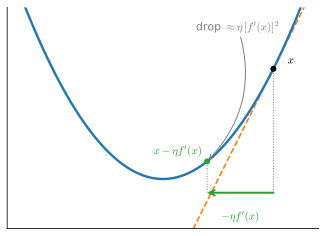
:label:`fig_mdl-gd-step`

Two consequences deserve emphasis. The descent stalls *exactly* at the **stationary condition** $f'(x) = 0$: the update stops moving and :eqref:`eq_mdl-descent` predicts no further decrease, which is why $f'(x) = 0$ is the equation we solve to find candidate minima. And the descent lemma pins down what "too large a step" means: the guaranteed decrease holds only for $\eta < 2/L$, and at $\eta = 2/L$ the curvature tax exactly cancels the first-order gain. Push $\eta$ past $2/L$ and the bound flips sign --- a single step can overshoot the minimum and *increase* $f$, the failure mode analyzed at length in :numref:`sec_gd`. So the Lipschitz constant $L$ of the slope --- the curvature, which the second derivative measures next --- is precisely what sets how large $\eta$ may safely be.

We can see all of this on the cleanest possible example, $f(x) = x^2$, whose slope is $f'(x) = 2x$. The gradient-descent step becomes

$$
x_{t+1} = x_t - \eta\,(2x_t) = (1 - 2\eta)\, x_t,
$$

a simple geometric recursion with closed form $x_t = (1-2\eta)^t x_0$. So the iterates converge to the minimum $x = 0$ exactly when $|1 - 2\eta| < 1$, i.e. for $0 < \eta < 1$ --- and this is the descent lemma made exact, since here $f'' \equiv 2$ so $L = 2$ and the safe range $\eta < 2/L = 1$ is precisely the convergence threshold. Within it, tiny $\eta$ creeps in monotonically, the optimal $\eta = 1/L = \tfrac12$ jumps to the minimum in one step, $\tfrac12 < \eta < 1$ overshoots and oscillates inward, $\eta = 1$ oscillates forever between $\pm x_0$, and $\eta > 1$ diverges. The next code cell runs the recursion for a sweep of step sizes, prints where each lands after ten steps, and plots the five trajectories $x_t$.

```{.python .input #single-variable-calculus-gradient-descent}
# Gradient descent on f(x) = x^2 from x0 = 1, for several step sizes
def gd(eta, steps=10, x0=1.0):
    xs = [x0]
    for _ in range(steps):
        xs.append(xs[-1] - eta * (2 * xs[-1]))  # x <- x - eta * f'(x)
    return xs

etas = [0.05, 0.5, 0.9, 1.0, 1.1]
trajectories = [gd(eta) for eta in etas]
for eta, xs in zip(etas, trajectories):
    print(f'eta = {eta:.2f} -> x_10 = {xs[-1]:+.5f}')
d2l.plot(list(range(11)), trajectories, 'step t', 'x_t', ylim=[-2.5, 2.5],
         legend=[f'eta = {eta}' for eta in etas],
         fmts=('-', 'm--', 'g-.', 'r:', 'c-'))
```

The printout and the picture tell the same story, one regime per curve: $\eta = 0.05$ creeps toward $0$ monotonically, $\eta = 0.5$ lands on it in a single step, $\eta = 0.9$ converges while zig-zagging across the minimum, $\eta = 1.0$ bounces between $\pm 1$ forever, and $\eta = 1.1$ oscillates with *growing* amplitude --- it has left the plotting window within a handful of steps and reaches $|x_{10}| \approx 6.2$. The threshold $\eta = 2/L$ separating the last two regimes is exactly where the descent lemma's guarantee expires.

## Curvature and Taylor Series

The first derivative gave us the best *line* through a point. Its own derivative --- the second derivative --- measures how the slope itself bends, which is what distinguishes a minimum from a maximum and what limited the step size above. Pushing the idea to higher derivatives yields the *Taylor series*, the best polynomial model of a function.

### Higher-Order Derivatives and Curvature

The derivative $\frac{df}{dx}$ is itself a function, so nothing stops us from differentiating it again. Doing so yields the *second derivative*, $\frac{d^2f}{dx^2} = \frac{d}{dx}\!\left(\frac{df}{dx}\right)$ --- the derivative *operator* applied twice, **not** the square of $\frac{df}{dx}$. It is the rate of change of the rate of change: how the slope itself is changing. Repeating gives the $n$-th derivative,

$$
f^{(n)}(x) = \frac{d^{n}f}{dx^{n}} = \left(\frac{d}{dx}\right)^{n} f.
$$

What does the second derivative *tell* us? Its **sign** is the direction the curve bends, and read *locally* this is the classifier we need for optimization. Suppose $x_0$ is a stationary point, $f'(x_0) = 0$. The second derivative is the rate of change of the slope, so $f''(x_0) > 0$ means the slope is *increasing* as it passes through $0$: just left of $x_0$ the slope is negative ($f$ falling), just right of $x_0$ it is positive ($f$ rising). The function dips and turns back up, so $x_0$ is a **local minimum**. Symmetrically, $f''(x_0) < 0$ means the slope is decreasing through $0$ --- positive then negative --- so $f$ rises and turns back down and $x_0$ is a **local maximum**. This is the **second-derivative test**, and it certifies *only the neighborhood* of $x_0$, not the whole function; the global picture, when $f$ is convex, is the subject of :numref:`sec_gd`.

The three constant-curvature functions are the cleanest pictures of what each sign *means*, even though most functions have a varying $f''$. A positive constant $f''$ keeps the slope increasing everywhere, so $f'$ runs from negative through zero to positive and the graph is a single upward bowl (:numref:`fig_mdl-positive-second`) --- exactly the bowl that gradient descent rolls into.

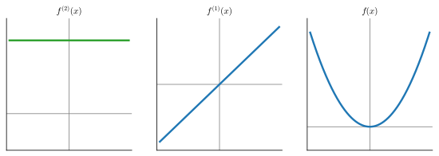
:label:`fig_mdl-positive-second`

A negative constant $f''$ keeps the slope decreasing, running from positive through zero to negative --- the upward dome of a maximum (:numref:`fig_mdl-negative-second`).

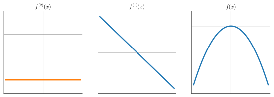
:label:`fig_mdl-negative-second`

And a zero $f''$ leaves the slope unchanged: $f$ rises or falls at a fixed rate and is a straight **line** with no curvature at all (:numref:`fig_mdl-zero-second`), the borderline the test cannot decide.

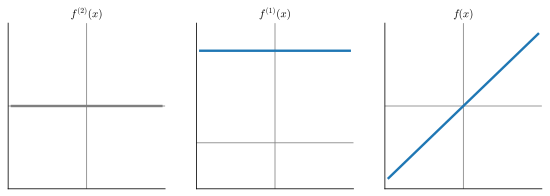
:label:`fig_mdl-zero-second`

In short, the *sign* of the second derivative at a stationary point decides minimum versus maximum --- positive curves up into a min, negative curves down into a max, zero is undecided. (This is the one-dimensional shadow of the Hessian eigenvalue test for many variables in :numref:`sec_mdl-multivariable_calculus`.)

### The Mean Value Theorem
:label:`sec_mdl-mvt`

We have been spending the derivative freely: a vanishing slope marks a candidate extremum, a negative slope means the function is falling. Both deductions read information about $f$ *itself* off its derivative at single points, and the one theorem that licenses every such reading is the **Mean Value Theorem**. Its statement is a picture (:numref:`fig_mdl-mvt`): draw the secant chord joining the endpoints of the graph over $[a,b]$; somewhere inside, the tangent runs *parallel* to it. The average rate of change is achieved exactly, as an instantaneous rate, at some interior point.

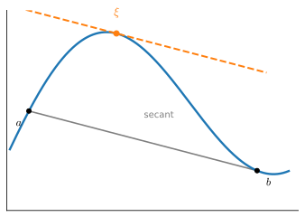
:label:`fig_mdl-mvt`

**Proposition (Mean Value Theorem).** *If $f$ is continuous on $[a,b]$ and differentiable on $(a,b)$, then there is a point $\xi \in (a,b)$ with*

$$
f'(\xi) = \frac{f(b) - f(a)}{b - a}.
$$
:eqlabel:`eq_mdl-mvt`

**Proof.** First take the flat case $f(a) = f(b)$ (Rolle's theorem): a continuous function on a closed interval attains a maximum and a minimum. If both occur at the endpoints then $f$ is constant and $f' \equiv 0$ inside; otherwise an extremum sits at some interior $\xi$ --- say a maximum, so $f(\xi + \epsilon) - f(\xi) \le 0$ on both sides. The difference quotient is then $\le 0$ for $\epsilon > 0$ and $\ge 0$ for $\epsilon < 0$, and since $f$ is differentiable at $\xi$ both one-sided limits equal $f'(\xi)$; a number that is both $\le 0$ and $\ge 0$ is zero, so $f'(\xi) = 0$ (a minimum is symmetric). For the general case, subtract off the chord: the tilted function $g(x) = f(x) - \frac{f(b)-f(a)}{b-a}(x - a)$ has $g(a) = g(b) = f(a)$, so the flat case gives a $\xi$ with $g'(\xi) = 0$, which is exactly :eqref:`eq_mdl-mvt`. $\blacksquare$

Two corollaries are the facts we already used. If $f' > 0$ throughout an interval then for any $x_1 < x_2$ in it, :eqref:`eq_mdl-mvt` gives $f(x_2) - f(x_1) = f'(\xi)(x_2 - x_1) > 0$ for some $\xi$ between them, so $f$ is **increasing** --- a positive slope really does mean the function climbs, and the sign of $f'$ governs monotonicity. And if $f$ has a *constant* sign of $f'$ on each side of a stationary point, the theorem turns that into the rise-and-fall behaviour the second-derivative test read off. The Mean Value Theorem is the formal bridge from *the derivative at a point* to *the behaviour of the function on an interval*.

### The Best Quadratic, and the Taylor Idea

The first derivative built the best line; the second lets us build the best *parabola*. Consider a generic quadratic $g(x) = ax^2 + bx + c$, for which

$$
\begin{aligned}
\frac{dg}{dx}(x) & = 2ax + b \\
\frac{d^2g}{dx^2}(x) & = 2a.
\end{aligned}
$$

A quadratic has three free coefficients, so we can match three pieces of information about $f$ at a base point $x_0$: its value, slope, and curvature. Demanding $g(x_0) = f(x_0)$, $g'(x_0) = f'(x_0)$, and $g''(x_0) = f''(x_0)$ pins down $a$, $b$, $c$ uniquely and produces the best local *quadratic* model, just as the tangent was the best local *line*. For $f(x) = \sin(x)$ at base point $x_0$, using $\frac{d}{dx}\sin(x) = \cos(x)$ and $\frac{d^2}{dx^2}\sin(x) = -\sin(x)$, the model reads

$$
g(x) = \sin(x_0) + \cos(x_0)\,(x - x_0) - \tfrac{1}{2}\sin(x_0)\,(x-x_0)^2,
$$

a parabola that hugs the curve over a visibly wider window than the tangent lines we plotted above, because it captures curvature as well as slope; :numref:`fig_mdl-best-parabola` draws all three together. We will make the "wider window" claim quantitative, and verify it in code, once the Taylor remainder is on the table. But first, the quadratic model pays an immediate dividend for optimization.

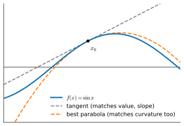
:label:`fig_mdl-best-parabola`

### Newton's Method
:label:`subsec_mdl-newton`

The best quadratic is not just a better picture; it is a better *optimizer*. Gradient descent treats the local model as a line --- and a line has no minimum, so we had to be told how far to walk down it by the step size $\eta$. The quadratic model has a minimum of its own, and we can simply jump there. Writing the model at the current iterate $x_t$ (with $f''(x_t) > 0$ so it opens upward),

$$
q(x) = f(x_t) + f'(x_t)\,(x - x_t) + \tfrac{1}{2}f''(x_t)\,(x - x_t)^2,
$$

and solving $q'(x) = f'(x_t) + f''(x_t)(x - x_t) = 0$ for $x$ gives the update of **Newton's method**:

$$
x_{t+1} = x_t - \frac{f'(x_t)}{f''(x_t)}.
$$
:eqlabel:`eq_mdl-newton`

Read against the gradient-descent loop :eqref:`eq_mdl-gd-loop`, this is the same step with the hand-tuned $\eta$ replaced by the *curvature-adapted* step size $1/f''(x_t)$: sharp curvature prescribes caution, gentle curvature boldness. On $f(x) = x^2$ it sets $\eta = 1/f'' = \tfrac12$ --- exactly the one-shot optimal step we found by hand --- and started close enough to a minimum with $f'' > 0$ (and $f''$ itself smooth), the iteration converges *quadratically*, roughly doubling the number of correct digits per step. The price is the curvature itself: where $f''(x_t) \le 0$ the model's "minimum" is a maximum or does not exist and the raw step must be safeguarded, and in $n$ dimensions $f''$ becomes the Hessian matrix, so each step requires solving an $n \times n$ linear system. How this trade plays out at deep-learning scale --- and why first-order methods win there anyway --- is taken up in :numref:`sec_mdl-gradient-based-optimization`.

The quadratic convergence is easy to watch. Take $f(x) = \tfrac14 x^4 - x$, whose stationarity condition $f'(x) = x^3 - 1 = 0$ has the root $x^* = 1$; the next cell iterates :eqref:`eq_mdl-newton` from $x_0 = 2$ and prints the error at each step.

```{.python .input #mdl-single-variable-calculus-newton-s-method}
# Newton's method on f(x) = x^4/4 - x: solve f'(x) = x^3 - 1 = 0, root x* = 1
x = 2.0
for t in range(6):
    print(f't = {t}: x = {x:.12f}, error = {abs(x - 1):.1e}')
    x = x - (x**3 - 1) / (3 * x**2)  # x - f'(x) / f''(x)
```

Read the error column's exponents: after a couple of settling-in steps they go $10^{-2} \to 10^{-4} \to 10^{-8}$ --- each step roughly *squares* the previous error, doubling the number of correct digits. Contrast the $\eta$-sweep above, where gradient descent shrinks the error by the same fixed factor $|1 - 2\eta|$ every step: geometric convergence gains a fixed number of digits per step, Newton doubles them. Matching yet *more* derivatives with higher-degree polynomials is the Taylor series, to which we now turn.

### Taylor Series

The *Taylor series* generalizes the tangent and the best parabola: given the value and first $n$ derivatives of $f$ at a base point $x_0$, find the degree-$n$ polynomial that matches all of them. The quadratic case, rewritten in displacement from $x_0$, is

$$
f(x) \approx f(x_0) + \frac{df}{dx}(x_0)(x-x_0) + \frac{1}{2}\frac{d^2f}{dx^2}(x_0)(x-x_0)^{2}.
$$

The factor $\tfrac12$ is bookkeeping: differentiating $(x-x_0)^2$ twice produces a $2$, and dividing by $2$ leaves the coefficient equal to $f''(x_0)$, while all lower terms differentiate to zero at $x_0$. The same accounting at degree $3$ produces a $3! = 6$,

$$
f(x) \approx f(x_0) + \frac{df}{dx}(x_0)(x-x_0) + \frac{\frac{d^2f}{dx^2}(x_0)}{2}(x-x_0)^{2} + \frac{\frac{d^3f}{dx^3}(x_0)}{6}(x-x_0)^3,
$$

and in general the $i$-th term carries an $i!$, giving the degree-$n$ **Taylor polynomial**

$$
P_n(x) = \sum_{i = 0}^{n} \frac{f^{(i)}(x_0)}{i!}(x-x_0)^{i},
$$

the best degree-$n$ polynomial approximation to $f$ near $x_0$.

How good is it? The Mean Value Theorem answers exactly, in the form of the **Lagrange remainder**: if $f$ is $(n+1)$-times differentiable between $x_0$ and $x$, then

$$
f(x) = P_n(x) + R_n(x), \qquad R_n(x) = \frac{f^{(n+1)}(\xi)}{(n+1)!}\,(x - x_0)^{n+1},
$$
:eqlabel:`eq_mdl-lagrange`

for some $\xi$ strictly between $x_0$ and $x$. (Indeed $n = 0$ is just the Mean Value Theorem :eqref:`eq_mdl-mvt`, $f(x) = f(x_0) + f'(\xi)(x - x_0)$; the higher orders follow by the same chord-subtraction argument applied $n+1$ times.) The remainder is one term *past* the polynomial, evaluated at an unknown interior $\xi$ instead of at $x_0$. It makes "the approximation improves near $x_0$" quantitative: the error shrinks like $|x - x_0|^{n+1}$, so each extra matched derivative buys another power of closeness. The case $n = 1$ is the curvature tax we already met --- $R_1 = \tfrac12 f''(\xi)(x-x_0)^2$ is exactly the $\tfrac{L}{2}\eta^2$ term bounded in the descent lemma :eqref:`eq_mdl-descent` --- and the same quadratic remainder is what Newton's method (:numref:`subsec_mdl-newton`) drives to zero by stepping to the minimum of $P_2$ rather than $P_1$.

That rate is checkable, and checking it is the promised measurement of "how much wider a window" each extra derivative buys. The next cell takes $f(x) = e^x$ at $x_0 = 0$, measures the worst error of $P_n$ over a window $|x| \le h$, and then halves the window: if the error scales like $h^{n+1}$, halving $h$ should divide it by $2^{n+1}$ --- by $4$ for the tangent line, $8$ for the best quadratic, $16$ for the cubic.

```{.python .input #single-variable-calculus-taylor-error-rate}
# Max error of the degree-n Taylor polynomial of e^x on the window |x| <= h.
# Lagrange predicts error ~ h^(n+1): halving h should divide it by 2^(n+1)
def taylor_error(n, h, m=1000):
    coeffs = [1.0, 1.0, 1 / 2, 1 / 6]  # 1/k! for k = 0, ..., 3
    err = 0.0
    for i in range(-m, m + 1):
        x = h * i / m
        err = max(err, abs(math.exp(x) - sum(coeffs[k] * x**k
                                             for k in range(n + 1))))
    return err

for n in [1, 2, 3]:
    e1, e2 = taylor_error(n, 0.2), taylor_error(n, 0.1)
    print(f'n = {n}: max error {e1:.1e} (h = 0.2) vs {e2:.1e} (h = 0.1), '
          f'ratio = {e1 / e2:.1f}, prediction 2^{n + 1} = {2**(n + 1)}')
```

The measured ratios $4.1$, $8.2$, $16.3$ sit right on the predicted $4$, $8$, $16$ --- the tangent line's error falls fourfold per halving while the cubic's falls sixteenfold, which is exactly why higher-degree models hug the curve over wider windows. (The slight overshoot is also predicted: the remainder's $e^{\xi}$ factor is a touch larger over the wider window.)

Letting $n \to \infty$ gives the full *Taylor series*. For well-behaved functions --- the *real analytic* ones, such as $\cos(x)$ and $e^{x}$ --- the infinitely many terms reproduce the function exactly:

$$
f(x) = \sum_{n = 0}^\infty \frac{f^{(n)}(x_0)}{n!}(x-x_0)^{n}.
$$

A word of caution is in order, because two separate things can go wrong. The equality above holds only *where the series converges* **and** $f$ is *real analytic* there --- convergence of the series is not the same as convergence *to $f$*. Being infinitely differentiable (smooth) is not enough for either. The classic counterexample is $f(x) = e^{-1/x^2}$ (with $f(0) = 0$), which is smooth everywhere yet has $f^{(n)}(0) = 0$ for every $n$; its Taylor series at $x_0 = 0$ is identically zero --- it converges on the *whole line*, but to the zero function, reproducing $f$ only at $x = 0$ itself (:numref:`fig_mdl-smooth-not-analytic`). So an infinite radius of convergence guarantees nothing about agreement with $f$. In practice we mostly use the *finite* truncations $P_n$, whose error :eqref:`eq_mdl-lagrange` we can bound directly, and which sharpen the closer $x$ is to $x_0$.

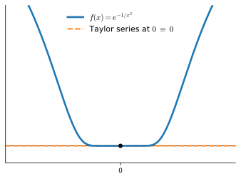
:label:`fig_mdl-smooth-not-analytic`

Take $f(x) = e^{x}$ as an example. Since $e^{x}$ is its own derivative, we know that $f^{(n)}(x) = e^{x}$. Therefore, $e^{x}$ can be reconstructed by taking the Taylor series at $x_0 = 0$, i.e.,

$$
e^{x} = \sum_{n = 0}^\infty \frac{x^{n}}{n!} = 1 + x + \frac{x^2}{2} + \frac{x^3}{6} + \cdots.
$$

Let's see how this works in code and observe how increasing the degree of the Taylor approximation brings us closer to the desired function $e^x$.

```{.python .input #single-variable-calculus-taylor-series}
#@tab mxnet
# Compute the exponential function
xs = np.arange(0, 3, 0.01)
ys = np.exp(xs)

# Compute a few Taylor series approximations
P1 = 1 + xs
P2 = 1 + xs + xs**2 / 2
P5 = 1 + xs + xs**2 / 2 + xs**3 / 6 + xs**4 / 24 + xs**5 / 120

d2l.plot(xs, [ys, P1, P2, P5], 'x', 'f(x)', legend=[
    "Exponential", "Degree 1 Taylor Series", "Degree 2 Taylor Series",
    "Degree 5 Taylor Series"])
```

```{.python .input #single-variable-calculus-taylor-series}
#@tab pytorch
# Compute the exponential function
xs = torch.arange(0, 3, 0.01)
ys = torch.exp(xs)

# Compute a few Taylor series approximations
P1 = 1 + xs
P2 = 1 + xs + xs**2 / 2
P5 = 1 + xs + xs**2 / 2 + xs**3 / 6 + xs**4 / 24 + xs**5 / 120

d2l.plot(xs, [ys, P1, P2, P5], 'x', 'f(x)', legend=[
    "Exponential", "Degree 1 Taylor Series", "Degree 2 Taylor Series",
    "Degree 5 Taylor Series"])
```

```{.python .input #single-variable-calculus-taylor-series}
#@tab tensorflow
# Compute the exponential function
xs = tf.range(0, 3, 0.01)
ys = tf.exp(xs)

# Compute a few Taylor series approximations
P1 = 1 + xs
P2 = 1 + xs + xs**2 / 2
P5 = 1 + xs + xs**2 / 2 + xs**3 / 6 + xs**4 / 24 + xs**5 / 120

d2l.plot(xs, [ys, P1, P2, P5], 'x', 'f(x)', legend=[
    "Exponential", "Degree 1 Taylor Series", "Degree 2 Taylor Series",
    "Degree 5 Taylor Series"])
```

```{.python .input #single-variable-calculus-taylor-series}
#@tab jax
# Compute the exponential function
xs = jnp.arange(0, 3, 0.01)
ys = jnp.exp(xs)

# Compute a few Taylor series approximations
P1 = 1 + xs
P2 = 1 + xs + xs**2 / 2
P5 = 1 + xs + xs**2 / 2 + xs**3 / 6 + xs**4 / 24 + xs**5 / 120

d2l.plot(xs, [ys, P1, P2, P5], 'x', 'f(x)', legend=[
    "Exponential", "Degree 1 Taylor Series", "Degree 2 Taylor Series",
    "Degree 5 Taylor Series"])
```

Taylor series earn their keep in two ways. *Theoretically*, replacing an unwieldy function by its low-degree polynomial makes it tractable --- the first-order term is what gave us gradient descent, the second-order term is the curvature behind Newton's method and step-size limits. *Numerically*, functions like $e^x$ and $\cos(x)$ are computed in practice by evaluating a truncated series (with a remainder bound to control the error), the basic trick behind the math libraries every framework calls.

## When the Tangent Fails
:label:`sec_mdl-tangent-fails`

Everything so far rested on the "zoom in and see a line" picture: a smooth function looks linear up close, so the limit :eqref:`eq_mdl-der_def` exists. But the activation that built modern deep learning, $\mathrm{ReLU}(x) = \max(0, x)$, has a *corner* at the origin, and so does $|x|$. At a corner the microscope never settles on one line, and the ordinary derivative is undefined. This section says exactly what goes wrong, what to use instead, and why stochastic gradient descent is unbothered.

### One-Sided Derivatives

The trouble is visible directly in the difference quotient :eqref:`eq_mdl-der_def`. For $f(x) = |x|$ at $x = 0$,

$$
\frac{|0+\epsilon| - |0|}{\epsilon} = \frac{|\epsilon|}{\epsilon} =
\begin{cases} +1 & \epsilon > 0, \\ -1 & \epsilon < 0. \end{cases}
$$

The two sides give different limits, so no single number is *the* slope: approaching from the right the function rises with slope $+1$, from the left it falls with slope $-1$. These are the **one-sided derivatives** $f'_+(0) = +1$ and $f'_-(0) = -1$. The ordinary two-sided derivative exists only when they agree. For $\mathrm{ReLU}$ at $0$ the same computation gives $f'_-(0) = 0$ (flat on the left) and $f'_+(0) = 1$ (slope $1$ on the right). We can confirm the $|x|$ case numerically.

```{.python .input #single-variable-calculus-one-sided}
# One-sided difference quotients of |x| at 0
for epsilon in [0.1, 0.001, 0.0001, 0.00001]:
    right = (abs(0 + epsilon) - abs(0)) / epsilon
    left = (abs(0 - epsilon) - abs(0)) / (-epsilon)
    print(f'epsilon = {epsilon:.5f} -> left = {left:+.1f}, right = {right:+.1f}')
```

### Subgradients and Optimality

The fix is to stop insisting on a *single* tangent and allow *all* the lines that stay below the graph. A number $g$ is a **subgradient** of a convex $f$ at $x$ if

$$
f(y) \ge f(x) + g\,(y - x) \quad \textrm{for all } y,
$$
:eqlabel:`eq_mdl-subgrad`

i.e. the line through $(x, f(x))$ with slope $g$ is a global underestimate of $f$. The set of all such slopes is the **subdifferential** $\partial f(x)$. Away from a corner it is the single ordinary slope; at a corner it is the whole interval *between* the one-sided derivatives, the "fan" of supporting lines shown in :numref:`fig_mdl-relu-corner`:

$$
\partial |x|(0) = [-1, 1], \qquad \partial\, \mathrm{ReLU}(0) = [0, 1].
$$

The two panels of :numref:`fig_mdl-relu-corner` show both. For $|x|$ the corner is symmetric, so every slope from $-1$ to $+1$ underestimates the graph and $\partial|x|(0) = [-1,1]$; for $\mathrm{ReLU}$ the left arm is flat, so the admissible slopes run only from $0$ to $1$ and $\partial\,\mathrm{ReLU}(0) = [0,1]$. Off the corner each is differentiable and the subdifferential collapses to the single ordinary slope.

![Two corners and their subdifferentials. Left: $|x|$ has a symmetric corner at the origin, and every line through it with slope between $-1$ and $+1$ stays on or below the graph, so the subdifferential $\partial|x|(0)$ runs from $-1$ to $+1$. Right: $\mathrm{ReLU}(x) = \max(0,x)$, the activation that built modern deep learning, is flat to the left, so its admissible slopes run only from $0$ to $1$, giving the subdifferential $\partial\,\mathrm{ReLU}(0)$. Off each corner there is a single tangent and the subdifferential collapses to the ordinary derivative.](../img/mdl-cal-relu-corner.svg)
:label:`fig_mdl-relu-corner`

The subgradient pays off immediately in optimization. For differentiable $f$ a minimum requires $f'(x) = 0$; the subgradient version is the inclusion

$$
0 \in \partial f(x).
$$
:eqlabel:`eq_mdl-subopt`

This is no harder to prove than its smooth cousin: taking $g = 0$ in :eqref:`eq_mdl-subgrad` reads $f(y) \ge f(x)$ for all $y$, which is precisely the statement that $x$ is a global minimum. For $|x|$ at $0$ we have $0 \in [-1,1] = \partial|x|(0)$, correctly certifying the origin as the minimum even though no derivative exists there --- exactly the case the smooth test $f'(x)=0$ cannot reach.

### Why SGD Shrugs

This is not a corner case that breaks training --- but the standard reassurance is sloppier than it looks, so it is worth being precise about what frameworks actually do and why it works anyway. One clarification first, so the convexity above is not over-read: a deep network's loss surface is wildly *non*-convex, while the subdifferential :eqref:`eq_mdl-subgrad` is a *convex*-function notion. The kinks in a network come from convex building blocks --- $|x|$, $\mathrm{ReLU}$, the hinge loss $\max(0, 1-x)$ --- and what autograd does at each kink is simple: it returns *one fixed element* of that piece's subdifferential (all four frameworks in this book report $\mathrm{ReLU}'(0) = 0$) and lets the chain rule propagate that choice through the surrounding, nonconvex composition.

Two honest caveats keep this from sounding like more than it is. First, even for a convex function a subgradient step need not be a *descent* step: at the minimum of $|x|$ the perfectly valid subgradient $g = \tfrac12 \in \partial|x|(0)$ sends the update to $x = -\eta/2$ and *increases* the function --- the subgradient method of convex optimization converges by shrinking its step sizes, not by descending monotonically. Second, the chain rule carries no warranty at kinks: chaining per-kink choices can produce a number that is not a subgradient of the composite *at all*. The cleanest failure is the identity in disguise

$$
g(x) = \mathrm{ReLU}(x) - \mathrm{ReLU}(-x) = x \quad \textrm{for all } x,
$$

whose only correct slope at $0$ is $1$. The chain rule gives $g'(x) = \mathrm{ReLU}'(x) + \mathrm{ReLU}'(-x)$, which is indeed $1$ everywhere *except* at the kink, where the fixed convention makes it $0 + 0 = 0$. The next cell runs exactly this computation.

```{.python .input #mdl-single-variable-calculus-why-sgd-shrugs}
#@tab mxnet
# g(x) = relu(x) - relu(-x) is the identity, so the true slope at 0 is 1
x = np.array(0.0)
x.attach_grad()
with autograd.record():
    g = npx.relu(x) - npx.relu(-x)
g.backward()
print(f"autograd: g'(0) = {float(x.grad):.1f}  (true slope: 1.0)")
```

```{.python .input #mdl-single-variable-calculus-why-sgd-shrugs}
#@tab pytorch
# g(x) = relu(x) - relu(-x) is the identity, so the true slope at 0 is 1
x = torch.tensor(0.0, requires_grad=True)
g = torch.relu(x) - torch.relu(-x)
g.backward()
print(f"autograd: g'(0) = {x.grad.item():.1f}  (true slope: 1.0)")
```

```{.python .input #mdl-single-variable-calculus-why-sgd-shrugs}
#@tab tensorflow
# g(x) = relu(x) - relu(-x) is the identity, so the true slope at 0 is 1
x = tf.Variable(0.0)
with tf.GradientTape() as t:
    g = tf.nn.relu(x) - tf.nn.relu(-x)
print(f"autograd: g'(0) = {t.gradient(g, x).numpy():.1f}  (true slope: 1.0)")
```

```{.python .input #mdl-single-variable-calculus-why-sgd-shrugs}
#@tab jax
# g(x) = relu(x) - relu(-x) is the identity, so the true slope at 0 is 1
g = lambda x: jax.nn.relu(x) - jax.nn.relu(-x)
print(f"autograd: g'(0) = {jax.grad(g)(0.0):.1f}  (true slope: 1.0)")
```

Every framework dutifully reports slope $0$ for a function that *is* the identity: the per-kink convention $\mathrm{ReLU}'(0) = 0$, chained, produces a number that is not a subgradient of $g$ at $0$ at all. What automatic differentiation computes at nonsmooth points is, in general, not a subgradient but an element of a *conservative field* :cite:`Bolte.Pauwels.2021` --- a relaxed gradient notion that agrees with the true derivative everywhere outside a measure-zero set (that a Lipschitz function even *has* a true derivative outside a measure-zero set is Rademacher's theorem), and for which convergence guarantees for SGD can still be proved.

That measure-zero set is the entire reason SGD shrugs: a randomly drawn point lands in it with probability zero. Between random initialization, minibatch noise, and floating-point jitter, stochastic training essentially never evaluates a derivative exactly at a corner, so at every step it actually takes, the framework's answer is the honest derivative of a locally smooth function. The convex-analysis machinery is developed further in :numref:`sec_gd`; the lesson here is that the local-linear program survives at corners not because the fixed per-kink choice is always meaningful, but because training never asks the question exactly at the kink.

## Summary

* The derivative is the *local linear model* of a function: $f(x+\epsilon) \approx f(x) + \epsilon f'(x)$. It is the slope of the line a smooth curve flattens onto when we zoom in, and the limit of difference quotients.
* The derivatives of elementary functions, combined with the sum, product, and chain rules, differentiate any expression mechanically. Each rule is the small-change identity expanded to first order; the chain rule run in reverse over a network is backpropagation.
* Choosing the step $\epsilon = -\eta f'(x)$ in the local model predicts a decrease of $\eta[f'(x)]^2$. When the slope is $L$-Lipschitz the *descent lemma* turns this into a genuine guarantee $f(x - \eta f'(x)) \le f(x) - \eta(1 - L\eta/2)[f'(x)]^2$, a strict drop for $0 < \eta < 2/L$ (best at $\eta = 1/L$). Descent stalls at the stationary points $f'(x) = 0$, and a step past $2/L$ can *increase* $f$ when curvature overwhelms the first-order gain.
* The second derivative is curvature: its sign decides minimum vs. maximum, and Taylor series extend the line and parabola to the best polynomial model of any order.
* At corners like $\mathrm{ReLU}(0)$ the derivative is undefined, but the *subdifferential* supplies a set of valid slopes ($\partial|x|(0) = [-1,1]$) and optimality becomes $0 \in \partial f(x)$. Frameworks return one fixed element per kink ($\mathrm{ReLU}'(0) = 0$); chained through a composition that value can fail to be a subgradient at the kinks themselves, but the kinks form a measure-zero set that stochastic training hits with probability zero --- so SGD trains unharmed.

## Exercises

1. Compute the derivative of $x^3 - 4x + 1$, and of $\log\!\left(\frac{1}{x}\right)$ for $x > 0$.
2. Derive the quotient rule from the product and chain rules by writing $\frac{g(x)}{h(x)} = g(x)\cdot\left(h(x)\right)^{-1}$ and using the power rule with $n = -1$ for the outer function. Check your result on $\tan(x) = \frac{\sin(x)}{\cos(x)}$: you should find $\frac{d}{dx}\tan(x) = \frac{1}{\cos^2(x)}$.
3. True or false: if $f'(x) = 0$ then $f$ has a maximum or a minimum at $x$. If false, give a counterexample and the test that distinguishes the cases.
4. Find the minimum of $f(x) = x\log(x)$ for $x \ge 0$ (take the limiting value $f(0) = 0$).
5. The first-order model predicts $f(x - \eta f'(x)) \approx f(x) - \eta[f'(x)]^2$. Starting from the small-change identity, derive this prediction and name the term it discards. Then extend the descent lemma to the vector case: for $f: \mathbb{R}^n \to \mathbb{R}$ with an $L$-Lipschitz gradient ($\|\nabla f(\mathbf{u}) - \nabla f(\mathbf{v})\| \le L\|\mathbf{u} - \mathbf{v}\|$), show that $f(\mathbf{x} - \eta\nabla f(\mathbf{x})) \le f(\mathbf{x}) - \eta\left(1 - \tfrac{L\eta}{2}\right)\|\nabla f(\mathbf{x})\|^2$. (*Hint:* repeat the proof of :eqref:`eq_mdl-descent` along the segment $\mathbf{x} + t\mathbf{s}$ with $\mathbf{s} = -\eta\nabla f(\mathbf{x})$, bounding the integral with the Cauchy--Schwarz inequality.)
6. For $f(x) = x^2$, find *all* step sizes $\eta$ for which gradient descent from $x_0 \neq 0$ converges to the minimum, and the one $\eta$ that reaches it in a single step. (*Hint:* use $x_{t+1} = (1-2\eta)x_t$.)
7. Give a function $f$ and a step size $\eta$ for which a single gradient-descent step *increases* $f$, and explain the failure: which hypothesis of the descent lemma :eqref:`eq_mdl-descent` is violated, or is $\eta$ simply past $2/L$? (*Hint:* $f(x) = x^2$ with $\eta > 1$ already does it.)
8. Relate the one-dimensional update $x \leftarrow x - \eta f'(x)$ to the vector update $\mathbf{w} \leftarrow \mathbf{w} - \eta\nabla L(\mathbf{w})$ from the introduction.
9. Compute the subdifferentials $\partial\,\mathrm{ReLU}(0)$ and $\partial|x|(0)$. Which of $\{0,\, 0.5,\, 1\}$ are valid subgradients of $\mathrm{ReLU}$ at $0$? Sketch the subdifferential of the hinge loss $\max(0, 1 - x)$.
10. Use the degree-$5$ Taylor polynomial of $e^x$ at $x_0 = 0$ to estimate $e$, and compare with the true value.


:begin_tab:`mxnet`
[Discussions](https://d2l.discourse.group/t/412)
:end_tab:

:begin_tab:`pytorch`
[Discussions](https://d2l.discourse.group/t/1088)
:end_tab:


:begin_tab:`tensorflow`
[Discussions](https://d2l.discourse.group/t/1089)
:end_tab:

:begin_tab:`jax`
[Discussions](https://d2l.discourse.group/t/1089)
:end_tab:

<!-- slides -->

::: {.slide}
::: {.cover}
[Dive into Deep Learning · §23.1]{.kicker}

The local linear model behind every optimizer<br>**the derivative · gradient descent · curvature · Taylor · corners**.
:::
:::

::: {.slide title="Which way is downhill?"}
[Motivation]{.kicker}

::: {.cols .vc}
::: {.col}
Training stacks every weight into one vector $\mathbf{w}$ and minimizes a loss $L(\mathbf{w})$ too tangled to solve outright. So we step downhill instead.

Freeze every weight but one and the loss becomes a curve $f(x)$ in a single variable. The whole section answers one question about it:

::: {.d2l-note}
*Which way is downhill, and by how much?* The derivative answers both at once.
:::
:::

::: {.col .fig}
{width=98%}
:::
:::
:::

::: {.slide}
::: {.divider}
[01]{.dnum}

[The derivative]{.dtitle}

[zooming in, secants, and the tangent slope]{.dsub}
:::
:::

::: {.slide title="Every smooth curve is a line, up close"}
[The derivative]{.kicker}

The founding idea of calculus: zoom in on any smooth function and the wiggles flatten until the graph is *indistinguishable from a straight line*, the tangent, whose slope is all that is left to pin down.

::: {.cols .vc}
::: {.col .fig .big}
@fig:mdl-cal-zoom-sequence
:::
:::
:::

::: {.slide title="From secant to tangent"}
[The derivative]{.kicker}

::: {.cols .vc}
::: {.col}
The **difference quotient** is the slope of the *secant* through two nearby points:

$$\frac{f(x+\epsilon) - f(x)}{\epsilon}.$$

As $\epsilon \to 0$ the second point slides in and the secant rotates into the tangent, whose limiting slope is the **derivative** $f'(x)$.
:::

::: {.col .fig}
{width=98%}
:::
:::
:::

::: {.slide title="Watch the slope settle"}
[The derivative]{.kicker}

The secant slope of $f(x) = x^2 + 1701(x-4)^3$ at $x=4$ marches toward $8$ as $\epsilon$ shrinks:

@single-variable-calculus-differential-calculus-4

. . .

The table only *creeps*; autograd returns it *exactly*, no $\epsilon$:

@!single-variable-calculus-autograd-check
:::

::: {.slide title="The small-change identity"}
[The derivative]{.kicker}

Rearranging the limit gives the most useful equation in the section:

::: {.d2l-note .rule}
$$f(x+\epsilon) \approx f(x) + \epsilon\,f'(x).$$
:::

*Nudge the input by $\epsilon$, the output moves by $\epsilon$ times the derivative.* The derivative is the **exchange rate** between an input change and the output change it buys, and the differentiation rules, gradient descent, and Taylor series are all this one line wearing a different face.
:::

::: {.slide}
::: {.divider}
[02]{.dnum}

[Linear approximation & descent]{.dtitle}

[the tangent line becomes a step downhill]{.dsub}
:::
:::

::: {.slide title="The tangent line is the best local model"}
[Optimization]{.kicker}

::: {.cols .vc}
::: {.col}
Read as a function of the displacement, $f(x+\epsilon) \approx f(x) + \epsilon f'(x)$ is the **tangent line** at $x$, the best straight-line model of $f$ nearby.

Drawn at three points of $\sin$ (using $\tfrac{d}{dx}\sin = \cos$), each line hugs the curve in a neighborhood and peels away beyond it.
:::

::: {.col .fig}
@!single-variable-calculus-linear-approximation
:::
:::
:::

::: {.slide title="The gradient-descent step"}
[Optimization]{.kicker}

::: {.cols .vc}
::: {.col}
Now we *choose* the step. Take $\epsilon = -\eta\,f'(x)$ with step size $\eta > 0$: moving against the slope makes the model drop by

$$\approx \eta\,[f'(x)]^2 \ge 0.$$

Whatever the sign of $f'$, stepping against it lowers $f$, by an amount proportional to the slope *squared*. Iterating is **gradient descent**, $x_{t+1} = x_t - \eta f'(x_t)$.
:::

::: {.col .fig}
@fig:mdl-cal-gd-step
:::
:::
:::

::: {.slide title="The descent lemma, in one picture"}
[Optimization]{.kicker}

::: {.cols .vc}
::: {.col .fig .big}
@fig:mdl-cal-descent-lemma
:::

::: {.col}
If the slope is $L$-Lipschitz, the curvature erects a **quadratic ceiling** $f(x) + f'(x)s + \tfrac{L}{2}s^2$ that touches the graph at the base point.

Stepping to the ceiling's minimizer (the gradient step with $\eta = 1/L$) drops $f$ by at least $\tfrac{1}{2L}[f'(x)]^2$:

$$f\!\left(x - \eta f'(x)\right) \le f(x) - \eta\!\left(1 - \tfrac{L\eta}{2}\right)[f'(x)]^2.$$

A strict decrease for every $0 < \eta < 2/L$.
:::
:::
:::

::: {.slide title="Five step sizes, five regimes"}
[Optimization]{.kicker}

::: {.cols .vc}
::: {.col .fig .big}
@!single-variable-calculus-gradient-descent
:::

::: {.col}
Gradient descent on $f(x) = x^2$ ($L = 2$) from $x_0 = 1$, ten steps each.

Creep ($\eta{=}0.05$), one-shot ($\tfrac12{=}1/L$), zig-zag ($0.9$), bounce ($1.0$), diverge ($1.1$): the threshold $\eta = 2/L$ is where the lemma's guarantee expires.
:::
:::
:::

::: {.slide}
::: {.divider}
[03]{.dnum}

[Curvature & Taylor]{.dtitle}

[the second derivative and the best polynomial]{.dsub}
:::
:::

::: {.slide title="The second derivative is curvature"}
[Curvature]{.kicker}

At a stationary point ($f'=0$) the *sign* of $f''$ decides the shape: up into a **minimum**, down into a **maximum**, flat is **undecided**. This is the second-derivative test.

::: {.cols}
::: {.col .fig}
{width=98%}
:::

::: {.col .fig}
{width=98%}
:::

::: {.col .fig}
{width=98%}
:::
:::
:::

::: {.slide title="The Mean Value Theorem"}
[Curvature]{.kicker}

::: {.cols .vc}
::: {.col}
The bridge from *the derivative at a point* to *the behavior of $f$ on an interval*: the average rate of change is hit exactly, somewhere inside.

$$f'(\xi) = \frac{f(b) - f(a)}{b - a}\quad\text{for some }\xi \in (a,b).$$

It is why a positive slope means $f$ climbs, and what makes the Taylor remainder precise.
:::

::: {.col .fig}
{width=98%}
:::
:::
:::

::: {.slide title="The best parabola → Newton's method"}
[Curvature]{.kicker}

::: {.cols .vc}
::: {.col}
Matching value, slope, **and** curvature gives the best local *parabola*, which hugs the curve over a wider window than the tangent. It has a minimum of its own, so jump straight to it: **Newton's method** $x_{t+1} = x_t - f'(x_t)/f''(x_t)$.

This is gradient descent with $\eta$ replaced by the curvature-adapted $1/f''(x_t)$: sharp curvature, caution; gentle, boldness.
:::

::: {.col .fig}
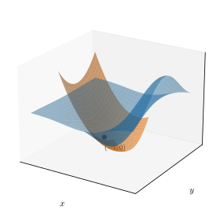{width=74%}
:::
:::
:::

::: {.slide title="Taylor series: the best degree-$n$ polynomial"}
[Curvature]{.kicker}

::: {.cols .vc}
::: {.col}
Matching the first $n$ derivatives at $x_0$ gives the **Taylor polynomial**

$$P_n(x) = \sum_{i=0}^{n} \frac{f^{(i)}(x_0)}{i!}(x-x_0)^i.$$

For $e^x$ at $x_0 = 0$, raising the degree visibly tightens the fit to the curve.
:::

::: {.col .fig}
@!single-variable-calculus-taylor-series
:::
:::
:::

::: {.slide title="Each derivative buys a power of closeness"}
[Curvature]{.kicker}

The Lagrange remainder makes "the approximation improves near $x_0$" quantitative: the error shrinks like $|x - x_0|^{n+1}$, so halving the window should divide the worst error by $2^{n+1}$:

@!single-variable-calculus-taylor-error-rate

The measured ratios land right on the predicted $4$, $8$, $16$: each extra matched derivative buys a power of closeness, which is why higher degree hugs the curve over wider windows.
:::

::: {.slide title="Smooth is not analytic"}
[Curvature]{.kicker}

::: {.cols .vc}
::: {.col}
A warning before we lean on infinite series. The function $f(x) = e^{-1/x^2}$ is smooth everywhere, yet *every* derivative at $0$ vanishes.

Its Taylor series at $0$ is identically zero: it converges on the whole line, but **to the zero function**, agreeing with $f$ only at the origin. Convergence of the series is not convergence *to $f$*.
:::

::: {.col .fig}
{width=98%}
:::
:::
:::

::: {.slide}
::: {.divider}
[04]{.dnum}

[When the tangent fails]{.dtitle}

[corners, subgradients, and why SGD shrugs]{.dsub}
:::
:::

::: {.slide title="Corners: no single tangent"}
[Nonsmooth]{.kicker}

::: {.cols .vc}
::: {.col .fig .big}
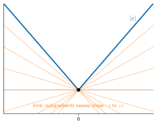{width=98%}
:::

::: {.col}
At a corner ($|x|$, $\mathrm{ReLU}$) the one-sided slopes differ, so no single tangent exists. The **subdifferential** collects every valid slope:

$$\partial|x|(0) = [-1,1],\quad \partial\,\mathrm{ReLU}(0) = [0,1].$$

Optimality relaxes from $f'(x)=0$ to the inclusion $0 \in \partial f(x)$.
:::
:::
:::

::: {.slide title="The split is in the difference quotient"}
[Nonsmooth]{.kicker}

The one-sided quotients of $|x|$ at $0$ never agree: slope $+1$ from the right, $-1$ from the left, at every scale:

@single-variable-calculus-one-sided

That gap *is* the corner: the two-sided derivative exists only when the one-sided slopes coincide.
:::

::: {.slide title="Why SGD shrugs"}
[Nonsmooth]{.kicker}

At each kink, autograd just returns *one fixed element* of the subdifferential (all four frameworks report $\mathrm{ReLU}'(0) = 0$) and lets the chain rule carry it through.

::: {.d2l-note}
Chained through a composition, that choice can fail to be a subgradient *at the kink*. But the kinks form a **measure-zero set**, and between random init, minibatch noise, and float jitter, training essentially never lands exactly on one, so every step it actually takes is the honest derivative of a locally smooth function.
:::
:::

::: {.slide title="Recap"}
[Wrap-up]{.kicker}

::: {.cols}
::: {.col}
- **Derivative** = slope the curve flattens onto = limit of secants.
- **Small-change identity** $f(x+\epsilon)\approx f(x)+\epsilon f'(x)$ generates everything.
- First-order term → **gradient descent** $x \leftarrow x - \eta f'(x)$, safe for $\eta < 2/L$.
:::

::: {.col}
- Second derivative = **curvature**; its sign is the min/max test.
- Quadratic term → **Newton's method** $x_{t+1} = x_t - f'(x_t)/f''(x_t)$.
- At corners use the **subgradient** ($0 \in \partial f$); SGD shrugs, since kinks are measure-zero.
:::
:::
:::
