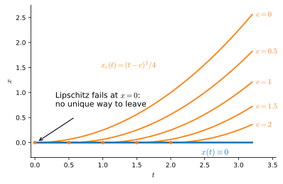
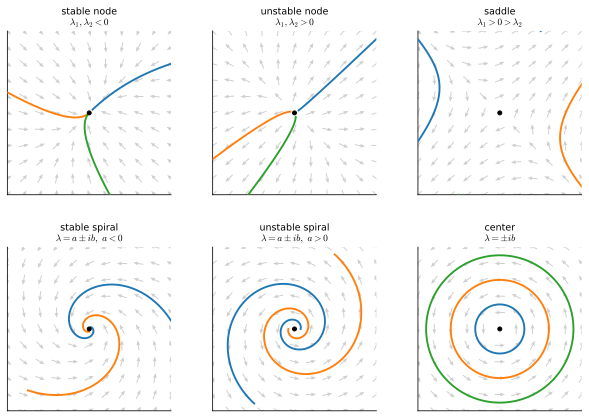
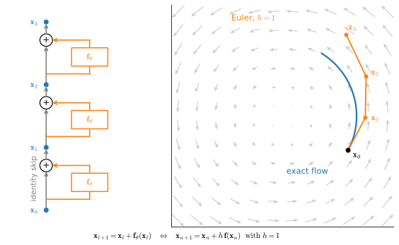

# Ordinary Differential Equations and Numerical Solvers
:label:`sec_mdl-odes-solvers`

Every continuous-time generative model --- Neural ODEs, continuous normalizing
flows, and the deterministic samplers of diffusion and flow matching --- is an
**ordinary differential equation that you integrate**. This section builds the
mathematics of that integration from the ground up: what a vector field is,
when a trajectory exists and is unique, how eigenvalues decide stability, and
how numerical solvers trade step size for accuracy. The payoff is a set of
conceptual unifications that the rest of this chapter leans on: *a residual
block is one Euler step*, *backpropagation through an ODE is reverse-mode
automatic differentiation*, and *the log-det-Jacobian of a normalizing flow
becomes a trace integral*. The stochastic counterpart of the Euler method
arrives in :numref:`sec_mdl-euler-maruyama`, the probability-flow ODE that
turns a diffusion model into a deterministic flow in
:numref:`sec_mdl-fokker-planck-probability-flow`, and the solvers studied here
set the step-count/quality tradeoff of every sampler in
:numref:`sec_mdl-score-matching-diffusion-flow`.

One idea organizes everything. An ODE is a *velocity rule*: at every point of
space (and time) it tells you which way to move and how fast. A solution is
the path you trace by always following the local arrow; a numerical solver is
a recipe for following arrows in finite steps; a deep residual network *is*
such a recipe, with its layers as the steps; and a density transported by the
flow changes at a rate read off the field's Jacobian. Theory, numerics, and
architecture are one picture.

We lean on :numref:`sec_mdl-eigendecompositions` (eigenvalues and
eigenvectors --- that section promised the matrix exponential, and we build it
here), :numref:`sec_mdl-multivariable_calculus` (Jacobians, Taylor expansion),
:numref:`sec_mdl-matrix-calculus-autodiff` (reverse-mode AD as vector--Jacobian
products), :numref:`sec_mdl-integral_calculus` (the integrals being
approximated), and :numref:`sec_mdl-random_variables` (the change-of-variables
formula for densities). The numerical demonstrations are deliberately
framework-free --- plain NumPy, because every solver is a handful of lines ---
until we *train* a Neural ODE, which we do once in each framework.

```{.python .input #odes-solvers-imports}
#@tab mxnet
%matplotlib inline
from d2l import mxnet as d2l
from mxnet import autograd, gluon, init, np as mnp, npx
from mxnet.gluon import nn
import numpy as np
npx.set_np()
```

```{.python .input #odes-solvers-imports}
#@tab pytorch
%matplotlib inline
from d2l import torch as d2l
import numpy as np
import torch
```

```{.python .input #odes-solvers-imports}
#@tab tensorflow
%matplotlib inline
from d2l import tensorflow as d2l
import numpy as np
import tensorflow as tf
```

```{.python .input #odes-solvers-imports}
#@tab jax
%matplotlib inline
from d2l import jax as d2l
import jax
from jax import numpy as jnp
import numpy as np
```

## Vector Fields, Trajectories, and Well-Posedness
:label:`sec_mdl-vector-fields-trajectories`

### Velocity Fields and Integral Curves

An **initial-value problem** specifies a velocity rule and a starting point:

$$
\dot{\mathbf{x}}(t) = \mathbf{f}(\mathbf{x}(t), t),
\qquad \mathbf{x}(0) = \mathbf{x}_0,
$$
:eqlabel:`eq_mdl-ode-ivp`

where $\mathbf{x}(t) \in \mathbb{R}^d$ is the state, the dot is the time
derivative, and $\mathbf{f} : \mathbb{R}^d \times \mathbb{R} \to \mathbb{R}^d$
is a **vector field**: a function that attaches an arrow to every point. A
**trajectory** (or *integral curve*) is a differentiable path whose tangent
matches the field everywhere --- at each instant, the particle moves with
exactly the velocity the field prescribes at its current location. When
$\mathbf{f}$ does not depend on $t$ we call the system **autonomous**; the
arrows are frozen and only the particle moves. :numref:`fig_mdl-dyn-ode-field`
shows the picture to keep in mind: a grid of arrows, and curves threading
through them, everywhere tangent.


:label:`fig_mdl-dyn-ode-field`

Integrating both sides of :eqref:`eq_mdl-ode-ivp` from $0$ to $t$
(:numref:`sec_mdl-integral_calculus`) gives the equivalent **integral form**

$$
\mathbf{x}(t) = \mathbf{x}_0 + \int_0^t \mathbf{f}(\mathbf{x}(s), s)\,ds,
$$
:eqlabel:`eq_mdl-ode-integral-form`

which trades the derivative for an accumulation of velocities. This form does
real work twice over: it is the fixed-point equation behind the existence
theorem below, and it is what every numerical solver approximates --- Euler's
method is the left-endpoint Riemann sum of this very integral.

Two scalar warm-ups anchor the notation. For $\dot{x} = -x$, the rule "move
toward zero at a speed proportional to your distance" is solved by
$x(t) = e^{-t} x_0$: exponential decay, the prototype of a *contracting* mode.
For the rotational field
$\dot{\mathbf{x}} = \left(\begin{smallmatrix}0&-1\\1&0\end{smallmatrix}\right)\mathbf{x}$,
the velocity is always perpendicular to the position, so
$\tfrac{d}{dt}\|\mathbf{x}\|^2 = 2\,\mathbf{x}^\top\dot{\mathbf{x}} = 0$ and
trajectories are circles traversed at constant angular speed: pure rotation,
the prototype of an *oscillating* mode. The field of
:numref:`fig_mdl-dyn-ode-field` is exactly the sum of these two behaviors, and
we will see shortly that its eigenvalues $-0.5 \pm i$ say so at a glance.

### The Flow Map

Fix the field and vary the starting point: for an autonomous system, write
$\Phi_t(\mathbf{x}_0) = \mathbf{x}(t)$ for the solution at time $t$ started at
$\mathbf{x}_0$. This **flow map** $\Phi_t : \mathbb{R}^d \to \mathbb{R}^d$
moves *every* point of space forward $t$ seconds along its arrows, and it
composes the way time does:

$$
\Phi_0 = \mathrm{id},
\qquad
\Phi_{t+s} = \Phi_t \circ \Phi_s .
$$

Flowing for $s$ seconds and then $t$ more is the same as flowing for $t+s$ ---
which holds precisely because the field is frozen in time, so the second leg
starts from $\Phi_s(\mathbf{x}_0)$ and follows the *same* rule. Taking
$s = -t$ shows $\Phi_t \circ \Phi_{-t} = \mathrm{id}$: *the flow map is a
bijection, and its inverse is the flow of the reversed clock*. This
one-line observation is the seed of every invertible generative flow --- push
noise forward through a learned field to get data, run the same field backward
to get the noise (and, as we will see in
:numref:`sec_mdl-continuous-normalizing-flows`, the exact likelihood) back.
But the observation is only as good as the guarantee that trajectories exist
and are unique, which is where we turn next.

### Existence and Uniqueness
:label:`sec_mdl-ode-existence-uniqueness`

Before trusting "follow the arrows," we need to know that exactly one path
follows them. The right hypothesis is that the field does not change too
abruptly from point to point.

**Proposition (Picard--Lindelöf).** *Let
$\mathbf{f}(\mathbf{x}, t)$ be continuous in $t$ and Lipschitz in
$\mathbf{x}$: there is an $L$ with*

$$
\|\mathbf{f}(\mathbf{x}, t) - \mathbf{f}(\mathbf{y}, t)\| \le L\,\|\mathbf{x} - \mathbf{y}\|
\qquad \textrm{for all } \mathbf{x}, \mathbf{y}, t.
$$

*Then the initial-value problem :eqref:`eq_mdl-ode-ivp` has exactly one
solution on $[0, T]$, for every $\mathbf{x}_0$ and every $T$.*

**Proof sketch (the integral operator is a contraction).** A path
$\boldsymbol{\varphi}$ solves :eqref:`eq_mdl-ode-ivp` iff it is a fixed point
of the **Picard operator** built from the integral form
:eqref:`eq_mdl-ode-integral-form`,

$$
(P\boldsymbol{\varphi})(t) = \mathbf{x}_0 + \int_0^t \mathbf{f}(\boldsymbol{\varphi}(s), s)\,ds .
$$

For two candidate paths on a short interval $[0, \delta]$,

$$
\|(P\boldsymbol{\varphi})(t) - (P\boldsymbol{\psi})(t)\|
\le \int_0^t \|\mathbf{f}(\boldsymbol{\varphi}(s), s) - \mathbf{f}(\boldsymbol{\psi}(s), s)\|\,ds
\le L\,\delta \cdot \max_{s \le \delta}\|\boldsymbol{\varphi}(s) - \boldsymbol{\psi}(s)\| ,
$$

so once $\delta < 1/L$ the operator $P$ shrinks the distance between any two
paths by a fixed factor: it is a *contraction*, and a contraction has exactly
one fixed point (iterate $P$ from anywhere; the iterates form a Cauchy
sequence, and two distinct fixed points would have to be strictly closer to
each other than they are). That settles $[0, \delta]$; restart at
$t = \delta$ and repeat to cover all of $[0, T]$. $\blacksquare$

Iterating $P$ from the constant path is **Picard iteration**, and it is worth
doing once by hand. For $\dot{x} = x$, $x_0 = 1$: starting from
$\varphi_0 \equiv 1$,

$$
\varphi_1(t) = 1 + t,
\qquad
\varphi_2(t) = 1 + t + \tfrac{t^2}{2},
\qquad
\varphi_3(t) = 1 + t + \tfrac{t^2}{2} + \tfrac{t^3}{6},
\;\;\ldots
$$

--- the partial sums of $e^t$. The contraction *constructs* the exponential,
one Taylor term per sweep through the integral.

Both hypotheses earn their keep, and the two standard counterexamples are
worth carrying in your pocket. **Uniqueness fails without Lipschitz.** The
field $\dot{x} = \sqrt{|x|}$ has slope $\to \infty$ near $x = 0$ (no finite
$L$ works there), and through $x_0 = 0$ it threads *infinitely many*
solutions: $x(t) \equiv 0$ is one, and for every waiting time $c \ge 0$,

$$
x_c(t) =
\begin{cases}
0, & t \le c, \\
(t - c)^2/4, & t > c
\end{cases}
$$

is another --- sit at the origin for $c$ seconds, then leak away (check:
$\dot{x}_c = (t-c)/2 = \sqrt{x_c}$ for $t > c$). The solutions form a *fan*
leaving the origin, one blade per departure time, and "follow the arrows" is
genuinely ambiguous (:numref:`fig_mdl-dyn-uniqueness-fan`).


:label:`fig_mdl-dyn-uniqueness-fan`

**Global existence fails without a growth bound.** The
field $\dot{x} = x^2$ is Lipschitz on every bounded set but not globally, and
from $x_0 > 0$, separation of variables gives

$$
x(t) = \frac{x_0}{1 - x_0 t},
$$

which escapes to infinity at the finite time $t = 1/x_0$: the faster you grow,
the faster you grow, and superlinear feedback compounds to a singularity. The
solution exists only *locally* --- on $[0, 1/x_0)$ --- which is all that
local Lipschitz continuity can promise.

For deep learning the theorem is a license. A neural field
$\mathbf{f}_\theta$ built from linear maps and Lipschitz activations
($\tanh$, ReLU, GELU) is Lipschitz on bounded sets, with constant controlled
by the weight norms. So a Neural ODE (:numref:`sec_mdl-neural-odes`) is
well-posed: through every input there is exactly one trajectory, distinct
inputs can never collide (two trajectories meeting at time $t$ would be two
solutions of the same final-value problem run backward), and the learned map
$\Phi_T$ is automatically a bijection. Invertibility is not an architectural
constraint to be engineered in --- it is a theorem you inherit.

## Linear ODEs and Stability
:label:`sec_mdl-linear-odes-stability`

### The Matrix Exponential

One family of ODEs can be solved in closed form, and it is the family that
explains all the others locally: the linear system

$$
\dot{\mathbf{x}} = A\mathbf{x},
\qquad
\mathbf{x}(0) = \mathbf{x}_0,
\qquad A \in \mathbb{R}^{d \times d}.
$$

In one dimension, $\dot{x} = ax$ is solved by $e^{at} x_0$, so we engineer a
matrix version of the exponential to make the same formula true. Define, for
any square matrix $B$, the **matrix exponential** by the same power series
that defines $e^z$:

$$
e^{B} = \sum_{k=0}^{\infty} \frac{B^k}{k!}
= I + B + \frac{B^2}{2} + \frac{B^3}{6} + \cdots .
$$
:eqlabel:`eq_mdl-ode-matrix-exp-series`

The series converges for *every* matrix: term by term,
$\|B^k\| \le \|B\|^k$ (the operator norm is submultiplicative), so the series
is dominated by the scalar series for $e^{\|B\|}$, which converges absolutely.

**Proposition (the matrix exponential solves linear ODEs).**
*$\mathbf{x}(t) = e^{At}\mathbf{x}_0$ is the unique solution of
$\dot{\mathbf{x}} = A\mathbf{x}$, $\mathbf{x}(0) = \mathbf{x}_0$.*

**Proof.** Differentiate the series :eqref:`eq_mdl-ode-matrix-exp-series` with
$B = At$ term by term (legitimate: on any bounded $t$-interval the
differentiated series still converges uniformly, by the same domination):

$$
\frac{d}{dt} e^{At}
= \sum_{k=1}^{\infty} \frac{A^k\, t^{k-1}}{(k-1)!}
= A \sum_{j=0}^{\infty} \frac{(At)^j}{j!}
= A\, e^{At}.
$$

So $\mathbf{x}(t) = e^{At}\mathbf{x}_0$ satisfies the ODE, and at $t = 0$ the
series collapses to $I$, so $\mathbf{x}(0) = \mathbf{x}_0$. Uniqueness is
Picard--Lindelöf: the field $\mathbf{x} \mapsto A\mathbf{x}$ is Lipschitz with
$L = \|A\|$. $\blacksquare$

An infinite series of matrix powers sounds unwieldy, but the
eigendecomposition of :numref:`sec_mdl-eigendecompositions` collapses it to
$d$ scalar exponentials.

**Proposition (matrix exponential by eigendecomposition).** *If
$A = V \Lambda V^{-1}$ with $\Lambda = \mathrm{diag}(\lambda_1, \ldots, \lambda_d)$,
then*

$$
e^{At} = V e^{\Lambda t} V^{-1},
\qquad
e^{\Lambda t} = \mathrm{diag}\!\left(e^{\lambda_1 t}, \ldots, e^{\lambda_d t}\right).
$$
:eqlabel:`eq_mdl-ode-matrix-exp-eig`

**Proof.** Powers telescope: $(At)^k = V (\Lambda t)^k V^{-1}$, because each
adjacent $V^{-1} V$ cancels. Summing the series
:eqref:`eq_mdl-ode-matrix-exp-series` and pulling $V, V^{-1}$ out of the sum
gives $e^{At} = V\left(\sum_k (\Lambda t)^k / k!\right) V^{-1}$. The inner sum
is the exponential of a diagonal matrix, which is diagonal with entries
$\sum_k (\lambda_i t)^k / k! = e^{\lambda_i t}$. $\blacksquare$

The formula is a *decoupling* statement. Expand the start point in the
eigenbasis, $\mathbf{x}_0 = \sum_i c_i \mathbf{v}_i$; then

$$
\mathbf{x}(t) = \sum_{i=1}^{d} c_i\, e^{\lambda_i t}\, \mathbf{v}_i :
$$

along each eigendirection the system is the scalar equation
$\dot{x} = \lambda_i x$ we already solved, evolving independently of the
others. Eigenvectors are the directions in which a linear ODE is
one-dimensional; the $e^{\lambda_i t}$ are its **modes**.

### The Stability Dictionary

Each mode $e^{\lambda_i t}$ with $\lambda_i = a_i + i b_i$ has magnitude
$|e^{\lambda_i t}| = e^{a_i t}$: *the real part sets growth or decay, the
imaginary part sets rotation*. Reading :eqref:`eq_mdl-ode-matrix-exp-eig`
mode by mode gives the dictionary every dynamical argument in this chapter
uses:

* $\operatorname{Re}\lambda_i < 0$ for all $i$: every mode decays, and
  $\mathbf{x}(t) \to \mathbf{0}$ from every start --- the origin is
  **asymptotically stable**, with decay rate set by the slowest mode,
  $\max_i \operatorname{Re}\lambda_i$.
* $\operatorname{Re}\lambda_i > 0$ for some $i$: that mode grows
  exponentially, and almost every trajectory escapes --- **unstable**.
* $\operatorname{Im}\lambda_i \neq 0$: the conjugate pair contributes
  $e^{a t}(\cos bt, \sin bt)$ terms --- **rotation**, decaying or growing
  with the sign of $a$.

In two dimensions the dictionary is a portrait gallery
(:numref:`fig_mdl-dyn-phase-portraits`). The saddle deserves a
note: with real eigenvalues of opposite signs, trajectories approach along the
stable eigendirection and escape along the unstable one --- the generic fate
of an "unstable equilibrium." The stable spiral is the field of
:numref:`fig_mdl-dyn-ode-field` ($\lambda = -0.5 \pm i$: rotate while
decaying); the center is our rotation warm-up.

| eigenvalues of $A$ ($2\times 2$)              | portrait        | behavior                    |
|-----------------------------------------------|-----------------|-----------------------------|
| real, both negative                           | stable node     | monotone decay              |
| real, both positive                           | unstable node   | monotone growth             |
| real, opposite signs                          | saddle          | decay in, escape out        |
| complex pair, $\operatorname{Re}\lambda < 0$  | stable spiral   | decaying oscillation        |
| complex pair, $\operatorname{Re}\lambda > 0$  | unstable spiral | growing oscillation         |
| purely imaginary pair                         | center          | closed orbits               |


:label:`fig_mdl-dyn-phase-portraits`

(When $A$ is defective --- not diagonalizable,
:numref:`sec_mdl-eigendecompositions` --- the modes pick up polynomial factors
$t^k e^{\lambda t}$, but polynomials never beat exponentials, so the
stability verdict still depends only on the signs of
$\operatorname{Re}\lambda_i$.)

### Linearization at Fixed Points

Nonlinear fields inherit all of this *locally*. A **fixed point** of an
autonomous system is a state $\mathbf{x}^\star$ with
$\mathbf{f}(\mathbf{x}^\star) = \mathbf{0}$ --- the particle parked there
never moves. For a small displacement
$\boldsymbol{\delta}(t) = \mathbf{x}(t) - \mathbf{x}^\star$, Taylor expansion
(:numref:`sec_mdl-multivariable_calculus`) gives

$$
\dot{\boldsymbol{\delta}}
= \mathbf{f}(\mathbf{x}^\star + \boldsymbol{\delta})
= J\,\boldsymbol{\delta} + O(\|\boldsymbol{\delta}\|^2),
\qquad
J = \frac{\partial \mathbf{f}}{\partial \mathbf{x}}(\mathbf{x}^\star),
$$

so near the fixed point the dynamics are the linear system
$\dot{\boldsymbol{\delta}} = J \boldsymbol{\delta}$, and the eigenvalues of
the *Jacobian at the fixed point* decide local stability by the same
dictionary. (This is rigorous whenever no eigenvalue sits exactly on the
imaginary axis --- the Hartman--Grobman theorem; on the axis, the neglected
quadratic terms get a vote.) The damped pendulum
$\ddot{\theta} = -\sin\theta - \gamma\dot{\theta}$, written as a first-order
system in $(\theta, \dot{\theta})$, has Jacobian eigenvalues with negative
real part at the hanging rest point $(0, 0)$ --- a stable spiral, the
ring-down of a released pendulum --- and a saddle at the inverted balance
$(\pi, 0)$, which is why you can stand a pencil on its tip only along a
measure-zero set of initial conditions. The same computation, applied to a
trained network's dynamics or to the mean of the Ornstein--Uhlenbeck process
(:numref:`sec_mdl-ornstein-uhlenbeck`, whose deterministic skeleton is exactly
the contracting mode $\dot{x} = -\theta x$), is the working stability tool of
this whole chapter.

Let us compute all of this. The cell builds $e^{At}$ for the spiral field of
:numref:`fig_mdl-dyn-ode-field` three independent ways --- the
eigendecomposition formula :eqref:`eq_mdl-ode-matrix-exp-eig`, the truncated
series :eqref:`eq_mdl-ode-matrix-exp-series`, and the compounding limit
$(I + tA/n)^n$, which is forward Euler in disguise and a preview of the next
section --- and checks the stability dictionary's prediction that
$\|\mathbf{x}(t)\|$ decays exactly like $e^{-t/2}$ (the rotation part of this
particular $A$ is norm-preserving).

```{.python .input #odes-solvers-matrix-exponential}
A = np.array([[-0.5, -1.0], [1.0, -0.5]])      # spiral sink: eigenvalues -0.5 +- i
t = 2.0
lam, V = np.linalg.eig(A)                      # A = V diag(lam) V^{-1}
expAt_eig = (V @ np.diag(np.exp(lam * t)) @ np.linalg.inv(V)).real
term, expAt_series = np.eye(2), np.eye(2)      # partial sums of sum_k (At)^k / k!
for k in range(1, 30):
    term = term @ (A * t) / k
    expAt_series += term
n = 2 ** 24                                    # Euler compounding (I + tA/n)^n
expAt_euler = np.linalg.matrix_power(np.eye(2) + (t / n) * A, n)
x0 = np.array([2.0, 0.0])
print('eigenvalues of A:', lam.round(4))
print('|series - eigen formula| :', f'{np.abs(expAt_series - expAt_eig).max():.1e}')
print('|(I+tA/n)^n - eigen|     :', f'{np.abs(expAt_euler - expAt_eig).max():.1e}')
print('||e^{At} x0|| =', f'{np.linalg.norm(expAt_eig @ x0):.6f}',
      ' vs  e^{-t/2}||x0|| =', f'{np.exp(-0.5 * t) * np.linalg.norm(x0):.6f}')
```

Thirty series terms already agree with the eigendecomposition formula to
machine precision, the compounded Euler product lands within $10^{-7}$, and
the trajectory norm matches $e^{-t/2}\|\mathbf{x}_0\|$ to six digits --- the
spectrum ($-0.5 \pm i$) told us the decay rate before we integrated anything.

## Numerical Solvers: From Euler to Runge--Kutta
:label:`sec_mdl-euler-runge-kutta`

### Forward Euler and Its Global Error

Almost no ODE beyond the linear family has a closed-form solution, so we
*march*: replace the integral form :eqref:`eq_mdl-ode-integral-form` over one
short step by its left-endpoint approximation. With step size $h$ and
$t_n = nh$, **forward Euler** is

$$
\mathbf{x}_{n+1} = \mathbf{x}_n + h\, \mathbf{f}(\mathbf{x}_n, t_n)
$$
:eqlabel:`eq_mdl-ode-euler-update`

--- take the arrow under your feet, follow it for time $h$, look again.
Equivalently, it is the Taylor expansion of the true solution truncated after
the linear term, and the truncation error of one step is the first term
dropped: if $\|\ddot{\mathbf{x}}(t)\| \le M$ along the solution, then

$$
\mathbf{x}(t_{n+1}) = \mathbf{x}(t_n) + h\,\mathbf{f}(\mathbf{x}(t_n), t_n) + \mathbf{r}_n,
\qquad
\|\mathbf{r}_n\| \le \tfrac{M h^2}{2}.
$$

A per-step error of $O(h^2)$ does not mean a final error of $O(h^2)$: to
reach a fixed horizon $T$ you take $n = T/h$ steps, and the per-step errors
*accumulate* --- worse, each step also inherits and possibly amplifies the
error already made. One order of $h$ is lost to the accumulation, and the
bookkeeping is short enough to do honestly.

**Proposition (Euler converges at order 1).** *Let $\mathbf{f}$ be
$L$-Lipschitz in $\mathbf{x}$, and let the solution of
:eqref:`eq_mdl-ode-ivp` on $[0, T]$ satisfy
$\|\ddot{\mathbf{x}}(t)\| \le M$. Then the Euler iterates
:eqref:`eq_mdl-ode-euler-update` obey*

$$
\max_{n \le T/h} \|\mathbf{x}_n - \mathbf{x}(t_n)\|
\;\le\; \frac{M h}{2L}\left(e^{LT} - 1\right)
\;=\; O(h).
$$

**Proof.** Let $e_n = \|\mathbf{x}_n - \mathbf{x}(t_n)\|$, and subtract the
Taylor identity above from the update :eqref:`eq_mdl-ode-euler-update`:

$$
e_{n+1}
\le \underbrace{\|\mathbf{x}_n - \mathbf{x}(t_n)\| + h\,\|\mathbf{f}(\mathbf{x}_n, t_n) - \mathbf{f}(\mathbf{x}(t_n), t_n)\|}_{\le\, (1 + hL)\, e_n \textrm{ by Lipschitz}}
\;+\; \underbrace{\|\mathbf{r}_n\|}_{\le\, Mh^2/2} .
$$

So each step multiplies the existing error by at most $(1 + hL)$ and adds at
most $Mh^2/2$. Unrolling the recursion from $e_0 = 0$ sums a geometric
series:

$$
e_n \le \frac{Mh^2}{2} \sum_{j=0}^{n-1} (1 + hL)^j
= \frac{Mh^2}{2} \cdot \frac{(1 + hL)^n - 1}{hL}
\le \frac{Mh}{2L}\left(e^{LT} - 1\right),
$$

using $(1 + hL)^n \le e^{nhL} \le e^{LT}$. $\blacksquare$

The structure of the bound is worth reading twice, because it recurs for
every solver: a *local* error of order $h^{p+1}$ per step becomes a *global*
error of order $h^p$ after $T/h$ steps, inflated by a stability factor
$e^{LT}$ that prices how strongly the dynamics can amplify old mistakes. We
say Euler is a method of **order** $p = 1$: halve the step, halve the error.

### Runge--Kutta Methods

Euler's weakness is that it commits to the slope at the *start* of the step,
while the trajectory is already curving away. The fix is to spend a few extra
field evaluations probing the slope *inside* the step and average them. The
simplest upgrade, the **midpoint method**, takes half an Euler step only to
*measure* the slope there, then takes the real step with that better slope:
$\mathbf{x}_{n+1} = \mathbf{x}_n + h\,\mathbf{f}\!\left(\mathbf{x}_n + \tfrac{h}{2}\mathbf{f}(\mathbf{x}_n)\right)$
(autonomous notation). One Taylor line shows why it helps: in one dimension,

$$
x + h f\!\left(x + \tfrac{h}{2} f(x)\right)
= x + h f + \tfrac{h^2}{2} f' f + O(h^3),
$$

which matches the true expansion
$x(t+h) = x + h\dot{x} + \tfrac{h^2}{2}\ddot{x} + O(h^3)$ because
$\ddot{x} = \tfrac{d}{dt} f(x(t)) = f' f$. The $h^2$ term is now *correct*
instead of *absent*: local error $O(h^3)$, global order $2$, at the price of
two field evaluations per step.

Pushing the same idea to four probe slopes gives the workhorse of scientific
computing, **classical Runge--Kutta (RK4)**:

$$
\begin{aligned}
\mathbf{k}_1 &= \mathbf{f}(\mathbf{x}_n,\, t_n), \\
\mathbf{k}_2 &= \mathbf{f}(\mathbf{x}_n + \tfrac{h}{2}\mathbf{k}_1,\, t_n + \tfrac{h}{2}), \\
\mathbf{k}_3 &= \mathbf{f}(\mathbf{x}_n + \tfrac{h}{2}\mathbf{k}_2,\, t_n + \tfrac{h}{2}), \\
\mathbf{k}_4 &= \mathbf{f}(\mathbf{x}_n + h\,\mathbf{k}_3,\, t_n + h), \\
\mathbf{x}_{n+1} &= \mathbf{x}_n + \tfrac{h}{6}\left(\mathbf{k}_1 + 2\mathbf{k}_2 + 2\mathbf{k}_3 + \mathbf{k}_4\right).
\end{aligned}
$$
:eqlabel:`eq_mdl-ode-rk4-update`

The weights $\tfrac16(1, 2, 2, 1)$ are Simpson's rule applied to the probe
slopes --- begin, middle (twice), end --- and they are chosen so that the
update's Taylor expansion matches the true solution's through the $h^4$ term.

**Proposition (RK4 converges at order 4).** *For $\mathbf{f}$ smooth, the
RK4 iterates :eqref:`eq_mdl-ode-rk4-update` have local truncation error
$O(h^5)$ and global error $O(h^4)$ on a fixed interval $[0, T]$.*

The proof is the same accumulation argument as for Euler, fed with a
five-term Taylor match whose verification is a famous exercise in patience;
see :citet:`Hairer.Norsett.Wanner.1993`, the standard reference, for the
general order theory. What matters for practice is the scaling: *halving $h$
cuts RK4's error by a factor of 16*, so a method of order $p$ delivers error
$\varepsilon$ at cost proportional to $\varepsilon^{-1/p}$ field evaluations
--- the difference between $10^6$ steps and $30$ steps for the same accuracy.
This is why solver *order* is the headline spec, and why few-step samplers
for diffusion models (:numref:`sec_mdl-score-matching-diffusion-flow`) obsess
over higher-order integrators. (Production solvers add one more trick:
*embedded* pairs such as Dormand--Prince `RK45` compute two orders at once,
use the gap as a free error estimate, and adapt $h$ on the fly --- shrinking
it where the field bends fast, stretching it where nothing happens.)

Both claims --- slope $1$ and slope $4$ --- are measurable. We integrate the
spiral field to $T = 2$, where we know the exact answer from
`#odes-solvers-matrix-exponential`, and sweep the step size across five
octaves. On log--log axes, $\textrm{error} \approx C h^p$ is a line of slope
$p$.

```{.python .input #odes-solvers-euler-rk4-order}
def euler(f, x0, T, n):
    """Forward Euler: n steps of size h = T/n."""
    x, h = np.asarray(x0, dtype=float), T / n
    for k in range(n):
        x = x + h * f(x)
    return x

def rk4(f, x0, T, n):
    """Classical Runge-Kutta: four probe slopes per step."""
    x, h = np.asarray(x0, dtype=float), T / n
    for k in range(n):
        k1 = f(x)
        k2 = f(x + 0.5 * h * k1)
        k3 = f(x + 0.5 * h * k2)
        k4 = f(x + h * k3)
        x = x + (h / 6) * (k1 + 2 * k2 + 2 * k3 + k4)
    return x

f = lambda x: A @ x                            # the spiral field from above
T = 2.0
x_true = expAt_eig @ x0                        # exact endpoint via e^{At}
ns = 2 ** np.arange(3, 10)                     # 8, 16, ..., 512 steps
hs = T / ns
err_eu = np.array([np.linalg.norm(euler(f, x0, T, n) - x_true) for n in ns])
err_rk = np.array([np.linalg.norm(rk4(f, x0, T, n) - x_true) for n in ns])
print('measured slope, Euler:', f'{np.polyfit(np.log(hs), np.log(err_eu), 1)[0]:.3f}')
print('measured slope, RK4  :', f'{np.polyfit(np.log(hs), np.log(err_rk), 1)[0]:.3f}')
d2l.plot(hs, [err_eu, err_rk, err_eu[-1] * (hs / hs[-1]),
              err_rk[-1] * (hs / hs[-1]) ** 4],
         'step size h', 'global error at T', xscale='log', yscale='log',
         legend=['Euler', 'RK4', 'slope 1', 'slope 4'])
```

The fitted slopes land within a few percent of the theoretical orders $1$ and
$4$, and the RK4 curve sits *six decades* below Euler at the smallest step ---
same trajectory, same horizon, four times the work per step, a million times
the accuracy.

### Stiffness and Implicit Methods
:label:`sec_mdl-stiffness-implicit`

Order is not the whole story. Accuracy says how well you track the solution;
**stability** asks whether your errors quietly die out or compound into an
explosion --- and for *explicit* methods like Euler and RK4, stability puts a
hard ceiling on the step size. The phenomenon is already visible in one
dimension.

**Proposition (stability of Euler on the test equation).** *On
$\dot{x} = -\lambda x$ with $\lambda > 0$ (true solution: decay to zero):
forward Euler gives $x_n = (1 - h\lambda)^n x_0$, which decays iff
$|1 - h\lambda| < 1$, i.e.*

$$
h < \frac{2}{\lambda} .
$$

*Backward (implicit) Euler,
$\mathbf{x}_{n+1} = \mathbf{x}_n + h\,\mathbf{f}(\mathbf{x}_{n+1}, t_{n+1})$,
gives $x_n = (1 + h\lambda)^{-n} x_0$, which decays for* **every** *$h > 0$.*

**Proof.** Forward Euler: $x_{n+1} = x_n - h\lambda x_n = (1 - h\lambda)x_n$;
iterate. The factor has magnitude below $1$ iff $-1 < 1 - h\lambda < 1$, and
the left inequality is the binding one: $h\lambda < 2$. Backward Euler:
$x_{n+1} = x_n - h\lambda x_{n+1}$, so $x_{n+1} = x_n / (1 + h\lambda)$, and
$0 < (1 + h\lambda)^{-1} < 1$ for all $h > 0$. $\blacksquare$

Past the threshold, forward Euler does not just lose accuracy --- it
*amplifies*: each step overshoots the origin and lands farther away on the
other side, an oscillating divergence with growth factor $|1 - h\lambda|$. A
method that decays on the test equation for every $h > 0$, as backward Euler
does, is called **A-stable**. The price of implicitness is that each step
*defines* $\mathbf{x}_{n+1}$ only implicitly: you must solve an equation per
step --- a linear solve when $\mathbf{f}$ is linear, a few Newton iterations
(:numref:`sec_mdl-multivariable_calculus`) otherwise.

Why tolerate that price? **Stiffness.** A linear system is *stiff* when its
eigenvalues are spread over wildly different scales --- say
$\lambda_{\textrm{fast}} = 50$ and $\lambda_{\textrm{slow}} = 1$. The fast
mode dies almost immediately, and what is left to track is the slow,
smooth mode, for which a large step would be perfectly *accurate*. But
forward Euler's *stability* constraint $h < 2/\lambda_{\textrm{fast}}$ is set
by the fastest eigenvalue --- including modes that decayed away long ago and
contribute nothing to the answer. The dead mode governs your budget: that is
stiffness. An implicit method deletes the constraint and lets the step size
follow the physics you actually care about. The sweep below shows the
forward-Euler threshold appear exactly at $h = 2/\lambda = 0.04$, backward
Euler decaying serenely at every step size, and the two-scale system blowing
up in the fast component that had already decayed to $10^{-22}$.

```{.python .input #odes-solvers-stiffness-sweep}
lam_f = 50.0                                   # the test equation dx/dt = -50 x
T = 1.0
print('forward Euler is stable iff h < 2/lambda =', 2 / lam_f)
print(f'{"h":>8} {"|1-h*lam|":>10} {"forward x(T)":>14} {"backward x(T)":>14}')
for n in [10, 20, 26, 40, 100]:
    h = T / n
    fwd = (1 - h * lam_f) ** n                 # forward Euler after n steps
    bwd = (1 + h * lam_f) ** (-n)              # backward Euler after n steps
    print(f'{h:8.3f} {abs(1 - h * lam_f):10.2f} {fwd:14.2e} {bwd:14.2e}')
print('exact x(T) = e^{-50} =', f'{np.exp(-lam_f * T):.2e}')
A_stiff = np.diag([-50.0, -1.0])               # one fast mode, one slow mode
x_stiff = euler(lambda x: A_stiff @ x, np.array([1.0, 1.0]), T, 20)
print('stiff system, forward Euler with h=0.05: x(T) =', x_stiff.round(2),
      '(the long-dead fast mode explodes)')
```

Note what backward Euler's unconditional stability does and does not buy: at
$h = 0.1$ it returns $1.65 \times 10^{-8}$ where the truth is
$1.93 \times 10^{-22}$ --- *stable* (it decays, and further steps decay
further) but not *accurate*. Stability keeps you solvent; only a small step
or a higher order makes you right. The practical doctrine, which carries to
every learned ODE in :numref:`sec_mdl-score-matching-diffusion-flow`: use
explicit adaptive solvers by default, and reach for implicit methods when the
dynamics are stiff --- when the step size that *stability* forces is far
smaller than the one *accuracy* would need.

## Neural ODEs and the Adjoint Method
:label:`sec_mdl-neural-odes`

### Residual Networks Are Euler Steps

Now the bridge to deep learning, and it is one line long.

**Proposition (a residual block is an Euler step).** *The residual update
:cite:`He.Zhang.Ren.ea.2016`*

$$
\mathbf{x}_{l+1} = \mathbf{x}_l + \mathbf{f}_\theta(\mathbf{x}_l)
$$

*is exactly one forward-Euler step :eqref:`eq_mdl-ode-euler-update` of the
ODE $\dot{\mathbf{x}} = \mathbf{f}_\theta(\mathbf{x})$ with step size
$h = 1$.*

**Proof.** Set $h = 1$ and $\mathbf{f} = \mathbf{f}_\theta$ in
:eqref:`eq_mdl-ode-euler-update`; the two updates are the same formula.
$\blacksquare$


:label:`fig_mdl-dyn-resnet-as-euler`

A trivial identification (:numref:`fig_mdl-dyn-resnet-as-euler`) with non-trivial consequences. Read in one
direction: a ResNet with $N$ blocks is a *solver* --- it integrates a vector
field for $N$ unit steps of time, and "depth" is a discretization of a
continuous deformation of the representation. Read in the other direction:
shrink the step while adding blocks, $\mathbf{x}_{l+1} = \mathbf{x}_l +
\tfrac{1}{N}\mathbf{f}_\theta(\mathbf{x}_l)$, and by the Euler convergence
proposition the network's output approaches the *exact* flow map
$\Phi_1(\mathbf{x}_0)$ of the field --- the error of the "infinitely deep"
limit is the $O(h)$ of :numref:`sec_mdl-euler-runge-kutta` with $h = 1/N$.
That limit object is the **Neural ODE**
:cite:`Chen.Rubanova.Bettencourt.ea.2018`:

$$
\dot{\mathbf{x}} = \mathbf{f}_\theta(\mathbf{x}, t),
\qquad
\textrm{output} = \mathbf{x}(T) = \mathbf{x}_0 + \int_0^T \mathbf{f}_\theta(\mathbf{x}(t), t)\,dt .
$$

Layers became integration time; the architecture became a single learned
vector field plus a choice of solver; and everything this section proved now
applies to the model itself --- a Lipschitz $\mathbf{f}_\theta$ makes the
input--output map well-posed and invertible
(:numref:`sec_mdl-ode-existence-uniqueness`), and a fancier solver (RK4, an
adaptive method) is a drop-in upgrade that changes compute, not parameters.

### Training Through the Solver

How do you fit $\theta$? The direct route is **discretize, then
differentiate**: unroll a fixed solver --- say $N$ Euler steps --- into the
computation graph, compute the loss on $\mathbf{x}_N$, and let ordinary
backpropagation flow through the unrolled steps. The "network" this builds is
literally a ResNet with $N$ blocks that share the same weights $\theta$, so
nothing new is needed: every framework can already train it.

Let us do exactly that, once in each framework, on a task small enough to
watch: learn a planar field $\mathbf{f}_\theta$ (one hidden layer, $32$ tanh
units) whose time-$1$ flow carries the unit circle onto a shifted, squashed
ellipse --- $64$ paired points, mean-squared loss on the endpoints, $10$
unrolled Euler steps of size $h = 0.1$. The flow deforms *all* of
$\mathbb{R}^2$ smoothly and invertibly; we supervise it only at the $64$
points. (In JAX the unrolled loop is a `jax.lax.fori_loop` inside a single
`jit`-compiled Adam step; in the other frameworks it is a plain Python loop
under the autograd recorder.)

```{.python .input #odes-solvers-neural-ode-train}
#@tab pytorch
theta = np.linspace(0, 2 * np.pi, 64, endpoint=False)
X0_ring = np.stack([np.cos(theta), np.sin(theta)], axis=1)
X1_ring = np.stack([1.5 + 1.2 * np.cos(theta), 0.4 * np.sin(theta)], axis=1)
torch.manual_seed(0)
X, Y = torch.tensor(X0_ring).float(), torch.tensor(X1_ring).float()
net = torch.nn.Sequential(torch.nn.Linear(2, 32), torch.nn.Tanh(),
                          torch.nn.Linear(32, 2))
N, h = 10, 0.1                                 # unrolled Euler: 10 steps to T = 1

def flow(X):
    for _ in range(N):                         # one Euler step = one residual block
        X = X + h * net(X)
    return X

opt = torch.optim.Adam(net.parameters(), lr=0.05)
for it in range(401):
    loss = ((flow(X) - Y) ** 2).mean()
    opt.zero_grad()
    loss.backward()
    opt.step()
    if it % 100 == 0:
        print(f'iter {it:3d}  loss {loss.item():.5f}')
print(f'mean endpoint error: {(flow(X) - Y).norm(dim=1).mean().item():.4f}')
```

```{.python .input #odes-solvers-neural-ode-train}
#@tab mxnet
theta = np.linspace(0, 2 * np.pi, 64, endpoint=False)
X0_ring = np.stack([np.cos(theta), np.sin(theta)], axis=1)
X1_ring = np.stack([1.5 + 1.2 * np.cos(theta), 0.4 * np.sin(theta)], axis=1)
npx.random.seed(0)
X, Y = mnp.array(X0_ring), mnp.array(X1_ring)
net = nn.Sequential()
net.add(nn.Dense(32, activation='tanh'), nn.Dense(2))
net.initialize(init.Xavier())
N, h = 10, 0.1                                 # unrolled Euler: 10 steps to T = 1

def flow(X):
    for _ in range(N):                         # one Euler step = one residual block
        X = X + h * net(X)
    return X

trainer = gluon.Trainer(net.collect_params(), 'adam', {'learning_rate': 0.05})
for it in range(401):
    with autograd.record():
        loss = ((flow(X) - Y) ** 2).mean()
    loss.backward()
    trainer.step(1)
    if it % 100 == 0:
        print(f'iter {it:3d}  loss {float(loss):.5f}')
err = mnp.sqrt(((flow(X) - Y) ** 2).sum(axis=1)).mean()
print(f'mean endpoint error: {float(err):.4f}')
```

```{.python .input #odes-solvers-neural-ode-train}
#@tab tensorflow
theta = np.linspace(0, 2 * np.pi, 64, endpoint=False)
X0_ring = np.stack([np.cos(theta), np.sin(theta)], axis=1)
X1_ring = np.stack([1.5 + 1.2 * np.cos(theta), 0.4 * np.sin(theta)], axis=1)
tf.random.set_seed(0)
X, Y = tf.constant(X0_ring, tf.float32), tf.constant(X1_ring, tf.float32)
net = tf.keras.Sequential([tf.keras.layers.Dense(32, activation='tanh'),
                           tf.keras.layers.Dense(2)])
N, h = 10, 0.1                                 # unrolled Euler: 10 steps to T = 1

def flow(X):
    for _ in range(N):                         # one Euler step = one residual block
        X = X + h * net(X)
    return X

opt = tf.keras.optimizers.Adam(learning_rate=0.05)

@tf.function
def train_step():
    with tf.GradientTape() as tape:
        loss = tf.reduce_mean((flow(X) - Y) ** 2)
    opt.apply_gradients(zip(tape.gradient(loss, net.trainable_variables),
                            net.trainable_variables))
    return loss

for it in range(401):
    loss = train_step()
    if it % 100 == 0:
        print(f'iter {it:3d}  loss {float(loss):.5f}')
err = tf.reduce_mean(tf.norm(flow(X) - Y, axis=1))
print(f'mean endpoint error: {float(err):.4f}')
```

```{.python .input #odes-solvers-neural-ode-train}
#@tab jax
theta = np.linspace(0, 2 * np.pi, 64, endpoint=False)
X0_ring = np.stack([np.cos(theta), np.sin(theta)], axis=1)
X1_ring = np.stack([1.5 + 1.2 * np.cos(theta), 0.4 * np.sin(theta)], axis=1)
k1, k2 = jax.random.split(jax.random.PRNGKey(0))
params = {'W1': 0.25 * jax.random.normal(k1, (2, 32)), 'b1': jnp.zeros(32),
          'W2': 0.25 * jax.random.normal(k2, (32, 2)), 'b2': jnp.zeros(2)}
X, Y = jnp.array(X0_ring), jnp.array(X1_ring)
N, h = 10, 0.1                                 # unrolled Euler: 10 steps to T = 1

def flow(params, X):
    field = lambda X: (jnp.tanh(X @ params['W1'] + params['b1'])
                       @ params['W2'] + params['b2'])
    return jax.lax.fori_loop(0, N, lambda i, X: X + h * field(X), X)

loss_fn = lambda params: ((flow(params, X) - Y) ** 2).mean()

@jax.jit
def adam_step(params, m, v, it):               # hand-rolled Adam, lr = 0.05
    loss, g = jax.value_and_grad(loss_fn)(params)
    m = jax.tree.map(lambda m, g: 0.9 * m + 0.1 * g, m, g)
    v = jax.tree.map(lambda v, g: 0.999 * v + 0.001 * g * g, v, g)
    upd = lambda p, m, v: p - 0.05 * (m / (1 - 0.9 ** it)) / (
        jnp.sqrt(v / (1 - 0.999 ** it)) + 1e-8)
    return jax.tree.map(upd, params, m, v), m, v, loss

m = jax.tree.map(jnp.zeros_like, params)
v = jax.tree.map(jnp.zeros_like, params)
for it in range(1, 402):
    params, m, v, loss = adam_step(params, m, v, jnp.float32(it))
    if it % 100 == 1:
        print(f'iter {it - 1:3d}  loss {float(loss):.5f}')
err = jnp.linalg.norm(flow(params, X) - Y, axis=1).mean()
print(f'mean endpoint error: {float(err):.4f}')
```

A few hundred full-batch Adam iterations drive the loss to $\sim 10^{-5}$ and
the mean endpoint error to $\sim 10^{-3}$ in every framework: one tiny vector
field, integrated by ten shared-weight "residual blocks," learns to carry a
circle onto a displaced ellipse. And because the model is a flow, you get for
free what no plain MLP gives you: integrate the *same* field backward
(negate it, or run time from $1$ to $0$) and the ellipse returns to the
circle --- invertibility by construction, courtesy of Picard--Lindelöf.

### The Adjoint Method: Backpropagation in Continuous Time
:label:`sec_mdl-adjoint-method`

Differentiating through the unrolled solver works, but it stores every
intermediate state --- for an adaptive solver taking thousands of internal
steps, that is a lot of tape. The **adjoint method** computes the same
gradients by integrating a *second* ODE backward in time, storing essentially
nothing. It is the continuous-time limit of backpropagation, and its central
object, the **adjoint state**
$\mathbf{a}(t) = \partial L / \partial \mathbf{x}(t)$ --- "how would the loss
change if the trajectory were nudged at time $t$?" --- is the continuous
analogue of the backprop delta of
:numref:`sec_mdl-matrix-calculus-autodiff`.

**Proposition (the adjoint equations).** *Let $\mathbf{x}(t)$ solve
$\dot{\mathbf{x}} = \mathbf{f}(\mathbf{x}, \theta, t)$ on $[0, T]$ from fixed
$\mathbf{x}(0)$, and let $L = \ell(\mathbf{x}(T))$ be a loss on the endpoint.
Then the adjoint state satisfies the linear ODE*

$$
\dot{\mathbf{a}}(t) = -\left(\frac{\partial \mathbf{f}}{\partial \mathbf{x}}\right)^{\!\top}\! \mathbf{a}(t),
\qquad
\mathbf{a}(T) = \nabla \ell(\mathbf{x}(T)),
$$
:eqlabel:`eq_mdl-ode-adjoint`

*integrated backward from $T$, and the parameter gradient is the integral*

$$
\frac{\partial L}{\partial \theta}
= \int_0^T \left(\frac{\partial \mathbf{f}}{\partial \theta}\right)^{\!\top}\! \mathbf{a}(t)\, dt,
$$
:eqlabel:`eq_mdl-ode-adjoint-grad`

*with both partial derivatives evaluated along the trajectory
$(\mathbf{x}(t), \theta, t)$* :cite:`Chen.Rubanova.Bettencourt.ea.2018`.

**Proof (variational).** Perturb the parameters by an infinitesimal
$\delta\theta$ and ask how the trajectory responds. The perturbation
$\delta\mathbf{x}(t)$ obeys the *linearization* of the dynamics (differentiate
the ODE in $\theta$ and use the chain rule):

$$
\delta\dot{\mathbf{x}}
= \frac{\partial \mathbf{f}}{\partial \mathbf{x}}\,\delta\mathbf{x}
+ \frac{\partial \mathbf{f}}{\partial \theta}\,\delta\theta,
\qquad
\delta\mathbf{x}(0) = \mathbf{0}.
$$

Now let $\mathbf{a}(t)$ be defined by the backward ODE
:eqref:`eq_mdl-ode-adjoint` and watch the pairing
$\mathbf{a}^\top \delta\mathbf{x}$ evolve --- the derivative telescopes by
design:

$$
\frac{d}{dt}\left(\mathbf{a}^\top \delta\mathbf{x}\right)
= \dot{\mathbf{a}}^\top \delta\mathbf{x} + \mathbf{a}^\top \delta\dot{\mathbf{x}}
= -\mathbf{a}^\top \frac{\partial \mathbf{f}}{\partial \mathbf{x}}\,\delta\mathbf{x}
+ \mathbf{a}^\top \frac{\partial \mathbf{f}}{\partial \mathbf{x}}\,\delta\mathbf{x}
+ \mathbf{a}^\top \frac{\partial \mathbf{f}}{\partial \theta}\,\delta\theta
= \mathbf{a}^\top \frac{\partial \mathbf{f}}{\partial \theta}\,\delta\theta .
$$

The state-coupling terms cancel exactly --- that cancellation is *why* the
adjoint ODE has the form it has. Integrate from $0$ to $T$, using
$\delta\mathbf{x}(0) = \mathbf{0}$ on the left endpoint:

$$
\mathbf{a}(T)^\top \delta\mathbf{x}(T)
= \int_0^T \mathbf{a}(t)^\top \frac{\partial \mathbf{f}}{\partial \theta}\, dt \;\delta\theta .
$$

The left side is $\nabla\ell(\mathbf{x}(T))^\top \delta\mathbf{x}(T) = \delta L$,
the first-order change of the loss; the right side is linear in
$\delta\theta$ with coefficient :eqref:`eq_mdl-ode-adjoint-grad`. (The same
telescoping, stopped at an intermediate time $s$, shows
$\delta L = \mathbf{a}(s)^\top \delta\mathbf{x}(s)$ for a nudge injected at
time $s$ --- so the solution of :eqref:`eq_mdl-ode-adjoint` really is
$\partial L/\partial \mathbf{x}(s)$, earning its name.) $\blacksquare$

Look at what the backward ODE *computes per step*:
$-\mathbf{a}^\top \partial\mathbf{f}/\partial\mathbf{x}$ is a
**vector--Jacobian product**, the very primitive that reverse-mode AD is made
of (:numref:`sec_mdl-matrix-calculus-autodiff`). Discretize
:eqref:`eq_mdl-ode-adjoint` with the same Euler scheme as the forward pass
and you get *literally* the backpropagation recursion through the unrolled
network: backprop **is** the discrete adjoint method, a lineage that runs
from optimal control :cite:`Pontryagin.Boltyanskii.Gamkrelidze.ea.1962`
straight to `loss.backward()`. The continuous formulation adds one practical
twist: instead of storing the forward states for the VJPs, you may
*re-integrate* $\mathbf{x}(t)$ backward alongside $\mathbf{a}(t)$, making
memory $O(1)$ in the number of solver steps --- at the cost of extra compute
and of numerical drift when the reversed dynamics are unstable (a strongly
contracting forward flow is, run backward, strongly expanding; in that regime
checkpointing or plain unrolling is the sturdier choice).

Everything above is checkable on the linear ODE
$\dot{\mathbf{x}} = A\mathbf{x}$, where every ingredient has a closed form:
the trajectory is $e^{At}\mathbf{x}_0$, the adjoint of
$L = \tfrac12\|\mathbf{x}(T)\|^2$ is
$\mathbf{a}(t) = e^{A^\top (T-t)}\,\mathbf{x}(T)$ (the adjoint ODE
$\dot{\mathbf{a}} = -A^\top\mathbf{a}$ run backward), and with $\theta$ the
entries of $A$ itself, $\partial\mathbf{f}/\partial A$ turns
:eqref:`eq_mdl-ode-adjoint-grad` into
$\partial L/\partial A = \int_0^T \mathbf{a}(t)\,\mathbf{x}(t)^\top dt$. The
cell computes the gradient three ways: hand-written reverse mode through the
unrolled Euler solver (the discrete adjoint --- exactly what your framework's
autograd builds, written out in six lines), central finite differences on the
same unrolled program, and the continuous adjoint integral by quadrature.

```{.python .input #odes-solvers-adjoint-check}
def expm_eig(B, s):
    """e^{Bs} via the eigendecomposition formula."""
    mu, W = np.linalg.eig(B)
    return (W @ np.diag(np.exp(mu * s)) @ np.linalg.inv(W)).real

def loss_and_grad_unrolled(A, x0, T, n):
    """L = ||x_n||^2 / 2 through n unrolled Euler steps; dL/dA by hand-written
    reverse mode -- the discrete adjoint."""
    h, xs = T / n, [x0]
    for k in range(n):
        xs.append(xs[-1] + h * (A @ xs[-1]))   # forward sweep, tape the states
    a, gA = xs[-1].copy(), np.zeros_like(A)    # a_n = dL/dx_n = x_n
    for k in range(n - 1, -1, -1):             # backward sweep: one VJP per step
        gA += h * np.outer(a, xs[k])           # dL/dA  +=  h a_{k+1} x_k^T
        a = a + h * (A.T @ a)                  # a_k = (I + hA)^T a_{k+1}
    return 0.5 * xs[-1] @ xs[-1], gA

T, n = 2.0, 1000
L, g_disc = loss_and_grad_unrolled(A, x0, T, n)
g_fd = np.zeros_like(A)                        # central finite differences
for i in range(2):
    for j in range(2):
        E = np.zeros_like(A); E[i, j] = 1e-5
        g_fd[i, j] = (loss_and_grad_unrolled(A + E, x0, T, n)[0]
                      - loss_and_grad_unrolled(A - E, x0, T, n)[0]) / 2e-5
print('discrete adjoint vs finite differences:', f'{np.abs(g_disc - g_fd).max():.1e}')

m = 2000                                       # continuous adjoint, trapezoid rule
ts = np.linspace(0.0, T, m + 1)
xT = expm_eig(A, T) @ x0
F = np.stack([np.outer(expm_eig(A.T, T - s) @ xT, expm_eig(A, s) @ x0)
              for s in ts])
g_cont = (T / m) * (F[1:-1].sum(axis=0) + 0.5 * (F[0] + F[-1]))
for n_steps in [100, 1000, 10000]:
    gap = np.abs(loss_and_grad_unrolled(A, x0, T, n_steps)[1] - g_cont).max()
    print(f'n = {n_steps:6d} Euler steps: |discrete - continuous adjoint| = {gap:.1e}')
```

The discrete adjoint matches finite differences to $10^{-10}$ --- it *is* the
exact gradient of the unrolled program --- and as the solver is refined the
discrete gradient converges to the continuous adjoint integral at exactly the
solver's order, $O(h)$: ten times the steps, one-tenth the gap. Backprop
through a solver and the adjoint method are not two algorithms but one, seen
at two resolutions.

## Continuous Normalizing Flows
:label:`sec_mdl-continuous-normalizing-flows`

### The Instantaneous Change of Variables

Push *samples* through a Neural ODE and you have a generative model; to train
it by maximum likelihood you must know how the *density* changes along the
flow. The discrete answer we know from :numref:`sec_mdl-random_variables`:
for an invertible map $\mathbf{g}$ with Jacobian $J_{\mathbf{g}}$,

$$
\log p_{\textrm{out}}(\mathbf{g}(\mathbf{x}))
= \log p_{\textrm{in}}(\mathbf{x}) - \log \left|\det J_{\mathbf{g}}(\mathbf{x})\right| ,
$$

and a normalizing flow built from $K$ layers pays one log-det-Jacobian per
layer --- the $O(d^3)$ determinant being the reason discrete flows constrain
their layers to triangular or low-rank Jacobians. In continuous time the
formula *simplifies*: over one infinitesimal step the flow map is
near-identity, and the determinant of a near-identity matrix is governed by
the trace.

**Lemma.** *For any square matrix $J$,
$\det(I + hJ) = 1 + h \operatorname{tr} J + O(h^2)$.*

**Proof.** In the Leibniz expansion of the determinant, any permutation other
than the identity uses at least two off-diagonal entries, each of size
$O(h)$, so contributes $O(h^2)$. The identity permutation contributes
$\prod_i (1 + h J_{ii}) = 1 + h \sum_i J_{ii} + O(h^2)$. $\blacksquare$

**Proposition (instantaneous change of variables).** *Let
$\dot{\mathbf{x}} = \mathbf{f}(\mathbf{x}, t)$ with $\mathbf{x}(0) \sim p_0$,
and let $p_t$ denote the density of $\mathbf{x}(t)$. Then along each
trajectory* :cite:`Chen.Rubanova.Bettencourt.ea.2018`

$$
\frac{d}{dt} \log p_t(\mathbf{x}(t))
= -\operatorname{tr}\!\left(\frac{\partial \mathbf{f}}{\partial \mathbf{x}}\right)\!(\mathbf{x}(t), t).
$$
:eqlabel:`eq_mdl-ode-instant-cov`

**Proof.** Over a short interval the flow advances by the near-identity map
$\Phi_h(\mathbf{x}) = \mathbf{x} + h\,\mathbf{f}(\mathbf{x}, t) + O(h^2)$,
whose Jacobian is $I + h J + O(h^2)$ with
$J = \partial\mathbf{f}/\partial\mathbf{x}$. Apply the discrete
change-of-variables formula to this one map and expand with the Lemma:

$$
\log p_{t+h}(\mathbf{x}(t+h))
= \log p_t(\mathbf{x}(t)) - \log\det\!\left(I + hJ + O(h^2)\right)
= \log p_t(\mathbf{x}(t)) - h \operatorname{tr} J + O(h^2),
$$

using $\log(1 + u) = u + O(u^2)$ (for small $h$ the determinant is positive,
so the absolute value is moot). Subtract, divide by $h$, and let
$h \to 0$. $\blacksquare$

The trace of the Jacobian is the **divergence** of the field --- the local
expansion rate of volume. Where the field spreads ($\operatorname{tr} J > 0$),
the cloud of samples dilutes and the log-density along each trajectory falls;
where it compresses, probability concentrates. Integrating
:eqref:`eq_mdl-ode-instant-cov` along the trajectory turns the per-layer
log-det *sum* of a discrete flow into a *trace integral*:

$$
\log p_T(\mathbf{x}(T))
= \log p_0(\mathbf{x}(0)) - \int_0^T \operatorname{tr}\!\left(\frac{\partial \mathbf{f}}{\partial \mathbf{x}}\right) dt .
$$
:eqlabel:`eq_mdl-ode-cnf-likelihood`

This is the engine of the **continuous normalizing flow** (CNF): augment the
state with a running log-density, integrate $(\mathbf{x}, \log p)$ together
with one ODE solver call, and you have an *exact* likelihood for an
unconstrained architecture --- no triangular Jacobians required.

### The Hutchinson Trace Estimator

One cost remains: $\operatorname{tr}(\partial\mathbf{f}/\partial\mathbf{x})$
naively needs all $d$ diagonal entries of the Jacobian, i.e. $d$ derivative
passes. The fix is a one-line identity from randomized numerical linear
algebra :cite:`Hutchinson.1989`.

**Proposition (Hutchinson estimator).** *For any matrix
$M \in \mathbb{R}^{d \times d}$ and any random
$\boldsymbol{\epsilon} \in \mathbb{R}^d$ with
$\mathbb{E}[\boldsymbol{\epsilon}] = \mathbf{0}$ and
$\mathbb{E}[\boldsymbol{\epsilon}\boldsymbol{\epsilon}^\top] = I$ (Gaussian
or Rademacher),*

$$
\operatorname{tr}(M) = \mathbb{E}\!\left[\boldsymbol{\epsilon}^\top M \boldsymbol{\epsilon}\right].
$$
:eqlabel:`eq_mdl-ode-hutchinson`

**Proof.** $\mathbb{E}[\boldsymbol{\epsilon}^\top M \boldsymbol{\epsilon}]
= \mathbb{E}[\operatorname{tr}(M \boldsymbol{\epsilon}\boldsymbol{\epsilon}^\top)]
= \operatorname{tr}(M\, \mathbb{E}[\boldsymbol{\epsilon}\boldsymbol{\epsilon}^\top])
= \operatorname{tr}(M)$, using the cyclic property of the trace and its
linearity (which lets it commute with the expectation). $\blacksquare$

The point is *what the estimator touches*: $\boldsymbol{\epsilon}^\top J$ is
a single vector--Jacobian product --- one reverse-mode pass through
$\mathbf{f}$, cost $O(d)$, no Jacobian ever materialized
(:numref:`sec_mdl-matrix-calculus-autodiff`) --- followed by a dot product.
An unbiased stochastic log-likelihood at the price of one extra backward
pass is what makes CNFs scale; this is precisely the FFJORD recipe
:cite:`Grathwohl.Chen.Bettencourt.ea.2018`.

For a *linear* field everything is checkable by hand:
$\dot{\mathbf{x}} = A\mathbf{x}$ has constant Jacobian $A$, so
:eqref:`eq_mdl-ode-cnf-likelihood` says the log-density along every
trajectory falls at the constant rate $\operatorname{tr}(A)$:
$\log p_t(\mathbf{x}(t)) = \log p_0(\mathbf{x}_0) - t \operatorname{tr}(A)$.
The cell flows standard-normal samples through the spiral field --- where the
time-$t$ density is the Gaussian
$\mathcal{N}(\mathbf{0},\, e^{At} e^{A^\top t})$, computable in closed form
--- and compares; then it verifies the Hutchinson estimator on a random
$6 \times 6$ matrix.

```{.python .input #odes-solvers-cnf-trace}
rng = np.random.default_rng(0)
t = 1.5
X0s = rng.standard_normal((4, 2))              # four samples from p_0 = N(0, I)
Et = expm_eig(A, t)
Xts = X0s @ Et.T                               # flow each sample to time t
Sig = Et @ Et.T                                # x(t) ~ N(0, E_t E_t^T)
logp0 = -0.5 * (X0s ** 2).sum(axis=1) - np.log(2 * np.pi)
logpt = (-0.5 * np.einsum('ki,ij,kj->k', Xts, np.linalg.inv(Sig), Xts)
         - 0.5 * np.log(np.linalg.det(Sig)) - np.log(2 * np.pi))
print('log p_t(x(t)), Gaussian formula  :', logpt.round(6))
print('log p_0(x_0) - t tr(A), our rule :', (logp0 - t * np.trace(A)).round(6))

J = rng.standard_normal((6, 6))                # Hutchinson on a bigger matrix
eps = rng.choice([-1.0, 1.0], size=(100000, 6))
est = np.einsum('ki,ij,kj->k', eps, J, eps)
print(f'Hutchinson: tr(J) = {np.trace(J):.4f},  estimate = {est.mean():.4f}'
      f' +- {est.std() / np.sqrt(len(est)):.4f}')
```

The two log-density computations agree digit for digit --- the trace integral
*is* the log-det-Jacobian, evaluated the cheap way --- and the Hutchinson
estimate brackets the true trace within its standard error. One more
identity and the circle closes: :eqref:`eq_mdl-ode-instant-cov` is the
trajectory-wise form of the *continuity equation* governing how a whole
density field is transported, which is where
:numref:`sec_mdl-fokker-planck-probability-flow` picks up the story and turns
a diffusion's noisy paths into a deterministic probability-flow ODE
integrated by exactly the solvers of this section.

## Summary

* An ODE $\dot{\mathbf{x}} = \mathbf{f}(\mathbf{x}, t)$ is a velocity field;
  a solution follows the arrows, and the flow map $\Phi_t$ moves all of space
  at once, composing as $\Phi_{t+s} = \Phi_t \circ \Phi_s$.
* **Picard--Lindelöf**: a Lipschitz field has exactly one trajectory through
  each point (the Picard integral operator is a contraction), making flow
  maps bijections --- the well-posedness behind invertible generative flows.
  Without Lipschitz, uniqueness fails ($\dot{x} = \sqrt{|x|}$, a fan of
  solutions); without a growth bound, solutions can blow up in finite time
  ($\dot{x} = x^2$).
* Linear systems are solved by the **matrix exponential**
  $e^{At} = \sum_k (At)^k / k!\, = V e^{\Lambda t} V^{-1}$: independent modes
  $e^{\lambda_i t}$ along eigendirections. **Stability dictionary**: real
  parts decide decay vs. growth, imaginary parts rotation; nonlinear fixed
  points inherit the verdict from the Jacobian's eigenvalues.
* Explicit solvers march with global error $O(h^p)$: forward **Euler** has
  order $1$ (local $O(h^2)$ errors, $T/h$ of them, times an $e^{LT}$
  stability factor), **RK4** order $4$ --- both slopes measurable on a
  log--log plot. **Stiffness**: forward Euler is stable on
  $\dot{x} = -\lambda x$ only for $h < 2/\lambda$, so a fast dead mode can
  dictate the step; **implicit (backward) Euler** is stable for every $h$, at
  the price of solving an equation per step.
* A **residual block is one Euler step**, a ResNet is a solver, and the
  continuous limit is a **Neural ODE**: a learned vector field whose flow is
  fit by differentiating through the solver. The **adjoint method**
  integrates $\dot{\mathbf{a}} = -(\partial\mathbf{f}/\partial\mathbf{x})^\top\mathbf{a}$
  backward --- each step a VJP --- and is backpropagation in continuous time,
  with $O(1)$-memory and numerical-drift tradeoffs.
* Densities transported by a flow obey the **instantaneous change of
  variables** $\tfrac{d}{dt}\log p_t = -\operatorname{tr}(\partial\mathbf{f}/\partial\mathbf{x})$:
  the log-det-Jacobian becomes a trace integral, estimated unbiasedly by
  **Hutchinson's** $\boldsymbol{\epsilon}^\top J \boldsymbol{\epsilon}$ trick
  at the cost of one VJP --- the mathematics of continuous normalizing flows.

## Exercises

1. Verify by differentiation that $\mathbf{x}(t) = e^{-t}\mathbf{x}_0$ solves
   $\dot{\mathbf{x}} = -\mathbf{x}$, and that trajectories of the rotational
   field $\dot{\mathbf{x}} = \left(\begin{smallmatrix}0&-1\\1&0\end{smallmatrix}\right)\mathbf{x}$
   keep $\|\mathbf{x}(t)\|$ constant. Write the integral form
   :eqref:`eq_mdl-ode-integral-form` for $\dot{x} = t$ and evaluate it.
2. Show that a linear field $\mathbf{f}(\mathbf{x}) = A\mathbf{x}$ is
   Lipschitz with constant $\|A\|$ (the operator norm). Then construct a
   solution of $\dot{x} = \sqrt{|x|}$, $x(0) = 0$ that waits at the origin
   until time $c$ before leaving, verify it solves the ODE at every $t$, and
   identify exactly where the Lipschitz hypothesis fails. Finally, compute
   the blow-up time of $\dot{x} = x^2$, $x(0) = x_0 > 0$, and explain why
   Picard--Lindelöf only promises a *local* solution here.
3. From the series :eqref:`eq_mdl-ode-matrix-exp-series`, show that $e^{At}$
   commutes with $A$ and that $e^{A(t+s)} = e^{At}e^{As}$. Then classify the
   phase portraits of
   $\left(\begin{smallmatrix}-2&0\\0&-1\end{smallmatrix}\right)$,
   $\left(\begin{smallmatrix}1&0\\0&-1\end{smallmatrix}\right)$, and
   $\left(\begin{smallmatrix}0&-2\\2&0\end{smallmatrix}\right)$ using the
   stability dictionary.
4. Derive Euler's local truncation error $O(h^2)$ from Taylor's theorem with
   remainder, and rehearse the accumulation argument that turns it into a
   global $O(h)$. Then show that the midpoint method's update matches the
   true Taylor expansion through $h^2$ in the vector case, where the scalar
   product $f'f$ becomes the Jacobian--vector product
   $(\partial\mathbf{f}/\partial\mathbf{x})\mathbf{f}$.
5. Re-derive the forward-Euler stability bound $h < 2/\lambda$ and backward
   Euler's unconditional stability. For the stiff matrix
   $A = \mathrm{diag}(-100, -1)$: what step size does forward Euler need for
   stability, how many steps to reach $T = 5$, and how do both change if the
   fast eigenvalue moves to $-10^4$? For nonlinear $\mathbf{f}$, write the
   equation one backward-Euler step must solve and the Newton iteration you
   would use.
6. A residual block computes
   $\mathbf{x}_{l+1} = \mathbf{x}_l + \mathbf{f}_\theta(\mathbf{x}_l)$.
   Identify the implied step size; explain what halving the solver step while
   doubling the step count corresponds to architecturally; and use
   :numref:`sec_mdl-ode-existence-uniqueness` to argue that the time-$T$ flow
   of a Lipschitz $\mathbf{f}_\theta$ is invertible --- then explain why a
   *plain* (non-residual) layer $\mathbf{x} \mapsto \sigma(W\mathbf{x})$ has
   no such guarantee.
7. Re-derive the adjoint equations :eqref:`eq_mdl-ode-adjoint` and
   :eqref:`eq_mdl-ode-adjoint-grad` from the variational argument without
   looking. Show that one Euler step of the adjoint ODE is exactly one
   vector--Jacobian product, and that discretizing the adjoint ODE with
   Euler reproduces the backpropagation recursion of the
   `#odes-solvers-adjoint-check` cell. When the forward dynamics contract
   strongly (all $\operatorname{Re}\lambda \ll 0$), what goes wrong with
   reconstructing $\mathbf{x}(t)$ by integrating backward, and why does the
   $O(1)$-memory adjoint suffer where unrolled backprop does not?
8. Derive the instantaneous change of variables
   :eqref:`eq_mdl-ode-instant-cov` from the discrete log-det formula as
   $h \to 0$, and check that for a single linear "layer" $\Phi_t = e^{At}$ it
   reproduces $-\log|\det e^{At}| = -t\operatorname{tr}(A)$ (use
   $\det e^{At} = e^{t \operatorname{tr} A}$, e.g. via
   :eqref:`eq_mdl-ode-matrix-exp-eig`). Prove the Hutchinson estimator
   :eqref:`eq_mdl-ode-hutchinson` is unbiased, compute its variance for
   Rademacher probes (express it in terms of the off-diagonal entries of
   $M + M^\top$), and explain why estimating the *trace* costs one VJP while
   the *determinant* has no comparably cheap unbiased estimator.

:begin_tab:`mxnet`
[Discussions](https://d2l.discourse.group/)
:end_tab:

:begin_tab:`pytorch`
[Discussions](https://d2l.discourse.group/)
:end_tab:

:begin_tab:`tensorflow`
[Discussions](https://d2l.discourse.group/)
:end_tab:

:begin_tab:`jax`
[Discussions](https://d2l.discourse.group/)
:end_tab:

<!-- slides -->

::: {.slide}
::: {.cover}
[Dive into Deep Learning · §27.1]{.kicker}

A velocity field and the curves it generates<br>**ODEs, numerical solvers, and Neural ODEs**.
:::
:::

::: {.slide title="Every continuous model is an ODE"}
[Motivation]{.kicker}

::: {.cols .vc}
::: {.col}
Give a velocity at every point and time; the solution is the curve that
follows it. This one idea reappears as:

- a **ResNet** = an Euler solver,
- **backprop** = the adjoint ODE,
- a **normalizing flow**'s log-density = a trace integral.
:::

::: {.col .fig .big}
@fig:mdl-dyn-ode-field
:::
:::
:::

::: {.slide}
::: {.divider}
[01]{.dnum}

[Vector fields and well-posedness]{.dtitle}

[the IVP, the flow map, Picard–Lindelöf]{.dsub}
:::
:::

::: {.slide title="The initial-value problem"}
[The objects]{.kicker}

A velocity field $\mathbf f$ and a start $\mathbf x_0$ define

$$\dot{\mathbf x}(t) = \mathbf f(\mathbf x(t),t), \qquad \mathbf x(0)=\mathbf x_0,
\qquad \mathbf x(t) = \mathbf x_0 + \int_0^t \mathbf f(\mathbf x(s),s)\,ds.$$

. . .

Euler's method is just the left-endpoint Riemann sum of that integral.
:::

::: {.slide title="The flow map"}
[The objects]{.kicker}

Collect all solutions into the map $\Phi_t(\mathbf x_0) = \mathbf x(t)$:

$$\Phi_0 = \mathrm{id}, \qquad \Phi_{t+s} = \Phi_t\circ\Phi_s, \qquad
\Phi_t^{-1} = \Phi_{-t}.$$

::: {.d2l-note .rule}
Invertibility is a **theorem**, not an architecture choice — the seed of
continuous normalizing flows.
:::
:::

::: {.slide title="Picard–Lindelöf: one and only one"}
[Well-posedness]{.kicker}

If $\mathbf f$ is continuous in $t$ and $L$-**Lipschitz** in $\mathbf x$, the
IVP has a unique solution.

. . .

*Proof.* The Picard operator
$(P\varphi)(t)=\mathbf x_0+\int_0^t\mathbf f(\varphi(s),s)\,ds$ is a
contraction on a short interval ($\delta < 1/L$); Banach's fixed point gives
existence + uniqueness, then patch intervals to cover $[0,T]$. $\blacksquare$
:::

::: {.slide title="When uniqueness fails"}
[Counterexamples]{.kicker}

Drop the Lipschitz bound and solutions fan out — $\dot x=\sqrt{|x|}$ from
$x(0)=0$ can wait any time $c$ then leave as $(t-c)^2/4$:

{width=72%}

Drop the growth bound and $\dot x = x^2$ blows up in finite time at
$t=1/x_0$.
:::

::: {.slide}
::: {.divider}
[02]{.dnum}

[Linear ODEs and stability]{.dtitle}

[the matrix exponential, eigenvalues, phase portraits]{.dsub}
:::
:::

::: {.slide title="The matrix exponential"}
[Linear systems]{.kicker}

For $\dot{\mathbf x}=A\mathbf x$ the solution is
$\mathbf x(t)=e^{At}\mathbf x_0$, where

$$e^{At} = \sum_{k=0}^{\infty}\frac{(At)^k}{k!} = V e^{\Lambda t}V^{-1}.$$

. . .

The eigenbasis decouples the system into independent scalar modes
$e^{\lambda_i t}$ — exactly the §22 eigendecomposition at work.
:::

::: {.slide title="Three ways to the same map"}
[Linear systems]{.kicker}

Power series, eigendecomposition, and the Euler limit $(I+tA/n)^n$ all agree,
and the norm decays exactly as the theory predicts:

@odes-solvers-matrix-exponential
:::

::: {.slide title="The stability dictionary"}
[Linear systems]{.kicker}

Each mode's size is $|e^{\lambda_i t}| = e^{(\operatorname{Re}\lambda_i)t}$:

::: {.d2l-note .rule}
$\operatorname{Re}\lambda < 0$ → decay; $\operatorname{Re}\lambda > 0$ →
blow-up; $\operatorname{Im}\lambda \ne 0$ → rotation. Eigenvalues are the
stability certificate.
:::
:::

::: {.slide title="Phase portraits"}
[Linear systems]{.kicker}

The eigenvalue signature names the picture — node, saddle, spiral, center:

{width=86%}

At a nonlinear fixed point the **Jacobian** $\partial\mathbf f/\partial\mathbf x$
gives the same verdict (Hartman–Grobman).
:::

::: {.slide}
::: {.divider}
[03]{.dnum}

[Numerical solvers]{.dtitle}

[Euler, Runge–Kutta, stiffness]{.dsub}
:::
:::

::: {.slide title="Forward Euler, order one"}
[Solvers]{.kicker}

$$\mathbf x_{n+1} = \mathbf x_n + h\,\mathbf f(\mathbf x_n,t_n).$$

. . .

Local error $O(h^2)$ per step; unrolling $N=T/h$ steps and summing a geometric
series gives global error $O(h)$ — amplified by the stability factor
$e^{LT}$. The general rule: local $O(h^{p+1})$ → global $O(h^p)$.
:::

::: {.slide title="Runge–Kutta: probe inside the step"}
[Solvers]{.kicker}

RK4 samples four slopes ($k_1$ at the start, two at the midpoint, one at the
end) and Simpson-weights them $\tfrac16(k_1+2k_2+2k_3+k_4)$ — global order
$4$, so halving $h$ cuts error by $16$.

@odes-solvers-euler-rk4-order

The measured slopes are $1.0$ (Euler) and $4.0$ (RK4), matching theory.
:::

::: {.slide title="Stiffness: stable or sorry"}
[Solvers]{.kicker}

On $\dot x=-\lambda x$, forward Euler is stable only for $h < 2/\lambda$; a
fast dead mode then forces a tiny step. **Backward** Euler is stable for every
$h$ (A-stable) at the cost of one solve per step:

@odes-solvers-stiffness-sweep
:::

::: {.slide}
::: {.divider}
[04]{.dnum}

[Neural ODEs and continuous flows]{.dtitle}

[ResNet = Euler, the adjoint, the trace trick]{.dsub}
:::
:::

::: {.slide title="A ResNet is an Euler step"}
[Architecture]{.kicker}

$\mathbf x_{l+1} = \mathbf x_l + \mathbf f_\theta(\mathbf x_l)$ is one Euler
step at $h=1$; depth becomes integration time:

{width=86%}
:::

::: {.slide title="The Neural ODE limit"}
[Architecture]{.kicker}

Shrink the step and the stack becomes
$\dot{\mathbf x}=\mathbf f_\theta(\mathbf x,t)$,
$\mathbf x(T)=\mathbf x_0+\int_0^T\mathbf f_\theta\,dt$. A 1-hidden-layer net
learns a circle→ellipse flow:

@odes-solvers-neural-ode-train

::: {.d2l-note}
Lipschitz $\mathbf f_\theta$ → the map is invertible by Picard–Lindelöf:
invertibility is **inherited, not engineered**.
:::
:::

::: {.slide title="The adjoint = backprop in continuous time"}
[Adjoint]{.kicker}

Run an adjoint $\mathbf a(t)=\partial L/\partial\mathbf x(t)$ backward:

$$\dot{\mathbf a} = -\Bigl(\tfrac{\partial\mathbf f}{\partial\mathbf x}\Bigr)^{\!\top}\mathbf a,
\qquad \frac{\partial L}{\partial\theta} = \int_0^T
\Bigl(\tfrac{\partial\mathbf f}{\partial\theta}\Bigr)^{\!\top}\mathbf a\,dt.$$

@odes-solvers-adjoint-check

::: {.d2l-note .rule}
Discretizing the adjoint ODE **is** the backprop recursion — but with $O(1)$
memory instead of storing every step.
:::
:::

::: {.slide title="Densities along the flow"}
[Continuous flows]{.kicker}

A flow transports density by the **trace** of its Jacobian, replacing a
log-determinant:

$$\frac{d}{dt}\log p_t(\mathbf x(t)) = -\operatorname{tr}\Bigl(\tfrac{\partial\mathbf f}{\partial\mathbf x}\Bigr).$$

. . .

Hutchinson's estimator $\operatorname{tr}(M)=\mathbb E[\boldsymbol\epsilon^\top M\boldsymbol\epsilon]$
turns that into one vector–Jacobian product (the FFJORD trick):

@odes-solvers-cnf-trace
:::

::: {.slide title="Recap"}
[Wrap-up]{.kicker}

::: {.cols}
::: {.col}
- An IVP is a velocity field; Picard–Lindelöf gives a unique, invertible flow under a Lipschitz bound.
- Linear systems: $e^{At}=Ve^{\Lambda t}V^{-1}$; eigenvalues set decay, growth, and rotation.
- Euler is $O(h)$, RK4 is $O(h^4)$; stiffness forces implicit steps.
:::

::: {.col}
- ResNet = Euler step; the Neural ODE is its continuous limit, invertible for free.
- The adjoint ODE is backprop in continuous time, at $O(1)$ memory.
- Density flows by $-\operatorname{tr}(\partial\mathbf f/\partial\mathbf x)$; Hutchinson makes it one VJP.
:::
:::

::: {.d2l-note}
Next: add **noise** to the velocity field — stochastic differential
equations.
:::
:::
