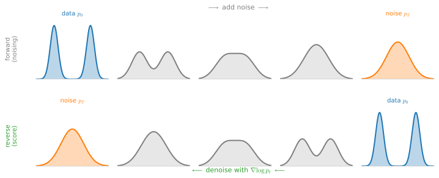
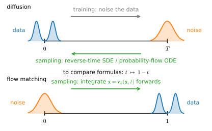
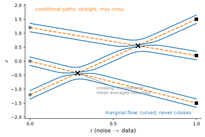

# Score Matching, Diffusion, and Flow Matching
:label:`sec_mdl-score-matching-diffusion-flow`

This section is the capstone of the chapter — and of the Part. The preceding
sections built the machinery: numerical solvers for ODEs
(:numref:`sec_mdl-odes-solvers`), the forward noising SDE
(:numref:`sec_mdl-sdes`), and the central reduction that *the only unknown
standing between noise and data is the score* $\nabla \log p_t$
(:numref:`sec_mdl-fokker-planck-probability-flow`). What remains is to *learn*
that unknown, and the recipe behind today's image, audio, and video generators
is strikingly simple: **learn a score or a velocity field by a plain least-squares
regression, then sample by solving the learned ODE or SDE.** We develop score
matching and its tractable denoising form, recognize DDPM
:cite:`ho2020denoising` as a discretized variance-preserving SDE, derive
Langevin sampling, DDIM, and guidance from the same score calculus, and then
build flow matching and rectified flow as the complementary route that
*prescribes* a clean noise-to-data path — closing with the optimal-transport
explanation of why straight paths sample fastest, and a single table that
unifies the whole zoo :cite:`song2021score,Lipman.Chen.BenHamu.ea.2022`.

One idea powers everything. The quantity we want — a marginal score, a marginal
velocity — is an *average* we cannot compute. But it is the conditional
expectation of a *per-sample* quantity we can compute in closed form, and
least-squares regression against a noisy target automatically fits its
conditional mean. Every training objective in this section — implicit score
matching aside — is this one observation wearing different clothes.

We lean on the Fokker–Planck equation and the probability-flow ODE
(:numref:`sec_mdl-fokker-planck`, :numref:`sec_mdl-probability-flow-ode`), the
Ornstein–Uhlenbeck process (:numref:`sec_mdl-ornstein-uhlenbeck`), Euler and
Euler–Maruyama steps (:numref:`sec_mdl-euler-runge-kutta`,
:numref:`sec_mdl-euler-maruyama`), and the divergences of
:numref:`sec_mdl-divergences-distances` (Fisher divergence via
:numref:`sec_mdl-fisher-divergence`, optimal transport via
:numref:`sec_mdl-optimal-transport`). The code is deliberately light: two tiny
training loops — a one-dimensional score network in plain NumPy and a
two-dimensional flow-matching model in each framework — plus closed-form
simulations for everything else.

```{.python .input #score-matching-diffusion-flow-imports}
#@tab mxnet
%matplotlib inline
from d2l import mxnet as d2l
from mxnet import autograd, gluon, init, npx
from mxnet import np as mxnp
import numpy as np
npx.set_np()
```

```{.python .input #score-matching-diffusion-flow-imports}
#@tab pytorch
%matplotlib inline
from d2l import torch as d2l
import numpy as np
import torch
from torch import nn
```

```{.python .input #score-matching-diffusion-flow-imports}
#@tab tensorflow
%matplotlib inline
from d2l import tensorflow as d2l
import numpy as np
import tensorflow as tf
```

```{.python .input #score-matching-diffusion-flow-imports}
#@tab jax
%matplotlib inline
from d2l import jax as d2l
import jax
from jax import numpy as jnp
import numpy as np
import optax
```

## Learning the Score
:label:`sec_mdl-score-matching`

### Why the Score?

Fitting a density $p_{\boldsymbol{\theta}}$ to data by maximum likelihood
requires evaluating $p_{\boldsymbol{\theta}}$ — including its normalizing
constant. For an energy-based model
$p_{\boldsymbol{\theta}}(\mathbf{x}) = e^{-E_{\boldsymbol{\theta}}(\mathbf{x})} / Z_{\boldsymbol{\theta}}$
with a neural network energy, the constant
$Z_{\boldsymbol{\theta}} = \int e^{-E_{\boldsymbol{\theta}}}$ is a
$d$-dimensional integral with no closed form, and it must be re-evaluated at
every gradient step. The **score** sidesteps it entirely: as we saw in
:numref:`sec_mdl-score-function`,

$$
\nabla_{\mathbf{x}} \log p_{\boldsymbol{\theta}}(\mathbf{x})
= -\nabla_{\mathbf{x}} E_{\boldsymbol{\theta}}(\mathbf{x})
- \underbrace{\nabla_{\mathbf{x}} \log Z_{\boldsymbol{\theta}}}_{=\,0},
$$

because $Z_{\boldsymbol{\theta}}$ does not depend on $\mathbf{x}$. Whatever we
can do with scores alone, we can do without ever normalizing. So instead of
matching densities, match score fields: take a model
$\mathbf{s}_{\boldsymbol{\theta}} : \mathbb{R}^d \to \mathbb{R}^d$ (any vector
field, e.g. a neural network — it need not be a gradient) and minimize the
**Fisher divergence** between model and data
(:numref:`sec_mdl-fisher-divergence`),

$$
J_{\mathrm{ESM}}(\boldsymbol{\theta})
= \tfrac{1}{2}\, \mathbb{E}_{\mathbf{x} \sim p}
\left[\, \left\| \mathbf{s}_{\boldsymbol{\theta}}(\mathbf{x}) - \nabla \log p(\mathbf{x}) \right\|^2 \right],
$$
:eqlabel:`eq_mdl-esm-objective`

called **explicit score matching**. One step forward, one step back: the
normalizer is gone, but the objective now contains $\nabla \log p$ — the score
of the *data* distribution, which is exactly what we do not know. Hyvärinen's
insight is that an integration by parts removes it
:cite:`Hyvarinen.2005`.

**Proposition (Hyvärinen's identity).** *Let $p$ be a smooth positive density
and $\mathbf{s}_{\boldsymbol{\theta}}$ a smooth vector field, with
$p(\mathbf{x})\, \mathbf{s}_{\boldsymbol{\theta}}(\mathbf{x}) \to \mathbf{0}$
as $\|\mathbf{x}\| \to \infty$ and all the expectations below finite. Then*

$$
J_{\mathrm{ESM}}(\boldsymbol{\theta})
= \mathbb{E}_{\mathbf{x} \sim p}
\left[\, \tfrac{1}{2} \| \mathbf{s}_{\boldsymbol{\theta}}(\mathbf{x}) \|^2
+ \nabla \cdot \mathbf{s}_{\boldsymbol{\theta}}(\mathbf{x}) \right] + C,
$$
:eqlabel:`eq_mdl-hyvarinen`

*where $\nabla \cdot \mathbf{s}_{\boldsymbol{\theta}} = \sum_i \partial s_i / \partial x_i$
is the divergence and $C$ does not depend on $\boldsymbol{\theta}$.*

**Proof.** Expand the square in :eqref:`eq_mdl-esm-objective`: the term
$\tfrac12 \mathbb{E}\|\nabla \log p\|^2$ is the constant $C$, the term
$\tfrac12 \mathbb{E}\|\mathbf{s}_{\boldsymbol{\theta}}\|^2$ appears verbatim in
:eqref:`eq_mdl-hyvarinen`, and the cross term is the one that needs work. In
one dimension,

$$
-\mathbb{E}_{x \sim p}\left[ s_{\boldsymbol{\theta}}(x)\, (\log p)'(x) \right]
= -\int s_{\boldsymbol{\theta}}(x)\, \frac{p'(x)}{p(x)}\, p(x)\, dx
= -\int s_{\boldsymbol{\theta}}(x)\, p'(x)\, dx,
$$

and integrating by parts with the boundary term
$\left[ s_{\boldsymbol{\theta}} \, p \right]_{-\infty}^{\infty} = 0$ leaves
$+\int s_{\boldsymbol{\theta}}'(x)\, p(x)\, dx = \mathbb{E}_p[s_{\boldsymbol{\theta}}']$.
The unknown score has disappeared into a derivative of the *model*. In $d$
dimensions, apply the same one-dimensional step to each coordinate $i$ — with
$s_i$ in place of $s_{\boldsymbol{\theta}}$ and $\partial_i p$ in place of
$p'$ — and sum: the cross term becomes
$\mathbb{E}_p[\sum_i \partial_i s_i] = \mathbb{E}_p[\nabla \cdot \mathbf{s}_{\boldsymbol{\theta}}]$.
$\blacksquare$

Every quantity in :eqref:`eq_mdl-hyvarinen` is an expectation under $p$ of
something we can evaluate, so we can minimize it from samples alone — no
$Z_{\boldsymbol{\theta}}$, no $\nabla \log p$; the right-hand side is called
**implicit score matching**. The intuition for the two terms:
the $\nabla \cdot \mathbf{s}_{\boldsymbol{\theta}}$ term rewards score fields
that point *inward* toward the data (negative divergence at the samples, like
$-\nabla E$ near a minimum), while $\tfrac12\|\mathbf{s}_{\boldsymbol{\theta}}\|^2$
stops the field from growing without bound.

Why, then, is implicit score matching not the loss behind modern diffusion
models? Cost. The divergence is the trace of the Jacobian,
$\nabla \cdot \mathbf{s}_{\boldsymbol{\theta}} = \operatorname{tr}\, (\partial \mathbf{s}_{\boldsymbol{\theta}} / \partial \mathbf{x})$,
and computing it exactly takes $d$ backward passes
(:numref:`sec_mdl-matrix-calculus-autodiff`) — the same trace bottleneck that
afflicts continuous normalizing flows
(:numref:`sec_mdl-continuous-normalizing-flows`), and just as there, Hutchinson
trace estimates only trade compute for variance. For images, $d$ is in the
millions. The fix is not a better estimator but a better identity.

### Denoising Score Matching
:label:`sec_mdl-denoising-score-matching`

The trick that made score models practical is to stop matching the score of the
clean data and match the score of *Gaussian-blurred* data instead
:cite:`Vincent.2011`. Perturb each sample with Gaussian noise of scale
$\sigma$:

$$
\tilde{\mathbf{x}} = \mathbf{x} + \sigma \boldsymbol{\epsilon}, \qquad
\boldsymbol{\epsilon} \sim \mathcal{N}(\mathbf{0}, I), \qquad
\textrm{i.e.}\quad
p_\sigma(\tilde{\mathbf{x}} \mid \mathbf{x}) = \mathcal{N}(\tilde{\mathbf{x}};\, \mathbf{x},\, \sigma^2 I).
$$

The noised marginal $p_\sigma(\tilde{\mathbf{x}}) = \int p_\sigma(\tilde{\mathbf{x}} \mid \mathbf{x})\, p(\mathbf{x})\, d\mathbf{x}$
is the data density convolved with a Gaussian — for small $\sigma$, a faithful
smoothing of $p$. Its score is still intractable. But the score of the
*conditional* is a one-line computation: taking $\log$ of the Gaussian density,

$$
\nabla_{\tilde{\mathbf{x}}} \log p_\sigma(\tilde{\mathbf{x}} \mid \mathbf{x})
= \frac{\mathbf{x} - \tilde{\mathbf{x}}}{\sigma^2}
= -\frac{\boldsymbol{\epsilon}}{\sigma}.
$$
:eqlabel:`eq_mdl-dsm-target`

It points from the noisy point straight back to its clean origin — "undo the
noise you just added." **Denoising score matching** (DSM) regresses on that:

$$
J_{\mathrm{DSM}}(\boldsymbol{\theta})
= \tfrac{1}{2}\, \mathbb{E}_{\mathbf{x} \sim p,\ \tilde{\mathbf{x}} \sim p_\sigma(\cdot \mid \mathbf{x})}
\left[\, \left\| \mathbf{s}_{\boldsymbol{\theta}}(\tilde{\mathbf{x}})
- \nabla_{\tilde{\mathbf{x}}} \log p_\sigma(\tilde{\mathbf{x}} \mid \mathbf{x}) \right\|^2 \right].
$$
:eqlabel:`eq_mdl-dsm-loss`

Why on earth should regressing toward *per-sample* arrows recover the score of
the *marginal*? Because least squares always fits a conditional mean. We record
this as a lemma — it is the engine of the whole section, and we will invoke it
again, word for word, to prove the flow-matching theorem.

**Lemma (regression to the conditional mean).** *Let $(X, Y)$ be jointly
distributed with $\mathbb{E}\|Y\|^2 < \infty$ and let
$\mathbf{m}(X) = \mathbb{E}[Y \mid X]$. Then for every measurable
$\mathbf{v}$,*

$$
\mathbb{E} \left\| \mathbf{v}(X) - Y \right\|^2
= \mathbb{E} \left\| \mathbf{v}(X) - \mathbf{m}(X) \right\|^2
+ \mathbb{E} \left\| Y - \mathbf{m}(X) \right\|^2.
$$
:eqlabel:`eq_mdl-regression-lemma`

*The second term does not involve $\mathbf{v}$: minimizing a least-squares loss
against the noisy target $Y$ is the same problem as minimizing it against the
conditional mean $\mathbf{m}(X)$, up to an additive constant.*

**Proof.** Insert $\pm\mathbf{m}(X)$ and expand. The cross term is
$2\, \mathbb{E}\left[ (\mathbf{v}(X) - \mathbf{m}(X))^\top (\mathbf{m}(X) - Y) \right]$;
conditioning on $X$ (the tower rule,
:numref:`sec_mdl-random_variables`) and using
$\mathbb{E}[\mathbf{m}(X) - Y \mid X] = \mathbf{0}$ kills it. $\blacksquare$

**Proposition (Vincent's theorem).** *Under the conditions above, with
expectations finite,*

$$
J_{\mathrm{DSM}}(\boldsymbol{\theta})
= \tfrac{1}{2}\, \mathbb{E}_{\tilde{\mathbf{x}} \sim p_\sigma}
\left[\, \left\| \mathbf{s}_{\boldsymbol{\theta}}(\tilde{\mathbf{x}}) - \nabla \log p_\sigma(\tilde{\mathbf{x}}) \right\|^2 \right] + C,
$$

*with $C$ independent of $\boldsymbol{\theta}$: denoising score matching and
explicit score matching on the noised marginal have the same gradients and the
same minimizers.*

**Proof.** Apply the lemma with $X = \tilde{\mathbf{x}}$ and
$Y = \nabla_{\tilde{\mathbf{x}}} \log p_\sigma(\tilde{\mathbf{x}} \mid \mathbf{x})$.
It remains to identify the conditional mean — *the marginal score is the
posterior mean of the conditional scores*:

$$
\mathbb{E}\left[ Y \mid \tilde{\mathbf{x}} \right]
= \int \frac{\nabla_{\tilde{\mathbf{x}}}\, p_\sigma(\tilde{\mathbf{x}} \mid \mathbf{x})}{p_\sigma(\tilde{\mathbf{x}} \mid \mathbf{x})}
\; \frac{p_\sigma(\tilde{\mathbf{x}} \mid \mathbf{x})\, p(\mathbf{x})}{p_\sigma(\tilde{\mathbf{x}})}\, d\mathbf{x}
= \frac{\nabla_{\tilde{\mathbf{x}}} \int p_\sigma(\tilde{\mathbf{x}} \mid \mathbf{x})\, p(\mathbf{x})\, d\mathbf{x}}{p_\sigma(\tilde{\mathbf{x}})}
= \nabla \log p_\sigma(\tilde{\mathbf{x}}),
$$

where the first equality writes out the posterior
$p(\mathbf{x} \mid \tilde{\mathbf{x}})$ by Bayes' rule and the second swaps the
gradient with the integral. $\blacksquare$

Notice what the proof did *not* use: that the kernel is Gaussian. Any smooth
noising kernel works; the Gaussian is chosen because its conditional score
:eqref:`eq_mdl-dsm-target` is linear in the noise, making the regression target
trivial. By :eqref:`eq_mdl-dsm-target`, predicting the score and predicting the
noise $\boldsymbol{\epsilon}$ are the same task up to the factor $-1/\sigma$ —
the celebrated "$\boldsymbol{\epsilon}$-prediction" of diffusion models, three
sections early. Two corollaries are worth pausing on.

* **Tweedie's formula.** Rearranging
  $\mathbb{E}[(\mathbf{x} - \tilde{\mathbf{x}})/\sigma^2 \mid \tilde{\mathbf{x}}] = \nabla \log p_\sigma(\tilde{\mathbf{x}})$
  gives
  $\mathbb{E}[\mathbf{x} \mid \tilde{\mathbf{x}}] = \tilde{\mathbf{x}} + \sigma^2\, \nabla \log p_\sigma(\tilde{\mathbf{x}})$:
  *the optimal denoiser is a step up the score.* Score estimation and denoising
  are not merely related; they are the same function.
* **The loss does not go to zero.** By :eqref:`eq_mdl-regression-lemma` the DSM
  loss at the optimum equals
  $\tfrac12 \mathbb{E}\|Y - \mathbf{m}(X)\|^2$, the average posterior variance
  of the conditional score — many clean points $\mathbf{x}$ explain the same
  $\tilde{\mathbf{x}}$, and no network can resolve which one produced it. A
  large, plateauing training loss is *built into the objective*, a fact worth
  remembering the first time you train a diffusion model and the loss refuses
  to drop. We will see the same plateau in the flow-matching loss later.

### A Score Network in One Dimension

Let us watch the theory work. Take the bimodal mixture
$p = \tfrac12 \mathcal{N}(-2, 0.5^2) + \tfrac12 \mathcal{N}(2, 0.5^2)$, noise
scale $\sigma = 0.5$, and fit a tiny multilayer perceptron
$s_{\boldsymbol{\theta}} : \mathbb{R} \to \mathbb{R}$ by minimizing
:eqref:`eq_mdl-dsm-loss` — the inputs are noised samples, the regression
targets are $-\epsilon/\sigma$, and nothing about the true density enters
training. Because the noised marginal is again a Gaussian mixture (variance
$0.5^2 + \sigma^2 = 0.5$ per component), we have the analytic
$\nabla \log p_\sigma$ to grade the result against. The network is small enough
that we write its forward pass, its backward pass
(:numref:`sec_mdl-matrix-calculus-autodiff`), and an Adam update by hand in
NumPy — the same code runs in every framework tab.

```{.python .input #score-matching-diffusion-flow-dsm-train}
rng = np.random.default_rng(7)
n, sigma = 4096, 0.5
x = rng.normal(4.0 * rng.integers(0, 2, n) - 2.0, 0.5)    # x ~ p, the mixture

def mixture_score(q, var, means=(-2.0, 2.0)):             # analytic score
    w = np.stack([np.exp(-(q - m)**2 / (2 * var)) for m in means])
    return (w * np.stack([(m - q) / var for m in means])).sum(0) / w.sum(0)

# A 1 -> 32 -> 1 tanh network, with hand-written backprop and Adam updates
W1, b1 = rng.normal(size=(1, 32)), np.zeros(32)
W2, b2 = rng.normal(size=(32, 1)) / np.sqrt(32), np.zeros(1)
params = [W1, b1, W2, b2]
mom = [np.zeros_like(p) for p in params]
vel = [np.zeros_like(p) for p in params]
for step in range(2000):
    eps = rng.standard_normal(n)                          # fresh noise per step
    xt, y = (x + sigma * eps)[:, None], (-eps / sigma)[:, None]
    H = np.tanh(xt @ W1 + b1)                             # forward pass
    S = H @ W2 + b2
    G = 2 * (S - y) / n                                   # backward pass
    GH = (G @ W2.T) * (1 - H**2)
    grads = [xt.T @ GH, GH.sum(0), H.T @ G, G.sum(0)]
    for p, g, m, v in zip(params, grads, mom, vel):       # Adam updates
        m[:] = 0.9 * m + 0.1 * g
        v[:] = 0.999 * v + 0.001 * g * g
        p -= 1e-2 * m / (np.sqrt(v) + 1e-8)
loss = ((S - y)**2).mean()
floor = ((mixture_score(x + sigma * eps, 0.5) + eps / sigma)**2).mean()
grid = np.linspace(-4, 4, 201)
s_hat = (np.tanh(grid[:, None] @ W1 + b1) @ W2 + b2)[:, 0]
print(f'DSM loss {loss:.3f} vs irreducible floor {floor:.3f}; '
      f'max |s_theta - score| on [-4, 4]: {np.abs(s_hat - mixture_score(grid, 0.5)).max():.3f}')
d2l.plot(grid, [mixture_score(grid, 0.5), s_hat], 'x', 'score',
         legend=['analytic score of p_sigma', 'learned s_theta'])
```

The learned field tracks the analytic score across both modes and the
low-density valley between them — within $0.2$ everywhere on $[-4, 4]$, on a
curve whose values span $\pm 8$. And the printout verifies the regression
lemma numerically: the final DSM loss ($\approx 2.04$) sits exactly at the
irreducible floor $\mathbb{E}\|Y - \mathbf{m}(X)\|^2$ ($\approx 2.04$,
estimated with the analytic score). The network has learned everything the
objective can teach.

## Score-Based Diffusion Models
:label:`sec_mdl-score-based-generative-modeling`

### From One Noise Level to All of Them

A single noise scale $\sigma$ leaves a dilemma. Small $\sigma$ makes
$p_\sigma \approx p$, but then noised samples never visit low-density regions,
so the learned score is garbage exactly where a sampler starting from random
noise needs it. Large $\sigma$ covers space, but estimates the score of the
wrong (over-smoothed) density. The resolution
:cite:`song2019generative,song2021score`: learn the score at *every* noise level
along a forward process that flows the data into pure noise, by making the
network noise-conditional, $\mathbf{s}_{\boldsymbol{\theta}}(\mathbf{x}, t)$
(:numref:`fig_mdl-dyn-noising-denoising`).
:numref:`sec_mdl-sdes` gave us the two standard forward processes:

* the **variance-exploding (VE)** SDE
  $d\mathbf{X} = \sqrt{\tfrac{d}{dt}\sigma^2(t)}\; d\mathbf{W}$, which adds
  noise without shrinking the data:
  $\mathbf{x}_t = \mathbf{x}_0 + \sigma(t) \boldsymbol{\epsilon}$ (the
  continuous limit of Song & Ermon's noise ladder);
* the **variance-preserving (VP)** SDE
  $d\mathbf{X} = -\tfrac12 \beta(t)\, \mathbf{X}\, dt + \sqrt{\beta(t)}\; d\mathbf{W}$,
  an Ornstein–Uhlenbeck process with a time-dependent rate
  (:numref:`sec_mdl-ornstein-uhlenbeck`), which shrinks the signal as it adds
  noise so that unit-variance data keeps unit variance for *all* $t$.


:label:`fig_mdl-dyn-noising-denoising`

In both cases the transition kernel $p_t(\mathbf{x}_t \mid \mathbf{x}_0)$ is an
explicit Gaussian, so the DSM machinery applies verbatim at every $t$: the
training loss is the noise-conditional DSM objective

$$
\mathcal{L}(\boldsymbol{\theta})
= \mathbb{E}_{t}\, \lambda(t)\; \mathbb{E}_{\mathbf{x}_0,\, \mathbf{x}_t \sim p_t(\cdot \mid \mathbf{x}_0)}
\left[\, \left\| \mathbf{s}_{\boldsymbol{\theta}}(\mathbf{x}_t, t)
- \nabla_{\mathbf{x}_t} \log p_t(\mathbf{x}_t \mid \mathbf{x}_0) \right\|^2 \right],
$$
:eqlabel:`eq_mdl-ncsm-loss`

with a weighting $\lambda(t) > 0$ that decides which noise levels the network
should serve best. By Vincent's theorem, applied at each $t$ separately, the
minimizer satisfies
$\mathbf{s}_{\boldsymbol{\theta}}(\cdot, t) = \nabla \log p_t$ for every $t$
that $\lambda$ touches. Generation is then exactly the program of
:numref:`sec_mdl-time-reversal` and :numref:`sec_mdl-probability-flow-ode`:
start from the known terminal Gaussian and integrate either the reverse-time
SDE :cite:`Anderson.1982` or the probability-flow ODE, with
$\mathbf{s}_{\boldsymbol{\theta}}$ standing in for the true score. Forward
process, learned score, numerical sampler — choose one of each and you have
specified a generative model.

::: {.callout-important title="Two clocks: the time conventions of diffusion and flow matching"}
The two literatures run time in opposite directions, and almost every
sign confusion in this field traces back to it
(:numref:`fig_mdl-dyn-time-conventions`).

* **Diffusion** noises *data into noise* forward in time: $t = 0$ is data,
  $t = T$ is (approximately) pure Gaussian. *Sampling integrates backwards*,
  from $t = T$ down to $0$.
* **Flow matching** parameterizes the *generative* direction: $t = 0$ is
  noise, $t = 1$ is data, and sampling integrates forwards from $0$ to $1$.

In this section, $t$ in a diffusion formula runs data $\to$ noise, and $t$ in
a flow-matching formula runs noise $\to$ data. When comparing the two (as the
unifying table at the end does), substitute $t \mapsto 1 - t$ in one of them.
:::


:label:`fig_mdl-dyn-time-conventions`

### DDPM as a Discretized SDE
:label:`sec_mdl-ddpm-discretized-sde`

The Denoising Diffusion Probabilistic Model :cite:`ho2020denoising` looks, at
first sight, like a different theory: a discrete-time Markov chain of $T$
noising steps with schedule $\beta_1, \ldots, \beta_T \in (0, 1)$,

$$
\mathbf{x}_t = \sqrt{1 - \beta_t}\; \mathbf{x}_{t-1} + \sqrt{\beta_t}\; \boldsymbol{\epsilon}_t,
\qquad \boldsymbol{\epsilon}_t \sim \mathcal{N}(\mathbf{0}, I)\ \textrm{i.i.d.}
$$
:eqlabel:`eq_mdl-ddpm-forward`

It is not a different theory. Three short propositions identify it, piece by
piece, with the VP machinery above.

**Proposition (the DDPM step is Euler–Maruyama on the VP-SDE).** *Discretize
the VP-SDE with step $\Delta$ and write $\beta_t = \beta(t\Delta)\, \Delta$.
The Euler–Maruyama step (:numref:`sec_mdl-euler-maruyama`) is*

$$
\mathbf{x}_t = \left(1 - \tfrac{1}{2} \beta_t\right) \mathbf{x}_{t-1} + \sqrt{\beta_t}\; \boldsymbol{\epsilon}_t,
$$

*which agrees with the DDPM step :eqref:`eq_mdl-ddpm-forward` to first order in
$\beta_t$.*

**Proof.** The Taylor expansion
$\sqrt{1 - \beta} = 1 - \tfrac12 \beta - \tfrac18 \beta^2 - \cdots$ shows the
two coefficients differ by $O(\beta_t^2)$, while the noise terms are identical.
$\blacksquare$

The agreement is *first-order only* — for the largest practical
$\beta_t \approx 0.02$ the coefficients differ in the fifth decimal — but DDPM's
exact form is in one way nicer than the discretization that inspired it: it has
an exact closed-form marginal, with no $O(\beta^2)$ apology.

**Proposition (the $\bar{\alpha}$-marginal).** *Let $\alpha_t = 1 - \beta_t$
and $\bar{\alpha}_t = \prod_{s=1}^{t} \alpha_s$. Then conditionally on
$\mathbf{x}_0$,*

$$
\mathbf{x}_t = \sqrt{\bar{\alpha}_t}\; \mathbf{x}_0 + \sqrt{1 - \bar{\alpha}_t}\; \boldsymbol{\epsilon},
\qquad \boldsymbol{\epsilon} \sim \mathcal{N}(\mathbf{0}, I).
$$
:eqlabel:`eq_mdl-ddpm-marginal`

**Proof.** Induction on $t$; the case $t = 0$ is trivial. Assume
:eqref:`eq_mdl-ddpm-marginal` at $t - 1$ and substitute into
:eqref:`eq_mdl-ddpm-forward`:

$$
\mathbf{x}_t
= \sqrt{\alpha_t \bar{\alpha}_{t-1}}\; \mathbf{x}_0
+ \sqrt{\alpha_t (1 - \bar{\alpha}_{t-1})}\; \bar{\boldsymbol{\epsilon}}
+ \sqrt{\beta_t}\; \boldsymbol{\epsilon}_t,
$$

with $\bar{\boldsymbol{\epsilon}}, \boldsymbol{\epsilon}_t$ independent
standard Gaussians. A sum of independent Gaussians is Gaussian with summed
variances:
$\alpha_t (1 - \bar{\alpha}_{t-1}) + \beta_t = \alpha_t - \bar{\alpha}_t + 1 - \alpha_t = 1 - \bar{\alpha}_t$,
and $\alpha_t \bar{\alpha}_{t-1} = \bar{\alpha}_t$. $\blacksquare$

The name "variance-preserving" is now an identity rather than a slogan: for
unit-variance data, $\mathrm{Var}(\mathbf{x}_t) = \bar{\alpha}_t \cdot 1 + (1 - \bar{\alpha}_t) = 1$
for *every* $t$, not merely in the limit. And because
:eqref:`eq_mdl-ddpm-marginal` is a Gaussian kernel with scale
$\sqrt{1 - \bar{\alpha}_t}$, denoising score matching applies off the shelf.

**Proposition (the DDPM loss is reweighted DSM).** *The conditional score of
:eqref:`eq_mdl-ddpm-marginal` is
$\nabla_{\mathbf{x}_t} \log p(\mathbf{x}_t \mid \mathbf{x}_0) = -\boldsymbol{\epsilon} / \sqrt{1 - \bar{\alpha}_t}$.
Hence, parameterizing the score model through a noise-prediction network,
$\mathbf{s}_{\boldsymbol{\theta}}(\mathbf{x}_t, t) = -\boldsymbol{\epsilon}_{\boldsymbol{\theta}}(\mathbf{x}_t, t) / \sqrt{1 - \bar{\alpha}_t}$,
the DDPM "simple loss"
$\mathbb{E}_{t, \mathbf{x}_0, \boldsymbol{\epsilon}} \| \boldsymbol{\epsilon} - \boldsymbol{\epsilon}_{\boldsymbol{\theta}}(\mathbf{x}_t, t) \|^2$
equals the noise-conditional DSM loss :eqref:`eq_mdl-ncsm-loss` with weighting
$\lambda(t) = 1 - \bar{\alpha}_t$.*

**Proof.** Differentiate
$\log p(\mathbf{x}_t \mid \mathbf{x}_0) = -\|\mathbf{x}_t - \sqrt{\bar{\alpha}_t} \mathbf{x}_0\|^2 / (2 (1 - \bar{\alpha}_t)) + \textrm{const}$
and substitute :eqref:`eq_mdl-ddpm-marginal`. Then

$$
\left\| \mathbf{s}_{\boldsymbol{\theta}}(\mathbf{x}_t, t) + \frac{\boldsymbol{\epsilon}}{\sqrt{1 - \bar{\alpha}_t}} \right\|^2
= \frac{1}{1 - \bar{\alpha}_t} \left\| \boldsymbol{\epsilon} - \boldsymbol{\epsilon}_{\boldsymbol{\theta}}(\mathbf{x}_t, t) \right\|^2,
$$

so the two losses differ exactly by the factor $\lambda(t) = 1 - \bar{\alpha}_t$
inside the time expectation. $\blacksquare$

So DDPM = VP forward process + DSM objective (in $\boldsymbol{\epsilon}$
clothing) + ancestral reverse-chain sampler: the discrete and continuous
pictures are one object viewed at different resolutions
:cite:`song2021score`. Historically the model was derived along an entirely
different route — write the reverse chain as a latent-variable model and
maximize an evidence lower bound, as in
:numref:`sec_mdl-latent-em-elbo` :cite:`sohl2015deep,ho2020denoising`.
The KL terms between the Gaussian forward posteriors and the learned reverse
steps collapse, after the same Gaussian algebra as above, into weighted
$\boldsymbol{\epsilon}$-prediction losses — the ELBO and the score view land on
the same objective with a different $\lambda(t)$, and :citet:`Luo.2022` is the
careful walkthrough of that equivalence.

The cell below checks both propositions at once: it runs the discrete chain
:eqref:`eq_mdl-ddpm-forward` for $T = 1000$ steps on (standardized) samples of
our two-Gaussian mixture and compares against the closed form
:eqref:`eq_mdl-ddpm-marginal` — variances on the way, and the full distribution
against a one-shot $\bar{\alpha}$-sample at the end.

```{.python .input #score-matching-diffusion-flow-ddpm-marginal}
rng = np.random.default_rng(13)
T = 1000
beta = np.linspace(1e-4, 0.02, T)                  # the DDPM schedule
alpha_bar = np.cumprod(1.0 - beta)
x0 = x / x.std()                                   # unit-variance mixture data
xt = x0.copy()
for t in range(T):                                 # the discrete forward chain
    xt = np.sqrt(1 - beta[t]) * xt + np.sqrt(beta[t]) * rng.standard_normal(n)
    if t + 1 in (10, 100, 1000):
        var_pred = alpha_bar[t] * x0.var() + (1 - alpha_bar[t])
        print(f't = {t+1:4d}: Var(x_t) chain {xt.var():.3f}, '
              f'formula {var_pred:.3f}, alpha_bar {alpha_bar[t]:.4f}')
one_shot = (np.sqrt(alpha_bar[-1]) * x0
            + np.sqrt(1 - alpha_bar[-1]) * rng.standard_normal(n))
print(f'chain vs one-shot at T: mean {xt.mean():+.3f} vs {one_shot.mean():+.3f}, '
      f'std {xt.std():.3f} vs {one_shot.std():.3f}')
```

The variance tracks the formula's $1.000$ at every checkpoint, to within the
sampling error of a $4096$-point variance estimate — the VP identity in action
— and after a thousand steps the chain matches the one-shot Gaussian
reparameterization in distribution, which is why DDPM training never simulates
the chain: it jumps straight to any $t$ via :eqref:`eq_mdl-ddpm-marginal`.

### Langevin Dynamics and Predictor–Corrector Sampling

Reverse-time SDEs are not the only way to turn a score into samples — the
oldest way predates diffusion models by decades. Suppose we hold the
distribution *fixed*: no noising schedule, just a target $p$ whose score we
know. **Langevin dynamics** is the SDE whose drift pushes up the
log-density while noise jiggles the state,

$$
d\mathbf{X} = \tfrac{1}{2} \nabla \log p(\mathbf{X})\, dt + d\mathbf{W}.
$$
:eqlabel:`eq_mdl-langevin`

**Proposition (stationarity).** *Let $p$ be a smooth positive density with
$p$ and $\nabla p$ vanishing at infinity. Then $p$ is a stationary density of
:eqref:`eq_mdl-langevin`: if $\mathbf{X}_0 \sim p$ then $\mathbf{X}_t \sim p$
for all $t \ge 0$.*

**Proof.** The Fokker–Planck equation (:numref:`sec_mdl-fokker-planck`) for
drift $\mathbf{b} = \tfrac12 \nabla \log p$ and unit diffusion reads
$\partial_t \rho = -\nabla \cdot (\rho\, \mathbf{b}) + \tfrac12 \Delta \rho$.
Substitute $\rho = p$ and use the one-line rewrite
$p\, \nabla \log p = \nabla p$:

$$
-\nabla \cdot \left( \tfrac{1}{2}\, p\, \nabla \log p \right) + \tfrac{1}{2} \Delta p
= -\tfrac{1}{2} \nabla \cdot (\nabla p) + \tfrac{1}{2} \Delta p = 0.
$$

The right-hand side of the Fokker–Planck equation vanishes identically, so
$\rho \equiv p$ solves it for all time. $\blacksquare$

Discretizing :eqref:`eq_mdl-langevin` by Euler–Maruyama with step $h$ gives the
**Langevin sampler**
$\mathbf{x} \leftarrow \mathbf{x} + \tfrac{h}{2}\, \mathbf{s}(\mathbf{x}) + \sqrt{h}\, \boldsymbol{\xi}$:
run it long enough from anywhere and the iterates are (approximately —
the finite step incurs an $O(h)$ bias; see Exercise 6) samples from $p$. With
$\mathbf{s} = \mathbf{s}_{\boldsymbol{\theta}}$, this turns a trained score
network directly into a generator. The cell runs it on our mixture with the
analytic score — and also exposes its famous weakness.

```{.python .input #score-matching-diffusion-flow-langevin}
rng = np.random.default_rng(11)

def langevin(q, h, steps, rng):
    for _ in range(steps):
        q = q + 0.5 * h * mixture_score(q, 0.25) \
            + np.sqrt(h) * rng.standard_normal(q.shape)
    return q

warm = langevin(rng.normal(0.0, 3.0, 10000), 0.01, 2000, rng)
print(f'spread-out start: P(X > 0) = {(warm > 0).mean():.3f}, '
      f'E[X^2] = {(warm**2).mean():.2f} (truth 0.500, 4.25)')
cold = langevin(np.full(10000, -2.0), 0.01, 2000, rng)
print(f'one-mode start:   P(X > 0) = {(cold > 0).mean():.3f}  (slow mixing)')
```

Started from a broad cloud, the chains settle onto the right answer: half the
mass in each mode, second moment matching the truth. Started inside the left
mode, almost no walkers cross even after two thousand steps — between the
modes the density is tiny, the score points back toward whichever mode you
came from, and only a lucky run of noise gets a walker across. This *mixing*
failure is why plain Langevin sampling on a multimodal target is hopeless, and
why the noise schedule of a diffusion model is not a luxury: **annealed
Langevin dynamics** :cite:`song2019generative` runs Langevin at a *ladder* of
noise levels $\sigma_1 > \cdots > \sigma_L$, using
$\mathbf{s}_{\boldsymbol{\theta}}(\cdot, \sigma_i)$ at level $i$ — at large
$\sigma$ the smoothed density has no barriers and walkers redistribute freely;
as $\sigma$ shrinks, detail re-emerges with the global proportions already
right. The same idea survives inside modern samplers as the
**predictor–corrector** scheme :cite:`song2021score`: alternate a reverse-SDE
step (the *predictor*, which moves to the next noise level) with a few Langevin
steps at the current level (the *corrector*, which repairs the discretization
error of the predictor before it compounds).

### DDIM: Trading Noise for Speed

Ancestral DDPM sampling needs $T \sim 1000$ network calls. **DDIM**
:cite:`Song.Meng.Ermon.2020` cuts this by an order of magnitude with *the same
trained network* — no retraining — by replacing the noisy reverse chain with a
deterministic update.

::: {.callout-note title="The DDIM update, in one derivation"}
At time $t$, the network's noise prediction yields a current best guess of the
clean sample by inverting the marginal :eqref:`eq_mdl-ddpm-marginal`:

$$
\hat{\mathbf{x}}_0
= \frac{\mathbf{x}_t - \sqrt{1 - \bar{\alpha}_t}\; \boldsymbol{\epsilon}_{\boldsymbol{\theta}}(\mathbf{x}_t, t)}{\sqrt{\bar{\alpha}_t}}.
$$

DDPM would now *resample*: draw fresh noise and form a noisy
$\mathbf{x}_{t-1}$. DDIM instead **re-uses the predicted noise**, placing
$\mathbf{x}_{t-1}$ exactly where the marginal form says a point with clean
component $\hat{\mathbf{x}}_0$ and noise component
$\boldsymbol{\epsilon}_{\boldsymbol{\theta}}$ should sit at time $t - 1$:

$$
\mathbf{x}_{t-1}
= \sqrt{\bar{\alpha}_{t-1}}\; \hat{\mathbf{x}}_0
+ \sqrt{1 - \bar{\alpha}_{t-1}}\; \boldsymbol{\epsilon}_{\boldsymbol{\theta}}(\mathbf{x}_t, t).
$$
:eqlabel:`eq_mdl-ddim-update`

*Why this is consistent:* if the noise prediction is exact for the realization
($\boldsymbol{\epsilon}_{\boldsymbol{\theta}} = \boldsymbol{\epsilon}$, so
$\hat{\mathbf{x}}_0 = \mathbf{x}_0$), the update maps
$\sqrt{\bar{\alpha}_t}\, \mathbf{x}_0 + \sqrt{1 - \bar{\alpha}_t}\, \boldsymbol{\epsilon}
\mapsto \sqrt{\bar{\alpha}_{t-1}}\, \mathbf{x}_0 + \sqrt{1 - \bar{\alpha}_{t-1}}\, \boldsymbol{\epsilon}$:
each sample slides along its own deterministic curve
$t \mapsto \sqrt{\bar{\alpha}_t}\, \mathbf{x}_0 + \sqrt{1 - \bar{\alpha}_t}\, \boldsymbol{\epsilon}$,
and every marginal :eqref:`eq_mdl-ddpm-marginal` is preserved en route. Because
each update is a *single deterministic map* between adjacent noise levels —
not a draw whose errors must average out — nothing stops us taking
$t$ down a sparse subsequence (say 50 of the 1000 levels): big strides replace
small staggers.
:::

Two remarks complete the picture. First, DDIM is the $\eta = 0$ endpoint of a
family that interpolates continuously to DDPM ($\eta = 1$) by re-injecting a
fraction of fresh noise; all members share the same marginals and the same
network. Second, in the limit of fine steps the DDIM trajectory solves the
probability-flow ODE of the VP-SDE (:numref:`sec_mdl-probability-flow-ode`) —
DDIM is that ODE's bespoke integrator, exact for Gaussian marginals, which is
why it tolerates step sizes that would wreck a generic Euler scheme.

### Guidance: Steering with Bayes' Rule

Generation is rarely unconditional — we want *a picture of a cat*, not a
picture. Conditioning a score model turns out to be pure probability, no new
training theory. Bayes' rule at noise level $t$,
$p_t(\mathbf{x} \mid y) \propto p_t(\mathbf{x})\, p_t(y \mid \mathbf{x})$,
becomes additive for scores, since the gradient is in $\mathbf{x}$ and the
evidence term drops:

$$
\nabla_{\mathbf{x}} \log p_t(\mathbf{x} \mid y)
= \nabla_{\mathbf{x}} \log p_t(\mathbf{x})
+ \nabla_{\mathbf{x}} \log p_t(y \mid \mathbf{x}).
$$
:eqlabel:`eq_mdl-guidance-bayes`

Any sampler from this section runs unchanged with the conditional score in
place of the unconditional one. **Classifier guidance**
:cite:`Dhariwal.Nichol.2021` implements the second term with an auxiliary
classifier $p_{\boldsymbol{\phi}}(y \mid \mathbf{x}, t)$ trained on *noisy*
inputs (a clean-image classifier is wrong off the data manifold, which is where
$\mathbf{x}_t$ lives), and sharpens it with a **guidance scale**
$\gamma > 1$:

$$
\tilde{\mathbf{s}}(\mathbf{x}, t)
= \nabla \log p_t(\mathbf{x}) + \gamma\, \nabla \log p_{\boldsymbol{\phi}}(y \mid \mathbf{x}, t)
= \nabla \log \left[ \frac{p_t(\mathbf{x})\, p_{\boldsymbol{\phi}}(y \mid \mathbf{x}, t)^{\gamma}}{Z} \right].
$$

The second equality is the honest reading: guidance samples a *tilted*
distribution in which the classifier's verdict counts $\gamma$ times — more
prototypically "$y$", less diverse.

**Classifier-free guidance (CFG)** :cite:`Ho.Salimans.2022` removes the
auxiliary classifier with one more application of
:eqref:`eq_mdl-guidance-bayes`, read right to left:
$\nabla \log p_t(y \mid \mathbf{x}) = \nabla \log p_t(\mathbf{x} \mid y) - \nabla \log p_t(\mathbf{x})$.
Train a *single* network on labeled data, dropping the label some fraction of
the time, so it learns both
$\mathbf{s}_{\boldsymbol{\theta}}(\mathbf{x}, t, y)$ and
$\mathbf{s}_{\boldsymbol{\theta}}(\mathbf{x}, t, \varnothing)$. At sampling
time, *extrapolate* from the unconditional score through the conditional one:

$$
\tilde{\mathbf{s}}(\mathbf{x}, t)
= \mathbf{s}_{\boldsymbol{\theta}}(\mathbf{x}, t, \varnothing)
+ \gamma \left[ \mathbf{s}_{\boldsymbol{\theta}}(\mathbf{x}, t, y)
- \mathbf{s}_{\boldsymbol{\theta}}(\mathbf{x}, t, \varnothing) \right],
$$
:eqlabel:`eq_mdl-cfg`

equivalently $(1 - \gamma)\, \mathbf{s}_\varnothing + \gamma\, \mathbf{s}_y$:
$\gamma = 0$ ignores the label, $\gamma = 1$ samples the honest conditional,
and the values used in practice ($\gamma \approx 5$–$15$ for text-to-image
models) push *past* the conditional, in the score-space direction "more like
$y$". Substituting the Bayes identity shows :eqref:`eq_mdl-cfg` is exactly the
classifier-guidance tilt with the implicit classifier
$p_t(y \mid \mathbf{x}) = p_t(\mathbf{x} \mid y)\, p(y) / p_t(\mathbf{x})$ in
the exponent's role. One honesty note: for $\gamma > 1$ the tilted object
$p_t(\mathbf{x})\, p_t(y \mid \mathbf{x})^\gamma$ is not, in general, the
noised marginal of *any* clean distribution — the guided field is a useful
controlled distortion, not the score of a consistent diffusion, and the
fidelity-versus-diversity trade-off it buys is an engineering choice, not a
theorem. In $\boldsymbol{\epsilon}$-parameterization, :eqref:`eq_mdl-cfg` is
applied verbatim to $\boldsymbol{\epsilon}_{\boldsymbol{\theta}}$, since the
two differ by the $t$-dependent factor $-\sqrt{1 - \bar{\alpha}_t}$.

## Flow Matching and Rectified Flow
:label:`sec_mdl-flow-matching`

### Probability Paths and Velocity Fields

Diffusion *derives* its bridge between noise and data from a stochastic
process, then reverses it. Flow matching :cite:`Lipman.Chen.BenHamu.ea.2022`
asks the cleaner question directly: *prescribe* a family of densities
$(p_t)_{t \in [0, 1]}$ with $p_0$ = noise and $p_1$ = data — a
**probability path** — and learn the velocity field that transports mass along
it. Recall from :numref:`sec_mdl-continuity-equation` that a velocity field
$\mathbf{u}_t$ realizes the path iff the pair satisfies the continuity
equation $\partial_t p_t = -\nabla \cdot (p_t\, \mathbf{u}_t)$. If we can fit
$\mathbf{v}_{\boldsymbol{\theta}} \approx \mathbf{u}_t$, generation is a plain
ODE solve of $\dot{\mathbf{x}} = \mathbf{v}_{\boldsymbol{\theta}}(\mathbf{x}, t)$
from $\mathbf{x}_0 \sim p_0$ — a continuous normalizing flow
(:numref:`sec_mdl-continuous-normalizing-flows`) trained *without ever
simulating the ODE*. The natural objective is the **flow-matching loss**

$$
\mathcal{L}_{\mathrm{FM}}(\boldsymbol{\theta})
= \mathbb{E}_{t \sim \mathcal{U}[0,1],\ \mathbf{x} \sim p_t}
\left[\, \left\| \mathbf{v}_{\boldsymbol{\theta}}(\mathbf{x}, t) - \mathbf{u}_t(\mathbf{x}) \right\|^2 \right],
$$
:eqlabel:`eq_mdl-fm-loss`

and it has exactly the disease that explicit score matching had: the marginal
velocity $\mathbf{u}_t$ is unknown. The cure is also the same. Build the path
out of *conditional* paths, one per data point: pick
$p_t(\mathbf{x} \mid \mathbf{z})$ — a little moving blob that starts spread as
noise and collapses onto the conditioning variable $\mathbf{z}$ (say, a data
point $\mathbf{x}_1$, or a pair $(\mathbf{x}_0, \mathbf{x}_1)$) — whose
conditional velocity $\mathbf{u}_t(\mathbf{x} \mid \mathbf{z})$ we can write
down, and let the marginal path be the mixture
$p_t(\mathbf{x}) = \int p_t(\mathbf{x} \mid \mathbf{z})\, q(\mathbf{z})\, d\mathbf{z}$.

**Proposition (the marginal velocity is a posterior mean).** *Suppose each
conditional pair satisfies the continuity equation,
$\partial_t p_t(\mathbf{x} \mid \mathbf{z}) = -\nabla \cdot \left( p_t(\mathbf{x} \mid \mathbf{z})\, \mathbf{u}_t(\mathbf{x} \mid \mathbf{z}) \right)$,
and define on $\{p_t > 0\}$ the* **marginal velocity**

$$
\mathbf{u}_t(\mathbf{x})
= \mathbb{E}\left[ \mathbf{u}_t(\mathbf{x} \mid \mathbf{z}) \mid \mathbf{x}_t = \mathbf{x} \right]
= \int \mathbf{u}_t(\mathbf{x} \mid \mathbf{z})\,
\frac{p_t(\mathbf{x} \mid \mathbf{z})\, q(\mathbf{z})}{p_t(\mathbf{x})}\, d\mathbf{z}.
$$
:eqlabel:`eq_mdl-marginal-velocity`

*Then $(p_t, \mathbf{u}_t)$ satisfies the continuity equation: the averaged
field transports the averaged path.*

**Proof.** Differentiate the mixture under the integral sign and substitute
the conditional continuity equation:

$$
\partial_t p_t(\mathbf{x})
= \int \partial_t p_t(\mathbf{x} \mid \mathbf{z})\, q(\mathbf{z})\, d\mathbf{z}
= -\nabla \cdot \int p_t(\mathbf{x} \mid \mathbf{z})\, \mathbf{u}_t(\mathbf{x} \mid \mathbf{z})\, q(\mathbf{z})\, d\mathbf{z}
= -\nabla \cdot \left( p_t(\mathbf{x})\, \mathbf{u}_t(\mathbf{x}) \right),
$$

where the last step is the definition :eqref:`eq_mdl-marginal-velocity`.
$\blacksquare$

### The Conditional Flow Matching Theorem

We now have a target that is an intractable posterior mean
:eqref:`eq_mdl-marginal-velocity` of a tractable per-sample quantity — exactly
the situation the regression lemma :eqref:`eq_mdl-regression-lemma` was made
for. Define the **conditional flow matching** loss, which needs only samples
$(t, \mathbf{z}, \mathbf{x})$ and the closed-form conditional velocity:

$$
\mathcal{L}_{\mathrm{CFM}}(\boldsymbol{\theta})
= \mathbb{E}_{t,\ \mathbf{z} \sim q,\ \mathbf{x} \sim p_t(\cdot \mid \mathbf{z})}
\left[\, \left\| \mathbf{v}_{\boldsymbol{\theta}}(\mathbf{x}, t) - \mathbf{u}_t(\mathbf{x} \mid \mathbf{z}) \right\|^2 \right].
$$
:eqlabel:`eq_mdl-cfm-loss`

**Theorem (CFM trains the marginal field).** *Under the integrability needed
for :eqref:`eq_mdl-marginal-velocity` to exist,*

$$
\mathcal{L}_{\mathrm{CFM}}(\boldsymbol{\theta})
= \mathcal{L}_{\mathrm{FM}}(\boldsymbol{\theta}) + C
$$

*with $C$ independent of $\boldsymbol{\theta}$. In particular
$\nabla_{\boldsymbol{\theta}} \mathcal{L}_{\mathrm{CFM}} = \nabla_{\boldsymbol{\theta}} \mathcal{L}_{\mathrm{FM}}$:
the two objectives have identical gradients and identical minimizers*
:cite:`Lipman.Chen.BenHamu.ea.2022,Tong.Fatras.Malkin.ea.2023`.

**Proof.** Apply the regression lemma :eqref:`eq_mdl-regression-lemma` with
$X = (\mathbf{x}, t)$ where $\mathbf{x} \sim p_t(\cdot \mid \mathbf{z})$, and
$Y = \mathbf{u}_t(\mathbf{x} \mid \mathbf{z})$. The marginal distribution of
$X$ is $t \sim \mathcal{U}[0,1]$, $\mathbf{x} \sim p_t$, and the conditional
mean of $Y$ given $X = (\mathbf{x}, t)$ is, by definition,
:eqref:`eq_mdl-marginal-velocity` — the marginal velocity. The lemma splits
$\mathcal{L}_{\mathrm{CFM}}$ into
$\mathbb{E}\| \mathbf{v}_{\boldsymbol{\theta}}(X) - \mathbf{u}_t(\mathbf{x}) \|^2 = \mathcal{L}_{\mathrm{FM}}$
plus the posterior variance term
$C = \mathbb{E}\| Y - \mathbf{u}_t(\mathbf{x}) \|^2$, which does not involve
$\boldsymbol{\theta}$. $\blacksquare$

Compare this proof with Vincent's theorem: same lemma, same structure, with
(score of the noising kernel $\to$ marginal score) replaced by (conditional
velocity $\to$ marginal velocity). Denoising score matching *is* conditional
flow matching for the score field; the flow-matching literature made the trick
generic. And as before, the theorem's constant $C$ is the irreducible variance
of the conditional target: the CFM training loss plateaus well above zero even
for a perfect model — at the average disagreement among the conditional
velocities passing through each point.

### Rectified Flow and Straight Paths
:label:`sec_mdl-rectified-flow`

Everything now hinges on choosing the conditional path, and the simplest
choice is hard to beat. Condition on a *pair*
$\mathbf{z} = (\mathbf{x}_0, \mathbf{x}_1)$ — a noise sample and a data
sample, drawn independently — and connect them by a straight line traversed at
constant speed:

$$
\mathbf{x}_t = (1 - t)\, \mathbf{x}_0 + t\, \mathbf{x}_1,
\qquad
\mathbf{u}_t(\mathbf{x}_t \mid \mathbf{z}) = \dot{\mathbf{x}}_t = \mathbf{x}_1 - \mathbf{x}_0.
$$
:eqlabel:`eq_mdl-rf-path`

The conditional velocity does not even depend on $t$: the CFM loss
:eqref:`eq_mdl-cfm-loss` becomes the **rectified flow** (equivalently,
linear-path CFM) objective
:cite:`Liu.Gong.Liu.2022,Lipman.Chen.BenHamu.ea.2022`

$$
\mathcal{L}_{\mathrm{RF}}(\boldsymbol{\theta})
= \mathbb{E}_{t,\ \mathbf{x}_0 \sim p_0,\ \mathbf{x}_1 \sim p_1}
\left[\, \left\| \mathbf{v}_{\boldsymbol{\theta}}\big( (1 - t) \mathbf{x}_0 + t \mathbf{x}_1,\ t \big)
- (\mathbf{x}_1 - \mathbf{x}_0) \right\|^2 \right]
$$
:eqlabel:`eq_mdl-rf-loss`

— arguably the simplest generative training objective in existence: draw noise,
draw data, interpolate, regress on the difference. (For the measure-theoretic
comfort of strictly positive conditional densities, smooth the line with an
infinitesimal Gaussian, $p_t(\cdot \mid \mathbf{z}) = \mathcal{N}((1-t)\mathbf{x}_0 + t \mathbf{x}_1, \sigma_{\min}^2 I)$,
and let $\sigma_{\min} \to 0$; nothing below changes. Gaussian conditional
paths with general $(\mu_t, \sigma_t)$ schedules recover diffusion-style
targets — that is how flow matching subsumes the VP path, modulo the
time-reversal callout above.)


:label:`fig_mdl-dyn-fm-paths`

A crucial subtlety (:numref:`fig_mdl-dyn-fm-paths`): the *conditional* paths are straight, but the *marginal*
flow that the network learns is generally **curved**. Two straight segments
that cross at $(\mathbf{x}, t)$ feed the posterior mean
:eqref:`eq_mdl-marginal-velocity` two different directions, and the learned
field — which, like any function, can have only one value there — averages
them. An ODE's trajectories cannot cross (uniqueness,
:numref:`sec_mdl-ode-existence-uniqueness`), so the learned flow bends to
avoid the collisions that the conditional segments ignore. The independent
coupling of $\mathbf{x}_0$ and $\mathbf{x}_1$ produces many crossings, hence
real curvature, hence many Euler steps at sampling time. **Reflow**
:cite:`Liu.Gong.Liu.2022` attacks the coupling: after training, generate pairs
$(\mathbf{x}_0, \hat{\mathbf{x}}_1)$ by *running your own ODE*, and retrain on
this new coupling, in which start and end points are already dynamically
matched. Each round provably leaves the marginals intact, never increases any
convex transport cost, and straightens the paths — toward the
straight-by-construction transport that the next section identifies as optimal.
In the straight limit, one Euler step is exact (the local truncation error of
Euler is controlled by the curvature $\ddot{\mathbf{x}}$ along trajectories,
:numref:`sec_mdl-euler-runge-kutta`) — this is the mathematics behind few-step
and one-step generators distilled from flows.

### Gaussian to Two Moons, Four Ways

Time to train one. The target is a two-moons distribution — two interleaved
crescents, a classic stress test for mode-splitting — generated in a few lines
of NumPy; the source is a standard 2-D Gaussian. We also define the **energy
distance**
$\mathcal{E}(P, Q) = \left( 2\, \mathbb{E}\|X - Y\| - \mathbb{E}\|X - X'\| - \mathbb{E}\|Y - Y'\| \right)^{1/2}$,
squared here for convenience — an MMD-style two-sample discrepancy
(:numref:`sec_mdl-ipm-mmd`) that is zero iff the distributions agree; we use
its square, on $2048$-point samples, to grade generated samples against a
held-out target sample throughout.

```{.python .input #score-matching-diffusion-flow-two-moons}
def two_moons(n, rng, noise=0.07):
    t = rng.uniform(0.0, np.pi, n)
    m = rng.integers(0, 2, n)                      # which moon
    X = np.stack([np.cos(t) * (1 - 2 * m) + m,
                  np.sin(t) * (1 - 2 * m) + 0.5 * m], axis=1)
    return X + noise * rng.standard_normal((n, 2))

rng = np.random.default_rng(0)
raw = two_moons(8192, rng)
mu, sd = raw.mean(0), raw.std(0)
moons = (raw - mu) / sd                            # standardized training data
held_out = (two_moons(2048, np.random.default_rng(1)) - mu) / sd

def energy_distance(a, b):                         # squared energy distance
    d = lambda u, v: np.linalg.norm(u[:, None, :] - v[None, :, :], axis=-1).mean()
    return 2 * d(a, b) - d(a, a) - d(b, b)

print(f'training set {moons.shape}; energy distance of a fresh sample '
      f'to the held-out set: {energy_distance(moons[:2048], held_out):.4f}')
```

The fresh-sample-to-held-out value ($\approx 0.001$) is the noise floor: no
generator can reliably beat it. Now the model — a velocity field
$\mathbf{v}_{\boldsymbol{\theta}} : \mathbb{R}^2 \times [0, 1] \to \mathbb{R}^2$
as a $3 \to 64 \to 64 \to 2$ tanh MLP — trained for $4000$ Adam steps on the
rectified-flow objective :eqref:`eq_mdl-rf-loss`. Each batch is literally the
recipe: sample $\mathbf{x}_0$, $\mathbf{x}_1$, $t$; interpolate; regress on
$\mathbf{x}_1 - \mathbf{x}_0$. This is the section's one real training loop,
and it takes a few seconds on a CPU in every framework (the JAX tab compiles
the whole loop into a single `lax.scan`).

```{.python .input #score-matching-diffusion-flow-cfm-train}
#@tab mxnet
mxnp.random.seed(0)
data = mxnp.array(moons)
net = gluon.nn.Sequential()
net.add(gluon.nn.Dense(64, activation='tanh'),
        gluon.nn.Dense(64, activation='tanh'),
        gluon.nn.Dense(2))
net.initialize(init.Xavier())
trainer = gluon.Trainer(net.collect_params(), 'adam', {'learning_rate': 3e-3})
for step in range(4001):
    x1 = data[mxnp.random.randint(0, len(data), (256,))]
    x0 = mxnp.random.normal(0, 1, (256, 2))
    t = mxnp.random.uniform(0, 1, (256, 1))
    xt = (1 - t) * x0 + t * x1
    with autograd.record():
        v = net(mxnp.concatenate([xt, t], axis=1))
        loss = ((v - (x1 - x0))**2).mean()
    loss.backward()
    trainer.step(1)
    if step % 1000 == 0:
        print(f'step {step:4d}: CFM loss {float(loss):.3f}')
```

```{.python .input #score-matching-diffusion-flow-cfm-train}
#@tab pytorch
torch.manual_seed(0)
data = torch.tensor(moons, dtype=torch.float32)
net = nn.Sequential(nn.Linear(3, 64), nn.Tanh(), nn.Linear(64, 64), nn.Tanh(),
                    nn.Linear(64, 2))
opt = torch.optim.Adam(net.parameters(), lr=3e-3)
for step in range(4001):
    x1 = data[torch.randint(0, len(data), (256,))]
    x0, t = torch.randn(256, 2), torch.rand(256, 1)
    xt = (1 - t) * x0 + t * x1
    loss = ((net(torch.cat([xt, t], 1)) - (x1 - x0))**2).mean()
    opt.zero_grad()
    loss.backward()
    opt.step()
    if step % 1000 == 0:
        print(f'step {step:4d}: CFM loss {loss.item():.3f}')
```

```{.python .input #score-matching-diffusion-flow-cfm-train}
#@tab tensorflow
tf.keras.utils.set_random_seed(0)
data = tf.constant(moons, tf.float32)
net = tf.keras.Sequential([tf.keras.layers.Dense(64, 'tanh'),
                           tf.keras.layers.Dense(64, 'tanh'),
                           tf.keras.layers.Dense(2)])
opt = tf.keras.optimizers.Adam(3e-3)

@tf.function
def train_step():
    x1 = tf.gather(data, tf.random.uniform((256,), 0, len(data), tf.int32))
    x0 = tf.random.normal((256, 2))
    t = tf.random.uniform((256, 1))
    xt = (1 - t) * x0 + t * x1
    with tf.GradientTape() as tape:
        v = net(tf.concat([xt, t], 1))
        loss = tf.reduce_mean((v - (x1 - x0))**2)
    grads = tape.gradient(loss, net.trainable_variables)
    opt.apply_gradients(zip(grads, net.trainable_variables))
    return loss

for step in range(4001):
    loss = train_step()
    if step % 1000 == 0:
        print(f'step {step:4d}: CFM loss {float(loss):.3f}')
```

```{.python .input #score-matching-diffusion-flow-cfm-train}
#@tab jax
def init_mlp(key, sizes=(3, 64, 64, 2)):
    keys = jax.random.split(key, len(sizes) - 1)
    return [(jax.random.normal(k, (i, o)) / jnp.sqrt(i), jnp.zeros(o))
            for k, i, o in zip(keys, sizes[:-1], sizes[1:])]

def mlp(params, x):
    for W, b in params[:-1]:
        x = jnp.tanh(x @ W + b)
    return x @ params[-1][0] + params[-1][1]

data = jnp.asarray(moons, dtype=jnp.float32)

def cfm_loss(params, key):
    k1, k2, k3 = jax.random.split(key, 3)
    x1 = data[jax.random.randint(k1, (256,), 0, len(data))]
    x0 = jax.random.normal(k2, (256, 2))
    t = jax.random.uniform(k3, (256, 1))
    xt = (1 - t) * x0 + t * x1
    v = mlp(params, jnp.concatenate([xt, t], axis=1))
    return ((v - (x1 - x0))**2).mean()

opt = optax.adam(3e-3)
params = init_mlp(jax.random.key(0))
state = opt.init(params)

@jax.jit
def train(params, state, key):
    def step(carry, k):
        params, state = carry
        loss, grads = jax.value_and_grad(cfm_loss)(params, k)
        updates, state = opt.update(grads, state)
        return (optax.apply_updates(params, updates), state), loss
    return jax.lax.scan(step, (params, state), jax.random.split(key, 4000))

(params, state), losses = train(params, state, jax.random.key(1))
print(f'CFM loss: step 0 {losses[0]:.3f} -> step 4000 {losses[-1]:.3f}')
```

The loss falls from about $2$ to about $1.4$ and stops — the plateau the CFM
theorem predicted, sitting at the variance of $\mathbf{x}_1 - \mathbf{x}_0$
around its posterior mean, not at zero. Sampling is an Euler loop
(:numref:`sec_mdl-euler-runge-kutta`) integrating
$\dot{\mathbf{x}} = \mathbf{v}_{\boldsymbol{\theta}}(\mathbf{x}, t)$ from
$t = 0$ to $1$, and the panels below show the entire speed/quality story at a
glance: one step produces a smeared blob, two steps a bent ellipse, eight steps
recognizable moons, thirty-two steps a clean sample.

```{.python .input #score-matching-diffusion-flow-cfm-sample}
#@tab mxnet
def euler_sample(n, steps, seed=2):
    mxnp.random.seed(seed)
    q = mxnp.random.normal(0, 1, (n, 2))
    for k in range(steps):
        t = mxnp.full((n, 1), k / steps)
        q = q + (1.0 / steps) * net(mxnp.concatenate([q, t], axis=1))
    return q.asnumpy()
```

```{.python .input #score-matching-diffusion-flow-cfm-sample}
#@tab pytorch
def euler_sample(n, steps, seed=2):
    g = torch.Generator().manual_seed(seed)
    q = torch.randn(n, 2, generator=g)
    for k in range(steps):
        t = torch.full((n, 1), k / steps)
        with torch.no_grad():
            q = q + (1.0 / steps) * net(torch.cat([q, t], 1))
    return q.numpy()
```

```{.python .input #score-matching-diffusion-flow-cfm-sample}
#@tab tensorflow
def euler_sample(n, steps, seed=2):
    q = tf.random.stateless_normal((n, 2), [seed, 0])
    for k in range(steps):
        t = tf.fill((n, 1), tf.cast(k / steps, tf.float32))
        q = q + (1.0 / steps) * net(tf.concat([q, t], 1))
    return q.numpy()
```

```{.python .input #score-matching-diffusion-flow-cfm-sample}
#@tab jax
velocity = jax.jit(
    lambda params, q, t: mlp(params, jnp.concatenate([q, t], axis=1)))

def euler_sample(n, steps, seed=2):
    q = jax.random.normal(jax.random.key(seed), (n, 2))
    for k in range(steps):
        q = q + (1.0 / steps) * velocity(params, q, jnp.full((n, 1), k / steps))
    return np.asarray(q)
```

```{.python .input #score-matching-diffusion-flow-cfm-panels}
panels = [('data', moons[:2048])] + [
    (f'{K} step(s)', euler_sample(2048, K)) for K in (1, 2, 8, 32)]
fig, axes = d2l.plt.subplots(1, 5, figsize=(11, 2.4), sharex=True, sharey=True)
for ax, (title, s) in zip(axes, panels):
    ax.scatter(s[:, 0], s[:, 1], s=1)
    ax.set_title(title)
    ax.set_xlim(-2.5, 2.5), ax.set_ylim(-2.5, 2.5)
```

That a few Euler steps already work — where a comparable diffusion sampler
would want dozens to hundreds — is the linear path keeping the learned flow
only mildly curved. How mildly, and what it costs to be curved at all, is a
question about optimal transport.

## Optimal Transport and Straightness
:label:`sec_mdl-ot-connection`

Why should straight paths be the gold standard, and in what precise sense is
"straight" optimal? The answers come from optimal transport. We keep this
self-contained: :numref:`sec_mdl-optimal-transport` develops the
Kantorovich-dual $W_1$ picture behind WGANs, but here we need the *quadratic*
cost and its dynamic, fluid-flow formulation.

A **coupling** of two distributions $p_0, p_1$ on $\mathbb{R}^d$ is a joint
distribution $\pi$ with marginals $p_0$ and $p_1$ — a randomized
transportation plan saying how much mass travels from each source location to
each destination. The **2-Wasserstein distance** is the cheapest plan under
quadratic cost:

$$
W_2^2(p_0, p_1) = \min_{\pi \in \Pi(p_0, p_1)}\ \mathbb{E}_{(\mathbf{x}_0, \mathbf{x}_1) \sim \pi}
\left[\, \| \mathbf{x}_1 - \mathbf{x}_0 \|^2 \right].
$$
:eqlabel:`eq_mdl-w2`

(Under mild conditions — e.g. $p_0$ with a density — the optimal plan is
deterministic, a *map* $\mathbf{x}_1 = T(\mathbf{x}_0)$ with $T$ the gradient
of a convex function; that is Brenier's theorem, and we will not need it
beyond intuition.) What we need is the reformulation of
:eqref:`eq_mdl-w2` as a *least-action principle over flows*, due to
:citet:`Benamou.Brenier.2000` — strikingly, the static matching problem equals
a minimum over exactly the objects flow matching trains.

**Theorem (Benamou–Brenier, dynamic formulation).** *Over all pairs
$(p_t, \mathbf{v}_t)$ satisfying the continuity equation
$\partial_t p_t = -\nabla \cdot (p_t \mathbf{v}_t)$ with the prescribed
endpoints $p_0$ and $p_1$,*

$$
W_2^2(p_0, p_1)
= \min_{(p_t, \mathbf{v}_t)}\ \int_0^1 \int \| \mathbf{v}_t(\mathbf{x}) \|^2\, p_t(\mathbf{x})\, d\mathbf{x}\, dt
$$
:eqlabel:`eq_mdl-benamou-brenier`

*— the squared distance is the least kinetic energy of any flow carrying $p_0$
to $p_1$, and the minimizing flow transports each particle along a straight
line at constant speed.*

**Proof sketch (the lower bound, via Jensen).** Take any admissible
$(p_t, \mathbf{v}_t)$ and let $\mathbf{X}_t$ solve the ODE
$\dot{\mathbf{X}}_t = \mathbf{v}_t(\mathbf{X}_t)$ with
$\mathbf{X}_0 \sim p_0$; by the continuity equation, $\mathbf{X}_t \sim p_t$
for all $t$ (:numref:`sec_mdl-continuity-equation`), so in particular
$(\mathbf{X}_0, \mathbf{X}_1)$ is a coupling of $(p_0, p_1)$. Then

$$
W_2^2(p_0, p_1)
\le \mathbb{E} \left\| \mathbf{X}_1 - \mathbf{X}_0 \right\|^2
= \mathbb{E} \left\| \int_0^1 \mathbf{v}_t(\mathbf{X}_t)\, dt \right\|^2
\le \mathbb{E} \int_0^1 \left\| \mathbf{v}_t(\mathbf{X}_t) \right\|^2 dt
= \int_0^1\!\! \int \|\mathbf{v}_t\|^2\, p_t\, d\mathbf{x}\, dt,
$$

where the first inequality is suboptimality of this particular coupling and
the second is Jensen's inequality (:numref:`subsec_mdl-jensen`) applied to the
time average inside the squared norm. So *every* admissible flow has kinetic
energy at least $W_2^2$. For the matching upper bound, transport along the
optimal plan in straight lines at constant speed,
$\mathbf{X}_t = (1 - t) \mathbf{X}_0 + t\, \mathbf{X}_1$ with
$(\mathbf{X}_0, \mathbf{X}_1) \sim \pi^\star$: its kinetic energy is
$\mathbb{E} \|\mathbf{X}_1 - \mathbf{X}_0\|^2 = W_2^2$ exactly. (When
$\pi^\star$ is a map, this displacement interpolation is realized by a genuine
velocity field; smoothing handles the general case.) $\blacksquare$

The equality analysis *is* the straightness story. Jensen's inequality is
tight iff the integrand is constant — iff each particle moves with constant
velocity, i.e. along a straight line. Curvature is therefore pure waste: any
bend in a trajectory burns kinetic energy above the $W_2^2$ floor without
moving mass anywhere new. In this light the methods of this section line up as
one program:

* **Diffusion / probability-flow trajectories** are curved — the VP path
  spirals mass inward — so they pay both extra kinetic energy and, by the
  Euler error analysis of :numref:`sec_mdl-euler-runge-kutta`, extra solver
  steps.
* **Rectified flow** starts from straight *conditional* segments (each pair in
  :eqref:`eq_mdl-rf-path` is a constant-speed line); only the crossings forced
  by the independent coupling bend the marginal flow, and **reflow** iterates
  toward a non-crossing — hence straight, hence transport-optimal —
  configuration.
* **Minibatch OT couplings** attack the same waste before training: within
  each batch, re-pair the noise and data samples by solving a small discrete
  OT problem (an assignment over $256$ points) and run CFM on the matched
  pairs :cite:`Tong.Fatras.Malkin.ea.2023,Pooladian.BenHamu.DomingoEnrich.ea.2023`.
  Matched pairs rarely cross, so the marginal field is born nearly straight —
  the batch-sized approximation to the Benamou–Brenier minimizer.

One caveat keeps the claims honest: exact OT in high dimension is expensive
and minibatch plans are biased toward their batch, so OT-CFM and reflow are
best read as *variance- and curvature-reduction devices* with the dynamic OT
problem as their idealized limit, not as exact $W_2$ solvers.

## Sampling Is Solving the Learned Dynamics
:label:`sec_mdl-sampling-learned-dynamics`

Training produced a function — a score $\mathbf{s}_{\boldsymbol{\theta}}$ or a
velocity $\mathbf{v}_{\boldsymbol{\theta}}$. Generation, in every model of
this section, is the *same act*: plug the function into the dynamics and
integrate from the easy distribution to the hard one,

$$
\underbrace{\dot{\mathbf{x}} = \mathbf{v}_{\boldsymbol{\theta}}(\mathbf{x}, t)
\quad \textrm{or} \quad
\dot{\mathbf{x}} = \mathbf{f} - \tfrac{1}{2} g^2\, \mathbf{s}_{\boldsymbol{\theta}}}_{\textrm{deterministic (ODE)}}
\qquad \textrm{versus} \qquad
\underbrace{d\mathbf{x} = \left[ \mathbf{f} - g^2\, \mathbf{s}_{\boldsymbol{\theta}} \right] dt + g\, d\bar{\mathbf{W}}}_{\textrm{stochastic (reverse SDE)}},
$$

reusing, unchanged, the solvers of :numref:`sec_mdl-euler-runge-kutta` and
:numref:`sec_mdl-euler-maruyama`. The ODE route is deterministic (the same
$\mathbf{x}_T$ always yields the same sample — useful for interpolation and
editing), needs fewer steps, and inherits the exact log-likelihood of a
continuous normalizing flow via the trace integral of
:numref:`sec_mdl-continuous-normalizing-flows`. The SDE route injects fresh
noise each step, which *contracts* accumulated error — the noise keeps
re-randomizing the parts of the state the score will re-attract — and buys
sample diversity and robustness to score error at the price of step count;
predictor–corrector sits in between. The remaining dial is the number of
steps, and we can now measure exactly what it buys. The cell reuses the
trained two-moons velocity field and grades Euler sampling at increasing step
counts with the squared energy distance.

```{.python .input #score-matching-diffusion-flow-steps-quality}
steps_list = [1, 2, 4, 8, 16, 32, 64]
eds = [energy_distance(euler_sample(2048, K), held_out) for K in steps_list]
print('  '.join(f'{K}: {e:.3f}' for K, e in zip(steps_list, eds)))
d2l.plot(steps_list, eds, 'Euler steps', 'squared energy distance',
         xscale='log', yscale='log')
```

In the PyTorch tab the squared energy distance falls from $0.68$ at one step
to $0.16$ at two and $0.05$ at four, reaches $0.02$ by eight, and flattens
near $0.015$ from sixteen steps on (the other frameworks agree up to
Monte-Carlo noise). Read the two regimes off the curve: to the left, error is
dominated by the *solver* and drops roughly like the $O(h)$ Euler analysis
predicts; the plateau on the right is the *model's* bias — more steps cannot
fix a field that is slightly wrong, only more training can (compare the
$0.001$ noise floor printed earlier).

Solver order is the other lever. The probability-flow ODE with the *exact*
score of our 1-D mixture under the VP schedule lets us isolate pure
discretization error — no learning in the loop. We integrate from $t = 1$
(noise) to $t = 0$ (data) with Euler and with Heun's method — the
order-2 scheme of :numref:`sec_mdl-euler-runge-kutta`, two field evaluations
(NFE) per step — and measure the endpoint error against a finely-resolved
reference solution of the same initial points.

```{.python .input #score-matching-diffusion-flow-euler-vs-heun}
rng = np.random.default_rng(17)
bmin, bmax = 0.1, 20.0
beta_fn = lambda t: bmin + t * (bmax - bmin)            # VP noise schedule
abar_fn = lambda t: np.exp(-(bmin * t + 0.5 * (bmax - bmin) * t**2))

def score_vp(q, t, means=(-2.0, 2.0), var=0.25):        # exact mixture score
    a = abar_fn(t)
    v = a * var + (1 - a)
    w = np.stack([np.exp(-(q - np.sqrt(a) * m)**2 / (2 * v)) for m in means])
    return (w * np.stack([(np.sqrt(a) * m - q) / v
                          for m in means])).sum(0) / w.sum(0)

def pf_ode(q, t):                                       # probability-flow ODE
    return -0.5 * beta_fn(t) * (q + score_vp(q, t))

def solve(q, K, heun=False):
    ts = np.linspace(1.0, 0.0, K + 1)
    for t1, t2 in zip(ts[:-1], ts[1:]):
        h, d1 = t2 - t1, pf_ode(q, t1)
        q = q + 0.5 * h * (d1 + pf_ode(q + h * d1, t2)) if heun \
            else q + h * d1
    return q

z = rng.standard_normal(8000)
ref = solve(z, 800, heun=True)                          # fine reference
for K in (2, 5, 10, 20, 40):
    print(f'K = {K:2d} steps: endpoint error  '
          f'Euler {np.abs(solve(z, K) - ref).mean():.4f} ({K} NFE)   '
          f'Heun {np.abs(solve(z, K, heun=True) - ref).mean():.4f} ({2 * K} NFE)')
```

Doubling Euler's steps halves its error (order one); doubling Heun's cuts it
roughly fourfold (order two), so Heun at $20$ steps ($40$ NFE) already beats
Euler at $40$. This is the engine of the EDM sampler
:cite:`Karras.Aittala.Aila.ea.2022`: Heun's method plus a noise schedule
tuned to where the field is stiff yields state-of-the-art images at roughly
$35$ NFE, where DDPM ancestral sampling used a thousand. Beyond that lies
*distillation* — train a new network to reproduce many solver steps in one —
which leads to consistency models and one-step generators; that, together
with latent diffusion (running all of this in an autoencoder's latent space)
and discrete diffusion for text, belongs to the main book's generative-models
chapters rather than here.

### A Unifying Table
:label:`sec_mdl-unifying-table`

The zoo of this section is one template with three slots — a probability
path, a regression target, a sampler:

| Model family | Object learned | Training loss | Sampler | Stochastic? |
| :-- | :-- | :-- | :-- | :-- |
| **DDPM** :cite:`ho2020denoising` | $\boldsymbol{\epsilon}_{\boldsymbol{\theta}}(\mathbf{x}_t, t)$, i.e. the score in disguise | $\mathbb{E} \lVert \boldsymbol{\epsilon} - \boldsymbol{\epsilon}_{\boldsymbol{\theta}} \rVert^2$ (= DSM, $\lambda(t) = 1 - \bar{\alpha}_t$) | ancestral reverse chain, $T \sim 1000$ steps | yes |
| **Score SDE (VE/VP)** :cite:`song2021score` | $\mathbf{s}_{\boldsymbol{\theta}}(\mathbf{x}, t) \approx \nabla \log p_t$ | noise-conditional DSM :eqref:`eq_mdl-ncsm-loss` | reverse SDE via Euler–Maruyama; + Langevin corrector | yes |
| **Probability-flow ODE** :cite:`song2021score` | same $\mathbf{s}_{\boldsymbol{\theta}}$ (shared training) | same | ODE solver (Euler/Heun/RK); exact likelihood | no |
| **DDIM** :cite:`Song.Meng.Ermon.2020` | same $\boldsymbol{\epsilon}_{\boldsymbol{\theta}}$ as DDPM (no retraining) | same as DDPM | deterministic update :eqref:`eq_mdl-ddim-update` on a sparse time grid | no ($\eta$ interpolates) |
| **Flow matching / rectified flow** :cite:`Lipman.Chen.BenHamu.ea.2022,Liu.Gong.Liu.2022` | velocity $\mathbf{v}_{\boldsymbol{\theta}}(\mathbf{x}, t)$ | CFM :eqref:`eq_mdl-cfm-loss`; linear path: $\mathbb{E} \lVert \mathbf{v}_{\boldsymbol{\theta}} - (\mathbf{x}_1 - \mathbf{x}_0) \rVert^2$ | ODE solver, few steps (straighter paths) | no |

Read it column by column and the section compresses to three sentences. Every
*object learned* is a conditional expectation of a closed-form per-sample
quantity. Every *training loss* is least-squares regression onto that
quantity, justified by the regression lemma. Every *sampler* is a numerical
integrator from :numref:`sec_mdl-odes-solvers` or :numref:`sec_mdl-sdes`
applied to dynamics in which the learned function is the only unknown — and
the speed of that integrator is governed by the geometry (curvature, hence
optimal transport) of the path the model chose to learn.

## Summary

* The score $\nabla \log p$ is computable without the normalizing constant.
  Explicit score matching minimizes the Fisher divergence; Hyvärinen's
  integration by parts :eqref:`eq_mdl-hyvarinen` makes it estimable from
  samples, at the price of an $O(d)$ divergence term.
* The **regression lemma**: least squares against a noisy target fits its
  conditional mean. Denoising score matching (target $-\boldsymbol{\epsilon}/\sigma$,
  marginal score = posterior mean of conditional scores) and conditional flow
  matching (target $\mathbf{u}_t(\mathbf{x} \mid \mathbf{z})$, marginal
  velocity = posterior mean of conditional velocities) are the same theorem
  twice — and both losses plateau at the irreducible posterior variance.
* DDPM is the variance-preserving SDE discretized (first order), with an exact
  $\bar{\alpha}$-marginal, and its $\boldsymbol{\epsilon}$-prediction loss is
  reweighted DSM with $\lambda(t) = 1 - \bar{\alpha}_t$; the ELBO derivation
  reaches the same objective.
* A score alone samples via **Langevin dynamics**, whose stationary density is
  $p$ (one-line Fokker–Planck proof) but whose mixing across modes is slow —
  hence annealing over noise levels and predictor–corrector samplers. **DDIM**
  reuses a trained DDPM deterministically with big steps; **guidance** is
  Bayes' rule on scores, with classifier-free guidance an extrapolation
  $(1 - \gamma) \mathbf{s}_\varnothing + \gamma \mathbf{s}_y$.
* Flow matching prescribes the path and regresses the velocity;
  rectified flow's straight-line path makes the target the constant
  $\mathbf{x}_1 - \mathbf{x}_0$. By Benamou–Brenier, $W_2^2$ is the least
  kinetic energy of any bridging flow, met exactly by straight constant-speed
  transport — curvature is wasted energy and wasted solver steps, which
  reflow and minibatch-OT couplings remove.
* Sampling is numerically solving the learned dynamics: ODE for determinism,
  few steps, and likelihoods; SDE for diversity and error-correction; solver
  order (Heun, EDM) and path straightness set the step budget.

## Exercises

1. Derive the conditional score
   $\nabla_{\tilde{\mathbf{x}}} \log p_\sigma(\tilde{\mathbf{x}} \mid \mathbf{x}) = (\mathbf{x} - \tilde{\mathbf{x}})/\sigma^2$
   from the Gaussian density, and verify that with
   $\tilde{\mathbf{x}} = \mathbf{x} + \sigma \boldsymbol{\epsilon}$ it equals
   $-\boldsymbol{\epsilon}/\sigma$. Then derive Hyvärinen's identity
   :eqref:`eq_mdl-hyvarinen` in one dimension, stating exactly where the
   boundary term vanishes.
2. Prove the regression lemma :eqref:`eq_mdl-regression-lemma` and use it to
   show that marginal flow matching and conditional flow matching have the
   same minimizers. Where exactly does the proof need
   $p_t(\mathbf{x}) > 0$?
3. From the linear path :eqref:`eq_mdl-rf-path`, derive the constant
   conditional velocity, and show that if every trajectory of the *learned*
   field is a straight line traversed at constant speed, a single Euler step
   integrates it exactly. What does the local truncation error of Euler
   (:numref:`sec_mdl-euler-runge-kutta`) reduce to along such a trajectory?
4. Show that the DDPM loss
   $\mathbb{E}\|\boldsymbol{\epsilon} - \boldsymbol{\epsilon}_{\boldsymbol{\theta}}\|^2$
   equals the noise-conditional DSM loss :eqref:`eq_mdl-ncsm-loss` with
   weighting $\lambda(t) = 1 - \bar{\alpha}_t$, and that
   $\mathbf{s}_{\boldsymbol{\theta}} = -\boldsymbol{\epsilon}_{\boldsymbol{\theta}} / \sqrt{1 - \bar{\alpha}_t}$.
   Which noise levels does the simple loss emphasize relative to
   $\lambda(t) = 1$, and why might that be desirable for perceptual quality?
5. Place a new model family in the unifying table: variance-exploding SMLD
   :cite:`song2019generative`, with
   $\mathbf{x}_t = \mathbf{x}_0 + \sigma(t) \boldsymbol{\epsilon}$. Fill in
   all four remaining columns and predict its step-count behavior relative to
   the VP row.
6. *(Langevin stationarity.)* Verify by direct substitution into the
   Fokker–Planck equation that $p \propto e^{-E}$ is stationary for
   $d\mathbf{X} = -\tfrac12 \nabla E(\mathbf{X})\, dt + d\mathbf{W}$. Then
   consider the Euler–Maruyama discretization with step $h$: for the 1-D
   Gaussian case $E(x) = x^2/(2 v)$, compute the stationary variance of the
   discrete chain exactly and show it is biased by $O(h)$. What classical
   acceptance step removes this bias?
7. *(CFG as a score tilt.)* Substitute the Bayes identity
   :eqref:`eq_mdl-guidance-bayes` into the CFG field :eqref:`eq_mdl-cfg` and
   show
   $\tilde{\mathbf{s}} = \nabla \log \left[ p_t(\mathbf{x})\, p_t(y \mid \mathbf{x})^{\gamma} \right]$.
   For a two-component Gaussian-mixture $p_t$ with equally likely classes
   $y \in \{1, 2\}$, describe what $\gamma > 1$ does to the effective density
   — and exhibit a case where
   $p_t(\mathbf{x}) p_t(y \mid \mathbf{x})^\gamma$ is not proportional to any
   noised-data marginal.
8. *(Stochastic interpolants.)* The framework of
   :citet:`Albergo.Boffi.VandenEijnden.2023` writes
   $\mathbf{x}_t = \alpha_t \mathbf{x}_0 + \beta_t \mathbf{x}_1 + \gamma_t \mathbf{w}$
   with $\mathbf{w} \sim \mathcal{N}(\mathbf{0}, I)$ and smooth schedules
   satisfying $\alpha_0 = \beta_1 = 1$, $\alpha_1 = \beta_0 = \gamma_0 = \gamma_1 = 0$.
   Derive the conditional velocity
   $\mathbb{E}[\dot{\alpha}_t \mathbf{x}_0 + \dot{\beta}_t \mathbf{x}_1 + \dot{\gamma}_t \mathbf{w} \mid \mathbf{x}_t]$
   as the CFM target, and identify schedule choices that recover (a) rectified
   flow and (b) a variance-preserving diffusion path. What does $\gamma_t > 0$
   in the interior buy?

:begin_tab:`pytorch`
[Discussions](https://d2l.discourse.group/)
:end_tab:

<!-- slides -->

::: {.slide}
::: {.cover}
[Dive into Deep Learning · §27.4]{.kicker}

One regression, then one integral<br>**score matching, diffusion, and flow matching**.
:::
:::

::: {.slide title="Why learn a score?"}
[Motivation]{.kicker}

::: {.cols .vc}
::: {.col}
An energy model $p_\theta = e^{-E_\theta}/Z_\theta$ needs the intractable
$Z_\theta$ at every step. The **score** sidesteps it:

$$\nabla_{\mathbf x}\log p_\theta = -\nabla_{\mathbf x} E_\theta,
\qquad \nabla\log Z_\theta = 0.$$

Anything done with scores alone is normalizer-free.
:::

::: {.col .fig}
@fig:mdl-dyn-score-field
:::
:::
:::

::: {.slide}
::: {.divider}
[01]{.dnum}

[Learning the score]{.dtitle}

[explicit → implicit → denoising]{.dsub}
:::
:::

::: {.slide title="Score matching, made tractable"}
[The objective]{.kicker}

The Fisher divergence
$\tfrac12\mathbb E_p\|\mathbf s_\theta-\nabla\log p\|^2$ still contains the
unknown score. Hyvärinen integrates by parts:

$$J_{\mathrm{ESM}} = \mathbb E_p\bigl[\tfrac12\|\mathbf s_\theta\|^2
+ \nabla\cdot\mathbf s_\theta\bigr] + C.$$

. . .

Tractable — but $\nabla\cdot\mathbf s_\theta$ costs $O(d)$ backward passes.
:::

::: {.slide title="The regression lemma"}
[The engine]{.kicker}

::: {.d2l-note .rule}
$\mathbb E\|\mathbf v(X)-Y\|^2 = \mathbb E\|\mathbf v(X)-\mathbf m(X)\|^2
+ \text{const}$, where $\mathbf m(X)=\mathbb E[Y\mid X]$.
:::

*Proof.* Insert $\pm\mathbf m(X)$; the cross term vanishes by the tower rule.
$\blacksquare$ Least squares against a noisy target fits its **conditional
mean** — used once for scores, once for velocities.
:::

::: {.slide title="Denoising score matching & Tweedie"}
[Denoising]{.kicker}

Perturb $\tilde{\mathbf x}=\mathbf x+\sigma\boldsymbol\epsilon$; the
conditional score is closed-form $-\boldsymbol\epsilon/\sigma$. Regressing on
it (Vincent) recovers the marginal score, and rearranging gives Tweedie:

$$\mathbb E[\mathbf x\mid\tilde{\mathbf x}]
= \tilde{\mathbf x} + \sigma^2\,\nabla\log p_\sigma(\tilde{\mathbf x}).$$

::: {.d2l-note}
Estimating the score and optimal denoising are the **same function**.
:::
:::

::: {.slide title="A score network in 1-D"}
[Denoising]{.kicker}

A tiny MLP trained by denoising score matching matches the analytic score,
landing on the irreducible loss floor:

@score-matching-diffusion-flow-dsm-train
:::

::: {.slide}
::: {.divider}
[02]{.dnum}

[Score-based diffusion]{.dtitle}

[forward noise, DDPM, Langevin, DDIM, guidance]{.dsub}
:::
:::

::: {.slide title="One noise level → all of them"}
[Forward process]{.kicker}

Small $\sigma$ approximates $p$ but ignores empty space; large $\sigma$ covers
but blurs. The fix: a noise-conditional score $\mathbf s_\theta(\mathbf x,t)$
trained along a forward SDE (VE or VP), then a reverse pass to generate:

{width=82%}
:::

::: {.slide title="Two clocks"}
[Conventions]{.kicker}

Diffusion runs data→noise and samples backward; flow matching runs
noise→data and samples forward. To compare, substitute $t\to 1-t$:

{width=82%}
:::

::: {.slide title="DDPM is three propositions"}
[DDPM]{.kicker}

1. The DDPM step is Euler–Maruyama on the VP-SDE (to $O(\beta_t)$).
2. Exact marginal $\mathbf x_t=\sqrt{\bar\alpha_t}\,\mathbf x_0+\sqrt{1-\bar\alpha_t}\,\boldsymbol\epsilon$, $\bar\alpha_t=\prod_s(1-\beta_s)$.
3. The simple $\|\boldsymbol\epsilon-\boldsymbol\epsilon_\theta\|^2$ loss is denoising score matching, reweighted by $\lambda(t)=1-\bar\alpha_t$.

@score-matching-diffusion-flow-ddpm-marginal
:::

::: {.slide title="Langevin: stationary but slow"}
[Sampling]{.kicker}

$dX = \tfrac12\nabla\log p\,dt + dW$ has stationary density $p$ (substitute
$\rho=p$ into Fokker–Planck → $0$). But it mixes slowly across modes:

@score-matching-diffusion-flow-langevin

::: {.d2l-note}
From one mode, almost no walker crosses ($P(X>0)=0.012$). Fix: anneal the
noise, or use predictor–corrector.
:::
:::

::: {.slide title="DDIM and guidance"}
[Sampling]{.kicker}

**DDIM** predicts $\hat{\mathbf x}_0$ from $\boldsymbol\epsilon_\theta$ and
re-uses it — deterministic, big steps, same network ($\eta$ interpolates back
to DDPM). **Guidance** is Bayes on scores:

$$\nabla\log p_t(\mathbf x\mid y) = \nabla\log p_t(\mathbf x) + \nabla\log p_t(y\mid\mathbf x),
\quad \tilde{\mathbf s} = (1-\gamma)\mathbf s_\varnothing + \gamma\,\mathbf s_y.$$

::: {.d2l-note}
$\gamma>1$ tilts toward $y$ — effective, but no longer a consistent noised
marginal.
:::
:::

::: {.slide}
::: {.divider}
[03]{.dnum}

[Flow matching]{.dtitle}

[prescribe the path, regress the velocity]{.dsub}
:::
:::

::: {.slide title="Probability paths and velocities"}
[Flow matching]{.kicker}

Prescribe a path $(p_t)$ from noise to data; its velocity obeys the continuity
equation. The intractable marginal velocity is again a posterior mean:

$$\mathbf u_t(\mathbf x) = \mathbb E\bigl[\mathbf u_t(\mathbf x\mid\mathbf z)\mid\mathbf x_t=\mathbf x\bigr].$$

Same disease as score matching — same cure.
:::

::: {.slide title="The conditional flow-matching theorem"}
[Flow matching]{.kicker}

::: {.d2l-note .rule}
The tractable CFM loss (closed-form per-pair velocity) and the intractable FM
loss have the **same gradients**.
:::

*Proof.* Apply the regression lemma with target
$\mathbf u_t(\mathbf x\mid\mathbf z)$; its conditional mean is the marginal
velocity. $\blacksquare$ Identical structure to Vincent's theorem.
:::

::: {.slide title="Rectified flow: straight paths"}
[Flow matching]{.kicker}

The simplest path is a straight line,
$\mathbf x_t=(1-t)\mathbf x_0+t\mathbf x_1$, with constant target
$\mathbf x_1-\mathbf x_0$. Conditional paths are straight; the marginal flow
bends only where paths cross:

{width=78%}
:::

::: {.slide title="Gaussian → two moons"}
[Flow matching]{.kicker}

A small MLP trained by the rectified-flow loss, then Euler-integrated, sharpens
the crescents as step count grows:

@score-matching-diffusion-flow-cfm-panels
:::

::: {.slide}
::: {.divider}
[04]{.dnum}

[Optimal transport and sampling]{.dtitle}

[straightness, solver order, the unifying table]{.dsub}
:::
:::

::: {.slide title="Straight = optimal"}
[Benamou–Brenier]{.kicker}

$$W_2^2(p_0,p_1) = \min_{(p_t,\mathbf v_t)}\int_0^1\!\!\int\|\mathbf v_t\|^2 p_t.$$

Any bridging flow costs at least $W_2^2$ (Jensen); the minimizer moves each
particle in a straight line at constant speed.

::: {.d2l-note .rule}
Curvature = wasted kinetic energy = wasted solver steps. **Reflow** and
OT couplings straighten the paths.
:::
:::

::: {.slide title="Steps buy quality; order sets the price"}
[Sampling]{.kicker}

Error falls with steps until model bias dominates; a higher-order solver buys
orders of magnitude at equal cost — Heun at $20$ steps beats Euler at $40$:

@score-matching-diffusion-flow-steps-quality

. . .

@score-matching-diffusion-flow-euler-vs-heun
:::

::: {.slide title="One template, many names"}
[Sampling]{.kicker}

Every method here is the same recipe: **a probability path, a closed-form
conditional regression target, and a numerical integrator**.

::: {.d2l-note .rule}
DDPM, score-SDE, PF-ODE, DDIM, and flow matching differ only in the path, the
loss reweighting, and whether the sampler injects noise.
:::
:::

::: {.slide title="Recap"}
[Wrap-up]{.kicker}

::: {.cols}
::: {.col}
- Score sidesteps $Z$; DSM (Vincent) regresses on $-\boldsymbol\epsilon/\sigma$; Tweedie = optimal denoising.
- DDPM = VP-SDE discretized; $\bar\alpha_t$ marginal; $\boldsymbol\epsilon$-loss = reweighted DSM.
- Langevin mixes slowly; DDIM is deterministic; guidance is Bayes on scores.
:::

::: {.col}
- Flow matching prescribes the path; CFM = FM by the same regression lemma.
- Rectified flow uses straight conditionals; Benamou–Brenier: straight = least energy.
- One thread: an intractable marginal average **is** a tractable conditional expectation, and regression finds it.
:::
:::
:::
