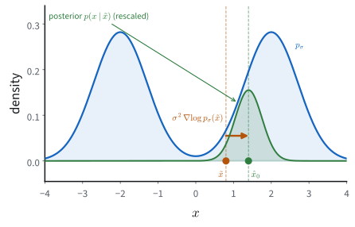
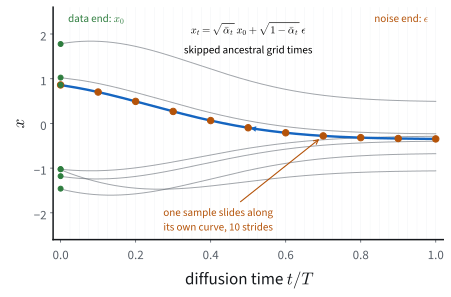

# Score Matching, Diffusion, and Flow Matching
:label:`sec_mdl-score-matching-diffusion-flow`

The preceding sections developed ODE solvers
(:numref:`sec_mdl-odes-solvers`), forward noising SDEs
(:numref:`sec_mdl-sdes`), and the role of the score $\nabla \log p_t$ in
probability flow and time reversal
(:numref:`sec_mdl-fokker-planck-probability-flow`). This section studies how to
estimate a score or velocity field by regression and then sample by integrating
the resulting ODE or SDE. We develop score matching and its denoising form,
interpret DDPM
:cite:`ho2020denoising` as a discretized variance-preserving SDE, derive
Langevin sampling, DDIM, and guidance from the same score calculus, and then
develop flow matching and rectified flow as methods that prescribe a
noise-to-data path, and relate straight paths to kinetic energy in optimal
transport :cite:`song2021score,Lipman.Chen.BenHamu.ea.2022`.

The principal statistical device is conditional expectation. A marginal score
or velocity may be unavailable directly but can be expressed as the
conditional expectation of a tractable per-sample quantity. Least-squares
regression against that quantity recovers its conditional mean. This identity
supports both denoising score matching and conditional flow matching.

We lean on the Fokker–Planck equation and the probability-flow ODE
(:numref:`sec_mdl-fokker-planck`, :numref:`sec_mdl-probability-flow-ode`), the
Ornstein–Uhlenbeck process (:numref:`sec_mdl-ornstein-uhlenbeck`), Euler and
Euler–Maruyama steps (:numref:`sec_mdl-euler-runge-kutta`,
:numref:`sec_mdl-euler-maruyama`), and the divergences of
:numref:`sec_mdl-divergences-distances` (Fisher divergence via
:numref:`sec_mdl-fisher-divergence`, optimal transport via
:numref:`sec_mdl-optimal-transport`). The numerical examples include two short
training loops (a one-dimensional score network in NumPy and a
two-dimensional flow-matching model, the latter retrained once more to measure
reflow) plus closed-form simulations for the remaining examples.

```{.python .input #score-matching-diffusion-flow-imports}
#@tab mxnet
%matplotlib inline
from d2l import mxnet as d2l
from mxnet import autograd, gluon, init, npx
from mxnet import np as mxnp
import numpy as np
npx.set_np()
```

```{.python .input #score-matching-diffusion-flow-imports}
#@tab pytorch
%matplotlib inline
from d2l import torch as d2l
import numpy as np
import torch
from torch import nn
```

```{.python .input #score-matching-diffusion-flow-imports}
#@tab tensorflow
%matplotlib inline
from d2l import tensorflow as d2l
import numpy as np
import tensorflow as tf
```

```{.python .input #score-matching-diffusion-flow-imports}
#@tab jax
%matplotlib inline
from d2l import jax as d2l
import jax
from jax import numpy as jnp
import numpy as np
import optax
```

## Learning the Score
:label:`sec_mdl-score-matching`

### A Normalizer-Free Objective

Fitting a density $p_{\boldsymbol{\theta}}$ to data by maximum likelihood
requires evaluating its normalizing constant, which for a neural-network
energy-based model is a $d$-dimensional integral with no closed form. The
**score** $\nabla_{\mathbf{x}} \log p_{\boldsymbol{\theta}}$ is independent of that
constant (:eqref:`eq_mdl-score-def`; re-derived for energy-based models in
:numref:`sec_mdl-score-function`). Objectives and samplers formulated only in
terms of scores therefore need not evaluate that constant. Instead of matching densities, match
score fields: take a model
$\mathbf{s}_{\boldsymbol{\theta}} : \mathbb{R}^d \to \mathbb{R}^d$ (any vector
field, e.g. a neural network; it need not be a gradient) and minimize the
Fisher divergence between model and data
(:numref:`sec_mdl-fisher-divergence`),

$$
J_{\mathrm{ESM}}(\boldsymbol{\theta})
= \tfrac{1}{2}\, \mathbb{E}_{\mathbf{x} \sim p}
\left[\, \left\| \mathbf{s}_{\boldsymbol{\theta}}(\mathbf{x}) - \nabla \log p(\mathbf{x}) \right\|^2 \right],
$$
:eqlabel:`eq_mdl-esm-objective`

called **explicit score matching**. This removes the normalizer, but the
objective still contains $\nabla \log p$, the score
of the *data* distribution, which is exactly what we do not know. Hyvärinen's
insight is that an integration by parts removes it
:cite:`Hyvarinen.2005`.

**Proposition (Hyvärinen's identity).** *Let $p$ be a smooth positive density
and $\mathbf{s}_{\boldsymbol{\theta}}$ a smooth vector field, with
$p(\mathbf{x})\, \mathbf{s}_{\boldsymbol{\theta}}(\mathbf{x}) \to \mathbf{0}$
as $\|\mathbf{x}\| \to \infty$ and all the expectations below finite. Then*

$$
J_{\mathrm{ESM}}(\boldsymbol{\theta})
= \mathbb{E}_{\mathbf{x} \sim p}
\left[\, \tfrac{1}{2} \| \mathbf{s}_{\boldsymbol{\theta}}(\mathbf{x}) \|^2
+ \nabla \cdot \mathbf{s}_{\boldsymbol{\theta}}(\mathbf{x}) \right] + C,
$$
:eqlabel:`eq_mdl-hyvarinen`

*where $\nabla \cdot \mathbf{s}_{\boldsymbol{\theta}} = \sum_i \partial s_i / \partial x_i$
is the divergence and $C$ does not depend on $\boldsymbol{\theta}$.*

**Proof.** Expand the square in :eqref:`eq_mdl-esm-objective`: the term
$\tfrac12 \mathbb{E}\|\nabla \log p\|^2$ is the constant $C$, the term
$\tfrac12 \mathbb{E}\|\mathbf{s}_{\boldsymbol{\theta}}\|^2$ appears verbatim in
:eqref:`eq_mdl-hyvarinen`, and it remains to transform the cross term. In one dimension,

$$
-\mathbb{E}_{x \sim p}\left[ s_{\boldsymbol{\theta}}(x)\, (\log p)'(x) \right]
= -\int s_{\boldsymbol{\theta}}(x)\, \frac{p'(x)}{p(x)}\, p(x)\, dx
= -\int s_{\boldsymbol{\theta}}(x)\, p'(x)\, dx,
$$

and integrating by parts with the boundary term
$\left[ s_{\boldsymbol{\theta}} \, p \right]_{-\infty}^{\infty} = 0$ leaves
$+\int s_{\boldsymbol{\theta}}'(x)\, p(x)\, dx = \mathbb{E}_p[s_{\boldsymbol{\theta}}']$.
This step replaces the unknown score with a derivative of the *model*. In $d$
dimensions, apply the same one-dimensional step to each coordinate $i$ (with
$s_i$ in place of $s_{\boldsymbol{\theta}}$ and $\partial_i p$ in place of
$p'$, integrating coordinate-wise, which Fubini justifies under the stated
integrability) and sum: the cross term becomes
$\mathbb{E}_p[\sum_i \partial_i s_i] = \mathbb{E}_p[\nabla \cdot \mathbf{s}_{\boldsymbol{\theta}}]$.
$\blacksquare$

Every quantity in :eqref:`eq_mdl-hyvarinen` is an expectation under $p$ of
something we can evaluate, so we can minimize it from samples alone, with no
$Z_{\boldsymbol{\theta}}$ and no $\nabla \log p$; the right-hand side is called
**implicit score matching**. The two terms have complementary effects. The
$\nabla \cdot \mathbf{s}_{\boldsymbol{\theta}}$ term favors score fields with
negative divergence at the samples, as for $-\nabla E$ near a minimum, while
$\tfrac12\|\mathbf{s}_{\boldsymbol{\theta}}\|^2$ penalizes fields of unbounded
magnitude.

Implicit score matching is expensive in high dimensions. The divergence is
the trace of the Jacobian,
$\nabla \cdot \mathbf{s}_{\boldsymbol{\theta}} = \operatorname{tr}\, (\partial \mathbf{s}_{\boldsymbol{\theta}} / \partial \mathbf{x})$,
and computing it exactly generally requires derivative work that scales
linearly with $d$ (for example, one reverse-mode pass per Jacobian row)
(:numref:`sec_mdl-matrix-calculus-autodiff`): the same trace bottleneck that
afflicts continuous normalizing flows
(:numref:`sec_mdl-continuous-normalizing-flows`), and just as there, Hutchinson
trace estimates only trade compute for variance. For images, $d$ is in the
millions. Denoising score matching avoids this trace computation.

### Denoising Score Matching
:label:`sec_mdl-denoising-score-matching`

Score models become practical by matching the score of *Gaussian-blurred*
data rather than the clean data distribution
:cite:`Vincent.2011`. Perturb each sample with Gaussian noise of scale
$\sigma$:

$$
\tilde{\mathbf{x}} = \mathbf{x} + \sigma \boldsymbol{\epsilon}, \qquad
\boldsymbol{\epsilon} \sim \mathcal{N}(\mathbf{0}, I), \qquad
\textrm{i.e.}\quad
p_\sigma(\tilde{\mathbf{x}} \mid \mathbf{x}) = \mathcal{N}(\tilde{\mathbf{x}};\, \mathbf{x},\, \sigma^2 I).
$$

The noised marginal $p_\sigma(\tilde{\mathbf{x}}) = \int p_\sigma(\tilde{\mathbf{x}} \mid \mathbf{x})\, p(\mathbf{x})\, d\mathbf{x}$
is the data density convolved with a Gaussian and approaches $p$ as
$\sigma$ decreases. Its score is still intractable, but the score of the
*conditional* follows directly by taking $\log$ of the Gaussian density:

$$
\nabla_{\tilde{\mathbf{x}}} \log p_\sigma(\tilde{\mathbf{x}} \mid \mathbf{x})
= \frac{\mathbf{x} - \tilde{\mathbf{x}}}{\sigma^2}
= -\frac{\boldsymbol{\epsilon}}{\sigma}.
$$
:eqlabel:`eq_mdl-dsm-target`

This vector points from the noisy observation toward the corresponding clean
sample. **Denoising score matching** (DSM) uses it as a regression target:

$$
J_{\mathrm{DSM}}(\boldsymbol{\theta})
= \mathbb{E}_{\mathbf{x} \sim p,\ \tilde{\mathbf{x}} \sim p_\sigma(\cdot \mid \mathbf{x})}
\left[\, \left\| \mathbf{s}_{\boldsymbol{\theta}}(\tilde{\mathbf{x}})
- \nabla_{\tilde{\mathbf{x}}} \log p_\sigma(\tilde{\mathbf{x}} \mid \mathbf{x}) \right\|^2 \right].
$$
:eqlabel:`eq_mdl-dsm-loss`

The regression target depends on the sampled clean point, whereas the desired
score depends only on the noisy observation. Least squares connects them by
fitting the target's conditional mean. The following lemma states that fact;
the flow-matching argument will use it again with a velocity target.

**Lemma (regression to the conditional mean).** *Let $(X, Y)$ be jointly
distributed with $\mathbb{E}\|Y\|^2 < \infty$ and let
$\mathbf{m}(X) = \mathbb{E}[Y \mid X]$. Then for every measurable
$\mathbf{v}$,*

$$
\mathbb{E} \left\| \mathbf{v}(X) - Y \right\|^2
= \mathbb{E} \left\| \mathbf{v}(X) - \mathbf{m}(X) \right\|^2
+ \mathbb{E} \left\| Y - \mathbf{m}(X) \right\|^2.
$$
:eqlabel:`eq_mdl-regression-lemma`

*The second term does not involve $\mathbf{v}$: minimizing a least-squares loss
against the noisy target $Y$ is the same problem as minimizing it against the
conditional mean $\mathbf{m}(X)$, up to an additive constant.*

**Proof.** Insert $\pm\mathbf{m}(X)$ and expand. The cross term is
$2\, \mathbb{E}\left[ (\mathbf{v}(X) - \mathbf{m}(X))^\top (\mathbf{m}(X) - Y) \right]$;
conditioning on $X$ (the tower rule,
:numref:`sec_mdl-random_variables`) and using
$\mathbb{E}[\mathbf{m}(X) - Y \mid X] = \mathbf{0}$ makes it vanish. $\blacksquare$

**Proposition (Vincent's theorem).** *Under the conditions above, with
expectations finite,*

$$
J_{\mathrm{DSM}}(\boldsymbol{\theta})
= \mathbb{E}_{\tilde{\mathbf{x}} \sim p_\sigma}
\left[\, \left\| \mathbf{s}_{\boldsymbol{\theta}}(\tilde{\mathbf{x}}) - \nabla \log p_\sigma(\tilde{\mathbf{x}}) \right\|^2 \right] + C,
$$

*with $C$ independent of $\boldsymbol{\theta}$: denoising score matching and
explicit score matching on the noised marginal (the right-hand side is twice
:eqref:`eq_mdl-esm-objective` with $p_\sigma$ in place of $p$) have the same
minimizers and, up to that overall factor of two, the same gradients.*

**Proof.** Apply the lemma with $X = \tilde{\mathbf{x}}$ and
$Y = \nabla_{\tilde{\mathbf{x}}} \log p_\sigma(\tilde{\mathbf{x}} \mid \mathbf{x})$.
It remains to identify the conditional mean, and *the marginal score is the
posterior mean of the conditional scores*:

$$
\mathbb{E}\left[ Y \mid \tilde{\mathbf{x}} \right]
= \int \frac{\nabla_{\tilde{\mathbf{x}}}\, p_\sigma(\tilde{\mathbf{x}} \mid \mathbf{x})}{p_\sigma(\tilde{\mathbf{x}} \mid \mathbf{x})}
\; \frac{p_\sigma(\tilde{\mathbf{x}} \mid \mathbf{x})\, p(\mathbf{x})}{p_\sigma(\tilde{\mathbf{x}})}\, d\mathbf{x}
= \frac{\nabla_{\tilde{\mathbf{x}}} \int p_\sigma(\tilde{\mathbf{x}} \mid \mathbf{x})\, p(\mathbf{x})\, d\mathbf{x}}{p_\sigma(\tilde{\mathbf{x}})}
= \nabla \log p_\sigma(\tilde{\mathbf{x}}),
$$

where the first equality writes out the posterior
$p(\mathbf{x} \mid \tilde{\mathbf{x}})$ by Bayes' rule and the second swaps the
gradient with the integral. $\blacksquare$

The proof does not require a Gaussian kernel: any smooth noising kernel
satisfying the stated conditions works. Gaussian noise is convenient because
its conditional score :eqref:`eq_mdl-dsm-target` is linear in the noise. By
:eqref:`eq_mdl-dsm-target`, predicting the score and predicting the noise
$\boldsymbol{\epsilon}$ differ only by the factor $-1/\sigma$; this is the
$\boldsymbol{\epsilon}$-prediction parameterization used in diffusion models.
Two corollaries follow.

* **Tweedie's formula** :cite:`Efron.2011`. Rearranging
  $\mathbb{E}[(\mathbf{x} - \tilde{\mathbf{x}})/\sigma^2 \mid \tilde{\mathbf{x}}] = \nabla \log p_\sigma(\tilde{\mathbf{x}})$
  gives
  $\mathbb{E}[\mathbf{x} \mid \tilde{\mathbf{x}}] = \tilde{\mathbf{x}} + \sigma^2\, \nabla \log p_\sigma(\tilde{\mathbf{x}})$:
  *the optimal denoiser adds a score-based correction*
  (:numref:`fig_mdl-dyn-tweedie`). Under squared error and Gaussian
  corruption, the posterior-mean denoiser is determined by the marginal score.
* **The population loss need not go to zero.** By :eqref:`eq_mdl-regression-lemma`, the DSM
  loss at the optimum equals
  $\mathbb{E}\|Y - \mathbf{m}(X)\|^2$, the average posterior variance
  of the conditional score: many clean points $\mathbf{x}$ explain the same
  $\tilde{\mathbf{x}}$, and no network can resolve which one produced it. A
  resulting Bayes risk depends on the noise level, weighting, and target
  parameterization. An observed training loss also contains approximation and
  optimization error, so it should be compared with an estimated Bayes-risk
  floor rather than with zero.


:label:`fig_mdl-dyn-tweedie`

### A Score Network in One Dimension

Take the bimodal mixture
$p = \tfrac12 \mathcal{N}(-2, 0.5^2) + \tfrac12 \mathcal{N}(2, 0.5^2)$, noise
scale $\sigma = 0.5$, and fit a tiny multilayer perceptron
$s_{\boldsymbol{\theta}} : \mathbb{R} \to \mathbb{R}$ by minimizing
:eqref:`eq_mdl-dsm-loss`: the inputs are noised samples, the regression
targets are $-\epsilon/\sigma$, and training requires samples rather than an
analytic expression for the true density. Because the noised marginal is
again a Gaussian mixture (variance
$0.5^2 + \sigma^2 = 0.5$ per component), we have the analytic
$\nabla \log p_\sigma$ against which to evaluate the result. The network is
small enough that we write its forward pass, its backward pass
(:numref:`sec_mdl-matrix-calculus-autodiff`), and an Adam update directly in
plain NumPy, without an automatic-differentiation framework.

```{.python .input #score-matching-diffusion-flow-dsm-train}
rng = np.random.default_rng(7)
n, sigma = 4096, 0.5
x = rng.normal(4.0 * rng.integers(0, 2, n) - 2.0, 0.5)    # x ~ p, the mixture

def mixture_score(q, var, means=(-2.0, 2.0)):             # analytic score
    w = np.stack([np.exp(-(q - m)**2 / (2 * var)) for m in means])
    return (w * np.stack([(m - q) / var for m in means])).sum(0) / w.sum(0)

# A 1 -> 32 -> 1 tanh network, with hand-written backprop and Adam updates
W1, b1 = rng.normal(size=(1, 32)), np.zeros(32)
W2, b2 = rng.normal(size=(32, 1)) / np.sqrt(32), np.zeros(1)
params = [W1, b1, W2, b2]
mom = [np.zeros_like(p) for p in params]
vel = [np.zeros_like(p) for p in params]
for step in range(2000):
    eps = rng.standard_normal(n)                          # fresh noise per step
    xt, y = (x + sigma * eps)[:, None], (-eps / sigma)[:, None]
    H = np.tanh(xt @ W1 + b1)                             # forward pass
    S = H @ W2 + b2
    G = 2 * (S - y) / n                                   # backward pass
    GH = (G @ W2.T) * (1 - H**2)
    grads = [xt.T @ GH, GH.sum(0), H.T @ G, G.sum(0)]
    for p, g, m, v in zip(params, grads, mom, vel):       # Adam updates
        m[:] = 0.9 * m + 0.1 * g
        v[:] = 0.999 * v + 0.001 * g * g
        p -= 1e-2 * m / (np.sqrt(v) + 1e-8)
loss = ((S - y)**2).mean()
bayes_ref = ((mixture_score(x + sigma * eps, 0.5) + eps / sigma)**2).mean()
grid = np.linspace(-4, 4, 201)
s_hat = (np.tanh(grid[:, None] @ W1 + b1) @ W2 + b2)[:, 0]
print(f'DSM loss {loss:.3f} vs estimated Bayes risk {bayes_ref:.3f}; '
      f'max |s_theta - score| on [-4, 4]: {np.abs(s_hat - mixture_score(grid, 0.5)).max():.3f}')
d2l.plot(grid, [mixture_score(grid, 0.5), s_hat], 'x', 'score',
         legend=['analytic score of p_sigma', 'learned s_theta'])
```

The learned field tracks the analytic score across both modes and the
low-density valley between them: the largest gap on $[-4, 4]$ is about
$0.2$, on a curve whose values span $\pm 4$ (the smoothed score is
$s(x) = 4\tanh(4x) - 2x$, extremal at the interval ends). And the printout verifies the regression
lemma numerically: the final DSM loss ($\approx 2.04$) is close to the
estimated Bayes risk $\mathbb{E}\|Y - \mathbf{m}(X)\|^2$ ($\approx 2.04$,
estimated on this finite sample with the analytic score). Their agreement is
consistent with little reducible error remaining in this particular fit.

## Score-Based Diffusion Models
:label:`sec_mdl-score-based-generative-modeling`

### Scores Across Noise Levels

A single noise scale $\sigma$ creates a trade-off. Small $\sigma$ makes
$p_\sigma \approx p$, but noised samples then seldom enter low-density regions,
so the learned score is poorly constrained where a sampler initialized from
random noise may need it. Large $\sigma$ provides broader coverage but
estimates the score of an over-smoothed density. The standard solution
:cite:`song2019generative,song2021score`: learn the score at *every* noise level
along a forward process that moves the data toward a tractable reference, by making the
network noise-conditional, $\mathbf{s}_{\boldsymbol{\theta}}(\mathbf{x}, t)$
(:numref:`fig_mdl-dyn-noising-denoising`, the two-dimensional companion of
the one-dimensional density movie in :numref:`fig_mdl-dyn-forward-reverse`).
:numref:`sec_mdl-sdes` gave us the two standard forward processes:

* the **variance-exploding (VE)** SDE
  $d\mathbf{X} = \sqrt{\tfrac{d}{dt}\sigma^2(t)}\; d\mathbf{W}$, with
  $\sigma^2(t)$ increasing and differentiable so that the square root exists,
  which adds noise without shrinking the data:
  $\mathbf{x}_t = \mathbf{x}_0 + \sigma(t) \boldsymbol{\epsilon}$ (the
  continuous limit of Song & Ermon's noise ladder), with conditional terminal
  law $\mathcal{N}(\mathbf{x}_0, \sigma_{\max}^2 I)$ rather than a standard
  Gaussian;
* the **variance-preserving (VP)** SDE
  $d\mathbf{X} = -\tfrac12 \beta(t)\, \mathbf{X}\, dt + \sqrt{\beta(t)}\; d\mathbf{W}$
  of :eqref:`eq_mdl-sde-vp-sde`, an Ornstein–Uhlenbeck process with a
  time-dependent rate (:numref:`sec_mdl-ornstein-uhlenbeck`), which shrinks
  the signal as it adds noise so that unit-variance data keeps unit variance
  for *all* $t$ (shown for the discrete chain below).


:label:`fig_mdl-dyn-noising-denoising`

In both cases the transition kernel $p_t(\mathbf{x}_t \mid \mathbf{x}_0)$ is an
explicit Gaussian, so the DSM machinery applies verbatim at every $t$: the
training loss is the noise-conditional DSM objective

$$
\mathcal{L}(\boldsymbol{\theta})
= \mathbb{E}_{t}\, \lambda(t)\; \mathbb{E}_{\mathbf{x}_0,\, \mathbf{x}_t \sim p_t(\cdot \mid \mathbf{x}_0)}
\left[\, \left\| \mathbf{s}_{\boldsymbol{\theta}}(\mathbf{x}_t, t)
- \nabla_{\mathbf{x}_t} \log p_t(\mathbf{x}_t \mid \mathbf{x}_0) \right\|^2 \right],
$$
:eqlabel:`eq_mdl-ncsm-loss`

with a weighting $\lambda(t) > 0$ that decides which noise levels the network
should serve best. In the population problem, with an unrestricted function
class and positive weight at $t$, Vincent's theorem makes the minimizer
$\mathbf{s}(\cdot,t)=\nabla\log p_t$. A finite network trained on samples adds
approximation, estimation, and optimization error. With the likelihood
weighting $\lambda(t)=g(t)^2$, the cited analysis relates the population score
loss to an upper bound on negative log-likelihood under its regularity and
terminal-distribution assumptions :cite:`Song.Durkan.Murray.ea.2021`. DDPM's
simple loss instead induces $\lambda(t)=1-\bar{\alpha}_t$, derived below; this
changes the relative emphasis across noise levels and is often chosen for
sample quality rather than for that bound. Generation then follows the program of
:numref:`sec_mdl-time-reversal` and :numref:`sec_mdl-probability-flow-ode`:
start from the chosen terminal reference (approximately Gaussian at finite
noising time) and integrate either the reverse-time
SDE :cite:`Anderson.1982` or the probability-flow ODE, with
$\mathbf{s}_{\boldsymbol{\theta}}$ standing in for the true score. A generative
model is specified by this combination of forward process,
learned score, and numerical sampler.

::: {.callout-important title="Two clocks: the time conventions of diffusion and flow matching"}
The two literatures run time in opposite directions, and almost every
sign confusion in this field traces back to it
(:numref:`fig_mdl-dyn-time-conventions`).

* **Diffusion** noises *data into noise* forward in time: $t = 0$ is data,
  $t = T$ is (approximately) pure Gaussian. *Sampling integrates backwards*,
  from $t = T$ down to $0$.
* **Flow matching** parameterizes the *generative* direction: $t = 0$ is
  noise, $t = 1$ is data, and sampling integrates forwards from $0$ to $1$.

In this section, $t$ in a diffusion formula runs data $\to$ noise, and $t$ in
a flow-matching formula runs noise $\to$ data. When comparing the two (as the
unifying table at the end does), substitute $t \mapsto 1 - t$ in one of them.
:::


:label:`fig_mdl-dyn-time-conventions`

### DDPM as a Discretized SDE
:label:`sec_mdl-ddpm-discretized-sde`

The Denoising Diffusion Probabilistic Model :cite:`ho2020denoising` looks, at
first sight, like a different theory: a discrete-time Markov chain of $T$
noising steps with schedule $\beta_1, \ldots, \beta_T \in (0, 1)$,

$$
\mathbf{x}_t = \sqrt{1 - \beta_t}\; \mathbf{x}_{t-1} + \sqrt{\beta_t}\; \boldsymbol{\epsilon}_t,
\qquad \boldsymbol{\epsilon}_t \sim \mathcal{N}(\mathbf{0}, I)\ \textrm{i.i.d.}
$$
:eqlabel:`eq_mdl-ddpm-forward`

It is not a different theory. Three short propositions identify it, piece by
piece, with the VP picture above.

**Proposition (the DDPM step is Euler–Maruyama on the VP-SDE).** *Discretize
the VP-SDE with step $\Delta$ and write $\beta_t = \beta(t\Delta)\, \Delta$.
The Euler–Maruyama step (:numref:`sec_mdl-euler-maruyama`) is*

$$
\mathbf{x}_t = \left(1 - \tfrac{1}{2} \beta_t\right) \mathbf{x}_{t-1} + \sqrt{\beta_t}\; \boldsymbol{\epsilon}_t,
$$

*which agrees with the DDPM step :eqref:`eq_mdl-ddpm-forward` to first order in
$\beta_t$.*

**Proof.** The Taylor expansion
$\sqrt{1 - \beta} = 1 - \tfrac12 \beta - \tfrac18 \beta^2 - \cdots$ shows the
two coefficients differ by $O(\beta_t^2)$, while the noise terms are identical.
$\blacksquare$

The agreement is *first-order only* (for the largest practical
$\beta_t \approx 0.02$ the coefficients differ in the fifth decimal), but DDPM's
exact form is in one way nicer than the discretization that inspired it: it has
an exact closed-form marginal, with no $O(\beta^2)$ apology.

**Proposition (the $\bar{\alpha}$-marginal).** *Let $\alpha_t = 1 - \beta_t$
and $\bar{\alpha}_t = \prod_{s=1}^{t} \alpha_s$. Then conditionally on
$\mathbf{x}_0$,*

$$
\mathbf{x}_t = \sqrt{\bar{\alpha}_t}\; \mathbf{x}_0 + \sqrt{1 - \bar{\alpha}_t}\; \boldsymbol{\epsilon},
\qquad \boldsymbol{\epsilon} \sim \mathcal{N}(\mathbf{0}, I).
$$
:eqlabel:`eq_mdl-ddpm-marginal`

**Proof.** Induction on $t$; the case $t = 0$ is trivial. Assume
:eqref:`eq_mdl-ddpm-marginal` at $t - 1$ and substitute into
:eqref:`eq_mdl-ddpm-forward`:

$$
\mathbf{x}_t
= \sqrt{\alpha_t \bar{\alpha}_{t-1}}\; \mathbf{x}_0
+ \sqrt{\alpha_t (1 - \bar{\alpha}_{t-1})}\; \bar{\boldsymbol{\epsilon}}
+ \sqrt{\beta_t}\; \boldsymbol{\epsilon}_t,
$$

with $\bar{\boldsymbol{\epsilon}}, \boldsymbol{\epsilon}_t$ independent
standard Gaussians. A sum of independent Gaussians is Gaussian with summed
variances:
$\alpha_t (1 - \bar{\alpha}_{t-1}) + \beta_t = \alpha_t - \bar{\alpha}_t + 1 - \alpha_t = 1 - \bar{\alpha}_t$,
and $\alpha_t \bar{\alpha}_{t-1} = \bar{\alpha}_t$. $\blacksquare$

The term "variance-preserving" follows from the identity: for
unit-variance data, $\mathrm{Var}(\mathbf{x}_t) = \bar{\alpha}_t \cdot 1 + (1 - \bar{\alpha}_t) = 1$
for *every* $t$, not merely in the limit. And because
:eqref:`eq_mdl-ddpm-marginal` is a Gaussian kernel with scale
$\sqrt{1 - \bar{\alpha}_t}$, denoising score matching applies directly.

**Proposition (the DDPM loss is reweighted DSM).** *The conditional score of
:eqref:`eq_mdl-ddpm-marginal` is
$\nabla_{\mathbf{x}_t} \log p(\mathbf{x}_t \mid \mathbf{x}_0) = -\boldsymbol{\epsilon} / \sqrt{1 - \bar{\alpha}_t}$.
Hence, parameterizing the score model through a noise-prediction network,
$\mathbf{s}_{\boldsymbol{\theta}}(\mathbf{x}_t, t) = -\boldsymbol{\epsilon}_{\boldsymbol{\theta}}(\mathbf{x}_t, t) / \sqrt{1 - \bar{\alpha}_t}$,
the DDPM "simple loss"
$\mathbb{E}_{t, \mathbf{x}_0, \boldsymbol{\epsilon}} \| \boldsymbol{\epsilon} - \boldsymbol{\epsilon}_{\boldsymbol{\theta}}(\mathbf{x}_t, t) \|^2$
equals the noise-conditional DSM loss :eqref:`eq_mdl-ncsm-loss` with weighting
$\lambda(t) = 1 - \bar{\alpha}_t$.*

**Proof.** Differentiate
$\log p(\mathbf{x}_t \mid \mathbf{x}_0) = -\|\mathbf{x}_t - \sqrt{\bar{\alpha}_t} \mathbf{x}_0\|^2 / (2 (1 - \bar{\alpha}_t)) + \textrm{const}$
and substitute :eqref:`eq_mdl-ddpm-marginal`. Then

$$
\left\| \mathbf{s}_{\boldsymbol{\theta}}(\mathbf{x}_t, t) + \frac{\boldsymbol{\epsilon}}{\sqrt{1 - \bar{\alpha}_t}} \right\|^2
= \frac{1}{1 - \bar{\alpha}_t} \left\| \boldsymbol{\epsilon} - \boldsymbol{\epsilon}_{\boldsymbol{\theta}}(\mathbf{x}_t, t) \right\|^2,
$$

so the two losses differ exactly by the factor $\lambda(t) = 1 - \bar{\alpha}_t$
inside the time expectation. $\blacksquare$

So DDPM = VP forward process + DSM objective in
$\boldsymbol{\epsilon}$-parameterization + ancestral sampling, i.e. stepping
through the learned reverse chain one noise level at a time. The discrete
chain is a first-order counterpart of the continuous VP construction
:cite:`song2021score`. Historically the model was derived along an entirely
different route: write the reverse chain as a latent-variable model and
maximize an evidence lower bound, as in
:numref:`sec_mdl-latent-em-elbo` :cite:`sohl2015deep,ho2020denoising`.
After the same Gaussian algebra as above, the KL terms between the Gaussian
forward posteriors and the learned reverse steps collapse into weighted
$\boldsymbol{\epsilon}$-prediction losses; the ELBO and score-based derivations produce
the same objective with a different $\lambda(t)$, and :citet:`Luo.2022` is a
careful walkthrough of that equivalence.

The cell below checks both propositions at once: it runs the discrete chain
:eqref:`eq_mdl-ddpm-forward` for $T = 1000$ steps on (standardized) samples of
our two-Gaussian mixture and compares against the closed form
:eqref:`eq_mdl-ddpm-marginal`: variances on the way, and the full distribution
against a one-shot $\bar{\alpha}$-sample at the end.

```{.python .input #score-matching-diffusion-flow-ddpm-marginal}
rng = np.random.default_rng(13)
T = 1000
beta = np.linspace(1e-4, 0.02, T)                  # the DDPM schedule
alpha_bar = np.cumprod(1.0 - beta)
x0 = x / x.std()                                   # unit-variance mixture data
xt = x0.copy()
for t in range(T):                                 # the discrete forward chain
    xt = np.sqrt(1 - beta[t]) * xt + np.sqrt(beta[t]) * rng.standard_normal(n)
    if t + 1 in (10, 100, 1000):
        var_pred = alpha_bar[t] * x0.var() + (1 - alpha_bar[t])
        print(f't = {t+1:4d}: Var(x_t) chain {xt.var():.3f}, '
              f'formula {var_pred:.3f}, alpha_bar {alpha_bar[t]:.4f}')
one_shot = (np.sqrt(alpha_bar[-1]) * x0
            + np.sqrt(1 - alpha_bar[-1]) * rng.standard_normal(n))
print(f'chain vs one-shot at T: mean {xt.mean():+.3f} vs {one_shot.mean():+.3f}, '
      f'std {xt.std():.3f} vs {one_shot.std():.3f}')
```

The variance tracks the formula's $1.000$ at every checkpoint, to within the
sampling error of a $4096$-point variance estimate (the VP identity in
action), and after a thousand steps the chain matches the one-shot Gaussian
reparameterization in distribution, which is why DDPM training never simulates
the chain: it jumps straight to any $t$ via :eqref:`eq_mdl-ddpm-marginal`.

### Langevin Dynamics and Predictor–Corrector Sampling

Reverse-time SDEs are not the only way to turn a score into samples: the
oldest way predates diffusion models by decades. Suppose we hold the
distribution *fixed*: no noising schedule, just a target $p$ whose score we
know. **Langevin dynamics** is the SDE whose drift pushes up the
log-density while noise jiggles the state,

$$
d\mathbf{X} = \tfrac{1}{2} \nabla \log p(\mathbf{X})\, dt + d\mathbf{W}.
$$
:eqlabel:`eq_mdl-langevin`

**Proposition (stationarity).** *Let $p$ be a smooth positive density with
$p$ and $\nabla p$ vanishing at infinity. Then $p$ is a stationary density of
:eqref:`eq_mdl-langevin`: if $\mathbf{X}_0 \sim p$ then $\mathbf{X}_t \sim p$
for all $t \ge 0$.*

**Proof.** The Fokker–Planck equation (:numref:`sec_mdl-fokker-planck`) for
drift $\mathbf{b} = \tfrac12 \nabla \log p$ and unit diffusion reads
$\partial_t \rho = -\nabla \cdot (\rho\, \mathbf{b}) + \tfrac12 \Delta \rho$.
Substitute $\rho = p$ and use the identity
$p\, \nabla \log p = \nabla p$:

$$
-\nabla \cdot \left( \tfrac{1}{2}\, p\, \nabla \log p \right) + \tfrac{1}{2} \Delta p
= -\tfrac{1}{2} \nabla \cdot (\nabla p) + \tfrac{1}{2} \Delta p = 0.
$$

The right-hand side of the Fokker–Planck equation vanishes identically, so
$\rho \equiv p$ solves it for all time. $\blacksquare$

Discretizing :eqref:`eq_mdl-langevin` by Euler–Maruyama with step $h$ gives the
**Langevin sampler**
$\mathbf{x} \leftarrow \mathbf{x} + \tfrac{h}{2}\, \mathbf{s}(\mathbf{x}) + \sqrt{h}\, \boldsymbol{\xi}$.
Stationarity of the SDE is not convergence of its discretization. Under
appropriate ergodicity and regularity assumptions, the finite-step chain has
an invariant law that approximates $p$, generally with $O(h)$ weak bias (see
Exercise 6); convergence to that law can still be slow. With
$\mathbf{s} = \mathbf{s}_{\boldsymbol{\theta}}$, this turns a trained score
network directly into a generator. The cell runs it on our mixture with the
analytic score, exposing that weakness along the way.

```{.python .input #score-matching-diffusion-flow-langevin}
rng = np.random.default_rng(11)

def langevin(q, h, steps, rng):
    for _ in range(steps):
        q = q + 0.5 * h * mixture_score(q, 0.25) \
            + np.sqrt(h) * rng.standard_normal(q.shape)
    return q

warm = langevin(rng.normal(0.0, 3.0, 10000), 0.01, 2000, rng)
print(f'spread-out start: P(X > 0) = {(warm > 0).mean():.3f}, '
      f'E[X^2] = {(warm**2).mean():.2f} (truth 0.500, 4.25)')
cold = langevin(np.full(10000, -2.0), 0.01, 2000, rng)
print(f'one-mode start:   P(X > 0) = {(cold > 0).mean():.3f}  (slow mixing)')
```

From a broad initial distribution, the chains approach the target proportions:
half the mass lies in each mode, and the second moment matches the true value.
When all chains start in the left mode, almost none cross after two thousand
steps because the density between the modes is small and the score points back
toward the current mode. This slow *mixing* makes plain Langevin sampling
inefficient on multimodal targets and motivates the noise schedules used by
diffusion models: **annealed
Langevin dynamics** :cite:`song2019generative` runs Langevin at a *ladder* of
noise levels $\sigma_1 > \cdots > \sigma_L$, using
$\mathbf{s}_{\boldsymbol{\theta}}(\cdot, \sigma_i)$ at level $i$. At large
$\sigma$ the smoothed density has no barriers, so chains move between regions;
as $\sigma$ shrinks, detail re-emerges with the global proportions already
right. The same idea survives inside modern samplers as the
**predictor–corrector** scheme :cite:`song2021score`: alternate a reverse-SDE
step (the *predictor*, which moves to the next noise level) with a few Langevin
steps at the current level (the *corrector*, which repairs the discretization
error of the predictor before it compounds).

### DDIM: Trading Noise for Speed

Ancestral DDPM sampling needs $T \sim 1000$ network calls. **DDIM**
(Denoising Diffusion Implicit Models)
:cite:`Song.Meng.Ermon.2020` cuts this by an order of magnitude with *the same
trained network* (no retraining) by replacing the noisy reverse chain with a
deterministic update.

::: {.callout-note title="The DDIM update, in one derivation"}
At time $t$, the network's noise prediction yields a current best guess of the
clean sample by inverting the marginal :eqref:`eq_mdl-ddpm-marginal`:

$$
\hat{\mathbf{x}}_0
= \frac{\mathbf{x}_t - \sqrt{1 - \bar{\alpha}_t}\; \boldsymbol{\epsilon}_{\boldsymbol{\theta}}(\mathbf{x}_t, t)}{\sqrt{\bar{\alpha}_t}}.
$$

DDPM would *resample* by drawing fresh noise and forming a noisy
$\mathbf{x}_{t-1}$. DDIM instead **reuses the predicted direction**, forming
$\mathbf{x}_{t-1}$ from the current clean estimate
$\hat{\mathbf{x}}_0$ and noise estimate
$\boldsymbol{\epsilon}_{\boldsymbol{\theta}}$ at time $t-1$:

$$
\mathbf{x}_{t-1}
= \sqrt{\bar{\alpha}_{t-1}}\; \hat{\mathbf{x}}_0
+ \sqrt{1 - \bar{\alpha}_{t-1}}\; \boldsymbol{\epsilon}_{\boldsymbol{\theta}}(\mathbf{x}_t, t).
$$
:eqlabel:`eq_mdl-ddim-update`

The algebra is easiest to remember through a hypothetical forward pair:
if we knew that realization's actual $(\mathbf{x}_0,\boldsymbol{\epsilon})$,
the formula would move it along the curve
$t \mapsto \sqrt{\bar{\alpha}_t}\,\mathbf{x}_0
+ \sqrt{1-\bar{\alpha}_t}\,\boldsymbol{\epsilon}$. A network trained by
squared error does not recover that latent noise realization, however; it
recovers the conditional mean
$\mathbb{E}[\boldsymbol{\epsilon}\mid\mathbf{x}_t]$. Thus
:eqref:`eq_mdl-ddim-update` is a deterministic update defined from the learned
conditional estimate, not an exact jump along each sample's hidden forward
curve. We may evaluate it on a sparse subsequence of the training noise levels,
but larger gaps introduce discretization/model error.
:::

Two remarks complete the picture. First, DDIM is the $\eta = 0$ endpoint of a
family that interpolates to an ancestral sampler by reinjecting noise; its
non-Markovian forward construction has the same one-time noising marginals as
DDPM, so the same trained network can be reused. Second, in the fine-step
continuous-time limit the deterministic trajectory is related to the
probability-flow ODE of the VP-SDE
(:numref:`sec_mdl-probability-flow-ode`). This relationship motivates sparse
deterministic sampling, but it does not make a finite DDIM stride exact, even
when a marginal happens to be Gaussian.


:label:`fig_mdl-dyn-ddim-strides`

How much do the strides cost when the marginal is *not* a single Gaussian? Our
standardized two-Gaussian mixture answers in closed form: its noised marginals,
hence the exact noise prediction
$\boldsymbol{\epsilon}_{\boldsymbol{\theta}} = -\sqrt{1 - \bar{\alpha}_t}\; \nabla \log p_t$,
are available at every $t$, so we can run the DDIM update
:eqref:`eq_mdl-ddim-update` with no learning in the loop: a thousand small
steps versus ten big ones from the same initial noise draws.

```{.python .input #mdl-score-matching-diffusion-flow-ddim-trading-noise-for-speed}
rng = np.random.default_rng(19)
mt, vt = 2 / np.sqrt(4.25), 0.25 / 4.25       # standardized mixture parameters

def ddim(z, K):                               # K deterministic DDIM strides
    idx = np.linspace(999, 0, K + 1).round().astype(int)
    xt = z.copy()
    for t1, t2 in zip(idx[:-1], idx[1:]):
        a1, a2 = alpha_bar[t1], alpha_bar[t2]
        s = mixture_score(xt, a1 * vt + 1 - a1,
                          (-np.sqrt(a1) * mt, np.sqrt(a1) * mt))
        eps = -np.sqrt(1 - a1) * s            # exact noise prediction
        x0_hat = (xt - np.sqrt(1 - a1) * eps) / np.sqrt(a1)
        xt = np.sqrt(a2) * x0_hat + np.sqrt(1 - a2) * eps
    return xt

def ks(a, b):                                 # two-sample KS statistic
    q = np.sort(np.concatenate([a, b]))
    return np.abs(np.searchsorted(np.sort(a), q, 'right') / len(a)
                  - np.searchsorted(np.sort(b), q, 'right') / len(b)).max()

z = rng.standard_normal(8000)
x_ref = ddim(z, 1000)                         # a thousand small staggers
for K in (10, 50):
    xK = ddim(z, K)
    print(f'{K:3d} strides vs 1000: mean |gap| {np.abs(xK - x_ref).mean():.3f}, '
          f'KS {ks(xK, x_ref):.3f}, mode fraction {(xK > 0).mean():.3f}')
print(f'mode fraction at 1000 steps: {(x_ref > 0).mean():.3f}; '
      'the same initial draws are used at every stride count')
```

Ten strides place every sample in the same mode as the thousand-step reference
and differ by only $0.08$ per sample on a scale where the modes sit at
$\pm 0.97$. (The mode fraction is *identical* at every stride count: the update
is deterministic, and in this run no trajectory crosses the valley.)
The discrepancy illustrates the central point: the predicted
noise is a posterior *mean*, not the realization's latent noise, so a finite
deterministic stride need not preserve the target marginal exactly. This is
true even for Gaussian data; Gaussianity makes the score linear, but does not
turn the conditional mean into the sampled noise realization. By fifty strides
the empirical CDF gap to the thousand-step numerical reference is $0.018$.
Since both runs use the same initial draws, this is a paired numerical
comparison rather than an independent-sample hypothesis test. Larger strides
reduce the number of evaluations while increasing finite-stride approximation
error.

### Guidance with Bayes' Rule

Generative models often condition on a label or prompt. Conditioning a score
model follows directly from probability identities and requires no new
training objective. Bayes' rule at noise level $t$ reads
$p_t(\mathbf{x} \mid y) \propto p_t(\mathbf{x})\, p_t(y \mid \mathbf{x})$, and
it becomes additive for scores, since the gradient is in $\mathbf{x}$ and the
evidence term drops:

$$
\nabla_{\mathbf{x}} \log p_t(\mathbf{x} \mid y)
= \nabla_{\mathbf{x}} \log p_t(\mathbf{x})
+ \nabla_{\mathbf{x}} \log p_t(y \mid \mathbf{x}).
$$
:eqlabel:`eq_mdl-guidance-bayes`

Any sampler from this section runs unchanged with the conditional score in
place of the unconditional one. **Classifier guidance**
:cite:`Dhariwal.Nichol.2021` implements the second term with an auxiliary
classifier $p_{\boldsymbol{\phi}}(y \mid \mathbf{x}, t)$ trained on *noisy*
inputs, because a clean-image classifier is not calibrated off the data
manifold where $\mathbf{x}_t$ is evaluated, and scales it with a **guidance scale**
$\gamma > 1$:

$$
\tilde{\mathbf{s}}(\mathbf{x}, t)
= \nabla \log p_t(\mathbf{x}) + \gamma\, \nabla \log p_{\boldsymbol{\phi}}(y \mid \mathbf{x}, t)
= \nabla \log \left[ \frac{p_t(\mathbf{x})\, p_{\boldsymbol{\phi}}(y \mid \mathbf{x}, t)^{\gamma}}{Z} \right].
$$

The second equality identifies the sampled distribution as a *tilted*
distribution in which the classifier contribution is weighted by $\gamma$.
This weighting favors more prototypical examples of "$y$" and reduces
diversity.

**Classifier-free guidance (CFG)** :cite:`Ho.Salimans.2022` removes the
auxiliary classifier with one more application of
:eqref:`eq_mdl-guidance-bayes`, read right to left:
$\nabla \log p_t(y \mid \mathbf{x}) = \nabla \log p_t(\mathbf{x} \mid y) - \nabla \log p_t(\mathbf{x})$.
Train a *single* network on labeled data, dropping the label some fraction of
the time, so it learns both
$\mathbf{s}_{\boldsymbol{\theta}}(\mathbf{x}, t, y)$ and
$\mathbf{s}_{\boldsymbol{\theta}}(\mathbf{x}, t, \varnothing)$. At sampling
time, *extrapolate* from the unconditional score through the conditional one:

$$
\tilde{\mathbf{s}}(\mathbf{x}, t)
= \mathbf{s}_{\boldsymbol{\theta}}(\mathbf{x}, t, \varnothing)
+ \gamma \left[ \mathbf{s}_{\boldsymbol{\theta}}(\mathbf{x}, t, y)
- \mathbf{s}_{\boldsymbol{\theta}}(\mathbf{x}, t, \varnothing) \right],
$$
:eqlabel:`eq_mdl-cfg`

equivalently $(1 - \gamma)\, \mathbf{s}_\varnothing + \gamma\, \mathbf{s}_y$:
$\gamma = 0$ ignores the label, while $\gamma = 1$ uses the network's
conditional score (the exact conditional only for an exact model),
and the values used in practice ($\gamma \approx 3$–$10$ for text-to-image
models, occasionally higher) push *past* the conditional, in the score-space
direction "more like $y$". Substituting the Bayes identity shows :eqref:`eq_mdl-cfg` is exactly the
classifier-guidance tilt with the implicit classifier
$p_t(y \mid \mathbf{x}) = p_t(\mathbf{x} \mid y)\, p(y) / p_t(\mathbf{x})$ in
the exponent's role. One caveat: for $\gamma > 1$ the tilted object
$p_t(\mathbf{x})\, p_t(y \mid \mathbf{x})^\gamma$ is not, in general, the
noised marginal of *any* clean distribution: the guided field is a useful
controlled distortion, not the score of a consistent diffusion, and the
resulting fidelity-versus-diversity trade-off is an engineering choice, not a
theorem. In $\boldsymbol{\epsilon}$-parameterization, :eqref:`eq_mdl-cfg` is
applied verbatim to $\boldsymbol{\epsilon}_{\boldsymbol{\theta}}$, since the
two differ by the $t$-dependent factor $-\sqrt{1 - \bar{\alpha}_t}$.

Guidance can also be examined in closed form.
Label the two modes of our standardized mixture as classes, with $y$ naming the
right mode: the class-conditional $p_t(\cdot \mid y)$ is a single moving
Gaussian, the unconditional $p_t$ is the mixture, and both scores are exact,
so the guided field :eqref:`eq_mdl-cfg` needs no network at all. The cell runs
ancestral reverse sampling with it at $\gamma \in \{1, 3, 10\}$.

```{.python .input #mdl-score-matching-diffusion-flow-guidance-steering-with-bayes-rule}
rng = np.random.default_rng(23)

def cfg_sample(gamma, n=8000):                # ancestral chain, guided score
    xt = rng.standard_normal(n)
    for t in range(999, -1, -1):
        a, b = alpha_bar[t], beta[t]
        v = a * vt + 1 - a
        s_uncond = mixture_score(xt, v, (-np.sqrt(a) * mt, np.sqrt(a) * mt))
        s_cond = (np.sqrt(a) * mt - xt) / v   # class y = the right mode
        s = (1 - gamma) * s_uncond + gamma * s_cond
        xt = (xt + b * s) / np.sqrt(1 - b)
        if t > 0:
            xt = xt + np.sqrt(b) * rng.standard_normal(n)
    return xt

samples = {g: cfg_sample(g) for g in (1.0, 3.0, 10.0)}
for g, xs in samples.items():
    print(f'gamma = {g:4.1f}: mass right of 0: {(xs > 0).mean():.3f}, '
          f'mean {xs.mean():.3f}, std {xs.std():.3f}')
print(f'exact conditional: mean {mt:.3f}, std {np.sqrt(vt):.3f}')
d2l.set_figsize((6, 2.5))
for g, xs in samples.items():
    d2l.plt.hist(xs, bins=80, density=True, histtype='step',
                 label=f'gamma = {g:g}')
d2l.plt.xlabel('x'), d2l.plt.ylabel('density'), d2l.plt.legend();
```

The printout measures the tilt. At $\gamma = 1$ the finite-step sampler closely
approximates the exact conditional: mean $0.966$ against the analytic $0.970$, standard
deviation $0.244$ against $0.243$, and *all* of the mass in the right mode,
where the unconditional mixture would put only half of it. Pushing $\gamma$ to
$3$ and $10$ has no more mass to reallocate, so it distorts the surviving mode
instead: the mean slides from $0.97$ to $1.04$ to $1.07$, away from the class
boundary ("more prototypically $y$") while the histogram narrows slightly.
This shift and narrowing illustrate the preceding caveat:
for $\gamma > 1$ the samples track no noised marginal of any clean
distribution; the tilt is its own object, more emphatic and less diverse than
the class it names.

## Flow Matching and Rectified Flow
:label:`sec_mdl-flow-matching`

### Probability Paths and Velocity Fields

Diffusion derives a bridge between noise and data from a stochastic process
and then reverses it. Flow matching :cite:`Lipman.Chen.BenHamu.ea.2022`
instead prescribes a family of densities
$(p_t)_{t \in [0, 1]}$ with $p_0$ = noise and $p_1$ = data (a
**probability path**) and learn the velocity field that transports mass along
it. Recall from :numref:`sec_mdl-continuity-equation` that a velocity field
$\mathbf{u}_t$ realizes the path iff the pair satisfies the continuity
equation $\partial_t p_t = -\nabla \cdot (p_t\, \mathbf{u}_t)$. If we can fit
$\mathbf{v}_{\boldsymbol{\theta}} \approx \mathbf{u}_t$, generation is a plain
ODE solve of $\dot{\mathbf{x}} = \mathbf{v}_{\boldsymbol{\theta}}(\mathbf{x}, t)$
from $\mathbf{x}_0 \sim p_0$: a continuous normalizing flow
(:numref:`sec_mdl-continuous-normalizing-flows`) trained *without ever
simulating the ODE*. The natural objective is the **flow-matching loss**

$$
\mathcal{L}_{\mathrm{FM}}(\boldsymbol{\theta})
= \mathbb{E}_{t \sim \mathcal{U}[0,1],\ \mathbf{x} \sim p_t}
\left[\, \left\| \mathbf{v}_{\boldsymbol{\theta}}(\mathbf{x}, t) - \mathbf{u}_t(\mathbf{x}) \right\|^2 \right],
$$
:eqlabel:`eq_mdl-fm-loss`

Like explicit score matching, this objective contains an unknown marginal
field, the velocity $\mathbf{u}_t$. A tractable alternative constructs the path
out of *conditional* paths, one per data point: pick
$p_t(\mathbf{x} \mid \mathbf{z})$, a little moving blob that starts spread as
noise and collapses onto the conditioning variable $\mathbf{z}$ (say, a data
point $\mathbf{x}_1$, or a pair $(\mathbf{x}_0, \mathbf{x}_1)$), whose
conditional velocity $\mathbf{u}_t(\mathbf{x} \mid \mathbf{z})$ we can write
down, and let the marginal path be the mixture
$p_t(\mathbf{x}) = \int p_t(\mathbf{x} \mid \mathbf{z})\, q(\mathbf{z})\, d\mathbf{z}$.

**Proposition (the marginal velocity is a posterior mean).** *Suppose each
conditional pair satisfies the continuity equation,
$\partial_t p_t(\mathbf{x} \mid \mathbf{z}) = -\nabla \cdot \left( p_t(\mathbf{x} \mid \mathbf{z})\, \mathbf{u}_t(\mathbf{x} \mid \mathbf{z}) \right)$,
with integrability sufficient to differentiate the mixture under the integral
sign, and define on $\{p_t > 0\}$ the* **marginal velocity**

$$
\mathbf{u}_t(\mathbf{x})
= \mathbb{E}\left[ \mathbf{u}_t(\mathbf{x} \mid \mathbf{z}) \mid \mathbf{x}_t = \mathbf{x} \right]
= \int \mathbf{u}_t(\mathbf{x} \mid \mathbf{z})\,
\frac{p_t(\mathbf{x} \mid \mathbf{z})\, q(\mathbf{z})}{p_t(\mathbf{x})}\, d\mathbf{z}.
$$
:eqlabel:`eq_mdl-marginal-velocity`

*Then $(p_t, \mathbf{u}_t)$ satisfies the continuity equation: the averaged
field transports the averaged path.*

**Proof.** Differentiate the mixture under the integral sign and substitute
the conditional continuity equation:

$$
\partial_t p_t(\mathbf{x})
= \int \partial_t p_t(\mathbf{x} \mid \mathbf{z})\, q(\mathbf{z})\, d\mathbf{z}
= -\nabla \cdot \int p_t(\mathbf{x} \mid \mathbf{z})\, \mathbf{u}_t(\mathbf{x} \mid \mathbf{z})\, q(\mathbf{z})\, d\mathbf{z}
= -\nabla \cdot \left( p_t(\mathbf{x})\, \mathbf{u}_t(\mathbf{x}) \right),
$$

where the last step is the definition :eqref:`eq_mdl-marginal-velocity`.
$\blacksquare$

### The Conditional Flow Matching Theorem

The target is an intractable posterior mean
:eqref:`eq_mdl-marginal-velocity` of a tractable per-sample quantity, so the
regression lemma :eqref:`eq_mdl-regression-lemma` applies. Define the **conditional flow matching** loss, which needs only samples
$(t, \mathbf{z}, \mathbf{x})$ and the closed-form conditional velocity:

$$
\mathcal{L}_{\mathrm{CFM}}(\boldsymbol{\theta})
= \mathbb{E}_{t,\ \mathbf{z} \sim q,\ \mathbf{x} \sim p_t(\cdot \mid \mathbf{z})}
\left[\, \left\| \mathbf{v}_{\boldsymbol{\theta}}(\mathbf{x}, t) - \mathbf{u}_t(\mathbf{x} \mid \mathbf{z}) \right\|^2 \right].
$$
:eqlabel:`eq_mdl-cfm-loss`

**Theorem (CFM trains the marginal field).** *Under the integrability needed
for :eqref:`eq_mdl-marginal-velocity` to exist,*

$$
\mathcal{L}_{\mathrm{CFM}}(\boldsymbol{\theta})
= \mathcal{L}_{\mathrm{FM}}(\boldsymbol{\theta}) + C
$$

*with $C$ independent of $\boldsymbol{\theta}$. In particular
$\nabla_{\boldsymbol{\theta}} \mathcal{L}_{\mathrm{CFM}} = \nabla_{\boldsymbol{\theta}} \mathcal{L}_{\mathrm{FM}}$:
the two objectives have identical gradients and identical minimizers*
:cite:`Lipman.Chen.BenHamu.ea.2022,Tong.Fatras.Malkin.ea.2023`.

**Proof.** Apply the regression lemma :eqref:`eq_mdl-regression-lemma` with
$X = (\mathbf{x}, t)$ where $\mathbf{x} \sim p_t(\cdot \mid \mathbf{z})$, and
$Y = \mathbf{u}_t(\mathbf{x} \mid \mathbf{z})$. The marginal distribution of
$X$ is $t \sim \mathcal{U}[0,1]$, $\mathbf{x} \sim p_t$, and the conditional
mean of $Y$ given $X = (\mathbf{x}, t)$ is, by definition,
:eqref:`eq_mdl-marginal-velocity`, the marginal velocity. The lemma splits
$\mathcal{L}_{\mathrm{CFM}}$ into
$\mathbb{E}\| \mathbf{v}_{\boldsymbol{\theta}}(X) - \mathbf{u}_t(\mathbf{x}) \|^2 = \mathcal{L}_{\mathrm{FM}}$
plus the posterior variance term
$C = \mathbb{E}\| Y - \mathbf{u}_t(\mathbf{x}) \|^2$, which does not involve
$\boldsymbol{\theta}$. $\blacksquare$

This proof has the same structure as Vincent's theorem, with
(score of the noising kernel $\to$ marginal score) replaced by (conditional
velocity $\to$ marginal velocity). Denoising score matching *is* conditional
flow matching for the score field. The flow-matching formulation extends this
argument to general velocity fields. As before, the theorem's constant $C$ is
the conditional variance of the regression target. The population CFM loss
therefore need not vanish even for a perfect marginal field; its value depends
on the chosen path, coupling, and target parameterization.

### Relations Among Score, Noise, and Velocity
:label:`sec_mdl-score-velocity-dictionary`

Diffusion trains a score, whereas flow matching trains a velocity. For the
Gaussian paths used in practice, these quantities determine one another
through explicit transformations.
Condition on a data point and take the Gaussian path

$$
\mathbf{x}_t = \alpha_t\, \mathbf{x}_1 + \sigma_t\, \boldsymbol{\epsilon},
\qquad \boldsymbol{\epsilon} \sim \mathcal{N}(\mathbf{0}, I),
$$

with smooth schedules $(\alpha_t, \sigma_t)$: on the flow-matching clock
$(\alpha_0, \sigma_0) = (0, 1)$ and $(\alpha_1, \sigma_1) = (1, 0)$; on the
diffusion clock, write $\mathbf{x}_0$ for the data point and swap the boundary
conditions, and every formula below holds verbatim.

**Proposition (score–velocity identity).** *For the Gaussian path above, at
any $t$ with $\alpha_t, \sigma_t > 0$ and on $\{p_t > 0\}$, the marginal
velocity :eqref:`eq_mdl-marginal-velocity` and the marginal score determine
each other:*

$$
\mathbf{u}_t(\mathbf{x})
= \frac{\dot{\alpha}_t}{\alpha_t}\, \mathbf{x}
- \left( \sigma_t \dot{\sigma}_t - \sigma_t^2\, \frac{\dot{\alpha}_t}{\alpha_t} \right)
\nabla \log p_t(\mathbf{x}).
$$
:eqlabel:`eq_mdl-score-velocity`

**Proof.** Both sides are posterior expectations given
$\mathbf{x}_t = \mathbf{x}$, and both are affine in the same one: write
$\hat{\mathbf{x}}_1 = \mathbb{E}[\mathbf{x}_1 \mid \mathbf{x}_t = \mathbf{x}]$.
Differentiating the path gives the conditional velocity
$\dot{\mathbf{x}}_t = \dot{\alpha}_t \mathbf{x}_1 + \dot{\sigma}_t \boldsymbol{\epsilon}$
with $\boldsymbol{\epsilon} = (\mathbf{x} - \alpha_t \mathbf{x}_1)/\sigma_t$,
so taking the posterior mean in :eqref:`eq_mdl-marginal-velocity`,

$$
\mathbf{u}_t(\mathbf{x})
= \frac{\dot{\sigma}_t}{\sigma_t}\, \mathbf{x}
+ \left( \dot{\alpha}_t - \alpha_t\, \frac{\dot{\sigma}_t}{\sigma_t} \right) \hat{\mathbf{x}}_1.
$$

Meanwhile the marginal score is the posterior mean of the conditional scores
(Vincent's theorem, verbatim), and the conditional score of the kernel
$\mathcal{N}(\alpha_t \mathbf{x}_1, \sigma_t^2 I)$ is
$(\alpha_t \mathbf{x}_1 - \mathbf{x})/\sigma_t^2$, so Tweedie's formula for
this kernel reads

$$
\nabla \log p_t(\mathbf{x})
= \mathbb{E}\left[ \frac{\alpha_t \mathbf{x}_1 - \mathbf{x}}{\sigma_t^2} \,\middle|\, \mathbf{x}_t = \mathbf{x} \right]
= \frac{\alpha_t \hat{\mathbf{x}}_1 - \mathbf{x}}{\sigma_t^2},
\qquad \textrm{i.e.}\quad
\hat{\mathbf{x}}_1 = \frac{\mathbf{x} + \sigma_t^2\, \nabla \log p_t(\mathbf{x})}{\alpha_t}.
$$

Substitute this into the velocity display above and collect the $\mathbf{x}$
and $\nabla \log p_t$ terms to obtain :eqref:`eq_mdl-score-velocity`.
$\blacksquare$

The same posterior mean $\hat{\mathbf{x}}_1$ underlies the common
parameterizations, so they are inter-convertible by
$t$-dependent affine maps of the same posterior mean:

| Network predicts | Posterior meaning | From the score $\mathbf{s} = \nabla \log p_t$ |
| :-- | :-- | :-- |
| score $\mathbf{s}_{\boldsymbol{\theta}}$ | $\nabla \log p_t(\mathbf{x})$ | $\mathbf{s}$ |
| noise $\hat{\boldsymbol{\epsilon}}$ | $\mathbb{E}[\boldsymbol{\epsilon} \mid \mathbf{x}_t = \mathbf{x}]$ | $-\sigma_t\, \mathbf{s}$ |
| clean point $\hat{\mathbf{x}}_1$ | $\mathbb{E}[\mathbf{x}_1 \mid \mathbf{x}_t = \mathbf{x}]$ | $(\mathbf{x} + \sigma_t^2\, \mathbf{s})/\alpha_t$ (Tweedie) |
| velocity $\mathbf{v}_{\boldsymbol{\theta}}$ | $\mathbb{E}[\dot{\mathbf{x}}_t \mid \mathbf{x}_t = \mathbf{x}]$ | the identity :eqref:`eq_mdl-score-velocity` |
| $v$-prediction $\hat{\mathbf{v}}$ | $\mathbb{E}[\alpha_t \boldsymbol{\epsilon} - \sigma_t \mathbf{x}_1 \mid \mathbf{x}_t = \mathbf{x}]$ | $-\tfrac{\sigma_t}{\alpha_t}\, \mathbf{x} - \sigma_t\, \tfrac{\alpha_t^2 + \sigma_t^2}{\alpha_t}\, \mathbf{s}$ |

Target choice changes the conditioning of the regression problem. Near the
data end, the sampled conditional-score target
$-\boldsymbol{\epsilon}/\sigma_t$ has scale $1/\sigma_t$; the marginal score
need not. Indeed the optimal noise prediction is
$\mathbb{E}[\boldsymbol{\epsilon}\mid\mathbf{x}_t]
=-\sigma_t\nabla\log p_t(\mathbf{x}_t)$, which can shrink to zero when the
clean density has a finite score. Noise prediction nevertheless keeps the
*sampled training target* at unit scale. Near the noise end,
$\hat{\mathbf{x}}_1=(\mathbf{x}-\sigma_t\hat{\boldsymbol{\epsilon}})/\alpha_t$
amplifies noise-prediction error by $1/\alpha_t$. Under common normalized
schedules, the $v$-prediction target
$\alpha_t\boldsymbol{\epsilon}-\sigma_t\mathbf{x}_1$ keeps the two sampled
components on comparable scales, which motivates its use in distillation
:cite:`Salimans.Ho.2022`. These are conditioning tendencies, not identities
about every data distribution.

A useful schedule coordinate is the **log signal-to-noise ratio**
$\rho_t=\log(\alpha_t^2/\sigma_t^2)$, using a different symbol from the loss
weight. After the corresponding state rescaling, schedules that traverse the
same monotone range of $\rho$ describe the same family of noised marginals up
to time reparameterization :cite:`Kingma.Salimans.Poole.ea.2021`. Their
velocity fields also acquire the derivative of that reparameterization, so
training weights and numerical difficulty need not be the same. EDM's
$\alpha_t\equiv1$, $\sigma_t=t$ parameterization is a closely related
variance-exploding coordinate choice designed jointly with its preconditioning
and sampler :cite:`Karras.Aittala.Aila.ea.2022`.

The identity is checkable to machine precision with the section's own mixture:
at a fixed $t$, compute the marginal velocity once from the posterior mean
(route one, no score in sight) and once from the dictionary formula
:eqref:`eq_mdl-score-velocity` with the analytic score (route two, no
velocity in sight).

```{.python .input #mdl-score-matching-diffusion-flow-score-noise-and-velocity-are-one-function}
t = 0.6                                       # one fixed time, cosine schedule
alpha, sigma = np.sin(np.pi * t / 2), np.cos(np.pi * t / 2)
dalpha, dsigma = np.pi / 2 * sigma, -np.pi / 2 * alpha
grid = np.linspace(-4.0, 4.0, 201)
means, var0 = np.array([-2.0, 2.0]), 0.25     # the mixture of the DSM demo
vart = alpha**2 * var0 + sigma**2             # noised component variance
w = np.stack([np.exp(-(grid - alpha * m)**2 / (2 * vart)) for m in means])
w /= w.sum(0)                                 # posterior mode responsibilities
x1_hat = (w * np.stack([m + alpha * var0 / vart * (grid - alpha * m)
                        for m in means])).sum(0)          # E[x_1 | x_t]
u_posterior = dalpha * x1_hat + dsigma / sigma * (grid - alpha * x1_hat)
score = (w * np.stack([(alpha * m - grid) / vart for m in means])).sum(0)
u_dictionary = (dalpha / alpha) * grid \
    - (sigma * dsigma - sigma**2 * dalpha / alpha) * score
print(f'max |u_posterior - u_dictionary| on [-4, 4]: '
      f'{np.abs(u_posterior - u_dictionary).max():.1e}')
```

The two routes agree to about $10^{-15}$ (machine precision) across both
modes and the low-density valley. No model was fitted: the posterior
calculation does not use a score, while the alternative calculation uses the
score--velocity relation. They agree because both are affine in the same
posterior mean $\hat{x}_1$. Thus noise-prediction and velocity-field
implementations can represent equivalent targets.

### Rectified Flow and Straight Paths
:label:`sec_mdl-rectified-flow`

Consider a conditional path defined by a *pair*
$\mathbf{z} = (\mathbf{x}_0, \mathbf{x}_1)$, a noise sample and a data
sample drawn independently, and connect them by a straight line traversed at
constant speed:

$$
\mathbf{x}_t = (1 - t)\, \mathbf{x}_0 + t\, \mathbf{x}_1,
\qquad
\mathbf{u}_t(\mathbf{x}_t \mid \mathbf{z}) = \dot{\mathbf{x}}_t = \mathbf{x}_1 - \mathbf{x}_0.
$$
:eqlabel:`eq_mdl-rf-path`

The conditional velocity does not even depend on $t$: the CFM loss
:eqref:`eq_mdl-cfm-loss` becomes the **rectified flow** (equivalently,
linear-path CFM) objective
:cite:`Liu.Gong.Liu.2022,Lipman.Chen.BenHamu.ea.2022`

$$
\mathcal{L}_{\mathrm{RF}}(\boldsymbol{\theta})
= \mathbb{E}_{t,\ \mathbf{x}_0 \sim p_0,\ \mathbf{x}_1 \sim p_1}
\left[\, \left\| \mathbf{v}_{\boldsymbol{\theta}}\big( (1 - t) \mathbf{x}_0 + t \mathbf{x}_1,\ t \big)
- (\mathbf{x}_1 - \mathbf{x}_0) \right\|^2 \right]
$$
:eqlabel:`eq_mdl-rf-loss`

Training draws noise and data, interpolates between them, and regresses on the
difference. (For the measure-theoretic
comfort of strictly positive conditional densities, smooth the line with an
infinitesimal Gaussian, $p_t(\cdot \mid \mathbf{z}) = \mathcal{N}((1-t)\mathbf{x}_0 + t \mathbf{x}_1, \sigma_{\min}^2 I)$,
and let $\sigma_{\min} \to 0$; the limiting objective is unchanged. Gaussian
conditional
paths with general $(\mu_t, \sigma_t)$ schedules recover diffusion-style
targets: that is how flow matching subsumes the VP path, modulo the
time-reversal callout above.)


:label:`fig_mdl-dyn-fm-paths`

A subtlety (:numref:`fig_mdl-dyn-fm-paths`): the *conditional* paths are straight, but the *marginal*
flow that the network learns is generally **curved**. Two straight segments
that cross at $(\mathbf{x}, t)$ feed the posterior mean
:eqref:`eq_mdl-marginal-velocity` two different directions, and the learned
field (which, like any function, can have only one value there) averages
them. An ODE's trajectories cannot cross (uniqueness,
:numref:`sec_mdl-ode-existence-uniqueness`), so the learned flow bends to
avoid the collisions that the conditional segments ignore. The independent
coupling of $\mathbf{x}_0$ and $\mathbf{x}_1$ can produce many crossings and a
curved marginal field, which can increase low-order solver error. **Reflow**
:cite:`Liu.Gong.Liu.2022` attacks the coupling: after training, generate pairs
$(\mathbf{x}_0, \hat{\mathbf{x}}_1)$ by running the current model's ODE, and retrain on
this new coupling, in which start and end points are already dynamically
matched. For the exact population rectification operator, the theorem preserves
endpoint marginals and does not increase convex transport costs. A finite
network trained on numerically generated endpoints only approximates this
operator.
In the straight limit, one Euler step is exact (the local truncation error of
Euler is controlled by the curvature $\ddot{\mathbf{x}}$ along trajectories,
:numref:`sec_mdl-euler-runge-kutta`); this is the mathematics behind few-step
and one-step generators distilled from flows.

### Gaussian to Two Moons, Four Ways

The numerical example uses a two-moons target (two interleaved
crescents, a classic stress test for mode-splitting) generated in a few lines
of NumPy; the source is a standard 2-D Gaussian. We also define the **energy
distance** :cite:`Szekely.Rizzo.2013`

$$
\mathcal{E}(P, Q) = \left( 2\, \mathbb{E}\|X - Y\| - \mathbb{E}\|X - X'\| - \mathbb{E}\|Y - Y'\| \right)^{1/2},
$$

an MMD-style two-sample discrepancy
(:numref:`sec_mdl-ipm-mmd`) that is zero iff the distributions agree; we use
its square, on $2048$-point samples, to compare generated samples with a
held-out target sample throughout.

```{.python .input #score-matching-diffusion-flow-two-moons}
def two_moons(n, rng, noise=0.07):
    t = rng.uniform(0.0, np.pi, n)
    m = rng.integers(0, 2, n)                      # which moon
    X = np.stack([np.cos(t) * (1 - 2 * m) + m,
                  np.sin(t) * (1 - 2 * m) + 0.5 * m], axis=1)
    return X + noise * rng.standard_normal((n, 2))

rng = np.random.default_rng(0)
raw = two_moons(8192, rng)
mu, sd = raw.mean(0), raw.std(0)
moons = (raw - mu) / sd                            # standardized training data
held_out = (two_moons(2048, np.random.default_rng(1)) - mu) / sd

def energy_distance(a, b):                         # squared energy distance
    d = lambda u, v: np.linalg.norm(u[:, None, :] - v[None, :, :], axis=-1).mean()
    return 2 * d(a, b) - d(a, a) - d(b, b)

print(f'training set {moons.shape}; energy distance of a fresh sample '
      f'to the held-out set: {energy_distance(moons[:2048], held_out):.4f}')
```

The fresh-sample-to-held-out value ($\approx 0.001$ in this draw) is a
finite-sample reference for the metric, not a universal lower bound. The model
is a velocity field
$\mathbf{v}_{\boldsymbol{\theta}} : \mathbb{R}^2 \times [0, 1] \to \mathbb{R}^2$
as a $3 \to 64 \to 64 \to 2$ tanh MLP, trained for $4000$ Adam steps on the
rectified-flow objective :eqref:`eq_mdl-rf-loss`. Each batch follows the same
construction: sample $\mathbf{x}_0$, $\mathbf{x}_1$, and $t$; interpolate; regress on
$\mathbf{x}_1 - \mathbf{x}_0$. This is the section's second training loop (the
NumPy score network was the first), and it takes a few seconds on a CPU.

```{.python .input #score-matching-diffusion-flow-cfm-train}
#@tab mxnet
mxnp.random.seed(0)
data = mxnp.array(moons)
net = gluon.nn.Sequential()
net.add(gluon.nn.Dense(64, activation='tanh'),
        gluon.nn.Dense(64, activation='tanh'),
        gluon.nn.Dense(2))
net.initialize(init.Xavier())
trainer = gluon.Trainer(net.collect_params(), 'adam', {'learning_rate': 3e-3})
for step in range(4001):
    x1 = data[mxnp.random.randint(0, len(data), (256,))]
    x0 = mxnp.random.normal(0, 1, (256, 2))
    t = mxnp.random.uniform(0, 1, (256, 1))
    xt = (1 - t) * x0 + t * x1
    with autograd.record():
        v = net(mxnp.concatenate([xt, t], axis=1))
        loss = ((v - (x1 - x0))**2).mean()
    loss.backward()
    trainer.step(1)
    if step % 1000 == 0:
        print(f'step {step:4d}: CFM loss {float(loss):.3f}')
```

```{.python .input #score-matching-diffusion-flow-cfm-train}
#@tab pytorch
torch.manual_seed(0)
data = torch.tensor(moons, dtype=torch.float32)
net = nn.Sequential(nn.Linear(3, 64), nn.Tanh(), nn.Linear(64, 64), nn.Tanh(),
                    nn.Linear(64, 2))
opt = torch.optim.Adam(net.parameters(), lr=3e-3)
for step in range(4001):
    x1 = data[torch.randint(0, len(data), (256,))]
    x0, t = torch.randn(256, 2), torch.rand(256, 1)
    xt = (1 - t) * x0 + t * x1
    loss = ((net(torch.cat([xt, t], 1)) - (x1 - x0))**2).mean()
    opt.zero_grad()
    loss.backward()
    opt.step()
    if step % 1000 == 0:
        print(f'step {step:4d}: CFM loss {loss.item():.3f}')
```

```{.python .input #score-matching-diffusion-flow-cfm-train}
#@tab tensorflow
tf.keras.utils.set_random_seed(0)
data = tf.constant(moons, tf.float32)
net = tf.keras.Sequential([tf.keras.layers.Dense(64, 'tanh'),
                           tf.keras.layers.Dense(64, 'tanh'),
                           tf.keras.layers.Dense(2)])
opt = tf.keras.optimizers.Adam(3e-3)

@tf.function
def train_step():
    x1 = tf.gather(data, tf.random.uniform((256,), 0, len(data), tf.int32))
    x0 = tf.random.normal((256, 2))
    t = tf.random.uniform((256, 1))
    xt = (1 - t) * x0 + t * x1
    with tf.GradientTape() as tape:
        v = net(tf.concat([xt, t], 1))
        loss = tf.reduce_mean((v - (x1 - x0))**2)
    grads = tape.gradient(loss, net.trainable_variables)
    opt.apply_gradients(zip(grads, net.trainable_variables))
    return loss

for step in range(4001):
    loss = train_step()
    if step % 1000 == 0:
        print(f'step {step:4d}: CFM loss {float(loss):.3f}')
```

```{.python .input #score-matching-diffusion-flow-cfm-train}
#@tab jax
def init_mlp(key, sizes=(3, 64, 64, 2)):
    keys = jax.random.split(key, len(sizes) - 1)
    return [(jax.random.normal(k, (i, o)) / jnp.sqrt(i), jnp.zeros(o))
            for k, i, o in zip(keys, sizes[:-1], sizes[1:])]

def mlp(params, x):
    for W, b in params[:-1]:
        x = jnp.tanh(x @ W + b)
    return x @ params[-1][0] + params[-1][1]

data = jnp.asarray(moons, dtype=jnp.float32)

def cfm_loss(params, key):
    k1, k2, k3 = jax.random.split(key, 3)
    x1 = data[jax.random.randint(k1, (256,), 0, len(data))]
    x0 = jax.random.normal(k2, (256, 2))
    t = jax.random.uniform(k3, (256, 1))
    xt = (1 - t) * x0 + t * x1
    v = mlp(params, jnp.concatenate([xt, t], axis=1))
    return ((v - (x1 - x0))**2).mean()

opt = optax.adam(3e-3)
params = init_mlp(jax.random.key(0))
state = opt.init(params)

@jax.jit
def train(params, state, key):
    def step(carry, k):
        params, state = carry
        loss, grads = jax.value_and_grad(cfm_loss)(params, k)
        updates, state = opt.update(grads, state)
        return (optax.apply_updates(params, updates), state), loss
    return jax.lax.scan(step, (params, state), jax.random.split(key, 4000))

(params, state), losses = train(params, state, jax.random.key(1))
print(f'CFM loss: step 0 {losses[0]:.3f} -> step 4000 {losses[-1]:.3f}')
```

The loss falls from about $2$ to about $1.3$ and then plateaus, as the CFM
theorem predicts. This value reflects the conditional variance of
$\mathbf{x}_1 - \mathbf{x}_0$ around its posterior mean rather than zero. Sampling is an Euler loop
(:numref:`sec_mdl-euler-runge-kutta`) integrating
$\dot{\mathbf{x}} = \mathbf{v}_{\boldsymbol{\theta}}(\mathbf{x}, t)$ from
$t = 0$ to $1$. For this trained field, the panels show how the selected
metric and sample geometry change with step count: one step produces a smeared
blob, two steps a bent ellipse, eight
steps recognizable moons, thirty-two steps sharp ones.

```{.python .input #score-matching-diffusion-flow-cfm-sample}
#@tab mxnet
def euler_sample(n, steps, seed=2):
    mxnp.random.seed(seed)
    q = mxnp.random.normal(0, 1, (n, 2))
    for k in range(steps):
        t = mxnp.full((n, 1), k / steps)
        q = q + (1.0 / steps) * net(mxnp.concatenate([q, t], axis=1))
    return q.asnumpy()
```

```{.python .input #score-matching-diffusion-flow-cfm-sample}
#@tab pytorch
def euler_sample(n, steps, seed=2):
    g = torch.Generator().manual_seed(seed)
    q = torch.randn(n, 2, generator=g)
    for k in range(steps):
        t = torch.full((n, 1), k / steps)
        with torch.no_grad():
            q = q + (1.0 / steps) * net(torch.cat([q, t], 1))
    return q.numpy()
```

```{.python .input #score-matching-diffusion-flow-cfm-sample}
#@tab tensorflow
def euler_sample(n, steps, seed=2):
    q = tf.random.stateless_normal((n, 2), [seed, 0])
    for k in range(steps):
        t = tf.fill((n, 1), tf.cast(k / steps, tf.float32))
        q = q + (1.0 / steps) * net(tf.concat([q, t], 1))
    return q.numpy()
```

```{.python .input #score-matching-diffusion-flow-cfm-sample}
#@tab jax
velocity = jax.jit(
    lambda params, q, t: mlp(params, jnp.concatenate([q, t], axis=1)))

def euler_sample(n, steps, seed=2):
    q = jax.random.normal(jax.random.key(seed), (n, 2))
    for k in range(steps):
        q = q + (1.0 / steps) * velocity(params, q, jnp.full((n, 1), k / steps))
    return np.asarray(q)
```

```{.python .input #score-matching-diffusion-flow-cfm-panels}
panels = [('data', moons[:2048])] + [
    (f'{K} step(s)', euler_sample(2048, K)) for K in (1, 2, 8, 32)]
fig, axes = d2l.plt.subplots(1, 5, figsize=(11, 2.4), sharex=True, sharey=True)
for ax, (title, s) in zip(axes, panels):
    ax.scatter(s[:, 0], s[:, 1], s=1)
    ax.set_title(title)
    ax.set_xlim(-2.5, 2.5), ax.set_ylim(-2.5, 2.5)
```

For this model, a few Euler steps already recover the main geometry, while the
remaining discrepancy decreases more slowly. The next section gives a precise
energy interpretation of straight paths; it does not equate that energy with a
universal step count.

### The Effect of One Reflow Round

Before leaving the trained model, we can test the intended effect of reflow on
the learned paths. Apply the procedure of :numref:`sec_mdl-rectified-flow`:
draw fresh noise $\mathbf{z}$,
integrate the trained ODE for $32$ Euler steps to obtain the model's own
endpoint $\hat{\mathbf{x}}_1(\mathbf{z})$, and retrain the *same architecture*
on the coupled pairs $(\mathbf{z}, \hat{\mathbf{x}}_1(\mathbf{z}))$ in place of
independent ones. If the new couplings rarely cross, the retrained flow should
be nearly straight, and a nearly straight flow should sample well in *one*
Euler step.

```{.python .input #mdl-score-matching-diffusion-flow-one-reflow-round-measured}
#@tab mxnet
mxnp.random.seed(3)
z = mxnp.random.normal(0, 1, (8192, 2))            # noise endpoints, kept
x1_hat = z.copy()
for k in range(32):                                # the model's own couplings
    t = mxnp.full((8192, 1), k / 32)
    x1_hat = x1_hat + (1.0 / 32) * net(mxnp.concatenate([x1_hat, t], axis=1))
net2 = gluon.nn.Sequential()
net2.add(gluon.nn.Dense(64, activation='tanh'),
         gluon.nn.Dense(64, activation='tanh'),
         gluon.nn.Dense(2))
net2.initialize(init.Xavier())
trainer2 = gluon.Trainer(net2.collect_params(), 'adam', {'learning_rate': 3e-3})
for step in range(4001):
    i = mxnp.random.randint(0, len(z), (256,))
    x0, x1 = z[i], x1_hat[i]                       # the same pair, never re-paired
    t = mxnp.random.uniform(0, 1, (256, 1))
    xt = (1 - t) * x0 + t * x1
    with autograd.record():
        v = net2(mxnp.concatenate([xt, t], axis=1))
        loss = ((v - (x1 - x0))**2).mean()
    loss.backward()
    trainer2.step(1)
print(f'final reflow loss {float(loss):.3f}')

def euler_sample2(n, steps, seed=2):
    mxnp.random.seed(seed)
    q = mxnp.random.normal(0, 1, (n, 2))
    for k in range(steps):
        t = mxnp.full((n, 1), k / steps)
        q = q + (1.0 / steps) * net2(mxnp.concatenate([q, t], axis=1))
    return q.asnumpy()

for K in (1, 2, 32):
    print(f'{K:2d} step(s): energy distance  '
          f'CFM {energy_distance(euler_sample(2048, K), held_out):.3f}  ->  '
          f'reflow {energy_distance(euler_sample2(2048, K), held_out):.3f}')
```

```{.python .input #mdl-score-matching-diffusion-flow-one-reflow-round-measured}
#@tab pytorch
g = torch.Generator().manual_seed(3)
z = torch.randn(8192, 2, generator=g)              # noise endpoints, kept
x1_hat = z.clone()
for k in range(32):                                # the model's own couplings
    t = torch.full((8192, 1), k / 32)
    with torch.no_grad():
        x1_hat = x1_hat + (1.0 / 32) * net(torch.cat([x1_hat, t], 1))
net2 = nn.Sequential(nn.Linear(3, 64), nn.Tanh(), nn.Linear(64, 64), nn.Tanh(),
                     nn.Linear(64, 2))
opt2 = torch.optim.Adam(net2.parameters(), lr=3e-3)
for step in range(4001):
    i = torch.randint(0, len(z), (256,))
    x0, x1 = z[i], x1_hat[i]                       # the same pair, never re-paired
    t = torch.rand(256, 1)
    xt = (1 - t) * x0 + t * x1
    loss = ((net2(torch.cat([xt, t], 1)) - (x1 - x0))**2).mean()
    opt2.zero_grad()
    loss.backward()
    opt2.step()
print(f'final reflow loss {loss.item():.3f}')

def euler_sample2(n, steps, seed=2):
    g = torch.Generator().manual_seed(seed)
    q = torch.randn(n, 2, generator=g)
    for k in range(steps):
        t = torch.full((n, 1), k / steps)
        with torch.no_grad():
            q = q + (1.0 / steps) * net2(torch.cat([q, t], 1))
    return q.numpy()

for K in (1, 2, 32):
    print(f'{K:2d} step(s): energy distance  '
          f'CFM {energy_distance(euler_sample(2048, K), held_out):.3f}  ->  '
          f'reflow {energy_distance(euler_sample2(2048, K), held_out):.3f}')
```

```{.python .input #mdl-score-matching-diffusion-flow-one-reflow-round-measured}
#@tab tensorflow
tf.keras.utils.set_random_seed(3)
z = tf.random.stateless_normal((8192, 2), [3, 0])  # noise endpoints, kept
x1_hat = z
for k in range(32):                                # the model's own couplings
    t = tf.fill((8192, 1), tf.cast(k / 32, tf.float32))
    x1_hat = x1_hat + (1.0 / 32) * net(tf.concat([x1_hat, t], 1))
net2 = tf.keras.Sequential([tf.keras.layers.Dense(64, 'tanh'),
                            tf.keras.layers.Dense(64, 'tanh'),
                            tf.keras.layers.Dense(2)])
opt2 = tf.keras.optimizers.Adam(3e-3)

@tf.function
def reflow_step():
    i = tf.random.uniform((256,), 0, len(z), tf.int32)
    x0, x1 = tf.gather(z, i), tf.gather(x1_hat, i) # the same pair, never re-paired
    t = tf.random.uniform((256, 1))
    xt = (1 - t) * x0 + t * x1
    with tf.GradientTape() as tape:
        v = net2(tf.concat([xt, t], 1))
        loss = tf.reduce_mean((v - (x1 - x0))**2)
    grads = tape.gradient(loss, net2.trainable_variables)
    opt2.apply_gradients(zip(grads, net2.trainable_variables))
    return loss

for step in range(4001):
    loss = reflow_step()
print(f'final reflow loss {float(loss):.3f}')

def euler_sample2(n, steps, seed=2):
    q = tf.random.stateless_normal((n, 2), [seed, 0])
    for k in range(steps):
        t = tf.fill((n, 1), tf.cast(k / steps, tf.float32))
        q = q + (1.0 / steps) * net2(tf.concat([q, t], 1))
    return q.numpy()

for K in (1, 2, 32):
    print(f'{K:2d} step(s): energy distance  '
          f'CFM {energy_distance(euler_sample(2048, K), held_out):.3f}  ->  '
          f'reflow {energy_distance(euler_sample2(2048, K), held_out):.3f}')
```

```{.python .input #mdl-score-matching-diffusion-flow-one-reflow-round-measured}
#@tab jax
z = jax.random.normal(jax.random.key(3), (8192, 2))   # noise endpoints, kept
x1_hat = z
for k in range(32):                                # the model's own couplings
    x1_hat = x1_hat + (1.0 / 32) * velocity(params, x1_hat,
                                            jnp.full((8192, 1), k / 32))

def reflow_loss(params2, key):
    k1, k2 = jax.random.split(key)
    i = jax.random.randint(k1, (256,), 0, len(z))
    x0, x1 = z[i], x1_hat[i]                       # the same pair, never re-paired
    t = jax.random.uniform(k2, (256, 1))
    xt = (1 - t) * x0 + t * x1
    v = mlp(params2, jnp.concatenate([xt, t], axis=1))
    return ((v - (x1 - x0))**2).mean()

params2 = init_mlp(jax.random.key(4))
state2 = opt.init(params2)

@jax.jit
def retrain(params2, state2, key):
    def step(carry, k):
        params2, state2 = carry
        loss, grads = jax.value_and_grad(reflow_loss)(params2, k)
        updates, state2 = opt.update(grads, state2)
        return (optax.apply_updates(params2, updates), state2), loss
    return jax.lax.scan(step, (params2, state2), jax.random.split(key, 4000))

(params2, state2), losses = retrain(params2, state2, jax.random.key(5))
print(f'final reflow loss {losses[-1]:.3f}')

def euler_sample2(n, steps, seed=2):
    q = jax.random.normal(jax.random.key(seed), (n, 2))
    for k in range(steps):
        q = q + (1.0 / steps) * velocity(params2, q, jnp.full((n, 1), k / steps))
    return np.asarray(q)

for K in (1, 2, 32):
    print(f'{K:2d} step(s): energy distance  '
          f'CFM {energy_distance(euler_sample(2048, K), held_out):.3f}  ->  '
          f'reflow {energy_distance(euler_sample2(2048, K), held_out):.3f}')
```

In this run, one Euler step of the reflowed model
scores $0.016$, close to the original model's $32$-step value of $0.014$ in
this finite comparison, and about forty times smaller than the original
one-step value $0.676$. The
training loss also falls to about $0.001$ instead of plateauing near $1.3$.
This is consistent with lower conditional-target variance under the
model-generated coupling, together with the fit achieved by the second
network; the experiment does not estimate these contributions separately.
Two caveats remain. The exact
population rectification operator preserves endpoint marginals and does not
increase convex transport costs; progressive straightening concerns repeated
idealized rounds. What we measured is one finite round of an imperfectly
trained model. Moreover, the retrained target is the model's $32$-step endpoint law, not the
data law, so the first model's bias is inherited by the second. The experiment
therefore demonstrates the mechanism on this two-dimensional problem; it does
not establish one-step equivalence for other models or datasets.

## Optimal Transport and Straightness
:label:`sec_mdl-ot-connection`

Optimal transport specifies the precise sense in which straight paths can be
optimal. We keep this discussion self-contained: :numref:`sec_mdl-optimal-transport` develops the
Kantorovich-dual $W_1$ picture behind WGANs, but here we need the *quadratic*
cost and its dynamic, fluid-flow formulation.

A **coupling** of two distributions $p_0, p_1$ on $\mathbb{R}^d$ is a joint
distribution $\pi$ with marginals $p_0$ and $p_1$, a randomized
transportation plan saying how much mass travels from each source location to
each destination. The **2-Wasserstein distance** is the cheapest plan under
quadratic cost:

$$
W_2^2(p_0, p_1) = \min_{\pi \in \Pi(p_0, p_1)}\ \mathbb{E}_{(\mathbf{x}_0, \mathbf{x}_1) \sim \pi}
\left[\, \| \mathbf{x}_1 - \mathbf{x}_0 \|^2 \right].
$$
:eqlabel:`eq_mdl-w2`

(Under mild conditions, e.g. $p_0$ with a density, the optimal plan is
deterministic, a *map* $\mathbf{x}_1 = T(\mathbf{x}_0)$ with $T$ the gradient
of a convex function; that is Brenier's theorem :cite:`Brenier.1991`, and we
will not need it beyond intuition.) What we need is the reformulation of
:eqref:`eq_mdl-w2` as a *least-action principle over flows*, due to
:citet:`Benamou.Brenier.2000`: the static matching problem equals
a minimum over exactly the objects flow matching trains.

**Theorem (Benamou–Brenier, dynamic formulation).** *Let $p_0$ and $p_1$
have finite second moments. Over all pairs $(p_t, \mathbf{v}_t)$, regular
enough that the flow of $\mathbf{v}_t$ exists, satisfying the continuity
equation $\partial_t p_t = -\nabla \cdot (p_t \mathbf{v}_t)$ with the
prescribed endpoints $p_0$ and $p_1$,*

$$
W_2^2(p_0, p_1)
= \min_{(p_t, \mathbf{v}_t)}\ \int_0^1 \int \| \mathbf{v}_t(\mathbf{x}) \|^2\, p_t(\mathbf{x})\, d\mathbf{x}\, dt
$$
:eqlabel:`eq_mdl-benamou-brenier`

*The squared distance is the least kinetic energy of any flow carrying $p_0$
to $p_1$, and the minimizing flow transports each particle along a straight
line at constant speed.*

**Proof sketch (the lower bound, via Jensen).** Take any admissible
$(p_t, \mathbf{v}_t)$ and let $\mathbf{X}_t$ solve the ODE
$\dot{\mathbf{X}}_t = \mathbf{v}_t(\mathbf{X}_t)$ with
$\mathbf{X}_0 \sim p_0$. Two facts are granted here: that this ODE is
solvable, and that its law is the continuity equation's unique solution, so
that $\mathbf{X}_t \sim p_t$ for all $t$
(:numref:`sec_mdl-continuity-equation`; the uniqueness argument is the
probability-flow twin of :numref:`sec_mdl-probability-flow-ode`). In
particular $(\mathbf{X}_0, \mathbf{X}_1)$ is a coupling of $(p_0, p_1)$. Then

$$
\begin{aligned}
W_2^2(p_0, p_1)
&\le \mathbb{E} \left\| \mathbf{X}_1 - \mathbf{X}_0 \right\|^2
= \mathbb{E} \left\| \int_0^1 \mathbf{v}_t(\mathbf{X}_t)\, dt \right\|^2 \\
&\le \mathbb{E} \int_0^1 \left\| \mathbf{v}_t(\mathbf{X}_t) \right\|^2 dt
= \int_0^1\!\! \int \|\mathbf{v}_t\|^2\, p_t\, d\mathbf{x}\, dt,
\end{aligned}
$$

where the first inequality is suboptimality of this particular coupling and
the second is Jensen's inequality (:numref:`subsec_mdl-jensen`) applied to the
time average inside the squared norm. So *every* admissible flow has kinetic
energy at least $W_2^2$. For the matching upper bound, transport along the
optimal plan in straight lines at constant speed,
$\mathbf{X}_t = (1 - t) \mathbf{X}_0 + t\, \mathbf{X}_1$ with
$(\mathbf{X}_0, \mathbf{X}_1) \sim \pi^\star$: its kinetic energy is
$\mathbb{E} \|\mathbf{X}_1 - \mathbf{X}_0\|^2 = W_2^2$ exactly. (When
$\pi^\star$ is a map, this displacement interpolation is realized by a genuine
velocity field; smoothing handles the general case.)

The equality analysis explains straightness. For a fixed pair of endpoints,
Jensen's inequality is tight iff the particle has constant velocity, hence
follows their straight segment. Attaining the global $W_2^2$ floor additionally
requires an *optimal endpoint coupling*. Curvature raises the kinetic energy
for a fixed coupling, but straight segments under an arbitrary coupling need
not be optimal transport. This distinction organizes the methods in this section:

* **Diffusion / probability-flow trajectories** can be curved. For a fixed
  endpoint coupling, curvature raises kinetic energy relative to constant-speed
  straight motion and can increase the leading error of a low-order solver.
  It does not, by itself, determine a universal step count.
* **Rectified flow** starts from straight *conditional* segments (each pair in
  :eqref:`eq_mdl-rf-path` is a constant-speed line), while averaging velocities
  at locations reached by several pairs can bend the learned marginal flow.
  **Reflow** often reduces this curvature by replacing independent pairs with
  pairs generated by the current model. It does not by itself certify the
  optimal-transport coupling; in more than one dimension, noncrossing alone
  implies neither straightness nor optimality.
* **Minibatch OT couplings** reduce inefficient pairings before training: within
  each batch, re-pair the noise and data samples by solving a small discrete
  OT problem (an assignment over $256$ points) and run CFM on the matched
  pairs :cite:`Tong.Fatras.Malkin.ea.2023,Pooladian.BenHamu.DomingoEnrich.ea.2023`.
  Matched pairs often cross less, which can reduce conditional-target variance
  and marginal-path curvature. A minibatch plan remains an approximation, not
  a certificate of the Benamou--Brenier minimizer.

One caveat: exact OT in high dimension is expensive
and minibatch plans are biased toward their batch, so OT-CFM and reflow are
should be viewed as *variance- and curvature-reduction methods* whose idealized
limit is the dynamic OT problem, rather than as exact $W_2$ solvers.

## Numerical Sampling of Learned Dynamics
:label:`sec_mdl-sampling-learned-dynamics`

Training produces a score $\mathbf{s}_{\boldsymbol{\theta}}$ or velocity
$\mathbf{v}_{\boldsymbol{\theta}}$. Generation substitutes this function into
the corresponding dynamics and integrates from the reference distribution to
the data distribution,

$$
\underbrace{\dot{\mathbf{x}} = \mathbf{v}_{\boldsymbol{\theta}}(\mathbf{x}, t)
\quad \textrm{or} \quad
\dot{\mathbf{x}} = \mathbf{f} - \tfrac{1}{2} g^2\, \mathbf{s}_{\boldsymbol{\theta}}}_{\textrm{deterministic (ODE)}}
\qquad \textrm{versus} \qquad
\underbrace{d\mathbf{x} = \left[ \mathbf{f} - g^2\, \mathbf{s}_{\boldsymbol{\theta}} \right] dt + g\, d\bar{\mathbf{W}}}_{\textrm{stochastic (reverse SDE)}},
$$

with $\mathbf{f}$ and $g$ the forward drift and diffusion of
:numref:`sec_mdl-sdes` and $\bar{\mathbf{W}}$ a reverse-time Brownian motion:
the stochastic branch is Anderson's reverse SDE
:eqref:`eq_mdl-dyn-reverse-sde`, and both branches reuse, unchanged, the
solvers of :numref:`sec_mdl-euler-runge-kutta` and
:numref:`sec_mdl-euler-maruyama`. The ODE route is deterministic (the same
$\mathbf{x}_T$ yields the same sample, useful for interpolation and editing)
and often works with fewer steps for suitably trained, low-curvature fields.
It also supports likelihood evaluation through the continuous-normalizing-flow
trace integral of :numref:`sec_mdl-continuous-normalizing-flows`; this is exact
only for the exact field, divergence, and numerical integration. The SDE route
injects fresh noise and can improve exploration or empirical robustness, but
noise does not universally contract model or discretization error, nor does it
by itself guarantee sample diversity. Predictor–corrector methods combine the
two styles. The remaining numerical choice is the number of steps. The
following cell measures its effect by reusing the
trained two-moons velocity field and evaluates Euler sampling at increasing
step counts with the squared energy distance.

```{.python .input #score-matching-diffusion-flow-steps-quality}
steps_list = [1, 2, 4, 8, 16, 32, 64]
eds = [energy_distance(euler_sample(2048, K), held_out) for K in steps_list]
print('  '.join(f'{K}: {e:.3f}' for K, e in zip(steps_list, eds)))
d2l.plot(steps_list, eds, 'Euler steps', 'squared energy distance',
         xscale='log', yscale='log')
```

The squared energy distance falls from $0.68$ at one step
to $0.16$ at two and $0.05$ at four, reaches $0.02$ by eight, and flattens
near $0.015$ from sixteen steps on (numbers from one run). The initial decline
is consistent with decreasing Euler discretization error. The later plateau
can combine field error with finite-sample variability of the metric; the
$0.001$ fresh-sample value printed earlier is a reference for that variability,
not a universal lower bound. This experiment alone does not identify a unique
error source.

Solver order is the other lever. The probability-flow ODE with the *exact*
score of our 1-D mixture under the VP schedule lets us isolate pure
discretization error, with no learning in the loop. We integrate from $t = 1$
(noise) to $t = 0$ (data) with Euler and with Heun's method, the
order-2 scheme of :numref:`sec_mdl-euler-runge-kutta` at two field evaluations
(NFE) per step, and measure the endpoint error against a finely-resolved
reference solution of the same initial points.

```{.python .input #score-matching-diffusion-flow-euler-vs-heun}
rng = np.random.default_rng(17)
bmin, bmax = 0.1, 20.0
beta_fn = lambda t: bmin + t * (bmax - bmin)            # VP noise schedule
abar_fn = lambda t: np.exp(-(bmin * t + 0.5 * (bmax - bmin) * t**2))

def score_vp(q, t, means=(-2.0, 2.0), var=0.25):        # exact mixture score
    a = abar_fn(t)
    v = a * var + (1 - a)
    w = np.stack([np.exp(-(q - np.sqrt(a) * m)**2 / (2 * v)) for m in means])
    return (w * np.stack([(np.sqrt(a) * m - q) / v
                          for m in means])).sum(0) / w.sum(0)

def pf_ode(q, t):                                       # probability-flow ODE
    return -0.5 * beta_fn(t) * (q + score_vp(q, t))

def solve(q, K, heun=False):
    ts = np.linspace(1.0, 0.0, K + 1)
    for t1, t2 in zip(ts[:-1], ts[1:]):
        h, d1 = t2 - t1, pf_ode(q, t1)
        q = q + 0.5 * h * (d1 + pf_ode(q + h * d1, t2)) if heun \
            else q + h * d1
    return q

z = rng.standard_normal(8000)
ref = solve(z, 800, heun=True)                          # fine reference
for K in (2, 5, 10, 20, 40):
    print(f'K = {K:2d} steps: endpoint error  '
          f'Euler {np.abs(solve(z, K) - ref).mean():.4f} ({K} NFE)   '
          f'Heun {np.abs(solve(z, K, heun=True) - ref).mean():.4f} ({2 * K} NFE)')
```

Doubling Euler's steps halves its error (order one); doubling Heun's cuts it
roughly fourfold (order two), so Heun at $20$ steps ($40$ NFE) already beats
Euler at $40$. EDM combines this second-order correction with a schedule,
preconditioning, and stochasticity choices designed as a system
:cite:`Karras.Aittala.Aila.ea.2022`; its reported NFE improvements are
empirical properties of that design, not a consequence of Heun's order alone.
Beyond that lie the
topics of the main book's generative-models chapters: consistency models,
which distill a diffusion teacher into a one-step generator
:cite:`Song.Dhariwal.Chen.ea.2023`; latent diffusion, which runs all of this
in an autoencoder's latent space :cite:`Rombach.Blattmann.Lorenz.ea.2022`;
and discrete diffusion for text :cite:`Austin.Johnson.Ho.ea.2021`.

### Comparison of Model Families
:label:`sec_mdl-unifying-table`

The following table compares the probability path, regression target, and
sampler used by each model family.

| Model family | Object learned | Training loss | Sampler | Stochastic? |
| :-- | :-- | :-- | :-- | :-- |
| **DDPM** :cite:`ho2020denoising` | $\boldsymbol{\epsilon}_{\boldsymbol{\theta}}(\mathbf{x}_t, t)$, an equivalent score parameterization | $\mathbb{E} \lVert \boldsymbol{\epsilon} - \boldsymbol{\epsilon}_{\boldsymbol{\theta}} \rVert^2$ (= DSM, $\lambda(t) = 1 - \bar{\alpha}_t$) | ancestral reverse chain; the original convention used about $1000$ discrete levels | yes |
| **Score SDE (VE/VP)** :cite:`song2021score` | $\mathbf{s}_{\boldsymbol{\theta}}(\mathbf{x}, t) \approx \nabla \log p_t$ | noise-conditional DSM :eqref:`eq_mdl-ncsm-loss` | reverse SDE via Euler–Maruyama; + Langevin corrector | yes |
| **Probability-flow ODE** :cite:`song2021score` | same $\mathbf{s}_{\boldsymbol{\theta}}$ (shared training) | same | ODE solver (Euler/Heun/RK); likelihood identity for exact score, terminal density, divergence, and integration | no |
| **DDIM** :cite:`Song.Meng.Ermon.2020` | same $\boldsymbol{\epsilon}_{\boldsymbol{\theta}}$ as DDPM (no retraining) | same as DDPM | deterministic update :eqref:`eq_mdl-ddim-update` on a sparse time grid | no ($\eta$ interpolates) |
| **Flow matching / rectified flow** :cite:`Lipman.Chen.BenHamu.ea.2022,Liu.Gong.Liu.2022` | velocity $\mathbf{v}_{\boldsymbol{\theta}}(\mathbf{x}, t)$ | CFM :eqref:`eq_mdl-cfm-loss`; linear path: $\mathbb{E} \lVert \mathbf{v}_{\boldsymbol{\theta}} - (\mathbf{x}_1 - \mathbf{x}_0) \rVert^2$ | ODE solver; step count depends on the learned field, path, and integrator | no |

In each case, the *object learned* is a conditional expectation of a
closed-form per-sample quantity. The *training loss* is least-squares
regression onto that quantity, justified by the regression lemma. The
*sampler* is a numerical
integrator from :numref:`sec_mdl-odes-solvers` or :numref:`sec_mdl-sdes`
applied to dynamics in which, after fixing the path, the learned field is the
unknown model component, and
its cost depends on solver order and tolerances, field regularity and
conditioning, and path geometry. Curvature and optimal-transport energy are
related considerations, but neither alone fixes the number of evaluations.

The table's two halves also admit a single umbrella (score rows are sampled by
reversing a stochastic process, velocity rows by integrating a prescribed
path): the **stochastic interpolants** of
:citet:`Albergo.Boffi.VandenEijnden.2023` write
$\mathbf{x}_t = \alpha_t \mathbf{x}_0 + \beta_t \mathbf{x}_1 + \gamma_t \mathbf{w}$
and recover every row by a choice of schedule, the diffusion rows with
interior noise $\gamma_t > 0$ and the rectified-flow row with
$\gamma_t \equiv 0$. Exercise 8 walks the construction.

## Summary

* The score $\nabla \log p$ does not require evaluating the normalizing constant.
  Explicit score matching minimizes the Fisher divergence; Hyvärinen's
  integration by parts :eqref:`eq_mdl-hyvarinen` makes it estimable from
  samples, at the price of exact divergence computation whose derivative work
  generally scales with $d$.
* The **regression lemma**: least squares against a noisy target fits its
  conditional mean. Denoising score matching (target $-\boldsymbol{\epsilon}/\sigma$,
  marginal score = posterior mean of conditional scores) and conditional flow
  matching (target $\mathbf{u}_t(\mathbf{x} \mid \mathbf{z})$, marginal
  velocity = posterior mean of conditional velocities) use the same theorem.
  Their population optima retain the corresponding conditional variance;
  observed training loss also contains approximation and optimization error.
* DDPM is the variance-preserving SDE discretized (first order), with an exact
  $\bar{\alpha}$-marginal, and its $\boldsymbol{\epsilon}$-prediction loss is
  reweighted DSM with $\lambda(t) = 1 - \bar{\alpha}_t$; the ELBO derivation
  reaches the same objective.
* A score alone samples via **Langevin dynamics**, whose stationary density is
  $p$ (one-line Fokker–Planck proof) but whose mixing across modes is slow:
  hence annealing over noise levels and predictor–corrector samplers. **DDIM**
  reuses a trained DDPM deterministically with big steps; **guidance** is
  Bayes' rule on scores, with classifier-free guidance an extrapolation
  $(1 - \gamma) \mathbf{s}_\varnothing + \gamma \mathbf{s}_y$.
* Flow matching prescribes the path and regresses the velocity;
  rectified flow's straight-line path makes the target the constant
  $\mathbf{x}_1 - \mathbf{x}_0$. By Benamou–Brenier, $W_2^2$ is the least
  kinetic energy of any bridging flow. Constant-speed straight paths attain
  that energy only when their endpoint coupling is optimal. Reflow and
  minibatch-OT couplings aim to reduce curvature or coupling cost; neither is
  an automatic certificate of exact optimal transport.
* Sampling is numerically solving the learned dynamics: ODEs offer deterministic
  samples and likelihood evaluation; SDEs inject sampling noise and may aid
  exploration. Step count and robustness are method- and problem-dependent;
  solver order, field regularity, path geometry, and tolerances jointly set the
  step budget.

Related dynamical descriptions also apply beyond generative models.
:citet:`Geshkovski.Letrouit.Polyanskiy.ea.2023` model self-attention as an
interacting particle system on normalized token representations and analyze
the resulting continuous-time clustering behavior using vector fields and
flows.

## Exercises

1. Derive the conditional score
   $\nabla_{\tilde{\mathbf{x}}} \log p_\sigma(\tilde{\mathbf{x}} \mid \mathbf{x}) = (\mathbf{x} - \tilde{\mathbf{x}})/\sigma^2$
   from the Gaussian density, and verify that with
   $\tilde{\mathbf{x}} = \mathbf{x} + \sigma \boldsymbol{\epsilon}$ it equals
   $-\boldsymbol{\epsilon}/\sigma$. Then derive Hyvärinen's identity
   :eqref:`eq_mdl-hyvarinen` in one dimension, stating exactly where the
   boundary term vanishes.
2. Prove the regression lemma :eqref:`eq_mdl-regression-lemma` and use it to
   show that marginal flow matching and conditional flow matching have the
   same minimizers. Where exactly does the proof need
   $p_t(\mathbf{x}) > 0$?
3. From the linear path :eqref:`eq_mdl-rf-path`, derive the constant
   conditional velocity, and show that if every trajectory of the *learned*
   field is a straight line traversed at constant speed, a single Euler step
   integrates it exactly. What does the local truncation error of Euler
   (:numref:`sec_mdl-euler-runge-kutta`) reduce to along such a trajectory?
4. Show that the DDPM loss
   $\mathbb{E}\|\boldsymbol{\epsilon} - \boldsymbol{\epsilon}_{\boldsymbol{\theta}}\|^2$
   equals the noise-conditional DSM loss :eqref:`eq_mdl-ncsm-loss` with
   weighting $\lambda(t) = 1 - \bar{\alpha}_t$, and that
   $\mathbf{s}_{\boldsymbol{\theta}} = -\boldsymbol{\epsilon}_{\boldsymbol{\theta}} / \sqrt{1 - \bar{\alpha}_t}$.
   Which noise levels does the simple loss emphasize relative to
   $\lambda(t) = 1$, and why might that be desirable for perceptual quality?
5. Place a new model family in the unifying table: variance-exploding SMLD
   (score matching with Langevin dynamics) :cite:`song2019generative`, with
   $\mathbf{x}_t = \mathbf{x}_0 + \sigma(t) \boldsymbol{\epsilon}$. Fill in
   all four remaining columns and predict its step-count behavior relative to
   the VP row.
6. *(Langevin stationarity.)* Verify by direct substitution into the
   Fokker–Planck equation that $p \propto e^{-E}$ is stationary for
   $d\mathbf{X} = -\tfrac12 \nabla E(\mathbf{X})\, dt + d\mathbf{W}$. Then
   consider the Euler–Maruyama discretization with step $h$: for the 1-D
   Gaussian case $E(x) = x^2/(2 v)$, compute the stationary variance of the
   discrete chain exactly and show it is biased by $O(h)$. What classical
   acceptance step removes this bias?
7. *(CFG as a score tilt.)* Substitute the Bayes identity
   :eqref:`eq_mdl-guidance-bayes` into the CFG field :eqref:`eq_mdl-cfg` and
   show
   $\tilde{\mathbf{s}} = \nabla \log \left[ p_t(\mathbf{x})\, p_t(y \mid \mathbf{x})^{\gamma} \right]$.
   For a two-component Gaussian-mixture $p_t$ with equally likely classes
   $y \in \{1, 2\}$, describe what $\gamma > 1$ does to the effective
   density, and exhibit a case where
   $p_t(\mathbf{x}) p_t(y \mid \mathbf{x})^\gamma$ is not proportional to any
   noised-data marginal.
8. *(Stochastic interpolants.)* The framework of
   :citet:`Albergo.Boffi.VandenEijnden.2023` writes
   $\mathbf{x}_t = \alpha_t \mathbf{x}_0 + \beta_t \mathbf{x}_1 + \gamma_t \mathbf{w}$
   with $\mathbf{w} \sim \mathcal{N}(\mathbf{0}, I)$ and smooth schedules
   satisfying $\alpha_0 = \beta_1 = 1$, $\alpha_1 = \beta_0 = \gamma_0 = \gamma_1 = 0$.
   Derive the conditional velocity
   $\mathbb{E}[\dot{\alpha}_t \mathbf{x}_0 + \dot{\beta}_t \mathbf{x}_1 + \dot{\gamma}_t \mathbf{w} \mid \mathbf{x}_t]$
   as the CFM target, and identify schedule choices that recover (a) rectified
   flow and (b) a variance-preserving diffusion path. What effect does $\gamma_t > 0$
   have in the interior?

:begin_tab:`pytorch`
[Discussions](https://d2l.discourse.group/)
:end_tab:

<!-- slides -->

::: {.slide}
::: {.cover}
[Dive into Deep Learning · §27.4]{.kicker}

**Score Matching, Diffusion, and Flow Matching**
:::
:::

::: {.slide title="Scores avoid normalizer evaluation"}
[Motivation]{.kicker}

::: {.cols .vc}
::: {.col}
An energy model $p_\theta = e^{-E_\theta}/Z_\theta$ needs the intractable
$Z_\theta$ at every step. The **score** is independent of it:

$$\nabla_{\mathbf x}\log p_\theta = -\nabla_{\mathbf x} E_\theta,
\qquad \nabla\log Z_\theta = 0.$$

Objectives and samplers expressed only through the score need not evaluate
$Z_\theta$.
:::

::: {.col .fig}
@fig:mdl-dyn-score-field
:::
:::
:::

::: {.slide}
::: {.divider}
[01]{.dnum}

[Learning the score]{.dtitle}

[explicit → implicit → denoising]{.dsub}
:::
:::

::: {.slide title="Integration by parts removes the unknown data score"}
[The objective]{.kicker}

The Fisher divergence
$\tfrac12\mathbb E_p\|\mathbf s_\theta-\nabla\log p\|^2$ still contains the
unknown score. Hyvärinen integrates by parts:

$$J_{\mathrm{ESM}} = \mathbb E_p\bigl[\tfrac12\|\mathbf s_\theta\|^2
+ \nabla\cdot\mathbf s_\theta\bigr] + C.$$

. . .

Tractable, but an exact divergence generally requires derivative work that
scales with $d$ (for example, one reverse-mode pass per Jacobian row).
:::

::: {.slide title="The regression lemma"}
[Conditional means]{.kicker}

::: {.d2l-note .rule}
$\mathbb E\|\mathbf v(X)-Y\|^2 = \mathbb E\|\mathbf v(X)-\mathbf m(X)\|^2
+ \text{const}$, where $\mathbf m(X)=\mathbb E[Y\mid X]$.
:::

*Proof.* Insert $\pm\mathbf m(X)$; the cross term vanishes by the tower rule.
$\blacksquare$ Least squares against a noisy target fits its **conditional
mean**: used once for scores, once for velocities.
:::

::: {.slide title="Denoising score matching & Tweedie"}
[Denoising]{.kicker}

::: {.cols .vc}
::: {.col}
Perturb $\tilde{\mathbf x}=\mathbf x+\sigma\boldsymbol\epsilon$; the
conditional score is closed-form $-\boldsymbol\epsilon/\sigma$, and regressing
on it (Vincent) recovers the marginal score. Rearranged, that is **Tweedie**:

$$\mathbb E[\mathbf x\mid\tilde{\mathbf x}]
= \tilde{\mathbf x} + \sigma^2\,\nabla\log p_\sigma(\tilde{\mathbf x})$$

The score correction equals the posterior mean.
:::

::: {.col .fig .big}

:::
:::

::: {.d2l-note}
For Gaussian corruption and squared error, the score determines the
posterior-mean denoiser through Tweedie's formula.
:::
:::

::: {.slide title="A score network in 1-D"}
[Denoising]{.kicker}

A tiny MLP trained by denoising score matching approximates the analytic
score, with loss close to a finite-sample estimate of the Bayes risk:

@!score-matching-diffusion-flow-dsm-train
:::

::: {.slide}
::: {.divider}
[02]{.dnum}

[Score-based diffusion]{.dtitle}

[forward noise, DDPM, Langevin, DDIM, guidance]{.dsub}
:::
:::

::: {.slide title="A noise schedule connects coverage to detail"}
[Forward process]{.kicker}

Small $\sigma$ approximates $p$ but provides little coverage of low-density
regions; large $\sigma$ provides coverage but over-smooths. Train a
noise-conditional score $\mathbf s_\theta(\mathbf x,t)$
trained along a forward SDE (VE or VP), then a reverse pass to generate:

@fig:mdl-dyn-forward-reverse

A weighting $\lambda(t)$ allocates effort across noise levels. Under the
regularity and terminal-distribution assumptions of the cited analysis,
$\lambda=g^2$ relates the population loss to an upper bound on negative
log-likelihood; DDPM uses $1-\bar\alpha_t$.
:::

::: {.slide title="Two clocks"}
[Conventions]{.kicker}

Diffusion runs data→noise and samples backward; flow matching runs
noise→data and samples forward. To compare, substitute $t\to 1-t$:

@fig:mdl-dyn-time-conventions
:::

::: {.slide title="DDPM is a first-order VP discretization with exact marginals"}
[DDPM]{.kicker}

1. The DDPM step is Euler–Maruyama on the VP-SDE (to $O(\beta_t)$).
2. Exact marginal $\mathbf x_t=\sqrt{\bar\alpha_t}\,\mathbf x_0+\sqrt{1-\bar\alpha_t}\,\boldsymbol\epsilon$, $\bar\alpha_t=\prod_s(1-\beta_s)$.
3. The simple $\|\boldsymbol\epsilon-\boldsymbol\epsilon_\theta\|^2$ loss is denoising score matching, reweighted by $\lambda(t)=1-\bar\alpha_t$.

@!score-matching-diffusion-flow-ddpm-marginal
:::

::: {.slide title="Langevin: stationary but slow"}
[Sampling]{.kicker}

$dX = \tfrac12\nabla\log p\,dt + dW$ has stationary density $p$ (substitute
$\rho=p$ into Fokker–Planck → $0$). But it mixes slowly across modes:

@score-matching-diffusion-flow-langevin

::: {.d2l-note}
From one mode, almost no chain crosses ($P(X>0)=0.012$). Annealed noise or a
predictor–corrector method improves movement between modes.
:::
:::

::: {.slide title="DDIM: deterministic updates from conditional estimates"}
[Sampling]{.kicker}

::: {.cols .vc}
::: {.col}
Invert the marginal for
$\hat{\mathbf x}_0 = \bigl(\mathbf x_t - \sqrt{1-\bar\alpha_t}\,\boldsymbol\epsilon_\theta\bigr)/\sqrt{\bar\alpha_t}$,
then **re-use** the predicted noise instead of resampling:

$$\mathbf x_{t-1} = \sqrt{\bar\alpha_{t-1}}\,\hat{\mathbf x}_0
+ \sqrt{1-\bar\alpha_{t-1}}\,\boldsymbol\epsilon_\theta.$$

The update is deterministic and can skip levels. Its predicted noise is a
conditional mean, not the latent noise realization of an individual forward
sample, so a finite stride is approximate.
:::

::: {.col .fig .big}

:::
:::
:::

::: {.slide title="Sparse DDIM strides trade evaluations for bias"}
[Sampling]{.kicker}

On the closed-form mixture, with no learned approximation, ten strides place
every sample in the same mode as the thousand-step numerical reference; at fifty
strides the paired empirical CDF gap is $0.018$:

@!mdl-score-matching-diffusion-flow-ddim-trading-noise-for-speed

Same network; $\eta$ controls reinjected noise. In the fine-step limit,
deterministic DDIM is related to the probability-flow ODE; finite strides are
numerical approximations, including for Gaussian marginals.
:::

::: {.slide title="Guidance is Bayes on scores"}
[Guidance]{.kicker}

$$\nabla\log p_t(\mathbf x\mid y) = \nabla\log p_t(\mathbf x) + \nabla\log p_t(y\mid\mathbf x).$$

**Classifier-free guidance** trains one network with label dropout and
extrapolates *through* the conditional:
$\tilde{\mathbf s} = (1-\gamma)\,\mathbf s_\varnothing + \gamma\,\mathbf s_y$.

. . .

Measured on the closed-form mixture: $\gamma=1$ closely approximates the exact
conditional (mean $0.966$ vs the analytic $0.970$); at $\gamma=3, 10$ there is
no additional mass to reallocate, so the mode shifts to $1.04$, then $1.07$,
and narrows.

::: {.d2l-note}
For $\gamma>1$ the tilt $p_t(\mathbf x)\,p_t(y\mid\mathbf x)^\gamma$ is not,
in general, the noised marginal of a clean distribution: it is a controlled
distortion rather than a consistent diffusion path.
:::
:::

::: {.slide}
::: {.divider}
[03]{.dnum}

[Flow matching]{.dtitle}

[prescribe the path, regress the velocity, translate the targets]{.dsub}
:::
:::

::: {.slide title="Probability paths and velocities"}
[Flow matching]{.kicker}

Prescribe a path $(p_t)$ from noise to data; its velocity obeys the continuity
equation. The intractable marginal velocity is again a posterior mean:

$$\mathbf u_t(\mathbf x) = \mathbb E\bigl[\mathbf u_t(\mathbf x\mid\mathbf z)\mid\mathbf x_t=\mathbf x\bigr].$$

The same conditional-expectation argument used for score matching applies.
:::

::: {.slide title="The conditional flow-matching theorem"}
[Flow matching]{.kicker}

::: {.d2l-note .rule}
Under the theorem's integrability assumptions, the population CFM loss
(closed-form per-pair velocity) and the population FM loss have the **same
gradients**.
:::

*Proof.* Apply the regression lemma with target
$\mathbf u_t(\mathbf x\mid\mathbf z)$; its conditional mean is the marginal
velocity. $\blacksquare$ Identical structure to Vincent's theorem.
:::

::: {.slide title="Relations among score, noise, and velocity"}
[Parameterization relations]{.kicker}

On a Gaussian path, at times where $\alpha_t,\sigma_t>0$,
$\mathbf x_t = \alpha_t\,\mathbf x_1 + \sigma_t\,\boldsymbol\epsilon$, the
marginal velocity and the marginal score determine each other:

$$\mathbf u_t(\mathbf x) = \frac{\dot\alpha_t}{\alpha_t}\,\mathbf x
- \Bigl(\sigma_t\dot\sigma_t - \sigma_t^2\,\frac{\dot\alpha_t}{\alpha_t}\Bigr)
\nabla\log p_t(\mathbf x)$$

Both are affine in the one posterior mean
$\hat{\mathbf x}_1 = \mathbb E[\mathbf x_1\mid\mathbf x_t]$ (Tweedie again):

@!mdl-score-matching-diffusion-flow-score-noise-and-velocity-are-one-function

One route uses the posterior mean directly; the other uses the score--velocity
identity.
:::

::: {.slide title="Common prediction targets"}
[Parameterizations]{.kicker}

The common prediction targets are $t$-dependent affine transformations of the
score $\mathbf s = \nabla\log p_t$:

| network predicts | in terms of $\mathbf s$ | scaling |
|:--|:--|:--|
| noise $\hat{\boldsymbol\epsilon}$ | $-\sigma_t\,\mathbf s$ | sampled target is unit-scale; its conditional mean may shrink near data |
| clean $\hat{\mathbf x}_1$ | $(\mathbf x + \sigma_t^2\,\mathbf s)/\alpha_t$ | division by small $\alpha_t$ can amplify error near noise |
| $v$-prediction $\alpha_t\boldsymbol\epsilon - \sigma_t\mathbf x_1$ | affine in $\mathbf s$ | sampled components remain comparable under common normalized schedules |

::: {.d2l-note}
The log-SNR coordinate $\rho_t=\log(\alpha_t^2/\sigma_t^2)$ compares schedules.
After state rescaling, matching $\rho$ ranges can describe the same noised
marginals up to time reparameterization; velocity scaling and numerical cost
still change with the clock.
:::
:::

::: {.slide title="Rectified flow: straight paths"}
[Flow matching]{.kicker}

The simplest path is a straight line,
$\mathbf x_t=(1-t)\mathbf x_0+t\mathbf x_1$, with constant target
$\mathbf x_1-\mathbf x_0$. Conditional paths are straight; the marginal flow
curves where conditional paths intersect:

@fig:mdl-dyn-fm-paths
:::

::: {.slide title="Euler step count resolves the learned two-moons geometry"}
[Flow matching]{.kicker}

A small MLP trained by the rectified-flow loss is integrated with Euler's
method. The generated crescents become more accurate as the step count grows:

@score-matching-diffusion-flow-cfm-panels
:::

::: {.slide title="One reflow round reduces one-step error in this run"}
[Reflow]{.kicker}

Integrate the trained ODE once, keep the model-generated couplings
$(\mathbf z, \hat{\mathbf x}_1(\mathbf z))$, and retrain the same architecture
on those pairs:

@!mdl-score-matching-diffusion-flow-one-reflow-round-measured

In this two-moons run, one Euler step scores $0.016$, close to the original
model's 32-step score of $0.014$ and better than its one-step $0.676$. The
smaller loss is consistent with a much smaller posterior variance under the
new coupling; it is not a zero-variance guarantee for finite training.
:::

::: {.slide}
::: {.divider}
[04]{.dnum}

[Optimal transport and sampling]{.dtitle}

[straightness, solver order, the unifying table]{.dsub}
:::
:::

::: {.slide title="Straight paths and optimal transport"}
[Benamou–Brenier]{.kicker}

$$W_2^2(p_0,p_1) = \min_{(p_t,\mathbf v_t)}\int_0^1\!\!\int\|\mathbf v_t\|^2 p_t.$$

For distributions with finite second moments and admissible regular flows,
any bridging flow costs at least $W_2^2$ (Jensen); a minimizing displacement
interpolation moves particles in straight lines at constant speed.

::: {.d2l-note .rule}
Benamou--Brenier identifies kinetic energy exactly. Curvature can increase
low-order truncation error, but solver cost also depends on derivatives,
conditioning, tolerances, and the method. Reflow and OT couplings aim to reduce
these costs; neither certifies them for a finite learned field.
:::
:::

::: {.slide title="Step count and solver order control distinct errors"}
[Sampling]{.kicker}

For the learned two-moons field, the sample metric decreases with Euler step
count and then plateaus; the plateau does not by itself identify model error
separately from finite-sample variability:

@score-matching-diffusion-flow-steps-quality

. . .

For the analytic one-dimensional field below, Heun at $20$ steps ($40$ field
evaluations) beats Euler at $40$ steps relative to the fine numerical
reference, as the observed second-order convergence predicts:

@!score-matching-diffusion-flow-euler-vs-heun
:::

::: {.slide title="Conditional regression supplies several learned dynamics"}
[Sampling]{.kicker}

These methods share three components: **a probability path, a closed-form
conditional regression target, and a numerical integrator**.

::: {.d2l-note .rule}
DDPM, score-SDE, PF-ODE, DDIM, and flow matching can be compared by path,
target parameterization, loss weighting, and integrator. Stochastic
interpolants provide one formalism for many, but not every implementation
detail, in this family.
:::
:::

::: {.slide title="Recap"}
[Wrap-up]{.kicker}

::: {.cols}
::: {.col}
- The score is independent of $Z$; DSM (Vincent) regresses on $-\boldsymbol\epsilon/\sigma$; Tweedie's formula gives the optimal denoiser.
- DDPM = VP-SDE discretized; $\bar\alpha_t$ marginal; $\boldsymbol\epsilon$-loss = reweighted DSM.
- Langevin mixes slowly; DDIM is deterministic; guidance is Bayes on scores.
:::

::: {.col}
- Flow matching prescribes the path; CFM = FM by the same regression lemma.
- Score, noise, $\hat{\mathbf x}_1$, velocity: one posterior mean in different
  parameterizations, on the log-SNR clock.
- Benamou–Brenier identifies the least-energy flow; on the two-moons run, one
  reflow round made one Euler step approach the original model's 32-step metric.
- Both DSM and CFM replace an intractable marginal field by regression on a
  tractable conditional target whose conditional mean is that field.
:::
:::
:::
