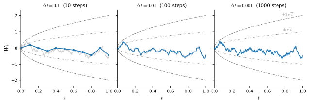
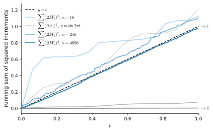
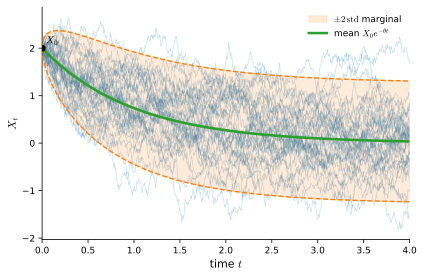
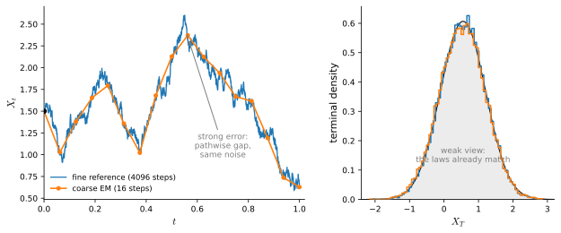
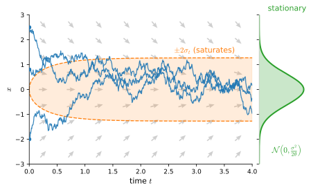

# Stochastic Differential Equations
:label:`sec_mdl-sdes`

Diffusion models are built on a **forward noising SDE** that corrupts clean data
into pure Gaussian noise. To read DDPM :cite:`ho2020denoising` and score-based
models :cite:`song2021score` you need three things this section develops from
scratch: Brownian motion (the canonical source of continuous randomness), the
Itô calculus (why a "$\tfrac12 g^2\partial_{xx}$" correction term appears the
moment noise enters), and the Ornstein--Uhlenbeck process, the simple
mean-reverting SDE that the variance-preserving diffusion forward process
discretizes. The payoff is a precise, simulatable description of the
*information-destroying* half of every diffusion model;
:numref:`sec_mdl-fokker-planck-probability-flow` then shows how to reverse it.

One scaling law powers everything in this section. A Brownian increment over a
time step $\Delta t$ has size $\sqrt{\Delta t}$, not $\Delta t$: noise is
*much larger* than drift on short time scales. Squaring it,
$(\Delta W)^2 \approx \Delta t$ refuses to vanish to second order, so the
second-order Taylor term that ordinary calculus discards survives as a
first-order effect. The Itô correction, the form of Itô's lemma, the
$\sqrt{\Delta t}$ noise kick in the Euler--Maruyama scheme, and the convergence
rates of that scheme are all consequences of this one observation.

We lean on :numref:`sec_mdl-odes-solvers` (vector fields, the forward Euler
method, linear stability), and on :numref:`sec_mdl-random_variables` and
:numref:`sec_mdl-distributions` (Gaussians, expectation, variance,
independence). Gentle and thorough treatments, in that order, are
:citet:`Sarkka.Solin.2019` and :citet:`Oksendal.2003`; the numerical theory is
:citet:`Kloeden.Platen.1992`. The code in this section is plain NumPy:
every experiment is a seeded simulation plus a closed-form check; the `d2l`
module is loaded only for plotting.

```{.python .input #sdes-imports}
#@tab mxnet
%matplotlib inline
from d2l import mxnet as d2l
import numpy as np
```

```{.python .input #sdes-imports}
#@tab pytorch
%matplotlib inline
from d2l import torch as d2l
import numpy as np
```

```{.python .input #sdes-imports}
#@tab tensorflow
%matplotlib inline
from d2l import tensorflow as d2l
import numpy as np
```

```{.python .input #sdes-imports}
#@tab jax
%matplotlib inline
from d2l import jax as d2l
import numpy as np
```

## Brownian Motion

### Why Add Randomness
:label:`sec_mdl-why-randomness`

:numref:`sec_mdl-odes-solvers` gave us a *deterministic* law of motion: a
velocity field $\mathbf{f}$ moves every point along the one trajectory through
it, and the resulting flow map is invertible: run it backward and you
recover exactly where each point started. That is a feature for physics and a
bug for generative modeling. The forward half of a diffusion model must
*destroy* information, and destroy it *controllably*: starting from data
distributed as $p_0 = p_{\textrm{data}}$, it should end at a known,
distribution-independent target,

$$
p_0 = p_{\textrm{data}} \;\longrightarrow\; p_T \approx \mathcal{N}(\mathbf{0}, \sigma^2 I),
$$

so that at generation time we always know what to sample as a starting point,
no matter what the data looked like. Deterministic flows cannot do this job
*universally*. A fixed map sends point masses to point masses, never to a
Gaussian; and the ODE flows of :numref:`sec_mdl-odes-solvers` are bijections,
so distinct data laws stay distinct. (A *learned, data-dependent*
deterministic flow does carry one *given* $p_{\textrm{data}}$ to the
Gaussian; that is exactly what flow matching will build in
:numref:`sec_mdl-flow-matching`, but such a map must be discovered by
training. The forward half of a diffusion model has to work *before* any
learning, for whatever data arrives.) Adding *noise* instead forgets the data
smoothly (the distribution at every intermediate time is a blurred version of
the data, full-dimensional and well behaved), and the process can be run in
reverse *on average* once we know the score of those blurred distributions,
the gradient $\nabla \log p_t$ of the log-density
(:numref:`sec_mdl-fokker-planck-probability-flow`). The object that
accomplishes all this is a stochastic differential equation, an ordinary ODE
with a noise term:

$$
d\mathbf{X} \;=\; \underbrace{\mathbf{f}(\mathbf{X}, t)\,dt}_{\textrm{drift}}
\;+\; \underbrace{g(t)\,d\mathbf{W}}_{\textrm{diffusion}}.
$$
:eqlabel:`eq_mdl-sde-template`

The plan for the rest of the section: define the noise
source $\mathbf{W}$ (Brownian motion, this section's first half), learn the
calculus it forces on us (Itô), then give :eqref:`eq_mdl-sde-template` a
precise meaning, simulate it (Euler--Maruyama), and work the one example that
diffusion models actually use (Ornstein--Uhlenbeck).

### From Random Walks to the Wiener Process
:label:`sec_mdl-wiener-process`

Brownian motion is what a simple random walk becomes when its steps shrink.
Fix a step duration $\Delta t$ and let a walker take independent steps of size
$\pm\sqrt{\Delta t}$, each sign chosen by a fair coin. After $k$ steps,
i.e. at time $t = k\,\Delta t$, the position is a sum of $k$ independent,
mean-zero steps of variance $\Delta t$ apiece, so variances add
(:numref:`sec_mdl-random_variables`) to give

$$
\mathbb{E}\!\left[W^{(\Delta t)}_t\right] = 0,
\qquad
\operatorname{Var}\!\left(W^{(\Delta t)}_t\right) = k\,\Delta t = t,
$$

*independently of the step size*. The exponent in that step size is forced.
Steps of size $c\,\Delta t$ would give variance $c^2 t\,\Delta t \to 0$: the
walk freezes into a flat line. Steps of fixed size $c$ would give variance
$c^2 t / \Delta t \to \infty$: the walk blows up. Only the square-root scaling
$\sqrt{\Delta t}$ produces a nontrivial limit; it returns as
the noise term of every numerical scheme below. As $\Delta t \to 0$ the number
of steps before time $t$ grows without bound, and the central limit theorem
(a sum of many independent, mean-zero contributions with total variance $t$
is approximately $\mathcal{N}(0, t)$) makes the limiting position Gaussian.
The limit process is called **Brownian motion** or the **Wiener process**
:cite:`Wiener.1923`, and its defining properties are the ones the walk hands
us:

1. $W_0 = 0$;
2. **independent increments**: for $s < t$, the increment $W_t - W_s$ is
   independent of the entire path up to time $s$;
3. **Gaussian increments**: $W_t - W_s \sim \mathcal{N}(0,\, t - s)$;
4. continuous sample paths.

The central limit theorem above pins down only the one-time marginals; the
hard content is that a process with properties 1--4 exists at all and is the
limit of the rescaled walks. We take both facts as given: existence is
Wiener's theorem :cite:`Wiener.1923`, and the convergence of the walks is
Donsker's invariance principle.

In particular $\mathbb{E}[W_t] = 0$ and $\operatorname{Var}(W_t) = t$: the
process spreads, with standard deviation $\sqrt{t}$, forever
(:numref:`fig_mdl-dyn-brownian-paths`). For simulation
the increment form is the one to remember:

$$
\Delta W \;=\; W_{t + \Delta t} - W_t \;=\; \sqrt{\Delta t}\;\xi,
\qquad \xi \sim \mathcal{N}(0, 1).
$$
:eqlabel:`eq_mdl-sde-increment`


:label:`fig_mdl-dyn-brownian-paths`

The multivariate version $\mathbf{W}_t$ runs one independent scalar
Brownian motion per coordinate; for the diagonal, state-independent noise
$g(t)\,d\mathbf{W}$ used throughout this chapter, everything below extends
coordinate-wise. Two
consequences of the definition do a lot of work later. The first is the
correlation structure.

**Proposition (covariance of Brownian motion).** *For all $s, t \ge 0$,
$\operatorname{Cov}(W_s, W_t) = \min(s, t)$.*

**Proof.** Take $s \le t$ and split $W_t = W_s + (W_t - W_s)$. Then

$$
\mathbb{E}[W_s W_t]
= \mathbb{E}\!\left[W_s^2\right] + \mathbb{E}\!\left[W_s (W_t - W_s)\right]
= s + \mathbb{E}[W_s]\,\mathbb{E}[W_t - W_s] = s,
$$

where the cross term factorizes because the increment $W_t - W_s$ is
independent of $W_s$, and both factors have mean zero. Since the means vanish,
$\operatorname{Cov}(W_s, W_t) = \mathbb{E}[W_s W_t] = \min(s, t)$.
$\blacksquare$

The second consequence is a paradox that motivates the entire next section:
Brownian paths are continuous but **nowhere differentiable**, a genuine
theorem :cite:`Paley.Wiener.Zygmund.1933`. The heuristic is one line of
:eqref:`eq_mdl-sde-increment`:

$$
\frac{\Delta W}{\Delta t} = \frac{\sqrt{\Delta t}\,\xi}{\Delta t}
= \frac{\xi}{\sqrt{\Delta t}} \;\longrightarrow\; \pm\infty
\quad \textrm{as } \Delta t \to 0.
$$

The difference quotient does not settle down; it diverges. Zooming in on a
smooth curve flattens it into its tangent line
(:numref:`sec_mdl-single_variable_calculus`); zooming in on a Brownian path
reveals more wiggles at every scale, statistically identical to the ones you
zoomed past. So "$dW/dt$" does not exist, and a velocity-field reading of
:eqref:`eq_mdl-sde-template` is unavailable: we will have to make sense of
$dW$ *inside integrals*, which is exactly what the Itô calculus does.

### Simulating Path Ensembles

The increment form :eqref:`eq_mdl-sde-increment` is a simulation recipe:
cumulatively sum $\sqrt{\Delta t}\,\xi$ steps. We generate $20{,}000$ paths on
$[0, 1]$ and check the variance law $\operatorname{Var}(W_t) = t$ at several
times, plotting a few paths against the $\pm 2\sqrt{t}$ envelope that should
contain about $95\%$ of them.

```{.python .input #sdes-brownian-paths}
rng = np.random.default_rng(42)
T, n, n_paths = 1.0, 500, 20000
dt = T / n
t = np.linspace(0, T, n + 1)
dW = np.sqrt(dt) * rng.standard_normal((n_paths, n))
W = np.concatenate([np.zeros((n_paths, 1)), np.cumsum(dW, axis=1)], axis=1)
for s in [0.25, 0.5, 1.0]:
    k = round(s / dt)
    print(f'Var(W_t) at t={s:.2f}: {W[:, k].var():.4f}   (theory: {s:.2f})')
d2l.plot(t, [W[i] for i in range(8)] + [2 * np.sqrt(t), -2 * np.sqrt(t)],
         't', '$W_t$', fmts=['-'] * 8 + ['k--', 'k--'], figsize=(5, 3))
```

The empirical variances $0.2486$, $0.4950$, $1.0014$ track $t$ to within
Monte-Carlo error, and the path fan fills the square-root envelope. The
covariance structure is just as checkable: the ensemble average of
$W_s W_t$ over a grid of time pairs should reproduce $\min(s, t)$ entry by
entry.

```{.python .input #sdes-brownian-covariance}
ts = np.array([0.1, 0.25, 0.5, 0.75, 1.0])
idx = np.round(ts / dt).astype(int)
emp = W[:, idx].T @ W[:, idx] / n_paths      # E[W_s W_t]; the means are zero
print('empirical E[W_s W_t]:')
print(emp.round(3))
print(f'max |empirical - min(s,t)| = {np.abs(emp - np.minimum.outer(ts, ts)).max():.4f}')
```

The printed matrix matches $\min(s, t)$ to within $0.005$ in every entry, and
it is constant along each row past the diagonal: new wiggles after time $s$
are uncorrelated with $W_s$. Future increments are independent of the entire
path so far; only the current position matters.

## Itô Calculus

### Quadratic Variation: Why Ordinary Calculus Fails
:label:`sec_mdl-quadratic-variation`

Here is the single fact from which every extra term in stochastic calculus
springs. Take a partition $0 = t_0 < t_1 < \cdots < t_n = t$ with mesh
$\delta = \max_i \Delta t_i$, and ask what happens to the sum of *squared*
increments of a function along it. For a continuously differentiable path
$x(t)$ the answer is: nothing survives,

$$
\sum_{i} (\Delta x_i)^2
\;\le\; \max_i |\Delta x_i| \sum_i |\Delta x_i|
\;\approx\; \delta \cdot \max|x'| \cdot \textrm{(total variation)}
\;\longrightarrow\; 0,
$$

which is precisely why Taylor expansions in ordinary calculus stop at first
order: $(dx)^2$ is negligible against $dx$. For Brownian motion the same sum
refuses to die: each $(\Delta W_i)^2$ has *mean* $\Delta t_i$, and the means
add up to exactly $t$ no matter how fine the mesh
(:numref:`fig_mdl-dyn-qv-convergence`).

**Proposition (quadratic variation of Brownian motion).** *As the mesh
$\delta \to 0$,*

$$
Q_n \;=\; \sum_{i=0}^{n-1} \left(W_{t_{i+1}} - W_{t_i}\right)^2
\;\longrightarrow\; t
\quad \textrm{in mean square:} \quad
\mathbb{E}\!\left[(Q_n - t)^2\right] \to 0.
$$
:eqlabel:`eq_mdl-sde-qv`

**Proof.** Each increment is $\mathcal{N}(0, \Delta t_i)$, so
$\mathbb{E}[(\Delta W_i)^2] = \Delta t_i$ and
$\mathbb{E}[Q_n] = \sum_i \Delta t_i = t$ exactly, for every partition. For
the spread, a Gaussian has fourth moment $3\,\Delta t_i^2$, so
$\operatorname{Var}\!\left((\Delta W_i)^2\right) = 3\Delta t_i^2 - \Delta t_i^2
= 2\Delta t_i^2$; the increments are independent, so their variances add:

$$
\mathbb{E}\!\left[(Q_n - t)^2\right] = \operatorname{Var}(Q_n)
= \sum_i 2\,\Delta t_i^2
\;\le\; 2\,\delta \sum_i \Delta t_i = 2\,\delta\, t \;\longrightarrow\; 0,
$$

and mean-square convergence follows. $\blacksquare$


:label:`fig_mdl-dyn-qv-convergence`

Squared Brownian increments accumulate *deterministically*: randomness in,
certainty out. The proposition is usually compressed into the **Itô
multiplication table**, the working rules for manipulating differentials:

$$
(dW)^2 = dt, \qquad dW\,dt = 0, \qquad (dt)^2 = 0.
$$
:eqlabel:`eq_mdl-sde-ito-table`

The first rule is :eqref:`eq_mdl-sde-qv` in shorthand; the other two record
that $dW\,dt \sim \Delta t^{3/2}$ and $(dt)^2 = \Delta t^2$ vanish faster than
$\Delta t$ and so contribute nothing in the limit. Watch the first rule
materialize numerically: we accumulate $\sum (\Delta W_i)^2$ along *one fixed
Brownian path*, sampled on finer and finer grids, and contrast it with the
same sum for the smooth path $\sin(2\pi t)$.

```{.python .input #sdes-quadratic-variation}
rng = np.random.default_rng(7)
T, n_fine = 1.0, 2**18
dW = np.sqrt(T / n_fine) * rng.standard_normal(n_fine)
W = np.concatenate([[0.0], np.cumsum(dW)])
print(f'{"n":>8} {"QV of W":>10} {"QV of sin(2 pi t)":>18}')
for k in range(4, 19, 2):
    n = 2**k
    Wn = W[::n_fine // n]                    # the same path on a coarser grid
    sn = np.sin(2 * np.pi * np.linspace(0, T, n + 1))
    print(f'{n:8d} {np.sum(np.diff(Wn)**2):10.4f} {np.sum(np.diff(sn)**2):18.6f}')
```

Read the two columns against the proposition. The Brownian column starts noisy
($0.56$ on $16$ intervals, where the proof predicts a standard deviation of
$\sqrt{2/n} \approx 0.35$ around the mean $1$) and converges to
$t = 1$ as the mesh shrinks ($0.9980$ at $n = 2^{18}$, where
$\sqrt{2/n} \approx 0.003$). The smooth column collapses toward zero like
$1/n$, exactly as the differentiable-path estimate says. One column dies, the
other converges to the elapsed time: that gap *is* stochastic calculus.

### The Itô Integral

To give :eqref:`eq_mdl-sde-template` meaning we must integrate against a
nowhere-differentiable integrator: define $\int_0^t G_s\,dW_s$ for a process
$G$ that is **non-anticipating** ($G_s$ is determined by the path on $[0, s]$
and jointly measurable, never a function of the future) and square-integrable,
$\int_0^t \mathbb{E}[G_s^2]\,ds < \infty$. The **Itô integral** is the
mean-square limit of left-endpoint Riemann sums,

$$
\int_0^t G_s \, dW_s
\;=\; \lim_{\delta \to 0} \sum_{i} G_{t_i}\left(W_{t_{i+1}} - W_{t_i}\right),
$$
:eqlabel:`eq_mdl-sde-ito-integral`

That this limit exists for every such $G$, and that the two identities below
survive the passage to the limit, is the construction of
:citet:`Oksendal.2003`, chapter 3; we take it as given. The choice of the
*left* endpoint is the source of the integral's two key properties. Because
$G_{t_i}$ is determined by the path up
to $t_i$ while the increment $\Delta W_i$ is independent of that past, each
summand factorizes in expectation:
$\mathbb{E}[G_{t_i}\,\Delta W_i] = \mathbb{E}[G_{t_i}]\,\mathbb{E}[\Delta W_i] = 0$.
Two facts follow immediately.

First, the **zero-mean property**: $\mathbb{E}\!\left[\int_0^t G\,dW\right] = 0$.
Betting on a fair coin with a stake you must fix *before* each toss leaves you
with nothing on average, however cleverly the stake depends on the history. (A
stronger fact holds, which we grant: given everything observed up to time $s$,
the expected future value of the integral equals its current value; processes
with this fair-game property are called *martingales* :cite:`Oksendal.2003`.)
Second, its variance is computable:

**Proposition (Itô isometry).** *For non-anticipating $G$ with
$\int_0^t \mathbb{E}[G_s^2]\,ds < \infty$,*

$$
\mathbb{E}\!\left[\left(\int_0^t G_s\,dW_s\right)^{\!2}\,\right]
\;=\; \int_0^t \mathbb{E}\!\left[G_s^2\right] ds.
$$
:eqlabel:`eq_mdl-sde-ito-isometry`

**Proof.** Expand the square of the approximating sum in
:eqref:`eq_mdl-sde-ito-integral`. A cross term with $i < j$ contains the
factor $\Delta W_j$, independent of everything determined by time $t_j$
(including $G_{t_i} \Delta W_i G_{t_j}$), so it factorizes:
$\mathbb{E}\!\left[G_{t_i}\Delta W_i\, G_{t_j} \Delta W_j\right] =
\mathbb{E}\!\left[G_{t_i}\Delta W_i\, G_{t_j}\right]\mathbb{E}[\Delta W_j] = 0$.
A diagonal term factorizes the same way into
$\mathbb{E}\!\left[G_{t_i}^2\right]\mathbb{E}\!\left[(\Delta W_i)^2\right] =
\mathbb{E}\!\left[G_{t_i}^2\right]\Delta t_i$. Summing the surviving diagonal,
$\sum_i \mathbb{E}[G_{t_i}^2]\,\Delta t_i \to \int_0^t \mathbb{E}[G_s^2]\,ds$,
an ordinary Riemann limit; the passage from the sums to their mean-square
limit is exactly the granted construction above. $\blacksquare$

The isometry converts a stochastic computation (the variance of a noise
integral) into an ordinary integral, and it is how we will obtain the
Ornstein--Uhlenbeck variance in closed form below.

Does the endpoint really matter? For a smooth integrator it would not:
left, right, and midpoint Riemann sums share one limit. Here they do not:
evaluating at the right endpoint instead changes the sum by

$$
\sum_i \left(W_{t_{i+1}} - W_{t_i}\right)\Delta W_i = \sum_i (\Delta W_i)^2
\;\longrightarrow\; t,
$$

the quadratic variation again: a *finite, deterministic* disagreement
between two discretizations of "the same" integral. The midpoint choice
defines the *Stratonovich* integral :cite:`Stratonovich.1966`, which obeys
the ordinary chain rule but gives up the zero-mean and fair-game properties;
Itô's left endpoint is the one that matches causal simulation (the integrand
may not peek at the upcoming noise), which is why this book builds on it.

### Itô's Lemma
:label:`sec_mdl-ito-lemma`

The chain rule for this calculus now writes itself. Let $X_t$ solve
$dX = f\,dt + g\,dW$ (made fully precise in
:numref:`sec_mdl-sde-definition`; for now, read it through its increments)
and let $\phi(x, t)$ be twice differentiable. Taylor-expand a small change of
$\phi$ *to second order*, since first order is no longer enough:

$$
d\phi = \phi_t\,dt + \phi_x\,dX + \tfrac12 \phi_{xx}\,(dX)^2 + \cdots.
$$

Substitute $dX = f\,dt + g\,dW$ and multiply out $(dX)^2$ using the table
:eqref:`eq_mdl-sde-ito-table`:

$$
(dX)^2 = f^2 (dt)^2 + 2 f g\, dt\, dW + g^2 (dW)^2 = g^2\,dt.
$$

The drift and cross terms vanish; the noise-squared term survives as a genuine
first-order contribution. Collecting terms gives the central formula of the
subject.

**Proposition (Itô's lemma).** *If $dX = f\,dt + g\,dW$ and $\phi(x, t)$ is
twice continuously differentiable, then $Y_t = \phi(X_t, t)$ satisfies*

$$
d\phi \;=\; \left(\phi_t + f\,\phi_x + \tfrac12 g^2\,\phi_{xx}\right) dt
\;+\; g\,\phi_x \, dW.
$$
:eqlabel:`eq_mdl-sde-ito-lemma`

The Taylor argument above is a heuristic; the full proof controls the
error terms in mean square and can be found in :citet:`Oksendal.2003`,
chapter 4. Everything is the ordinary chain rule except the one new term
$\tfrac12 g^2 \phi_{xx}\,dt$, the **Itô correction**, which exists
because $(dW)^2 = dt$. Curvature of $\phi$ interacts with the jitter of $X$:
a convex $\phi$ gains from symmetric noise (both wiggle directions push the
value up), and the correction quantifies that gain. This single term seeds the
$\tfrac12 g^2 \partial_{xx}$ diffusion term of the Fokker--Planck equation in
:numref:`sec_mdl-fokker-planck-probability-flow`.

The multivariate form we also take as given, on the same authority
:cite:`Oksendal.2003`. For $d\mathbf{X} = \mathbf{f}\,dt + G\,d\mathbf{W}$
with $\mathbf{X} \in \mathbb{R}^d$, a matrix $G$, and standard multivariate
Brownian motion $\mathbf{W}$, the multiplication table reads
$(dW_i)(dW_j) = \delta_{ij}\,dt$, and a twice continuously differentiable
$\phi$ obeys

$$
d\phi(\mathbf{X}) \;=\; \nabla\phi \cdot d\mathbf{X}
\;+\; \tfrac12 \sum_{i,j} \left(G G^\top\right)_{ij}
\partial^2_{x_i x_j}\phi \; dt .
$$
:eqlabel:`eq_mdl-ito-multivariate`

For the diagonal, state-independent noise $G = g(t)\,I$ that every SDE in
this chapter uses, $G G^\top = g(t)^2 I$ and the correction collapses to the
single Laplacian term $\tfrac12 g(t)^2\,\Delta\phi\,dt$, where
$\Delta\phi = \sum_i \partial^2_{x_i x_i}\phi$.

The canonical check is $\phi(x) = x^2$ applied to $X = W$ itself (so $f = 0$,
$g = 1$): the lemma gives $d(W^2) = 2W\,dW + dt$, and the naive chain rule
would have dropped the $dt$. In integrated form,

$$
W_t^2 = \int_0^t 2 W_s \, dW_s + t,
\qquad\textrm{i.e.}\qquad
\int_0^t W_s\,dW_s = \tfrac12\left(W_t^2 - t\right),
$$
:eqlabel:`eq_mdl-sde-wdw`

where the $-t$ is forced by consistency: the left-endpoint integral has mean
zero while $\mathbb{E}[W_t^2] = t$, so the ordinary-calculus answer
$\tfrac12 W_t^2$ *cannot* be right. The correction is large enough to see on a
single simulated path: we accumulate the left-endpoint sum
$\int_0^t 2W\,dW$ and watch its gap to $W_t^2$ grow along the diagonal.

```{.python .input #sdes-ito-correction}
rng = np.random.default_rng(3)
T, n = 1.0, 1000
dt = T / n
t = np.linspace(0, T, n + 1)
dW = np.sqrt(dt) * rng.standard_normal(n)
W = np.concatenate([[0.0], np.cumsum(dW)])
ito = np.concatenate([[0.0], np.cumsum(2 * W[:-1] * dW)])    # left endpoint
print(f'W_T^2 - int 2W dW = {W[-1]**2 - ito[-1]:.4f}   (Ito correction: T = {T})')
print(f'max |gap_t - t| along the path = {np.abs(W**2 - ito - t).max():.4f}')
d2l.plot(t, [W**2, ito, ito + t], 't', 'value',
         legend=['$W_t^2$', 'naive $\\int_0^t 2W\\,dW$', '$\\int_0^t 2W\\,dW + t$'],
         figsize=(5, 3))
```

The final gap is $1.0150$ against the predicted $T = 1$, and along the *whole
path* the gap never strays more than $0.024$ from $t$, because the gap at
time $t$ is exactly the accumulated quadratic variation
$\sum_{t_i \le t} (\Delta W_i)^2$, which :eqref:`eq_mdl-sde-qv` pins to $t$.
The naive curve $\int 2W\,dW$ visibly sags below $W_t^2$; adding back $t$
locks the two together. The Itô correction is a unit-slope drift you can
plot.

## Stochastic Differential Equations and Euler--Maruyama
:label:`sec_mdl-sde-definition`

### Drift, Diffusion, and What a Solution Is

We can now write the object the whole chapter is about. A **stochastic
differential equation** is

$$
dX = f(X, t)\,dt + g(X, t)\,dW,
$$
:eqlabel:`eq_mdl-sde-general`

shorthand (since $dW/dt$ does not exist, the differential form is *defined*
through its integrated meaning) for

$$
X_t = X_0 + \int_0^t f(X_s, s)\,ds + \int_0^t g(X_s, s)\,dW_s,
$$

an ordinary integral plus an Itô integral. The **drift** $f$ steers the
average motion and the **diffusion** $g$ injects Brownian jitter: over a short
step, $\mathbb{E}[dX] = f\,dt$ while $\operatorname{Var}(dX) = g^2\,dt$, so
$f$ is the conditional mean velocity and $g^2$ the rate at which variance is
pumped in. Setting $g \equiv 0$ recovers the deterministic ODE of
:numref:`sec_mdl-odes-solvers` exactly. As with ODEs, Lipschitz continuity of
$f$ and $g$ (in $x$, with at most linear growth) guarantees a unique solution
driven by each Brownian path: the stochastic Picard iteration of
:citet:`Oksendal.2003`, chapter 5, mirrors the deterministic one of
:numref:`sec_mdl-ode-existence-uniqueness`.

Diffusion models use the special case in which the noise amplitude depends on
time but not on state, $dX = f(X, t)\,dt + g(t)\,dW$: **additive noise**,
the template :eqref:`eq_mdl-sde-template`. The distinction between additive
$g(t)$ and the general state-dependent (**multiplicative**) $g(X, t)$ looks
cosmetic but will decide the accuracy of our numerical scheme below. The two
standard noising families are both additive: *variance-exploding* (zero
drift, growing $g$, so the data is buried under ever-larger noise) and
*variance-preserving* (a restoring drift balanced against the noise, the
Ornstein--Uhlenbeck design we build in
:numref:`sec_mdl-ornstein-uhlenbeck` and reuse in
:numref:`sec_mdl-score-matching-diffusion-flow`).

The conceptual leap from ODEs: a *solution is a distribution over paths*, not
a curve. Fix $X_0$ and run :eqref:`eq_mdl-sde-general` many times with fresh
noise; you get a fan of jittery trajectories whose ensemble statistics, the
time marginals $p_t$, are what generative modeling cares about.
:numref:`fig_mdl-dyn-sde-paths` shows this fan for the Ornstein--Uhlenbeck
process: the mean follows the drift, the spread is set by the diffusion, and
the envelope saturates as the initial condition's influence decays.
:numref:`sec_mdl-fokker-planck-probability-flow` turns this picture into an
equation for $p_t$ itself.


:label:`fig_mdl-dyn-sde-paths`

### The Euler--Maruyama Scheme
:label:`sec_mdl-euler-maruyama`

To simulate :eqref:`eq_mdl-sde-general` we discretize it exactly as we
discretized ODEs in :numref:`sec_mdl-euler-runge-kutta` (freeze the
coefficients over each step), plus one new ingredient: a Gaussian noise kick
whose size is dictated by :eqref:`eq_mdl-sde-increment`. The
**Euler--Maruyama** (EM) update :cite:`Maruyama.1955` reads

$$
X_{n+1} = X_n + f(X_n, t_n)\,\Delta t + g(X_n, t_n)\,\sqrt{\Delta t}\;\xi_n,
\qquad \xi_n \sim \mathcal{N}(0, 1) \textrm{ i.i.d.}
$$
:eqlabel:`eq_mdl-sde-em`

The noise scales as $\sqrt{\Delta t}$, never $\Delta t$: the kick *is* a
Brownian increment over the step, and we saw in
:numref:`sec_mdl-wiener-process` that any other exponent makes the noise
vanish or explode in the limit. When $g = 0$ the scheme is forward Euler,
literally. The helper below implements :eqref:`eq_mdl-sde-em` for a whole
batch of paths at once, and the sanity check runs it with $g = 0$ on
$\dot{x} = -x$.

```{.python .input #sdes-euler-maruyama}
def euler_maruyama(f, g, x0, t, dW):
    """Simulate dX = f dt + g dW on the grid t for a batch of paths."""
    X = np.empty((len(x0), len(t)))
    X[:, 0] = x0
    for k in range(len(t) - 1):
        h = t[k + 1] - t[k]
        X[:, k + 1] = X[:, k] + f(X[:, k], t[k]) * h + g(X[:, k], t[k]) * dW[:, k]
    return X

t = np.linspace(0, 2.0, 201)
X = euler_maruyama(lambda x, s: -x, lambda x, s: 0.0,
                   np.ones(1), t, np.zeros((1, 200)))
print('g = 0 recovers Euler on dx/dt = -x: '
      f'max |X_t - e^(-t)| = {np.abs(X[0] - np.exp(-t)).max():.5f}')
```

With the noise switched off we are back to the familiar first-order Euler
error ($1.9 \times 10^{-3}$ at $h = 10^{-2}$). With the noise switched on,
"error" itself needs a definition, and it splits in two.

### Strong and Weak Convergence

Fix one Brownian path and feed the *same* increments to the exact solution
and to the scheme. The **strong error**
$\mathbb{E}\,|X^{\Delta t}_N - X_T|$ measures pathwise tracking: does the
simulated trajectory follow the true trajectory driven by that noise? The
**weak error** $|\mathbb{E}\,\varphi(X^{\Delta t}_N) - \mathbb{E}\,\varphi(X_T)|$,
for smooth test functions $\varphi$, measures distributional accuracy: do the
*marginals* come out right, even if individual paths wander? Weak is the one
diffusion models care about: samples are drawn from marginals, and nobody
asks a generated image to track a particular noise path.
:numref:`fig_mdl-dyn-strong-weak` shows the two notions side by side. The
classical rates :cite:`Kloeden.Platen.1992` are:

![Strong versus weak convergence of Euler--Maruyama on the OU process. Left: one coarse path ($16$ steps, orange) against a fine reference ($4096$ steps, blue) driven by the *same* Brownian increments; the strong error is this pathwise gap, visible to the eye. Right: terminal histograms of $20{,}000$ paths at the two step sizes lie on top of each other and on the analytic marginal (black): the *laws* already agree to $O(\Delta t)$ where individual paths still stray. Diffusion models need only the right-hand agreement.](../img/mdl-dyn-strong-weak.svg)
:label:`fig_mdl-dyn-strong-weak`

**Proposition (strong order of Euler--Maruyama).** *Under global Lipschitz
and linear-growth conditions on $f$ and $g$, Euler--Maruyama has strong order
$\tfrac12$ in general:*
$\mathbb{E}\,|X^{\Delta t}_N - X_T| \le C\,\Delta t^{1/2}$.
*For additive noise, $g=g(t)$, the rate improves to strong order $1$ provided
the coefficients have the additional time regularity and bounded derivatives
required by the stochastic Taylor estimate:*
$\mathbb{E}\,|X^{\Delta t}_N - X_T| \le C\,\Delta t$.

**Proposition (weak order of Euler--Maruyama).** *If $f$, $g$, and the test
function $\varphi$ have sufficiently many derivatives (with the usual growth
bounds), Euler--Maruyama has weak order $1$:*
$|\mathbb{E}\,\varphi(X^{\Delta t}_N) - \mathbb{E}\,\varphi(X_T)| \le C\,\Delta t$,
*additive or not.*

We do not prove these; the intuition for the strong-order gap is the
multiplication table again. EM is the stochastic
Taylor expansion of the solution truncated after the $g\,\Delta W$ term; the
first *omitted* term is Milstein's
$\tfrac12 g\, \partial_x g\,\left((\Delta W)^2 - \Delta t\right)$
:cite:`Milstein.1975`. Per step
this is mean-zero with standard deviation proportional to $\Delta t$, and
summing $1/\Delta t$ independent mean-zero terms grows their total like a
random walk: $\Delta t \cdot \sqrt{1/\Delta t} = \sqrt{\Delta t}$, the
order $\tfrac12$. For additive noise $\partial_x g = 0$ kills the Milstein term
*identically*. Under the extra smoothness just stated, the remaining terms
accumulate to a global $O(\Delta t)$ strong error. With sufficiently smooth
test functions and coefficients, the leading mean-zero terms cancel in
expectation, leaving $O(\Delta t)$ weak bias.

Every SDE treated numerically in this chapter (Ornstein--Uhlenbeck and the two
diffusion-model families) has smooth additive noise, so strong order $1$ is
the relevant prediction for these examples rather than the general
$\tfrac12$ rate. Let us measure both rates in one
experiment: the OU process $dX = -\theta X\,dt + \sigma\,dW$ (additive;
compare against a fine-grid reference driven by the same increments) and
geometric Brownian motion $dX = \mu X\,dt + \sigma X\,dW$
:cite:`Black.Scholes.1973` (multiplicative;
compare against its exact solution
$X_T = X_0 \exp\!\left((\mu - \tfrac{\sigma^2}{2})T + \sigma W_T\right)$,
which you will derive via Itô's lemma in Exercise 5).

```{.python .input #sdes-em-strong-order}
rng = np.random.default_rng(0)
T, X0, n_fine, n_paths = 1.0, 1.5, 2**12, 2000
theta, sigma = 1.0, 1.0                      # OU: additive noise
mu_g, sig_g = 1.0, 1.0                       # GBM: multiplicative noise
dW_f = np.sqrt(T / n_fine) * rng.standard_normal((n_paths, n_fine))
t_f = np.linspace(0, T, n_fine + 1)
x0 = np.full(n_paths, X0)
ou_ref = euler_maruyama(lambda x, s: -theta * x, lambda x, s: sigma,
                        x0, t_f, dW_f)[:, -1]
gbm_exact = X0 * np.exp((mu_g - sig_g**2 / 2) * T + sig_g * dW_f.sum(axis=1))
dts, errs_ou, errs_gbm = [], [], []
for n in [2**k for k in range(3, 9)]:        # 8 to 256 steps
    dW = dW_f.reshape(n_paths, n, n_fine // n).sum(axis=2)
    t = np.linspace(0, T, n + 1)
    ou = euler_maruyama(lambda x, s: -theta * x, lambda x, s: sigma, x0, t, dW)
    gbm = euler_maruyama(lambda x, s: mu_g * x, lambda x, s: sig_g * x, x0, t, dW)
    dts.append(T / n)
    errs_ou.append(np.abs(ou[:, -1] - ou_ref).mean())
    errs_gbm.append(np.abs(gbm[:, -1] - gbm_exact).mean())
print('strong-order slopes:  OU (additive) '
      f'{np.polyfit(np.log(dts), np.log(errs_ou), 1)[0]:.2f},'
      '  GBM (multiplicative) '
      f'{np.polyfit(np.log(dts), np.log(errs_gbm), 1)[0]:.2f}')
d2l.plot(dts, [errs_ou, errs_gbm, np.array(dts), 0.5 * np.sqrt(dts)],
         'step size', 'strong error', xscale='log', yscale='log',
         legend=['OU (additive)', 'GBM (multiplicative)',
                 'slope 1', 'slope 1/2'], figsize=(5, 3))
```

The measured slopes are $1.02$ for the additive-noise OU process and $0.45$
for multiplicative-noise GBM: the two propositions, confirmed side by side
on the same Brownian increments. On the log--log plot the OU error hugs the
slope-$1$ guide while GBM tracks the slope-$\tfrac12$ guide; at
$\Delta t = 2^{-8}$ the additive problem is already two orders of magnitude
more accurate.

For the weak rate, no sampling is needed. EM applied to OU is a
linear Gaussian recursion (if $X_n$ is Gaussian then so is $X_{n+1}$),
so the simulated *marginal* stays exactly Gaussian, with mean and variance
obeying

$$
m_{n+1} = (1 - \theta\,\Delta t)\,m_n,
\qquad
v_{n+1} = (1 - \theta\,\Delta t)^2\, v_n + \sigma^2\,\Delta t .
$$

Both recursions close in elementary form, so the weak error of the entire
marginal reduces to two numbers we can evaluate to machine precision, with
no sampling noise contaminating the measured slope.

```{.python .input #sdes-em-weak-order}
theta, sigma, T, X0 = 1.0, 1.0, 1.0, 1.5
mean_T = X0 * np.exp(-theta * T)
var_T = sigma**2 / (2 * theta) * (1 - np.exp(-2 * theta * T))
dts, errs = [], []
for n in [10, 20, 40, 80, 160, 320]:
    h = T / n
    a = 1 - theta * h                        # one-step mean multiplier
    m = X0 * a**n                            # EM mean after n steps
    v = sigma**2 * h * (1 - a**(2 * n)) / (1 - a**2)   # EM variance
    dts.append(h)
    errs.append([abs(m - mean_T), abs(v - var_T)])
sm, sv = np.polyfit(np.log(dts), np.log(np.array(errs)), 1)[0]
print(f'weak-order slopes on OU:  mean {sm:.2f},  variance {sv:.2f}')
```

Slope $1.01$ for the mean error and $1.01$ for the variance error: weak order
$1$, on the nose. (The exact OU mean and variance used as ground truth here
are derived in the next section.) Halving the step halves the marginal error:
the rate at which a discretized diffusion model's forward marginals
approach the SDE's, a fact :numref:`sec_mdl-ddpm-discretized-sde` leans on
when it reads DDPM's forward chain as exactly this discretization.

## The Ornstein--Uhlenbeck Process
:label:`sec_mdl-ornstein-uhlenbeck`

The one SDE to know by heart :cite:`Uhlenbeck.Ornstein.1930`:

$$
dX = -\theta X \, dt + \sigma\,dW, \qquad \theta > 0.
$$
:eqlabel:`eq_mdl-sde-ou`

The drift is the stable linear ODE of :numref:`sec_mdl-linear-odes-stability`
($\dot{x} = -\theta x$, exponential decay toward the origin) with
Brownian jitter of constant amplitude $\sigma$ added. The two ingredients
fight: **mean reversion** pulls every excursion back toward zero at rate
$\theta$, while the noise endlessly creates new excursions. The
Ornstein--Uhlenbeck (OU) process is the truce they settle on
(:numref:`fig_mdl-dyn-ou-mean-reversion`), and it is the
rare SDE whose law we can write down completely, which is why the
variance-preserving diffusion forward process is built on it.


:label:`fig_mdl-dyn-ou-mean-reversion`

### Solving the SDE with Itô's Lemma

The trick is the same integrating factor that solves the deterministic
equation. Apply Itô's lemma :eqref:`eq_mdl-sde-ito-lemma` to
$\phi(x, t) = e^{\theta t} x$, for which $\phi_t = \theta e^{\theta t} x$,
$\phi_x = e^{\theta t}$, and (the punchline) $\phi_{xx} = 0$, so the Itô
correction *vanishes* (knowing when the correction is zero is as useful as
knowing its value):

$$
d\!\left(e^{\theta t} X_t\right)
= \left(\theta e^{\theta t} X_t - \theta e^{\theta t} X_t\right) dt
+ e^{\theta t}\sigma\,dW_t
= \sigma\, e^{\theta t}\,dW_t.
$$

The drift cancels exactly; what remains integrates immediately to

$$
X_t = X_0\, e^{-\theta t} + \sigma \int_0^t e^{-\theta (t - s)}\, dW_s .
$$
:eqlabel:`eq_mdl-sde-ou-solution`

Read it as a fading memory: the start $X_0$ decays at rate $\theta$, and each
past noise kick $dW_s$ persists with weight $e^{-\theta(t-s)}$; recent
noise counts, ancient noise is forgotten. The remaining integral has a
*deterministic* integrand, so it is a limit of weighted sums of independent
Gaussians, hence Gaussian itself (we grant that mean-square limits of
Gaussian random variables are Gaussian); its mean is zero, and the Itô isometry
:eqref:`eq_mdl-sde-ito-isometry` computes its variance as an ordinary
integral:

$$
\operatorname{Var}(X_t \mid X_0)
= \sigma^2 \int_0^t e^{-2\theta (t - s)}\, ds
= \frac{\sigma^2}{2\theta}\left(1 - e^{-2\theta t}\right).
$$

**Proposition (OU transition kernel).** *For the OU process
:eqref:`eq_mdl-sde-ou`,*

$$
X_t \mid X_0 = x_0 \;\sim\; \mathcal{N}\!\left(
x_0\, e^{-\theta t},\;
\frac{\sigma^2}{2\theta}\left(1 - e^{-2\theta t}\right)
\right).
$$
:eqlabel:`eq_mdl-sde-ou-kernel`

A closed-form Gaussian at *every* time, for *every* start: this is the
Gaussian noising kernel that lets denoising score matching evaluate its
regression target in closed form
(:numref:`sec_mdl-denoising-score-matching`). Let us watch the kernel emerge
from raw Euler--Maruyama simulation: an ensemble launched from the single
point $X_0 = 2$ (matching :numref:`fig_mdl-dyn-sde-paths`), with the analytic
mean and $\pm 2\sigma_t$ band overlaid.

```{.python .input #sdes-ou-cloud}
rng = np.random.default_rng(1)
theta, sigma, X0, T, n, n_paths = 1.0, 0.9, 2.0, 4.0, 800, 10000
t = np.linspace(0, T, n + 1)
dW = np.sqrt(T / n) * rng.standard_normal((n_paths, n))
X = euler_maruyama(lambda x, s: -theta * x, lambda x, s: sigma,
                   np.full(n_paths, X0), t, dW)
mean_th = X0 * np.exp(-theta * t)
std_th = np.sqrt(sigma**2 / (2 * theta) * (1 - np.exp(-2 * theta * t)))
for s in [0.5, 1.0, 2.0, 4.0]:
    k = round(s / (T / n))
    print(f't={s:.1f}:  mean {X[:, k].mean():7.4f} vs {mean_th[k]:7.4f},   '
          f'std {X[:, k].std():.4f} vs {std_th[k]:.4f}')
inside = np.abs(X[:, -1] - mean_th[-1]) < 2 * std_th[-1]
print(f'fraction of paths inside the +-2 sigma band at t={T:.0f}: '
      f'{inside.mean():.3f}   (Gaussian: 0.954)')
d2l.plot(t, [X[i] for i in range(6)]
         + [mean_th, mean_th + 2 * std_th, mean_th - 2 * std_th],
         't', '$X_t$', fmts=['-'] * 6 + ['k-', 'k--', 'k--'], figsize=(5, 3))
```

Simulation and kernel agree to Monte-Carlo precision: at $t = 1$ the ensemble
mean is $0.7336$ against the analytic $0.7358$ and the standard deviation
$0.5912$ against $0.5918$, and $95.2\%$ of paths sit inside the $\pm 2\sigma_t$
band at $t = 4$, matching the Gaussian $95.4\%$. The band's half-width grows
and then *saturates*, which brings us to where the process ends up.

### The Stationary Distribution

Send $t \to \infty$ in the kernel :eqref:`eq_mdl-sde-ou-kernel`: the mean
$x_0 e^{-\theta t}$ dies and the variance climbs to the limit
$\sigma^2\!/(2\theta)$, leaving

$$
X_\infty \sim \mathcal{N}\!\left(0, \, \frac{\sigma^2}{2\theta}\right)
$$

*regardless of $x_0$*: the process forgets its initial condition entirely,
which is exactly the "known, distribution-independent endpoint" that
:numref:`sec_mdl-why-randomness` demanded of a forward noising process. The
limit is **stationary** in the strong sense that it is invariant: if
$X_0 \sim \mathcal{N}(0, \sigma^2\!/2\theta)$ is drawn independently of the
driving noise $W$, then for every later $t$,
combining the decayed start with the accumulated noise gives variance

$$
e^{-2\theta t}\,\frac{\sigma^2}{2\theta}
+ \frac{\sigma^2}{2\theta}\left(1 - e^{-2\theta t}\right)
= \frac{\sigma^2}{2\theta},
$$

while the mean stays zero; and since :eqref:`eq_mdl-sde-ou-solution` writes
$X_t$ as a sum of independent Gaussians, $X_t$ is Gaussian with these
moments, hence equal in law to $X_0$. The law never moves again. The relaxation toward it happens on the time
scale $1/\theta$: after a few multiples, $e^{-\theta t}$ is negligible. At
$t = 4$ (four relaxation times, for our $\theta = 1$) the ensemble from the
previous cell should already be a sample from the stationary Gaussian,
even though every path started from the same point $2$.

```{.python .input #sdes-ou-stationary}
var_inf = sigma**2 / (2 * theta)
samples = X[:, -1]                           # t = 4 is four relaxation times
print(f'ensemble variance at t=4: {samples.var():.4f}   '
      f'(stationary sigma^2/(2 theta) = {var_inf:.4f})')
xs = np.linspace(-2.5, 2.5, 201)
density = np.exp(-xs**2 / (2 * var_inf)) / np.sqrt(2 * np.pi * var_inf)
d2l.set_figsize((5, 3))
d2l.plt.hist(samples, bins=60, density=True, alpha=0.5,
             label='ensemble at $t=4$')
d2l.plt.plot(xs, density, 'k', label='stationary density')
d2l.plt.xlabel('$x$')
d2l.plt.legend()
d2l.plt.show()
```

The histogram lies on the analytic density, with empirical variance $0.4095$
against $\sigma^2\!/(2\theta) = 0.405$. (Decompose the leftover half-percent.
EM's weak-order-$1$ bias is computable exactly here: the variance
recursion of `#sdes-em-weak-order` has fixed point
$\sigma^2 \Delta t / \left(1 - (1 - \theta \Delta t)^2\right) = 0.4060$ at
$\Delta t = 5 \times 10^{-3}$, so discretization explains only $+0.001$ of
the $+0.0045$ gap. The Monte-Carlo standard error of a $10{,}000$-sample
variance is $\approx 0.006$; the rest, indeed most, of the gap is
statistics, sitting on top of a small deterministic bias.) Mean reversion has
converted a point mass into a fixed Gaussian; run longer and nothing more
happens.

### The Variance-Preserving Normalization

One free parameter remains, and diffusion models pin it down: choose

$$
\sigma^2 = 2\theta
\qquad \Longrightarrow \qquad
X_\infty \sim \mathcal{N}(0, 1),
$$

a *unit-variance* endpoint. With this normalization, abbreviate the squared
decay factor as $\bar{\alpha}_t = e^{-2\theta t}$; the solution
:eqref:`eq_mdl-sde-ou-solution` says that in distribution

$$
X_t \;=\; \sqrt{\bar{\alpha}_t}\; X_0 \;+\; \sqrt{1 - \bar{\alpha}_t}\;
\boldsymbol{\epsilon}, \qquad \boldsymbol{\epsilon} \sim \mathcal{N}(0, 1)
\textrm{ independent of } X_0,
$$
:eqlabel:`eq_mdl-sde-vp-marginal`

which is letter for letter the DDPM forward marginal
:cite:`ho2020denoising`, with $\bar{\alpha}_t$ playing its usual role. Now
suppose the data is normalized to zero mean and unit variance (standard
practice, and the next display is why). Taking variances in
:eqref:`eq_mdl-sde-vp-marginal`, with $X_0$ and $\boldsymbol{\epsilon}$
independent:

$$
\operatorname{Var}(X_t)
= \bar{\alpha}_t \operatorname{Var}(X_0) + (1 - \bar{\alpha}_t)
= \bar{\alpha}_t + (1 - \bar{\alpha}_t) = 1
\qquad \textrm{for all } t.
$$

This is what **variance-preserving** (VP) means: given unit-variance data,
the marginal variance equals $1$ *exactly, at every time*. The
$t \to \infty$ statement is strictly weaker, as is the observation that
drift balances diffusion at stationarity (true of any process that has a
stationary distribution). The forward process reallocates the variance (a
fraction $\bar{\alpha}_t$ still carried by the data, the complementary
$1 - \bar{\alpha}_t$ already replaced by noise) without ever changing the
total. Everything *else* about the distribution changes: it morphs from the
data law to the Gaussian. We demonstrate this with data as un-Gaussian
as possible at unit variance, the two-point (Rademacher) distribution
$X_0 = \pm 1$, and track two moments: the variance, which should stay
pinned at $1$, and the fourth moment $\mathbb{E}[X_t^4]$, which
:eqref:`eq_mdl-sde-vp-marginal` predicts to be
$3 - 2\bar{\alpha}_t^2$ (Exercise 8), gliding from the bimodal value $1$
to the Gaussian value $3$.

```{.python .input #sdes-vp-normalization}
rng = np.random.default_rng(2)
theta = 1.0
sigma = np.sqrt(2 * theta)                   # the VP choice: sigma^2 = 2 theta
T, n, n_paths = 3.0, 300, 50000
t = np.linspace(0, T, n + 1)
x0 = rng.choice([-1.0, 1.0], size=n_paths)   # unit-variance, far from Gaussian
dW = np.sqrt(T / n) * rng.standard_normal((n_paths, n))
X = euler_maruyama(lambda x, s: -theta * x, lambda x, s: sigma, x0, t, dW)
print(f'{"t":>5} {"Var(X_t)":>9} {"E[X_t^4]":>9} {"3 - 2 alpha_t^2":>16}')
for s in [0.0, 0.25, 1.0, 3.0]:
    k = round(s / (T / n))
    alpha = np.exp(-2 * theta * s)
    print(f'{s:5.2f} {X[:, k].var():9.4f} {np.mean(X[:, k]**4):9.3f} '
          f'{3 - 2 * alpha**2:16.3f}')
```

The variance column reads $1.000$, $1.003$, $1.007$, $1.014$ (pinned at
$1$ up to EM bias) while the fourth moment marches from $1.000$ through
$2.286$ (analytic $2.264$) to $3.06$ against the Gaussian $3$. The overshoot
is mostly EM's weak bias: the printed variance $1.014$ corresponds to a
Gaussian fourth moment of $3v^2 \approx 3.08$, and the remainder sits inside
one Monte-Carlo standard error ($\approx 0.04$ for a fourth moment on
$50{,}000$ paths). The distribution has become Gaussian; the variance never
moved. Time-dependent noise schedules are a cosmetic
generalization: the **VP-SDE** of score-based diffusion
:cite:`song2021score`,

$$
dX = -\tfrac12 \beta(t)\, X \, dt + \sqrt{\beta(t)}\; dW,
$$
:eqlabel:`eq_mdl-sde-vp-sde`

is an OU process with time-rescaled rate $\theta(t) = \beta(t)/2$ and noise
$\sigma(t)^2 = \beta(t)$, which satisfies $\sigma(t)^2 = 2\,\theta(t)$ *at
every instant*: the unit-variance normalization, maintained along the whole
schedule (with $\bar{\alpha}_t = e^{-\int_0^t \beta(s)\,ds}$ replacing
$e^{-2\theta t}$). This SDE is the bridge to everything that follows: its
marginals solve the Fokker--Planck equation of
:numref:`sec_mdl-fokker-planck-probability-flow`, its time reversal is the
generative sampler of :numref:`sec_mdl-time-reversal`, and its Euler--Maruyama discretization gives the first-order continuous-time
approximation behind DDPM's forward chain
(:numref:`sec_mdl-ddpm-discretized-sde`). The discrete DDPM coefficients are
chosen so that each finite Gaussian transition is exact; they are not simply
an Euler--Maruyama step with identical coefficients.

## Summary

* Randomness makes the standard forward noising process useful in generative
  modeling: under an appropriate long-time schedule it drives a broad class
  of data distributions toward a known Gaussian reference. At finite time the
  endpoint is generally only approximately Gaussian.
* **Brownian motion** is the $\pm\sqrt{\Delta t}$ random walk's limit:
  independent Gaussian increments, $W_t - W_s \sim \mathcal{N}(0, t-s)$,
  $\operatorname{Var}(W_t) = t$, $\operatorname{Cov}(W_s, W_t) = \min(s,t)$.
  Paths are continuous but nowhere differentiable: increments of size
  $\sqrt{\Delta t}$ make $\Delta W / \Delta t$ diverge.
* **Quadratic variation**: $\sum (\Delta W_i)^2 \to t$ in mean square;
  squared noise accumulates deterministically. In differential shorthand,
  $(dW)^2 = dt$, $dW\,dt = 0$, $(dt)^2 = 0$.
* The **Itô integral** evaluates integrands at the *left* endpoint
  (no peeking at the future), which buys zero mean and the **isometry**
  $\mathbb{E}[(\int G\,dW)^2] = \int \mathbb{E}[G^2]\,ds$. **Itô's lemma** is
  the chain rule plus the correction $\tfrac12 g^2 \phi_{xx}\,dt$ forced by
  $(dW)^2 = dt$; on $\phi = W^2$ the correction is the visible $+t$ in
  $W_t^2 = \int 2W\,dW + t$.
* An **SDE** $dX = f\,dt + g\,dW$ is drift (mean velocity) plus diffusion
  (variance injection); $g = 0$ recovers the ODE, and a solution is a
  *distribution over paths*. **Euler--Maruyama** is forward Euler plus a
  $\sqrt{\Delta t}$ Gaussian kick: under standard regularity assumptions it
  has strong order $\tfrac12$ for general multiplicative noise, strong order
  $1$ for sufficiently smooth additive-noise problems, and weak order $1$ for
  sufficiently smooth coefficients and test functions. Weak (marginal)
  accuracy is what diffusion models usually need.
* The **Ornstein--Uhlenbeck process** $dX = -\theta X\,dt + \sigma\,dW$
  solves in closed form: Gaussian transition kernel
  $\mathcal{N}\!\left(x_0 e^{-\theta t}, \tfrac{\sigma^2}{2\theta}(1 - e^{-2\theta t})\right)$,
  stationary law $\mathcal{N}(0, \sigma^2\!/2\theta)$ reached from any start.
* With $\sigma^2 = 2\theta$ and unit-variance data, the marginal is
  $X_t = \sqrt{\bar{\alpha}_t} X_0 + \sqrt{1 - \bar{\alpha}_t}\,\epsilon$ and
  $\operatorname{Var}(X_t) = \bar{\alpha}_t + (1 - \bar{\alpha}_t) = 1$ for
  *all* $t$: the exact meaning of *variance-preserving*, and the DDPM
  forward marginal in continuous time.

## Exercises

1. **The square-root scaling is forced.** For the random walk with step
   duration $\Delta t$ and step size $c\,(\Delta t)^{\gamma}$, compute
   $\operatorname{Var}(W^{(\Delta t)}_t)$ for fixed $t$ and show that the
   limit as $\Delta t \to 0$ is $0$ for $\gamma > \tfrac12$, $\infty$ for
   $\gamma < \tfrac12$, and $c^2 t$ for $\gamma = \tfrac12$. Conclude that
   Brownian motion is the *only* nontrivial scaling limit in this family.
2. **No velocity.** Using $W_{t+\Delta t} - W_t \sim \sqrt{\Delta t}\,\xi$,
   show that $\mathbb{P}\left(\left|\Delta W / \Delta t\right| > M\right) \to 1$
   as $\Delta t \to 0$ for every fixed $M$. Why does this rule out defining an
   SDE pathwise as $\dot{X} = f + g\,\dot{W}$, and how does the integral
   formulation sidestep the problem?
3. **Quadratic variation, by hand and by machine.** Re-derive
   $\mathbb{E}[Q_n] = t$ and $\operatorname{Var}(Q_n) \le 2\delta t$ without
   looking. Then explain why the same computation gives $Q_n \to 0$ for any
   continuously differentiable path, and verify both claims numerically by
   adapting the `#sdes-quadratic-variation` cell to the path
   $x(t) = W_1 \cdot t$ (random slope, but smooth in $t$).
4. **Itô's lemma practice.** Apply :eqref:`eq_mdl-sde-ito-lemma` to
   $\phi(x) = x^2$ for general $dX = f\,dt + g\,dW$ and identify the term
   ordinary calculus misses. Use the result with $f = 0$, $g = 1$ to confirm
   $\int_0^t W\,dW = \tfrac12 (W_t^2 - t)$ and check that this integral has
   zero mean, as :numref:`sec_mdl-ito-lemma` promised.
5. **Geometric Brownian motion and the $-\sigma^2/2$ correction.** For
   $dX = \mu X\,dt + \sigma X\,dW$ with $X_0 > 0$, apply Itô's lemma to
   $\phi(x) = \log x$ to show
   $d(\log X) = \left(\mu - \tfrac{\sigma^2}{2}\right)dt + \sigma\,dW$, and
   solve: $X_t = X_0 \exp\left((\mu - \tfrac{\sigma^2}{2})t + \sigma W_t\right)$
   (the exact solution the `#sdes-em-strong-order` cell tested against).
   Where does the $-\sigma^2/2$ come from in the Taylor expansion? Show
   nevertheless that $\mathbb{E}[X_t] = X_0 e^{\mu t}$, and explain how the
   typical path can grow more slowly than the mean.
6. **Euler--Maruyama and its orders.** (a) Show that the EM update
   :eqref:`eq_mdl-sde-em` reduces to forward Euler when $g \to 0$, and explain
   what would go wrong if the noise were scaled by $\Delta t$ instead of
   $\sqrt{\Delta t}$. (b) State why the strong order on the OU process is $1$
   rather than the general $\tfrac12$, by identifying the Milstein term and
   evaluating it for additive noise. (c) Predict the strong-order slope for
   the VP-SDE :eqref:`eq_mdl-sde-vp-sde` with $\beta(t) = 1 + t$, then verify
   your prediction by adapting the `#sdes-em-strong-order` cell. (d) Why is
   weak order the relevant one for a diffusion model's forward process?
7. **The OU process, end to end.** Re-derive the solution
   :eqref:`eq_mdl-sde-ou-solution` and the kernel
   :eqref:`eq_mdl-sde-ou-kernel` from Itô's lemma and the isometry without
   looking. Then show that in the stationary regime
   $\operatorname{Cov}(X_s, X_t) = \tfrac{\sigma^2}{2\theta} e^{-\theta |t-s|}$
   (correlations decay exponentially with time lag), and check it
   numerically with the `#sdes-ou-cloud` ensemble.
8. **Variance preservation, exactly.** From
   :eqref:`eq_mdl-sde-vp-marginal`, show
   $\operatorname{Var}(X_t) = \bar{\alpha}_t \operatorname{Var}(X_0) + (1 - \bar{\alpha}_t)$
   for zero-mean data, so the marginal variance is identically $1$ if and only
   if $\operatorname{Var}(X_0) = 1$. For Rademacher data $X_0 = \pm 1$, derive
   $\mathbb{E}[X_t^4] = 3 - 2\bar{\alpha}_t^2$ (as printed by
   `#sdes-vp-normalization`). What happens to $\operatorname{Var}(X_t)$ over
   time if the data has variance $4$ instead, and why is that harmless for
   a *sampler* but annoying for a *noise schedule*?

:begin_tab:`pytorch`
[Discussions](https://d2l.discourse.group/)
:end_tab:

<!-- slides -->

::: {.slide}
::: {.cover}
[Dive into Deep Learning · §27.2]{.kicker}

Brownian motion, Itô's calculus, and the SDE<br>**the forward process of every diffusion model**.
:::
:::

::: {.slide title="Why add noise?"}
[Motivation]{.kicker}

::: {.cols .vc}
::: {.col}
No *fixed* map can forget every dataset: a data-independent bijection sends
distinct laws to distinct endpoints, so no single deterministic flow carries
**every** $p_{\text{data}}$ to the same $\mathcal N(\mathbf 0, \sigma^2 I)$.
Noise does it before any learning:

$$d\mathbf X = \underbrace{\mathbf f(\mathbf X,t)\,dt}_{\text{drift}}
+ \underbrace{g(t)\,d\mathbf W}_{\text{diffusion}}.$$

(A *learned* flow sends one **given** $p_{\text{data}}$ there: that is
exactly flow matching, the score-matching-diffusion-and-flow-matching section.)
:::

::: {.col .fig}
@fig:mdl-dyn-sde-paths
:::
:::
:::

::: {.slide}
::: {.divider}
[01]{.dnum}

[Brownian motion]{.dtitle}

[axioms, covariance, simulation]{.dsub}
:::
:::

::: {.slide title="The Wiener process"}
[Brownian motion]{.kicker}

The $\pm\sqrt{\Delta t}$ random walk has a non-degenerate limit $W_t$:
$W_0=0$, independent increments, $W_t-W_s\sim\mathcal N(0,t-s)$, continuous
paths. Simulate with $\Delta W = \sqrt{\Delta t}\,\xi$, $\xi\sim\mathcal N(0,1)$.

{width=80%}
:::

::: {.slide title="Covariance and non-differentiability"}
[Brownian motion]{.kicker}

$$\operatorname{Cov}(W_s,W_t) = \min(s,t).$$

*Proof.* Split $W_t = W_s + (W_t-W_s)$; the cross term factorizes by
independence and both factors are mean-zero. $\blacksquare$

. . .

But $\Delta W/\Delta t = \xi/\sqrt{\Delta t}\to\pm\infty$: paths are
**nowhere differentiable**. We must integrate, never differentiate.

@sdes-brownian-paths
:::

::: {.slide}
::: {.divider}
[02]{.dnum}

[Itô calculus]{.dtitle}

[quadratic variation, the integral, the chain rule]{.dsub}
:::
:::

::: {.slide title="Quadratic variation"}
[Why ordinary calculus fails]{.kicker}

For a smooth path $\sum(\Delta x_i)^2\to 0$. For Brownian motion it converges
to the elapsed time:

$$\sum_i (\Delta W_i)^2 \longrightarrow t.$$

{width=78%}
:::

::: {.slide title="The Itô multiplication table"}
[Why ordinary calculus fails]{.kicker}

*Proof.* $\mathbb E[\sum(\Delta W_i)^2]=\sum\Delta t_i=t$ exactly, and the
variance is $\sum 2\Delta t_i^2 \le 2\delta t\to 0$. $\blacksquare$

::: {.d2l-note .rule}
$$(dW)^2 = dt, \qquad dW\,dt = 0, \qquad (dt)^2 = 0.$$
A squared increment is no longer negligible: it is $dt$.
:::
:::

::: {.slide title="The Itô integral locks the left endpoint"}
[The integral]{.kicker}

Evaluate the integrand *before* the increment,
$\int_0^t G_s\,dW_s = \lim\sum G_{t_i}(W_{t_{i+1}}-W_{t_i})$. Then
$G_{t_i}\perp\Delta W_i$, so

$$\mathbb E\Bigl[\textstyle\int_0^t G\,dW\Bigr] = 0, \qquad
\mathbb E\Bigl[\bigl(\textstyle\int_0^t G\,dW\bigr)^2\Bigr]
= \int_0^t \mathbb E[G_s^2]\,ds.$$

The **Itô isometry** turns a stochastic variance into an ordinary integral.
:::

::: {.slide title="Itô's lemma: a chain rule with a correction"}
[The chain rule]{.kicker}

Expand $\phi(X)$ to second order; since $(dX)^2=g^2\,dt$ survives,

$$d\phi = \bigl(\phi_t + f\,\phi_x + \tfrac12 g^2\,\phi_{xx}\bigr)dt + g\,\phi_x\,dW.$$

. . .

The $\tfrac12 g^2\phi_{xx}$ term is the seed of the Fokker–Planck diffusion.
Check $\phi=x^2$, $X=W$: $d(W^2)=2W\,dW+dt$, so $\int_0^t W\,dW=\tfrac12(W_t^2-t)$:

@sdes-ito-correction
:::

::: {.slide}
::: {.divider}
[03]{.dnum}

[SDEs and Euler–Maruyama]{.dtitle}

[the precise meaning, simulation, convergence]{.dsub}
:::
:::

::: {.slide title="An SDE is a distribution over paths"}
[The objects]{.kicker}

$dX = f\,dt + g\,dW$ means
$X_t = X_0 + \int_0^t f\,ds + \int_0^t g\,dW_s$. Here $f$ is the mean velocity
($\mathbb E[dX]=f\,dt$) and $g^2$ the variance rate
($\operatorname{Var}(dX)=g^2\,dt$); a solution is an **ensemble** of jittery
paths, and $g=0$ recovers the ODE.

{width=70%}
:::

::: {.slide title="Euler–Maruyama: Euler plus a √Δt kick"}
[Simulation]{.kicker}

$$X_{n+1} = X_n + f(X_n,t_n)\,\Delta t + g(X_n,t_n)\sqrt{\Delta t}\,\xi_n.$$

The noise scales as $\sqrt{\Delta t}$, not $\Delta t$; $g=0$ is exactly forward
Euler:

@sdes-euler-maruyama
:::

::: {.slide title="Paths stray; laws agree"}
[Convergence]{.kicker}

**Strong** error tracks one path against a fine reference driven by the *same*
increments; **weak** error compares only the terminal *laws*. The coarse path
visibly strays while the histograms already coincide, and marginals are all a
diffusion model needs:

{width=94%}
:::

::: {.slide title="The measured orders"}
[Convergence]{.kicker}

Strong order is $\tfrac12$ in general but $1$ for **additive** noise: the
omitted Milstein term carries $\partial_x g$, which vanishes. Weak order is
$1$ regardless:

@!sdes-em-strong-order

Measured slopes: additive OU $\approx 1$, multiplicative GBM $\approx 0.5$.
:::

::: {.slide}
::: {.divider}
[04]{.dnum}

[The Ornstein–Uhlenbeck process]{.dtitle}

[mean reversion, exact solution, the VP marginal]{.dsub}
:::
:::

::: {.slide title="Mean reversion vs noise"}
[OU]{.kicker}

$$dX = -\theta X\,dt + \sigma\,dW, \qquad \theta > 0.$$

A restoring drift pulls toward $0$ while constant diffusion pushes out:

{width=72%}
:::

::: {.slide title="Solved by an integrating factor"}
[OU]{.kicker}

Apply Itô to $e^{\theta t}X$: the correction vanishes ($\phi_{xx}=0$) and the
drift cancels:

$$X_t = X_0 e^{-\theta t} + \sigma\!\int_0^t e^{-\theta(t-s)}\,dW_s.$$

. . .

The isometry gives the variance, so the transition kernel is

$$X_t\mid X_0 \sim \mathcal N\!\Bigl(X_0 e^{-\theta t},\;
\tfrac{\sigma^2}{2\theta}\bigl(1-e^{-2\theta t}\bigr)\Bigr).$$
:::

::: {.slide title="The stationary distribution"}
[OU]{.kicker}

As $t\to\infty$ the mean dies and the variance saturates, independent of the
start:

$$X_\infty \sim \mathcal N\!\bigl(0,\ \sigma^2/(2\theta)\bigr),$$

with relaxation time $1/\theta$. The path cloud and its endpoint histogram
confirm it:

@!sdes-ou-cloud
:::

::: {.slide title="Variance-preserving = DDPM's forward marginal"}
[VP]{.kicker}

Choose $\sigma^2 = 2\theta$ and write $\bar\alpha_t = e^{-2\theta t}$:

$$X_t = \sqrt{\bar\alpha_t}\,X_0 + \sqrt{1-\bar\alpha_t}\,\epsilon,
\qquad \operatorname{Var}(X_t) = 1\ \ \forall t.$$

@sdes-vp-normalization

::: {.d2l-note .rule}
This is exactly DDPM's forward marginal in continuous time; the VP-SDE is
$dX=-\tfrac12\beta(t)X\,dt+\sqrt{\beta(t)}\,dW$.
:::
:::

::: {.slide title="Recap"}
[Wrap-up]{.kicker}

::: {.cols}
::: {.col}
- Brownian motion: $\mathcal N(0,t)$ increments, $\operatorname{Cov}=\min(s,t)$, nowhere differentiable.
- Quadratic variation $(dW)^2=dt$ forces a new calculus.
- Itô integral: zero mean, isometry; Itô's lemma adds $\tfrac12 g^2\phi_{xx}$.
:::

::: {.col}
- An SDE is a law over paths; Euler–Maruyama adds a $\sqrt{\Delta t}$ kick; weak order $1$.
- OU mean-reverts to $\mathcal N(0,\sigma^2/2\theta)$.
- VP normalization ($\sigma^2=2\theta$) is DDPM's forward marginal.
:::
:::

::: {.d2l-note}
Next: track the whole **density**, the Fokker–Planck equation.
:::
:::
