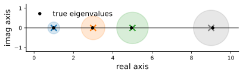

# Eigendecompositions
:label:`sec_mdl-eigendecompositions`

In :numref:`sec_mdl-geometry-linear-algebraic-ops` we saw a matrix as a
*geometric distortion* of space: it skews, rotates, and rescales the grid, and
the determinant records the net volume factor. Eigenvalues are the next idea in
that story. For a well-behaved square matrix there is a special set of
directions---the *eigenvectors*---along which the distortion is nothing but a
pure stretch, and an *eigenbasis* in which the whole map decouples into
independent one-dimensional stretches. This single observation is what makes
matrix powers, stability of dynamical systems, PCA, covariance analysis, and the
Hessian-based view of optimization tractable. As a beginner it is easy to
overlook eigenvalues; the goal of this section is to convey, with both pictures
and proofs, just why they are so central. We keep the running thread of
*iterated maps*---repeatedly applying the same matrix, as a layerless neural
network does---because it makes the role of the largest eigenvalue unmistakable.

We first load the per-framework library so the computations below have `d2l` and
`np` in scope. The framework-agnostic checks use plain NumPy; only the small
worked-verification cells branch per framework.

```{.python .input #eigendecomposition-imports}
#@tab mxnet
%matplotlib inline
from d2l import mxnet as d2l
from IPython import display
import numpy as np
```

```{.python .input #eigendecomposition-imports}
#@tab pytorch
%matplotlib inline
from d2l import torch as d2l
from IPython import display
import numpy as np
import torch
```

```{.python .input #eigendecomposition-imports}
#@tab tensorflow
%matplotlib inline
from d2l import tensorflow as d2l
from IPython import display
import numpy as np
import tensorflow as tf
```

```{.python .input #eigendecomposition-imports}
#@tab jax
%matplotlib inline
from d2l import jax as d2l
from IPython import display
import numpy as np
import jax
from jax import numpy as jnp
```

## Eigenvalues and Eigenvectors

### Definition and Geometry

Suppose that we have a matrix $\mathbf{A}$ with the following entries:

$$
\mathbf{A} = \begin{bmatrix}
2 & 0 \\
0 & -1
\end{bmatrix}.
$$

If we apply $\mathbf{A}$ to any vector $\mathbf{v} = [x, y]^\top$,
we obtain a vector $\mathbf{A}\mathbf{v} = [2x, -y]^\top$.
This has an intuitive interpretation:
stretch the vector to be twice as wide in the $x$-direction,
and then flip it in the $y$-direction.

However, there are *some* vectors for which the direction remains unchanged.
Namely $[1, 0]^\top$ gets sent to $[2, 0]^\top$
and $[0, 1]^\top$ gets sent to $[0, -1]^\top$.
These vectors are still on the same line through the origin;
the only modification is that $\mathbf{A}$ scales $[1,0]^\top$ by $2$
and $[0,1]^\top$ by $-1$.
We call such vectors *eigenvectors*
and the factor they are stretched by their *eigenvalues*.

In general, if we can find a number $\lambda$
and a *nonzero* vector $\mathbf{v}$ such that

$$
\mathbf{A}\mathbf{v} = \lambda \mathbf{v},
$$
:eqlabel:`eq_mdl-eigpair`

we say that $\mathbf{v}$ is an *eigenvector* of $\mathbf{A}$ and $\lambda$ its
*eigenvalue*. (We insist $\mathbf{v}\neq\mathbf 0$: the zero vector trivially
satisfies :eqref:`eq_mdl-eigpair` for every $\lambda$ and carries no information.
The scalar $\lambda$ *is* allowed to be zero, and we will see that $\lambda=0$
signals a non-invertible matrix.) For a fixed eigenvalue $\lambda$, the set of
all vectors satisfying $\mathbf{A}\mathbf{v}=\lambda\mathbf{v}$, together with
$\mathbf 0$, forms a subspace---the *eigenspace* of $\lambda$.

The cleanest way to picture eigenvectors is to ask what a matrix does to the
*unit circle*, the set of all unit vectors. A general matrix maps it to an
ellipse, and for a *symmetric* matrix the axes of that ellipse lie exactly along
the eigenvectors, with half-lengths $|\lambda_i|$ (an axis flips when
$\lambda_i<0$). :numref:`fig_mdl-la-eig-ellipse` draws this for our
$\operatorname{diag}(2,-1)$ above and for the symmetric
$[[2,1],[1,2]]$ we analyze below. This is the same "circle becomes an ellipse"
picture that the singular value decomposition will generalize to *every* matrix
in :numref:`sec_mdl-svd-low-rank`; here the special feature is that one set of
axes does the whole job.


:label:`fig_mdl-la-eig-ellipse`

The green arrows are the unit eigenvectors; the red arrows are their images
$\mathbf{A}\mathbf{v}_i=\lambda_i\mathbf{v}_i$, which fall exactly on the
ellipse's axes. For $\operatorname{diag}(2,-1)$ the axes are the coordinate
directions; for the symmetric $[[2,1],[1,2]]$ they are the diagonal directions
$[1,1]^\top/\sqrt2$ (scaled by $3$) and $[1,-1]^\top/\sqrt2$ (scaled by $1$).

### Finding Eigenvalues
:label:`subsec_mdl-finding-eigenvalues`
Let's figure out how to find them. By subtracting off the $\lambda \mathbf{v}$ from both sides,
and then factoring out the vector,
we see the above is equivalent to:

$$(\mathbf{A} - \lambda \mathbf{I})\mathbf{v} = 0.$$
:eqlabel:`eq_mdl-eigvalue_der`

For :eqref:`eq_mdl-eigvalue_der` to happen, we see that $(\mathbf{A} - \lambda \mathbf{I})$
must compress some direction down to zero,
hence it is not invertible, and thus the determinant is zero.
Thus, we can find the *eigenvalues*
by finding for what $\lambda$ is $\det(\mathbf{A}-\lambda \mathbf{I}) = 0$.
Once we find the eigenvalues, we can solve
$\mathbf{A}\mathbf{v} = \lambda \mathbf{v}$
to find the associated *eigenvector(s)*.

Let's see this with a more challenging matrix

$$
\mathbf{A} = \begin{bmatrix}
2 & 1\\
2 & 3
\end{bmatrix}.
$$

If we consider $\det(\mathbf{A}-\lambda \mathbf{I}) = 0$,
we see this is equivalent to the polynomial equation
$0 = (2-\lambda)(3-\lambda)-2 = (4-\lambda)(1-\lambda)$.
Thus the two eigenvalues are $\lambda = 1$ and $\lambda = 4$.
To find the associated eigenvectors, we solve
$(\mathbf{A}-\mathbf{I})\mathbf{v}=\mathbf 0$ for $\lambda = 1$ and
$(\mathbf{A}-4\mathbf{I})\mathbf{v}=\mathbf 0$ for $\lambda = 4$, i.e.

$$
\begin{bmatrix}
2 & 1\\
2 & 3
\end{bmatrix}\begin{bmatrix}x \\ y\end{bmatrix} = \begin{bmatrix}x \\ y\end{bmatrix}  \; \textrm{and} \;
\begin{bmatrix}
2 & 1\\
2 & 3
\end{bmatrix}\begin{bmatrix}x \\ y\end{bmatrix}  = \begin{bmatrix}4x \\ 4y\end{bmatrix} .
$$

These are solved (up to scale) by $[1, -1]^\top$ for $\lambda = 1$
and $[1, 2]^\top$ for $\lambda = 4$, respectively.
(Each eigenvector is determined only up to a nonzero scalar multiple: if
$\mathbf v$ is an eigenvector, so is $c\mathbf v$ for any $c\neq0$, since both
sides of :eqref:`eq_mdl-eigpair` scale by $c$.)

We can check this in code using the built-in `eig` routine.

```{.python .input #eigendecomposition-an-example}
#@tab mxnet
np.linalg.eig(np.array([[2, 1], [2, 3]]))
```

```{.python .input #eigendecomposition-an-example}
#@tab pytorch
torch.linalg.eig(torch.tensor([[2, 1], [2, 3]], dtype=torch.float64))
```

```{.python .input #eigendecomposition-an-example}
#@tab tensorflow
tf.linalg.eig(tf.constant([[2, 1], [2, 3]], dtype=tf.float64))
```

```{.python .input #eigendecomposition-an-example}
#@tab jax
jnp.linalg.eig(jnp.array([[2, 1], [2, 3]], dtype=jnp.float64))
```

Note that the library normalizes the eigenvectors to be of length one,
whereas we took ours to be of arbitrary length.
Additionally, the choice of sign is arbitrary.
However, the vectors computed are parallel
to the ones we found by hand with the same eigenvalues.

### Eigendecomposition and What It Computes

Let's continue the previous example one step further.  Let

$$
\mathbf{W} = \begin{bmatrix}
1 & 1 \\
-1 & 2
\end{bmatrix},
$$

be the matrix where the columns are the eigenvectors of the matrix $\mathbf{A}$. Let

$$
\boldsymbol{\Lambda} = \begin{bmatrix}
1 & 0 \\
0 & 4
\end{bmatrix},
$$

be the matrix with the associated eigenvalues on the diagonal.
Then the definition of eigenvalues and eigenvectors tells us that

$$
\mathbf{A}\mathbf{W} =\mathbf{W} \boldsymbol{\Lambda} .
$$

The matrix $W$ is invertible, so we may multiply both sides by $W^{-1}$ on the right,
we see that we may write

$$\mathbf{A} = \mathbf{W} \boldsymbol{\Lambda} \mathbf{W}^{-1}.$$
:eqlabel:`eq_mdl-eig_decomp`

Below we will see some nice consequences of this,
but for now we need only know that such a decomposition
will exist as long as we can find a full collection
of linearly independent eigenvectors (so that $\mathbf{W}$ is invertible).
A matrix that admits such a decomposition is called *diagonalizable*.

One nice thing about eigendecompositions :eqref:`eq_mdl-eig_decomp` is that
we can write many operations we usually encounter cleanly
in terms of the eigendecomposition. As a first example, consider:

$$
\mathbf{A}^n = \overbrace{\mathbf{A}\cdots \mathbf{A}}^{\textrm{$n$ times}} = \overbrace{(\mathbf{W}\boldsymbol{\Lambda} \mathbf{W}^{-1})\cdots(\mathbf{W}\boldsymbol{\Lambda} \mathbf{W}^{-1})}^{\textrm{$n$ times}} =  \mathbf{W}\overbrace{\boldsymbol{\Lambda}\cdots\boldsymbol{\Lambda}}^{\textrm{$n$ times}}\mathbf{W}^{-1} = \mathbf{W}\boldsymbol{\Lambda}^n \mathbf{W}^{-1}.
$$

This tells us that for any positive power of a matrix,
the eigendecomposition is obtained by just raising the eigenvalues to the same power.
The same can be shown for negative powers,
so if we want to invert a matrix we need only consider

$$
\mathbf{A}^{-1} = \mathbf{W}\boldsymbol{\Lambda}^{-1} \mathbf{W}^{-1},
$$

or in other words, just invert each eigenvalue.
This will work as long as each eigenvalue is non-zero,
so we see that invertible is the same as having no zero eigenvalues.

**Determinant and trace from the eigenvalues.** Two quantities we met in
:numref:`sec_mdl-geometry-linear-algebraic-ops` read off the spectrum directly,
and the cleanest derivation is purely algebraic. Because the eigenvalues are the
roots of the characteristic polynomial, it factors as

$$
p(\lambda) = \det(\mathbf{A}-\lambda\mathbf{I})
           = \prod_{i=1}^{n}(\lambda_i - \lambda).
$$

Setting $\lambda=0$ gives $\det(\mathbf{A}) = p(0) = \prod_i \lambda_i$:

$$
\det(\mathbf{A}) = \lambda_1 \lambda_2 \cdots \lambda_n,
$$
:eqlabel:`eq_mdl-det-eig`

the product of all the eigenvalues. This matches the geometric picture: whatever
stretching $\mathbf{W}$ does, $\mathbf{W}^{-1}$ undoes, so the only net volume
change is by the diagonal $\boldsymbol{\Lambda}$, which scales volumes by the
product of its entries. Comparing instead the coefficient of $\lambda^{n-1}$ on
both sides---it is $\sum_i\lambda_i$ on the right, and (expanding the
determinant) $\sum_i a_{ii}=\operatorname{tr}\mathbf A$ on the left---gives the
companion identity for the *trace*,

$$
\operatorname{tr}(\mathbf{A}) = a_{11}+\cdots+a_{nn} = \lambda_1+\cdots+\lambda_n,
$$
:eqlabel:`eq_mdl-tr-eig`

the *sum* of the eigenvalues. So determinant and trace are the product and sum
of the spectrum; both are *similarity invariants* (unchanged by
$\mathbf{A}\mapsto\mathbf{W}\mathbf{A}\mathbf{W}^{-1}$). The trace identity
returns when we estimate $\log\det$ Jacobians with the Hutchinson trace
estimator.

Finally, recall that the rank was the maximum number
of linearly independent columns of a matrix.
For a *diagonalizable* matrix, examining the eigendecomposition shows that the
rank equals the number of non-zero eigenvalues of $\mathbf{A}$ (for a general
matrix, the right invariant is the number of non-zero *singular values*;
:numref:`sec_mdl-svd-low-rank`). The examples could continue, but hopefully the
point is clear: eigendecomposition can simplify many linear-algebraic
computations and is a fundamental operation underlying many numerical algorithms
and much of the analysis that we do in linear algebra.

#### When Does an Eigenbasis Exist? Multiplicity and Diagonalizability
:label:`subsec_mdl-multiplicity`

Whether we can build an invertible $\mathbf{W}$ comes down to *counting*
eigenvectors, and the precise bookkeeping uses two notions of multiplicity. The
eigenvalues are the roots of the characteristic polynomial
$p(\lambda)=\det(\mathbf{A}-\lambda\mathbf{I})$. The number of times $\lambda$
appears as a root is its *algebraic multiplicity*. The dimension of its
eigenspace---the number of independent eigenvectors it contributes---is its
*geometric multiplicity*. These always satisfy

$$
1 \le \textrm{geometric mult.}(\lambda) \le \textrm{algebraic mult.}(\lambda),
$$

and they need not be equal. The matrix is diagonalizable precisely when its
eigenvectors span $\mathbb{R}^n$, which happens **if and only if geometric
multiplicity equals algebraic multiplicity for every eigenvalue**. The simplest
sufficient condition is worth isolating, because it covers the generic case.

**Proposition (distinct eigenvalues $\Rightarrow$ diagonalizable).**
*Eigenvectors belonging to distinct eigenvalues are linearly independent. In
particular, an $n\times n$ matrix with $n$ distinct eigenvalues is
diagonalizable.*

**Proof.** Suppose, for contradiction, that some eigenvectors
$\mathbf{w}_1,\ldots,\mathbf{w}_m$ with distinct eigenvalues
$\lambda_1,\ldots,\lambda_m$ are dependent, and take a dependence relation
$\sum_{i=1}^{m} c_i\mathbf{w}_i = \mathbf 0$ with the *fewest* nonzero
coefficients; relabel so $c_m\neq0$. Apply $\mathbf{A}$ and subtract $\lambda_m$
times the relation:

$$
\mathbf 0 = \mathbf{A}\!\sum_i c_i\mathbf{w}_i - \lambda_m\!\sum_i c_i\mathbf{w}_i
   = \sum_{i=1}^{m-1} c_i(\lambda_i-\lambda_m)\,\mathbf{w}_i .
$$

The $\mathbf{w}_m$ term cancels, so we obtain a *shorter* relation. Since the
$\lambda_i$ are distinct, $\lambda_i-\lambda_m\neq0$, so this shorter relation is
nontrivial---contradicting minimality. Hence the eigenvectors are independent.
With $n$ distinct eigenvalues we get $n$ independent eigenvectors, which form a
basis of $\mathbb{R}^n$, so $\mathbf{W}$ is invertible. $\blacksquare$

When eigenvalues are *repeated*, diagonalizability can fail: an eigenvalue's
eigenspace may be too small to fill out its algebraic multiplicity. We meet
exactly such a *defective* matrix when we reach the spectral theorem below.

## Symmetric Matrices and Positive Definiteness

### The Spectral Theorem
:label:`subsec_mdl-spectral-theorem`

It is not always possible to find enough linearly independent eigenvectors
for the above process to work. For instance the *shear* matrix

$$
\mathbf{A} = \begin{bmatrix}
1 & 1 \\
0 & 1
\end{bmatrix}
$$
:eqlabel:`eq_mdl-defective-shear`

is *defective*. Its characteristic polynomial is
$\det(\mathbf{A}-\lambda\mathbf{I})=(1-\lambda)^2$, so $\lambda=1$ has algebraic
multiplicity $2$. But solving $(\mathbf{A}-\mathbf{I})\mathbf{v}=\mathbf 0$ gives
$\bigl[\begin{smallmatrix}0&1\\0&0\end{smallmatrix}\bigr]\mathbf v=\mathbf 0$,
i.e. $v_2=0$: the eigenspace is the *one-dimensional* line spanned by
$[1,0]^\top$. The geometric multiplicity is $1$ while the algebraic multiplicity
is $2$, so by :numref:`subsec_mdl-multiplicity` there is no eigenbasis and
$\mathbf{A}$ is not diagonalizable. (Such matrices are handled by the Jordan
normal form or, more usefully for us, by the singular value decomposition, which
we revisit for this exact matrix in :numref:`sec_mdl-svd-low-rank`.)

We will often restrict attention to matrices where a full set of orthonormal
eigenvectors is *guaranteed*. The most commonly encountered such family are the
*symmetric matrices*, those with $\mathbf{A}=\mathbf{A}^\top$. Their guarantee has
a name.

**Theorem (Spectral Theorem).** *Every real symmetric matrix $\mathbf{A}$ has a
full orthonormal eigenbasis with real eigenvalues. Equivalently,
$\mathbf{A}=\mathbf{W}\boldsymbol{\Lambda}\mathbf{W}^\top$ where
$\boldsymbol{\Lambda}=\operatorname{diag}(\lambda_1,\ldots,\lambda_n)$ is real and
$\mathbf{W}$ is orthogonal* ($\mathbf{W}^\top\mathbf{W}=\mathbf{I}$, so
$\mathbf{W}^{-1}=\mathbf{W}^\top$).

We prove the three claims in turn---real eigenvalues, orthogonal eigenvectors,
and a complete basis---because each is short and instructive. The inner product
of complex vectors here is $\langle\mathbf x,\mathbf y\rangle=\mathbf x^*\mathbf y$
with $\mathbf x^*$ the conjugate transpose; on real vectors it is the ordinary
dot product. The one fact we borrow is that a real polynomial---the
characteristic polynomial---has at least one (possibly complex) root, so at least
one eigenpair exists over $\mathbb{C}$.

**Proof, part (i): the eigenvalues are real.** Let
$\mathbf{A}\mathbf{v}=\lambda\mathbf{v}$ with $\mathbf{v}\neq\mathbf 0$, allowing
complex entries. Since $\mathbf{A}$ is real and symmetric, $\mathbf A^*=\mathbf A^\top=\mathbf A$, so

$$
\lambda\,\mathbf{v}^*\mathbf{v}
   = \mathbf{v}^*\mathbf{A}\mathbf{v}
   = (\mathbf{A}\mathbf{v})^*\mathbf{v}
   = \bar\lambda\,\mathbf{v}^*\mathbf{v}.
$$

Because $\mathbf{v}^*\mathbf{v}=\|\mathbf v\|^2>0$, we may divide it out to get
$\lambda=\bar\lambda$, i.e. $\lambda$ is real. The eigenvector can then be taken
real as well (it solves the real system $(\mathbf A-\lambda\mathbf I)\mathbf v=\mathbf0$). $\blacksquare$

**Proof, part (ii): eigenvectors for distinct eigenvalues are orthogonal.** Let
$\mathbf{A}\mathbf{u}=\lambda\mathbf{u}$ and
$\mathbf{A}\mathbf{v}=\mu\mathbf{v}$ with $\lambda\neq\mu$. Using
$\mathbf{A}=\mathbf{A}^\top$ to slide $\mathbf{A}$ across the inner product,

$$
\lambda\langle\mathbf{u},\mathbf{v}\rangle
  = \langle\mathbf{A}\mathbf{u},\mathbf{v}\rangle
  = \langle\mathbf{u},\mathbf{A}\mathbf{v}\rangle
  = \mu\langle\mathbf{u},\mathbf{v}\rangle,
$$

so $(\lambda-\mu)\langle\mathbf{u},\mathbf{v}\rangle=0$. Since
$\lambda\neq\mu$, we conclude $\langle\mathbf{u},\mathbf{v}\rangle=0$: the
eigenvectors are orthogonal. $\blacksquare$

**Proof, part (iii): a full orthonormal basis (Axler's induction).** We induct on
$n$. For $n=1$ the claim is trivial. For $n>1$, part (i) gives a real eigenpair
$(\lambda_1,\mathbf{w}_1)$ with $\|\mathbf{w}_1\|=1$. Let
$U=\mathbf{w}_1^{\perp}$ be its orthogonal complement (dimension $n-1$). This
subspace is *$\mathbf{A}$-invariant*: for any $\mathbf{x}\in U$,

$$
\langle\mathbf{A}\mathbf{x},\mathbf{w}_1\rangle
  = \langle\mathbf{x},\mathbf{A}\mathbf{w}_1\rangle
  = \lambda_1\langle\mathbf{x},\mathbf{w}_1\rangle = 0,
$$

so $\mathbf{A}\mathbf{x}\in U$ too. The restriction $\mathbf{A}|_U$ is again
symmetric on an $(n-1)$-dimensional space, so by the inductive hypothesis it has
an orthonormal eigenbasis $\mathbf{w}_2,\ldots,\mathbf{w}_n$ of $U$. Together with
$\mathbf{w}_1$ these form an orthonormal eigenbasis of $\mathbb{R}^n$. Collecting
them as the columns of $\mathbf{W}$ gives the stated factorization. $\blacksquare$

In this special case, then, we can write the eigendecomposition
:eqref:`eq_mdl-eig_decomp` as

$$
\mathbf{A} = \mathbf{W}\boldsymbol{\Lambda}\mathbf{W}^\top .
$$
:eqlabel:`eq_mdl-spectral`

This is the workhorse behind PCA, covariance analysis, and the Hessian-based view
of optimization, all of which involve symmetric matrices. It also reads
geometrically: $\mathbf{W}^\top$ rotates the orthonormal eigenvectors onto the
coordinate axes, $\boldsymbol{\Lambda}$ stretches independently along each axis,
and $\mathbf{W}$ rotates back. This is precisely the "circle becomes an ellipse
with axes along the eigenvectors" picture we drew above, now justified.

The defective shear :eqref:`eq_mdl-defective-shear` shows that the
eigendecomposition is *picky*: it needs a square matrix, and to be fully
well-behaved it really wants a symmetric one. The fix that works for *every*
matrix $\mathbf{A}$ rests on a single observation we will use repeatedly: the
matrix $\mathbf{A}^\top\mathbf{A}$ is always **symmetric** ($(\mathbf A^\top\mathbf
A)^\top=\mathbf A^\top\mathbf A$) and **positive semidefinite**, because

$$
\mathbf{x}^\top(\mathbf{A}^\top\mathbf{A})\mathbf{x} = \|\mathbf{A}\mathbf{x}\|^2 \ge 0 .
$$

The spectral theorem therefore applies to $\mathbf{A}^\top\mathbf{A}$, and feeding
its orthonormal eigenvectors and (non-negative) eigenvalues through $\mathbf{A}$
manufactures the singular value decomposition
$\mathbf{A}=\mathbf{U}\boldsymbol{\Sigma}\mathbf{V}^\top$: in short, **the SVD is
the eigendecomposition of $\mathbf{A}^\top\mathbf{A}$ in disguise**, with singular
values $\sigma_i=\sqrt{\lambda_i(\mathbf{A}^\top\mathbf{A})}$. We carry out the
construction, and give the defective shear its clean SVD, in
:numref:`sec_mdl-svd-low-rank`. Positive semidefiniteness, the property doing the
work here, is important enough to deserve its own treatment, which we take up
next.

### Positive (Semi)Definiteness
:label:`subsec_mdl-psd`

A symmetric matrix's eigenvalues carry a *sign* story: whether the quadratic form
$\mathbf{x}^\top\mathbf{A}\mathbf{x}$ is ever negative. This one property is what
makes covariance matrices, Gram matrices, and "is this a minimum?" Hessian tests
work, so it deserves first-class treatment right after the spectral theorem.

A symmetric matrix $\mathbf{A}$ is *positive semidefinite* (PSD), written
$\mathbf{A}\succeq0$, if

$$
\mathbf{x}^\top\mathbf{A}\mathbf{x} \ge 0 \quad\textrm{for all } \mathbf{x},
$$

and *positive definite* (PD), written $\mathbf{A}\succ0$, if the inequality is
strict for every $\mathbf{x}\neq\mathbf 0$. The eigenvalues decide the question
completely.

**Proposition (PSD/PD via eigenvalues).** *For symmetric $\mathbf{A}$,*

$$
\mathbf{A}\succeq0 \iff \lambda_i\ge0\ \forall i,
\qquad
\mathbf{A}\succ0 \iff \lambda_i>0\ \forall i .
$$

**Proof.** Use the spectral theorem
$\mathbf{A}=\mathbf{W}\boldsymbol{\Lambda}\mathbf{W}^\top$ and the change of
variables $\mathbf{y}=\mathbf{W}^\top\mathbf{x}$. Since $\mathbf{W}$ is
orthogonal this is just a rotation, and

$$
\mathbf{x}^\top\mathbf{A}\mathbf{x}
  = \mathbf{x}^\top\mathbf{W}\boldsymbol{\Lambda}\mathbf{W}^\top\mathbf{x}
  = \mathbf{y}^\top\boldsymbol{\Lambda}\mathbf{y}
  = \sum_{i=1}^{n}\lambda_i\,y_i^2
  = \sum_{i=1}^{n}\lambda_i\,(\mathbf{w}_i^\top\mathbf{x})^2 .
$$
:eqlabel:`eq_mdl-quadform`

The quadratic form is a *weighted sum of squares* with the eigenvalues as
weights. If every $\lambda_i\ge0$ the sum is $\ge0$, so $\mathbf{A}\succeq0$.
Conversely, choosing $\mathbf{x}=\mathbf{w}_j$ (so $\mathbf y=\mathbf e_j$) gives
$\mathbf{w}_j^\top\mathbf{A}\mathbf{w}_j=\lambda_j$, which forces
$\lambda_j\ge0$. The strict (PD) statement is identical with $\ge$ replaced by
$>$. $\blacksquare$

Three consequences follow immediately, and together they cover most of the places
PSD matrices appear in deep learning.

* **PD $\Rightarrow$ invertible.** If $\mathbf{A}\succ0$ and
  $\mathbf{A}\mathbf{x}=\mathbf 0$, then
  $\mathbf{x}^\top\mathbf{A}\mathbf{x}=0$, which forces $\mathbf{x}=\mathbf 0$; the
  null space is trivial. (Equivalently, all $\lambda_i>0$, so
  $\det\mathbf A=\prod_i\lambda_i>0$ by :eqref:`eq_mdl-det-eig`.)
* **Gram and covariance matrices are PSD.** For any matrix $\mathbf{X}$, the Gram
  matrix $\mathbf{G}=\mathbf{X}^\top\mathbf{X}$ satisfies
  $\mathbf{x}^\top\mathbf{G}\mathbf{x}=\|\mathbf{X}\mathbf{x}\|^2\ge0$, so
  $\mathbf{G}\succeq0$; it is PD exactly when $\mathbf{X}$ has full column rank
  (so that $\mathbf{X}\mathbf{x}=\mathbf 0$ implies $\mathbf{x}=\mathbf 0$).
  Covariance matrices, being Gram matrices of centered data divided by $n$,
  inherit this---they are always PSD.
* **The Hessian and minima.** A twice-differentiable function has a local minimum
  at a critical point when its Hessian is PD there: by
  :eqref:`eq_mdl-quadform` the second-order Taylor term
  $\tfrac12\mathbf{x}^\top\mathbf{H}\mathbf{x}$ curves *upward* in every direction.
  This is the second-order optimality test we use throughout optimization.

Geometrically, the sign pattern of the eigenvalues is the *shape* of the surface
$z=\mathbf{x}^\top\mathbf{A}\mathbf{x}$, viewed through the eigenvector axes:
all-positive eigenvalues give an upward **bowl** (PD, a strict minimum at the
origin), a zero eigenvalue gives a flat-bottomed **trough** along that
eigenvector (PSD, not strict), and a mix of signs gives a **saddle**
(indefinite). :numref:`fig_mdl-la-psd` shows all three.


:label:`fig_mdl-la-psd`

Let us verify the eigenvalue test against the definition numerically. We build a
Gram matrix $\mathbf{G}=\mathbf{X}^\top\mathbf{X}$ from a tall $\mathbf{X}$ with
full column rank (so it should be PD, all eigenvalues positive), and a second one
whose columns are dependent (so it should be PSD with a zero eigenvalue).

```{.python .input #eigendecomposition-psd-gram}
X_full = np.array([[1., 0.], [1., 1.], [0., 1.], [2., 1.]])  # rank 2
X_dep = np.array([[1., 2.], [1., 2.], [0., 0.], [2., 4.]])   # col 2 = 2*col 1
for X, name in [(X_full, 'full column rank'), (X_dep, 'dependent columns')]:
    eigvals = np.linalg.eigvalsh(X.T @ X).round(4)
    eigvals[np.abs(eigvals) < 1e-9] = 0.0  # clean up tiny round-off / -0.0
    print(f'{name}: eigenvalues of X^T X = {eigvals}')
```

The full-rank case has both eigenvalues strictly positive (PD); the dependent
case has a zero eigenvalue (PSD but not PD), exactly as the rank condition
predicts.

### The Rayleigh Quotient: Eigenvalues as Extreme Stretches
:label:`subsec_mdl-rayleigh`

Identity :eqref:`eq_mdl-quadform` does more than test signs---it pins down the
*largest* and *smallest* eigenvalues as optimization problems. Define the
*Rayleigh quotient* of a symmetric $\mathbf{A}$,

$$
R(\mathbf{x}) = \frac{\mathbf{x}^\top\mathbf{A}\mathbf{x}}{\mathbf{x}^\top\mathbf{x}},
\qquad \mathbf{x}\neq\mathbf 0 .
$$

**Proposition (Rayleigh).** *For symmetric $\mathbf{A}$ with eigenvalues
$\lambda_1\ge\cdots\ge\lambda_n$,*

$$
\lambda_1 = \max_{\mathbf{x}\neq\mathbf 0} R(\mathbf{x}),
\qquad
\lambda_n = \min_{\mathbf{x}\neq\mathbf 0} R(\mathbf{x}),
$$

*attained at the corresponding eigenvectors.*

**Proof.** Restrict to unit vectors (scaling $\mathbf{x}$ leaves $R$ unchanged).
With $\mathbf{y}=\mathbf{W}^\top\mathbf{x}$ we have $\|\mathbf y\|=\|\mathbf x\|=1$
and, from :eqref:`eq_mdl-quadform`,
$\mathbf{x}^\top\mathbf{A}\mathbf{x}=\sum_i\lambda_i y_i^2$, a weighted average of
the eigenvalues with non-negative weights $y_i^2$ summing to $1$. Any weighted
average lies between the smallest and largest values, so
$\lambda_n\le R(\mathbf x)\le\lambda_1$; the bounds are achieved by putting all
weight on a single coordinate, i.e. $\mathbf x=\mathbf w_1$ or
$\mathbf x=\mathbf w_n$. $\blacksquare$

Maximizing over subspaces of fixed dimension recovers *every* eigenvalue in
between (the *Courant--Fischer min-max theorem*,
$\lambda_k=\max_{\dim S=k}\min_{\mathbf 0\neq\mathbf x\in S}R(\mathbf x)$); we will
not need the general form, but it is the workhorse behind comparison and
perturbation bounds. The Rayleigh quotient is a thread that runs through the rest
of the chapter: in :numref:`sec_mdl-svd-low-rank` it reappears as
$\sigma_1=\max_{\|\mathbf x\|=1}\|\mathbf{A}\mathbf x\|$ (the largest singular
value) and as the variational characterization of PCA's top component. In
optimization, $\lambda_{\max}(\mathbf H)$ is the worst-case curvature---the
constant $L$ that bounds a safe gradient-descent step size.

This last point previews *conditioning*. When a PD Hessian has a large spread of
eigenvalues, the PD bowl above is *elongated*: steep along
the $\lambda_{\max}$ direction, nearly flat along the $\lambda_{\min}$ direction.
Gradient descent then zig-zags across the steep walls while crawling along the
flat floor, and the slowdown is governed by the ratio
$\kappa=\lambda_{\max}/\lambda_{\min}$. This is the *condition number*; the SVD in
:numref:`sec_mdl-svd-low-rank` gives it its general definition, and it is the same
number that sets gradient descent's convergence rate in the optimization chapter.

## Localizing and Computing Eigenvalues

### Gershgorin Discs
:label:`subsec_mdl-gershgorin`

Eigenvalues are often difficult to reason with intuitively.
If presented an arbitrary matrix, there is little that can be said
about what the eigenvalues are without computing them.
There is, however, one theorem that lets us *localize* them cheaply
when the largest values are on the diagonal.

**Theorem (Gershgorin).** *Let $\mathbf{A}=(a_{ij})$ be any $n\times n$ matrix
and let $r_i=\sum_{j\neq i}|a_{ij}|$ be the off-diagonal absolute row sum. Let
$\mathcal{D}_i$ be the disc in the complex plane centered at $a_{ii}$ with radius
$r_i$. Then every eigenvalue of $\mathbf{A}$ lies in the union
$\bigcup_i\mathcal{D}_i$.*

**Proof (one line, once you spot the trick).** Let
$\mathbf{A}\mathbf{v}=\lambda\mathbf{v}$ with $\mathbf{v}\neq\mathbf 0$, and pick
the index $i$ of the entry of *largest magnitude*, so $|v_i|\ge|v_j|$ for all
$j$ (and $v_i\neq0$). Reading off row $i$ of $\mathbf{A}\mathbf{v}=\lambda\mathbf{v}$,

$$
\sum_j a_{ij}v_j = \lambda v_i
\quad\Longrightarrow\quad
(\lambda - a_{ii})\,v_i = \sum_{j\neq i} a_{ij} v_j .
$$

Divide by $v_i$ and take absolute values; since each $|v_j/v_i|\le1$,

$$
|\lambda - a_{ii}|
  = \Bigl|\sum_{j\neq i} a_{ij}\,\tfrac{v_j}{v_i}\Bigr|
  \le \sum_{j\neq i} |a_{ij}| = r_i ,
$$

so $\lambda\in\mathcal{D}_i$. $\blacksquare$

A useful corollary ties this section to the previous one. If $\mathbf{A}$ is
*strictly diagonally dominant* with positive diagonal---$a_{ii}>r_i$ for every
$i$---then every disc $\mathcal D_i$ lives strictly in the right half-plane, so
$0$ is excluded from $\bigcup_i\mathcal D_i$ and no eigenvalue can be zero. For a
symmetric such matrix the eigenvalues are real and positive, so it is positive
definite, hence invertible (:numref:`subsec_mdl-psd`). Localization thus gives a
no-computation proof of invertibility, which is exactly the property one needs to
guarantee numerical solvers will succeed.

Let's look at an example.
Consider the matrix:

$$
\mathbf{A} = \begin{bmatrix}
1.0 & 0.1 & 0.1 & 0.1 \\
0.1 & 3.0 & 0.2 & 0.3 \\
0.1 & 0.2 & 5.0 & 0.5 \\
0.1 & 0.3 & 0.5 & 9.0
\end{bmatrix}.
$$

We have $r_1 = 0.3$, $r_2 = 0.6$, $r_3 = 0.8$ and $r_4 = 0.9$.
The matrix is symmetric, so all eigenvalues are real.
This means that all of our eigenvalues will be in one of the ranges of

$$[a_{11}-r_1, a_{11}+r_1] = [0.7, 1.3], $$

$$[a_{22}-r_2, a_{22}+r_2] = [2.4, 3.6], $$

$$[a_{33}-r_3, a_{33}+r_3] = [4.2, 5.8], $$

$$[a_{44}-r_4, a_{44}+r_4] = [8.1, 9.9]. $$


Performing the numerical computation shows
that the eigenvalues are approximately $0.99$, $2.97$, $4.95$, $9.08$,
all comfortably inside the ranges provided.

```{.python .input #eigendecomposition-gershgorin-circle-theorem}
#@tab mxnet
A = np.array([[1.0, 0.1, 0.1, 0.1],
              [0.1, 3.0, 0.2, 0.3],
              [0.1, 0.2, 5.0, 0.5],
              [0.1, 0.3, 0.5, 9.0]])

v, _ = np.linalg.eig(A)
v
```

```{.python .input #eigendecomposition-gershgorin-circle-theorem}
#@tab pytorch
A = torch.tensor([[1.0, 0.1, 0.1, 0.1],
              [0.1, 3.0, 0.2, 0.3],
              [0.1, 0.2, 5.0, 0.5],
              [0.1, 0.3, 0.5, 9.0]])

v, _ = torch.linalg.eig(A)
v
```

```{.python .input #eigendecomposition-gershgorin-circle-theorem}
#@tab tensorflow
A = tf.constant([[1.0, 0.1, 0.1, 0.1],
                [0.1, 3.0, 0.2, 0.3],
                [0.1, 0.2, 5.0, 0.5],
                [0.1, 0.3, 0.5, 9.0]])

v, _ = tf.linalg.eig(A)
v
```

```{.python .input #eigendecomposition-gershgorin-circle-theorem}
#@tab jax
A = jnp.array([[1.0, 0.1, 0.1, 0.1],
               [0.1, 3.0, 0.2, 0.3],
               [0.1, 0.2, 5.0, 0.5],
               [0.1, 0.3, 0.5, 9.0]])

v, _ = jnp.linalg.eig(A)
v
```

The theorem is most vivid in a picture. :numref:`fig_mdl-la-gershgorin` draws the
four discs in the complex plane and overlays the true eigenvalues, each one
landing inside its disc.


:label:`fig_mdl-la-gershgorin`

In this way, eigenvalues can be approximated,
and the approximations will be fairly accurate
when the diagonal is
significantly larger than all the other elements.
It is a small thing, but with a complex
and subtle topic like eigendecomposition,
it is good to get any intuitive grasp we can.

### Power Iteration

Now that we understand what eigenvectors are in principle,
let's see how they can be used to provide a deep understanding
of a problem central to neural network behavior: proper weight initialization.

The full mathematical investigation of the initialization
of deep neural networks is beyond the scope of the text,
but we can see a toy version here to understand
how eigenvalues can help us see how these models work.
As we know, neural networks operate by interspersing layers
of linear transformations with non-linear operations.
For simplicity here, we will assume that there is no non-linearity,
and that the transformation is a single repeated matrix operation $A$,
so that the output of our model is

$$
\mathbf{v}_{out} = \mathbf{A}\cdot \mathbf{A}\cdots \mathbf{A} \mathbf{v}_{in} = \mathbf{A}^N \mathbf{v}_{in}.
$$

For context, let's think of a generic ML problem, where we turn input data, like
an image, into a prediction, like the probability the image is a picture of a
cat. If repeated application of $\mathbf{A}$ stretches a random vector out to be
very long, then small changes in input will be amplified into large changes in
output---tiny modifications of the input image would lead to vastly different
predictions. On the flip side, if $\mathbf{A}$ shrinks random vectors, then after
many layers the vector shrinks to nothing and the output stops depending on the
input. We need to walk the narrow line between growth and decay. What governs
which happens? Repeatedly multiplying a random vector by $\mathbf{A}$ and tracking
its norm reveals that the *ratio of consecutive norms* stabilizes, and the
eigendecomposition tells us exactly what it stabilizes to.

Suppose $\mathbf{A}$ is diagonalizable with a *strictly dominant* eigenvalue,
$|\lambda_1|>|\lambda_2|\ge\cdots\ge|\lambda_n|$, and eigenvectors
$\mathbf{w}_1,\ldots,\mathbf{w}_n$. We call $\lambda_1$ the *principal eigenvalue*
and $\mathbf{w}_1$ the *principal eigenvector*. Expand the input in the
eigenbasis, $\mathbf{v}_0=\sum_i c_i\mathbf{w}_i$, and apply $\mathbf{A}$ a total
of $k$ times. Because $\mathbf{A}^k\mathbf{w}_i=\lambda_i^k\mathbf{w}_i$,

$$
\mathbf{A}^k\mathbf{v}_0
  = \sum_{i=1}^{n} c_i\lambda_i^k\mathbf{w}_i
  = \lambda_1^k\Bigl(c_1\mathbf{w}_1
       + \sum_{i\ge2} c_i\Bigl(\tfrac{\lambda_i}{\lambda_1}\Bigr)^{k}\mathbf{w}_i\Bigr).
$$
:eqlabel:`eq_mdl-power-iter`

Every ratio $|\lambda_i/\lambda_1|<1$, so as $k\to\infty$ the bracketed tail
decays to $c_1\mathbf{w}_1$ at the geometric rate $|\lambda_2/\lambda_1|$ (the
slowest-decaying term). Provided $c_1\neq0$---the input has *some* component
along $\mathbf{w}_1$---the iterate aligns with the principal eigenvector and its
norm grows like $|\lambda_1|^k$, so consecutive norms have ratio
$\to|\lambda_1|$. This *is* the classical *power iteration* for the dominant
eigenpair :cite:`Golub.Van-Loan.1996`. :numref:`fig_mdl-la-power-iter` makes the
convergence concrete for the small symmetric matrix $\mathbf{B}=[[3,1],[1,2]]$,
which has a genuine strictly dominant real eigenvalue
$\lambda_1=(5+\sqrt5)/2\approx3.618$ and a clean rate
$|\lambda_2/\lambda_1|=(3-\sqrt5)/(3+\sqrt5)\approx0.382$: the renormalized
iterates swing onto $\mathbf{w}_1$ while the norm ratio flattens to
$|\lambda_1|$.


:label:`fig_mdl-la-power-iter`

Two caveats are worth stating, because they are exactly where the slide-level
story would mislead. First, **genericity**: the argument needs $c_1\neq0$, but a
random Gaussian input has $c_1=0$ with probability zero, so the method works
almost surely. Second, **strict dominance**: if the two largest eigenvalues are a
*complex-conjugate pair* of equal modulus (as happens for a real random matrix,
whose eigenvalues come in conjugate pairs), the dominant contribution *rotates*
rather than settling on a single real direction. The *norm ratio* still converges
to $|\lambda_1|$---which is why the measurement is clean---but the direction need
not.

The payoff is a one-line numerical fact: run a few dozen iterations on a random
$5\times5$ matrix, read off the stabilized norm ratio, and compare it to the
largest eigenvalue modulus. They agree.

```{.python .input #eigendecomposition-power-iteration}
#@tab mxnet
np.random.seed(8675309)
A = np.random.randn(5, 5)
v = np.random.randn(5, 1)
for _ in range(200):
    Av = A @ v
    ratio = np.linalg.norm(Av) / np.linalg.norm(v)
    v = Av / np.linalg.norm(Av)
rho = max(abs(np.linalg.eigvals(A)))
print(f'stabilized norm ratio = {ratio:.10f}   max|eigenvalue| = {rho:.10f}')
```

```{.python .input #eigendecomposition-power-iteration}
#@tab pytorch
torch.manual_seed(42)
A = torch.randn(5, 5, dtype=torch.float64)
v = torch.randn(5, 1, dtype=torch.float64)
for _ in range(200):
    Av = A @ v
    ratio = (torch.norm(Av) / torch.norm(v)).item()
    v = Av / torch.norm(Av)
rho = max(abs(torch.linalg.eigvals(A))).item()
print(f'stabilized norm ratio = {ratio:.10f}   max|eigenvalue| = {rho:.10f}')
```

```{.python .input #eigendecomposition-power-iteration}
#@tab tensorflow
tf.random.set_seed(42)
A = tf.random.normal((5, 5), dtype=tf.float64)
v = tf.random.normal((5, 1), dtype=tf.float64)
for _ in range(200):
    Av = tf.matmul(A, v)
    ratio = (tf.norm(Av) / tf.norm(v)).numpy()
    v = Av / tf.norm(Av)
rho = max(abs(tf.linalg.eigvals(A).numpy()))
print(f'stabilized norm ratio = {ratio:.10f}   max|eigenvalue| = {rho:.10f}')
```

```{.python .input #eigendecomposition-power-iteration}
#@tab jax
A = jax.random.normal(jax.random.PRNGKey(42), (5, 5), dtype=jnp.float64)
v = jax.random.normal(jax.random.PRNGKey(1), (5, 1), dtype=jnp.float64)
for _ in range(200):
    Av = A @ v
    ratio = float(jnp.linalg.norm(Av) / jnp.linalg.norm(v))
    v = Av / jnp.linalg.norm(Av)
rho = float(max(abs(jnp.linalg.eigvals(A))))
print(f'stabilized norm ratio = {ratio:.10f}   max|eigenvalue| = {rho:.10f}')
```

The stabilized stretching factor is *exactly* the largest eigenvalue modulus---to
many decimal places, and not by coincidence. (Here $\mathbf{A}$ is a general real
matrix, so its eigenvalues are complex in general; we take the modulus to measure
the stretching factor, exactly the strict-dominance caveat above.) This quantity
has a name: the *spectral radius* $\rho(\mathbf A)=\max_i|\lambda_i|$, the largest
eigenvalue modulus, which we examine next.

#### Aside: Complex Eigenvalues Are Rotations
:label:`subsec_mdl-complex-rotation`

The appearance of complex eigenvalues above is not an accident of the random
matrix; it is intrinsic to real matrices that *rotate*. Consider the planar
rotation by angle $\theta$,

$$
\mathbf{R} = \begin{bmatrix}\cos\theta & -\sin\theta\\
                            \sin\theta & \phantom{-}\cos\theta\end{bmatrix}.
$$

If $0<\theta<\pi$, $\mathbf{R}$ sends *no* nonzero real vector to a multiple of
itself---a true rotation has no fixed direction---so it has no real eigenvector.
Its characteristic polynomial $\lambda^2-2\cos\theta\,\lambda+1$ has the
complex-conjugate roots $\lambda=\cos\theta\pm i\sin\theta=e^{\pm i\theta}$. The
*modulus* $|\lambda|=1$ records that $\mathbf{R}$ preserves length (it is
orthogonal), while the *argument* $\pm\theta$ records the rotation angle. This is
the general rule: a real matrix's complex eigenvalues come in conjugate pairs,
and each pair $re^{\pm i\theta}$ encodes a *scale by $r$ and rotate by $\theta$*
acting on a two-dimensional invariant plane. It also explains the caveat in the
power-iteration argument: when the dominant eigenvalues are such a pair, the
iterate's *length* still grows like $r^k$, but its *direction* spins, so it never
locks onto a single real eigenvector.

```{.python .input #eigendecomposition-complex-rotation}
theta = np.pi / 6
R = np.array([[np.cos(theta), -np.sin(theta)],
              [np.sin(theta),  np.cos(theta)]])
print('eigenvalues of R:', np.round(np.linalg.eigvals(R), 4))
print('expected e^{+/- i*theta}:', np.round(np.exp([1j * theta, -1j * theta]), 4))
print('moduli (should be 1):', np.round(np.abs(np.linalg.eigvals(R)), 4))
```

## Spectral Radius, Stability, and Deep Networks

We now see exactly what we hoped for. The quantity controlling whether iterated
multiplication grows or shrinks a vector is the *spectral radius*
$\rho(\mathbf A)=\max_i|\lambda_i|$, the largest eigenvalue modulus, which is
exactly the stretching factor we measured above. If we rescale $\mathbf{A}$ by
$\rho(\mathbf A)$ so that its largest eigenvalue modulus is $1$, the random data
neither explodes nor vanishes; it equilibrates to a stable size. This is the
whole game for initialization, and it raises the question of how large $\rho$
typically is to begin with.

Random matrix theory answers it. For an $n\times n$ matrix whose entries are
independent with mean zero and variance one (the *real Ginibre ensemble*), the
rescaled eigenvalues $\lambda_i/\sqrt n$ fill the *unit* disk in the complex plane
roughly uniformly as $n\to\infty$, a fact known as the *circular law*
:cite:`Ginibre.1965`. Consequently $\rho(\mathbf A)/\sqrt n\to1$: the spectral
radius grows like $\sqrt n$, with the largest modulus sitting just outside the
bulk of the disk. At finite $n$ this is only a tendency---for the small
$5\times5$ example above we should not expect to land exactly on
$\sqrt5\approx2.24$, since finite-size fluctuations are substantial---but the
*scaling* with $\sqrt n$ is what matters for initialization: it is why sensible
schemes scale random weights by $1/\sqrt n$ (equivalently, by
$1/\sqrt{\textrm{fan-in}}$) to keep $\rho$ near $1$.
A word of caution: the spectral radius is *not* the same as the largest
*singular value* of such a matrix, which by the Marchenko--Pastur law sits near
$2\sqrt{n}$ at finite $n$; we return to singular values in
:numref:`sec_mdl-svd-low-rank`. The relationship between the eigenvalues (and the
related singular values) of random matrices has deep connections to proper
initialization of neural networks, as discussed in
:citet:`Pennington.Schoenholz.Ganguli.2017` and subsequent works.

The "iterated map" is not just a toy. A recurrent network computes a hidden state
$\mathbf{h}_t=\phi(\mathbf{W}\mathbf{h}_{t-1}+\cdots)$ by applying (almost) the
same transformation at every time step, and backpropagation through time
multiplies the per-step Jacobians:

$$
\frac{\partial\mathcal{L}}{\partial\mathbf{h}_0}
   = \mathbf{J}_T\,\mathbf{J}_{T-1}\cdots\mathbf{J}_1
   \,\frac{\partial\mathcal{L}}{\partial\mathbf{h}_T},
\qquad \mathbf{J}_t=\frac{\partial\mathbf{h}_t}{\partial\mathbf{h}_{t-1}} .
$$

This is precisely a product of matrices applied to a vector. If the Jacobians
behave like a single repeated matrix of spectral radius $\rho$, the gradient
magnitude scales like $\rho^{T}$ over $T$ steps: when $\rho>1$ it explodes, and
when $\rho<1$ it vanishes---the gradient decays to nothing before it can carry
information back across many time steps. Either failure makes long-range learning
impossible. The understanding we built here---keep the largest eigenvalue modulus
near $1$---is exactly the principle behind orthogonal/identity recurrent
initialization, gradient clipping, and the gating mechanisms of LSTMs and GRUs,
which we develop in the recurrent-network chapters. The closely related *singular
values* and the *condition number* of :numref:`sec_mdl-svd-low-rank` refine this
picture for a single layer.

## Summary
* Eigenvectors are directions a matrix stretches without rotating; eigenvalues
  are the stretch factors. The unit circle maps to an ellipse whose axes, for a
  symmetric matrix, lie along the eigenvectors with half-lengths $|\lambda_i|$.
* A matrix is *diagonalizable*
  ($\mathbf{A}=\mathbf{W}\boldsymbol{\Lambda}\mathbf{W}^{-1}$) exactly when its
  eigenvectors span the space, i.e. geometric multiplicity equals algebraic
  multiplicity for every eigenvalue; $n$ distinct eigenvalues guarantee it.
* The eigenvalues reduce many operations to scalar ones: $\mathbf{A}^n$ raises
  them to the $n$, $\det\mathbf{A}=\prod_i\lambda_i$, and
  $\operatorname{tr}\mathbf{A}=\sum_i\lambda_i$.
* The *spectral theorem* guarantees real symmetric matrices an orthonormal
  eigenbasis with real eigenvalues, $\mathbf{A}=\mathbf{W}\boldsymbol{\Lambda}\mathbf{W}^\top$;
  applied to $\mathbf{A}^\top\mathbf{A}$ it builds the SVD for *every* matrix.
* *Positive (semi)definiteness* is decided by the sign of the eigenvalues, via
  $\mathbf{x}^\top\mathbf{A}\mathbf{x}=\sum_i\lambda_i(\mathbf{w}_i^\top\mathbf{x})^2$;
  this governs Gram/covariance matrices and the Hessian minimum test. The Rayleigh
  quotient identifies $\lambda_{\max}$ and $\lambda_{\min}$ as extreme stretches.
* The Gershgorin Circle Theorem localizes the eigenvalues in discs around the
  diagonal, giving cheap bounds and a no-computation invertibility test.
* Iterated matrix powers are governed by the largest eigenvalue modulus---the
  *spectral radius*. Keeping it near $1$ is the principle behind weight
  initialization and behind controlling exploding/vanishing gradients in
  recurrent networks.

## Exercises
1. What are the eigenvalues and eigenvectors of
$$
\mathbf{A} = \begin{bmatrix}
2 & 1 \\
1 & 2
\end{bmatrix}?
$$
1.  What are the eigenvalues and eigenvectors of the following matrix, and what is strange about this example compared to the previous one?
$$
\mathbf{A} = \begin{bmatrix}
2 & 1 \\
0 & 2
\end{bmatrix}.
$$
1. Without computing the eigenvalues, is it possible that the smallest eigenvalue of the following matrix is less than $0.5$? *Note*: this problem can be done in your head.
$$
\mathbf{A} = \begin{bmatrix}
3.0 & 0.1 & 0.3 & 1.0 \\
0.1 & 1.0 & 0.1 & 0.2 \\
0.3 & 0.1 & 5.0 & 0.0 \\
1.0 & 0.2 & 0.0 & 1.8
\end{bmatrix}.
$$
1. Classify each matrix as positive definite, positive semidefinite, or
   indefinite *from its eigenvalues*:
$\begin{bmatrix}2&1\\1&2\end{bmatrix}$,
$\begin{bmatrix}1&2\\2&1\end{bmatrix}$, and
$\begin{bmatrix}1&1\\1&1\end{bmatrix}$.
1. Prove that for any matrix $\mathbf{X}$, the Gram matrix
   $\mathbf{X}^\top\mathbf{X}$ is positive semidefinite, and is positive definite
   if and only if $\mathbf{X}$ has full column rank. Conclude that the sum of two
   positive semidefinite matrices is again positive semidefinite.
1. Using $\det\mathbf{A}=\prod_i\lambda_i$ and
   $\operatorname{tr}\mathbf{A}=\sum_i\lambda_i$, find both eigenvalues of
   $\begin{bmatrix}4&1\\1&4\end{bmatrix}$ without forming the characteristic
   polynomial directly. (*Hint:* you know their sum and product.)
1. Verify the Rayleigh-quotient bounds for
   $\mathbf{A}=\begin{bmatrix}3&1\\1&2\end{bmatrix}$: compute
   $\mathbf{x}^\top\mathbf{A}\mathbf{x}/\mathbf{x}^\top\mathbf{x}$ for several unit
   vectors and confirm the values stay between $\lambda_{\min}$ and
   $\lambda_{\max}$, hitting the endpoints at the eigenvectors.
1. The power-iteration tail in :eqref:`eq_mdl-power-iter` decays at rate
   $|\lambda_2/\lambda_1|$. For $\mathbf{B}=\begin{bmatrix}3&1\\1&2\end{bmatrix}$,
   compute this rate and predict roughly how many iterations are needed to reduce
   the misalignment by a factor of $100$.

:begin_tab:`mxnet`
[Discussions](https://d2l.discourse.group/t/411)
:end_tab:

:begin_tab:`pytorch`
[Discussions](https://d2l.discourse.group/t/1086)
:end_tab:


:begin_tab:`tensorflow`
[Discussions](https://d2l.discourse.group/t/1087)
:end_tab:

:begin_tab:`jax`
[Discussions](https://d2l.discourse.group/t/1087)
:end_tab:

<!-- slides -->

::: {.slide title="Eigenvectors and Dynamics"}
A square matrix $\mathbf{A}$ has **eigenvalue** $\lambda$
and **eigenvector** $\mathbf{v}$ when

$$\mathbf{A}\mathbf{v} = \lambda \mathbf{v}.$$

Geometrically: $\mathbf{A}$ stretches $\mathbf{v}$ by
$\lambda$ but doesn't rotate it. If $\mathbf{A}$ is
diagonalizable: $\mathbf{A} = \mathbf{V}\mathbf{\Lambda}\mathbf{V}^{-1}$
— a basis change in which the action is just stretching
along axes.

Why we care: matrix powers $\mathbf{A}^t$ are governed by
$\lambda^t$. Repeated application of $\mathbf{A}$ aligns
arbitrary inputs with the dominant eigenvector. That's the
heart of vanishing/exploding gradients in RNNs, of
PageRank, and of every iterative solver.
:::

::: {.slide title="Circle becomes an ellipse"}
A symmetric $\mathbf{A}$ sends the unit circle to an ellipse
whose axes lie *along the eigenvectors*, with half-lengths
$|\lambda_i|$ (an axis flips when $\lambda_i<0$):

@fig:mdl-la-eig-ellipse
:::

::: {.slide title="A concrete example"}
Use a small matrix so the geometry is visible: applying
$\mathbf{A}$ to an eigenvector changes scale but not direction.

@eigendecomposition-an-example
:::

::: {.slide title="Symmetric ⇒ orthonormal eigenbasis; sign of λ = shape"}
**Spectral theorem.** $\mathbf{A}=\mathbf{A}^\top \Rightarrow
\mathbf{A}=\mathbf{W}\boldsymbol{\Lambda}\mathbf{W}^\top$ with
$\mathbf{W}$ orthogonal, $\lambda_i$ real. Then
$\mathbf{x}^\top\mathbf{A}\mathbf{x}=\sum_i\lambda_i(\mathbf{w}_i^\top\mathbf{x})^2$,
so the eigenvalue signs are the surface shape — bowl (PD),
trough (PSD), saddle (indefinite):

@fig:mdl-la-psd
:::

::: {.slide title="Gershgorin circles"}
Cheap eigenvalue bounds without computing them:
eigenvalues lie in the union of disks centered at
$a_{ii}$ with radius $\sum_{j \ne i} |a_{ij}|$. Useful for
stability arguments:

@fig:mdl-la-gershgorin
:::

::: {.slide title="Eigenvectors govern long-run behavior"}
Power iteration: keep multiplying by $\mathbf{A}$. The
direction converges to the leading eigenvector; the norm
grows like $\lambda_1^t$, with the gap closing at rate
$|\lambda_2/\lambda_1|$:

@fig:mdl-la-power-iter

. . .

@eigendecomposition-power-iteration
:::

::: {.slide title="Recap"}
- $\mathbf{A}\mathbf{v} = \lambda \mathbf{v}$: $\mathbf{A}$
  acts as scaling along the eigenvector axes.
- Largest $|\lambda|$ controls long-run iterated dynamics.
- Symmetric matrices have orthonormal eigenvectors and
  real eigenvalues — the basis for PCA.
- Vanishing/exploding RNN gradients = "iterated map" with
  bad spectral radius.
:::
