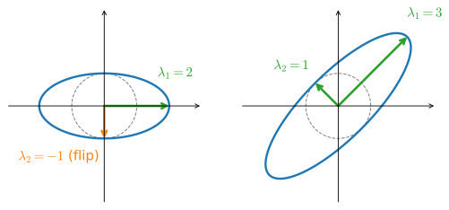
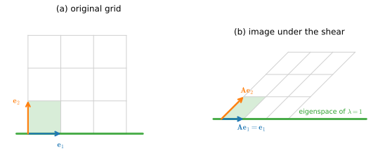

# Eigendecompositions
:label:`sec_mdl-eigendecompositions`

In :numref:`sec_mdl-geometry-linear-algebraic-ops` we saw a matrix as a
*geometric distortion* of space: it skews, rotates, and rescales the grid, and
the determinant records the net volume factor. Eigenvalues refine that picture.
For a well-behaved square matrix there is a special set of directions, the
*eigenvectors*, along which the distortion is a pure stretch, and an
*eigenbasis* in which the whole map decouples into independent one-dimensional
stretches. This single observation is what makes stability analysis, PCA, and
the curvature story of optimization tractable. The goal of this section is to
convey, with both pictures and proofs, why eigenvalues are so central. Our
running example is an *iterated map*: repeatedly applying the same matrix, as a
deep *linear* network (one with the nonlinearities stripped away) does, makes
the role of the largest eigenvalue unmistakable.

The numerical checks in this section use small dense matrices.

```{.python .input #eigendecomposition-imports}
#@tab mxnet
import numpy as np
```

```{.python .input #eigendecomposition-imports}
#@tab pytorch
import numpy as np
import torch
```

```{.python .input #eigendecomposition-imports}
#@tab tensorflow
import numpy as np
import tensorflow as tf
```

```{.python .input #eigendecomposition-imports}
#@tab jax
import numpy as np
import jax
jax.config.update("jax_enable_x64", True)  # honor explicit float64 (else JAX
# silently truncates to float32 and the eigvals/power-iteration check disagrees)
from jax import numpy as jnp
```

## Eigenvalues and Eigenvectors

### Definition and Geometry

Suppose that we have a matrix $\mathbf{A}$ with the following entries:

$$
\mathbf{A} = \begin{bmatrix}
2 & 0 \\
0 & -1
\end{bmatrix}.
$$

If we apply $\mathbf{A}$ to any vector $\mathbf{v} = [x, y]^\top$,
we obtain a vector $\mathbf{A}\mathbf{v} = [2x, -y]^\top$.
This has an intuitive interpretation:
stretch the vector to be twice as wide in the $x$-direction,
and then flip it in the $y$-direction.

However, there are *some* vectors for which the direction remains unchanged.
Namely $[1, 0]^\top$ gets sent to $[2, 0]^\top$
and $[0, 1]^\top$ gets sent to $[0, -1]^\top$.
These vectors are still on the same line through the origin;
the only modification is that $\mathbf{A}$ scales $[1,0]^\top$ by $2$
and $[0,1]^\top$ by $-1$.
We call such vectors *eigenvectors*
and the factor they are stretched by their *eigenvalues*.

In general, if we can find a number $\lambda$
and a *nonzero* vector $\mathbf{v}$ such that

$$
\mathbf{A}\mathbf{v} = \lambda \mathbf{v},
$$
:eqlabel:`eq_mdl-eigpair`

we say that $\mathbf{v}$ is an *eigenvector* of $\mathbf{A}$ and $\lambda$ its
*eigenvalue*. (We insist $\mathbf{v}\neq\mathbf 0$: the zero vector trivially
satisfies :eqref:`eq_mdl-eigpair` for every $\lambda$ and carries no information.
The scalar $\lambda$ *is* allowed to be zero, and we will see that $\lambda=0$
signals a non-invertible matrix.) For a fixed eigenvalue $\lambda$, the set of
all vectors satisfying $\mathbf{A}\mathbf{v}=\lambda\mathbf{v}$, together with
$\mathbf 0$, forms a subspace, the *eigenspace* of $\lambda$.

To picture eigenvectors, ask what a matrix does to the
*unit circle*, the set of all unit vectors. A full-rank matrix maps it to an
ellipse (a singular matrix flattens the ellipse further, into a segment or a
point), and for a *symmetric* matrix the axes of that ellipse lie exactly along
the eigenvectors, with half-lengths $|\lambda_i|$ (an axis flips when
$\lambda_i<0$). :numref:`fig_mdl-la-eig-ellipse` draws this for our
$\operatorname{diag}(2,-1)$ above and for the symmetric
$[[2,1],[1,2]]$ that we revisit in the exercises. This is the same "circle becomes an ellipse"
picture that the singular value decomposition will generalize to *every* matrix
in :numref:`sec_mdl-svd-low-rank`; here the special feature is that one set of
axes does the whole job.


:label:`fig_mdl-la-eig-ellipse`

The green arrows are the unit eigenvectors; the red arrows are their images
$\mathbf{A}\mathbf{v}_i=\lambda_i\mathbf{v}_i$, which fall exactly on the
ellipse's axes. For $\operatorname{diag}(2,-1)$ the axes are the coordinate
directions; for the symmetric $[[2,1],[1,2]]$ they are the diagonal directions
$[1,1]^\top/\sqrt2$ (scaled by $3$) and $[1,-1]^\top/\sqrt2$ (scaled by $1$).

### Finding Eigenvalues
:label:`subsec_mdl-finding-eigenvalues`
Let's figure out how to find them. By subtracting off the $\lambda \mathbf{v}$ from both sides,
and then factoring out the vector,
we see the above is equivalent to:

$$(\mathbf{A} - \lambda \mathbf{I})\mathbf{v} = 0.$$
:eqlabel:`eq_mdl-eigvalue_der`

For :eqref:`eq_mdl-eigvalue_der` to happen, we see that $(\mathbf{A} - \lambda \mathbf{I})$
must compress some direction down to zero,
hence it is not invertible, and thus the determinant is zero.
Thus, we can find the *eigenvalues*
by finding for what $\lambda$ is $\det(\mathbf{A}-\lambda \mathbf{I}) = 0$.
Once we find the eigenvalues, we can solve
$\mathbf{A}\mathbf{v} = \lambda \mathbf{v}$
to find the associated *eigenvector(s)*.

Let's see this with a more challenging matrix

$$
\mathbf{A} = \begin{bmatrix}
2 & 1\\
2 & 3
\end{bmatrix}.
$$

If we consider $\det(\mathbf{A}-\lambda \mathbf{I}) = 0$,
we see this is equivalent to a polynomial equation in $\lambda$: the
*characteristic polynomial* $p(\lambda) = \det(\mathbf{A}-\lambda\mathbf{I})$,
here $(2-\lambda)(3-\lambda)-2 = (4-\lambda)(1-\lambda)$.
Thus the two eigenvalues are $\lambda = 1$ and $\lambda = 4$.
To find the associated eigenvectors, we solve
$(\mathbf{A}-\mathbf{I})\mathbf{v}=\mathbf 0$ for $\lambda = 1$ and
$(\mathbf{A}-4\mathbf{I})\mathbf{v}=\mathbf 0$ for $\lambda = 4$, i.e.

$$
\begin{bmatrix}
2 & 1\\
2 & 3
\end{bmatrix}\begin{bmatrix}x \\ y\end{bmatrix} = \begin{bmatrix}x \\ y\end{bmatrix}  \; \textrm{and} \;
\begin{bmatrix}
2 & 1\\
2 & 3
\end{bmatrix}\begin{bmatrix}x \\ y\end{bmatrix}  = \begin{bmatrix}4x \\ 4y\end{bmatrix} .
$$

These are solved (up to scale) by $[1, -1]^\top$ for $\lambda = 1$
and $[1, 2]^\top$ for $\lambda = 4$, respectively.
(Each eigenvector is determined only up to a nonzero scalar multiple: if
$\mathbf v$ is an eigenvector, so is $c\mathbf v$ for any $c\neq0$, since both
sides of :eqref:`eq_mdl-eigpair` scale by $c$.)

We can check this in code using the built-in `eig` routine.

```{.python .input #eigendecomposition-an-example}
#@tab mxnet
np.linalg.eig(np.array([[2, 1], [2, 3]]))
```

```{.python .input #eigendecomposition-an-example}
#@tab pytorch
torch.linalg.eig(torch.tensor([[2, 1], [2, 3]], dtype=torch.float64))
```

```{.python .input #eigendecomposition-an-example}
#@tab tensorflow
tf.linalg.eig(tf.constant([[2, 1], [2, 3]], dtype=tf.float64))
```

```{.python .input #eigendecomposition-an-example}
#@tab jax
jnp.linalg.eig(jnp.array([[2, 1], [2, 3]], dtype=jnp.float64))
```

:begin_tab:`mxnet`
MXNet arrays have no complex dtype, so `mxnet.np.linalg.eig` fails whenever the
spectrum is complex, as it is for some matrices later in this section; we
therefore use plain NumPy for eigenvalue computations here.
:end_tab:

Note that the library normalizes the eigenvectors to be of length one,
whereas we took ours to be of arbitrary length.
Additionally, the choice of sign is arbitrary.
However, the vectors computed are parallel
to the ones we found by hand with the same eigenvalues.

What did `eig` actually do? For $n\ge5$ there is no
formula in radicals for the roots of the characteristic polynomial, and
practical libraries never form that polynomial anyway. They instead reduce
$\mathbf{A}$ to a nearly-triangular *Hessenberg* form and run the shifted *QR
algorithm*, an iteration that drives the matrix toward triangular form while
preserving its eigenvalues :cite:`Golub.Van-Loan.1996`. The iteration targets
triangular form because a triangular matrix displays its eigenvalues on its
diagonal: $\mathbf{T}-\lambda\mathbf{I}$ is again triangular, so by the
triangular determinant rule of :numref:`subsec_mdl-determinant-general`,
$\det(\mathbf{T}-\lambda\mathbf{I})=\prod_i(t_{ii}-\lambda)$, which vanishes
exactly at the diagonal values. The *power iteration* we
develop later in this section matters in the complementary regime, when
$\mathbf{A}$ is too large to factor and only matrix--vector products are
affordable.

### Eigendecomposition and What It Computes

Let's continue the previous example one step further.  Let

$$
\mathbf{W} = \begin{bmatrix}
1 & 1 \\
-1 & 2
\end{bmatrix},
$$

be the matrix where the columns are the eigenvectors of the matrix $\mathbf{A}$. Let

$$
\boldsymbol{\Lambda} = \begin{bmatrix}
1 & 0 \\
0 & 4
\end{bmatrix},
$$

be the matrix with the associated eigenvalues on the diagonal.
Then the definition of eigenvalues and eigenvectors tells us that

$$
\mathbf{A}\mathbf{W} =\mathbf{W} \boldsymbol{\Lambda} .
$$

The matrix $\mathbf{W}$ is invertible, so we may multiply both sides by $\mathbf{W}^{-1}$ on the right,
we see that we may write

$$\mathbf{A} = \mathbf{W} \boldsymbol{\Lambda} \mathbf{W}^{-1}.$$
:eqlabel:`eq_mdl-eig_decomp`

Below we will see some nice consequences of this,
but for now we need only know that such a decomposition
will exist as long as we can find a full collection
of linearly independent eigenvectors (so that $\mathbf{W}$ is invertible).
A matrix that admits such a decomposition is called *diagonalizable*.

The eigendecomposition :eqref:`eq_mdl-eig_decomp` turns many matrix operations
into scalar ones. As a first example, consider:

$$
\mathbf{A}^n = \overbrace{\mathbf{A}\cdots \mathbf{A}}^{\textrm{$n$ times}} = \overbrace{(\mathbf{W}\boldsymbol{\Lambda} \mathbf{W}^{-1})\cdots(\mathbf{W}\boldsymbol{\Lambda} \mathbf{W}^{-1})}^{\textrm{$n$ times}} =  \mathbf{W}\overbrace{\boldsymbol{\Lambda}\cdots\boldsymbol{\Lambda}}^{\textrm{$n$ times}}\mathbf{W}^{-1} = \mathbf{W}\boldsymbol{\Lambda}^n \mathbf{W}^{-1}.
$$

This tells us that for any positive power of a matrix,
the eigendecomposition is obtained by just raising the eigenvalues to the same power.
The same can be shown for negative powers,
so if we want to invert a matrix we need only consider

$$
\mathbf{A}^{-1} = \mathbf{W}\boldsymbol{\Lambda}^{-1} \mathbf{W}^{-1},
$$

or in other words, just invert each eigenvalue.
This will work as long as each eigenvalue is non-zero,
so we see that invertible is the same as having no zero eigenvalues.
The same recipe defines the *matrix exponential*
$e^{\mathbf{A}t}=\mathbf{W}e^{\boldsymbol{\Lambda}t}\mathbf{W}^{-1}$, which
solves the linear differential equation $\dot{\mathbf{x}}=\mathbf{A}\mathbf{x}$;
there the *real parts* of the eigenvalues decide stability, as we show in
:numref:`sec_mdl-odes-solvers`.

**Determinant and trace from the eigenvalues.** Two quantities we met in
:numref:`sec_mdl-geometry-linear-algebraic-ops` read off the spectrum directly.
For a diagonalizable matrix, both follow in two lines from identities we have
already proved. The determinant is multiplicative
:eqref:`eq_mdl-det-multiplicative`, and applying multiplicativity to
$\mathbf{W}\mathbf{W}^{-1}=\mathbf{I}$ gives
$\det(\mathbf{W}^{-1})=1/\det(\mathbf{W})$, so

$$
\det(\mathbf{A}) = \det(\mathbf{W}\boldsymbol{\Lambda}\mathbf{W}^{-1})
  = \det(\mathbf{W})\det(\boldsymbol{\Lambda})\det(\mathbf{W}^{-1})
  = \det(\boldsymbol{\Lambda})
  = \lambda_1 \lambda_2 \cdots \lambda_n,
$$
:eqlabel:`eq_mdl-det-eig`

the product of all the eigenvalues. This matches the geometric picture: whatever
stretching $\mathbf{W}$ does, $\mathbf{W}^{-1}$ undoes, so the only net volume
change is by the diagonal $\boldsymbol{\Lambda}$, which scales volumes by the
product of its entries. The trace is cyclic, $\operatorname{tr}(\mathbf{A}\mathbf{B})
=\operatorname{tr}(\mathbf{B}\mathbf{A})$ :eqref:`eq_mdl-trace-cyclic`, so the
same conjugation collapses:

$$
\operatorname{tr}(\mathbf{A})
  = \operatorname{tr}(\mathbf{W}\boldsymbol{\Lambda}\mathbf{W}^{-1})
  = \operatorname{tr}(\boldsymbol{\Lambda}\mathbf{W}^{-1}\mathbf{W})
  = \operatorname{tr}(\boldsymbol{\Lambda})
  = \lambda_1+\cdots+\lambda_n,
$$
:eqlabel:`eq_mdl-tr-eig`

the *sum* of the eigenvalues. So determinant and trace are the product and sum
of the spectrum; both are *similarity invariants* (unchanged by
$\mathbf{A}\mapsto\mathbf{W}\mathbf{A}\mathbf{W}^{-1}$). The trace identity
returns when we estimate $\log\det$ Jacobians with the Hutchinson trace
estimator in :numref:`sec_mdl-odes-solvers`.

Both identities in fact hold for *every* square matrix, diagonalizable or not,
provided the eigenvalues are counted with algebraic multiplicity over the
complex numbers. The characteristic polynomial
$p(\lambda)=\det(\mathbf{A}-\lambda\mathbf{I})$ has degree $n$, and the
*fundamental theorem of algebra*, which we borrow here as an unproved fact,
says that it factors completely over $\mathbb{C}$:
$p(\lambda)=\prod_{i=1}^{n}(\lambda_i-\lambda)$. Setting $\lambda=0$ recovers
$\det(\mathbf{A})=\prod_i\lambda_i$, and comparing the coefficients of
$\lambda^{n-1}$ on both sides recovers
$\operatorname{tr}(\mathbf{A})=\sum_i\lambda_i$: on the right the coefficient is
$(-1)^{n-1}\sum_i\lambda_i$, on the left it is $(-1)^{n-1}\sum_i a_{ii}$ (this
uses the permutation expansion of :numref:`subsec_mdl-determinant-general`; only
the all-diagonal term contributes at that degree). Complex eigenvalues of a real
matrix enter in conjugate pairs, so both the product and the sum come out real.
We meet these complex pairs concretely in :numref:`subsec_mdl-jordan`.

Finally, recall that the rank was the maximum number of linearly independent
columns of a matrix. For a *diagonalizable* matrix, the rank equals the number
of non-zero eigenvalues: multiplying by the invertible $\mathbf{W}$ and
$\mathbf{W}^{-1}$ changes no dimensions, so
$\operatorname{rank}\mathbf{A}=\operatorname{rank}\boldsymbol{\Lambda}$, the
number of non-zero diagonal entries. (For a general matrix, the right invariant
is the number of non-zero *singular values*; :numref:`sec_mdl-svd-low-rank`.)

#### When Does an Eigenbasis Exist? Multiplicity and Diagonalizability
:label:`subsec_mdl-multiplicity`

Whether we can build an invertible $\mathbf{W}$ comes down to *counting*
eigenvectors, and the precise bookkeeping uses two notions of multiplicity,
both read off the characteristic polynomial of
:numref:`subsec_mdl-finding-eigenvalues`. The number of times $\lambda$
appears as a root of $p(\lambda)$ is its *algebraic multiplicity*. The dimension
of its eigenspace (the number of independent eigenvectors it contributes) is its
*geometric multiplicity*. These always satisfy

$$
1 \le \textrm{geometric mult.}(\lambda) \le \textrm{algebraic mult.}(\lambda),
$$

and they need not be equal. The matrix is diagonalizable precisely when its
eigenvectors span $\mathbb{R}^n$, which happens **if and only if geometric
multiplicity equals algebraic multiplicity for every eigenvalue**. One
sufficient condition covers the generic case.

**Proposition (distinct eigenvalues $\Rightarrow$ diagonalizable).**
*Eigenvectors belonging to distinct eigenvalues are linearly independent. In
particular, an $n\times n$ matrix with $n$ distinct eigenvalues is
diagonalizable.*

**Proof.** Suppose, for contradiction, that some eigenvectors
$\mathbf{w}_1,\ldots,\mathbf{w}_m$ with distinct eigenvalues
$\lambda_1,\ldots,\lambda_m$ are dependent, and take a dependence relation
$\sum_{i=1}^{m} c_i\mathbf{w}_i = \mathbf 0$ with the *fewest* nonzero
coefficients; relabel so $c_m\neq0$. Any such relation has at least *two*
nonzero coefficients: a single-term relation $c_m\mathbf{w}_m=\mathbf 0$ would
force $\mathbf{w}_m=\mathbf 0$, and eigenvectors are nonzero by definition.
Apply $\mathbf{A}$ and subtract $\lambda_m$
times the relation:

$$
\mathbf 0 = \mathbf{A}\!\sum_i c_i\mathbf{w}_i - \lambda_m\!\sum_i c_i\mathbf{w}_i
   = \sum_{i=1}^{m-1} c_i(\lambda_i-\lambda_m)\,\mathbf{w}_i .
$$

The $\mathbf{w}_m$ term cancels, so we obtain a *shorter* relation. It is still
nontrivial: the original relation had a second nonzero coefficient $c_i$ with
$i<m$, and it survives as $c_i(\lambda_i-\lambda_m)\neq0$ because the
eigenvalues are distinct, contradicting minimality. Hence the eigenvectors are independent.
With $n$ distinct eigenvalues we get $n$ independent eigenvectors, which form a
basis of $\mathbb{R}^n$, so $\mathbf{W}$ is invertible. $\blacksquare$

When eigenvalues are *repeated*, diagonalizability can fail: an eigenvalue's
eigenspace may be too small to fill out its algebraic multiplicity. The
simplest example is the *shear* matrix

$$
\mathbf{A} = \begin{bmatrix}
1 & 1 \\
0 & 1
\end{bmatrix}.
$$
:eqlabel:`eq_mdl-defective-shear`

Its characteristic polynomial is
$\det(\mathbf{A}-\lambda\mathbf{I})=(1-\lambda)^2$, so $\lambda=1$ has algebraic
multiplicity $2$. But solving $(\mathbf{A}-\mathbf{I})\mathbf{v}=\mathbf 0$ gives
$\bigl[\begin{smallmatrix}0&1\\0&0\end{smallmatrix}\bigr]\mathbf v=\mathbf 0$,
i.e. $v_2=0$: the eigenspace is the *one-dimensional* line spanned by
$[1,0]^\top$. The geometric multiplicity is $1$ while the algebraic multiplicity
is $2$, so there is no eigenbasis and $\mathbf{A}$ is not diagonalizable; a
matrix with this shortfall is called *defective*.
:numref:`fig_mdl-la-defective-shear` makes the shortage visible: the shear
slides every horizontal layer of the grid sideways, and the horizontal axis is
the *only* line through the origin left pointing where it started. A
diagonalizable $2\times2$ matrix would exhibit two independent such lines; the
shear has just one, and no change of basis can conjure a second.


:label:`fig_mdl-la-defective-shear`

#### Beyond Diagonalization: The Jordan Normal Form
:label:`subsec_mdl-jordan`

When the geometric multiplicity falls short of the algebraic multiplicity, no
eigenbasis exists. What structure remains? The answer is completely catalogued.
Over the complex numbers, every square matrix is similar to a block-diagonal
matrix whose diagonal blocks are *Jordan blocks*

$$
\mathbf{J}_k(\lambda) =
\begin{bmatrix}
\lambda & 1      &        &        \\
        & \lambda& \ddots &        \\
        &        & \ddots & 1      \\
        &        &        & \lambda
\end{bmatrix},
$$

$k\times k$ blocks with a single eigenvalue $\lambda$ repeated down the
diagonal and $1$s just above it. This is the *Jordan normal form*
:cite:`Horn.Johnson.2012`, which we use without proof.

The form makes both multiplicities visible at a glance, because each block
contributes exactly *one* eigenvector: within a block,
$(\mathbf{J}_k(\lambda)-\lambda\mathbf{I})\mathbf{v}=\mathbf 0$ forces every
coordinate of $\mathbf{v}$ except the first to vanish. So the geometric
multiplicity of $\lambda$ is the *number* of blocks carrying $\lambda$, the
algebraic multiplicity is the *total size* of those blocks, and a matrix is
diagonalizable exactly when every block is $1\times1$. The shear
:eqref:`eq_mdl-defective-shear` is already in Jordan form: it is the single
block $\mathbf{J}_2(1)$, one block of size two, hence one eigenvector for an
eigenvalue of algebraic multiplicity two, exactly the shortage that
:numref:`fig_mdl-la-defective-shear` displays.

What does a Jordan block do under iteration? Write
$\mathbf{J}_k(\lambda)=\lambda\mathbf{I}+\mathbf{N}$, where $\mathbf{N}$ has
$1$s just above the diagonal and zeros elsewhere. $\mathbf{N}$ is a shift: it
sends each basis vector to its predecessor, so $\mathbf{N}^k=\mathbf 0$ (a
matrix some power of which vanishes is called *nilpotent*). Because
$\mathbf{I}$ and $\mathbf{N}$ commute, the binomial theorem applies to
$(\lambda\mathbf{I}+\mathbf{N})^n$, and for $k=2$ every term beyond the first
two contains $\mathbf{N}^2=\mathbf 0$:

$$
\mathbf{J}_2(\lambda)^n = (\lambda\mathbf{I}+\mathbf{N})^n
  = \lambda^n\mathbf{I} + n\lambda^{n-1}\mathbf{N}.
$$

The eigenvalue still decides growth versus decay, but multiplied by a
*polynomial* in $n$ rather than acting alone. A defective matrix with
$|\lambda|=1$, like the shear, drifts linearly instead of staying put:
$\mathbf{J}_2(1)^n$ has an $n$ in its corner. And with $|\lambda|$ slightly
below $1$, the off-diagonal entry $n\lambda^{n-1}$ first *grows*, peaks near
$n\approx-1/\log\lambda$, and only then decays: the iterates rise transiently
before the geometric factor wins. We can watch this happen for
$\lambda=0.99$, where the formula puts the peak near $n\approx100$.

```{.python .input #mdl-eigendecomposition-jordan-power}
J = np.array([[0.99, 1.], [0., 0.99]])   # the Jordan block J_2(0.99)
for n in [1, 50, 100, 200, 800]:
    Jn = np.linalg.matrix_power(J, n)
    pred = n * 0.99 ** (n - 1)   # predicted corner entry, n * lambda^(n-1)
    print(f'n = {n:3d}   ||J^n|| = {np.linalg.norm(Jn, 2):8.3f}   '
          f'n * 0.99^(n-1) = {pred:8.3f}')
```

Every eigenvalue of $\mathbf{J}$ is $0.99$, safely below $1$, yet the norm
climbs to about $37$ before the decay takes over. This *transient growth* is a
signature of defective (more generally, non-normal) matrices, and it is
invisible to the eigenvalues alone; the singular values of
:numref:`sec_mdl-svd-low-rank` measure it directly.

Jordan blocks are the first of two ways a real matrix can fall short of a real
eigenbasis: too few eigenvectors. The second way is different in kind: a real
matrix can have no real eigenvalue at all in some plane, because it *rotates*
that plane.

#### Complex Eigenvalues Are Rotations
:label:`subsec_mdl-complex-rotation`

Consider the planar rotation by angle $\theta$,

$$
\mathbf{R} = \begin{bmatrix}\cos\theta & -\sin\theta\\
                            \sin\theta & \phantom{-}\cos\theta\end{bmatrix}.
$$

If $0<\theta<\pi$, $\mathbf{R}$ sends *no* nonzero real vector to a multiple of
itself (a true rotation has no fixed direction), so it has no real eigenvector.
Its characteristic polynomial $\lambda^2-2\cos\theta\,\lambda+1$ has the
complex-conjugate roots $\lambda=\cos\theta\pm i\sin\theta=e^{\pm i\theta}$. The
*modulus* $|\lambda|=1$ records that $\mathbf{R}$ preserves length (it is
orthogonal), while the *argument* $\pm\theta$ records the rotation angle.

```{.python .input #eigendecomposition-complex-rotation}
theta = np.pi / 6
R = np.array([[np.cos(theta), -np.sin(theta)],
              [np.sin(theta),  np.cos(theta)]])
print('eigenvalues of R:', np.round(np.linalg.eigvals(R), 4))
print('expected e^{+/- i*theta}:', np.round(np.exp([1j * theta, -1j * theta]), 4))
print('moduli (should be 1):', np.round(np.abs(np.linalg.eigvals(R)), 4))
```

This is the general rule. Complex eigenvalues of a real matrix come in
conjugate pairs $re^{\pm i\theta}$, and each pair encodes a *scale by $r$ and
rotate by $\theta$*: the pair corresponds to a real $2\times2$
rotation--scaling block
$r\left(\begin{smallmatrix}\cos\theta & -\sin\theta\\ \sin\theta & \cos\theta\end{smallmatrix}\right)$
acting on a two-dimensional invariant plane. Allowing these blocks alongside
the Jordan blocks of :numref:`subsec_mdl-jordan` gives the *real Jordan form*
:cite:`Horn.Johnson.2012`, and with it a complete inventory of what a linear
map can do over the reals: every square matrix decomposes into pure stretch
directions (real eigenvalues with a full set of eigenvectors), shear-like
Jordan blocks (repeated eigenvalues with too few eigenvectors), and
rotation--scaling planes (complex-conjugate pairs). The inventory also predicts
how iterating a matrix can misbehave: a dominant rotating pair keeps the
iterate spinning forever instead of settling on a direction, and a dominant
defective block converges with a polynomial drag. Both reappear when we develop
*power iteration* later in this section.

## Symmetric Matrices and Positive Definiteness

### The Spectral Theorem
:label:`subsec_mdl-spectral-theorem`

Shears and rotations tell us what can go wrong. We now restrict attention to
the family of matrices for which a full set of orthonormal eigenvectors is
*guaranteed*. The most commonly encountered such family are the
*symmetric matrices*, those with $\mathbf{A}=\mathbf{A}^\top$. Their guarantee has
a name.

**Theorem (Spectral Theorem).** *Every real symmetric matrix $\mathbf{A}$ has a
full orthonormal eigenbasis with real eigenvalues. Equivalently,
$\mathbf{A}=\mathbf{W}\boldsymbol{\Lambda}\mathbf{W}^\top$ where
$\boldsymbol{\Lambda}=\operatorname{diag}(\lambda_1,\ldots,\lambda_n)$ is real and
$\mathbf{W}$ is orthogonal* ($\mathbf{W}^\top\mathbf{W}=\mathbf{I}$, so
$\mathbf{W}^{-1}=\mathbf{W}^\top$).

We prove the three claims in turn (real eigenvalues, orthogonal eigenvectors,
and a complete basis); each proof is short and instructive. The inner product
of complex vectors here is $\langle\mathbf x,\mathbf y\rangle=\mathbf x^*\mathbf y$
with $\mathbf x^*$ the conjugate transpose; on real vectors it is the ordinary
dot product. The one fact we borrow is that a real polynomial, here the
characteristic polynomial, has at least one (possibly complex) root, a special
case of the fundamental theorem of algebra we invoked above, so at least
one eigenpair exists over $\mathbb{C}$.

**Proof, part (i): the eigenvalues are real.** Let
$\mathbf{A}\mathbf{v}=\lambda\mathbf{v}$ with $\mathbf{v}\neq\mathbf 0$, allowing
complex entries. Since $\mathbf{A}$ is real and symmetric, $\mathbf A^*=\mathbf A^\top=\mathbf A$, so

$$
\lambda\,\mathbf{v}^*\mathbf{v}
   = \mathbf{v}^*\mathbf{A}\mathbf{v}
   = (\mathbf{A}\mathbf{v})^*\mathbf{v}
   = \bar\lambda\,\mathbf{v}^*\mathbf{v}.
$$

Because $\mathbf{v}^*\mathbf{v}=\|\mathbf v\|^2>0$, we may divide it out to get
$\lambda=\bar\lambda$, i.e. $\lambda$ is real. The eigenvector can then be taken
real as well (it solves the real system $(\mathbf A-\lambda\mathbf I)\mathbf v=\mathbf0$). $\blacksquare$

**Proof, part (ii): eigenvectors for distinct eigenvalues are orthogonal.** Let
$\mathbf{A}\mathbf{u}=\lambda\mathbf{u}$ and
$\mathbf{A}\mathbf{v}=\mu\mathbf{v}$ with $\lambda\neq\mu$. Using
$\mathbf{A}=\mathbf{A}^\top$ to slide $\mathbf{A}$ across the inner product,

$$
\lambda\langle\mathbf{u},\mathbf{v}\rangle
  = \langle\mathbf{A}\mathbf{u},\mathbf{v}\rangle
  = \langle\mathbf{u},\mathbf{A}\mathbf{v}\rangle
  = \mu\langle\mathbf{u},\mathbf{v}\rangle,
$$

so $(\lambda-\mu)\langle\mathbf{u},\mathbf{v}\rangle=0$. Since
$\lambda\neq\mu$, we conclude $\langle\mathbf{u},\mathbf{v}\rangle=0$: the
eigenvectors are orthogonal. $\blacksquare$

**Proof, part (iii): a full orthonormal basis (induction on the orthogonal complement).** We induct on
$n$. For $n=1$ the claim is trivial. For $n>1$, part (i) gives a real eigenpair
$(\lambda_1,\mathbf{w}_1)$ with $\|\mathbf{w}_1\|=1$. Let
$U=\mathbf{w}_1^{\perp}$ be its orthogonal complement (dimension $n-1$). This
subspace is *$\mathbf{A}$-invariant*: for any $\mathbf{x}\in U$,

$$
\langle\mathbf{A}\mathbf{x},\mathbf{w}_1\rangle
  = \langle\mathbf{x},\mathbf{A}\mathbf{w}_1\rangle
  = \lambda_1\langle\mathbf{x},\mathbf{w}_1\rangle = 0,
$$

so $\mathbf{A}\mathbf{x}\in U$ too. The restriction $\mathbf{A}|_U$ is again
symmetric on an $(n-1)$-dimensional space, so by the inductive hypothesis it has
an orthonormal eigenbasis $\mathbf{w}_2,\ldots,\mathbf{w}_n$ of $U$. Together with
$\mathbf{w}_1$ these form an orthonormal eigenbasis of $\mathbb{R}^n$. Collecting
them as the columns of $\mathbf{W}$ gives the stated factorization. $\blacksquare$

In this special case, then, we can write the eigendecomposition
:eqref:`eq_mdl-eig_decomp` as

$$
\mathbf{A} = \mathbf{W}\boldsymbol{\Lambda}\mathbf{W}^\top .
$$
:eqlabel:`eq_mdl-spectral`

This factorization is what makes PCA (the variance-maximizing projections of
:numref:`subsec_mdl-pca`), covariance analysis, and the Hessian test for minima
(:numref:`subsec_mdl-psd`) computable: all three concern symmetric matrices. It
also reads geometrically: $\mathbf{W}^\top$ rotates the orthonormal eigenvectors onto the
coordinate axes, $\boldsymbol{\Lambda}$ stretches independently along each axis,
and $\mathbf{W}$ rotates back. This is precisely the "circle becomes an ellipse
with axes along the eigenvectors" picture we drew above, now justified.

The defective shear :eqref:`eq_mdl-defective-shear` shows that the
eigendecomposition is *picky*: it needs a square matrix, and to be fully
well-behaved it really wants a symmetric one. The fix that works for *every*
matrix $\mathbf{A}$ rests on a single observation we will use repeatedly: the
matrix $\mathbf{A}^\top\mathbf{A}$ is always **symmetric** ($(\mathbf A^\top\mathbf
A)^\top=\mathbf A^\top\mathbf A$) and **positive semidefinite**, because

$$
\mathbf{x}^\top(\mathbf{A}^\top\mathbf{A})\mathbf{x} = \|\mathbf{A}\mathbf{x}\|^2 \ge 0 .
$$

The spectral theorem therefore applies to $\mathbf{A}^\top\mathbf{A}$, and feeding
its orthonormal eigenvectors and (non-negative) eigenvalues through $\mathbf{A}$
manufactures the singular value decomposition
$\mathbf{A}=\mathbf{U}\boldsymbol{\Sigma}\mathbf{V}^\top$: in short, **the SVD is
the eigendecomposition of $\mathbf{A}^\top\mathbf{A}$ in disguise**, with singular
values $\sigma_i=\sqrt{\lambda_i(\mathbf{A}^\top\mathbf{A})}$. We carry out the
construction, and give the defective shear its SVD, in
:numref:`sec_mdl-svd-low-rank`. Positive semidefiniteness, the property doing
the work here, is what we take up next.

### Positive (Semi)Definiteness
:label:`subsec_mdl-psd`

A symmetric matrix's eigenvalues answer a *sign* question: is the quadratic form
$\mathbf{x}^\top\mathbf{A}\mathbf{x}$ ever negative? This one property is what
makes covariance matrices, Gram matrices, and "is this a minimum?" Hessian tests
work.

A symmetric matrix $\mathbf{A}$ is *positive semidefinite* (PSD), written
$\mathbf{A}\succeq0$, if

$$
\mathbf{x}^\top\mathbf{A}\mathbf{x} \ge 0 \quad\textrm{for all } \mathbf{x},
$$

and *positive definite* (PD), written $\mathbf{A}\succ0$, if the inequality is
strict for every $\mathbf{x}\neq\mathbf 0$. The eigenvalues decide the question
completely.

**Proposition (PSD/PD via eigenvalues).** *For symmetric $\mathbf{A}$,*

$$
\mathbf{A}\succeq0 \iff \lambda_i\ge0\ \forall i,
\qquad
\mathbf{A}\succ0 \iff \lambda_i>0\ \forall i .
$$

**Proof.** Use the spectral theorem
$\mathbf{A}=\mathbf{W}\boldsymbol{\Lambda}\mathbf{W}^\top$ and the change of
variables $\mathbf{y}=\mathbf{W}^\top\mathbf{x}$. Since $\mathbf{W}$ is
orthogonal this is just a rotation, and

$$
\mathbf{x}^\top\mathbf{A}\mathbf{x}
  = \mathbf{x}^\top\mathbf{W}\boldsymbol{\Lambda}\mathbf{W}^\top\mathbf{x}
  = \mathbf{y}^\top\boldsymbol{\Lambda}\mathbf{y}
  = \sum_{i=1}^{n}\lambda_i\,y_i^2
  = \sum_{i=1}^{n}\lambda_i\,(\mathbf{w}_i^\top\mathbf{x})^2 .
$$
:eqlabel:`eq_mdl-quadform`

The quadratic form is a *weighted sum of squares* with the eigenvalues as
weights. If every $\lambda_i\ge0$ the sum is $\ge0$, so $\mathbf{A}\succeq0$.
Conversely, choosing $\mathbf{x}=\mathbf{w}_j$ (so $\mathbf y=\mathbf e_j$) gives
$\mathbf{w}_j^\top\mathbf{A}\mathbf{w}_j=\lambda_j$, which forces
$\lambda_j\ge0$. The strict (PD) statement is identical with $\ge$ replaced by
$>$. $\blacksquare$

Three consequences follow immediately, and together they cover most of the places
PSD matrices appear in deep learning.

* **PD $\Rightarrow$ invertible.** If $\mathbf{A}\succ0$ and
  $\mathbf{A}\mathbf{x}=\mathbf 0$, then
  $\mathbf{x}^\top\mathbf{A}\mathbf{x}=0$, which forces $\mathbf{x}=\mathbf 0$; the
  null space is trivial. (Equivalently, all $\lambda_i>0$, so
  $\det\mathbf A=\prod_i\lambda_i>0$ by :eqref:`eq_mdl-det-eig`.)
* **Gram and covariance matrices are PSD.** For any matrix $\mathbf{X}$, the Gram
  matrix $\mathbf{G}=\mathbf{X}^\top\mathbf{X}$ satisfies
  $\mathbf{x}^\top\mathbf{G}\mathbf{x}=\|\mathbf{X}\mathbf{x}\|^2\ge0$, so
  $\mathbf{G}\succeq0$; it is PD exactly when $\mathbf{X}$ has full column rank
  (so that $\mathbf{X}\mathbf{x}=\mathbf 0$ implies $\mathbf{x}=\mathbf 0$).
  Covariance matrices, being Gram matrices of centered data divided by $n$,
  inherit this: they are always PSD.
* **The Hessian and minima.** A twice-differentiable function has a local minimum
  at a critical point when its *Hessian*, the symmetric matrix $\mathbf{H}$ of
  second partial derivatives $h_{ij}=\partial^2 f/\partial x_i\partial x_j$
  (developed in the calculus chapter), is PD there: by
  :eqref:`eq_mdl-quadform` the second-order Taylor term
  $\tfrac12\mathbf{x}^\top\mathbf{H}\mathbf{x}$ curves *upward* in every direction.
  This is the second-order optimality test we use throughout optimization.

Positive definiteness also has a purely *algorithmic* certificate, the
*Cholesky factorization*: $\mathbf{A}\succ0$ if and only if
$\mathbf{A}=\mathbf{L}\mathbf{L}^\top$ for a lower-triangular $\mathbf{L}$ with
positive diagonal (one direction is immediate: such an $\mathbf{L}$ is
invertible, so
$\mathbf{x}^\top\mathbf{A}\mathbf{x}=\|\mathbf{L}^\top\mathbf{x}\|^2>0$ for
$\mathbf{x}\neq\mathbf 0$). Attempting the factorization, far cheaper than an
eigendecomposition, is the standard numerical test for definiteness. The same
factorization is how multivariate Gaussians are sampled, an application we
develop in :numref:`sec_mdl-distributions`.

Geometrically, the sign pattern of the eigenvalues is the *shape* of the surface
$z=\mathbf{x}^\top\mathbf{A}\mathbf{x}$, viewed through the eigenvector axes:
all-positive eigenvalues give an upward **bowl** (PD, a strict minimum at the
origin), a zero eigenvalue gives a flat-bottomed **trough** along that
eigenvector (PSD, not strict), and a mix of signs gives a **saddle**
(indefinite). :numref:`fig_mdl-la-psd` shows all three.


:label:`fig_mdl-la-psd`

Let us verify the eigenvalue test against the definition numerically. We build a
Gram matrix $\mathbf{G}=\mathbf{X}^\top\mathbf{X}$ from a tall $\mathbf{X}$ with
full column rank (so it should be PD, all eigenvalues positive), and a second one
whose columns are dependent (so it should be PSD with a zero eigenvalue).

```{.python .input #eigendecomposition-psd-gram}
X_full = np.array([[1., 0.], [1., 1.], [0., 1.], [2., 1.]])  # rank 2
X_dep = np.array([[1., 2.], [1., 2.], [0., 0.], [2., 4.]])   # col 2 = 2*col 1
for X, name in [(X_full, 'full column rank'), (X_dep, 'dependent columns')]:
    eigvals = np.linalg.eigvalsh(X.T @ X).round(4)
    eigvals[np.abs(eigvals) < 1e-9] = 0.0  # clean up tiny round-off / -0.0
    print(f'{name}: eigenvalues of X^T X = {eigvals}')
```

The full-rank case has both eigenvalues strictly positive (PD); the dependent
case has a zero eigenvalue (PSD but not PD), exactly as the rank condition
predicts.

### The Rayleigh Quotient: Eigenvalues as Extreme Stretches
:label:`subsec_mdl-rayleigh`

Identity :eqref:`eq_mdl-quadform` does more than test signs: it pins down the
*largest* and *smallest* eigenvalues as optimization problems. Define the
*Rayleigh quotient* of a symmetric $\mathbf{A}$,

$$
R(\mathbf{x}) = \frac{\mathbf{x}^\top\mathbf{A}\mathbf{x}}{\mathbf{x}^\top\mathbf{x}},
\qquad \mathbf{x}\neq\mathbf 0 .
$$

**Proposition (Rayleigh).** *For symmetric $\mathbf{A}$ with eigenvalues
$\lambda_1\ge\cdots\ge\lambda_n$,*

$$
\lambda_1 = \max_{\mathbf{x}\neq\mathbf 0} R(\mathbf{x}),
\qquad
\lambda_n = \min_{\mathbf{x}\neq\mathbf 0} R(\mathbf{x}),
$$

*attained at the corresponding eigenvectors.*

**Proof.** Restrict to unit vectors (scaling $\mathbf{x}$ leaves $R$ unchanged).
With $\mathbf{y}=\mathbf{W}^\top\mathbf{x}$ we have $\|\mathbf y\|=\|\mathbf x\|=1$
and, from :eqref:`eq_mdl-quadform`,
$\mathbf{x}^\top\mathbf{A}\mathbf{x}=\sum_i\lambda_i y_i^2$, a weighted average of
the eigenvalues with non-negative weights $y_i^2$ summing to $1$. Any weighted
average lies between the smallest and largest values, so
$\lambda_n\le R(\mathbf x)\le\lambda_1$; the bounds are achieved by putting all
weight on a single coordinate, i.e. $\mathbf x=\mathbf w_1$ or
$\mathbf x=\mathbf w_n$. $\blacksquare$

The proposition is easy to *watch*: sweep a unit vector once around the circle,
record $R(\mathbf{x})$ at each angle, and compare the extremes of the sweep to
the eigenvalues.

```{.python .input #mdl-eigendecomposition-the-rayleigh-quotient-eigenvalues-as-extreme-stretches}
A = np.array([[3., 1.], [1., 2.]])
thetas = np.linspace(0, np.pi, 721)   # R has period pi: x and -x agree
xs = np.stack([np.cos(thetas), np.sin(thetas)])   # unit vectors, all angles
R = np.sum(xs * (A @ xs), axis=0)     # R(x) = x^T A x  (denominator is 1)
print(f'sweep of R:  min = {R.min():.6f}, max = {R.max():.6f}')
print(f'eigvalsh:    {np.linalg.eigvalsh(A).round(6)}')
```

The sweep never escapes the eigenvalue interval, and its extremes reproduce
$\lambda_{\min}$ and $\lambda_{\max}$ to the resolution of the angular grid;
the two angles where they occur are precisely the eigenvector directions. Every
direction in between mixes the two eigenvalues in proportion to its squared
eigen-coordinates, exactly as the weighted-average proof says.

Maximizing over subspaces of fixed dimension recovers *every* eigenvalue in
between (the *Courant--Fischer min-max theorem*,
$\lambda_k=\max_{\dim S=k}\min_{\mathbf 0\neq\mathbf x\in S}R(\mathbf x)$),
though we will not need the general form. The Rayleigh quotient reappears in
:numref:`sec_mdl-svd-low-rank` as
$\sigma_1=\max_{\|\mathbf x\|=1}\|\mathbf{A}\mathbf x\|$ (the largest singular
value) and as the variational characterization of PCA's top component; in
optimization, $\lambda_{\max}(\mathbf H)$ is the worst-case curvature, the
constant $L$ that bounds a safe gradient-descent step size.

A large spread of Hessian eigenvalues means the PD bowl above is *elongated*,
and gradient descent is slow on such a bowl. The ratio
$\kappa=\lambda_{\max}/\lambda_{\min}$ is the *condition number*, defined in
general and analyzed in :numref:`subsec_mdl-condition-number`.

## Localizing and Computing Eigenvalues

### Gershgorin Discs
:label:`subsec_mdl-gershgorin`

Eigenvalues are often difficult to reason with intuitively.
If presented an arbitrary matrix, there is little that can be said
about what the eigenvalues are without computing them.
There is, however, one theorem that lets us *localize* them cheaply
when the largest values are on the diagonal.

**Theorem (Gershgorin** :cite:`Gershgorin.1931`**).** *Let $\mathbf{A}=(a_{ij})$ be any $n\times n$ matrix
and let $r_i=\sum_{j\neq i}|a_{ij}|$ be the off-diagonal absolute row sum. Let
$\mathcal{D}_i$ be the disc in the complex plane centered at $a_{ii}$ with radius
$r_i$. Then every eigenvalue of $\mathbf{A}$ lies in the union
$\bigcup_i\mathcal{D}_i$.*

**Proof (one line, once you spot the trick).** Let
$\mathbf{A}\mathbf{v}=\lambda\mathbf{v}$ with $\mathbf{v}\neq\mathbf 0$, and pick
the index $i$ of the entry of *largest magnitude*, so $|v_i|\ge|v_j|$ for all
$j$ (and $v_i\neq0$). Reading off row $i$ of $\mathbf{A}\mathbf{v}=\lambda\mathbf{v}$,

$$
\sum_j a_{ij}v_j = \lambda v_i
\quad\Longrightarrow\quad
(\lambda - a_{ii})\,v_i = \sum_{j\neq i} a_{ij} v_j .
$$

Divide by $v_i$ and take absolute values; since each $|v_j/v_i|\le1$,

$$
|\lambda - a_{ii}|
  = \Bigl|\sum_{j\neq i} a_{ij}\,\tfrac{v_j}{v_i}\Bigr|
  \le \sum_{j\neq i} |a_{ij}| = r_i ,
$$

so $\lambda\in\mathcal{D}_i$. $\blacksquare$

A useful corollary ties this section to the previous one. If $\mathbf{A}$ is
*strictly diagonally dominant* with positive diagonal ($a_{ii}>r_i$ for every
$i$), then every disc $\mathcal D_i$ lives strictly in the right half-plane, so
$0$ is excluded from $\bigcup_i\mathcal D_i$ and no eigenvalue can be zero. For a
symmetric such matrix the eigenvalues are real and positive, so it is positive
definite, hence invertible (:numref:`subsec_mdl-psd`). Localization thus gives a
no-computation proof of invertibility, which is exactly the property one needs to
guarantee numerical solvers will succeed.

Let's look at an example.
Consider the matrix:

$$
\mathbf{A} = \begin{bmatrix}
1.0 & 0.1 & 0.1 & 0.1 \\
0.1 & 3.0 & 0.2 & 0.3 \\
0.1 & 0.2 & 5.0 & 0.5 \\
0.1 & 0.3 & 0.5 & 9.0
\end{bmatrix}.
$$

We have $r_1 = 0.3$, $r_2 = 0.6$, $r_3 = 0.8$ and $r_4 = 0.9$.
The matrix is symmetric, so all eigenvalues are real.
This means that all of our eigenvalues will be in one of the ranges of

$$[a_{11}-r_1, a_{11}+r_1] = [0.7, 1.3], $$

$$[a_{22}-r_2, a_{22}+r_2] = [2.4, 3.6], $$

$$[a_{33}-r_3, a_{33}+r_3] = [4.2, 5.8], $$

$$[a_{44}-r_4, a_{44}+r_4] = [8.1, 9.9]. $$


Performing the numerical computation shows
that the eigenvalues are approximately $0.99$, $2.97$, $4.95$, $9.08$,
all comfortably inside the ranges provided.

```{.python .input #eigendecomposition-gershgorin-circle-theorem}
#@tab mxnet
A = np.array([[1.0, 0.1, 0.1, 0.1],
              [0.1, 3.0, 0.2, 0.3],
              [0.1, 0.2, 5.0, 0.5],
              [0.1, 0.3, 0.5, 9.0]])

v, _ = np.linalg.eig(A)
v
```

```{.python .input #eigendecomposition-gershgorin-circle-theorem}
#@tab pytorch
A = torch.tensor([[1.0, 0.1, 0.1, 0.1],
              [0.1, 3.0, 0.2, 0.3],
              [0.1, 0.2, 5.0, 0.5],
              [0.1, 0.3, 0.5, 9.0]])

v, _ = torch.linalg.eig(A)
v
```

```{.python .input #eigendecomposition-gershgorin-circle-theorem}
#@tab tensorflow
A = tf.constant([[1.0, 0.1, 0.1, 0.1],
                [0.1, 3.0, 0.2, 0.3],
                [0.1, 0.2, 5.0, 0.5],
                [0.1, 0.3, 0.5, 9.0]])

v, _ = tf.linalg.eig(A)
v
```

```{.python .input #eigendecomposition-gershgorin-circle-theorem}
#@tab jax
A = jnp.array([[1.0, 0.1, 0.1, 0.1],
               [0.1, 3.0, 0.2, 0.3],
               [0.1, 0.2, 5.0, 0.5],
               [0.1, 0.3, 0.5, 9.0]])

v, _ = jnp.linalg.eig(A)
v
```

The theorem is most vivid in a picture. :numref:`fig_mdl-la-gershgorin` draws the
four discs in the complex plane and overlays the true eigenvalues, each one
landing inside its disc.


:label:`fig_mdl-la-gershgorin`

In this way, eigenvalues can be approximated,
and the approximations will be fairly accurate
when the diagonal is
significantly larger than all the other elements.

### Power Iteration

Now that we understand what eigenvectors are in principle,
let's see how they can be used to provide a deep understanding
of a problem central to neural network behavior: proper weight initialization.

The full mathematical investigation of the initialization
of deep neural networks is beyond the scope of the text,
but we can see a toy version here to understand
how eigenvalues can help us see how these models work.
As we know, neural networks operate by interspersing layers
of linear transformations with non-linear operations.
For simplicity here, we will assume that there is no non-linearity,
and that the transformation is a single repeated matrix operation $A$,
so that the output of our model is

$$
\mathbf{v}_{out} = \mathbf{A}\cdot \mathbf{A}\cdots \mathbf{A} \mathbf{v}_{in} = \mathbf{A}^N \mathbf{v}_{in}.
$$

For context, let's think of a generic ML problem, where we turn input data, like
an image, into a prediction, like the probability the image is a picture of a
cat. If repeated application of $\mathbf{A}$ stretches a random vector out to be
very long, then small changes in input will be amplified into large changes in
output: tiny modifications of the input image would lead to vastly different
predictions. On the flip side, if $\mathbf{A}$ shrinks random vectors, then after
many layers the vector shrinks to nothing and the output stops depending on the
input. We need to walk the narrow line between growth and decay. What governs
which happens? Repeatedly multiplying a random vector by $\mathbf{A}$ and tracking
its norm reveals that the *ratio of consecutive norms* stabilizes, and the
eigendecomposition tells us exactly what it stabilizes to.

Suppose $\mathbf{A}$ is diagonalizable with a *strictly dominant* eigenvalue,
$|\lambda_1|>|\lambda_2|\ge\cdots\ge|\lambda_n|$, and eigenvectors
$\mathbf{w}_1,\ldots,\mathbf{w}_n$. We call $\lambda_1$ the *principal eigenvalue*
and $\mathbf{w}_1$ the *principal eigenvector*. Expand the input in the
eigenbasis, $\mathbf{v}_0=\sum_i c_i\mathbf{w}_i$, and apply $\mathbf{A}$ a total
of $k$ times. Because $\mathbf{A}^k\mathbf{w}_i=\lambda_i^k\mathbf{w}_i$,

$$
\mathbf{A}^k\mathbf{v}_0
  = \sum_{i=1}^{n} c_i\lambda_i^k\mathbf{w}_i
  = \lambda_1^k\Bigl(c_1\mathbf{w}_1
       + \sum_{i\ge2} c_i\Bigl(\tfrac{\lambda_i}{\lambda_1}\Bigr)^{k}\mathbf{w}_i\Bigr).
$$
:eqlabel:`eq_mdl-power-iter`

Every ratio $|\lambda_i/\lambda_1|<1$, so as $k\to\infty$ the bracket
*converges to* $c_1\mathbf{w}_1$: its tail decays to zero at the geometric rate
$|\lambda_2/\lambda_1|$, set by the slowest-decaying term. Provided
$c_1\neq0$ (the input has *some* component
along $\mathbf{w}_1$), the iterate aligns with the principal eigenvector and its
norm grows like $|\lambda_1|^k$, so consecutive norms have ratio
$\to|\lambda_1|$. This *is* the classical *power iteration* for the dominant
eigenpair :cite:`Golub.Van-Loan.1996`. :numref:`fig_mdl-la-power-iter` makes the
convergence concrete for the small symmetric matrix $\mathbf{B}=[[3,1],[1,2]]$,
which has a genuine strictly dominant real eigenvalue
$\lambda_1=(5+\sqrt5)/2\approx3.618$: the renormalized iterates swing onto
$\mathbf{w}_1$, their *direction* gap closing at the rate
$|\lambda_2/\lambda_1|=\tfrac{3-\sqrt5}{2}\approx0.382$, while the norm ratio
flattens to $\lambda_1$ even faster, at the squared rate
$(\lambda_2/\lambda_1)^2\approx0.146$, because for a symmetric matrix the
eigenvectors are orthogonal, so the norm is insensitive, to first order, to the
remaining misalignment.


:label:`fig_mdl-la-power-iter`

Two caveats, both places where the short version above would mislead. First,
**genericity**: the argument needs $c_1\neq0$, but a
random Gaussian input has $c_1=0$ with probability zero, so the method works
almost surely. Second, **strict dominance**: when the two largest eigenvalues are
a *complex-conjugate pair* of equal modulus, the dominant contribution *rotates*
(see :numref:`subsec_mdl-complex-rotation`), and for a non-normal matrix the
consecutive-norm ratio $\|\mathbf{A}^{k+1}\mathbf{v}\|/\|\mathbf{A}^{k}\mathbf{v}\|$
can then oscillate *forever*, never converging. What always converges (for
generic $\mathbf{v}$) is the averaged growth rate
$\|\mathbf{A}^{k}\mathbf{v}\|^{1/k}\to\max_i|\lambda_i|$. The random matrix in
the demonstration below happens to draw a real, strictly dominant eigenvalue, so
even the simple ratio settles.

The payoff is a one-line numerical fact: run a couple hundred iterations on a random
$5\times5$ matrix, read off the stabilized norm ratio, and compare it to the
largest eigenvalue modulus. They agree.

```{.python .input #eigendecomposition-power-iteration}
#@tab mxnet
np.random.seed(8675309)
A = np.random.randn(5, 5)
v = np.random.randn(5, 1)
for _ in range(200):
    Av = A @ v
    ratio = np.linalg.norm(Av) / np.linalg.norm(v)
    v = Av / np.linalg.norm(Av)
rho = max(abs(np.linalg.eigvals(A)))
print(f'stabilized norm ratio = {ratio:.10f}   max|eigenvalue| = {rho:.10f}')
```

```{.python .input #eigendecomposition-power-iteration}
#@tab pytorch
torch.manual_seed(42)
A = torch.randn(5, 5, dtype=torch.float64)
v = torch.randn(5, 1, dtype=torch.float64)
for _ in range(200):
    Av = A @ v
    ratio = (torch.norm(Av) / torch.norm(v)).item()
    v = Av / torch.norm(Av)
rho = max(abs(torch.linalg.eigvals(A))).item()
print(f'stabilized norm ratio = {ratio:.10f}   max|eigenvalue| = {rho:.10f}')
```

```{.python .input #eigendecomposition-power-iteration}
#@tab tensorflow
tf.random.set_seed(42)
A = tf.random.normal((5, 5), dtype=tf.float64)
v = tf.random.normal((5, 1), dtype=tf.float64)
for _ in range(200):
    Av = tf.matmul(A, v)
    ratio = (tf.norm(Av) / tf.norm(v)).numpy()
    v = Av / tf.norm(Av)
rho = max(abs(tf.linalg.eigvals(A).numpy()))
print(f'stabilized norm ratio = {ratio:.10f}   max|eigenvalue| = {rho:.10f}')
```

```{.python .input #eigendecomposition-power-iteration}
#@tab jax
key = jax.random.PRNGKey(42)
_, key_v = jax.random.split(key)                  # split off a distinct key for v
A = jax.random.normal(key, (5, 5), dtype=jnp.float64)
v = jax.random.normal(key_v, (5, 1), dtype=jnp.float64)
for _ in range(200):
    Av = A @ v
    ratio = float(jnp.linalg.norm(Av) / jnp.linalg.norm(v))
    v = Av / jnp.linalg.norm(Av)
rho = float(max(abs(jnp.linalg.eigvals(A))))
print(f'stabilized norm ratio = {ratio:.10f}   max|eigenvalue| = {rho:.10f}')
```

The stabilized stretching factor matches the largest eigenvalue modulus to ten
decimal places. One caveat: the random draw here happens
to produce a *real*, strictly dominant eigenvalue, which is why the plain
consecutive-norm ratio converges. Had the dominant eigenvalues been a
complex pair, we would have read off the averaged rate
$\|\mathbf{A}^k\mathbf{v}\|^{1/k}$ instead, per the caveat above. Either way,
the quantity being measured has a name: the *spectral radius*
$\rho(\mathbf A)=\max_i|\lambda_i|$, the largest
eigenvalue modulus, which we examine next.

#### Aside: PageRank and the Perron--Frobenius Theorem

For an important class of matrices, power iteration is also the algorithm of
choice for *computing* the dominant eigenvector, and that eigenvector is often
the whole point. The **Perron--Frobenius theorem** :cite:`Horn.Johnson.2012`
says that a matrix with non-negative entries (and a mild connectivity
condition, *irreducibility*: from every state you can reach every other) has a
real, positive dominant eigenvalue whose eigenvector can be chosen with all
entries non-negative, so it is interpretable as a distribution. Google's
original **PageRank** :cite:`Brin.Page.1998` is exactly this eigenvector.
Model a random web surfer who at each step follows a random outgoing link;
collect the click probabilities into a column-stochastic matrix $\mathbf{P}$
(every column sums to $1$, and every entry is non-negative). Two lines show
that $\rho(\mathbf{P})=1$. Because the columns sum to one,
$\mathbf{1}^\top\mathbf{P}=\mathbf{1}^\top$, so $1$ is an eigenvalue of
$\mathbf{P}^\top$ and hence of $\mathbf{P}$ (a matrix and its transpose share
the characteristic polynomial, since $\det(\mathbf{M}^\top)=\det(\mathbf{M})$).
And no eigenvalue can exceed modulus $1$: applying the Gershgorin theorem of
:numref:`subsec_mdl-gershgorin` to
$\mathbf{P}^\top$, whose rows are the columns of $\mathbf{P}$, puts every
eigenvalue in a disc centered at $p_{ii}\ge0$ with radius $1-p_{ii}$, hence
within modulus $p_{ii}+(1-p_{ii})=1$. The fraction of time the
surfer spends on each page is the stationary distribution $\boldsymbol\pi$ with
$\mathbf{P}\boldsymbol\pi=\boldsymbol\pi$, the dominant eigenvector. One wrinkle:
the raw link matrix fails the theorem's irreducibility condition on the real web,
which is full of dangling pages (no outgoing links) and disconnected pockets. The
fix is *damping*: iterate the blended matrix
$\alpha\mathbf{P}+(1-\alpha)\tfrac1n\mathbf{1}\mathbf{1}^\top$ with
$\alpha\approx0.85$, i.e. with probability $0.15$ the surfer teleports to a
uniformly random page. Every entry of the blend is positive, so
Perron--Frobenius applies *by construction*, and it guarantees the gap
$|\lambda_2|\le\alpha$ :cite:`Haveliwala.Kamvar.2003`, so power iteration
converges fast. Power
iteration started from the uniform distribution converges to $\boldsymbol\pi$, and
that is precisely how PageRank is computed at web scale: forming $\mathbf{P}$
explicitly is unthinkable, but multiplying by it is cheap (and the teleportation
term is rank one, so the damped multiply costs no more). The same
dominant-eigenvector-by-power-iteration idea reappears across machine learning, in
the stationary distribution of a Markov chain and in spectral clustering.

## Spectral Radius, Stability, and Deep Networks
:label:`subsec_mdl-spectral-radius`

We now see exactly what we hoped for. The quantity controlling whether iterated
multiplication grows or shrinks a vector is the *spectral radius*
$\rho(\mathbf A)=\max_i|\lambda_i|$, the largest eigenvalue modulus, which is
exactly the stretching factor we measured above. If we rescale $\mathbf{A}$ by
$\rho(\mathbf A)$ so that its largest eigenvalue modulus is $1$, the random data
neither explodes nor vanishes; it equilibrates to a stable size. This is the
principle behind weight-initialization scaling, and it raises the question of
how large $\rho$ typically is to begin with.

### What Random Matrices Look Like

Random matrix theory answers it. The *real Ginibre ensemble*
:cite:`Ginibre.1965` is the $n\times n$ matrix whose entries are independent
with mean zero and variance one. For this ensemble the rescaled eigenvalues
$\lambda_i/\sqrt n$ fill the *unit* disk in the complex plane roughly uniformly
as $n\to\infty$: the *circular law* :cite:`Tao.Vu.2010`. Consequently
$\rho(\mathbf A)/\sqrt n\to1$: the spectral radius grows like $\sqrt n$, with
the largest modulus sitting just outside the bulk of the disk. At finite $n$
this is only a tendency (for the small $5\times5$ example above we should not
expect to land exactly on $\sqrt5\approx2.24$, since finite-size fluctuations
are substantial), but the *scaling* with $\sqrt n$ is what matters for
initialization: it is why sensible schemes scale random weights by $1/\sqrt n$
(equivalently, by $1/\sqrt{\textrm{fan-in}}$) to keep $\rho$ near $1$.

A word of caution: the spectral radius is *not* the same as the largest
*singular value* of such a matrix, which by the Marchenko--Pastur law sits near
$2\sqrt{n}$ at finite $n$. We return to singular values, and to the deeper
connections between random-matrix spectra and initialization
:cite:`Pennington.Schoenholz.Ganguli.2017`, in :numref:`sec_mdl-svd-low-rank`.

Symmetric random matrices have their own law, and it is the one a data analyst
meets first. Take $n$ samples of a $d$-dimensional vector with independent,
mean-zero, unit-variance coordinates (pure noise, true covariance
$\mathbf{I}$) and form the sample covariance
$\hat{\boldsymbol\Sigma}=\tfrac1n\mathbf{X}^\top\mathbf{X}$. The relevant
parameter is the *aspect ratio* $\gamma=d/n$, the number of dimensions each
sample must account for. One might hope the eigenvalues all sit near $1$. They
spread instead: for $\gamma$ held fixed, they cover the **Marchenko--Pastur
bulk** $[(1-\sqrt\gamma)^2,\,(1+\sqrt\gamma)^2]$ :cite:`Marchenko.Pastur.1967`;
with $d=n/4$ the "noise" eigenvalues range across $[0.25, 2.25]$. This bulk is
the *null hypothesis* of spectral data analysis: an eigenvalue inside it is
indistinguishable from sampling noise, and only eigenvalues that escape *above*
the bulk edge testify to real structure (the calibration behind the
singular-value threshold of :numref:`subsec_mdl-eckart-young`). It is also the
baseline against which the heavy-tailed spectra of *trained* weight matrices,
which spill far outside any Marchenko--Pastur bulk, are read as evidence of
learned correlation in :numref:`sec_mdl-svd-low-rank`.

The iterated map is exactly what a recurrent network runs. It computes a hidden state
$\mathbf{h}_t=\phi(\mathbf{W}\mathbf{h}_{t-1}+\cdots)$ by applying (almost) the
same transformation at every time step, and backpropagation through time
multiplies the per-step Jacobians:

$$
\nabla_{\mathbf{h}_0}\mathcal{L}
   = \mathbf{J}_1^\top\mathbf{J}_2^\top\cdots\mathbf{J}_T^\top
   \,\nabla_{\mathbf{h}_T}\mathcal{L},
\qquad \mathbf{J}_t=\frac{\partial\mathbf{h}_t}{\partial\mathbf{h}_{t-1}} .
$$

This is precisely a product of matrices applied to a vector (and the transposes
change nothing spectrally: $\mathbf{J}^\top$ has the same eigenvalue moduli as
$\mathbf{J}$). If the Jacobians
behave like a single repeated matrix of spectral radius $\rho$, the gradient
magnitude scales like $\rho^{T}$ over $T$ steps: when $\rho>1$ it *explodes*, and
when $\rho<1$ it *vanishes*, decaying to nothing before it can carry
information back across many time steps
:cite:`bengio1994learning,Pascanu.Mikolov.Bengio.2013`. Either failure makes
long-range learning impossible. The rule we built here, keep the largest
eigenvalue modulus near $1$, is exactly the principle behind
orthogonal/identity recurrent initialization
:cite:`Saxe.McClelland.Ganguli.2014`, gradient clipping, and the gating
mechanisms of LSTMs and GRUs,
which we develop in the recurrent-network chapters. The closely related *singular
values* and the *condition number* of :numref:`sec_mdl-svd-low-rank` refine this
picture for a single layer.

## Summary
* Eigenvectors are directions a matrix stretches without rotating; eigenvalues
  are the stretch factors. The unit circle maps to an ellipse whose axes, for a
  symmetric matrix, lie along the eigenvectors with half-lengths $|\lambda_i|$.
* A matrix is *diagonalizable*
  ($\mathbf{A}=\mathbf{W}\boldsymbol{\Lambda}\mathbf{W}^{-1}$) exactly when its
  eigenvectors span the space, i.e. geometric multiplicity equals algebraic
  multiplicity for every eigenvalue; $n$ distinct eigenvalues guarantee it.
* The eigenvalues reduce many operations to scalar ones: $\mathbf{A}^n$ raises
  them to the $n$, and because determinant is multiplicative and trace is
  cyclic, similarity invariance gives $\det\mathbf{A}=\prod_i\lambda_i$ and
  $\operatorname{tr}\mathbf{A}=\sum_i\lambda_i$.
* Over the reals, every square matrix decomposes into pure stretch directions,
  shear-like Jordan blocks (defective eigenvalues), and rotation--scaling
  planes (complex-conjugate pairs). A Jordan block grows like $\lambda^n$
  times a polynomial in $n$, so a defective matrix can grow transiently even
  when every $|\lambda_i|<1$.
* The *spectral theorem* guarantees real symmetric matrices an orthonormal
  eigenbasis with real eigenvalues, $\mathbf{A}=\mathbf{W}\boldsymbol{\Lambda}\mathbf{W}^\top$;
  applied to $\mathbf{A}^\top\mathbf{A}$ it builds the SVD for *every* matrix.
* *Positive (semi)definiteness* is decided by the sign of the eigenvalues, via
  $\mathbf{x}^\top\mathbf{A}\mathbf{x}=\sum_i\lambda_i(\mathbf{w}_i^\top\mathbf{x})^2$;
  this governs Gram/covariance matrices and the Hessian minimum test. The Rayleigh
  quotient identifies $\lambda_{\max}$ and $\lambda_{\min}$ as extreme stretches.
* The Gershgorin Circle Theorem localizes the eigenvalues in discs around the
  diagonal, giving cheap bounds and a no-computation invertibility test.
* Iterated matrix powers are governed by the largest eigenvalue modulus, the
  *spectral radius*. Keeping it near $1$ is the principle behind weight
  initialization and behind controlling exploding/vanishing gradients in
  recurrent networks.

## Exercises
1. What are the eigenvalues and eigenvectors of
$$
\mathbf{A} = \begin{bmatrix}
2 & 1 \\
1 & 2
\end{bmatrix}?
$$
1.  What are the eigenvalues and eigenvectors of the following matrix, and what is strange about this example compared to the previous one?
$$
\mathbf{A} = \begin{bmatrix}
2 & 1 \\
0 & 2
\end{bmatrix}.
$$
1. Without computing the eigenvalues, is it possible that the smallest eigenvalue of the following matrix is less than $0.5$? *Note*: this problem can be done in your head.
$$
\mathbf{A} = \begin{bmatrix}
3.0 & 0.1 & 0.3 & 1.0 \\
0.1 & 1.0 & 0.1 & 0.2 \\
0.3 & 0.1 & 5.0 & 0.0 \\
1.0 & 0.2 & 0.0 & 1.8
\end{bmatrix}.
$$
1. Classify each matrix as positive definite, positive semidefinite, or
   indefinite *from its eigenvalues*:
$\begin{bmatrix}2&1\\1&2\end{bmatrix}$,
$\begin{bmatrix}1&2\\2&1\end{bmatrix}$, and
$\begin{bmatrix}1&1\\1&1\end{bmatrix}$.
1. Prove that for any matrix $\mathbf{X}$, the Gram matrix
   $\mathbf{X}^\top\mathbf{X}$ is positive semidefinite, and is positive definite
   if and only if $\mathbf{X}$ has full column rank. Conclude that the sum of two
   positive semidefinite matrices is again positive semidefinite.
1. Using $\det\mathbf{A}=\prod_i\lambda_i$ and
   $\operatorname{tr}\mathbf{A}=\sum_i\lambda_i$, find both eigenvalues of
   $\begin{bmatrix}4&1\\1&4\end{bmatrix}$ without forming the characteristic
   polynomial directly. (*Hint:* you know their sum and product.)
1. Verify the Rayleigh-quotient bounds for
   $\mathbf{A}=\begin{bmatrix}3&1\\1&2\end{bmatrix}$: compute
   $\mathbf{x}^\top\mathbf{A}\mathbf{x}/\mathbf{x}^\top\mathbf{x}$ for several unit
   vectors and confirm the values stay between $\lambda_{\min}$ and
   $\lambda_{\max}$, hitting the endpoints at the eigenvectors.
1. The power-iteration tail in :eqref:`eq_mdl-power-iter` decays at rate
   $|\lambda_2/\lambda_1|$. For $\mathbf{B}=\begin{bmatrix}3&1\\1&2\end{bmatrix}$,
   compute this rate and predict roughly how many iterations are needed to reduce
   the misalignment by a factor of $100$.
1. Compute $\mathbf{J}_2(\lambda)^n$ by hand by writing
   $\mathbf{J}_2(\lambda)=\lambda\mathbf{I}+\mathbf{N}$ and using
   $\mathbf{N}^2=\mathbf{0}$. For $\lambda=0.99$, at which $n$ does
   $\|\mathbf{J}_2(\lambda)^n\|$ peak? Check your prediction against the code
   in :numref:`subsec_mdl-jordan`.

:begin_tab:`mxnet`
[Discussions](https://d2l.discourse.group/t/411)
:end_tab:

:begin_tab:`pytorch`
[Discussions](https://d2l.discourse.group/t/1086)
:end_tab:


:begin_tab:`tensorflow`
[Discussions](https://d2l.discourse.group/t/1087)
:end_tab:

:begin_tab:`jax`
[Discussions](https://d2l.discourse.group/t/1087)
:end_tab:

<!-- slides -->

::: {.slide}
::: {.cover}
[Dive into Deep Learning · §22.2]{.kicker}

The directions a matrix only *stretches*<br>**eigenvalues, the spectral theorem, and the spectral radius**.
:::
:::

::: {.slide title="Why eigenvalues?"}
[Motivation]{.kicker}

::: {.cols .vc}
::: {.col}
A matrix distorts space: it skews, rotates, rescales. Along special
directions, the **eigenvectors**, the distortion is a *pure stretch*.

- An **eigenbasis** decouples the map into independent 1-D stretches.
- Powers $\mathbf{A}^t$ then reduce to scalar powers $\lambda^t$; iterating
  $\mathbf{A}$ aligns any input with the dominant eigenvector.

::: {.d2l-note}
This drives PCA, covariance, the Hessian view of optimization, PageRank, and
vanishing / exploding gradients.
:::
:::

::: {.col .fig .big}
@fig:mdl-la-eig-ellipse
:::
:::
:::

::: {.slide}
::: {.divider}
[01]{.dnum}

[Eigenvalues & eigenvectors]{.dtitle}

[definition, geometry, the decomposition]{.dsub}
:::
:::

::: {.slide title="The defining equation"}
[The objects]{.kicker}

A scalar $\lambda$ and **nonzero** vector $\mathbf{v}$ are an *eigenpair* of
$\mathbf{A}$ when

$$\mathbf{A}\mathbf{v} = \lambda\mathbf{v}.$$

. . .

Take $\mathbf{A}=\operatorname{diag}(2,-1)$: it doubles the $x$-axis and
flips the $y$-axis. The axes themselves only change *length*, not
direction, so $[1,0]^\top$ and $[0,1]^\top$ are eigenvectors with
$\lambda = 2$ and $\lambda = -1$.

::: {.d2l-note .rule}
$\lambda = 0$ is allowed and signals a **non-invertible** matrix; only
$\mathbf{v}=\mathbf 0$ is excluded.
:::
:::

::: {.slide title="The circle becomes an ellipse"}
[The objects]{.kicker}

For a **symmetric** matrix, the ellipse axes lie along the eigenvectors (green), with half-lengths $|\lambda_i|$:

{width=82%}
:::

::: {.slide title="Finding eigenvalues"}
[The objects]{.kicker}

$\mathbf{A}\mathbf{v}=\lambda\mathbf{v}$ rearranges to
$(\mathbf{A}-\lambda\mathbf{I})\mathbf{v}=\mathbf 0$. A nonzero solution
exists only when that matrix is **singular**:

$$\det(\mathbf{A}-\lambda\mathbf{I}) = 0.$$

. . .

For $\mathbf{A}=\bigl[\begin{smallmatrix}2&1\\2&3\end{smallmatrix}\bigr]$ this is
$(2-\lambda)(3-\lambda)-2=(4-\lambda)(1-\lambda)$, so $\lambda=1,4$ with
eigenvectors $[1,-1]^\top$ and $[1,2]^\top$ (each defined up to scale).
:::

::: {.slide title="Check it with `eig`"}
[The objects]{.kicker}

The library returns the same $\lambda=1,4$, with eigenvectors normalized to
unit length (and an arbitrary sign), parallel to the ones we found by hand:

@eigendecomposition-an-example

::: {.d2l-note}
Real libraries never form the characteristic polynomial: they run the
shifted **QR algorithm** on a Hessenberg reduction.
:::
:::

::: {.slide title="The eigendecomposition"}
[The objects]{.kicker}

Stack the eigenvectors as columns of $\mathbf{W}$ and the eigenvalues on the
diagonal of $\boldsymbol{\Lambda}$. Then $\mathbf{A}\mathbf{W}=\mathbf{W}\boldsymbol{\Lambda}$, and if $\mathbf{W}$ is invertible (a *diagonalizable* matrix):

$$\mathbf{A} = \mathbf{W}\boldsymbol{\Lambda}\mathbf{W}^{-1}.$$

. . .

Powers become trivial because the inner factors telescope:

$$\mathbf{A}^n = \mathbf{W}\boldsymbol{\Lambda}^n\mathbf{W}^{-1}
\quad\Longrightarrow\quad \text{just raise each } \lambda_i \text{ to the } n.$$
:::

::: {.slide title="Determinant & trace from the spectrum"}
[The objects]{.kicker}

$\det$ is multiplicative and $\operatorname{tr}$ is cyclic, so both ignore
the change of basis in $\mathbf{A}=\mathbf{W}\boldsymbol{\Lambda}\mathbf{W}^{-1}$:

$$\det\mathbf{A} = \det\boldsymbol{\Lambda} = \prod_i \lambda_i,
\qquad
\operatorname{tr}\mathbf{A} = \operatorname{tr}\boldsymbol{\Lambda} = \sum_i \lambda_i.$$

. . .

Determinant is the **product**, trace the **sum** of the eigenvalues, and a
diagonalizable matrix's **rank** is the number of nonzero $\lambda_i$. Counted
over $\mathbb{C}$ with multiplicity, both identities hold for *every* square
matrix (conjugate pairs keep them real).
:::

::: {.slide title="When does an eigenbasis exist?"}
[The objects]{.kicker}

::: {.cols .vc}
::: {.col}
Diagonalizability is about *counting* eigenvectors. For each $\lambda$,

$$1 \le \underbrace{\dim(\text{eigenspace})}_{\text{geometric}} \le \underbrace{\text{root multiplicity}}_{\text{algebraic}},$$

and an eigenbasis exists **iff** these agree for every $\lambda$
(*$n$ distinct eigenvalues* guarantee it).

The shear $\bigl[\begin{smallmatrix}1&1\\0&1\end{smallmatrix}\bigr]$ fails:
$\lambda=1$ counts double, but the $x$-axis is the **only** line the map
carries to itself. **Defective**: there is no second eigendirection to find.
:::

::: {.col .fig .big}

:::
:::
:::

::: {.slide title="What remains without an eigenbasis"}
[The objects]{.kicker}

Over $\mathbb{C}$, every square matrix is similar to a block-diagonal matrix of
**Jordan blocks** $\mathbf{J}_k(\lambda)$: $\lambda$ down the diagonal, $1$s
just above. Each block carries exactly **one** eigenvector, so geometric mult.
= number of blocks, algebraic mult. = total size. The shear *is*
$\mathbf{J}_2(1)$.

. . .

$\mathbf{J}_2(\lambda)^n = \lambda^n\mathbf{I} + n\lambda^{n-1}\mathbf{N}$:
the eigenvalue times a *polynomial* in $n$. For $\lambda=0.99$ the norm rises
before it decays:

@!mdl-eigendecomposition-jordan-power

::: {.d2l-note .rule}
The full real inventory: **stretch directions**, **Jordan blocks**,
**rotation--scaling planes**. Nothing else.
:::
:::

::: {.slide title="Complex eigenvalues are rotations"}
[The objects]{.kicker}

A planar rotation by $\theta$ fixes *no* real direction, so it has no real
eigenvector: its eigenvalues are the conjugate pair
$e^{\pm i\theta}$, modulus $1$ (length preserved), argument $\pm\theta$
(the angle):

@eigendecomposition-complex-rotation

::: {.d2l-note}
A real matrix's complex eigenvalues come in pairs $re^{\pm i\theta}$: scale
by $r$, rotate by $\theta$. That is why power iteration can *spin* instead
of settling.
:::
:::

::: {.slide}
::: {.divider}
[02]{.dnum}

[Symmetric matrices]{.dtitle}

[the spectral theorem, positive definiteness, Rayleigh]{.dsub}
:::
:::

::: {.slide title="The spectral theorem"}
[Symmetry]{.kicker}

::: {.d2l-note .rule}
Every **real symmetric** $\mathbf{A}=\mathbf{A}^\top$ has a full *orthonormal*
eigenbasis with *real* eigenvalues:
$\;\mathbf{A} = \mathbf{W}\boldsymbol{\Lambda}\mathbf{W}^\top$,
$\;\mathbf{W}^\top\mathbf{W}=\mathbf{I}$.
:::

. . .

**(i) eigenvalues are real.** With the conjugate inner product,
$\lambda\|\mathbf{v}\|^2 = \mathbf{v}^*\!\mathbf{A}\mathbf{v} = (\mathbf{A}\mathbf{v})^*\mathbf{v} = \bar\lambda\|\mathbf{v}\|^2$, so $\lambda=\bar\lambda$.

. . .

**(ii) distinct eigenvalues give orthogonal eigenvectors.** Sliding $\mathbf{A}=\mathbf{A}^\top$ across the inner product,
$\lambda\langle\mathbf{u},\mathbf{v}\rangle = \langle\mathbf{A}\mathbf{u},\mathbf{v}\rangle = \langle\mathbf{u},\mathbf{A}\mathbf{v}\rangle = \mu\langle\mathbf{u},\mathbf{v}\rangle$, so $(\lambda-\mu)\langle\mathbf{u},\mathbf{v}\rangle=0$.

. . .

**(iii)** an induction on the $\mathbf{A}$-invariant orthogonal complement
$\mathbf{w}_1^{\perp}$ fills out the basis. Geometrically $\mathbf{A}=\mathbf{W}\boldsymbol{\Lambda}\mathbf{W}^\top$ is **rotate** (onto the axes), **scale**, **rotate back**, the ellipse picture, now guaranteed.

::: {.d2l-note .rule}
Applied to $\mathbf{A}^\top\mathbf{A}$ (always symmetric, PSD), the same theorem
builds the **SVD** for *every* matrix.
:::
:::

::: {.slide title="The sign of λ is the shape"}
[Symmetry]{.kicker}

Rotating $\mathbf{x}$ into the eigenbasis turns the quadratic form into a
weighted sum of squares,
$\mathbf{x}^\top\mathbf{A}\mathbf{x}=\sum_i\lambda_i(\mathbf{w}_i^\top\mathbf{x})^2$,
so the eigenvalue signs *are* the surface shape:

@fig:mdl-la-psd
:::

::: {.slide title="Positive definiteness, in code"}
[Symmetry]{.kicker}

$\mathbf{A}\succ0$ iff every $\lambda_i>0$; $\mathbf{A}\succeq0$ iff every
$\lambda_i\ge0$. A Gram matrix $\mathbf{X}^\top\mathbf{X}$ is always PSD,
and PD exactly when $\mathbf{X}$ has full column rank:

@eigendecomposition-psd-gram

::: {.d2l-note}
Full rank gives two positive eigenvalues (PD); dependent columns give a
zero eigenvalue (PSD, not PD). This is the Hessian "is it a minimum?" test.
:::
:::

::: {.slide title="Eigenvalues as extreme stretches"}
[Symmetry]{.kicker}

The same weighted-average view bounds the **Rayleigh quotient**: it is a
convex combination of the eigenvalues, so

$$\lambda_n \le \frac{\mathbf{x}^\top\mathbf{A}\mathbf{x}}{\mathbf{x}^\top\mathbf{x}} \le \lambda_1,$$

with the extremes hit at $\mathbf{w}_1$ and $\mathbf{w}_n$.

. . .

Sweep a unit vector once around the circle and watch: the extremes of $R$
land on `eigvalsh` to the grid's resolution, at exactly the eigenvector angles:

@!mdl-eigendecomposition-the-rayleigh-quotient-eigenvalues-as-extreme-stretches

. . .

So $\lambda_{\max}$ and $\lambda_{\min}$ are the largest and smallest
stretches. Their ratio $\kappa=\lambda_{\max}/\lambda_{\min}$ is the
**condition number**, what makes a steep-and-flat bowl slow to descend.
:::

::: {.slide}
::: {.divider}
[03]{.dnum}

[Locating & iterating]{.dtitle}

[Gershgorin discs, power iteration, the spectral radius]{.dsub}
:::
:::

::: {.slide title="Gershgorin discs"}
[Dynamics]{.kicker}

Bound the spectrum *without computing it*: every eigenvalue lies in the
union of discs centered at $a_{ii}$ with radius the off-diagonal row sum
$r_i=\sum_{j\neq i}|a_{ij}|$.

@fig:mdl-la-gershgorin
:::

::: {.slide title="Gershgorin: the bound is tight enough to use"}
[Dynamics]{.kicker}

For the symmetric matrix above, the four discs give the ranges $[0.7,1.3]$,
$[2.4,3.6]$, $[4.2,5.8]$, $[8.1,9.9]$, and the true eigenvalues land inside
each:

@eigendecomposition-gershgorin-circle-theorem

::: {.d2l-note .rule}
Strict diagonal dominance with positive diagonal keeps $0$ out of every
disc, a no-computation proof of invertibility.
:::
:::

::: {.slide title="Power iteration"}
[Dynamics]{.kicker}

Why does iterating $\mathbf{A}$ pick out one direction? Expand
$\mathbf{v}_0$ in the eigenbasis and apply $\mathbf{A}$ $k$ times:

$$\mathbf{A}^k\mathbf{v}_0
  = \lambda_1^k\Bigl(c_1\mathbf{w}_1
     + \sum_{i\ge2} c_i\bigl(\tfrac{\lambda_i}{\lambda_1}\bigr)^{k}\mathbf{w}_i\Bigr).$$

Every ratio $|\lambda_i/\lambda_1|<1$, so the tail decays: the iterate
aligns with $\mathbf{w}_1$ and the norm grows like $|\lambda_1|^k$.
:::

::: {.slide title="Power iteration, watched"}
[Dynamics]{.kicker}

The direction gap closes at rate $|\lambda_2/\lambda_1|$; the norm ratio
settles onto $\lambda_1$ even faster:

@fig:mdl-la-power-iter
:::

::: {.slide title="Power iteration, to ten decimals"}
[Dynamics]{.kicker}

On a random $5\times5$ matrix, the stabilized norm ratio matches
$\max_i|\lambda_i|$ to ten decimal places:

@eigendecomposition-power-iteration
:::

::: {.slide title="Power iteration runs the web"}
[Dynamics]{.kicker}

**PageRank** is a dominant eigenvector. The fraction of time a random surfer
spends on each page is the stationary $\boldsymbol\pi$ with
$\mathbf{P}\boldsymbol\pi = \boldsymbol\pi$, computed by power iteration:
forming $\mathbf{P}$ at web scale is unthinkable, multiplying by it is cheap.

. . .

The real web has dangling pages and disconnected pockets, so PageRank iterates
the **damped** matrix

$$\alpha\,\mathbf{P} + (1-\alpha)\,\tfrac1n\mathbf{1}\mathbf{1}^\top,
\qquad \alpha \approx 0.85,$$

a surfer who teleports to a random page with probability $0.15$.

::: {.d2l-note .rule}
Damping makes every entry positive, so Perron--Frobenius applies *by
construction*, and it guarantees the gap $|\lambda_2| \le \alpha$, so power
iteration converges fast.
:::
:::

::: {.slide title="Pure noise has a spectrum too"}
[Random matrices]{.kicker}

Form the sample covariance of **pure noise**: $n$ samples of $d$ independent
unit-variance coordinates, true covariance $\mathbf{I}$. Its eigenvalues do
*not* sit near $1$; they spread deterministically over the
**Marchenko--Pastur bulk**

$$\bigl[\,(1-\sqrt\gamma)^2,\ (1+\sqrt\gamma)^2\,\bigr], \qquad \gamma = d/n,$$

which for $d = n/4$ already spans $[0.25,\ 2.25]$, from noise alone.

. . .

::: {.d2l-note .rule}
The bulk is the **null hypothesis** of spectral data analysis: an eigenvalue
inside it is indistinguishable from sampling noise; only eigenvalues that
escape *above* the edge testify to structure. That is the principled answer to
"how many PCA components should I keep?"
:::
:::

::: {.slide title="Spectral radius & deep networks"}
[The payoff]{.kicker}

::: {.cols .vc}
::: {.col}
The single number governing iterated maps is the **spectral radius**
$\rho(\mathbf{A})=\max_i|\lambda_i|$, the stretch we just measured.

- Backprop-through-time multiplies per-step Jacobians: the gradient scales
  like $\rho^{T}$.
- $\rho>1$ **explodes**, $\rho<1$ **vanishes**: either kills long-range
  learning.
- For random weights the circular law gives $\rho\!\sim\!\sqrt{n}$, hence
  the $1/\sqrt{\text{fan-in}}$ initialization that keeps $\rho\approx1$.
:::

::: {.col .narrow}
::: {.d2l-note .rule}
Keep $\rho\approx1$: the principle behind orthogonal init, gradient
clipping, and LSTM/GRU gating.
:::
:::
:::
:::

::: {.slide title="Recap"}
[Wrap-up]{.kicker}

::: {.cols}
::: {.col}
- $\mathbf{A}\mathbf{v}=\lambda\mathbf{v}$: eigenvectors are stretched, not
  rotated; the circle becomes an ellipse.
- $\mathbf{A}=\mathbf{W}\boldsymbol{\Lambda}\mathbf{W}^{-1}$ turns powers,
  $\det$, and $\operatorname{tr}$ into scalar facts.
- **Symmetric** $\Rightarrow$ orthonormal eigenbasis, real $\lambda$: the
  foundation of PCA and the SVD.
:::

::: {.col}
- The **sign** of $\lambda$ decides positive definiteness; the **spread**
  decides conditioning.
- **Gershgorin** localizes $\lambda$ cheaply; **power iteration** finds the
  dominant one, which is how PageRank is computed.
- The **spectral radius** $\rho$ governs stability, from RNN gradients to
  weight initialization.
:::
:::

::: {.d2l-note}
Keeping the largest eigenvalue modulus near $1$ is what ties this
section to deep-network training.
:::
:::
