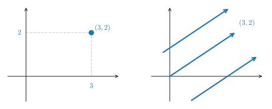
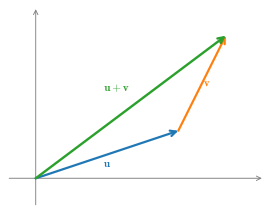
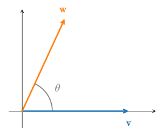
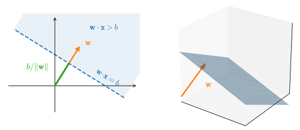
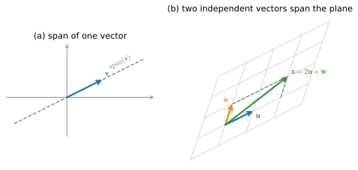
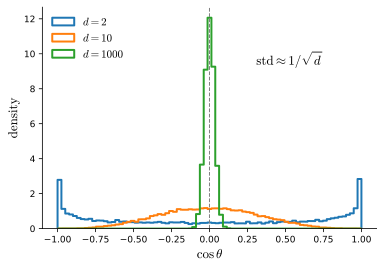
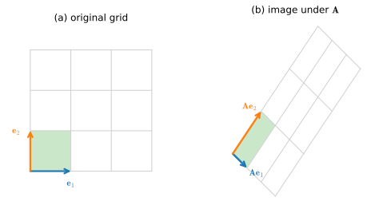
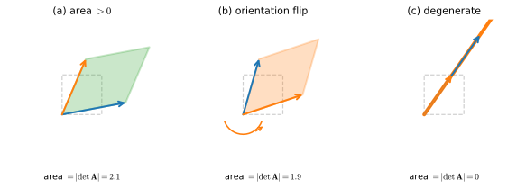

# Geometry and Linear Algebraic Operations
:label:`sec_mdl-geometry-linear-algebraic-ops`

In :numref:`sec_linear-algebra`, we encountered the basics of linear algebra
and saw how it could be used to express common operations for transforming our data.
Linear algebra is one of the key mathematical pillars
underlying much of the work that we do in deep learning
and in machine learning more broadly.
While :numref:`sec_linear-algebra` contained enough machinery
to communicate the mechanics of modern deep learning models,
there is a lot more to the subject.
In this section, we will go deeper,
building geometric intuition for vectors, angles, projections,
hyperplanes, and the way matrices reshape space.
These pictures are the foundation for the two matrix decompositions
that run through all of deep learning, which we develop in the
sections that follow: *eigendecomposition*
(:numref:`sec_mdl-eigendecompositions`), the tool for analyzing
stability, PCA, and Hessians; and the *singular value decomposition*
(:numref:`sec_mdl-svd-low-rank`), the tool behind low-rank
approximation, conditioning, and LoRA.

## Vectors and Their Geometry

### Points and Directions

First, we need to discuss the two common geometric interpretations of vectors,
as either points or directions in space.
Fundamentally, a vector is a list of numbers such as the Python list below.

```{.python .input #geometry-linear-algebraic-ops-geometry-of-vectors}
v = [1, 7, 0, 1]
```

We rely on a single set of imports throughout the section; the few code
examples below use the framework's own tensor library and the d2l plotting
helpers.

```{.python .input #geometry-linear-algebraic-ops-imports}
#@tab mxnet
%matplotlib inline
from d2l import mxnet as d2l
from mxnet import gluon, np, npx
npx.set_np()
```

```{.python .input #geometry-linear-algebraic-ops-imports}
#@tab pytorch
%matplotlib inline
from d2l import torch as d2l
import torch
import torchvision
from torchvision import transforms
```

```{.python .input #geometry-linear-algebraic-ops-imports}
#@tab tensorflow
%matplotlib inline
from d2l import tensorflow as d2l
import tensorflow as tf
```

```{.python .input #geometry-linear-algebraic-ops-imports}
#@tab jax
%matplotlib inline
from d2l import jax as d2l
import jax
from jax import numpy as jnp
import numpy as np
import tensorflow as tf
```

Mathematicians most often write this as either a *column* or *row* vector, which is to say either as

$$
\mathbf{x} = \begin{bmatrix}1\\7\\0\\1\end{bmatrix},
$$

or

$$
\mathbf{x}^\top = \begin{bmatrix}1 & 7 & 0 & 1\end{bmatrix}.
$$

These often have different interpretations,
where data examples are column vectors
and weights used to form weighted sums are row vectors.
However, it can be beneficial to be flexible.
As we have described in :numref:`sec_linear-algebra`,
though a single vector's default orientation is a column vector,
for any matrix representing a tabular dataset,
treating each data example as a row vector
in the matrix
is more conventional.

Given a vector, the first interpretation
that we should give it is as a point in space.
In two or three dimensions, we can visualize these points
by using the components of the vectors to define
the location of the points in space compared
to a fixed reference called the *origin*.
In parallel, there is a second point of view
that people often take of vectors: as directions in space.
Not only can we think of the vector $\mathbf{v} = [3,2]^\top$
as the location $3$ units to the right and $2$ units up from the origin,
we can also think of it as the direction itself
to take $3$ steps to the right and $2$ steps up.
In this way, we consider all the parallel arrows in :numref:`fig_mdl-la-vectors` the same.


:label:`fig_mdl-la-vectors`

This geometric point of view allows us to consider the problem on a more abstract level.
No longer faced with some insurmountable seeming problem
like classifying pictures as either cats or dogs,
we can start considering tasks abstractly
as collections of points in space and picturing the task
as discovering how to separate two distinct clusters of points.

One of the benefits of the direction view is that
we can make visual sense of the act of vector addition.
In particular, we follow the directions given by one vector,
and then follow the directions given by the other, as is seen in :numref:`fig_mdl-la-vector-add`.


:label:`fig_mdl-la-vector-add`

Vector subtraction has a similar interpretation.
By considering the identity that $\mathbf{u} = \mathbf{v} + (\mathbf{u}-\mathbf{v})$,
we see that the vector $\mathbf{u}-\mathbf{v}$ is the direction
that takes us from the point $\mathbf{v}$ to the point $\mathbf{u}$.


### Dot Products and Angles
As we saw in :numref:`sec_linear-algebra`,
if we take two column vectors $\mathbf{u}$ and $\mathbf{v}$,
we can form their dot product by computing:

$$\mathbf{u}^\top\mathbf{v} = \sum_i u_i\cdot v_i.$$
:eqlabel:`eq_mdl-dot_def`

Because :eqref:`eq_mdl-dot_def` is symmetric, we will mirror the notation
of classical multiplication and write

$$
\mathbf{u}\cdot\mathbf{v} = \mathbf{u}^\top\mathbf{v} = \mathbf{v}^\top\mathbf{u},
$$

to highlight the fact that exchanging the order of the vectors will yield the same answer.

The dot product :eqref:`eq_mdl-dot_def` also admits a geometric interpretation: it is closely related to the angle between two vectors.  Consider the angle shown in :numref:`fig_mdl-la-angle`.


:label:`fig_mdl-la-angle`

To start, let's consider two specific vectors:

$$
\mathbf{v} = (r,0) \; \textrm{and} \; \mathbf{w} = (s\cos(\theta), s \sin(\theta)).
$$

The vector $\mathbf{v}$ is length $r$ and runs parallel to the $x$-axis,
and the vector $\mathbf{w}$ is of length $s$ and at angle $\theta$ with the $x$-axis.
If we compute the dot product of these two vectors, we see that

$$
\mathbf{v}\cdot\mathbf{w} = rs\cos(\theta) = \|\mathbf{v}\|\|\mathbf{w}\|\cos(\theta).
$$

In short, for these two specific vectors the dot product, combined with the
norms, tells us the angle between them. Remarkably, the *same identity* holds
for **any** pair of vectors, in any number of dimensions. We can see why with
two short arguments that together both *justify* the formula and pin down
exactly when it makes sense.

The first argument is purely planar. Any two vectors $\mathbf{v}$ and
$\mathbf{w}$ — no matter how many coordinates they have — both lie in the
two-dimensional plane they span, and the angle $\theta$ between them lives in
that plane. So we lose nothing by reasoning in two dimensions. Expanding
$\|\mathbf{v} - \mathbf{w}\|^2$ with the dot product gives

$$
\|\mathbf{v} - \mathbf{w}\|^2
 = (\mathbf{v}-\mathbf{w})\cdot(\mathbf{v}-\mathbf{w})
 = \|\mathbf{v}\|^2 - 2\,\mathbf{v}\cdot\mathbf{w} + \|\mathbf{w}\|^2,
$$

while the planar law of cosines applied to the triangle with sides
$\mathbf{v}$, $\mathbf{w}$, and $\mathbf{v}-\mathbf{w}$ gives

$$
\|\mathbf{v} - \mathbf{w}\|^2
 = \|\mathbf{v}\|^2 + \|\mathbf{w}\|^2 - 2\,\|\mathbf{v}\|\|\mathbf{w}\|\cos\theta.
$$

Equating the two and cancelling $\|\mathbf{v}\|^2 + \|\mathbf{w}\|^2$ leaves the
**geometric formula for the dot product**,

$$
\mathbf{v}\cdot\mathbf{w} = \|\mathbf{v}\|\|\mathbf{w}\|\cos\theta,
$$
:eqlabel:`eq_mdl-dot_geom`

which we may solve for the angle:

$$\theta = \arccos\left(\frac{\mathbf{v}\cdot\mathbf{w}}{\|\mathbf{v}\|\|\mathbf{w}\|}\right).$$
:eqlabel:`eq_mdl-angle_formula`

Nothing in the computation referenced the ambient dimension, so
:eqref:`eq_mdl-angle_formula` holds in three or three million dimensions
without change.

There is, however, a subtlety we must not skip. The function $\arccos$ is only
defined on the interval $[-1, 1]$, so :eqref:`eq_mdl-angle_formula` is
meaningful *only if* the fraction inside it never escapes that interval. That
this is guaranteed — in every dimension — is the content of one of the most
useful inequalities in all of mathematics.

**Proposition (Cauchy–Schwarz).** *For any vectors $\mathbf{v}, \mathbf{w}$,*

$$
|\mathbf{v}\cdot\mathbf{w}| \le \|\mathbf{v}\|\,\|\mathbf{w}\|,
$$
:eqlabel:`eq_mdl-cauchy-schwarz`

*with equality if and only if $\mathbf{v}$ and $\mathbf{w}$ are collinear
(one is a scalar multiple of the other).*

**Proof.** If $\mathbf{w} = \mathbf{0}$ both sides are zero and there is
nothing to prove, so assume $\mathbf{w} \neq \mathbf{0}$. The trick is to look
at the squared length of $\mathbf{v} - t\mathbf{w}$ as a function of the real
number $t$. A squared length is never negative, so

$$
q(t) = \|\mathbf{v} - t\mathbf{w}\|^2
     = \|\mathbf{w}\|^2\, t^2 - 2(\mathbf{v}\cdot\mathbf{w})\, t + \|\mathbf{v}\|^2
     \;\ge\; 0
     \quad\textrm{for every } t.
$$

This is a quadratic in $t$ with positive leading coefficient $\|\mathbf{w}\|^2$.
A quadratic that stays non-negative cannot have two distinct real roots, so its
discriminant must be $\le 0$:

$$
\bigl(2\,\mathbf{v}\cdot\mathbf{w}\bigr)^2 - 4\,\|\mathbf{w}\|^2\,\|\mathbf{v}\|^2 \le 0,
\qquad\textrm{i.e.}\qquad
(\mathbf{v}\cdot\mathbf{w})^2 \le \|\mathbf{v}\|^2\,\|\mathbf{w}\|^2.
$$

Taking square roots gives :eqref:`eq_mdl-cauchy-schwarz`. Equality forces the
discriminant to vanish, which means $q$ has a (repeated) real root $t^\star$
with $q(t^\star) = \|\mathbf{v} - t^\star\mathbf{w}\|^2 = 0$, that is
$\mathbf{v} = t^\star \mathbf{w}$. $\blacksquare$

The whole argument used nothing but the fact that *a squared length is
non-negative*. Dividing :eqref:`eq_mdl-cauchy-schwarz` by
$\|\mathbf{v}\|\|\mathbf{w}\|$ for nonzero $\mathbf{v}, \mathbf{w}$ yields the
**well-definedness of the angle**:

$$
-1 \;\le\; \frac{\mathbf{v}\cdot\mathbf{w}}{\|\mathbf{v}\|\,\|\mathbf{w}\|} \;\le\; 1,
$$

so the $\arccos$ in :eqref:`eq_mdl-angle_formula` is always defined and
$\theta$ is a genuine angle in $[0, \pi]$, no matter the dimension. The
equality cases are exactly the familiar ones: $\cos\theta = +1$ ($\theta = 0$)
when the vectors point the same way, and $\cos\theta = -1$ ($\theta = \pi$)
when they point in opposite directions — precisely the collinear cases of the
proposition.

Cauchy–Schwarz also has a one-picture summary, shown in
:numref:`fig_mdl-la-projection` — a way to *remember* the inequality rather
than a second proof, since the picture reads off the angle $\theta$ (and with
it :eqref:`eq_mdl-dot_geom`) that Cauchy–Schwarz itself makes legitimate.
On the left, the projection of $\mathbf{v}$
onto $\mathbf{w}$ has signed length $\|\mathbf{v}\|\cos\theta$, and the residual
$\mathbf{r} = \mathbf{v} - \operatorname{proj}_{\mathbf{w}}\mathbf{v}$ meets
$\mathbf{w}$ at a right angle (we prove both facts in the next section). Because
the right triangle's hypotenuse $\mathbf{v}$ can be no shorter than its leg,
$\|\mathbf{v}\|\,|\cos\theta| \le \|\mathbf{v}\|$, which is exactly
$|\mathbf{v}\cdot\mathbf{w}| \le \|\mathbf{v}\|\|\mathbf{w}\|$. On the right is
the equality case: when $\mathbf{v}$ is collinear with $\mathbf{w}$ the residual
vanishes and the inequality becomes an equality.


:label:`fig_mdl-la-projection`

A first dividend of Cauchy–Schwarz is the **triangle inequality**, which says
that a detour through a third point is never shorter than going straight.

**Corollary (triangle inequality).** *For any $\mathbf{v}, \mathbf{w}$,*
$\|\mathbf{v} + \mathbf{w}\| \le \|\mathbf{v}\| + \|\mathbf{w}\|$.

**Proof.** Expand and apply :eqref:`eq_mdl-cauchy-schwarz`:

$$
\|\mathbf{v} + \mathbf{w}\|^2
 = \|\mathbf{v}\|^2 + 2\,\mathbf{v}\cdot\mathbf{w} + \|\mathbf{w}\|^2
 \le \|\mathbf{v}\|^2 + 2\,\|\mathbf{v}\|\|\mathbf{w}\| + \|\mathbf{w}\|^2
 = \bigl(\|\mathbf{v}\| + \|\mathbf{w}\|\bigr)^2.
$$

Taking square roots gives the claim. $\blacksquare$

As a simple example, let's see how to compute the angle between a pair of vectors:

```{.python .input #geometry-linear-algebraic-ops-dot-products-and-angles}
#@tab mxnet
def angle(v, w):
    return np.arccos(v.dot(w) / (np.linalg.norm(v) * np.linalg.norm(w)))

angle(np.array([0, 1, 2]), np.array([2, 3, 4]))
```

```{.python .input #geometry-linear-algebraic-ops-dot-products-and-angles}
#@tab pytorch
def angle(v, w):
    return torch.acos(v.dot(w) / (torch.norm(v) * torch.norm(w)))

angle(torch.tensor([0, 1, 2], dtype=torch.float32), torch.tensor([2.0, 3, 4]))
```

```{.python .input #geometry-linear-algebraic-ops-dot-products-and-angles}
#@tab tensorflow
def angle(v, w):
    return tf.acos(tf.tensordot(v, w, axes=1) / (tf.norm(v) * tf.norm(w)))

angle(tf.constant([0, 1, 2], dtype=tf.float32), tf.constant([2.0, 3, 4]))
```

```{.python .input #geometry-linear-algebraic-ops-dot-products-and-angles}
#@tab jax
def angle(v, w):
    return jnp.arccos(jnp.dot(v, w) / (jnp.linalg.norm(v) * jnp.linalg.norm(w)))

angle(jnp.array([0, 1, 2], dtype=jnp.float32), jnp.array([2.0, 3, 4]))
```

Two vectors whose angle is $\pi/2$ (equivalently $90^{\circ}$) are called
*orthogonal*. From :eqref:`eq_mdl-dot_geom`, the angle is $\pi/2$ exactly when
$\cos\theta = 0$, and since $\|\mathbf{v}\|\|\mathbf{w}\| \neq 0$ for nonzero
vectors, this happens if and only if the dot product itself vanishes. We
therefore *define* two vectors to be **orthogonal when**
$\mathbf{v}\cdot\mathbf{w} = 0$. (We take this as the definition because it
extends gracefully to the zero vector, which is orthogonal to everything even
though no angle is defined for it.) This will prove to be a workhorse condition
throughout the chapter.

### Projection and Orthogonality

Cauchy–Schwarz answers "how aligned are two vectors?"; the closely related
operation of *projection* answers "how much of $\mathbf{v}$ points along
$\mathbf{w}$?" Geometrically, we look for the point on the line
$\{t\mathbf{w} : t \in \mathbb{R}\}$ that is closest to $\mathbf{v}$.

**Proposition (orthogonal projection).** *Let $\mathbf{w} \neq \mathbf{0}$. The
closest multiple of $\mathbf{w}$ to $\mathbf{v}$ is*

$$
\operatorname{proj}_{\mathbf{w}}\mathbf{v}
 = \frac{\mathbf{v}\cdot\mathbf{w}}{\mathbf{w}\cdot\mathbf{w}}\,\mathbf{w},
$$
:eqlabel:`eq_mdl-projection`

*and the residual $\mathbf{r} = \mathbf{v} - \operatorname{proj}_{\mathbf{w}}\mathbf{v}$
is orthogonal to $\mathbf{w}$.*

**Proof.** We minimize the squared distance
$f(t) = \|\mathbf{v} - t\mathbf{w}\|^2
 = \|\mathbf{w}\|^2 t^2 - 2(\mathbf{v}\cdot\mathbf{w})\,t + \|\mathbf{v}\|^2$.
This is a convex parabola in $t$; setting $f'(t) = 2\|\mathbf{w}\|^2 t -
2(\mathbf{v}\cdot\mathbf{w}) = 0$ gives the unique minimizer
$t^\star = \dfrac{\mathbf{v}\cdot\mathbf{w}}{\mathbf{w}\cdot\mathbf{w}}$, which
is :eqref:`eq_mdl-projection`. For orthogonality of the residual, compute

$$
\mathbf{r}\cdot\mathbf{w}
 = \mathbf{v}\cdot\mathbf{w}
   - \frac{\mathbf{v}\cdot\mathbf{w}}{\mathbf{w}\cdot\mathbf{w}}\,(\mathbf{w}\cdot\mathbf{w})
 = 0. \qquad \blacksquare
$$

Because $\mathbf{r}$ is orthogonal to $\operatorname{proj}_{\mathbf{w}}\mathbf{v}$
(which is a multiple of $\mathbf{w}$), the decomposition
$\mathbf{v} = \operatorname{proj}_{\mathbf{w}}\mathbf{v} + \mathbf{r}$ splits
$\mathbf{v}$ into two perpendicular pieces, and **Pythagoras** applies:

$$
\|\mathbf{v}\|^2 = \|\operatorname{proj}_{\mathbf{w}}\mathbf{v}\|^2 + \|\mathbf{r}\|^2 .
$$
:eqlabel:`eq_mdl-pythagoras`

Two remarks tie this back to the rest of the section. First, the *signed
length* of the projection is

$$
\frac{\mathbf{v}\cdot\mathbf{w}}{\|\mathbf{w}\|} = \|\mathbf{v}\|\cos\theta ,
$$

which is exactly the quantity the hyperplane discussion below will use, so the
hyperplane material is now fully self-contained. Second, we just solved a
genuine (if tiny) *least-squares* problem: we found the best approximation of
$\mathbf{v}$ from the one-dimensional subspace spanned by $\mathbf{w}$. The
same idea — project onto a subspace, the residual comes out orthogonal —
scales up to fitting an arbitrary linear model, which is how the singular value
decomposition produces optimal least-squares solutions in
:numref:`sec_mdl-svd-low-rank`.

### Span, Bases, and Subspaces

The projection result spoke of "the one-dimensional subspace spanned by
$\mathbf{w}$," and the planar argument for the dot-product formula reasoned
inside the plane that two vectors span. These words — *span*, *subspace*,
*basis* — are the organizing vocabulary of linear algebra, and the
decompositions later in this chapter lean on them constantly, so let us pin
them down while the geometry is fresh.

Given vectors $\mathbf{v}_1, \ldots, \mathbf{v}_k$, their **span** is the set
of everything reachable by scaling and adding them:

$$
\operatorname{span}(\mathbf{v}_1, \ldots, \mathbf{v}_k)
 = \bigl\{ a_1\mathbf{v}_1 + \cdots + a_k\mathbf{v}_k
   : a_1, \ldots, a_k \in \mathbb{R} \bigr\}.
$$

A weighted sum $a_1\mathbf{v}_1 + \cdots + a_k\mathbf{v}_k$ is called a
*linear combination*, so the span is the set of all linear combinations. In
$\mathbb{R}^2$ the possibilities are easy to picture
(:numref:`fig_mdl-la-span`): the span of a single nonzero vector is the line
through the origin in its direction, while the span of two vectors that do not
lie on a common line is the entire plane. A span is closed under further
addition and scaling, and any set of vectors with that closure property is
called a **subspace**. The complete list of subspaces of $\mathbb{R}^2$ is
short: the origin alone, the lines through the origin, and $\mathbb{R}^2$
itself; in $\mathbb{R}^3$, the planes through the origin join the list. Note
that every subspace contains the origin — scale any of its elements by zero —
so a line that misses the origin is not a subspace.


:label:`fig_mdl-la-span`

A spanning set can be wasteful. If one of the vectors already lies in the span
of the others, deleting it shrinks the list without shrinking the span. A
collection with no such redundancy — equivalently, one where the only linear
combination producing $a_1\mathbf{v}_1 + \cdots + a_k\mathbf{v}_k = \mathbf{0}$
is the trivial one with every $a_i = 0$ — is called **linearly independent**.
(We return to the redundant case, *linear dependence*, when we study matrices
and rank below.) A **basis** of a subspace is a linearly independent set that
spans it: enough vectors to reach everything, none to spare. The coordinate
vectors $\mathbf{e}_1 = [1, 0]^\top$ and $\mathbf{e}_2 = [0, 1]^\top$ form the
*standard basis* of $\mathbb{R}^2$, but the slanted pair in
:numref:`fig_mdl-la-span` is an equally valid basis. A fundamental theorem,
which we will use without proof, says that every basis of a given subspace has
the same number of elements; this common count is the subspace's
**dimension**. That gives, at last, a precise meaning to the $d$ in
"$d$-dimensional space": $\mathbb{R}^d$ has dimension $d$ because
$\mathbf{e}_1, \ldots, \mathbf{e}_d$ is a basis for it.

What independence buys is *coordinates*.

**Proposition (coordinates are unique).** *Let $\mathbf{v}_1, \ldots,
\mathbf{v}_k$ be a basis of a subspace $S$. Then every $\mathbf{x} \in S$ can
be written as $\mathbf{x} = a_1\mathbf{v}_1 + \cdots + a_k\mathbf{v}_k$ for
exactly one choice of coefficients $a_1, \ldots, a_k$.*

**Proof.** At least one representation exists because the basis spans $S$. If
there were two, say
$\mathbf{x} = \sum_i a_i \mathbf{v}_i = \sum_i b_i \mathbf{v}_i$, then
subtracting gives $\sum_i (a_i - b_i)\,\mathbf{v}_i = \mathbf{0}$, and linear
independence forces $a_i = b_i$ for every $i$. $\blacksquare$

A basis therefore turns an abstract subspace into a concrete copy of
$\mathbb{R}^k$: once the basis is agreed upon, the coefficient list
$(a_1, \ldots, a_k)$ *is* the point. Much of applied linear algebra is the art
of choosing a basis in which a problem's coordinates become simple — the
eigenvector and singular-vector bases of the next two sections are the premier
examples.

Finally, two subspaces attach to every matrix $\mathbf{A}$, and they organize
everything matrices do in the remainder of this chapter. The **column space**
of $\mathbf{A}$ is the span of its columns; since the product
$\mathbf{A}\mathbf{v}$ is exactly the linear combination of the columns of
$\mathbf{A}$ weighted by the entries of $\mathbf{v}$ (a fact we put to work
when we take up matrices as maps below), the column space is the set of all
possible *outputs* of $\mathbf{A}$. The **null space** of $\mathbf{A}$ is the
set of inputs sent to zero, $\{\mathbf{x} : \mathbf{A}\mathbf{x} =
\mathbf{0}\}$; it is a subspace because if $\mathbf{A}\mathbf{x} =
\mathbf{A}\mathbf{y} = \mathbf{0}$ then $\mathbf{A}(a\mathbf{x} + b\mathbf{y})
= a\,\mathbf{A}\mathbf{x} + b\,\mathbf{A}\mathbf{y} = \mathbf{0}$. In words:
the column space records what a matrix can produce, and the null space records
what it destroys. We will measure the first when we define the *rank* below,
and meet both again among the SVD's *four fundamental subspaces* in
:numref:`sec_mdl-svd-low-rank`.

## Similarity in High Dimensions

It is reasonable to ask why the *angle* — rather than the raw distance — is so
often the right notion of similarity. The answer is invariance to scale.
Consider an image and a copy of it dimmed to $10\%$ brightness. Pixel by pixel
the two are far apart, so their Euclidean distance is large; yet the content is
identical, and a cat/dog classifier should treat them the same. The angle does:
for any vector $\mathbf{v}$, the angle between $\mathbf{v}$ and $0.1\,\mathbf{v}$
is zero, because scaling changes a vector's length but not its direction. This
is why, when the angle is used to compare two vectors, practitioners work with
its cosine and call it **cosine similarity**,

$$
\cos(\theta) = \frac{\mathbf{v}\cdot\mathbf{w}}{\|\mathbf{v}\|\,\|\mathbf{w}\|}
 \;\in\; [-1, 1],
$$
:eqlabel:`eq_mdl-cosine-sim`

equal to $+1$ when the vectors point the same way, $-1$ when opposite, and $0$
when orthogonal. Cosine similarity is the metric behind nearest-neighbor
retrieval over **embeddings**, the scaled dot products inside **attention**
(:numref:`sec_attention-scoring-functions`), and the alignment objective of
**contrastive learning**: in each case we have represented objects as vectors
and we measure relatedness by direction, deliberately discarding magnitude.

This raises a question that turns out to have a striking answer. If we drop two
*unrelated* vectors into a high-dimensional space, what cosine should we expect
between them? The answer is that **in high dimensions, random vectors are almost
always nearly orthogonal** — and the higher the dimension, the more sharply this
holds.

**Proposition (near-orthogonality).** *Fix a unit vector $\mathbf{u} \in
\mathbb{R}^d$ and let $\mathbf{v}$ be drawn uniformly from the unit sphere in
$\mathbb{R}^d$. Then $\cos\theta = \mathbf{u}\cdot\mathbf{v}$ satisfies*

$$
\mathbb{E}[\cos\theta] = 0,
\qquad
\operatorname{Var}(\cos\theta) = \frac{1}{d}.
$$

**Proof.** The uniform distribution on the sphere is invariant under rotations,
so we may rotate coordinates until $\mathbf{u} = \mathbf{e}_1$; then
$\cos\theta = \mathbf{u}\cdot\mathbf{v} = v_1$. By the symmetry $\mathbf{v}
\mapsto -\mathbf{v}$ we have $\mathbb{E}[v_1] = 0$. For the variance, every
coordinate plays the same role by symmetry, so $\mathbb{E}[v_i^2]$ is the same
for all $i$; summing and using $\sum_i v_i^2 = \|\mathbf{v}\|^2 = 1$ gives
$d\,\mathbb{E}[v_1^2] = \mathbb{E}\!\left[\sum_i v_i^2\right] = 1$, hence
$\operatorname{Var}(\cos\theta) = \mathbb{E}[v_1^2] = 1/d$. Chebyshev's
inequality then bounds the chance of a large cosine,

$$
\Pr\bigl(|\cos\theta| \ge \varepsilon\bigr) \le \frac{1}{d\,\varepsilon^2},
$$

which tends to $0$ as $d \to \infty$ for any fixed $\varepsilon > 0$.
$\blacksquare$

So the typical cosine between random directions has standard deviation
$1/\sqrt{d}$, concentrating ever more tightly at $0$. This is a first taste of
*concentration of measure*, the phenomenon that makes high-dimensional geometry
behave very differently from our $2$- and $3$-dimensional intuition. It is also
exactly *why cosine similarity is such a useful signal*: since unrelated items
are nearly orthogonal by default, a cosine that is appreciably above $0$ is
unlikely to be an accident and instead reflects real shared structure — the
working assumption behind embedding-based retrieval and the attention mechanism.

We can watch the concentration happen by sampling random unit vectors and
histogramming their pairwise cosines as the dimension grows, shown in
:numref:`fig_mdl-la-cosine-highd`. Very low dimensions are genuinely
different: in the plane ($d = 2$) the histogram piles up at $\pm 1$ — the
density is arcsine-shaped, so two random directions are *more* likely to be
nearly aligned or nearly opposed than nearly orthogonal. Raising the dimension
reverses the picture: by $d = 10$ the histogram is a bell centered at $0$ with
standard deviation $1/\sqrt{10} \approx 0.32$, and by $d = 1000$ it has
collapsed into a spike of width $\approx 0.03$.


:label:`fig_mdl-la-cosine-highd`

The higher the dimension, the more sharply the cosine concentrates at $0$:
unrelated directions are almost always nearly orthogonal.

## Hyperplanes and Decision Boundaries

In addition to working with vectors, another key object
that you must understand to go far in linear algebra
is the *hyperplane*, a generalization to higher dimensions
of a line (two dimensions) or of a plane (three dimensions).
In a $d$-dimensional vector space, a hyperplane has $d-1$ dimensions
and divides the space into two half-spaces.

Let's start with an example.
Suppose that we have a column vector $\mathbf{w}=[2,1]^\top$ and a scalar
*bias* $b$. We want to know, "what are the points $\mathbf{v}$ with
$\mathbf{w}\cdot\mathbf{v} = b$?" For concreteness we first take $b = 1$.
By recalling the connection between dot products and angles above :eqref:`eq_mdl-angle_formula`,
we can see that this is equivalent to
$$
\|\mathbf{v}\|\|\mathbf{w}\|\cos(\theta) = 1 \; \iff \; \|\mathbf{v}\|\cos(\theta) = \frac{1}{\|\mathbf{w}\|} = \frac{1}{\sqrt{5}}.
$$

If we consider the geometric meaning of this expression,
we see that this is equivalent to saying
that the signed length of the projection of $\mathbf{v}$
onto the direction of $\mathbf{w}$ is exactly $1/\|\mathbf{w}\|$ --- recall the
signed projection length $\|\mathbf{v}\|\cos(\theta)$ from
:numref:`fig_mdl-la-projection`.
The set of all points where this is true is a line
at right angles to the vector $\mathbf{w}$.
If we wanted, we could find the equation for this line
and see that it is $2x + y = 1$ or equivalently $y = 1 - 2x$.

More generally, the equation $\mathbf{w}\cdot\mathbf{v} = b$ for any scalar
$b$ describes a line (in higher dimensions, a hyperplane) at right angles to
$\mathbf{w}$. The vector $\mathbf{w}$ is called the *normal* to the hyperplane,
and the bias $b$ controls *where along that normal* the hyperplane sits.
By the same projection argument, every point on it has the same signed
projection $\mathbf{w}\cdot\mathbf{v}/\|\mathbf{w}\| = b/\|\mathbf{w}\|$ onto the
direction of $\mathbf{w}$, so the hyperplane passes at (signed) distance
$b/\|\mathbf{w}\|$ from the origin. Changing $b$ slides the hyperplane along
$\mathbf{w}$ without rotating it; the case $b=0$ is the hyperplane through the
origin. More usefully, for *any* point $\mathbf{x}$ the quantity
$$
\frac{\mathbf{w}\cdot\mathbf{x} - b}{\|\mathbf{w}\|}
$$
is the *signed distance* from $\mathbf{x}$ to the hyperplane: positive on the
side $\mathbf{w}$ points toward, negative on the other, and zero exactly on it.
This signed distance is precisely the *margin* used by linear classifiers. The
derivation is just the projection result of the previous section applied to the
displacement of $\mathbf{x}$ from any point on the hyperplane, which is why the
projection material had to come first. :numref:`fig_mdl-la-hyperplane`
collects all of these facts in a single picture.


:label:`fig_mdl-la-hyperplane`

If we now look at what happens when we ask about the set of points with
$\mathbf{w}\cdot\mathbf{v} > b$ or $\mathbf{w}\cdot\mathbf{v} < b$,
we can see that these are cases where the projections
are longer or shorter than $b/\|\mathbf{w}\|$, respectively
(equivalently, the signed distance above is positive or negative).
Thus, those two inequalities define either side of the line, cutting our space
into two halves: all the points on one side have dot product below a threshold,
and the other side above.

The story in higher dimensions is much the same.
If we now take $\mathbf{w} = [1,2,3]^\top$
and ask about the points in three dimensions with $\mathbf{w}\cdot\mathbf{v} = b$,
we obtain a plane at right angles to the given vector $\mathbf{w}$,
offset from the origin by the signed distance $b/\|\mathbf{w}\|$.
The two inequalities again define the two sides of the plane.

While our ability to visualize runs out at this point,
nothing stops us from doing this in tens, hundreds, or billions of dimensions.
This occurs often when thinking about machine learned models.
For instance, we can understand linear classification models
like those from :numref:`sec_softmax`,
as methods to find hyperplanes that separate the different target classes.
In this context, such hyperplanes are often referred to as *decision planes*:
the learned weight vector is the normal $\mathbf{w}$ and the learned bias is
exactly the offset $b$, with the predicted class read off from the sign of
$\mathbf{w}\cdot\mathbf{x} - b$.
The majority of deep learned classification models end
with a linear layer fed into a softmax,
so one can interpret the role of the deep neural network
to be to find a non-linear embedding such that the target classes
can be separated cleanly by hyperplanes.

To give a hand-built example, notice that we can produce a reasonable model
to classify tiny images of t-shirts and trousers from the Fashion-MNIST dataset
(seen in :numref:`sec_fashion_mnist`)
by just taking the vector between their means to define the decision plane
and eyeball a crude threshold.  First we will load the data and compute the averages.

```{.python .input #geometry-linear-algebraic-ops-hyperplanes-1}
#@tab mxnet
# Load in the dataset
train = gluon.data.vision.FashionMNIST(train=True)
test = gluon.data.vision.FashionMNIST(train=False)

# In MXNet 2.0 reductions over `float` (== float64) inputs stay float64, but
# many fused kernels still emit float32 — pin everything to float32 up front so
# downstream dot products see matching dtypes.
X_train_0 = np.stack([x[0] for x in train if x[1] == 0]).astype('float32')
X_train_1 = np.stack([x[0] for x in train if x[1] == 1]).astype('float32')
X_test = np.stack(
    [x[0] for x in test if x[1] == 0 or x[1] == 1]).astype('float32')
y_test = np.stack(
    [x[1] for x in test if x[1] == 0 or x[1] == 1]).astype('float32')

# Compute averages
ave_0 = np.mean(X_train_0, axis=0)
ave_1 = np.mean(X_train_1, axis=0)
```

```{.python .input #geometry-linear-algebraic-ops-hyperplanes-1}
#@tab pytorch
# Load in the dataset
trans = []
trans.append(transforms.ToTensor())
trans = transforms.Compose(trans)
train = torchvision.datasets.FashionMNIST(root="../data", transform=trans,
                                          train=True, download=True)
test = torchvision.datasets.FashionMNIST(root="../data", transform=trans,
                                         train=False, download=True)

X_train_0 = torch.stack(
    [x[0] * 256 for x in train if x[1] == 0]).type(torch.float32)
X_train_1 = torch.stack(
    [x[0] * 256 for x in train if x[1] == 1]).type(torch.float32)
X_test = torch.stack(
    [x[0] * 256 for x in test if x[1] == 0 or x[1] == 1]).type(torch.float32)
y_test = torch.stack([torch.tensor(x[1]) for x in test
                      if x[1] == 0 or x[1] == 1]).type(torch.float32)

# Compute averages
ave_0 = torch.mean(X_train_0, axis=0)
ave_1 = torch.mean(X_train_1, axis=0)
```

```{.python .input #geometry-linear-algebraic-ops-hyperplanes-1}
#@tab tensorflow
# Load in the dataset
((train_images, train_labels), (
    test_images, test_labels)) = tf.keras.datasets.fashion_mnist.load_data()


X_train_0 = tf.cast(tf.stack(train_images[[i for i, label in enumerate(
    train_labels) if label == 0]]), dtype=tf.float32) * 256
X_train_1 = tf.cast(tf.stack(train_images[[i for i, label in enumerate(
    train_labels) if label == 1]]), dtype=tf.float32) * 256
X_test = tf.cast(tf.stack(test_images[[i for i, label in enumerate(
    test_labels) if label == 0 or label == 1]]),
    dtype=tf.float32) * 256
y_test = tf.cast(tf.stack([label for label in test_labels
    if label == 0 or label == 1]), dtype=tf.float32)

# Compute averages
ave_0 = tf.reduce_mean(X_train_0, axis=0)
ave_1 = tf.reduce_mean(X_train_1, axis=0)
```

```{.python .input #geometry-linear-algebraic-ops-hyperplanes-1}
#@tab jax
# Load in the dataset
((train_images, train_labels), (
    test_images, test_labels)) = tf.keras.datasets.fashion_mnist.load_data()

X_train_0 = jnp.array(train_images[train_labels == 0], dtype=jnp.float32) * 256
X_train_1 = jnp.array(train_images[train_labels == 1], dtype=jnp.float32) * 256
X_test = jnp.array(
    test_images[(test_labels == 0) | (test_labels == 1)], dtype=jnp.float32) * 256
y_test = jnp.array(
    test_labels[(test_labels == 0) | (test_labels == 1)], dtype=jnp.float32)

# Compute averages
ave_0 = jnp.mean(X_train_0, axis=0)
ave_1 = jnp.mean(X_train_1, axis=0)
```

It can be informative to examine these averages, so let's plot them side by
side: each mean is a blurry but immediately recognizable image of its class.

```{.python .input #geometry-linear-algebraic-ops-hyperplanes-2}
#@tab mxnet, pytorch
# Plot the two class means side by side
d2l.set_figsize((6, 3))
_, axes = d2l.plt.subplots(1, 2)
axes[0].imshow(ave_0.reshape(28, 28).tolist(), cmap='Greys')
axes[0].set_title('mean t-shirt')
axes[1].imshow(ave_1.reshape(28, 28).tolist(), cmap='Greys')
axes[1].set_title('mean trousers')
d2l.plt.show()
```

```{.python .input #geometry-linear-algebraic-ops-hyperplanes-2}
#@tab tensorflow
# Plot the two class means side by side
d2l.set_figsize((6, 3))
_, axes = d2l.plt.subplots(1, 2)
axes[0].imshow(tf.reshape(ave_0, (28, 28)), cmap='Greys')
axes[0].set_title('mean t-shirt')
axes[1].imshow(tf.reshape(ave_1, (28, 28)), cmap='Greys')
axes[1].set_title('mean trousers')
d2l.plt.show()
```

```{.python .input #geometry-linear-algebraic-ops-hyperplanes-2}
#@tab jax
# Plot the two class means side by side
d2l.set_figsize((6, 3))
_, axes = d2l.plt.subplots(1, 2)
axes[0].imshow(np.array(ave_0.reshape(28, 28)), cmap='Greys')
axes[0].set_title('mean t-shirt')
axes[1].imshow(np.array(ave_1.reshape(28, 28)), cmap='Greys')
axes[1].set_title('mean trousers')
d2l.plt.show()
```

In a fully machine learned solution, we would learn the threshold from the
dataset. Here we set it geometrically instead: the normal is the difference of
the two class means $\mathbf{w} = \overline{\mathbf{x}}_1 - \overline{\mathbf{x}}_0$,
and the natural decision boundary is the hyperplane that *bisects* the two means
— that is, $\mathbf{w}\cdot\mathbf{x} = b$ with
$b = \mathbf{w}\cdot\tfrac12(\overline{\mathbf{x}}_0 + \overline{\mathbf{x}}_1)$,
the midpoint of the two means' projections onto $\mathbf{w}$. We classify a test
image as class $1$ when it lands on the class-$1$ side, i.e.
$\mathbf{w}\cdot\mathbf{x} > b$. Note that deriving $b$ from the data this way is
*scale-equivariant*: it gives the same boundary whatever convention each
framework uses for pixel intensities, which a hand-picked numeric threshold
would not.

```{.python .input #geometry-linear-algebraic-ops-hyperplanes-4}
#@tab mxnet
# Normal = difference of class means; threshold = midpoint of their projections
w = (ave_1 - ave_0).flatten()
b = np.dot(w, (ave_0 + ave_1).flatten()) / 2
predictions = X_test.reshape(2000, -1).dot(w) > b

# Accuracy
np.mean(predictions.astype(y_test.dtype) == y_test, dtype=np.float64)
```

```{.python .input #geometry-linear-algebraic-ops-hyperplanes-4}
#@tab pytorch
# Normal = difference of class means; threshold = midpoint of their projections
w = (ave_1 - ave_0).flatten()
b = torch.dot(w, (ave_0 + ave_1).flatten()) / 2
# '@' is the matrix-multiplication operator in PyTorch.
predictions = X_test.reshape(2000, -1) @ w > b

# Accuracy
torch.mean((predictions.type(y_test.dtype) == y_test).float(), dtype=torch.float64)
```

```{.python .input #geometry-linear-algebraic-ops-hyperplanes-4}
#@tab tensorflow
# Normal = difference of class means; threshold = midpoint of their projections
w = tf.reshape(ave_1 - ave_0, [-1])
b = tf.tensordot(w, tf.reshape(ave_0 + ave_1, [-1]), axes=1) / 2
# Genuine per-example dot product: flatten each image and matvec against w.
predictions = tf.linalg.matvec(tf.reshape(X_test, (2000, -1)), w) > b

# Accuracy
tf.reduce_mean(
    tf.cast(tf.cast(predictions, y_test.dtype) == y_test, tf.float32))
```

```{.python .input #geometry-linear-algebraic-ops-hyperplanes-4}
#@tab jax
# Normal = difference of class means; threshold = midpoint of their projections
w = (ave_1 - ave_0).flatten()
b = jnp.dot(w, (ave_0 + ave_1).flatten()) / 2
predictions = X_test.reshape(2000, -1) @ w > b

# Accuracy
jnp.mean((predictions.astype(y_test.dtype) == y_test).astype(jnp.float32))
```

The result is worth pausing over: this rule classifies about $92\%$ of the
$2{,}000$ test images correctly, and *nothing was trained*. We computed two
class means, took their difference as the normal $\mathbf{w}$, and asked of
each test image only which side of one hyperplane its $784$-dimensional pixel
vector lies on. To see the geometry of why such a crude rule works, project
every test image onto the normal — that is, reduce each image to the single
number $\mathbf{w}\cdot\mathbf{x}$, its (scaled) signed position along the
direction from "mean t-shirt" to "mean trousers" — and histogram the two
classes separately.

```{.python .input #geometry-linear-algebraic-ops-projection-histogram}
#@tab mxnet
# Histogram of the test images' projections onto the normal direction w
proj = X_test.reshape(2000, -1).dot(w)
d2l.set_figsize()
d2l.plt.hist(proj[y_test == 0].asnumpy(), bins=50, alpha=0.6,
             label='t-shirts')
d2l.plt.hist(proj[y_test == 1].asnumpy(), bins=50, alpha=0.6,
             label='trousers')
d2l.plt.axvline(float(b), color='black', linestyle='--', label='threshold')
d2l.plt.xlabel(r'$\mathbf{w}\cdot\mathbf{x}$')
d2l.plt.legend()
d2l.plt.show()
```

```{.python .input #geometry-linear-algebraic-ops-projection-histogram}
#@tab pytorch
# Histogram of the test images' projections onto the normal direction w
proj = X_test.reshape(2000, -1) @ w
d2l.set_figsize()
d2l.plt.hist(proj[y_test == 0].numpy(), bins=50, alpha=0.6,
             label='t-shirts')
d2l.plt.hist(proj[y_test == 1].numpy(), bins=50, alpha=0.6,
             label='trousers')
d2l.plt.axvline(float(b), color='black', linestyle='--', label='threshold')
d2l.plt.xlabel(r'$\mathbf{w}\cdot\mathbf{x}$')
d2l.plt.legend()
d2l.plt.show()
```

```{.python .input #geometry-linear-algebraic-ops-projection-histogram}
#@tab tensorflow
# Histogram of the test images' projections onto the normal direction w
proj = tf.linalg.matvec(tf.reshape(X_test, (2000, -1)), w)
d2l.set_figsize()
d2l.plt.hist(tf.boolean_mask(proj, y_test == 0).numpy(), bins=50, alpha=0.6,
             label='t-shirts')
d2l.plt.hist(tf.boolean_mask(proj, y_test == 1).numpy(), bins=50, alpha=0.6,
             label='trousers')
d2l.plt.axvline(float(b), color='black', linestyle='--', label='threshold')
d2l.plt.xlabel(r'$\mathbf{w}\cdot\mathbf{x}$')
d2l.plt.legend()
d2l.plt.show()
```

```{.python .input #geometry-linear-algebraic-ops-projection-histogram}
#@tab jax
# Histogram of the test images' projections onto the normal direction w
proj = X_test.reshape(2000, -1) @ w
d2l.set_figsize()
d2l.plt.hist(np.array(proj[y_test == 0]), bins=50, alpha=0.6,
             label='t-shirts')
d2l.plt.hist(np.array(proj[y_test == 1]), bins=50, alpha=0.6,
             label='trousers')
d2l.plt.axvline(float(b), color='black', linestyle='--', label='threshold')
d2l.plt.xlabel(r'$\mathbf{w}\cdot\mathbf{x}$')
d2l.plt.legend()
d2l.plt.show()
```

This is the whole hyperplane story in one plot. Along the single direction
$\mathbf{w}$, the two classes form two well-separated humps, and the dashed
threshold — the value of $\mathbf{w}\cdot\mathbf{x}$ at the midpoint of the
two means — cuts between them; the tails that spill across it are exactly the
$\approx 8\%$ of images the rule misclassifies. A *learned* linear classifier, such as the softmax
regression of :numref:`sec_softmax`, improves on this only by moving and
tilting the same kind of boundary to cut the overlap more cleverly. A deep
network goes one step further: it learns a new representation under which the
two humps separate so widely that a hyperplane between them becomes trivial to
place.

## Matrices as Linear Maps

### Linear Transformations

Through :numref:`sec_linear-algebra` and the above discussions,
we have a solid understanding of the geometry of vectors, lengths, and angles.
However, there is one important object we have omitted discussing,
and that is a geometric understanding of linear transformations represented by matrices.  Fully internalizing what matrices can do to transform data
between two potentially different high dimensional spaces takes significant practice,
and is beyond the scope of this appendix.
However, we can start building up intuition in two dimensions.

Suppose that we have some matrix:

$$
\mathbf{A} = \begin{bmatrix}
a & b \\ c & d
\end{bmatrix}.
$$

If we want to apply this to an arbitrary vector
$\mathbf{v} = [x, y]^\top$,
we multiply and see that

$$
\begin{aligned}
\mathbf{A}\mathbf{v} & = \begin{bmatrix}a & b \\ c & d\end{bmatrix}\begin{bmatrix}x \\ y\end{bmatrix} \\
& = \begin{bmatrix}ax+by\\ cx+dy\end{bmatrix} \\
& = x\begin{bmatrix}a \\ c\end{bmatrix} + y\begin{bmatrix}b \\d\end{bmatrix} \\
& = x\left\{\mathbf{A}\begin{bmatrix}1\\0\end{bmatrix}\right\} + y\left\{\mathbf{A}\begin{bmatrix}0\\1\end{bmatrix}\right\}.
\end{aligned}
$$

This may seem like an odd computation,
where something clear became somewhat impenetrable.
However, it tells us that we can write the way
that a matrix transforms *any* vector
in terms of how it transforms *two specific vectors*:
$[1,0]^\top$ and $[0,1]^\top$.
This is worth considering for a moment.
We have essentially reduced an infinite problem
(what happens to any pair of real numbers)
to a finite one (what happens to these specific vectors).
The vectors $[1,0]^\top$ and $[0,1]^\top$ are exactly the standard basis
$\mathbf{e}_1, \mathbf{e}_2$ from our discussion of spans and bases: because
every vector is a (unique) weighted sum of basis vectors, knowing where a
matrix sends a basis determines where it sends everything.

Let's draw what happens when we use the specific matrix

$$
\mathbf{A} = \begin{bmatrix}
1 & 2 \\
-1 & 3
\end{bmatrix}.
$$

If we look at the specific vector $\mathbf{v} = [2, -1]^\top$,
we see this is $2\cdot[1,0]^\top - [0,1]^\top$,
and thus we know that the matrix $\mathbf{A}$ will send this to
$2\,\mathbf{A}[1,0]^\top - \mathbf{A}[0,1]^\top = 2[1, -1]^\top - [2,3]^\top = [0, -5]^\top$.
If we follow this logic through carefully,
say by considering the grid of all integer pairs of points,
we see that what happens is that the matrix multiplication
can skew, rotate, and scale the grid,
but the grid structure must remain as you see in :numref:`fig_mdl-la-linear-map`.


:label:`fig_mdl-la-linear-map`

This is the most important intuitive point
to internalize about linear transformations represented by matrices.
Matrices are incapable of distorting some parts of space differently than others.
All they can do is take the original coordinates on our space
and skew, rotate, and scale them.

Some distortions can be severe.  For instance the matrix

$$
\mathbf{B} = \begin{bmatrix}
2 & -1 \\ 4 & -2
\end{bmatrix},
$$

compresses the entire two-dimensional plane down to a single line.
Identifying and working with such transformations are the topic of a later section,
but geometrically we can see that this is fundamentally different
from the types of transformations we saw above.
For instance, the result from matrix $\mathbf{A}$ can be "bent back" to the original grid.  The results from matrix $\mathbf{B}$ cannot
because we will never know where the vector $[1,2]^\top$ came from---was
it $[1,1]^\top$ or $[0, -1]^\top$?

While this picture was for a $2\times2$ matrix,
nothing prevents us from taking the lessons learned into higher dimensions.
If we take similar basis vectors like $[1,0, \ldots,0]$
and see where our matrix sends them,
we can start to get a feeling for how the matrix multiplication
distorts the entire space in whatever dimension space we are dealing with.

Nothing requires the matrix to be square, either. An $m \times n$ matrix takes
vectors with $n$ entries to vectors with $m$ entries — it is a linear map
*between* spaces, from $\mathbb{R}^n$ to $\mathbb{R}^m$, and it is still
determined by where it sends the $n$ basis vectors (whose images are its
columns). A $2 \times 3$ matrix flattens three-dimensional space onto a plane;
a $3 \times 2$ matrix lays the plane into three-dimensional space as a
(generally tilted) plane through the origin. Every fully connected layer of a
neural network is exactly such a map between spaces of different dimensions,
composed with a nonlinearity.

### Orthogonal Matrices

A matrix may skew, rotate, and scale, but a special and important family does
*only* the rigid part — it rotates or reflects without any stretching. A square
matrix $\mathbf{Q}$ is called **orthogonal** when its columns are orthonormal,
which we can write compactly as $\mathbf{Q}^\top\mathbf{Q} = \mathbf{I}$. The
defining property of such maps is that they **preserve lengths and angles**,
because they preserve every dot product:

$$
(\mathbf{Q}\mathbf{x})\cdot(\mathbf{Q}\mathbf{y})
 = (\mathbf{Q}\mathbf{x})^\top(\mathbf{Q}\mathbf{y})
 = \mathbf{x}^\top\mathbf{Q}^\top\mathbf{Q}\,\mathbf{y}
 = \mathbf{x}^\top\mathbf{y}
 = \mathbf{x}\cdot\mathbf{y}.
$$

Taking $\mathbf{y} = \mathbf{x}$ shows $\|\mathbf{Q}\mathbf{x}\| =
\|\mathbf{x}\|$, so an orthogonal map is a rigid motion of space. Since
$\mathbf{Q}^\top\mathbf{Q} = \mathbf{I}$ means $\mathbf{Q}^{-1} =
\mathbf{Q}^\top$, such maps are trivially invertible, and as we will prove
when we meet the determinant at the end of this section, their volume scaling
is $\det\mathbf{Q} = \pm 1$ (the sign distinguishing rotations from
reflections). Orthogonal matrices are the "distortion-free" linear maps, and
they will turn out to be the building blocks
of the two decompositions in the sections that follow: the spectral theorem
writes a symmetric matrix as $\mathbf{Q}\boldsymbol\Lambda\mathbf{Q}^\top$
(:numref:`sec_mdl-eigendecompositions`), and the singular value decomposition
writes *any* matrix as orthogonal–diagonal–orthogonal
(:numref:`sec_mdl-svd-low-rank`).

Where do orthonormal columns come from in the first place? Any linearly
independent collection can be converted into an orthonormal basis of its span
by the *Gram–Schmidt process*: walk through the vectors in order, subtract
from each one its projection :eqref:`eq_mdl-projection` onto each direction
already produced, and normalize what remains. In matrix form this algorithm is
the *QR factorization*. We will not need its details in this chapter — it is
enough to know that orthonormal bases are cheap to manufacture, which is one
reason the decompositions built from them are so practical.

### Linear Dependence, Rank, and Invertibility

Consider again the matrix

$$
\mathbf{B} = \begin{bmatrix}
2 & -1 \\ 4 & -2
\end{bmatrix}.
$$

This compresses the entire plane down to live on the single line $y = 2x$.
The question now arises: is there some way we can detect this
just looking at the matrix itself?
The answer is that indeed we can.
Let's take $\mathbf{b}_1 = [2,4]^\top$ and $\mathbf{b}_2 = [-1, -2]^\top$
be the two columns of $\mathbf{B}$.
Remember that we can write everything transformed by the matrix $\mathbf{B}$
as a linear combination of the columns of the matrix,
like $a_1\mathbf{b}_1 + a_2\mathbf{b}_2$ —
in the language of spans, the outputs of $\mathbf{B}$ fill out exactly its
column space.
The fact that $\mathbf{b}_1 = -2\cdot\mathbf{b}_2$
means that we can write any linear combination of those two columns
entirely in terms of say $\mathbf{b}_2$ since

$$
a_1\mathbf{b}_1 + a_2\mathbf{b}_2 = -2a_1\mathbf{b}_2 + a_2\mathbf{b}_2 = (a_2-2a_1)\mathbf{b}_2.
$$

This means that one of the columns is, in a sense, redundant
because it does not define a unique direction in space.
This should not surprise us too much
since we already saw that this matrix
collapses the entire plane down into a single line.
Moreover, we see that the linear dependence
$\mathbf{b}_1 = -2\cdot\mathbf{b}_2$ captures this.
To make this more symmetrical between the two vectors, we will write this as

$$
\mathbf{b}_1  + 2\cdot\mathbf{b}_2 = 0.
$$

In general, we will say that a collection of vectors
$\mathbf{v}_1, \ldots, \mathbf{v}_k$ are *linearly dependent*
if there exist coefficients $a_1, \ldots, a_k$ *not all equal to zero* so that

$$
\sum_{i=1}^k a_i\mathbf{v}_i = 0.
$$

In this case, we can solve for one of the vectors
in terms of some combination of the others,
and effectively render it redundant.
Thus, a linear dependence in the columns of a matrix
is a witness to the fact that our matrix
is compressing the space down to some lower dimension.
If there is no linear dependence we say the vectors are *linearly
independent* — the same notion we met when defining bases, now read as a
property of a matrix's columns. If the columns of a matrix are linearly
independent, no compression occurs and the operation can be undone.

#### Rank

If we have a general $n\times m$ matrix,
it is reasonable to ask what dimension space the matrix maps into.
A concept known as the *rank* will be our answer.
In the previous section, we noted that a linear dependence
bears witness to compression of space into a lower dimension
and so we will be able to use this to define the notion of rank.
In particular, the rank of a matrix $\mathbf{A}$
is the largest number of linearly independent columns
amongst all subsets of columns. For example, the matrix

$$
\mathbf{B} = \begin{bmatrix}
2 & 4 \\ -1 & -2
\end{bmatrix},
$$

has $\textrm{rank}(B)=1$, since the two columns are linearly dependent,
while each column on its own is linearly independent.
For a more challenging example, we can consider

$$
\mathbf{C} = \begin{bmatrix}
1& 3 & 0 & -1 & 0 \\
-1 & 0 & 1 & 1 & -1 \\
0 & 3 & 1 & 0 & -1 \\
2 & 3 & -1 & -2 & 1
\end{bmatrix},
$$

and show that $\mathbf{C}$ has rank two since, for instance,
the first two columns are linearly independent,
however any of the $\binom{5}{3} = 10$ collections of three columns are linearly dependent.

Equivalently, the rank is the *dimension of the column space* we defined
alongside spans and bases, and a foundational theorem of linear algebra says
this equals the dimension of the *row space*, the span of the rows. A matrix
"compresses space" into a lower dimension exactly when its rank is smaller
than its number of columns --- equivalently, when its null space contains some
nonzero vector.

This procedure, as described, is very inefficient.
It requires looking at every subset of the columns of our given matrix,
and thus is potentially exponential in the number of columns.
Later we will see a more computationally efficient way
to compute the rank of a matrix, but for now,
this is sufficient to see that the concept
is well defined and understand the meaning.

#### Invertibility

We have seen above that multiplication by a matrix with linearly dependent columns
cannot be undone, i.e., there is no inverse operation that can always recover the input.  However, multiplication by a full-rank matrix
(i.e., some $\mathbf{A}$ that is $n \times n$ matrix with rank $n$),
we should always be able to undo it.  Consider the matrix

$$
\mathbf{I} = \begin{bmatrix}
1 & 0 & \cdots & 0 \\
0 & 1 & \cdots & 0 \\
\vdots & \vdots & \ddots & \vdots \\
0 & 0 & \cdots & 1
\end{bmatrix}.
$$

which is the matrix with ones along the diagonal, and zeros elsewhere.
We call this the *identity* matrix.
It is the matrix which leaves our data unchanged when applied.
To find a matrix which undoes what our matrix $\mathbf{A}$ has done,
we want to find a matrix $\mathbf{A}^{-1}$ such that

$$
\mathbf{A}^{-1}\mathbf{A} = \mathbf{A}\mathbf{A}^{-1} =  \mathbf{I}.
$$

If we look at this as a system, we have $n \times n$ unknowns
(the entries of $\mathbf{A}^{-1}$) and $n \times n$ equations
(the equality that needs to hold between every entry of the product $\mathbf{A}^{-1}\mathbf{A}$ and every entry of $\mathbf{I}$)
so we should generically expect a solution to exist.
Indeed, in the next section we will see a quantity called the *determinant*,
which has the property that as long as the determinant is not zero, we can find a solution.  We call such a matrix $\mathbf{A}^{-1}$ the *inverse* matrix.
As an example, if $\mathbf{A}$ is the general $2 \times 2$ matrix

$$
\mathbf{A} = \begin{bmatrix}
a & b \\
c & d
\end{bmatrix},
$$

then we can see that the inverse is

$$
 \frac{1}{ad-bc}  \begin{bmatrix}
d & -b \\
-c & a
\end{bmatrix}.
$$

We can test to see this by seeing that multiplying
by the inverse given by the formula above works in practice.

```{.python .input #geometry-linear-algebraic-ops-invertibility}
#@tab mxnet
M = np.array([[1, 2], [1, 4]])
M_inv = np.array([[2, -1], [-0.5, 0.5]])
M_inv.dot(M)
```

```{.python .input #geometry-linear-algebraic-ops-invertibility}
#@tab pytorch
M = torch.tensor([[1, 2], [1, 4]], dtype=torch.float32)
M_inv = torch.tensor([[2, -1], [-0.5, 0.5]])
M_inv @ M
```

```{.python .input #geometry-linear-algebraic-ops-invertibility}
#@tab tensorflow
M = tf.constant([[1, 2], [1, 4]], dtype=tf.float32)
M_inv = tf.constant([[2, -1], [-0.5, 0.5]])
tf.matmul(M_inv, M)
```

```{.python .input #geometry-linear-algebraic-ops-invertibility}
#@tab jax
M = jnp.array([[1, 2], [1, 4]], dtype=jnp.float32)
M_inv = jnp.array([[2, -1], [-0.5, 0.5]])
M_inv @ M
```

#### Numerical Issues
While the inverse of a matrix is useful in theory,
we must say that most of the time we do not wish
to *use* the matrix inverse to solve a problem in practice.
In general, there are far more numerically stable algorithms
for solving linear equations like

$$
\mathbf{A}\mathbf{x} = \mathbf{b},
$$

than computing the inverse and multiplying to get

$$
\mathbf{x} = \mathbf{A}^{-1}\mathbf{b}.
$$

Just as division by a small number can lead to numerical instability,
so can inversion of a matrix which is close to having low rank.
In code, this is the difference between calling `linalg.solve(A, b)` — which
every framework provides, and which factorizes $\mathbf{A}$ without ever
forming its inverse — and the tempting but inferior `inv(A) @ b`.

Moreover, it is common that the matrix $\mathbf{A}$ is *sparse*,
which is to say that it contains only a small number of non-zero values.
If we were to explore examples, we would see
that this does not mean the inverse is sparse.
Even if $\mathbf{A}$ was a $1$ million by $1$ million matrix
with only $5$ million non-zero entries
(and thus we need only store those $5$ million),
the inverse will typically have almost every entry non-zero,
requiring us to store all $1\textrm{M}^2$ entries---that is $1$ trillion entries!

While we do not have time to dive all the way into the thorny numerical issues
frequently encountered when working with linear algebra,
we want to provide you with some intuition about when to proceed with caution,
and generally avoiding inversion in practice is a good rule of thumb.

### The Determinant
The geometric view of linear algebra gives an intuitive way
to interpret a fundamental quantity known as the *determinant*.
Return to the grid picture of :numref:`fig_mdl-la-linear-map` and watch the
shaded unit square --- the square with edges $\mathbf{e}_1 = (1,0)^\top$ and
$\mathbf{e}_2 = (0,1)^\top$, hence with area one. The matrix

$$
\mathbf{A} = \begin{bmatrix}
1 & 2 \\
-1 & 3
\end{bmatrix}
$$

carries it to the shaded parallelogram with edges
$\mathbf{A}\mathbf{e}_1 = [1, -1]^\top$ and $\mathbf{A}\mathbf{e}_2 = [2, 3]^\top$.
There is no reason this parallelogram should have the same area
that we started with, and indeed an exercise in coordinate geometry
shows that its area is exactly $5$: this particular matrix
quintuples areas.

In general, if we have a matrix

$$
\mathbf{A} = \begin{bmatrix}
a & b \\
c & d
\end{bmatrix},
$$

we can see with some computation that the area
of the resulting parallelogram is $ad-bc$.
This area is referred to as the *determinant*, written $\det\mathbf{A}$.

Let's quickly confirm the worked example in code: for the matrix
$\mathbf{A}$ above the determinant should come out to
$1 \cdot 3 - 2 \cdot (-1) = 5$.

```{.python .input #geometry-linear-algebraic-ops-determinant}
#@tab mxnet
np.linalg.det(np.array([[1, 2], [-1, 3]]))
```

```{.python .input #geometry-linear-algebraic-ops-determinant}
#@tab pytorch
torch.det(torch.tensor([[1, 2], [-1, 3]], dtype=torch.float32))
```

```{.python .input #geometry-linear-algebraic-ops-determinant}
#@tab tensorflow
tf.linalg.det(tf.constant([[1, 2], [-1, 3]], dtype=tf.float32))
```

```{.python .input #geometry-linear-algebraic-ops-determinant}
#@tab jax
jnp.linalg.det(jnp.array([[1, 2], [-1, 3]], dtype=jnp.float32))
```

The eagle-eyed amongst us will notice
that the expression $ad - bc$ can be zero or even negative, and
:numref:`fig_mdl-la-determinant` shows the three possible regimes side by
side, each for a different matrix: a positive determinant, where the unit
square maps to a parallelogram of area $\det\mathbf{A}$; a negative
determinant, where the parallelogram has area $|\det\mathbf{A}|$ but the map
has *flipped the orientation* of the plane (the images of $\mathbf{e}_1$ and
$\mathbf{e}_2$ have traded sides); and a zero determinant, where the square is
crushed to a segment. The negative case is a matter of convention taken
generally in mathematics: if the matrix flips the figure, we say the area is
negated.


:label:`fig_mdl-la-determinant`

Let's see now that when the determinant is zero, we learn more.
Consider

$$
\mathbf{B} = \begin{bmatrix}
2 & 4 \\ -1 & -2
\end{bmatrix}.
$$

If we compute the determinant of this matrix,
we get $2\cdot(-2 ) - 4\cdot(-1) = 0$.
Given our understanding above, this makes sense.
$\mathbf{B}$ compresses the unit square
down to a line segment, which has zero area ---
the situation of panel (c) in :numref:`fig_mdl-la-determinant`.
And indeed, being compressed into a lower dimensional space
is the only way to have zero area after the transformation.
Thus we see the following result is true:
a matrix $A$ is invertible if and only if
the determinant is not equal to zero.

This single equivalence is the thread that ties together three notions we have
met separately — *linear dependence*, *invertibility*, and the *determinant* —
and it is worth stating once, cleanly, with a proof we can carry out by hand in
two dimensions.

**Proposition (the unifying theorem).** *For a square matrix $\mathbf{A}$, the
following are equivalent:*
(i) *$\det\mathbf{A} = 0$;*
(ii) *the columns of $\mathbf{A}$ are linearly dependent;*
(iii) *$\mathbf{A}$ is not invertible.*

**Proof.** We give the argument for the $2 \times 2$ matrix
$\mathbf{A} = \bigl[\begin{smallmatrix} a & b \\ c & d \end{smallmatrix}\bigr]$,
where every step is a picture; the same chain of reasoning holds in any
dimension with "area" replaced by "$n$-dimensional volume." Write the two
columns as $\mathbf{a}_1 = [a, c]^\top$ and $\mathbf{a}_2 = [b, d]^\top$. As we
saw above, $\det\mathbf{A} = ad - bc$ is the *signed area* of the parallelogram
spanned by $\mathbf{a}_1$ and $\mathbf{a}_2$.

*(i) $\Leftrightarrow$ (ii).* A parallelogram has zero area exactly when its two
spanning edges are collinear, i.e., when one column is a scalar multiple of the
other (including the degenerate case where a column is $\mathbf{0}$). That is
precisely linear dependence of the columns. So $ad - bc = 0$ if and only if
$\mathbf{a}_1$ and $\mathbf{a}_2$ are linearly dependent.

*(ii) $\Leftrightarrow$ (iii).* If the columns are dependent, every output
$\mathbf{A}\mathbf{x} = x_1\mathbf{a}_1 + x_2\mathbf{a}_2$ lies on the single
line spanned by the surviving column, so the whole plane is crushed onto that
line. Distinct inputs collide there (the map is not one-to-one), so no inverse
can recover them, and $\mathbf{A}$ is not invertible. Conversely, if the columns
are independent they span the plane, every target is hit exactly once, and the
map can be undone — concretely, $ad - bc \neq 0$ is exactly the nonvanishing
denominator that made the explicit inverse
$\frac{1}{ad-bc}\bigl[\begin{smallmatrix} d & -b \\ -c & a \end{smallmatrix}\bigr]$
well-defined earlier in this section. $\blacksquare$

The equivalence retroactively justifies the claims we made on credit:
linear dependence (the columns of $\mathbf{B}$ are redundant), the missing
$ad - bc \neq 0$ hypothesis under the $2 \times 2$ inverse, and the present
section's "$\det = 0$ means collapse" all turn out to be three faces of the
same fact.

As a final comment, imagine that we have any figure drawn on the plane.
Thinking like computer scientists, we can decompose
that figure into a collection of little squares
so that the area of the figure is in essence
just the number of squares in the decomposition.
If we now transform that figure by a matrix,
we send each of these squares to parallelograms,
each one of which has area given by the determinant.
We see that for any figure, the determinant gives the (signed) number
that a matrix scales the area of any figure.

This "scale every figure's area by the same factor" reading has an immediate
and powerful consequence for *composing* two transformations. First, a fact
worth stating on its own: **matrix multiplication is composition of linear
maps**. Applying $\mathbf{B}$ and then $\mathbf{A}$ to an input $\mathbf{v}$
produces $\mathbf{A}(\mathbf{B}\mathbf{v})$, and writing out components,

$$
\bigl(\mathbf{A}(\mathbf{B}\mathbf{v})\bigr)_i
 = \sum_j a_{ij} (\mathbf{B}\mathbf{v})_j
 = \sum_j \sum_k a_{ij} b_{jk} v_k
 = \bigl((\mathbf{A}\mathbf{B})\mathbf{v}\bigr)_i,
$$

so running the two maps in turn is the same as applying the single matrix
$\mathbf{A}\mathbf{B}$. This is the real reason matrix multiplication is
defined by the row-times-column rule — and it explains why the product is
associative but not commutative: composing functions in the other order
generally gives a different function. With composition in hand, the
multiplicativity of the determinant is almost immediate.

**Proposition (multiplicativity of the determinant).** *For square matrices
$\mathbf{A}$ and $\mathbf{B}$ of the same size,*

$$
\det(\mathbf{A}\mathbf{B}) = \det(\mathbf{A})\,\det(\mathbf{B}).
$$
:eqlabel:`eq_mdl-det-multiplicative`

**Proof.** Apply $\mathbf{A}\mathbf{B}$ to an arbitrary figure of area $V$ by
running the two maps in turn. First $\mathbf{B}$ acts, and by the volume-scaling
property just established it scales the area to $\det(\mathbf{B})\,V$. Then
$\mathbf{A}$ acts on that result and scales its area by a further factor of
$\det(\mathbf{A})$, giving $\det(\mathbf{A})\,\det(\mathbf{B})\,V$. But the
composite map $\mathbf{A}\mathbf{B}$ is itself a single linear transformation, so
by the very same property it scales the original area by exactly its own
determinant: the final area is $\det(\mathbf{A}\mathbf{B})\,V$. Equating the two
expressions and cancelling $V$ (true for any figure, so for one of nonzero area)
gives the claim. The signed version is consistent too, because each map
contributes its own orientation flip independently. $\blacksquare$

Three consequences follow without any further work. First, taking
$\mathbf{B} = \mathbf{A}^{-1}$ in :eqref:`eq_mdl-det-multiplicative` and using
$\det(\mathbf{I}) = 1$ (the identity moves no volume) gives

$$
\det(\mathbf{A}^{-1}) = \frac{1}{\det(\mathbf{A})},
$$

which also re-confirms the unifying theorem: an inverse can exist only when
$\det(\mathbf{A}) \neq 0$, since otherwise the right-hand side is undefined.
Second, we can pay off the promissory note from the orthogonal-matrices
subsection. Transposing a matrix does not change its determinant,
$\det\mathbf{M}^\top = \det\mathbf{M}$ — visible at a glance in two
dimensions, where both equal $ad - bc$, and true in every dimension. For an
orthogonal matrix $\mathbf{Q}$, multiplicativity applied to
$\mathbf{Q}^\top\mathbf{Q} = \mathbf{I}$ then gives

$$
\det(\mathbf{Q})^2 = \det(\mathbf{Q}^\top)\det(\mathbf{Q})
 = \det(\mathbf{Q}^\top\mathbf{Q}) = \det(\mathbf{I}) = 1,
$$

so $\det\mathbf{Q} = \pm 1$: a rigid motion leaves every area and volume
unchanged in magnitude, and the sign records whether it is a pure rotation
($+1$) or involves a reflection ($-1$).
Third, and looking ahead, multiplicativity is exactly what makes the determinant
factor cleanly through a diagonalization: once we can write a matrix in terms of
its eigenvalues in :numref:`sec_mdl-eigendecompositions`, this same identity will
show that the determinant is simply the *product of the eigenvalues*,
$\det(\mathbf{A}) = \prod_i \lambda_i$ — the volume scaling is just the product
of the per-axis stretch factors.

Computing determinants for larger matrices can be laborious,
but the  intuition is the same.
The determinant remains the factor
that $n\times n$ matrices scale $n$-dimensional volumes.

## Tensors and Einstein Summation

We close with a half page of notation that will pay for itself many times
over. Every product in this section — dot products, matrix–vector products,
matrix products, traces — follows one pattern: multiply entries, then sum over
the index that appears twice,

$$
\mathbf{v} \cdot \mathbf{w} = \sum_i v_i w_i,
\qquad
(\mathbf{A}\mathbf{v})_i = \sum_j a_{ij} v_j,
\qquad
(\mathbf{A}\mathbf{B})_{ik} = \sum_j a_{ij} b_{jk},
\qquad
\textrm{tr}(\mathbf{A}) = \sum_i a_{ii}.
$$

*Einstein notation* makes the pattern the entire definition: write the indexed
factors, drop the summation sign, and sum over every index that appears more
than once. Thus $\mathbf{v}\cdot\mathbf{w} = v_i w_i$ and
$(\mathbf{A}\mathbf{B})_{ik} = a_{ij}b_{jk}$. The same rule extends unchanged
to tensors with any number of axes, where a general *tensor contraction* such
as $y_{il} = x_{ijkl}\,a_{jk}$ (summing over $j$ and $k$) has no tidy matrix
notation at all. That is why every framework exposes the rule directly as
`einsum`: spell out the index pattern as a string, and the framework performs
the contraction.

```{.python .input #geometry-linear-algebraic-ops-expressing-in-code-2}
#@tab mxnet
A = np.array([[1.0, 2.0], [-1.0, 3.0]])
v = np.array([2.0, -1.0])
(np.einsum('i,i->', v, v),      # dot product: v.v
 np.einsum('ij,j->i', A, v),    # matrix-vector product: Av
 np.einsum('ij,jk->ik', A, A),  # matrix product: AA
 np.einsum('ii->', A))          # trace: tr(A)
```

```{.python .input #geometry-linear-algebraic-ops-expressing-in-code-2}
#@tab pytorch
A = torch.tensor([[1.0, 2.0], [-1.0, 3.0]])
v = torch.tensor([2.0, -1.0])
(torch.einsum('i,i->', v, v),      # dot product: v.v
 torch.einsum('ij,j->i', A, v),    # matrix-vector product: Av
 torch.einsum('ij,jk->ik', A, A),  # matrix product: AA
 torch.einsum('ii->', A))          # trace: tr(A)
```

```{.python .input #geometry-linear-algebraic-ops-expressing-in-code-2}
#@tab tensorflow
A = tf.constant([[1.0, 2.0], [-1.0, 3.0]])
v = tf.constant([2.0, -1.0])
(tf.einsum('i,i->', v, v),      # dot product: v.v
 tf.einsum('ij,j->i', A, v),    # matrix-vector product: Av
 tf.einsum('ij,jk->ik', A, A),  # matrix product: AA
 tf.einsum('ii->', A))          # trace: tr(A)
```

```{.python .input #geometry-linear-algebraic-ops-expressing-in-code-2}
#@tab jax
A = jnp.array([[1.0, 2.0], [-1.0, 3.0]])
v = jnp.array([2.0, -1.0])
(jnp.einsum('i,i->', v, v),      # dot product: v.v
 jnp.einsum('ij,j->i', A, v),    # matrix-vector product: Av
 jnp.einsum('ij,jk->ik', A, A),  # matrix product: AA
 jnp.einsum('ii->', A))          # trace: tr(A)
```

The matrix here is our friend $\mathbf{A}$ from
:numref:`fig_mdl-la-linear-map` and the vector is $\mathbf{v} = [2, -1]^\top$,
so the second entry of the output reproduces the worked example
$\mathbf{A}\mathbf{v} = [0, -5]^\top$. Reading index strings like
`'ij,jk->ik'` is a skill worth acquiring: batched matrix products
(`'bij,bjk->bik'`), attention scores, and many custom layers are one `einsum`
call away, and we will reach for the notation whenever a computation is easier
to state in indices than in matrices.

## Summary
* Vectors can be interpreted geometrically as either points or directions in space.
* Dot products define the notion of angle to arbitrarily high-dimensional spaces.
* Spans, subspaces, and bases organize collections of vectors: a basis assigns every vector of a subspace unique coordinates, and the dimension counts the basis vectors. The column space and null space of a matrix record what it can produce and what it destroys.
* Hyperplanes are high-dimensional generalizations of lines and planes.  They can be used to define decision planes that are often used as the last step in a classification task.
* Matrix multiplication can be geometrically interpreted as uniform distortions of the underlying coordinates. They represent a very restricted, but mathematically clean, way to transform vectors. Multiplying two matrices composes the corresponding maps.
* Orthogonal matrices are the rigid motions: they preserve lengths, angles, and (up to a sign recording reflections) volumes.
* Linear dependence is a way to tell when a collection of vectors are in a lower dimensional space than we would expect (say you have $3$ vectors living in a $2$-dimensional space). The rank of a matrix is the size of the largest subset of its columns that are linearly independent.
* When a matrix's inverse is defined, matrix inversion allows us to find another matrix that undoes the action of the first. Matrix inversion is useful in theory, but requires care in practice owing to numerical instability.
* Determinants allow us to measure how much a matrix expands or contracts a space. A nonzero determinant implies an invertible (non-singular) matrix and a zero-valued determinant means that the matrix is non-invertible (singular).
* Tensor contractions and Einstein summation provide for a neat and clean notation for expressing many of the computations that are seen in machine learning.

## Exercises
1. What is the angle between
$$
\vec v_1 = \begin{bmatrix}
1 \\ 0 \\ -1 \\ 2
\end{bmatrix}, \qquad \vec v_2 = \begin{bmatrix}
3 \\ 1 \\ 0 \\ 1
\end{bmatrix}?
$$
2. True or false: $\begin{bmatrix}1 & 2\\0&1\end{bmatrix}$ and $\begin{bmatrix}1 & -2\\0&1\end{bmatrix}$ are inverses of one another?
3. Suppose that we draw a shape in the plane with area $100\textrm{m}^2$.  What is the area after transforming the figure by the matrix
$$
\begin{bmatrix}
2 & 3\\
1 & 2
\end{bmatrix}.
$$
4. Which of the following sets of vectors are linearly independent?
 * $\left\{\begin{pmatrix}1\\0\\-1\end{pmatrix}, \begin{pmatrix}2\\1\\-1\end{pmatrix}, \begin{pmatrix}3\\1\\1\end{pmatrix}\right\}$
 * $\left\{\begin{pmatrix}3\\1\\1\end{pmatrix}, \begin{pmatrix}1\\1\\1\end{pmatrix}, \begin{pmatrix}0\\0\\0\end{pmatrix}\right\}$
 * $\left\{\begin{pmatrix}1\\1\\0\end{pmatrix}, \begin{pmatrix}0\\1\\-1\end{pmatrix}, \begin{pmatrix}1\\0\\1\end{pmatrix}\right\}$
5. Suppose that you have a matrix written as $A = \begin{bmatrix}c\\d\end{bmatrix}\cdot\begin{bmatrix}a & b\end{bmatrix}$ for some choice of values $a, b, c$, and $d$.  True or false: the determinant of such a matrix is always $0$?
6. The vectors $e_1 = \begin{bmatrix}1\\0\end{bmatrix}$ and $e_2 = \begin{bmatrix}0\\1\end{bmatrix}$ are orthogonal.  What is the condition on a matrix $A$ so that $Ae_1$ and $Ae_2$ are orthogonal?
7. How can you write $\textrm{tr}(\mathbf{A}^4)$ in Einstein notation for an arbitrary matrix $A$?
8. Consider the hyperplane $\mathbf{w}\cdot\mathbf{x} = b$ with $\mathbf{w} = [3,4]^\top$ and $b = 10$.  What is the signed distance from the point $\mathbf{x} = [1,1]^\top$ to this hyperplane, and on which side of it does $\mathbf{x}$ lie?
9. The proof of Cauchy–Schwarz shows that equality holds exactly when one vector is a scalar multiple of the other. Use this to characterize when the triangle inequality $\|\mathbf{v} + \mathbf{w}\| \le \|\mathbf{v}\| + \|\mathbf{w}\|$ holds with equality, and check your characterization on $\mathbf{v} = [1,2]^\top$ paired first with $\mathbf{w} = [2,4]^\top$ and then with $\mathbf{w} = [-1,-2]^\top$.
10. Compute the projection $\operatorname{proj}_{\mathbf{w}}\mathbf{v}$ of $\mathbf{v} = [1,2,3]^\top$ onto $\mathbf{w} = [1,1,1]^\top$. Verify that the residual is orthogonal to $\mathbf{w}$ and confirm the Pythagorean identity :eqref:`eq_mdl-pythagoras` numerically.
11. In code: sample $1{,}000$ pairs of random unit vectors in $d = 10{,}000$ dimensions (draw Gaussian vectors and normalize them) and compute the cosine of the angle for each pair. Compare the empirical standard deviation to the predicted $1/\sqrt{d} = 0.01$, and report the largest $|\cos\theta|$ you observe.
12. Show that an orthogonal matrix $\mathbf{Q}$ preserves angles: for nonzero $\mathbf{x}$ and $\mathbf{y}$, the angle between $\mathbf{Q}\mathbf{x}$ and $\mathbf{Q}\mathbf{y}$ equals the angle between $\mathbf{x}$ and $\mathbf{y}$. Conclude that rotating every embedding vector in a dataset by the same orthogonal matrix leaves all cosine similarities unchanged.

:begin_tab:`mxnet`
[Discussions](https://d2l.discourse.group/t/410)
:end_tab:

:begin_tab:`pytorch`
[Discussions](https://d2l.discourse.group/t/1084)
:end_tab:

:begin_tab:`tensorflow`
[Discussions](https://d2l.discourse.group/t/1085)
:end_tab:

:begin_tab:`jax`
[Discussions](https://d2l.discourse.group/t/1085)
:end_tab:

<!-- slides -->

::: {.slide}
::: {.cover}
[Dive into Deep Learning · §22.1]{.kicker}

The geometry under the algebra<br>**angles, projections, hyperplanes, and how matrices move space**.
:::
:::

::: {.slide title="Why a geometric view"}
[Motivation]{.kicker}

::: {.cols .vc}
::: {.col}
A vector is a list of numbers, but reading it as a **picture** is where the
intuition lives.

- A vector is a **point**, or equally an **arrow** (a direction).
- The **dot product** measures alignment, giving angles and similarity.
- A **hyperplane** is the decision boundary of every linear classifier.
- A **matrix** is a map that skews, rotates, and scales space.

::: {.d2l-note}
These pictures are the foundation for the **eigendecomposition** and the
**SVD** in the sections that follow.
:::
:::

::: {.col .fig}

:::
:::
:::

::: {.slide}
::: {.divider}
[01]{.dnum}

[Vectors and their geometry]{.dtitle}

[points, directions, dot products, projection]{.dsub}
:::
:::

::: {.slide title="Two readings of a vector"}
[Vectors]{.kicker}

::: {.cols .vc}
::: {.col}
The same array names a **point** (its coordinates) or a **direction** (an
arrow that may start anywhere). Deep learning mostly uses the direction view:

@geometry-linear-algebraic-ops-geometry-of-vectors

Reading it as a direction makes **addition** visual: follow one arrow, then
the next, tip to tail.
:::

::: {.col .fig .big}

:::
:::
:::

::: {.slide title="Dot products and the angle"}
[Vectors]{.kicker}

Why is the dot product tied to the **angle**? The two vectors span a plane, so
measure $\|\mathbf{v}-\mathbf{w}\|^2$ two ways and equate.

. . .

Algebra gives $\|\mathbf{v}\|^2 - 2\,\mathbf{v}\cdot\mathbf{w} + \|\mathbf{w}\|^2$; the law of cosines gives $\|\mathbf{v}\|^2 + \|\mathbf{w}\|^2 - 2\,\|\mathbf{v}\|\,\|\mathbf{w}\|\cos\theta$.

. . .

::: {.cols .vc}
::: {.col}
Cancel the common terms: $\;\mathbf{v}\cdot\mathbf{w} = \|\mathbf{v}\|\,\|\mathbf{w}\|\cos\theta$, so $\theta=\arccos\!\big(\mathbf{v}\cdot\mathbf{w}/\|\mathbf{v}\|\,\|\mathbf{w}\|\big)$.

@geometry-linear-algebraic-ops-dot-products-and-angles
:::

::: {.col .fig}

:::
:::
:::

::: {.slide title="Why the angle is always defined"}
[Vectors]{.kicker}

$\arccos$ only accepts inputs in $[-1, 1]$, so we need a guarantee.

::: {.d2l-note .rule}
**Cauchy–Schwarz.** $\;|\mathbf{v}\cdot\mathbf{w}| \le \|\mathbf{v}\|\,\|\mathbf{w}\|$, with equality iff $\mathbf{v}$ and $\mathbf{w}$ are collinear.
:::

. . .

The proof needs only one fact: a squared length is never negative, so
$q(t) = \|\mathbf{v} - t\mathbf{w}\|^2 \ge 0$ is a parabola that cannot dip
below zero, forcing its discriminant $\le 0$. Dividing through shows the
cosine never leaves $[-1, 1]$, so $\theta$ is always a genuine angle.
:::

::: {.slide title="Projection and orthogonality"}
[Vectors]{.kicker}

::: {.cols .vc}
::: {.col}
How much of $\mathbf{v}$ points along $\mathbf{w}$? Drop $\mathbf{v}$ onto the
line through $\mathbf{w}$:

$$\operatorname{proj}_{\mathbf{w}}\mathbf{v}
 = \frac{\mathbf{v}\cdot\mathbf{w}}{\mathbf{w}\cdot\mathbf{w}}\,\mathbf{w}.$$

The residual $\mathbf{r}$ leaves at a **right angle**, so Cauchy–Schwarz is
just "a leg is no longer than the hypotenuse." Two vectors are **orthogonal**
when $\mathbf{v}\cdot\mathbf{w} = 0$.

This is least squares in one dimension (the best fit leaves an orthogonal
residual); the **SVD** scales the same idea to any matrix.
:::

::: {.col .fig}

:::
:::
:::

::: {.slide title="Span, basis, dimension"}
[Vectors]{.kicker}

::: {.cols .vc}
::: {.col}
- **Span**: everything reachable by scaling and adding a set of vectors.
- **Basis**: an independent spanning set, so every vector gets **unique**
  coordinates.
- **Dimension**: the size of any basis.

::: {.d2l-note}
Two subspaces ride on every matrix: the **column space** is what it can
produce, the **null space** is what it sends to zero.
:::
:::

::: {.col .fig}

:::
:::
:::

::: {.slide}
::: {.divider}
[02]{.dnum}

[Similarity in high dimensions]{.dtitle}

[cosine similarity and near-orthogonality]{.dsub}
:::
:::

::: {.slide title="Cosine similarity"}
[High dimensions]{.kicker}

Comparing direction, not magnitude, is often what we want: an image and a
dimmed copy point the same way, so they should score as identical.

$$\cos\theta = \frac{\mathbf{v}\cdot\mathbf{w}}{\|\mathbf{v}\|\,\|\mathbf{w}\|}
 \;\in\; [-1, 1].$$

. . .

This is the signal behind **embedding retrieval**, the scaled dot products
inside **attention**, and the alignment objective of **contrastive learning**.
:::

::: {.slide title="Random vectors are nearly orthogonal"}
[High dimensions]{.kicker}

::: {.cols .vc}
::: {.col}
Drop two unrelated unit vectors into $\mathbb{R}^d$: what cosine do we expect?

::: {.d2l-note .rule}
For a random unit vector, $\;\mathbb{E}[\cos\theta] = 0$ and
$\operatorname{Var}(\cos\theta) = \tfrac{1}{d}$.
:::

*Why:* rotate so $\mathbf{u}=\mathbf{e}_1$, so $\cos\theta=v_1$. Symmetry
$\mathbf{v}\mapsto-\mathbf{v}$ kills the mean; $\sum_i v_i^2=1$ with all
coordinates alike gives $\mathbb{E}[v_1^2]=\tfrac{1}{d}$.

So the cosine concentrates at $0$ with width $1/\sqrt{d}$: a cosine well above
$0$ is unlikely to be an accident, which is **why** cosine similarity works.
:::

::: {.col .fig}

:::
:::
:::

::: {.slide}
::: {.divider}
[03]{.dnum}

[Hyperplanes and decision boundaries]{.dtitle}

[the primitive every classifier shares]{.dsub}
:::
:::

::: {.slide title="A hyperplane as a decision boundary"}
[Hyperplanes]{.kicker}

::: {.cols .vc}
::: {.col}
The set $\{\mathbf{x} : \mathbf{w}\cdot\mathbf{x} = b\}$ is a plane with
**normal** $\mathbf{w}$, sitting at distance $b/\|\mathbf{w}\|$ from the
origin. Sliding $b$ translates it without rotating.

For any point, the **signed distance**
$(\mathbf{w}\cdot\mathbf{x} - b)/\|\mathbf{w}\|$ is positive on one side and
negative on the other. That number is exactly a linear classifier's **margin**.
:::

::: {.col .fig}

:::
:::
:::

::: {.slide title="A classifier with nothing trained"}
[Hyperplanes]{.kicker}

::: {.cols .vc}
::: {.col .narrow}
Take Fashion-MNIST t-shirts and trousers. Average each class: the means are
blurry but recognizable. The line between them, $\mathbf{w} = \overline{\mathbf{x}}_1 - \overline{\mathbf{x}}_0$, is our normal.
:::

::: {.col .fig .big}
@!geometry-linear-algebraic-ops-hyperplanes-2
:::
:::
:::

::: {.slide title="One hyperplane, ~92% correct"}
[Hyperplanes]{.kicker}

Classify each $784$-dimensional image by the side it falls on, with the
threshold at the midpoint of the two means' projections:

@geometry-linear-algebraic-ops-hyperplanes-4

. . .

Over $2{,}000$ test images, this hand-built rule is right about **92%** of the
time, and nothing was learned.
:::

::: {.slide title="The whole story in one projection"}
[Hyperplanes]{.kicker}

::: {.cols .vc}
::: {.col .narrow}
Reduce every image to one number, $\mathbf{w}\cdot\mathbf{x}$, its position
along the normal. The two classes form two humps; the dashed threshold cuts
between them.

A *learned* classifier just tilts this boundary to trim the overlap; a deep
net learns features that pull the humps apart.
:::

::: {.col .fig .big}
@!geometry-linear-algebraic-ops-projection-histogram
:::
:::
:::

::: {.slide}
::: {.divider}
[04]{.dnum}

[Matrices as linear maps]{.dtitle}

[skew, rotate, scale, and the determinant]{.dsub}
:::
:::

::: {.slide title="A matrix moves the whole grid"}
[Linear maps]{.kicker}

::: {.cols .vc}
::: {.col}
A matrix is fixed by where it sends the **basis vectors**, namely its columns.
Every other vector follows as a weighted sum, so the entire grid is carried
along: lines stay lines, the origin stays put, cells stay evenly spaced.

::: {.d2l-note}
Matrices cannot bend space, only **skew, rotate, and scale** it. Multiplying
two matrices **composes** their maps.
:::
:::

::: {.col .fig .big}

:::
:::
:::

::: {.slide title="Orthogonal matrices: the rigid motions"}
[Linear maps]{.kicker}

A square matrix is **orthogonal** when $\mathbf{Q}^\top\mathbf{Q} = \mathbf{I}$.
Such maps preserve every dot product, hence all **lengths and angles**:

$$(\mathbf{Q}\mathbf{x})\cdot(\mathbf{Q}\mathbf{y})
 = \mathbf{x}^\top\mathbf{Q}^\top\mathbf{Q}\,\mathbf{y}
 = \mathbf{x}\cdot\mathbf{y}.$$

. . .

They are the pure rotations and reflections: the distortion-free building
blocks of both the spectral theorem and the SVD.
:::

::: {.slide title="The determinant is signed area"}
[Linear maps]{.kicker}

::: {.cols .vc}
::: {.col}
The unit square maps to a parallelogram; its **signed area** is $\det\mathbf{A}$.
The sign records orientation, and a **zero** determinant means space was
crushed to a lower dimension.

For our grid matrix, $\det = 1\cdot3 - 2\cdot(-1) = 5$:

@geometry-linear-algebraic-ops-determinant

Composed maps multiply their area scalings,
$\det(\mathbf{A}\mathbf{B})=\det\mathbf{A}\,\det\mathbf{B}$. Two payoffs:
$\det\mathbf{Q}=\pm1$ for orthogonal $\mathbf{Q}$, and (next section)
$\det\mathbf{A}=\prod_i\lambda_i$, the per-axis stretches multiplied.
:::

::: {.col .fig}

:::
:::
:::

::: {.slide title="One equivalence ties it together"}
[Linear maps]{.kicker}

::: {.d2l-note .rule}
For a square matrix: $\det\mathbf{A} = 0$ $\iff$ the columns are linearly
dependent $\iff$ $\mathbf{A}$ is **not** invertible.
:::

. . .

When invertible, $\mathbf{A}^{-1}$ undoes the map; the $2\times2$ formula checks out, multiplying back to the identity:

@geometry-linear-algebraic-ops-invertibility

::: {.d2l-note .warn}
Prefer `linalg.solve(A, b)` over `inv(A) @ b`: stabler, and it never forms the inverse.
:::
:::

::: {.slide}
::: {.divider}
[05]{.dnum}

[Einstein summation]{.dtitle}

[one rule for every product]{.dsub}
:::
:::

::: {.slide title="Sum over the repeated index"}
[Einstein notation]{.kicker}

Dot products, matrix–vector, matrix–matrix, and traces are one pattern,
$(\mathbf{A}\mathbf{B})_{ik} = a_{ij}\,b_{jk}$: multiply entries, sum the
repeated index. `einsum` makes that index string the whole definition (the
matrix–vector call recovers our worked $\mathbf{A}\mathbf{v} = [0, -5]^\top$):

@-geometry-linear-algebraic-ops-expressing-in-code-2
:::

::: {.slide title="Recap"}
[Wrap-up]{.kicker}

::: {.cols}
::: {.col}
- A vector is a **point or a direction**; the **dot product** gives angles.
- **Cauchy–Schwarz** makes the angle well-defined; **projection** splits a
  vector into parallel + orthogonal parts.
- In high dimensions, random directions are **nearly orthogonal**, which is
  why cosine similarity works.
:::

::: {.col}
- A **hyperplane** is the decision boundary of every linear classifier.
- A **matrix** skews, rotates, and scales; the **determinant** is its volume
  scale, zero exactly when it collapses space.
- **Einstein notation** writes every product as one index pattern.
:::
:::

::: {.d2l-note}
These pictures carry straight into the **eigendecomposition** and the **SVD**,
and all the way up to attention and embeddings.
:::
:::
