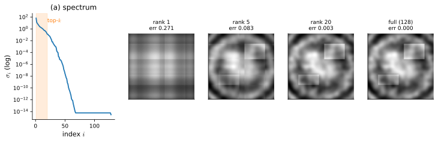
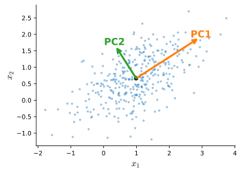
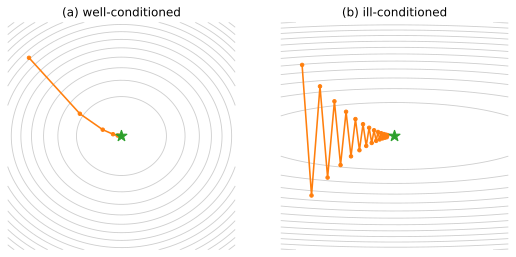
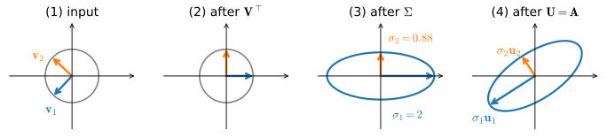
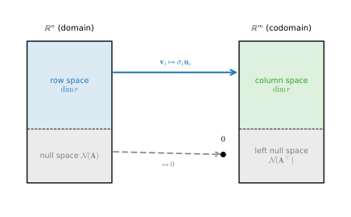

```{.python .input}
%load_ext d2lbook.tab
tab.interact_select('mxnet', 'pytorch', 'tensorflow', 'jax')
```

# Singular Value Decomposition and Low-Rank Approximation
:label:`sec_mdl-svd-low-rank`

The eigendecomposition of :numref:`sec_mdl-eigendecompositions` was powerful but
*picky*: it needs a square matrix, and to be fully well-behaved---an orthonormal
eigenbasis, real eigenvalues---it really wants a *symmetric* one. The defective
shear there had a repeated eigenvalue but only a one-dimensional eigenspace, so it
admitted no eigenbasis at all. The *singular value decomposition* (SVD) is the
same idea made universal. It applies to **every** matrix---rectangular,
rank-deficient, non-symmetric, defective---and factors it into a clean
*rotate--scale--rotate* form whose scale factors, the *singular values*, are the
right generalization of eigenvalues.

The engine that makes this work is one we already built. The spectral theorem of
:numref:`subsec_mdl-spectral-theorem` guarantees an orthonormal eigenbasis for
*symmetric* matrices, and :numref:`subsec_mdl-psd` showed that
$\mathbf{A}^\top\mathbf{A}$ is always symmetric and positive semidefinite. Feeding
that matrix through the spectral theorem manufactures an SVD for *any* $\mathbf{A}$
whatsoever---so the SVD never fails for the simple reason that Gram matrices are
never defective. From this one factorization, a remarkable amount falls out:
rank and the four fundamental subspaces (resolving the "efficient rank" promise of
:numref:`sec_mdl-geometry-linear-algebraic-ops`), the *optimal* low-rank
approximation, principal component analysis, the pseudoinverse and least squares,
and the condition number that predicts numerical trouble and gradient-descent
zig-zag. It also underwrites a large share of practical deep learning: PCA, the
Eckart--Young truncation behind LoRA and other low-rank adapters, the
orthogonalized update steps of the Muon optimizer (the polar decomposition at
work), and the spectral diagnostics used to inspect and constrain trained
weights---including spectral normalization, which estimates the largest singular
value with the very power iteration we met in
:numref:`sec_mdl-eigendecompositions`.

The worked-verification cells below branch per framework, so we load the
per-framework library once here; the few that are framework-agnostic also have
`np` in scope.

```{.python .input #svd-imports}
%%tab mxnet
%matplotlib inline
from d2l import mxnet as d2l
import numpy as np
```

```{.python .input #svd-imports}
%%tab pytorch
%matplotlib inline
from d2l import torch as d2l
import numpy as np
import torch
```

```{.python .input #svd-imports}
%%tab tensorflow
%matplotlib inline
from d2l import tensorflow as d2l
import numpy as np
import tensorflow as tf
```

```{.python .input #svd-imports}
%%tab jax
%matplotlib inline
from d2l import jax as d2l
import numpy as np
import jax
jax.config.update("jax_enable_x64", True)  # honor explicit float64 (else JAX
# silently truncates to float32, hurting the least-squares / SVD precision)
from jax import numpy as jnp
```

## The Singular Value Decomposition

### Rotate--Scale--Rotate
:label:`subsec_mdl-svd-rotate-scale-rotate`

Recall the central picture of :numref:`sec_mdl-eigendecompositions`: a matrix
sends the unit circle to an ellipse. For a *symmetric* matrix, the ellipse's axes
lie along the eigenvectors, and one orthonormal frame does the whole job. A
general matrix bends the circle to an ellipse too---but now the input directions
it stretches cleanly and the output directions those map to are *two different*
orthonormal frames. The SVD names both.

**Theorem (Singular Value Decomposition).** *Every real $m\times n$ matrix
$\mathbf{A}$ can be written as*

$$
\mathbf{A} = \mathbf{U}\,\boldsymbol{\Sigma}\,\mathbf{V}^\top,
$$
:eqlabel:`eq_mdl-svd`

*where $\mathbf{U}\in\mathbb{R}^{m\times m}$ and $\mathbf{V}\in\mathbb{R}^{n\times
n}$ are orthogonal ($\mathbf{U}^\top\mathbf{U}=\mathbf{I}$,
$\mathbf{V}^\top\mathbf{V}=\mathbf{I}$) and $\boldsymbol{\Sigma}\in\mathbb{R}^{m\times
n}$ is "diagonal" with non-negative entries
$\sigma_1\ge\sigma_2\ge\cdots\ge0$ on its main diagonal and zeros elsewhere.* The
columns $\mathbf{v}_i$ of $\mathbf{V}$ are the *right singular vectors*, the
columns $\mathbf{u}_i$ of $\mathbf{U}$ are the *left singular vectors*, and the
$\sigma_i$ are the *singular values*.

We prove existence in :numref:`subsec_mdl-svd-via-ata`; first we read off what it
*means*. Because $\mathbf{V}$ and $\mathbf{U}$ are orthogonal, they are pure
rotations (possibly with a reflection), and :eqref:`eq_mdl-svd` decomposes the
action of $\mathbf{A}$ on a vector $\mathbf{x}$ into three stages applied right to
left:

1. $\mathbf{V}^\top$ **rotates** the input so that the right singular vectors
   $\mathbf{v}_i$ land on the coordinate axes;
2. $\boldsymbol{\Sigma}$ **scales** axis $i$ by $\sigma_i$ (and, if
   $m\neq n$, embeds into or projects onto the output dimension);
3. $\mathbf{U}$ **rotates** the scaled axes into the output frame, placing the
   stretched axis $i$ along the left singular vector $\mathbf{u}_i$.

Equivalently, reading off column $i$ of $\mathbf{A}\mathbf{V}=\mathbf{U}\boldsymbol{\Sigma}$,

$$
\mathbf{A}\mathbf{v}_i = \sigma_i\,\mathbf{u}_i .
$$
:eqlabel:`eq_mdl-svd-action`

The orthonormal input direction $\mathbf{v}_i$ is sent to the orthonormal output
direction $\mathbf{u}_i$, stretched by $\sigma_i$. The unit circle (sphere) of
right singular vectors becomes an ellipse (ellipsoid) whose semi-axes are the
$\sigma_i\mathbf{u}_i$. This is exactly the eigen-picture of
:numref:`sec_mdl-eigendecompositions`, generalized: there one frame served as both
input and output axes because the map was symmetric; here input frame $\mathbf{V}$
and output frame $\mathbf{U}$ are allowed to differ, which is precisely what lets
the SVD handle every matrix. :numref:`fig_mdl-la-svd-action` traces this for a
non-symmetric $2\times2$ matrix, so that $\mathbf{U}\neq\mathbf{V}$ is visible: the
unit circle and its right singular vectors $\mathbf{v}_1,\mathbf{v}_2$ are rotated
by $\mathbf{V}^\top$ onto the axes, scaled by $\boldsymbol{\Sigma}$, then rotated
by $\mathbf{U}$ so the semi-axes land along the output frame
$\sigma_1\mathbf{u}_1,\sigma_2\mathbf{u}_2$---a different orientation than the
input frame, because the matrix rotates as well as stretches.


:label:`fig_mdl-la-svd-action`

**The polar decomposition: rotate--scale--rotate, rigorously.** The phrase
"rotate--scale--rotate" can be made into a clean statement. For square
$\mathbf{A}$, insert $\mathbf{V}\mathbf{V}^\top=\mathbf{I}$:

$$
\mathbf{A}
  = \mathbf{U}\boldsymbol{\Sigma}\mathbf{V}^\top
  = (\mathbf{U}\mathbf{V}^\top)\,(\mathbf{V}\boldsymbol{\Sigma}\mathbf{V}^\top)
  = \mathbf{Q}\,\mathbf{P}.
$$
:eqlabel:`eq_mdl-polar`

Here $\mathbf{Q}=\mathbf{U}\mathbf{V}^\top$ is orthogonal (a product of
orthogonal matrices) and $\mathbf{P}=\mathbf{V}\boldsymbol{\Sigma}\mathbf{V}^\top$
is symmetric positive semidefinite (its eigendecomposition has the non-negative
$\sigma_i$ as eigenvalues). This *polar decomposition* says every linear map is a
positive-semidefinite stretch $\mathbf{P}$ followed by a rigid rotation
$\mathbf{Q}$---the exact matrix analog of writing a complex number as
$z=re^{i\theta}$, modulus times phase. It justifies the rotate--scale--rotate
slogan: the "scale" is $\mathbf{P}$ and the net "rotate" is $\mathbf{Q}$.

**Thin SVD and the dyadic sum.** If $r=\operatorname{rank}\mathbf{A}$, only the
first $r$ singular values are nonzero. Discarding the zero columns of
$\boldsymbol{\Sigma}$ and the matching singular vectors gives the *thin* (or
*economy*) SVD $\mathbf{A}=\mathbf{U}_r\boldsymbol{\Sigma}_r\mathbf{V}_r^\top$ with
$\mathbf{U}_r\in\mathbb{R}^{m\times r}$, $\mathbf{V}_r\in\mathbb{R}^{n\times r}$.
Multiplying out, the SVD is a sum of rank-one *dyads*,

$$
\mathbf{A} = \sum_{i=1}^{r} \sigma_i\,\mathbf{u}_i\mathbf{v}_i^\top,
$$
:eqlabel:`eq_mdl-svd-dyadic`

each term a single outer product weighted by its singular value, ordered from
largest to smallest. This form---a *ranked* list of rank-one ingredients---is the
key to the low-rank approximation of :numref:`subsec_mdl-eckart-young`: keep the
heavy terms, drop the light ones.

### Existence via $\mathbf{A}^\top\mathbf{A}$
:label:`subsec_mdl-svd-via-ata`

The SVD is not a new mystery to be proved from scratch. It is the spectral theorem
of :numref:`subsec_mdl-spectral-theorem` applied to the symmetric PSD matrix
$\mathbf{A}^\top\mathbf{A}$, which we built precisely for this purpose in the
bridge at the end of that section. The following constructive proof is the heart
of the section; the one elegant step in it---getting orthonormality of the
$\mathbf{u}_i$ for free---is worth pausing on.

**Proof of :eqref:`eq_mdl-svd` (existence).** The matrix
$\mathbf{A}^\top\mathbf{A}$ is symmetric and positive semidefinite, because

$$
\mathbf{x}^\top(\mathbf{A}^\top\mathbf{A})\mathbf{x} = \|\mathbf{A}\mathbf{x}\|^2 \ge 0 .
$$

By the spectral theorem it has an orthonormal eigenbasis
$\mathbf{v}_1,\ldots,\mathbf{v}_n$ with real eigenvalues, and by
:numref:`subsec_mdl-psd` those eigenvalues are non-negative; order them
$\lambda_1\ge\cdots\ge\lambda_n\ge0$ and set

$$
\sigma_i = \sqrt{\lambda_i}, \qquad r = \#\{i : \sigma_i > 0\} .
$$

For each $i\le r$ define $\mathbf{u}_i = \mathbf{A}\mathbf{v}_i/\sigma_i$. These
left singular vectors are automatically orthonormal---and this single line is the
crux of the whole construction:

$$
\mathbf{u}_i^\top\mathbf{u}_j
  = \frac{1}{\sigma_i\sigma_j}\,\mathbf{v}_i^\top\mathbf{A}^\top\mathbf{A}\,\mathbf{v}_j
  = \frac{1}{\sigma_i\sigma_j}\,\mathbf{v}_i^\top(\lambda_j\mathbf{v}_j)
  = \frac{\lambda_j}{\sigma_i\sigma_j}\,\delta_{ij}
  = \delta_{ij} .
$$

Orthonormality of the *output* frame is inherited from orthonormality of the
*input* frame, routed through $\mathbf{A}^\top\mathbf{A}$. Extend
$\mathbf{u}_1,\ldots,\mathbf{u}_r$ to an orthonormal basis
$\mathbf{u}_1,\ldots,\mathbf{u}_m$ of $\mathbb{R}^m$ (Gram--Schmidt on any
completion). For the remaining right singular vectors, $i>r$, we have
$\|\mathbf{A}\mathbf{v}_i\|^2=\mathbf{v}_i^\top\mathbf{A}^\top\mathbf{A}\mathbf{v}_i=\lambda_i=0$,
so $\mathbf{A}\mathbf{v}_i=\mathbf 0$. In all cases, then,
$\mathbf{A}\mathbf{v}_i=\sigma_i\mathbf{u}_i$ (with $\sigma_i=0$ for $i>r$).
Collecting these columns gives $\mathbf{A}\mathbf{V}=\mathbf{U}\boldsymbol{\Sigma}$,
and right-multiplying by $\mathbf{V}^\top=\mathbf{V}^{-1}$ yields
$\mathbf{A}=\mathbf{U}\boldsymbol{\Sigma}\mathbf{V}^\top$. $\blacksquare$

This proof also *computes* the SVD by hand: diagonalize the (small, symmetric)
matrix $\mathbf{A}^\top\mathbf{A}$, take square roots for the singular values, and
push the eigenvectors through $\mathbf{A}$ for the left singular vectors.

**Uniqueness.** The singular *values* are unique---they are the square roots of
the eigenvalues of $\mathbf{A}^\top\mathbf{A}$, which are determined by
$\mathbf{A}$. The singular *vectors* are unique only up to the same ambiguities we
met for eigenvectors in :numref:`sec_mdl-eigendecompositions`: a sign flip on a
pair $(\mathbf{u}_i,\mathbf{v}_i)$ for a simple $\sigma_i$, and an arbitrary
orthonormal rotation within the subspace belonging to a repeated singular value.

**Variational characterization of $\sigma_1$.** There is a second, more
illuminating route to the top singular value that needs no eigendecomposition and
makes the *meaning* of $\sigma_1$ plain. It is the Rayleigh quotient of
:numref:`subsec_mdl-rayleigh` in disguise:

$$
\sigma_1 = \max_{\|\mathbf{x}\|=1}\|\mathbf{A}\mathbf{x}\| = \|\mathbf{A}\|_2 ,
$$
:eqlabel:`eq_mdl-sigma1-variational`

because $\|\mathbf{A}\mathbf{x}\|^2=\mathbf{x}^\top\mathbf{A}^\top\mathbf{A}\mathbf{x}$
is maximized over unit $\mathbf{x}$ by the Rayleigh proposition at
$\lambda_1=\sigma_1^2$, attained at $\mathbf{x}=\mathbf{v}_1$. So **$\sigma_1$ is
the most the matrix can stretch any unit vector**---its operator (spectral) norm
$\|\mathbf{A}\|_2$. The remaining singular values come from the same problem with
deflation: $\sigma_k=\max\{\|\mathbf{A}\mathbf{x}\| : \|\mathbf{x}\|=1,\ \mathbf{x}\perp\mathbf{v}_1,\ldots,\mathbf{v}_{k-1}\}$---the
Courant--Fischer min-max principle of :numref:`subsec_mdl-rayleigh`, translated
from Rayleigh quotients to singular values.
This "maximum stretch" reading is the one that recurs in Eckart--Young, PCA,
conditioning, and Lipschitz/spectral-norm arguments. The constructive proof is the
better *first* proof (concrete, reusing machinery we have); the variational one is
the better *meaning*.

**Relationship to the eigendecomposition.** Substituting :eqref:`eq_mdl-svd` into
the two Gram matrices gives, since $\mathbf{U}$ and $\mathbf{V}$ are orthogonal,

$$
\mathbf{A}^\top\mathbf{A} = \mathbf{V}\,\boldsymbol{\Sigma}^\top\boldsymbol{\Sigma}\,\mathbf{V}^\top,
\qquad
\mathbf{A}\mathbf{A}^\top = \mathbf{U}\,\boldsymbol{\Sigma}\boldsymbol{\Sigma}^\top\,\mathbf{U}^\top .
$$
:eqlabel:`eq_mdl-svd-gram`

These are *eigendecompositions*: the right singular vectors are the eigenvectors
of $\mathbf{A}^\top\mathbf{A}$, the left singular vectors are the eigenvectors of
$\mathbf{A}\mathbf{A}^\top$, and the squared singular values $\sigma_i^2$ are the
shared eigenvalues. For a symmetric PSD matrix the SVD and the eigendecomposition
coincide. In general they differ, and the cleanest warning against conflating
singular values with eigenvalues is the scaled rotation

$$
\mathbf{A} = \begin{bmatrix} 0 & -2\\ 1 & \phantom{-}0\end{bmatrix},
\qquad
\mathbf{A}^\top\mathbf{A} = \begin{bmatrix} 1 & 0\\ 0 & 4\end{bmatrix},
$$

whose singular values are $\{2,1\}$ (the square roots of $\{4,1\}$), while its
eigenvalues are $\pm i\sqrt2$ with modulus $|\lambda|=\sqrt2$. The singular values
are *not* the eigenvalue magnitudes; here even their *geometric mean*
$\sqrt{\sigma_1\sigma_2}=\sqrt2$ equals $|\lambda|$, which is no accident---it is
the matrix analog of the rotation-with-scaling reading from
:numref:`subsec_mdl-complex-rotation`, with $|\det\mathbf{A}|=\sigma_1\sigma_2=|\lambda_1\lambda_2|=2$.
The determinant identity holds in general: for any square $\mathbf{A}$,
$|\det\mathbf{A}|=\prod_i\sigma_i$, because orthogonal factors have determinant
$\pm1$, so the volume scaling of
:numref:`sec_mdl-geometry-linear-algebraic-ops` is carried entirely by the
diagonal stretch $\boldsymbol{\Sigma}$.

**The defective shear, finally decomposed.** We can now keep the promise made
twice in :numref:`sec_mdl-eigendecompositions`. The shear

$$
\mathbf{A} = \begin{bmatrix} 1 & 1\\ 0 & 1\end{bmatrix}
$$

is *defective*: $\lambda=1$ has algebraic multiplicity $2$ but only a
one-dimensional eigenspace, so it has **no eigenbasis** and the eigendecomposition
simply does not exist. The SVD has no such trouble. Form

$$
\mathbf{A}^\top\mathbf{A} = \begin{bmatrix} 1 & 1\\ 1 & 2\end{bmatrix},
$$

a symmetric PSD matrix. Its characteristic polynomial is
$\lambda^2-3\lambda+1$, with roots $\lambda_{1,2}=(3\pm\sqrt5)/2$. Hence the
singular values are

$$
\sigma_1 = \sqrt{\tfrac{3+\sqrt5}{2}} = \frac{1+\sqrt5}{2} = \varphi \approx 1.618,
\qquad
\sigma_2 = \sqrt{\tfrac{3-\sqrt5}{2}} = \frac{1}{\varphi} = \varphi-1 \approx 0.618,
$$

the golden ratio and its reciprocal (consistent with
$\sigma_1\sigma_2=|\det\mathbf{A}|=1$). Both are strictly positive, so the shear
has full rank $2$ and a perfectly clean orthonormal factorization
$\mathbf{A}=\mathbf{U}\boldsymbol{\Sigma}\mathbf{V}^\top$---there is nothing
defective about it. The eigendecomposition stumbled because it insists on a
*single* basis that both diagonalizes and is reused for input and output; the SVD
succeeds because it is allowed two different orthonormal frames. This is the
payoff of the whole construction: *the SVD repairs exactly what the
eigendecomposition could not.* The cell below verifies the singular values against
the golden ratio.

```{.python .input #svd-defective-shear}
A = np.array([[1., 1.], [0., 1.]])
s = np.linalg.svd(A, compute_uv=False)
phi = (1 + np.sqrt(5)) / 2
print('singular values of the shear:', s.round(6))
print('golden ratio phi, 1/phi:    ', np.array([phi, 1 / phi]).round(6))
print('product sigma_1 * sigma_2 = |det A| =', round(float(s[0] * s[1]), 6))
```

### The Four Fundamental Subspaces
:label:`subsec_mdl-svd-subspaces`

Because $\mathbf{U}$ and $\mathbf{V}$ are invertible, multiplying by them changes
no dimensions, so $\operatorname{rank}\mathbf{A}=\operatorname{rank}\boldsymbol{\Sigma}$,
which is simply the number of nonzero diagonal entries:

$$
\operatorname{rank}\mathbf{A} = \#\{i : \sigma_i > 0\} = r .
$$
:eqlabel:`eq_mdl-rank-sigma`

This is the *efficient* characterization of rank promised in
:numref:`sec_mdl-geometry-linear-algebraic-ops`, where counting independent
columns by elimination was the only tool on offer. The dyadic form
:eqref:`eq_mdl-svd-dyadic` makes the four fundamental subspaces equally explicit.
Splitting the singular vectors at the index $r$,

* the **range** (column space) of $\mathbf{A}$ is
  $\operatorname{span}\{\mathbf{u}_1,\ldots,\mathbf{u}_r\}$, since every output
  $\mathbf{A}\mathbf{x}=\sum_{i\le r}\sigma_i(\mathbf{v}_i^\top\mathbf{x})\mathbf{u}_i$
  is a combination of these;
* the **null space** of $\mathbf{A}$ is
  $\operatorname{span}\{\mathbf{v}_{r+1},\ldots,\mathbf{v}_n\}$, the input
  directions sent to zero;
* the **row space** (range of $\mathbf{A}^\top$) is
  $\operatorname{span}\{\mathbf{v}_1,\ldots,\mathbf{v}_r\}$;
* the **left null space** (null space of $\mathbf{A}^\top$) is
  $\operatorname{span}\{\mathbf{u}_{r+1},\ldots,\mathbf{u}_m\}$.

The picture is a clean bijection: $\mathbf{A}$ maps the row space to the column
space, sending each $\mathbf{v}_i\mapsto\sigma_i\mathbf{u}_i$ ($i\le r$) one-to-one
and onto, while crushing the null space to zero. Input space splits orthogonally
as row space $\oplus$ null space; output space splits orthogonally as column space
$\oplus$ left-null space. :numref:`fig_mdl-la-svd-subspaces` draws this two-plane
map; the pseudoinverse of :numref:`subsec_mdl-pseudoinverse` will run the bijection
backwards.


:label:`fig_mdl-la-svd-subspaces`

**Numerical rank.** In floating-point arithmetic, a matrix that is mathematically
rank-deficient rarely has exact zero singular values; rounding leaves tiny
$\sigma_i$ of size around $\epsilon_{\text{mach}}\,\sigma_1$ instead. The honest
notion of rank therefore *thresholds*: count the singular values above a tolerance,
which is exactly what `np.linalg.matrix_rank` does---its default cutoff is
$\sigma_1\,\max(m,n)\,\epsilon_{\text{mach}}$, scaled by both the largest singular
value and the matrix size. Building a deliberately rank-2
matrix in $\mathbb{R}^{4\times4}$ shows two singular values collapse to near
machine zero, so a tolerance recovers the true rank where a test for exact zeros
would fail.

```{.python .input #svd-numerical-rank}
rng = np.random.default_rng(0)
A = rng.standard_normal((4, 2)) @ rng.standard_normal((2, 4))  # rank <= 2
s = np.linalg.svd(A, compute_uv=False)
print('singular values:', s.round(6))
print('numerical rank :', int(np.linalg.matrix_rank(A)))
```

## Low-Rank Approximation

### Eckart--Young
:label:`subsec_mdl-eckart-young`

Here is the theorem that makes the SVD indispensable. The dyadic sum
:eqref:`eq_mdl-svd-dyadic` lists the rank-one pieces of $\mathbf{A}$ in order of
importance. Keeping only the top $k$,

$$
\mathbf{A}_k = \sum_{i=1}^{k}\sigma_i\,\mathbf{u}_i\mathbf{v}_i^\top,
$$
:eqlabel:`eq_mdl-truncated-svd`

is not merely *a* rank-$k$ approximation of $\mathbf{A}$---it is the *provably
best* one, in both the spectral and Frobenius norms. Eckart and Young proved the
Frobenius case :cite:`Eckart.Young.1936` and Mirsky extended it to every unitarily
invariant norm :cite:`Mirsky.1960`; we give the spectral-norm statement and proof
in full because the argument is beautiful.

**Theorem (Eckart--Young--Mirsky).** *For every $k<r$,*

$$
\min_{\operatorname{rank}\mathbf{B}\le k}\|\mathbf{A}-\mathbf{B}\|_2 = \sigma_{k+1},
$$
:eqlabel:`eq_mdl-eckart-young`

*and the minimum is attained at $\mathbf{B}=\mathbf{A}_k$. In the Frobenius norm,
$\min_{\operatorname{rank}\mathbf{B}\le k}\|\mathbf{A}-\mathbf{B}\|_F^2=\sum_{i>k}\sigma_i^2$,
again attained at $\mathbf{A}_k$.*

**Proof.** *The truncation achieves $\sigma_{k+1}$.* The error
$\mathbf{A}-\mathbf{A}_k=\sum_{i>k}\sigma_i\mathbf{u}_i\mathbf{v}_i^\top$ is itself
a (sub-)SVD whose largest singular value is $\sigma_{k+1}$, so by the variational
identity :eqref:`eq_mdl-sigma1-variational`,
$\|\mathbf{A}-\mathbf{A}_k\|_2=\sigma_{k+1}$. (And
$\|\mathbf{A}-\mathbf{A}_k\|_F^2=\sum_{i>k}\sigma_i^2$, by the identity
$\|\mathbf{A}\|_F^2=\operatorname{tr}(\mathbf{A}^\top\mathbf{A})=\sum_i\sigma_i^2$:
the Frobenius norm is the root-sum-of-squares of the singular values. Exercise 2
asks you to prove this in two lines.)

*No rank-$k$ matrix does better (the dimension-counting argument).* Let
$\mathbf{B}$ be any matrix with $\operatorname{rank}\mathbf{B}\le k$. Its null
space has dimension at least $n-k$. Consider also the
$(k{+}1)$-dimensional subspace
$\mathcal{V}=\operatorname{span}\{\mathbf{v}_1,\ldots,\mathbf{v}_{k+1}\}$ spanned by
the top $k{+}1$ right singular vectors. Two subspaces of $\mathbb{R}^n$ whose
dimensions add to more than $n$ must intersect nontrivially:

$$
\dim(\ker\mathbf{B}\cap\mathcal{V}) \ge (n-k) + (k+1) - n = 1 .
$$

So there is a *unit* vector $\mathbf{x}\in\ker\mathbf{B}\cap\mathcal{V}$. Write it
in the top singular basis, $\mathbf{x}=\sum_{i\le k+1}c_i\mathbf{v}_i$ with
$\sum c_i^2=1$. Because $\mathbf{x}\in\ker\mathbf{B}$ we have $\mathbf{B}\mathbf{x}=\mathbf 0$,
and because $\mathbf{A}\mathbf{v}_i=\sigma_i\mathbf{u}_i$ with the $\mathbf{u}_i$
orthonormal,

$$
\|\mathbf{A}\mathbf{x}\|^2 = \Bigl\|\sum_{i\le k+1}c_i\sigma_i\mathbf{u}_i\Bigr\|^2
   = \sum_{i\le k+1} c_i^2\sigma_i^2
   \ge \sigma_{k+1}^2 \sum_{i\le k+1} c_i^2
   = \sigma_{k+1}^2 ,
$$

using $\sigma_i\ge\sigma_{k+1}$ for $i\le k+1$. Therefore

$$
\|\mathbf{A}-\mathbf{B}\|_2^2
  \ge \|(\mathbf{A}-\mathbf{B})\mathbf{x}\|^2
  = \|\mathbf{A}\mathbf{x}\|^2 \ge \sigma_{k+1}^2 ,
$$

so $\|\mathbf{A}-\mathbf{B}\|_2\ge\sigma_{k+1}$ for every rank-$k$ $\mathbf{B}$,
with equality at $\mathbf{A}_k$. $\blacksquare$

The pivot is the collision: the kernel of $\mathbf{B}$ and the top-$(k{+}1)$
singular subspace *overfill* $\mathbb{R}^n$, so they must share a direction. On
that shared vector $\mathbf{B}$ is blind ($\mathbf{B}\mathbf{x}=\mathbf 0$) while
$\mathbf{A}$ still stretches by at least $\sigma_{k+1}$---so no rank-$k$
$\mathbf{B}$ can track $\mathbf{A}$ everywhere.

**Proof (Frobenius case).** For the Frobenius norm---the case PCA relies on---the
same conclusion follows from a one-line singular-value inequality. *Weyl's
inequality for singular values*,
$\sigma_{i+j-1}(\mathbf{X}+\mathbf{Y})\le\sigma_i(\mathbf{X})+\sigma_j(\mathbf{Y})$,
applied with $\mathbf{X}=\mathbf{A}-\mathbf{B}$, $\mathbf{Y}=\mathbf{B}$ and
$j=k{+}1$ gives
$\sigma_{k+i}(\mathbf{A})\le\sigma_i(\mathbf{A}-\mathbf{B})+\sigma_{k+1}(\mathbf{B})=\sigma_i(\mathbf{A}-\mathbf{B})$,
since $\mathbf{B}$ has rank $\le k$ and so $\sigma_{k+1}(\mathbf{B})=0$. Squaring
and summing over $i\ge1$,

$$
\|\mathbf{A}-\mathbf{B}\|_F^2=\sum_{i\ge1}\sigma_i(\mathbf{A}-\mathbf{B})^2
  \ge\sum_{i\ge1}\sigma_{k+i}(\mathbf{A})^2=\sum_{j>k}\sigma_j(\mathbf{A})^2 ,
$$

again with equality at the truncation $\mathbf{A}_k$. $\blacksquare$

The error formulas give a quantitative *dial*. The fraction of "energy" retained
by the rank-$k$ truncation is the *energy ratio*

$$
\frac{\sum_{i\le k}\sigma_i^2}{\sum_{i}\sigma_i^2}
  = 1 - \frac{\|\mathbf{A}-\mathbf{A}_k\|_F^2}{\|\mathbf{A}\|_F^2} ,
$$
:eqlabel:`eq_mdl-energy-ratio`

so choosing $k$ to capture, say, 95% of the energy is a principled way to set the
rank. When the singular values decay quickly---as they do for images with
large-scale structure and, empirically, for many trained weight matrices---a small
$k$ captures almost everything, which is exactly the regime in which low-rank
compression pays off.

**Truncation as denoising.** There is a second, statistical reason to truncate.
Suppose the matrix you observe is a low-rank signal plus noise,
$\mathbf{A}=\mathbf{B}+\mathbf{N}$, with $\operatorname{rank}\mathbf{B}=r$ small
and $\mathbf{N}$ having i.i.d. entries of standard deviation
$\sigma_{\text{noise}}$. Then the spectrum of $\mathbf{A}$ *splits*: the $r$
signal values stand essentially where they were, while the noise contributes a
floor of singular values clustered below roughly
$(\sqrt{m}+\sqrt{n})\,\sigma_{\text{noise}}$. Truncating just above that floor
discards almost pure noise, so $\mathbf{A}_k$ can be *closer to the truth*
$\mathbf{B}$ than the observed $\mathbf{A}$ is. Gavish and Donoho made the cutoff
precise: for an $n\times n$ matrix with known noise level, the asymptotically
optimal hard threshold is
$\tfrac{4}{\sqrt3}\sqrt{n}\,\sigma_{\text{noise}}\approx2.309\,\sqrt{n}\,\sigma_{\text{noise}}$
:cite:`Gavish.Donoho.2014`---a principled alternative to the 95%-energy dial when
the data is noisy; Exercise 3 lets you watch the spectrum split. The same
low-rank-signal premise, with *missing* rather than noisy entries, underlies
*matrix completion*: recommender systems fill in a sparsely observed ratings
matrix by seeking the lowest-rank matrix (in practice, the smallest *nuclear norm*
$\sum_i\sigma_i$, rank's convex surrogate) consistent with the observed entries.

:numref:`fig_mdl-la-eckart-young` makes this concrete on a grayscale image. The
left panel plots the singular-value spectrum on a log scale (note the rapid decay);
the remaining panels reconstruct the image at ranks $k=1,5,20$ and full, each
labeled with its relative Frobenius error
$\|\mathbf{A}-\mathbf{A}_k\|_F/\|\mathbf{A}\|_F=\sqrt{\sum_{i>k}\sigma_i^2/\sum_i\sigma_i^2}$.
A rank-20 truncation of this image already looks essentially correct while storing
only a fraction of the numbers, because the discarded singular values carry little
energy---a visual proof of Eckart--Young.


:label:`fig_mdl-la-eckart-young`

### Principal Component Analysis
:label:`subsec_mdl-pca`

Principal component analysis is the most important single application of the SVD,
and Eckart--Young turns it from a recipe into a theorem. Given data points as the
rows of $\mathbf{X}\in\mathbb{R}^{n\times d}$, first *center* them by subtracting
the mean row, $\tilde{\mathbf{X}}=\mathbf{X}-\mathbf 1\bar{\mathbf{x}}^\top$. The
empirical covariance is the symmetric PSD matrix
$\mathbf{C}=\tfrac1n\tilde{\mathbf{X}}^\top\tilde{\mathbf{X}}$ from
:numref:`subsec_mdl-psd` (we use the maximum-likelihood $\tfrac1n$ covariance; the
unbiased $\tfrac1{n-1}$ version rescales every eigenvalue by the same factor and so
changes neither the principal directions nor the explained-variance ratio). PCA
asks: which unit direction $\mathbf{w}$ captures the most variance of the projected
data?

**Proposition (PCA via Rayleigh).** *The projected variance
$\tfrac1n\|\tilde{\mathbf{X}}\mathbf{w}\|^2=\mathbf{w}^\top\mathbf{C}\mathbf{w}$ is
maximized over unit $\mathbf{w}$ by the top eigenvector of $\mathbf{C}$, which is
the top right singular vector $\mathbf{v}_1$ of $\tilde{\mathbf{X}}$, with maximal
variance $\sigma_1^2/n$.*

**Proof.** The projection of a centered point onto $\mathbf{w}$ has coordinate
$\tilde{\mathbf{x}}^\top\mathbf{w}$; the variance of these coordinates is
$\tfrac1n\sum_i(\tilde{\mathbf{x}}_i^\top\mathbf{w})^2=\tfrac1n\|\tilde{\mathbf{X}}\mathbf{w}\|^2=\mathbf{w}^\top\mathbf{C}\mathbf{w}$.
Maximizing this Rayleigh quotient over unit $\mathbf{w}$ gives, by
:numref:`subsec_mdl-rayleigh`, the top eigenvector of $\mathbf{C}$ and the value
$\lambda_1(\mathbf{C})$. By :eqref:`eq_mdl-svd-gram`,
$\mathbf{C}=\tfrac1n\mathbf{V}\boldsymbol{\Sigma}^\top\boldsymbol{\Sigma}\mathbf{V}^\top$,
so its eigenvectors are the right singular vectors $\mathbf{v}_i$ of
$\tilde{\mathbf{X}}$ and its eigenvalues are $\sigma_i^2/n$. $\blacksquare$

Iterating with deflation, the top-$k$ principal directions are
$\mathbf{v}_1,\ldots,\mathbf{v}_k$, and the variance *explained* by component $i$
is $\sigma_i^2/n$. The ranked list of these variances is the *scree plot*, and the
explained-variance ratio is exactly the energy ratio
:eqref:`eq_mdl-energy-ratio` of $\tilde{\mathbf{X}}$. Moreover the rank-$k$
projection $\mathbf{z}=\mathbf{V}_k^\top(\mathbf{x}-\bar{\mathbf{x}})$ is the
*optimal* linear dimensionality reduction: minimizing reconstruction error over
all rank-$k$ linear maps is Eckart--Young--Frobenius applied to $\tilde{\mathbf{X}}$,
whose solution is the top-$k$ truncation. **Centering matters**: skip it and the
first singular vector is dominated by the offset of the cloud from the origin,
capturing where the data *is* rather than how it *varies*.

:numref:`fig_mdl-la-pca` draws a 2-D correlated cloud with its two principal axes
scaled by the per-axis standard deviation $\sigma_i/\sqrt{n}$: the first axis
aligns with the long direction of the cloud, exactly the direction of maximal
variance the proposition predicts. The cell below cross-checks the SVD principal
axes against the eigenvectors of the covariance and reports the
explained-variance ratio---the two routes agree, as :eqref:`eq_mdl-svd-gram`
guarantees.


:label:`fig_mdl-la-pca`

```{.python .input #svd-pca}
rng = np.random.default_rng(1)
theta = np.pi / 5
rot = np.array([[np.cos(theta), -np.sin(theta)],
                [np.sin(theta),  np.cos(theta)]])
X = rng.standard_normal((300, 2)) * np.array([3.0, 0.8]) @ rot.T  # correlated
Xc = X - X.mean(0)                                                # center
s = np.linalg.svd(Xc, compute_uv=False)
eigval = np.linalg.eigvalsh((Xc.T @ Xc) / len(Xc))[::-1]          # descending
print('explained variance (sigma^2/n):', (s ** 2 / len(Xc)).round(4))
print('eigenvalues of covariance     :', eigval.round(4))
print('explained-variance ratio      :', (s ** 2 / (s ** 2).sum()).round(4))
```

## Solving Linear Systems with the SVD

### The Pseudoinverse and Least Squares
:label:`subsec_mdl-pseudoinverse`

When $\mathbf{A}\mathbf{x}=\mathbf{b}$ has no solution (too many equations) or
infinitely many (too few), the SVD delivers the principled answer. Define the
*Moore--Penrose pseudoinverse* by inverting the nonzero singular values and
transposing the rotations,

$$
\mathbf{A}^{+} = \mathbf{V}\boldsymbol{\Sigma}^{+}\mathbf{U}^\top,
\qquad
\boldsymbol{\Sigma}^{+}_{ii} = \begin{cases} 1/\sigma_i & \sigma_i>0,\\ 0 & \sigma_i=0.\end{cases}
$$
:eqlabel:`eq_mdl-pseudoinverse`

**Proposition (min-norm least squares).** *Among all minimizers of
$\|\mathbf{A}\mathbf{x}-\mathbf{b}\|_2$, the one of smallest norm is
$\hat{\mathbf{x}}=\mathbf{A}^{+}\mathbf{b}$.*

**Proof.** Rotate both the input and the target into the singular bases:
$\mathbf{y}=\mathbf{V}^\top\mathbf{x}$ and $\mathbf{c}=\mathbf{U}^\top\mathbf{b}$.
Since $\mathbf{U}$ is orthogonal it preserves norms, so

$$
\|\mathbf{A}\mathbf{x}-\mathbf{b}\|^2
   = \|\mathbf{U}^\top(\mathbf{A}\mathbf{x}-\mathbf{b})\|^2
   = \|\boldsymbol{\Sigma}\mathbf{y}-\mathbf{c}\|^2
   = \sum_{i\le r}(\sigma_i y_i - c_i)^2 + \sum_{i> r} c_i^2 .
$$

The rotation has *decoupled* the problem into independent scalar problems. The
first sum is minimized term by term at $y_i=c_i/\sigma_i$ for $i\le r$; the second
sum is a constant we cannot touch (it is the irreducible residual, the part of
$\mathbf{b}$ outside the column space). The coordinates $y_i$ for $i>r$ are *free*:
they do not appear in the residual at all. Setting them to zero gives the unique
solution of *smallest* norm (since $\|\mathbf{x}\|=\|\mathbf{y}\|$). That choice is
exactly $\mathbf{y}=\boldsymbol{\Sigma}^{+}\mathbf{c}$, i.e.
$\hat{\mathbf{x}}=\mathbf{V}\boldsymbol{\Sigma}^{+}\mathbf{U}^\top\mathbf{b}=\mathbf{A}^{+}\mathbf{b}$.
$\blacksquare$

The moral is worth stating: rotating into the SVD basis turns a coupled
least-squares problem into a list of one-dimensional problems, and "small residual"
and "small norm" land on *disjoint* coordinate blocks ($i\le r$ versus $i>r$), so
both can be satisfied at once. Two corollaries follow at once. When $\mathbf{A}$ is
square and invertible, all $\sigma_i>0$ and
$\mathbf{A}^{+}=\mathbf{V}\boldsymbol{\Sigma}^{-1}\mathbf{U}^\top=\mathbf{A}^{-1}$.
And *truncating* the pseudoinverse---dropping terms with tiny $\sigma_i$ instead of
dividing by them---caps the dangerous $1/\sigma_i$ blow-up; this is a form of
regularization, closely related to ridge regression, which we revisit when we
discuss weight decay.

The classical alternative, the *normal equations*
$\mathbf{A}^\top\mathbf{A}\mathbf{x}=\mathbf{A}^\top\mathbf{b}$, is mathematically
equivalent for full-rank $\mathbf{A}$ but numerically worse: forming
$\mathbf{A}^\top\mathbf{A}$ *squares* the condition number
(:numref:`subsec_mdl-condition-number`), so an SVD- or QR-based solve is preferred.
The cell below solves an overdetermined system via `pinv` and via the library
`lstsq`---the two agree on the same minimum-residual fit---and prints `cond(A)`
alongside `cond(A^T A)` to show the normal-equations matrix is far worse
conditioned.

```{.python .input #svd-least-squares}
%%tab mxnet
A = np.array([[1., 1.], [1., 2.], [1., 3.], [1., 4.]])  # 4 eqns, 2 unknowns
b = np.array([6., 5., 7., 10.])
x_pinv = np.linalg.pinv(A) @ b
x_lstsq, *_ = np.linalg.lstsq(A, b, rcond=None)
print('pinv :', x_pinv.round(4), ' residual',
      round(float(np.linalg.norm(A @ x_pinv - b)), 4))
print('lstsq:', x_lstsq.round(4), ' residual',
      round(float(np.linalg.norm(A @ x_lstsq - b)), 4))
print('cond(A)     =', round(float(np.linalg.cond(A)), 3))
print('cond(A^T A) =', round(float(np.linalg.cond(A.T @ A)), 3), '= cond(A)^2')
```

```{.python .input #svd-least-squares}
%%tab pytorch
A = torch.tensor([[1., 1.], [1., 2.], [1., 3.], [1., 4.]], dtype=torch.float64)
b = torch.tensor([6., 5., 7., 10.], dtype=torch.float64)
x_pinv = torch.linalg.pinv(A) @ b
x_lstsq = torch.linalg.lstsq(A, b).solution
print('pinv :', x_pinv.numpy().round(4), ' residual',
      round(float(torch.linalg.norm(A @ x_pinv - b)), 4))
print('lstsq:', x_lstsq.numpy().round(4), ' residual',
      round(float(torch.linalg.norm(A @ x_lstsq - b)), 4))
print('cond(A)     =', round(float(torch.linalg.cond(A)), 3))
print('cond(A^T A) =', round(float(torch.linalg.cond(A.T @ A)), 3), '= cond(A)^2')
```

```{.python .input #svd-least-squares}
%%tab tensorflow
A = tf.constant([[1., 1.], [1., 2.], [1., 3.], [1., 4.]], dtype=tf.float64)
b = tf.constant([[6.], [5.], [7.], [10.]], dtype=tf.float64)
x_pinv = tf.linalg.pinv(A) @ b
x_lstsq = tf.linalg.lstsq(A, b)
print('pinv :', x_pinv.numpy().ravel().round(4), ' residual',
      round(float(tf.norm(A @ x_pinv - b)), 4))
print('lstsq:', x_lstsq.numpy().ravel().round(4), ' residual',
      round(float(tf.norm(A @ x_lstsq - b)), 4))
s = tf.linalg.svd(A, compute_uv=False)
sn = tf.linalg.svd(tf.transpose(A) @ A, compute_uv=False)
print('cond(A)     =', round(float(s[0] / s[-1]), 3))
print('cond(A^T A) =', round(float(sn[0] / sn[-1]), 3), '= cond(A)^2')
```

```{.python .input #svd-least-squares}
%%tab jax
A = jnp.array([[1., 1.], [1., 2.], [1., 3.], [1., 4.]], dtype=jnp.float64)
b = jnp.array([6., 5., 7., 10.], dtype=jnp.float64)
x_pinv = jnp.linalg.pinv(A) @ b
x_lstsq, *_ = jnp.linalg.lstsq(A, b, rcond=None)
print('pinv :', np.asarray(x_pinv).round(4), ' residual',
      round(float(jnp.linalg.norm(A @ x_pinv - b)), 4))
print('lstsq:', np.asarray(x_lstsq).round(4), ' residual',
      round(float(jnp.linalg.norm(A @ x_lstsq - b)), 4))
print('cond(A)     =', round(float(jnp.linalg.cond(A)), 3))
print('cond(A^T A) =', round(float(jnp.linalg.cond(A.T @ A)), 3), '= cond(A)^2')
```

### The Condition Number
:label:`subsec_mdl-condition-number`

The *condition number* is the single SVD-derived scalar that predicts numerical
pain. For an invertible (or full-rank) matrix it is the ratio of the largest to
the smallest nonzero singular value,

$$
\kappa(\mathbf{A}) = \frac{\sigma_1}{\sigma_r} .
$$
:eqlabel:`eq_mdl-condition-number`

It measures how much a linear solve can amplify input error.

**Proposition (error amplification, with tightness).** *Let $\mathbf{A}$ be square
invertible, $\mathbf{A}\mathbf{x}=\mathbf{b}$, and let a perturbation
$\delta\mathbf{b}$ change the solution to $\mathbf{x}+\delta\mathbf{x}$. Then*

$$
\frac{\|\delta\mathbf{x}\|}{\|\mathbf{x}\|}
   \le \kappa(\mathbf{A})\,\frac{\|\delta\mathbf{b}\|}{\|\mathbf{b}\|},
$$
:eqlabel:`eq_mdl-condition-bound`

*and the bound is attained for suitable $\mathbf{b},\delta\mathbf{b}$.*

**Proof.** From $\mathbf{A}\,\delta\mathbf{x}=\delta\mathbf{b}$ we get
$\delta\mathbf{x}=\mathbf{A}^{-1}\delta\mathbf{b}$, and the largest singular value
of $\mathbf{A}^{-1}$ is $1/\sigma_n$, so by :eqref:`eq_mdl-sigma1-variational`
$\|\delta\mathbf{x}\|\le\sigma_n^{-1}\|\delta\mathbf{b}\|$. From
$\mathbf{b}=\mathbf{A}\mathbf{x}$ we get $\|\mathbf{b}\|\le\sigma_1\|\mathbf{x}\|$.
Multiplying the two inequalities,

$$
\frac{\|\delta\mathbf{x}\|}{\|\mathbf{x}\|}
   \le \frac{\sigma_1}{\sigma_n}\,\frac{\|\delta\mathbf{b}\|}{\|\mathbf{b}\|}
   = \kappa(\mathbf{A})\,\frac{\|\delta\mathbf{b}\|}{\|\mathbf{b}\|} .
$$

It is *tight*: align the signal with the direction the inverse amplifies least by
taking $\mathbf{b}=\mathbf{u}_1$, so that $\mathbf{x}=\sigma_1^{-1}\mathbf{v}_1$ is
the *smallest*-norm solution any unit right-hand side can produce---a small
$\|\mathbf{x}\|$ in the denominator is exactly what maximizes the relative-error
ratio---and align the error with the most-amplified direction
$\delta\mathbf{b}=\mathbf{u}_n$ (so $\delta\mathbf{x}=\sigma_n^{-1}\mathbf{v}_n$ is
as large as a perturbation of its size can get);
then both inequalities are equalities. $\blacksquare$

A few consequences are worth recording. An orthogonal matrix has all singular
values equal to $1$, so $\kappa=1$: rotations and reflections are perfectly
conditioned, which is *why* the SVD's $\mathbf{U},\mathbf{V}$ never amplify error
and why orthogonal initialization is attractive. At the other extreme, forming the
normal-equations matrix squares the conditioning, $\kappa(\mathbf{A}^\top\mathbf{A})=\kappa(\mathbf{A})^2$
(its singular values are the $\sigma_i^2$), which is the quantitative reason to
prefer an SVD/QR least-squares solve over the normal equations
(:numref:`subsec_mdl-pseudoinverse`).

Geometrically, a large $\kappa$ means very *elongated* level sets. For a quadratic
bowl $f(\mathbf{x})=\tfrac12\mathbf{x}^\top\mathbf{M}\mathbf{x}$ with $\mathbf{M}$
symmetric positive definite, the contours are ellipses whose axis ratio is exactly
$\kappa(\mathbf{M})=\lambda_{\max}/\lambda_{\min}$; when $\kappa\gg1$ the bowl is a
narrow valley, and gradient descent zig-zags across the steep walls while crawling
along the flat floor. (For a least-squares objective
$\tfrac12\|\mathbf{A}\mathbf{x}-\mathbf{b}\|^2$ the bowl's matrix is
$\mathbf{M}=\mathbf{A}^\top\mathbf{A}$, so its axis ratio is $\kappa(\mathbf{A})^2$---one
more reason squaring the conditioning hurts.) This is the same picture that ended
the Rayleigh discussion in :numref:`subsec_mdl-rayleigh`, and it is no coincidence:
with the best fixed step size, gradient descent's error contracts like
$(\kappa-1)/(\kappa+1)$ per step on such a bowl---*one number, two consequences*,
error amplification in a solve and slow convergence in optimization. We make this
precise when we analyze gradient descent in :numref:`sec_mdl-gradient-based-optimization`
and study numerical conditioning in :numref:`sec_mdl-numerical-stability-conditioning`.
:numref:`fig_mdl-la-condition` contrasts a well-conditioned bowl ($\kappa\approx1$,
near-circular contours, gradient descent heads almost straight to the minimum) with
an ill-conditioned one ($\kappa\gg1$, elongated contours, a zig-zag trajectory). In
the narrow valley, the step size is throttled by the steep direction (to stay
stable) while the flat direction needs many such small steps to make progress---the
zig-zag is the visible cost of a large condition number.


:label:`fig_mdl-la-condition`

## The SVD in Modern Deep Learning
:label:`sec_mdl-svd-modern-dl`

The SVD is not a historical artifact; low-rank structure is everywhere in
contemporary models, and Eckart--Young is the reason it can be exploited cheaply.

**Low-rank adapters (LoRA).** Fine-tuning a large pretrained model by updating
every weight is expensive. LoRA :cite:`Hu.Shen.Wallis.ea.2021` freezes a
pretrained weight $\mathbf{W}\in\mathbb{R}^{m\times n}$ and learns only a low-rank
correction $\Delta\mathbf{W}=\mathbf{B}\mathbf{A}$ with
$\mathbf{B}\in\mathbb{R}^{m\times r}$, $\mathbf{A}\in\mathbb{R}^{r\times n}$, and
$r\ll\min(m,n)$. This trades $mn$ trainable parameters for $r(m+n)$, a ratio of

$$
\frac{r(m+n)}{mn} ,
$$
:eqlabel:`eq_mdl-lora-ratio`

which for a $4096\times4096$ layer at rank $r=8$ is $8\cdot8192/4096^2\approx0.39\%$
of the parameters. The hypothesis that fine-tuning updates are *intrinsically low
rank* is what makes this work. Note what Eckart--Young does and does not say here:
LoRA *learns* $\mathbf{B}$ and $\mathbf{A}$ by gradient descent rather than
truncating a known matrix, so the theorem promises nothing about the learned
adapter itself. What it quantifies is the *ceiling*: if the update that full
fine-tuning would have made has singular values $\sigma_1\ge\sigma_2\ge\cdots$,
then no rank-$r$ adapter can come closer to it than $\sigma_{r+1}$ in spectral
norm ($\sum_{i>r}\sigma_i^2$ in squared Frobenius norm), so the approach can only succeed when
the true update's spectrum decays fast---which is exactly the empirical finding
that motivated LoRA. PiSSA makes the link to the SVD literal: it *initializes*
$\mathbf{B}$ and $\mathbf{A}$ from the truncated SVD of the pretrained weight
$\mathbf{W}$ itself, so that fine-tuning starts by adapting the principal
components :cite:`Meng.Wang.Zhang.2024`.

**Orthogonalized updates (Muon).** The polar decomposition
:eqref:`eq_mdl-polar` is not just a tidy restatement of rotate--scale--rotate; it
is the engine of Muon :cite:`Jordan.Jin.Boza.ea.2024`, an optimizer adopted in
recent large-scale language-model training. Write the momentum matrix of a weight
as $\mathbf{M}=\mathbf{U}\boldsymbol{\Sigma}\mathbf{V}^\top$. A standard momentum
step moves along $\mathbf{M}$, which is dominated by its few largest dyads; Muon
instead steps along the *polar factor*
$\mathbf{Q}=\mathbf{U}\mathbf{V}^\top$---the rotation part of the update, with
every stretch factor equalized to $1$---so rare-but-consistent gradient
directions are not drowned out by the dominant ones. (Equivalently, $\mathbf{U}\mathbf{V}^\top$
is the steepest-descent direction when distances between weight matrices are
measured in the spectral norm rather than the Euclidean one
:cite:`Bernstein.Newhouse.2024`.) Computing an SVD of every weight at every step
would be hopeless; instead Muon runs a handful of *Newton--Schulz* iterations
$\mathbf{X}\leftarrow\tfrac12(3\mathbf{X}-\mathbf{X}\mathbf{X}^\top\mathbf{X})$
starting from $\mathbf{X}=\mathbf{M}/\|\mathbf{M}\|_F$. Each iteration leaves
$\mathbf{U}$ and $\mathbf{V}$ untouched and applies the odd polynomial
$p(\sigma)=\tfrac12(3\sigma-\sigma^3)$ to every singular value, driving each
nonzero $\sigma_i$ toward the fixed point $1$---so the iterates converge to
$\mathbf{U}\mathbf{V}^\top$ using nothing but matrix multiplications (in practice
Muon tunes the polynomial's coefficients so that about five iterations suffice).
It is the same GPU-friendly bargain that spectral normalization strikes with
power iteration below.

**Spectral normalization.** Constraining the largest singular value of each weight
matrix to $1$ caps the per-layer Lipschitz constant
(:eqref:`eq_mdl-sigma1-variational`: $\sigma_1=\|\mathbf{W}\|_2$ is exactly the most
a layer can stretch its input), which stabilizes training---originally for GAN
discriminators :cite:`Miyato.Kataoka.Koyama.ea.2018`. The beautiful part is *how* $\sigma_1$ is
estimated: by **power iteration on $\mathbf{W}^\top\mathbf{W}$**, the very algorithm
we analyzed in :numref:`sec_mdl-eigendecompositions`, since
$\sigma_1=\sqrt{\lambda_1(\mathbf{W}^\top\mathbf{W})}$. A couple of iterations per
training step suffice. The same circle closes that the chapter opened: power
iteration finds the dominant eigenvalue, and the dominant eigenvalue of the Gram
matrix *is* the squared top singular value.

**Weight and attention spectra.** Plotting the singular values of a trained layer
(the spectrum panel of :numref:`fig_mdl-la-eckart-young`, applied to $\mathbf{W}$
instead of an image) reveals its *effective rank* via the energy ratio
:eqref:`eq_mdl-energy-ratio` and exposes heavy-tailed spectra that correlate with
generalization. Attention matrices are often empirically near-low-rank, which
motivates linear-attention approximations that replace the full softmax attention
with a low-rank surrogate; the most prominent recent instance is low-rank
key--value compression, where DeepSeek-V2's multi-head latent attention stores a
single low-rank latent in place of the full per-head key and value cache and
expands it on the fly :cite:`DeepSeek-AI.2024`. The cell below makes the
diagnostic concrete: it builds a synthetic weight matrix with a fast-decaying
spectrum and reports the rank needed for 95% spectral energy and the parameter
saving a LoRA of that rank would give---here rank 18 of 256, about 10.5% of the
full parameter count. How small that rank is depends entirely on how fast the
spectrum decays (compare the 0.39% headline above, which assumed $r=8$ suffices),
which is why the diagnostic is worth running rather than assuming.

```{.python .input #svd-weight-spectrum}
rng = np.random.default_rng(2)
m, n = 256, 512
sigma = np.exp(-np.arange(min(m, n)) / 12.0)                 # fast-decaying spectrum
Uw, _ = np.linalg.qr(rng.standard_normal((m, min(m, n))))
Vw, _ = np.linalg.qr(rng.standard_normal((n, min(m, n))))
s = np.linalg.svd((Uw * sigma) @ Vw.T, compute_uv=False)
r95 = int(np.searchsorted(np.cumsum(s ** 2) / (s ** 2).sum(), 0.95) + 1)
print(f'{m} x {n} matrix; rank for 95% energy: {r95}; '
      f'LoRA params {r95 * (m + n) / (m * n):.1%} of full')
```

**Scaling up.** For matrices too large to factor fully, *randomized SVD*
:cite:`Halko.Martinsson.Tropp.2011` computes an accurate rank-$k$ truncation at a
fraction of the cost. The mechanism is a *range finder*: draw a random
$n\times(k{+}p)$ Gaussian matrix $\boldsymbol\Omega$ (a small oversampling $p$ adds
robustness), form $\mathbf{Y}=\mathbf{A}\boldsymbol\Omega$---a handful of
matrix--vector products that sketch the column space---and orthonormalize it,
$\mathbf{Q}=\operatorname{qr}(\mathbf{Y})$. Because $\mathbf{A}$'s energy is
concentrated in its top singular directions, the $k{+}p$ columns of $\mathbf{Q}$
capture them with high probability, so one then factors only the *tiny* matrix
$\mathbf{Q}^\top\mathbf{A}$ and maps its left singular vectors back through
$\mathbf{Q}$. The cost drops from the $O(mn\min(m,n))$ of a full SVD to essentially
a few passes over $\mathbf{A}$---the standard tool when only the leading singular
triples are needed.

Let us verify the two facts the whole section rests on: that the SVD reconstructs
$\mathbf{A}$, and that $\sigma_i^2$ are the eigenvalues of $\mathbf{A}^\top\mathbf{A}$.

```{.python .input #svd-verify}
%%tab mxnet
A = np.array([[3., 1.], [1., 3.], [0., 2.]])   # a 3x2 matrix
U, s, Vt = np.linalg.svd(A, full_matrices=False)
recon = (U * s) @ Vt
eig = np.sort(np.linalg.eigvalsh(A.T @ A))[::-1]
print('reconstruction error:', round(float(np.linalg.norm(recon - A)), 12))
print('sigma^2          :', (s ** 2).round(6))
print('eig(A^T A) sorted:', eig.round(6))
```

```{.python .input #svd-verify}
%%tab pytorch
A = torch.tensor([[3., 1.], [1., 3.], [0., 2.]], dtype=torch.float64)
U, s, Vt = torch.linalg.svd(A, full_matrices=False)
recon = (U * s) @ Vt
eig = torch.linalg.eigvalsh(A.T @ A).flip(0)
print('reconstruction error:', round(float(torch.linalg.norm(recon - A)), 12))
print('sigma^2          :', (s ** 2).numpy().round(6))
print('eig(A^T A) sorted:', eig.numpy().round(6))
```

```{.python .input #svd-verify}
%%tab tensorflow
A = tf.constant([[3., 1.], [1., 3.], [0., 2.]], dtype=tf.float64)
s, U, V = tf.linalg.svd(A)
recon = U @ tf.linalg.diag(s) @ tf.transpose(V)
eig = tf.sort(tf.linalg.eigvalsh(tf.transpose(A) @ A), direction='DESCENDING')
print('reconstruction error:', round(float(tf.norm(recon - A)), 12))
print('sigma^2          :', (s.numpy() ** 2).round(6))
print('eig(A^T A) sorted:', eig.numpy().round(6))
```

```{.python .input #svd-verify}
%%tab jax
A = jnp.array([[3., 1.], [1., 3.], [0., 2.]], dtype=jnp.float64)
U, s, Vt = jnp.linalg.svd(A, full_matrices=False)
recon = (U * s) @ Vt
eig = jnp.sort(jnp.linalg.eigvalsh(A.T @ A))[::-1]
print('reconstruction error:', round(float(jnp.linalg.norm(recon - A)), 12))
print('sigma^2          :', np.asarray(s ** 2).round(6))
print('eig(A^T A) sorted:', np.asarray(eig).round(6))
```

The reconstruction error is at the level of floating-point round-off, and the
squared singular values match the eigenvalues of $\mathbf{A}^\top\mathbf{A}$
exactly---the construction of :numref:`subsec_mdl-svd-via-ata` made flesh.

## Summary

* Every matrix factors as $\mathbf{A}=\mathbf{U}\boldsymbol{\Sigma}\mathbf{V}^\top$
  (rotate--scale--rotate; equivalently the polar form $\mathbf{A}=\mathbf{Q}\mathbf{P}$),
  with $\mathbf{A}\mathbf{v}_i=\sigma_i\mathbf{u}_i$ and the dyadic sum
  $\mathbf{A}=\sum_i\sigma_i\mathbf{u}_i\mathbf{v}_i^\top$.
* The SVD is the spectral theorem applied to the symmetric PSD matrix
  $\mathbf{A}^\top\mathbf{A}$, with $\sigma_i=\sqrt{\lambda_i(\mathbf{A}^\top\mathbf{A})}$;
  it therefore *never fails*, even for the defective shear that had no
  eigenbasis. Equivalently $\sigma_1=\max_{\|\mathbf{x}\|=1}\|\mathbf{A}\mathbf{x}\|=\|\mathbf{A}\|_2$.
* Rank, range, and the four fundamental subspaces read off the spectrum;
  numerical rank thresholds the $\sigma_i$ at
  $\sim\sigma_1\max(m,n)\,\epsilon_{\text{mach}}$.
* **Eckart--Young--Mirsky:** the top-$k$ truncation $\mathbf{A}_k$ is the optimal
  rank-$k$ approximation, with $\|\mathbf{A}-\mathbf{A}_k\|_2=\sigma_{k+1}$ and
  $\|\mathbf{A}-\mathbf{A}_k\|_F^2=\sum_{i>k}\sigma_i^2$. The energy ratio is the
  "how much did we keep" dial.
* **PCA is Eckart--Young on centered data:** principal directions are the right
  singular vectors $\mathbf{v}_i$, explained variance is $\sigma_i^2/n$.
* The pseudoinverse $\mathbf{A}^{+}=\mathbf{V}\boldsymbol{\Sigma}^{+}\mathbf{U}^\top$
  gives the minimum-norm least-squares solution; the condition number
  $\kappa=\sigma_1/\sigma_r$ predicts both error amplification and
  gradient-descent speed, and $\kappa(\mathbf{A}^\top\mathbf{A})=\kappa(\mathbf{A})^2$
  is why the normal equations are worse.
* SVD powers PCA, LoRA (rank-$r$ updates at $r(m+n)$ parameters), Muon (steps
  along the polar factor $\mathbf{U}\mathbf{V}^\top$, computed by Newton--Schulz
  iterations), spectral normalization (power iteration on
  $\mathbf{W}^\top\mathbf{W}$), and weight / attention spectral analysis.

## Exercises

1. Compute the SVD of $\operatorname{diag}(3,1)$ by inspection. Then show the
   scaled rotation $\begin{bmatrix}0&-2\\1&0\end{bmatrix}$ has singular values
   $\{2,1\}$ even though its eigenvalue magnitudes are both $\sqrt2$---i.e.
   $\sigma\neq|\lambda|$ for non-symmetric matrices.
2. Prove that $\|\mathbf{A}\|_F^2=\sum_i\sigma_i^2$. (*Hint:* first show
   $\|\mathbf{A}\|_F^2=\operatorname{tr}(\mathbf{A}^\top\mathbf{A})$ directly from
   the definitions, then evaluate the trace as the sum of the eigenvalues of
   $\mathbf{A}^\top\mathbf{A}$ using :eqref:`eq_mdl-svd-gram`.) Conclude that
   multiplying by orthogonal matrices on either side never changes the Frobenius
   norm.
3. Generate a rank-5 signal $\mathbf{B}=\mathbf{X}\mathbf{Y}^\top$ with
   $\mathbf{X},\mathbf{Y}\in\mathbb{R}^{200\times5}$ standard Gaussian, and add
   noise $\mathbf{N}$ with i.i.d. $\mathcal{N}(0,\sigma_{\text{noise}}^2)$ entries,
   $\sigma_{\text{noise}}=0.05$. Plot the singular values of
   $\mathbf{B}+\mathbf{N}$ on a log scale and watch the spectrum split into five
   signal values and a noise floor near
   $(\sqrt{m}+\sqrt{n})\,\sigma_{\text{noise}}$. Verify that hard-thresholding at
   the Gavish--Donoho cutoff
   $\tfrac{4}{\sqrt3}\sqrt{n}\,\sigma_{\text{noise}}$ recovers the true rank, and
   check numerically whether the rank-5 truncation of $\mathbf{B}+\mathbf{N}$ is
   closer to $\mathbf{B}$ (in Frobenius norm) than $\mathbf{B}+\mathbf{N}$ itself
   is. What happens as you keep more components than 5?
4. Show that the singular values of any orthogonal matrix are all $1$, hence
   $\kappa=1$. Then prove $\kappa(\mathbf{A}^\top\mathbf{A})=\kappa(\mathbf{A})^2$
   and explain why this makes the normal equations numerically inferior.
5. Show $\mathbf{A}$ and $\mathbf{A}^\top$ have the same nonzero singular values.
   (*Hint:* relate $\mathbf{A}^\top\mathbf{A}$ and $\mathbf{A}\mathbf{A}^\top$ via
   :eqref:`eq_mdl-svd-gram`.)
6. Prove the polar decomposition $\mathbf{A}=\mathbf{Q}\mathbf{P}$ has $\mathbf{Q}$
   orthogonal and $\mathbf{P}\succeq0$, and that $\mathbf{P}$ is unique while
   $\mathbf{Q}$ is unique when $\mathbf{A}$ is invertible.
7. For a given weight matrix, find the LoRA rank achieving 95% spectral energy and
   compute the resulting parameter saving relative to a full update (the
   `#svd-weight-spectrum` cell). How does the answer change if the spectrum decays
   more slowly?
8. How much can an update $\boldsymbol{\Delta}$ (for instance a rank-$r$ LoRA
   update $\mathbf{B}\mathbf{A}$) move the singular values of $\mathbf{W}$?
    1. Derive the *Weyl perturbation bound*
       $|\sigma_i(\mathbf{W}+\boldsymbol{\Delta})-\sigma_i(\mathbf{W})|\le\sigma_1(\boldsymbol{\Delta})$
       for every $i$ and *any* update $\boldsymbol{\Delta}$, by setting $j=1$ in
       Weyl's inequality
       $\sigma_{i+j-1}(\mathbf{X}+\mathbf{Y})\le\sigma_i(\mathbf{X})+\sigma_j(\mathbf{Y})$
       from :numref:`subsec_mdl-eckart-young`, applied in both directions.
    1. Can a rank-*one* update move *all* the singular values? Take
       $\mathbf{W}=\operatorname{diag}(1,2)$ and
       $\boldsymbol{\Delta}=0.1\,\mathbf{1}\mathbf{1}^\top$, compute the singular
       values of $\mathbf{W}+\boldsymbol{\Delta}$ numerically, and check that
       *both* moved---each by less than $\sigma_1(\boldsymbol{\Delta})=0.2$, as the
       bound demands.
    1. Reconcile this with the fact that adding a rank-$r$ update changes
       $\operatorname{rank}\mathbf{W}$ by at most $r$: a low-rank update can nudge
       *every* singular value a little, but can create or destroy at most $r$
       nonzero ones.

:begin_tab:`mxnet`
[Discussions](https://d2l.discourse.group/t/svd)
:end_tab:

:begin_tab:`pytorch`
[Discussions](https://d2l.discourse.group/t/svd)
:end_tab:

:begin_tab:`tensorflow`
[Discussions](https://d2l.discourse.group/t/svd)
:end_tab:

:begin_tab:`jax`
[Discussions](https://d2l.discourse.group/t/svd)
:end_tab:

<!-- slides -->

::: {.slide}
::: {.cover}
[Dive into Deep Learning · §22.3]{.kicker}

The one factorization that **never fails**<br>**SVD, Eckart--Young, and the geometry of low rank**
:::
:::

::: {.slide title="The picture, made universal"}
[Motivation]{.kicker}

::: {.cols .vc}
::: {.col}
The eigendecomposition was powerful but *picky*: it wants a square,
ideally symmetric matrix, and a defective one has no eigenbasis at all.

The **singular value decomposition** is the same rotate--scale--rotate
idea applied to **every** matrix, rectangular or defective alike.

::: {.d2l-note}
One factorization yields rank, low-rank approximation, PCA, the
pseudoinverse, and the condition number.
:::
:::

::: {.col .fig}
{width=100%}
:::
:::
:::

::: {.slide}
::: {.divider}
[01]{.dnum}

[The factorization]{.dtitle}

[rotate, scale, rotate]{.dsub}
:::
:::

::: {.slide title="Rotate--scale--rotate"}
[The factorization]{.kicker}

Every $m\times n$ matrix factors as
$\mathbf{A}=\mathbf{U}\boldsymbol{\Sigma}\mathbf{V}^\top$ ($\mathbf{U},\mathbf{V}$
orthogonal, $\sigma_1\ge\cdots\ge0$). Reading right to left, $\mathbf{V}^\top$
**rotates**, $\boldsymbol{\Sigma}$ **scales** by $\sigma_i$, $\mathbf{U}$
**rotates**, one stretch $\mathbf{A}\mathbf{v}_i=\sigma_i\mathbf{u}_i$:

@fig:mdl-la-svd-action

. . .

The top one is the Rayleigh quotient again:
$\sigma_1=\max_{\|\mathbf{x}\|=1}\|\mathbf{A}\mathbf{x}\|=\|\mathbf{A}\|_2$, the
most $\mathbf{A}$ can stretch any unit vector (its **spectral norm**).
:::

::: {.slide title="Where the singular values come from"}
[The factorization]{.kicker}

The SVD is not a new mystery: it is the **spectral theorem** in disguise.

. . .

**(1)** $\mathbf{A}^\top\mathbf{A}$ is symmetric and PSD
($\mathbf{x}^\top\mathbf{A}^\top\mathbf{A}\mathbf{x}=\|\mathbf{A}\mathbf{x}\|^2\ge0$),
so it has an orthonormal eigenbasis $\mathbf{v}_i$ with eigenvalues $\lambda_i\ge0$.

. . .

**(2)** Take square roots and push through $\mathbf{A}$:
$\;\sigma_i=\sqrt{\lambda_i}$, $\;\mathbf{u}_i=\mathbf{A}\mathbf{v}_i/\sigma_i$.

. . .

**(3)** The output frame is orthonormal *for free*:
$\mathbf{u}_i^\top\mathbf{u}_j=\sigma_i^{-1}\sigma_j^{-1}\,
\mathbf{v}_i^\top\mathbf{A}^\top\mathbf{A}\,\mathbf{v}_j=\delta_{ij}$.

::: {.d2l-note .rule}
Gram matrices are never defective, so **the SVD never fails**, for any matrix,
rectangular or defective.
:::
:::

::: {.slide title="The defective shear, finally decomposed"}
[The factorization]{.kicker}

The shear $\begin{bmatrix}1&1\\0&1\end{bmatrix}$ is *defective*: one
eigenvalue $\lambda=1$, only a one-dimensional eigenspace, **no
eigenbasis**.

. . .

Its SVD is perfectly clean. The singular values are the golden ratio
and its reciprocal ($\sigma_1\sigma_2=|\det\mathbf{A}|=1$):

@!svd-defective-shear
:::

::: {.slide title="Two frames, one stretch"}
[The factorization]{.kicker}

The action $\mathbf{A}\mathbf{v}_i=\sigma_i\mathbf{u}_i$ verifies in one
line: reconstruction is exact, and the squared singular values are the
eigenvalues of $\mathbf{A}^\top\mathbf{A}$.

@svd-verify
:::

::: {.slide title="Rank & the four fundamental subspaces"}
[The factorization]{.kicker}

::: {.cols .vc}
::: {.col}
$\operatorname{rank}\mathbf{A}$ is just the number of nonzero
$\sigma_i$. The singular vectors split into the row/null space (input)
and column/left-null space (output); $\mathbf{A}$ is a clean bijection
between the row and column spaces.

::: {.d2l-note}
In floating point, *threshold* tiny $\sigma_i$: numerical rank counts
$\sigma_i>\sigma_1\max(m,n)\,\epsilon_{\text{mach}}$.
:::
:::

::: {.col .fig .big}
{width=100%}
:::
:::
:::

::: {.slide title="Numerical rank in practice"}
[The factorization]{.kicker}

A deliberately rank-2 matrix in $\mathbb{R}^{4\times4}$: two singular
values collapse to machine zero, so a tolerance recovers the true rank
where a test for exact zeros would fail.

@svd-numerical-rank
:::

::: {.slide}
::: {.divider}
[02]{.dnum}

[Low-rank approximation]{.dtitle}

[keep the heavy terms, drop the light ones]{.dsub}
:::
:::

::: {.slide title="Eckart--Young: optimal low rank"}
[Approximation]{.kicker}

Keep the top $k$ dyads, $\mathbf{A}_k=\sum_{i\le k}\sigma_i\mathbf{u}_i\mathbf{v}_i^\top$.

::: {.d2l-note .rule}
$\mathbf{A}_k$ is the **provably best** rank-$k$ approximation:
$\|\mathbf{A}-\mathbf{A}_k\|_2=\sigma_{k+1}$, and $\|\cdot\|_F^2=\sum_{i>k}\sigma_i^2$ (the case PCA uses).
:::

. . .

*Why no rank-$k$ $\mathbf{B}$ does better,* by dimension counting:
$\dim\ker\mathbf{B}\ge n-k$, and $\mathcal{V}=\operatorname{span}\{\mathbf{v}_1,\dots,\mathbf{v}_{k+1}\}$ has dim $k+1$.

. . .

They **overfill** $\mathbb{R}^n$: $(n-k)+(k+1)>n$, so a unit $\mathbf{x}$ lives in both, with $\mathbf{B}\mathbf{x}=\mathbf 0$.

. . .

There $\mathbf{B}$ is blind while $\mathbf{A}$ still stretches:
$\|(\mathbf{A}-\mathbf{B})\mathbf{x}\|=\|\mathbf{A}\mathbf{x}\|\ge\sigma_{k+1}$. The energy ratio $\sum_{i\le k}\sigma_i^2/\sum_i\sigma_i^2$ is the compression dial.
:::

::: {.slide title="A visual proof on an image"}
[Approximation]{.kicker}

The spectrum decays fast (log scale, left), so rank-20 already looks
essentially correct while storing a fraction of the numbers, the
discarded $\sigma_i$ carrying little energy.

{width=92%}
:::

::: {.slide title="PCA = Eckart--Young on centered data"}
[Approximation]{.kicker}

::: {.cols .vc}
::: {.col}
*Center* the data, then the top right singular vectors $\mathbf{v}_i$
are the principal directions; component $i$ explains variance
$\sigma_i^2/n$. The SVD axes and the covariance eigenvalues agree exactly:

@!svd-pca
:::

::: {.col .fig}
{width=100%}
:::
:::
:::

::: {.slide}
::: {.divider}
[03]{.dnum}

[Solving & conditioning]{.dtitle}

[the pseudoinverse and the one number to watch]{.dsub}
:::
:::

::: {.slide title="Pseudoinverse & least squares"}
[Solving]{.kicker}

Invert the nonzero singular values and transpose the rotations,
$\mathbf{A}^{+}=\mathbf{V}\boldsymbol{\Sigma}^{+}\mathbf{U}^\top$. The
SVD basis decouples the problem, so $\mathbf{A}^{+}\mathbf{b}$ is the
**minimum-norm least-squares** solution. `pinv` and `lstsq` agree, and forming
$\mathbf{A}^\top\mathbf{A}$ squares the conditioning:

@!svd-least-squares
:::

::: {.slide title="The condition number"}
[Solving]{.kicker}

::: {.cols .vc}
::: {.col}
$\kappa(\mathbf{A})=\sigma_1/\sigma_r$ is *one number, two
consequences*: it bounds error amplification in a solve and the
gradient-descent contraction $(\kappa-1)/(\kappa+1)$ on a quadratic
bowl.

::: {.d2l-note .warn}
Forming $\mathbf{A}^\top\mathbf{A}$ *squares* it,
$\kappa(\mathbf{A}^\top\mathbf{A})=\kappa(\mathbf{A})^2$, which is why the
normal equations are numerically worse.
:::
:::

::: {.col .fig .big}
{width=100%}
:::
:::
:::

::: {.slide}
::: {.divider}
[04]{.dnum}

[In modern deep learning]{.dtitle}

[low rank is everywhere]{.dsub}
:::
:::

::: {.slide title="The SVD in modern deep learning"}
[Applications]{.kicker}

- **LoRA** learns a rank-$r$ correction $\Delta\mathbf{W}=\mathbf{B}\mathbf{A}$
  at $r(m+n)$ params; Eckart--Young bounds how well *any* rank-$r$ update
  can track the full one ($\sigma_{r+1}$).
- **Spectral norm** caps $\sigma_1=\|\mathbf{W}\|_2$ for Lipschitz control,
  estimated by power iteration on $\mathbf{W}^\top\mathbf{W}$.

::: {.d2l-note}
**Muon** even optimizes *through* the SVD, stepping along the polar factor
$\mathbf{U}\mathbf{V}^\top$ of the momentum (Newton--Schulz, matmuls only).
:::
:::

::: {.slide title="Effective rank, measured"}
[Applications]{.kicker}

How small a rank suffices depends entirely on how fast the spectrum
decays, so the diagnostic is worth running. Here rank 18 of 256 holds
95% of the spectral energy, a LoRA at 10.5% of the parameters:

@svd-weight-spectrum
:::

::: {.slide title="Recap"}
[Wrap-up]{.kicker}

::: {.cols}
::: {.col}
- **Rotate, scale, rotate:** $\mathbf{A}=\mathbf{U}\boldsymbol{\Sigma}\mathbf{V}^\top$,
  $\sigma_i=\sqrt{\lambda_i(\mathbf{A}^\top\mathbf{A})}$, never fails.
- **Eckart--Young:** top-$k$ truncation is the *optimal* low-rank
  approximation; the energy ratio is the dial.
- **PCA** is Eckart--Young on centered data.
:::

::: {.col}
- **Pseudoinverse** $\mathbf{A}^{+}$ gives min-norm least squares.
- **$\kappa=\sigma_1/\sigma_r$** is the one number to watch; the normal
  equations square it.
- Powers PCA, LoRA, Muon, and spectral normalization.
:::
:::

::: {.d2l-note}
Rank, range, approximation, PCA, and conditioning: all from one
factorization.
:::
:::
