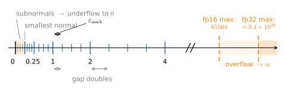
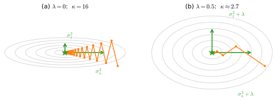

# Numerical Stability and Conditioning
:label:`sec_mdl-numerical-stability-conditioning`

The math can be right and your loss can still go to `NaN`. Every result in this
chapter so far was proved over the real numbers; your GPU computes over a
finite, gappy imitation of them. This section explains the floating-point
failure modes that bite real training runs (overflow, underflow, and
catastrophic cancellation) and the handful of two-line fixes that keep
softmax, cross-entropy, and ill-conditioned least squares alive:
max-subtraction, log-space arithmetic, and ridge regularization. Two ideas
organize everything. The first, due to numerical analysis and crystallized in
:citet:`Higham.2002`, is to split the blame for a wrong answer between the
*algorithm* (did it solve a nearby problem?) and the *problem* (do nearby
problems have wildly different answers?). The second is that the dividing line
is a single number we have already met: the **condition number**
$\kappa = \sigma_{\max}/\sigma_{\min}$ of :numref:`subsec_mdl-condition-number`,
the same $\kappa$ that sets gradient descent's convergence rate in
:numref:`sec_mdl-gradient-based-optimization`: one number, two consequences.
The payoffs land downstream: the log-space trick rescues naive Bayes in
:numref:`sec_mdl-naive_bayes` from underflow, and the stable cross-entropy here
is the same computation analyzed in :numref:`sec_mdl-information_theory`.

We proceed in four steps: what floating-point numbers are and where their
cliffs lie; how to compute softmax, log-sum-exp, and cross-entropy safely;
why subtracting nearly equal numbers destroys digits
and how reformulation (not higher precision) repairs it; and finally
conditioning: backward versus forward error, the Hilbert matrix,
why normal equations square the pain, and how ridge regularization
conditions the problem the way a preconditioner does. The standard references
are :citet:`Goldberg.1991` for floating point and :citet:`Higham.2002` for
everything else; :citet:`Goodfellow.Bengio.Courville.2016` (chapter 4) gives
the deep-learning framing. Most code in this section is plain NumPy, since
these phenomena belong to the arithmetic rather than to any library; the
exception is the cross-entropy experiment, where library behavior genuinely
differs.

```{.python .input #numerical-stability-conditioning-imports}
#@tab mxnet
%matplotlib inline
from d2l import mxnet as d2l
from mxnet import np as mxnp, npx
npx.set_np()
import numpy as np
```

```{.python .input #numerical-stability-conditioning-imports}
#@tab pytorch
%matplotlib inline
from d2l import torch as d2l
import torch
from torch.nn import functional as F
import numpy as np
```

```{.python .input #numerical-stability-conditioning-imports}
#@tab tensorflow
%matplotlib inline
from d2l import tensorflow as d2l
import tensorflow as tf
import ml_dtypes
import numpy as np
```

```{.python .input #numerical-stability-conditioning-imports}
#@tab jax
%matplotlib inline
from d2l import jax as d2l
import jax
from jax import numpy as jnp
import optax
import numpy as np
```

## Floating-Point Arithmetic
:label:`subsec_mdl-floating-point`

### A Number System with Gaps

A floating-point number is scientific notation in base $2$ with a fixed budget
of digits:

$$
x = (-1)^s \cdot (1.m_1 m_2 \ldots m_p)_2 \cdot 2^{e},
$$
:eqlabel:`eq_mdl-opt-float-format`

a sign bit $s$, a *mantissa* (significand) with $p$ stored bits, and an
integer exponent $e$ from a fixed range. The exponent gives enormous *range*,
the mantissa gives fixed *relative*
precision, and between consecutive powers of two the representable values are
evenly spaced, so the spacing *doubles* every time the magnitude does.
:numref:`fig_mdl-opt-fp-number-line` shows the resulting number line:
representable values crowd near zero and thin out toward the overflow
threshold,
while the *relative* gap between neighbors stays essentially constant.


:label:`fig_mdl-opt-fp-number-line`

That constant relative gap has a name. **Machine epsilon**
$\varepsilon_{\text{mach}}$ is the distance from $1$ to the next representable
number, $\varepsilon_{\text{mach}} = 2^{-p}$ for a $p$-bit mantissa, and it is
the relative-error floor of the entire arithmetic: rounding any real $x$ to
the nearest float $\mathrm{fl}(x)$ obeys

$$
\mathrm{fl}(x) = x\,(1 + \delta), \qquad |\delta| \le u = \tfrac12\,\varepsilon_{\text{mach}},
$$
:eqlabel:`eq_mdl-opt-rounding-model`

For a correctly rounded basic operation whose exact finite result lies in the
normal range, IEEE arithmetic gives the analogous model: the computed
$x \oplus y$ equals $(x + y)(1 + \delta)$ with $|\delta| \le u$
(:cite:`IEEE.754.2019,Goldberg.1991`). Overflow, division by zero, NaNs, and
results in the subnormal/underflow region require separate absolute-error
reasoning; those exceptions are central rather than incidental below. The quantity $u$ is the *unit
roundoff*. Everything
in this section is bookkeeping on these $(1+\delta)$ factors: one of them is
harmless; trouble starts when millions of them interact, or when a
subtraction promotes one from relative to *catastrophic* (we get there in
:numref:`subsec_mdl-catastrophic-cancellation`).

Deep learning juggles three formats; the table below prints their parameters
directly from the library:

```{.python .input #numerical-stability-conditioning-finfo}
import numpy as onp
header = f'{"dtype":>10} {"eps":>12} {"smallest normal":>17} {"max":>12}'
print(header)
for dt in [onp.float16, onp.float32]:
    fi = onp.finfo(dt)
    print(f'{onp.dtype(dt).name:>10} {fi.eps:12.3e} '
          f'{fi.smallest_normal:17.3e} {fi.max:12.3e}')

def to_bf16(x):
    """Round float32 to the nearest bfloat16 (round half to even)."""
    bits = onp.atleast_1d(onp.asarray(x, onp.float32)).view(onp.uint32)
    bits = (bits + 0x7FFF + ((bits >> 16) & 1)) & 0xFFFF0000
    return bits.astype(onp.uint32).view(onp.float32)

eps_bf16 = (to_bf16(1.0 + 2.0**-7) - 1.0).item()  # emulated: mxnet has no bf16
print(f'{"bfloat16":>10} {eps_bf16:12.3e}   (exponent range = float32)')
print('bfloat16 eps equals 2^-7:', eps_bf16 == 2.0**-7,
      ' and 1 + 2^-8 rounds back to 1:', to_bf16(1.0 + 2.0**-8).item() == 1.0)
```

Read the three rows as three different bargains. **fp32** ($p = 23$ mantissa
bits) has $\varepsilon_{\text{mach}} = 2^{-23} \approx 1.19 \times 10^{-7}$,
about seven decimal digits, with range up to
$3.4 \times 10^{38}$. **fp16** ($p = 10$) keeps a respectable
$\varepsilon_{\text{mach}} = 2^{-10} \approx 9.8 \times 10^{-4}$ but pays for
it with a *tiny* exponent range: it overflows at $65504$ and its smallest
normal number is about $6.1 \times 10^{-5}$, so big activations overflow and
small gradients underflow. **bfloat16** ($p = 7$) makes the opposite
trade: it keeps fp32's full exponent range and sacrifices the mantissa,
leaving $\varepsilon_{\text{mach}} = 2^{-7} = 0.0078$, between two and
three decimal digits. The printout confirms the value that is easy to misquote:
bfloat16's epsilon is $2^{-7}$, not $2^{-8}$; the eighth mantissa bit people
sometimes count is the *implicit* leading $1$ in
:eqref:`eq_mdl-opt-float-format`, which contributes precision to no gap.

Since 2022, hardware has pushed the same ladder one rung lower, to **fp8**,
standardized in two flavors :cite:`Micikevicius.Stosic.Burgess.ea.2022`.
**E4M3** ($p = 3$) keeps what resolution it can,
$\varepsilon_{\text{mach}} = 2^{-3} = 0.125$ or roughly *one* decimal digit,
inside a range that tops out at $448$; **E5M2** ($p = 2$) sacrifices another
mantissa bit to buy fp16's full exponent range (maximum $57344$, smallest
normal $6.1 \times 10^{-5}$). The division of labor is visible in the numbers:
E4M3 holds weights and activations, which need digits; E5M2 holds gradients,
which need range. And at $\varepsilon_{\text{mach}} = 0.125$ there is no slack
left in the format, so fp8 training must pair every tensor with a *scale
factor* that recenters its values on the representable window. Every halving
of the bit budget is paid for in digits, in range, or in bookkeeping.

```{.python .input #numerical-stability-conditioning-fp8}
#@tab pytorch
for dt in [torch.float8_e4m3fn, torch.float8_e5m2]:
    fi = torch.finfo(dt)
    print(f'{str(dt)[6:]:>13}  eps = {fi.eps:5}  '
          f'smallest normal = {fi.smallest_normal:12}  max = {fi.max:7}')
```

:begin_tab:`pytorch`
The printout confirms the trade digit for digit: three mantissa bits
buy E4M3 an epsilon of $0.125$ and a maximum of $448$; giving one of them up
buys E5M2 a maximum of $57344$ and fp16's smallest normal,
$6.1 \times 10^{-5}$, at the price of $\varepsilon_{\text{mach}} = 0.25$.
:end_tab:

Two quick experiments make $\varepsilon_{\text{mach}}$ tangible: adding half
an epsilon to $1$ vanishes without a trace, and the absolute gap between
neighbors is a million times larger at $2^{20}$ than at $1$:

```{.python .input #numerical-stability-conditioning-spacing}
eps = np.finfo(np.float32).eps
one = np.float32(1.0)
print('1 + eps   != 1 :', one + eps != one)
print('1 + eps/2 == 1 :', one + np.float32(eps / 2) == one)
print('gap between adjacent float32 values near 1    :',
      np.spacing(np.float32(1.0)))
print('gap between adjacent float32 values near 2^20 :',
      np.spacing(np.float32(2.0**20)))
for dt in [np.float16, np.float32]:
    print(f'{np.dtype(dt).name}: exp(x) overflows for x >',
          f'{np.log(np.finfo(dt).max):.2f}')
```

### Overflow, Underflow, and Mixed Precision

The last two printed lines locate the thresholds that matter most in practice.
Because $e^x$ turns additive scale into multiplicative scale, the overflow
threshold of each format translates into a modest *logit*:
$e^x = \infty$ in fp32 once $x > \ln(3.4 \times 10^{38}) \approx 88.72$, and
in fp16 once $x > \ln(65504) \approx 11.09$. Logits near $88.7$ are rare in
healthy training, so fp32 softmax overflow is uncommon in practice; fp16's
threshold of $11.09$ sits well inside the range of ordinary unnormalized
scores, and it is the one that bites, which is why the mixed-precision recipe
below exists. At the
other end, $e^{-x}$ *underflows*: below the smallest normal number the format
degrades gracefully through *subnormal* numbers with fewer and fewer
significant bits, and then hits exactly $0$, at which point a subsequent
$\log$ returns $-\infty$ and the backward pass turns to `NaN`.

This is the arithmetic behind **mixed-precision training**
:cite:`Micikevicius.Narang.Alben.ea.2018`. In fp16, gradients routinely fall
below $6 \times 10^{-5}$ and vanish, so the loss is multiplied by a scale
factor before the backward pass (and the gradients divided after) purely to
shift them into representable territory: *loss scaling* is purely underflow
management. bfloat16 makes that bookkeeping
unnecessary: with fp32's exponent range nothing reasonable overflows or
underflows, and the price, relative precision of only $2^{-7}$, is paid
where deep learning is most tolerant, in the noise-dominated mantissa of each
weight update. The reason a master copy of the weights is kept in fp32 is
:eqref:`eq_mdl-opt-rounding-model` again: a weight update of relative size
below $\varepsilon_{\text{mach}}/2$ rounds to *no update at all*, and at
$\varepsilon_{\text{mach}} = 2^{-7}$ that threshold is hit by perfectly
healthy learning rates. A third escape, increasingly common in fp8 and
integer training, is **stochastic rounding**
:cite:`Gupta.Agrawal.Gopalakrishnan.ea.2015`: round up or down at random with
probabilities proportional to proximity, so the *expected* stored value is
exact and updates too small to survive round-to-nearest still make progress
on average.

Both fp16 failure modes, and both rescues, fit in one cell. A gradient
whose true value is $10^{-8}$ underflows to zero during an fp16 backward
pass, and multiplying the *loss* by $2^{14}$ before differentiating shifts
the whole gradient chain into representable territory; a perfectly healthy
update of relative size $10^{-4}$ is lost to round-to-nearest in
fp16, and an fp32 master copy of the weights accepts it without complaint:

```{.python .input #numerical-stability-conditioning-loss-scaling}
#@tab pytorch
def fp16_grad(scale=1.0):
    w = torch.tensor(1.0, dtype=torch.float16, requires_grad=True)
    a = torch.tensor(1e-4, dtype=torch.float16)
    ((w * a) * a * scale).backward()    # true d/dw = a^2 = 1e-8 < 6e-8
    return w.grad.item() / scale        # unscale outside fp16
print('fp16 gradient, no scaling      :', fp16_grad())
print('fp16 gradient, loss scale 2^14 :', f'{fp16_grad(2.0**14):.3e}')

w, lr = torch.ones((), dtype=torch.float16), 0.01
g = torch.tensor(0.01, dtype=torch.float16)     # a healthy fp16 gradient
print('fp16 step w - lr*g leaves w unchanged :', bool(w - lr * g == w))
print('fp32 master copy takes the step       :',
      f'{float(w.float() - lr * g.float()):.6f}')
```

:begin_tab:`pytorch`
The unscaled backward pass reports a gradient of exactly $0.0$ (the
product $10^{-4} \times 10^{-4}$ fell below fp16's smallest subnormal,
$6 \times 10^{-8}$) while the loss-scaled route recovers
$1.000 \times 10^{-8}$. In the second half, $w - \eta g$ with
$\eta g = 10^{-4}$ *is* $w$ in fp16 (the update is smaller than half the
gap between $1$ and its fp16 neighbor), but the fp32 master copy lands on
$0.999900$ as it should. This is precisely what `torch.amp`'s `GradScaler`
plus fp32 master weights automate.
:end_tab:

## Making Softmax and Cross-Entropy Safe
:label:`subsec_mdl-stable-softmax`

### Softmax Overflows and the Shift That Fixes It

The most common stability bug in machine learning is one line long. The
softmax

$$
\mathrm{softmax}(\mathbf{z})_i = \frac{e^{z_i}}{\sum_{j=1}^n e^{z_j}}
$$

exponentiates its logits, and the table above says exactly where that goes
wrong: fp32 overflows the moment any logit exceeds $88.72$, fp16 already at
$11.09$: the numerator becomes `inf`, the ratio becomes `inf/inf = NaN`,
and the model dies even though the *probabilities* it was computing are
perfectly tame numbers in $[0, 1]$. The failure is entirely an artifact of
the route. You have met the repair before:
:numref:`subsec_softmax-implementation-revisited` derived it when the fused
cross-entropy loss was introduced, and we will not re-derive it here.
Factoring the positive constant $e^{-c}$ out of numerator and denominator
shows that softmax is *shift-invariant*,

$$
\mathrm{softmax}(\mathbf{z} - c\mathbf{1}) = \mathrm{softmax}(\mathbf{z})
\qquad \textrm{for every } c \in \mathbb{R},
$$
:eqlabel:`eq_mdl-opt-softmax-shift`

and the same factoring, applied under the logarithm of the denominator,
rewrites the **log-sum-exp** $\mathrm{lse}(\mathbf{z}) = \log \sum_j e^{z_j}$
exactly, for any shift $c$:

$$
\mathrm{lse}(\mathbf{z}) = c + \log \sum_{j=1}^n e^{z_j - c} .
$$
:eqlabel:`eq_mdl-opt-stable-lse`

:numref:`subsec_softmax-implementation-revisited` also gave the reason the
shifted route is safe for finite logits: with $c = \max_i z_i$ every
exponent is at most $0$, so each $e^{z_i-c}$ lies in $(0,1]$ and exponential
overflow is avoided; the largest term equals $1$, so the denominator, the sum
in :eqref:`eq_mdl-opt-stable-lse`, lies in $[1,n]$ and cannot underflow to
zero. For any practically storable vector this sum is also representable.
Non-finite inputs need separate handling (for example, subtracting an
all-$-\infty$ maximum is undefined). What the floating-point model of this
section adds is the quantification: the overflow thresholds ($88.72$ in fp32,
$11.09$ in fp16) say exactly when the naive route dies, while the shifted
route sends only the nonpositive differences $z_i-c$ to the exponential. The cell below watches the naive route produce `NaN`
on logits that the shifted route handles, and checks whether, where both
routes work, the two agree:

```{.python .input #numerical-stability-conditioning-stable-softmax}
def softmax_naive(z):
    e = np.exp(z)
    return e / e.sum()

def softmax_stable(z):
    e = np.exp(z - z.max())        # shift by the max: largest exponent is 0
    return e / e.sum()

z = np.array([1.0, 2.0, 3.0], dtype=np.float32)
with np.errstate(over='ignore', invalid='ignore'):
    print('naive,  logits z      :', softmax_naive(z))
    print('naive,  logits z + 100:', softmax_naive(z + 100.0))
print('stable, logits z + 100:', softmax_stable(z + 100.0))
print('naive and stable agree where both work:',
      bool((softmax_naive(z) == softmax_stable(z + 100.0)).all()))
```

The shifted logits give back $(0.090, 0.245, 0.665)$, the same probabilities
as the small logits, while the naive route returns three `NaN`s. Whether the
two routes agree *bit for bit* is a subtler question:
:eqref:`eq_mdl-opt-softmax-shift` promises equality of real numbers, and two
different exp/sum/divide routes may round differently along the way. Here
they agree to the last printed digit; the final check prints `True` on most
builds, but under one NumPy build in our environments it prints `False`, the
naive route's first entry differing by a single ulp ($0.09003058$ versus
$0.09003057$). That one-bit discrepancy is the section's lesson in
miniature: the identity constrains the real values, not the rounded ones.
The library's `softmax` does this max-subtraction internally; the trap is
re-implementing it yourself, which is why the practical rule is to use a
library's stable softmax or log-sum-exp rather than exponentiating raw logits.

### The Log-Sum-Exp Sandwich

The log-sum-exp recurs far beyond softmax: it is the normalizer of every
exponential-family model (:numref:`sec_mdl-distributions`) and, as we prove
in a moment, the backbone of cross-entropy. Beyond making it safe, the shift
in :eqref:`eq_mdl-opt-stable-lse` makes it *legible*, pinning lse between two
bounds tight enough to reason with:

**Proposition (log-sum-exp sandwich).** *For every
$\mathbf{z} \in \mathbb{R}^n$,*

$$
\max_j z_j \;\le\; \mathrm{lse}(\mathbf{z}) \;\le\; \max_j z_j + \log n .
$$

**Proof.** Put $c = \max_j z_j$ in :eqref:`eq_mdl-opt-stable-lse`. Every
term $e^{z_j - c} \le 1$ and the maximizing term equals $1$, so the sum lies
in $[1, n]$ and its logarithm in $[0, \log n]$; adding $c$ gives both
inequalities. $\blacksquare$

The sandwich says lse is a *soft maximum*, within $\log n$ of the true max,
which is also the intuition for why it is convex
(:numref:`sec_mdl-convexity`; its gradient is exactly the softmax, a fact you
will prove in the exercises). Numerically, the identity gives us log-space
arithmetic for free: the **log-softmax** is

$$
\log \mathrm{softmax}(\mathbf{z})_i = z_i - \mathrm{lse}(\mathbf{z}),
$$
:eqlabel:`eq_mdl-opt-log-softmax`

a subtraction that does not materialize the probability itself. It therefore
avoids the route in which a tiny probability first underflows to $0$ and its
log then becomes $-\infty$. Logits around $1000$ would overflow even float64;
in log space they are effortless:

```{.python .input #numerical-stability-conditioning-logsumexp}
def log_sum_exp(z):
    c = z.max()
    return c + np.log(np.exp(z - c).sum())

z = np.array([1000.0, 1001.0, 1002.0], dtype=np.float32)
with np.errstate(over='ignore'):
    print('naive  log(sum(exp(z))) :', np.log(np.exp(z).sum()))
print('stable log_sum_exp(z)   :', log_sum_exp(z))
log_p = z - log_sum_exp(z)             # log softmax, eq. above
print('log softmax             :', log_p)
print('probabilities sum to 1  :', f'{np.exp(log_p).sum():.6f}')
```

The naive route says `inf`; the stable route reports
$\mathrm{lse} = 1002.4076$, snugly inside the sandwich
$[1002, 1002 + \log 3]$, and the log-probabilities
$(-2.408, -1.408, -0.408)$ exponentiate back to a distribution summing to
$1.000013$: equal to $1$ up to the float32 spacing at magnitude $1000$,
which is all one can ask of subtractions performed there. This identity is precisely how :numref:`sec_mdl-naive_bayes`
multiplies hundreds of per-pixel probabilities without underflowing to zero:
sums of logs, never products of probabilities.

### Pass Logits, Not Probabilities

Cross-entropy is where the stakes are highest, because it is the loss
*gradient* that dies. For a label $y$,
:eqref:`eq_mdl-opt-log-softmax` gives

$$
-\log \mathrm{softmax}(\mathbf{z})_y = \mathrm{lse}(\mathbf{z}) - z_y,
$$
:eqlabel:`eq_mdl-opt-ce-from-logits`

computable *directly from the logits* with one stable lse and one
subtraction. This is what the library's "from logits" loss does (the
fused implementation of :numref:`subsec_softmax-implementation-revisited`),
and it is why those APIs exist. The alternative, computing probabilities
first and then taking the log, forces the loss through the representable
range of probabilities: a true-class probability below about $10^{-45}$ (the
smallest fp32 subnormal is $\approx 1.4 \times 10^{-45}$) underflows fp32 to
exactly $0$, and the loss becomes $\infty$. The cell below pits the
two routes against each other on a two-class problem where the label is the
*unlikely* class, with logit gap $t$, so the true loss is
$\log(1 + e^{t}) \approx t$. This is the one computation in this section
where library behavior genuinely differs; the from-probabilities route fails
in one of three ways, depending on the library: subnormal noise followed by
`inf`, `inf` outright, or a silent clip. Run the cell and read on:

```{.python .input #numerical-stability-conditioning-cross-entropy}
#@tab mxnet
print('gap    CE from logits    CE via probabilities')
for t in [20.0, 60.0, 103.0, 104.0]:
    logits = mxnp.array([[0.0, t]])              # label = class 0, the
    from_logits = -npx.log_softmax(logits, axis=1)[0, 0]   # unlikely one
    from_probs = -mxnp.log(npx.softmax(logits, axis=1))[0, 0]
    print(f'{t:5.0f}  {float(from_logits):15.4f}  {float(from_probs):15.4f}')
```

```{.python .input #numerical-stability-conditioning-cross-entropy}
#@tab pytorch
print('gap    CE from logits    CE via probabilities')
for t in [20.0, 60.0, 103.0, 104.0]:
    logits = torch.tensor([[0.0, t]])
    y = torch.tensor([0])                        # label = the unlikely class
    from_logits = F.cross_entropy(logits, y)
    probs = F.softmax(logits, dim=1)             # stable softmax, then...
    from_probs = -torch.log(probs[0, y])         # ...take the log yourself
    print(f'{t:5.0f}  {from_logits.item():15.4f}  {from_probs.item():15.4f}')
```

```{.python .input #numerical-stability-conditioning-cross-entropy}
#@tab tensorflow
print('gap    CE from logits    CE via probabilities')
for t in [20.0, 60.0, 103.0, 104.0]:
    logits = tf.constant([[0.0, t]])
    y = tf.constant([0])                         # label = the unlikely class
    from_logits = tf.keras.losses.sparse_categorical_crossentropy(
        y, logits, from_logits=True)[0]
    from_probs = tf.keras.losses.sparse_categorical_crossentropy(
        y, tf.nn.softmax(logits), from_logits=False)[0]
    print(f'{t:5.0f}  {float(from_logits):15.4f}  {float(from_probs):15.4f}')
```

```{.python .input #numerical-stability-conditioning-cross-entropy}
#@tab jax
print('gap    CE from logits    CE via probabilities')
for t in [20.0, 60.0, 103.0, 104.0]:
    logits = jnp.array([[0.0, t]])
    y = jnp.array([0])                           # label = the unlikely class
    from_logits = optax.softmax_cross_entropy_with_integer_labels(logits, y)
    from_probs = -jnp.log(jax.nn.softmax(logits)[0, 0])
    print(f'{t:5.0f}  {float(from_logits[0]):15.4f}  {float(from_probs):15.4f}')
```

:begin_tab:`mxnet`
The from-logits column reads $20$, $60$, $103$, $104$: exact at every gap.
The from-probabilities column matches at gaps $20$ and $60$; at gap $103$,
where $e^{-t}$ would survive only as a *subnormal* number, the softmax does
not linger in the subnormal range and the probability underflows to exactly
$0$, and at gap $104$ the underflow is unconditional, so the loss reads
`inf` at both gaps.
:end_tab:

:begin_tab:`pytorch`
The from-logits column reads $20$, $60$, $103$, $104$: exact at every gap.
The from-probabilities column matches until the probability $e^{-t}$ leaves
float32's normal range: at gap $103$ it has fallen among the *subnormals*,
where only a couple of significant bits survive, and the loss reads
$103.2789$, wrong in the first decimal place with no warning; at
gap $104$ the probability underflows to exactly $0$ and the loss is `inf`.
:end_tab:

:begin_tab:`tensorflow`
The from-logits column reads $20$, $60$, $103$, $104$: exact at every gap.
The from-probabilities column never produces an `inf` or a `NaN`, which
makes its failure the hardest kind to notice: Keras clips probabilities to
$[10^{-7},\, 1 - 10^{-7}]$ before taking the log, so every row reads
$16.1181 = -\log 10^{-7}$, a loss (and therefore a gradient) that silently
stopped depending on the model the moment the true loss exceeded about $16$.
:end_tab:

:begin_tab:`jax`
The from-logits column reads $20$, $60$, $103$, $104$: exact at every gap.
The from-probabilities column matches at gaps $20$ and $60$; at gap $103$,
where $e^{-t}$ would survive only as a *subnormal* number, XLA does not
linger in the subnormal range and the probability underflows to exactly $0$,
and at gap $104$ the underflow is unconditional, so the loss reads `inf` at
both gaps.
:end_tab:

The lesson generalizes far beyond this toy: losses, likelihoods, and
posteriors should live in log space from birth, and the conversion to
probabilities, if it ever happens, should be the *last* step, for human
eyes only. :numref:`sec_mdl-information_theory` analyzes what cross-entropy
*means*; :eqref:`eq_mdl-opt-ce-from-logits` is how it is *computed*.

## Catastrophic Cancellation
:label:`subsec_mdl-catastrophic-cancellation`

### Subtraction Annihilates Digits

Overflow announces itself with `inf`; cancellation gives no signal at all.
Subtracting two nearly equal numbers is *exact* (no new rounding error is
committed) but it strips away the leading digits on which both numbers
agreed, leaving only their trailing digits, which is exactly where each
number's *previous* rounding errors live. If $a$ and $b$ are correct to
relative error $u$, their difference can carry relative error as large as

$$
\frac{|a| + |b|}{|a - b|}\; u,
$$
:eqlabel:`eq_mdl-opt-cancellation-factor`

an amplification factor that blows up precisely when $a \approx b$. The
phenomenon is called **catastrophic cancellation**, and a two-line experiment
shows both the disease and a cure. In float32, $1 + 10^{-8}$ rounds to
exactly $1$ (the increment is below $\varepsilon_{\text{mach}}/2$), so the
textbook expression $\log(1 + x)$ returns $0$, a $100\%$ relative error,
while the library function `log1p`, which evaluates the *reformulated*
series around $0$, is exact. Likewise two floats agreeing to seven digits
leave a difference made of pure noise:

```{.python .input #numerical-stability-conditioning-log1p}
x = np.float32(1e-8)
print('float32 rounds 1 + x to     :', np.float32(1.0) + x)
print('log(1 + x) =', np.log(np.float32(1.0) + x),
      '   log1p(x) =', np.log1p(x))
a, b = np.float32(1.0002344), np.float32(1.0002341)
print('a - b in float32            :', a - b, '  (true value 3.0e-07)')
print('amplification (|a|+|b|)/|a-b| ~', f'{(a + b) / abs(a - b):.1e}')
```

The computed difference $2.384 \times 10^{-7}$ misses the true
$3.0 \times 10^{-7}$ by twenty percent: with an amplification factor near
$10^{7}$, float32's seven digits are gone in one subtraction. The catalogue
of standard victims is short: $\log(1+x)$ and $e^x - 1$
near $0$ (use `log1p` and `expm1`), $1 - \cos x$ near $0$ (use
$2\sin^2(x/2)$), the quadratic formula near a double root, and finite
differences with too small a step, which is exactly the trade-off we
quantified in :numref:`sec_mdl-single_variable_calculus`. In every case the
cure is the same: *reformulate so that the subtraction happens analytically*,
where it costs nothing, rather than numerically, where it costs everything.
Higher precision merely postpones the failure; reformulation removes it
:cite:`Higham.2002`.

### Case Study: Variance in One Pass

The classic cancellation bug in data science is the "computational formula"
for variance,

$$
\mathrm{Var}(x) = \mathbb{E}[x^2] - \mathbb{E}[x]^2,
$$

beloved because it needs one pass over the data. As algebra it is flawless; as
arithmetic it is a trap. For data with mean $\mu$ and standard deviation
$\sigma \ll |\mu|$, both terms are about $\mu^2$ while their difference is
$\sigma^2$, so :eqref:`eq_mdl-opt-cancellation-factor` predicts an error
amplification of about $\mu^2/\sigma^2$, and with $\mu = 10^9$ and
$\sigma = 1$ that is $10^{18}$: more than every digit float64 has. The naive
formula can even return a *negative* variance.

The repair is a reformulation due to
:citet:`Welford.1962` that keeps a running mean $m_k$ and a running sum of
*centered* squares $M_k = \sum_{i \le k} (x_i - m_k)^2$, so no large numbers
are ever subtracted:

$$
m_k = m_{k-1} + \frac{x_k - m_{k-1}}{k},
\qquad
M_k = M_{k-1} + (x_k - m_{k-1})(x_k - m_k).
$$
:eqlabel:`eq_mdl-opt-welford`

Note the two different factors in the $M_k$ update: the deviation from the
*old* mean times the deviation from the *new* mean. That asymmetry is
exactly what makes the recursion exact:

**Proposition (Welford's recursion is exact).** *With $m_0 = M_0 = 0$, the
recursions :eqref:`eq_mdl-opt-welford` satisfy, for every $k \ge 1$ and in
exact arithmetic,*

$$
m_k = \frac{1}{k} \sum_{i=1}^k x_i,
\qquad
M_k = \sum_{i=1}^k (x_i - m_k)^2 .
$$

**Proof.** The mean claim is the identity $k\, m_k = (k-1)\, m_{k-1} + x_k$,
immediate from the first recursion. For the second claim, induct on $k$ and
write $\delta = x_k - m_{k-1}$, so that $m_k - m_{k-1} = \delta/k$ and
$x_k - m_k = \delta\,(k-1)/k$. Splitting the new sum of squares at its last
term and re-centering the first $k-1$ terms around $m_{k-1}$,

$$
\sum_{i=1}^{k} (x_i - m_k)^2
= \sum_{i=1}^{k-1} \left( (x_i - m_{k-1}) - \tfrac{\delta}{k} \right)^2 + (x_k - m_k)^2
= M_{k-1} + (k-1)\tfrac{\delta^2}{k^2} + \tfrac{(k-1)^2}{k^2}\delta^2,
$$

where the cross term vanished because $\sum_{i \le k-1} (x_i - m_{k-1}) = 0$
and the inductive hypothesis named the first sum $M_{k-1}$. The two correction
terms combine to $\frac{k-1}{k}\,\delta^2 = \delta \cdot \delta \frac{k-1}{k}
= (x_k - m_{k-1})(x_k - m_k)$, which is precisely what the recursion adds.
$\blacksquare$

Numerically, every quantity Welford touches is of size $\sigma$, not $\mu$,
so the $\mu^2/\sigma^2$ amplification never materializes. The test:
$10^5$ samples with mean $10^9$ and true variance $1$, all in float64:

```{.python .input #numerical-stability-conditioning-welford}
rng = np.random.default_rng(0)
x = 1e9 + rng.normal(0.0, 1.0, size=100_000)    # huge mean, unit variance

naive = (x**2).mean() - x.mean()**2             # one pass, cancels
two_pass = ((x - x.mean())**2).mean()           # subtract the mean first

mean, m2 = 0.0, 0.0                             # Welford: one pass, stable
for k, xk in enumerate(x, start=1):
    delta = xk - mean
    mean += delta / k                           # m_k
    m2 += delta * (xk - mean)                   # M_k
welford = m2 / len(x)

print(f'naive E[x^2] - E[x]^2 : {naive:12.6f}')
print(f'Welford, one pass     : {welford:12.6f}')
print(f'two-pass reference    : {two_pass:12.6f}')
```

The naive formula reports a variance in the *hundreds*: off by a factor of
several hundred, in *double* precision, on a statistic every analyst computes
daily. The answer is pure amplified rounding noise, so even its sign depends
on the summation order of your NumPy build: the same cell printed $384$ under
one build and $-256$, a negative variance, under another. Welford's
one-pass answer $1.000257$ agrees with the two-pass reference to eight
significant digits on every build. This recursion (and its batch-merging
generalization, which you will derive in the exercises) is how `BatchNorm`
layers (:numref:`sec_batch_norm`) and streaming-statistics utilities track
running moments: one pass, bounded memory, no cancellation.

The build-dependence is general, because it belongs to summation itself.
Summing $n$ floats one after another commits one
$(1 + \delta)$ factor per addition, and the worst case compounds to a
relative error of about $n u$ (at $n = 10^{5}$ in the cell above, some
$10^{5}$ units of roundoff feeding the cancellation). **Pairwise summation**
recursively sums halves, so each term passes through only $\log_2 n$
additions and the error growth drops to $O(u \log n)$; this is what NumPy
does inside `sum`, and its build-dependent blocking is why the naive
formula's noise changed sign between builds. **Kahan (compensated)
summation** carries each addition's rounding error explicitly in a second
accumulator and drives the growth to $O(u)$, independent of $n$
:cite:`Kahan.1965,Higham.2002`. Welford composes with either: the pairwise
merge rule you will derive in Exercise 4 is precisely Welford in pairwise
form, and it is how running moments are combined across devices.

## Conditioning
:label:`subsec_mdl-conditioning-revisited`

### Backward and Forward Error

So far the *algorithms* were at fault, and rewriting them fixed everything.
The deeper half of numerical analysis begins with a different question: when a
computed answer is wrong, is the algorithm to blame, or the problem?
:citet:`Higham.2002` makes the split precise with two definitions. The
**forward error** is what you care about: the distance between the computed
answer $\hat{\mathbf{x}}$ and the true answer $\mathbf{x}$. The **backward
error** is what the algorithm should be judged by: the size of the smallest
perturbation of the *inputs* for which $\hat{\mathbf{x}}$ would be exactly
correct: "you got the right answer to a nearby question; how nearby?" An
algorithm with backward error at the rounding floor $u$ is called
**backward stable**: it did everything that can be asked of finite-precision
arithmetic, since merely *storing* the inputs already perturbs them by $u$.
Gaussian elimination with pivoting (elimination with row swaps that keep the
multipliers small; the algorithm inside `np.linalg.solve`) is backward
stable in practice, though not in the worst case, where its growth factor
can reach $2^{n-1}$ :cite:`Higham.2002`; the SVD is backward stable
outright; the naive variance formula is neither.

What converts a small backward error into a possibly-large forward error is a
property of the *problem*, and for linear systems it is exactly the condition
number $\kappa(\mathbf{A}) = \sigma_1/\sigma_n$ of
:numref:`subsec_mdl-condition-number`.

**Proposition (forward error $\le$ condition number $\times$ backward
error).** *Let $\mathbf{A}$ be invertible, let
$\mathbf{A}\mathbf{x} = \mathbf{b}$, and suppose the computed
$\hat{\mathbf{x}}$ exactly solves a nearby system,
$(\mathbf{A} + \delta\mathbf{A})\,\hat{\mathbf{x}} = \mathbf{b}$ with
$\|\delta\mathbf{A}\| \le \varepsilon \|\mathbf{A}\|$. Then*

$$
\frac{\|\hat{\mathbf{x}} - \mathbf{x}\|}{\|\hat{\mathbf{x}}\|}
\;\le\; \kappa(\mathbf{A})\, \varepsilon .
$$
:eqlabel:`eq_mdl-opt-backward-forward`

**Proof.** Subtracting $\mathbf{A}\mathbf{x} = \mathbf{b}$ from
$(\mathbf{A} + \delta\mathbf{A})\hat{\mathbf{x}} = \mathbf{b}$ gives
$\mathbf{A}(\hat{\mathbf{x}} - \mathbf{x}) = -\delta\mathbf{A}\,\hat{\mathbf{x}}$,
hence $\hat{\mathbf{x}} - \mathbf{x} = -\mathbf{A}^{-1}\delta\mathbf{A}\,\hat{\mathbf{x}}$
and

$$
\|\hat{\mathbf{x}} - \mathbf{x}\|
\le \|\mathbf{A}^{-1}\|\, \|\delta\mathbf{A}\|\, \|\hat{\mathbf{x}}\|
\le \|\mathbf{A}^{-1}\|\, \|\mathbf{A}\|\, \varepsilon\, \|\hat{\mathbf{x}}\|
= \kappa(\mathbf{A})\,\varepsilon\, \|\hat{\mathbf{x}}\|,
$$

using the operator-norm identities $\|\mathbf{A}\| = \sigma_1$ and
$\|\mathbf{A}^{-1}\| = 1/\sigma_n$ from :numref:`sec_mdl-svd-low-rank`.
$\blacksquare$

(The error here is measured relative to $\hat{\mathbf{x}}$; for small
$\varepsilon$ this matches the error relative to $\mathbf{x}$ to first
order.) This one inequality is the *division of labor* of numerical
computing: the algorithm's job is to make $\varepsilon$ small (backward
stability gives $\varepsilon \approx u$), the problem's conditioning decides
how much of that smallness survives, and the user's rule of thumb falls out
by taking $\log_{10}$ of both sides:

$$
\textrm{correct digits in } \hat{\mathbf{x}}
\;\approx\; \textrm{digits carried by the format} \;-\; \log_{10} \kappa(\mathbf{A}).
$$

A backward-stable solve in float64 carries about $16$ digits, so
$\kappa = 10^{k}$ costs you $k$ of them, and at $\kappa \approx 10^{16}$
the answer is pure noise even though the algorithm was flawless.

### The Condition Number of a Linear System

The same $\kappa$ also governs sensitivity to errors in the right-hand side,
the data in a least-squares problem: if $\mathbf{A}\mathbf{x} = \mathbf{b}$
and $\mathbf{A}(\mathbf{x} + \delta\mathbf{x}) = \mathbf{b} + \delta\mathbf{b}$,
then $\|\delta\mathbf{x}\|/\|\mathbf{x}\| \le
\kappa(\mathbf{A})\,\|\delta\mathbf{b}\|/\|\mathbf{b}\|$, the perturbation
bound :eqref:`eq_mdl-condition-bound` proved (together with the worst-case
construction showing it is tight) in :numref:`subsec_mdl-condition-number`.

Now we measure the digit loss on the most famously ill-conditioned matrix
in the business: the **Hilbert matrix** $H_{ij} = 1/(i + j - 1)$, whose
condition number grows exponentially with $n$. We solve
$\mathbf{H}\mathbf{x} = \mathbf{b}$ with the answer rigged to be
$\mathbf{x} = \mathbf{1}$, and tabulate the forward error, the digits that
survive, and the *backward* error, computed as the scaled residual
$\|\mathbf{H}\hat{\mathbf{x}} - \mathbf{b}\| / (\|\mathbf{H}\|\,\|\hat{\mathbf{x}}\|)$.
That this residual ratio equals the smallest relative perturbation of
$\mathbf{H}$ making $\hat{\mathbf{x}}$ exact is a classical theorem of
Rigal--Gaches (see :cite:`Higham.2002`), which is what lets a single
computable number stand in for the definition's minimization:

```{.python .input #numerical-stability-conditioning-hilbert}
print(' n      kappa   log10 kappa   forward error  correct digits  backward error')
for n in [4, 6, 8, 10, 12]:
    i = np.arange(n)
    H = 1.0 / (1.0 + i[:, None] + i[None, :])   # Hilbert matrix
    x_true = np.ones(n)
    b = H @ x_true
    x_hat = np.linalg.solve(H, b)
    kappa = np.linalg.cond(H)
    fwd = np.linalg.norm(x_hat - x_true) / np.linalg.norm(x_true)
    bwd = (np.linalg.norm(H @ x_hat - b)
           / (np.linalg.norm(H, 2) * np.linalg.norm(x_hat)))
    print(f'{n:2d}  {kappa:9.1e}  {np.log10(kappa):8.1f}  {fwd:14.1e}  '
          f'{-np.log10(fwd):11.1f}     {bwd:11.1e}')
```

Read the table row by row against the rule of thumb. At $n = 4$,
$\log_{10}\kappa \approx 4.2$ and about $13$ digits survive of float64's
$16$; by $n = 8$, $\log_{10}\kappa \approx 10.2$ and about $7$ survive; at
$n = 12$, $\log_{10}\kappa \approx 16.2$ and barely one correct digit remains:
the answer is essentially noise. (The trailing decimals of the error
column vary with your LAPACK build; the staircase does not.) Meanwhile the backward-error column never
leaves the $10^{-16}$ floor: *the solver is blameless at every row*. Each
$\hat{\mathbf{x}}$ exactly solves a system one part in $10^{16}$ away from
the one we posed; the Hilbert matrix simply maps that invisible perturbation
to a visible one, exactly as :eqref:`eq_mdl-opt-backward-forward` licenses it
to. Geometrically, large $\kappa$ means the level sets of
$\|\mathbf{A}\mathbf{x} - \mathbf{b}\|^2$ are extremely elongated ellipsoids:
the same narrow valley of :numref:`fig_mdl-la-condition`, down
which gradient descent zig-zags. Sensitivity of the solve and slowness of the
descent are *one geometric fact* viewed from two sides.

### Why Normal Equations Square the Pain

Least squares offers a vivid demonstration that the *route* to a solution can
ruin conditioning even when the destination is fine. The textbook route to
$\min_{\mathbf{w}} \|\mathbf{A}\mathbf{w} - \mathbf{b}\|^2$ is the normal
equations $\mathbf{A}^\top\mathbf{A}\,\mathbf{w} = \mathbf{A}^\top\mathbf{b}$,
which replace a solve governed by $\kappa(\mathbf{A})$ with one governed
by $\kappa(\mathbf{A}^\top\mathbf{A})$. Recall from
:numref:`subsec_mdl-condition-number` that this substitution is quadratically
bad: for any matrix $\mathbf{A}$ with full column rank,

$$
\kappa(\mathbf{A}^\top\mathbf{A}) = \kappa(\mathbf{A})^2 ,
$$
:eqlabel:`eq_mdl-opt-kappa-squared`

since $\mathbf{A}^\top\mathbf{A} = \mathbf{V}\boldsymbol{\Sigma}^2\mathbf{V}^\top$
(:numref:`subsec_mdl-svd-via-ata`) has singular values $\sigma_i^2$. What is
new here is the measurement of the cost in digits. By the rule of thumb, the
normal equations lose $2\log_{10}\kappa$
digits where an SVD- or QR-based solve, which works on $\mathbf{A}$ directly,
loses $\log_{10}\kappa$ (QR factors $\mathbf{A} = \mathbf{Q}\mathbf{R}$ with
$\mathbf{Q}$ orthonormal and $\mathbf{R}$ triangular, the factorization
behind the `qr` demo of :numref:`sec_mdl-geometry-linear-algebraic-ops`).
With $\kappa(\mathbf{A}) = 10^5$ the predicted gap
is five digits wide, large enough to measure:

```{.python .input #numerical-stability-conditioning-normal-equations}
rng = np.random.default_rng(1)
m, n = 100, 10
U, _ = np.linalg.qr(rng.normal(size=(m, n)))    # random orthonormal columns
V, _ = np.linalg.qr(rng.normal(size=(n, n)))
sigma = np.logspace(0, -5, n)                   # kappa(A) = 10^5 by design
A = U * sigma @ V.T                             # A = U diag(sigma) V^T
w_true = rng.normal(size=n)
b = A @ w_true
print(f'kappa(A) = {np.linalg.cond(A):.1e}   '
      f'kappa(A^T A) = {np.linalg.cond(A.T @ A):.1e}')
w_ne = np.linalg.solve(A.T @ A, A.T @ b)        # normal equations
w_svd = np.linalg.lstsq(A, b, rcond=None)[0]    # SVD-based solve
for name, w in [('normal equations', w_ne), ('SVD (lstsq)     ', w_svd)]:
    err = np.linalg.norm(w - w_true) / np.linalg.norm(w_true)
    print(f'{name}: relative error {err:.1e}  '
          f'({-np.log10(err):.1f} correct digits)')
```

The printout confirms both the identity ($\kappa$ of
$\mathbf{A}^\top\mathbf{A}$ is $10^{10}$, the square of $10^{5}$) and its
consequence: the normal equations recover about seven correct digits, the SVD
route about thirteen. Same problem, same data, same float64: five to six
digits of accuracy, right at the predicted $\log_{10}\kappa = 5$, forfeited
to a bad route. This is why `lstsq` exists, why numerical libraries solve
least-squares subproblems by QR or SVD, and why
:numref:`subsec_mdl-pseudoinverse` built the pseudoinverse from the SVD
rather than from $(\mathbf{A}^\top\mathbf{A})^{-1}\mathbf{A}^\top$.

### Ridge Regularization as Preconditioning

When $\kappa(\mathbf{A})$ itself is the problem (nearly collinear
features, a rank-deficient design), no choice of route saves the original
problem. A **preconditioner** transforms a problem to reduce its condition
number without changing its solution; the per-coordinate rescalings of
:numref:`sec_mdl-adaptive-stochastic-methods` apply the same idea inside an
optimizer. Ridge regularization conditions the problem the way a
preconditioner does, with one difference we return to below: it changes the
problem, and it changes it in exactly the right direction. Minimizing
$\|\mathbf{A}\mathbf{w} - \mathbf{b}\|^2 + \lambda \|\mathbf{w}\|^2$ yields

$$
\mathbf{w}_\lambda = (\mathbf{A}^\top\mathbf{A} + \lambda \mathbf{I})^{-1} \mathbf{A}^\top \mathbf{b},
$$
:eqlabel:`eq_mdl-opt-ridge-solution`

and the added $\lambda\mathbf{I}$ acts directly on the spectrum.

**Proposition (ridge improves conditioning monotonically).** *Let $\mathbf{A}$
have singular values $\sigma_1 \ge \cdots \ge \sigma_n \ge 0$. For every
$\lambda > 0$ the matrix $\mathbf{A}^\top\mathbf{A} + \lambda\mathbf{I}$ is
symmetric positive definite (hence invertible, even when $\mathbf{A}$ is rank
deficient), with*

$$
\kappa(\mathbf{A}^\top\mathbf{A} + \lambda\mathbf{I})
= \frac{\sigma_1^2 + \lambda}{\sigma_n^2 + \lambda},
$$
:eqlabel:`eq_mdl-opt-ridge-kappa`

*which is strictly decreasing in $\lambda$ whenever $\sigma_1 > \sigma_n$ and
tends to $1$ as $\lambda \to \infty$.*

**Proof.** Writing $\mathbf{A}^\top\mathbf{A} = \mathbf{V}\boldsymbol{\Sigma}^2\mathbf{V}^\top$
as above, $\mathbf{A}^\top\mathbf{A} + \lambda\mathbf{I} =
\mathbf{V}(\boldsymbol{\Sigma}^2 + \lambda\mathbf{I})\mathbf{V}^\top$: the
same eigenvectors, every eigenvalue shifted up to $\sigma_i^2 + \lambda \ge
\lambda > 0$. Positive definiteness and :eqref:`eq_mdl-opt-ridge-kappa`
follow. For monotonicity, with $a = \sigma_1^2 > b = \sigma_n^2$,

$$
\frac{d}{d\lambda} \frac{a + \lambda}{b + \lambda}
= \frac{b - a}{(b + \lambda)^2} < 0,
$$

and as $\lambda \to \infty$ the ratio tends to $1$. $\blacksquare$

Adding $\lambda\mathbf{I}$ lifts the floor of the spectrum while barely moving
its ceiling: the narrow valley we met above rounds out
into a bowl, as :numref:`fig_mdl-opt-conditioning-ellipse` shows, and the
single shift pays twice.
The solve in :eqref:`eq_mdl-opt-ridge-solution` becomes more accurate
(fewer digits lost, by the rule of thumb) and gradient descent on the ridge
objective, whose contraction factor $(\kappa - 1)/(\kappa + 1)$ we derived in
:numref:`sec_mdl-gradient-based-optimization`, becomes faster. The cell below
measures both at once: for each $\lambda$ it computes
:eqref:`eq_mdl-opt-ridge-kappa` and *runs* gradient descent to a fixed
relative tolerance of $10^{-6}$, counting iterations.


:label:`fig_mdl-opt-conditioning-ellipse`

```{.python .input #numerical-stability-conditioning-ridge}
rng = np.random.default_rng(2)
m, n = 200, 20
U, _ = np.linalg.qr(rng.normal(size=(m, n)))
V, _ = np.linalg.qr(rng.normal(size=(n, n)))
sigma = np.logspace(0, -2, n)                   # kappa(A) = 100
A = U * sigma @ V.T
b = A @ rng.normal(size=n)

def gd_iterations(lam, tol=1e-6):
    """Iterations for GD on the ridge objective to reach tol."""
    M, g = A.T @ A + lam * np.eye(n), A.T @ b
    w_star = np.linalg.solve(M, g)
    mu, L = sigma.min()**2 + lam, sigma.max()**2 + lam
    eta, w = 2.0 / (L + mu), np.zeros(n)        # optimal fixed step size
    for k in range(1, 200_000):
        w -= eta * (M @ w - g)
        if np.linalg.norm(w - w_star) <= tol * np.linalg.norm(w_star):
            return k

lams = np.logspace(-4, 0, 9)
kappas = (sigma.max()**2 + lams) / (sigma.min()**2 + lams)
iters = np.array([gd_iterations(lam) for lam in lams])
print('iterations / kappa:', (iters / kappas).round(2))
d2l.plot(lams, [kappas, iters.astype(float)], 'lambda', None,
         legend=['kappa(A^T A + lambda I)', 'GD iterations to 1e-6'],
         xscale='log', yscale='log')
```

The two curves fall together across four orders of magnitude of $\lambda$,
from $\kappa \approx 5000$ and roughly $29{,}000$ iterations at
$\lambda = 10^{-4}$ down to $\kappa = 2$ and a dozen iterations at
$\lambda = 1$, and the printed ratio sits between $5.89$ and $6.25$
throughout: iteration count is a constant multiple of $\kappa$, the constant
being about $\tfrac12 \ln(1/\textrm{tol}) \approx 6.9$ predicted by the
$(\kappa - 1)/(\kappa + 1)$ contraction (slightly less here because a random
initial error is not perfectly aligned with the slowest eigendirection).
Ridge thus conditions the problem exactly as a preconditioner would, with
one difference: a true preconditioner leaves the minimizer unchanged, while
ridge biases the solution, shrinking $\mathbf{w}_\lambda$ toward
$\mathbf{0}$; :numref:`sec_mdl-constrained-optimization-duality` showed the
precise sense in which the penalty $\lambda\|\mathbf{w}\|^2$ is the
Lagrangian counterpart of a norm constraint. In practice, the $\lambda$ you
were going to add anyway, for statistical reasons, has been quietly
stabilizing your arithmetic and accelerating your optimizer the whole time.

## Summary

* Floating point is scientific notation with a finite mantissa: relative
  precision $\varepsilon_{\text{mach}}$ ($2^{-23}$ for fp32, $2^{-10}$ for
  fp16, $2^{-7}$ for bfloat16), absolute gaps that double at every power of
  two, and overflow/underflow thresholds ($e^x$ dies at $x \approx 88.7$ in
  fp32, $x \approx 11.1$ in fp16). Mixed precision is engineering around
  these limits: loss scaling fights fp16 underflow; bfloat16 trades mantissa
  for fp32's exponent range; fp8 (E4M3/E5M2) tightens both budgets further
  and makes per-tensor scaling mandatory.
* Softmax is shift-invariant, so subtract the max before exponentiating;
  shifted log-sum-exp is an exact identity that prevents exponential overflow
  for finite logits (provided the final result itself is representable);
  cross-entropy should be computed from logits as
  $\mathrm{lse}(\mathbf{z}) - z_y$. Pass logits to your loss; the
  from-probabilities route ends in `inf`, `NaN`, or (worse) a silently
  clipped gradient.
* Catastrophic cancellation: subtracting nearly equal numbers amplifies
  existing relative error by $(|a|+|b|)/|a-b|$. The cure is reformulation,
  not precision: `log1p`/`expm1` near zero, and Welford's recursion
  $m_k = m_{k-1} + (x_k - m_{k-1})/k$,
  $M_k = M_{k-1} + (x_k - m_{k-1})(x_k - m_k)$ in place of
  $\mathbb{E}[x^2] - \mathbb{E}[x]^2$, which lost a factor of $400$ in
  float64.
* Backward error judges the algorithm, the condition number judges the
  problem, and forward error $\le \kappa \times$ backward error connects
  them: a backward-stable solve loses about $\log_{10}\kappa$ digits, as the
  Hilbert-matrix table showed digit for digit.
* Normal equations square the condition number
  ($\kappa(\mathbf{A}^\top\mathbf{A}) = \kappa(\mathbf{A})^2$; six digits
  lost vs. the SVD route in our experiment); ridge regularization moves it
  the other way, $\kappa = (\sigma_1^2 + \lambda)/(\sigma_n^2 + \lambda)$,
  monotonically improving both solve accuracy and the gradient-descent rate:
  one number, two consequences, and one knob that helps both.

## Exercises

1. Compute $\varepsilon_{\text{mach}}$ for float32 by a halving loop: start
   from $e = 1$ and halve until $1 + e == 1$ in float32. Why does the loop
   exit at $e = 2^{-24}$ rather than at $2^{-23}$, and how does that relate
   to the unit roundoff $u$ in :eqref:`eq_mdl-opt-rounding-model`? Repeat the
   loop with bfloat16 arithmetic (emulated or native) and confirm $2^{-7}$.
2. Find all integer logits $x$ for which $e^x$ overflows in fp16 but not in
   fp32. A network's final layer emits activations of size $\approx 30$:
   explain, with the numbers from this section, why training it in fp16
   without loss scaling fails even though the softmax probabilities are
   perfectly representable.
3. Prove that $\nabla\, \mathrm{lse}(\mathbf{z}) = \mathrm{softmax}(\mathbf{z})$
   and use :numref:`sec_mdl-convexity` to conclude that lse is convex.
   Then show that the cross-entropy :eqref:`eq_mdl-opt-ce-from-logits` has
   gradient $\mathrm{softmax}(\mathbf{z}) - \mathbf{e}_y$, another reason to
   compute the loss from logits.
4. Construct a small dataset (three numbers suffice) for which the naive
   variance formula returns a strictly *negative* number in float64, and
   verify that Welford's recursion :eqref:`eq_mdl-opt-welford` gets it right.
   Then derive the *pairwise merge* rule: given $(m, M, k)$ for two disjoint
   batches, express the combined statistics exactly; this is how the
   computation parallelizes across devices.
5. Show that if $a$ and $b$ carry relative errors of size $u$, the relative
   error of the computed $a - b$ can be as large as
   $(|a| + |b|)\,u / |a - b|$, and that the subtraction itself adds no
   rounding error when $a/2 \le b \le 2a$ (Sterbenz's lemma
   :cite:`Sterbenz.1974`; prove it for floats with the same exponent).
6. Rewrite each of the following to avoid cancellation, and check one of them
   numerically in float32: $\sqrt{x + 1} - \sqrt{x}$ for large $x$;
   $1 - \cos x$ for small $x$; the smaller root of $ax^2 + bx + c = 0$ when
   $b^2 \gg 4ac$.
7. For the Hilbert experiment, compute the backward error of each solve with
   respect to the right-hand side, $\|\mathbf{H}\hat{\mathbf{x}} - \mathbf{b}\|/\|\mathbf{b}\|$,
   and verify that the forward error is bounded by
   :eqref:`eq_mdl-condition-bound` applied to that perturbation. Where
   in the table is the bound tightest?
8. Let $\mathbf{A}$ have $\sigma_1 = 1$ and $\sigma_n = 10^{-3}$. Using
   :eqref:`eq_mdl-opt-ridge-kappa` and the GD contraction factor
   $(\kappa - 1)/(\kappa + 1)$ from
   :numref:`sec_mdl-gradient-based-optimization`, compute the condition
   number and the predicted iteration count (to relative error $10^{-6}$)
   for $\lambda \in \{0, 10^{-4}, 10^{-2}\}$. Then explain, via
   :numref:`sec_mdl-constrained-optimization-duality`, which constrained
   problem each $\lambda$ implicitly solves.

## Discussions

The condition number that set
gradient descent's speed in :numref:`sec_mdl-gradient-based-optimization` is
the same number that sets a linear solve's accuracy, and ridge regularization
(the Lagrangian twin of a norm constraint, per
:numref:`sec_mdl-constrained-optimization-duality`) improves both at once.
The stability toolkit travels well beyond this chapter: max-subtraction and
log-sum-exp power every softmax and attention layer; log-space arithmetic is
what makes naive Bayes (:numref:`sec_mdl-naive_bayes`) and probabilistic
inference generally feasible; the from-logits cross-entropy is the computation
:numref:`sec_mdl-information_theory` analyzes; and Welford-style running
moments live inside batch normalization. One neighboring story is told
elsewhere: the *depth* dimension of numerical stability (vanishing and
exploding gradients as the conditioning of Jacobian products through many
layers, and the initialization schemes that tame them) is the subject of
:numref:`sec_numerical_stability` in the main text, and
:numref:`chap_mdl-dynamics` takes up the continuous-time view of how such
errors and noise propagate through training. For the full theory, error
analysis of every algorithm in this book's linear-algebra substrate, the
reference remains :citet:`Higham.2002`.

[Discussions](https://d2l.discourse.group/t/numerical-stability-and-conditioning)

<!-- slides -->

::: {.slide}
::: {.cover}
[Dive into Deep Learning · §24.5]{.kicker}

Why the math is right but the loss is `NaN`<br>**floating point · stable softmax · cancellation · conditioning**.
:::
:::

::: {.slide title="The math is right; the loss is NaN"}
[Motivation]{.kicker}

::: {.cols .vc}
::: {.col}
Every proof in this chapter was over $\mathbb{R}$. Your GPU computes
over a finite, gappy imitation. When an answer is wrong, two questions
split the blame:

- Did the **algorithm** solve a nearby problem? *(backward error)*
- Do nearby problems have wildly different answers? *(conditioning)*

::: {.d2l-note}
The fixes are **reformulations**: max-subtraction,
log-space, Welford, ridge.
:::
:::

::: {.col .fig}
{width=100%}
:::
:::
:::

::: {.slide}
::: {.divider}
[01]{.dnum}

[Floating point]{.dtitle}

[a number system with gaps]{.dsub}
:::
:::

::: {.slide title="A number system with gaps"}
[Floating point]{.kicker}

::: {.cols .vc}
::: {.col}
A float is base-2 scientific notation with a fixed digit budget:

$$x = (-1)^s\,(1.m_1\ldots m_p)_2\; 2^{e}.$$

The exponent buys **range**; the mantissa fixes **relative** precision.
Between powers of two the spacing is constant, so the *absolute* gap
**doubles** at every power, and each format ends at an overflow threshold.

::: {.d2l-note .rule}
Machine epsilon $\varepsilon_{\text{mach}} = 2^{-p}$ is the gap from
$1$ to its successor: $\mathrm{fl}(x) = x(1+\delta)$,
$|\delta| \le \tfrac12 \varepsilon_{\text{mach}}$.
:::
:::

::: {.col .fig}
{width=100%}
:::
:::
:::

::: {.slide title="Three formats, three trade-offs"}
[Floating point]{.kicker}

Each row makes a different trade: fp32 spends bits on precision; fp16
keeps precision but its tiny exponent range overflows and underflows early;
**bfloat16** keeps fp32's range and sacrifices the mantissa.

@!numerical-stability-conditioning-finfo

::: {.d2l-note}
bfloat16's epsilon is $2^{-7}$, **not** $2^{-8}$: the eighth "bit" is
the implicit leading $1$, which fills no gap.
:::
:::

::: {.slide title="fp8: E4M3 and E5M2" only="pytorch"}
[Floating point]{.kicker}

Since 2022 hardware also offers **fp8**, in two flavors with a division of
labor: **E4M3** keeps digits ($\varepsilon = 0.125$, about
one decimal) for weights and activations; **E5M2** trades a mantissa bit
for fp16's full range, for gradients:

@!numerical-stability-conditioning-fp8

::: {.d2l-note .warn}
At $\varepsilon_{\text{mach}} = 0.125$ there is no slack left: fp8
training must pair *every tensor* with a scale factor.
:::
:::

::: {.slide title="fp8: E4M3 and E5M2" except="pytorch"}
[Floating point]{.kicker}

Since 2022 hardware also offers **fp8**, in two flavors with a division of
labor:

::: {.d2l-note .rule}
**E4M3** keeps digits: $\varepsilon = 0.125$ (about one decimal),
max $= 448$: for weights and activations.
**E5M2** trades a mantissa bit for fp16's full range: max $= 57344$,
smallest normal $6.1\times10^{-5}$, at $\varepsilon = 0.25$: for
gradients, which need range.
:::

::: {.d2l-note .warn}
At $\varepsilon_{\text{mach}} = 0.125$ there is no slack left: fp8
training must pair *every tensor* with a scale factor. (The `ml_dtypes`
package provides both formats.)
:::
:::

::: {.slide title="Where the thresholds are"}
[Floating point]{.kicker}

Because $e^x$ turns additive scale into multiplicative scale, a modest
*logit* overflows: fp32 dies at $x \approx 88.7$, fp16 at $x \approx 11.1$.

@!numerical-stability-conditioning-spacing

::: {.d2l-note .warn}
fp16 gradients below $6\times10^{-5}$ vanish; updates of relative size
below $\varepsilon_{\text{mach}}/2$ round to *no update at all*. Both
limits bite mixed-precision training (next slide).
:::
:::

::: {.slide title="Both fp16 failure modes, both rescues, one cell" only="pytorch"}
[Floating point]{.kicker}

A true gradient of $10^{-8}$ underflows fp16's backward pass to $0.0$;
scaling the *loss* by $2^{14}$ shifts the whole chain into representable
territory. A healthy update of relative size $10^{-4}$ is lost to
round-to-nearest; an fp32 master copy accepts it:

@!numerical-stability-conditioning-loss-scaling

::: {.d2l-note .rule}
**Loss scaling is underflow management; master weights are rounding
management.** This is precisely what `torch.amp`'s `GradScaler` plus
fp32 master weights automate, and what bfloat16's fp32-sized exponent
makes unnecessary.
:::
:::

::: {.slide title="Both fp16 failure modes, both rescues" except="pytorch"}
[Floating point]{.kicker}

The two failure modes, and their two escapes, in mixed-precision training:

- A true gradient of $10^{-8}$ **underflows** an fp16 backward pass to an
  exact $0.0$; multiplying the *loss* by $2^{14}$ before differentiating
  (and unscaling after) shifts the whole gradient chain into representable
  territory and recovers $1.000\times10^{-8}$.
- A healthy update of relative size $10^{-4}$ is **lost** to
  round-to-nearest in fp16 ($w - \eta g = w$ exactly); an fp32 master copy
  of the weights accepts it without complaint.

::: {.d2l-note .rule}
**Loss scaling is underflow management; master weights are rounding
management**: this is what the library's mixed-precision utilities
automate, and what bfloat16's fp32-sized exponent makes unnecessary.
:::
:::

::: {.slide}
::: {.divider}
[02]{.dnum}

[Softmax & cross-entropy]{.dtitle}

[the one-line bug, and the shift that fixes it]{.dsub}
:::
:::

::: {.slide title="Softmax overflows; subtract the max"}
[Stable softmax]{.kicker}

The most common stability bug is one line: $\mathrm{softmax}$
exponentiates logits, so any logit past $88.7$ makes the numerator
`inf` and the ratio `NaN`. But softmax is **shift-invariant**:

$$\mathrm{softmax}(\mathbf{z} - c\mathbf{1}) = \mathrm{softmax}(\mathbf{z}),$$

so, for finite logits, shift by $c = \max_i z_i$: every exponent is
$\le 0$, the denominator sits in $[1,n]$, and exponential overflow is avoided.

. . .

@!numerical-stability-conditioning-stable-softmax
:::

::: {.slide title="Log-sum-exp: an exact, safe identity"}
[Stable softmax]{.kicker}

The softmax normalizer earns its own operator. The same shift rewrites it
exactly:

$$\mathrm{lse}(\mathbf{z}) = \log\textstyle\sum_j e^{z_j}
= c + \log\textstyle\sum_j e^{z_j - c},
\qquad \max_j z_j \le \mathrm{lse}(\mathbf{z}) \le \max_j z_j + \log n.$$

Logits near $1000$ overflow even float64; in log space they are
effortless:

@!numerical-stability-conditioning-logsumexp

::: {.d2l-note .rule}
A *soft maximum*, within $\log n$ of the true max, and the reason
naive Bayes sums logs instead of multiplying probabilities.
:::
:::

::: {.slide title="Pass logits, not probabilities"}
[Stable softmax]{.kicker}

Cross-entropy is computable straight from logits with one stable lse:

$$-\log\mathrm{softmax}(\mathbf{z})_y = \mathrm{lse}(\mathbf{z}) - z_y.$$

The via-probabilities route forces the loss through the representable
range of probabilities and **fails in one of three ways**, depending on
the library: subnormal noise before `inf`, `inf` outright, or a silent
clip:

@!numerical-stability-conditioning-cross-entropy
:::

::: {.slide title="How the from-probabilities route fails" only="pytorch"}
[Stable softmax]{.kicker}

The label is the *unlikely* class, so the true loss is the logit gap.
From logits it is exact at every gap; via probabilities it fails:

::: {.d2l-note .warn}
**PyTorch.** Matches until $e^{-t}$ falls among the subnormals:
at gap $103$ the loss reads $103.2789$ (wrong in the first decimal, no
warning), and at gap $104$ it underflows to `inf`.
:::

The lesson generalizes: losses and likelihoods should **live in log
space from birth**; convert to probabilities last.
:::

::: {.slide title="How the from-probabilities route fails" only="mxnet"}
[Stable softmax]{.kicker}

The label is the *unlikely* class, so the true loss is the logit gap.
From logits it is exact at every gap; via probabilities it fails:

::: {.d2l-note .warn}
**MXNet.** The softmax does not linger in the subnormal range: $e^{-t}$
underflows to exactly $0$ already at gap $103$, and the loss reads
`inf` at gaps $103$ and $104$.
:::

The lesson generalizes: losses and likelihoods should **live in log
space from birth**; convert to probabilities last.
:::

::: {.slide title="How the from-probabilities route fails" only="jax"}
[Stable softmax]{.kicker}

The label is the *unlikely* class, so the true loss is the logit gap.
From logits it is exact at every gap; via probabilities it fails:

::: {.d2l-note .warn}
**JAX.** XLA does not linger in the subnormal range: $e^{-t}$
underflows to exactly $0$ already at gap $103$, and the loss reads
`inf` at gaps $103$ and $104$.
:::

The lesson generalizes: losses and likelihoods should **live in log
space from birth**; convert to probabilities last.
:::

::: {.slide title="How the from-probabilities route fails" only="tensorflow"}
[Stable softmax]{.kicker}

The label is the *unlikely* class, so the true loss is the logit gap.
From logits it is exact at every gap; via probabilities it fails:

::: {.d2l-note .warn}
**TensorFlow.** Keras clips probabilities to
$[10^{-7}, 1{-}10^{-7}]$, so every row reads $16.1181 = -\log 10^{-7}$.
No `inf`, no `NaN`: the gradient just silently stopped depending on
the model.
:::

The lesson generalizes: losses and likelihoods should **live in log
space from birth**; convert to probabilities last.
:::

::: {.slide}
::: {.divider}
[03]{.dnum}

[Catastrophic cancellation]{.dtitle}

[subtracting near-equal numbers]{.dsub}
:::
:::

::: {.slide title="Subtraction annihilates digits"}
[Cancellation]{.kicker}

Subtracting nearly equal numbers is *exact*, yet it strips the leading
digits they agreed on, exposing the trailing noise. Relative error is
amplified by $\tfrac{|a| + |b|}{|a - b|}\,u$, which blows up precisely
when $a \approx b$. In float32, $1 + 10^{-8}$ rounds to $1$, so
$\log(1+x)$ returns $0$, but `log1p` is exact:

@!numerical-stability-conditioning-log1p

::: {.d2l-note .rule}
Standard victims: $\log(1{+}x)$, $e^x{-}1$ near $0$ (`log1p`, `expm1`);
$1{-}\cos x$; the quadratic formula near a double root. **Reformulate;
don't add bits.**
:::
:::

::: {.slide title="Welford beats E[x²] − E[x]²" except="mxnet"}
[Cancellation]{.kicker}

The one-pass variance formula $\mathbb{E}[x^2] - \mathbb{E}[x]^2$
subtracts two numbers near $\mu^2$ to get $\sigma^2$, amplification
$\mu^2/\sigma^2$. Welford keeps a running mean and *centered* sum of
squares, so nothing large is ever subtracted:

$$m_k = m_{k-1} + \frac{x_k - m_{k-1}}{k},
\qquad M_k = M_{k-1} + (x_k - m_{k-1})(x_k - m_k).$$

Mean $10^9$, true variance $1$, $10^5$ samples, all in float64:

@!numerical-stability-conditioning-welford

::: {.d2l-note}
The naive formula is off by a factor of several hundred *in double
precision*; Welford agrees with the two-pass reference to eight digits.
This is how `BatchNorm` tracks running moments.
:::
:::

::: {.slide title="Welford beats E[x²] − E[x]²" only="mxnet"}
[Cancellation]{.kicker}

The one-pass variance formula $\mathbb{E}[x^2] - \mathbb{E}[x]^2$
subtracts two numbers near $\mu^2$ to get $\sigma^2$, amplification
$\mu^2/\sigma^2$. Welford keeps a running mean and *centered* sum of
squares, so nothing large is ever subtracted:

$$m_k = m_{k-1} + \frac{x_k - m_{k-1}}{k},
\qquad M_k = M_{k-1} + (x_k - m_{k-1})(x_k - m_k).$$

Mean $10^9$, true variance $1$, $10^5$ samples, all in float64:

@!numerical-stability-conditioning-welford

::: {.d2l-note .warn}
The naive answer is pure amplified noise; here it even comes out
**negative** ($-256$), a variance below zero, its sign hostage to the
summation order. This is what `BatchNorm` avoids with running moments.
:::
:::

::: {.slide title="Summation order is an algorithm"}
[Cancellation]{.kicker}

The naive variance's noise changed *sign* between NumPy builds. That is
summation error at work. Adding $n$ floats left to
right commits one rounding per addition, worst case $\approx n\,u$; the
repairs reorganize the additions:

::: {.d2l-note .rule}
**left-to-right** $O(n\,u)$ · **pairwise** (sum halves recursively)
$O(u \log n)$ (what NumPy's `sum` does, blocking and all) ·
**Kahan** (carry each rounding in a second accumulator) $O(u)$,
independent of $n$
:::

. . .

Welford composes with either: the pairwise merge rule is exactly how
running moments are combined across devices.
:::

::: {.slide}
::: {.divider}
[04]{.dnum}

[Conditioning]{.dtitle}

[backward error, forward error, and κ]{.dsub}
:::
:::

::: {.slide title="Backward and forward error"}
[Conditioning]{.kicker}

::: {.cols .vc}
::: {.col}
**Forward error** is what you want: $\|\hat{\mathbf{x}} - \mathbf{x}\|$.
**Backward error** judges the algorithm: the smallest input
perturbation for which $\hat{\mathbf{x}}$ is *exactly* right. The
condition number converts one into the other:

$$\frac{\|\hat{\mathbf{x}} - \mathbf{x}\|}{\|\hat{\mathbf{x}}\|}
\le \kappa(\mathbf{A})\,\varepsilon.$$

::: {.d2l-note .rule}
correct digits $\approx$ format digits $-\,\log_{10}\kappa(\mathbf{A})$.
A backward-stable float64 solve carries $\approx 16$; $\kappa = 10^k$
costs you $k$.
:::
:::

::: {.col .fig}
{width=100%}
:::
:::
:::

::: {.slide title="Hilbert matrices: the rule of thumb, verified"}
[Conditioning]{.kicker}

$\kappa$ of the Hilbert matrix $H_{ij} = 1/(i{+}j{-}1)$ grows
exponentially. Solving $\mathbf{H}\mathbf{x} = \mathbf{b}$ with
$\mathbf{x} = \mathbf{1}$, the surviving digits track the rule of thumb
row by row:

@!numerical-stability-conditioning-hilbert

::: {.d2l-note}
The **backward** error never leaves the $10^{-16}$ floor; the solver
is *blameless* at every row. The matrix, not the algorithm, amplifies
the error.
:::
:::

::: {.slide title="Normal equations square the pain"}
[Conditioning]{.kicker}

Solving least squares via $\mathbf{A}^\top\mathbf{A}\,\mathbf{w} =
\mathbf{A}^\top\mathbf{b}$ replaces $\kappa(\mathbf{A})$ with its
**square**:

$$\kappa(\mathbf{A}^\top\mathbf{A}) = \kappa(\mathbf{A})^2.$$

With $\kappa(\mathbf{A}) = 10^5$, that is five extra digits lost versus
an SVD/QR solve on $\mathbf{A}$ directly:

@!numerical-stability-conditioning-normal-equations

::: {.d2l-note}
This is why `lstsq` exists and numerical libraries solve least squares
by QR or SVD, never by forming $\mathbf{A}^\top\mathbf{A}$.
:::
:::

::: {.slide title="Ridge regularization as preconditioning"}
[Conditioning]{.kicker}

::: {.cols .vc}
::: {.col}
Adding $\lambda\|\mathbf{w}\|^2$ lifts every eigenvalue of
$\mathbf{A}^\top\mathbf{A}$ by $\lambda$, so
$\kappa = \tfrac{\sigma_1^2 + \lambda}{\sigma_n^2 + \lambda}\downarrow 1$:
the valley rounds into a bowl, and the same $\lambda$ pays twice,
accurate solves *and* fast gradient descent. Unlike a true
preconditioner, ridge changes the minimizer: it shrinks
$\mathbf{w}_\lambda$ toward $\mathbf{0}$.

@!numerical-stability-conditioning-ridge
:::

::: {.col .fig}
{width=100%}
:::
:::
:::

::: {.slide title="Recap"}
[Wrap-up]{.kicker}

::: {.cols}
::: {.col}
- **Floating point:** relative precision $\varepsilon_{\text{mach}}$,
  gaps that double, overflow thresholds ($e^x$ dies at $x\approx 88.7$ in
  fp32).
- **Stable softmax:** subtract the max; log-sum-exp is exact; compute
  cross-entropy from logits as $\mathrm{lse}(\mathbf{z}) - z_y$.
:::

::: {.col}
- **Cancellation:** reformulate, don't add bits (`log1p`, Welford).
- **Conditioning:** forward $\le \kappa \times$ backward error; normal
  equations square $\kappa$, ridge lowers it.
:::
:::

::: {.d2l-note}
$\kappa$ sets both solve accuracy and gradient-descent speed, and ridge
is the one knob that helps both. The fixes throughout are
reformulations rather than extra bits.
:::
:::
