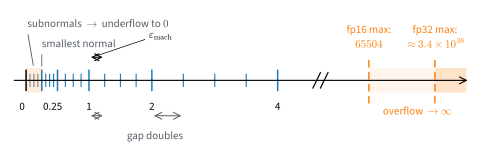
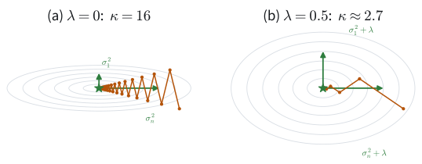

# Numerical Stability and Conditioning
:label:`sec_mdl-numerical-stability-conditioning`

The preceding results assume exact arithmetic over the real numbers, whereas
computers use finite-precision floating-point numbers. Overflow, underflow, and
catastrophic cancellation can therefore invalidate a mathematically correct
algorithm. This section develops stable formulations of softmax,
cross-entropy, and least squares using maximum subtraction, log-space
arithmetic, and ridge regularization. Numerical analysis separates error due to
the algorithm from sensitivity inherent in the problem
:cite:`Higham.2002`. The **condition number**
$\kappa = \sigma_{\max}/\sigma_{\min}$ quantifies that sensitivity and also
governs the convergence rate of gradient descent in
:numref:`sec_mdl-gradient-based-optimization`. The same stable computations
appear in naive Bayes (:numref:`sec_mdl-naive_bayes`) and information-theoretic
losses (:numref:`sec_mdl-information_theory`).

We proceed in four steps: the representation and range of floating-point
numbers; stable computation of softmax, log-sum-exp, and cross-entropy;
why subtracting nearly equal numbers destroys digits
and how reformulation (not higher precision) reduces the error; and finally
conditioning: backward versus forward error, the Hilbert matrix,
why normal equations square the condition number, and how ridge regularization
conditions the problem the way a preconditioner does. The standard references
are :citet:`Goldberg.1991` for floating point and :citet:`Higham.2002` for
the numerical error analysis; :citet:`Goodfellow.Bengio.Courville.2016`
(chapter 4) gives
the deep-learning framing. Most code in this section is plain NumPy, since
these phenomena belong to the arithmetic rather than to any library; the
exception is the cross-entropy experiment, where library behavior genuinely
differs.

```{.python .input #numerical-stability-conditioning-imports}
#@tab mxnet
%matplotlib inline
from d2l import mxnet as d2l
from mxnet import np as mxnp, npx
npx.set_np()
import numpy as np
```

```{.python .input #numerical-stability-conditioning-imports}
#@tab pytorch
%matplotlib inline
from d2l import torch as d2l
import torch
from torch.nn import functional as F
import numpy as np
```

```{.python .input #numerical-stability-conditioning-imports}
#@tab tensorflow
%matplotlib inline
from d2l import tensorflow as d2l
import tensorflow as tf
import ml_dtypes
import numpy as np
```

```{.python .input #numerical-stability-conditioning-imports}
#@tab jax
%matplotlib inline
from d2l import jax as d2l
import jax
from jax import numpy as jnp
import optax
import numpy as np
```

## Floating-Point Arithmetic
:label:`subsec_mdl-floating-point`

### Representation and Spacing

A floating-point number is scientific notation in base $2$ with a fixed budget
of digits:

$$
x = (-1)^s \cdot (1.m_1 m_2 \ldots m_p)_2 \cdot 2^{e},
$$
:eqlabel:`eq_mdl-opt-float-format`

a sign bit $s$, a *mantissa* (significand) with $p$ stored bits, and an
integer exponent $e$ from a fixed range. The exponent gives enormous *range*,
the mantissa gives fixed *relative*
precision, and between consecutive powers of two the representable values are
evenly spaced, so the spacing *doubles* every time the magnitude does.
:numref:`fig_mdl-opt-fp-number-line` shows the resulting number line:
representable values crowd near zero and thin out toward the overflow
threshold,
while the *relative* gap between neighbors stays essentially constant.


:label:`fig_mdl-opt-fp-number-line`

That constant relative gap has a name. **Machine epsilon**
$\varepsilon_{\text{mach}}$ is the distance from $1$ to the next representable
number, $\varepsilon_{\text{mach}} = 2^{-p}$ for a $p$-bit mantissa. For a
nonzero real $x$ whose rounded value is finite and normal, round-to-nearest
obeys

$$
\mathrm{fl}(x) = x\,(1 + \delta), \qquad |\delta| \le u = \tfrac12\,\varepsilon_{\text{mach}},
$$
:eqlabel:`eq_mdl-opt-rounding-model`

For a correctly rounded basic operation whose exact finite result lies in the
normal range, IEEE arithmetic gives the analogous model: the computed
$x \oplus y$ equals $(x + y)(1 + \delta)$ with $|\delta| \le u$
(:cite:`IEEE.754.2019,Goldberg.1991`). Overflow, division by zero, NaNs, and
results in the subnormal/underflow region require separate absolute-error
reasoning; those exceptions are central rather than incidental below. The
quantity $u$ is the *unit roundoff*. Repeated operations accumulate these
rounding terms, and subtraction can amplify error already present in its
operands, as discussed in
:numref:`subsec_mdl-catastrophic-cancellation`).

Deep-learning systems commonly use three formats. The following table obtains
their parameters directly from the library:

```{.python .input #numerical-stability-conditioning-finfo}
import numpy as onp
header = f'{"dtype":>10} {"eps":>12} {"smallest normal":>17} {"max":>12}'
print(header)
for dt in [onp.float16, onp.float32]:
    fi = onp.finfo(dt)
    print(f'{onp.dtype(dt).name:>10} {fi.eps:12.3e} '
          f'{fi.smallest_normal:17.3e} {fi.max:12.3e}')

def to_bf16(x):
    """Round float32 to the nearest bfloat16 (round half to even)."""
    bits = onp.atleast_1d(onp.asarray(x, onp.float32)).view(onp.uint32)
    bits = (bits + 0x7FFF + ((bits >> 16) & 1)) & 0xFFFF0000
    return bits.astype(onp.uint32).view(onp.float32)

eps_bf16 = (to_bf16(1.0 + 2.0**-7) - 1.0).item()  # emulated: mxnet has no bf16
print(f'{"bfloat16":>10} {eps_bf16:12.3e}   (exponent range = float32)')
print('bfloat16 eps equals 2^-7:', eps_bf16 == 2.0**-7,
      ' and 1 + 2^-8 rounds back to 1:', to_bf16(1.0 + 2.0**-8).item() == 1.0)
```

The three formats make different precision--range tradeoffs. **fp32** ($p = 23$ mantissa
bits) has $\varepsilon_{\text{mach}} = 2^{-23} \approx 1.19 \times 10^{-7}$,
about seven decimal digits, with range up to
$3.4 \times 10^{38}$. **fp16** ($p = 10$) keeps
$\varepsilon_{\text{mach}} = 2^{-10} \approx 9.8 \times 10^{-4}$ but has a
small exponent range: it overflows at $65504$ and its smallest
normal number is about $6.1 \times 10^{-5}$, so big activations overflow and
small gradients underflow. **bfloat16** ($p = 7$) makes the opposite
trade: it keeps fp32's full exponent range and sacrifices the mantissa,
leaving $\varepsilon_{\text{mach}} = 2^{-7} = 0.0078$, between two and
three decimal digits. The printout confirms the value that is easy to misquote:
bfloat16's epsilon is $2^{-7}$, not $2^{-8}$; the eighth mantissa bit people
sometimes count is the *implicit* leading $1$ in
:eqref:`eq_mdl-opt-float-format`, which fills no gap.

Since 2022, hardware has extended this progression to **fp8**, standardized in
two formats :cite:`Micikevicius.Stosic.Burgess.ea.2022`. **E4M3** ($p=3$)
has $\varepsilon_{\text{mach}}=2^{-3}=0.125$, roughly one decimal digit of
precision, and a maximum magnitude of $448$. **E5M2** ($p=2$) gives up one
mantissa bit in exchange for fp16's exponent range, with maximum $57344$ and
smallest normal value $6.1\times10^{-5}$. E4M3 is often used for weights and
activations, where precision is important, while E5M2 is useful for gradients
that require greater range. Practical fp8 training uses tensor- or block-level
scale factors to keep values inside the representable interval. The reduced
bit budget therefore trades precision and range against scaling overhead.

```{.python .input #numerical-stability-conditioning-fp8}
#@tab pytorch
for dt in [torch.float8_e4m3fn, torch.float8_e5m2]:
    fi = torch.finfo(dt)
    print(f'{str(dt)[6:]:>13}  eps = {fi.eps:5}  '
          f'smallest normal = {fi.smallest_normal:12}  max = {fi.max:7}')
```

:begin_tab:`pytorch`
The printout shows the tradeoff directly. With three mantissa bits, E4M3 has
epsilon $0.125$ and maximum $448$. E5M2 uses two mantissa bits, so its epsilon
is $0.25$, but its maximum is $57344$ and its smallest normal value is
$6.1\times10^{-5}$, matching fp16's exponent range.
:end_tab:

The following experiments illustrate $\varepsilon_{\text{mach}}$. Adding half
an epsilon to $1$ rounds back to $1$, and the absolute gap between adjacent
values is about a million times larger at $2^{20}$ than at $1$:

```{.python .input #numerical-stability-conditioning-spacing}
eps = np.finfo(np.float32).eps
one = np.float32(1.0)
print('1 + eps   != 1 :', one + eps != one)
print('1 + eps/2 == 1 :', one + np.float32(eps / 2) == one)
print('gap between adjacent float32 values near 1    :',
      np.spacing(np.float32(1.0)))
print('gap between adjacent float32 values near 2^20 :',
      np.spacing(np.float32(2.0**20)))
for dt in [np.float16, np.float32]:
    print(f'{np.dtype(dt).name}: exp(x) overflows for x >',
          f'{np.log(np.finfo(dt).max):.2f}')
```

### Overflow, Underflow, and Mixed Precision

The last two printed lines locate the thresholds that matter most in practice.
Because $e^x$ turns additive scale into multiplicative scale, the overflow
threshold of each format translates into a modest *logit*:
$e^x = \infty$ in fp32 once $x > \ln(3.4 \times 10^{38}) \approx 88.72$, and
in fp16 once $x > \ln(65504) \approx 11.09$. Logits near $88.7$ are rare in
healthy training, so fp32 softmax overflow is uncommon in practice; fp16's
threshold of $11.09$ sits well inside the range of ordinary unnormalized
scores, so mixed-precision implementations must account for it. At the
other end, $e^{-x}$ *underflows*: below the smallest normal number the format
degrades gracefully through *subnormal* numbers with fewer and fewer
significant bits, and then hits exactly $0$, at which point a subsequent
$\log$ returns $-\infty$ and the backward pass turns to `NaN`.

These observations explain the main components of **mixed-precision training**
:cite:`Micikevicius.Narang.Alben.ea.2018`. In fp16, gradients can fall below
$6\times10^{-5}$ and underflow. *Loss scaling* multiplies the loss before
backpropagation and divides the resulting gradients afterward, moving
intermediate gradients into the representable range. Because bfloat16 has the
same exponent range as fp32, it usually requires less protection against
gradient underflow. It still permits overflow in exponentials, products, and
accumulators, and its relative precision is only $2^{-7}$; stable formulations
and higher-precision accumulation therefore remain necessary.

A master copy of the weights is kept in fp32 for a related reason. By
:eqref:`eq_mdl-opt-rounding-model`, an update smaller than half a unit in the
last place rounds to zero. At bfloat16 precision, ordinary learning rates can
produce such updates. **Stochastic rounding** offers another approach
:cite:`Gupta.Agrawal.Gopalakrishnan.ea.2015`: it randomly selects either
adjacent representable value with probabilities chosen so that the expected
stored value equals the exact result. Updates too small for deterministic
round-to-nearest can then accumulate in expectation.

The following cell demonstrates both fp16 failure modes and their remedies. A
true gradient of $10^{-8}$ underflows to zero during an fp16 backward pass.
Multiplying the loss by $2^{14}$ before differentiation keeps the intermediate
gradient representable. Separately, an update of relative size $10^{-4}$ is
lost when applied to an fp16 weight but remains effective when applied to an
fp32 master copy:

```{.python .input #numerical-stability-conditioning-loss-scaling}
#@tab pytorch
def fp16_grad(scale=1.0):
    w = torch.tensor(1.0, dtype=torch.float16, requires_grad=True)
    a = torch.tensor(1e-4, dtype=torch.float16)
    ((w * a) * a * scale).backward()    # true d/dw = a^2 = 1e-8 < 6e-8
    return w.grad.item() / scale        # unscale outside fp16
print('fp16 gradient, no scaling      :', fp16_grad())
print('fp16 gradient, loss scale 2^14 :', f'{fp16_grad(2.0**14):.3e}')

w, lr = torch.ones((), dtype=torch.float16), 0.01
g = torch.tensor(0.01, dtype=torch.float16)     # a healthy fp16 gradient
print('fp16 step w - lr*g leaves w unchanged :', bool(w - lr * g == w))
print('fp32 master copy takes the step       :',
      f'{float(w.float() - lr * g.float()):.6f}')
```

:begin_tab:`pytorch`
The unscaled backward pass reports a gradient of exactly $0.0$ (the
product $10^{-4} \times 10^{-4}$ fell below fp16's smallest subnormal,
$6 \times 10^{-8}$) while the loss-scaled route recovers
$1.000 \times 10^{-8}$. In the second half, $w - \eta g$ with
$\eta g = 10^{-4}$ *is* $w$ in fp16 (the update is smaller than half the
gap between $1$ and its fp16 neighbor), but the fp32 master copy lands on
$0.999900$ as it should. This is precisely what `torch.amp`'s `GradScaler`
plus fp32 master weights automate.
:end_tab:

## Making Softmax and Cross-Entropy Safe
:label:`subsec_mdl-stable-softmax`

### Softmax Overflows and the Shift That Fixes It

A direct implementation of softmax is numerically unstable. The function

$$
\mathrm{softmax}(\mathbf{z})_i = \frac{e^{z_i}}{\sum_{j=1}^n e^{z_j}}
$$

exponentiates its logits, and the table above says exactly where that goes
wrong: fp32 overflows the moment any logit exceeds $88.72$, fp16 already at
$11.09$. The numerator becomes `inf`, the ratio becomes `inf/inf = NaN`,
even though the resulting *probabilities* lie in $[0, 1]$. The failure is due
to the intermediate exponentials. The stable formulation was derived in
:numref:`subsec_softmax-implementation-revisited` when the fused
cross-entropy loss was introduced.
Factoring the positive constant $e^{-c}$ out of numerator and denominator
shows that softmax is *shift-invariant*,

$$
\mathrm{softmax}(\mathbf{z} - c\mathbf{1}) = \mathrm{softmax}(\mathbf{z})
\qquad \textrm{for every } c \in \mathbb{R},
$$
:eqlabel:`eq_mdl-opt-softmax-shift`

and the same factoring, applied under the logarithm of the denominator,
rewrites the **log-sum-exp** $\mathrm{lse}(\mathbf{z}) = \log \sum_j e^{z_j}$
exactly, for any shift $c$:

$$
\mathrm{lse}(\mathbf{z}) = c + \log \sum_{j=1}^n e^{z_j - c} .
$$
:eqlabel:`eq_mdl-opt-stable-lse`

:numref:`subsec_softmax-implementation-revisited` explains why this shift is
safe for finite logits. With $c=\max_i z_i$, every exponent is nonpositive, so
$e^{z_i-c}\in(0,1]$ and cannot overflow. At least one term equals $1$, making
the denominator in :eqref:`eq_mdl-opt-stable-lse` lie in $[1,n]$ and
preventing underflow to zero. Non-finite inputs still require separate
handling; for example, subtracting an all-$-\infty$ maximum is undefined.

The floating-point parameters above quantify the benefit. The direct
calculation overflows above $88.72$ in fp32 and $11.09$ in fp16, whereas the
shifted calculation exponentiates only nonpositive differences. The following
cell compares the two implementations on large logits and also checks their
agreement when both remain finite:

```{.python .input #numerical-stability-conditioning-stable-softmax}
def softmax_naive(z):
    e = np.exp(z)
    return e / e.sum()

def softmax_stable(z):
    e = np.exp(z - z.max())        # shift by the max: largest exponent is 0
    return e / e.sum()

z = np.array([1.0, 2.0, 3.0], dtype=np.float32)
with np.errstate(over='ignore', invalid='ignore'):
    print('naive,  logits z      :', softmax_naive(z))
    print('naive,  logits z + 100:', softmax_naive(z + 100.0))
print('stable, logits z + 100:', softmax_stable(z + 100.0))
print('naive and stable agree where both work:',
      bool((softmax_naive(z) == softmax_stable(z + 100.0)).all()))
```

The shifted logits produce $(0.090,0.245,0.665)$, the same probabilities as
the small logits, while the direct calculation returns three `NaN` values.
Exact agreement at the bit level is not guaranteed:
:eqref:`eq_mdl-opt-softmax-shift` is an identity over real numbers, but the
two evaluation orders may round differently. The values agree to the displayed
precision. On most builds the final equality check returns `True`; on one
NumPy build, the first entries differ by one unit in the last place
($0.09003058$ versus $0.09003057$). Thus the algebraic identity constrains the
exact values, not every intermediate rounding. Library implementations of
`softmax` apply maximum subtraction internally and should generally be used in
place of direct exponentiation.

### Bounds for Log-Sum-Exp

Log-sum-exp appears throughout exponential-family models as their normalizer
(:numref:`sec_mdl-distributions`) and also determines cross-entropy. The shift
in :eqref:`eq_mdl-opt-stable-lse` yields the following useful bounds:

**Proposition (log-sum-exp sandwich).** *For every
$\mathbf{z} \in \mathbb{R}^n$,*

$$
\max_j z_j \;\le\; \mathrm{lse}(\mathbf{z}) \;\le\; \max_j z_j + \log n .
$$

**Proof.** Put $c = \max_j z_j$ in :eqref:`eq_mdl-opt-stable-lse`. Every
term $e^{z_j - c} \le 1$ and the maximizing term equals $1$, so the sum lies
in $[1, n]$ and its logarithm in $[0, \log n]$; adding $c$ gives both
inequalities. $\blacksquare$

These bounds show that lse is a *soft maximum* whose difference from the
maximum is at most $\log n$. Its gradient is the softmax, which also establishes
convexity (:numref:`sec_mdl-convexity`; the exercises derive this result).
The same identity gives a stable expression for **log-softmax**:

$$
\log \mathrm{softmax}(\mathbf{z})_i = z_i - \mathrm{lse}(\mathbf{z}),
$$
:eqlabel:`eq_mdl-opt-log-softmax`

This expression does not materialize the probability. It therefore avoids
underflowing a tiny probability to zero before taking its logarithm. Logits
near $1000$ overflow under direct exponentiation even in float64, while the
log-space computation remains finite:

```{.python .input #numerical-stability-conditioning-logsumexp}
def log_sum_exp(z):
    c = z.max()
    return c + np.log(np.exp(z - c).sum())

z = np.array([1000.0, 1001.0, 1002.0], dtype=np.float32)
with np.errstate(over='ignore'):
    print('naive  log(sum(exp(z))) :', np.log(np.exp(z).sum()))
print('stable log_sum_exp(z)   :', log_sum_exp(z))
log_p = z - log_sum_exp(z)             # log softmax, eq. above
print('log softmax             :', log_p)
print('probabilities sum to 1  :', f'{np.exp(log_p).sum():.6f}')
```

The direct calculation returns `inf`, whereas the stable calculation gives
$\mathrm{lse}=1002.4076$, within the bound
$[1002,1002+\log3]$. The log probabilities
$(-2.408,-1.408,-0.408)$ exponentiate to values summing to $1.000013$, the
rounding error expected from float32 subtraction at this magnitude.
:numref:`sec_mdl-naive_bayes` uses the same principle to combine hundreds of
per-pixel probabilities: it adds log probabilities instead of multiplying
probabilities.

### Pass Logits, Not Probabilities

Cross-entropy should also be computed in log space because underflow can
otherwise destroy both the loss and its gradient. For label $y$,
:eqref:`eq_mdl-opt-log-softmax` gives

$$
-\log \mathrm{softmax}(\mathbf{z})_y = \mathrm{lse}(\mathbf{z}) - z_y,
$$
:eqlabel:`eq_mdl-opt-ce-from-logits`

This expression computes the loss directly from logits using one stable lse
and one subtraction. It is the basis of the fused loss introduced in
:numref:`subsec_softmax-implementation-revisited`. If probabilities are formed
first, a true-class probability below roughly $10^{-45}$ underflows to zero in
fp32 and its negative logarithm becomes infinite.

The following cell compares the two routes for a two-class problem in which
the label is the unlikely class and the logit gap is $t$. The exact loss is
$\log(1+e^t)\approx t$. Depending on the library, the probability-based
calculation exhibits subnormal rounding error, returns `inf`, or silently
clips the probability.

```{.python .input #numerical-stability-conditioning-cross-entropy}
#@tab mxnet
print('gap    CE from logits    CE via probabilities')
for t in [20.0, 60.0, 103.0, 104.0]:
    logits = mxnp.array([[0.0, t]])              # label = class 0, the
    from_logits = -npx.log_softmax(logits, axis=1)[0, 0]   # unlikely one
    from_probs = -mxnp.log(npx.softmax(logits, axis=1))[0, 0]
    print(f'{t:5.0f}  {float(from_logits):15.4f}  {float(from_probs):15.4f}')
```

```{.python .input #numerical-stability-conditioning-cross-entropy}
#@tab pytorch
print('gap    CE from logits    CE via probabilities')
for t in [20.0, 60.0, 103.0, 104.0]:
    logits = torch.tensor([[0.0, t]])
    y = torch.tensor([0])                        # label = the unlikely class
    from_logits = F.cross_entropy(logits, y)
    probs = F.softmax(logits, dim=1)             # stable softmax, then...
    from_probs = -torch.log(probs[0, y])         # ...take the log yourself
    print(f'{t:5.0f}  {from_logits.item():15.4f}  {from_probs.item():15.4f}')
```

```{.python .input #numerical-stability-conditioning-cross-entropy}
#@tab tensorflow
print('gap    CE from logits    CE via probabilities')
for t in [20.0, 60.0, 103.0, 104.0]:
    logits = tf.constant([[0.0, t]])
    y = tf.constant([0])                         # label = the unlikely class
    from_logits = tf.keras.losses.sparse_categorical_crossentropy(
        y, logits, from_logits=True)[0]
    from_probs = tf.keras.losses.sparse_categorical_crossentropy(
        y, tf.nn.softmax(logits), from_logits=False)[0]
    print(f'{t:5.0f}  {float(from_logits):15.4f}  {float(from_probs):15.4f}')
```

```{.python .input #numerical-stability-conditioning-cross-entropy}
#@tab jax
print('gap    CE from logits    CE via probabilities')
for t in [20.0, 60.0, 103.0, 104.0]:
    logits = jnp.array([[0.0, t]])
    y = jnp.array([0])                           # label = the unlikely class
    from_logits = optax.softmax_cross_entropy_with_integer_labels(logits, y)
    from_probs = -jnp.log(jax.nn.softmax(logits)[0, 0])
    print(f'{t:5.0f}  {float(from_logits[0]):15.4f}  {float(from_probs):15.4f}')
```

:begin_tab:`mxnet`
The from-logits column reads $20$, $60$, $103$, $104$: exact at every gap.
The from-probabilities column matches at gaps $20$ and $60$; at gap $103$,
where $e^{-t}$ would survive only as a *subnormal* number, the softmax does
not linger in the subnormal range and the probability underflows to exactly
$0$, and at gap $104$ the underflow is unconditional, so the loss reads
`inf` at both gaps.
:end_tab:

:begin_tab:`pytorch`
The from-logits column reads $20$, $60$, $103$, $104$: exact at every gap.
The from-probabilities column matches until the probability $e^{-t}$ leaves
float32's normal range: at gap $103$ it has fallen among the *subnormals*,
where only a couple of significant bits survive, and the loss reads
$103.2789$, wrong in the first decimal place with no warning; at
gap $104$ the probability underflows to exactly $0$ and the loss is `inf`.
:end_tab:

:begin_tab:`tensorflow`
The from-logits column reads $20$, $60$, $103$, $104$: exact at every gap.
The from-probabilities column never produces an `inf` or a `NaN`, which
makes its failure the hardest kind to notice: Keras clips probabilities to
$[10^{-7},\, 1 - 10^{-7}]$ before taking the log, so every row reads
$16.1181 = -\log 10^{-7}$, a loss (and therefore a gradient) that silently
stopped depending on the model the moment the true loss exceeded about $16$.
:end_tab:

:begin_tab:`jax`
The from-logits column reads $20$, $60$, $103$, $104$: exact at every gap.
The from-probabilities column matches at gaps $20$ and $60$; at gap $103$,
where $e^{-t}$ would survive only as a *subnormal* number, XLA does not
linger in the subnormal range and the probability underflows to exactly $0$,
and at gap $104$ the underflow is unconditional, so the loss reads `inf` at
both gaps.
:end_tab:

Losses, likelihoods, and posterior calculations should remain in log space
until probabilities are explicitly needed. :numref:`sec_mdl-information_theory`
analyzes the meaning of cross-entropy, while
:eqref:`eq_mdl-opt-ce-from-logits` gives its stable computation.

## Catastrophic Cancellation
:label:`subsec_mdl-catastrophic-cancellation`

### Error from Subtracting Nearby Values

Overflow is usually visible as `inf`, whereas cancellation may produce an
ordinary finite result with little accuracy. Subtracting two nearby
floating-point numbers can be exact, but the leading digits cancel and expose
the rounding errors already present in the operands. If $a$ and $b$ each have
relative error at most $u$, their difference can have relative error as large
as

$$
\frac{|a| + |b|}{|a - b|}\; u,
$$
:eqlabel:`eq_mdl-opt-cancellation-factor`

This amplification becomes large when $a\approx b$ and is called
**catastrophic cancellation**. The following experiment compares unstable and
stable formulations. In float32, $1+10^{-8}$ rounds to exactly $1$, so
$\log(1+x)$ returns zero and has 100% relative error. The function `log1p`
instead evaluates a formulation designed for small $x$ and retains the
increment. The second example subtracts two values that agree in their first
seven decimal digits:

```{.python .input #numerical-stability-conditioning-log1p}
x = np.float32(1e-8)
print('float32 rounds 1 + x to     :', np.float32(1.0) + x)
print('log(1 + x) =', np.log(np.float32(1.0) + x),
      '   log1p(x) =', np.log1p(x))
a, b = np.float32(1.0002344), np.float32(1.0002341)
print('a - b in float32            :', a - b, '  (true value 3.0e-07)')
print('amplification (|a|+|b|)/|a-b| ~', f'{(a + b) / abs(a - b):.1e}')
```

The computed difference $2.384 \times 10^{-7}$ misses the true
$3.0 \times 10^{-7}$ by twenty percent: with an amplification factor near
$10^{7}$, float32's seven digits are gone in one subtraction. The catalogue
of standard victims is short: $\log(1+x)$ and $e^x - 1$
near $0$ (use `log1p` and `expm1`), $1 - \cos x$ near $0$ (use
$2\sin^2(x/2)$), the quadratic formula near a double root, and finite
differences with too small a step, which is exactly the trade-off we
quantified in :numref:`sec_mdl-single_variable_calculus`. In every case the
remedy is the same: when an equivalent expression avoids subtracting nearby
rounded values, use that formulation. Higher precision reduces the error but
does not remove the amplification mechanism; reformulation can remove it
:cite:`Higham.2002`.

### Case Study: Variance in One Pass

The classic cancellation bug in data science is the "computational formula"
for variance,

$$
\mathrm{Var}(x) = \mathbb{E}[x^2] - \mathbb{E}[x]^2,
$$

because it needs one pass over the data. The identity is exact in real
arithmetic but unstable in floating-point arithmetic. For data with mean
$\mu$ and standard deviation
$\sigma \ll |\mu|$, both terms are about $\mu^2$ while their difference is
$\sigma^2$, so :eqref:`eq_mdl-opt-cancellation-factor` predicts an error
amplification of about $\mu^2/\sigma^2$, and with $\mu = 10^9$ and
$\sigma = 1$ that is $10^{18}$: more than every digit float64 has. The naive
formula can even return a *negative* variance.

An alternative formulation due to
:citet:`Welford.1962` that keeps a running mean $m_k$ and a running sum of
*centered* squares $M_k = \sum_{i \le k} (x_i - m_k)^2$, so no large numbers
are ever subtracted:

$$
m_k = m_{k-1} + \frac{x_k - m_{k-1}}{k},
\qquad
M_k = M_{k-1} + (x_k - m_{k-1})(x_k - m_k).
$$
:eqlabel:`eq_mdl-opt-welford`

Note the two different factors in the $M_k$ update: the deviation from the
*old* mean times the deviation from the *new* mean. That asymmetry is
exactly what makes the recursion exact:

**Proposition (Welford's recursion is exact).** *With $m_0 = M_0 = 0$, the
recursions :eqref:`eq_mdl-opt-welford` satisfy, for every $k \ge 1$ and in
exact arithmetic,*

$$
m_k = \frac{1}{k} \sum_{i=1}^k x_i,
\qquad
M_k = \sum_{i=1}^k (x_i - m_k)^2 .
$$

**Proof.** The mean claim is the identity $k\, m_k = (k-1)\, m_{k-1} + x_k$,
immediate from the first recursion. For the second claim, induct on $k$ and
write $\delta = x_k - m_{k-1}$, so that $m_k - m_{k-1} = \delta/k$ and
$x_k - m_k = \delta\,(k-1)/k$. Splitting the new sum of squares at its last
term and re-centering the first $k-1$ terms around $m_{k-1}$,

$$
\sum_{i=1}^{k} (x_i - m_k)^2
= \sum_{i=1}^{k-1} \left( (x_i - m_{k-1}) - \tfrac{\delta}{k} \right)^2 + (x_k - m_k)^2
= M_{k-1} + (k-1)\tfrac{\delta^2}{k^2} + \tfrac{(k-1)^2}{k^2}\delta^2,
$$

where the cross term vanished because $\sum_{i \le k-1} (x_i - m_{k-1}) = 0$
and the inductive hypothesis named the first sum $M_{k-1}$. The two correction
terms combine to $\frac{k-1}{k}\,\delta^2 = \delta \cdot \delta \frac{k-1}{k}
= (x_k - m_{k-1})(x_k - m_k)$, which is precisely what the recursion adds.
$\blacksquare$

Welford's recursion operates on centered deviations of scale $\sigma$ rather
than raw values of scale $\mu$, thereby avoiding the
$\mu^2/\sigma^2$ amplification. We test it on $10^5$ float64 samples with mean
$10^9$ and variance near $1$:

```{.python .input #numerical-stability-conditioning-welford}
rng = np.random.default_rng(0)
x = 1e9 + rng.normal(0.0, 1.0, size=100_000)    # huge mean, unit variance

naive = (x**2).mean() - x.mean()**2             # one pass, cancels
two_pass = ((x - x.mean())**2).mean()           # subtract the mean first

mean, m2 = 0.0, 0.0                             # Welford: one pass, stable
for k, xk in enumerate(x, start=1):
    delta = xk - mean
    mean += delta / k                           # m_k
    m2 += delta * (xk - mean)                   # M_k
welford = m2 / len(x)

print(f'naive E[x^2] - E[x]^2 : {naive:12.6f}')
print(f'Welford, one pass     : {welford:12.6f}')
print(f'two-pass reference    : {two_pass:12.6f}')
```

The direct formula reports a variance of several hundred, although the data
have variance near one. Its result is dominated by amplified rounding error
and depends on summation order: this cell produced $384$ on one NumPy build
and $-256$ on another. Welford's one-pass estimate, $1.000257$, agrees with
the two-pass reference to eight significant digits across these builds.
`BatchNorm` layers (:numref:`sec_batch_norm`) and streaming-statistics
utilities use this recursion or its batch-merging generalization to estimate
moments in one pass with bounded memory and without the unstable subtraction.

The build-dependence is general, because it belongs to summation itself.
Summing $n$ floats one after another commits one
$(1 + \delta)$ factor per addition, and the worst case compounds to a
relative error of about $n u$ (at $n = 10^{5}$ in the cell above, some
$10^{5}$ units of roundoff feeding the cancellation). **Pairwise summation**
recursively sums halves, so each term passes through only $\log_2 n$
additions and the error growth drops to $O(u \log n)$; this is what NumPy
does inside `sum`, and its build-dependent blocking is why the naive
formula's noise changed sign between builds. **Kahan (compensated)
summation** carries each addition's rounding error explicitly in a second
accumulator and drives the growth to $O(u)$, independent of $n$
:cite:`Kahan.1965,Higham.2002`. Welford composes with either: the pairwise
merge rule you will derive in Exercise 4 is precisely Welford in pairwise
form, and it is how running moments are combined across devices.

## Conditioning
:label:`subsec_mdl-conditioning-revisited`

### Backward and Forward Error

The preceding examples concerned error introduced by an unstable formulation.
Numerical analysis also separates this algorithmic error from sensitivity
inherent in the problem :cite:`Higham.2002`. The **forward error** measures
the distance between the computed result $\hat{\mathbf{x}}$ and the exact
result $\mathbf{x}$. The **backward error** is the smallest input perturbation
for which $\hat{\mathbf{x}}$ would be an exact result.

An algorithm is **backward stable** if its computed result solves a nearby
problem whose relative input perturbation is of order $u$, up to moderate
dimension- and growth-dependent factors. This is often close to the best
accuracy compatible with rounded inputs, but an ill-conditioned problem can
still have a large forward error. Gaussian elimination with pivoting, used by
`np.linalg.solve`, is backward stable in practice, although its worst-case
growth factor can reach $2^{n-1}$ :cite:`Higham.2002`. The SVD is backward
stable; the direct variance formula above is not.

What converts a small backward error into a possibly-large forward error is a
property of the *problem*, and for linear systems it is exactly the condition
number $\kappa(\mathbf{A}) = \sigma_1/\sigma_n$ of
:numref:`subsec_mdl-condition-number`.

**Proposition (forward error $\le$ condition number $\times$ backward
error).** *Let $\mathbf{A}$ be invertible, let
$\mathbf{A}\mathbf{x} = \mathbf{b}$, and suppose the computed
$\hat{\mathbf{x}}$ exactly solves a nearby system,
$(\mathbf{A} + \delta\mathbf{A})\,\hat{\mathbf{x}} = \mathbf{b}$ with
$\|\delta\mathbf{A}\| \le \varepsilon \|\mathbf{A}\|$. Then*

$$
\frac{\|\hat{\mathbf{x}} - \mathbf{x}\|}{\|\hat{\mathbf{x}}\|}
\;\le\; \kappa(\mathbf{A})\, \varepsilon .
$$
:eqlabel:`eq_mdl-opt-backward-forward`

**Proof.** Subtracting $\mathbf{A}\mathbf{x} = \mathbf{b}$ from
$(\mathbf{A} + \delta\mathbf{A})\hat{\mathbf{x}} = \mathbf{b}$ gives
$\mathbf{A}(\hat{\mathbf{x}} - \mathbf{x}) = -\delta\mathbf{A}\,\hat{\mathbf{x}}$,
hence $\hat{\mathbf{x}} - \mathbf{x} = -\mathbf{A}^{-1}\delta\mathbf{A}\,\hat{\mathbf{x}}$
and

$$
\|\hat{\mathbf{x}} - \mathbf{x}\|
\le \|\mathbf{A}^{-1}\|\, \|\delta\mathbf{A}\|\, \|\hat{\mathbf{x}}\|
\le \|\mathbf{A}^{-1}\|\, \|\mathbf{A}\|\, \varepsilon\, \|\hat{\mathbf{x}}\|
= \kappa(\mathbf{A})\,\varepsilon\, \|\hat{\mathbf{x}}\|,
$$

using the operator-norm identities $\|\mathbf{A}\| = \sigma_1$ and
$\|\mathbf{A}^{-1}\| = 1/\sigma_n$ from :numref:`sec_mdl-svd-low-rank`.
$\blacksquare$

(The error here is measured relative to $\hat{\mathbf{x}}$; for small
$\varepsilon$ this matches the error relative to $\mathbf{x}$ to first
order.) This inequality separates the two sources of numerical error. Backward
stability keeps $\varepsilon$ small, while the condition number determines its
amplification in the solution. Taking $\log_{10}$ of both sides gives the rule
of thumb

$$
\textrm{correct digits in } \hat{\mathbf{x}}
\;\approx\; \textrm{digits carried by the format} \;-\; \log_{10} \kappa(\mathbf{A}).
$$

A backward-stable float64 solve begins with roughly 16 decimal digits of
precision. A condition number $\kappa=10^k$ can remove about $k$ of them; when
$\kappa\approx10^{16}$, little forward accuracy can remain despite backward
stability.

### The Condition Number of a Linear System

The same $\kappa$ also governs sensitivity to errors in the right-hand side,
the data in a least-squares problem: if $\mathbf{A}\mathbf{x} = \mathbf{b}$
and $\mathbf{A}(\mathbf{x} + \delta\mathbf{x}) = \mathbf{b} + \delta\mathbf{b}$,
then $\|\delta\mathbf{x}\|/\|\mathbf{x}\| \le
\kappa(\mathbf{A})\,\|\delta\mathbf{b}\|/\|\mathbf{b}\|$, the perturbation
bound :eqref:`eq_mdl-condition-bound` proved (together with the worst-case
construction showing it is tight) in :numref:`subsec_mdl-condition-number`.

We measure this loss of precision using the **Hilbert matrix**
$H_{ij}=1/(i+j-1)$, whose condition number grows exponentially with $n$. We
choose $\mathbf{b}=\mathbf{H}\mathbf{1}$ so that the exact solution of
$\mathbf{H}\mathbf{x}=\mathbf{b}$ is known. The table reports forward error,
estimated correct digits, and backward error, computed as the scaled residual
$\|\mathbf{H}\hat{\mathbf{x}} - \mathbf{b}\| / (\|\mathbf{H}\|\,\|\hat{\mathbf{x}}\|)$.
A classical theorem of Rigal--Gaches (see :cite:`Higham.2002`) says that this
residual ratio equals the smallest relative perturbation of $\mathbf{H}$
making $\hat{\mathbf{x}}$ exact, which is what lets a single
computable number stand in for the definition's minimization:

```{.python .input #numerical-stability-conditioning-hilbert}
print(' n      kappa   log10 kappa   forward error  correct digits  backward error')
for n in [4, 6, 8, 10, 12]:
    i = np.arange(n)
    H = 1.0 / (1.0 + i[:, None] + i[None, :])   # Hilbert matrix
    x_true = np.ones(n)
    b = H @ x_true
    x_hat = np.linalg.solve(H, b)
    kappa = np.linalg.cond(H)
    fwd = np.linalg.norm(x_hat - x_true) / np.linalg.norm(x_true)
    bwd = (np.linalg.norm(H @ x_hat - b)
           / (np.linalg.norm(H, 2) * np.linalg.norm(x_hat)))
    print(f'{n:2d}  {kappa:9.1e}  {np.log10(kappa):8.1f}  {fwd:14.1e}  '
          f'{-np.log10(fwd):11.1f}     {bwd:11.1e}')
```

The results follow the digit-count estimate. At $n=4$,
$\log_{10}\kappa\approx4.2$ and about 13 of float64's 16 digits remain. At
$n=8$, about seven remain; at $n=12$, barely one remains. The final decimals
vary with the LAPACK implementation, but the trend is stable. Meanwhile, the
backward error stays near $10^{-16}$ in every row. Each computed vector thus
solves a system whose matrix differs from the stated one by roughly one part in
$10^{16}$, yet the Hilbert matrix amplifies that perturbation into a large
solution error, as bounded by :eqref:`eq_mdl-opt-backward-forward`.

Geometrically, a large $\kappa$ produces highly elongated level sets of
$\|\mathbf{A}\mathbf{x}-\mathbf{b}\|^2$. This is the same narrow-valley
geometry shown in :numref:`fig_mdl-la-condition`: it makes a linear solve
sensitive and slows gradient descent.

### Conditioning of the Normal Equations

Least squares illustrates how an algebraically equivalent formulation can
worsen conditioning. The normal equations for
$\min_{\mathbf{w}}\|\mathbf{A}\mathbf{w}-\mathbf{b}\|^2$ are
$\mathbf{A}^\top\mathbf{A}\mathbf{w}=\mathbf{A}^\top\mathbf{b}$. Solving this
system depends on $\kappa(\mathbf{A}^\top\mathbf{A})$ rather than
$\kappa(\mathbf{A})$. As shown in :numref:`subsec_mdl-condition-number`, for
any full-column-rank matrix $\mathbf{A}$,

$$
\kappa(\mathbf{A}^\top\mathbf{A}) = \kappa(\mathbf{A})^2 ,
$$
:eqlabel:`eq_mdl-opt-kappa-squared`

because
$\mathbf{A}^\top\mathbf{A}=\mathbf{V}\boldsymbol{\Sigma}^2\mathbf{V}^\top$
has singular values $\sigma_i^2$ (:numref:`subsec_mdl-svd-via-ata`). The
normal equations can therefore lose about $2\log_{10}\kappa$ decimal digits,
whereas an SVD- or QR-based method that operates directly on $\mathbf{A}$
loses about $\log_{10}\kappa$. QR writes
$\mathbf{A}=\mathbf{Q}\mathbf{R}$ with $\mathbf{Q}$ orthonormal and
$\mathbf{R}$ triangular, as illustrated in
:numref:`sec_mdl-geometry-linear-algebraic-ops`. For
$\kappa(\mathbf{A})=10^5$, the predicted difference is about five digits:

```{.python .input #numerical-stability-conditioning-normal-equations}
rng = np.random.default_rng(1)
m, n = 100, 10
U, _ = np.linalg.qr(rng.normal(size=(m, n)))    # random orthonormal columns
V, _ = np.linalg.qr(rng.normal(size=(n, n)))
sigma = np.logspace(0, -5, n)                   # kappa(A) = 10^5 by design
A = U * sigma @ V.T                             # A = U diag(sigma) V^T
w_true = rng.normal(size=n)
b = A @ w_true
print(f'kappa(A) = {np.linalg.cond(A):.1e}   '
      f'kappa(A^T A) = {np.linalg.cond(A.T @ A):.1e}')
w_ne = np.linalg.solve(A.T @ A, A.T @ b)        # normal equations
w_svd = np.linalg.lstsq(A, b, rcond=None)[0]    # SVD-based solve
for name, w in [('normal equations', w_ne), ('SVD (lstsq)     ', w_svd)]:
    err = np.linalg.norm(w - w_true) / np.linalg.norm(w_true)
    print(f'{name}: relative error {err:.1e}  '
          f'({-np.log10(err):.1f} correct digits)')
```

The experiment gives
$\kappa(\mathbf{A}^\top\mathbf{A})=10^{10}$, the square of
$\kappa(\mathbf{A})=10^5$. The normal equations recover about seven correct
digits, compared with roughly 13 for the SVD-based solve. The difference of
five to six digits agrees with the predicted $\log_{10}\kappa=5$. Numerical
libraries therefore implement least-squares solves with QR or SVD, as in
`lstsq`. For the same reason, :numref:`subsec_mdl-pseudoinverse` constructs
the pseudoinverse from the SVD rather than from
$(\mathbf{A}^\top\mathbf{A})^{-1}\mathbf{A}^\top$.

### Ridge Regularization as Preconditioning

When $\kappa(\mathbf{A})$ itself is the problem (nearly collinear
features, a rank-deficient design), no choice of route saves the original
problem. A **preconditioner** transforms a problem to reduce its condition
number without changing its solution; the per-coordinate rescalings of
:numref:`sec_mdl-adaptive-stochastic-methods` apply the same idea inside an
optimizer. Ridge regularization conditions the problem the way a
preconditioner does, with one difference we return to below: it changes the
problem, and it changes it in exactly the right direction. Minimizing
$\|\mathbf{A}\mathbf{w} - \mathbf{b}\|^2 + \lambda \|\mathbf{w}\|^2$ yields

$$
\mathbf{w}_\lambda = (\mathbf{A}^\top\mathbf{A} + \lambda \mathbf{I})^{-1} \mathbf{A}^\top \mathbf{b},
$$
:eqlabel:`eq_mdl-opt-ridge-solution`

and the added $\lambda\mathbf{I}$ acts directly on the spectrum.

**Proposition (ridge improves conditioning monotonically).** *Let $\mathbf{A}$
have singular values $\sigma_1 \ge \cdots \ge \sigma_n \ge 0$. For every
$\lambda > 0$ the matrix $\mathbf{A}^\top\mathbf{A} + \lambda\mathbf{I}$ is
symmetric positive definite (hence invertible, even when $\mathbf{A}$ is rank
deficient), with*

$$
\kappa(\mathbf{A}^\top\mathbf{A} + \lambda\mathbf{I})
= \frac{\sigma_1^2 + \lambda}{\sigma_n^2 + \lambda},
$$
:eqlabel:`eq_mdl-opt-ridge-kappa`

*which is strictly decreasing in $\lambda$ whenever $\sigma_1 > \sigma_n$ and
tends to $1$ as $\lambda \to \infty$.*

**Proof.** Writing $\mathbf{A}^\top\mathbf{A} = \mathbf{V}\boldsymbol{\Sigma}^2\mathbf{V}^\top$
as above, $\mathbf{A}^\top\mathbf{A} + \lambda\mathbf{I} =
\mathbf{V}(\boldsymbol{\Sigma}^2 + \lambda\mathbf{I})\mathbf{V}^\top$: the
same eigenvectors, every eigenvalue shifted up to $\sigma_i^2 + \lambda \ge
\lambda > 0$. Positive definiteness and :eqref:`eq_mdl-opt-ridge-kappa`
follow. For monotonicity, with $a = \sigma_1^2 > b = \sigma_n^2$,

$$
\frac{d}{d\lambda} \frac{a + \lambda}{b + \lambda}
= \frac{b - a}{(b + \lambda)^2} < 0,
$$

and as $\lambda \to \infty$ the ratio tends to $1$. $\blacksquare$

Adding $\lambda\mathbf{I}$ lifts the floor of the spectrum while barely moving
its ceiling. The resulting level sets are less elongated, as
:numref:`fig_mdl-opt-conditioning-ellipse` shows. The solve in
:eqref:`eq_mdl-opt-ridge-solution` becomes more accurate
(fewer digits lost, by the rule of thumb), and gradient descent on the ridge
objective becomes faster, since its contraction factor is the
$(\kappa - 1)/(\kappa + 1)$ we derived in
:numref:`sec_mdl-gradient-based-optimization`. The cell below
measures both at once: for each $\lambda$ it computes
:eqref:`eq_mdl-opt-ridge-kappa` and *runs* gradient descent to a fixed
relative tolerance of $10^{-6}$, counting iterations.


:label:`fig_mdl-opt-conditioning-ellipse`

```{.python .input #numerical-stability-conditioning-ridge}
rng = np.random.default_rng(2)
m, n = 200, 20
U, _ = np.linalg.qr(rng.normal(size=(m, n)))
V, _ = np.linalg.qr(rng.normal(size=(n, n)))
sigma = np.logspace(0, -2, n)                   # kappa(A) = 100
A = U * sigma @ V.T
b = A @ rng.normal(size=n)

def gd_iterations(lam, tol=1e-6):
    """Iterations for GD on the ridge objective to reach tol."""
    M, g = A.T @ A + lam * np.eye(n), A.T @ b
    w_star = np.linalg.solve(M, g)
    mu, L = sigma.min()**2 + lam, sigma.max()**2 + lam
    eta, w = 2.0 / (L + mu), np.zeros(n)        # optimal fixed step size
    for k in range(1, 200_000):
        w -= eta * (M @ w - g)
        if np.linalg.norm(w - w_star) <= tol * np.linalg.norm(w_star):
            return k

lams = np.logspace(-4, 0, 9)
kappas = (sigma.max()**2 + lams) / (sigma.min()**2 + lams)
iters = np.array([gd_iterations(lam) for lam in lams])
print('iterations / kappa:', (iters / kappas).round(2))
d2l.plot(lams, [kappas, iters.astype(float)], 'lambda', None,
         legend=['kappa(A^T A + lambda I)', 'GD iterations to 1e-6'],
         xscale='log', yscale='log')
```

The two curves fall together across four orders of magnitude of $\lambda$,
from $\kappa \approx 5000$ and roughly $29{,}000$ iterations at
$\lambda = 10^{-4}$ down to $\kappa = 2$ and a dozen iterations at
$\lambda = 1$, and the printed ratio sits between $5.89$ and $6.25$
throughout: iteration count is a constant multiple of $\kappa$, the constant
being about $\tfrac12 \ln(1/\textrm{tol}) \approx 6.9$ predicted by the
$(\kappa - 1)/(\kappa + 1)$ contraction (slightly less here because a random
initial error is not perfectly aligned with the slowest eigendirection).
Ridge thus conditions the problem exactly as a preconditioner would, with
one difference: a true preconditioner leaves the minimizer unchanged, while
ridge biases the solution, shrinking $\mathbf{w}_\lambda$ toward
$\mathbf{0}$; :numref:`sec_mdl-constrained-optimization-duality` showed the
precise sense in which the penalty $\lambda\|\mathbf{w}\|^2$ is the
Lagrangian counterpart of a norm constraint. Thus a regularization parameter
chosen for statistical reasons can also improve the conditioning of the linear
algebra and the convergence rate of gradient descent.

## Summary

* A floating-point format has finite relative precision, absolute spacing that
  doubles at each power of two, and finite overflow and underflow thresholds.
  Loss scaling protects fp16 gradients from underflow; bfloat16 exchanges
  mantissa precision for fp32's exponent range; fp8 formats generally require
  explicit tensor- or block-level scaling.
* Softmax is shift invariant, so subtracting the largest logit before
  exponentiation prevents overflow for finite logits. Cross-entropy should be
  computed directly from logits as $\mathrm{lse}(\mathbf{z})-z_y$; forming
  probabilities first can produce `inf`, `NaN`, or a silently clipped
  gradient.
* Subtracting nearby values can amplify existing relative error by
  $(|a|+|b|)/|a-b|$. Stable alternatives include `log1p` and `expm1` near
  zero and Welford's recursion for one-pass variance.
* Backward error measures how much the input must change to make a computed
  result exact. The condition number converts this perturbation into forward
  error, so a backward-stable solve can lose about $\log_{10}\kappa$ decimal
  digits on an ill-conditioned problem.
* The normal equations square the condition number:
  $\kappa(\mathbf{A}^\top\mathbf{A})=\kappa(\mathbf{A})^2$. Ridge
  regularization changes it to
  $(\sigma_1^2+\lambda)/(\sigma_n^2+\lambda)$, improving both numerical
  conditioning and the fixed-step gradient-descent rate.

## Exercises

1. Compute $\varepsilon_{\text{mach}}$ for float32 by a halving loop: start
   from $e = 1$ and halve until $1 + e == 1$ in float32. Why does the loop
   exit at $e = 2^{-24}$ rather than at $2^{-23}$, and how does that relate
   to the unit roundoff $u$ in :eqref:`eq_mdl-opt-rounding-model`? Repeat the
   loop with bfloat16 arithmetic (emulated or native) and confirm $2^{-7}$.
2. Find all integer logits $x$ for which $e^x$ overflows in fp16 but not in
   fp32. A network's final layer emits activations of size $\approx 30$:
   explain, with the numbers from this section, why training it in fp16
   without loss scaling fails even though the softmax probabilities are
   perfectly representable.
3. Prove that $\nabla\, \mathrm{lse}(\mathbf{z}) = \mathrm{softmax}(\mathbf{z})$
   and use :numref:`sec_mdl-convexity` to conclude that lse is convex.
   Then show that the cross-entropy :eqref:`eq_mdl-opt-ce-from-logits` has
   gradient $\mathrm{softmax}(\mathbf{z}) - \mathbf{e}_y$, another reason to
   compute the loss from logits.
4. Construct a small dataset (three numbers suffice) for which the naive
   variance formula returns a strictly *negative* number in float64, and
   verify that Welford's recursion :eqref:`eq_mdl-opt-welford` gets it right.
   Then derive the *pairwise merge* rule: given $(m, M, k)$ for two disjoint
   batches, express the combined statistics exactly; this is how the
   computation parallelizes across devices.
5. Show that if $a$ and $b$ carry relative errors of size $u$, the relative
   error of the computed $a - b$ can be as large as
   $(|a| + |b|)\,u / |a - b|$, and that the subtraction itself adds no
   rounding error when $a/2 \le b \le 2a$ (Sterbenz's lemma
   :cite:`Sterbenz.1974`; prove it for floats with the same exponent).
6. Rewrite each of the following to avoid cancellation, and check one of them
   numerically in float32: $\sqrt{x + 1} - \sqrt{x}$ for large $x$;
   $1 - \cos x$ for small $x$; the smaller root of $ax^2 + bx + c = 0$ when
   $b^2 \gg 4ac$.
7. For the Hilbert experiment, compute the backward error of each solve with
   respect to the right-hand side, $\|\mathbf{H}\hat{\mathbf{x}} - \mathbf{b}\|/\|\mathbf{b}\|$,
   and verify that the forward error is bounded by
   :eqref:`eq_mdl-condition-bound` applied to that perturbation. Where
   in the table is the bound tightest?
8. Let $\mathbf{A}$ have $\sigma_1 = 1$ and $\sigma_n = 10^{-3}$. Using
   :eqref:`eq_mdl-opt-ridge-kappa` and the GD contraction factor
   $(\kappa - 1)/(\kappa + 1)$ from
   :numref:`sec_mdl-gradient-based-optimization`, compute the condition
   number and the predicted iteration count (to relative error $10^{-6}$)
   for $\lambda \in \{0, 10^{-4}, 10^{-2}\}$. Then explain, via
   :numref:`sec_mdl-constrained-optimization-duality`, which constrained
   problem each $\lambda$ implicitly solves.

## Discussions

The condition number governs both the convergence rate of fixed-step gradient
descent (:numref:`sec_mdl-gradient-based-optimization`) and the sensitivity
of a linear solve. Ridge regularization, which corresponds to a norm constraint
through the Lagrangian analysis in
:numref:`sec_mdl-constrained-optimization-duality`, can improve both.

The same stable computations recur elsewhere in the book. Softmax and
attention use maximum subtraction and log-sum-exp; naive Bayes and other
probabilistic calculations use log-space arithmetic
(:numref:`sec_mdl-naive_bayes`); and batch normalization uses stable running
moments. :numref:`sec_numerical_stability` studies vanishing and exploding
gradients through products of Jacobians, while :numref:`chap_mdl-dynamics`
examines the propagation of error and noise in continuous-time models.
:citet:`Higham.2002` provides a comprehensive treatment of numerical error
analysis for the underlying linear-algebra algorithms.

[Discussions](https://d2l.discourse.group/t/numerical-stability-and-conditioning)

<!-- slides -->

::: {.slide}
::: {.cover}
[Dive into Deep Learning · §24.5]{.kicker}

Numerical Stability and Conditioning<br>**floating point · stable softmax · cancellation · conditioning**
:::
:::

::: {.slide title="The math is right; the loss is NaN"}
[Motivation]{.kicker}

::: {.cols .vc}
::: {.col}
The preceding results assume real arithmetic, while a GPU uses a finite set of
floating-point values. Two questions help locate a numerical error:

- Did the **algorithm** solve a nearby problem? *(backward error)*
- Do nearby problems have wildly different answers? *(conditioning)*

::: {.d2l-note}
Stable reformulations include maximum subtraction, log-space arithmetic,
Welford's recursion, and ridge regularization.
:::
:::

::: {.col .fig}
{width=100%}
:::
:::
:::

::: {.slide}
::: {.divider}
[01]{.dnum}

[Floating point]{.dtitle}

[a number system with gaps]{.dsub}
:::
:::

::: {.slide title="A number system with gaps"}
[Floating point]{.kicker}

::: {.cols .vc}
::: {.col}
A float is base-2 scientific notation with a fixed digit budget:

$$x = (-1)^s\,(1.m_1\ldots m_p)_2\; 2^{e}.$$

The exponent determines **range**, while the mantissa determines **relative
precision**. Between adjacent powers of two, representable values are evenly
spaced; the absolute spacing doubles at each power, and every format has a
finite overflow threshold.

::: {.d2l-note .rule}
Machine epsilon $\varepsilon_{\text{mach}} = 2^{-p}$ is the gap from
$1$ to its successor: $\mathrm{fl}(x) = x(1+\delta)$,
$|\delta| \le \tfrac12 \varepsilon_{\text{mach}}$.
:::
:::

::: {.col .fig}
{width=100%}
:::
:::
:::

::: {.slide title="Three formats, three trade-offs"}
[Floating point]{.kicker}

The formats allocate their bits differently. fp32 provides both moderate
precision and a wide exponent range. fp16 retains more mantissa precision than
bfloat16 but has a much smaller exponent range. **bfloat16** matches fp32's
range with lower relative precision.

@!numerical-stability-conditioning-finfo

::: {.d2l-note}
bfloat16's epsilon is $2^{-7}$, **not** $2^{-8}$: the eighth "bit" is
the implicit leading $1$, which fills no gap.
:::
:::

::: {.slide title="fp8: E4M3 and E5M2" only="pytorch"}
[Floating point]{.kicker}

Hardware also supports two **fp8** formats. **E4M3** has
$\varepsilon=0.125$ and is commonly used for weights and activations.
**E5M2** gives up one mantissa bit for fp16's exponent range and is often used
for gradients:

@!numerical-stability-conditioning-fp8

::: {.d2l-note .warn}
Practical fp8 training uses explicit tensor- or block-level scale factors to
keep values within the representable range.
:::
:::

::: {.slide title="fp8: E4M3 and E5M2" except="pytorch"}
[Floating point]{.kicker}

Hardware also supports two **fp8** formats with different precision--range
tradeoffs:

::: {.d2l-note .rule}
**E4M3** keeps digits: $\varepsilon = 0.125$ (about one decimal),
max $= 448$: for weights and activations.
**E5M2** trades a mantissa bit for fp16's full range: max $= 57344$,
smallest normal $6.1\times10^{-5}$, at $\varepsilon = 0.25$: for
gradients, which need range.
:::

::: {.d2l-note .warn}
Practical fp8 training uses explicit tensor- or block-level scale factors.
The `ml_dtypes` package provides both formats.
:::
:::

::: {.slide title="Where the thresholds are"}
[Floating point]{.kicker}

Because $e^x$ turns additive scale into multiplicative scale, finite thresholds
matter: exponentiation overflows near $x \approx 88.7$ in fp32 and
$x \approx 11.1$ in fp16.

@!numerical-stability-conditioning-spacing

::: {.d2l-note .warn}
fp16 gradients below $6\times10^{-5}$ enter the subnormal range and lose
precision; values below about $6\times10^{-8}$ round to zero. Updates of
relative size below $\varepsilon_{\text{mach}}/2$ can round to *no update at
all*. Both effects matter in mixed-precision training.
:::
:::

::: {.slide title="Two fp16 failure modes require different remedies" only="pytorch"}
[Floating point]{.kicker}

A true gradient of $10^{-8}$ underflows to zero in an fp16 backward pass.
Scaling the loss by $2^{14}$ keeps the intermediate gradient representable.
An update of relative size $10^{-4}$ is lost when applied to an fp16 weight,
but remains effective when applied to an fp32 master copy:

@!numerical-stability-conditioning-loss-scaling

::: {.d2l-note .rule}
**Loss scaling is underflow management; master weights are rounding
management.** This is precisely what `torch.amp`'s `GradScaler` plus
fp32 master weights automate. Bfloat16's fp32-sized exponent often removes the
need for loss scaling, but not for stable exponentials or accurate accumulation.
:::
:::

::: {.slide title="Two fp16 failure modes require different remedies" except="pytorch"}
[Floating point]{.kicker}

Mixed-precision training addresses two distinct failure modes:

- A true gradient of $10^{-8}$ **underflows** an fp16 backward pass to an
  exact $0.0$; multiplying the *loss* by $2^{14}$ before differentiating
  (and unscaling after) shifts the whole gradient chain into representable
  territory and recovers $1.000\times10^{-8}$.
- An update of relative size $10^{-4}$ is lost to round-to-nearest in fp16
  ($w-\eta g=w$ exactly), but remains effective when applied to an fp32
  master copy of the weights.

::: {.d2l-note .rule}
**Loss scaling is underflow management; master weights are rounding
management**: this is what the library's mixed-precision utilities automate.
Bfloat16's fp32-sized exponent often removes the need for loss scaling, but
not for stable exponentials or accurate accumulation.
:::
:::

::: {.slide}
::: {.divider}
[02]{.dnum}

[Softmax & cross-entropy]{.dtitle}

[overflow and a shift-invariant formulation]{.dsub}
:::
:::

::: {.slide title="Softmax overflows; subtract the max"}
[Stable softmax]{.kicker}

Direct evaluation of $\mathrm{softmax}$ exponentiates logits, so any logit
past $88.7$ makes the numerator
`inf` and the ratio `NaN`. But softmax is **shift-invariant**:

$$\mathrm{softmax}(\mathbf{z} - c\mathbf{1}) = \mathrm{softmax}(\mathbf{z}),$$

so, for finite logits, shift by $c = \max_i z_i$: every exponent is
$\le 0$, the denominator sits in $[1,n]$, and exponential overflow is avoided.

. . .

@!numerical-stability-conditioning-stable-softmax
:::

::: {.slide title="Log-sum-exp: an exact, safe identity"}
[Stable softmax]{.kicker}

The same shift gives a stable expression for the softmax normalizer:

$$\mathrm{lse}(\mathbf{z}) = \log\textstyle\sum_j e^{z_j}
= c + \log\textstyle\sum_j e^{z_j - c},
\qquad \max_j z_j \le \mathrm{lse}(\mathbf{z}) \le \max_j z_j + \log n.$$

Direct exponentiation of logits near $1000$ overflows even in float64, while
the log-space expression remains finite:

@!numerical-stability-conditioning-logsumexp

::: {.d2l-note .rule}
A *soft maximum*, within $\log n$ of the true max, and the reason
naive Bayes sums logs instead of multiplying probabilities.
:::
:::

::: {.slide title="Pass logits, not probabilities"}
[Stable softmax]{.kicker}

Cross-entropy can be computed directly from logits with one stable lse:

$$-\log\mathrm{softmax}(\mathbf{z})_y = \mathrm{lse}(\mathbf{z}) - z_y.$$

The via-probabilities route forces the loss through the representable
range of probabilities and **fails in one of three ways**, depending on
the library: subnormal noise before `inf`, `inf` outright, or a silent
clip:

@!numerical-stability-conditioning-cross-entropy
:::

::: {.slide title="How the from-probabilities route fails" only="pytorch"}
[Stable softmax]{.kicker}

The label is the *unlikely* class, so the true loss is the logit gap.
From logits it is exact at every gap; via probabilities it fails:

::: {.d2l-note .warn}
**PyTorch.** Matches until $e^{-t}$ falls among the subnormals:
at gap $103$ the loss reads $103.2789$ (wrong in the first decimal, no
warning), and at gap $104$ it underflows to `inf`.
:::

Losses and likelihoods should remain in log space until probabilities are
explicitly needed.
:::

::: {.slide title="How the from-probabilities route fails" only="mxnet"}
[Stable softmax]{.kicker}

The label is the *unlikely* class, so the true loss is the logit gap.
From logits it is exact at every gap; via probabilities it fails:

::: {.d2l-note .warn}
**MXNet.** The softmax does not linger in the subnormal range: $e^{-t}$
underflows to exactly $0$ already at gap $103$, and the loss reads
`inf` at gaps $103$ and $104$.
:::

Losses and likelihoods should remain in log space until probabilities are
explicitly needed.
:::

::: {.slide title="How the from-probabilities route fails" only="jax"}
[Stable softmax]{.kicker}

The label is the *unlikely* class, so the true loss is the logit gap.
From logits it is exact at every gap; via probabilities it fails:

::: {.d2l-note .warn}
**JAX.** XLA does not linger in the subnormal range: $e^{-t}$
underflows to exactly $0$ already at gap $103$, and the loss reads
`inf` at gaps $103$ and $104$.
:::

Losses and likelihoods should remain in log space until probabilities are
explicitly needed.
:::

::: {.slide title="How the from-probabilities route fails" only="tensorflow"}
[Stable softmax]{.kicker}

The label is the *unlikely* class, so the true loss is the logit gap.
From logits it is exact at every gap; via probabilities it fails:

::: {.d2l-note .warn}
**TensorFlow.** Keras clips probabilities to
$[10^{-7}, 1{-}10^{-7}]$, so every row reads $16.1181 = -\log 10^{-7}$.
No `inf`, no `NaN`: the gradient just silently stopped depending on
the model.
:::

Losses and likelihoods should remain in log space until probabilities are
explicitly needed.
:::

::: {.slide}
::: {.divider}
[03]{.dnum}

[Catastrophic cancellation]{.dtitle}

[subtracting near-equal numbers]{.dsub}
:::
:::

::: {.slide title="Cancellation amplifies existing error"}
[Cancellation]{.kicker}

Subtracting nearby floating-point values can be exact, yet cancellation of
their leading digits exposes errors already present in the operands. The
relative-error amplification factor
$\tfrac{|a|+|b|}{|a-b|}u$ becomes large when $a\approx b$. In float32,
$1+10^{-8}$ rounds to $1$, so $\log(1+x)$ returns zero, whereas `log1p`
retains the increment:

@!numerical-stability-conditioning-log1p

::: {.d2l-note .rule}
Common examples include $\log(1+x)$ and $e^x-1$ near zero (`log1p` and
`expm1`), $1-\cos x$, and the quadratic formula near a double root. Prefer a
stable reformulation; higher precision alone does not remove the amplification.
:::
:::

::: {.slide title="Stable one-pass variance" except="mxnet"}
[Cancellation]{.kicker}

The one-pass variance formula $\mathbb{E}[x^2] - \mathbb{E}[x]^2$
subtracts two numbers near $\mu^2$ to get $\sigma^2$, amplification
$\mu^2/\sigma^2$. Welford keeps a running mean and *centered* sum of
squares, so nothing large is ever subtracted:

$$m_k = m_{k-1} + \frac{x_k - m_{k-1}}{k},
\qquad M_k = M_{k-1} + (x_k - m_{k-1})(x_k - m_k).$$

Mean $10^9$, true variance $1$, $10^5$ samples, all in float64:

@!numerical-stability-conditioning-welford

::: {.d2l-note}
The naive formula is off by a factor of several hundred *in double
precision*; Welford agrees with the two-pass reference to eight digits.
This is how `BatchNorm` tracks running moments.
:::
:::

::: {.slide title="Stable one-pass variance" only="mxnet"}
[Cancellation]{.kicker}

The one-pass variance formula $\mathbb{E}[x^2] - \mathbb{E}[x]^2$
subtracts two numbers near $\mu^2$ to get $\sigma^2$, amplification
$\mu^2/\sigma^2$. Welford keeps a running mean and *centered* sum of
squares, so nothing large is ever subtracted:

$$m_k = m_{k-1} + \frac{x_k - m_{k-1}}{k},
\qquad M_k = M_{k-1} + (x_k - m_{k-1})(x_k - m_k).$$

Mean $10^9$, true variance $1$, $10^5$ samples, all in float64:

@!numerical-stability-conditioning-welford

::: {.d2l-note .warn}
The direct formula is dominated by amplified rounding error and returns the
impossible negative variance $-256$ in this run. Its sign depends on summation
order. Running-moment algorithms such as `BatchNorm` avoid this subtraction.
:::
:::

::: {.slide title="Summation order is an algorithm"}
[Cancellation]{.kicker}

The direct variance calculation changes sign across NumPy builds because the
summation order changes its rounding error. Left-to-right summation of $n$
values performs one rounded addition per value and has worst-case error of
order $nu$. More stable methods reorganize or compensate the additions:

::: {.d2l-note .rule}
**left-to-right** $O(n\,u)$ · **pairwise** (sum halves recursively)
$O(u \log n)$ (what NumPy's `sum` does, blocking and all) ·
**Kahan** (carry each rounding in a second accumulator) $O(u)$,
independent of $n$
:::

. . .

Welford composes with either: the pairwise merge rule is exactly how
running moments are combined across devices.
:::

::: {.slide}
::: {.divider}
[04]{.dnum}

[Conditioning]{.dtitle}

[backward error, forward error, and κ]{.dsub}
:::
:::

::: {.slide title="Backward and forward error"}
[Conditioning]{.kicker}

::: {.cols .vc}
::: {.col}
**Forward error** measures $\|\hat{\mathbf{x}}-\mathbf{x}\|$.
**Backward error** measures the smallest input perturbation for which
$\hat{\mathbf{x}}$ is exact. The condition number relates the two:

$$\frac{\|\hat{\mathbf{x}} - \mathbf{x}\|}{\|\hat{\mathbf{x}}\|}
\le \kappa(\mathbf{A})\,\varepsilon.$$

::: {.d2l-note .rule}
correct digits $\approx$ format digits $-\,\log_{10}\kappa(\mathbf{A})$.
A backward-stable float64 solve begins with about 16 decimal digits, and a
condition number $\kappa=10^k$ can remove approximately $k$ of them.
:::
:::

::: {.col .fig}
{width=100%}
:::
:::
:::

::: {.slide title="Hilbert matrices: the rule of thumb, verified"}
[Conditioning]{.kicker}

$\kappa$ of the Hilbert matrix $H_{ij} = 1/(i{+}j{-}1)$ grows
exponentially. Solving $\mathbf{H}\mathbf{x} = \mathbf{b}$ with
$\mathbf{x} = \mathbf{1}$, the surviving digits track the rule of thumb
row by row:

@!numerical-stability-conditioning-hilbert

::: {.d2l-note}
The **backward** error remains near $10^{-16}$ in every row. The matrix's
conditioning, rather than the solver's backward error, amplifies the error.
:::
:::

::: {.slide title="Normal equations square the condition number"}
[Conditioning]{.kicker}

Solving least squares via $\mathbf{A}^\top\mathbf{A}\,\mathbf{w} =
\mathbf{A}^\top\mathbf{b}$ replaces $\kappa(\mathbf{A})$ with its
**square**:

$$\kappa(\mathbf{A}^\top\mathbf{A}) = \kappa(\mathbf{A})^2.$$

With $\kappa(\mathbf{A}) = 10^5$, that is five extra digits lost versus
an SVD/QR solve on $\mathbf{A}$ directly:

@!numerical-stability-conditioning-normal-equations

::: {.d2l-note}
Numerical libraries commonly implement `lstsq` with QR or SVD so that they do
not square the condition number by explicitly forming
$\mathbf{A}^\top\mathbf{A}$.
:::
:::

::: {.slide title="Ridge regularization as preconditioning"}
[Conditioning]{.kicker}

::: {.cols .vc}
::: {.col}
Adding $\lambda\|\mathbf{w}\|^2$ lifts every eigenvalue of
$\mathbf{A}^\top\mathbf{A}$ by $\lambda$, so
$\kappa = \tfrac{\sigma_1^2 + \lambda}{\sigma_n^2 + \lambda}\downarrow 1$.
This improves the accuracy of linear solves and the rate of gradient descent.
Unlike a true
preconditioner, ridge changes the minimizer: it shrinks
$\mathbf{w}_\lambda$ toward $\mathbf{0}$.

@!numerical-stability-conditioning-ridge
:::

::: {.col .fig}
{width=100%}
:::
:::
:::

::: {.slide title="Stable algorithms control error; conditioning controls sensitivity"}
[Wrap-up]{.kicker}

::: {.cols}
::: {.col}
- **Floating point:** relative precision $\varepsilon_{\text{mach}}$,
  gaps that double, overflow thresholds ($e^x$ overflows at $x\approx 88.7$ in
  fp32).
- **Stable softmax:** subtract the max; log-sum-exp is exact; compute
  cross-entropy from logits as $\mathrm{lse}(\mathbf{z}) - z_y$.
:::

::: {.col}
- **Cancellation:** use stable reformulations such as `log1p` and Welford's
  recursion.
- **Conditioning:** forward error is bounded by $\kappa$ times backward error;
  normal equations square $\kappa$, while ridge regularization reduces it.
:::
:::

::: {.d2l-note}
The condition number affects both the accuracy of a linear solve and the
convergence rate of fixed-step gradient descent. Ridge regularization reduces
it in both settings, while also changing the statistical objective.
:::
:::
