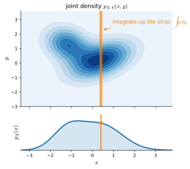

# Random Variables
:label:`sec_mdl-random_variables`

In :numref:`sec_prob` we worked with *discrete* random variables---those taking
values in a finite set or the integers, where a probability *mass* sits on each
outcome and we sum to get probabilities. Deep learning lives mostly in the
*continuous* world: a pixel intensity, a network weight, a Gaussian noise sample
all range over a continuum, and there a single outcome carries zero probability.
The fix is the *density*, met already in :numref:`sec_mdl-integral_calculus`:
probability becomes *area under a curve*, so the natural operation is no longer
summation but integration. This section builds the continuous theory we actually
use---densities and their cumulative functions, the summary statistics (mean,
variance, standard deviation) that compress a distribution to a few numbers, and
the joint/marginal/covariance machinery for several correlated variables---and at
every step the discrete sum and the continuous integral are *the same idea* seen
through :numref:`sec_mdl-integral_calculus`. The recurring thread is the small
identity :eqref:`eq_mdl-pdf_def`: *probability of a tiny interval $\approx$ its
width times the density there.* Almost everything below is that statement
integrated.

We load the per-framework library so the few computational cells have `d2l` and
the framework's tensor library in scope. The cells that follow *compute*
results---recovering a probability from a density, checking a continuum
mean/variance---rather than draw illustrations; the figures are pre-generated.

```{.python .input #random-variables-imports}
#@tab mxnet
%matplotlib inline
from d2l import mxnet as d2l
from mxnet import np, npx
npx.set_np()
```

```{.python .input #random-variables-imports}
#@tab pytorch
%matplotlib inline
from d2l import torch as d2l
import torch
```

```{.python .input #random-variables-imports}
#@tab tensorflow
%matplotlib inline
from d2l import tensorflow as d2l
import tensorflow as tf
tf.pi = tf.acos(tf.zeros(1)).numpy() * 2  # Define pi in TensorFlow
```

```{.python .input #random-variables-imports}
#@tab jax
%matplotlib inline
from d2l import jax as d2l
import jax
from jax import numpy as jnp
import numpy as np
```

## From Discrete to Continuous Probability

Continuous random variables are subtler than discrete ones, and the technical
jump is exactly the jump from *summing a list* to *integrating a function*. We
develop the theory in three steps: the density that replaces the mass function,
the cumulative function that turns it back into a genuine probability, and the
derivative relationship between them that is the fundamental theorem of calculus
in probabilistic dress.

### The Density Appears: A Thought Experiment

Throw a dart at a board and ask for the probability it lands *exactly*
$2\,\textrm{cm}$ from the center. Measure to one digit, with bins for
$0,1,2,\ldots\,\textrm{cm}$: of $100$ throws, perhaps $20$ land in the
"$2\,\textrm{cm}$" bin, suggesting $20\%$. But that bin holds everything between
$1.5$ and $2.5\,\textrm{cm}$---not what we asked. Measure finer, to bins of
$0.1\,\textrm{cm}$: now perhaps $3$ throws land in $[1.95,2.05]$, suggesting
$3\%$. We have only pushed the problem one digit down.

Abstract it. Knowing the first $k$ digits match $2.000\ldots$, the
$(k{+}1)$-th digit is essentially a uniform draw from $\{0,\ldots,9\}$---no
physical mechanism makes the micrometer count prefer a $7$ to a $3$. So each
extra digit of accuracy shrinks the probability by a factor of $10$:

$$
P(\textrm{distance is}\; 2.00\ldots \;\textrm{to}\; k \;\textrm{digits}) \approx p\cdot 10^{-k}.
$$

Knowing $k$ digits pins the value to an interval of width $10^{-k}$. Writing
$\epsilon$ for that width, the statement becomes $P(\text{within }\epsilon
\text{ of }2)\approx \epsilon\cdot p$. Nothing privileged the point $2$: a good
dart thrower is likelier to land near the center, so the constant depends on
*where* we look. Calling it $p(x)$,

$$P(X \;\textrm{is in an}\; \epsilon \textrm{-sized interval around}\; x ) \approx \epsilon \cdot p(x).$$
:eqlabel:`eq_mdl-pdf_def`

This *is* the *probability density function* (p.d.f.): a function $p(x)$ encoding
the relative likelihood of landing near $x$ versus elsewhere. It is the exact
object introduced as a normalized non-negative function in
:eqref:`eq_mdl-density`; here we see *where it comes from*.

One consequence is immediate and worth stating, because it is where continuous
probability first feels strange. Shrinking the interval to a single point
($\epsilon\to 0$) sends the right-hand side of :eqref:`eq_mdl-pdf_def` to zero,
so for *any* fixed value $x$,

$$P(X = x) = 0.$$

This resolves the dartboard paradox: the probability of landing *exactly*
$2\,\textrm{cm}$ out is zero, even though the dart certainly lands *somewhere*.
For a continuous variable only intervals---sets of positive length---carry
probability, and we read those probabilities off the density by integrating.

### Densities and Their Two Defining Properties

What must $p(x)$ satisfy to be a density? Two things, both from
:eqref:`eq_mdl-pdf_def`. First, probabilities are never negative, so $p(x)\ge 0$.
Second, slice $\mathbb{R}$ into width-$\epsilon$ pieces $(\epsilon i,
\epsilon(i{+}1)]$; by :eqref:`eq_mdl-pdf_def` each contributes about $\epsilon\,
p(\epsilon i)$ to the total probability, and summing,

$$
P(X\in\mathbb{R}) \approx \sum_i \epsilon \cdot p(\epsilon\cdot i)
\;\xrightarrow[\epsilon\to0]{}\; \int_{-\infty}^{\infty} p(x)\,dx .
$$

The middle expression is exactly the Riemann sum of :numref:`sec_mdl-integral_calculus`.
Since $X$ must take *some* value, $P(X\in\mathbb{R})=1$, and we recover the
normalization :eqref:`eq_mdl-density`,

$$\int_{-\infty}^{\infty} p(x)\,dx = 1.$$
:eqlabel:`eq_mdl-pdf_int_one`

The same slicing argument over a finite range gives the rule we actually use:
*probability is area under the density*,

$$P(X\in(a, b]) = \int_{a}^{b} p(x)\,dx.$$
:eqlabel:`eq_mdl-pdf_int_int`

These two properties---non-negativity and total area $1$---describe *exactly* the
space of densities. :numref:`fig_mdl-prob-pdf-area` shows the picture: the total
shaded region has area $1$, and the probability of an interval is the area above
it.


:label:`fig_mdl-prob-pdf-area`

We can confirm :eqref:`eq_mdl-pdf_int_int` numerically. Take the two-bump density
$p(x)=0.2\,\mathcal N(x;3,1)+0.8\,\mathcal N(x;-1,1)$ and recover the probability
of an interval by a Riemann sum---the discrete approximation of the integral,
made flesh. This *computes* the density-to-probability link rather than merely
drawing it.

```{.python .input #random-variables-density-to-probability}
#@tab mxnet
# Recover P(-2 < X <= 3) from the density by a Riemann sum (numerical integral)
epsilon = 0.01
x = np.arange(-5, 5, epsilon)
p = 0.2*np.exp(-(x - 3)**2 / 2)/np.sqrt(2 * np.pi) + \
    0.8*np.exp(-(x + 1)**2 / 2)/np.sqrt(2 * np.pi)
print('total mass     :', round(float(np.sum(epsilon * p)), 4))
mask = (x > -2) & (x <= 3)
print('P(-2 < X <= 3) :', round(float(np.sum(epsilon * p[mask])), 4))
```

```{.python .input #random-variables-density-to-probability}
#@tab pytorch
# Recover P(-2 < X <= 3) from the density by a Riemann sum (numerical integral)
epsilon = 0.01
x = torch.arange(-5, 5, epsilon)
p = 0.2*torch.exp(-(x - 3)**2 / 2)/torch.sqrt(torch.tensor(2 * torch.pi)) + \
    0.8*torch.exp(-(x + 1)**2 / 2)/torch.sqrt(torch.tensor(2 * torch.pi))
print('total mass     :', round(float(torch.sum(epsilon * p)), 4))
mask = (x > -2) & (x <= 3)
print('P(-2 < X <= 3) :', round(float(torch.sum(epsilon * p[mask])), 4))
```

```{.python .input #random-variables-density-to-probability}
#@tab tensorflow
# Recover P(-2 < X <= 3) from the density by a Riemann sum (numerical integral)
epsilon = 0.01
x = tf.range(-5, 5, epsilon)
p = 0.2*tf.exp(-(x - 3)**2 / 2)/tf.sqrt(2 * tf.constant(tf.pi)) + \
    0.8*tf.exp(-(x + 1)**2 / 2)/tf.sqrt(2 * tf.constant(tf.pi))
print('total mass     :', round(float(tf.reduce_sum(epsilon * p)), 4))
mask = (x > -2) & (x <= 3)
print('P(-2 < X <= 3) :', round(float(tf.reduce_sum(epsilon * p[mask])), 4))
```

```{.python .input #random-variables-density-to-probability}
#@tab jax
# Recover P(-2 < X <= 3) from the density by a Riemann sum (numerical integral)
epsilon = 0.01
x = jnp.arange(-5, 5, epsilon)
p = 0.2*jnp.exp(-(x - 3)**2 / 2)/jnp.sqrt(2 * jnp.pi) + \
    0.8*jnp.exp(-(x + 1)**2 / 2)/jnp.sqrt(2 * jnp.pi)
print('total mass     :', round(float(jnp.sum(epsilon * p)), 4))
mask = (x > -2) & (x <= 3)
print('P(-2 < X <= 3) :', round(float(jnp.sum(epsilon * p[mask])), 4))
```

The total mass comes out to $1$ as :eqref:`eq_mdl-pdf_int_one` demands, and the
interval integral returns a genuine probability in $[0,1]$. A catalogue of named
densities---Gaussian, exponential, and the rest---waits in
:numref:`sec_mdl-distributions`; here we stay abstract.

### The Cumulative Distribution Function

A density has one awkward feature: its *values* are not probabilities. A density
can exceed $10$, as long as it does so only over an interval shorter than
$1/10$. The remedy is the *cumulative distribution function* (c.d.f.), which by
:eqref:`eq_mdl-pdf_int_int` accumulates the density up to $x$ and so *is* an
honest probability:

$$
F(x) = \int_{-\infty}^{x} p(t)\,dt = P(X \le x).
$$
:eqlabel:`eq_mdl-cdf_def`

Read off its properties directly: $F(x)\to 0$ as $x\to-\infty$ and $F(x)\to 1$ as
$x\to+\infty$ (the total mass is $1$); $F$ is non-decreasing, since the integrand
$p\ge 0$ only ever adds area; and $F$ is continuous when $X$ is continuous. The
c.d.f. is also what lets discrete and continuous variables share one framework.
For a discrete $X$ taking $0$ and $1$ with probability $\tfrac12$ each,

$$
F(x) = \begin{cases}
0 & x < 0, \\
\tfrac12 & 0 \le x < 1, \\
1 & x \ge 1,
\end{cases}
$$

a *staircase* that jumps by the mass at each atom---so the same $F$ describes
continuous variables, discrete ones, and mixtures (flip a coin: heads, report a
die roll; tails, a dart distance).

The density and the c.d.f. carry the same information, and the bridge between
them is the fundamental theorem of calculus. Differentiating
:eqref:`eq_mdl-cdf_def` recovers the density.

**Proposition (density is the derivative of the c.d.f.).** *If $X$ has a
continuous density $p$, then $F$ is differentiable and*

$$
F'(x) = p(x).
$$
:eqlabel:`eq_mdl-cdf-deriv`

**Proof.** By definition :eqref:`eq_mdl-cdf_def`, $F(x)=\int_{-\infty}^x p(t)\,dt$
is the area-so-far function of the integrand $p$. The fundamental theorem of
calculus :eqref:`eq_mdl-ftc` says precisely that such an area function is
differentiable with derivative equal to the integrand, $F'(x)=p(x)$. $\blacksquare$

So $p=F'$ and $F=\int p$ are two views of one object: the density is the
*instantaneous rate* at which probability accumulates, and the c.d.f. is the
*accumulated area*. :numref:`fig_mdl-prob-pdf-cdf` puts them side by side---the
shaded area $\int_a^b p$ on the left equals the vertical rise $F(b)-F(a)$ on the
right---making :eqref:`eq_mdl-cdf_def` and :eqref:`eq_mdl-cdf-deriv` a single
picture.


:label:`fig_mdl-prob-pdf-cdf`

The relationship $F'=p$ underwrites *inverse-transform sampling*---if $U$ is
uniform on $[0,1]$ then $F^{-1}(U)$ has c.d.f. $F$---which is how libraries turn
uniform noise into samples from any one-dimensional distribution. We return to it
when we meet the named distributions in :numref:`sec_mdl-distributions`.

## Summarizing a Distribution

A full distribution is often more than we can interpret at a glance. *Summary
statistics* compress it to a few numbers: the *mean* says where the variable
sits, the *variance* and *standard deviation* say how far it spreads. Each is an
expectation---a density-weighted average, :eqref:`eq_mdl-expectation`---and each
obeys clean algebra that we prove once and reuse everywhere.

### The Mean

The *mean* (or *expectation*) is the average value, weighting each outcome by its
probability. For a discrete $X$ taking $x_i$ with probability $p_i$,

$$\mu_X = E[X] = \sum_i x_i p_i,$$
:eqlabel:`eq_mdl-exp_def`

and in the continuum the sum becomes the density-weighted integral
:eqref:`eq_mdl-expectation`, $\mu_X=\int x\,p(x)\,dx$, by the same
slice-and-refine argument that produced :eqref:`eq_mdl-pdf_int_one`. The mean
tells us, with some caution, where the variable tends to sit.

A running example will pay off through the whole section. Let $X$ take $a-2$ with
probability $p$, $a+2$ with probability $p$, and $a$ with probability $1-2p$.
Then

$$
\mu_X = (a-2)p + a(1-2p) + (a+2)p = a,
$$

the center of symmetry, exactly as intuition demands.

The two algebraic properties of the mean we lean on most are that it is
*linear*---constants pull out and sums split. Both follow in one line from the
definition.

**Proposition (linearity of expectation).** *For random variables $X,Y$ and
constants $a,b$,*

$$
E[aX+b]=a\,E[X]+b,
\qquad
E[X+Y]=E[X]+E[Y].
$$
:eqlabel:`eq_mdl-exp_linear`

**Proof.** Both are linearity of the sum (or integral) defining the expectation.
For the scaling-and-shift, $E[aX+b]=\sum_i(ax_i+b)p_i = a\sum_i x_i p_i + b\sum_i
p_i = a\,E[X]+b$, using $\sum_i p_i=1$. For the sum, write the expectation over
the *joint* distribution of $(X,Y)$ and split the inner sum: $E[X+Y]=\sum_{i,j}
(x_i+y_j)p_{ij} = \sum_{i,j} x_i p_{ij} + \sum_{i,j} y_j p_{ij} = E[X]+E[Y]$, the
last step recognizing the marginals $\sum_j p_{ij}=P(X=x_i)$. The continuous case
replaces every sum by an integral verbatim. $\blacksquare$

The second identity needs *no independence assumption*: expectations of sums
always add, however entangled $X$ and $Y$ are. This is the workhorse behind
nearly every expected-loss calculation in the book.

The mean alone is not enough. A profit of $\$10\pm\$1$ per sale and one of
$\$10\pm\$15$ share a mean but carry wildly different risk. We need a measure of
*spread*.

### Variance and Standard Deviation

The *variance* measures how far $X$ strays from its mean. The deviation
$X-\mu_X$ is positive or negative, so we square it before averaging:

$$\sigma_X^2 = \textrm{Var}(X) = E\bigl[(X-\mu_X)^2\bigr].$$
:eqlabel:`eq_mdl-var_def`

Expanding the square gives a formula that is almost always easier to compute
with, and it deserves a proof since we use it constantly.

**Proposition (computational form of the variance).**

$$
\textrm{Var}(X) = E[X^2] - E[X]^2 = E[X^2]-\mu_X^2.
$$
:eqlabel:`eq_mdl-var_comp`

**Proof.** Expand the square inside :eqref:`eq_mdl-var_def` and apply linearity
:eqref:`eq_mdl-exp_linear`, treating $\mu_X$ as the constant it is:

$$
E\bigl[(X-\mu_X)^2\bigr]
 = E\bigl[X^2 - 2\mu_X X + \mu_X^2\bigr]
 = E[X^2] - 2\mu_X\,E[X] + \mu_X^2
 = E[X^2] - \mu_X^2,
$$

since $E[X]=\mu_X$, so $-2\mu_X E[X]+\mu_X^2 = -2\mu_X^2+\mu_X^2=-\mu_X^2$. $\blacksquare$

On the running example $\mu_X=a$, and the computational form does the rest:
$E[X^2]=(a-2)^2p+a^2(1-2p)+(a+2)^2p = a^2+8p$, so

$$
\textrm{Var}(X) = E[X^2]-\mu_X^2 = (a^2+8p)-a^2 = 8p.
$$

This is sensible: at the largest allowed $p=\tfrac12$ the variable is a coin flip
between $a\pm2$, each $2$ away from the mean, giving variance $8\cdot\tfrac12=4=2^2$;
at $p=0$ it is constant at $a$ with no variance at all.

How does variance behave under the affine maps we constantly apply (rescaling
units, centering data)? The shift drops out and the scale comes out squared.

**Proposition (variance under affine maps).** *For constants $a,b$,*

$$
\textrm{Var}(aX+b) = a^2\,\textrm{Var}(X).
$$
:eqlabel:`eq_mdl-var_affine`

**Proof.** By linearity :eqref:`eq_mdl-exp_linear` the mean maps as
$\mu_{aX+b}=a\mu_X+b$, so the deviation is $(aX+b)-\mu_{aX+b}=a(X-\mu_X)$---the
shift $b$ cancels. Squaring and taking the expectation,

$$
\textrm{Var}(aX+b) = E\bigl[a^2(X-\mu_X)^2\bigr] = a^2\,E\bigl[(X-\mu_X)^2\bigr] = a^2\,\textrm{Var}(X). \qquad\blacksquare
$$

Two further facts round out the list: $\textrm{Var}(X)\ge 0$, with equality iff
$X$ is constant (a square has non-negative mean, zero only when $X-\mu_X\equiv0$);
and for *independent* $X,Y$, $\textrm{Var}(X+Y)=\textrm{Var}(X)+\textrm{Var}(Y)$
(we prove the general version, with a covariance correction, in
:numref:`subsec_mdl-covariance`).

The variance has a units problem. If $X$ is in stars, $X-\mu_X$ is in stars but
$(X-\mu_X)^2$ is in *squared stars*, so $\textrm{Var}(X)$ is not comparable to
the data. Taking the square root restores the original units and defines the
*standard deviation*

$$
\sigma_X = \sqrt{\textrm{Var}(X)}.
$$
:eqlabel:`eq_mdl-std_def`

Its properties echo the variance through the square root: $\sigma_X\ge0$;
$\sigma_{aX+b}=|a|\sigma_X$ (the absolute value because $\sqrt{a^2}=|a|$); and for
independent $X,Y$, $\sigma_{X+Y}=\sqrt{\sigma_X^2+\sigma_Y^2}$. On the running
example $\sigma_X=2\sqrt{2p}$, back in units of stars.

### What the Standard Deviation Means: Chebyshev's Inequality

Does $\sigma_X$ have a concrete reading? Yes: it sets the scale over which $X$
fluctuates, and *Chebyshev's inequality* makes this rigorous for *any*
distribution with finite variance,

$$P\bigl(X \notin [\mu_X - \alpha\sigma_X, \mu_X + \alpha\sigma_X]\bigr) \le \frac{1}{\alpha^2}.$$
:eqlabel:`eq_mdl-chebyshev`

In words at $\alpha=10$: *at least $99\%$* of the mass of any distribution lies
within $10$ standard deviations of the mean. The standard deviation is thus a
universal yardstick for "how far is far."

The bound is *sharp*, and our running example shows exactly why no tighter
constant is possible. With $\mu_X=a$ and $\sigma_X=2\sqrt{2p}$, the interval at
$\alpha=2$ is $[a-4\sqrt{2p},\,a+4\sqrt{2p}]$ and :eqref:`eq_mdl-chebyshev`
promises at most $\tfrac14$ of the mass outside it. As $p$ shrinks the interval
narrows toward the single point $a$, and the two outlying atoms $a\pm2$ eventually
fall outside. They cross the boundary exactly when $a+4\sqrt{2p}=a+2$, i.e. at
$p=\tfrac18$---and at that $p$ the mass outside is exactly $p+p=\tfrac14$, hitting
the bound with equality. :numref:`fig_mdl-prob-chebyshev` shows the three regimes:
for $p>\tfrac18$ the interval safely contains all three atoms; at $p=\tfrac18$ it
just touches $a\pm2$ (the equality case); and for $p<\tfrac18$ the outliers sit
outside, which is allowed because their combined mass $2p<\tfrac14$.


:label:`fig_mdl-prob-chebyshev`

### Means and Variances in the Continuum

Everything above transfers to continuous variables by the now-familiar move:
slice $\mathbb{R}$ into width-$\epsilon$ pieces, apply the discrete definition,
and let $\epsilon\to0$ to turn the sum into an integral. The mean is the
density-weighted average :eqref:`eq_mdl-expectation`, and the variance follows
from its computational form :eqref:`eq_mdl-var_comp`:

$$
\mu_X = \int_{-\infty}^\infty x\,p_X(x)\,dx,
\qquad
\sigma^2_X = \int_{-\infty}^\infty x^2 p_X(x)\,dx - \mu_X^2 .
$$
:eqlabel:`eq_mdl-cont_mean_var`

Every property proved above---linearity, the affine rule, Chebyshev---carries
over unchanged, since each rested only on linearity of the averaging operation.
For the uniform density $p(x)=1$ on $[0,1]$ (zero elsewhere),
$\mu_X=\int_0^1 x\,dx=\tfrac12$ and $\sigma_X^2=\int_0^1
x^2\,dx-\tfrac14=\tfrac13-\tfrac14=\tfrac1{12}$, both elementary integrals.

A cautionary example: the *Cauchy distribution* $p(x)=\frac{1}{\pi(1+x^2)}$ is a
perfectly good density (a table of integrals confirms it integrates to $1$), yet
it has *neither* a finite variance *nor* a well-defined mean. The variance
integral $\int x^2 p(x)\,dx$ diverges because $\frac{x^2}{1+x^2}\to1$, so the
integrand has infinite area. The mean is worse: although the integrand
$\frac{x}{\pi(1+x^2)}$ is *odd* and tempts us to declare $0$ by symmetry, the mean
is defined only when $\int|x|p(x)\,dx<\infty$. Substituting $u=1+x^2$,
$\int_0^\infty \frac{x}{\pi(1+x^2)}\,dx=\frac{1}{2\pi}\int_1^\infty
\frac{du}{u}=+\infty$, and the left tail gives $-\infty$, so the mean is a
meaningless $\infty-\infty$ whose value depends on how the limits are taken---a
*stronger* failure than "the mean is infinite." We can watch both integrals
diverge numerically by extending the integration range and seeing the partial
sums refuse to settle.

```{.python .input #random-variables-cauchy-diverges}
#@tab mxnet
# Cauchy second moment integral over growing ranges: it should NOT converge
for R in [10, 100, 1000]:
    x = np.arange(-R, R, 0.01)
    integrand = x**2 / (np.pi * (1 + x**2))
    print(f'integral_-{R}^{R} x^2 p(x) dx = {float(np.sum(0.01*integrand)):.3f}')
```

```{.python .input #random-variables-cauchy-diverges}
#@tab pytorch
# Cauchy second moment integral over growing ranges: it should NOT converge
for R in [10, 100, 1000]:
    x = torch.arange(-R, R, 0.01)
    integrand = x**2 / (torch.pi * (1 + x**2))
    print(f'integral_-{R}^{R} x^2 p(x) dx = {float(torch.sum(0.01*integrand)):.3f}')
```

```{.python .input #random-variables-cauchy-diverges}
#@tab tensorflow
# Cauchy second moment integral over growing ranges: it should NOT converge
for R in [10, 100, 1000]:
    x = tf.range(-float(R), float(R), 0.01)
    integrand = x**2 / (tf.pi * (1 + x**2))
    print(f'integral_-{R}^{R} x^2 p(x) dx = {float(tf.reduce_sum(0.01*integrand)):.3f}')
```

```{.python .input #random-variables-cauchy-diverges}
#@tab jax
# Cauchy second moment integral over growing ranges: it should NOT converge
for R in [10, 100, 1000]:
    x = jnp.arange(-R, R, 0.01)
    integrand = x**2 / (jnp.pi * (1 + x**2))
    print(f'integral_-{R}^{R} x^2 p(x) dx = {float(jnp.sum(0.01*integrand)):.3f}')
```

The "integral" grows without bound as the range widens---it does not converge, so
the variance is infinite. Machine-learning models are usually set up to avoid such
*heavy-tailed* variables, but they arise in modeling physical systems, so it is
worth knowing they exist.

## Several Variables

Machine learning rarely involves one variable in isolation. Pixels $R_{i,j}$ in
an image, prices $P_t$ across time---nearby coordinates are correlated, and a
model that ignores this under-performs (:numref:`sec_mdl-naive_bayes` analyzes
exactly such a model). We need a language for *several*, possibly correlated,
continuous variables, and the multiple integrals of :numref:`sec_mdl-integral_calculus`
supply it.

### Joint and Marginal Densities

For two variables $X,Y$, the same $\epsilon$-interval reasoning gives a *joint
density* $p(x,y)$ with

$$
P(X\approx x \text{ and } Y\approx y \text{ in } \epsilon\text{-boxes}) \approx \epsilon^{2}\,p(x, y),
$$

and the one-variable properties carry over: $p(x,y)\ge0$, $\int_{\mathbb{R}^2}
p(x,y)\,dx\,dy=1$, and $P((X,Y)\in\mathcal{D})=\int_{\mathcal{D}} p(x,y)\,dx\,dy$.
For $n$ variables the joint density $p(\mathbf x)=p(x_1,\ldots,x_n)$ obeys the
same non-negativity and unit-integral rules.

Often we hold a joint density but want the distribution of *one* coordinate,
ignoring the rest---its *marginal distribution*. Starting from
$P(X\in[x,x+\epsilon])\approx\epsilon\,p_X(x)$ and noting $Y$ takes *some* value,
we slice in $y$ as well:

$$
\epsilon\,p_X(x) \approx \sum_i P\bigl(X\in[x,x{+}\epsilon],\ Y\in[\epsilon i,\epsilon(i{+}1)]\bigr)
                 \approx \sum_i \epsilon^{2}\,p_{X,Y}(x,\epsilon i).
$$

Geometrically this sums the joint density down a column, as in
:numref:`fig_mdl-marginal`. Cancelling one $\epsilon$ and recognizing the
remaining sum as an integral over $y$,

$$
p_X(x) = \int_{-\infty}^\infty p_{X, Y}(x, y)\,dy.
$$
:eqlabel:`eq_mdl-marginal`


:label:`fig_mdl-marginal`

To marginalize, then, we *integrate out* the variables we do not care about---the
same operation introduced in :numref:`sec_mdl-integral_calculus`, here given its
probabilistic meaning.

### Conditional Densities and Independence

With the joint and the marginal in hand, the last piece is *conditioning*: how the
density of $X$ should update once we learn that $Y=y$. The discrete rule
$P(X\mid Y)=P(X,Y)/P(Y)$ carries over verbatim to densities. We define the
**conditional density**

$$
p_{X\mid Y}(x\mid y) = \frac{p_{X,Y}(x,y)}{p_Y(y)}, \qquad p_Y(y) > 0.
$$
:eqlabel:`eq_mdl-cond_density`

For each fixed $y$ this is a genuine density in $x$: it is non-negative, and
dividing the joint by exactly $p_Y(y)=\int p_{X,Y}(x,y)\,dx$ is precisely what makes
it integrate to one. Geometrically it is a horizontal slice of the joint surface
at height $y$, renormalized to unit area --- the continuous analogue of reading one
row of the array in :numref:`fig_mdl-marginal`. Rearranging :eqref:`eq_mdl-cond_density`
gives the **chain rule** $p_{X,Y}(x,y)=p_{X\mid Y}(x\mid y)\,p_Y(y)$, and writing it
both ways ($p_{X,Y}=p_{X\mid Y}\,p_Y=p_{Y\mid X}\,p_X$) and equating yields **Bayes'
rule for densities**,

$$
p_{X\mid Y}(x\mid y) = \frac{p_{Y\mid X}(y\mid x)\,p_X(x)}{p_Y(y)},
$$
:eqlabel:`eq_mdl-bayes_density`

the engine of every Bayesian update in this book.

The sharpest special case is when learning $Y$ tells us *nothing* about $X$.

**Proposition (independence).** *The following are equivalent: (i) the joint
factorizes, $p_{X,Y}(x,y)=p_X(x)\,p_Y(y)$ for all $x,y$; (ii) the conditional equals
the marginal, $p_{X\mid Y}(x\mid y)=p_X(x)$ whenever $p_Y(y)>0$. When either holds we
call $X$ and $Y$ independent, $X\perp Y$.*

**Proof.** If (i) holds, then $p_{X\mid Y}(x\mid y)=p_X(x)p_Y(y)/p_Y(y)=p_X(x)$, which
is (ii). Conversely, if (ii) holds, multiply by $p_Y(y)$ and use the chain rule:
$p_{X,Y}(x,y)=p_{X\mid Y}(x\mid y)\,p_Y(y)=p_X(x)\,p_Y(y)$, which is (i). $\blacksquare$

As a worked example, take the joint $p_{X,Y}(x,y)=4xy$ on the unit square
$[0,1]^2$ (it integrates to one). The marginal is $p_Y(y)=\int_0^1 4xy\,dx=2y$, so
$p_{X\mid Y}(x\mid y)=4xy/2y=2x$ --- *independent of $y$*. The conditional never
changes as $y$ varies, so by the proposition $X\perp Y$. A joint that does not
factor this way --- say one supported on the triangle $x\le y$ --- has a conditional
whose support and shape shift with $y$, the signature of dependence.

Independence is a strong, all-of-the-distribution statement. It is strictly
stronger than being *uncorrelated* (zero covariance), which constrains only the
linear relationship; we make the gap precise in the covariance subsection below.
This factorized structure is also exactly what the naive Bayes classifier of
:numref:`sec_mdl-naive_bayes` assumes across features to make high-dimensional
densities tractable.

### Change of Variables for Densities

When we push a random variable through a function $Y=g(X)$, its density is *not*
simply $p_X\!\big(g^{-1}(y)\big)$. Probability mass must be conserved as the map
stretches and compresses the line, and that conservation forces a Jacobian
correction --- the same "probability in equals probability out" bookkeeping that
turned into a rescaling factor for areas in :numref:`fig_mdl-rect-transform`.

Take $g$ monotone, so it has an inverse. The mass in a tiny interval must survive
the map: $p_Y(y)\,|dy| = p_X(x)\,|dx|$ with $y=g(x)$. Solving for the new density
and writing $x=g^{-1}(y)$ gives the **one-dimensional change-of-variables formula**

$$
p_Y(y) = p_X\!\big(g^{-1}(y)\big)\,\left|\frac{d g^{-1}}{dy}(y)\right|.
$$
:eqlabel:`eq_mdl-cov_density_1d`

The derivative factor is exactly the local stretch of the map: where $g$ spreads a
small interval out, the density must drop to keep the area fixed. In several
dimensions the scalar stretch becomes the absolute **Jacobian determinant** --- the
local volume-scaling factor of :numref:`sec_mdl-integral_calculus`, itself the
determinant-as-volume of :numref:`sec_mdl-geometry-linear-algebraic-ops`:

$$
p_Y(\mathbf y) = p_X\!\big(g^{-1}(\mathbf y)\big)\,\big|\det J_{g^{-1}}(\mathbf y)\big|,
\qquad\text{equivalently}\qquad
\log p_Y(\mathbf y) = \log p_X(\mathbf x) - \log\big|\det J_{g}(\mathbf x)\big|.
$$
:eqlabel:`eq_mdl-cov_density`

The log form is the one that matters in practice: pushing data through an
invertible network adds a single $-\log|\det J_g|$ term to the log-density, and
because $\log|\det(J_2 J_1)| = \log|\det J_1| + \log|\det J_2|$ these terms simply
*sum* along a composition of layers. That additivity is the entire mathematical
engine behind **normalizing flows** (:numref:`sec_mdl-score-matching-diffusion-flow`).

As a worked example, let $X\sim\mathcal N(0,1)$ and $Y=e^X$, so $g^{-1}(y)=\log y$
and $|dg^{-1}/dy| = 1/y$ for $y>0$. Formula :eqref:`eq_mdl-cov_density_1d` gives the
**log-normal** density

$$
p_Y(y) = \frac{1}{y\sqrt{2\pi}}\,\exp\!\Big(-\tfrac12(\log y)^2\Big), \qquad y>0,
$$

whose $1/y$ prefactor is precisely the change-of-variables correction. A linear map
$\mathbf y = A\mathbf x$ illustrates the multivariate rule in one stroke: $J_g=A$ is
constant, so the density is rescaled uniformly by $1/|\det A|$ --- stretch space by
$|\det A|$ and the density thins by the same factor.

### Covariance
:label:`subsec_mdl-covariance`

For a *single* extra summary statistic capturing how two variables move together,
we use the *covariance*. For discrete $X,Y$ taking $(x_i,y_j)$ with probability
$p_{ij}$,

$$\sigma_{XY} = \textrm{Cov}(X, Y) = \sum_{i, j} (x_i - \mu_X)(y_j-\mu_Y)\,p_{ij} = E[XY] - E[X]E[Y],$$
:eqlabel:`eq_mdl-cov_def`

the second form being the exact two-variable analogue of the computational
variance formula :eqref:`eq_mdl-var_comp` (and indeed
$\textrm{Cov}(X,X)=\textrm{Var}(X)$). The covariance is positive when $X$ and $Y$
tend to be large together, negative when one is large as the other is small.

A clean example makes this concrete. Let $X\in\{1,3\}$ and $Y\in\{-1,3\}$ with

$$
\begin{aligned}
P(X{=}1, Y{=}{-}1) &= \tfrac{p}{2}, &\quad P(X{=}1, Y{=}3) &= \tfrac{1-p}{2}, \\
P(X{=}3, Y{=}{-}1) &= \tfrac{1-p}{2}, &\quad P(X{=}3, Y{=}3) &= \tfrac{p}{2},
\end{aligned}
$$

for a parameter $p\in[0,1]$. At $p=1$ the two are large or small *together*; at
$p=0$ they are *opposed*; at $p=\tfrac12$ all four cells are equally likely and
the two are unrelated. With $\mu_X=2$, $\mu_Y=1$, the definition
:eqref:`eq_mdl-cov_def` gives, after summing the four terms,
$\textrm{Cov}(X,Y)=4p-2$: equal to $+2$ at $p=1$, $-2$ at $p=0$, and $0$ at
$p=\tfrac12$, matching every expectation.

Covariance captures only *linear* co-variation. If $Y$ is uniform on
$\{-2,-1,0,1,2\}$ and $X=Y^2$, then $X$ is a deterministic function of $Y$ yet
$\textrm{Cov}(X,Y)=0$, because the symmetric quadratic relationship has no linear
trend. Zero covariance does *not* mean independent.

The continuous version replaces the sum by the density-weighted integral,

$$
\sigma_{XY} = \int_{\mathbb{R}^2} (x-\mu_X)(y-\mu_Y)\,p(x, y)\,dx\,dy .
$$
:eqlabel:`eq_mdl-cov_cont`

:numref:`fig_mdl-prob-covariance` shows clouds of points whose covariance we tune
from negative through zero to positive: the cloud tilts down, rounds out, then
tilts up.


:label:`fig_mdl-prob-covariance`

Two properties we use repeatedly: covariance is *bilinear*, with
$\textrm{Cov}(aX+b,Y)=a\,\textrm{Cov}(X,Y)$ (shifts drop out, scales pull
through, on each argument); and independent variables have zero covariance, since
then $E[XY]=E[X]E[Y]$ in :eqref:`eq_mdl-cov_def`. Covariance also completes the
variance-of-a-sum rule.

**Proposition (variance of a sum).** *For any random variables $X,Y$,*

$$
\textrm{Var}(X+Y) = \textrm{Var}(X) + \textrm{Var}(Y) + 2\,\textrm{Cov}(X, Y).
$$
:eqlabel:`eq_mdl-var_sum`

**Proof.** Write $\bar X=X-\mu_X$, $\bar Y=Y-\mu_Y$, so $X+Y$ has mean
$\mu_X+\mu_Y$ by linearity :eqref:`eq_mdl-exp_linear` and deviation $\bar X+\bar Y$.
Then by :eqref:`eq_mdl-var_def` and linearity,

$$
\textrm{Var}(X+Y) = E\bigl[(\bar X+\bar Y)^2\bigr]
 = E[\bar X^2] + 2\,E[\bar X\bar Y] + E[\bar Y^2]
 = \textrm{Var}(X) + 2\,\textrm{Cov}(X,Y) + \textrm{Var}(Y),
$$

recognizing $E[\bar X\bar Y]=\textrm{Cov}(X,Y)$ from :eqref:`eq_mdl-cov_def`. $\blacksquare$

When $X$ and $Y$ are independent the cross term vanishes and we recover the
additive rule $\textrm{Var}(X+Y)=\textrm{Var}(X)+\textrm{Var}(Y)$ promised
earlier.

### Correlation

Covariance inherits the *units* of $X$ times $Y$---inches $\times$ dollars---so
its magnitude is hard to read. Switching $Y$ from dollars to cents multiplies it
by $100$. To get a unit-free measure, divide by something that also scales by
$100$: the standard deviations. The *correlation coefficient* is

$$\rho(X, Y) = \frac{\textrm{Cov}(X, Y)}{\sigma_{X}\sigma_{Y}}.$$
:eqlabel:`eq_mdl-cor_def`

A short calculation (the Cauchy--Schwarz inequality) shows $\rho\in[-1,1]$, with
$+1$ for a perfect increasing linear relationship and $-1$ for a perfect
decreasing one. On the running discrete example $\sigma_X=1$, $\sigma_Y=2$, so
$\rho=\frac{4p-2}{2}=2p-1$, sweeping cleanly from $-1$ to $+1$. And for *any*
affine $Y=aX+b$, using $\sigma_{aX+b}=|a|\sigma_X$ and
$\textrm{Cov}(X,aX+b)=a\,\textrm{Var}(X)$,

$$
\rho(X, aX+b) = \frac{a\,\textrm{Var}(X)}{|a|\,\sigma_X^2} = \frac{a}{|a|} = \operatorname{sign}(a),
$$

exactly $+1$ for $a>0$ and $-1$ for $a<0$, independent of the scale---correlation
measures direction and tightness of a linear relationship, never its slope.
:numref:`fig_mdl-prob-correlation` shows clouds at correlation $-0.9$, $0$, and
$0.9$; unlike the covariance clouds, the *spread* is comparable across panels and
only the tilt changes.


:label:`fig_mdl-prob-correlation`

There is a satisfying geometric reading. Centering so $\mu_X=\mu_Y=0$ and writing
out :eqref:`eq_mdl-cor_def`,

$$
\rho(X, Y) = \frac{\sum_{i, j} x_i y_j\,p_{ij}}{\sqrt{\sum_{i, j}x_i^2 p_{ij}}\,\sqrt{\sum_{i, j}y_j^2 p_{ij}}},
$$

which is precisely the cosine of the angle between two vectors with coordinates
weighted by $p_{ij}$,

$$
\cos(\theta) = \frac{\mathbf{v}\cdot \mathbf{w}}{\|\mathbf{v}\|\,\|\mathbf{w}\|} = \frac{\sum_{i} v_i w_i}{\sqrt{\sum_{i}v_i^2}\,\sqrt{\sum_{i}w_i^2}}.
$$

If standard deviations are "lengths" and correlations are "cosines of angles,"
the geometric intuition of :numref:`sec_mdl-geometry-linear-algebraic-ops`
transfers wholesale to random variables: uncorrelated means orthogonal,
$\rho=\pm1$ means parallel. This is the bridge between linear algebra and
statistics that PCA and least squares both walk.

## Summary

* A continuous random variable is described by a *probability density* $p(x)\ge0$
  with $\int p\,dx=1$ :eqref:`eq_mdl-pdf_int_one`; the density is not itself a
  probability---only its integral over an interval is,
  $P(X\in(a,b])=\int_a^b p$ :eqref:`eq_mdl-pdf_int_int`. Any single point has
  probability zero.
* The *cumulative distribution function* $F(x)=\int_{-\infty}^x p=P(X\le x)$ *is*
  a probability and unifies discrete, continuous, and mixed variables. Density and
  c.d.f. are derivative and integral of each other: $F'=p$
  :eqref:`eq_mdl-cdf-deriv`, the fundamental theorem of calculus.
* The *mean* $\mu_X=E[X]$ locates the distribution and is *linear*
  :eqref:`eq_mdl-exp_linear`---sums of expectations add with no independence
  needed. The *variance* $\textrm{Var}(X)=E[X^2]-\mu_X^2$
  :eqref:`eq_mdl-var_comp` measures spread, scales as
  $\textrm{Var}(aX+b)=a^2\textrm{Var}(X)$ :eqref:`eq_mdl-var_affine`, and its root
  is the *standard deviation*, back in the original units.
* *Chebyshev's inequality* :eqref:`eq_mdl-chebyshev` reads $\sigma_X$ as a
  universal yardstick: a fraction at most $1/\alpha^2$ of any distribution lies
  beyond $\alpha$ standard deviations.
* Several variables are handled by a *joint density*; *marginals* come from
  integrating out the unwanted variables :eqref:`eq_mdl-marginal`. *Covariance*
  measures linear co-variation, giving $\textrm{Var}(X+Y)=\textrm{Var}(X)+
  \textrm{Var}(Y)+2\textrm{Cov}(X,Y)$ :eqref:`eq_mdl-var_sum`, and *correlation*
  normalizes it to $[-1,1]$ as a cosine between centered variables. Zero
  covariance does not imply independence.

## Exercises
1. Suppose $X$ has density $p(x) = \frac{1}{x^2}$ for $x \ge 1$ and $p(x) = 0$ otherwise. Verify it is a density and compute $P(X > 2)$ and the c.d.f. $F(x)$.
2. The Laplace distribution has density $p(x) = \tfrac12 e^{-|x|}$. Find its mean and standard deviation. (*Hint:* $\int_0^\infty xe^{-x}\,dx = 1$ and $\int_0^\infty x^2e^{-x}\,dx = 2$.)
3. I claim a random variable with mean $1$ and standard deviation $2$ produced $25\%$ of samples above $9$. Use Chebyshev :eqref:`eq_mdl-chebyshev` to decide whether to believe me.
4. Two variables $X,Y$ have joint density $p_{XY}(x, y) = 4xy$ on $[0,1]^2$ and $0$ otherwise. Find the marginals $p_X,p_Y$, the covariance $\textrm{Cov}(X,Y)$, and decide whether $X$ and $Y$ are independent.
5. Prove the affine variance rule $\textrm{Var}(aX+b)=a^2\textrm{Var}(X)$ :eqref:`eq_mdl-var_affine` directly from $\textrm{Var}(X)=E[X^2]-E[X]^2$, without using :eqref:`eq_mdl-exp_linear` on the deviation.
6. Using $\textrm{Var}(X+Y)=\textrm{Var}(X)+\textrm{Var}(Y)+2\textrm{Cov}(X,Y)$ :eqref:`eq_mdl-var_sum`, show that for independent identically distributed $X_1,\ldots,X_n$ with variance $\sigma^2$, the sample mean $\bar X=\tfrac1n\sum_i X_i$ has variance $\sigma^2/n$. (This is why averaging reduces noise.)
7. Let $Y$ be uniform on $\{-2,-1,0,1,2\}$ and $X=Y^2$. Compute $\textrm{Cov}(X,Y)$ and confirm it is zero even though $X$ is a deterministic function of $Y$. Why does correlation miss this relationship?

:begin_tab:`mxnet`
[Discussions](https://d2l.discourse.group/t/415)
:end_tab:

:begin_tab:`pytorch`
[Discussions](https://d2l.discourse.group/t/1094)
:end_tab:


:begin_tab:`tensorflow`
[Discussions](https://d2l.discourse.group/t/1095)
:end_tab:

:begin_tab:`jax`
[Discussions](https://d2l.discourse.group/t/1095)
:end_tab:

<!-- slides -->

::: {.slide title="Continuous Random Variables"}
Continuous random variables and their summaries:

- **PDF** $p(x)\ge0$ with $\int p = 1$; $P(X \in A) = \int_A p$.
- **CDF** $F(x)=\int_{-\infty}^x p = P(X\le x)$, with $F'=p$.
- **Mean** $\mu = \mathbb{E}[X] = \int x\, p(x)\, dx$.
- **Variance** $\sigma^2 = \mathbb{E}[X^2]-\mu^2$ — spread.
- **Covariance / correlation** — joint variation, raw and
  normalized to $[-1,1]$.

These are the building blocks of every probabilistic
analysis in the book.
:::

::: {.slide title="From discrete to continuous"}
Discrete variables assign *mass* to points; a single point
then has probability zero in the continuous world. Continuous
variables assign *density*, and probability is area:
$P(X\in(a,b]) = \int_a^b p$.

@fig:mdl-prob-pdf-area
:::

::: {.slide title="Density to probability, in code"}
The density is not a probability — only its integral is. A
Riemann sum recovers $P(-2 < X \le 3)$ from the density and
confirms the total mass is $1$:

@random-variables-density-to-probability
:::

::: {.slide title="PDF and CDF: derivative and integral"}
The c.d.f. accumulates the density; the density is its slope.
Area under $p$ over $(a,b]$ equals the rise $F(b)-F(a)$ —
the fundamental theorem of calculus, $F'=p$:

@fig:mdl-prob-pdf-cdf
:::

::: {.slide title="Mean, variance, standard deviation"}
$\mathbb{E}$ is linear: $\mathbb{E}[X+Y]=\mathbb{E}[X]+\mathbb{E}[Y]$,
*no independence needed*. Variance scales as
$\textrm{Var}(aX+b)=a^2\textrm{Var}(X)$; $\sigma=\sqrt{\textrm{Var}}$
restores the original units.
:::

::: {.slide title="Chebyshev: σ is a yardstick"}
For *any* distribution with finite variance,

$$P\bigl(|X-\mu| > \alpha\sigma\bigr) \le \tfrac{1}{\alpha^2}.$$

The bound is sharp — the three-atom example touches it at
$p=1/8$:

@fig:mdl-prob-chebyshev
:::

::: {.slide title="Several variables: joint and marginal"}
A joint density $p(x,y)$ integrates to $1$. *Marginalize* by
integrating out the unwanted variable, $p_X(x)=\int p(x,y)\,dy$
— summing down a column:

@fig:mdl-prob-marginal
:::

::: {.slide title="Covariance and correlation"}
Covariance $\textrm{Cov}(X,Y)=\mathbb{E}[XY]-\mathbb{E}[X]\mathbb{E}[Y]$
measures *linear* co-variation (in mixed units); correlation
$\rho=\textrm{Cov}/(\sigma_X\sigma_Y)\in[-1,1]$ normalizes it —
the cosine between centered variables.

@fig:mdl-prob-covariance

. . .

@fig:mdl-prob-correlation
:::

::: {.slide title="Recap"}
- PDF integrates to $1$; probability is area; $F'=p$ ties
  density and c.d.f. by the FTC.
- $\mathbb{E}$ linear; $\textrm{Var}=\mathbb{E}[X^2]-\mu^2$;
  $\sigma$ is a Chebyshev yardstick.
- Covariance = linear co-variation; correlation =
  covariance normalized = cosine of an angle.
- Foundation for cross-entropy, KL divergence, and
  expectations through stochastic gradients.
:::
