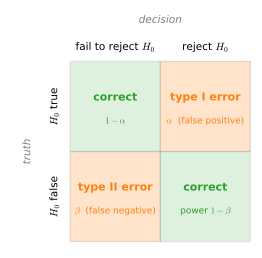
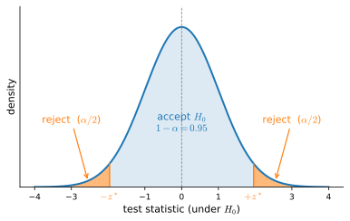

# Statistics
:label:`sec_mdl-statistics`

A trained model is only ever fit to a *finite* sample, so every quantity we read off it---an accuracy, a learned weight, an estimated mean---is a guess computed from random data and would come out differently on a fresh draw. Statistics is the discipline that quantifies that randomness: it tells us how far a guess typically sits from the truth, when an apparent improvement is real rather than noise, and how confident we are entitled to be. This section develops the three ideas a deep-learning practitioner reaches for most often. We define an *estimator* and the two ways it can be wrong---*bias* and *variance*---and prove the decomposition that ties them together; this single identity is the same U-curve that governs under- and over-fitting in :numref:`sec_generalization_basics`, so it is worth deriving carefully. We then turn to *hypothesis testing*, the framework behind A/B tests and benchmark comparisons, and close with *confidence intervals*, which attach a notion of uncertainty to a point estimate. Throughout we take the true parameter $\theta$ to be a scalar; the vector case is identical with sums of squares replaced by squared norms.

We first load the per-framework library so the computations below have `d2l` and the tensor library in scope. The estimator simulations are framework-agnostic apart from the random-number call, so the worked cells branch only where they must.

```{.python .input #statistics-imports}
#@tab mxnet
%matplotlib inline
from d2l import mxnet as d2l
from mxnet import np, npx
npx.set_np()
```

```{.python .input #statistics-imports}
#@tab pytorch
%matplotlib inline
from d2l import torch as d2l
import torch
```

```{.python .input #statistics-imports}
#@tab tensorflow
%matplotlib inline
from d2l import tensorflow as d2l
import tensorflow as tf
```

```{.python .input #statistics-imports}
#@tab jax
%matplotlib inline
from d2l import jax as d2l
import jax
from jax import numpy as jnp
```

## Estimators and Their Quality

### Estimators

An *estimator* is a recipe that turns data into a guess for an unknown parameter. Formally, given samples $x_1,\ldots,x_n$ drawn from a distribution governed by a parameter $\theta$, an estimator is a function

$$
\hat\theta_n = \hat f(x_1,\ldots,x_n)
$$

that we hope lands near $\theta$. We have met estimators already: in :numref:`sec_mdl-maximum_likelihood` the maximum-likelihood estimate of a Bernoulli probability was the fraction of observed ones, and the maximum-likelihood estimate of a Gaussian mean was the sample average. The key fact is that $\hat\theta_n$ is itself a *random variable*: it depends on the random sample, so it would come out differently on a fresh dataset. Asking whether an estimator is *good* is therefore asking about the distribution of $\hat\theta_n$ over repeated datasets---its *sampling distribution*---and that distribution has two features that matter, its center and its spread.

### Bias and Variance

The first feature is the *center*. The **bias** of $\hat\theta_n$ measures the systematic gap between where the estimator centers and the truth,

$$
\operatorname{Bias}(\hat\theta_n) = \mathbb{E}[\hat\theta_n] - \theta ,
$$
:eqlabel:`eq_mdl-bias`

the expectation taken over the random sample. When $\operatorname{Bias}(\hat\theta_n)=0$ for every $\theta$ we call $\hat\theta_n$ *unbiased*: it is right *on average*, even though any single estimate misses. Bias is the error that does not wash out by collecting more data of the same kind---it is baked into the recipe.

The second feature is the *spread*. The **variance** measures how much the estimator fluctuates around its own center, with the **standard error** its square root,

$$
\operatorname{Var}(\hat\theta_n) = \mathbb{E}\!\left[(\hat\theta_n - \mathbb{E}[\hat\theta_n])^2\right],
\qquad
\operatorname{se}(\hat\theta_n) = \sqrt{\operatorname{Var}(\hat\theta_n)} .
$$
:eqlabel:`eq_mdl-var_est`

Note carefully that variance is measured against $\mathbb{E}[\hat\theta_n]$, *not* against the true $\theta$: it captures the noise in the estimator, not its accuracy. :numref:`fig_mdl-sampling-distribution` makes the two features visible by drawing the sampling distribution for two estimators of the same $\theta$. Bias is the offset of the distribution's center from $\theta$; variance is its width.


:label:`fig_mdl-sampling-distribution`

### Consistency and Efficiency

Bias and variance describe an estimator at a *fixed* sample size. Two further notions describe how it behaves as data accumulates. An estimator is *asymptotically unbiased* if its bias vanishes in the limit, $\lim_{n\to\infty}\operatorname{Bias}(\hat\theta_n)=0$; many estimators used in practice are biased at finite $n$ but asymptotically unbiased, which is usually good enough. A stronger and more useful guarantee is *consistency*: $\hat\theta_n$ is consistent if it *converges in probability* to $\theta$,

$$
\hat\theta_n \xrightarrow{P} \theta,
\qquad\textrm{i.e.}\qquad
P\bigl(|\hat\theta_n-\theta|>\varepsilon\bigr)\to 0 \quad\textrm{for every } \varepsilon>0 .
$$

Consistency is the formal content of the slogan "more data gets us arbitrarily close to the truth." A clean sufficient condition is that *both* the bias and the variance tend to zero, since then the whole sampling distribution collapses onto $\theta$; we will see this happen explicitly for the sample mean below. (The two limits are independent: an estimator can be asymptotically unbiased yet inconsistent if its variance does not vanish, and vice versa.)

Finally, among *unbiased* estimators we prefer the one that fluctuates least, and we call it *efficient*: efficiency ranks unbiased estimators by their variance, the smaller the better. There is a hard floor here---the Cramér--Rao bound puts a lower limit on the variance of any unbiased estimator---and an estimator that attains it is as good as unbiased estimation can be. We will not need the bound itself, only the idea it formalizes: once unbiasedness is secured, the remaining game is to minimize variance, which is exactly the second half of the decomposition we turn to next.

## The Bias-Variance Decomposition

We now have two distinct ways an estimator can be wrong---a systematic offset (bias) and random fluctuation (variance)---and a single number that ought to combine them: the *mean squared error*. It is worth pausing on the remarkable fact that the MSE is *exactly* the sum of these two contributions, with no cross term. This decomposition is the centerpiece of the section.

### Mean Squared Error and the Decomposition

The simplest summary of how far an estimator lands from the truth is the **mean squared error**,

$$
\operatorname{MSE}(\hat\theta_n) = \mathbb{E}\!\left[(\hat\theta_n-\theta)^2\right] .
$$
:eqlabel:`eq_mdl-mse_est`

It is always non-negative, and the smaller it is the closer $\hat\theta_n$ sits to $\theta$ on average. If you have read :numref:`sec_linear_regression` you will recognize it as the squared-error loss, now applied to an estimator rather than a prediction.

**Proposition (bias-variance decomposition).** *For any estimator $\hat\theta_n$ of a fixed parameter $\theta$,*

$$
\operatorname{MSE}(\hat\theta_n) = \operatorname{Bias}(\hat\theta_n)^2 + \operatorname{Var}(\hat\theta_n) .
$$
:eqlabel:`eq_mdl-bias-variance`

**Proof.** Abbreviate $\mu = \mathbb{E}[\hat\theta_n]$, the center of the estimator, and add and subtract it inside the square:

$$
\operatorname{MSE}(\hat\theta_n)
 = \mathbb{E}\!\left[(\hat\theta_n - \theta)^2\right]
 = \mathbb{E}\!\left[\bigl((\hat\theta_n - \mu) + (\mu - \theta)\bigr)^2\right].
$$

Expanding the square gives three terms. The first is $\mathbb{E}[(\hat\theta_n-\mu)^2]=\operatorname{Var}(\hat\theta_n)$; the last is $(\mu-\theta)^2=\operatorname{Bias}(\hat\theta_n)^2$, a constant. The middle, cross term *vanishes*, because $\mu-\theta$ is a constant and $\hat\theta_n-\mu$ has mean zero by the definition of $\mu$:

$$
2\,(\mu-\theta)\,\mathbb{E}[\hat\theta_n - \mu]
 = 2\,(\mu-\theta)\,(\mu - \mu) = 0 .
$$

What remains is $\operatorname{Var}(\hat\theta_n)+\operatorname{Bias}(\hat\theta_n)^2$. $\blacksquare$

The vanishing cross term is the whole story: because the deviation from the center has mean zero, the systematic part and the fluctuating part of the error never interfere, and the squared error splits cleanly into the two pieces of :numref:`fig_mdl-sampling-distribution`. One immediate payoff is the consistency criterion promised above: if both $\operatorname{Bias}(\hat\theta_n)\to0$ and $\operatorname{Var}(\hat\theta_n)\to0$, then :eqref:`eq_mdl-bias-variance` forces $\operatorname{MSE}(\hat\theta_n)\to0$, which implies $\hat\theta_n\xrightarrow{P}\theta$ by Chebyshev's inequality.

### The Trade-off and Generalization

Identity :eqref:`eq_mdl-bias-variance` is more than bookkeeping; it explains the central tension of model fitting. Read $\hat\theta_n$ as a *fitted model* and $\theta$ as the function we wish it had learned. A model too simple to capture the signal---a straight line for a curved relationship---has large bias: it misses systematically no matter how much data we feed it. A model too flexible chases the noise in the particular training set, so it has large variance: a fresh dataset would fit it to a wildly different shape. These are the familiar failures of *underfitting* (high bias) and *overfitting* (high variance) from :numref:`sec_generalization_basics`.

As we dial up model complexity, the squared bias falls while the variance rises, and their sum---the MSE, which is the expected test error---traces a U with a minimum at the sweet spot, shown in :numref:`fig_mdl-bias-variance-u-curve`. The decomposition and the generalization U-curve are therefore literally the *same picture*. This also explains *why regularization helps*: techniques like weight decay deliberately add a little bias in exchange for a large reduction in variance, sliding leftward on the curve to a lower total error.


:label:`fig_mdl-bias-variance-u-curve`

### The Decomposition in Code

The decomposition is an exact algebraic identity, so it should hold to numerical precision on a concrete example. We first define bias and MSE as the formulas :eqref:`eq_mdl-bias` and :eqref:`eq_mdl-mse_est` say---averages over a collection of estimates, against the true parameter.

```{.python .input #statistics-estimator-metrics}
#@tab mxnet
def stat_bias(true_theta, est_theta):  # E[theta_hat] - theta
    return np.mean(est_theta) - true_theta

def mse(est_theta, true_theta):        # E[(theta_hat - theta)^2]
    return np.mean(np.square(est_theta - true_theta))
```

```{.python .input #statistics-estimator-metrics}
#@tab pytorch
def stat_bias(true_theta, est_theta):  # E[theta_hat] - theta
    return torch.mean(est_theta) - true_theta

def mse(est_theta, true_theta):        # E[(theta_hat - theta)^2]
    return torch.mean(torch.square(est_theta - true_theta))
```

```{.python .input #statistics-estimator-metrics}
#@tab tensorflow
def stat_bias(true_theta, est_theta):  # E[theta_hat] - theta
    return tf.reduce_mean(est_theta) - true_theta

def mse(est_theta, true_theta):        # E[(theta_hat - theta)^2]
    return tf.reduce_mean(tf.square(est_theta - true_theta))
```

```{.python .input #statistics-estimator-metrics}
#@tab jax
def stat_bias(true_theta, est_theta):  # E[theta_hat] - theta
    return jnp.mean(est_theta) - true_theta

def mse(est_theta, true_theta):        # E[(theta_hat - theta)^2]
    return jnp.mean(jnp.square(est_theta - true_theta))
```

To exercise these we need the *sampling distribution* itself, not a single dataset: we draw many independent datasets from $\mathcal{N}(\theta,\sigma^2)$, compute the sample mean on each, and collect the resulting estimates. Their spread is the variance and their center the bias.

```{.python .input #statistics-sampling-distribution}
#@tab mxnet
theta_true, sigma = 1.0, 4.0
num_datasets, n = 10000, 30  # 10k datasets, each of n=30 points
samples = np.random.normal(theta_true, sigma, (num_datasets, n))
theta_hats = samples.mean(axis=1)  # one sample-mean estimate per dataset
```

```{.python .input #statistics-sampling-distribution}
#@tab pytorch
theta_true, sigma = 1.0, 4.0
num_datasets, n = 10000, 30  # 10k datasets, each of n=30 points
samples = torch.normal(theta_true, sigma, size=(num_datasets, n))
theta_hats = samples.mean(axis=1)  # one sample-mean estimate per dataset
```

```{.python .input #statistics-sampling-distribution}
#@tab tensorflow
theta_true, sigma = 1.0, 4.0
num_datasets, n = 10000, 30  # 10k datasets, each of n=30 points
samples = tf.random.normal((num_datasets, n), theta_true, sigma)
theta_hats = tf.reduce_mean(samples, axis=1)  # one estimate per dataset
```

```{.python .input #statistics-sampling-distribution}
#@tab jax
theta_true, sigma = 1.0, 4.0
num_datasets, n = 10000, 30  # 10k datasets, each of n=30 points
key = jax.random.PRNGKey(0)
samples = jax.random.normal(key, (num_datasets, n)) * sigma + theta_true
theta_hats = samples.mean(axis=1)  # one sample-mean estimate per dataset
```

Now we read the decomposition off the empirical sampling distribution. The MSE of the estimates around the true $\theta$ should match the squared bias plus the variance of the estimates around their own mean---the two sides of :eqref:`eq_mdl-bias-variance`.

```{.python .input #statistics-verify-decomposition}
#@tab mxnet
bias = stat_bias(theta_true, theta_hats)
# ddof=1 for the unbiased variance estimate (see the next subsection); NumPy/
# MXNet/TF/JAX default to ddof=0, PyTorch to ddof=1, so we set it explicitly.
var = np.square(theta_hats.std(ddof=1))
mse(theta_hats, theta_true), var + np.square(bias)
```

```{.python .input #statistics-verify-decomposition}
#@tab pytorch
bias = stat_bias(theta_true, theta_hats)
var = torch.square(theta_hats.std(unbiased=True))  # unbiased=True is ddof=1
mse(theta_hats, theta_true), var + torch.square(bias)
```

```{.python .input #statistics-verify-decomposition}
#@tab tensorflow
bias = stat_bias(theta_true, theta_hats)
# tf.math.reduce_std has no ddof, so compute the unbiased variance directly.
n_d = tf.cast(tf.size(theta_hats), theta_hats.dtype)
var = tf.reduce_sum(tf.square(theta_hats - tf.reduce_mean(theta_hats))) / (n_d - 1)
mse(theta_hats, theta_true), var + tf.square(bias)
```

```{.python .input #statistics-verify-decomposition}
#@tab jax
bias = stat_bias(theta_true, theta_hats)
var = jnp.square(jnp.std(theta_hats, ddof=1))  # ddof=1 for unbiased variance
mse(theta_hats, theta_true), var + jnp.square(bias)
```

The two numbers agree, and both are close to the theoretical value. For the sample mean of $\mathcal{N}(\theta,\sigma^2)$ the bias is exactly zero (the average of unbiased draws is unbiased) and the variance is $\sigma^2/n$, so $\operatorname{MSE}=\sigma^2/n = 16/30 \approx 0.53$. Because *both* the bias ($0$) and the variance ($\sigma^2/n\to0$) vanish as $n\to\infty$, the sample mean is consistent---exactly the criterion from the decomposition above.

### Why the Unbiased Variance Divides by $n-1$

The sample mean was unbiased for free. The sample *variance* is more delicate, and it exposes a subtlety that every framework's `std` function encodes in a `ddof` flag. Given samples $x_1,\ldots,x_n$ with sample mean $\bar x=\frac1n\sum_i x_i$, the natural estimator of the population variance $\sigma^2$ would average the squared deviations,

$$
s_0^2 = \frac1n\sum_{i=1}^n (x_i-\bar x)^2 .
$$

This is *biased*: it systematically underestimates $\sigma^2$, because the deviations are measured from $\bar x$---the point that *minimizes* the sum of squared deviations for this particular sample---rather than from the unknown true mean $\mu$. The fix is to divide by $n-1$ instead of $n$, and the factor is exactly what unbiasedness requires.

**Proposition (unbiased sample variance).** *For i.i.d. samples with variance $\sigma^2$,*

$$
s^2 = \frac{1}{n-1}\sum_{i=1}^n (x_i-\bar x)^2
\qquad\textrm{satisfies}\qquad
\mathbb{E}[s^2] = \sigma^2 .
$$
:eqlabel:`eq_mdl-unbiased-var`

**Proof.** Center the data at the true mean $\mu$ by writing $x_i-\bar x = (x_i-\mu)-(\bar x-\mu)$, and expand the sum of squared deviations:

$$
\sum_{i=1}^n (x_i-\bar x)^2
 = \sum_{i=1}^n (x_i-\mu)^2 - n\,(\bar x-\mu)^2 ,
$$

where the cross term collapsed because $\sum_i (x_i-\mu) = n(\bar x-\mu)$. Now take expectations. Each $\mathbb{E}[(x_i-\mu)^2]=\sigma^2$, so the first sum has expectation $n\sigma^2$. The second uses the variance of the sample mean, $\mathbb{E}[(\bar x-\mu)^2]=\operatorname{Var}(\bar x)=\sigma^2/n$, so that term has expectation $n\cdot\sigma^2/n=\sigma^2$. Hence

$$
\mathbb{E}\!\left[\sum_{i=1}^n (x_i-\bar x)^2\right] = n\sigma^2 - \sigma^2 = (n-1)\,\sigma^2 .
$$

Dividing by $n-1$ gives $\mathbb{E}[s^2]=\sigma^2$. $\blacksquare$

The intuition is *degrees of freedom*: estimating $\bar x$ from the same data consumes one degree of freedom, so only $n-1$ of the deviations are free to vary, and dividing by $n-1$ rather than $n$ corrects for it exactly. (As $n\to\infty$ the two estimators agree, so $s_0^2$ is biased but asymptotically unbiased and consistent.) We can watch the bias appear and the correction remove it by estimating both variances over many datasets and averaging.

```{.python .input #statistics-unbiased-variance}
#@tab mxnet
n = 3  # small n makes the 1/n bias glaring; the gap shrinks like 1/n
data = np.random.normal(0, 2, (100000, n))  # sigma^2 = 4
dev2 = np.square(data - data.mean(axis=1, keepdims=True)).sum(axis=1)
print(f'true variance         = 4')
print(f'E[divide by n]   = {float((dev2 / n).mean()):.3f}  (biased)')
print(f'E[divide by n-1] = {float((dev2 / (n - 1)).mean()):.3f}  (unbiased)')
```

```{.python .input #statistics-unbiased-variance}
#@tab pytorch
n = 3  # small n makes the 1/n bias glaring; the gap shrinks like 1/n
data = torch.normal(0, 2, size=(100000, n))  # sigma^2 = 4
dev2 = torch.square(data - data.mean(axis=1, keepdim=True)).sum(axis=1)
print(f'true variance         = 4')
print(f'E[divide by n]   = {(dev2 / n).mean():.3f}  (biased)')
print(f'E[divide by n-1] = {(dev2 / (n - 1)).mean():.3f}  (unbiased)')
```

```{.python .input #statistics-unbiased-variance}
#@tab tensorflow
n = 3  # small n makes the 1/n bias glaring; the gap shrinks like 1/n
data = tf.random.normal((100000, n), 0, 2)  # sigma^2 = 4
dev2 = tf.reduce_sum(tf.square(
    data - tf.reduce_mean(data, axis=1, keepdims=True)), axis=1)
print(f'true variance         = 4')
print(f'E[divide by n]   = {tf.reduce_mean(dev2 / n):.3f}  (biased)')
print(f'E[divide by n-1] = {tf.reduce_mean(dev2 / (n - 1)):.3f}  (unbiased)')
```

```{.python .input #statistics-unbiased-variance}
#@tab jax
n = 3  # small n makes the 1/n bias glaring; the gap shrinks like 1/n
data = jax.random.normal(jax.random.PRNGKey(1), (100000, n)) * 2  # sigma^2 = 4
dev2 = jnp.square(data - data.mean(axis=1, keepdims=True)).sum(axis=1)
print(f'true variance         = 4')
print(f'E[divide by n]   = {(dev2 / n).mean():.3f}  (biased)')
print(f'E[divide by n-1] = {(dev2 / (n - 1)).mean():.3f}  (unbiased)')
```

With $n=3$ the biased estimator averages near $\tfrac{n-1}{n}\sigma^2 = \tfrac23\cdot 4 \approx 2.67$, while dividing by $n-1$ recovers $4$, confirming :eqref:`eq_mdl-unbiased-var`. This is precisely why `numpy` and friends expose `ddof` ("delta degrees of freedom"): `ddof=1` divides by $n-1$ for the unbiased estimate, `ddof=0` divides by $n$.

## Hypothesis Testing

The bias-variance picture asks *how good* a single estimate is. Hypothesis testing asks a different question that dominates experimental practice: given two estimates---a baseline and a new model, a control group and a treatment---is the observed difference *real*, or could it be a fluke of the particular sample? This is the framework behind A/B testing and behind claims that one architecture beats another on a benchmark.

### The Setup: Null, Alternative, and Two Kinds of Error

A *hypothesis test* weighs evidence against a default claim. The **null hypothesis** $H_0$ is that default---typically "there is no effect," e.g. the new model is no better than the baseline---and the **alternative** $H_A$ is its negation, the effect we hope to detect. The asymmetry is deliberate: we never *prove* $H_0$; we either gather enough evidence to *reject* it in favor of $H_A$, or we fail to, much as a court returns "guilty" or "not guilty" rather than "innocent."

Because the data are random, the decision can go wrong in two ways. A **type I error** (false positive) is rejecting $H_0$ when it is in fact true---declaring an effect that is not there. A **type II error** (false negative) is failing to reject $H_0$ when it is in fact false---missing a real effect. Their rates have standard names, the significance level $\alpha$ and $\beta$,

$$
\alpha = P(\textrm{reject } H_0 \mid H_0 \textrm{ true}),
\qquad
\beta = P(\textrm{fail to reject } H_0 \mid H_0 \textrm{ false}),
$$

and the four possible outcomes arrange into the $2\times2$ decision matrix of :numref:`fig_mdl-type-i-ii-matrix`: rows are whether $H_0$ is true or false, columns are our decision. The diagonal cells are correct; the off-diagonal cells are the two errors. This picture is the surest way to keep $\alpha$ and $\beta$ from getting swapped.


:label:`fig_mdl-type-i-ii-matrix`

### Significance and Power

We *choose* the type I error rate up front: the **significance level** $\alpha$ is the risk of a false positive we are willing to tolerate, conventionally $\alpha=0.05$. The complement $1-\alpha$ is the *confidence level*; we reserve that name for the confidence intervals below and are careful not to call $1-\alpha$ the significance. The bottom-right cell of the matrix is the quantity we want to be large: the **statistical power**

$$
1 - \beta = P(\textrm{reject } H_0 \mid H_0 \textrm{ false})
$$

is the probability the test *detects* a real effect. A test with $\alpha=0.05$ but power $0.2$ rejects a true null only $5\%$ of the time yet still misses $80\%$ of genuine effects---underpowered, and worthless for confirming improvements. A common target is $1-\beta=0.8$.

Power is what determines how much data we need. The probability of detecting an effect grows with both the *effect size* (how false $H_0$ really is) and the sample size, and for the standard tests the required $n$ scales like $1/(\textrm{effect size})^2$. As an indicative one-sample two-sided $z$-test at $\alpha=0.05$ and power $0.8$: detecting that a mean-zero, variance-one Gaussian actually has mean near $1$ (a large effect) needs only about $8$ samples, whereas detecting a mean near $0.01$ (a tiny effect) needs on the order of $80{,}000$. This is why marginal benchmark gains demand enormous test sets to confirm.

### Test Statistics, $p$-values, and Significance

To run a test we compress the data into a single **test statistic** $T(x)$---a scalar chosen so that extreme values are unlikely under $H_0$. The mean difference between two groups is a natural choice. Crucially, under $H_0$ the statistic has a known (often approximately Gaussian) *null distribution*, and that is what lets us judge whether an observed value is surprising.

The verdict is delivered by the **$p$-value**: the probability, *computed under $H_0$*, of seeing a statistic at least as extreme as the one we observed. For a two-sided test (the common case, where a deviation in either direction counts as evidence),

$$
p\textrm{-value} = P_{H_0}\bigl(|T(X)| \ge |T(x)|\bigr),
$$

with the one-sided version using a single tail. We reject $H_0$ when $p \le \alpha$. Geometrically, the rejection region is the set of statistic values whose $p$-value falls below $\alpha$; :numref:`fig_mdl-statistical_significance` shows it for a Gaussian null at $\alpha=0.05$ as the two tails beyond the critical values, together holding $5\%$ of the probability. A statistic landing in those tails would be very unlikely if $H_0$ held, so we reject.


:label:`fig_mdl-statistical_significance`

A persistent warning is in order, because the $p$-value is among the most misread numbers in science. It is $P(\textrm{data this extreme}\mid H_0)$, a statement about the data *given* the null---*not* $P(H_0\mid\textrm{data})$, the probability the null is true, which would require a prior and Bayes' rule. A large $p$-value does *not* confirm $H_0$; it means only that we failed to detect an effect, possibly because the test was underpowered.

To summarize, a hypothesis test proceeds in five steps:

1. State $H_0$ and $H_A$.
2. Fix the significance level $\alpha$ and a target power $1-\beta$ (which, with the expected effect size, sets the sample size).
3. Collect the data.
4. Compute the test statistic and its $p$-value under $H_0$.
5. Reject $H_0$ if $p \le \alpha$; otherwise fail to reject.

## Confidence Intervals

A point estimate $\hat\theta$ carries no notion of uncertainty---it is a single number that hides how much it would wobble on fresh data. A **confidence interval** repairs this by reporting an *interval* engineered to contain the true $\theta$ with high probability. The idea is due to Jerzy Neyman :cite:`Neyman.1937`.

### Definition and Interpretation

A confidence interval for $\theta$ is an interval $C_n$ computed from the data such that

$$
P_\theta(C_n \ni \theta) \ge 1 - \alpha \quad \textrm{for all } \theta,
$$
:eqlabel:`eq_mdl-confidence`

where $1-\alpha$ is the *confidence level* or *coverage*. We write $C_n \ni \theta$ rather than $\theta \in C_n$ to stress where the randomness lives: $\theta$ is a *fixed* unknown, and it is the *interval* $C_n$ that is random, redrawn with every dataset.

This makes the correct interpretation subtle, and it is worth getting right. A $95\%$ confidence interval does *not* mean "the true $\theta$ lies in this particular interval with probability $95\%$"---that particular interval is already drawn, and $\theta$ either is or is not inside it. The right reading is *about the procedure*: if we generated many intervals this way, $95\%$ of them would contain $\theta$. The guarantee is on the long-run hit rate of the recipe, not on any single interval.

### A Gaussian Example

The classic case is the mean of a Gaussian $\mathcal{N}(\mu,\sigma^2)$ with both parameters unknown. From $n$ samples we form the usual estimators $\hat\mu_n=\frac1n\sum_i x_i$ and the unbiased $\hat\sigma_n^2=\frac1{n-1}\sum_i (x_i-\hat\mu_n)^2$ from :eqref:`eq_mdl-unbiased-var`. The studentized statistic

$$
T = \frac{\hat\mu_n - \mu}{\hat\sigma_n/\sqrt n}
$$

follows *Student's $t$-distribution* on $n-1$ degrees of freedom, which approaches a standard Gaussian as $n\to\infty$. So for large $n$, $T$ lands in $[-1.96, 1.96]$ at least $95\%$ of the time (the Gaussian's central $95\%$), and rearranging $-1.96 \le T \le 1.96$ for $\mu$ yields the interval

$$
\left[\hat\mu_n - 1.96\,\frac{\hat\sigma_n}{\sqrt n},\; \hat\mu_n + 1.96\,\frac{\hat\sigma_n}{\sqrt n}\right].
$$
:eqlabel:`eq_mdl-gauss_confidence`

This is one of the most-used formulas in statistics. The half-width $1.96\,\hat\sigma_n/\sqrt n$ shrinks like $1/\sqrt n$---to halve the interval we need *four times* the data. Let us construct one for a standard-normal sample, taking the asymptotic $t_\star=1.96$.

```{.python .input #statistics-confidence-interval}
#@tab mxnet
N = 1000
samples = np.random.normal(loc=0, scale=1, size=(N,))
t_star = 1.96  # asymptotic value; small N would look this up in a t-table
mu_hat = np.mean(samples)
se = samples.std(ddof=1) / np.sqrt(N)  # ddof=1: unbiased sigma_hat
(mu_hat - t_star * se, mu_hat + t_star * se)
```

```{.python .input #statistics-confidence-interval}
#@tab pytorch
N = 1000
samples = torch.normal(0, 1, size=(N,))
t_star = 1.96  # asymptotic value; small N would look this up in a t-table
mu_hat = torch.mean(samples)
se = samples.std(unbiased=True) / N**0.5  # unbiased=True: ddof=1
(mu_hat - t_star * se, mu_hat + t_star * se)
```

```{.python .input #statistics-confidence-interval}
#@tab tensorflow
N = 1000
samples = tf.random.normal((N,), 0, 1)
t_star = 1.96  # asymptotic value; small N would look this up in a t-table
mu_hat = tf.reduce_mean(samples)
n_d = tf.cast(tf.size(samples), samples.dtype)
sigma_hat = tf.sqrt(tf.reduce_sum(tf.square(samples - mu_hat)) / (n_d - 1))
se = sigma_hat / tf.sqrt(n_d)  # ddof=1 done by hand: divide by n-1
(mu_hat - t_star * se, mu_hat + t_star * se)
```

```{.python .input #statistics-confidence-interval}
#@tab jax
N = 1000
key = jax.random.PRNGKey(0)
samples = jax.random.normal(key, (N,))
t_star = 1.96  # asymptotic value; small N would look this up in a t-table
mu_hat = jnp.mean(samples)
se = jnp.std(samples, ddof=1) / jnp.sqrt(N)  # ddof=1: unbiased sigma_hat
(mu_hat - t_star * se, mu_hat + t_star * se)
```

The interval is narrow and brackets the true mean $0$, as it should roughly $95\%$ of the time. The same $1/\sqrt n$ scaling shows up everywhere uncertainty is reported---error bars on a learning curve, the spread of accuracies across random seeds---and :eqref:`eq_mdl-gauss_confidence` is the formula behind them.

## Summary

* An *estimator* $\hat\theta_n$ is a function of the data; being random, it has a *sampling distribution* whose center and spread are summarized by *bias* $\mathbb{E}[\hat\theta_n]-\theta$ and *variance*. *Consistency* ($\hat\theta_n\xrightarrow{P}\theta$) follows when both shrink with $n$; *efficiency* ranks unbiased estimators by their variance.
* The *bias-variance decomposition* $\operatorname{MSE}(\hat\theta_n)=\operatorname{Bias}(\hat\theta_n)^2+\operatorname{Var}(\hat\theta_n)$ splits the error cleanly because, after centering at $\mathbb{E}[\hat\theta_n]$, the cross term vanishes. This is the same U-curve as the under/overfitting trade-off, and it explains why regularization trades bias for variance.
* The unbiased sample variance divides by $n-1$, not $n$: estimating the mean from the same data costs one degree of freedom, and the $1/(n-1)$ factor corrects the resulting bias exactly.
* *Hypothesis testing* weighs evidence against a null $H_0$ via a test statistic and its $p$-value $P_{H_0}(\textrm{data this extreme})$; we control the type I error rate $\alpha$ and want high power $1-\beta$. A $p$-value is not $P(H_0\mid\textrm{data})$.
* A *confidence interval* contains $\theta$ with probability $\ge 1-\alpha$ over repeated datasets; the Gaussian interval $\hat\mu_n \pm 1.96\,\hat\sigma_n/\sqrt n$ has half-width shrinking like $1/\sqrt n$.

## Exercises

1. Let $X_1, \ldots, X_n \overset{\textrm{iid}}{\sim} \textrm{Unif}(0,\theta)$ and consider the estimators $\hat\theta = \max\{X_1,\ldots,X_n\}$ and $\tilde\theta = \frac2n\sum_i X_i$. Find the bias, variance, and MSE of each, and decide which is better. Is $\hat\theta$ biased? Is it consistent?
2. Prove the bias-variance decomposition :eqref:`eq_mdl-bias-variance` directly by expanding $\mathbb{E}[(\hat\theta_n-\theta)^2]$ into $\mathbb{E}[\hat\theta_n^2]-2\theta\,\mathbb{E}[\hat\theta_n]+\theta^2$ and substituting $\mathbb{E}[\hat\theta_n^2]=\operatorname{Var}(\hat\theta_n)+\mathbb{E}[\hat\theta_n]^2$. Confirm it agrees with the add-and-subtract proof in the text.
3. Modify the sampling-distribution code to use the biased variance estimator $s_0^2$ ($n$ in the denominator, `ddof=0`). Does the empirical MSE still match $\operatorname{Bias}^2+\operatorname{Var}$? Explain why the *identity* holds regardless of which variance estimator you plug in, even though one is biased.
4. Shrink the per-dataset size $n$ in the sampling-distribution simulation and confirm the spread of $\hat\theta$ widens like $\sigma/\sqrt n$. Repeat with the biased estimator $\hat\theta=\max_i X_i$ for $\textrm{Unif}(0,\theta)$ and watch the center shift away from $\theta$.
5. A test reports $p = 0.5$. Is this evidence that $H_0$ is true? Explain in terms of $P(\textrm{data}\mid H_0)$ versus $P(H_0\mid\textrm{data})$, and describe a situation where a large $p$-value reflects only low power.
6. Using the $1/(\textrm{effect size})^2$ scaling, estimate how many times more samples are needed to detect an effect of size $0.1$ than one of size $0.5$ at the same $\alpha$ and power.
7. Run the confidence-interval code with $N=2$ and $\alpha=0.5$ (so $t_\star=1.0$) for $100$ independently generated datasets, and look at the resulting intervals. Some are extremely short and far from the true mean $0$. Does this contradict the $1-\alpha$ coverage guarantee? Would you trust a short interval as a sign of a precise estimate?

:begin_tab:`mxnet`
[Discussions](https://d2l.discourse.group/t/419)
:end_tab:

:begin_tab:`pytorch`
[Discussions](https://d2l.discourse.group/t/1102)
:end_tab:

:begin_tab:`tensorflow`
[Discussions](https://d2l.discourse.group/t/1103)
:end_tab:

:begin_tab:`jax`
[Discussions](https://d2l.discourse.group/t/1103)
:end_tab:

<!-- slides -->

::: {.slide title="Estimator Quality"}
The language of estimators that ML borrows:

- **Estimator** $\hat\theta_n = \hat f(x_1,\ldots,x_n)$ — a
  procedure that turns data into a guess (sample mean, MLE).
- **Bias** $\mathbb{E}[\hat\theta] - \theta$ — systematic error.
- **Variance** $\operatorname{Var}(\hat\theta)$ — noise across
  datasets.
- **Consistency** — $\hat\theta_n \xrightarrow{P} \theta$ as
  data accumulates.

An estimator is judged by its *sampling distribution*: where
the estimates center, and how widely they spread.
:::

::: {.slide title="Sampling distribution: center vs spread"}
Repeat the experiment on fresh datasets. Bias is the offset
of the center from $\theta$; variance is the spread. Usually
one is traded for the other:

@fig:mdl-prob-sampling-distribution
:::

::: {.slide title="The bias–variance decomposition"}
**Proposition.** $\operatorname{MSE}(\hat\theta) =
\operatorname{Bias}(\hat\theta)^2 + \operatorname{Var}(\hat\theta)$.

Center at $\mu=\mathbb{E}[\hat\theta]$, expand
$(\hat\theta-\theta)^2 = ((\hat\theta-\mu)+(\mu-\theta))^2$;
the cross term vanishes because $\hat\theta-\mu$ has mean $0$.
No interference between systematic and random error.
:::

::: {.slide title="Same picture as generalization"}
Bias falls and variance rises with model complexity; their
sum (the test error) is a U-curve. Regularization trades a
little bias for a lot of variance reduction:

@fig:mdl-prob-bias-variance-u-curve
:::

::: {.slide title="Verify it in code"}
Build the sampling distribution from many datasets, then
check $\operatorname{MSE} =
\operatorname{Bias}^2 + \operatorname{Var}$ numerically:

@statistics-sampling-distribution

. . .

@statistics-verify-decomposition
:::

::: {.slide title="Why variance divides by n−1"}
Deviations are measured from $\bar x$ (which minimizes them),
so dividing by $n$ underestimates $\sigma^2$. One degree of
freedom is spent estimating the mean; $1/(n-1)$ corrects it:

@statistics-unbiased-variance
:::

::: {.slide title="Hypothesis testing"}
Weigh evidence against a default $H_0$. Two errors:

- **Type I** ($\alpha$) — reject a true $H_0$ (false positive).
- **Type II** ($\beta$) — keep a false $H_0$; **power** $=1-\beta$.

@fig:mdl-prob-type-i-ii-matrix
:::

::: {.slide title="p-values and significance"}
The $p$-value is $P_{H_0}(\text{data this extreme})$ — reject
when $p \le \alpha$. It is *not* $P(H_0\mid\text{data})$:

@fig:mdl-prob-significance
:::

::: {.slide title="Confidence intervals"}
$\hat\mu_n \pm 1.96\,\hat\sigma_n/\sqrt n$ contains $\mu$ in
$\approx 95\%$ of repeated datasets. Half-width shrinks like
$1/\sqrt n$ — 4× the data to halve it:

@statistics-confidence-interval
:::

::: {.slide title="Recap"}
- Estimator quality = bias + variance; their squares sum to MSE.
- Same trade-off as under/overfitting — regularization slides
  along the U-curve.
- Unbiased variance divides by $n-1$ (one degree of freedom spent).
- Tests control $\alpha$, want power; $p$-value is about data given
  $H_0$, not $H_0$ given data.
- Confidence intervals quantify uncertainty; width $\propto 1/\sqrt n$.
:::
