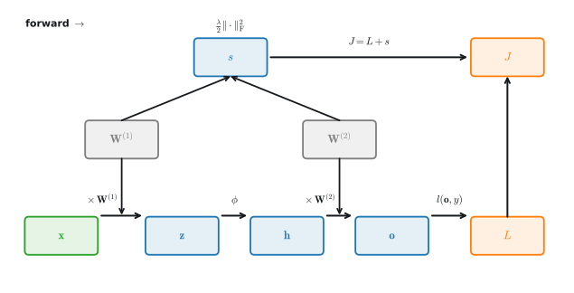

```{.python .input}
%load_ext d2lbook.tab
tab.interact_select('mxnet', 'pytorch', 'tensorflow', 'jax')
```

# Forward Propagation, Backward Propagation, and Computational Graphs
:label:`sec_backprop`

So far, we have trained our models
with minibatch stochastic gradient descent.
However, when we implemented the algorithm,
we only worried about the calculations involved
in *forward propagation* through the model.
When it came time to calculate the gradients,
we just invoked the backpropagation function provided by the deep learning framework.

The automatic calculation of gradients
profoundly simplifies
the implementation of deep learning algorithms.
Before automatic differentiation,
even small changes to complicated models required
recalculating complicated derivatives by hand.
Surprisingly often, academic papers had to allocate
numerous pages to deriving update rules.
While we must continue to rely on automatic differentiation
so we can focus on the interesting parts,
you ought to know how these gradients
are calculated under the hood
if you want to go beyond a shallow
understanding of deep learning.

In this section, we take a deep dive
into the details of *backward propagation*
(more commonly called *backpropagation*).
To convey some insight for both the
techniques and their implementations,
we rely on some basic mathematics and computational graphs.
To start, we focus our exposition on
a one-hidden-layer MLP
with weight decay ($\ell_2$ regularization, introduced in :numref:`sec_weight_decay`).

```{.python .input #backprop-forward-propagation-backward-propagation-and-computational-graphs}
%%tab pytorch
import torch
```

## Forward Propagation

*Forward propagation* (or *forward pass*) refers to the calculation and storage
of intermediate variables (including outputs)
for a neural network in order
from the input layer to the output layer.
We now work step-by-step through the mechanics
of a neural network with one hidden layer.
This may seem tedious but in the eternal words
of funk virtuoso James Brown,
you must "pay the cost to be the boss".


For the sake of simplicity, let's assume
that the input example is $\mathbf{x}\in \mathbb{R}^d$
and that our hidden layer does not include a bias term.
Note a switch of convention: :numref:`sec_mlp` processed a minibatch of *rows*
via $\mathbf{X}\mathbf{W}$, whereas here we track a single example as a *column*
vector acted on from the left, $\mathbf{W}\mathbf{x}$, so every weight matrix in
this section is transposed relative to its counterpart there.
Here the intermediate variable is:

$$\mathbf{z}= \mathbf{W}^{(1)} \mathbf{x},$$

where $\mathbf{W}^{(1)} \in \mathbb{R}^{h \times d}$
is the weight parameter of the hidden layer.
After running the intermediate variable
$\mathbf{z}\in \mathbb{R}^h$ through the
activation function $\phi$
we obtain our hidden activation vector of length $h$:

$$\mathbf{h}= \phi (\mathbf{z}).$$

The hidden layer output $\mathbf{h}$
is also an intermediate variable.
Assuming that the parameters of the output layer
possess only a weight of
$\mathbf{W}^{(2)} \in \mathbb{R}^{q \times h}$,
we can obtain an output layer variable
with a vector of length $q$:

$$\mathbf{o}= \mathbf{W}^{(2)} \mathbf{h}.$$

Assuming that the loss function is $l$
and the example label is $y$,
we can then calculate the loss term
for a single data example,

$$L = l(\mathbf{o}, y).$$

Recall the $\ell_2$ regularization term (:numref:`sec_weight_decay`): given
the hyperparameter $\lambda$,
the regularization term is

$$s = \frac{\lambda}{2} \left(\|\mathbf{W}^{(1)}\|_\textrm{F}^2 + \|\mathbf{W}^{(2)}\|_\textrm{F}^2\right),$$
:eqlabel:`eq_forward-s`

where the Frobenius norm of the matrix
is simply the $\ell_2$ norm applied
after flattening the matrix into a vector.
Finally, the model's regularized loss
on a given data example is:

$$J = L + s.$$

We refer to $J$ as the *objective function*
in the following discussion.


## Computational Graph of Forward Propagation

Plotting *computational graphs* helps us visualize
the dependencies of operators
and variables within the calculation.
:numref:`fig_forward` contains the graph associated
with the simple network described above,
where squares denote variables and circles denote operators.
The lower-left corner signifies the input
and the upper-right corner is the output.
Notice that the directions of the arrows
(which illustrate data flow)
are primarily rightward and upward.


:label:`fig_forward`

## Backpropagation

*Backpropagation* refers to the method of calculating
the gradient of neural network parameters.
In short, the method traverses the network in reverse order,
from the output to the input layer,
according to the *chain rule* from calculus.
The algorithm stores any intermediate variables
(partial derivatives)
required while calculating the gradient
with respect to some parameters.
Assume that we have functions
$\mathsf{Y}=f(\mathsf{X})$
and $\mathsf{Z}=g(\mathsf{Y})$,
in which the input and the output
$\mathsf{X}, \mathsf{Y}, \mathsf{Z}$
are tensors of arbitrary shapes.
By using the chain rule,
we can compute the derivative
of $\mathsf{Z}$ with respect to $\mathsf{X}$ via

$$\frac{\partial \mathsf{Z}}{\partial \mathsf{X}} = \textrm{prod}\left(\frac{\partial \mathsf{Z}}{\partial \mathsf{Y}}, \frac{\partial \mathsf{Y}}{\partial \mathsf{X}}\right).$$

Here we use the $\textrm{prod}$ operator
to multiply its arguments
after the necessary operations,
such as transposition and swapping input positions,
have been carried out.
For vectors, this is straightforward:
it is simply matrix--matrix multiplication.
For higher dimensional tensors,
we use the appropriate counterpart.
The operator $\textrm{prod}$ hides all the notational overhead;
what it computes is made precise as *vector--Jacobian products*
in :numref:`sec_mdl-matrix-calculus-autodiff`.

Recall that
the parameters of the simple network with one hidden layer,
whose computational graph is in :numref:`fig_forward`,
are $\mathbf{W}^{(1)}$ and $\mathbf{W}^{(2)}$.
The objective of backpropagation is to
calculate the gradients $\partial J/\partial \mathbf{W}^{(1)}$
and $\partial J/\partial \mathbf{W}^{(2)}$.
To accomplish this, we apply the chain rule
and calculate, in turn, the gradient of
each intermediate variable and parameter.
The order of calculations is reversed
relative to those performed in forward propagation,
since we need to start with the outcome of the computational graph
and work our way towards the parameters.
The first step is to calculate the gradients
of the objective function $J=L+s$
with respect to the loss term $L$
and the regularization term $s$:

$$\frac{\partial J}{\partial L} = 1 \; \textrm{and} \; \frac{\partial J}{\partial s} = 1.$$

Next, we compute the gradient of the objective function
with respect to the output-layer variable $\mathbf{o}$
according to the chain rule:

$$
\frac{\partial J}{\partial \mathbf{o}}
= \textrm{prod}\left(\frac{\partial J}{\partial L}, \frac{\partial L}{\partial \mathbf{o}}\right)
= \frac{\partial L}{\partial \mathbf{o}}
\in \mathbb{R}^q.
$$

Next, we calculate the gradients
of the regularization term
with respect to both parameters:

$$\frac{\partial s}{\partial \mathbf{W}^{(1)}} = \lambda \mathbf{W}^{(1)}
\; \textrm{and} \;
\frac{\partial s}{\partial \mathbf{W}^{(2)}} = \lambda \mathbf{W}^{(2)}.$$

Now we are able to calculate the gradient
$\partial J/\partial \mathbf{W}^{(2)} \in \mathbb{R}^{q \times h}$
of the model parameters closest to the output layer.
Using the chain rule yields:

$$\frac{\partial J}{\partial \mathbf{W}^{(2)}}= \textrm{prod}\left(\frac{\partial J}{\partial \mathbf{o}}, \frac{\partial \mathbf{o}}{\partial \mathbf{W}^{(2)}}\right) + \textrm{prod}\left(\frac{\partial J}{\partial s}, \frac{\partial s}{\partial \mathbf{W}^{(2)}}\right)= \frac{\partial J}{\partial \mathbf{o}} \mathbf{h}^\top + \lambda \mathbf{W}^{(2)}.$$
:eqlabel:`eq_backprop-J-h`

The "+" in :eqref:`eq_backprop-J-h` deserves a rule of its own:
**when a variable reaches the output along several paths, its gradient is the
*sum* of the gradients arriving along each path.**
Here $\mathbf{W}^{(2)}$ affects $J$ twice, through the prediction path
$J \leftarrow L \leftarrow \mathbf{o} \leftarrow \mathbf{W}^{(2)}$ and through
the regularizer path $J \leftarrow s \leftarrow \mathbf{W}^{(2)}$, and the two
contributions add. Forgetting to *accumulate* at such forks (overwriting
instead of adding) is among the most common bugs in hand-written backward
passes.

To obtain the gradient with respect to $\mathbf{W}^{(1)}$
we need to continue backpropagation
along the output layer to the hidden layer.
The gradient with respect to the hidden layer output
$\partial J/\partial \mathbf{h} \in \mathbb{R}^h$ is given by


$$
\frac{\partial J}{\partial \mathbf{h}}
= \textrm{prod}\left(\frac{\partial J}{\partial \mathbf{o}}, \frac{\partial \mathbf{o}}{\partial \mathbf{h}}\right)
= {\mathbf{W}^{(2)}}^\top \frac{\partial J}{\partial \mathbf{o}}.
$$

Since the activation function $\phi$ applies elementwise,
calculating the gradient $\partial J/\partial \mathbf{z} \in \mathbb{R}^h$
of the intermediate variable $\mathbf{z}$
requires that we use the elementwise multiplication operator,
which we denote by $\odot$:

$$
\frac{\partial J}{\partial \mathbf{z}}
= \textrm{prod}\left(\frac{\partial J}{\partial \mathbf{h}}, \frac{\partial \mathbf{h}}{\partial \mathbf{z}}\right)
= \frac{\partial J}{\partial \mathbf{h}} \odot \phi'\left(\mathbf{z}\right).
$$

Finally, we can obtain the gradient
$\partial J/\partial \mathbf{W}^{(1)} \in \mathbb{R}^{h \times d}$
of the model parameters closest to the input layer.
According to the chain rule, we get

$$
\frac{\partial J}{\partial \mathbf{W}^{(1)}}
= \textrm{prod}\left(\frac{\partial J}{\partial \mathbf{z}}, \frac{\partial \mathbf{z}}{\partial \mathbf{W}^{(1)}}\right) + \textrm{prod}\left(\frac{\partial J}{\partial s}, \frac{\partial s}{\partial \mathbf{W}^{(1)}}\right)
= \frac{\partial J}{\partial \mathbf{z}} \mathbf{x}^\top + \lambda \mathbf{W}^{(1)}.
$$

### A Worked Example

Symbols can hide what backpropagation actually *does*, so let us push real
numbers through a graph. We follow the one rule that produced every equation
above: at each node, multiply the gradient arriving from downstream by the
node's *local* derivative.

Start with the simplest non-trivial graph, $e = (a + b)\,c$, evaluated at
$a = 2$, $b = 1$, $c = -3$. The *forward pass* computes the intermediate
$d = a + b = 3$ and then $e = d\,c = -9$. For the *backward pass* we seed
$\partial e/\partial e = 1$ and walk back. The multiply node $e = d\,c$ has
local derivatives $\partial e/\partial d = c = -3$ and
$\partial e/\partial c = d = 3$. The add node $d = a + b$ has
$\partial d/\partial a = \partial d/\partial b = 1$, so it simply *passes its
incoming gradient through* to both inputs. Chaining,

$$\frac{\partial e}{\partial a} = \frac{\partial e}{\partial d}\frac{\partial d}{\partial a} = -3,\quad
  \frac{\partial e}{\partial b} = -3,\quad
  \frac{\partial e}{\partial c} = 3.$$

This is the whole algorithm in miniature: *add* nodes broadcast the upstream
gradient unchanged, *multiply* nodes scale it by the other input. Every backward
equation in this section is an instance of this one move.

Now run the same machinery on a network of the form above, shrunk to
$d = h = 2$ inputs and hidden units, $q = 1$ output, with ReLU activation
$\phi(z) = \max(0, z)$ and (for clarity) no regularization, $\lambda = 0$. Take

$$\mathbf{x} = \begin{bmatrix} 1 \\ 2 \end{bmatrix},\quad
  \mathbf{W}^{(1)} = \begin{bmatrix} 1 & -1 \\ 0 & \phantom{-}1 \end{bmatrix},\quad
  \mathbf{W}^{(2)} = \begin{bmatrix} 2 & -1 \end{bmatrix},\quad y = 0,$$

and squared-error loss $L = \tfrac12 (o - y)^2$. The *forward pass* gives
$\mathbf{z} = \mathbf{W}^{(1)}\mathbf{x} = [-1,\ 2]^\top$, so
$\mathbf{h} = \phi(\mathbf{z}) = [0,\ 2]^\top$ (the first unit is dead),
$o = \mathbf{W}^{(2)}\mathbf{h} = -2$, and $L = \tfrac12(-2)^2 = 2$. For the
*backward pass*, $\partial L/\partial o = o - y = -2$, and then, reading the
section's equations top to bottom,

$$\frac{\partial L}{\partial \mathbf{W}^{(2)}} = \frac{\partial L}{\partial o}\,\mathbf{h}^\top = -2\,[0,\ 2] = [0,\ -4],$$

$$\frac{\partial L}{\partial \mathbf{h}} = {\mathbf{W}^{(2)}}^\top \frac{\partial L}{\partial o} = [-4,\ 2]^\top,\qquad
  \frac{\partial L}{\partial \mathbf{z}} = \frac{\partial L}{\partial \mathbf{h}} \odot \phi'(\mathbf{z}) = [-4,\ 2]^\top \odot [0,\ 1]^\top = [0,\ 2]^\top,$$

using $\phi'(z) = \mathbf{1}[z > 0]$, which is exactly where the *dead* first
unit blocks the gradient. Finally,

$$\frac{\partial L}{\partial \mathbf{W}^{(1)}} = \frac{\partial L}{\partial \mathbf{z}}\,\mathbf{x}^\top
  = \begin{bmatrix} 0 \\ 2 \end{bmatrix}[1,\ 2]
  = \begin{bmatrix} 0 & 0 \\ 2 & 4 \end{bmatrix}.$$

:numref:`fig_mdl-mlp-backprop-graph` traces these numbers through the graph,
forward in black and backward in blue. Notice that the row of
$\partial L/\partial \mathbf{W}^{(1)}$ feeding the dead unit is entirely zero:
no gradient means no learning signal, the concrete face of the "dying ReLU" we
met in :numref:`sec_mlp`. You can confirm every number here in a few lines with
automatic differentiation (:numref:`sec_autograd`); doing so is a good way to
convince yourself the framework is running exactly this computation. Let's do
exactly that: build the same tensors, run the forward pass, call `backward()`,
and compare against the gradients we just derived by hand.

```{.python .input #backprop-verify}
%%tab pytorch
x, y = torch.tensor([1., 2.]), 0
W1 = torch.tensor([[1., -1.], [0., 1.]], requires_grad=True)
W2 = torch.tensor([[2., -1.]], requires_grad=True)
z = W1 @ x
h = torch.relu(z)
o = W2 @ h
for v in (z, h): v.retain_grad()  # keep gradients of non-leaf tensors
L = ((o - y) ** 2).sum() / 2
L.backward()
print(f'L = {L.item()}, dL/dW2 = {W2.grad}, dL/dh = {h.grad}')
print(f'dL/dz = {z.grad}, dL/dW1 =\n{W1.grad}')
```

Every printed gradient matches the hand computation, down to the zeroed-out
row for the dead unit. (The $-0$ in $\partial L/\partial \mathbf{W}^{(2)}$ is
floating point's *signed zero*, an artifact of multiplying $h_1 = 0$ by the
negative upstream gradient; it compares equal to $0$.)


:label:`fig_mdl-mlp-backprop-graph`

### From the Chain Rule to Autograd

What we have just done by hand is precisely what a deep learning framework does
when you call `backward()`: it records the computational graph during the forward
pass, seeds a gradient of $1$ at the scalar objective, and sweeps the graph in
reverse, multiplying the local derivative at each node (our $\textrm{prod}$) to
accumulate the gradient with respect to every parameter in a *single* pass. This
output-to-input sweep is *reverse-mode* automatic differentiation, and it is cheap
exactly when there are many parameters and one scalar loss, the deep learning
regime. We use it throughout the book and developed its mechanics, including when
the opposite *forward mode* is preferable, in :numref:`sec_autograd`; the full
theory, with both modes expressed as Jacobian products and the memory
trade-offs they imply, is developed in
:numref:`sec_mdl-matrix-calculus-autodiff`.

## Training Neural Networks

When training neural networks,
forward and backward propagation depend on each other.
In particular, for forward propagation,
we traverse the computational graph in the direction of dependencies
and compute all the variables on its path.
These are then used for backpropagation
where the compute order on the graph is reversed.

Take the aforementioned simple network as an illustrative example.
On the one hand,
computing the regularization term :eqref:`eq_forward-s`
during forward propagation
depends on the current values of model parameters $\mathbf{W}^{(1)}$ and $\mathbf{W}^{(2)}$.
They are given by the optimization algorithm according to backpropagation in the most recent iteration.
On the other hand,
the gradient calculation for the parameter
:eqref:`eq_backprop-J-h` during backpropagation
depends on the current value of the hidden layer output $\mathbf{h}$,
which is given by forward propagation.


Therefore when training neural networks, once model parameters are initialized,
we alternate forward propagation with backpropagation,
updating model parameters using gradients given by backpropagation.
Note that backpropagation reuses the stored intermediate values from forward propagation to avoid duplicate calculations.
One of the consequences is that we need to retain
the intermediate values until backpropagation is complete.
This is also one of the reasons why training
requires significantly more memory than plain prediction.
Besides, the size of such intermediate values is roughly
proportional to the number of network layers and the batch size.
Thus,
training deeper networks using larger batch sizes
more easily leads to *out-of-memory* errors.


## Summary

Forward propagation sequentially calculates and stores intermediate variables within the computational graph defined by the neural network. It proceeds from the input to the output layer.
Backpropagation sequentially calculates and stores the gradients of intermediate variables and parameters within the neural network in the reversed order.
When training deep learning models, forward propagation and backpropagation are interdependent,
and training requires significantly more memory than prediction.


## Exercises

1. Assume that the inputs $\mathbf{X}$ to some scalar function $f$ are $n \times m$ matrices. What is the dimensionality of the gradient of $f$ with respect to $\mathbf{X}$?
1. Add a bias to the hidden layer of the model described in this section (you do not need to include bias in the regularization term).
    1. Draw the corresponding computational graph.
    1. Derive the forward and backward propagation equations.
1. Compute the memory footprint for training and prediction in the model described in this section.
1. Assume that you want to compute second derivatives. What happens to the computational graph? How long do you expect the calculation to take?
1. Assume that the computational graph is too large for your GPU.
    1. Can you partition it over more than one GPU?
    1. What are the advantages and disadvantages over training on a smaller minibatch?
1. Build a miniature autograd engine and use it to re-derive this section's worked example.
    1. Write a scalar `Value` class that records, for each result, its inputs and the operation that produced it (the computational graph), supporting `+`, `*`, and `relu`. (*Hint:* implement `__add__` and `__mul__` so that each returns a new `Value` holding references to its parents and a small function that propagates the gradient one step.)
    1. Implement `backward()`: topologically sort the graph, seed the output's gradient with $1$, and sweep the nodes in reverse order, letting each node pass its gradient to its parents. Make sure gradients *accumulate* (`+=`, not `=`) when a value is used more than once — the fork rule from :eqref:`eq_backprop-J-h`.
    1. Reproduce the worked example with your engine (unroll the matrix products into scalars) and check all four gradients.
    1. For a chain of three inputs feeding three outputs feeding one loss, the sum-over-paths view of the chain rule enumerates $3 \times 3 = 9$ paths, yet your engine touches each edge only once. Show that reverse mode computes $(\alpha+\beta+\gamma)(\delta+\epsilon+\zeta)$ instead of expanding all nine products, and explain why this factoring is exactly what makes backpropagation affordable.

[Discussions](https://d2l.discourse.group/t/102)

<!-- slides -->

::: {.slide}
::: {.cover}
[Dive into Deep Learning · §5.3]{.kicker}

What `backward()` actually does<br>**the chain rule on a graph · every gradient by hand · autograd confirms each one**.
:::
:::

::: {.slide title="Under the hood of a gradient"}
[Motivation]{.kicker}

::: {.cols .vc}
::: {.col}
Training so far: a **forward pass** computes the loss, then one call to
`backward()` hands us every gradient. Today we open that black box.

- **Forward**: push the input through the net, storing each intermediate value.
- **Backward**: walk the *same* graph in reverse, accumulating gradients by the **chain rule**.
- One rule does it all, and it explains why training costs the memory it does.

::: {.d2l-note .rule}
The promise: by the end we will have computed **all four gradients
of a real network by hand** — and a six-line autograd script will
print the same numbers, digit for digit.
:::
:::

::: {.col .fig}

:::
:::
:::

::: {.slide}
::: {.divider}
[01]{.dnum}

[Forward Propagation]{.dtitle}

[computing and storing each intermediate value]{.dsub}
:::
:::

::: {.slide title="The forward pass, one layer at a time"}
[Forward Propagation]{.kicker}

For input $\mathbf{x}\in\mathbb{R}^d$, a one-hidden-layer net (no bias, for
clarity) computes a chain of **intermediate variables**:

::: {.d2l-note .rule}
$$\mathbf{z}= \mathbf{W}^{(1)}\mathbf{x}, \qquad
  \mathbf{h}= \phi(\mathbf{z}), \qquad
  \mathbf{o}= \mathbf{W}^{(2)}\mathbf{h}.$$
:::

The loss is $L = l(\mathbf{o}, y)$; the $\ell_2$ penalty is
$s = \tfrac{\lambda}{2}(\|\mathbf{W}^{(1)}\|_\textrm{F}^2 + \|\mathbf{W}^{(2)}\|_\textrm{F}^2)$.

. . .

The objective we actually minimize bundles both:

$$J = L + s.$$
:::

::: {.slide title="Forward propagation as a graph"}
[Forward Propagation]{.kicker}

Squares are **variables**, circles are **operators**; arrows show data flow,
running input (lower-left) to output (upper-right):


::: {.d2l-note}
Every arrow is a dependency. The graph is the *only* thing the framework
needs to record to later compute gradients.
:::
:::

::: {.slide}
::: {.divider}
[02]{.dnum}

[Backpropagation]{.dtitle}

[the same graph, traversed in reverse]{.dsub}
:::
:::

::: {.slide title="The chain rule is the whole algorithm"}
[Backpropagation]{.kicker}

For $\mathsf{Y}=f(\mathsf{X})$ and $\mathsf{Z}=g(\mathsf{Y})$, the chain rule
composes derivatives:

::: {.d2l-note .rule}
$$\frac{\partial \mathsf{Z}}{\partial \mathsf{X}}
  = \textrm{prod}\!\left(\frac{\partial \mathsf{Z}}{\partial \mathsf{Y}},
                         \frac{\partial \mathsf{Y}}{\partial \mathsf{X}}\right).$$
:::

$\textrm{prod}$ multiplies after any needed transpose or reshape: matrix
multiplication for vectors, its tensor counterpart otherwise. It hides the
bookkeeping so we can think one node at a time.
:::

::: {.slide title="Backward through our network"}
[Backpropagation]{.kicker}

Seed $\partial J/\partial L = \partial J/\partial s = 1$ at the top, then walk
back. Each step multiplies the incoming gradient by one **local** derivative:

$$\frac{\partial J}{\partial \mathbf{o}} = \frac{\partial L}{\partial \mathbf{o}},
\qquad
\frac{\partial J}{\partial \mathbf{h}} = {\mathbf{W}^{(2)}}^\top\frac{\partial J}{\partial \mathbf{o}},
\qquad
\frac{\partial J}{\partial \mathbf{z}} = \frac{\partial J}{\partial \mathbf{h}}\odot\phi'(\mathbf{z}).$$

. . .

The parameter gradients fall out along the way, each picking up its weight-decay term:

$$\frac{\partial J}{\partial \mathbf{W}^{(2)}} = \frac{\partial J}{\partial \mathbf{o}}\,\mathbf{h}^\top + \lambda\mathbf{W}^{(2)},
\qquad
\frac{\partial J}{\partial \mathbf{W}^{(1)}} = \frac{\partial J}{\partial \mathbf{z}}\,\mathbf{x}^\top + \lambda\mathbf{W}^{(1)}.$$
:::

::: {.slide title="That + is a rule: gradients add at forks"}
[Backpropagation]{.kicker}

The "+" in $\partial J/\partial \mathbf{W}^{(2)}$ deserves a rule of its own.
$\mathbf{W}^{(2)}$ reaches the objective along **two paths**, and the gradients
arriving along each path **sum**:

$$J \leftarrow L \leftarrow \mathbf{o} \leftarrow \mathbf{W}^{(2)}
\;\;(\text{the prediction path}), \qquad
J \leftarrow s \leftarrow \mathbf{W}^{(2)}
\;\;(\text{the regularizer path}).$$

. . .

::: {.d2l-note .warn}
Forgetting to **accumulate** at such forks — writing `=` where `+=` belongs —
is among the most common bugs in hand-written backward passes. Every autograd
engine accumulates for exactly this reason.
:::
:::

::: {.slide title="One move, everywhere"}
[Backpropagation · the trick]{.kicker}

Strip away the symbols and every backward step is the same gesture: at each
node, **multiply the gradient arriving from downstream by the node's local
derivative**.

::: {.cols}
::: {.col}
::: {.d2l-note .rule}
**Add** node $d = a + b$<br>$\partial d/\partial a = \partial d/\partial b = 1$<br>→ *passes* the gradient through unchanged.
:::
:::

::: {.col}
::: {.d2l-note .rule}
**Multiply** node $e = d\,c$<br>$\partial e/\partial d = c,\ \partial e/\partial c = d$<br>→ *scales* the gradient by the other input.
:::
:::
:::

Every backward equation in this section is an instance of this one rule.
:::

::: {.slide}
::: {.divider}
[03]{.dnum}

[A Worked Example]{.dtitle}

[real numbers through the graph]{.dsub}
:::
:::

::: {.slide title="A tiny graph, by hand"}
[Worked Example]{.kicker}

Take $e = (a+b)\,c$ at $a=2,\ b=1,\ c=-3$. **Forward:** $d = a+b = 3$, then
$e = d\,c = -9$.

. . .

**Backward:** seed $\partial e/\partial e = 1$. The multiply node gives
$\partial e/\partial d = c = -3$; the add node passes that through to both inputs:

$$\frac{\partial e}{\partial a} = -3,\qquad
  \frac{\partial e}{\partial b} = -3,\qquad
  \frac{\partial e}{\partial c} = d = 3.$$

::: {.d2l-note}
Add broadcasts, multiply scales: exactly the two moves from the last slide.
:::
:::

::: {.slide title="The forward pass, with numbers"}
[Worked Example]{.kicker}

Now the real network, shrunk to $d=h=2$, $q=1$, ReLU activation, $\lambda=0$,
squared-error loss, and

$$\mathbf{x}=\begin{bmatrix}1\\2\end{bmatrix},\quad
  \mathbf{W}^{(1)}=\begin{bmatrix}1&-1\\0&\phantom{-}1\end{bmatrix},\quad
  \mathbf{W}^{(2)}=[\,2\ \ {-1}\,],\quad y=0.$$

Pushing forward: $\mathbf{z}=[-1,\,2]^\top$, so
$\mathbf{h}=\phi(\mathbf{z})=[0,\,2]^\top$ (**the first unit is dead**), then
$o=-2$ and $L=2$.
:::

::: {.slide title="The backward sweep" layout="figure"}
[Worked Example]{.kicker}

Seed $1$ at $L$, walk left. **Add** nodes pass the gradient, **multiply** nodes
scale it; the dead ReLU unit ($z_1=-1$) zeros everything flowing into the top
row of $\mathbf{W}^{(1)}$, so no signal means no learning.


:::

::: {.slide title="The dying ReLU, made concrete"}
[Worked Example]{.kicker}

::: {.cols .vc}
::: {.col}
At the hidden layer, $\phi'(z) = \mathbf{1}[z>0]$ acts as a **gate**:

$$\frac{\partial L}{\partial \mathbf{z}}
  = \frac{\partial L}{\partial \mathbf{h}}\odot\phi'(\mathbf{z})
  = [-4,\,2]^\top \odot [0,\,1]^\top = [0,\,2]^\top.$$

So the parameter gradient is

$$\frac{\partial L}{\partial \mathbf{W}^{(1)}}
  = \frac{\partial L}{\partial \mathbf{z}}\,\mathbf{x}^\top
  = \begin{bmatrix}0&0\\2&4\end{bmatrix}.$$
:::

::: {.col .narrow}
::: {.d2l-note .warn}
The top row is **all zero**: the dead unit receives no gradient, so its
weights never update. This is the *dying ReLU* in one matrix.
:::
:::
:::
:::

::: {.slide title="Now let the machine check our work" only="pytorch" layout="code"}
[Worked Example · verified]{.kicker}

Build the same tensors with `requires_grad`, run the forward pass, call
`backward()` — the entire verification is a few lines:

@-backprop-verify
:::

::: {.slide title="Promise kept: autograd repeats every number" only="pytorch"}
[Worked Example · verified]{.kicker}

The script prints its verdict on the hand derivation:

@!backprop-verify

$$L = 2.0,\quad
\tfrac{\partial L}{\partial \mathbf{W}^{(2)}} = [0,\ {-4}],\quad
\tfrac{\partial L}{\partial \mathbf{h}} = [-4,\ 2]^\top,\quad
\tfrac{\partial L}{\partial \mathbf{z}} = [0,\ 2]^\top,\quad
\tfrac{\partial L}{\partial \mathbf{W}^{(1)}} = \bigl[\begin{smallmatrix} 0 & 0\\ 2 & 4\end{smallmatrix}\bigr].$$

::: {.d2l-note .rule}
Every gradient matches, down to the zeroed row for the dead unit. (The $-0$
is floating point's *signed zero* — $h_1 = 0$ times a negative upstream
gradient; it compares equal to $0$.)
:::
:::

::: {.slide title="Promise kept: autograd repeats every number" except="pytorch"}
[Worked Example · verified]{.kicker}

Rebuild the same tensors with gradient tracking, run the forward pass, call
the framework's backward sweep, and the printout matches the hand derivation
exactly:

$$L = 2.0,\qquad
\frac{\partial L}{\partial \mathbf{W}^{(2)}} = [0,\ {-4}],\qquad
\frac{\partial L}{\partial \mathbf{h}} = [-4,\ 2]^\top,$$

$$\frac{\partial L}{\partial \mathbf{z}} = [0,\ 2]^\top,\qquad
\frac{\partial L}{\partial \mathbf{W}^{(1)}} =
\begin{bmatrix} 0 & 0\\ 2 & 4\end{bmatrix}.$$

::: {.d2l-note}
Every gradient matches, down to the zeroed row for the dead unit — six lines
of autograd, one hand derivation, no disagreements.
:::
:::

::: {.slide}
::: {.divider}
[04]{.dnum}

[Why It Matters]{.dtitle}

[autograd, and the cost of remembering]{.dsub}
:::
:::

::: {.slide title="From the chain rule to autograd"}
[Why It Matters]{.kicker}

What we did by hand is exactly what `backward()` does: record the graph on the
forward pass, seed a $1$ at the scalar loss, and sweep in reverse, multiplying
each local derivative to accumulate **every** parameter gradient in a *single*
pass.

::: {.d2l-note .rule}
This output-to-input sweep is **reverse-mode automatic differentiation**,
cheap precisely when there are *many parameters* and *one scalar loss*: the
deep-learning regime.
:::

We developed the mechanics, including when *forward mode* is preferable, in
§2.5; the full theory — both modes as Jacobian products, and the memory
trade-offs they imply — lives in the calculus appendix.
:::

::: {.slide title="Forward and backward depend on each other"}
[Why It Matters]{.kicker}

::: {.cols .vc}
::: {.col}
The two passes are interlocked:

- Forward uses the **current parameters** (set by the last backward step).
- Backward reuses the **stored intermediates** $\mathbf{h}, \mathbf{z}, \ldots$ from the forward pass.

So training **alternates** them, and must **retain every intermediate** until
the backward pass consumes it.
:::

::: {.col .narrow}
::: {.d2l-note .warn}
That stored state is why **training needs far more memory than prediction**:
it grows with depth and batch size, and is the usual cause of out-of-memory
errors.
:::
:::
:::
:::

::: {.slide title="Recap"}
[Wrap-up]{.kicker}

::: {.cols}
::: {.col}
- **Forward propagation** computes and stores intermediates, input to output.
- **Backpropagation** sweeps the same graph in reverse, accumulating gradients by the chain rule.
- The whole algorithm is one move: **add** passes the gradient, **multiply** scales it.
:::

::: {.col}
- **Gradients add at forks**: a variable used twice collects both paths' gradients (`+=`, never `=`).
- A **dead ReLU** zeros a gradient row: no signal, no learning.
- Promise kept: autograd reproduced the hand derivation **digit for digit**.
- Retaining intermediates is why **training is memory-hungry**.
:::
:::

::: {.d2l-note}
Capstone (exercise 6): build a miniature autograd engine — a scalar `Value`
class with `+`, `*`, `relu` and a topological `backward()` — and re-derive
today's example with it.
:::
:::
