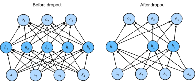

```{.python .input}
%load_ext d2lbook.tab
tab.interact_select('mxnet', 'pytorch', 'tensorflow', 'jax')
```

# Dropout
:label:`sec_dropout`


Let's think briefly about what we
expect from a good predictive model.
We want it to perform well on unseen data.
Classical generalization theory
suggests that to close the gap between
train and test performance,
we should aim for a simple model.
Simplicity can come in the form
of a small number of dimensions.
We explored this when discussing the
monomial basis functions of linear models
in :numref:`sec_generalization_basics`.
Additionally, as we saw when discussing weight decay
($\ell_2$ regularization) in :numref:`sec_weight_decay`,
the (inverse) norm of the parameters also
represents a useful measure of simplicity.
Another useful notion of simplicity is smoothness,
i.e., that the function should not be sensitive
to small changes to its inputs.
For instance, when we classify images,
we would expect that adding some random noise
to the pixels should be mostly harmless.

:citet:`Bishop.1995` formalized
this idea when he proved that training with input noise
is equivalent to Tikhonov regularization.
This work drew a clear mathematical connection
between the requirement that a function be smooth (and thus simple),
and the requirement that it be resilient
to perturbations in the input.

Then, :citet:`Srivastava.Hinton.Krizhevsky.ea.2014`
developed a clever idea for how to apply Bishop's idea
to the internal layers of a network, too.
Their idea, called *dropout*, involves
injecting noise while computing
each internal layer during forward propagation,
and it has become a standard technique
for training neural networks.
The method is called *dropout* because we literally
*drop out* some neurons during training.
Throughout training, on each iteration,
standard dropout consists of zeroing out
some fraction of the nodes in each layer
before calculating the subsequent layer.

To be clear, we are imposing
our own narrative with the link to Bishop.
The original paper on dropout
offers intuition through a surprising
analogy to sexual reproduction.
The authors argue that neural network overfitting
is characterized by a state in which
each layer relies on a specific
pattern of activations in the previous layer,
calling this condition *co-adaptation*.
Dropout, they claim, breaks up co-adaptation
just as sexual reproduction is argued to
break up co-adapted genes.
While such a justification of this theory is certainly up for debate,
the dropout technique itself has proved enduring,
and various forms of dropout are implemented
in most deep learning libraries.

A third, perhaps more illuminating, perspective is due to
:citet:`Srivastava.Hinton.Krizhevsky.ea.2014` themselves.
A network with $n$ hidden units has $2^n$ possible dropout masks,
each defining a *thinned* subnetwork that shares its weights
with all the others.
On each training step we sample one such mask,
so the gradient update nudges the shared weights
in a direction that helps that particular thinned network.
Running the full network at test time then approximates
*averaging* the predictions of all $2^n$ subnetworks.
From this angle dropout is cheap model averaging,
which is exactly why we expect it to reduce variance:
ensembles average away the idiosyncrasies of their members.


The key challenge is how to inject this noise.
One idea is to inject it in an *unbiased* manner
so that the expected value of each layer (while fixing
the others) equals the value it would have taken absent noise.
In Bishop's work, he added Gaussian noise
to the inputs to a linear model.
At each training iteration, he added noise
sampled from a distribution with mean zero
$\epsilon \sim \mathcal{N}(0,\sigma^2)$ to the input $\mathbf{x}$,
yielding a perturbed point $\mathbf{x}' = \mathbf{x} + \epsilon$.
In expectation, $E[\mathbf{x}'] = \mathbf{x}$.

In standard dropout regularization,
one zeros out some fraction of the nodes in each layer
and then *debiases* each layer by normalizing
by the fraction of nodes that were retained (not dropped out).
In other words,
with *dropout probability* $p$,
each intermediate activation $h$ is replaced by
a random variable $h'$ as follows:

$$
\begin{aligned}
h' =
\begin{cases}
    0 & \textrm{ with probability } p \\
    \frac{h}{1-p} & \textrm{ otherwise}
\end{cases}
\end{aligned}
$$

By design, the expectation remains unchanged,
since $E[h'] = p \cdot 0 + (1-p) \cdot \frac{h}{1-p} = h$.
This is why we divide by $1-p$ and by no other constant:
it is the unique factor that restores the original expected value.

```{.python .input #dropout}
%%tab mxnet
from d2l import mxnet as d2l
from mxnet import autograd, gluon, init, np, npx
from mxnet.gluon import nn
npx.set_np()
```

```{.python .input #dropout}
%%tab pytorch
from d2l import torch as d2l
import torch
from torch import nn
```

```{.python .input #dropout}
%%tab tensorflow
from d2l import tensorflow as d2l
import tensorflow as tf
```

```{.python .input #dropout}
%%tab jax
from d2l import jax as d2l
from flax import linen as nn
from functools import partial
import jax
from jax import numpy as jnp
import optax
```

## Dropout in Practice

Recall the MLP with a hidden layer and five hidden units
from :numref:`fig_mlp`.
When we apply dropout to a hidden layer,
zeroing out each hidden unit with probability $p$,
the result can be viewed as a network
containing only a subset of the original neurons.
In :numref:`fig_dropout2`, $h_2$ and $h_5$ are removed.
Consequently, the calculation of the outputs
no longer depends on $h_2$ or $h_5$
and their respective gradient also vanishes
when performing backpropagation.
In this way, the calculation of the output layer
cannot be overly dependent on any
one element of $h_1, \ldots, h_5$.


:label:`fig_dropout2`

Typically, we disable dropout at test time.
Given a trained model and a new example,
we do not drop out any nodes
and thus do not need to normalize.
However, there are some exceptions:
some researchers use dropout at test time as a heuristic
for estimating the *uncertainty* of neural network predictions:
if the predictions agree across many different dropout outputs,
then we might say that the network is more confident.

## Implementation from Scratch

To implement the dropout function for a single layer,
we must draw as many samples
from a Bernoulli (binary) random variable
as our layer has dimensions,
where the random variable takes value $1$ (keep)
with probability $1-p$ and $0$ (drop) with probability $p$.
One easy way to implement this is to first draw samples
from the uniform distribution $U[0, 1]$.
Then we can keep those nodes for which the corresponding
sample is greater than $p$, dropping the rest.

In the following code, we implement a `dropout_layer` function
that drops out the elements in the tensor input `X`
with probability `dropout`,
rescaling the remainder as described above:
dividing the survivors by `1.0-dropout`.

```{.python .input #dropout-implementation-from-scratch-1}
%%tab mxnet
def dropout_layer(X, dropout):
    assert 0 <= dropout <= 1
    if dropout == 1: return np.zeros_like(X)
    mask = np.random.uniform(0, 1, X.shape) > dropout
    return mask.astype(np.float32) * X / (1.0 - dropout)
```

```{.python .input #dropout-implementation-from-scratch-1}
%%tab pytorch
def dropout_layer(X, dropout):
    assert 0 <= dropout <= 1
    if dropout == 1: return torch.zeros_like(X)
    mask = (torch.rand(X.shape) > dropout).float()
    return mask * X / (1.0 - dropout)
```

```{.python .input #dropout-implementation-from-scratch-1}
%%tab tensorflow
def dropout_layer(X, dropout):
    assert 0 <= dropout <= 1
    if dropout == 1: return tf.zeros_like(X)
    mask = tf.random.uniform(
        shape=tf.shape(X), minval=0, maxval=1) < 1 - dropout
    return tf.cast(mask, dtype=tf.float32) * X / (1.0 - dropout)
```

```{.python .input #dropout-implementation-from-scratch-1}
%%tab jax
def dropout_layer(X, dropout, key=d2l.get_key()):
    # Note: `key` is bound at function-definition time (mutable default
    # pattern), so this educational from-scratch dropout uses one fixed
    # key for all calls — i.e. the dropout mask is identical on every
    # call, which is *not* what real training wants. That keeps the
    # function JIT-traceable — calling `d2l.get_key()` at call time would
    # mutate `d2l._master_key` and leak a tracer when invoked inside a
    # JIT'd loss. Real per-step dropout instead threads a *fresh* key for
    # each call, e.g. derive one deterministically with
    # `jax.random.fold_in(key, step)`, or — better — let Flax's
    # `nn.Dropout` handle it, which pulls a new key per step via
    # `rngs={"dropout": ...}`.
    assert 0 <= dropout <= 1
    if dropout == 1: return jnp.zeros_like(X)
    mask = jax.random.uniform(key, X.shape) > dropout
    return jnp.asarray(mask, dtype=jnp.float32) * X / (1.0 - dropout)
```

We can test out the `dropout_layer` function on a few examples.
In the following lines of code,
we pass our input `X` through the dropout operation,
with probabilities 0, 0.5, and 1, respectively.

```{.python .input #dropout-implementation-from-scratch-2}
%%tab pytorch
X = torch.arange(16, dtype = torch.float32).reshape((2, 8))
print('dropout_p = 0:', dropout_layer(X, 0))
print('dropout_p = 0.5:', dropout_layer(X, 0.5))
print('dropout_p = 1:', dropout_layer(X, 1))
```

```{.python .input #dropout-implementation-from-scratch-2}
%%tab tensorflow
X = tf.reshape(tf.range(16, dtype=tf.float32), (2, 8))
print('dropout_p = 0:', dropout_layer(X, 0))
print('dropout_p = 0.5:', dropout_layer(X, 0.5))
print('dropout_p = 1:', dropout_layer(X, 1))
```

```{.python .input #dropout-implementation-from-scratch-2}
%%tab jax
X = jnp.arange(16, dtype=jnp.float32).reshape(2, 8)
print('dropout_p = 0:', dropout_layer(X, 0))
print('dropout_p = 0.5:', dropout_layer(X, 0.5))
print('dropout_p = 1:', dropout_layer(X, 1))
```

```{.python .input #dropout-implementation-from-scratch-2}
%%tab mxnet
X = np.arange(16).reshape(2, 8)
print('dropout_p = 0:', dropout_layer(X, 0))
print('dropout_p = 0.5:', dropout_layer(X, 0.5))
print('dropout_p = 1:', dropout_layer(X, 1))
```

### Defining the Model

The model below applies dropout to the output
of each hidden layer (following the activation function).
We can set dropout probabilities for each layer separately.
A common choice is to set
a lower dropout probability closer to the input layer.
We ensure that dropout is only active during training.

```{.python .input #dropout-defining-the-model}
%%tab mxnet
class DropoutMLPScratch(d2l.Classifier):
    def __init__(self, num_outputs, num_hiddens_1, num_hiddens_2,
                 dropout_1, dropout_2, lr):
        super().__init__()
        self.save_hyperparameters()
        self.lin1 = nn.Dense(num_hiddens_1, activation='relu')
        self.lin2 = nn.Dense(num_hiddens_2, activation='relu')
        self.lin3 = nn.Dense(num_outputs)
        self.initialize()

    def forward(self, X):
        H1 = self.lin1(X)
        if autograd.is_training():
            H1 = dropout_layer(H1, self.dropout_1)
        H2 = self.lin2(H1)
        if autograd.is_training():
            H2 = dropout_layer(H2, self.dropout_2)
        return self.lin3(H2)
```

```{.python .input #dropout-defining-the-model}
%%tab pytorch
class DropoutMLPScratch(d2l.Classifier):
    def __init__(self, num_outputs, num_hiddens_1, num_hiddens_2,
                 dropout_1, dropout_2, lr):
        super().__init__()
        self.save_hyperparameters()
        self.lin1 = nn.LazyLinear(num_hiddens_1)
        self.lin2 = nn.LazyLinear(num_hiddens_2)
        self.lin3 = nn.LazyLinear(num_outputs)
        self.relu = nn.ReLU()

    def forward(self, X):
        H1 = self.relu(self.lin1(X.reshape((X.shape[0], -1))))
        if self.training:  
            H1 = dropout_layer(H1, self.dropout_1)
        H2 = self.relu(self.lin2(H1))
        if self.training:
            H2 = dropout_layer(H2, self.dropout_2)
        return self.lin3(H2)
```

```{.python .input #dropout-defining-the-model}
%%tab tensorflow
class DropoutMLPScratch(d2l.Classifier):
    def __init__(self, num_outputs, num_hiddens_1, num_hiddens_2,
                 dropout_1, dropout_2, lr):
        super().__init__()
        self.save_hyperparameters()
        self.lin1 = tf.keras.layers.Dense(num_hiddens_1, activation='relu')
        self.lin2 = tf.keras.layers.Dense(num_hiddens_2, activation='relu')
        self.lin3 = tf.keras.layers.Dense(num_outputs)

    def forward(self, X):
        H1 = self.lin1(tf.reshape(X, (tf.shape(X)[0], -1)))
        if self.training:
            H1 = dropout_layer(H1, self.dropout_1)
        H2 = self.lin2(H1)
        if self.training:
            H2 = dropout_layer(H2, self.dropout_2)
        return self.lin3(H2)
```

```{.python .input #dropout-defining-the-model}
%%tab jax
class DropoutMLPScratch(d2l.Classifier):
    num_hiddens_1: int
    num_hiddens_2: int
    num_outputs: int
    dropout_1: float
    dropout_2: float
    lr: float
    training: bool = True

    def setup(self):
        self.lin1 = nn.Dense(self.num_hiddens_1)
        self.lin2 = nn.Dense(self.num_hiddens_2)
        self.lin3 = nn.Dense(self.num_outputs)
        self.relu = nn.relu

    def forward(self, X):
        H1 = self.relu(self.lin1(X.reshape(X.shape[0], -1)))
        if self.training:
            H1 = dropout_layer(H1, self.dropout_1)
        H2 = self.relu(self.lin2(H1))
        if self.training:
            H2 = dropout_layer(H2, self.dropout_2)
        return self.lin3(H2)
```

### Training

The following is similar to the training of MLPs described previously.

```{.python .input #dropout-training}
hparams = {'num_outputs':10, 'num_hiddens_1':256, 'num_hiddens_2':256,
           'dropout_1':0.5, 'dropout_2':0.5, 'lr':0.1}
model = DropoutMLPScratch(**hparams)
data = d2l.FashionMNIST(batch_size=256)
trainer = d2l.Trainer(max_epochs=30)
trainer.fit(model, data)
```

## Concise Implementation

With high-level APIs, all we need to do is add a `Dropout` layer
after each fully connected layer,
passing in the dropout probability
as the only argument to its constructor.
During training, the `Dropout` layer will randomly
drop out outputs of the previous layer
(or equivalently, the inputs to the subsequent layer)
according to the specified dropout probability.
When not in training mode,
the `Dropout` layer simply passes the data through during testing.

```{.python .input #dropout-concise-implementation-1}
%%tab mxnet
class DropoutMLP(d2l.Classifier):
    def __init__(self, num_outputs, num_hiddens_1, num_hiddens_2,
                 dropout_1, dropout_2, lr):
        super().__init__()
        self.save_hyperparameters()
        self.net = nn.Sequential()
        self.net.add(nn.Dense(num_hiddens_1, activation="relu"),
                     nn.Dropout(dropout_1),
                     nn.Dense(num_hiddens_2, activation="relu"),
                     nn.Dropout(dropout_2),
                     nn.Dense(num_outputs))
        self.net.initialize()
```

```{.python .input #dropout-concise-implementation-1}
%%tab pytorch
class DropoutMLP(d2l.Classifier):
    def __init__(self, num_outputs, num_hiddens_1, num_hiddens_2,
                 dropout_1, dropout_2, lr):
        super().__init__()
        self.save_hyperparameters()
        self.net = nn.Sequential(
            nn.Flatten(), nn.LazyLinear(num_hiddens_1), nn.ReLU(), 
            nn.Dropout(dropout_1), nn.LazyLinear(num_hiddens_2), nn.ReLU(), 
            nn.Dropout(dropout_2), nn.LazyLinear(num_outputs))
```

```{.python .input #dropout-concise-implementation-1}
%%tab tensorflow
class DropoutMLP(d2l.Classifier):
    def __init__(self, num_outputs, num_hiddens_1, num_hiddens_2,
                 dropout_1, dropout_2, lr):
        super().__init__()
        self.save_hyperparameters()
        self.net = tf.keras.models.Sequential([
            tf.keras.layers.Flatten(),
            tf.keras.layers.Dense(num_hiddens_1, activation=tf.nn.relu),
            tf.keras.layers.Dropout(dropout_1),
            tf.keras.layers.Dense(num_hiddens_2, activation=tf.nn.relu),
            tf.keras.layers.Dropout(dropout_2),
            tf.keras.layers.Dense(num_outputs)])
```

```{.python .input #dropout-concise-implementation-1}
%%tab jax
class DropoutMLP(d2l.Classifier):
    num_hiddens_1: int
    num_hiddens_2: int
    num_outputs: int
    dropout_1: float
    dropout_2: float
    lr: float
    training: bool = True

    @nn.compact
    def __call__(self, X):
        x = nn.relu(nn.Dense(self.num_hiddens_1)(X.reshape((X.shape[0], -1))))
        x = nn.Dropout(self.dropout_1, deterministic=not self.training)(x)
        x = nn.relu(nn.Dense(self.num_hiddens_2)(x))
        x = nn.Dropout(self.dropout_2, deterministic=not self.training)(x)
        return nn.Dense(self.num_outputs)(x)
```

:begin_tab:`jax`
Note that we need to redefine the loss function since a network
with a dropout layer needs a PRNGKey when using `Module.apply()`,
and this RNG seed should be explicitly named `dropout`. This key is
used by the `dropout` layer in Flax to generate the random dropout
mask internally. It is important to use a unique `dropout_rng` key
with every epoch in the training loop, otherwise the generated dropout
mask will not be stochastic and different between the epoch runs.
This `dropout_rng` can be stored in the
`TrainState` object (in the `d2l.Trainer` class defined in
:numref:`oo-design-training`) as an attribute and with every epoch
it is replaced with a new `dropout_rng`. We already handled this with the
`fit_epoch` method defined in :numref:`sec_linear_scratch`.
:end_tab:

```{.python .input #dropout-concise-implementation-2}
%%tab jax
@d2l.add_to_class(d2l.Classifier)  #@save
@partial(jax.jit, static_argnums=(0, 5))
def loss(self, params, X, Y, state, averaged=True):
    Y_hat = state.apply_fn({'params': params}, *X,
                           mutable=False,  # To be used later (e.g., batch norm)
                           rngs={'dropout': state.dropout_rng})
    Y_hat = d2l.reshape(Y_hat, (-1, Y_hat.shape[-1]))
    Y = d2l.reshape(Y, (-1,))
    fn = optax.softmax_cross_entropy_with_integer_labels
    # The returned empty dictionary is a placeholder for auxiliary data,
    # which will be used later (e.g., for batch norm)
    return (fn(Y_hat, Y).mean(), {}) if averaged else (fn(Y_hat, Y), {})
```

Next, we train the model.

```{.python .input #dropout-concise-implementation-3}
model = DropoutMLP(**hparams)
trainer.fit(model, data)
```

## Summary

*Inverted dropout* replaces each hidden activation $h$ with a random variable
$h'$ that is zero with probability $p$ and $h/(1-p)$ otherwise. The rescaling by
$1/(1-p)$ keeps $E[h'] = h$, so the network's expected behavior at test time
matches training without any change to the test-time code. Dropout is *off at
test time*: the full network runs, with no masking and no rescaling.

Three complementary views explain why dropout helps. The first is *noise
injection*: zeroing activations at random is, following Bishop, equivalent to
Tikhonov regularization on the learned function, which favors smoothness. The
second is *anti-co-adaptation*: because no hidden unit can count on any specific
partner being present, each unit is pushed to learn broadly useful features. The
third is the *implicit ensemble*: every training step trains a different thinned
subnetwork, and evaluating the full network at test time approximates averaging
the predictions of all $2^n$ of them :cite:`Srivastava.Hinton.Krizhevsky.ea.2014`.

A word on currency. Dropout was transformative for the fully connected vision
networks of the mid-2010s, but its role has narrowed since. Convolutional
networks typically replace it with batch normalization (see
:numref:`sec_batch_norm`), which supplies similar noise-driven regularization,
and large transformer-based language models use it lightly (rates around 0.0 to
0.1) or not at all in their core layers, reserving it mostly for final
classifier heads. It nonetheless remains a cheap, reliable regularizer that
combines well with weight decay and data augmentation, and it is the conceptual
seed for a family of stochastic-regularization methods.


## Exercises

1. What happens if you change the dropout probabilities for the first and second layers? In particular, what happens if you switch the ones for both layers? Design an experiment to answer these questions, describe your results quantitatively, and summarize the qualitative takeaways.
1. Train the same architecture without dropout for the same number of epochs. Plot the train and test loss curves for both runs on the same axes. How wide is the train/test gap with and without dropout?
1. What is the variance of the activations in each hidden layer when dropout is and is not applied? Draw a plot to show how this quantity evolves over time for both models.
1. Why is dropout not typically used at test time?
1. *Monte Carlo dropout.* At test time, instead of disabling dropout, keep it on and run $T = 20$ forward passes per example, then average the softmax outputs. Compare the resulting accuracy and the calibration (predicted confidence versus actual accuracy) against the standard single-pass evaluation. How does this procedure relate to ensemble methods? (See :citet:`Gal.Ghahramani.2016`.)
1. Using the model in this section as an example, compare the effects of using dropout and weight decay. What happens when dropout and weight decay are used at the same time? Are the results additive? Are there diminished returns (or worse)? Do they cancel each other out?
1. What happens if we apply dropout to the individual weights of the weight matrix rather than the activations? (This variant is known as *DropConnect*.) Implement it and compare it against standard dropout on Fashion-MNIST, holding the architecture and training budget fixed.
1. Invent another technique for injecting random noise at each layer that differs from both dropout and DropConnect, for example adding Gaussian noise to the activations. For a fixed architecture and training budget, can you develop a method that matches or outperforms dropout on Fashion-MNIST?

:begin_tab:`mxnet`
[Discussions](https://d2l.discourse.group/t/100)
:end_tab:

:begin_tab:`pytorch`
[Discussions](https://d2l.discourse.group/t/101)
:end_tab:

:begin_tab:`tensorflow`
[Discussions](https://d2l.discourse.group/t/261)
:end_tab:

:begin_tab:`jax`
[Discussions](https://d2l.discourse.group/t/17987)
:end_tab:

<!-- slides -->

::: {.slide}
::: {.cover}
[Dive into Deep Learning · §5.6]{.kicker}

Regularizing with **dropout**<br>Randomly silence hidden units during training, and a network that would have memorized instead generalizes.
:::
:::

::: {.slide title="A network with room to memorize"}
[Motivation]{.kicker}

::: {.cols .vc}
::: {.col}
Modern nets are **overparameterized**: more weights than
training points. Past the interpolation threshold, plain
gradient descent can drive *training* error to zero by
memorizing.

::: {.d2l-note}
We want a knob that keeps capacity but discourages the
model from leaning too hard on the training set.
:::
:::

::: {.col .fig .big}

:::
:::
:::

::: {.slide title="Dropout: damage the network on purpose"}
[The idea]{.kicker}

Srivastava, Hinton et al. (2014) gave a strikingly simple
recipe:

> *Each training step, set each hidden unit to zero
> independently with probability* $p$, *then rescale the
> survivors by* $1/(1-p)$. *At test time, turn it off.*

. . .

Counterintuitive — we actively cripple the network
mid-training — yet it is one of the most reliable
regularizers ever found, and it still ships in modern
Transformers.
:::

::: {.slide}
::: {.divider}
[01]{.dnum}

[Why It Works]{.dtitle}

[three views: a thinned net, an ensemble, broken co-adaptation]{.dsub}
:::
:::

::: {.slide title="View 1: each step trains a thinned subnetwork"}
[Why It Works]{.kicker}

::: {.cols .vc}
::: {.col}
Zeroing units removes them from this step's forward and
backward pass. What is left is a *thinned* subnetwork; the
next step samples a different one.

::: {.d2l-note}
Here $h_2$ and $h_5$ are dropped, so the output cannot
depend on them — no single unit can dominate.
:::
:::

::: {.col .fig .big}

:::
:::
:::

::: {.slide title="View 2: an exponentially large ensemble"}
[Why It Works]{.kicker}

A net with $n$ hidden units has $2^n$ possible masks —
$2^n$ thinned subnetworks, all **sharing one set of
weights**.

. . .

- **Train:** sample one mask per step; the update nudges
  the shared weights to help *that* subnetwork.
- **Test:** run the full net with dropout off — this
  approximates *averaging* all $2^n$ subnetworks.

Ensembles average away their members' idiosyncrasies, so
we expect dropout to **reduce variance**. It is cheap
model averaging.
:::

::: {.slide title="View 3: noise breaks co-adaptation"}
[Why It Works]{.kicker}

Because no unit can count on any *specific* partner being
present, each is pushed to learn a feature that is useful
on its own:

- **Anti-co-adaptation** — robust, redundant features
  instead of brittle conspiracies of neurons.
- **Smoothness** — Bishop (1995) showed that injecting
  noise is equivalent to Tikhonov ($\ell_2$) regularization
  *on the learned function*.

::: {.d2l-note}
Three lenses, one mechanism: structured noise during
training.
:::
:::

::: {.slide title="The arithmetic: keep the expectation"}
[Why It Works]{.kicker}

Replace each activation $h$ with the random variable

$$h' = \begin{cases}
0 & \text{with probability } p, \\[2pt]
\dfrac{h}{1 - p} & \text{otherwise.}
\end{cases}$$

The factor $1/(1-p)$ is the *unique* constant that keeps
$\mathbb{E}[h'] = p\cdot 0 + (1-p)\dfrac{h}{1-p} = h$.

::: {.d2l-note .rule}
Unbiased by design — so test-time code needs no change.
This is **inverted dropout**, the version every modern
framework uses.
:::
:::

::: {.slide}
::: {.divider}
[02]{.dnum}

[From Scratch]{.dtitle}

[mask, rescale, and drop in the forward pass]{.dsub}
:::
:::

::: {.slide title="Setup"}
[From Scratch]{.kicker}

@dropout
:::

::: {.slide title="A dropout layer in three lines"}
[From Scratch]{.kicker}

Sample a Bernoulli keep-mask from a uniform draw, multiply,
and rescale the survivors:

@dropout-implementation-from-scratch-1

::: {.d2l-note}
`mask` keeps an entry when its $U[0,1]$ sample exceeds $p$;
dividing by $1-p$ restores the expected value.
:::
:::

::: {.slide title="Sanity check on a 2×8 input"}
[From Scratch]{.kicker}

@dropout-implementation-from-scratch-2

. . .

- $p = 0$ → identity, nothing dropped.
- $p = 0.5$ → about half the entries zero, survivors
  **doubled** ($1/(1-0.5)=2$).
- $p = 1$ → everything dropped (degenerate).
:::

::: {.slide title="Where dropout goes in an MLP"}
[From Scratch]{.kicker}

::: {.cols .vc}
::: {.col}
Apply it to each hidden layer's **output, after the
activation**:

`Linear → ReLU → Dropout → Linear → ReLU → Dropout → Linear`

::: {.d2l-note}
Convention: a smaller rate near the input (low-level
features must stay reliable), larger deeper in. Active in
training only.
:::
:::

::: {.col .fig}

:::
:::
:::

::: {.slide title="The model"}
[From Scratch]{.kicker}

Two hidden layers, dropout gated on `self.training` so it
vanishes at test time:

@dropout-defining-the-model
:::

::: {.slide title="Training it"}
[From Scratch]{.kicker}

Two 256-unit hidden layers, dropout $0.5$ between them, on
Fashion-MNIST:

@dropout-training

The train and validation curves track closely — the gap a
plain MLP of this size would show is held in check.
:::

::: {.slide}
::: {.divider}
[03]{.dnum}

[Concise]{.dtitle}

[one stock layer, train/eval handled for you]{.dsub}
:::
:::

::: {.slide title="Just add a Dropout layer"}
[Concise]{.kicker}

`nn.Dropout(p)` is a stock layer that also knows the
**train vs. eval** switch: in eval mode it becomes a
no-op, with no rescaling needed.

@dropout-concise-implementation-1
:::

::: {.slide title="JAX: dropout needs a fresh PRNG key" only="jax"}
[Concise]{.kicker}

Flax's `nn.Dropout` pulls randomness from a named
`dropout` key, so the loss threads one through
`apply`. A new key each epoch keeps the mask stochastic:

@dropout-concise-implementation-2
:::

::: {.slide title="Train the concise model"}
[Concise]{.kicker}

Same hyperparameters, same result — the layer does the
masking and rescaling internally:

@dropout-concise-implementation-3
:::

::: {.slide title="Dropout today"}
[Currency]{.kicker}

Dropout was transformative for the dense vision nets of
the mid-2010s; its role has since narrowed.

- **CNNs** mostly replace it with **batch norm**, which
  supplies similar noise-driven regularization.
- **Transformers** use it lightly (rates $0.0$–$0.1$),
  often only on the **classifier head**.

::: {.d2l-note}
Still a cheap, reliable regularizer that combines well with
weight decay and data augmentation — and the seed of a
whole family of stochastic-regularization methods.
:::
:::

::: {.slide title="Summary"}
[Wrap-up]{.kicker}

::: {.cols}
::: {.col}
- **Dropout** zeros each hidden unit with probability $p$
  during training, then rescales survivors by $1/(1-p)$.
- The rescaling keeps $\mathbb{E}[h']=h$ — **inverted
  dropout** — so test-time code is unchanged.
- **Off at test time:** the full network runs, unmasked.
:::

::: {.col}
- Place it **after the activation**, before the next
  linear layer; typical rates $0.1$–$0.5$.
- Three views: a **thinned subnetwork** each step, an
  implicit **$2^n$ ensemble**, broken **co-adaptation**.
- `nn.Dropout(p)` does it all and respects train/eval.
:::
:::
:::
