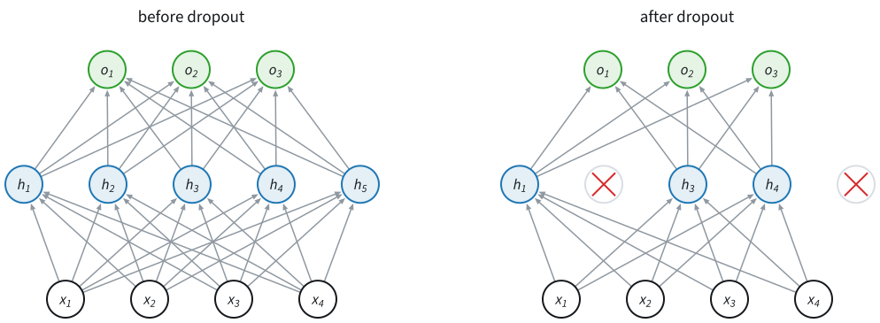
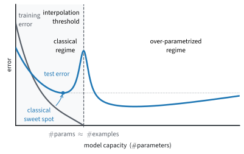
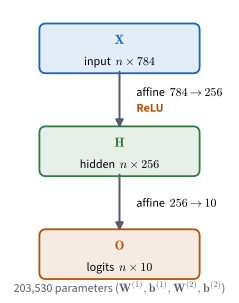

```{.python .input}
%load_ext d2lbook.tab
tab.interact_select('mxnet', 'pytorch', 'tensorflow', 'jax')
```

# Dropout
:label:`sec_dropout`


The purpose of a predictive model is to perform well on unseen data.
Classical generalization theory
suggests that to close the gap between
train and test performance,
we should aim for a simple model.
Simplicity can come in the form
of a small number of dimensions.
We explored this when discussing the
monomial basis functions of linear models
in :numref:`sec_generalization_basics`.
Additionally, as we saw when discussing weight decay
($\ell_2$ regularization) in :numref:`sec_weight_decay`,
the (inverse) norm of the parameters also
represents a useful measure of simplicity.
Another useful notion of simplicity is smoothness,
i.e., that the function should not be sensitive
to small changes to its inputs.
For instance, when we classify images,
we would expect that adding some random noise
to the pixels should be mostly harmless.

:citet:`Bishop.1995` formalized this idea for small additive input noise under
a sum-of-squares loss, where the expected noisy objective is approximated by
a generalized Tikhonov regularizer.
This work drew a clear mathematical connection
between the requirement that a function be smooth (and thus simple),
and the requirement that it be resilient
to perturbations in the input.

Building on related noise-injection ideas,
:citet:`Srivastava.Hinton.Krizhevsky.ea.2014` applied random perturbations
to a network's internal layers.
Their idea, called *dropout*, involves
injecting noise while computing
each internal layer during forward propagation,
and it has become a standard technique
for training neural networks.
The method is called *dropout* because we literally
*drop out* some neurons during training.
Throughout training, on each iteration,
standard dropout consists of zeroing out
some fraction of the nodes in each layer
before calculating the subsequent layer.

For an activation $h$ and dropout probability $p$, inverted dropout draws

$$h' = \begin{cases}0 & \text{with probability }p,\\
h/(1-p) & \text{with probability }1-p.
\end{cases}$$

Thus $\mathbb{E}[h'\mid h]=h$ exactly at this layer. The equality does not
generally extend through later nonlinear layers to the output of the whole
network.

The original paper proposed *co-adaptation* and an analogy to sexual
reproduction as motivation. These are historical intuitions, not consequences
of the dropout definition. A second interpretation treats the masked networks
as an implicit ensemble.
A network with $n$ hidden units has $2^n$ possible dropout masks,
each defining a *thinned* subnetwork that shares its weights
with all the others.
On each training step we sample one such mask,
so the gradient update nudges the shared weights
in a direction that helps that particular thinned network.
Running the full network at test time is a computational approximation motivated
by model averaging; in a nonlinear network it is not generally equal to the
arithmetic or geometric mean of all masked-network predictions. The scaling
identity is exact only at the individual dropped activation.
From this perspective, dropout approximates model averaging and may reduce
variance by combining the behavior of many subnetworks.
The analogy is loose rather than literal, though: the $2^n$
subnetworks share a single set of weights and are trained jointly,
not fit independently the way the members of a bagging ensemble are.


The key challenge is how to inject this noise.
One idea is to inject it in an *unbiased* manner
so that the expected value of each layer (while fixing
the others) equals the value it would have taken absent noise.
In Bishop's work, he added Gaussian noise
to the inputs to a linear model.
At each training iteration, he added noise
sampled from a distribution with mean zero
$\epsilon \sim \mathcal{N}(0,\sigma^2)$ to the input $\mathbf{x}$,
yielding a perturbed point $\mathbf{x}' = \mathbf{x} + \epsilon$.
In expectation, $E[\mathbf{x}'] = \mathbf{x}$.

In standard dropout regularization,
one zeros out some fraction of the nodes in each layer
and then *debiases* each layer by normalizing
by the fraction of nodes that were retained (not dropped out).
In other words,
with *dropout probability* $p$,
each intermediate activation $h$ is replaced by
a random variable $h'$ as follows:

$$
\begin{aligned}
h' =
\begin{cases}
    0 & \textrm{ with probability } p \\
    \frac{h}{1-p} & \textrm{ otherwise}
\end{cases}
\end{aligned}
$$

By design, the expectation remains unchanged,
since $E[h'] = p \cdot 0 + (1-p) \cdot \frac{h}{1-p} = h$.
This is why we divide by $1-p$ and by no other constant:
it is the unique factor that restores the original expected value.
Applying the rescaling during *training* is known as
*inverted dropout*, and it is what every modern framework implements. The
original formulation :cite:`Srivastava.Hinton.Krizhevsky.ea.2014` left
activations untouched during training and instead multiplied the weights by
$1-p$ at *test* time. The two are equivalent in expectation, but inverting
moves all of the bookkeeping into training, so the inference code never has
to change, which is exactly why a `Dropout` layer can be a no-op in
evaluation mode.

```{.python .input #dropout}
%%tab mxnet
from d2l import mxnet as d2l
from mxnet import autograd, gluon, init, np, npx
from mxnet.gluon import nn
npx.set_np()
```

```{.python .input #dropout}
%%tab pytorch
from d2l import torch as d2l
import torch
from torch import nn
```

```{.python .input #dropout}
%%tab tensorflow
from d2l import tensorflow as d2l
import tensorflow as tf
```

```{.python .input #dropout}
%%tab jax
from d2l import jax as d2l
from flax import nnx
import jax
from jax import numpy as jnp
```

## Dropout in Practice

Recall the MLP with a hidden layer and five hidden units
from :numref:`fig_mlp`.
When we apply dropout to a hidden layer,
zeroing out each hidden unit with probability $p$,
the result can be viewed as a network
containing only a subset of the original neurons.
In :numref:`fig_dropout2`, $h_2$ and $h_5$ are removed.
Consequently, the calculation of the outputs
no longer depends on $h_2$ or $h_5$
and their respective gradient also vanishes
when performing backpropagation.
In this way, the calculation of the output layer
cannot be overly dependent on any
one element of $h_1, \ldots, h_5$.


:label:`fig_dropout2`

Typically, we disable dropout at test time,
running the full network with no masking and no rescaling.
(The exercises explore one notable exception, keeping dropout *on* at test
time to estimate prediction uncertainty.)

## Implementation from Scratch

To implement the dropout function for a single layer,
we must draw as many samples
from a Bernoulli (binary) random variable
as our layer has dimensions,
where the random variable takes value $1$ (keep)
with probability $1-p$ and $0$ (drop) with probability $p$.
One easy way to implement this is to first draw samples
from the uniform distribution $U[0, 1]$.
Then we can keep those nodes for which the corresponding
sample is greater than $p$, dropping the rest.

In the following code, we implement a `dropout_layer` function
that drops out the elements in the tensor input `X`
with probability `dropout`,
rescaling the remainder as described above:
dividing the survivors by `1.0-dropout`.

```{.python .input #dropout-implementation-from-scratch-1}
%%tab mxnet
def dropout_layer(X, dropout):
    assert 0 <= dropout <= 1
    if dropout == 1: return np.zeros_like(X)
    mask = np.random.uniform(0, 1, X.shape) > dropout
    return mask.astype(np.float32) * X / (1.0 - dropout)
```

```{.python .input #dropout-implementation-from-scratch-1}
%%tab pytorch
def dropout_layer(X, dropout):
    assert 0 <= dropout <= 1
    if dropout == 1: return torch.zeros_like(X)
    mask = (torch.rand_like(X) > dropout).to(X.dtype)
    return mask * X / (1.0 - dropout)
```

```{.python .input #dropout-implementation-from-scratch-1}
%%tab tensorflow
def dropout_layer(X, dropout):
    assert 0 <= dropout <= 1
    if dropout == 1: return tf.zeros_like(X)
    mask = tf.random.uniform(
        shape=tf.shape(X), minval=0, maxval=1) < 1 - dropout
    return tf.cast(mask, dtype=X.dtype) * X / (1.0 - dropout)
```

```{.python .input #dropout-implementation-from-scratch-1}
%%tab jax
def dropout_layer(X, dropout, key):
    assert 0 <= dropout <= 1
    if dropout == 1: return jnp.zeros_like(X)
    mask = jax.random.uniform(key, X.shape) > dropout
    return jnp.asarray(mask, dtype=X.dtype) * X / (1.0 - dropout)
```

We can test out the `dropout_layer` function on a few examples.
In the following lines of code,
we pass our input `X` through the dropout operation,
with probabilities 0, 0.5, and 1, respectively.

```{.python .input #dropout-implementation-from-scratch-2}
%%tab pytorch
X = torch.arange(16, dtype = torch.float32).reshape((2, 8))
print('dropout_p = 0:', dropout_layer(X, 0))
print('dropout_p = 0.5:', dropout_layer(X, 0.5))
print('dropout_p = 1:', dropout_layer(X, 1))
```

```{.python .input #dropout-implementation-from-scratch-2}
%%tab tensorflow
X = tf.reshape(tf.range(16, dtype=tf.float32), (2, 8))
print('dropout_p = 0:', dropout_layer(X, 0))
print('dropout_p = 0.5:', dropout_layer(X, 0.5))
print('dropout_p = 1:', dropout_layer(X, 1))
```

```{.python .input #dropout-implementation-from-scratch-2}
%%tab jax
X = jnp.arange(16, dtype=jnp.float32).reshape(2, 8)
keys = jax.random.split(d2l.get_key(), 3)
print('dropout_p = 0:', dropout_layer(X, 0, keys[0]))
print('dropout_p = 0.5:', dropout_layer(X, 0.5, keys[1]))
print('dropout_p = 1:', dropout_layer(X, 1, keys[2]))
```

```{.python .input #dropout-implementation-from-scratch-2}
%%tab mxnet
X = np.arange(16).reshape(2, 8)
print('dropout_p = 0:', dropout_layer(X, 0))
print('dropout_p = 0.5:', dropout_layer(X, 0.5))
print('dropout_p = 1:', dropout_layer(X, 1))
```

### Defining the Model

The model below applies dropout to the output
of each hidden layer (following the activation function).
We can set dropout probabilities for each layer separately.
A common choice is to set
a lower dropout probability closer to the input layer.
We ensure that dropout is only active during training.

```{.python .input #dropout-defining-the-model}
%%tab mxnet
class DropoutMLPScratch(d2l.Classifier):
    def __init__(self, num_outputs, num_hiddens_1, num_hiddens_2,
                 dropout_1, dropout_2, lr):
        super().__init__()
        self.save_hyperparameters()
        self.lin1 = nn.Dense(num_hiddens_1, activation='relu')
        self.lin2 = nn.Dense(num_hiddens_2, activation='relu')
        self.lin3 = nn.Dense(num_outputs)
        self.initialize()

    def forward(self, X):
        H1 = self.lin1(X)
        if autograd.is_training():
            H1 = dropout_layer(H1, self.dropout_1)
        H2 = self.lin2(H1)
        if autograd.is_training():
            H2 = dropout_layer(H2, self.dropout_2)
        return self.lin3(H2)
```

```{.python .input #dropout-defining-the-model}
%%tab pytorch
class DropoutMLPScratch(d2l.Classifier):
    def __init__(self, num_outputs, num_hiddens_1, num_hiddens_2,
                 dropout_1, dropout_2, lr):
        super().__init__()
        self.save_hyperparameters()
        self.lin1 = nn.LazyLinear(num_hiddens_1)
        self.lin2 = nn.LazyLinear(num_hiddens_2)
        self.lin3 = nn.LazyLinear(num_outputs)
        self.relu = nn.ReLU()

    def forward(self, X):
        H1 = self.relu(self.lin1(X.reshape((X.shape[0], -1))))
        if self.training:  
            H1 = dropout_layer(H1, self.dropout_1)
        H2 = self.relu(self.lin2(H1))
        if self.training:
            H2 = dropout_layer(H2, self.dropout_2)
        return self.lin3(H2)
```

```{.python .input #dropout-defining-the-model}
%%tab tensorflow
class DropoutMLPScratch(d2l.Classifier):
    def __init__(self, num_outputs, num_hiddens_1, num_hiddens_2,
                 dropout_1, dropout_2, lr):
        super().__init__()
        self.save_hyperparameters()
        self.lin1 = tf.keras.layers.Dense(num_hiddens_1, activation='relu')
        self.lin2 = tf.keras.layers.Dense(num_hiddens_2, activation='relu')
        self.lin3 = tf.keras.layers.Dense(num_outputs)

    def forward(self, X):
        H1 = self.lin1(tf.reshape(X, (tf.shape(X)[0], -1)))
        if self.training:
            H1 = dropout_layer(H1, self.dropout_1)
        H2 = self.lin2(H1)
        if self.training:
            H2 = dropout_layer(H2, self.dropout_2)
        return self.lin3(H2)
```

```{.python .input #dropout-defining-the-model}
%%tab jax
class DropoutMLPScratch(d2l.Classifier):
    def __init__(self, num_outputs, num_hiddens_1, num_hiddens_2,
                 dropout_1, dropout_2, lr, num_inputs=784, rngs=None):
        super().__init__()
        self.save_hyperparameters(ignore=['rngs'])
        rngs = nnx.Rngs(params=d2l.get_key(), dropout=d2l.get_key()) \
            if rngs is None else rngs
        self.lin1 = nnx.Linear(num_inputs, num_hiddens_1, rngs=rngs)
        self.lin2 = nnx.Linear(num_hiddens_1, num_hiddens_2, rngs=rngs)
        self.lin3 = nnx.Linear(num_hiddens_2, num_outputs, rngs=rngs)
        self.rngs = rngs
        self.deterministic = False

    def set_view(self, *, deterministic):
        self.deterministic = deterministic

    def forward(self, X):
        H1 = nnx.relu(self.lin1(X.reshape(X.shape[0], -1)))
        if not self.deterministic:
            H1 = dropout_layer(H1, self.dropout_1, self.rngs.dropout())
        H2 = nnx.relu(self.lin2(H1))
        if not self.deterministic:
            H2 = dropout_layer(H2, self.dropout_2, self.rngs.dropout())
        return self.lin3(H2)
```

### Training

The following is similar to the training of MLPs described previously.
Following the convention above, we drop out
the layer closer to the input more gently
($p = 0.2$) than the deeper one ($p = 0.5$).

```{.python .input #dropout-training}
%%tab mxnet
hparams = {'num_outputs':10, 'num_hiddens_1':256, 'num_hiddens_2':256,
           'dropout_1':0.2, 'dropout_2':0.5, 'lr':0.1}
model = DropoutMLPScratch(**hparams)
data = d2l.FashionMNIST(batch_size=256)
# Keep loading in-process: on spawn-based platforms (macOS, Windows) this
# transformed MXNet dataset cannot be pickled for loader workers, and the
# dataset is small enough that parallel loading buys nothing on Linux either.
data.num_workers = 0
trainer = d2l.Trainer(max_epochs=30)
trainer.fit(model, data)
```

```{.python .input #dropout-training}
%%tab pytorch, tensorflow, jax
hparams = {'num_outputs':10, 'num_hiddens_1':256, 'num_hiddens_2':256,
           'dropout_1':0.2, 'dropout_2':0.5, 'lr':0.1}
model = DropoutMLPScratch(**hparams)
data = d2l.FashionMNIST(batch_size=256)
trainer = d2l.Trainer(max_epochs=30)
trainer.fit(model, data)
```

## Concise Implementation

With high-level APIs, we add a `Dropout` layer after each fully connected
layer and pass the dropout probability to its constructor.
During training, the `Dropout` layer will randomly
drop out outputs of the previous layer
(or equivalently, the inputs to the subsequent layer)
according to the specified dropout probability.
When not in training mode,
the `Dropout` layer passes the data through unchanged during testing.

```{.python .input #dropout-concise-implementation-1}
%%tab mxnet
class DropoutMLP(d2l.Classifier):
    def __init__(self, num_outputs, num_hiddens_1, num_hiddens_2,
                 dropout_1, dropout_2, lr):
        super().__init__()
        self.save_hyperparameters()
        self.net = nn.Sequential()
        self.net.add(nn.Dense(num_hiddens_1, activation="relu"),
                     nn.Dropout(dropout_1),
                     nn.Dense(num_hiddens_2, activation="relu"),
                     nn.Dropout(dropout_2),
                     nn.Dense(num_outputs))
        self.net.initialize()
```

```{.python .input #dropout-concise-implementation-1}
%%tab pytorch
class DropoutMLP(d2l.Classifier):
    def __init__(self, num_outputs, num_hiddens_1, num_hiddens_2,
                 dropout_1, dropout_2, lr):
        super().__init__()
        self.save_hyperparameters()
        self.net = nn.Sequential(
            nn.Flatten(), nn.LazyLinear(num_hiddens_1), nn.ReLU(), 
            nn.Dropout(dropout_1), nn.LazyLinear(num_hiddens_2), nn.ReLU(), 
            nn.Dropout(dropout_2), nn.LazyLinear(num_outputs))
```

```{.python .input #dropout-concise-implementation-1}
%%tab tensorflow
class DropoutMLP(d2l.Classifier):
    def __init__(self, num_outputs, num_hiddens_1, num_hiddens_2,
                 dropout_1, dropout_2, lr):
        super().__init__()
        self.save_hyperparameters()
        self.net = tf.keras.models.Sequential([
            tf.keras.layers.Flatten(),
            tf.keras.layers.Dense(num_hiddens_1, activation=tf.nn.relu),
            tf.keras.layers.Dropout(dropout_1),
            tf.keras.layers.Dense(num_hiddens_2, activation=tf.nn.relu),
            tf.keras.layers.Dropout(dropout_2),
            tf.keras.layers.Dense(num_outputs)])
```

```{.python .input #dropout-concise-implementation-1}
%%tab jax
class DropoutMLP(d2l.Classifier):
    def __init__(self, num_outputs, num_hiddens_1, num_hiddens_2,
                 dropout_1, dropout_2, lr, num_inputs=784, rngs=None):
        super().__init__()
        self.save_hyperparameters(ignore=['rngs'])
        rngs = nnx.Rngs(params=d2l.get_key(), dropout=d2l.get_key()) \
            if rngs is None else rngs
        self.lin1 = nnx.Linear(num_inputs, num_hiddens_1, rngs=rngs)
        self.drop1 = nnx.Dropout(dropout_1, rngs=rngs)
        self.lin2 = nnx.Linear(num_hiddens_1, num_hiddens_2, rngs=rngs)
        self.drop2 = nnx.Dropout(dropout_2, rngs=rngs)
        self.lin3 = nnx.Linear(num_hiddens_2, num_outputs, rngs=rngs)

    def forward(self, X):
        X = X.reshape((X.shape[0], -1))
        X = self.drop1(nnx.relu(self.lin1(X)))
        X = self.drop2(nnx.relu(self.lin2(X)))
        return self.lin3(X)
```

:begin_tab:`jax`
NNX dropout layers own an RNG stream. Each training call advances that stream,
while the evaluation view created by `Trainer` sets `deterministic=True` and
therefore disables masking. No key needs to be threaded through the loss.
:end_tab:

Next, we train the model.

```{.python .input #dropout-concise-implementation-3}
model = DropoutMLP(**hparams)
trainer.fit(model, data)
```

## Summary

*Inverted dropout* replaces each hidden activation $h$ with a random variable
$h'$ that is zero with probability $p$ and $h/(1-p)$ otherwise. The rescaling by
$1/(1-p)$ keeps $E[h'\mid h] = h$. This is a layerwise statement; after
nonlinear downstream layers, the expected network output under dropout need
not equal the output of the full network. Dropout is *off at test time*: the
full network runs, with no masking and no rescaling.

Three complementary views explain why dropout helps. The first is *noise
injection*: zeroing activations at random injects noise, and by analogy with
Bishop's input-noise result this favors a smoother learned function (the exact
equivalence is proved only for additive input noise, not multiplicative
dropout). The
second is *anti-co-adaptation*: because no hidden unit can count on any specific
partner being present, each unit is pushed to learn broadly useful features. The
third is the historical *implicit ensemble* interpretation: every training step
trains a different thinned subnetwork. The deterministic test-time network is a
computational surrogate, not an exact average of their predictions
:cite:`Srivastava.Hinton.Krizhevsky.ea.2014`.

Dropout was important for fully connected vision networks of the mid-2010s,
but its use now depends on the architecture and training scale. Convolutional
networks often rely on data augmentation, normalization
(:numref:`sec_batch_norm`), weight decay, and stochastic depth, using dropout
selectively. These methods do not reproduce dropout's mechanism. Placement
matters when dropout and batch normalization are combined. Dropout immediately before batch
normalization can perturb the variance used to accumulate running statistics,
creating a train--evaluation mismatch in that configuration
:cite:`Li.Chen.Hu.ea.2019`.
Transformer configurations may apply dropout to embeddings, attention and
MLP blocks, or output heads, whereas some large-scale models use a rate of
zero. Dropout remains a low-cost option that can be combined with weight decay
and data augmentation, and it motivated a family of stochastic-regularization
methods.


## Exercises

1. [code] **Dropout rates and the generalization gap.** `DropoutMLP` drops
   first-layer activations with probability 0.2 and second-layer activations
   with probability 0.5.
    1. Train the same architecture with both rates set to zero for the same
       number of epochs, and plot the training and validation loss curves of
       both runs on the same axes. How does the gap between the two curves
       differ with and without dropout?
    1. Swap the two rates, and then set both to 0.5. How do the final
       validation accuracy and the gap change in each case? Which layer
       tolerates the higher rate?
1. [code] **Activation variance.** What is the variance of the activations
   in each hidden layer when dropout is and is not applied? Plot how this
   quantity evolves over training for both models.
1. **Ensemble size.** A hidden layer with $n$ units admits $2^n$ distinct
   dropout masks, and the ensemble interpretation views each mask as a
   subnetwork.
    1. How many distinct masks exist across the two hidden layers of 256
       units each in `DropoutMLP`?
    1. Training runs for 30 epochs with minibatches of 256 examples, and a
       fresh mask is drawn for every example. How many masks are sampled per
       layer during training, and what fraction of all masks is that?
    1. Using these two numbers, explain in what sense dropout does, and does
       not, train an ensemble of $2^{512}$ subnetworks.
1. [code] **Dropout at test time.** Dropout is normally disabled at test
   time, so the full network runs with no masking and no rescaling.
    1. Why is the unmasked network used for prediction rather than a single
       random mask, and in what sense does it approximate the average over
       all masks?
    1. Instead of disabling dropout, keep it on and run $T = 20$ forward
       passes per test example, then average the softmax outputs
       :cite:`Gal.Ghahramani.2016`. Compare the resulting accuracy and
       calibration (predicted confidence versus actual accuracy) against the
       standard single-pass evaluation.
    1. How does this Monte Carlo procedure relate to ensemble methods, and
       what does it cost relative to a single pass?
1. [code] **Dropout and weight decay.** Weight decay
   (:numref:`sec_weight_decay`) and dropout both regularize `DropoutMLP`, but
   by different mechanisms.
    1. With both dropout rates set to zero, add weight decay to the
       optimizer as in :numref:`sec_weight_decay` at strengths
       $\lambda \in \{10^{-4}, 10^{-3}, 10^{-2}\}$, and record the validation
       accuracy and the gap between training and validation loss for each.
       Compare with the dropout-only run at rates 0.2 and 0.5.
    1. Enable both regularizers at the same time. Are their effects additive,
       do they show diminishing returns, or do they cancel each other out?
1. [code] **Input dropout.** This section applies dropout only to
   hidden-layer activations. Add dropout on the input features, before the
   first linear layer, at a small rate such as $p = 0.1$, keeping the
   hidden-layer rates unchanged, and compare validation accuracy against
   the original configuration. Relate the outcome to the redundancy among
   neighboring pixels.
1. [code] **DropConnect.** What happens if we apply dropout to the
   individual weights of the weight matrix rather than to the activations?
   This variant is known as *DropConnect*
   :cite:`Wan.Zeiler.Zhang.LeCun.Fung.2013`. Implement it and compare it
   against standard dropout on Fashion-MNIST, holding the architecture and
   training budget fixed.
1. [code] **Visualizing co-adaptation.** Train the dropout model and a
   no-dropout model of the same architecture, then visualize each
   first-layer unit's incoming weight vector as a $28 \times 28$ image.
   Compare at least 16 units side by side for each model. Do the weights
   trained without dropout look noisier, or more redundant with one
   another, than the dropout-trained ones?

    *Adapted from Nitish Srivastava et al.,
    [Dropout: A Simple Way to Prevent Neural Networks from Overfitting](https://jmlr.org/papers/v15/srivastava14a.html),
    JMLR 2014, Section 7.1, Figure 7.*
1. [code] **Designing a noise injection.** Invent a technique for injecting
   random noise during training that differs from both dropout and
   DropConnect, for example additive Gaussian noise on the activations, or
   randomly rescaling rather than zeroing each unit's output. State the
   randomization rule and any rescaling needed to preserve the expectation
   of each activation, implement the method, and train it on Fashion-MNIST
   with the same architecture and epoch budget as this section's model.

:begin_tab:`mxnet`
[Discussions](https://d2l.discourse.group/t/100)
:end_tab:

:begin_tab:`pytorch`
[Discussions](https://d2l.discourse.group/t/101)
:end_tab:

:begin_tab:`tensorflow`
[Discussions](https://d2l.discourse.group/t/261)
:end_tab:

:begin_tab:`jax`
[Discussions](https://d2l.discourse.group/t/17987)
:end_tab:

<!-- slides -->

::: {.slide}
::: {.cover}
[Dive into Deep Learning · §5.6]{.kicker}

Regularizing with **dropout**<br>Randomly mask hidden activations during training and evaluate the full network at test time.
:::
:::

::: {.slide title="A network with room to memorize"}
[Motivation]{.kicker}

::: {.cols .vc}
::: {.col}
Modern nets are **overparameterized**: more weights than
training points. Past the interpolation threshold, plain
gradient descent can drive *training* error to zero by
memorizing.

::: {.d2l-note}
We want to retain capacity while discouraging the model from fitting
peculiarities of the training set.
:::
:::

::: {.col .fig .big}

:::
:::
:::

::: {.slide title="Dropout randomly masks hidden activations"}
[The idea]{.kicker}

Srivastava, Hinton et al. (2014) gave a simple
definition:

> *Each training step, set each hidden unit to zero
> independently with probability* $p$, *then rescale the
> survivors by* $1/(1-p)$. *At test time, turn it off.*

. . .

Although dropout removes part of the network on each training step, it
can improve generalization and is used in many Transformer configurations.
:::

::: {.slide}
::: {.divider}
[01]{.dnum}

[Why It Works]{.dtitle}

[three views: a thinned net, an ensemble, broken co-adaptation]{.dsub}
:::
:::

::: {.slide title="View 1: each step trains a thinned subnetwork"}
[Why It Works]{.kicker}

::: {.cols .vc}
::: {.col}
Zeroing units removes them from this step's forward and
backward pass. What is left is a *thinned* subnetwork; the
next step samples a different one.

::: {.d2l-note}
Here $h_2$ and $h_5$ are dropped, so the output cannot
depend on them, and no single unit can dominate.
:::
:::

::: {.col .fig .big}

:::
:::
:::

::: {.slide title="View 2: an exponentially large ensemble"}
[Why It Works]{.kicker}

A net with $n$ hidden units has $2^n$ possible masks, so
$2^n$ thinned subnetworks, all **sharing one set of
weights**. Today's model has two 256-unit layers:
$2^{512} \approx 10^{154}$ subnetworks.

. . .

- **Train:** sample one mask per step; the update nudges
  the shared weights to help *that* subnetwork.
- **Test:** run the full net with dropout off, which
  serves as a computational surrogate for the masked subnetworks.

::: {.d2l-note}
The ensemble view is historical motivation. In a nonlinear network, the full
test-time pass is not generally the arithmetic or geometric mean of the masked
networks. Only the activation-level expectation is exact.
:::
:::

::: {.slide title="View 3: noise breaks co-adaptation"}
[Why It Works]{.kicker}

Because no unit can count on any *specific* partner being
present, each is pushed to learn a feature that is useful
on its own:

- **Anti-co-adaptation:** robust, redundant features
  instead of features that only work in specific combinations.
- **Smoothness:** Bishop (1995) showed that *input*-noise
  injection is equivalent to a smoothness (Tikhonov) penalty
  on the learned function; dropout is the same idea moved
  inside the network.

::: {.d2l-note}
Three lenses, one mechanism: structured noise during
training.
:::
:::

::: {.slide title="The arithmetic: keep the expectation"}
[Why It Works]{.kicker}

Replace each activation $h$ with the random variable

$$h' = \begin{cases}
0 & \text{with probability } p, \\[2pt]
\dfrac{h}{1 - p} & \text{otherwise.}
\end{cases}$$

The factor $1/(1-p)$ is the *unique* constant that keeps
$\mathbb{E}[h'] = p\cdot 0 + (1-p)\dfrac{h}{1-p} = h$.

::: {.d2l-note .rule}
Rescaling during *training* is **inverted dropout**, what every
modern framework implements. The original 2014 formulation instead
multiplied the weights by $1-p$ at *test* time, equivalent in
expectation, but inverting moves all bookkeeping into training,
which is exactly why a `Dropout` layer can be a **no-op in eval**.
:::
:::

::: {.slide}
::: {.divider}
[02]{.dnum}

[From Scratch]{.dtitle}

[mask, rescale, and drop in the forward pass]{.dsub}
:::
:::

::: {.slide title="A dropout layer in three lines"}
[From Scratch]{.kicker}

Sample a Bernoulli keep-mask from a uniform draw, multiply, then rescale the survivors by $1/(1-p)$ to restore the expectation:

@dropout-implementation-from-scratch-1
:::

::: {.slide title="Dropout on a 2×8 input" except="tensorflow"}
[From Scratch]{.kicker}

@dropout-implementation-from-scratch-2

. . .

- $p = 0$ → identity, nothing dropped.
- $p = 0.5$ → about half the entries zero, survivors
  **doubled** ($1/(1-0.5)=2$).
- $p = 1$ → everything dropped (degenerate).
:::

::: {.slide title="Dropout on a 2×8 input" only="tensorflow"}
[From Scratch]{.kicker}

@-dropout-implementation-from-scratch-2

. . .

- $p = 0$ → identity, nothing dropped.
- $p = 0.5$ → about half the entries zero, survivors
  **doubled** ($1/(1-0.5)=2$).
- $p = 1$ → everything dropped (degenerate).
:::

::: {.slide title="Where dropout goes in an MLP"}
[From Scratch]{.kicker}

::: {.cols .vc}
::: {.col}
Apply it to each hidden layer's **output, after the
activation**:

`Linear → ReLU → Dropout → Linear → ReLU → Dropout → Linear`

::: {.d2l-note}
Convention: a smaller rate near the input (low-level
features must stay reliable), larger deeper in. Active in
training only.
:::
:::

::: {.col .fig}

:::
:::
:::

::: {.slide title="The model: two hidden layers, dropout gated on training" layout="code"}
[From Scratch]{.kicker}

`dropout_layer` slots into `forward` right after each hidden activation, guarded by the training flag so evaluation always runs the full, unmasked network:

@dropout-defining-the-model
:::

::: {.slide title="Training and validation curves with dropout"}
[From scratch · result]{.kicker}

Two 256-unit hidden layers, dropout $0.2$ after the first and $0.5$
after the second (the gentler-near-the-input convention in action),
on Fashion-MNIST:

@!dropout-training

The displayed train and validation curves track closely across 30 epochs. A
causal claim about dropout would require a seed-matched no-dropout run under the
same training settings.
:::

::: {.slide}
::: {.divider}
[03]{.dnum}

[Concise]{.dtitle}

[one stock layer, train/eval handled for you]{.dsub}
:::
:::

::: {.slide title="The framework Dropout layer"}
[Concise]{.kicker}

`nn.Dropout(p)` is a stock layer that also knows the
**train vs. eval** switch: in eval mode it becomes a
no-op, with no rescaling needed.

@dropout-concise-implementation-1
:::

::: {.slide title="Train the concise model"}
[Concise]{.kicker}

With the same hyperparameters, the layer performs the masking and
rescaling internally:

@dropout-concise-implementation-3
:::

::: {.slide title="Dropout today"}
[Current practice]{.kicker}

Dropout usage depends on the architecture, dataset size, and training
scale.

- **CNNs** often combine data augmentation, normalization, weight decay, and
  stochastic depth, using dropout selectively.
- **Transformers** may apply dropout to embeddings, attention and MLP blocks,
  or output heads. Rates from $0.0$–$0.1$ are common, while some large-scale
  configurations use a rate of zero.

::: {.d2l-note .warn}
In the configuration where dropout is placed **before** batch norm, masking can
distort the running variance and create an evaluation-time mismatch
(Li et al., 2019).
:::

Dropout is a low-cost regularizer that can be combined with weight decay
and data augmentation. It also motivated a broader family of stochastic
regularization methods.
:::

::: {.slide title="Summary"}
[Wrap-up]{.kicker}

::: {.cols}
::: {.col}
- **Dropout** zeros each hidden unit with probability $p$
  during training, then rescales survivors by $1/(1-p)$.
- The rescaling keeps $\mathbb{E}[h']=h$ (**inverted
  dropout**), so test-time code is unchanged.
- **Off at test time:** the full network runs, unmasked.
:::

::: {.col}
- Place it **after the activation**, before the next
  linear layer; gentler near the input ($0.2$, then $0.5$ here).
- Proposed views include a **thinned subnetwork** each step, historical ensemble
  motivation, and reduced **co-adaptation**; only the masking expectation is exact.
- `nn.Dropout(p)` does it all and respects train/eval.
:::
:::

::: {.d2l-note}
Exercise 5 keeps dropout **on** at test time:
average 20 passes, and you get uncertainty estimates (MC dropout).
Next, the Kaggle house-prices section applies the methods from this chapter,
deployed on a Kaggle competition.
:::
:::
