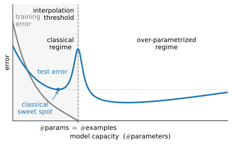
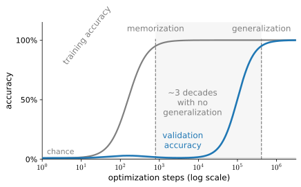

# Generalization in Deep Learning
:label:`sec_generalization_deep`

In :numref:`chap_regression` and :numref:`chap_classification`,
we tackled regression and classification problems
by fitting linear models to training data.
In both cases, we provided practical algorithms
for finding the parameters that maximized
the likelihood of the observed training labels.
And then, towards the end of each chapter,
we recalled that fitting the training data
was only an intermediate goal.
Our real quest all along was to discover *general patterns*
on the basis of which we can make accurate predictions
even on new examples drawn from the same underlying population.
Optimization is merely a means to an end: machine learning researchers
consume optimization algorithms, and sometimes invent new ones,
but always in service of a statistical goal.
At its core, machine learning is a statistical discipline
and we wish to optimize training loss only insofar
as some statistical principle (known or unknown)
leads the resulting models to generalize beyond the training set.

On the bright side, it turns out that deep neural networks
trained by stochastic gradient descent generalize well
across myriad prediction problems, spanning computer vision;
natural language processing; time series data; recommender systems;
electronic health records; protein folding;
value function approximation in video games
and board games; and numerous other domains.
On the downside, if you were looking
for a straightforward account
of either the optimization story
(why we can fit them to training data)
or the generalization story
(why the resulting models generalize to unseen examples),
then you might want to pour yourself a drink.
While our procedures for optimizing linear models
and the statistical properties of the solutions
are both described well by a comprehensive body of theory,
our understanding of deep learning
still resembles the wild west on both fronts.

Both the theory and practice of deep learning
are rapidly evolving,
with theorists adopting new strategies
to explain what's going on,
even as practitioners continue
to develop heuristics for training deep networks
and a body of empirical knowledge
that provide guidance for deciding
which techniques to apply in which situations.

The summary of the present moment is that the theory of deep learning
has produced promising lines of attack and scattered fascinating results,
but still appears far from a comprehensive account
of both (i) why we are able to optimize neural networks
and (ii) how models learned by gradient descent
manage to generalize so well, even on high-dimensional tasks.
In many benchmark settings, optimization can drive training error close to
zero, making generalization the harder unexplained part. Optimization is not
universally solved: failures remain common in very deep, constrained, or
poorly conditioned models.
On the other hand, even absent the comfort of a coherent scientific theory,
practitioners have developed a large collection of techniques
that may help you to produce models that generalize well in practice.
While no pithy summary can possibly do justice
to the vast topic of generalization in deep learning,
and while the overall state of research is far from resolved,
we hope, in this section, to present a broad overview
of the state of research and practice.

## Revisiting Overfitting and Regularization

According to the "no free lunch" theorem of :citet:`Wolpert.1996`,
any learning algorithm generalizes better on some data distributions
and worse on others.
Thus, given a finite training set,
a model must rely on assumptions, or *inductive biases*.
To achieve human-level performance
it can help to choose inductive biases
that reflect how humans think about the world.
Such inductive biases show preferences 
for solutions with certain properties.
For example,
a deep MLP has an inductive bias
towards building up a complicated function by the composition of simpler functions.

With machine learning models encoding inductive biases,
our approach to training them
typically consists of two phases: (i) fit the training data;
and (ii) estimate the *generalization error*
(the true error on the underlying population)
by evaluating the model on holdout data.
The difference between our fit on the training data
and our fit on the test data is called the *generalization gap* (:numref:`sec_generalization_basics`) and when this is large,
we say that our models *overfit* to the training data.
In extreme cases of overfitting,
we might exactly fit the training data,
even when the test error remains significant.
And in the classical view,
the interpretation is that our models are too complex,
requiring that we either shrink the number of features,
the number of nonzero parameters learned,
or the size of the parameters as quantified by their norm.
Recall the plot of model complexity compared with loss
(:numref:`fig_capacity_vs_error`)
from :numref:`sec_generalization_basics`.

However deep learning complicates this picture in counterintuitive ways.
First, some modern classification models are expressive enough
to fit every training example in large datasets
:cite:`zhang2021understanding`.
In the classical picture, we might think
that this setting lies on the far right extreme
of the model complexity axis,
and that any improvements in generalization error
must come by way of regularization,
either by reducing the complexity of the model class,
or by applying a penalty, severely constraining
the set of values that our parameters might take.
But that is where things start to get weird.

For many deep learning benchmarks, several candidate architectures can reach
nearly zero training error. Their useful differences then appear in validation
error, compute, or other deployment criteria. In some such regimes,
despite fitting the training data perfectly,
we can actually *reduce the generalization error*
further by making the model *even more expressive*,
e.g., adding layers, nodes, or training
for a larger number of epochs.
Stranger yet, the pattern relating the generalization gap
to the *complexity* of the model
(as captured, for example, in the depth or width of the networks)
can be non-monotonic,
with greater complexity hurting at first
but subsequently helping in a so-called "double-descent" pattern
:cite:`Belkin.Hsu.Ma.ea.2019,nakkiran2021deep`,
which we examine in detail below.
Thus the deep learning practitioner possesses a bag of tricks,
some of which seemingly restrict the model in some fashion
and others that seemingly make it even more expressive,
and all of which, in some sense, are applied to mitigate overfitting.

Complicating things even further,
while the guarantees provided by classical learning theory
can be conservative even for classical models,
they appear powerless to explain why it is
that deep neural networks generalize in the first place.
Because deep neural networks are capable of fitting
arbitrary labels even for large datasets,
and despite the use of familiar methods such as $\ell_2$ regularization,
worst-case complexity bounds based only on the full hypothesis class, such as
basic parameter-count VC bounds, are often vacuous at modern scales. More
data-dependent and algorithm-dependent bounds remain an active research area;
no single account yet predicts deep-network generalization across settings.
(:numref:`chap_classification_generalization` introduces these ideas;
the mechanics of the classical bounds (concentration of measure,
uniform convergence, and Rademacher complexity, with proofs) are
developed in :numref:`sec_mdl-concentration-generalization`.)

### Double Descent

Double descent is one observed departure from the simplest classical picture.
Classical theory predicts a *U-shaped* test-error curve:
as we add capacity, error first falls (we stop underfitting)
and then rises (we begin overfitting),
with a sweet spot in between
(recall :numref:`fig_capacity_vs_error` from :numref:`sec_generalization_basics`).
In some models, datasets, and training regimes, test error instead shows
*double descent*. Near the *interpolation threshold*, the smallest capacity at
which the training procedure fits the data, test error rises and may then
*descend a second time* as capacity increases. Parameter count can locate this
threshold in simple linear models, but it is not a reliable proxy for the
effective capacity of a deep network.
This non-monotone, two-valley shape is called *double descent*
:cite:`Belkin.Hsu.Ma.ea.2019`,
and it appears when we grow the model, when we train for more epochs,
and when we add more data
:cite:`nakkiran2021deep` (:numref:`fig_double_descent`).

:label:`fig_double_descent`

Why can bigger be better past the point of interpolation? In linear
least-squares and random-feature models, the minimum-norm interpolant can have
high variance near a rank transition and lower variance after more features
create additional interpolating solutions. This mechanism gives a precise
double-descent calculation, but it is a model-specific explanation rather than
a theorem about all deep networks. That calculation is developed
in :numref:`sec_mdl-concentration-generalization`;
we return below to what is known about optimizer-dependent implicit bias.

Model size, moreover, is only one of three knobs that trace out this curve.
:citet:`nakkiran2021deep` document *model-wise* double descent (grow the
network, the flavor above and the one the appendix analyzes), *epoch-wise*
double descent (fix the network and train longer: test error falls, rises as
the model begins to interpolate noise, then falls again), and *sample-wise*
double descent: adding training examples can
*hurt* test performance, because more data moves the interpolation threshold
and can push a fixed model back into the high-variance spike. All three are
organized by a single axis that Nakkiran et al. call *effective model
complexity*, roughly how many examples the full training procedure (model,
optimizer, *and* budget) can fit perfectly. The error peaks wherever
that quantity crosses the dataset size. This chapter only names the
phenomena; the appendix proves the model-wise case, and the exercises below
let you produce the epoch-wise one yourself.

## Inspiration from Nonparametrics

Approaching deep learning for the first time,
it is tempting to think of them as parametric models.
After all, the models *do* have millions of parameters.
When we update the models, we update their parameters.
When we save the models, we write their parameters to disk.
However, mathematics and computer science are riddled
with counterintuitive changes of perspective,
and surprising isomorphisms between seemingly different problems.
While neural networks clearly *have* parameters,
in some ways it can be more fruitful
to think of them as behaving like nonparametric models.
So what precisely makes a model nonparametric?
While the name covers a diverse set of approaches,
one common theme is that nonparametric methods
tend to have a level of complexity that grows
as the amount of available data grows.

Perhaps the simplest example of a nonparametric model
is the $k$-nearest neighbor algorithm (we will cover more nonparametric models later, for example in :numref:`sec_attention-pooling`).
Here, at training time,
the learner simply memorizes the dataset.
Then, at prediction time,
when confronted with a new point $\mathbf{x}$,
the learner looks up the $k$ nearest neighbors
(the $k$ points $\mathbf{x}_i'$ that minimize
some distance $d(\mathbf{x}, \mathbf{x}_i')$).
When $k=1$, this algorithm is called $1$-nearest neighbors,
and it achieves zero training error when training inputs are distinct and
ties are resolved in favor of the queried example.
That however, does not mean that the algorithm will not generalize.
In fact, it turns out that under some mild conditions,
the error of the $1$-nearest neighbor rule
comes within a factor of two of the optimal (Bayes) error
as the dataset grows :cite:`Cover.Hart.1967`,
and it is optimal in the noiseless case
where the Bayes error is zero.
(Full consistency, convergence to the optimal predictor,
requires $k$-nearest neighbors with $k \to \infty$
while $k/n \to 0$.)

Note that $1$-nearest neighbor requires that we specify
some distance function $d$, or equivalently,
that we specify some vector-valued basis function $\phi(\mathbf{x})$
for featurizing our data.
The zero-training-error statement assumes distinct training inputs and a rule
for ties. The limiting Cover--Hart guarantee also requires a suitable metric
space and regularity conditions connecting nearby inputs to their label
distributions; an arbitrary or degenerate distance need not satisfy it.
Under those conditions, $1$-nearest neighbor approaches its near-optimal limit,
but different distance metrics $d$
encode different inductive biases
and with a finite amount of available data
will yield different predictors.
Different choices of the distance metric $d$
represent different assumptions about the underlying patterns
and the performance of the different predictors
will depend on how compatible the assumptions
are with the observed data.

In a sense, because neural networks are over-parametrized,
possessing many more parameters than are needed to fit the training data,
they tend to *interpolate* the training data (fitting it perfectly)
and thus behave, in some ways, more like nonparametric models.
More recent theoretical research has established
deep connection between large neural networks
and nonparametric methods, notably kernel methods.
In particular, :citet:`Jacot.Gabriel.Hongler.2018`
demonstrated that in the limit, as multilayer perceptrons
with randomly initialized weights grow infinitely wide,
they become equivalent to (nonparametric) kernel methods
for a specific choice of the kernel function
(essentially, a distance function),
which they call the neural tangent kernel.
While current neural tangent kernel models may not fully explain
the behavior of modern deep networks,
their success as an analytical tool
shows how a nonparametric limit can help analyze
for understanding the behavior of over-parametrized deep networks.

## Early Stopping

While deep neural networks are capable of fitting arbitrary labels,
even when labels are assigned incorrectly or randomly
:cite:`zhang2021understanding`,
this capability only emerges over many iterations of training.
A line of work :cite:`Arpit.Jastrzebski.Ballas.ea.2017,Rolnick.Veit.Belongie.Shavit.2017`
has shown that in the setting of label noise,
neural networks tend to fit cleanly labeled data first
and only subsequently to interpolate the mislabeled data.
Moreover, this phenomenon can be turned into a generalization *bound*:
if a model fits the clean examples
but not deliberately mislabeled ones added to the training set,
one can *certify* (with high probability) that its population error
is small :cite:`Garg.Balakrishnan.Kolter.Lipton.2021`.

Together these findings help to motivate *early stopping*,
a classic technique for regularizing deep neural networks.
Here, rather than directly constraining the values of the weights,
one constrains the number of epochs of training.
The most common way to determine the stopping criterion
is to monitor validation error throughout training
(typically by checking once after each epoch)
and to cut off training when the validation error
has not decreased by more than some small amount $\epsilon$
for some number of epochs.
This is sometimes called a *patience criterion*.
As well as the potential to lead to better generalization
in the setting of noisy labels,
another benefit of early stopping is the time saved.
Once the patience criterion is met, one can terminate training.
For large models that might require days of training
simultaneously across eight or more GPUs,
well-tuned early stopping can save researchers days of time
and can save their employers many thousands of dollars.

Early stopping often helps when continued optimization begins to fit label
noise. Its effect is not determined by label noise alone: model mismatch,
optimization dynamics, augmentation, and the validation criterion also matter.
Natural image tasks such as distinguishing cats from dogs should not be assumed
realizable. Treat the stopping epoch as a hyperparameter selected on validation
data, and retain the parameters from the best validated epoch rather than the
last epoch examined.

## Classical Regularization Methods for Deep Networks

In :numref:`chap_regression`, we described
several  classical regularization techniques
for constraining the complexity of our models.
In particular, :numref:`sec_weight_decay`
introduced a method called weight decay,
which consists of adding a regularization term to the loss function
in order to penalize large values of the weights.
Depending on which weight norm is penalized
this technique is known either as ridge regularization (for $\ell_2$ penalty)
or lasso regularization (for an $\ell_1$ penalty).
In the classical analysis of these regularizers,
they are considered as sufficiently restrictive on the values
that the weights can take to prevent the model from fitting arbitrary labels.

In deep learning implementations,
weight decay remains a popular tool.
However, researchers have noted
that typical strengths of $\ell_2$ regularization
are insufficient to prevent the networks
from interpolating the data :cite:`zhang2021understanding`.
Their effects cannot be reduced to preventing interpolation. Depending on the
model and optimizer, weight decay changes parameter norms, margins, effective
learning rates, and the trajectory through parameter space. Early stopping is
a separate control on that trajectory. Like the number of layers or the
distance metric in 1-nearest neighbor, these choices may improve
generalization by encoding inductive biases compatible with the patterns
found in datasets of interest.
Thus, classical regularizers remain popular
in deep learning implementations,
even if the theoretical rationale
for their efficacy may be radically different.

### Implicit Regularization

A learning algorithm imposes an *implicit bias*: among many interpolating
parameters, its initialization and update rule make some solutions more likely
than others. The bias is understood sharply in a few model classes.
For linearly separable data,
gradient descent on the logistic loss provably converges
in direction to the $\ell_2$ maximum-margin separator,
even with no explicit penalty :cite:`Soudry.Hoffer.Nacson.ea.2018`.
This theorem concerns a linear predictor and does not establish that SGD finds
small-norm or well-generalizing solutions in an arbitrary deep network.
Likewise, raw parameter-space flatness changes under function-preserving
reparameterizations, so it cannot by itself explain generalization
:cite:`Dinh.Pascanu.Bengio.ea.2017`. Sharpness-aware minimization is a useful
training method :cite:`Foret.Kleiner.Mobahi.ea.2021`, but its success does not
turn flatness into a parameterization-invariant theory. Weight decay and early
stopping interact with these algorithmic biases; their effects must be measured
rather than inferred from the linear theorem.
*Grokking* illustrates this:
on small algorithmic tasks, networks first memorize the training set
and only much later, after many further steps of training,
suddenly generalize,
a reminder that optimization *dynamics* govern generalization
as much as architecture :cite:`Power.Burda.Edwards.ea.2022`.
:numref:`fig_grokking` shows the signature:
training accuracy saturates almost immediately,
while validation accuracy sits at chance for orders of magnitude more steps
before snapping to near-perfect,
long after any conventional early-stopping rule would have given up.

![The grokking phenomenon, schematically, after :citet:`Power.Burda.Edwards.ea.2022`: on a small algorithmic task, training accuracy (gray) saturates within a few hundred steps, while validation accuracy (blue) lingers near chance for several further orders of magnitude of training before rising sharply. Between *memorization* and *generalization* (dashed markers) the network interpolates its training set yet has not found the generalizing solution; continued optimization, not additional capacity or data, is what eventually finds it.](../img/mdl-mlp-grokking.svg)
:label:`fig_grokking`

Notably, deep learning researchers have also built
on techniques first popularized
in classical regularization contexts,
such as adding noise to model inputs.
In the next section we will introduce
the famous dropout technique
(invented by :citet:`Srivastava.Hinton.Krizhevsky.ea.2014`),
which has become a mainstay of deep learning,
even as the theoretical basis for its efficacy
remains similarly mysterious.

## Summary

Unlike classical linear models,
which tend to have fewer parameters than examples,
deep networks tend to be over-parametrized,
and for most tasks are capable
of perfectly fitting the training set.
This *interpolation regime* challenges
many hard-and-fast intuitions.
Functionally, neural networks look like parametric models.
But thinking of them as nonparametric models
can sometimes be a more reliable source of intuition.
Because it is often the case that all deep networks under consideration
are capable of fitting all of the training labels,
nearly all gains must come by mitigating overfitting
(closing the *generalization gap*).
Paradoxically, the interventions
that reduce the generalization gap
sometimes appear to increase model complexity
and at other times appear to decrease complexity.
However, these methods seldom decrease complexity
sufficiently for classical theory
to explain the generalization of deep networks,
and *why certain choices lead to improved generalization*
remains for the most part a massive open question
despite the concerted efforts of many brilliant researchers.

## Exercises

1. In what sense do traditional complexity-based measures fail to account for generalization of deep neural networks?
1. Why might *early stopping* be considered a regularization technique?
1. How do researchers typically determine the stopping criterion?
1. What important factor seems to differentiate cases when early stopping leads to big improvements in generalization?
1. Beyond generalization, describe another benefit of early stopping.
1. *Epoch-wise double descent.* Take the MLP of :numref:`sec_mlp-implementation` on Fashion-MNIST, randomly relabel 15% of the training examples, and train far past convergence (several hundred epochs), recording test error after every epoch. Plot test error against the epoch count on a log axis. Do you observe a second descent after the initial overfitting rise? How does the curve change with the label-noise fraction, and how does the epoch of the peak relate to when the model starts fitting the noisy labels? What does this imply for choosing an early-stopping patience?
1. (*) *Grokking.* Reproduce the setup of :citet:`Power.Burda.Edwards.ea.2022`: train a small network (they use a two-layer transformer, but a wide MLP on one-hot pairs also works) to predict $c = (a + b) \bmod 97$ from the pair $(a, b)$, using a random 50% of all pairs for training, with weight decay, for $10^5$ or more steps. Plot training and validation accuracy against the logarithm of the step count, and compare with :numref:`fig_grokking`. How does the delay before generalization change with the training fraction and with the weight-decay strength?

[Discussions](https://d2l.discourse.group/t/7473)

<!-- slides -->

::: {.slide}
::: {.cover}
[Dive into Deep Learning · §5.5]{.kicker}

Why over-parametrized networks **generalize** **double descent · the optimizer as regularizer · grokking**.
:::
:::

::: {.slide title="Optimization is a means; generalization is the goal"}
[Motivation]{.kicker}

::: {.cols .vc}
::: {.col}
Fitting the training data is only the intermediate step. The real quest
is to find patterns that **predict well on unseen data**.

- For deep networks, fitting is **easy**: they can interpolate almost
  any training set, even random labels.
- So nearly every gain comes from **closing the generalization gap**.
- Yet *why* remains a **major open question**, with two surprises
  ahead: a **second descent**, and generalization **long after**
  memorization.
:::

::: {.col .fig .big}
{width=100%}
:::
:::
:::

::: {.slide}
::: {.divider}
[01]{.dnum}

[Overfitting, revisited]{.dtitle}

[inductive bias and the interpolation regime]{.dsub}
:::
:::

::: {.slide title="No free lunch: every model needs a bias"}
[Overfitting]{.kicker}

::: {.cols .vc}
::: {.col}
No algorithm generalizes better on **all** distributions. Given finite
data, a model must lean on **inductive biases** that prefer some
solutions over others.

- A deep MLP is biased toward functions built by **composing simpler
  ones**.
- Good biases match how the world is structured.

::: {.d2l-note}
The **generalization gap** is the difference between test and training
error. A large gap means we have **overfit**.
:::
:::

::: {.col .narrow}
::: {.d2l-note .rule}
**Classical recipe** to close the gap: make the model *less* complex.

- fewer features
- fewer nonzero parameters
- smaller parameters
:::
:::
:::
:::

::: {.slide title="Deep networks strain the simplest classical picture"}
[Overfitting]{.kicker}

Modern networks can be expressive enough to fit large training sets and even
random labels.

. . .

So the classical levers behave strangely:

- Many candidate architectures reach **zero training error**, leaving their
  test behavior to distinguish them.
- Increasing capacity can lower test error in some interpolating regimes.

. . .

::: {.d2l-note .warn}
Worst-case bounds based on the complete hypothesis class are often vacuous at
modern scales. Data- and algorithm-dependent explanations remain active work.
:::
:::

::: {.slide}
::: {.divider}
[02]{.dnum}

[Double descent]{.dtitle}

[the U-curve, and what lies past it]{.dsub}
:::
:::

::: {.slide title="The classical bias-variance tradeoff"}
[Double descent]{.kicker}

::: {.cols .vc}
::: {.col}
Classical theory predicts a **U-shaped** test-error curve as capacity
grows:

$$\underbrace{\text{error}}_{\text{test}} \;=\;
\underbrace{\text{bias}^2}_{\downarrow\ \text{with capacity}} \;+\;
\underbrace{\text{variance}}_{\uparrow\ \text{with capacity}}.$$

Too little capacity **underfits**; too much **overfits**; a **sweet
spot** sits in between.
:::

::: {.col .narrow}
::: {.d2l-note}
This is the left half of the picture on the next slide, and it is *all*
the classical story predicts.
:::
:::
:::
:::

::: {.slide title="Double descent: a second curve observed in some regimes" layout="figure"}
{width=70%}
:::

::: {.slide title="One mechanism in tractable models"}
[Double descent]{.kicker}

In linear least-squares and random-feature models, the minimum-norm
interpolant can have high variance near a rank transition.

. . .

Past that transition, additional features create more interpolating
solutions, and the minimum-norm solution can have lower variance.

::: {.d2l-note .rule}
The appendix (the concentration-and-generalization section) derives this
mechanism in a specified model. It is not a theorem that every deep network
follows the same curve or selects the same kind of interpolant.
:::
:::

::: {.slide title="Three knobs trace the curve"}
[Double descent]{.kicker}

Model size is only one of **three** ways to cross the threshold (Nakkiran
et al., 2021):

- **model-wise**: grow the network (the flavor above);
- **epoch-wise**: fix the network, train longer: error falls, rises while
  the model interpolates noise, then falls again;
- **sample-wise**: **adding training examples can
  *hurt***, because more data moves the threshold and can push a fixed
  model back into the spike.

. . .

::: {.d2l-note}
Nakkiran et al. propose **effective model complexity**, how many examples the
full training procedure (model, optimizer, and budget) can fit. It organizes
their observed model-, epoch-, and sample-wise curves, but it is an empirical
account rather than a universal law.
Exercise 6 has you produce the epoch-wise flavor yourself.
:::
:::

::: {.slide}
::: {.divider}
[03]{.dnum}

[What optimization selects]{.dtitle}

[implicit bias, grokking, and its limits]{.dsub}
:::
:::

::: {.slide title="The optimizer imposes an implicit bias"}
[Implicit bias]{.kicker}

Among settings that interpolate the data, the initialization and optimizer
make some solutions more likely than others. This bias is model-dependent.

. . .

A theorem underlies it:

::: {.d2l-note .rule}
For a **linear predictor** on separable data, gradient descent on logistic loss
converges in direction to the $\ell_2$ **maximum-margin** separator, with no
explicit penalty (Soudry et al., 2018).
:::

The linear theorem does not transfer automatically to deep networks. Raw
parameter-space flatness is also changed by function-preserving
reparameterizations. Weight decay, early stopping, and methods such as SAM
interact with the optimizer's bias, and their effect is empirical.
:::

::: {.slide title="Grokking: generalization arrives orders of magnitude later"}
[Implicit bias · the second surprise]{.kicker}

::: {.cols .vc}
::: {.col .narrow}
On small algorithmic tasks, a network first **memorizes** the training
set, with test accuracy flat near chance.

Then, after **orders of magnitude more** steps at zero training loss, it
**suddenly generalizes**, long after any early-stopping rule would have
given up.

::: {.d2l-note .warn}
Same architecture, same data, same loss: only **time spent training**
changes the outcome. Dynamics, not architecture alone, govern
generalization.
:::
:::

::: {.col .fig .big}
{width=100%}
:::
:::
:::

::: {.slide title="A nonparametric lens: the neural tangent kernel"}
[Implicit bias]{.kicker}

::: {.cols .vc}
::: {.col}
Networks *have* parameters, yet often behave like **nonparametric**
models, whose complexity grows with the data.

As a randomly initialized MLP grows **infinitely wide**, it becomes
equivalent to a **kernel method** for a fixed kernel:

::: {.d2l-note .rule}
the **neural tangent kernel**, a distance function the architecture
induces.
:::
:::

::: {.col .narrow}
Memorization and generalization can coexist: **1-nearest-neighbor**
memorizes everything, achieves zero training error, and still lands
asymptotically within a **factor of two** of the optimal Bayes error
(Cover & Hart, 1967).

Over-parametrized nets likewise *interpolate*, so the nonparametric
intuition is often the more reliable one.
:::
:::
:::

::: {.slide}
::: {.divider}
[04]{.dnum}

[Regularization in practice]{.dtitle}

[early stopping and classical penalties, reinterpreted]{.dsub}
:::
:::

::: {.slide title="Early stopping: fit clean data first"}
[Practice]{.kicker}

::: {.cols .vc}
::: {.col}
With label noise, networks fit the **cleanly labeled** examples first and
only later interpolate the **mislabeled** ones.

Stop while the clean data is fit but the noise is not, and you can
**certify** generalization (with high probability).

::: {.d2l-note}
**Patience criterion:** monitor validation error each epoch; stop when it
fails to improve by $\epsilon$ for a few epochs. It also saves training
time and money.
:::
:::

::: {.col .narrow}
::: {.d2l-note .warn}
Matters most under **label noise** or intrinsic label variability. On
clean, separable data it changes little.
:::
:::
:::
:::

::: {.slide title="Classical penalties, reinterpreted"}
[Practice]{.kicker}

Weight decay adds a norm penalty to the loss:

$$\ell_2\ (\text{ridge}):\ \lambda\lVert\mathbf{w}\rVert_2^2
\qquad
\ell_1\ (\text{lasso}):\ \lambda\lVert\mathbf{w}\rVert_1.$$

. . .

But at typical strengths, $\ell_2$ is **too weak** to stop a network from
interpolating the data.

::: {.d2l-note}
So its benefit may come not from **constraining capacity** but from
**encoding a better inductive bias**, much like the choice of distance
in $k$-NN. Often it helps only **together with early stopping**. (Dropout
is the next such tool.)
:::
:::

::: {.slide title="Recap"}
[Wrap-up]{.kicker}

::: {.cols}
::: {.col}
- Many deep nets are **over-parametrized** and can interpolate their training
  sets; whether they do so depends on the training procedure.
- **Double descent** occurs in some regimes near an interpolation threshold;
  other regimes retain a U-shaped or monotone curve.
- Worst-case class-level bounds are often vacuous at modern scales; tighter
  explanations remain an open problem.
:::

::: {.col}
- **Implicit bias:** optimizers favor some interpolants. Maximum-margin
  convergence is proved for separable linear logistic regression, not for
  arbitrary deep networks.
- **Nonparametric view:** infinitely wide nets become **kernel methods**.
- **In practice:** validate early stopping and weight decay rather than
  assigning them one universal mechanism.
:::
:::

::: {.d2l-note}
Why certain choices improve generalization remains a **massive open
question**. Try the surprises yourself: exercise 6 reproduces epoch-wise
double descent; exercise 7, grokking on modular addition. Next (the dropout
section): dropout, regularization by structured noise.
:::
:::
