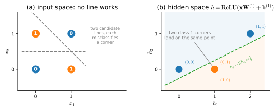
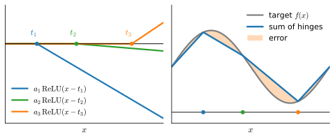

```{.python .input}
%load_ext d2lbook.tab
tab.interact_select('mxnet', 'pytorch', 'tensorflow', 'jax')
```

# Multilayer Perceptrons
:label:`sec_mlp`

In :numref:`sec_softmax`, we introduced
softmax regression,
implementing the algorithm from scratch
(:numref:`sec_softmax_scratch`) and using high-level APIs
(:numref:`sec_softmax_concise`). This allowed us to
train classifiers capable of recognizing
10 categories of clothing from low-resolution images.
Along the way, we learned how to wrangle data,
coerce our outputs into a valid probability distribution,
apply an appropriate loss function,
and minimize it with respect to our model's parameters.
Now that we have mastered these mechanics
in the context of simple linear models,
we can launch our exploration of deep neural networks,
the comparatively rich class of models
with which this book is primarily concerned.

```{.python .input #mlp-multilayer-perceptrons}
%%tab mxnet
%matplotlib inline
from d2l import mxnet as d2l
from mxnet import autograd, np, npx
npx.set_np()
```

```{.python .input #mlp-multilayer-perceptrons}
%%tab pytorch
%matplotlib inline
from d2l import torch as d2l
import torch
```

```{.python .input #mlp-multilayer-perceptrons}
%%tab tensorflow
%matplotlib inline
from d2l import tensorflow as d2l
import tensorflow as tf
```

```{.python .input #mlp-multilayer-perceptrons}
%%tab jax
%matplotlib inline
from d2l import jax as d2l
import jax
from jax import numpy as jnp
from jax import grad, vmap
```

## Hidden Layers

We described affine transformations in
:numref:`subsec_linear_model` as
linear transformations with added bias.
To begin, recall the model architecture
corresponding to our softmax regression example,
illustrated in :numref:`fig_softmaxreg`.
This model maps inputs directly to outputs
via a single affine transformation,
followed by a softmax operation.
If our labels truly were related
to the input data by a simple affine transformation,
then this approach would be sufficient.
However, linearity (in affine transformations) is a *strong* assumption.

### Limitations of Linear Models

For example, linearity implies the *weaker*
assumption of *monotonicity*, i.e.,
that any increase in our feature must
either always cause an increase in our model's output
(if the corresponding weight is positive),
or always cause a decrease in our model's output
(if the corresponding weight is negative).
Sometimes that makes sense.
For example, if we were trying to predict
whether an individual will repay a loan,
we might reasonably assume that all other things being equal,
an applicant with a higher income
would always be more likely to repay
than one with a lower income.
While monotonic, this relationship likely
is not linearly associated with the probability of
repayment. An increase in income from \$0 to \$50,000
likely corresponds to a bigger increase
in likelihood of repayment
than an increase from \$1 million to \$1.05 million.
One way to handle this might be to postprocess our outcome
such that linearity becomes more plausible,
by passing the outcome through the logistic function (i.e., modeling the log-odds linearly).

Note that we can easily come up with examples
that violate monotonicity.
Say for example that we want to predict health as a function
of body temperature.
For individuals with a normal body temperature
above 37°C (98.6°F),
higher temperatures indicate greater risk.
However, if the body temperatures drops
below 37°C, lower temperatures indicate greater risk!
Again, we might resolve the problem
with some clever preprocessing, such as using the distance from 37°C
as a feature.


But what about classifying images of cats and dogs?
Should increasing the intensity
of the pixel at location (13, 17)
always increase (or always decrease)
the likelihood that the image depicts a dog?
Reliance on a linear model corresponds to the implicit
assumption that the only requirement
for differentiating cats and dogs is to assess
the brightness of individual pixels.
This approach is doomed to fail in a world
where inverting an image preserves the category.

And yet despite the apparent absurdity of linearity here,
as compared with our previous examples,
it is less obvious that we could address the problem
with a simple preprocessing fix.
That is, because the significance of any pixel
depends in complex ways on its context
(the values of the surrounding pixels).
While there might exist a representation of our data
that would take into account
the relevant interactions among our features,
on top of which a linear model would be suitable,
we simply do not know how to calculate it by hand.
With deep neural networks, we use observational data
to jointly learn both a representation via hidden layers
and a linear predictor that acts upon that representation.

This problem of nonlinearity has been studied for at least a
century :cite:`Fisher.1928`. For instance, decision trees
in their most basic form use a sequence of binary decisions to
decide upon class membership :cite:`quinlan2014c4`. Likewise, kernel
methods have been used for many decades to model nonlinear dependencies
:cite:`Aronszajn.1950`, including nonparametric spline models
:cite:`Wahba.1990`. It is also something that the brain solves
quite naturally. After all, neurons feed into other neurons which,
in turn, feed into other neurons again :cite:`Cajal.Azoulay.1894`.
Consequently we have a sequence of relatively simple transformations.

### Incorporating Hidden Layers

We can overcome the limitations of linear models
by incorporating one or more hidden layers.
The easiest way to do this is to stack
many fully connected layers on top of one another.
Each layer feeds into the layer above it,
until we generate outputs.
We can think of the first $L-1$ layers
as our representation and the final layer
as our linear predictor.
This architecture is commonly called
a *multilayer perceptron*,
often abbreviated as *MLP* (:numref:`fig_mlp`).


:label:`fig_mlp`

This MLP has four inputs, three outputs,
and its hidden layer contains five hidden units.
Since the input layer does not involve any calculations,
producing outputs with this network
requires implementing the computations
for both the hidden and output layers;
thus, the number of layers in this MLP is two.
Note that both layers are fully connected.
Every input influences every neuron in the hidden layer,
and each of these in turn influences
every neuron in the output layer. Alas, we are not quite
done yet.

### From Linear to Nonlinear

As before, we denote by the matrix $\mathbf{X} \in \mathbb{R}^{n \times d}$
a minibatch of $n$ examples where each example has $d$ inputs (features).
For a one-hidden-layer MLP whose hidden layer has $h$ hidden units,
we denote by $\mathbf{H} \in \mathbb{R}^{n \times h}$
the outputs of the hidden layer, which are
*hidden representations*.
Since the hidden and output layers are both fully connected,
we have hidden-layer weights $\mathbf{W}^{(1)} \in \mathbb{R}^{d \times h}$ and biases $\mathbf{b}^{(1)} \in \mathbb{R}^{1 \times h}$
and output-layer weights $\mathbf{W}^{(2)} \in \mathbb{R}^{h \times q}$ and biases $\mathbf{b}^{(2)} \in \mathbb{R}^{1 \times q}$.
This allows us to calculate the outputs $\mathbf{O} \in \mathbb{R}^{n \times q}$
of the one-hidden-layer MLP as follows:

$$
\begin{aligned}
    \mathbf{H} & = \mathbf{X} \mathbf{W}^{(1)} + \mathbf{b}^{(1)}, \\
    \mathbf{O} & = \mathbf{H}\mathbf{W}^{(2)} + \mathbf{b}^{(2)}.
\end{aligned}
$$

Note that after adding the hidden layer,
our model now requires us to track and update
additional sets of parameters.
So what have we gained in exchange?
You might be surprised to find out
that (in the model defined above) *we
gain nothing for our troubles*!
The reason is plain.
The hidden units above are given by
an affine function of the inputs,
and the outputs (pre-softmax) are just
an affine function of the hidden units.
An affine function of an affine function
is itself an affine function.
Moreover, our linear model was already
capable of representing any affine function.

To see this formally we can just collapse out the hidden layer in the above definition,
yielding an equivalent single-layer model with parameters
$\mathbf{W} = \mathbf{W}^{(1)}\mathbf{W}^{(2)}$ and $\mathbf{b} = \mathbf{b}^{(1)} \mathbf{W}^{(2)} + \mathbf{b}^{(2)}$:

$$
\mathbf{O} = (\mathbf{X} \mathbf{W}^{(1)} + \mathbf{b}^{(1)})\mathbf{W}^{(2)} + \mathbf{b}^{(2)} = \mathbf{X} \mathbf{W}^{(1)}\mathbf{W}^{(2)} + \mathbf{b}^{(1)} \mathbf{W}^{(2)} + \mathbf{b}^{(2)} = \mathbf{X} \mathbf{W} + \mathbf{b}.
$$

In order to realize the potential of multilayer architectures,
we need one more key ingredient: a
nonlinear *activation function* $\sigma$
to be applied to each hidden unit
following the affine transformation. For instance, a popular
choice is the ReLU (rectified linear unit) activation function :cite:`Nair.Hinton.2010`,
operating on its arguments elementwise.
The outputs of activation functions $\sigma(\cdot)$
are called *activations*.
In general, with activation functions in place,
it is no longer possible to collapse our MLP into a linear model:

$$
\begin{aligned}
    \mathbf{H} & = \sigma(\mathbf{X} \mathbf{W}^{(1)} + \mathbf{b}^{(1)}), \\
    \mathbf{O} & = \mathbf{H}\mathbf{W}^{(2)} + \mathbf{b}^{(2)}.\\
\end{aligned}
$$

Since each row in $\mathbf{X}$ corresponds to an example in the minibatch,
with some abuse of notation, we define the nonlinearity
$\sigma$ to apply to its inputs in a rowwise fashion,
i.e., one example at a time.
Note that we used the same notation for softmax
when we denoted a rowwise operation in :numref:`subsec_softmax_vectorization`.
Quite frequently the activation functions we use apply elementwise, a special
case of rowwise. That means that after computing the linear portion of the layer,
we can calculate each activation
without looking at the values taken by the other hidden units.

To build more general MLPs, we can continue stacking
such hidden layers,
e.g., $\mathbf{H}^{(1)} = \sigma_1(\mathbf{X} \mathbf{W}^{(1)} + \mathbf{b}^{(1)})$
and $\mathbf{H}^{(2)} = \sigma_2(\mathbf{H}^{(1)} \mathbf{W}^{(2)} + \mathbf{b}^{(2)})$,
one atop another, yielding ever more expressive models.

### A Concrete Win: XOR

The collapse argument above told us what a hidden layer *cannot* do
without a nonlinearity. Let's now see what one *can* do once the
nonlinearity is in place, using the smallest problem that defeats every
linear model: the *exclusive-or* (XOR) function. Place four points at the
corners of the unit square and label each by whether its two coordinates
*differ*: $(0,0)$ and $(1,1)$ get label $0$, while $(0,1)$ and $(1,0)$ get
label $1$. As :numref:`fig_mdl-mlp-xor` shows on the left, the two classes
sit on opposite diagonals, so no straight line can put one class on each
side. A linear classifier is provably helpless here, no matter how we
choose its weights.

![XOR is not linearly separable, but one ReLU hidden layer makes it so. Left: the four corners of the unit square, coloured by the XOR label (the digit on each marker); the two classes lie on opposite diagonals, so any line misclassifies a corner. Right: the same four points after the hidden map $\mathbf{h} = \operatorname{ReLU}(\mathbf{x}\mathbf{W}^{(1)} + \mathbf{b}^{(1)})$ with $\mathbf{W}^{(1)} = \left(\begin{smallmatrix}1 & 1\\ 1 & 1\end{smallmatrix}\right)$ and $\mathbf{b}^{(1)} = (0, -1)$. The two class-1 corners are folded onto the *same* point $(1,0)$, and the cloud becomes linearly separable: the output neuron $h_1 - 2h_2$ now realizes XOR.](../img/mdl-mlp-xor.svg)
:label:`fig_mdl-mlp-xor`

A single hidden layer with just two ReLU units solves it. The trick is
that the hidden layer is free to *re-represent* the inputs, and a clever
representation can fold the two awkward corners together. The classic
choice (see :citet:`Goodfellow.Bengio.Courville.2016`, Chapter 6) uses

$$\mathbf{W}^{(1)} = \begin{pmatrix} 1 & 1 \\ 1 & 1 \end{pmatrix},
  \quad \mathbf{b}^{(1)} = \begin{pmatrix} 0 & -1 \end{pmatrix},
  \quad \mathbf{w}^{(2)} = \begin{pmatrix} 1 \\ -2 \end{pmatrix},
  \quad b^{(2)} = 0,$$

with a ReLU on the hidden layer. The first hidden unit fires for any
"active" input; the second only fires when *both* coordinates are on,
and subtracting twice the second unit cancels the lone case the first
unit gets wrong. The right panel of :numref:`fig_mdl-mlp-xor` plots the
hidden representation: the two label-1 corners land on top of each other
at $(1,0)$, after which a single line separates the classes. Let's verify
that this hand-built network computes XOR exactly on all four inputs.

```{.python .input #mlp-xor}
%%tab pytorch
X = torch.tensor([[0., 0.], [0., 1.], [1., 0.], [1., 1.]])
W1 = torch.tensor([[1., 1.], [1., 1.]])
b1 = torch.tensor([0., -1.])
w2 = torch.tensor([[1.], [-2.]])
H = torch.relu(X @ W1 + b1)          # hidden features, ReLU applied elementwise
O = (H @ w2).squeeze()               # output neuron (pre-threshold)
torch.stack([X[:, 0], X[:, 1], (O > 0.5).float()], dim=1)  # x1, x2, prediction
```

The third column is exactly the XOR of the first two. We *constructed* the
weights here, but the whole point of the rest of this book is that
optimization can *discover* such representations from data. The XOR fix
generalizes: stack nonlinear hidden layers and the network can carve the
input space into arbitrarily complicated regions.
To watch that discovery happen live, try the XOR and spiral datasets at the
[TensorFlow Playground](https://playground.tensorflow.org/), varying the
number of hidden units and layers as you go.

### Universal Approximators

How powerful is a deep network? The universal approximation theorem gives a
sharp answer. It says that even a single-hidden-layer
network, given enough hidden units and the right weights, can approximate any
continuous function on a bounded domain to arbitrary accuracy. This was proven
in several settings: :citet:`Cybenko.1989` did it for sigmoid activations,
:citet:`micchelli1984interpolation` for radial basis function networks (a single
hidden layer), and the
result was soon generalized: :citet:`Hornik.1991` covered every bounded,
non-constant activation, and :citet:`Leshno.Lin.Pinkus.ea.1993` extended it to
any activation that is not a polynomial, a form that also covers the unbounded
ReLU. The conclusion therefore does not hinge on which of ReLU, sigmoid, or tanh
we pick.

To see why such a theorem should be *plausible*, set the citations aside and
consider a one-hidden-layer ReLU network on the real line. Each hidden unit
contributes $a_k \operatorname{ReLU}(w_k x + b_k)$ to the output: a *hinge*,
flat on one side of the joint at $x = -b_k/w_k$ and linear on the other. The
network's output is a sum of $D$ such hinges, so it is a continuous piecewise
linear function whose slope can change only at a joint: with $D$ hidden units it
has at most $D$ joints and hence at most $D+1$ linear pieces. Seen this way,
approximating a continuous function is no more mysterious than approximating a
curve with a polyline: place enough joints in the right locations and pick the
right slopes, and the error shrinks as finely as we please
(:numref:`fig_mdl-mlp-uat-hinges`). The exponential-width caveat below is
visible here too: a very wiggly target needs a joint for every wiggle, one
hidden unit apiece.


:label:`fig_mdl-mlp-uat-hinges`

Width, however, buys pieces only *linearly*: one extra unit, one extra joint.
Depth is different. A second hidden layer applies its hinges not to $x$ but to
the piecewise linear output of the first layer, and composing with a hinge
*folds the graph*: every existing piece that crosses the new joint is split in
two. Each added layer can therefore roughly *double* the number of linear
pieces, so $k$ layers of width $D$ can produce on the order of
$(D+1)\,2^{k-1}$ pieces, where matching that count with a single hidden layer
would require exponentially many units. This multiplicative-versus-additive gap
is the essence of why depth pays. Both claims are easy to check numerically:
below we evaluate randomly initialized ReLU MLPs on a dense one-dimensional
grid, detect where the slope changes, and count the linear pieces.

```{.python .input #mlp-region-count}
%%tab pytorch
def count_pieces(width, depth, n=100001):
    x = torch.linspace(-4, 4, n, dtype=torch.float64).reshape(-1, 1)
    h = x
    for _ in range(depth):
        h = torch.relu(h @ torch.randn(h.shape[1], width, dtype=torch.float64)
                       + torch.randn(width, dtype=torch.float64))
    y = (h @ torch.randn(width, 1, dtype=torch.float64)).squeeze()
    slope = torch.diff(y)                     # slope of y on each grid interval
    tol = 1e-8 * slope.abs().max() + 1e-12 * y.abs().max()
    change = torch.diff(slope).abs() > tol    # a joint: the slope jumps
    new = change & ~torch.cat([torch.tensor([False]), change[:-1]])
    return int(new.sum()) + 1                 # pieces = 1 + number of joints
for depth in (1, 2, 3):
    mean = [round(sum(count_pieces(w, depth) for _ in range(20)) / 20, 1)
            for w in (2, 4, 8, 16)]
    print(f'depth {depth}: mean pieces = {mean},  D+1 = {[3, 5, 9, 17]}')
```

The first row confirms the counting argument: with one hidden layer of width
$D$, the piece count never exceeds $D+1$ (and typically comes close to it).
The later rows show depth at work: at each width, adding a layer *multiplies*
the average piece count rather than adding a constant to it. Random weights
fold far less aggressively than the best hand-crafted ones, which can multiply
the count by a factor of up to $D+1$ per layer :cite:`Telgarsky.2016`, but the
multiplicative advantage of depth over width is already unmistakable.

It is tempting to read this as "one hidden layer is all you ever need," but the
theorem is more modest than it sounds, and three caveats matter
(:citet:`Goodfellow.Bengio.Courville.2016`, Chapter 6). First, it guarantees
that a good approximation *exists*; it says nothing about whether gradient
descent will *find* it. Second, even a network that fits the training data
perfectly may fail to *generalize* to new examples. Third, the promised single
layer can be impractically wide: matching a target may require *exponentially*
many hidden units. You might think of your neural network as being a bit like
the C programming language. The language, like any other modern language, is
capable of expressing any computable program, but actually coming up with a
program that meets your specifications is the hard part.

So the theorem tells us deep networks are expressive enough; it does not tell us
they are the right tool, nor how to build them. For some problems other methods
fit better (kernel methods, for instance, can solve regression problems exactly
:cite:`Kimeldorf.Wahba.1971,Scholkopf.Herbrich.Smola.2001`). Where a shallow
network would need exponential width, a *deep* one
can often represent the same function far more compactly, trading width for depth
:cite:`Montufar.Pascanu.Cho.ea.2014,Telgarsky.2016`. This is one reason practitioners reach for depth
rather than sheer width. The folding picture sketched above is the heart of
these depth-separation results; exercise 6 asks you to turn it into an
argument.


## Activation Functions
:label:`subsec_activation-functions`

Activation functions are (almost everywhere) differentiable operators for transforming
pre-activation signals to outputs, introducing nonlinearity into the network.
Because activation functions are fundamental to deep learning,
let's briefly survey some common ones.

### ReLU Function

The most popular choice,
due to both simplicity of implementation and
its good performance on a variety of predictive tasks,
is the *rectified linear unit* (*ReLU*) :cite:`Nair.Hinton.2010`.
ReLU provides a very simple nonlinear transformation.
Given an element $x$, the function is defined
as the maximum of that element and $0$:

$$\operatorname{ReLU}(x) = \max(x, 0).$$

Informally, the ReLU function retains only positive
elements and discards all negative elements
by setting the corresponding activations to 0.
To gain some intuition, we can plot the function.
As you can see, the activation function is piecewise linear.

```{.python .input #mlp-relu-function-1}
%%tab mxnet
x = np.arange(-8.0, 8.0, 0.1)
x.attach_grad()
with autograd.record():
    y = npx.relu(x)
d2l.plot(x, y, 'x', 'relu(x)', figsize=(5, 2.5))
```

```{.python .input #mlp-relu-function-1}
%%tab pytorch
x = torch.arange(-8.0, 8.0, 0.1, requires_grad=True)
y = torch.relu(x)
d2l.plot(x.detach(), y.detach(), 'x', 'relu(x)', figsize=(5, 2.5))
```

```{.python .input #mlp-relu-function-1}
%%tab tensorflow
x = tf.Variable(tf.range(-8.0, 8.0, 0.1), dtype=tf.float32)
y = tf.nn.relu(x)
d2l.plot(x.numpy(), y.numpy(), 'x', 'relu(x)', figsize=(5, 2.5))
```

```{.python .input #mlp-relu-function-1}
%%tab jax
x = jnp.arange(-8.0, 8.0, 0.1)
y = jax.nn.relu(x)
d2l.plot(x, y, 'x', 'relu(x)', figsize=(5, 2.5))
```

When the input is negative,
the derivative of the ReLU function is 0,
and when the input is positive,
the derivative of the ReLU function is 1.
Note that the ReLU function is not differentiable
when the input takes value precisely equal to 0.
In these cases, we default to the left-hand-side
derivative and say that the derivative is 0 when the input is 0.
We can get away with this because,
although exact zeros do occur in floating-point arithmetic
(zero-initialized biases, or a ReLU feeding a ReLU),
the slope (subgradient) we assign at that single kink does not matter
(mathematicians would
say that the function is nondifferentiable only on a set of measure zero).
We plot the derivative of the ReLU function below.

```{.python .input #mlp-relu-function-2}
%%tab mxnet
y.backward()
d2l.plot(x, x.grad, 'x', 'grad of relu', figsize=(5, 2.5))
```

```{.python .input #mlp-relu-function-2}
%%tab pytorch
y.backward(torch.ones_like(x), retain_graph=True)
d2l.plot(x.detach(), x.grad, 'x', 'grad of relu', figsize=(5, 2.5))
```

```{.python .input #mlp-relu-function-2}
%%tab tensorflow
with tf.GradientTape() as t:
    y = tf.nn.relu(x)
d2l.plot(x.numpy(), t.gradient(y, x).numpy(), 'x', 'grad of relu',
         figsize=(5, 2.5))
```

```{.python .input #mlp-relu-function-2}
%%tab jax
grad_relu = vmap(grad(jax.nn.relu))
d2l.plot(x, grad_relu(x), 'x', 'grad of relu', figsize=(5, 2.5))
```

The reason for using ReLU is that
its derivatives are particularly well behaved:
either they vanish or they just let the argument through.
This makes optimization better behaved
and it mitigated the well-documented problem
of vanishing gradients that plagued
previous versions of neural networks (more on this later).

This same flatness has a downside, however. Because the gradient is exactly
zero for negative inputs, a unit whose pre-activation is pushed negative for
every training example receives no gradient and stops updating: it becomes a
permanently silent *dead ReLU*. To keep gradient flowing in that regime, a
number of variants let a little signal through on the left. The best known is
the *parametrized ReLU* (*pReLU*) :cite:`He.Zhang.Ren.ea.2015`, which adds a
linear term so some information still gets through, even when the argument is
negative:

$$\operatorname{pReLU}(x) = \max(0, x) + \alpha \min(0, x).$$

Here $\alpha$ is a small slope (fixed for *leaky* ReLU, learned for pReLU).

### Sigmoid Function

The *sigmoid function* transforms those inputs
whose values lie in the domain $\mathbb{R}$,
to outputs that lie on the interval (0, 1).
For that reason, the sigmoid is
often called a *squashing function*:
it squashes any input in the range (-inf, inf)
to some value in the range (0, 1):

$$\operatorname{sigmoid}(x) = \frac{1}{1 + \exp(-x)}.$$

In the earliest neural networks, scientists
were interested in modeling biological neurons
that either *fire* or *do not fire*.
Thus the pioneers of this field,
going all the way back to McCulloch and Pitts,
the inventors of the artificial neuron,
focused on thresholding units :cite:`McCulloch.Pitts.1943`.
A thresholding activation takes value 0
when its input is below some threshold
and value 1 when the input exceeds the threshold.

When attention shifted to gradient-based learning,
the sigmoid function was a natural choice
because it is a smooth, differentiable
approximation to a thresholding unit.
Sigmoids are still widely used as
activation functions on the output units
when we want to interpret the outputs as probabilities
for binary classification problems: you can think of the sigmoid as a special case of the softmax, namely the softmax over the two logits $\{x, 0\}$.
However, the sigmoid has largely been replaced
by the simpler and more easily trainable ReLU
for most use in hidden layers. Much of this has to do
with the fact that the sigmoid poses challenges for optimization
:cite:`LeCun.Bottou.Orr.ea.1998` since its gradient vanishes for large positive *and* negative arguments.
This can lead to plateaus that are difficult to escape from.
Nonetheless sigmoids are important. In later chapters (e.g., :numref:`sec_lstm`) on recurrent neural networks,
we will describe architectures that use sigmoid units
to control the flow of information across time.

Below, we plot the sigmoid function.
Note that when the input is close to 0,
the sigmoid function approaches
a linear transformation.

```{.python .input #mlp-sigmoid-function-1}
%%tab mxnet
with autograd.record():
    y = npx.sigmoid(x)
d2l.plot(x, y, 'x', 'sigmoid(x)', figsize=(5, 2.5))
```

```{.python .input #mlp-sigmoid-function-1}
%%tab pytorch
y = torch.sigmoid(x)
d2l.plot(x.detach(), y.detach(), 'x', 'sigmoid(x)', figsize=(5, 2.5))
```

```{.python .input #mlp-sigmoid-function-1}
%%tab tensorflow
y = tf.nn.sigmoid(x)
d2l.plot(x.numpy(), y.numpy(), 'x', 'sigmoid(x)', figsize=(5, 2.5))
```

```{.python .input #mlp-sigmoid-function-1}
%%tab jax
y = jax.nn.sigmoid(x)
d2l.plot(x, y, 'x', 'sigmoid(x)', figsize=(5, 2.5))
```

The derivative of the sigmoid function is given by the following equation:

$$\frac{d}{dx} \operatorname{sigmoid}(x) = \frac{\exp(-x)}{(1 + \exp(-x))^2} = \operatorname{sigmoid}(x)\left(1-\operatorname{sigmoid}(x)\right).$$


The derivative of the sigmoid function is plotted below.
Note that when the input is 0,
the derivative of the sigmoid function
reaches a maximum of 0.25.
As the input diverges from 0 in either direction,
the derivative approaches 0.

```{.python .input #mlp-sigmoid-function-2}
%%tab mxnet
y.backward()
d2l.plot(x, x.grad, 'x', 'grad of sigmoid', figsize=(5, 2.5))
```

```{.python .input #mlp-sigmoid-function-2}
%%tab pytorch
# Clear out previous gradients
x.grad.zero_()
y.backward(torch.ones_like(x),retain_graph=True)
d2l.plot(x.detach(), x.grad, 'x', 'grad of sigmoid', figsize=(5, 2.5))
```

```{.python .input #mlp-sigmoid-function-2}
%%tab tensorflow
with tf.GradientTape() as t:
    y = tf.nn.sigmoid(x)
d2l.plot(x.numpy(), t.gradient(y, x).numpy(), 'x', 'grad of sigmoid',
         figsize=(5, 2.5))
```

```{.python .input #mlp-sigmoid-function-2}
%%tab jax
grad_sigmoid = vmap(grad(jax.nn.sigmoid))
d2l.plot(x, grad_sigmoid(x), 'x', 'grad of sigmoid', figsize=(5, 2.5))
```

### Tanh Function
:label:`subsec_tanh`

Like the sigmoid function, the tanh (hyperbolic tangent)
function also squashes its inputs,
transforming them into elements on the interval between $-1$ and $1$:

$$\operatorname{tanh}(x) = \frac{1 - \exp(-2x)}{1 + \exp(-2x)}.$$

We plot the tanh function below. Note that as input nears 0, the tanh function approaches a linear transformation. Although the shape of the function is similar to that of the sigmoid function, the tanh function exhibits point symmetry about the origin of the coordinate system.

```{.python .input #mlp-tanh-function-1}
%%tab mxnet
with autograd.record():
    y = np.tanh(x)
d2l.plot(x, y, 'x', 'tanh(x)', figsize=(5, 2.5))
```

```{.python .input #mlp-tanh-function-1}
%%tab pytorch
y = torch.tanh(x)
d2l.plot(x.detach(), y.detach(), 'x', 'tanh(x)', figsize=(5, 2.5))
```

```{.python .input #mlp-tanh-function-1}
%%tab tensorflow
y = tf.nn.tanh(x)
d2l.plot(x.numpy(), y.numpy(), 'x', 'tanh(x)', figsize=(5, 2.5))
```

```{.python .input #mlp-tanh-function-1}
%%tab jax
y = jax.nn.tanh(x)
d2l.plot(x, y, 'x', 'tanh(x)', figsize=(5, 2.5))
```

The derivative of the tanh function is:

$$\frac{d}{dx} \operatorname{tanh}(x) = 1 - \operatorname{tanh}^2(x).$$

It is plotted below.
As the input nears 0,
the derivative of the tanh function approaches a maximum of 1.
And as we saw with the sigmoid function,
as input moves away from 0 in either direction,
the derivative of the tanh function approaches 0.

```{.python .input #mlp-tanh-function-2}
%%tab mxnet
y.backward()
d2l.plot(x, x.grad, 'x', 'grad of tanh', figsize=(5, 2.5))
```

```{.python .input #mlp-tanh-function-2}
%%tab pytorch
# Clear out previous gradients
x.grad.zero_()
y.backward(torch.ones_like(x),retain_graph=True)
d2l.plot(x.detach(), x.grad, 'x', 'grad of tanh', figsize=(5, 2.5))
```

```{.python .input #mlp-tanh-function-2}
%%tab tensorflow
with tf.GradientTape() as t:
    y = tf.nn.tanh(x)
d2l.plot(x.numpy(), t.gradient(y, x).numpy(), 'x', 'grad of tanh',
         figsize=(5, 2.5))
```

```{.python .input #mlp-tanh-function-2}
%%tab jax
grad_tanh = vmap(grad(jax.nn.tanh))
d2l.plot(x, grad_tanh(x), 'x', 'grad of tanh', figsize=(5, 2.5))
```

## Summary and Discussion

We now know how to incorporate nonlinearities
to build expressive multilayer neural network architectures.
Your knowledge already puts you in command of a toolkit
much like that of a practitioner circa 1990, except that you can lean on
powerful open-source frameworks to build models in a few lines of code,
rather than coding up layers and their derivatives by hand in C or Fortran.

A key reason ReLU displaced sigmoid and tanh in hidden layers is that it
is so much more amenable to optimization. One could argue that this was one
of the innovations that helped the resurgence of deep learning in the early
2010s. Research on activation functions has not stopped, though, and you will
meet newer ones once we reach the Transformer architectures later in the book.
The most common are *GELU* (Gaussian error linear unit), $x \Phi(x)$, where
$\Phi$ is the standard Gaussian cumulative distribution function
:cite:`Hendrycks.Gimpel.2016`, used in BERT and the GPT family; *Swish*,
$x \operatorname{sigmoid}(\beta x)$ :cite:`Ramachandran.Zoph.Le.2017`; and
*SwiGLU* :cite:`Shazeer.2020`, a gated variant that is the default feedforward nonlinearity in
recent large language models such as PaLM, LLaMA, and Mistral. For now, ReLU
remains the sensible default for the models we build next.

## Exercises

1. Show that adding layers to a *linear* deep network, i.e., a network without
   nonlinearity $\sigma$ can never increase the expressive power of the network.
   Give an example where it actively reduces it.
1. Find weights for a two-hidden-unit ReLU network that computes XOR, and verify
   them on the four inputs. (You may reuse the construction in
   :numref:`fig_mdl-mlp-xor`, but try to derive your own first.) Can a *single*
   ReLU unit compute XOR? Why or why not?
1. Compute the derivative of the pReLU activation function.
1. Compute the derivative of the Swish activation function $x \operatorname{sigmoid}(\beta x)$.
1. Show that an MLP using only ReLU (or pReLU) constructs a
   continuous piecewise linear function.
1. Explain intuitively why composing ReLU layers can roughly *double* the number
   of linear pieces the network represents with each added layer, so that depth
   buys exponentially many pieces while width buys only linearly many. (This is
   the depth-versus-width gap behind the universal-approximation caveat above.)
1. Sigmoid and tanh are very similar.
    1. Show that $\operatorname{tanh}(x) + 1 = 2 \operatorname{sigmoid}(2x)$.
    1. Prove that the function classes parametrized by both nonlinearities are identical. Hint: affine layers have bias terms, too.
1. Assume that we have a nonlinearity that applies to one minibatch at a time, such as the batch normalization :cite:`Ioffe.Szegedy.2015` (covered in :numref:`sec_batch_norm`). What kinds of problems do you expect this to cause?
1. Provide an example where the gradients vanish for the sigmoid activation function.

:begin_tab:`mxnet`
[Discussions](https://d2l.discourse.group/t/90)
:end_tab:

:begin_tab:`pytorch`
[Discussions](https://d2l.discourse.group/t/91)
:end_tab:

:begin_tab:`tensorflow`
[Discussions](https://d2l.discourse.group/t/226)
:end_tab:

:begin_tab:`jax`
[Discussions](https://d2l.discourse.group/t/17984)
:end_tab:

<!-- slides -->

::: {.slide}
::: {.cover}
[Dive into Deep Learning · §5.1]{.kicker}

Multilayer Perceptrons<br>**one kink between affine layers · XOR untangled · any function, hinge by hinge · why depth beats width**.
:::
:::

::: {.slide title="A linear model draws one straight boundary"}
[Motivation]{.kicker}

::: {.cols .vc}
::: {.col}
Softmax regression is a *single* affine map: **monotonic,
line-shaped** decisions.

- **Body temperature → risk** rises on *both* sides of 37°C.
- **Cat vs dog**: pixel $(13,17)$ means nothing without its
  neighbours.
- **XOR**: a line *provably* cannot separate it.

::: {.d2l-note .rule}
The fix: learn the features, keep the linear predictor on top.
A two-unit net computes **XOR exactly**, and
**depth multiplies** what width merely adds.
:::
:::

::: {.col .fig .big}

:::
:::
:::

::: {.slide}
::: {.divider}
[01]{.dnum}

[From Linear to Nonlinear]{.dtitle}

[hidden layers, and why they need a kink]{.dsub}
:::
:::

::: {.slide title="The idea: insert hidden layers"}
[Architecture]{.kicker}

::: {.cols .vc}
::: {.col}
Stack fully-connected layers. The middle ones are *hidden*:
neither input nor output. Every unit sees every unit below
it.

We read the first layers as a learned **representation** and
the last as a linear **predictor** on top of it.
:::

::: {.col .fig .big}

:::
:::
:::

::: {.slide title="One hidden layer, written out"}
[Architecture]{.kicker}

For a minibatch $\mathbf{X} \in \mathbb{R}^{n \times d}$,
hidden width $h$, and $q$ outputs:

$$\mathbf{H} = \mathbf{X} \mathbf{W}^{(1)} + \mathbf{b}^{(1)}, \qquad
  \mathbf{O} = \mathbf{H} \mathbf{W}^{(2)} + \mathbf{b}^{(2)}.$$

. . .

Two weight matrices, two biases. It *looks* like we have
bought ourselves a more powerful model.
:::

::: {.slide title="But two affine maps collapse into one"}
[The catch]{.kicker}

Substitute $\mathbf{H}$ into the output layer:

$$\mathbf{O} = (\mathbf{X} \mathbf{W}^{(1)} + \mathbf{b}^{(1)})\,\mathbf{W}^{(2)} + \mathbf{b}^{(2)}
            = \mathbf{X}\,\underbrace{\mathbf{W}^{(1)}\mathbf{W}^{(2)}}_{=\,\mathbf{W}} + \underbrace{\mathbf{b}^{(1)}\mathbf{W}^{(2)} + \mathbf{b}^{(2)}}_{=\,\mathbf{b}}.$$

. . .

An affine function of an affine function is **still affine**.
The hidden layer added *zero* expressive power.

::: {.d2l-note .warn}
Stacking linear layers is wasted effort: we are back to
plain softmax regression.
:::
:::

::: {.slide title="The missing ingredient: a nonlinearity"}
[The fix]{.kicker}

Apply an elementwise nonlinearity $\sigma$ *after* every
hidden affine map:

$$\mathbf{H} = \sigma\!\left(\mathbf{X} \mathbf{W}^{(1)} + \mathbf{b}^{(1)}\right),\qquad
  \mathbf{O} = \mathbf{H} \mathbf{W}^{(2)} + \mathbf{b}^{(2)}.$$

. . .

Now the layers can no longer be merged: the network bends,
folds, and curves its decision surface. Two ingredients
(**affine + nonlinear**), and every architecture in this book
follows.
:::

::: {.slide}
::: {.divider}
[02]{.dnum}

[A Concrete Win: XOR]{.dtitle}

[one ReLU layer untangles the impossible case]{.dsub}
:::
:::

::: {.slide title="XOR: impossible for a line, easy after a fold"}
[Why nonlinearity matters]{.kicker}

::: {.cols .vc}
::: {.col}
Label each corner of the unit square by whether its
coordinates *differ*. The two classes sit on **opposite
diagonals** (left), so no straight line works.

One hidden layer $\mathbf{h} = \operatorname{ReLU}(\mathbf{x}\mathbf{W}^{(1)} + \mathbf{b}^{(1)})$
then **folds** the two label-1 corners onto the same point
(right), and now a single line separates them.
:::

::: {.col .fig .big}

:::
:::
:::

::: {.slide title="First receipt: all four corners, exactly right" only="pytorch"}
[XOR · verified]{.kicker}

With $\mathbf{W}^{(1)} = \left(\begin{smallmatrix}1 & 1\\ 1 & 1\end{smallmatrix}\right)$,
$\mathbf{b}^{(1)} = (0,\,{-1})$, $\mathbf{w}^{(2)} = (1,\,{-2})^\top$ and a ReLU, the
output column is exactly the XOR of the two inputs:

@mlp-xor

::: {.d2l-note}
We *constructed* these weights; the rest of the book is about
having optimization **discover** such representations. Watch that
happen live on the XOR and spiral datasets at the *TensorFlow
Playground* (playground.tensorflow.org).
:::
:::

::: {.slide title="First receipt: all four corners, exactly right" except="pytorch"}
[XOR · verified]{.kicker}

With $\mathbf{W}^{(1)} = \left(\begin{smallmatrix}1 & 1\\ 1 & 1\end{smallmatrix}\right)$,
$\mathbf{b}^{(1)} = (0,\,{-1})$, $\mathbf{w}^{(2)} = (1,\,{-2})^\top$ and a ReLU,
pushing all four corners through by hand gives

| $x_1$ | $x_2$ | $\mathbf{h} = \operatorname{ReLU}(\mathbf{x}\mathbf{W}^{(1)} + \mathbf{b}^{(1)})$ | $o = h_1 - 2h_2$ | XOR |
|:---:|:---:|:---:|:---:|:---:|
| 0 | 0 | $(0,\ 0)$ | $0$ | **0** ✓ |
| 0 | 1 | $(1,\ 0)$ | $1$ | **1** ✓ |
| 1 | 0 | $(1,\ 0)$ | $1$ | **1** ✓ |
| 1 | 1 | $(2,\ 1)$ | $0$ | **0** ✓ |

::: {.d2l-note}
We *constructed* these weights; the rest of the book is about
having optimization **discover** such representations. Watch that
happen live on the XOR and spiral datasets at the *TensorFlow
Playground* (playground.tensorflow.org).
:::
:::

::: {.slide title="How far does this go? Universal approximation"}
[Expressive power]{.kicker}

::: {.cols .vc}
::: {.col}
**Universal approximation theorem.** A single hidden layer
with enough units can approximate any continuous function on
a bounded domain, to arbitrary accuracy, for any
non-polynomial $\sigma$, ReLU included (Cybenko 1989;
Leshno et al. 1993).
:::

::: {.col .narrow}
::: {.d2l-note .warn}
"Enough units" can be **exponentially** many; the theorem
says a fit *exists*, not that SGD finds it, nor that it
generalizes.
:::
:::
:::

. . .

This is why we reach for **depth**: a deep net often
represents the same function far more compactly than a shallow
one would, trading width for layers.
:::

::: {.slide title="Why it is plausible: one hinge at a time"}
[Expressive power]{.kicker}

Each ReLU unit contributes a **hinge** $a_k\operatorname{ReLU}(x - t_k)$: with $D$ units the output is piecewise linear with at most $D+1$ pieces. Approximating a curve is then just fitting a **polyline**: more joints, less error.

{width=88%}
:::

::: {.slide title="Second receipt: depth multiplies pieces, width only adds" only="pytorch"}
[Expressive power · verified]{.kicker}

Evaluate randomly initialized ReLU MLPs on a dense 1-D grid, detect where the slope jumps, and count the linear pieces (mean over 20 draws, widths 2–16):

@!mlp-region-count

::: {.d2l-note .rule}
One layer of width $D$: at most $D+1$ pieces, as promised. Each extra layer **folds** the graph, roughly *multiplying* the count, the multiplicative-vs-additive gap that makes depth pay.
:::
:::

::: {.slide title="Second receipt: depth multiplies pieces, width only adds" except="pytorch"}
[Expressive power · verified]{.kicker}

Evaluate randomly initialized ReLU MLPs on a dense 1-D grid, detect where the slope jumps, and count the linear pieces (mean over 20 draws):

| width $D$ | 2 | 4 | 8 | 16 |
|:---|:---:|:---:|:---:|:---:|
| bound $D+1$ | 3 | 5 | 9 | 17 |
| depth 1 | 2.6 | 4.3 | 7.5 | 14.4 |
| depth 2 | 3.5 | 7.0 | 13.9 | 27.4 |
| depth 3 | 3.6 | 8.1 | 22.1 | 40.1 |

::: {.d2l-note .rule}
One layer of width $D$: at most $D+1$ pieces, as promised. Each extra layer **folds** the graph, roughly *multiplying* the count, the multiplicative-vs-additive gap that makes depth pay.
:::
:::

::: {.slide}
::: {.divider}
[03]{.dnum}

[Activation Functions]{.dtitle}

[ReLU, sigmoid, tanh, and when to use each]{.dsub}
:::
:::

::: {.slide title="ReLU: the modern default"}
[Activations]{.kicker}

::: {.cols .vc}
::: {.col}
$$\operatorname{ReLU}(x) = \max(0, x).$$

@mlp-relu-function-1
:::

::: {.col .narrow}
Keep the positive part, zero the rest. Why it won:

- **No right-side saturation:** gradient is exactly $1$
  for $x>0$.
- **Cheap:** a single comparison, no exponential.
- **Sparse:** about half the units output $0$.
:::
:::
:::

::: {.slide title="ReLU's gradient: an on/off step" except="tensorflow"}
[Activations]{.kicker}

::: {.cols .vc}
::: {.col}
The derivative is a step: $0$ on the left, $1$ on the right:

$$\operatorname{ReLU}'(x) = \mathbb{1}[x > 0].$$

@mlp-relu-function-2
:::

::: {.col .narrow}
::: {.d2l-note .warn}
**Dead ReLU:** a unit pushed negative for *every* example
gets zero gradient forever. *LeakyReLU / PReLU*,
$\max(0,x)+\alpha\min(0,x)$, leak a little signal to keep it
alive.
:::
:::
:::
:::

::: {.slide title="ReLU's gradient: an on/off step" only="tensorflow"}
[Activations]{.kicker}

::: {.cols .vc}
::: {.col}
The derivative is a step: $0$ on the left, $1$ on the right, here computed by `GradientTape` rather than read off a formula:

$$\operatorname{ReLU}'(x) = \mathbb{1}[x > 0].$$

@!mlp-relu-function-2
:::

::: {.col .narrow}
::: {.d2l-note .warn}
**Dead ReLU:** a unit pushed negative for *every* example
gets zero gradient forever. *LeakyReLU / PReLU*,
$\max(0,x)+\alpha\min(0,x)$, leak a little signal to keep it
alive.
:::
:::
:::
:::

::: {.slide title="Sigmoid: squashing into (0, 1)"}
[Activations]{.kicker}

::: {.cols .vc}
::: {.col}
$$\operatorname{sigmoid}(x) = \frac{1}{1 + e^{-x}}.$$

@mlp-sigmoid-function-1
:::

::: {.col .narrow}
A smooth, differentiable threshold, and the original neuron
activation. Today it lives mostly at the **edges** of a net:

- **Binary output**, read as a probability.
- **Gates** in LSTM/GRU and attention.
:::
:::
:::

::: {.slide title="Why sigmoid stalls deep networks"}
[Activations · the catch]{.kicker}

::: {.cols .vc}
::: {.col}
$$\operatorname{sigmoid}'(x) = \operatorname{sigmoid}(x)\,(1 - \operatorname{sigmoid}(x)).$$

@mlp-sigmoid-function-2
:::

::: {.col .narrow}
The gradient peaks at just $0.25$ and **vanishes** past
$|x|\gtrsim 5$. Even at its best, ten stacked layers attenuate the
backward signal by $0.25^{10} \approx 10^{-6}$: the
**vanishing-gradient** problem ReLU fixed (the full story in §5.4).
:::
:::
:::

::: {.slide title="Tanh: sigmoid's zero-centered cousin"}
[Activations]{.kicker}

::: {.cols .vc}
::: {.col}
$$\tanh(x) = \frac{1 - e^{-2x}}{1 + e^{-2x}} = 2\,\operatorname{sigmoid}(2x) - 1.$$

@mlp-tanh-function-1
:::

::: {.col .narrow}
Same S-shape, but range $(-1,1)$ and **zero-centered**, which
mildly eases optimization. The default inside RNN cells, where
bounded activations help.

::: {.d2l-note .warn}
Still saturates at both tails, so its gradient vanishes just
like sigmoid's.
:::
:::
:::
:::

::: {.slide}
::: {.divider}
[04]{.dnum}

[Wrap-up]{.dtitle}

[choosing an activation, plus what comes next]{.dsub}
:::
:::

::: {.slide title="Activation cheat sheet"}
[Reference]{.kicker}

| | Range | Saturates? | Typical use |
|---|---|---|---|
| **ReLU** | $[0, \infty)$ | left only (can die) | default hidden layer |
| **LeakyReLU / PReLU** | $\mathbb{R}$ | no | when ReLU dies |
| **GELU** $\,x\Phi(x)$ | $\approx\mathbb{R}$ | barely | Transformers, LLMs |
| **Sigmoid** | $(0, 1)$ | both ends | gates, binary output |
| **Tanh** | $(-1, 1)$ | both ends | RNN cells |
| **Softmax** | simplex | one end | multiclass output |

::: {.d2l-note}
Reach for **ReLU** in hidden layers, **GELU** to mimic modern
Transformers, and **sigmoid / softmax** at the output to turn
logits into probabilities.
:::
:::

::: {.slide title="Recap"}
[Wrap-up]{.kicker}

::: {.cols}
::: {.col}
- An **MLP** = affine layers with an *elementwise*
  nonlinearity between them.
- The nonlinearity is **essential**; drop it and the stack
  collapses to one affine map.
- **XOR** is the smallest proof: one ReLU layer re-represents
  the data so a line works.
:::

::: {.col}
- One wide hidden layer is a **universal approximator**: one
  hinge per unit, $\le D+1$ pieces; depth *multiplies* pieces
  and makes that power parameter-efficient.
- **ReLU** is the default; sigmoid and tanh survive in
  gates, outputs, and RNN cells.
:::
:::

::: {.d2l-note}
Next (§5.2): build one and train it on Fashion-MNIST, from
scratch, then in a few high-level API lines.
:::
:::
